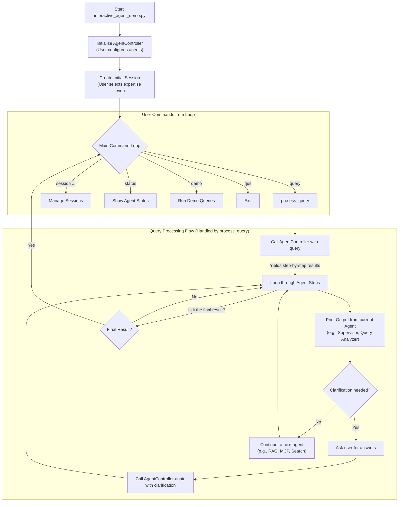

# Interactive Agent Demo Workflow

> This document breaks down the workflow of the `interactive_agent_demo.py` script.
>
> - **Branch:** `agent-system`
> - **File:** `tests/agent/interactive_agent_demo.py`
> - **Commit:** e1f09d0e3fe6cc75b4bd2e10f8c4ffea87da0b46

### High-Level Purpose

This Python script serves as an interactive command-line interface (CLI) to demonstrate and test a multi-agent AI system. It allows a user to:

- Initialize and configure the agent system (e.g., enabling/disabling different types of agents like RAG, MCP, or Search).
- Submit queries in natural language.
- Interact with the system when it needs clarification.
- Manage different conversation sessions.
- View the status of the underlying agent components.
- Run pre-defined demo queries to see various features in action.

### Workflow Visualization

This diagram illustrates the primary workflow of the script:

### Step-by-Step Workflow Breakdown

#### 1. Initialization and Setup

When the script is executed (`python tests/agent/interactive_agent_demo.py`), the `main()` function initiates the following:

1. **Instantiation**: An `InteractiveAgentDemo` object is created.
2. **Controller Initialization (`initialize_controller`)**:
    - The script prompts the user to enable or disable different agents (`RAG`, `MCP`, `Search`). The Search agent is only offered if a `TAVILY_API_KEY` is found in the environment.
    - It then creates an instance of `AgentController`, which acts as the central coordinator for the AI agents.
3. **Initial Session (`create_session`)**:
    - The user is prompted to select an expertise level (`NOVICE`, `EXPERIENCED`, `EXPERT`).
    - This choice is used to create the first session via `self.controller.create_session()`, which becomes the current active session.

#### 2. The Main Command Loop

After setup, the `run()` method enters an infinite loop to accept user commands.

- **Prompt**: It displays a prompt like `agent-demo [session-id]>`.
- **Command Parsing**: It reads the input, splits it into a command and arguments (e.g., `query` and `How do I check engine oil?`).
- **Command Dispatching**: A large `if/elif/else` block directs the flow to the appropriate method based on the command.

#### 3. The Query Processing Workflow

This is the core functional workflow, handled by the `process_query()` method.

1. **Initial Call**: When a `query` command is issued, `process_query` calls `self.controller.process_query()`. This controller method is a **generator**, yielding the output from each agent step-by-step.

2. **Iterating Through Steps**: The demo script loops through the steps yielded by the controller. For each step, it prints a header indicating which agent produced the output (e.g., `QUERY_ANALYZER AGENT:`).

3. **Clarification Check**: After an agent runs (typically the `query_analyzer`), the script inspects the output for `clarification_needed: True`.
    - **If Clarification is Needed**:
        - The script prints the clarification questions.
        - The `_handle_clarification()` method collects the user's answers.
        - The original query and the new answers are sent back to the `AgentController` in a *new* `process_query` call, and the agent processing loop continues.
    - **If No Clarification is Needed**: The workflow proceeds to the next agent as determined by the `Supervisor` (e.g., `RAG`, `MCP`, or `Search`).

4. **Completion**: This cycle of agent execution continues until a step yields a `final_result` message. At that point, the query processing is considered complete, and the script returns to the main command loop to await the next user command.

#### 4. Auxiliary Commands

The other commands provide session and system management functionalities:

- **`session new|list|switch|clear`**: These commands manage conversational contexts by calling the corresponding methods on the `AgentController`.
- **`status`**: This calls `self.controller.get_agent_status()` and prints a formatted summary of the configuration and state of all agents.
- **`demo`**: This executes `run_demo_queries()`, which cycles through a predefined list of questions to showcase the system's features.
