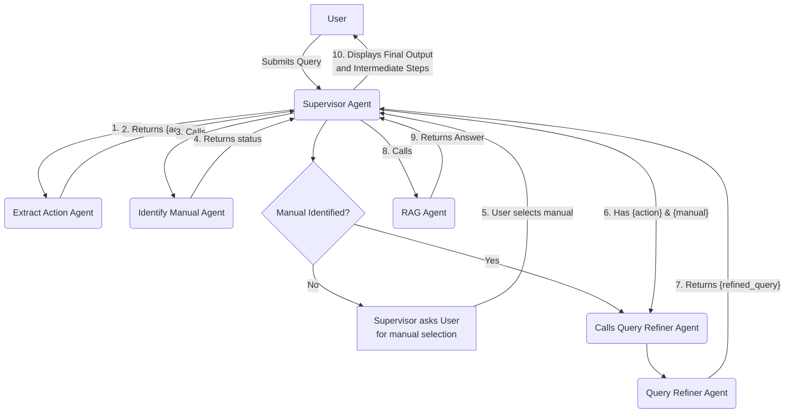
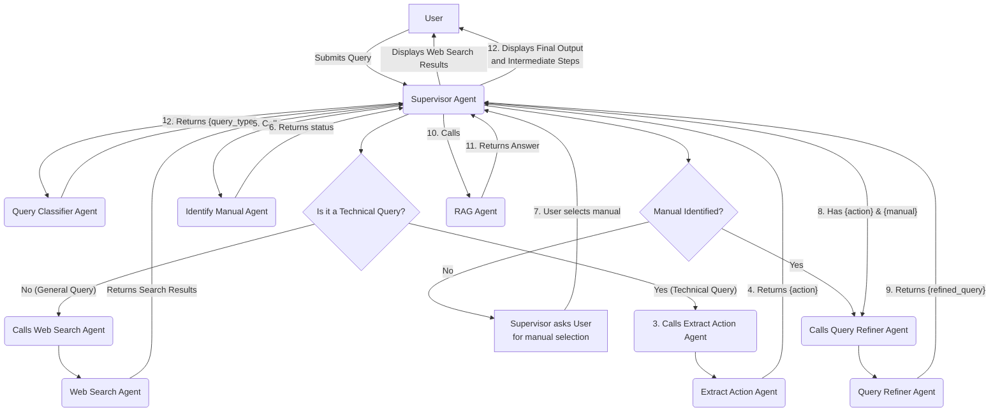
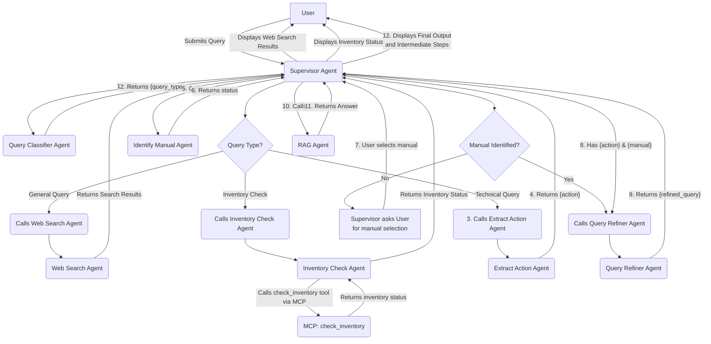

# PRD: Simplified Supervisor-Worker Agent System

## 1. Introduction/Overview

This document outlines the requirements for a new, simplified multi-agent system designed to improve the existing RAG pipeline. The current multi-agent mode is overly complex. This new implementation will replace it with a clear, deterministic supervisor-worker workflow.

The primary goal is to robustly handle user queries, even when poorly phrased, by systematically identifying the user's intent and the relevant technical manual before executing a refined query against the RAG system. This will be orchestrated by a `Supervisor` agent that directs a series of specialized "worker" agents. All agents will be powered by LLMs via OpenRouter.

## 2. Goals

* **Simplify Agent Logic:** Replace the complex agent setup with a straightforward, easy-to-debug supervisor-worker model.
* **Improve Query Robustness:** Implement a system that can understand and clarify ambiguous or incomplete user queries.
* **Enhance User Experience:** Provide transparency by showing the step-by-step process of how the system interprets the user's query and arrives at an answer.
* **Maintain Existing Functionality:** Ensure no regression bugs are introduced in the "Simple RAG" mode.

## 3. User Stories

* **Primary User Story:** As a user, when I phrase my question badly (e.g., "how do I remove timing belt"), I want the multi-agent system to help me rephrase the query better by identifying the missing context (the specific manual) and confirming the core task, so I can get the most accurate step-by-step guide.
* **Clarification Story:** As a user, if I don't specify which manual to search in, I want the system to prompt me with a clear list of available manuals so I can easily select the correct one.
* **Transparency Story:** As a developer and user, I want to see the output of each agent in the workflow, so I can understand how my initial query is being processed and trust the final result.

## 4. Functional Requirements

### 4.1. Agent Definitions

The system will consist of the following new, distinctly implemented agents. These will be created as new files and will not modify the existing agent logic.

1. **Supervisor Agent:**
    * Orchestrates the entire workflow from receiving the initial query to delivering the final answer.
    * Calls worker agents in sequence.
    * Manages the state (e.g., extracted action, identified manual).
    * Handles the user interaction loop for clarification.

2. **Extract Action Agent:**
    * Receives the original user query from the Supervisor.
    * Its sole responsibility is to identify the primary action or task the user wants to perform (e.g., "remove timing belt", "check fluid levels").
    * If it cannot confidently extract an action, it must suggest a likely action based on the query's keywords.
    * Returns the extracted `{action}` to the Supervisor.

3. **Identify Manual Agent:**
    * Receives the original user query from the Supervisor.
    * Its responsibility is to identify the target technical manual from the predefined list provided by `get_all_document_summaries()`.
    * If a manual is clearly identified, it returns the `{manual}` to the Supervisor.
    * If no manual is identified, it signals this to the Supervisor.

4. **Query Refiner Agent:**
    * Receives the `{action}` and `{manual}` from the Supervisor.
    * Its responsibility is to combine these into a single, well-formed query.
    * The output query should follow the format: "Give me step-by-step procedure to {action} based on {manual}".
    * Returns the `{refined_query}` to the Supervisor.

5. **RAG Agent:**
    * This will be a wrapper around the existing `MultimodalChromaRAGQueryEngine`.
    * It receives the `{refined_query}` from the Supervisor.
    * It executes the query against the ChromaDB vector store.
    * It returns the final answer, sources, and images to the Supervisor.

### 4.2. Workflow

1. The user submits a query in the "Multi-Agent" mode of the Streamlit app.
2. The **Supervisor Agent** receives the query.
3. The Supervisor calls the **Extract Action Agent**. The result `{action}` is stored.
4. The Supervisor calls the **Identify Manual Agent**.
    * **Scenario A (Manual Identified):** The result `{manual}` is stored. The flow proceeds to step 6.
    * **Scenario B (Manual Not Identified):** The Supervisor halts the workflow and presents the user with a dropdown list of available manuals (from `get_all_document_summaries()`).
5. **User Clarification Step:**
    * The user selects a manual from the dropdown and submits.
    * The Supervisor receives the user's selection and stores it as `{manual}`.
6. The Supervisor now has both `{action}` and `{manual}`. It calls the **Query Refiner Agent**.
7. The Query Refiner Agent returns the `{refined_query}`.
8. The Supervisor calls the **RAG Agent** with the `{refined_query}`.
9. The RAG Agent returns the final answer and sources.
10. The Supervisor formats the final output and displays it to the user, along with the intermediate steps.

### 4.2.1. Workflow Diagram (v1)



### 4.2.2. Workflow Diagram (v2)



### 4.2.3. Workflow Diagram (v3)



### 4.3. UI/UX Requirements

* The Streamlit UI must clearly display the intermediate outputs of each agent.
* An expander, similar to the existing "View Agent Workflow", shall be used.
* Each step in the expander should clearly label the agent and its specific output.
  * Example:
    * **Extract Action Agent Output:** `{'action': 'remove timing belt'}`
    * **Identify Manual Agent Output:** `{'status': 'CLARIFICATION_NEEDED'}`
    * **User Clarification:** `{'manual': 'Subaru vehicles'}`
    * **Query Refiner Agent Output:** `{'refined_query': 'Give me step-by-step procedure to remove timing belt based on Subaru vehicles'}`

## 5. Non-Goals (Out of Scope)

* This project will **not** implement general-purpose web search capabilities. The system's knowledge is strictly limited to the technical manuals in the vector database.
* This project will **not** modify the "Simple RAG" mode.
* This project will **not** involve creating a persistent memory of conversations. Each query is treated as a standalone session.

## 6. Technical Considerations

* All new agents will be implemented in new Python files within the `src/modules/agent/` directory to avoid conflicts with existing code.
* All LLM calls will be routed through the OpenRouter API. The specific models should be configurable.
* The existing `MultimodalChromaRAGQueryEngine` will be used as-is for the final retrieval step.

## 7. Success Metrics

* A successful end-to-end demonstration of the workflow described in section 4.2. The system correctly identifies the action and manual (with clarification if needed), refines the query, and retrieves a relevant answer from the RAG pipeline.
* The intermediate steps are clearly and correctly displayed in the Streamlit UI.

## 8. Open Questions

* None at this time.

## 9. Test

```bash
pytest tests/agent/test_query_classifier_agent.py tests/agent/test_web_search_agent.py tests/agent/test_simple_supervisor_agent.py
```