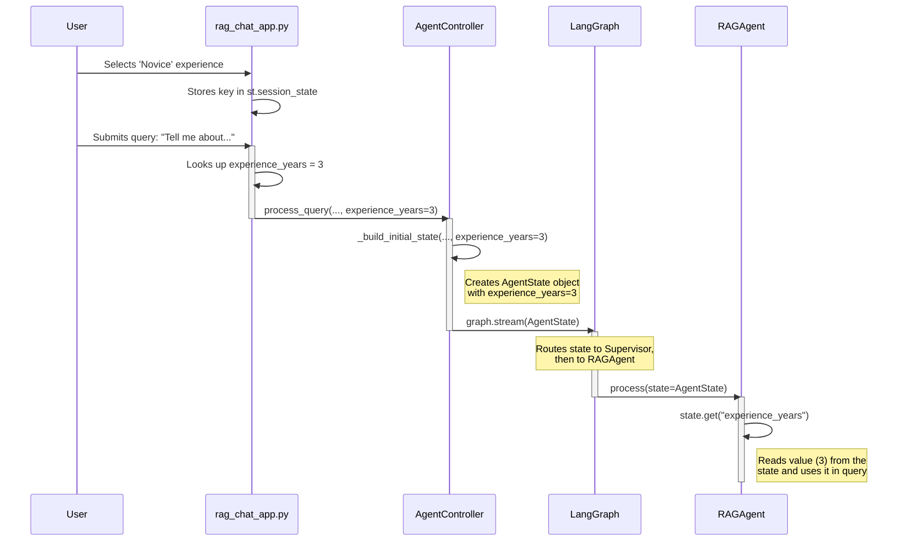

# State Flow: From UI to Agent

It's crucial to understand how information flows through the system, especially when state is passed between different components. This document outlines the journey of the `experience_years` value as an example.

## The Journey of `experience_years`

The entire process relies on the `AgentController` to act as a central orchestrator and the `AgentState` object to act as a data packet that travels between agents.

---

### Step 1: Origin in the UI (`rag_chat_app.py`)

1. A user selects an experience level from the `st.selectbox` in the "Multi-Agent" sidebar.
2. This selection updates the `st.session_state.multiagent_experience_level_key`.
3. When the user submits a query, we retrieve the corresponding `experience_years` integer from our `EXPERIENCE_LEVELS` dictionary.

    ```python
    # in src/modules/query_answering/rag_chat_app.py inside run_multi_agent_mode()

    selected_level_key = st.session_state.multiagent_experience_level_key
    experience_years = EXPERIENCE_LEVELS[selected_level_key]["years"]
    ```

---

### Step 2: Hand-off to the Controller (`rag_chat_app.py` -> `controller.py`)

The `experience_years` integer is passed as an argument directly to the `agent_controller.process_query()` method.

```python
# in src/modules/query_answering/rag_chat_app.py inside run_multi_agent_mode()

for step in st.session_state.agent_controller.process_query(
    prompt,
    st.session_state.agent_session_id,
    user_level=agent_user_level,
    experience_years=experience_years, # <-- Here it is being passed
):
    # ...
```

---

### Step 3: Packed into the State (`controller.py`)

1. The `AgentController.process_query()` method receives `experience_years`.
2. It immediately calls another internal method, `_build_initial_state()`, and passes `experience_years` to it.
3. `_build_initial_state()` creates the `AgentState` object. This is where `experience_years` is officially packed into the state that will be shared across all agents.

    ```python
    # in src/modules/agent/controller.py

    def _build_initial_state(self, ..., experience_years: int, ...) -> AgentState:
        # ...
        return AgentState(
            messages=messages,
            user_level=user_level,
            experience_years=experience_years, # <-- Packed into the state object
            session_id=session_id
        )
    ```

---

### Step 4: Sent Through the Graph (`controller.py`)

The `AgentController` starts the LangGraph workflow by calling `self.graph.stream()`, using the `AgentState` object we just created as the initial payload. From this point on, LangGraph is responsible for passing this state object to each agent (node) in the chain.

```python
# in src/modules/agent/controller.py inside process_query()

initial_state = self._build_initial_state(...)
for step_output in self.graph.stream(initial_state, config=config):
    # ...
```

---

### Step 5: Arrival at the Destination (`rag_agent.py`)

1. When the `SupervisorAgent` decides to route the task to the `rag` agent, LangGraph invokes the `RAGAgent.process()` method.
2. Crucially, it passes the entire, up-to-date `AgentState` object as the `state` argument to this method.
3. The `RAGAgent` can now simply access the `experience_years` value from the state it received.

    ```python
    # in src/modules/agent/rag_agent.py

    def process(self, state: AgentState) -> Command[Literal["supervisor"]]:
        # ...
        experience_years = state.get("experience_years", 3) # <-- The value arrives here
        # ...
        retrieval_results = self.query_engine.query(
            # ...
            experience_years=experience_years,
            # ...
        )
        # ...
    ```

## Summary Diagram


