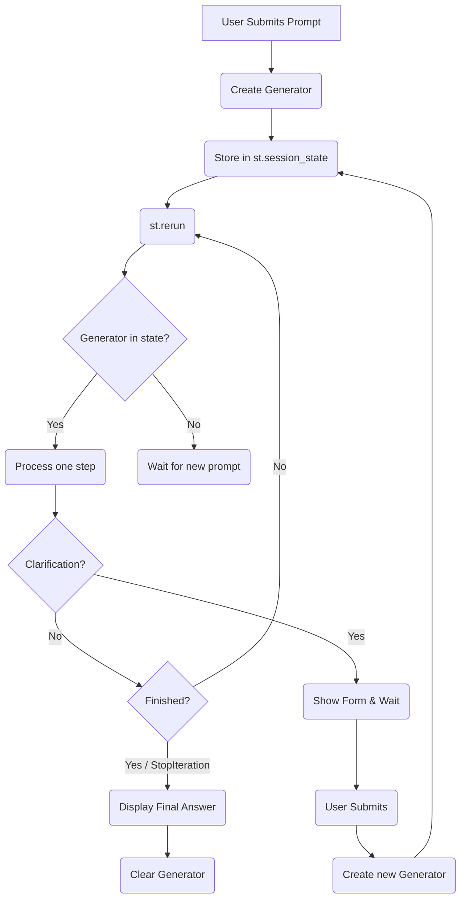

# Streamlit's "Agentic Loop": A Stateful, Event-Driven Approach

The multi-agent mode in `rag_chat_app.py` does not use a traditional `while` loop to process the agent workflow. Instead, it employs a stateful, event-driven approach that is idiomatic to Streamlit. This allows the UI to remain responsive and display results incrementally as each agent completes its task.

The core of the logic revolves around a Python **generator** and Streamlit's `session_state`.

## Workflow Breakdown

1. **Initiation (User Input)**: The process begins when a user submits a query. A **generator object** is created by calling `controller.process_query(...)`. This generator encapsulates the entire agent workflow, but it is designed to `yield` (pause) after each step. The newly created generator is then saved into `st.session_state.agent_generator`.

2. **The `st.rerun()` Loop**: The application immediately calls `st.rerun()`, which instructs Streamlit to re-execute the entire script from the top. This is the fundamental mechanism for creating the "loop."

3. **Processing One Step**: On each rerun, the script checks if a generator exists in the session state (`if st.session_state.get("agent_generator"):`). If it does, it knows a workflow is in progress and performs the following actions:
    * It advances the generator by one step using `next(st.session_state.agent_generator)`. This executes the next agent's task and returns its result.
    * The UI is updated to display the output of the step that just completed.
    * It calls `st.rerun()` again to immediately trigger the next iteration of the loop.

4. **Completion (`StopIteration`)**: This cycle continues until the generator has no more steps to yield. When `next()` is called on an exhausted generator, it raises a `StopIteration` exception.
    * A `try...except StopIteration:` block is used to catch this signal, which indicates that the entire workflow is complete.
    * Inside this block, the final answer is extracted from the last agent step, formatted for display, and appended to the chat history.
    * Finally, the `agent_generator` is cleared from the session state, which effectively ends the loop.

5. **Pausing for User Input (`clarification_needed`)**: If a step requires input from the user (e.g., selecting a technical manual), the agent yields a special `clarification_needed` status.
    * The application detects this status and displays the necessary form fields (like a dropdown menu).
    * Crucially, it **does not** call `st.rerun()` in this case. The application pauses and waits for the user to submit the form.
    * Once the user submits the form, a *new* generator is created using the `controller.resume_with_clarification(...)` method, which is then stored in the session state, and the `st.rerun()` cycle begins again.

This approach elegantly handles the asynchronous, multi-step nature of the agent system within Streamlit's execution model, providing a responsive and transparent user experience.

## Workflow Diagram

