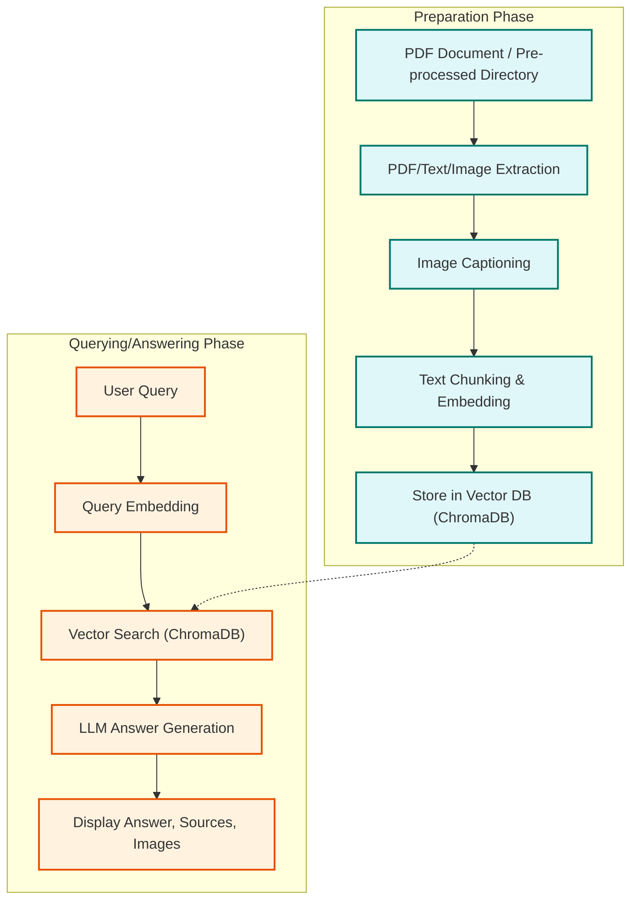

# Pipeline Progress Summary (As of 2025-05-25)

This document summarizes the components implemented and choices made for the multimodal RAG pipeline, referencing the [Experimental Components Document](./../architecture/002-experimental-components.md).

## Overall Flow

The system is divided into two main stages: Preparation (data ingestion and processing) and Querying/Answering (user interaction and information retrieval).

## Phase 1: Preparation (`multimodal_rag_pipeline.py`)

This phase focuses on ingesting PDF documents (or pre-processed markdown/images), extracting content, processing it, generating embeddings, and storing everything in a vector database.

| Component from `002-experimental-components.md` | Current Choice/Implementation in `multimodal_rag_pipeline.py` | Main Alternative(s) (from codebase)         | Notes                                                                                                                               |
|-------------------------------------------------|---------------------------------------------------------------|---------------------------------------------|-------------------------------------------------------------------------------------------------------------------------------------|
| PDF Processing                                  | Marker (`processor.py`)                                      | None      |  No PyMuPDF/PDFMiner in codebase. |
| Image Captioning                                | Florence-2 (local)                                            | Qwen (local), OpenRouter API                | See `factory.py` in `image_processor` for Qwen and OpenRouter API support. |
| Text Embedding                                  | CLIP                                                          | SIGLIP                                      | Both available via `EmbedderFactory`. |
| Vector Database                                 | ChromaDB                                                      | FalkorDB                                    | Both available via `StorageManagerFactory`. |
| Chunking Strategy                               | Section-based + chunker                                       | None                                        | Only one `chunker.py` in `semantic_chunker`. |
| Image Processing                                | Direct storage of paths/captions                              | None                                        | No compression/thumbnailing modules. |

**Key Accomplishments in Preparation Phase:**

- End-to-end processing from PDF to vector store.
- Option to start from a pre-processed directory (markdown + images).
- Extraction of text sections and association of images with these sections (based on page numbers derived from markdown markers and image filenames).
- Image captioning using a local Florence-2 model.
- Text chunking and embedding.
- Storage of chunks, embeddings, and detailed metadata (including image paths and captions) into ChromaDB.

## Phase 2: Querying/Answering (`rag_chat_app.py` & `rag_with_chroma.py`)

This phase handles user queries, retrieves relevant information from the vector database, generates an answer using an LLM, and displays the results, including sources and images.

| Component from `002-experimental-components.md` | Current Choice/Implementation in `rag_chat_app.py` & `rag_with_chroma.py` | Main Alternative(s) (from codebase)         | Notes                                                                                                                                                              |
|-------------------------------------------------|-------------------------------------------------------------------------|---------------------------------------------|--------------------------------------------------------------------------------------------------------------------------------------------------------------------|
| Query Embedding                                 | CLIP                                                                  | SIGLIP                                      | Both available via `EmbedderFactory`. |
| Retrieval                                       | Vector similarity (ChromaDB)                                          | FalkorDB                                    | Both available via `StorageManagerFactory`. |
| Reranking                                       | None                                                                  | None                                        | No reranking implemented. |
| Answer Generation                               | LLM via OpenRouter (Llama-4)                                          | Any LLM via OpenRouter                      | You can use any LLM supported by OpenRouter API. |

**Key Accomplishments in Querying/Answering Phase:**

- Streamlit-based chat interface (`rag_chat_app.py`).
- User query processing and embedding.
- Retrieval of relevant chunks from ChromaDB based on semantic similarity and optional metadata filters.
- Construction of a context prompt for the LLM, incorporating retrieved text and references to related images.
- Answer generation by an external LLM (any model available through OpenRouter can be used).
- Display of the LLM's answer.
- Interactive display of source documents (expandable sections showing content snippets, metadata, and associated images as thumbnails).
- Interactive display of overall relevant images (each in its own expandable section).
