{0}------------------------------------------------

# **CAUTION**

To reduce the chance of personal injury and/or property damage, the following instructions must be carefully observed.

Proper service and repair are important to the safety of the service technician and the safe, reliable operation of all System4 Electronic Fuel Injection equipped engines. If part replacement is necessary, the part must be replaced with one of the same part number or with an equivalent part. Do not use a replacement part of lesser quality.

The service procedures recommended and described in this service manual are effective methods of performing service and repair. Some of these procedures require the use of tools specifically designed for the purpose.

Accordingly, anyone who intends to use a replacement part, service procedure, or tool which is not recommended by the manufacturer, must first determine that neither his safety nor the safe operation of the vehicle will be jeopardized by the replacement part, service procedure or tool selected.

It is important to note that this manual contains various Cautions and Notices that must be carefully observed in order to reduce the risk of personal injury during service or repair, or the possibility that improper service or repair may damage the vehicle or render it unsafe. It is also important to understand that these 'Cautions' and 'Notices' are not exhaustive, because it is impossible to warn of all the possible hazardous consequences that might result from failure to follow these instructions.

{1}------------------------------------------------

# **MARINE ELECTRONIC FUEL INJECTION (MEFI) DIAGNOSTIC MANUAL**

At the beginning of each individual section is a Table of Contents which gives the page number on which each subject begins.

When reference is made in this manual to a brand name, number or specific tool, an equivalent product may be used in place of the recommended item.

All information, illustrations and specifications contained in this manual are based on the latest product information available at the time of publication approval. The right is reserved to make changes at any time without notice.

**NOTICE:** When fasteners are removed, always reinstall them at the same location from which they were removed. If a fastener needs to be replaced, use the correct part number fastener for that application. If the correct part number fastener is not available, a fastener of equal size and strength (or stronger) may be used. Fasteners that are not reused, and those requiring thread locking compound will be called out. The correct torque value must be used when installing fasteners that require it. If the above conditions are not followed, parts or system damage could result.

#### **GM POWERTRAIN DIVISION SERVICE OPERATIONS General Motors Corporation Ypsilanti, Michigan**

General Motors Corporation/ Technical Services, Inc. All rights reserved September 2005 Printed in Syracuse, IN USA

No part of this publication may be reproduced, stored in any retrieval system, or transmitted, in any form or by any means, including but not limited to electronic, mechanical, photocopying, recording or otherwise, without the prior written permission of the GM Powertrain Division of General Motors Corp. This includes all text, illustrations, tables and charts.

{2}------------------------------------------------

# **FOREWORD**

This service manual includes general description, diagnosis, symptoms and on-board service procedures for the fuel control and ignition systems used on GM equipped Marine Electronic Fuel Injection (MEFI) engines.

#### **INTRODUCTION**

The following manual has been prepared for effective diagnosis of the Marine Electronic Fuel Injection (MEFI) system.

All information, illustrations and specifications contained in this manual are based on the latest product information available at the time of publication approval. The right is reserved to make changes at any time without notice.

This manual should be kept in a handy place for ready reference. If properly used, it will meet the needs of technicians and boat owners.

**GM Powertrain Division service manuals are intended for the use by professional, qualified technicians. Attempting repairs or service without the appropriate training, tools and equipment could cause injury to you or others and damage to boat that may cause it not to operate safely and properly.**

{3}------------------------------------------------

# Section 1

# General Information

# **Contents**

| How Diagnostic Trouble Codes Are Set        | Page 3  |
|---------------------------------------------|---------|
| Clearing Diagnostic Trouble Codes           | Page 4  |
| Non-Scan Diagnosis of Driveability Concerns |         |
| (No DTCs Set)                               | Page 4  |
| Tools Needed to Service the System          | Page 4  |
| Service Precautions                         | Page 5  |
| Special Tools (1 of 2)                      | Page 6  |
| Special Tools (2 of 2)                      | Page 7  |
| Abbreviations                               | Page 8  |
| Diagnosis                                   | Page 9  |
| On-Board Service                            | Page 9  |
| Wiring Harness Service                      | Page 9  |
| Wiring Connector Service                    | Page 10 |
| Metri-Pack Series 150 Terminals             | Page 10 |
| Weather-Pack Connectors                     | Page 11 |

{4}------------------------------------------------

# **General Description**

# **Visual / Physical Inspection**

**A careful visual and physical inspection must be performed as part of any diagnostic procedure. This can often lead to fixing a problem without further diagnostics.**  Inspect all vacuum hoses for correct routing, pinches, cracks or disconnects. Be sure to inspect hoses that are difficult to see. Inspect all the wires in the engine compartment for proper connections, burned or chafed spots, pinched wires or contact with sharp edges or hot manifolds. This visual/physical inspection is very important. It must be done carefully and thoroughly.

# **Basic Knowledge and Tools Required**

To use this manual most effectively, a general understanding of basic electrical circuits and circuit testing tools is required. You should be familiar with wiring diagrams, the meaning of voltage, ohms, amps and the basic theories of electricity. You should also understand what happens if a circuit becomes open, shorted to ground or shorted to voltage.

To perform system diagnostics, several special tools and equipment are required. Please become acquainted with the tools and their use before attempting to diagnose the system. Special tools that are required for system service are illustrated in this section.

# **Electrostatic Discharge Damage**

Electronic components used in control systems are often designed to carry very low voltage, and are very susceptible to damage caused by electrostatic discharge. It is possible for less than 100 volts of static electricity to cause damage to some electronic components. By comparison, it takes as much as 4,000 volts for a person to feel the zap of a static discharge.

There are several ways a person can become statically charged. The most common methods of charging are by friction and by induction. An example of charging by friction is a person sliding across a seat, in which a charge of as much as 25,000 volts can build up. Charging by induction occurs when a person with well insulated shoes stands near a highly charged object and momentarily touches ground. Charges of the same polarity are drained off, leaving the person highly charged with the opposite polarity. Static charges of either type can cause damage. Therefore, it is important to use care when handling and testing electronic components.

# **Engine Wiring**

When it is necessary to move any of the wiring, whether to lift wires away from their harnesses or move harnesses to reach some component, take care that all wiring is replaced in its original position and all harnesses are routed correctly. If clips or retainers break, replace them. Electrical problems can result from wiring or harnesses becoming loose and moving from their original positions, or from being rerouted.

# **Engine Control Module (ECM) Self-Diagnostics**

The Engine Control Module (ECM) performs a continuous self-diagnosis on certain control functions. This diagnostic capability is complemented by the diagnostic procedures contained in this manual. The ECM's language for communicating the source of a malfunction is a system of Diagnostic Trouble Codes (DTC's). The DTC's are identified by two sets of numbers. The first number, labeled a SPN, identifies the location of the problem and the second number, a FMI, identifies the type of problem is occuring at the location. When a malfunction is detected by the ECM, a DTC is set and the Malfunction Indicator Lamp (MIL) is illuminated.

# **Malfunction Indicator Lamp (MIL)**

The Malfunction Indicator Lamp (MIL) is designed to alert the operator that a problem has occurred and that the vehicle should be taken for service as soon as reasonably possible.

As a bulb and system check, the light will come "ON" with the key "ON," engine "OFF." When the engine is started, the light will turn "OFF." If the light remains "ON," the self-diagnostic system has detected a problem. If the problem goes away, the light will go out in most cases after 10 seconds, but a DTC will remain stored in the ECM.

When the light remains "ON" while the engine is running, or when a malfunction is suspected due to a drivability problem, the "On-Board Diagnostic (OBD) System Check" must be performed as the first step. These checks will expose malfunctions which may not be detected if other diagnostics are performed prematurely.

## **Intermittent Malfunction Indicator Lamp (MIL)**

In the case of an "intermittent" problem, the Malfunction Indicator Lamp (MIL) will light for 10 seconds, and then go out. However, the corresponding DTC will be stored in the memory of the ECM. When DTC's are set by an intermittent malfunction, they could be helpful in diagnosing the system.

If an intermittent DTC is cleared, it may or may not reset. If it is an intermittent failure, consult the "Diagnostic Aids" on the facing page of the corresponding DTC table. Symptoms section also covers the topic of "Intermittents." A physical inspection of the applicable sub-system most often will resolve the problem.

{5}------------------------------------------------

#### **Reading Diagnostic Trouble Codes (DTC's)**

The provision for communicating with the ECM is the Data Link Connector (DLC) (Figure 1-1). It is part of the engine wiring harness, and is a 6-pin connector, which is electrically connected to the ECM. It is used in the assembly plant to receive information in checking that the engine is operating properly before it leaves the plant. The DTC(s) stored in the ECM's memory can be retrieved through a scan tool, a hand-held diagnostic scanner plugged into the DLC: or a PC based software program designed to interface with the ECM datastream.

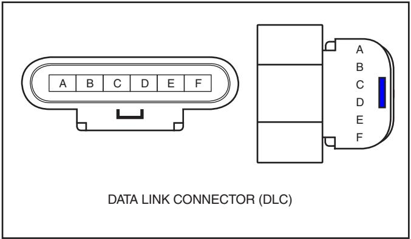

Figure 1-1 - Data Link Connector (DLC)

# **On-Board Diagnostic (OBD) System Check**

After the visual/physical inspection, the "On-Board Diagnostic (OBD) System Check" is the starting point for all diagnostic procedures. Refer to Diagnosis section.

The correct procedure to diagnose a problem is to follow two basic steps:

- 1. Are the on-board diagnostics working? This is determined by performing the "On-Board Diagnostic (OBD) System Check." Since this is the starting point for the diagnostic procedures, always begin here. If the on-board diagnostics are not working, the OBD system check will lead to a diagnostic table in the Diagnosis section to correct the problem. If the on-board diagnostics are working properly, the next step is:
- 2. Is there a DTC stored? If a DTC is stored, go directly to the number DTC table in the Diagnosis section. This will determine if the fault is still present.

## **DLC Scan Tools**

The ECM can communicate a variety of information through the DLC. This data is transmitted at a high frequency which requires a scan tool for interpretation.

With an understanding of the data which the scan tool displays, and knowledge of the circuits involved, the scan tool can be very useful in obtaining information which would be more difficult or impossible to obtain with other equipment.

A scan tool does not make the use of diagnostic tables unnecessary, nor do they indicate exactly where the problem is in a particular circuit. Diagnostic tables incorporate diagnostic procedures that are designed to function only with a scan tool or PC based scan program.

#### **Scan Tool Use With Intermittents**

The scan tool provides the ability to perform a "wiggle test" on wiring harnesses or components with the engine not running, while observing the scan tool display.

The scan tool can be plugged in and observed while driving the vehicle under the condition when the MIL turns "ON" or the engine drivability is poor. If the problem seems to be related to certain parameters that can be checked on the scan tool, they should be checked while driving the vehicle. If there does not seem to be any correlation between the problem and any specific circuit, the scan tool can be checked on each position, watching for a period of time to see if there is any change in the readings that indicates an intermittent operation.

The scan tool is also an easy way to compare the operating parameters of a poorly operating engine with those of a known good one. For example, a sensor may shift in value but not set a DTC. Comparing the sensor's readings with those of a known good identical vehicle may uncover the problem.

The scan tool has the ability to save time in diagnosis and prevent the replacement of good parts. The key to using the scan tool successfully for diagnosis lies in the technicians ability to understand the system they are trying to diagnose, as well as an understanding of the scan tool operation and limitations. The technician should read the tool manufacturer's operating manual to become familiar with the tool's operation.

# **How Diagnostic Trouble Codes (DTC) Are Set**

The ECM is programmed to receive calibrated voltage signals from the sensors. The voltage signal from the sensor may range from as low as 0.1 volt to as high as 4.9 volts. The sensor voltage signal is calibrated for engine application. This would be the sensor's operating parameter or "window." The ECM and sensors will be discussed further in the ECM and Sensor section.

If a sensor is within its operating or acceptable parameters (Figure 1-2), the ECM does not detect a problem. When a sensor voltage signal falls out of this "window," the ECM no longer receives a signal voltage within the operating "window." When the ECM does not receive the "window" voltage for a calibratible length of time, a DTC will be stored. The MIL will be illuminated and a known default value will replace the sensor value to restore engine performance.

{6}------------------------------------------------

#### **Clearing Diagnostic Trouble Codes** G E

A

- 1. Install scan tool or P.C.
- 2. Start engine.
- 3. Select "clear DTC's" function.
- 4. Clear DTC's.
- 5. Turn ignition "OFF" for at least 20 seconds.
- 6. Turn ignition "ON" and read DTC's. If DTC's are still present, check "Notice" below and repeat procedure following from step 2.

**NOTICE:** When clearing DTC's with the use of a scan tool, the ignition must be cycled to the "OFF" position or the DTC's will not clear.

# **Non-Scan Diagnosis Of Drivability Concerns (No DTC's Set)**

If a drivability concern still exists after following the OBD system check and reviewing the Symptoms tables, an out of range sensor may be suspected. Because of the unique

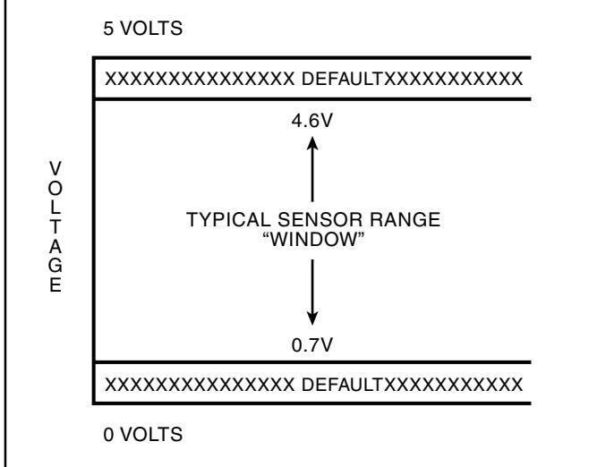

Figure 1-2 - Example of Sensor Normal Operation 

design of the MEFI system, the ECM will replace sensed values with calibrated default values in the case of a sensor or circuit malfunction. By allowing this to occur, limited engine performance is restored until the vehicle is repaired. A basic understanding of sensor operation is necessary to be able to diagnose an out of range sensor.

If the sensor is out of range, but still within the operating "window" of the ECM, the problem will go undetected by the ECM and may result in a drivability concern.

A good example of this would be if the coolant sensor was reading incorrectly and indicating to the ECM that coolant

temperature was at 50°F, but actual coolant temperature was at 150°F (Figure 1-3). This would cause the ECM to deliver more fuel than what was actually needed by the engine. This resulted in an overly rich condition, causing rough running. This condition would not have caused a DTC to set, as the ECM interprets this as within the operating "window." XXXXXXXXXXXXXXX DEFAULTXXXXXXXXXXX 6-5-93 MS 13553

> To identify a sensor that is out of range, you may unplug the sensor electrical connector while the engine is running. After about 2 minutes, the DTC for that sensor will set, illuminate the MIL, and replace the sensed value with a calibrated default value. If at that point, a noticeable performance increase is observed, the non-scan DTC table for that particular sensor should be followed to correct the problem.

> **NOTICE:** Be sure to clear each DTC after disconnecting and reconnecting each sensor. Failure to do so may result in a misdiagnosis of the drivability concern.

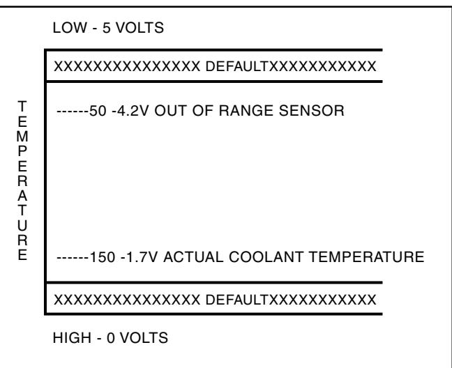

Figure 1-3 - Example of Shifted Sensor Operation 

# **Tools Needed To Service The System**

Refer to Special Tools in this section for engine control tools for servicing the system.

{7}------------------------------------------------

#### **Service Precautions**

The following requirements must be observed when working on engines.

- 1. Before removing any ECM system component, disconnect the negative battery cable.
- 2. Never start the engine without the battery being solidly connected.
- 3. Never separate the battery from the on-board electrical system while the engine is running.
- 4. Never separate the battery feed wire from the charging system while the engine is running.
- 5. When charging the battery, disconnect it from the vehicle's electrical system.
- 6. Ensure that all cable harnesses are connected solidly and the battery connections are thoroughly clean.
- 7. Never connect or disconnect the wiring harness at the ECM when the ignition is switched "ON."
- 8. Before attempting any electric arc welding on the vehicle, disconnect the battery leads and the ECM connector(s).
- 9. When steam cleaning engines, do not direct the nozzle at any ECM system components. If this happens, corrosion of the terminals or damage of components can take place.
- 10. Use only the test equipment specified in the diagnostic tables, since other test equipment may either give incorrect test results or damage good components.
- 11. All measurements using a multimeter must use a digital meter with a rating of 10 megaohm input impedance.
- 12. When a test light is specified, a "low-power" test light must be used. Do not use a high-wattage test light. While a particular brand of test light is not suggested, a simple test on any test light will ensure it to be safe for system circuit testing (Figure 1-4). Connect an accurate ammeter (such as the high-impedance digital multimeter) in series with the test light being tested, and power the test light ammeter circuit with the vehicle battery.

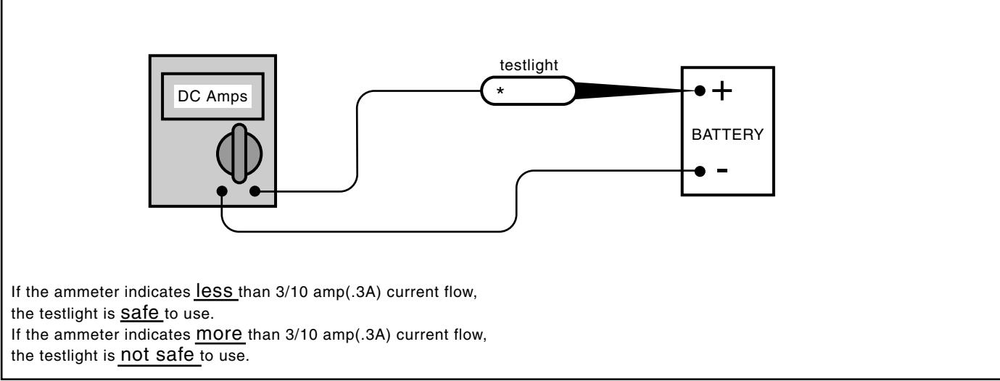

{8}------------------------------------------------

# **Special Tools and Equipment**

| Illustration | Tool Number/Description                          | Illustration | Tool Number/Description                          |
|--------------|--------------------------------------------------|--------------|--------------------------------------------------|
|              | J 23738-A Vacuum Pump                      |              | J 34730-1A Fuel Pressure Gauge             |
|              |                                                  |              | J 34730-405 Injector Test Lamp          |
|              | J 28742-A Weather Pack Terminal Remover |              | J 35314-A Exhaust Back Pressure Tester  |
|              | J 34142-B Test Lamp                        |              | J 35616-A Connector Test Adapter Kit |
|              |                                                  |              | J 35689-A Metri-Pack Terminal Kit       |

{9}------------------------------------------------

| Illustration | Tool Number/Description                                          | Illustration | Tool Number/Description                        |
|--------------|------------------------------------------------------------------|--------------|------------------------------------------------|
|              | J 37088-A Fuel Line Quick Connect Separator             |              |                                                |
|              | J 37287 Inlet and Return Fuel Line Shut-Off Adapters |              | Scan Tool or PC with Diagnostic Software |
|              | J 39021 Fuel Injector Coil and Balance Tester           |              |                                                |
|              | J 39021-380 Fuel Injector Test Harness                  |              |                                                |
|              | Fluke 78 or J 39200 Digital Multimeter                  |              |                                                |

{10}------------------------------------------------

# **ABBREVIATIONS**

| BARO     | - | BAROMETRIC PRESSURE                     | MAP      | - | MANIFOLD ABSOLUTE PRESSURE  |
|----------|---|-----------------------------------------|----------|---|-----------------------------|
| BAT      | - | BATTERY, BATTERY POSITIVE               | MFI      | - | MULTIPORT FUEL INJECTION    |
|          |   | TERMINAL, BATTERY OR SYSTEM             | MIL      | - | MALFUNCTION INDICATOR LAMP  |
|          |   | VOLTAGE                                 | MSEC     | - | MILLSECOND                  |
| B+       | - | BATTERY POSITIVE                        | N/C      | - | NORMALLY CLOSED             |
| CEFI     | - | COMMERCIAL ELECTRONIC FUEL INJECTION | N/O      | - | NORMALLY OPEN               |
| CKT      | - | CIRCUIT                                 | OBD      | - | ON-BOARD DIAGNOSTIC         |
| CONN     | - | CONNECTOR                               | OPT      | - | OPTIONAL                    |
| CYL      | - | CYLINDER                                | PFI      | - | PORT FUEL INJECTION         |
| DEG      | - | DEGREES                                 | PWM      | - | PULSE WIDTH MODULATION      |
| DI       | - | DISTRIBUTOR IGNITION                    | RAM      | - | RANDOM ACESS MEMORY         |
| DIAG     | - | DIAGNOSTIC                              | REF HI - |   | REFERENCE HIGH              |
| DIST     | - | DISTRIBUTOR                             | REF LO - |   | REFERENCE LOW               |
| DLC      | - | DATA LINK CONNECTOR                     | ROM      | - | READ ONLY MEMORY            |
| DTC      | - | DIAGNOSTIC TROUBLE CODE                 | SLV      | - | SLAVE                       |
| DVOM -   |   | DIGITAL VOLT OHMMETER                   | SW       | - | SWITCH                      |
| ECM      | - | ENGINE CONTROL MODULE                   | TACH     | - | TACHOMETER                  |
| ECT      | - | ENGINE COOLANT TEMPERATURE              | TBI      | - | THROTTLE BODY INJECTION     |
| EEPROM-  |   | ELECTRONIC ERASABLE                     | TERM     | - | TERMINAL                    |
|          |   | PROGRAMMABLE READ                       | TP       | - | THROTTLE POSITION           |
|          |   | ONLY MEMORY                             | V        | - | VOLTS                       |
| EI       | - | ELECTRONIC IGNITION                     | VAC      | - | VACUUM                      |
| EMI      | - | ELECTROMAGNETIC INTER-                  | VSS      | - | VEHICLE SPEED SENSOR        |
|          |   | FERENCE                                 | WOT      | - | WIDE OPEN THROTTLE          |
| ENG      | - | ENGINE                                  | " HG"    | - | INCHES OF MERCURY           |
| E-STOP - |   | EMERGENCY STOP                          |          |   |                             |
| GND      | - | GROUND                                  | ETC      | - | ELECTRONIC THROTTLE CONTROL |
| GOV      | - | GOVERNOR                                | PPS      | - | PEDAL POSITION SENSOR       |
| GPH      | - | GALLONS PER HOUR                        | TAC      | - | THROTTLE ACTUATOR CONTROL   |
| HO2      | - | HEATED OXYGEN SENSOR                    | TPS      | - | THROTTLE POSITION SENSOR    |
| IAC      | - | IDLE AIR CONTROL                        | T-SC     | - | THROTTLE-SHIFT CONTROL      |
| IAT      | - | INTAKE AIR TEMPERATURE                  | EOP      | - | ENGINE OIL PRESSURE         |
| IC       | - | IGNITION CONTROL                        | FL       | - | FUEL LEVEL                  |
| IGN      | - | IGNITION                                |          |   |                             |
| INJ      | - | INJECTOR                                |          |   |                             |
| I/O      | - | INPUT/OUTPUT                            |          |   |                             |
| kPa      | - | KILOPASCAL                              |          |   |                             |
| KS       | - | KNOCK SENSOR                            |          |   |                             |
| KV       | - | KILOVOLTS                               |          |   |                             |

{11}------------------------------------------------

# **Diagnosis**

The diagnostic tables and functional checks in this manual are designed to locate a faulty circuit or component through logic based on the process of elimination. The tables are prepared with the requirement that the system functioned correctly at the time of assembly and that there are no multiple failures.

Engine control circuits contain many special design features not found in standard vehicle wiring. Environmental protection is used extensively to protect electrical contacts. Proper splicing methods must be used when necessary. 2. REMOVE TERMINAL USING TOOL

The proper operation of low amperage input/output circuits depend upon good continuity between circuit connectors. It is important before component replacement and/or during normal troubleshooting procedures that a visual inspection of any questionable mating connector is performed. Mating surfaces should be properly formed, clean and likely to make proper contact. Some typical causes of connector problems are listed below: 3. CUT WIRE IMMEDIATELY BEHIND CABLE SEAL TERMINAL REMOVAL TOOL J 28742, J 38125-10 OR BT-8234-A

- Improperly formed contacts and/or connector housing. A. SLIP NEW SEAL ONTO WIRE
- Damaged contacts or housing due to improper engagement. C. CRIMP TERMINAL OVER WIRE AND SEAL
- Corrosion, sealer or other contaminants on the contact mating surfaces.
- Incomplete mating of the connector halves during initial assembly or during subsequent troubleshooting procedures. 6. CLOSE SECONDARY LOCK HINGE 5. PUSH TERMINAL INTO CONNECTOR UNTIL LOCKING TANGS ENGAGE
- Tendency for connectors to come apart due to vibration and/or temperature cycling.
- Terminals not fully seated in the connector body.
- Inadequate terminal crimps to the wire.

#### **On-Board Service** PUSH TO ➧➧RELEASE

# **Wiring Harness Service**

#### Figure 1-7

Wiring harnesses should be replaced with proper part number harnesses. When wires are spliced into a harness, use the same gauge wire with high temperature insulation only.

With the low current and voltage levels found in the system, it is important that the best possible bond be made at all wire splices by soldering the splices as shown in Figure 1-7. WIRE SEAL

Use care when probing a connector or replacing a connector terminal. It is possible to short between opposite terminals. If this happens, certain components can be damaged. Always use jumper wires with the corresponding mating terminals between connectors for circuit checking. **NEVER** probe through connector seals, wire insulation, secondary ignition wires, boots, nipples or covers. Microscopic damage or holes may result in water intrusion, corrosion and/or component failure. B. STRIP 5mm (.2") OF INSULATION FROM WIRE SEAL

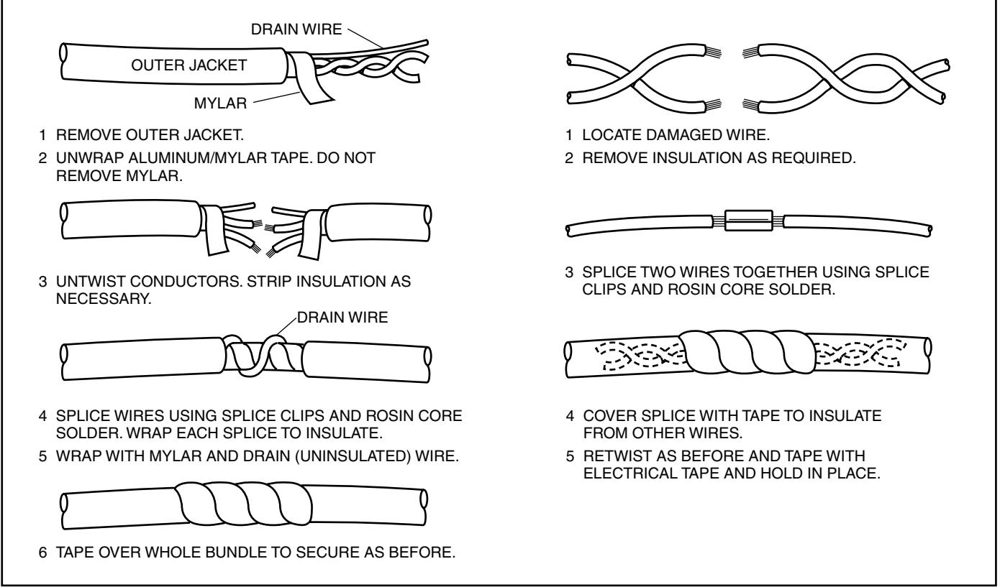

{12}------------------------------------------------

# **Wiring Connector Service**

Most connectors in the engine compartment are protected against moisture and dirt which could create oxidation and deposits on the terminals. This protection is important because of the very low voltage and current levels found in the electronic system. The connectors have a lock which secures the male and female terminals together. A secondary lock holds the seal and terminal into the connector.

When diagnosing, open circuits are often difficult to locate by sight because oxidation or terminal misalignment are hidden by the connectors. Merely wiggling a connector on a sensor, or in the wiring harness, may locate the open circuit condition. This should always be considered when an open circuit or failed sensors is indicated. Intermittent problems may also be caused by oxidized or loose connections.

Before making a connector repair, be certain of the type of connector. Some connectors look similar but are serviced differently. Replacement connectors and terminals are listed in the parts catalog.

#### **Metri-Pack Series 150 Terminals**

#### Figure 1-8

Some ECM harness connectors contain terminals called Metri-Pack (Figure 1-8). These are used at some of the sensors and the distributor connector.

Metri-Pack terminals are also called "Pull-To-Seat" terminals because, to install a terminal on a wire, the wire is first inserted through the seal and connector. The terminal is then crimped on the wire, and the terminal is pulled back into the connector to seat it in place.

To remove a terminal:

- 1. Slide the seal back on the wire.
- 2. Insert tool J 35689 or equivalent, as shown in Figure 1-5, to release the terminal locking tang.
- 3. Push the wire and terminal out through the connector. If the terminal is being reused, reshape the locking tang.

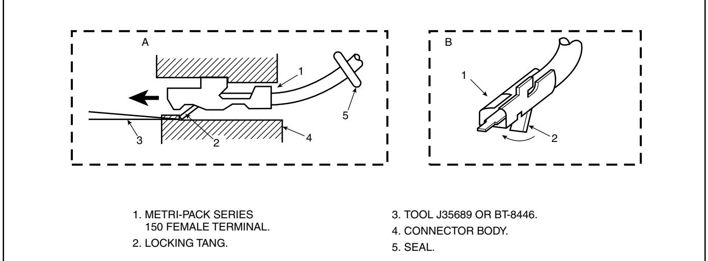

Figure 1-8 Metri-Pack Series 150 Terminal Removal 

{13}------------------------------------------------

#### **Weather-Pack Connectors**

#### Figure 1-9

Figure 1-9 shows a Weather-Pack connector and the tool (J 28742 or equivalent) required to service it. This tool is used to remove the pin and sleeve terminals. If terminal removal is attempted without using the special tool required, there is a good chance that the terminal will be bent or deformed, and unlike standard blade type terminals, these terminals cannot be straightened once they are bent.

Make certain that the connectors are properly seated and all of the sealing rings in place when connecting leads. The hinge-type flap provides a secondary locking feature for the connector. It improves the connector reliability by retaining the terminals if the small terminal lock tangs are not positioned properly.

Weather-Pack connections cannot be replaced with standard connections. Instructions are provided with Weather-Pack connector and terminal packages.

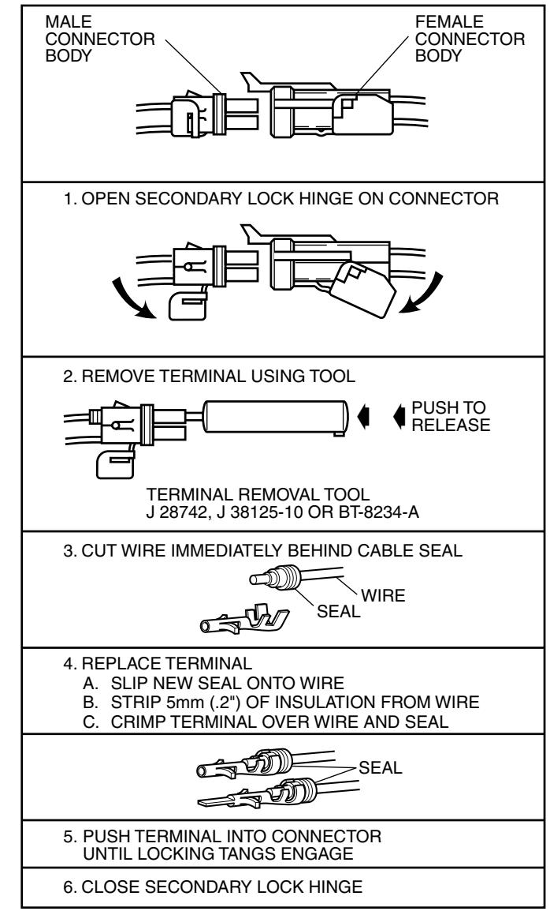

Figure 1-9 - Weather-Pack Terminal Repair

{14}------------------------------------------------

**This page left intentionally blank**

{15}------------------------------------------------

# **Section 2**

# **Engine Control Module (ECM) and Sensors**

This section will describe the function of the Engine Control Module (ECM) and the sensors. The section explains how voltages reflect the inputs and outputs of the ECM. The sensors are described how they operate and how to replace them.

# **Contents**

| General Description Page 2                |  |
|-------------------------------------------|--|
| Computers and Voltage Signals Page 2      |  |
| Analog Signals Page 2                     |  |
| Three-Wire Sensors Page 2                 |  |
| Two-Wire Sensors Page 2                   |  |
| Digital Signals Page 3                    |  |
| Switch Types Page 3                       |  |
| Pulse Counters Page 3                     |  |
| Engine Control Module (ECM) Page 4        |  |
| ECM Function Page 4                       |  |
| Memory Page 4                             |  |
| ROM Page 4                                |  |
| RAM Page 4                                |  |
| EEPROM Page 4                             |  |
| Speed Density System Page 5               |  |
| Speed Page 5                              |  |
| Density Page 5                            |  |
| ECM Inputs and Sensor Descriptions Page 5 |  |
| Inputs and Outputs Page 6                 |  |
| Engine Coolant Temperature (ECT)          |  |
| Sensor Page 7                             |  |
|                                           |  |

| Manifold Absolute Pressure (MAP)         |  |
|------------------------------------------|--|
| Sensor Page 7                            |  |
| Knock Sensor Page 7                      |  |
| Ignition Control (IC) Reference Page 8   |  |
| Discrete Switch Inputs (Optional) Page 8 |  |
| Diagnosis Page 8                         |  |
| Engine Control Module (ECM) Page 8       |  |
| On-Board Service Page 9                  |  |
| Engine Control Module (ECM)              |  |
| Replacement Page 9                       |  |
| Engine Coolant Temperature (ECT)         |  |
| Sensor Page 10                           |  |
| Manifold Absolute Pressure (MAP)         |  |
| Sensor Page 10                           |  |
| Throttle Position Sensor  Page 11        |  |
| Idle Air Control (IAC) Function  Page 11 |  |
| Knock Sensor (KS) Page 12                |  |
| Torque Specifications Page 12            |  |
|                                          |  |

{16}------------------------------------------------

# **General Description**

This Electronic Fuel Injection system is equipped with a computer that provides the operator with state-of-the-art control of fuel and spark delivery. Before we discuss the computers in this application, let's discuss how computers use voltage to send and receive information.

# **Computers and Voltage Signals**

Voltage is electrical pressure. Voltage does not flow through circuits. Instead, voltage causes current. Current does the real work in electrical circuits. It is current, the flow of electrically charged particles, that energizes solenoids, closes relays and illuminates lamps.

Besides causing current flow in circuits, voltage can be used as a signal. Voltage signals can send information by changing levels, changing waveform (shape) or changing the speed at which the signal switches from one level to another. Computers use voltage signals to communicate with one another. The different circuits inside computers also use voltage signals to talk to each other.

There are two kinds of voltage signals, analog and digital. Both of these are used in computer systems. It is important to understand the difference between them and the different ways they are used.

# **Analog Signals**

An analog signal is continuously variable. This means that the signal can be any voltage within a certain range.

An analog signal usually gives information about a condition that changes continuously over a certain range. For example, temperature is usually provided by an analog signal. There are two general types of sensors that produce analog signals, the 3-wire and the 2-wire sensors.

#### **Three-Wire Sensors**

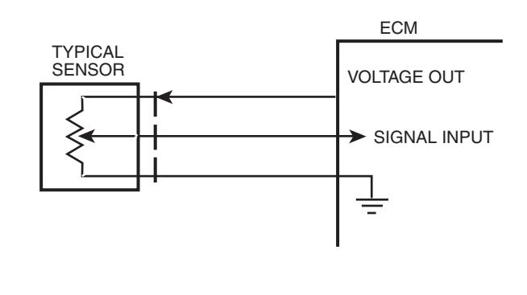

Figure 2-1 shows a schematic representation of a 3-wire sensor. All 3-wire sensors have a reference voltage, a ground and a variable "wiper." The lead coming off of the "wiper" will be the signal to the Engine Control Module (ECM). As this "wiper" position changes, the signal voltage to the ECM also changes.

#### **Two-Wire Sensors**

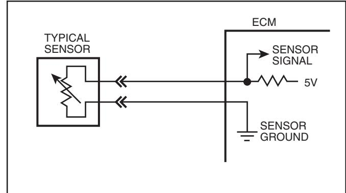

Figure 2-2 - Two-Wire Sensors

Figure 2-2 shows a schematic representation of a 2-wire sensor. This sensor is basically a variable resistor in series with a known-fixed resistor within the ECM. By knowing the values of the input voltage and the voltage drop across the known resistor, the value of the variable resistor can be determined. The variable resistors that are commonly used are called thermistors. A thermistor's resistance varies with temperature.

{17}------------------------------------------------

# **Digital Signals**

Digital signals are also variable, but not continuously. They can only be represented by distinct voltages within a range. For example, 1V, 2V or 3V would be allowed, but 1.27V or 2.56V would not. Digital signals are especially useful when the information can only refer to two conditions: "YES" and "NO," "ON" and "OFF" or "HIGH" and "LOW." This would be called a digital binary signal. A digital binary signal is limited to two voltage levels. One level is a positive voltage, the other is no voltage (zero volts). As you can see in Figure 2-3, a digital binary signal is a square wave.

The ECM uses digital signals in a code that contains only ones and zeros. The high voltage of the digital signal represents a one (1), and no voltage represents a zero (0). Each "zero" and each "one" is called a bit of information, or just a "bit." Eight bits together are called a "word." A word, therefore, contains some combination of eight binary code bits.

Binary code is used inside the ECM and between a computer and any electronic device that understands the code. By stringing together thousands of bits, computers can communicate and store an infinite varieties of information. To a computer that understands binary, 11001011 might mean that it should turn an output device "ON" at slow speed. Although the ECM uses 8-bit digital codes internally and when talking to another computer, each bit can have a meaning.

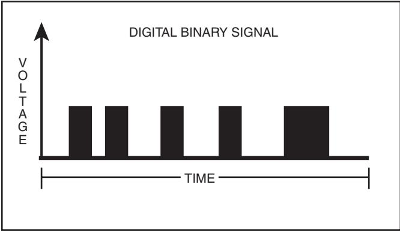

Figure 2-3 - Digital Voltage Signal

#### **Switch Types**

Switched inputs (also known as discretes) to the ECM can cause one bit to change, resulting in information being communicated to the ECM. Switched inputs can come in two types: "pull-up" and "pull-down" types. Both types will be discussed.

With "pull-up" type switch, the ECM will sense a voltage when the switch is CLOSED. With "pull-down" type switch, the ECM will sense a voltage when the switch is OPEN.

#### **Pulse Counters**

For the ECM to determine frequency information from a switched input, the ECM must measure the time between the voltage pulses. As a number of pulses are recorded in a set amount of time, the ECM can calculate the frequency. The meaning of the frequency number can have any number of meanings to the ECM.

An example of a pulse counter type of input is the distributor reference pulse input. The ECM can count a train of pulses, a given number of pulses per engine revolution. In this way, the ECM can determine the RPM of the engine.

{18}------------------------------------------------

# **Engine Control Module (ECM)**

The Engine Control Module (ECM), located on the engine, is the control center of the fuel injection system. It controls the following:

- Fuel metering system.
- Ignition timing.
- Idle speed.
- On-board diagnostics for engine functions.

It constantly looks at the information from various sensors, and controls the systems that affect engine performance. The ECM also performs the diagnostic function of the system. It can recognize operational problems, alert the driver through the MIL (Malfunction Indicator Lamp) and store diagnostic trouble codes which identify the problem areas to aid the technician in making repairs. Refer to General Information section for more information on using the diagnostic function of the ECM.

#### **ECM Function**

The ECM supplies either 5 or 12 volts to power various sensors or switches. This is done through resistances in the ECM which are so high in value that a test light will not light when connected to the circuit. In some cases, even an ordinary shop voltmeter will not give an accurate reading because its resistance is too low. Therefore, a digital voltmeter with at least 10 megohms input impedance is required to ensure accurate voltage readings. Tool J 39978 or the Fluke 78 multimeter meet this requirement.

The ECM controls output circuits such as the injectors, IAC, relays, etc. by controlling the ground or power feed circuit.

#### **Memory**

There are three types of memory storage within the ECM. They are ROM, RAM and EEPROM.

#### **ROM**

Read Only Memory (ROM) is a permanent memory that is physically soldered to the circuit boards within the ECM. The ROM contains the overall control programs. Once the ROM is programmed, it cannot be changed. The ROM memory is non-erasable, and does not need power to be retained.

#### **RAM**

Random Access Memory (RAM) is the microprocessor "scratch pad." The processor can write into, or read from this memory as needed. This memory is erasable and needs a constant supply of voltage to be retained. If the voltage is lost, the memory is lost.

#### **EEPROM**

The Electronically Erasable Programmable Read Only Memory (EEPROM) is a permanent memory that is physically soldered within the ECM. The EEPROM contains program and calibration information that the ECM needs to control engine operation.

The EEPROM is not replaceable. If the ECM is replaced, the new ECM will need to be programmed by the OEM with the calibration information that is specific to each application.

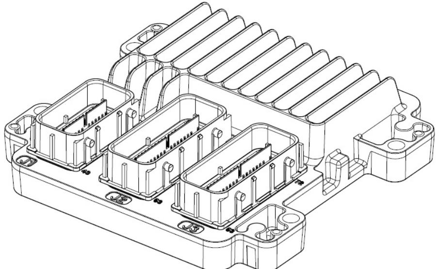

Figure 2-4 - Engine Control Module (ECM) MEFI 5

{19}------------------------------------------------

#### **Speed Density System**

This System is a speed and air density system. The system is based on "speed density" fuel management.

Sensors provide the ECM with the basic information for the fuel management portion of its operation. Signals to the ECM establish the engine speed and air density factors.

#### **Speed**

The engine speed signal comes from the Crank Position Sensor. The ECM uses this information to determine the "speed" or RPM factor for fuel and spark management.

#### **Density**

One particular sensor contributes to the density factor, the Manifold Absolute Pressure (MAP) sensor. The MAP sensor is a 3-wire sensor that monitors the changes in intake manifold pressure which results from changes in engine loads. These pressure changes are supplied to the ECM in the form of electrical signals.

As intake manifold pressure increases, the vacuum decreases. The air density in the intake manifold also increases, and additional fuel is needed.

The MAP sensor sends this pressure information to the ECM, and the ECM increases the amount of fuel injected, by increasing the injector pulse width. As manifold pressure decreases, the vacuum increases, and the amount of fuel is decreased.

These two inputs, MAP and RPM, are the major determinants of the air/fuel mixture delivered by the fuel injection system. The remaining sensors and switches provide electrical inputs to the ECM, which are used for modification of the air/fuel mixture, as well as for other ECM control functions, such as idle control.

#### **ECM Inputs and Sensor Descriptions**

Figure 2-5 lists the data sensors, switches and other inputs used by the ECM to control its various systems. Although we will not cover them all in great detail, there will be a brief description of each.

{20}------------------------------------------------

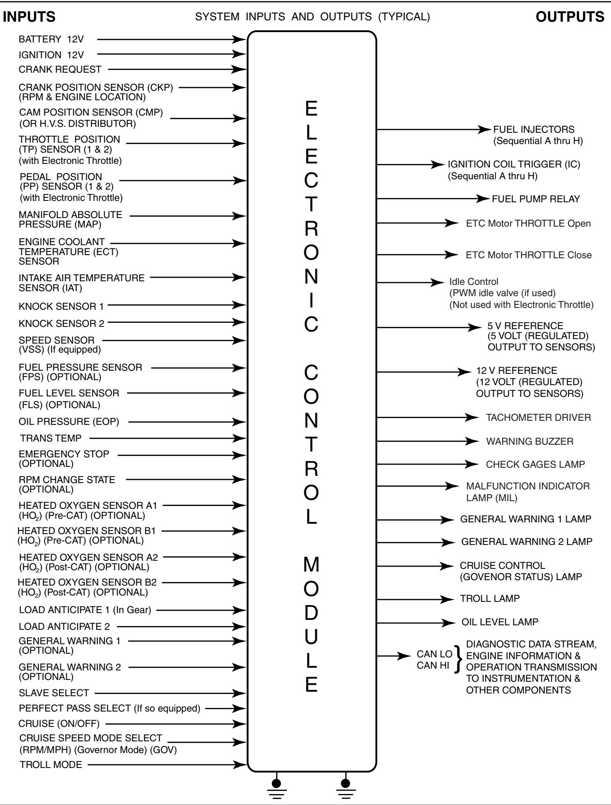

{21}------------------------------------------------

#### **Engine Coolant Temperature (ECT) Sensor**

The engine coolant temperature (ECT) sensor is a thermistor (a resistor which changes value based on temperature) mounted in the engine coolant stream. Low coolant temperature produces a high resistance (100,000 ohms at -40°C/-40°F) while high temperature causes low resistance (70 ohms at 130°C/266°F).

The ECM supplies a 5 volt signal to the ECT sensor through a resistor in the ECM and measures the voltage. The voltage will be high when the engine is cold, and low when the engine is hot. By measuring the voltage, the ECM calculates the engine coolant temperature. Engine coolant temperature affects most systems the ECM controls.

A hard fault in the engine coolant sensor circuit should set SPN 110 FMI 3 or 4; an intermittent fault may or may not set a DTC. The DTC "Diagnostic Aids" also contains a chart to check for sensor resistance values relative to temperature.

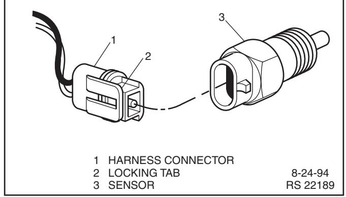

Figure 2-6 - Engine Coolant Temperature (ECT) Sensor

#### **Temperature vs Resistance**

| C                                              | F   | OHMS   |  |  |
|------------------------------------------------|-----|--------|--|--|
| Temperature vs Resistance Values (Approximate) |     |        |  |  |
| 150                                            | 302 | 47     |  |  |
| 140                                            | 284 | 60     |  |  |
| 130                                            | 266 | 77     |  |  |
| 120                                            | 248 | 100    |  |  |
| 110                                            | 230 | 132    |  |  |
| 100                                            | 212 | 177    |  |  |
| 90                                             | 194 | 241    |  |  |
| 80                                             | 176 | 332    |  |  |
| 70                                             | 158 | 467    |  |  |
| 60                                             | 140 | 667    |  |  |
| 50                                             | 122 | 973    |  |  |
| 45                                             | 113 | 1188   |  |  |
| 40                                             | 104 | 1459   |  |  |
| 35                                             | 95  | 1802   |  |  |
| 30                                             | 86  | 2238   |  |  |
| 25                                             | 77  | 2796   |  |  |
| 20                                             | 68  | 3520   |  |  |
| 15                                             | 59  | 4450   |  |  |
| 10                                             | 50  | 5670   |  |  |
| 5                                              | 41  | 7280   |  |  |
| 0                                              | 32  | 9420   |  |  |
| -5                                             | 23  | 12300  |  |  |
| -10                                            | 14  | 16180  |  |  |
| -15                                            | 5   | 21450  |  |  |
| -20                                            | -4  | 28680  |  |  |
| -30                                            | -22 | 52700  |  |  |
| -40                                            | -40 | 100700 |  |  |

{22}------------------------------------------------

#### **Manifold Absolute Pressure (MAP) Sensor**

The Manifold Absolute Pressure (MAP) sensor (Figure 2-7) is a pressure transducer that measures the changes in the intake manifold pressure. The pressure changes as a result of engine load and speed change, and the MAP sensor converts this into a voltage output.

A closed throttle on engine coastdown would produce a relatively low MAP output voltage, while a wide open throttle would produce a high MAP output voltage. This high output voltage is produced because the pressure inside the manifold is almost the same as outside the manifold, so you measure almost 100% of outside air pressure. MAP is the opposite of what you would measure on a vacuum gauge. When manifold pressure is high, vacuum is low, causing a high MAP output voltage. The MAP sensor is also used to measure barometric pressure under certain conditions, which allows the ECM to automatically adjust for different altitudes.

The ECM supplies a 5 volt reference voltage to the MAP sensor. As the manifold pressure changes, the electrical resistance of the MAP sensor also changes. By monitoring the sensor output voltage, the ECM knows the manifold pressure. A higher pressure, low vacuum (high voltage) requires more fuel. A lower pressure, high vacuum (low voltage) requires less fuel. The ECM uses the MAP sensor to control fuel delivery and ignition timing. A failure in the MAP sensor circuit should set a SPN 106 FMI 3 or 4.

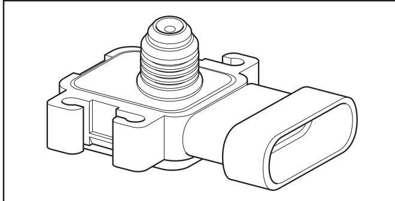

Figure 2-7 - Manifold Absolute Pressure (MAP) Sensor

The knock sensor is mounted in the engine block. The location depends on engine application.

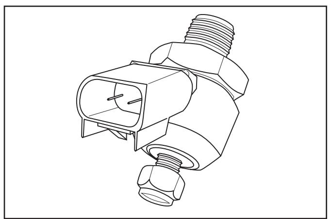

Figure 2-8 - Knock Sensor (Typical)

An ECM is used in conjunction with a knock sensor in order to control detonation. The knock module circuitry is internal in the ECM.

When knock is present, a flat response is produced by the knock sensor and transmitted to the ECM. An AC voltage monitor inside the ECM will detect the knock and start retarding spark timing.

#### **Ignition Control (IC) Reference**

The Ignition Control (IC) reference (RPM signal) is supplied to the ECM by way of the IC reference line from the ignition module. This pulse counter type input creates the timing signal for the pulsing of the fuel injectors, as well as the IC functions. This signal is used for a number of control and testing functions within the ECM.

#### **Discrete Switch Inputs (Optional)**

Several discrete switch inputs are utilized by this system to identify abnormal conditions that may affect engine operation. Pull-up and pull-down type switches are currently used in conjunction with the ECM to detect critical conditions to engine operation.

If a switch changes states from its normal at rest position, that is, normally closed to open, or normally open to closed, the ECM senses a change in voltage and responds by entering RPM reduction mode.

This engine protection feature allows the operator normal engine operations up to OEM specifications (approx. 2000 RPM), but disables half the fuel injectors until the engine drops below 1200 RPM. Then normal engine operation is restored until the RPM limit is exceeded. This feature allows the operator a safe maneuvering speed while removing the possibility of high RPM engine operation until the problem is corrected.

Switches that may be used with this system to detect critical engine operation parameters are:

- Oil level N/O
- Oil pressure N/O
- **Knock Sensor** Emergency stop N/O

{23}------------------------------------------------

# **Diagnosis**

# **Engine Control Module (ECM)**

To read and clear diagnostic trouble codes, use a scan tool or Diagnostic Trouble Code (DTC) tool.

**Important:** Use of a scan tool is recommended to clear diagnostic trouble codes from the ECM memory. Diagnostic trouble codes can also be cleared by using the MDTC tool, TA 06075.

Since the ECM can have a failure which may affect more than one circuit, following the diagnostic procedures will determine which circuit has a problem and where it is.

If a diagnostic table indicates that the ECM connections or ECM is the cause of a problem and the ECM is replaced, but does not correct the problem, one of the following may be the reason:

- There is a problem with the ECM terminal connections. The diagnostic table will say ECM connections or ECM. The terminals may have to be removed from the connector in order to check them properly.
- EEPROM program is not correct for the application. Incorrect components may cause a malfunction and may or may not set a DTC.
- The problem is intermittent. This means that the problem is not present at the time the system is being checked. In this case, refer to the Symptoms portion of the manual and make a careful physical inspection of all portions of the system involved.
- Shorted relay coil or harness. Relays are turned "ON" and "OFF" by the ECM using internal electronic switches called drivers. A shorted relay coil or harness will not damage the ECM but will cause the relay to be inoperative.

# **On-Board Service**

# **Engine Control Module (ECM)**

#### Figure 2-9

**Notice:** When replacing the ECM, the ignition must be "OFF" and disconnect the battery before disconnecting or reconnecting the ECM "J1", "J2" and "J3" connectors to prevent internal damage to the ECM.

**Notice:** To prevent possible electrostatic discharge damage to the ECM, do not touch the connector pins. The ECM is an electrical component. Do Not soak in any liquid cleaner or solvent, as damage may result.

#### **Remove or Disconnect**

- 1. Negative battery cable.
- 2. "J1", "J2" and "J3" connectors from ECM.
- 3. Four ECM mounting screws.
- 4. ECM from mounting bracket.

#### **Important**

- Make sure the new ECM has the same part number and service number as the old ECM, to insure proper engine performance.
- Make sure the new ECM has the correct calibration.

#### **Install or Connect**

- 1. New ECM to mounting bracket.
- 2. Four ECM mounting screws. Torque to 10-14 N•m (88- 124 lb.in.).
- 3. "J1", "J2" and "J3" connectors to ECM.
- 4. Negative battery cable.

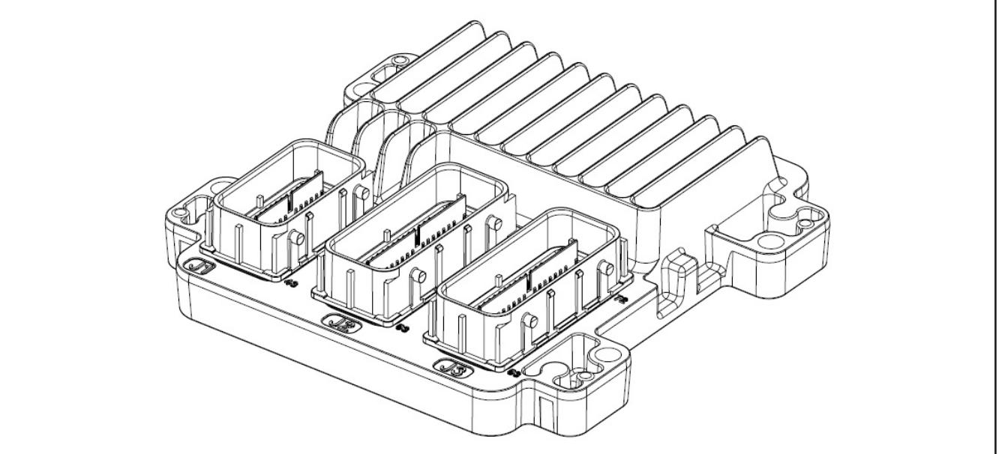

{24}------------------------------------------------

# **Engine Coolant Temperature (ECT) Sensor**

#### Figure 2-10

**Notice:** Care must be taken when handling the ECT sensor. Damage to the sensor will affect proper operation of the MEFI system.

#### **Remove or Disconnect**

- 1. Negative battery cable.
- 2. ECT electrical connector.
- 3. ECT sensor.

#### **Important**

• Coat ECT sensor threads with teflon tape sealant prior to installation.

#### **Install or Connect**

- 1. ECT sensor. Torque to 12 N•m (108 lb.in.).
- 2. ECT electrical connector.
- 3. Negative battery cable.

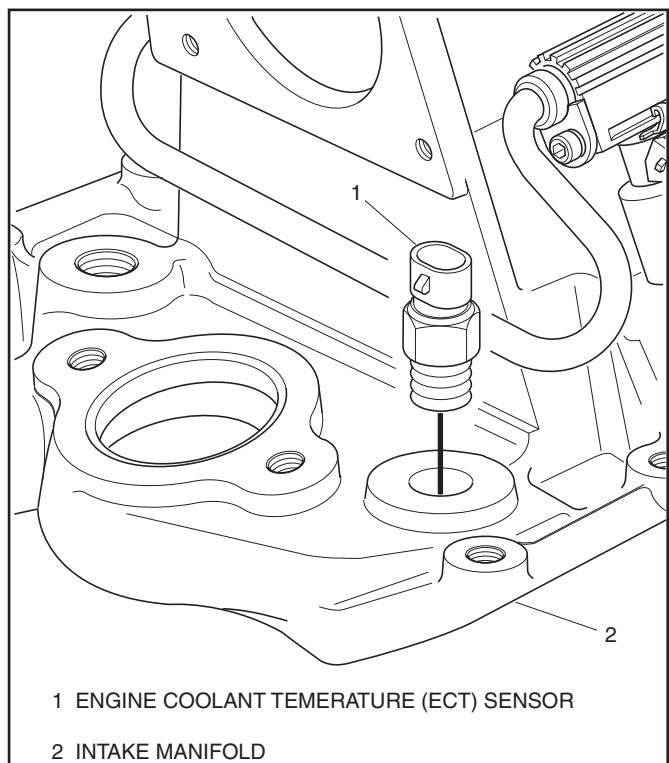

Figure 2-10 - Engine Coolant Temperature (ECT) Sensor

# **Manifold Absolute Pressure (MAP) Sensor**

Figures 2-11

# **Remove or Disconnect**

- 1. Negative battery cable.
- 2. MAP sensor electrical connector.
- 3. MAP sensor attaching screws.
- 4. MAP sensor with seal.

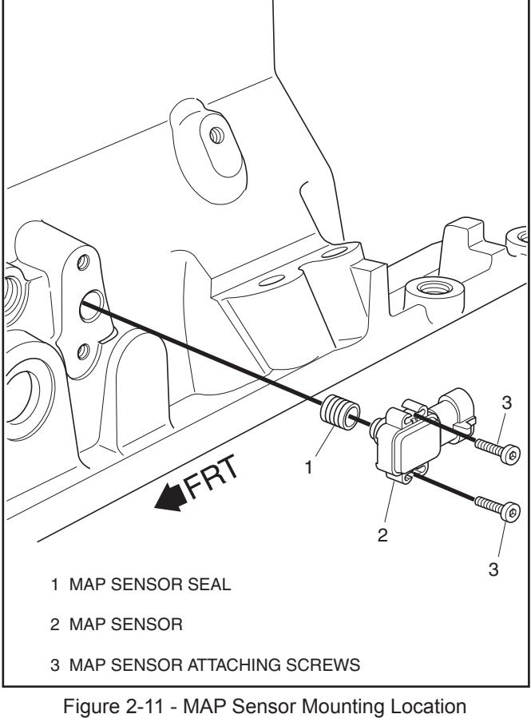

#### **Important**

• The MAP sensor is an electrical component. Do Not soak in any liquid cleaner or solvent, as damage may result.

#### **Install or Connect**

- 1. New seal on MAP sensor.
- 2. MAP sensor.
- 3. MAP sensor attaching screws. Torque to 5-7 N•m (44-62 lb.in.).
- 4. MAP sensor electrical connector.
- 5. Negative battery cable.

{25}------------------------------------------------

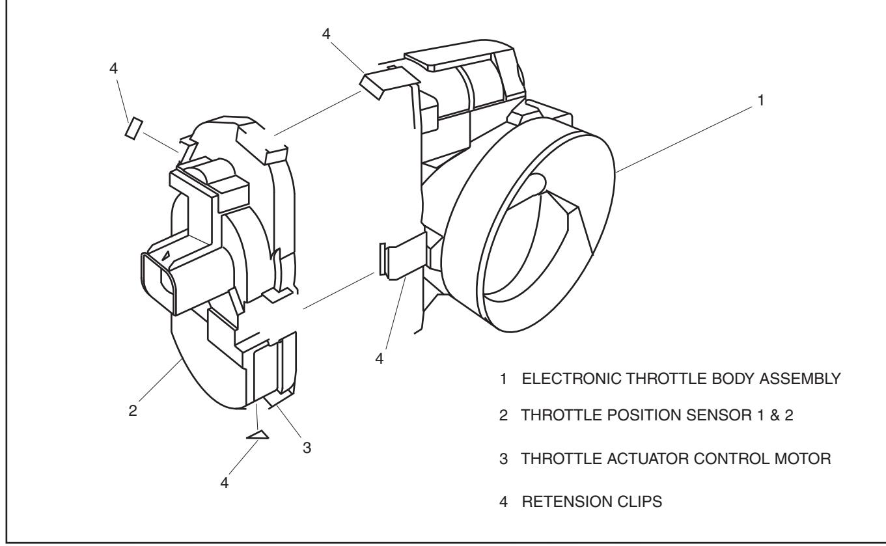

Figure 2-12 - Throttle Body Assembly

# **Throttle Position (TP) Sensor**

#### Figure 2-12

On this system there are two throttle position sensors both are contained within the plastic compartment that is attached to the side of the electronic throttle body.

This compartment also houses the throttle actuator control motor. If any component within this compartment should fail the whole compartment should be replaced**.**

## **Idle Air Control (IAC)**

On this system the idle air control function is managed by the ECM through the electronic throttle body. The butterfly valve is adjusted by the TAC motor as commanded by the ECM.

{26}------------------------------------------------

Figures 2-13 and 2-14

#### **Remove or Disconnect**

- 1. Negative battery cable.
- 2. Knock sensor electrical connector.
- 3. Knock sensor from engine block.

#### **Important**

- If installing a new knock sensor, be sure to replace with an identical part number.
- When installing knock sensor, be sure to install in the same location removed from.
- If installing knock sensor in water jacket, use teflon sealer #1052040 or equivalent.

#### **Install or Connect**

- 1. Knock sensor into engine block. Be sure threads are clean. Torque to 15-22 N•m (11-16 lb.ft.).
- 2. Knock sensor electrical connector.
- 3. Negative battery cable.

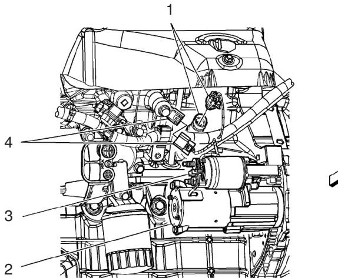

- 1. Engine Oil Pressure (EOP) Switch
- 2. Starter
- 3. Starter Solenoid
- 4. Knock Sensor (KS) 2

#### Figure 2-13 - Knock Sensor Location

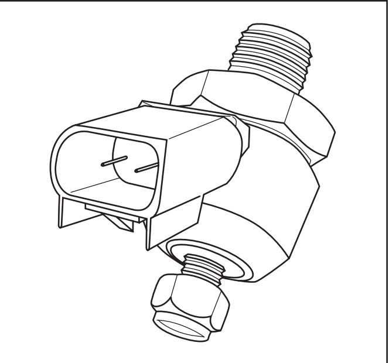

Figure 2-14 - Knock Sensor (Typical)

# **Torque Specifications**

| Application                 | N•m   | Lb Ft | Lb In  |
|-----------------------------|-------|-------|--------|
| ECM Mounting Screws         | 10-14 |       | 88-124 |
| ECT Sensor                  | 12    |       | 108    |
| MAP Sensor Attaching Screws | 5-7   |       | 44-62  |
| TP Sensor Attaching Screws  | 2     |       | 18     |
| IAC Valve Attaching Screws  | 3.2   |       | 28     |
| Knock Sensor                | 15-22 | 11-16 |        |

{27}------------------------------------------------

# **This page left intentionally blank**

{28}------------------------------------------------

# **Section 3**

# **Fuel & Air Metering System - Port Fuel Injection (PFI) - 5.7L**

This section describes how the fuel metering system operates, and provides a description of components used on the System4 Electronic Fuel Injection equipped engines. The fuel metering system information described in this manual is limited to Port Fuel Injection (PFI) used on the 5.7L. All other systems will be detailed in a separate manual. In distinguishing fuel systems used on specific applications, the following rules apply. PFI systems have separate injectors for each cylinder. The injectors are located in each of the intake manifold runners and are supplied by a fuel rail. TBI systems use two injectors mounted at the top of the throttle body assembly.

# **Contents**

| General Description Page 2                   |  |
|----------------------------------------------|--|
| Purpose Page 2                               |  |
| Modes of Operation Page 2                    |  |
| Starting Mode Page 2                         |  |
| Clear Flood Mode Page 2                      |  |
| Run Mode Page 2                              |  |
| Acceleration Mode Page 2                     |  |
| Fuel Cutoff Mode Page 2                      |  |
| RPM Reduction Mode Page 2                    |  |
| Return and Returnless Page 2                 |  |
| Fuel Metering System Components              |  |
| (Pump-in-Tank) Page 3                        |  |
| Fuel Supply Components (Pump-in-Tank) Page 3 |  |
| Fuel Pump Electrical Circuit Page 4          |  |
| Fuel Rail Assembly Page 4                    |  |
| Fuel Injectors Page 4                        |  |
| Throttle Body Assembly Page 5                |  |
|                                              |  |

| On-Board Service Page 5                          |  |  |  |
|--------------------------------------------------|--|--|--|
| Fuel Control On-Board Service Page 6             |  |  |  |
| Fuel Pressure Relief Procedure Page 6            |  |  |  |
| Flame Arrestor Page 6                            |  |  |  |
| Electronic Throttle Body Assembly Page 7         |  |  |  |
| Fuel Rail Assembly Page 9                        |  |  |  |
| Fuel Injectors Page 12                           |  |  |  |
| Fuel Pump (Pump-in-Tank) Page 13                 |  |  |  |
| Fuel Pump Relay Page 13                          |  |  |  |
| In-Line Fuel Filter (Pump-in-Tank) Page 14       |  |  |  |
| Primary Fuel Filter (Pump-in-Tank) Page 14       |  |  |  |
| Torque Specifications Page 15                    |  |  |  |
| Electronic Throttle Control (ETC)                |  |  |  |
| Description Page 16                              |  |  |  |
| ECM Function Page 16                             |  |  |  |
| Electronic Throttle Body Assembly Page 16        |  |  |  |
| Throttle Position Sensor (TPS) Page 16           |  |  |  |
| Throttle Actuator Control (TAC) Motor Page 16    |  |  |  |
| Throttle-Shift Control (T-SC) Motor Page 16      |  |  |  |
| Pedal Position Sensor (PPS) Page 16              |  |  |  |
| Electronic Throttle Control (ETC) Basics Page 16 |  |  |  |

{29}------------------------------------------------

# **General Description**

# **Purpose**

The function of the fuel metering system is to deliver the correct amount of fuel to the engine under all operating conditions. Fuel is delivered to the engine by individual fuel injectors mounted in the intake manifold near each cylinder.

# **Modes Of Operation**

The ECM looks at inputs from several sensors to determine how much fuel to give the engine. The fuel is delivered under one of several conditions, called "modes." All the "modes" are controlled by the ECM and are described below.

## **Starting Mode**

When the ignition switch is turned to the crank position, the ECM turns the fuel pump relay "ON," and the fuel pump builds up pressure. The ECM then checks the ECT sensor and TP sensor and determines the proper air/fuel ratio for starting. The ECM controls the amount of fuel delivered in the starting mode by changing how long the injectors are turned "ON" and "OFF." This is done by "pulsing" the injectors for very short times.

#### **Clear Flood Mode**

If the engine floods, it can be cleared by opening the throttle to 100% (wide open throttle) during cranking. The ECM then shuts down the fuel injectors so no fuel is delivered. The ECM holds this injector rate as long as the throttle stays at 100%, and the engine speed is below 300 RPM. If the throttle position becomes less than 100%, the ECM returns to the starting mode.

## **Run Mode**

When the engine is first started and RPM is above 300 RPM, the system operates in the run mode. The ECM will calculate the desired air/fuel ratio based on these ECM inputs: RPM, ECT and MAP. Higher engine loads (MAP input) and colder engine temperatures (ECT input) require more fuel, or a richer air/fuel ratio.

#### **Acceleration Mode**

The ECM looks at rapid changes in TP sensor and MAP, and provides extra fuel by increasing the injector pulse width.

#### **Fuel Cutoff Mode**

No fuel is delivered by the injector when the ignition is "OFF," to prevent dieseling. Also, injector pulses are not delivered if the ECM does not receive distributor reference pulses, which means the engine is not running. The fuel cutoff mode is also enabled at high engine RPM, as an overspeed protection for the engine. When fuel cutoff is in effect due to high RPM, injector pulses will resume after engine RPM drops below the maximum OEM RPM specification (Rev Limit).

#### **RPM Reduction Mode**

The ECM recognizes a change of state in a discrete switch input that identifies an abnormal condition. During these abnormal conditions, RPM reduction mode allows normal fuel injection up to OEM specification (approximately 2000 RPM). Above the OEM specified RPM limit, fuel delivery is limited until the engine drops below 1200 RPM. Then normal engine operation is restored until the RPM limit is exceeded again. This feature allows maneuverability of the vehicle while removing the possibility of high engine speed operation until the problem is corrected.

#### **Return and Returnless**

The type of fuel system, return or returnless, will vary depending on year, and engine. Removal and installation procedures are the same with the exception of return line removal or installation. Returnless fuel systems are not regulated at the fuel rail. Fuel pressure regulation is controlled at the module outlet filter, therefore the type of fuel system can be determined by the number of fuel lines from the pumpin-tank module to the engine.

{30}------------------------------------------------

# **Fuel Metering System Components (Pump-in-Tank)**

The fuel metering system (Figure 3-1a and b) is made up of the following parts:

- Fuel supply components (in tank pump module, lines).
- Fuel pump electrical circuit.

ENGINE CONTROL MODULE (ECM)

NETWORK OF ENGINE SENSORS

- Fuel rail assembly, including fuel injectors and pressure regulator assembly.
- Throttle body assembly, including an IAC valve and TP sensor.

FUEL PUMP FILTER

FILTER

FUEL TANK

FUEL RAIL ASSEMBLY

ENGINE

PRESSURE REGULATOR

Figure 3-1 - Fuel Metering System (Pump-in-Tank Return)

# **Fuel Supply Components (Pump-in-Tank)**

The fuel supply is stored in the fuel tank. A fuel pump module (Figure 3-2), located in the fuel tank, pumps fuel through an in-line fuel filter to the fuel rail assembly. The pump is designed to provide fuel at a pressure greater than is needed by the injectors. The pressure regulator, part of the fuel rail assembly, keeps fuel available to the injectors at a regulated pressure. If the system uses a return line, then the unused fuel is returned to the fuel tank by a separate line.

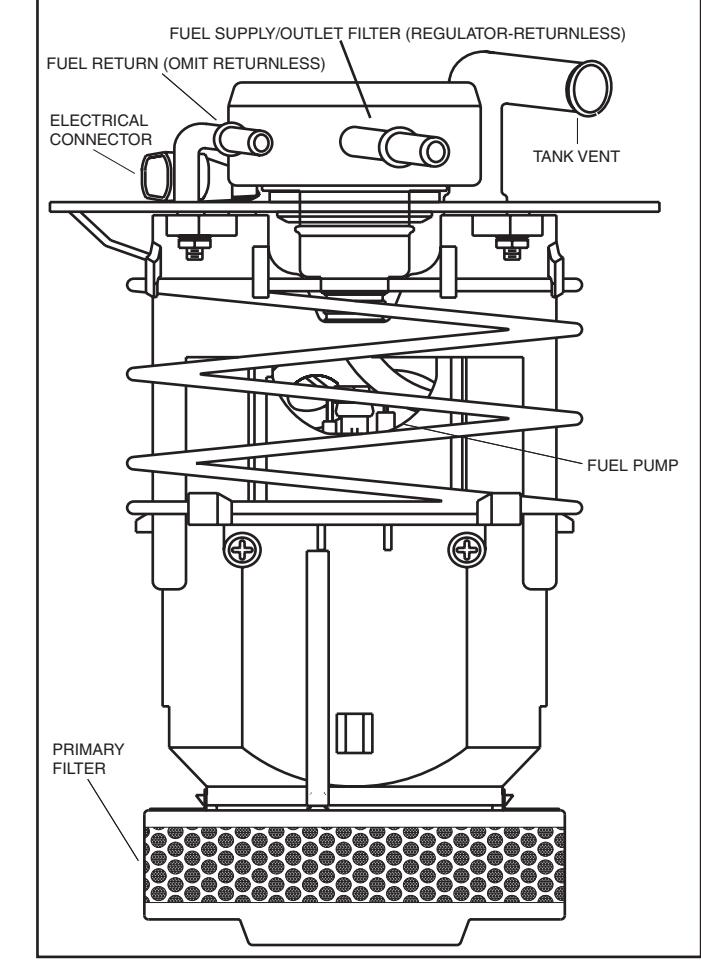

Figure 3-2 - Fuel Pump Module

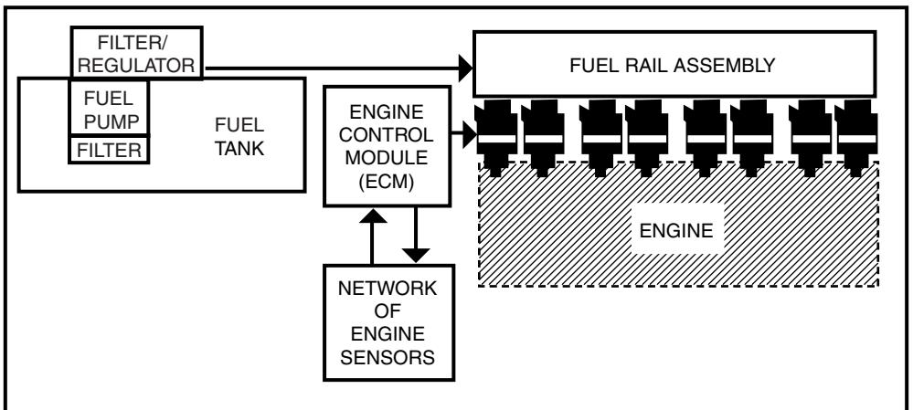

Figure 3-1b - Fuel Metering System (Pump-in-Tank Returnless)

{31}------------------------------------------------

# **Fuel Pump Electrical Circuit**

When the ignition switch is turned "ON," the ECM turns the fuel pump relay "ON" for two seconds causing the fuel pump to pressurize the fuel system.

When the ignition switch is turned to the crank position, the ECM turns the fuel pump relay "ON" causing the fuel pump to run.

If the ECM does not receive ignition reference pulses (engine cranking or running), it shuts "OFF" the fuel pump relay, causing the fuel pump to stop.

An inoperative fuel pump relay will result in an "Engine Cranks But Will Not Run" condition.

# **Fuel Rail Assembly**

The fuel rail (Figure 3-3) is mounted to the engine intake manifold, and performs several functions. It positions the injectors in the intake manifold, distributes fuel evenly to the injectors, and integrates the fuel pressure regulator into the fuel metering system.

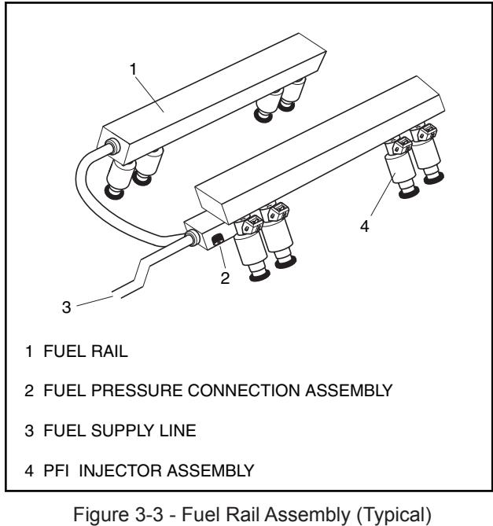

#### **Fuel Injectors**

The Port Fuel Injection (PFI) injector assembly is a solenoidoperated device, controlled by the ECM, that meters pressurized fuel to a single engine cylinder (Figure 3-4). The ECM energizes the injector solenoid, which opens a ball valve, allowing fuel to flow past the ball valve, and through a recessed flow director plate. The director plate has six machined holes that control the fuel flow, generating a conical spray pattern of finely atomized fuel at the injector tip. Fuel is directed at the intake valve, causing it to become further atomized and vaporized before entering the combustion chamber.

An injector that is stuck partly open would cause loss of pressure after engine shut down. Consequently, long cranking times would be noticed. Dieseling could also occur, because some fuel could be delivered to the engine after the ignition is turned "OFF." A fuel injector that does not open, may cause a "no-start" or a misfire.

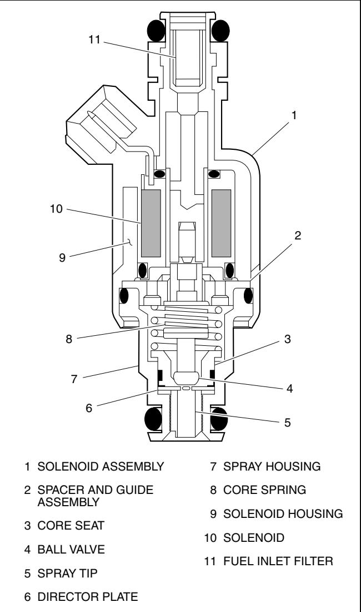

Figure 3-4 - PFI Injector Assembly (Typical)

{32}------------------------------------------------

#### **Throttle Body Assembly** 1 THROTTLE BODY ATTACHING BOLT

The throttle body assembly is attached to the intake manifold air plenum, and is used to control air flow into the engine, thereby controlling engine output (Figure 3-5). The throttle plates within the throttle body are opened by the driver through the throttle controls. During engine idle, the throttle plates are closed, and air flow control is handled by the Idle Air Control (IAC) valve, described below. 2 THROTTLE BODY ASSEMBLY5 FUEL PRESSURE REGULATOR

The throttle body also provides the location for mounting the TP sensor and for sensing changes in engine vacuum due to throttle plates position. 6 INTAKE MANIFOLD ASSEMBLY3

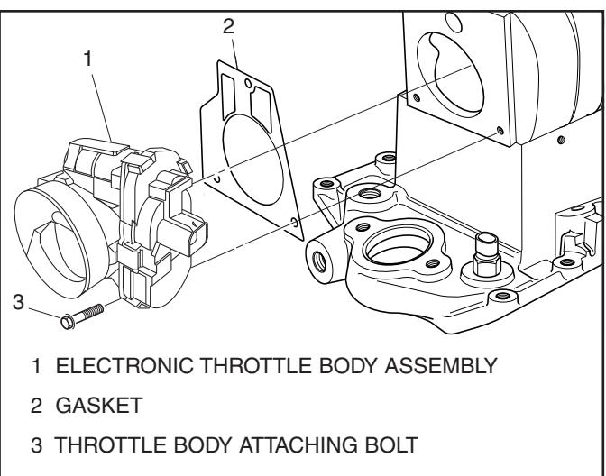

Figure 3-5 - Throttle Body Assembly, Cable Actuated

# **On-Board Service**

#### **Caution:**

**To reduce the risk of fire and personal injury, relieve fuel system pressure before servicing fuel system components.**

**After relieving fuel pressure, a small amount of fuel may be released when servicing fuel lines or connections. To reduce the chance of personal injury, cover fuel line fittings with a shop towel before disconnecting to catch any fuel that may leak out. Place the towel in an approved container when disconnection is completed.** 6

{33}------------------------------------------------

# **Fuel Control On-Board Service**

The following is general information required when working on the fuel system:

- Always keep a dry chemical fire extinguisher near the work area.
- Fuel pipe fittings require new O-rings when assembling.
- Do not replace fuel pipe with fuel hose.
- Always bleed off fuel pressure before servicing any fuel system components.
- Do not do any repairs on the fuel system until you have read the instructions and checked the figures relating the repair.
- Observe all notices and cautions.

# **Fuel Pressure Relief Procedure**

#### Tool Required:

J 34730-1, Fuel Pressure Gauge

#### **Important**

- Refer to manufacturer's warnings and cautions before proceeding.
- 1. Disconnect negative battery cable to avoid possible fuel discharge if an accidental attempt is made to start the engine.
- 2. Loosen fuel filler cap to relieve any tank vapor pressure.
- 3. Connect fuel pressure gauge J 34730-1 to fuel pressure connector assembly. Wrap a shop towel around fitting while connecting the gauge to avoid any spillage.
- 4. Install bleed hose into an approved container and open valve to bleed system pressure. Fuel connections are now safe for servicing.
- 5. Drain any fuel remaining in the gauge into an approved container.

#### **Flame Arrestor**

#### **Remove or Disconnect**

- 1. Flame arrestor retaining clamp.
- 2. Flame arrestor.

#### **Inspect**

• Flame arrestor element for dust, dirt or water. Replace if required.

#### **Install or Connect**

- 1. Flame arrestor to throttle body.
- 2. Flame arrestor retaining clamp to flame arrestor.

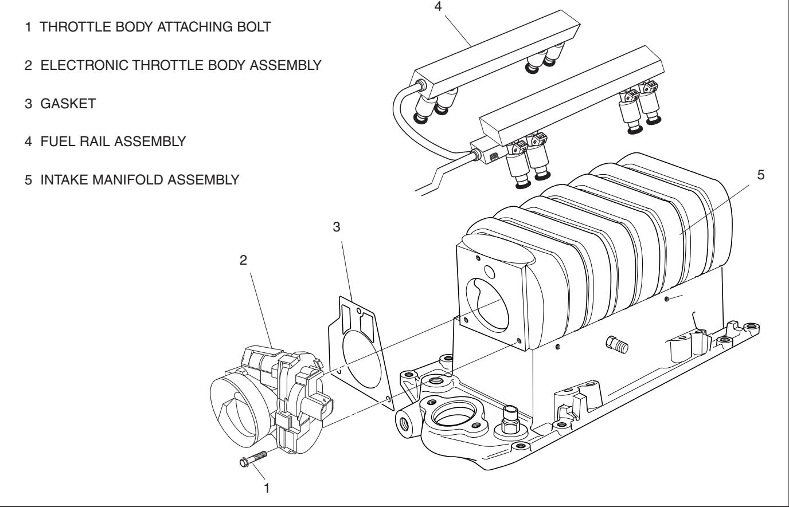

Figure 3-6 - Fuel Rail and Throttle Body Assemblies (Typical)

{34}------------------------------------------------

#### **Throttle Body Assembly**

#### Figures 3-7 and 3-8

The throttle body assembly repair procedures cover component replacement with the unit on the vessel. However, throttle body replacement requires that the complete unit be removed from the engine.

#### **Clean**

#### **Important**

- Do not soak the throttle body in cold immersion type cleaner. The throttle valves have a factory applied sealing compound (DAG material is applied to outside edge of each valve and throttle bore) to prevent air bypass at closed throttle. Strong solvents or brushing will remove the material. To clean the throttle body following disassembly, use a spray type cleaner such as GM X66-A or GM 1052626. Use a shop towel to remove heavy deposits.
- When cleaning electronic throttle bodies, extreme care should be taken not to allow solvents of any kind in or near the actuator motor.

**Notice:** The TP sensors and the TAC Motor are electrical components and should NOT come in contact with solvent or cleaner as they may be damaged.

#### **Remove or Disconnect**

- 1. Negative battery cable.
- 2. Flame arrestor.
- 3. Electrical connector from Electronic Throttle Body.
- 4. Vacuum lines.
- 5. Throttle adjuster to throttle body cable.
- 6. Throttle body attaching bolts.
- 7. Throttle body assembly and flange gasket.
	- Discard gasket.

#### **Clean**

**Notice:** Use care in cleaning old gasket material from machined aluminum surfaces as sharp tools may damage sealing surfaces.

• Gasket sealing surfaces.

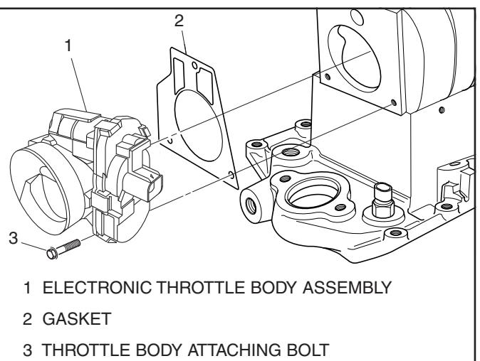

#### **Install or Connect**

2

- 1. Throttle body assembly with new flange gasket.
- 2. Throttle body attaching bolts. Torque to 15 N•m (11 lb.ft.).
- 3. Throttle adjuster to throttle body cable.
- 4. Vacuum lines.
- 5. Electrical connector to Electronic Throttle Body.
- 6. Flame arrestor.
- 7. Negative battery cable.

#### **Inspect**

- With the engine "OFF," check to see that the throttle lever is free.
- Move the throttle lever to wide open throttle and release.

Reset proper idle speed:

- Move throttle lever slightly.
- Start and run engine for 5 seconds.
- Turn ignition "OFF" for 10 seconds.
- Restart engine and check for proper idle operation.

{35}------------------------------------------------

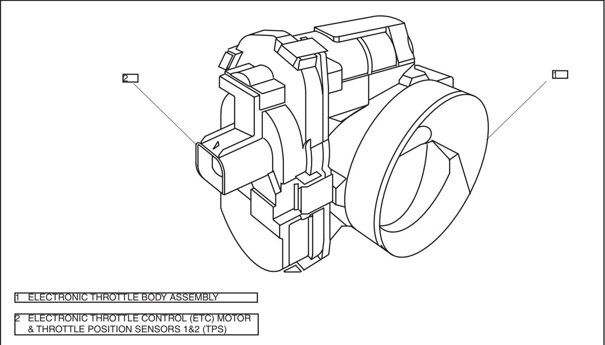

Figure 3-8 - Electronic Throttle Body Assembly (Typical)

{36}------------------------------------------------

#### **Fuel Rail Assembly**

#### Figures 3-9 and 3-10

The fuel rails should be removed as an assembly with the injectors attached. Names of component parts will be found on the numbered list that accompanies the disassembled view (Figure 3-13).

#### **Notice:**

- Use care in removing the fuel rail assembly to prevent damage to the injector electrical connector terminals and the injector spray tips.
- When removed, support the rail to avoid damaging its components.
- Prevent dirt and other contaminants from entering open lines and passages. Fittings should be capped and holes plugged during servicing.

#### **Clean**

• Before removal, the fuel rail assembly may be cleaned with a spray type engine cleaner, following package instructions. Do Not soak fuel rails in liquid cleaning solvent.

#### **Caution: Safety glasses must be worn when using compressed air as flying dirt particles may cause eye injury.**

• Where injectors fit into intake manifold, use compressed air to blow out dirt from around injectors before removing.

#### **Remove or Disconnect**

**Caution: To reduce the risk of fire and personal injury, relieve the fuel system pressure before servicing the fuel system components.**

- 1. Negative battery cable.
- 2. Relieve fuel pressure.
	- Refer to the "Fuel Pressure Relief Procedure."
	- Fuel pressure connector assembly is located on right side rail in center of fuel rail.
- 3. Fuel inlet line, hold fitting in rail with a wrench to keep from turning.
- 4. Fuel outlet fitting at pressure regulator.
	- Hold pressure regulator with a wrench to keep from turning and damaging.
- 5. Vacuum line to fuel pressure regulator.
- 6. Retaining screw for pressure regulator and pressure regulator.
- 7. Electrical connectors from injectors.
	- To release electrical connector from injector, squeeze on metal loop with thumb and pull connector from injector.
- 8. Move wire harness out of way.
- 9. Four attaching screws for fuel rail.
- 10. Fuel rails as an assembly with injectors.
- 11. Injectors from rails, follow procedure for injector removal outlined in this section.
- 12. Retaining screws for fuel rail jumper line.
- 13. Twist and remove jumper line from rail.

#### **Clean and Inspect**

**Notice:** If it is necessary to remove rust or burrs from the fuel rail pipes, use emery cloth in a radial motion with the tube end to prevent damage to the O-ring sealing surface.

- Use a clean shop towel to wipe off male pipe ends.
- Inspect all connectors for dirt and burrs. Clean or replace components/assemblies as required.

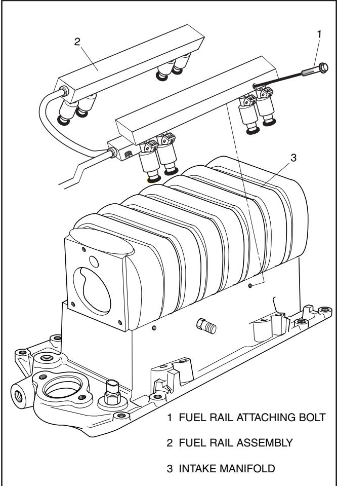

Figure 3-9 - Fuel Rail Removal and Installation (Typical)

{37}------------------------------------------------

#### **Disassemble**

• Injector O-ring seal from spray tip end of each injector. Discard O-ring seals.

#### **Assemble**

• Lubricate new injector O-ring seals with clean engine oil and install on spray tip end of each injector.

#### **Install or Connect**

- 1. Lubricate new O-ring seals and install on rail jumper line ends.
- 2. Rail jumper line in rails, long side of jumper to left rail.
- 3. Jumper line attaching screws. Torque to 7 N•m (62 lb.in.).
- 4. Lubricate injector O-ring seals and install injectors following injector installation procedure outlined in this section.
- 5. Fuel rails as an assembly with injectors onto intake manifold.
- If injectors are lined up properly they will slide into place.
- Push gently and evenly on rail to set injectors all the way into their bores
- 6. Fuel rail attaching screws. Torque to 10 N•m (88 lb.in.).
- 7. Injector electrical connectors and secure harness in place.
- 8. Lubricate new O-ring seal on pressure regulator and install pressure regulator.
- 9. Pressure regulator attaching screw. Torque to 9.5 N•m (84 lb.in.).
- 10. Vacuum line to fuel pressure regulator.
- 11. Lubricate new O-ring seal on pressure regulator outlet fitting and tighten fitting, careful not to twist regulator. Torque to 17.5 N•m (13 lb.ft.).
- 12. Inlet fuel line.
- 13. Negative battery cable.
- 14. Prime fuel system by cycling key "ON" and "OFF" a few times with engine "OFF."

#### **Inspect**

• Turn ignition switch to the "ON" position for 2 seconds, then turn to the "OFF" position for 10 seconds. Turn the ignition switch back to the "ON" position and check for fuel leaks.

{38}------------------------------------------------

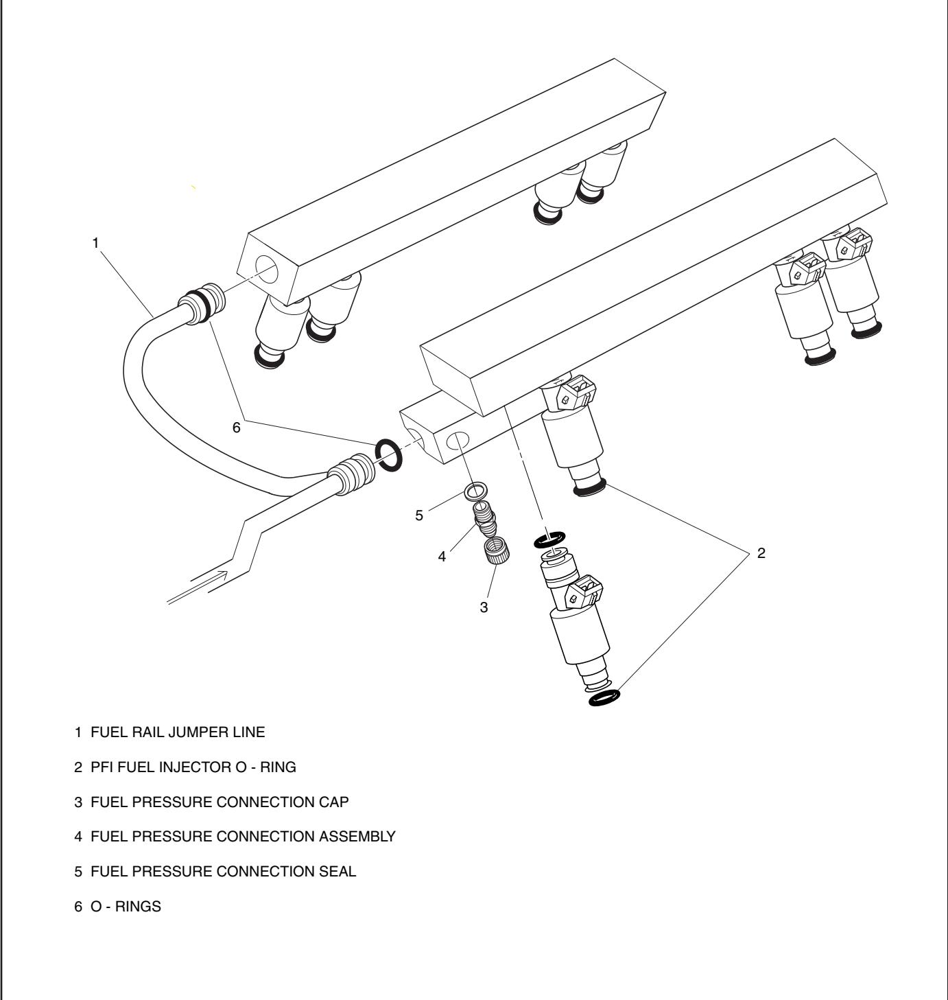

Figure 3-10 - Fuel Rail Assembly (Typical)

{39}------------------------------------------------

# **Fuel Injectors**

#### Figures 3-11

**Notice:** Use care in removing injectors to prevent damage to the injector electrical connector pins or the injector spray tips. The fuel injector is serviced as a complete assembly only. Since it is an electrical component, Do Not immerse it in any cleaner.

#### **Remove or Disconnect**

- 1. Negative battery cable.
- 2. Relieve fuel pressure.
	- Refer to the "Fuel Pressure Relief Procedure."
- 3. Fuel rail assembly following the procedures outlined in this section.

#### **Disassemble**

- 1. Release injector clip by sliding off injector (Figure 3- 14).
- 2. PFI injector from rail.
- 3. Injector O-ring seals from both ends of the injector and discard.
- 4. Injector retainer clip from rail.

#### **Clean and Inspect**

- Injector bores in fuel rail and intake manifold for nicks, burrs or corrosion damage. If severe, replace. Clean lightly with emery cloth in a radial motion.
- Injector O-ring seal grooves for nicks, burrs or corrosion. Replace injector if damaged. Clean with spray cleaner and wipe groove clean with lint free cloth.
- Do Not use abrasive materials or wire brush on injectors. They are plated with an anti-corrosive material.

#### **Important**

• When ordering individual replacement fuel injectors, be sure to order the identical part number that is inscribed on the old injector.

#### **Assemble**

- 1. Lubricate new injector O-ring seals with clean engine oil and install on injector.
- 2. New retainer clip onto injector.
- 3. PFI fuel injector assembly into fuel rail injector socket with electrical connector facing outward.
- 4. Rotate injector retainer clip to locking position.

#### **Install or Connect**

- 1. Fuel rail assembly following procedures outlined in this section.
- 2. Negative battery cable.

#### **Inspect**

• Turn ignition switch to the "ON" position for 2 seconds, then turn to the "OFF" position for 10 seconds. Turn the ignition switch back to the "ON" position and check for fuel leaks.

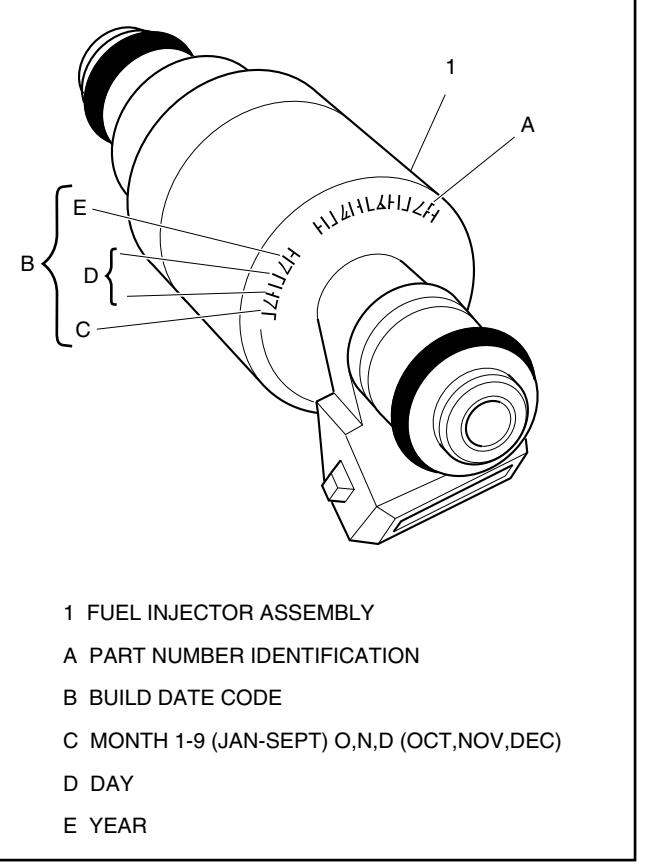

Figure 3-11 - Injector Part Number Location

{40}------------------------------------------------

## **Fuel Pump**

Figure 3-12

#### **Important**

- Fuel pressure must be relieved before servicing the fuel pump.
- Refer to "Fuel Pressure Relief Procedure."

#### **Remove or Disconnect**

- 1. Negative battery cable.
- 2. Fuel pump module electrical connector.
- 3. Supply and return fuel line fittings.
- 4. Fuel tank vent hose.
- 5. Fuel pump module.

**Notice:** Make sure to replace the fuel pump module with the identical part number.

#### **Install or Connect**

- 1. Fuel pump module.
- 2. Fuel tank vent hose.
- 3. Supply and return fuel line fittings.
- 4. Fuel pump module electrical connector.
- 5. Negative battery cable.

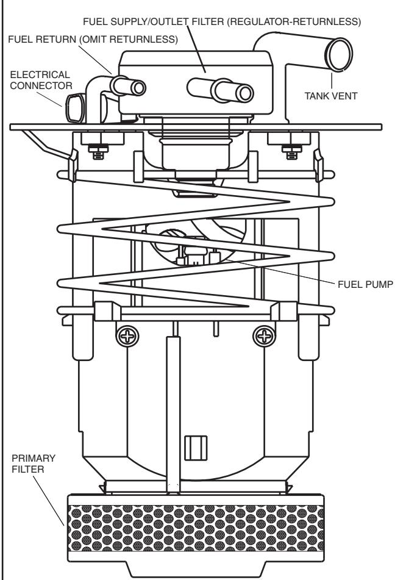

Figure 3-12 - Fuel Pump, In Tank (Typical)

#### **Inspect**

• Turn ignition switch to the "ON" position for 2 seconds, then turn to the "OFF" position for 10 seconds. Turn the ignition switch back to the "ON" position and check for fuel leaks.

# **Fuel Pump Relay**

Figure 3-13

#### **Remove or Disconnect**

- 1. Retainer, if installed.
- 2. Fuel pump relay electrical connector.
- 3. Fuel pump relay.

#### **Important**

• The fuel pump relay is a electrical component. Do Not soak in any liquid cleaner or solvent as damage may result.

#### **Install or Connect**

- 1. Fuel pump relay.
- 2. Fuel pump relay electrical connector.
- 3. Retainer clip.

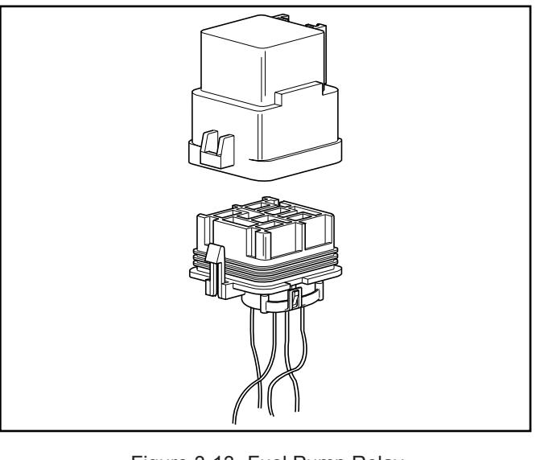

Figure 3-13- Fuel Pump Relay

{41}------------------------------------------------

# **In-Line Fuel Filter (Pump-in-Tank)**

Figure 3-14

#### **Important**

- Fuel pressure must be relieved before servicing the fuel pump.
- Refer to "Fuel Pressure Relief Procedure."

#### **Remove or Disconnect**

- 1. Supply fuel line.
- 2. Filter from module mounting flange.
- 3. Fuel supply tube from fuel pump.

#### **Inspect**

• In-line fuel filter for being plugged or contaminated. Replace as necessary.

#### **Install or Connect**

- 1. Fuel supply tube from fuel pump.
- 2. Filter in module mounting flange.
- 3. Supply fuel line

#### **Inspect**

- Filter to mounting flange gasket for poper installation.
- Turn ignition switch to the "ON" position for 2 seconds, then turn to the "OFF" position for 10 seconds. Turn the ignition switch back to the "ON" position and check for fuel leaks.

#### **Important**

• Fuel system needs to be primed and air bled out of the lines before the engine is started. Follow manufacturers recommendation for priming fuel system.

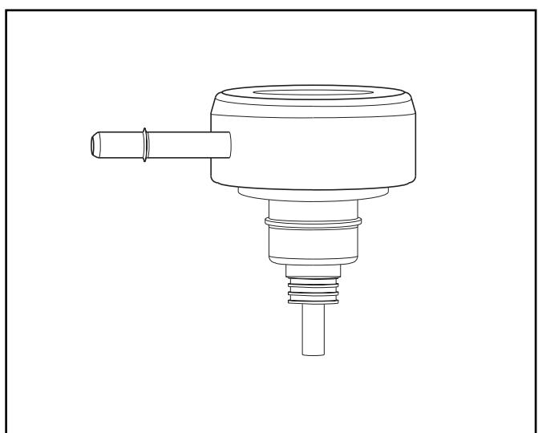

Figure 3-14 - In-Line Fuel Filter/Regulator (Typical)

## **Primary Fuel Filter, In-Tank**

#### Figure 3-15

#### **Important**

- Fuel pressure must be relieved before servicing the fuel pump.
- Refer to "Fuel Pressure Relief Procedure."

#### **Remove or Disconnect**

- 1. Fuel pump module from tank.
- 2. Filter from module reservior bottom.

#### **Inspect**

• Primary fuel filter for being plugged or contaminated. Replace as necessary.

#### **Install or Connect**

- 1. Filter on bottom of module reservior.
- 2. Fuel pump module in the tank.

#### **Inspect**

- Filter for poper installation.
- Turn ignition switch to the "ON" position for 2 seconds, then to the "OFF" position for 10 seconds. Turn the ignition switch back to the "ON" position and check for fuel leaks.

#### **Important**

• Fuel system needs to be primed and air bled out of the lines before the engine is started. Follow manufacturers recommendation for priming fuel system.

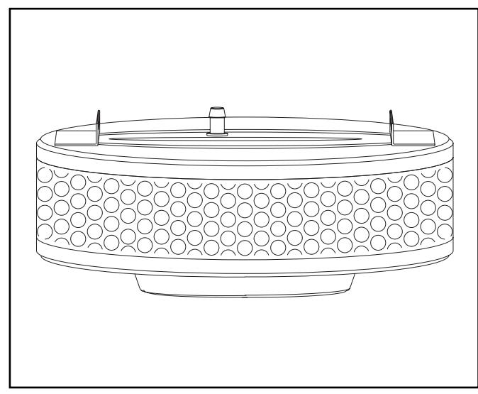

Figure 3-15 - Primary Fuel Filter

{42}------------------------------------------------

# **Torque Specifications**

# **Fastener Tightening Specifications**

| Application                             | N•m  | Lb Ft | Lb In |
|-----------------------------------------|------|-------|-------|
| Throttle Body Attaching Screws          | 15   | 11    |       |
| IAC Valve Attaching Screws              | 3.2  |       | 28    |
| Fuel Pressure Connector                 | 13   |       | 115   |
| Fuel Pressure Regulator Attaching Screw | 9.5  |       | 84    |
| Fuel Pressure Regulator Outlet Line Nut | 17.5 | 13    |       |
| Fuel Rail Jumper Line Attaching Screws  | 7    |       | 62    |
| Fuel Rail Attaching Screws              | 10   |       | 88    |

{43}------------------------------------------------

# **Fuel & Air Metering System - Port Fuel Injection (PFI) - 5.7L**

# **Electronic Throttle Control Description**

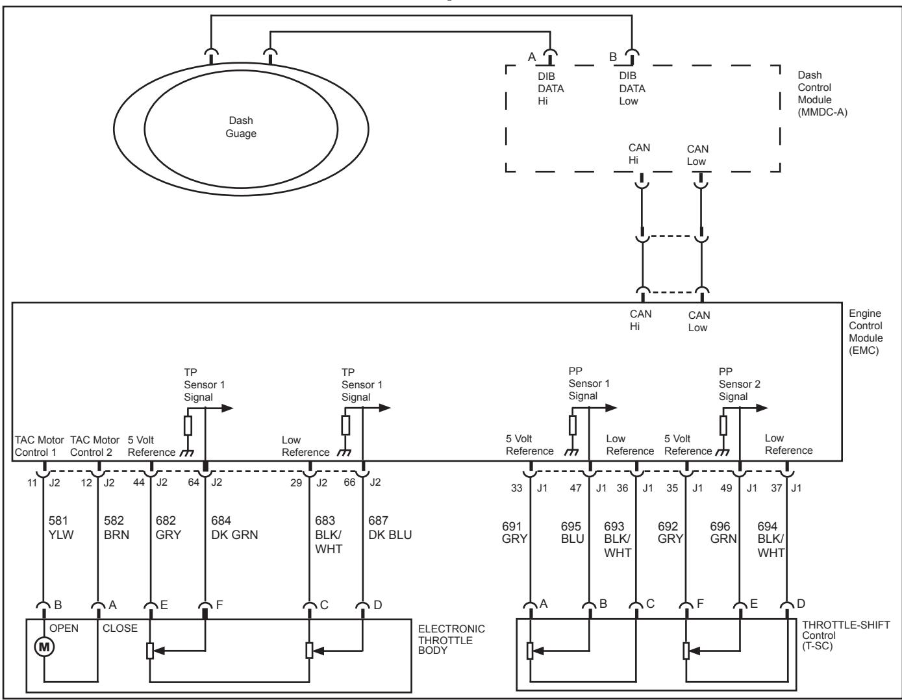

# **Electronic Throttle Control (ETC) Components**

The Electronic Throttle Control (ETC) system uses the boat electronics and components in order to calculate and control the position of the throttle blade. This system eliminates the need for a mechanical cable attachment from the Throttle-Shift Control (T-SC) to the electronic throttle body assembly.

The ETC system components include the following:

- The ECM
- The Throttle Position Sensor (TPS) is located in a sealed housing, which is mounted to the side of the electronic throttle body assembly.
- The Throttle Actuator Control (TAC) motor is located within the same sealed housing as the TPS.
- The Pedal Position Sensor (PPS) is located within a sealed housing mounted to the Throttle-Shift Control (T-SC).

Each of these components interface together in order to ensure accurate calculations, and in order to control the throttle position.

# **Engine Control Module (ECM)**

The Engine Control Module (ECM), located on the engine, is the control center of the fuel injection system. It controls the following:

- Fuel metering system
- Ignition timing
- Idle speed
- On-board diagnostics for engine functions
- Boat speed
- Throttle position

It constantly looks at the information from various sensors, and controls the systems that affect engine performance. The ECM also performs the diagnostic function of the system. It can recognize operational problems, alert the driver through the Malfunction Indicator Lamp (MIL) and store diagnostic trouble codes which identify the problem areas to aid the technician in making repairs.

{44}------------------------------------------------

#### **ECM Function**

The ECM supplies either 5 or 12 volts to power various sensors or switches. This is done through resistances in the ECM which are so high in value that a test light will not illuminate when connected to the circuit. In some cases, an ordinary voltmeter will not give an accurate reading because its resistance is too low. Therefore, a digital voltmeter with at least 10 megohms input impedance is required to ensure accurate voltage readings. Tool J 39978, Fluke 78 or Fluke 87 meets this requirement. The ECM controls output circuits such as the injectors, relays, etc. by controlling the ground or power feed circuit.

The ECM also controls the Electronic Throttle Control (ETC). The ECM monitors the commanded throttle position and compares the commanded position to the actual throttle position. This is accomplished by monitoring the Pedal Position Sensors (PPS) (located on the Throttle-Shift Control [T-SC]) and the Throttle Position Sensors (TPS). These two values must be within a calibrated value of each other. The ECM also monitors each individual circuit of the TPSs, and of the PPSs to verify proper operation (the Pedal Position Sensor reads the degree of movement of the Throttle-Shift Control from 0 degrees at locked neutral, to 120 degrees at Wide Open Throttle [WOT]).

#### **Electronic Throttle Body Assembly**

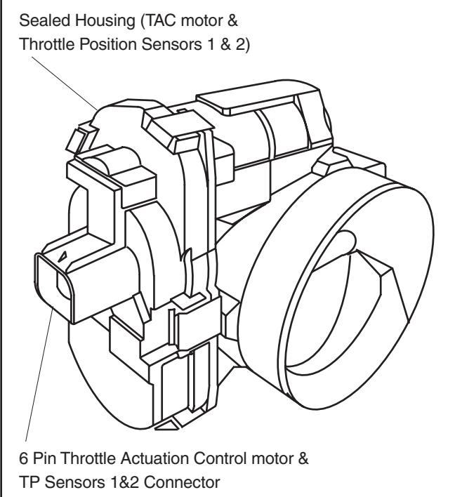

The Electronic Throttle Body Assembly consists of the electronic throttle body, the Throttle Position Sensors (2), and the Throttle Actuation Control (TAC) motor. The throttle body has a sealed housing mounted to the side of it, which contains the two Throttle Position Sensors (TPS) and the Throttle Actuation Control (TAC) motor. The electronic throttle body assembly is connected to the ECM by a single 6 pin connector to the wiring harness.

#### **Throttle Position Sensor (TPS)**

The Throttle Position Sensor (TPS) and the Throttle Actuation Control (TAC) motor are contained within a sealed housing mounted onto the side of the electronic throttle body assembly. If one of these components should become defective the electronic throttle body assembly must be replaced as a complete unit.

The TPS is actually two individual sensors within the above mentioned sealed housing. The TPSs use two separate signal circuits, however the two sensors share one low reference circuit and one, 5 volt reference circuit.

The TPS 1 signal voltage is pulled up to the reference voltage as the throttle opens, from ~0.6 volts at closed throttle to ~4.3 volts at wide open throttle (WOT). The TPS 2 signal voltage is pulled down to the reference voltage as the throttle opens, from ~4.3 volts at closed throttle to ~0.6 volts at WOT.

TPS 1 and Pedal Position Sensor (PPS) 1 share a 5 volt reference circuit that is connected within the ECM. TPS 2 and Pedal Position Sensor (PPS) 2 also share a 5 volt reference circuit that is connected within the ECM.

The PPS 1 signal voltage is pulled up to the reference voltage as the throttle opens, from ~0.45 volts at closed throttle to ~4.18 volts at wide open throttle (WOT). The PPS 2 signal voltage is pulled down to the reference voltage as the throttle opens, from ~4.55 volts at closed throttle to ~0.82 volts at WOT.

#### **Throttle Actuation Control (TAC) Motor**

The Throttle Actuation Control (TAC) motor and the TPSs are located within one sealed housing mounted onto the side of the electronic throttle body. If one of these components should become defective, the electronic throttle body assembly must be replaced as a complete unit. The unit is connected to the ECM by one 6 pin connector.

The TAC motor is used to control the throttle position instead of a mechanical cable. This system eliminates the need for a mechanical cable attachment from the T-SC to the electronic throttle body assembly. The TAC motor also controls the throttle opening for idle and cold start/fast idle functions, thereby eliminating the need for an Idle Air Control (IAC) valve.

{45}------------------------------------------------

#### **Throttle-Shift Control (T-SC)**

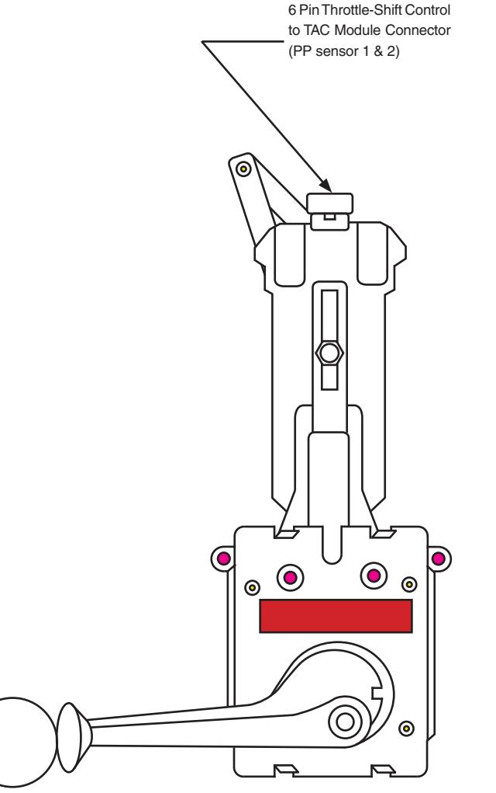

The production Throttle-Shift Control (T-SC) unit is setup up for dual function in a single lever. It controls both shifting and throttle by a mechanical cable and by electronic throttle movement. Added features include a neutral interlock to help prevent accidental shifting and crisp positive detents. Also, the control has a push button clutch disengagement feature for warm-up and start-up adjustments for increased throttle. The throttle control is designed with neutral as the center location and is in gear when the lever is moved forward to crisp positive detent thirty degrees. The transmission cable is pulled with a one-to-one ratio as the lever rotates for the thirty degrees while the throttle blade is in the closed position. After the first thirty-five degrees, the throttle blade will begin to move and the transmission cable will stay at the thirty degree location. Maximum throttle is approximately one hundred twenty-five degrees. Reverse works in the same manner.

#### **Pedal Position Sensor**

The Pedal Position Sensor (PPS) is mounted on the T-SC. The PPS is actually two individual position sensors within one housing. The PPSs use two separate signal circuits, two low references, and two 5 volt reference circuits to connect the PPSs to the ECM.

**Note:** The two PPSs operate in slightly different voltage ranges. Some variation in voltage above or below the normal calibration is acceptable, however more than approximately 0.15 volts will set a PPS 1-2 Correlation Fault.

The PPS 1 voltage should increase from below 1 volt at closed throttle to above 3.75 volts at WOT.

The PPS 2 voltage should decrease from below 5 volts at closed throttle to above 1 volt at WOT.

#### **Indmar's Throttlemate**

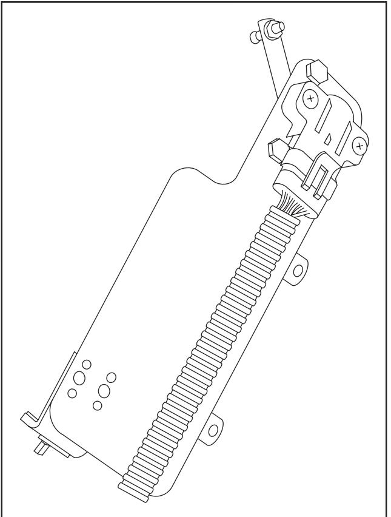

{46}------------------------------------------------

#### **Electronic Throttle Control (ETC) Basics**

**Function:** Replaces the mechanical cable link from the Throttle-Shift Control (T-SC) to electronic throttle body assembly with a system of sensors and computer controlled throttle.

#### **Components:**

**Throttle Position Sensor (TPS 1 & 2):** These two individual sensors are housed together with one Throttle Actuation Control (TAC) motor within one sealed compartment. That sealed compartment is permanently mounted to the side of the electronic throttle body. There is one, 6 wire, connector plug leading from the electronic throttle body to the main wiring harness and eventually to the ECM.

**Pedal Position Sensor (PPS 1 & 2):** These two individual sensors, are housed together in one sealed compartment. That compartment is permanently attached to the aft end of the T-SC. There is one, six wire, connector plug leading directly from the T-SC to the ECM.

**ECM:** The ECM is the control center for the Electronic Throttle Control (ETC) system as well as the rest of the engine electronics. It communicates between the different sensors and the TAC motor. It constantly monitors the sensor readings.

The ECM continuously compares the voltage readings between TPS 1 and TPS 2. It looks for any variance from their normal operating voltage ranges. If variance is found a **TPS 1-2 Correlation** fault is set.

The ECM also monitors both TPS 1 and TPS 2 in case of a disconnected condition. If one of these sensors should become disconnected, then a **TPS 1 Out of Range or a TPS 2 Out of Range** fault will set. An **ETC Limited Authority** will also set (see Diagnosing the ETC system below for explanation). If this occurs the engine goes to idle.

Additionally, the ECM continuously compares the voltage readings between PPS 1 and PPS 2. It watches for any variance from their normal operating voltage ranges. If variance is found a **PPS 1-2 Correlation** fault will set.

The ECM also monitors both PPS 1 and PPS 2 in case of a disconnected condition. If one of these sensors becomes disconnected, then either a **PPS 1 Out of Range or a PPS 2 Out of Range** fault will set. An **ETC Limited Authority** will also set (see Diagnosing the ETC system below for explanation). If this occurs the engine goes into power reduction mode.

The ECM compares the predicted throttle position and the actual throttle position. The predicted throttle position is the amount of throttle called for by the pedal position sensor, which indicates how much throttle the driver wants. The actual throttle position is the current location (angle) of the throttle blade in the throttle body.

The ECM continuously compares the commanded throttle position and the actual throttle position. The commanded throttle position is the amount of throttle (degree of angle the throttle blade is set at) called for by the location of the Throttle-Shift Control (T-SC) from neutral to Wide Open Throttle (WOT). The actual throttle position is the current exact location or angle of the throttle blade.

The ECM continuously tests the integrity of the data within itself. If there is a loss of integrity in the ECM data, or an inability to write or read data to and from the RAM, or an inability to correctly read data from the flash memory, or an internal ECM processor fault, then **an ETC Process** fault sets.

{47}------------------------------------------------

#### **Optional Cruise Control System**

#### The following information is reprinted from the 2005 Owners Manual:

On boats equipped with a Cruise Control System, it is possible to review various functions by toggling to the cruise control read-outs on the multi-function gauge explained earlier in this section. Note also that the throttle position must always be greater than the speed set on the cruise control. For example, if the cruise was set at 35 mph but the throttle-shift position is equivalent to 25 mph, the boat will not reach 35. This is also true of the RPMs. Also, the cruise control cannot be engaged when the boat is at idle speed.

#### **System Start-Up:**

When the ignition is turned ON, the cruise control system starts in OFF mode. While it is in OFF mode, the LCD display will show the current time.

#### **RPM Set-Point Adjustment:**

In order to adjust the RPM Set Point in OFF Mode, first move the RPM/SPEED mode selection switch to the RPM position. Using the +/- switch, select the desired Set point. The RPM icon will illuminate and the LCD will display the current Set Point. Briefly pressing the +/- switch will increase or decrease the Set Point by 20 RPM. Holding the switch will increase or decrease by 100 RPM. The RPM Set Point is limited to a minimum of 1200 RPM and a maximum of 5000 RPM.

#### **Speed Set Point Adjustment:**

In order to adjust the Speed Set Point in OFF Mode, first move the RPM/SPEED Mode selection switch to the SPEED position. Use the +/- switch to select the desired Set Point. The SPEED icon will illuminate and the LCD will display the current Set Point. Briefly pressing the +/- switch will increase or decrease the Set Point by 0.2 MPH. Holding the switch increases or decreases the Set Point by 1.0 MPH. The Speed Set Point is limited to a minimum of 5.0 MPH and a maximum of 50 MPH.

#### **Activating RPM Cruise Control Mode:**

To activate the Cruise Control System in RPM Control mode, make sure that the RPM / SPEED mode selection switch is in the RPM position and that current engine speed is at least 400 RPM less than the Set Point. Press and hold the ON/OFF switch in the ON position for approximately one second. The LCD should now display the current engine speed, the RPM icon should be illuminated and the LOCK icon should be blinking.

#### **Turning On Speed Cruise Control Mode:**

To turn on the Cruise Control in Speed Control mode, make sure that the RPM/SPEED mode selection is at least 3.0 MPH less than the Set Point. Press and hold the ON/OFF switch in the ON position for approximately one second. The LCD should now display the current vessel speed, the SPEED icon should be illuminated and the LOCK icon should be blinking.

#### **Activating Manual Cruise Control Mode:**

To activate the Cruise Control in Manual Control mode, make sure that the RPM/SPEED mode selection switch is in the MANUAL (center) position and that current engine speed is at least 1200 RPM.Then press and hold the ON/OFF switch in the ON position for approximately one second. The LCD should display the current engine speed and the LOCK icon should be blinking.

#### **Manual Set Point Adjustment:**

The Manual Set Point can be adjusted using the +/- switch. The LOCK icon will disappear and the LCD will display the current Set Point. Short presses of the +/- switch will increase or decrease the Set Point by 20 RPM. Holding the switch increases or decreases the Set Point by 100 RPM. The Manual Set Point is limited to a minimum of 1200 RPM and a maximum of 5000 RPM.

#### **Using Speed Control Mode:**

Manual Control works basically in the same way that RPM Control Mode does. The difference is that when the system is turned ON in manual mode the Set Point is set to the current engine speed. For example, if the Cruise Control is OFF and the engine speed is 2500 RPM, and the system is turned on, the engine will hold the engine speed at 2500 RPM.

#### **Disengaging the Cruise Control System:**

There are two ways to disengage the system: Pulling back the throttle will disengage the system at any time. The system remains ON and can be re-engaged by accelerating the boat until the LOCK icon stays illuminated. Or by moving the ON/OFF switch to OFF. It is recommended that the throttle be pulled back before turning OFF the system.

{48}------------------------------------------------

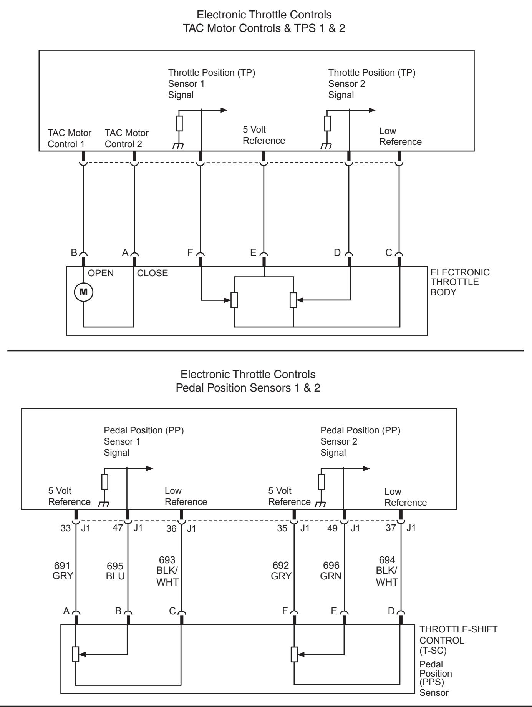

{49}------------------------------------------------

# **Section 4**

# **HVS Distributor System**

This section will describe how the HVS Distributor System operates. It will also give a description and show how to repair each component used on the Electronic Fuel Injection equipped engines.

#### **Contents**

| General Information Page 2                  |  |
|---------------------------------------------|--|
| MEFI 5 HVS Distributor Page 2               |  |
| Ignition Coil Driver (ICD) Module Page 3    |  |
| Ignition Coil Page 3                        |  |
| Crankshaft Position (CKP) sensor Page 4     |  |
| Camshaft Position (CMP) sensor Page 4       |  |
| Spark Plug Wires Page 4                     |  |
| Engine Control Module (ECM) Page 4          |  |
| Enhanced Ignition System Description Page 5 |  |
| System Operation Page 5                     |  |
| Ignition Control (IC) Page 5                |  |
| Knock Sensor System Description Page 5      |  |
| Purpose Page 5                              |  |
| Operation Page 5                            |  |
| Results of Incorrect Operation Page 6       |  |
| On-Engine Service Page 6                    |  |
| Distributor Replacement (HVS) Page 6        |  |
| Removal Procedure Page 6                    |  |
| Installation Procedure 1 Page 7             |  |
| Cam Angle Verification Procedure Page 9     |  |
| Installation Procedure 2 Page 10            |  |
|                                             |  |

| Distributor Overhaul Page 12                        |  |
|-----------------------------------------------------|--|
| Disassembly Procedure Page 12                       |  |
| Assembly Procedure Page 12                          |  |
| Inspection Page 18                                  |  |
| Ignition Coil and Ignition Coil Driver (ICD) Module |  |
| Replacement Page 18                                 |  |
| Crankshaft Position (CKP) Sensor                    |  |
| Replacement Page 19                                 |  |
| Camshaft Position (CMP) Sensor                      |  |
| Replacement Page 20                                 |  |
| Spark Plug Replacement Page 21                      |  |
| Spark Plug Wiring and Boots Page 22                 |  |
| Precautions Page 22                                 |  |
| Replacement Page 22                                 |  |
| Torque Specifications Page 22                       |  |

{50}------------------------------------------------

# Cautions and Notices

#### **Temperature vs Resistance**

| C                                              | F   | OHMS   |  |
|------------------------------------------------|-----|--------|--|
| Temperature vs Resistance Values (Approximate) |     |        |  |
| 150                                            | 302 | 47     |  |
| 140                                            | 284 | 60     |  |
| 130                                            | 266 | 77     |  |
| 120                                            | 248 | 100    |  |
| 110                                            | 230 | 132    |  |
| 100                                            | 212 | 177    |  |
| 90                                             | 194 | 241    |  |
| 80                                             | 176 | 332    |  |
| 70                                             | 158 | 467    |  |
| 60                                             | 140 | 667    |  |
| 50                                             | 122 | 973    |  |
| 45                                             | 113 | 1188   |  |
| 40                                             | 104 | 1459   |  |
| 35                                             | 95  | 1802   |  |
|                                                |     |        |  |
| 30                                             | 86  | 2238   |  |
| 25                                             | 77  | 2796   |  |
| 20                                             | 68  | 3520   |  |
| 15                                             | 59  | 4450   |  |
| 10                                             | 50  | 5670   |  |
| 5                                              | 41  | 7280   |  |
| 0                                              | 32  | 9420   |  |
| -5                                             | 23  | 12300  |  |
| -10                                            | 14  | 16180  |  |
| -15                                            | 5   | 21450  |  |
| -20                                            | -4  | 28680  |  |
| -30                                            | -22 | 52700  |  |
| -40                                            | -40 | 100700 |  |

{51}------------------------------------------------

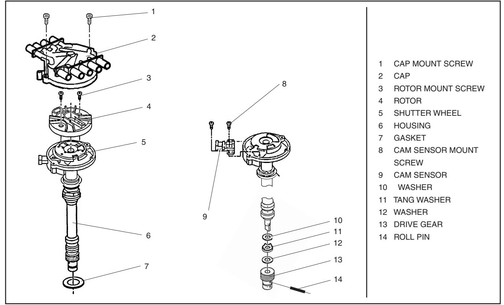

Figure 4-1 - MEFI 5 HVS Distributor

# **General Information**

The Distributor is actually an assembly that contains the Camshaft Position (CMP Sensor), cap, rotor and shaft. The Distributor is splined by a helical gear to the camshaft and rotates providing a spark to each spark plug wire. When servicing the Distributor, it is critical to ensure proper cap sealing to the Distributor body and correct installation to the camshaft. If the Distributor is installed a tooth off in relation to the camshaft, a DTC sets. The Distributor is repairable, refer to the Distributor Overhaul Section.

The Camshaft Position (CMP) sensor is located within the Distributor. It's operation is very similar to the Crankshaft Position (CKP Sensor) however it provides one pulse per camshaft revolution (1x signal). This signal is not detrimental to the driveability of the vehicle. The ECM utilizes this signal in conjunction with the crankshaft position to determine which cylinders are misfiring.

The high voltage switch (HVS) type distributor is like the High Energy Ignition (HEI) distributor in the following ways:

1. It contains a distributor cap and rotor that are responsible for delivering spark to the spark plugs in each cylinder in a firing order sequence defined by the location of plug wires in the distributor cap towers.

2. It is adjustable in its location by loosening the distributor hold-down bolt and foot clamp.

The High Voltage Switch (HVS) distributor differs from the standard High Energy Ignition (HEI) distributor in the following ways.

1. The HVS distributor contains a cam sensor that is affixed to the base of the distributor housing with screws.

2. The HVS distributor does not output an RPM signal, does not have an internally mounted ignition control module, and does not have a pick-up coil.

{52}------------------------------------------------

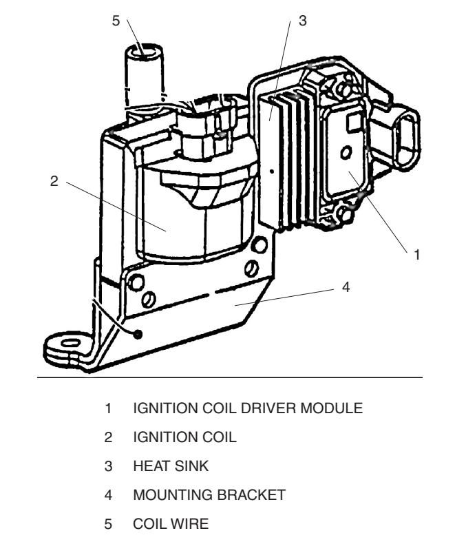

Figure 4-2 - Ignition Coil Driver Module With Separate Coil

### **Ignition Coil Driver Module**

The Ignition Coil Driver Module is mounted on a bracket next to the coil. The ECM signals the ICDM to turn ON primary current to the ignition coil by pulling the IC line high (4 volts). The ICDM turns the primary current ON and OFF by applying and removing the ground to the primary winding at the appropriate time. This module is of minimum function. The module does not contain backup calibrations that allows the engine to continue to run if the IC signal is lost.

# **Ignition Coil**

The design construction of the ignition coil (Figure 4-2) affects its output. The ignition coil was designed to produce greater spark voltage, longer spark and operate at higher RPM. The coil has the secondary winding wrapped around the primary winding, and the primary winding is wrapped around the iron core. The coil is not oil filled, the windings are covered in an epoxy compound for protection against moisture and arc over.

There is an iron laminated square frame around the coil windings. This is to increase magnetic flux path and store energy to produce higher secondary spark voltage. The coil's mounting bracket is attached to the frame.

The coil generates a high secondary voltage (up to 35,000 volts) when the primary circuit is broken. A secondary high tension wire connects from the top post of the coil to the center post of the distributor cap.

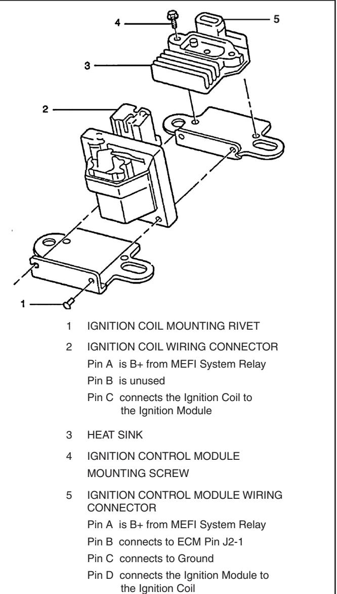

{53}------------------------------------------------

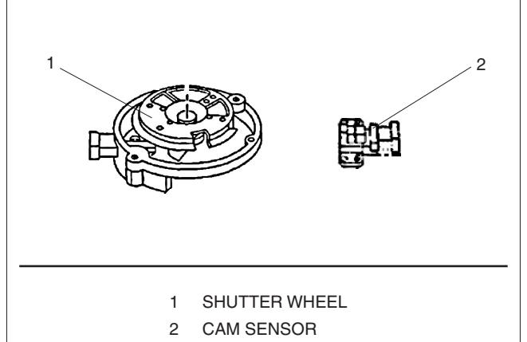

Figure 4-4 - Shutter Wheel & CAM Sensor

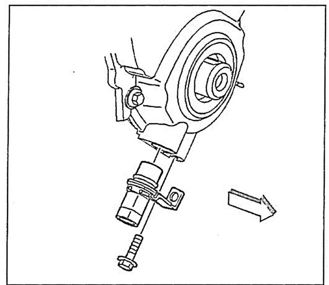

The crankshaft position sensor provides the ECM with the crankshaft speed or engine RPM and the crankshaft position. The ECM utilizes the RPM information for the operation of the fuel, spark mapping tables and a number of other operations performed by the ECM. In conjunction with the cam position sensor (CMP) it also facilitates the determination of engine misfire. The ECM monitors the CKP sensor for a momentary drop in the crankshaft speed in order to determine if a misfire is occurring. When the ECM detects a misfire, a Fault Code will set.

The ECM also monitors the CKP sensor signal circuit for malfunctions. The ECM monitors CKP signal and the High and Low resolution signals. The ECM calculates these signals in order to determine a ratio. When the ECM detects that the ratio is out of normal operating range, the ECM will set a Fault Code.

#### **Camshaft Position (CMP) Sensor**

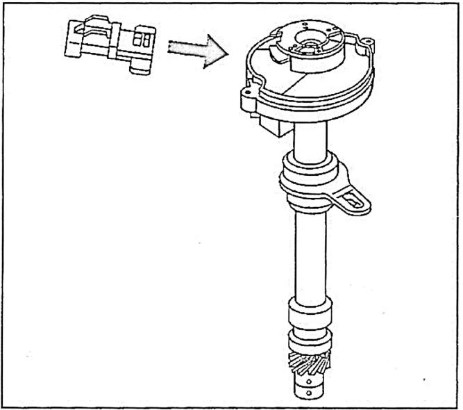

The Camshaft Position (CMP) sensor is located within the distributor. The operation of the CMP sensor is very similar to the Crankshaft Position (CKP) sensor.

The CMP sensor will provide one pulse per camshaft revolution (1x signal). The loss of this signal may not affect the driveability of the vehicle, but will affect the type of control the ECM has on the fuel injection system. If this signal is lost the ECM will pulse the injectors bank to bank instead of each individual injector at a time. The ECM also utilizes this signal in conjunction with the crankshaft position in order to determine which cylinder(s) are misfiring.

# **Spark Plug Wires**

The spark plug wires are a carbon-impregnated cord conductor encased in a silicone rubber jacket. Silicone wiring will withstand very high temperature and is an excellent insulator for the higher voltages. The silicone spark plug boots provide a tight seal on the spark plug.

Silicone is soft, pliable and therefore, more susceptible to scuffing and cutting. It is extremely important that the spark plug cables be handled with care. They should be routed so as not to cross each other or to be in contact with other parts of the engine to prevent rubbing.

Do not force anything between the boot and wiring or through the silicone jacket. Connections should be made using an appropriate adapter.

# **Engine Control Module (ECM)**

The Engine Control Module (ECM) controls spark advance for all operating conditions. The ECM monitors input signals from the following components as part of its ignition control function to determine the required ignition timing:

- Crank Position (CKP) sensor.
- Engine Coolant Temperature (ECT) sensor.
- Manifold Absolute Pressure (MAP) sensor.
- Knock Sensor (KS).

{54}------------------------------------------------

#### **Enhanced Ignition System Description**

The ignition system initiates combustion by providing a spark to ignite the compressed air and fuel mixture at the correct time. In order to provide an improved engine performance, fuel economy, and control of exhaust emissions, the ECM controls the distributor spark advance (timing) with the Ignition Control (IC) system.

The ignition system uses a primary and secondary sub system in order to accomplish the timed spark distribution. The primary system consists of a Crank Position (CKP) sensor. This signal travels to the ECM for base timing reference.

Another signal is sent back to the Ignition Control Driver (ICD) Module, which has been adjusted by the ECM (advanced or retarded) in order to trigger the coil, according to the requirements of the engine.

The secondary system consists of the ignition coil which has primary (low voltage) windings and secondary (high voltage) windings. The secondary side of the ignition coil generates a high voltage which high tension spark plug wires deliver to the spark plugs.

The ECM now controls the Ignition Control (lC) function.

In order to properly control the ignition/combustion timing, the Control Module needs to know the following things:

- The crankshaft position
- The engine speed (RPM)
- The engine load (manifold pressure or vacuum)
- The atmospheric (barometric) pressure
- The engine coolant temperature
- The camshaft position.

#### **System Operation**

The Enhanced Ignition system used on all MEFI 5 engines somewhat resembles the Distributor Ignition (DI) system. However, the system has been greatly enhanced in order to make it compatible with the new regulations. The Enhanced Ignition system provides a spark at precisely the correct time in order to ignite the air and fuel mixture for optimum performance and fuel economy. The system consists of the following components:

- ECM
- HVS
- Ignition Coil Driver Module
- Ignition Coil
- Crankshaft Position Sensor

This system does not use the ignition module used on the DI systems in the past. The ECM now controls the Ignition Control (IC) and Bypass functions. The crankshaft sensor, located in the front engine cover, is perpendicular to a target wheel attached to the crankshaft. The target wheel is equipped with slots situated a specified number of degrees apart. As the crankshaft rotates, the target wheel rotates past the crankshaft position sensor. The rising and falling edges created by the

slots cause a signal to be sent back to the ECM. The signal occurs four times per crankshaft revolution and is referred to as the 4x signal for V8 applications.

The ECM then utilizes this 4x (V8) signal in order to provide the correct spark to the engine by way of the single coil driver module. The single coil driver module is basically an electronic switch that when commanded by the ECM, causes the primary coil voltage to breakdown, energizing the secondary coil and providing a spark via the coil wire to the Distributor cap. The Distributor consists of the following components:

- Cap and Rotor
- Camshaft Position Sensor
- Gear drive and shaft.

The camshaft drives the Distributor shaft which rotates providing a spark to the correct cylinder by way of the cap and rotor. The camshaft position sensor functions much like the crankshaft sensor previously described but provides only a 1x signal to the ECM. That is, for every 2 rotations of the crankshaft, there is 1 rotation of the camshaft. Note that any dysfunction relating to the camshaft position sensor will effect engine operation as this signal provides the timing input necessary to properly operate the sequential delivery of spark and fuel.

In many cases the engine will still operate withouth this sensor, but operation will be compromised. The camshaft positon sensor is also used to detect misfire.

#### **Ignition Control (IC)**

The ECM software controls all of the IC and Bypass functions. This reduces the number of circuits outside of the controller and ultimately reduces the possibility for shorts or opens in those circuits that could result in driveability complaints or DTCs.

#### **Knock Sensor System Description**

#### **Purpose**

Varying octane Ievels in gasoline can cause a detonation in the engine. This detonation is sometimes called a spark knock. All of the engines use a Knock Sensor (KS) system with a knock sensor. The KS system reduces the spark knock in the engine. This allows the engine to have maximum spark advance for improved driveability and fuel economy.

#### **Operation**

An Engine Control Module (ECM) is used in conjunction with one or two knock sensors in order to control detonation. On a MEFI 5 ECM application no KS module will be found as it is internal to the control module. A 5 volt reference is applied to the knock sensor which has an internal resistance of about 100,000 ohms. This resistance will lower the applied voltage to about half or 2.5 volts. When a knock is present, a small AC voltage is produced by the knock sensor and transmitted to the control module riding on top of the already existing 2.5 volts. An AC voltage monitor inside the control module will detect the knock and trigger the control module to start retarding the spark incrementally.

{55}------------------------------------------------

# **Results Of Incorrect Operation**

An open or short to ground in the crank position sensor (CKP) circuit will cause the engine not to run. The ECM must have the crank position sensor signal to read engine RPM.

A crank position sensor signal fault will cause no RPM signal to be sent to the ECM. Therefore, your scan tool will not exhibit an RPM reading during a cranking event. If you are not reading an RPM signal during a cranking event, a possible failure mode could be the crank position sensor.

The cam position sensor is used to determine engine position and is mainly used during misfire detection. If the cam position sensor (CMP) open circuits or is shorted to ground, the engine will still run. It is likely that crank (starting) times may increase; however, the engine will still operate.

The following DTC's will be set for these sensors.

636-2 Crank signal fault

723-2 Cam signal fault

# **On Engine Service**

# **Distributor Replacement (HVS)**

#### **Removal Procedure**

**Notice:** There are two procedures available to install the distributor.

Use Installation Procedure 1 when the crankshaft has NOT been rotated from the original position.

Use Installation Procedure 2 when any of the following components are removed:

- The intake manifold.
- The cylinder head.
- The camshaft.
- The timing chain or sprockets.
- The complete engine.

If the Malfunction Indicator Lamp turns on, and a Fault Code sets after installing the distributor, this indicates an incorrectly installed distributor.

Engine damage or distributor damage may occur. Use Procedure 2 in order to install the distributor.

- 1. Turn OFF the ignition switch.
- 2. Remove the spark plug wires from the distributor cap.
- 3. Remove the electrical connector from the base of the distributor.
- 4. Remove the two screws that hold the distributor cap to the housing.
- 5. Replace these screws with new ones upon re-installation.
- 6. Remove the distributor cap from the housing.
- 7. Use a grease pencil in order to note the position of the rotor in relation to the distributor housing. The mark is identified in the graphic with the number 1.
- 8. Mark the distributor housing and the intake manifold with a grease pencil.

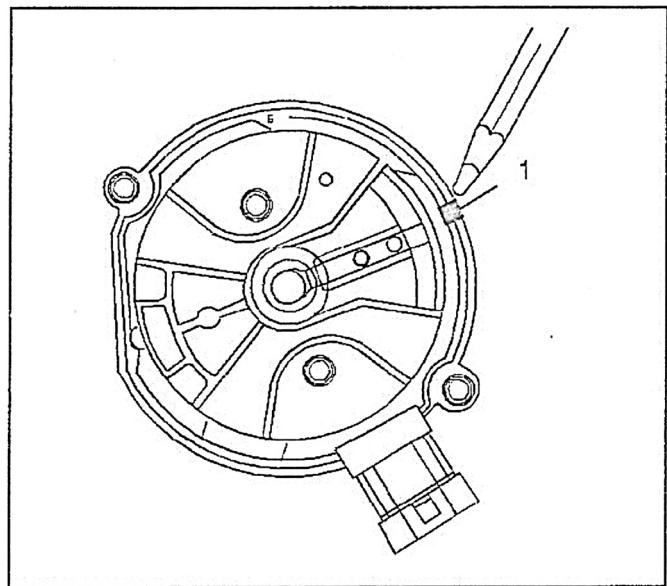

{56}------------------------------------------------

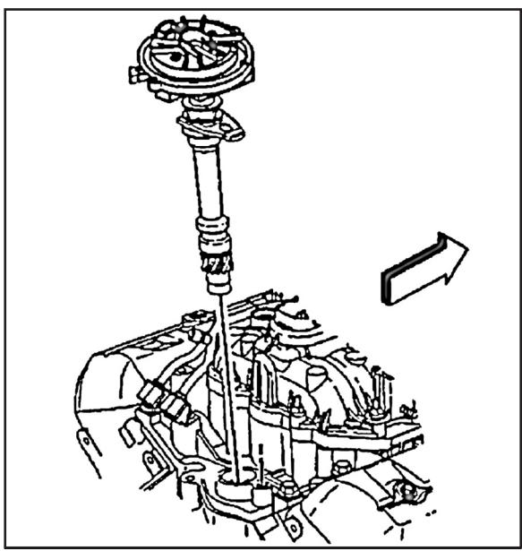

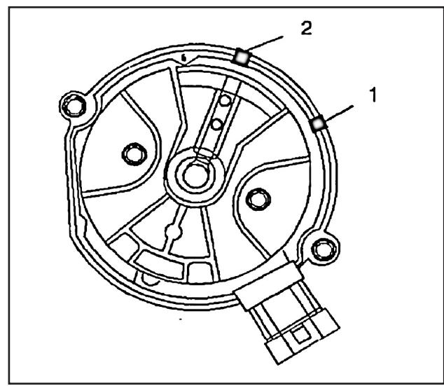

# **Distributor Replacement (HVS) (Cont.)**

- 9. Remove the mounting clamp hold down bolt.
- 10. Remove the distributor.

- 11. As the distributor is being removed from the engine, watch the rotor move in a counter-clockwise direction about 42 degrees. This will appear as slightly more than one clock position.
- 12. Note the position of the rotor segment.
- 12.1 Place a second mark on the base of the distributor.

 This will aid in achieving proper rotor alignment during the distributor installation.

 12.2 The second mark on the distributor housing is identified in the graphic as number 2.

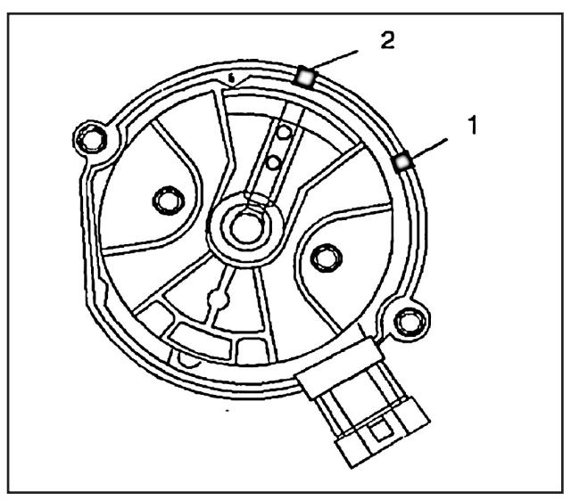

#### **Installation Procedure 1**

- 1. If installing a new distributor assembly, place two marks on the new distributor housing in the same location as the two marks on the original housing.
- 2. Remove the new distributor cap, if necessary.
- 3. Align the rotor with the mark made at location 2.

{57}------------------------------------------------

4. Guide the distributor into the engine. Make sure that the flat part on the distributor is facing to the front of the engine.

- 5. As the distributor is being installed, observe the rotor moving in a clockwise direction about 42 degrees.
- 6. Once the distributor is completely seated, the rotor segment should be aligned with the mark on the distributor base in location number 1.
- If the rotor segment is not aligned with the number 1 mark, the driven gear teeth and the camshaft have meshed one or more teeth out of alignment.
- In order to correct this condition, remove the distributor and reinstall it.

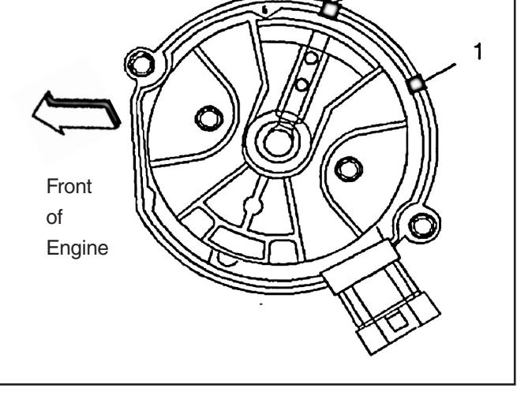

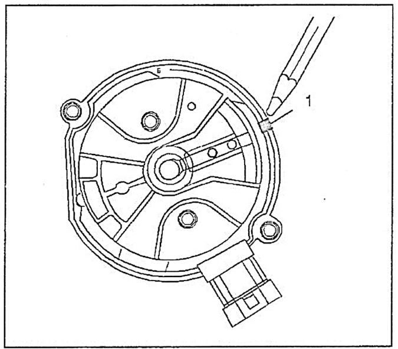

7. Install the distributor mounting clamp. Install the distributor hold down clamp and bolt and tighten the bolt to a snug, but not fully tightened position.

Install the distributor cap.

8. Install two NEW distributor cap screws. Tighten

Tighten the screws to 2.4 N•m (21 Ib in).

9. Install the electrical connector to the distributor.

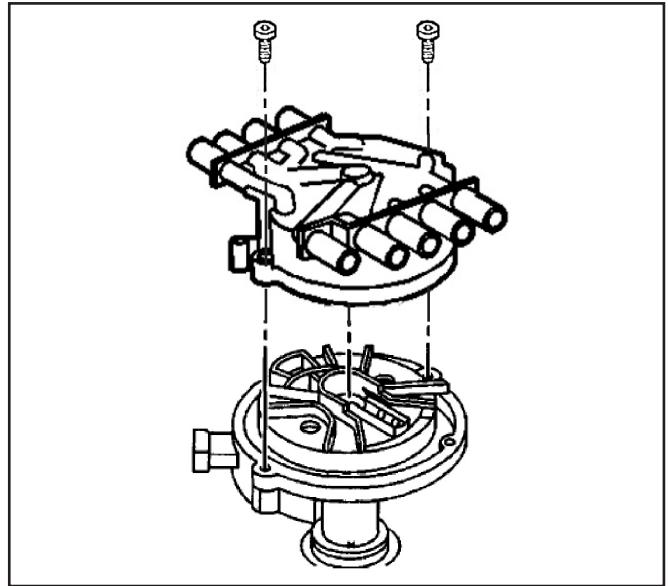

{58}------------------------------------------------

10. Install the spark plug wires to the distributor cap. Refer to Spark Plug Wire Harness Replacement or Spark Plug Wire Harness Replacement.

**Important:** If the Malfunction Indicator lamp is turned on after installing the distributor, and a Fault Code is found, the distributor has been installed incorrectly. Refer to Installation Procedure 2 for proper distributor installation.

#### **11. Cam Angle Verification Procedure**

The ignition timing cannot be adjusted. The distributor may need adjusting to prevent crossfire. To insure proper alignment of the distributor, perform the following:

1. With the ignition OFF, install the scan tool.

2. Start the engine. Allow the engine to idle until the engine reaches normal operating temperature. **Important:** Cam Retard Offset reading will not be accurate below 1,000 RPM.

3. Increase engine speed to ~1200 RPM while performing the following steps.

4. Using the scan tool, monitorthe Cam Angle Offset.

5. If the Cam Angle indicates a value of 705 degrees, the distributor is properly adjusted.

6. If the Cam Angle does not indicate 705 degrees, the distributor must be adjusted.

#### **Adjusting Procedure**

1. With the engine OFF, slightly loosen the distributor hold down bolt.

**Important:** Cam Angle reading will not be accurate below 1,000 RPM.

- 2. Start the engine, and raise engine speed to
- ~1200 RPM.
- 3. Using a scan tool, monitor Cam Angle.
- 4. Rotate the distributor as follows:
- To compensate for a negative reading, rotate the distributor in the counterclockwise direction.
- To compensate for a positive reading, rotate the distributor in the clockwise direction.

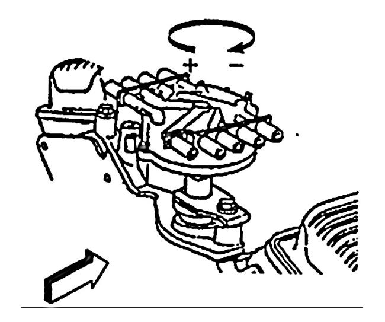

- 5. Repeat step 4 until 705 degrees is obtained.
- 6. Turn OFF the ignition.

**Notice:** Refer to Fastener Notice in Cautions and Notices.

7. Tighten the distributor hold-down bolt.

#### **Tighten**

Tighten the bolt to 3 N•m (25 Ib ft)

8. Start the engine.

9. Raise the engine speed to 1,000 RPM and recheck Camshaft Retard Offset.

{59}------------------------------------------------

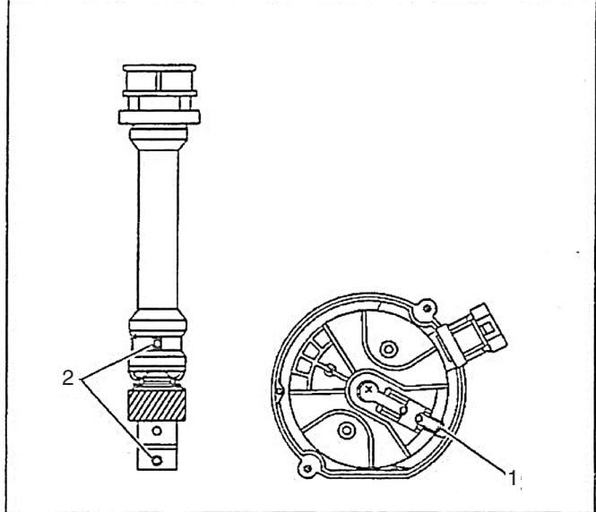

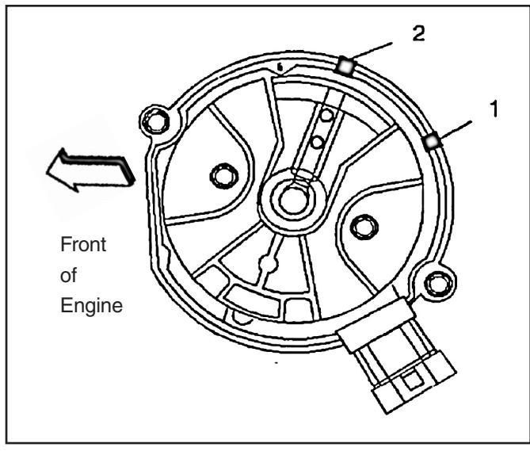

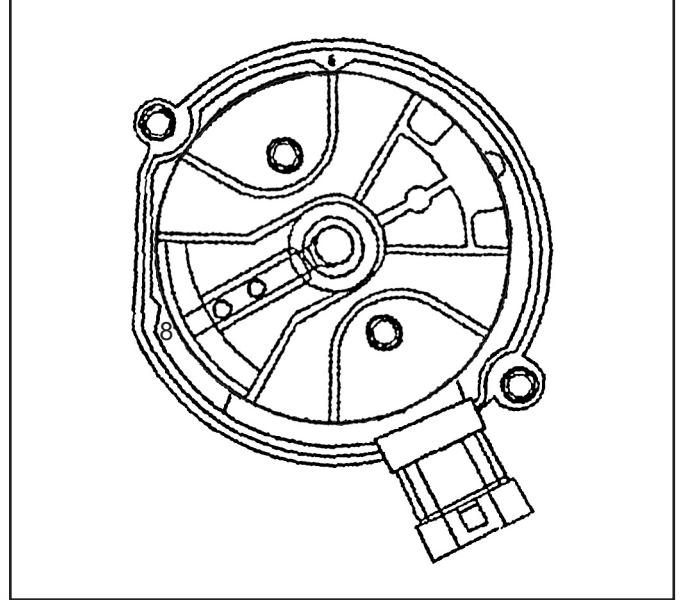

#### **Installation Procedure 2**

- 1. Rotate the number 1 cylinder to Top Dead Center (TDC) of the compression stroke.
- 2. Align white paint mark on the bottom stem of the distributor, and the pre-drilled indent hole in the bottom of the gear (2).
- 3. With the gear in this position, the rotor segment should be positioned as shown for a V8 engine.(1)
- The alignment will not be exact.
- If the driven gear is installed incorrectly, the dimple will be approximately 180 degrees opposite of the rotor segment when it is installed in the distributor.

**Notice:** The OBD II ignition system distributor driven gear and rotor can be installed in multiple positions. In order to avoid mistakes, make sure to mark the distributor in the following positions:

- The distributor driven gear.
- The distributor shaft.
- The rotor holes for the same mounting position upon reassembly.

**Notice:** Installing the driven gear 180 degrees out of alignment, or locating the distributor rotor in the wrong holes, may cause a no-start condition.

Premature engine wear and damage may result.

- 4. Using a long screw driver, align the oil pump drive shaft to the drive tab of the distributor.
- 5. Guide the distributor into the engine. Make sure that the flat part on the distributor is facing to the front of the engine.
- 6. Once the distributor is fully seated, the rotor segment should be aligned with the pointer cast into the distributor base.
- This pointer should have number 8 cast into it, indicating that the distributor is to be used on a 8 cylinder engine.
- If the rotor segment does not come within a few degrees of the pointer, the gear mesh between the distributor and the camshaft may be off a tooth or more.
- If this is the case, repeat the procedure again in order to achieve proper alignment.

{60}------------------------------------------------

7. Install the distributor mounting clamp. Install the distributor hold down clamp and bolt and tighten the bolt to a snug, but not fully tightened position.

Install the distributor cap.

8. Install two NEW distributor cap screws. Tighten

Tighten the screws to 2.4 N•m (21 Ib in).

- 9. Install the electrical connector to the distributor.
- 10. Install the spark plug wires to the distributor cap. Refer to Spark Plug Wire Harness Replacement or Spark Plug Wire Harness Replacement.

**Important:** If the Malfunction Indicator lamp is turned on after installing the distributor, and a Fault Code is found, the distributor has been installed incorrectly. Repeat Installation Procedure 2 for proper distributor installation.

#### **11. Cam Angle Verification Procedure**

The ignition timing cannot be adjusted. The distributor may need adjusting to prevent crossfire. To insure proper alignment of the distributor, perform the following:

1. With the ignitionOFF, install the scan tool.

2. Start the engine. Allow the engine to idle until the engine reaches normal operating temperature. **Important:** Cam Retard Offset reading will not be accurate below 1,000 RPM.

3. Increase engine speed to ~1200 RPM while performing the following steps.

4. Using the scan tool, monitorthe Cam Angle Offset.

5. If the Cam Angle indicates a value of 705 degrees, the distributor is properly adjusted.

6. If the Cam Angle does not indicate 705 degrees, the distributor must be adjusted.

#### **Adjusting Procedure**

1. With the engine OFF, slightly loosen the distributor hold down bolt.

**Important:** Cam Angle reading wiil not be accurate below 1,000 RPM.

2. Start the engine, and raise engine speed to ~1200 RPM.

3. Using a scan tool, monitor Cam Angle.

4. Rotate the distributor as follows:

- To compensate for a negative reading, rotate the distributor in the counterclockwise direction.
- To compensate for a positive reading, rotate the distributor in the clockwise direction.
- 5. Repeat step 4 until 705 degrees is obtained.

6. Turn OFF the ignition.

**Notice:** Refer to Fastener Notice in Cautions and Notices.

7. Tighten the distributor hold-down bolt.

 **Tighten**

Tighten the boit to 3 N•m (25 Ib ft)

8. Start the engine.

9. Raise the engine speed to 1,000 RPM and recheck Camshaft Retard Offset.

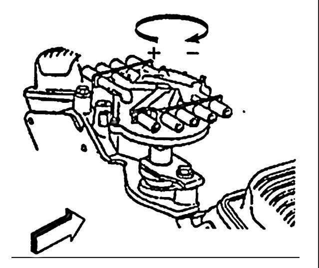

{61}------------------------------------------------

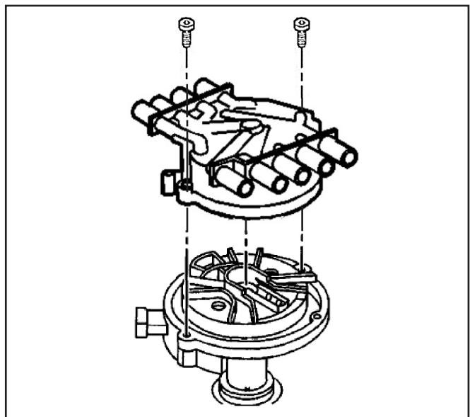

#### **Distributor Overhaul**

#### **Disassembly Procedure**

**Notice:** Refer to Distributor Driven Gear Can Be Installed in Multiple Positions in Cautions and Notices.

- 1. Remove the two screws that hold the distributor cap to the housing.
- 2. Do not discard the screws.
- 3. Remove the distributor cap from the housing.

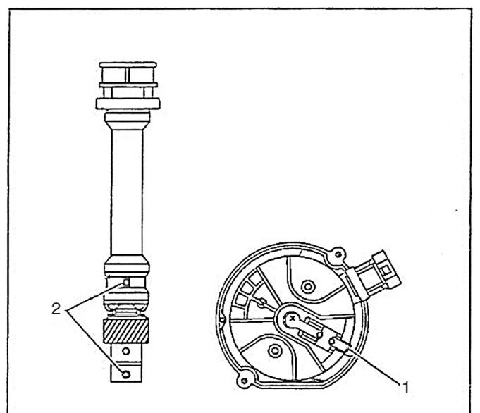

- 4. Align white paint mark on the bottom stem of the distributor, and the pre-drilled indent hole in the bottom of the gear (2).
- 5. With the gear in this position, the rotor segment should be positioned as shown for a V8 engine (1). If not, replace the distributor.

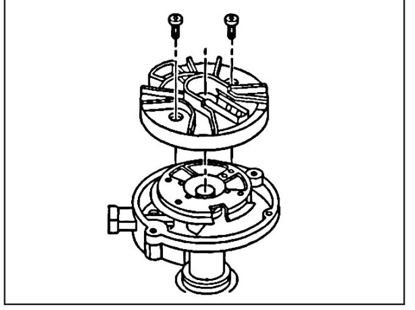

- 6. Remove the two screws from the rotor.
- 7. Remove the rotor.

{62}------------------------------------------------

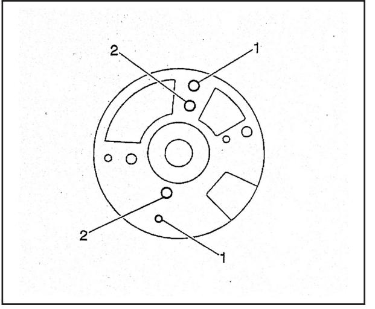

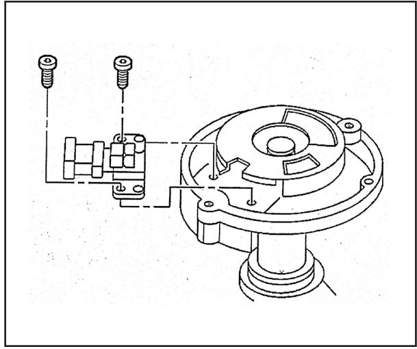

- 8. Note the locating holes that the rotor was removed from:
- (1) is the rotor screw holes.
- (2) is the rotor locator pin holes.

- 9. Remove the two screws that hold the camshaft position (CMP) sensor.
- 10. Do not discard the screws.

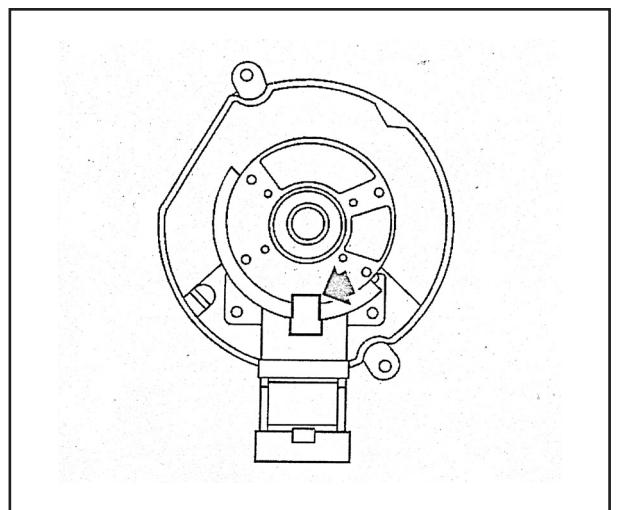

11. Line up the square-cut hole in the vane wheel with the CMP sensor.

{63}------------------------------------------------

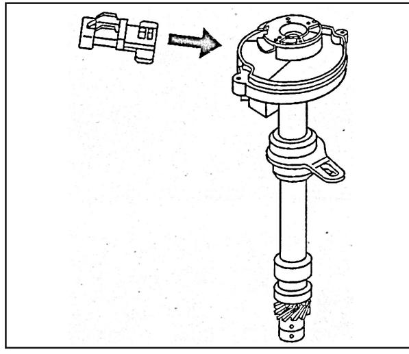

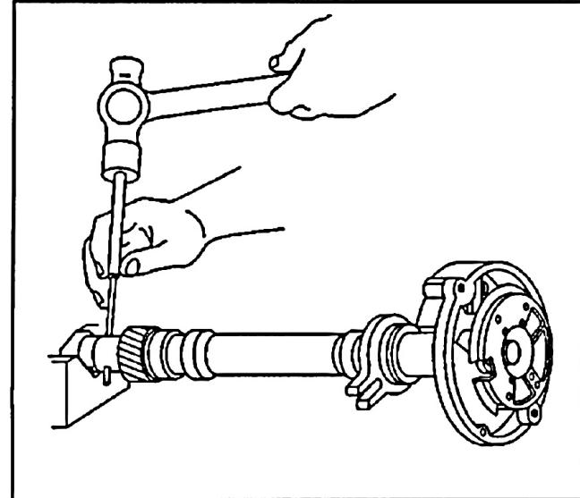

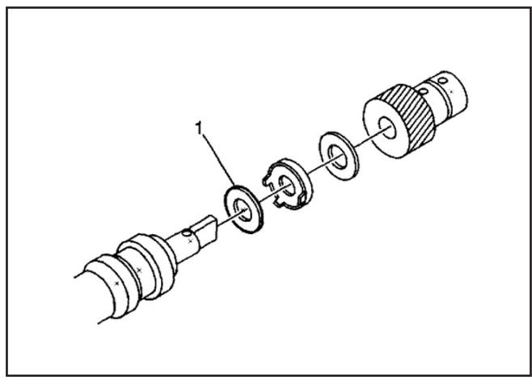

- 12. Remove the CMP sensor.
- 13. Note the dimple located below the roll pin hole on one side of the gear. The dimple will be used to properly orient the gear onto the shaft during reassembly.

#### **Caution: Refer to Safety Glasses Caution in Cautions and Notices.**

- 14. Support the distributor drive gear in a V-block or similar fixture.
- 15. Drive out the roll pin with a suitable punch.

- 16. Remove the driven gear from the distriputor shaft.
- 17. Remove the round washer.
- 18. Remove the tang washer.
- 19. Remove the round washer, if equipped (1).

{64}------------------------------------------------

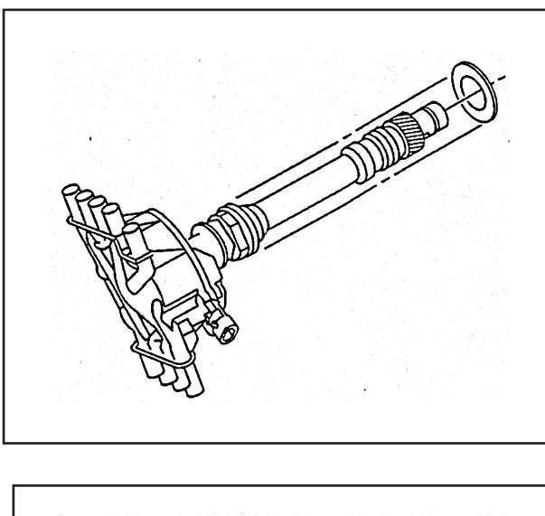

20. Remove the old oil seal.

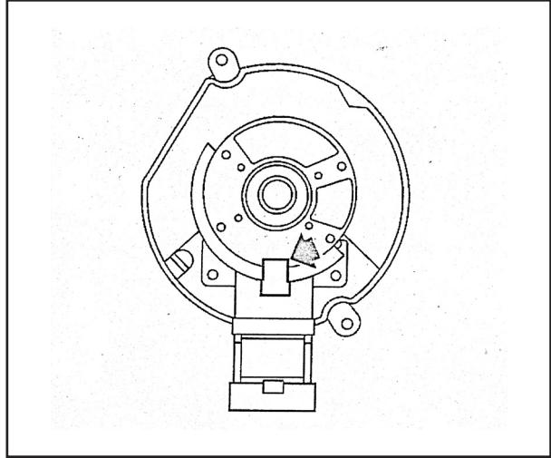

#### **Assembly Procedure**

1. Line up the square-cut hole in the vane wheel for the camshaft position (CMP) sensor.

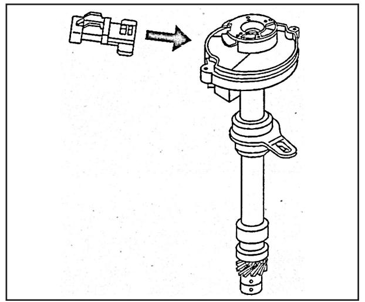

2. Insert the sensor into the housing.

{65}------------------------------------------------

3. Install two screws for the camshaft position (CMP) sensor.

# **Tighten**

Tighten the screws to 2.2 N•m (20 Ib in).

- 4. Identify the correct rotor mounting position.
- (1) is the rotor screw holes.
- (2) is the rotor locator pin holes.

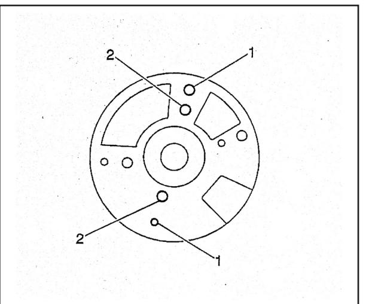

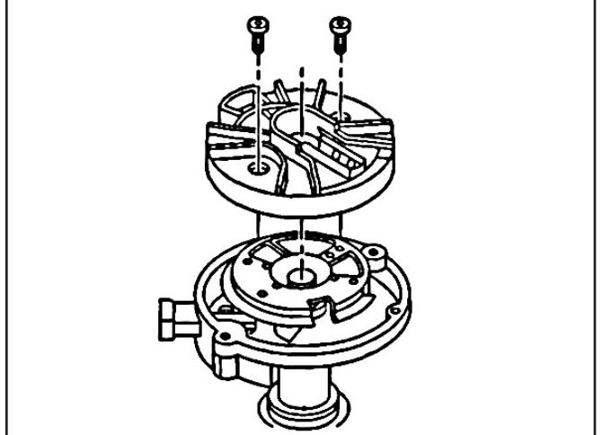

- 5. Install the distributor rotor according to the index marks.
- 6. Install two rotor hold down screws.

## **Tighten**

Tighten the screws to 1.9 N•m (17 Ib in).

{66}------------------------------------------------

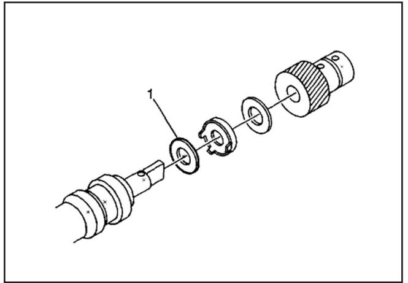

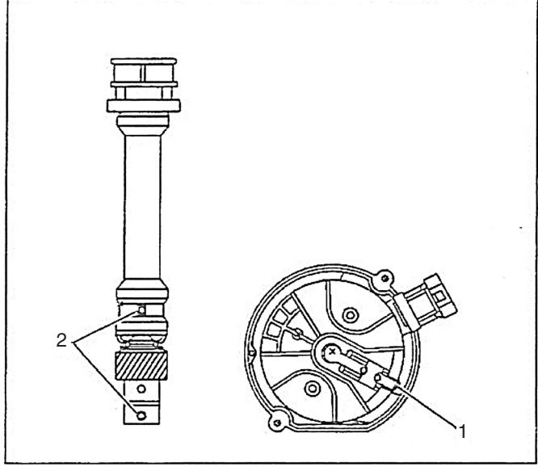

- 7. Install the round washer, if equipped (1).
- 8. Install the tang washer over the bottom of the distributor shaft.
- 9. Install the round washer.
- 10. Install the driven gear according to the index marks.

- 11. Align the rotor segment as shown for a V8 engine. (1)
- 12. Install the gear and align white paint mark on the bottom stem of the distributor, and the pre-drilled indent hole in the bottom of the gear (2).
- 13. Check to see if the driven gear is installed incorrectly, the dimple will be approximately 180 degrees opposite the rotor segment when it is installed in the distributor.

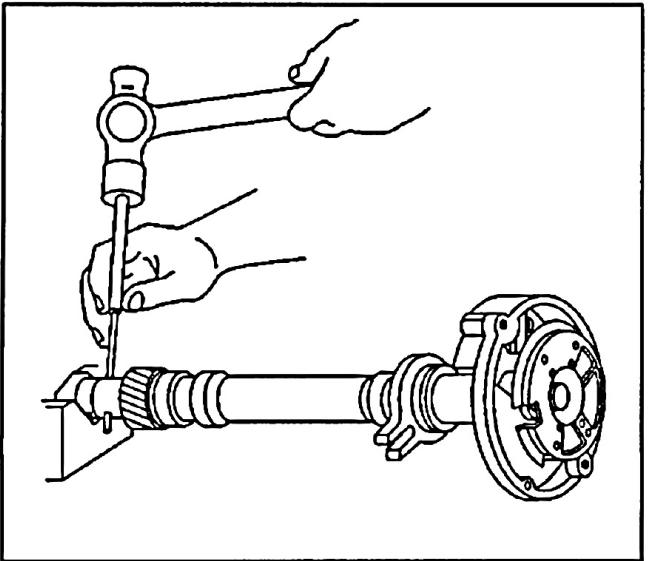

## Caution: Refer to Safety Glasses Caution in Cautions and Notices.

- 14. Support the distributor drive gear in a V-block or similar fixture.
- 15. Install the roll pin with a suitable punch and hammer in order to hold the driven gear in the correct position.

{67}------------------------------------------------

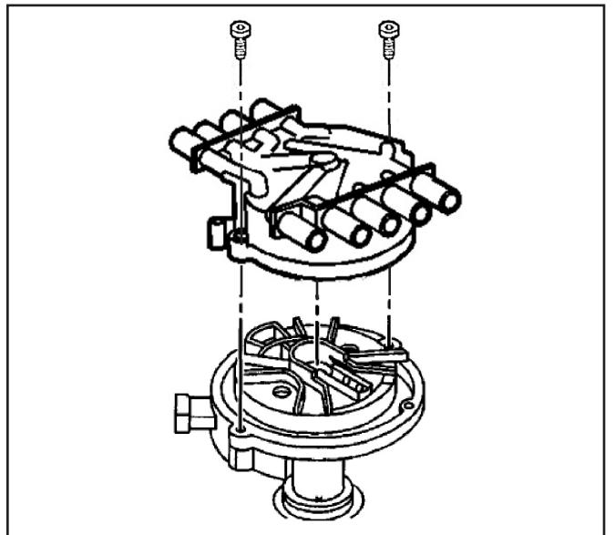

- 16. Install the distributor cap.
- 17. Install two NEW distributor cap screws.

#### **Tighten**

Tighten the screws to 2.4 N•m (21 Ib in).

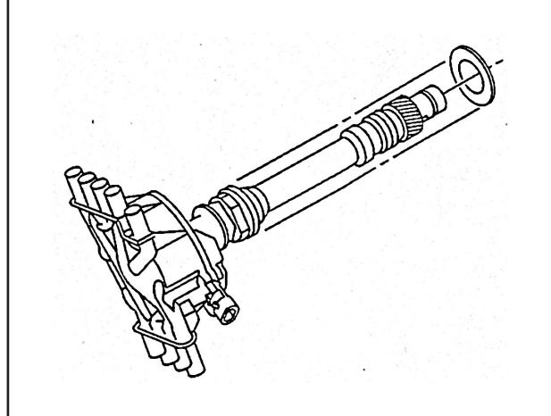

18. Install the new oil seal under the mounting flange of the distributor base.

#### **Distributor Inspection**

**Important:** Discoloration of the cap and some whitish build up around the cap terminals is normal. Yellowing of the rotor cap, darkening and some carbon build up under the rotor segment is normal. Replacement of the cap and rotor is not necessary unless there is a driveability concern.

1. Inspect the cap for cracks, tiny holes or carbon tracks between the cap terminal traces. If the in side of the cap contains moisture or a filmy residue, wipe clean with a cloth lightly dampened  with alcohol and allow to dry thoroughly. If the residue is hardened and cannot be removed, replace the cap.

2. Inspect the cap for excessive build-up of corrosion on the terminals. Scrape clean the terminals or replace the cap if the corrosion is excessive. Some build-up is normal.

#### **Ignition Coil and ICD Module Replacement (HVS)**

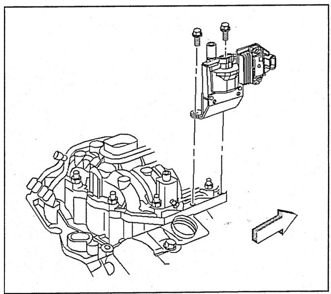

#### **Removal Procedure**

- 1. Remove the air cleaner assembly.
- 2. Disconnect the electrical connectors.
- 3. Remove the ignition coil wire to the distributor.
- 4. Remove the studs holding the bracket and the ignition coil to the intake manifold.
- 5. Remove the bracket and the ignition coil.
- 6. Drill and punch out the two rivets holding the ignition coil to the bracket.
- 7. Remove the ignition coil from the bracket.

#### **Installation Procedure**

**NOTICE:** Be sure to thoroughly coat the bottom of the ignition control module with silicone grease. Failure to do so could result in heat damage to the module.

- Lubricate bottom of the ignition control module and the module rest pad on the housing with silicone grease or an equivalent heat transfer substance.
- 1. Ignition control module to the housing with two screws.
- 2. Pick-up coil.
	- Fit the tab on the bottom of the coil into the anchor hole in the housing.

{68}------------------------------------------------

A replacement ignition coil kit comes with two screws in order to attach the ignition coil to the bracket.

1. Install the ignition coil to the bracket with the two screws.

**Notice:** Refer to Fastener Notice in Cautions and Notices.

2. Install the ignition coil and the bracket to the intake manifold with studs.

#### **Tighten**

Tighten the studs to 11 N•m (8 Ib ft).

- 3. Install the ignition coil wire.
- 4. Install the electrical connectors.
- 5. Install the air cleaner assembly.

## **Crankshaft Position Sensor Replacement**

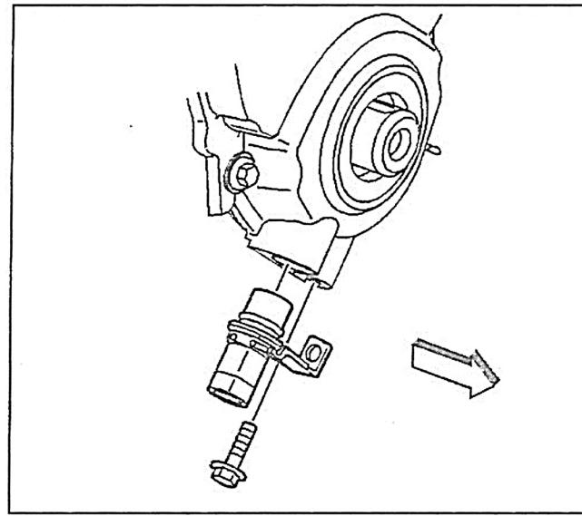

#### **Removal Procedure**

**Important:** The CKP System Variation Learn Procedure will need to be performed whenever the Crankshaft Position (CKP) sensor is removed or replaced. Refer to CKP System Variation Learn Procedure.

#### **Caution: Refer to Battery Disconnect Caution in Cautions and Notices Page 4-2.**

- 1. Disconnect the neagative battery cable.
- 2. Remove the CKP sensor harness connector.
- 3. Remove the sensor hold down bolt.
- 4. Remove the sensor from the timing cover.
- 5. Inspect the sensor O-ring for wear, cracks or leakage.

 Replace if necessary. Lube the new O-ring with clean engine oil before installing.

#### **Installation Procedure**

**Important:** Make certain that the Crankshaft Position (CKP) sensor mounting surfaces are clean and free of burrs before installing the CKP sensor.

When installing a crankshaft position (CKP) sensor make sure the sensor is fully seated and held stationary in the front cover before torquing the hold down bolt into the front cover. A sensor which is not seated may result in erratic operation and lead to the setting of false codes.

1. Install the sensor into the timing cover. Lube the O-ring with clean engine oil before installing.

**Notice:** Refer to Fastener Notice in Cautions and Notices.

2. Install the sensor hold down bolt.

## **Tighten**

Tighten the hold down bolt to 8 N• m (71 lb in).

- 3. Install the CKP sensor harness connector.
- 4. Connect the neagative battery cable.
- 5. Perform the CKP System Variation Learn Procedure. Refer to CKP System Variation Learn Procedure.

{69}------------------------------------------------

#### **Camshaft Position Sensor Replacement**

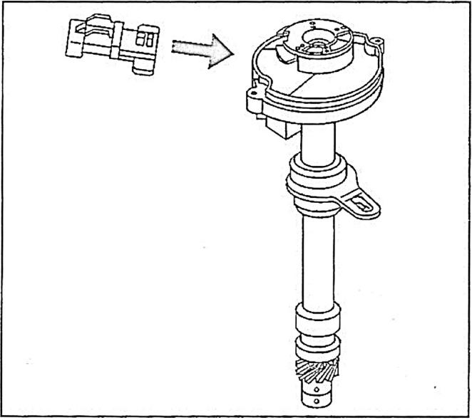

#### **Removal Procedure**

#### **Caution: Refer to Battery Disconnect Caution in Cautions and Notices Page 4-2**

- 1. Disconnect the neagative battery cable.
- 2. Disconnect the spark plug wires and ignition coil wire from the distributor.
- 3. Disconnect the CMP sensor harness connector from the distributor.
- 4. Remove the distributor cap screws.
- 5. Remove the distributor cap.
- 6. Remove the rotor screws.
- 7. Remove the rotor.
- 8. Align the square slot in the reluctor wheel with the CMP sensor.
- 9. Remove the CMP sensor fasteners.
- 10. Remove the CMP sensor.

#### **Installation Procedure**

**Important:** Do not use the old cap screws, CMP sensor screws, or rotor screws. Use replacement screws that have been coated with a thread locking compound. Precoated replacement distributor cap and CMP sensor screws can be acquired using P/N 10475922 (pkg of 10 screws). Precoated replacement rotor screws can be acquired using P/N 10475924 (pkg of 10 screws).

- 1. Align the square slot in the reluctor wheel with the CMP sensor.
- 2. Insert the CMP sensor through the reluctor wheel slot.

**Notice:** Refer to Fastener Notice in Cautions and Notices.

3. Install the new CMP sensor mounting screws.

# **Tighten**

Tighten the screws to 1.6–2.8 N• m (14–25 lb in).

**Important:** The locating tabs on the rotor are necessary for correct alignment of the rotor. If the tabs are missing or damaged, replace the rotor.

- 4. Install the rotor onto the reluctor wheel.
- 5. Install the new rotor screws. **Tighten**

Tighten the screws to 1.5–2.4 N• m (13–22 lb in).

- 6. Install the distributor cap.
- 7. Install new distributor cap screws.

#### **Tighten**

Tighten the screws to 1.8–3.0 N• m (16–26 lb in).

- 8. Connect the CMP sensor harness connector.
- 9. Connect the spark plug wires and ignition coil wire.
- 10. Connect the negative battery cable.

{70}------------------------------------------------

# **Spark Plug Replacement**

#### **Tools Required**

J 39358 Spark Plug Socket

#### **Service Precautions**

- Allow the engine to cool before removing the spark plugs. Attempting to remove the plugs from a hot engine may cause the plug to seize, causing damage to the cylinder head threads.
- Clean the spark plug recess area before removing the plug.

 Failure to do so can result in engine damage due to dirt or foreign material entering the cylinder head or contamination of the cylinder head threads.

 Contaminated threads may prevent proper seating of a new plug.

• Do not install the plugs that are either hotter or colder than the heat range specified.

 Using plugs of the wrong heat range may damage the engine.

#### **Removal Procedure**

1. Turn OFF the ignition switch.

**Notice:** Twist the spark plug boot one-half turn in order to release the boot. Pull on the spark plug boot only. Do not pull on the spark plug wire or the wire could be damaged.

2. Remove the spark plug wires using a twisting motion in order to release the boot from the spark plug. The spark plug wires are numbered to assist in re-assembly.

**Notice:** Use the J 39358 or the equivalent. Failure to do so could cause cracking of the insulator and arcing inside the plug, resulting in engine misfire.

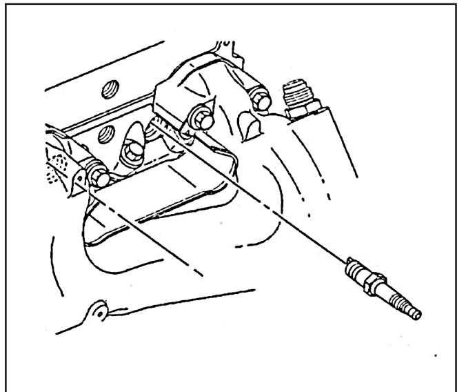

- 3. Remove the spark plugs using the J 39358.
- 4. Inspect each plug for wear.

Refer to Spark Plug Visual Diagnosis.

#### **Installation Procedure**

**Notice:** Be sure plug threads smoothly into cylinder head and is fully seated. Use a thread chaser if necessary to clean threads in cylinder head. Cross-threading or failing to fully seat spark plug can cause overheating of plug, exhaust blow-by, or thread damage. Follow the recommended torque specifications carefully. Over or under-tightening can also cause severe damage to engine or spark plug.

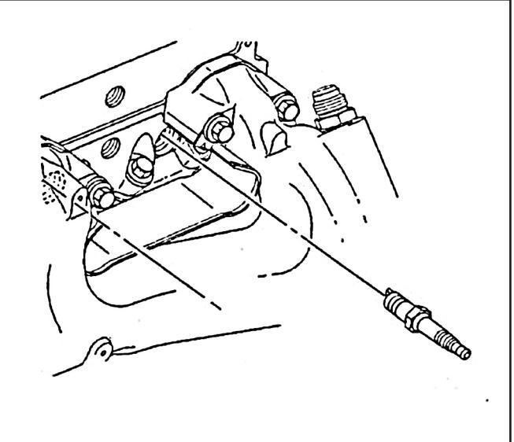

1. Install the spark plugs.

#### **Tighten**

Tighten the spark plugs to 15 N•m (11 Ib ft).

2. Install the spark plug wires in their original locations. Refer to Spark Plug Wire Harness Replacement.

{71}------------------------------------------------

# **Spark Plug Replacement**

#### **Remove or Disconnect**

- 1. Negative battery cable.
- 2. Spark plug wires and boots.
	- Turn each boot one-half turn before removing it.
	- Label the plug wires if the identification numbers have worn off.
- 3. Spark plugs.

#### **Inspect**

• Each plug for wear and gap.

#### **Install or Connect**

- 1. Spark plugs. Torque to 15 N•m (11 lb.ft.).
- 2. Wire and boot assemblies. Refer to "Spark Plug Wiring and Boots" below for precautions.
- 3. Negative battery cable.

# **Spark Plug Wiring And Boots**

#### **Precautions**

- 1. Twist boots one-half turn before removing.
- 2. When removing the boot, do not use pliers or other tools that may tear the boot.
- 3. Do not force anything between the wire and the boot, or through the silicone jacket of the wiring.
- 4. Do not pull on the wires to remove the boot. Pull on the boot, or use a tool designed for this purpose.

5. Special care should be used when installing spark plug boots to make sure the metal terminal within the boot is fully seated on the spark plug terminal and the boot has not moved on the wire. If boot to wire movement has occurred, the boot will give a fast visual impression of being fully seated. A good check to make sure the boots have been properly installed is to push sideways on them. If they have been correctly installed, a stiff boot with only slight looseness will be noted. If the terminal has not been properly seated on the spark plug, only the resistance of the rubber boot will be felt when pushing sideways.

#### **Replacement**

Wire routings must be kept intact during service and followed exactly. If wires have been disconnected, or replacement of the wires is necessary, route the wires in their original positions. Failure to route the wires properly may result in drivability problems.

# **Torque Specifications**

# **Fastener Tightening Specifications**

| Application           | N•m | Lb Ft | Lb In |
|-----------------------|-----|-------|-------|
| Distributor Hold Down | 40  | 30    |       |
| Coil Bracket Screws   | 22  | 16    |       |
| Spark Plugs           | 15  | 11    |       |

{72}------------------------------------------------

# **This page left intentionally blank**

{73}------------------------------------------------

# **Section 5 Port Fuel Injection (PFI) Diagnosis**

This section will be used to perform diagnostic procedures on the System 5 equipped engines. The section describes system circuits and diagnostic tables used to diagnose the circuits. It will be used to correct Diagnostic Trouble Codes (DTCs) by following tables for scan tool use. This section contains the On-Board Diagnostic (OBD) System Check that is the first step to perform before any further diagnostics or repairs are made to this system.

The assumption is made that on all diagnostic tables, the engine is equipped with a System 5 ECM, wiring harness, fuel components and GM sensors and ignition components. The wiring schematics and circuit identifications are for the System 5 originally equipped wiring harness.

The diagnostic tables and voltages shown are prepared with the requirement that the system functioned correctly at the time of assembly and that there are no multiple failures.

# **Contents**

| ECM Wiring Page 2-7 ECM Connector Identification Page 8-17 Scan Tool Data List  18-21 Scan Tool Data Definitions  22-23 Scan Tool Output Controls  24-25 Harness Connector Identification  26-31 |
|-----------------------------------------------------------------------------------------------------------------------------------------------------------------------------------------------------------------|
| Diagnostic Trouble Codes                                                                                                                                                                                        |
| Repair Procedures Pages 32 - 129                                                                                                                                                                             |
| Engine Oil Pressure                                                                                                                                                                                             |
| SPN 100 FMI 3 & 4 32-39                                                                                                                                                                                      |
| MAP Sensor                                                                                                                                                                                                      |
| SPN 106 FMI 3 & 4 40-47                                                                                                                                                                                      |
| Engine Coolant Temperature                                                                                                                                                                                      |
| SPN 110 FMI 3 & 4 48-55 CAL Memory Failure                                                                                                                                                                |
| SPN 630 FMI 13 56-57                                                                                                                                                                                         |
| Crankshaft Position Sensor                                                                                                                                                                                      |
| SPN 636 FMI 2 58-61                                                                                                                                                                                          |
| Fuel Injectors                                                                                                                                                                                                  |
| SPN 651 - 658 62-65                                                                                                                                                                                          |
| Camshaft Position Sensor                                                                                                                                                                                        |
| SPN 723 FMI 2 66-69                                                                                                                                                                                          |
| EST A Short High                                                                                                                                                                                                |
| SPN 65541 FMI 3                                                                                                                                                                                                 |
| EST A Short Low                                                                                                                                                                                                 |
| SPN 65541 FMI 4                                                                                                                                                                                                 |
| EST A Open                                                                                                                                                                                                      |
| SPN 65541 FMI 5 70-73 Knock Sensor                                                                                                                                                                        |
| SPN 65551 FMI 2                                                                                                                                                                                                 |
| Knock Sensor                                                                                                                                                                                                    |
| SPN 65552 FMI 2 74-77                                                                                                                                                                                        |
| Can Bus Hardware                                                                                                                                                                                                |
| SPN 65559 FMI 11 78-79                                                                                                                                                                                       |
| CPU Failure                                                                                                                                                                                                     |
| SPN 65580 FMI 12 80-81                                                                                                                                                                                       |
| MHC Failure                                                                                                                                                                                                     |
| SPN 65581 FMI 12 82-83                                                                                                                                                                                       |
| NV RAM Failure                                                                                                                                                                                                  |
| SPN 65582 FMI 12 84-85                                                                                                                                                                                       |

| ETC TPS 2 Range                           |
|-------------------------------------------|
| 65601 FMI 2 86-89                      |
| ETC TPS 1 Range                           |
| 65602 FMI 2 90-93                      |
| ETC PPS 2 Range                           |
| 65604 FMI 2 94-97                      |
| ETC PPS 1 Range                           |
| 65605 FMI 2 98-101                     |
| ETC TPS 1-2 Correlation                   |
| 65610 FMI 2 102-105                    |
| ETC PPS 1-2 Correlation                   |
| 65613 FMI 2 106-109                    |
| ETC Actuation                             |
| 65615 FMI 7 110-113                       |
| ETC Process                               |
| 65616 FMI 12 114-117                      |
| ETC Return Fault                          |
| 65618 FMI 7 118-121                       |
| MEFI System Relay (/Powertrain Relay      |
| according to SAE J1939)                   |
| 66013 FMI 5                               |
| MEFI System Relay (/Powertrain Relay      |
| according to SAE J1939)                   |
| 66013 FMI 6                               |
| MEFI System Relay (/Powertrain Relay      |
| according to SAE J1939)                   |
| 66013 FMI 7                               |
| MEFI System Relay (/Powertrain Relay      |
| according to SAE J1939)                   |
| 66014 FMI 4 122-125                    |
| Fuel Pump Relay                           |
| 66017 FMI 5                               |
| Fuel Pump Relay                           |
| 66017 FMI 6                               |
| Fuel Pump Relay 66017 FMI 7 126-129 |
|                                           |

{74}------------------------------------------------

# Cautions and Notices and Special Testing Procedures

# **Battery Disconnect Caution**

Caution: Before servicing any electrical component, the ignition key must be in the OFF or LOCK position and all electrical loads must be OFF, unless instructed otherwise in the procedures. If a tool or equipment could easily come in contact with a live exposed electrical terminal, also disconnect the negative battery cable. Failure to follow these precautions may cause personal injury and/or damage to the vehicle or its components.

# **Using Fused Jumper Wires**

**Tools Required** J 36169-A Fused Jumper Wire

**Important:** A fused jumper may not protect solid state components from being damaged. The J 36169-A includes small clamp connectors that provide adaptation to most connectors without damage. This fused jumper wire is supplied with a 20-A fuse which may not be suitable for some circuits. Do not use a fuse with a higher rating than the fuse that protects the circuit being tested.

# **Electrostatic Discharge Damage**

Electronic components used in control systems are often designed to carry very low voltage, and are very susceptible to damage caused by electrostatic discharge. It is possible for less than 100 volts of static electricity to cause damage to some electronic components. By comparison, it takes as much as 4,000 volts for a person to feel the zap of a static discharge.

There are several ways a person can become statically charged. The most common methods of charging are by friction and by induction. An example of charging by friction is a person sliding across a seat, in which a charge of as much as 25,000 volts can build up. Charging by induction occurs when a person with well insulated shoes stands near a highly charged object and momentarily touches ground. Charges of the same polarity are drained off, leaving the person highly charged with the opposite polarity. Static charges of either type can cause damage. Therefore, it is important to use care when handling and testing electronic components.

{75}------------------------------------------------

**This page left intentionally blank**

{76}------------------------------------------------

**Engine**

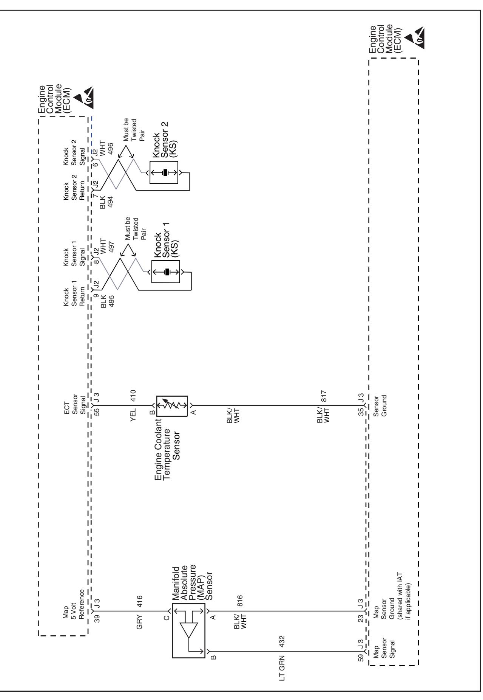

9-24-05

**ECM Wiring (1 of 5)**

{77}------------------------------------------------

**ECM Wiring (2 of 5)**

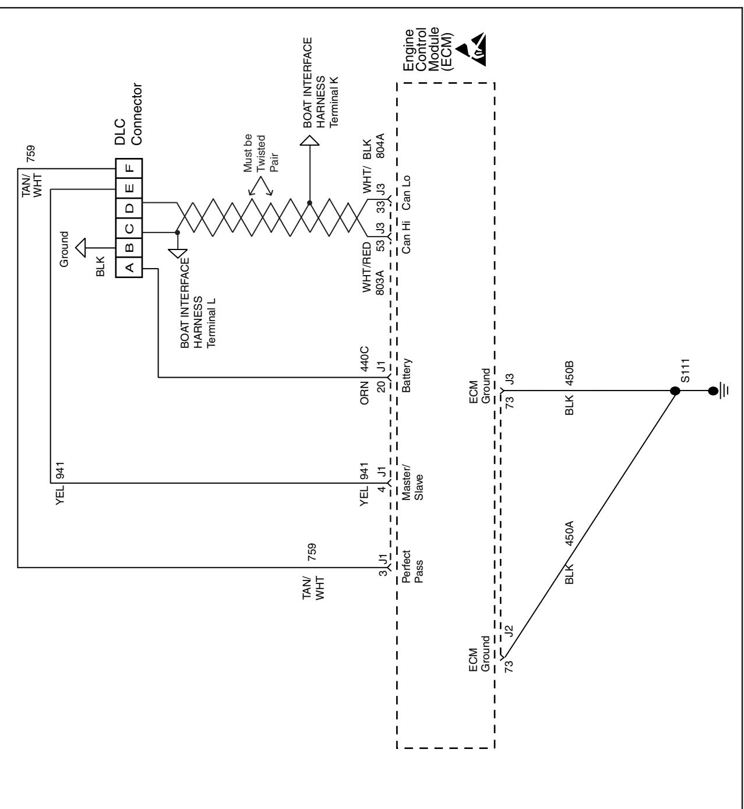

{78}------------------------------------------------

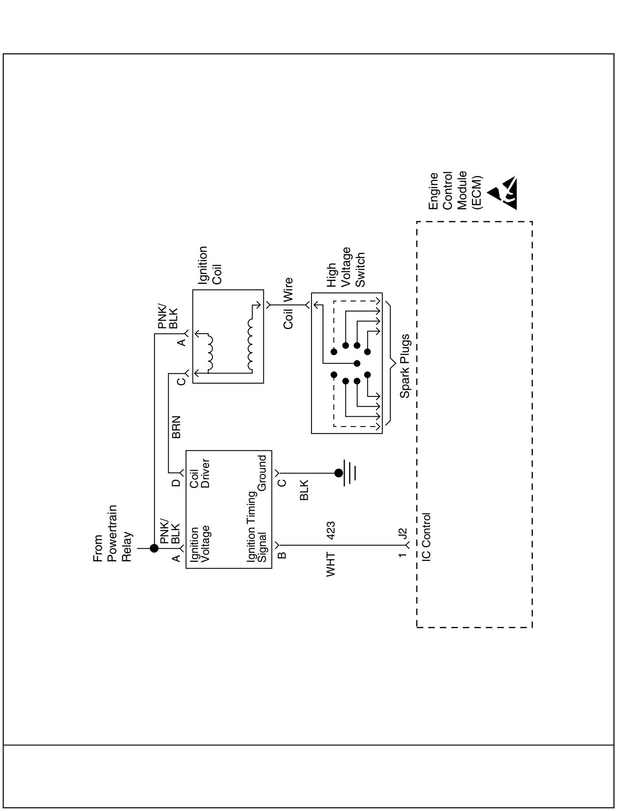

**ECM Wiring (3 of 5)**

{79}------------------------------------------------

To

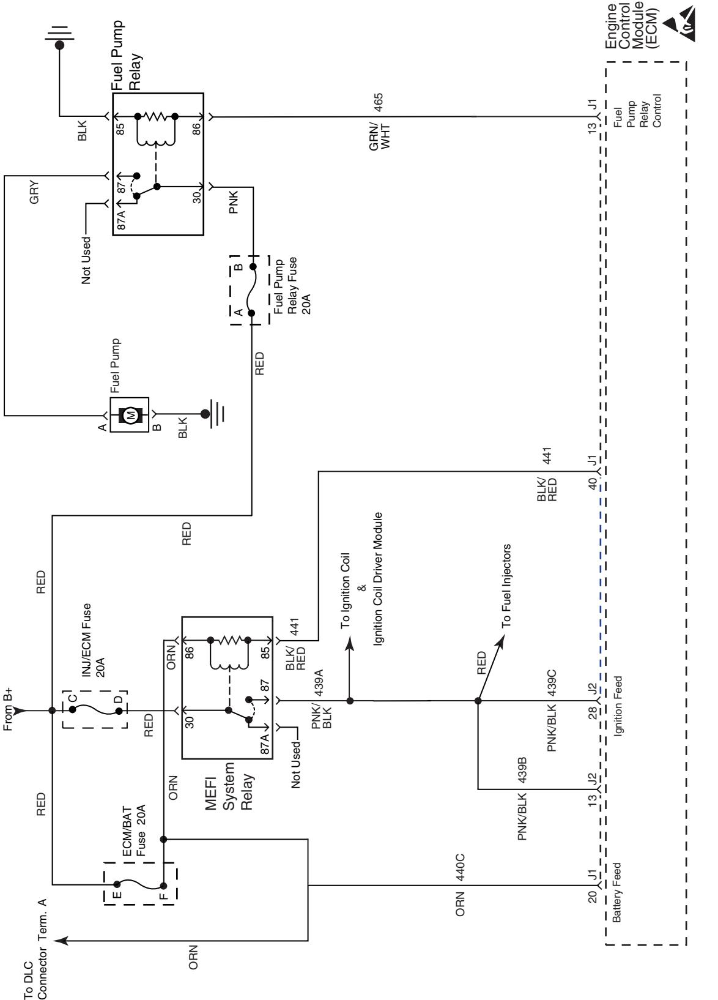

9-24-05

{80}------------------------------------------------

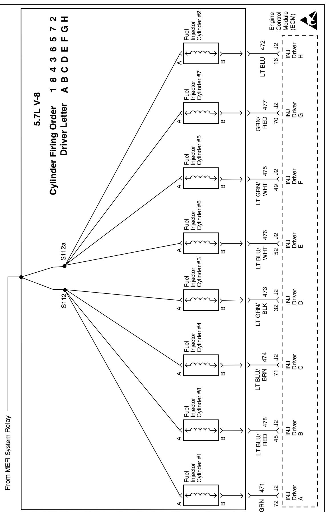

{81}------------------------------------------------

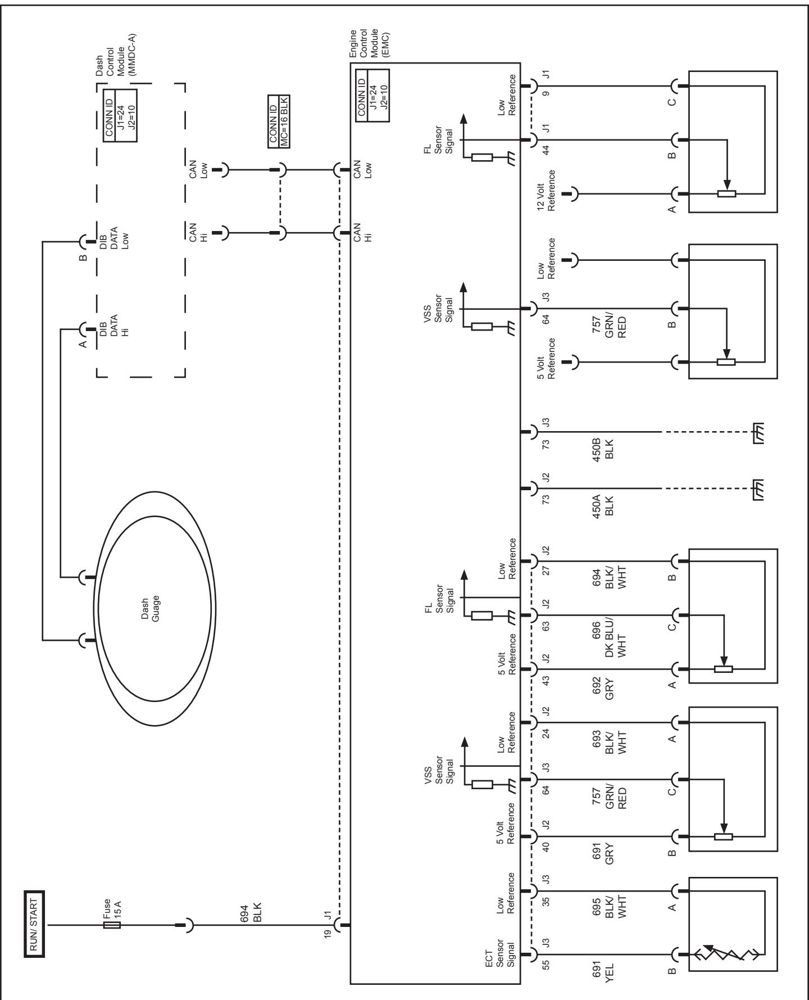

**Dash Wiring Schematics (ECT, EOP, CKP, VSS, & FL)**

{82}------------------------------------------------

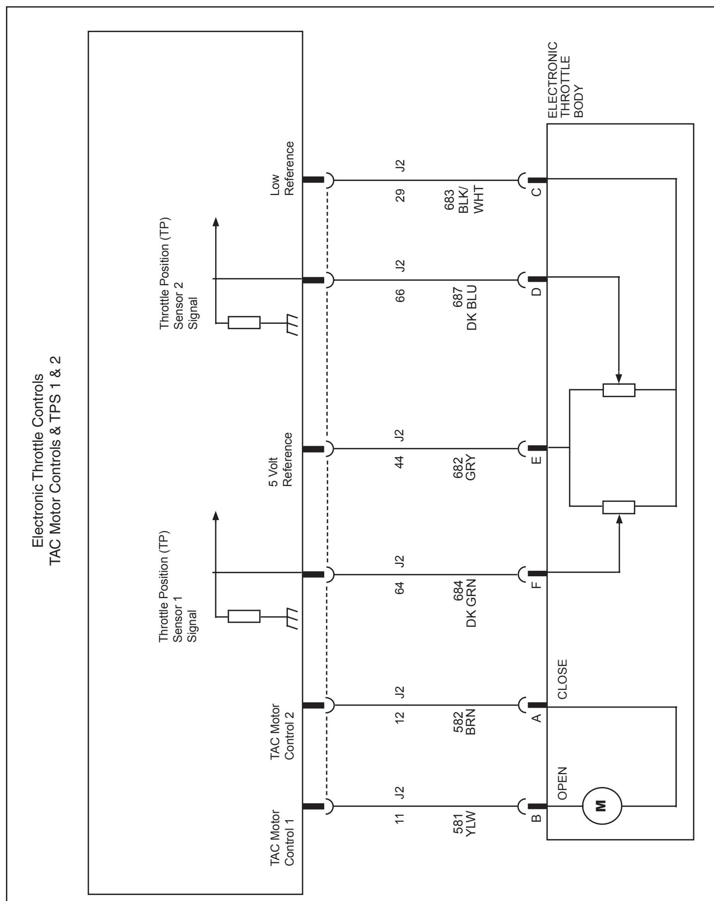

**Electronic Throttle Control (ETC) Wiring (TAC Motor & TPS 1 & 2)**

{83}------------------------------------------------

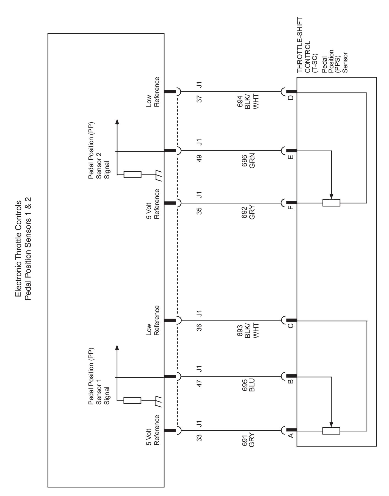

{84}------------------------------------------------

# **J-1 ECM Connector Identification (1 of 2 J-1)**

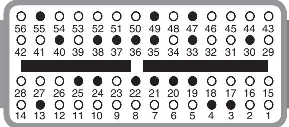

#### **ECM 56 WAY OUTPUT CONNECTOR**

| ECM PIN NUMBER | CKT(WIRE) NUMBER | CKT (WIRE) COLOR | CIRCUIT DESCRIPTION                 |
|-------------------|---------------------|---------------------|-------------------------------------|
| J1-1              |                     |                     | CRANK REQUEST *                     |
| J1-2              |                     |                     | N/A                                 |
| J1-3              | 759                 | TAN/WHT             | PERFECT PASS ENABLE                 |
| J1-4              | 941                 | YEL                 | SLAVE ENGINE SELECT                 |
| J1-5              |                     |                     | N/A                                 |
| J1-6              |                     |                     | N/A                                 |
| J1-7              |                     |                     | EMERGENCY STOP *                    |
| J1-8              |                     |                     | N/A                                 |
| J1-9              |                     |                     | LOW REFERENCE - FUEL LEVEL SENSOR * |
| J1-10             |                     |                     | N/A                                 |
| J1-11             |                     |                     | TROLL MODE *                        |
| J1-12             |                     |                     | MALFUNCTION INDICATOR LAMP *        |
| J1-13             | 465                 | GRN/WHT             | FUEL PUMP ENABLE                    |
| J1-14             |                     |                     | N/A                                 |
| J1-15             |                     |                     | N/A                                 |
| J1-16             |                     |                     | N/A                                 |
| J1-17             |                     |                     | GOVERNOR MODE *                     |
| J1-18             |                     |                     | BOOT MODE *                      |
| J1-19             | 969A                | PURPLE              | IGNITION FEED                       |
| J1-20             | 440C                | ORN                 | BATTERY FEED                        |
| J1-21             | 751                 | PNK/BLU             | CRUISE INCREMENT UP / ACCELERATE    |
| J1-22             | 752                 | PNK/WHT             | CRUISE SET                          |
| J1-23             |                     |                     | N/A                                 |
| J1-24             | 921B                | GRY                 | PULLUP FOR TACH                     |
| J1-25             | 921A                | GRY                 | TACHOMETER                          |
| J1-26             |                     | TAN                 | STARTER CONTROL HS *             |
| J1-27             |                     |                     | N/A                                 |
| J1-28             |                     |                     | N/A                                 |
| J1-29             |                     |                     | N/A                                 |
| J1-30             | 753A                | LT GRN              | CRUISE/SYNC ON/OFF                  |
| J1-31             |                     |                     | SENSOR RETURN - VSS ANALOG *        |
| J1-32             |                     |                     | 5V REFERENCE - VSS ANALOG *      |

\* Typically not used on this engine package

{85}------------------------------------------------

# **J-1 ECM Connector Identification (2 of 2 J-1)**

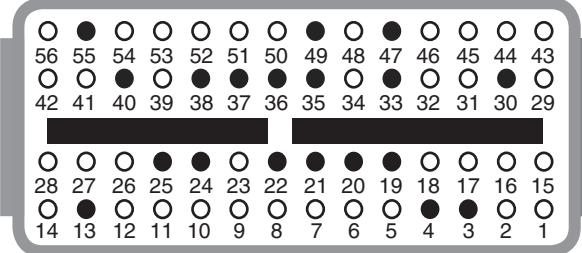

#### **ECM 56 WAY OUTPUT CONNECTOR**

| ECM PIN NUMBER | CKT(WIRE) NUMBER | CKT (WIRE) COLOR | CIRCUIT DESCRIPTION                      |
|-------------------|---------------------|---------------------|------------------------------------------|
| J1-33             | 691                 | GRY                 | 5V REFERENCE - PEDAL POSITION #1         |
| J1-34             |                     |                     | 5V REFERENCE - FUEL PRESSURE SENSOR * |
| J1-35             | 692                 | GRY                 | 5V REFERENCE - PEDAL POSITION #2         |
| J1-36             | 693                 | BLK/WHT             | LOW REFERENCE - PEDAL POSITION #1        |
| J1-37             | 694                 | BLK/WHT             | LOW REFERENCE - PEDAL POSITION #2        |
| J1-38             | 906A                | YLW/BLK             | LOAD ANTICIPATE 1 (IN GEAR)              |
| J1-39             |                     |                     | N/A                                      |
| J1-40             | 441                 | BLK/RED             | MEFI SYSTEM RELAY ENABLE                 |
| J1-41             |                     |                     | CHECK GAUGE LAMP *                    |
| J1-42             |                     |                     | N/A                                      |
| J1-43             |                     |                     | N/A                                      |
| J1-44             |                     |                     | FUEL LEVEL SENSOR *                   |
| J1-45             | 753B                |                     | FUEL LEVEL SENSOR #2 *                |
| J1-46             |                     |                     | VSS ANALOG *                          |
| J1-47             | 695                 | BLU                 | PEDAL POSITION SENSOR 1                  |
| J1-48             |                     |                     | FUEL PRESSURE SENSOR *                |
| J1-49             | 696                 | GRN                 | PEDAL POSITION SENSOR 2                  |
| J1-50             |                     |                     | FUEL TEMPERATURE SENSOR *             |
| J1-51             |                     |                     | GENERAL WARNING 1 LAMP *              |
| J1-52             |                     |                     | GENERAL WARNING 2 LAMP *              |
| J1-53             |                     |                     | SPEED BASED OUTPUT *                  |
| J1-54             |                     |                     | BUZZER *                              |
| J1-55             | 754                 | LT GRN/BLK          | CRUISE STATUS LAMP                       |
| J1-56             |                     |                     | STARTER CONTROL LS *                  |

{86}------------------------------------------------

### **J-2 ECM Connector Identification (1 of 3 J-2)**

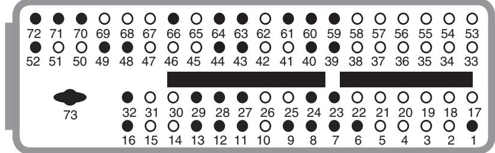

#### **ECM 73 WAY OUTPUT CONNECTOR**

| ECM PIN NUMBER | CKT(WIRE) NUMBER | CKT (WIRE) COLOR | CIRCUIT DESCRIPTION                      |
|-------------------|---------------------|---------------------|------------------------------------------|
| J2-1              | 423                 | WHT                 | EST A                                    |
| J2-2              |                     |                     | OXYGEN SENSOR A1 LO *                 |
| J2-3              |                     |                     | OXYGEN SENSOR A1 HI *                 |
| J2-4              |                     |                     | OXYGEN SENSOR A2 HI *                 |
| J2-5              |                     |                     | OXYGEN SENSOR A2 LO *                 |
| J2-6              | 496                 | WHT                 | KNOCK SENSOR FLAT RESPONSE#2             |
| J2-7              | 494                 | BLK                 | KNOCK SENSOR RETURN #2                   |
| J2-8              | 497                 | WHT                 | KNOCK SENSOR-FLAT RESPONSE               |
| J2-9              | 495                 | BLK                 | KNOCK SENSOR RETURN                      |
| J2-10             |                     |                     | KNOCK SENSOR SHIELD *                 |
| J2-11             | 581                 | YLW                 | ETC MOTOR OPEN: IAC1 PWM                 |
| J2-12             | 582                 | BRN                 | ETC MOTOR CLOSE: IAC2 PWM                |
| J2-13             | 439B                | PNK/BLK             | IGNITION 1 VOLTAGE                       |
| J2-14             |                     |                     | CAM PHASE CONTROL W *                 |
| J2-15             |                     |                     | CAM PHASE CONTROL Y *                 |
| J2-16             | 472                 | LT BLU              | FUEL INJECTOR H (CYLINDER 2)             |
| J2-17             |                     |                     | EST B *                               |
| J2-18             |                     |                     | EST G *                               |
| J2-19             |                     |                     | EST RETURN #2 *                       |
| J2-20             |                     |                     | SENSOR RETURN - CAMX *                |
| J2-21             |                     |                     | SENSOR RETURN - CAMY *                |
| J2-22             |                     |                     | SENSOR RETURN - CAMZ *                |
| J2-23             | 813                 | BLK/WHT             | LOW REFERENCE - CAM SENSOR (DISTRIBUTOR) |
| J2-24             | 814                 | BLK/WHT             | LOW REFERENCE - ENGINE OIL PRESSURE      |
| J2-25             |                     |                     | LOW REFERENCE - LEGR SENSOR *      |
| J2-26             |                     |                     | KNOCK SENSOR SHIELD #2 *              |
| J2-27             | 815                 | BLK/WHT             | LOW REFERENCE - CRANK SENSOR             |
| J2-28             | 439C                | PNK/BLK             | IGNITION 1 VOLTAGE                       |
| J2-29             | 683                 | BLK/WHT             | LOW REFERENCE - THROTTLE POSITION SENSOR |
| J2-30             |                     |                     | CAM PHASE RETURN X *                  |
| J2-31             |                     |                     | LEGR / CAM PHASE RETURN Z *              |
| J2-32             | 473                 | LT GRN/BLK          | FUEL INJECTOR D (CYLINDER 3)             |

\* Typically not used on this engine package

{87}------------------------------------------------

**J-2 ECM Connector Identification (2 of 3 J-2)**

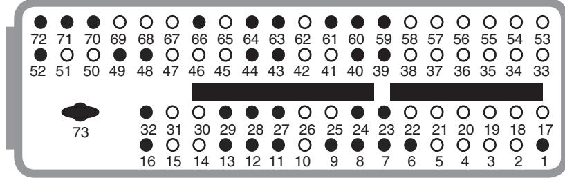

#### **ECM 73 WAY OUTPUT CONNECTOR**

| ECM PIN NUMBER | CKT(WIRE) NUMBER | CKT (WIRE) COLOR | CIRCUIT DESCRIPTION                               |
|-------------------|---------------------|---------------------|---------------------------------------------------|
| J2-33             |                     |                     | EST C *                                        |
| J2-34             |                     |                     | EST F *                                        |
| J2-35             |                     |                     | EST RETURN *                                   |
| J2-36             |                     |                     | 5V REFERENCE - CAMX (CAMB, CAM 4X) *              |
| J2-37             |                     |                     | 5V REFERENCE - CAMY (CAMC, CAM 4X2) *             |
| J2-38             |                     |                     | 5V REFERENCE - CAMZ (CAMD, CAM 4X3) *             |
| J2-39             | 413                 | GRY                 | 5V REFERENCE - CAM SENSOR (DISTRIBUTOR)        |
| J2-40             | 414                 | GRY                 | 5V REFERENCE - ENGINE OIL PRESSURE                |
| J2-41             |                     |                     | 5V REFERENCE - LINEAR EGR POSITION *              |
| J2-42             |                     |                     | SENSOR RETURN - INDUCTION AIR *                |
| J2-43             | 415                 | GRY                 | 5V REFERENCE - CRANK SENSOR                       |
| J2-44             | 682                 | GRY                 | 5V REFERENCE - THROTTLE POSITION SENSOR           |
| J2-45             |                     |                     | SENSOR RETURN - ENGINE OIL TEMP *              |
| J2-46             |                     |                     | CAM PHASE RETURN W *                           |
| J2-47             |                     |                     | CAM PHASE RETURN Y *                           |
| J2-48             | 478                 | LT BLU/RED          | FUEL INJECTOR B (CYLINDER 8)                      |
| J2-49             | 475                 | LT GRN/WHT          | FUEL INJECTOR F (CYLINDER 5)                      |
| J2-50             |                     |                     | CAM PHASE CONTROL X *                          |
| J2-51             |                     |                     | LEGR: CAM PHASE CONTROL Z *                    |
| J2-52             | 476                 | LT BLU/WHT          | FUEL INJECTOR E (CYLINDER 6)                      |
| J2-53             |                     |                     | EST D *                                        |
| J2-54             |                     |                     | EST E *                                        |
| J2-55             |                     |                     | EST H *                                        |
| J2-56             |                     |                     | CAMX SENSOR (CAMB, CAM 4X) *                   |
| J2-57             |                     |                     | CAMY SENSOR (CAMC, CAM 4X2) *                     |
| J2-58             |                     |                     | CAMZ SENSOR (CAMD, CAM 4X3) *                     |
| J2-59             | 633                 | BRN/WHT             | CAM SENSOR SIGNAL (DISTRIBUTOR) (CAMA, CAM 8XPWP) |
| J2-60             | 901                 | LT BLU/RED          | ENGINE OIL PRESSURE SENSOR SIGNAL                 |
| J2-61             | 756                 | PNK                 | DASH                                              |
| J2-62             |                     |                     | INDUCTION AIR TEMPERATURE (OR MAT) SENSOR *    |
| J2-63             | 1869                | DK BLU/WHT          | CRANK SENSOR                                      |
| J2-64             | 684                 | DK GRN              | THROTTLE POSITION SENSOR #1                       |

\* Typically not used on this engine package

{88}------------------------------------------------

### **J-2 ECM Connector Identification (3 of 3 J-2)**

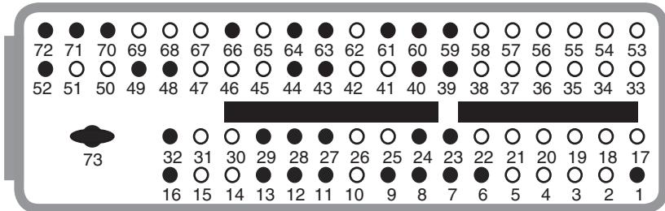

**J-2 (Continued) ECM 73 WAY OUTPUT CONNECTOR**

| ECM PIN NUMBER | CKT(WIRE) NUMBER | CKT (WIRE) COLOR | CIRCUIT DESCRIPTION                |
|-------------------|---------------------|---------------------|------------------------------------|
| J2-65             |                     |                     | ENGINE OIL TEMPERATURE SENSOR * |
| J2-66             | 687                 | DK BLU              | THROTTLE POSITION SENSOR #2        |
| J2-67             |                     |                     | HIGH SPEED MASS AIR FLOW *      |
| J2-68             |                     |                     | OXYGEN SENSOR A1 HEATER *       |
| J2-69             |                     |                     | OXYGEN SENSOR A2 HEATER *       |
| J2-70             | 477                 | GRN/RED             | FUEL INJECTOR G                    |
| J2-71             | 474                 | LT BLU/BRN          | FUEL INJECTOR C                    |
| J2-72             | 471                 | GRN                 | FUEL INJECTOR A                    |
| J2-73             | 450A                | BLK                 | POWER GROUND                       |

{89}------------------------------------------------

**This page left intentionally blank**

{90}------------------------------------------------

## **J-3 ECM Connector Identification (1 of 3 J-3)**

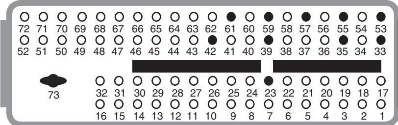

#### **ECM 73 WAY OUTPUT CONNECTOR**

| ECM PIN NUMBER | CKT(WIRE) NUMBER | CKT (WIRE) COLOR | CIRCUIT DESCRIPTION                        |
|-------------------|---------------------|---------------------|--------------------------------------------|
| J3-1              |                     |                     | CAT TEMPERATURE SENSOR A *                 |
| J3-2              |                     |                     | CAT TEMPERATURE SENSOR B *                 |
| J3-3              |                     |                     | OXYGEN SENSOR B1 LO *                   |
| J3-4              |                     |                     | OXYGEN SENSOR B1 HI *                      |
| J3-5              |                     |                     | OXYGEN SENSOR B2 HI *                      |
| J3-6              |                     |                     | OXYGEN SENSOR B2 LO *                   |
| J3-7              |                     |                     | N/A                                        |
| J3-8              |                     |                     | LOW OIL LEVEL LAMP *                    |
| J3-9              |                     |                     | N/A                                        |
| J3-10             |                     |                     | CYLINDER DEACTIVATE C *                 |
| J3-11             |                     |                     | CYLINDER DEACTIVATE A *                 |
| J3-12             |                     |                     | GOVENOR PWM OUTPUT (NON-ETC GOVENOR) *  |
| J3-13             |                     |                     | TRANSMISSION UP-SHIFT *                 |
| J3-14             |                     |                     | N/A                                        |
| J3-15             |                     |                     | OXYGEN SENSOR B1 HEATER *                  |
| J3-16             |                     |                     | TROLL MODE LAMP *                       |
| J3-17             |                     |                     | N/A                                        |
| J3-18             |                     |                     | ENGINE OIL LEVEL LOW SENSOR *           |
| J3-19             |                     |                     | SENSOR RETURN - CAT TEMP SENSOR A *     |
| J3-20             |                     |                     | SENSOR RETURN - CAT TEMP SENSOR B *     |
| J3-21             |                     |                     | SENSOR RETURN - VARIABLE GOVENOR *      |
| J3-22             |                     |                     | N/A                                        |
| J3-23             | 816                 | BLK/WHT             | LOW REFERENCE - MANIFOLD ABSOLUTE PRESSURE |
| J3-24             |                     |                     | AUX ANALOG RETURN *                        |
| J3-25             |                     |                     | SENSOR RETURN - GENERAL WARNING 2 *     |
| J3-26             |                     |                     | SENSOR RETURN - GENERAL WARNING 1 *     |
| J3-27             |                     |                     | N/A                                        |
| J3-28             |                     |                     | SENSOR RETURN - DIGITAL VSS *           |
| J3-29             |                     |                     | N/A                                        |
| J3-30             |                     |                     | N/A                                        |
| J3-31             |                     |                     | N/A                                        |
| J3-32             |                     |                     | N/A                                        |

\* Typically not used on this engine package

{91}------------------------------------------------

**J-3 ECM Connector Identification (2 of 3 J-3)**

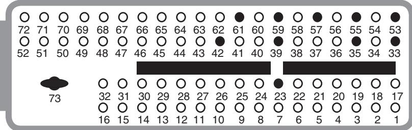

#### **ECM 73 WAY OUTPUT CONNECTOR**

| ECM PIN NUMBER | CKT(WIRE) NUMBER | CKT (WIRE) COLOR | CIRCUIT DESCRIPTION                                                 |
|-------------------|---------------------|---------------------|---------------------------------------------------------------------|
| J3-33             | 804A                | WHT/BLK             | CAN BUS LO TERMINATED (TO DASH & DLC)                               |
| J3-34             |                     |                     | N/A                                                                 |
| J3-35             | 817                 | BLK/WHT             | LOW REFERENCE - ENGINE COOLANT TEMP SENSOR                          |
| J3-36             |                     |                     | N/A                                                                 |
| J3-37             |                     |                     | 5V REFERENCE - VARIABLE GOVERNOR *                                  |
| J3-38             |                     |                     | N/A                                                                 |
| J3-39             | 416                 | GRY                 | 5V REFERENCE - MANIFOLD ABOSOLUTE PRESSURE                          |
| J3-40             |                     |                     | 5V REFERENCE - AUX ANALOG *                                      |
| J3-41             |                     |                     | 5V REFERENCE - GENERAL WARNING 2 *                               |
| J3-42             | 417                 | GRY                 | 5V REFERENCE - GENERAL WARNING 1 (TRANSMISSION OVER TEMP SENSOR) |
| J3-43             |                     |                     | N/A                                                                 |
| J3-44             |                     |                     | 5V REFERENCE - DIGITAL VSS *                                     |
| J3-45             |                     |                     | LOAD ANTICIPATE 2 *                                              |
| J3-46             |                     |                     | SHIFT INTERRUPT / TRANSMISSION LOCK LOW *                        |
| J3-47             |                     |                     | N/A                                                                 |
| J3-48             |                     |                     | CONTROL CANISTER PURGE *                                         |
| J3-49             |                     |                     | N/A                                                                 |
| J3-50             |                     |                     | OXYGEN SENSOR B2 HEATER *                                        |
| J3-51             |                     |                     | N/A                                                                 |
| J3-52             |                     |                     | N/A                                                                 |
| J3-53             | 803A                | WHT/RED             | CAN BUS HI TERMINATED (GOES TO DLC-C & DASH K)                      |
| J3-54             |                     |                     | N/A                                                                 |
| J3-55             | 410                 | YLW                 | ENGINE COOLANT TEMPERATURE SENSOR SIGNAL                            |
| J3-56             |                     |                     | N/A                                                                 |
| J3-57             | 755                 | LT GRN/WHT          | VARIABLE GOVERNOR (TO DASH-E)                                       |
| J3-58             |                     |                     | N/A                                                                 |
| J3-59             | 432                 | LT GRN              | MANIFOLD ABSOLUTE PRESSURE SENSOR SIGNAL                            |
| J3-60             |                     |                     | AUX ANALOG INPUT *                                               |
| J3-61             | 933                 | TAN/BLK             | GENERAL WARNING 1 (TO TRANS TEMP SENSOR SIGNAL)                     |
| J3-62             |                     |                     | GENERAL WARNING 2 *                                              |
| J3-63             |                     |                     | N/A                                                                 |
| J3-64             | 757                 | GRN/RED             | DIGITAL VSS (TO DASH-N)                                          |

\* Typically not used on this engine package

{92}------------------------------------------------

#### **J-3 ECM Connector Identification (3 of 3 J-3)**

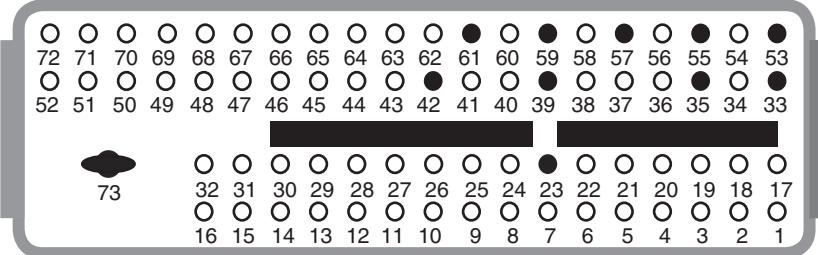

#### **ECM 73 WAY OUTPUT CONNECTOR**

| ECM PIN NUMBER | CKT(WIRE) NUMBER | CKT (WIRE) COLOR | CIRCUIT DESCRIPTION             |
|-------------------|---------------------|---------------------|---------------------------------|
| J3-65             |                     |                     | ENGINE OIL PRESSURE SWITCH * |
| J3-66             |                     |                     | VR VSS FREQ HI *             |
| J3-67             |                     |                     | VR VSS FREQ LO *             |
| J3-68             |                     |                     | CYLINDER DEACTIVATE B *         |
| J3-69             |                     |                     | CYLINDER DEACTIVATE D *         |
| J3-70             |                     |                     | N/A                             |
| J3-71             |                     |                     | N/A                             |
| J3-72             |                     |                     | N/A                             |
| J3-73             | 450B                | BLK                 | POWER GROUND #2                 |

{93}------------------------------------------------

**This page left intentionally blank**

{94}------------------------------------------------

# 1415989

# **Scan Tool Data List**

#### Scan Tool Data List:Engine Controls – MEFI5

The Engine Scan Tool Data List contains all engine related parameters that are available on the scan tool. The list is arranged in alphabetical order. A given parameter may appear in any one of the data lists, and in some cases may appear more than once, or in more than one data list in order to group certain related parameters together. Use the Engine Scan Tool Data List only after the following is determined:

- The Diagnostic System Check Vehicle is completed.
- No diagnostic trouble codes (DTCs)
- On-board diagnostics are functioning properly.

Scan tool values from a properly running engine may be used for comparison with the engine you are diagnosing. The Engine Scan Tool Data List represents values that would be seen on a normal running engine.

*Important:* A scan tool that displays faulty data should not be used. The scan tool problem should be reported to the manufacturer. Use of a faulty scan tool can result in misdiagnosis and unnecessary parts replacement. Only the parameters listed below are referenced in this service manual for use in diagnosis. If all values are within the typical range described below, refer to Symptoms - Engine Controls for diagnosis.

The column labeled Data List indicates where a parameter can be located on the scan tool. Refer to the scan tool operating manual for the exact locations of the data lists. The following is a description of each term listed:

**All:** The Parameter is in all of the data lists indicated below.

**Eng:** Engine Data List

**EE:** Enhanced Evaporative Emission (EVAP) Data **FT:** Fuel Trim Data List **H2:** Heated Oxygen Sensor (HO2S) Data List **IG:** Ignition System Data List **MF:** Misfire Data List **OD:** Output Driver Data List **TAC:** Throttle Actuator Control (TAC) Data List

| Scan Tool Parameter                                                              | Data List                          | Parameter Range/Units | Typical Data Values               |  |
|----------------------------------------------------------------------------------|------------------------------------|-----------------------|-----------------------------------|--|
| Engine Idling/Radiator Hose Hot/Closed Throttle/Park/Closed Loop/Accessories OFF |                                    |                       |                                   |  |
| 5-Volt Reference♦1 Circuit Status                                                | EE, Eng, Ign, TAC                  | OK/Fault              | OK                                |  |
| 5-Volt Reference♦2 Circuit Status                                                | EE, Eng, Ign, TAC                  | OK/Fault              | OK                                |  |
| 5-Volt Reference♦1                                                               | EE, Eng, Ign, TAC                  | Volts                 | 4.5♦V                             |  |
| 5-Volt Reference♦2                                                               | EE, Eng, Ign, TAC                  | Volts                 | 4.5♦V                             |  |
| Ambient Air Temperature                                                          | Eng                                | °C/°F                 | Varies                            |  |
| PPS Indicated Angle                                                              | EE, Eng, FT, HO2S, Ign, MF, TAC | 0–100%                | 0                                 |  |
| PP Sensor♦1                                                                      | TAC                                | 0–5.0♦Volts           | 0.4–1.0♦Volt                      |  |
| PP Sensor♦2                                                                      | TAC                                | 5.0–0♦Volts           | 4.5–4.1♦Volts                     |  |
| PP Sensor♦1                                                                      | TAC                                | 0–100%                | 0%                                |  |
| PP Sensor♦2                                                                      | TAC                                | 0–100%                | 0%                                |  |
| PP Sensor♦1 and 2                                                                | TAC                                | Agree/Disagree        | Agree                             |  |
| PP Sensor♦1 Indicated Position                                                   | TAC                                | %                     | 0%                                |  |
| PP Sensor♦2 Indicated Position                                                   | TAC                                | %                     | —                                 |  |
| PP Sensors                                                                       | TAC                                | %                     | 0%                                |  |
| BARO                                                                             | EE, Eng, FT, HO2S, Ign             | kPa                   | 50–104♦kPa/ Varies w/ Altitude |  |
| CKP Active Counter                                                               | Ign                                | 0–250♦Counts          | Varies                            |  |
| CKP Resync Counter                                                               | Ign                                | Counts                | 0                                 |  |
| CKP Sensor                                                                       | Eng, Ign                           | RPM                   | 500–700♦RPM                       |  |

{95}------------------------------------------------

| CMP Active Counter                   | Ign                                 | 0–250♦Counts                                | Varies                                        |
|--------------------------------------|-------------------------------------|---------------------------------------------|-----------------------------------------------|
| CMP Sensor                           | Eng, Ign, MF                        | RPM                                         | 1,000–1,400♦RPM                               |
| Cold Start-Up                        | Eng, EE                             | Yes/No                                      | Varies                                        |
| Cruise Control Active                | Eng, TAC                            | Active/Inactive                             | Inactive                                      |
| Cycles of Misfire Data               | MF                                  | 0–100♦Counts                                | Varies                                        |
| Cylinder 1–8 IC Circuit Status       | OD                                  | OK, Incomplete, Short B+, Short Gnd/Open | OK                                            |
| Cylinder 1–8 Injector Circuit Status | OD                                  | OK, Incomplete, Short B+, Short Gnd/Open | OK                                            |
| Decel Fuel Cutoff                    | Eng, FT, HO2S                       | Active/Inactive                             | Inactive                                      |
| Desired Idle Speed                   | EE, Eng, TAC                        | RPM                                         | ECM Controlled                                |
| EC Ignition Relay Circuit Status     | OD                                  | OK, Incomplete, Short B+, Short Gnd/Open | OK/Incomplete                                 |
| EC Ignition Relay Command            | Eng, TAC                            | On/Off                                      | On                                            |
| EC Ignition Relay Feedback           | Eng, TAC                            | Volts                                       | 2.25–2.95♦Volts                               |
| ECM Reset                            | EE, Eng, Ign                        | Yes/No                                      | No                                            |
| ECT Sensor                           | All                                 | −39 to +140°C (−38 to +284°F)            | 88–105°C (190–221°F)                          |
| Engine Load                          | All                                 | 0–100%                                      | 18% @ Idle 21% @ 2500♦RPM                  |
| Engine Oil Pressure Sensor           | Eng, MF                             | PSI                                         | 30                                            |
| Engine Oil Pressure Sensor           | EVAP                                | Volts                                       | 1.5                                           |
| Engine Run Time                      | All                                 | Hrs, Min, Sec                               | Varies                                        |
| Engine Speed                         | All                                 | 0–10,000♦RPM                                | 500–700♦RPM                                   |
| Engine Speed Circuit Status          | OD                                  | OK, Incomplete, Short B+, Short Gnd/Open | OK                                            |
| FC Circuit Status                    | OD                                  | OK, Incomplete, Short B+, Short Gnd/Open | OK/Incomplete                                 |
| Fuel Level Sensor                    | EE                                  | 0–5♦Volts                                   | 0.7–2.5♦Volts                                 |
| Fuel Pump Relay Circuit Status       | OD                                  | OK, Incomplete, Short B+, Short Gnd/Open | OK/Incomplete                                 |
| Fuel Pump Relay Command              | Eng, FT                             | On/Off                                      | ON                                            |
| Fuel Tank Level Remaining            | Eng, MF                             | 0–100%                                      | Varies                                        |
| IAT Sensor                           | All                                 | −39 to +140°C (−38 to +284°F)            | 35°C (91°F) Depends on Ambient Temperature |
| Ignition Accessory Signal            | Eng, TAC                            | On/Off                                      | ON                                            |
| Ignition♦1 Signal                    | All                                 | 0–25♦Volts                                  | 11.5–14.5♦Volts                               |
| Ignition Off Timer                   | Eng                                 | Seconds,Minutes, Hours                      | Varies                                        |
| Inj. PWM Bank♦1                      | Eng, FT, HO2S                       | Milliseconds                                | 2–6                                           |
| Inj. PWM Bank♦2                      | Eng, FT, HO2S                       | Milliseconds                                | 2–6                                           |
| Knock Retard                         | Ign                                 | 0.0–16°                                     | 0°                                            |
| KS Active Counter                    | Ign                                 | Counts                                      | Varies                                        |
| KS Bank♦1 Circuit Status             | Ign                                 | OK/Fault/Incomplete                         | OK/Incomplete                                 |
| KS Bank♦2 Circuit Status             | Ign                                 | OK/Fault/Incomplete                         | OK/Incomplete                                 |
| KS Module Status                     | Ign                                 | OK/Fault/Incomplete                         | OK/Incomplete                                 |
| MAP Sensor                           | EE, Eng, FT, HO2S, Ign, MF, TAC, | kPa                                         | 20–48♦kPa                                     |
| MAP Sensor                           | Eng, FT, HO2S, MF, TAC              | Volts                                       | 1.0–2.0♦Volts Varies with Altitude         |
| MIL Circuit Status                   | OD                                  | OK, Incomplete, Short B+, Short Gnd/Open | OK/Incomplete                                 |
| MIL Command                          | EE, Eng, Ign                        | Off/On                                      | Off                                           |
| MIL Requested by DTC                 | EE, Eng, Ign                        | Yes/No                                      | No                                            |

{96}------------------------------------------------

| Misfire Current Cyl. 1–8       | MF                                 | 0–200♦Counts                                | 0               |
|--------------------------------|------------------------------------|---------------------------------------------|-----------------|
| Misfire History Cyl. 1–8       | MF                                 | 0–65,535♦Counts                             | 0               |
| Power Enrichment               | Eng, FT, HO2S, MF                  | Active/Inactive                             | Inactive        |
| Reduced Engine Power           | TAC                                | Active/Inactive                             | Inactive        |
| Spark                          | Eng, FT, HO2S, Ign, MF             | Degrees                                     | 10–17°          |
| Starter Relay Circuit Status   | OD                                 | OK, Incomplete, Short B+, Short Gnd/Open | OK/Incomplete   |
| TAC Forced Engine Shutdown     | TAC                                | Yes/No                                      | No              |
| TAC Motor                      | TAC                                | Enabled/Disabled                            | Enabled         |
| TAC Motor Command              | TAC                                | 0–100%                                      | 15–35%          |
| Total Knock Retard             | Ign                                | Degrees                                     | 0°              |
| Total Misfire                  | MF                                 | Counts                                      | Varies          |
| TP Desired Angle               | TAC                                | 0–100%                                      | 5.5%            |
| TP Indicated Angle             | EE, Eng, FT, HO2S, Ign, MF, TAC | 0–100%                                      | 5.5%            |
| TP Sensor♦1                    | TAC                                | 0–5.0♦Volts                                 | 4.1–4.95♦Volts  |
| TP Sensor♦1                    | TAC                                | 0–100%                                      | Varies near 5%  |
| TP Sensor♦1 Learned Minimum    | TAC                                | Volts                                       | .55             |
| TP Sensor♦2                    | TAC                                | 5.0–0♦Volts                                 | 0.4–0.85♦V      |
| TP Sensor♦2                    | TAC                                | 100–0%                                      | Varies near 5%  |
| TP Sensor♦2 Learned minimum    | TAC                                | Volts                                       | .55             |
| TP Sensors♦1 and 2             | TAC                                | Agree/Disagree                              | Agree           |
| TP Sensor♦1 Indicated Position | TAC                                | %                                           | 5%              |
| TP Sensor♦2 Indicated Position | TAC                                | %                                           | 5%              |
| Vacuum Calculated              | EE, Eng, FT, HO2S                  | kPa/in♦Hg                                   | 59♦kPa/16♦in♦Hg |
| Vehicle Speed Circuit Status   | OD                                 | OK, Incomplete, Short B+, Short Gnd/Open | OK/Incomplete   |
| Vehicle Speed Circuit♦2 Status | OD                                 | OK, Incomplete, Short B+, Short Gnd/Open | OK/Incomplete   |
| Vehicle Speed Sensor           | EE, Eng, FT, HO2S, Ign, MF, TAC | km/h mph                                 | 0               |
| Wide Open Throttle             | TAC                                | Yes/No                                      | No              |

{97}------------------------------------------------

**This page left intentionally blank**

{98}------------------------------------------------

#### 743805

# **Scan Tool Data Definitions**

#### Scan Tool Data Definitions:Engine Controls - 6.0L

The Engine Scan Tool Data Definitions contains a brief description of all engine related parameters available on the scan tool. The list is in alphabetical order. A given parameter may appear in any one of the data lists. In some cases, the parameter may appear more than once or in more than one data list in order to group certain related parameters together.

**BARO (Gasoline):** This parameter displays the barometric pressure as calculated by the control module using the signal from the manifold absolute pressure (MAP) sensor measured when the ignition is turned on with the engine not running. The control module will update the barometric pressure during wide-open throttle (WOT) conditions. The scan tool will display a low value when the barometric pressure is low, and a high value when the barometric pressure is high.

**BARO (Gasoline):** This parameter displays the voltage signal received by the control module from the manifold absolute pressure (MAP) sensor measured when the ignition is turned on with the engine not running. The control module will update the barometric pressure during wide-open throttle (WOT) conditions. The scan tool will display a low value when the barometric pressure is low, and a high value when the barometric pressure is high.

**CMP Sensor - High To Low:** This parameter displays the number of times the signal voltage from the camshaft position (CMP) sensor changes from high to low. The scan tool will display these transitions as counts.

**CMP Sensor - Low To High:** This parameter displays the number of times the signal voltage from the camshaft position (CMP) sensor changes from low to high. The scan tool will display these transitions as counts.

**Cycles Of Misfire Data:** This parameter displays the number of cylinder firing events that were recorded as misfires as determined by the control module.

**Desired IAC Airflow:** This parameter displays the desired airflow in the idle air control (IAC) passage as calculated by the control module.

**Desired Idle Speed:** This parameter displays the engine idle speed in RPM commanded by the control module. The control module compensates for various engine loads in order to maintain the desired engine RPM at idle. This parameter is not valid unless the engine is running.

**DTC Set This Ignition:** This parameter displays if a diagnostic trouble code (DTC) set during the current ignition cycle. The scan tool will display YES if a DTC is stored this ignition cycle.

**ECT Sensor:** This parameter displays the temperature of the engine coolant based on a voltage input from the engine coolant temperature (ECT) sensor to the control module. The scan tool will display a low value when the coolant temperature is low and a high value when the coolant temperature is high.

**Engine Load:** This parameter displays the engine load in percent based on inputs to the control module from various engine sensors. The scan tool will display a low percentage when the engine is at idle with little or no load. The scan tool will display a high percentage when the engine is running at a high RPM under a heavy load.

**Engine Run Time:** This parameter displays the time elapsed since the engine was started. The scan tool will display the time in hours, minutes and seconds. The engine run time will reset to zero as soon as the engine stops running.

**Engine Speed:** This parameter displays the speed of the crankshaft as calculated by the control module based on inputs from the Crankshaft Position (CKP) Sensor. The scan tool will display the engine speed in revolutions per minute (RPM).

**Fuel Level Sensor:** This parameter displays the voltage from the signal produced by the sensor used to monitor the fuel level inside the fuel tank. The scan tool will display a low voltage reading when the fuel level in the tank is low or near empty. The scan tool will display a high voltage reading when the fuel level in the tank is high or near full.

**Generator F-Terminal Signal :** This parameter displays the commanded state of the generator by the control module. A High value indicates a high charging command, and a low value indicates a low charging command.

**Generator L-Terminal Signal Command:** This parameter displays if the control module is allowing the generator to operate. The scan tool displays ON if the generator is allowed to operate. The scan tool displays OFF if the control module is disabling the generator.

**IAC Position:** This parameter displays the position of the Idle Air Control (IAC) motor pintle as commanded by the control module. The scan tool will display a high count for a higher idle speed command, and a low count for a lower idle speed command.

**IAT Sensor:** This parameter displays the temperature of the intake air calculated by the control module based on the input from the intake air temperature (IAT). The scan tool will display a low value for a low intake air temperature, and a high value for a high intake air temperature.

**Ignition 1 Signal:** This parameter displays the voltage measured at the ignition 1 circuit of the control module. Voltage is applied to the control module when the ignition switch is in the ignition 1 position. The scan tool will display a higher value with a higher system voltage, and a lower value with a lower system voltage.

{99}------------------------------------------------

**Injector PWM Bank 1 Average:** The scan tool displays in milliseconds. This parameter is the average time the control module turns on each fuel injector on that bank. The scan tool will display a higher value with a longer pulse width, or a lower value with a shorter pulse width.

**Injector PWM Bank 2 Average:** The scan tool displays in milliseconds. This parameter is the average time the control module turns on each fuel injector on that bank. The scan tool will display a higher value with a longer pulse width, or a lower value with a shorter pulse width.

**Knock Retard:** The scan tool displays in °. This parameter indicates the amount of timing retard commanded by the control module. The scan tool will display a lower value if no knock is detected and a higher value as more knock is detected and the control module retards the ignition timing.

**MAP Sensor:** The scan tool displays kPa. This parameter displays the pressure inside of the intake manifold as calculated by the control module based on the input from the MAP sensor. The scan tool will display a high value at cruising speed or wide open throttle (WOT). The scan tool will display a low value at idle speed.

**MAP Sensor:** This parameter displays the voltage signal from the MAP sensor to the control module. The scan tool will display a high value at cruising speed or wide open throttle (WOT). The scan tool will display a low vale at idle speed.

**MIL Command:** This parameter displays the commanded state of the malfunction indicator lamp (MIL) control circuit. The malfunction indicator lamp should be on when the scan tool indicates the MIL Command is On. The malfunction indicator lamp should be off when the scan tool indicates the MIL Command is Off. The control module will command the MIL On when the ignition is ON with the engine OFF in order to perform a bulb check.

**Misfire Current Cyl. #1-8:** The scan tool will display in counts. This parameter indicates the number of cylinder firing events detected as possible misfires on each cylinder during the last 200 crankshaft revolutions as calculated by the control module. The scan tool will display a low number for a low number of cylinder misfire events. The scan tool will display a high number for a high number of cylinder misfire events.

**Misfire History Cyl. #1-8:** The scan tool displays in counts. This parameter displays the total level of cylinder misfires that have been calculated for each cylinder by the control module. This parameter will not update or show activity until a misfire DTC has become active. The misfire history counters will update every 200 cylinder firing events.

**Not Run Counter:** The scan tool displays the number of times a DTC diagnostic has not reached the predetermined criteria in order to run since the first DTC run failure.

**Pass Counter:** The scan tool displays the number of times a DTC has run and passed.

**Reduced Engine Power:** The scan tool displays Active or Inactive. The scan tool displays Active when the control module receives a signal from the throttle actuator control (TAC) module that a TAC system fault is occurring. The scan tool displays inactive when the engine is operating normally.

**Spark:** This parameter is the desired spark advance calculated by the control module based on many sensor inputs. The scan tool will display a lower value at idle speed, and a higher value under heavy acceleration and load conditions.

**Start Up ECT:** This parameter indicates the engine coolant temperature at startup, as calculated by the control module based on the input from the engine coolant temperature sensor. The scan tool will display a higher value at higher engine startup temperatures, and a lower value at lower startup temperatures.

**TP Sensor:** This parameter displays the voltage signal sent to the control module from the sensor used to monitor the position of the throttle plates. The scan tool will display a low voltage when the throttle plates are at rest. The scan tool will display a high voltage when the throttle plates are fully open.

**TP Sensor:** This parameter displays the angle of the throttle position (TP) sensor in percent. This information is calculated by the control module using the signal from the throttle position sensor. The scan tool will display a low percentage when the throttle plates are closed. The scan tool will display a high percentage when the throttle plates are fully open.

**Vehicle Speed Sensor:** This parameter indicates the vehicle speed calculated by the control module based on an input from the vehicle speed sensor (VSS). the scan tool will display a high value at higher vehicle speeds, and a low value at lower vehicle speeds.

{100}------------------------------------------------

# 1551124 **Scan Tool Output Controls**

Scan Tool Output Controls: Engine Controls – MEFI 5

| Scan Tool Output♦Control       | Additional Menu Selection(s)          | Description                                                                                                                                                                                                                                                                                                                                                                                                                                               |  |
|-----------------------------------|------------------------------------------|-----------------------------------------------------------------------------------------------------------------------------------------------------------------------------------------------------------------------------------------------------------------------------------------------------------------------------------------------------------------------------------------------------------------------------------------------------------|--|
|                                   |                                          | Enables the engine control module (ECM) to learn the variations in the crankshaft position (CKP) system. The ECM will learn the variations once the following conditions are met:                                                                                                                                                                                                                                                                   |  |
| Crankshaft                        |                                          | • Engine coolant temperature (ECT) is more than a specified value.                                                                                                                                                                                                                                                                                                                                                                                     |  |
| Position Variation Learn       | —                                        | • All instructions on the scan tool have been completed.                                                                                                                                                                                                                                                                                                                                                                                               |  |
|                                   |                                          | • The accelerator pedal is smoothly applied until the fuel cut-OFF, as specified on                                                                                                                                                                                                                                                                                                                                                                    |  |
|                                   |                                          | the scan tool, is achieved, and then immediately released. The ECM learns the variation values on the deceleration from fuel cut-OFF.                                                                                                                                                                                                                                                                                                                  |  |
|                                   |                                          | Enables/Disables a cylinder by turning OFF the fuel injector to the cylinder. The fuel injector is normally enabled. The ECM disables the fuel injector when the following conditions are met:                                                                                                                                                                                                                                                      |  |
| Cylinder Power                    | Fuel System                              | • All instruction on the scan tool are completed                                                                                                                                                                                                                                                                                                                                                                                                       |  |
| Balance                           |                                          | • Stabilized engine speed                                                                                                                                                                                                                                                                                                                                                                                                                              |  |
|                                   |                                          | • The fuel injector is selected When Disable is selected the PCM turns the injector OFF for 30 seconds. During this period, the engine operates with a misfire.                                                                                                                                                                                                                                                                                  |  |
| Engine Controls Ignition Relay | Engine Output Controls                   | Enables or disables the Engine Controls Ignition Relay. The scan tool will command the engine controller to turn the relay ON or OFF. The normal commanded state is ON.                                                                                                                                                                                                                                                                             |  |
| Engine Speed Control           | TAC System                               | Activates the throttle activation control (TAC) system to change engine RPM. The normal commanded state is None. To enable the RPM control, all instruction on the scan tool must be completed. The system will increase or decrease the RPM within a range of 350–2000 RPM. The set step value changes the RPM by increments of 25 RPM, 100 RPM, and 500 RPM. The system remains in the commanded state until cancelled by the scan tool. |  |
|                                   | Fuel System                              | Enables the fuel injector in order to verify proper fuel injector flow. The ECM will pulse                                                                                                                                                                                                                                                                                                                                                                |  |
|                                   |                                          | the selected injector when the following conditions are met:                                                                                                                                                                                                                                                                                                                                                                                              |  |
| Fuel Injector                     |                                          | • All instruction on the scan tool completed                                                                                                                                                                                                                                                                                                                                                                                                           |  |
| Balance                           |                                          | • Fuel injector selected                                                                                                                                                                                                                                                                                                                                                                                                                               |  |
|                                   |                                          | • Key ON, engine OFF The selected fuel injector can only be flowed/pulsed once per ignition cycle.                                                                                                                                                                                                                                                                                                                                                  |  |
| Fuel Pump                         | Engine Output Controls/ Fuel Pump     | Controls the fuel pump relay. The normal commanded state is None. When commanded ON/OFF, the ECM turns the fuel pump ON/OFF. If the engine is running, and the fuel pump is commanded OFF, the engine will stall. The system remains in the commanded state until cancelled by the scan tool.                                                                                                                                                    |  |
| Malfunction Indicator Lamp     | Engine Output Controls                   | Controls the malfunction indicator lamp (MIL). The commanded states include None, ON, and OFF. When commanded ON or OFF, the system remains in the commanded state until cancelled by the scan tool.                                                                                                                                                                                                                                                |  |
| Misfire Graphic                   | —                                        | Graphs the accumulated misfires occurring in each cylinder. The scan tool allows for a reset of the misfire graph.                                                                                                                                                                                                                                                                                                                                     |  |
| Spark Retard                      | Engine Output Controls/ Spark Control | Controls the amount of spark retard. The scan tool will command an increase or decrease in the amount of spark retard in 1-degree increments, within a range of 1–10 degrees. The degrees of spark retard will remain in the commanded state until cancelled by the scan tool. The normal commanded states is NONE.                                                                                                                              |  |
| Throttle Position                 | TAC System/Throttle Blade Control     | Operates TAC motor in 10-percent increments to open or close the throttle blade. The test operates during key ON, engine OFF.                                                                                                                                                                                                                                                                                                                          |  |

{101}------------------------------------------------

**This page left intentionally blank**

{102}------------------------------------------------

# **Small Connector Pin Outs**

| Connector Part |         | • 12110293           |                      |  |
|----------------|---------|----------------------|----------------------|--|
| Information    |         | • 3-Way F Metri-Pack |                      |  |
|                |         | 150 Series Sealed    |                      |  |
|                | Wire    | Circuit              |                      |  |
| Pin            | Color   | No.                  | Function             |  |
| A              | BLK/WHT | 813                  | 5 V Return           |  |
| B              | BRN/WHT | 633                  | CMP Sensor Signal    |  |
| C              | GRY     | 413                  | Sensor 5 V Reference |  |

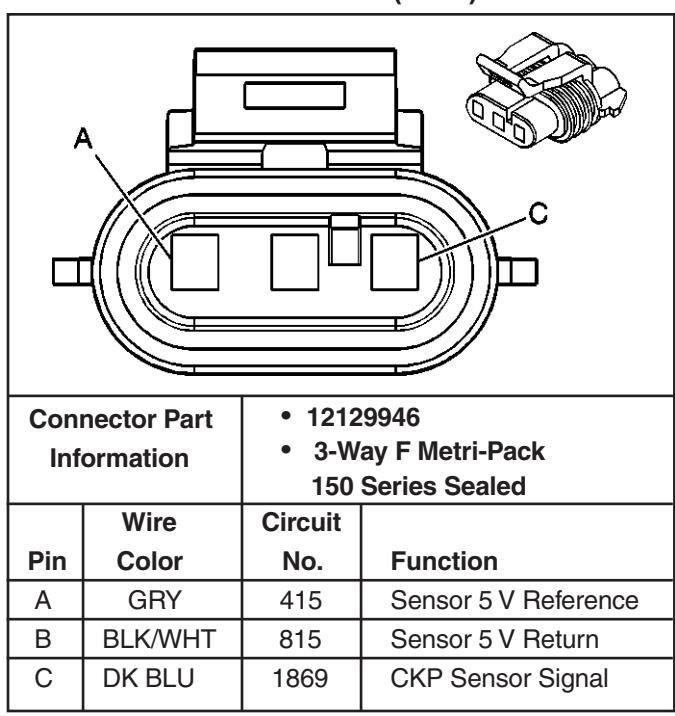

## **Ignition Coil Connector**

| Connector Part Information |         | • — • 3-Way F Metri-Pack 150 Series Sealed |                                             |  |
|-------------------------------|---------|--------------------------------------------------|---------------------------------------------|--|
|                               | Wire    | Circuit                                          | Function                                    |  |
| Pin                           | Color   | No.                                              | From ECM system Relay                       |  |
| A                             | PNK/BLK | 439B & C                                         | Low Reference                               |  |
| B                             | —       | —                                                | Unused                                      |  |
| C                             | BRN     | N/A                                              | To Ign. Control Mod. Term. D Coil Driver |  |

# **Engine Oil Pressure (EOP) Sensor**

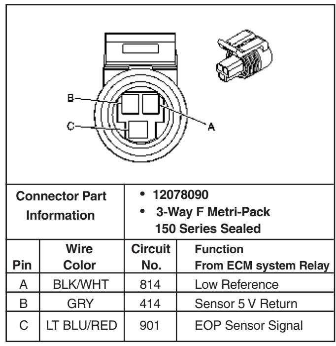

# **Camshaft Position (CMP) Sensor Crankshaft Position (CKP) Sensor**

{103}------------------------------------------------

# **Wire Circuit Function Pin Color No. From ECM Relay** A PNK/BLK 439B & C Ignition Voltage B WHT 423 Ignition Timing Signal C BLK N/A IC Module Ground **• 12162144 • 4-Way F Metri-Pack 150 Series Sealed (BLK) Connector Part Information** D A

**Ignition Coil Driver Module Connector Knock Sensor, - Odd** 

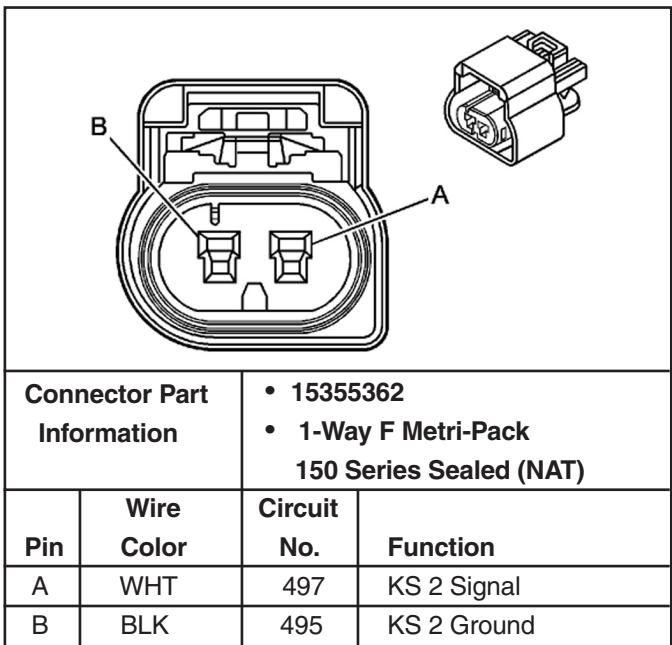

# **Manifold Absolute Pressure (MAP) Sensor**

D BRN N/A Coil Driver

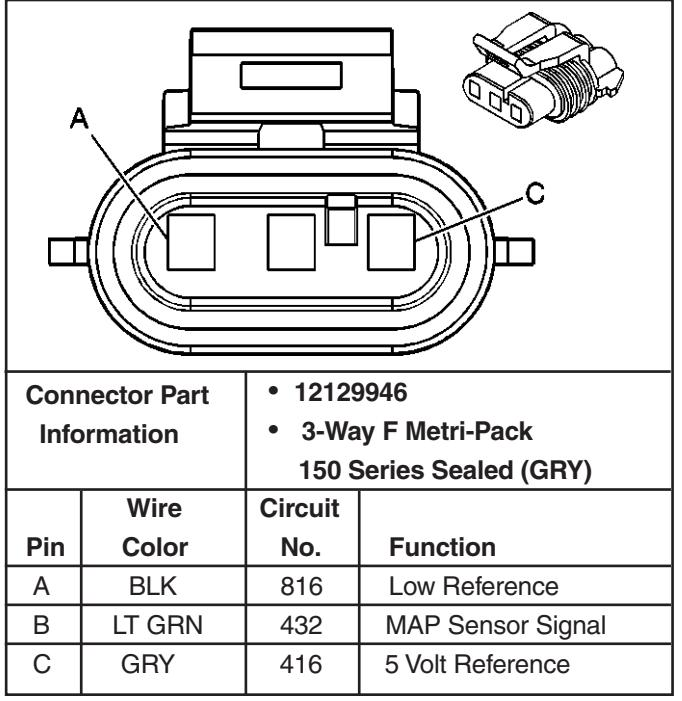

**Knock Sensor, - Even** 

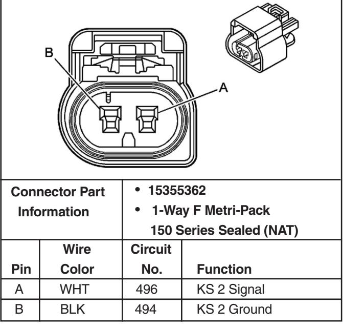

{104}------------------------------------------------

#### **Throttle-Shift Control to ECM**

| Connector Part Information |         | • 12162261 • 6 - Way F Metri-Pack 150.2 Series Pull to Seat (BLK) |                     |  |
|-------------------------------|---------|-------------------------------------------------------------------------|---------------------|--|
|                               | Wire    | Circuit                                                                 |                     |  |
| Pin                           | Color   | No.                                                                     | Function            |  |
| B                             | BLK/WHT | 694                                                                     | Low Reference-PPS 2 |  |
| C                             | GRN     | 696                                                                     | Signal-PPS 2        |  |
| D                             | GRY     | 692                                                                     | 5V Reference-PPS 2  |  |
| F                             | BLU     | 695                                                                     | Signal-PPS 1        |  |
| G                             | GRY     | 691                                                                     | 5V Reference-PPS 1  |  |
| J                             | BLK/WHT | 693                                                                     | Low Reference-PPS 1 |  |

#### **Electronic Throttle Body (TAC Motor & TPS 1 & 2** Signal

| Graphic - 1468494 |                                                                |                                                      |                       |  |
|----------------------|----------------------------------------------------------------|------------------------------------------------------|-----------------------|--|
|                      |  15355297 • 15355297 Connector Part Connector Part |                                                      |                       |  |
|                      | Information Information                                     |  6-Way F GT 150 Series • 6-Way F GT 150 Series |                       |  |
|                      |                                                                | Sealed (BK) Sealed (BLK)                          |                       |  |
|                      | Wire Wire                                                   | Circuit Circuit                                   |                       |  |
| Pin                  | Color                                                          | No.                                                  | Function              |  |
| Pin                  | Color                                                          | No.                                                  | Function              |  |
| A                    | BRN                                                            | 582                                                  | ETC Motor Close       |  |
| A                    | BN                                                             | 582                                                  | TAC Motor Control – 2 |  |
| B                    | YLW                                                            | 581                                                  | ETC Motor Open        |  |
| B                    | YE                                                             | 581                                                  | TAC Motor Control – 1 |  |
| C                    | BLK/WHT                                                        | 683                                                  | Low Reference-TPS     |  |
| C                    | TN/WH                                                          | 1704                                                 | Low Reference         |  |
| D                    | DK BLU                                                         | 687                                                  | Signal-TPS 2          |  |
| D                    | D-GN                                                           | 485                                                  | TP Sensor1 Signal    |  |
| E                    | DK GRN                                                         | 682                                                  | 5V Reference-TPS      |  |
| F                    | BLK/WHT                                                        | 684                                                  | Signal-TPS 1          |  |
| E                    | L-BU/BK                                                        | 1688                                                 | 5-Volt Reference      |  |

{105}------------------------------------------------

**This page left intentionally blank**

{106}------------------------------------------------

**Fuel Injector #1** 

| Connector Part |       | • 12129140                 |                         |  |
|----------------|-------|----------------------------|-------------------------|--|
| Information    |       | • 2-Way F Metri-Pack 280.1 |                         |  |
|                |       | P2S (BLK)                  |                         |  |
|                | Wire  | Circuit                    |                         |  |
| Pin            | Color | No.                        | Function                |  |
| A              | RED   | N/A                        | Ignition Voltage        |  |
| B              | GRN   | 471                        | Fuel Injector 1 Control |  |

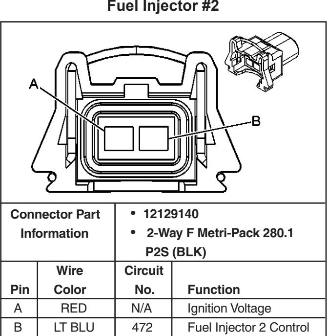

**Fuel Injector #3** 

|             | • 12129140 Connector Part |                                |                  |  |
|-------------|------------------------------|--------------------------------|------------------|--|
| Information |                              | • 2-Way F Metri-Pack 280.1     |                  |  |
| P2S (BLK)   |                              |                                |                  |  |
|             | Wire                         | Circuit                        |                  |  |
| Pin         | Color                        | No.                            | Function         |  |
| A           | RED                          | N/A                            | Ignition Voltage |  |
| B           | LT GRN/BLK                   | 473 Fuel Injector 3 Control |                  |  |

**Fuel Injector #4** 

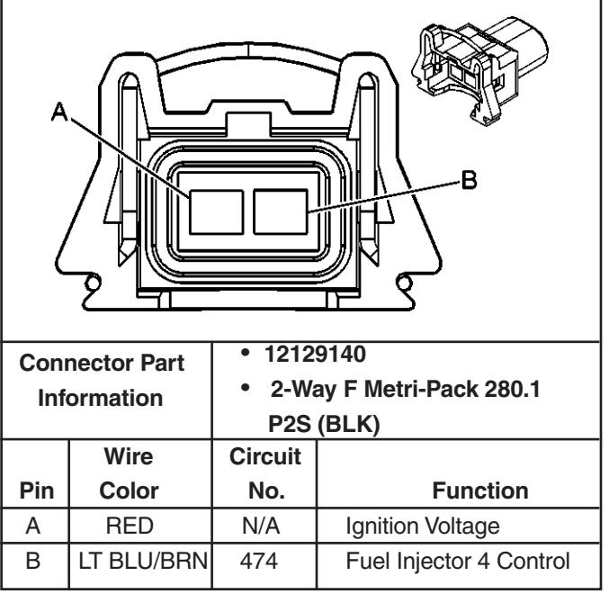

{107}------------------------------------------------

| ۰, | ٠ |
|----|---|
|    |   |
|    |   |

## **Fuel Injector #5**

|     | • 12129140 Connector Part • 2-Way F Metri-Pack 280.1 |           |                         |  |  |
|-----|------------------------------------------------------------|-----------|-------------------------|--|--|
|     | Information                                                | P2S (BLK) |                         |  |  |
|     | Wire                                                       | Circuit   |                         |  |  |
| Pin | Color                                                      | No.       | Function                |  |  |
| A   | RED                                                        | N/A       | Ignition Voltage        |  |  |
| B   | LT GRN/WHT                                                 | 475       | Fuel Injector 5 Control |  |  |

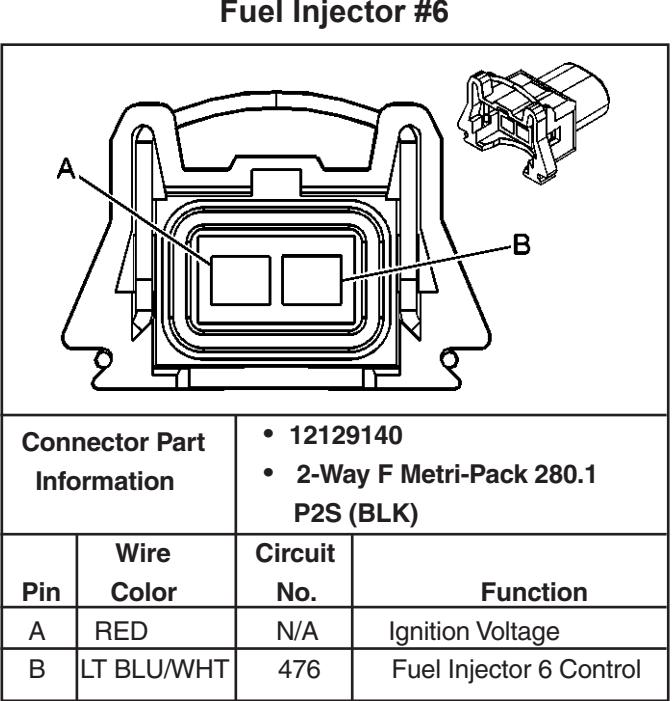

**Fuel Injector #7**

| Connector Part Information |         | • 12129140 • 2-Way F Metri-Pack 280.1 |                         |  |
|-------------------------------|---------|------------------------------------------|-------------------------|--|
|                               |         |                                          | P2S (BLK)               |  |
|                               | Wire    | Circuit                                  |                         |  |
| Pin                           | Color   | No.                                      | Function                |  |
| A                             | RED     | N/A                                      | Ignition Voltage        |  |
| B                             | GRN/RED | 477                                      | Fuel Injector 7 Control |  |

**Fuel Injector #8** 

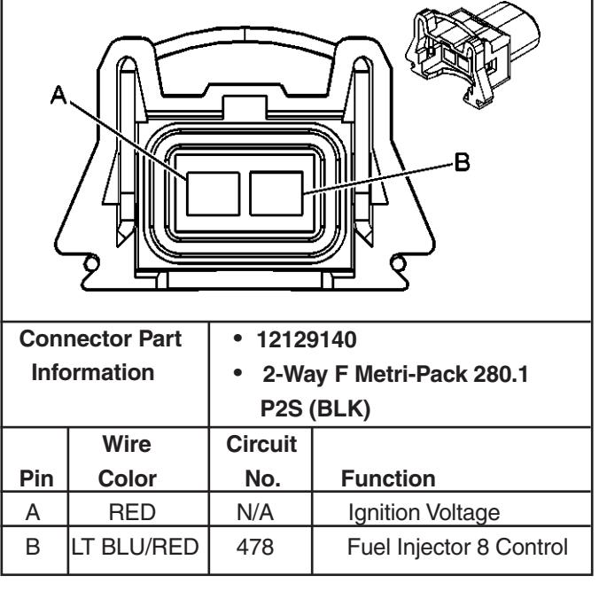

{108}------------------------------------------------

#### **Logged Warnings**

These warnings will be displayed following the Diagnostic Trouble Codes. They can be cleared the same as the trouble codes. Unlike other trouble codes, these warnings cannot distinguish the specific DTC based on flash counts through the MIL light.

| Description                             |  |  |
|-----------------------------------------|--|--|
| Overheat                                |  |  |
| Low Oil Pressure / Catalyst Temperature |  |  |
| Low System Voltage                      |  |  |
| Low Oil Level                           |  |  |
| General Warning 1 (J1-19)               |  |  |
| General Warning 2 (J1-4)                |  |  |
| Low Fuel Pressure                       |  |  |
| Stop Engine Warning                     |  |  |

#### **Clearing Diagnostic Trouble Codes - Non Scan**

- 1. Install Diagnostic Trouble Code (DTC) tool.
- 2. Ignition "ON," engine "OFF."
- 3. Switch DTC tool to "service mode" or "ON."
- 4. Move the throttle from 0% (idle) to 100% (WOT) and back to 0%.
- 5. Switch DTC tool to "normal mode" or "OFF." (If this step is not performed, the engine may not start and run).
- 6. Turn ignition "OFF" for at least 20 seconds.
- 7. Ignition "ON," engine "OFF."
- 8. Switch DTC tool to "service mode" or "ON" and verify DTC 12 only. Remove DTC tool.
- 9. If original DTC's are still present, check "Notice" below and repeat the DTC clearing procedure.
- 10. If new DTC's are displayed, perform the "On-Board Diagnostic" (OBD) system check.

#### **Clearing Diagnostic Trouble Codes - Scan**

- 1. Install scan tool.
- 2. Start engine.
- 3. Select "Clear DTC's" function.
- 4. Clear DTC's.
- 5. Turn ignition "OFF" for at least 20 seconds.
- 6. Turn ignition "ON" and read DTC's. If DTC's are still present, check "Notice" below and repeat procedure following from step 2.

**NOTICE:** In order to clear DTC's, with or without the use of a scan tool, the ignition must be cycled to the "OFF" position.

{109}------------------------------------------------

**This Page Was Intentionally Left Blank**

{110}------------------------------------------------

# **Diagnostic Information and Procedures**

# **A Diagnostic Starting Point - Engine Controls**

Begin the system diagnosis with A Diagnostic System Check-Engine Controls. The Diagnostic System Check will provide the following information:

- The ability of the control module to communicate through the serial data circuit.
- The identification of any stored Diagnostic Trouble Codes (DTCs) and Logged Warnings.

The use of the Diagnostic System Check will identify the correct procedure for diagnosing the system.

# **A Diagnostic System Check - Engine Controls**

#### **Description**

The Diagnostic System Check is an organized approach to identifying a condition that is created by a malfunction in the electronic engine control system. The Diagnostic System Check must be the starting point for any driveability concern. This procedure directs the service technician to the next logical step in order to diagnose the concern. Understanding and correctly using the diagnostic table reduces diagnostic time and prevents unnecessary replacement of parts.

#### **Test Description**

Number(s) below refer to the Step number(s) on the Diagnostic Table:

- 1. The MIL should be ON steady with the ignition ON, engine OFF. If not, the **No Malfunction Indicator Lamp Test Procedure** should be used to isolate the malfunction.
- 3. Checks the serial data circuit and ensures that the ECM is able to transmit serial data.
- 5. If the engine will not start, the **Engine Cranks But Will Not Run** diagnostic procedure should be used to diagnose the condition.
- 8. A scan tool parameter which is not within the typical range may help to isolate the area which is causing the problem.

{111}------------------------------------------------

| Step | Action                                                                                                                                                                                                                                                                                                                                                                                                                                                                                                                                                                                                                                  | Value | Yes                           | No                                                                          |
|------|-----------------------------------------------------------------------------------------------------------------------------------------------------------------------------------------------------------------------------------------------------------------------------------------------------------------------------------------------------------------------------------------------------------------------------------------------------------------------------------------------------------------------------------------------------------------------------------------------------------------------------------------|-------|-------------------------------|-----------------------------------------------------------------------------|
|      | Important:                                                                                                                                                                                                                                                                                                                                                                                                                                                                                                                                                                                                                              |       |                               |                                                                             |
| 1    | • Only perform this diagnostic if there is a driveability concern, unless another procedure directs you to this diagnostic. • Before you proceed with diagnosis, search for applicable service bulletins. • Unless a diagnostic procedure instructs you, DO NOT clear the DTC's. • If there is a condition with the starting system, repair that first. • Ensure the battery has a full charge. • Ensure the battery cables are clean and tight. • Ensure the ECM grounds are clean, tight and in the correct location. Install a scan tool. Does the scan tool turn ON? | —     | Go to Step 2                  | Go to Data Link Connector Diagnosis Refer to Previous Manual |
| 2    | Attempt to start the engine. Does the engine start and idle?                                                                                                                                                                                                                                                                                                                                                                                                                                                                                                                                                                         | —     | Go to Step 3                  | Go to Engine Cranks but Does Not Run                                  |
| 3    | Select the DTC display function on the scan tool. Does the scan tool display DTCs?                                                                                                                                                                                                                                                                                                                                                                                                                                                                                                                                                   | —     | Go to Applicable DTC Table | Go to Step 4                                                                |
| 4    | 1. Review the following symptoms. 2. Refer to the applicable symptom diagnostic table. • Hard Start • Surges/Chuggles • Lack of Power, Sluggishness or Sponginess • Detonation/Spark Knock • Hesitation, Sag or Stumble • Cuts Out, Misses • Poor Fuel Economy • Rough, Unstable or Incorrect Idle and Stalling • Dieseling, Run-On • Backfire Did you find and correct the condition?                                                                                                                                                                                | —     | Verify Repair                 | Go to Intermittent Conditions on Page ??                           |

# **On-Board Diagnostic (OBD) System Check - Scan**

{112}------------------------------------------------

# **Malfunction Indicator Lamp (MIL) Diagnosis**

#### **Circuit Description**

Use a properly functioning scan tool with the diagnostic tables in this section. DO NOT clear the DTC's unless directed by a diagnostic procedure. Clearing the DTC's may also clear valuable diagnostic information.

#### **Test Description**

Number(s) below refer to the step number(s) on the diagnostic table:

- 3. An engine that just cranks and does not attempt to start indicates that the ECM is not powered-up.
- 5. This step is checking for a B+ supply to the Data Link Connector (DLC).
- 6. A ground must be available for the scan tool to function properly.
- 9. A no start condition occurs when the fuse(s) for the battery or ignition feed circuits is open. The MIL is inoperative when the battery and ignition feed circuit fuses open. Inspect the circuits for being grounded when either of these fuses open.
- 12. The scan tool does not communicate when the serial data circuit from the ECM to the DLC is open.
- 14. If the test lamp does not illuminate for a circuit, inspect the fuse for being open. If the fuse is open, inspect the circuit for a short to ground.
- 15. Inspect for an open ground circuit.
- 16. Inspect for an open fuse that supplies the DLC. If the fuse is open, repair the grounded circuit.

{113}------------------------------------------------

#### **Malfunction Indicator Lamp (MIL) Diagnosis**

| Step | Action                                                                                                                                                                                                                                                                                                                                                  | Value    | Yes                       | No            |
|------|---------------------------------------------------------------------------------------------------------------------------------------------------------------------------------------------------------------------------------------------------------------------------------------------------------------------------------------------------------|----------|---------------------------|---------------|
| 1    | Did you perfom the On-Board Diagnostic (OBD) System                                                                                                                                                                                                                                                                                                     |          |                           | Go to OBD     |
|      | Check?                                                                                                                                                                                                                                                                                                                                                  | —        | Go to Step 2              | System Check  |
| 2    | Important: This table assumes that the scan tool you are using is functional. 1. Turn ON the ignition leaving the engine OFF. 2. Connect the scan tool to the Data Link Connector (DLC). Does the scan tool power-up?                                                                                                                    | —        | Go to Step 3              | Go to Step 5  |
| 3    | Does the engine start and continue to operate?                                                                                                                                                                                                                                                                                                          | —        | Go to Step 6              | Go to Step 4  |
| 4    | Does the engine start and stall?                                                                                                                                                                                                                                                                                                                        | —        | Go to Step 12             | Go to Step 9  |
| 5    | 1. Disconnect the scan tool from the DLC. 2. Turn ON the ignition leaving the engine OFF. 3. Probe the DLC terminal F using a test lamp J 34142-B connected to the battery ground. Is the test lamp illuminated?                                                                                                                            | —        | Go to Step 6              | Go to Step 16 |
| 6    | Probe the DLC terminal A using a test lamp J 34142-B connected to B+. Is the test lamp illuminated?                                                                                                                                                                                                                                               | —        | Go to Step 7              | Go to Step 8  |
| 7    | Inspect the scan tool connections at the DLC. Also inspect the terminals for proper terminal tension at the DLC. Did you find and repair the condition?                                                                                                                                                                                           | —        | Go to OBD System Check | Go to Step 12 |
| 8    | Repair the open ground circuit to the DLC terminal A. Is the action complete?                                                                                                                                                                                                                                                                        | —        | Go to OBD System Check | —             |
| 9    | 1. Turn OFF the ignition. 2. Disconnect the ECM connector J2. 3. Turn ON the ignition leaving the engine OFF. 4. Probe the ECM battery and the ECM ignition feed circuits (J2-1 and J2-19) in the ECM harness connector using a test lamp J 34142-B connected to a battery ground. Does the test lamp illuminate for each circuit? | —        | Go to Step 10             | Go to Step 14 |
| 10   | 1. Turn OFF the ignition. 2. Disconnect the ECM connector J1. 3. Measure the resistance between the battery ground and the ECM ground circuits (J1-13, J1-28 and J1-29) in the ECM harness connectors using a DMM J 39200. Does the DMM display between the specified range on each circuit?                                          | 0-2 ohms | Go to Step 11             | Go to Step 15 |
| 11   | Inspect the ECM for proper connections. Did you find and correct the condition?                                                                                                                                                                                                                                                                      | —        | Go to OBD System Check | Go to Step 13 |
| 12   | Inspect the serial data circuit for being open, shorted or a poor connection at the ECM. Did you find and repair the condition?                                                                                                                                                                                                                   | —        | Go to OBD System Check | Go to Step 13 |

{114}------------------------------------------------

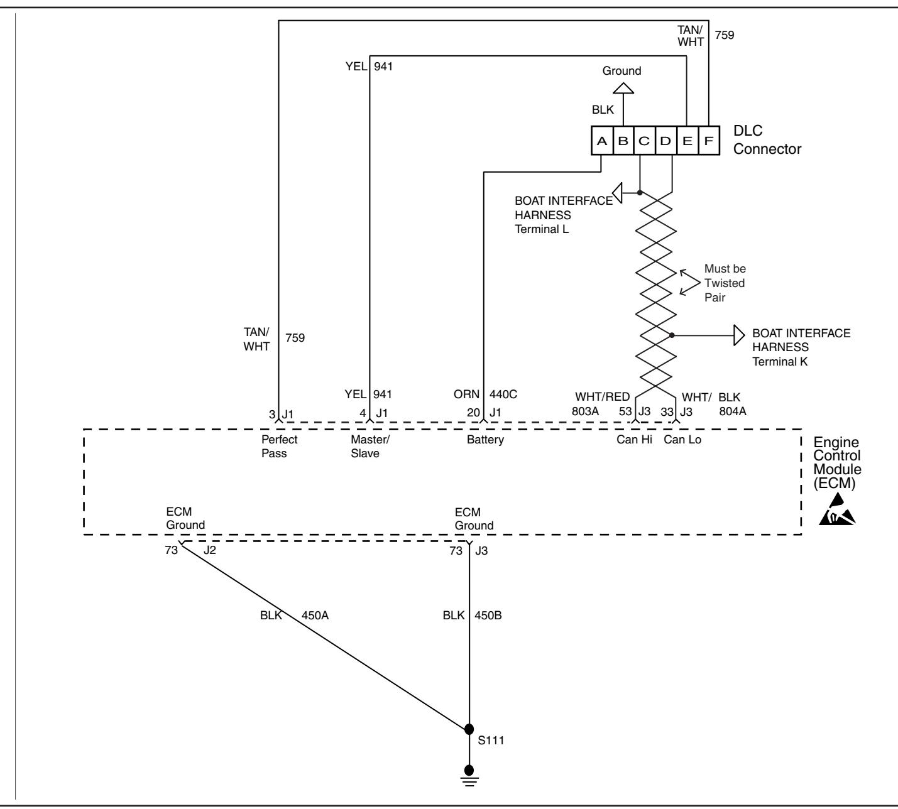

#### **Circuit Description**

Use a properly functioning scan tool with the diagnostic tables in this section. DO NOT clear the DTC's unless directed by a diagnostic procedure. Clearing the DTC's may also clear valuable diagnostic information.

#### **Test Description**

Number(s) below refer to the step number(s) on the diagnostic table:

- 3. An engine that just cranks and does not attempt to start indicates that the ECM is not powered-up.
- 5. This step is checking for a B+ supply to the Data Link Connector (DLC).
- 6. A ground must be available for the scan tool to function properly.
- 9. A no start condition occurs when the fuse(s) for the battery or ignition feed circuits is open. The MIL is inoperative when the battery and ignition feed circuit fuses open. Inspect the circuits for being grounded when either of these fuses open.
- 12. The scan tool does not communicate when the serial data circuit from the ECM to the DLC is open.
- 14. If the test lamp does not illuminate for a circuit, inspect the fuse for being open. If the fuse is open, inspect the circuit for a short to ground.
- 15. Inspect for an open ground circuit.
- 16. Inspect for an open fuse that supplies the DLC. If the fuse is open, repair the grounded circuit.

{115}------------------------------------------------

### **Step Action Value Yes No 1** Did you perfom the On-Board Diagnostic (OBD) System Go to OBD Check? — Go to Step 2 System Check **Important:** This table assumes that the scan tool you are using is functional. **2** 1. Turn ON the ignition leaving the engine OFF. 2. Connect the scan tool to the Data Link Connector (DLC). Does the scan tool power-up? — Go to Step 3 Go to Step 5 **3** Does the engine start and continue to operate? — Go to Step 6 Go to Step 4 **4** Does the engine start and stall? — Go to Step 12 Go to Step 9 1. Disconnect the scan tool from the DLC. 2. Turn ON the ignition leaving the engine OFF. **5** 3. Probe the DLC terminal B using a test lamp J 34142-B connected to the battery ground. Is the test lamp illuminated? — Go to Step 6 Go to Step 16 Probe the DLC terminal B using a test lamp J 34142-B **6** connected to B+. Is the test lamp illuminated? — Go to Step 7 Go to Step 8 Inspect the scan tool connections at the DLC. Also inspect **7** the terminals for proper terminal tension at the DLC. Go to OBD Did you find and repair the condition? — System Check Go to Step 12 **8** Repair the open ground circuit to the DLC terminal B. Go to OBD Is the action complete? — System Check — 1. Turn OFF the ignition. 2. Disconnect the ECM connector J2. 3. Turn ON the ignition leaving the engine OFF. **9** 4. Probe the ECM battery and the ECM ignition feed circuits (J1-20 and J1-19) in the ECM harness connector using a test lamp J 34142-B connected to a battery ground. Does the test lamp illuminate for each circuit? — Go to Step 10 Go to Step 14 1. Turn OFF the ignition. 2. Disconnect the ECM connectors J2 and J3. 3. Measure the resistance between the battery ground **10** and the ECM ground circuits (J2-73 and J3-73) in the ECM harness connectors using a DMM J 39200. Does the DMM display between the specified range on each circuit? 0-2 ohms Go to Step 11 Go to Step 15 **11** Inspect the ECM for proper connections. Go to OBD Did you find and correct the condition? — System Check Go to Step 13 Inspect the serial data circuit for being open, shorted or a **12** poor connection at the ECM. Go to OBD Did you find and repair the condition? — System Check Go to Step 13

#### **Data Link Connector Diagnosis**

{116}------------------------------------------------

| Step | Action                                                                           | Value | Yes                       | No |
|------|----------------------------------------------------------------------------------|-------|---------------------------|----|
| 13   | Replace the ECM. Is action complete?                                          | —     | Go to OBD System Check | —  |
| 14   | Repair the circuit that did not illuminate the test lamp. Is action complete? | —     | Go to OBD System Check | —  |
| 15   | Repair the faulty ECM ground circuit(s). Is action complete?                  | —     | Go to OBD System Check | —  |
| 16   | Repair the faulty B+ supply circuit. Is action complete?                      | —     | Go to OBD System Check | —  |

#### **Data Link Connector Diagnosis (cont'd)**

{117}------------------------------------------------

**This Page Was Intentionally Left Blank**

{118}------------------------------------------------

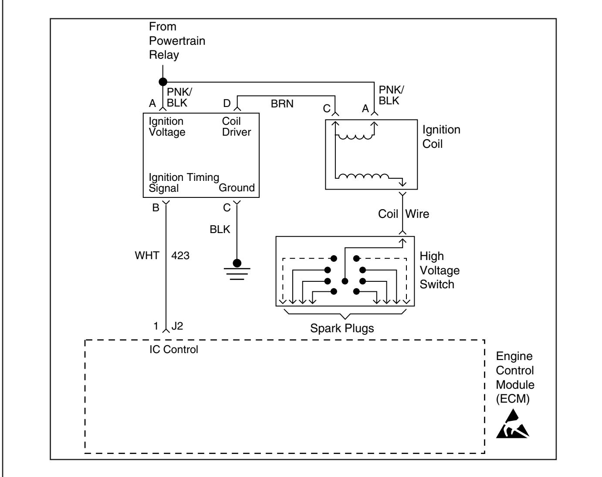

**Engine Cranks But Does Not Run**

## **Circuit Description**

The Engine Cranks but Does Not Run diagnostic table assumes that battery condition and engine cranking speed are OK. If the battery condition and the cranking speed are not OK, refer to those conditions first. Make sure that there is adequate fuel in the fuel tank(s).

#### **Test Description**

Number(s) below refer to the step number(s) on the diagnostic table:

- 4. It may be necessary to connect a battery charger to the battery for this step. If the battery state of charge is low, the scan tool may reset during the cranking test.
- 5. This step tests the system relay for proper operation. The system relay supplies voltage to the injectors and the ignition coils. When the system relay is not operating properly, a no start condition occurs. If the test lamp does not illuminate, this indicates the system relay is not supplying a voltage to the fuses.
- 6. The Crankshaft Position sensor is located on the front of the engine, behind the harmonic balancer, mounted on the timing cover.
- 7. The Camshaft Position sensor is located in the High Voltage Switch (HVS) distributor assembly.
- 8. The ignition feed circuit for the Camshaft and Crankshaft Position sensors is internally connected within the ECM. A short to ground on either circuit will cause a no start condition.
- 10. You may need to get close to the fuel pump in order to hear if the fuel pump is operating.
- 12. At this point, the engine should start. Refer to Hard Start Symptom for further diagnosis.

{119}------------------------------------------------

| Step | Action                                                                                                                                                                                                                                                                                                                                                                                                        | Value                      | Yes           | No                                                                                    |
|------|---------------------------------------------------------------------------------------------------------------------------------------------------------------------------------------------------------------------------------------------------------------------------------------------------------------------------------------------------------------------------------------------------------------|----------------------------|---------------|---------------------------------------------------------------------------------------|
| 1    | Did you perfom the On-Board Diagnostic (OBD) System                                                                                                                                                                                                                                                                                                                                                           |                            |               | Go to OBD                                                                             |
|      | Check?                                                                                                                                                                                                                                                                                                                                                                                                        | —                          | Go to Step 2  | System Check                                                                          |
| 2    | Important: Refer to the applicable DTC table if any of the following DTC's are set: SPN 65541 FMI 5 or 81. Monitor the engine speed while cranking the engine. Is engine RPM indicated on the scan tool?                                                                                                                                                                                             | —                          | Go to Step 3  | Go to Step 4                                                                          |
| 3    | 1. Turn ON the ignition leaving the engine OFF. 2. Probe both sides of the fuses listed below using a test test lamp J 34142-B connected to ground. • Powertrain or MEFI System Fuse (C & D) Does the test lamp illuminate on both sides of the fuses?                                                                                                                                         | —                          | Go to Step 7  | Go to System Relay Diagnosis                                                       |
| 4    | 1. Disconnect the Crankshaft Position (CKP) sensor electrical connector. 2. Measure the voltage at the ignition feed circuit at the CKP electrical connector using a DMM J 39200. Does the DMM display near the specified voltage?                                                                                                                                                                | B+                         | Go to Step 11 | Go to Step 5                                                                          |
| 5    | 1. Disconnect the Camshaft Position (CMP) sensor electrical connector. 2. Measure the voltage at the ignition feed circuit at the CMP electrical connector using a DMM J 39200. Does the DMM display near the specified voltage?                                                                                                                                                                  | B+                         | Go to Step 12 | Go to Step 6                                                                          |
| 6    | Inspect the Camshaft and Crankshaft Position sensor ignition feed circuits for a short to ground. Did you find and correct the condition?                                                                                                                                                                                                                                                               | —                          | Go to Step 14 | Go to Step 13                                                                         |
| 7    | Monitor the engine coolant temperature using the scan tool. Is the engine coolant temperature on the scan tool close to the actual engine temperature?                                                                                                                                                                                                                                               |                            |               | Go to SPN 110, FMI 3 Engine Coolant Temperature (ECT) Sensor Circuit High |
|      |                                                                                                                                                                                                                                                                                                                                                                                                               | —                          | Go to Step 8  | Voltage                                                                               |
| 8    | Enable the fuel pump using the scan tool. Does the fuel pump operate?                                                                                                                                                                                                                                                                                                                                      | —                          | Go to Step 9  | Go to Fuel Pump Relay Diagnosis                                                    |
| 9    | 1. Turn OFF the ignition. 2. Install a fuel pressure gauge. Important: The fuel pump operates for about 2 seconds when the ignition is turned ON. The fuel pressure must be observed when the fuel pump is operating. 3. Turn ON the ignition leaving the engine OFF. 4. Observe the fuel pressure while the fuel pump is operating. Is the fuel pressure within the specified range? | 379-427 kPa (55-62 psi) | Go to Step 10 | Go to Fuel System Diagnosis                                                     |

{120}------------------------------------------------

| Engine Cranks but Does Not Run (cont'd) |  |  |  |
|-----------------------------------------|--|--|--|
|-----------------------------------------|--|--|--|

| Step | Action                                                                                                                                                                                                                                                                                                                                                                                                                                                                                                                                                                                                                                                                                                                         | Value | Yes                                  | No               |
|------|--------------------------------------------------------------------------------------------------------------------------------------------------------------------------------------------------------------------------------------------------------------------------------------------------------------------------------------------------------------------------------------------------------------------------------------------------------------------------------------------------------------------------------------------------------------------------------------------------------------------------------------------------------------------------------------------------------------------------------|-------|--------------------------------------|------------------|
| 10   | Perform the following additional inspections: • Inspect that the throttle angle is at 0% at a closed throttle. If the throttle angle is not at 0%, refer to SPN 65601, FMI 2 Throttle Position Sensor (TPS) 2 Range SPN 65602, FMI 2 Throttle Position Sensor (TPS) 1 Range SPN 65610, FMI 2 TPS 1- 2 Correlation. • Inspect the spark plugs for being gas fouled. If the spark plugs are gas fouled, determine what caused the rich condition. • Inspect for an engine mechanical failure that causes an engine not to start (i.e. timing chain, low compression). Refer to Engine Compression Test in Engine Mechanical. • Compare MAP/BARO parameters to another vessel. |       |                                      | Go to Hard Start |
|      | The parameter values should be close to each other.                                                                                                                                                                                                                                                                                                                                                                                                                                                                                                                                                                                                                                                                            | —     | Go to Step 14                        | for diagnosis    |
| 11   | Replace the CKP sensor. Refer to Crankshaft Position Sensor Replacement. Is the action complete?                                                                                                                                                                                                                                                                                                                                                                                                                                                                                                                                                                                                                         | —     | Go to Step 14                        | —                |
| 12   | Replace the CMP sensor. Refer to Camshaft Position Sensor Replacement. Is the action complete?                                                                                                                                                                                                                                                                                                                                                                                                                                                                                                                                                                                                                           | —     | Go to Step 14                        | —                |
| 13   | Replace the ECM. Is the action complete?                                                                                                                                                                                                                                                                                                                                                                                                                                                                                                                                                                                                                                                                                    | —     | Go to Step 14                        | —                |
| 14   | 1. Select the Diagnostic Trouble Codes (DTC) option and the Clear DTC option using the scan tool. 2. Attempt to start the engine. Does the engine start and continue to run?                                                                                                                                                                                                                                                                                                                                                                                                                                                                                                                                          | —     | Go to Step 15                        | Go to Step 2     |
| 15   | 1. Idle the engine at the normal operating temperature. 2. Select the Diagnostic Trouble Codes (DTC) option using the scan tool. Are any DTCs displayed?                                                                                                                                                                                                                                                                                                                                                                                                                                                                                                                                                              | —     | Go to the applicable DTC table | System OK        |

{121}------------------------------------------------

**This Page Was Intentionally Left Blank**

{122}------------------------------------------------

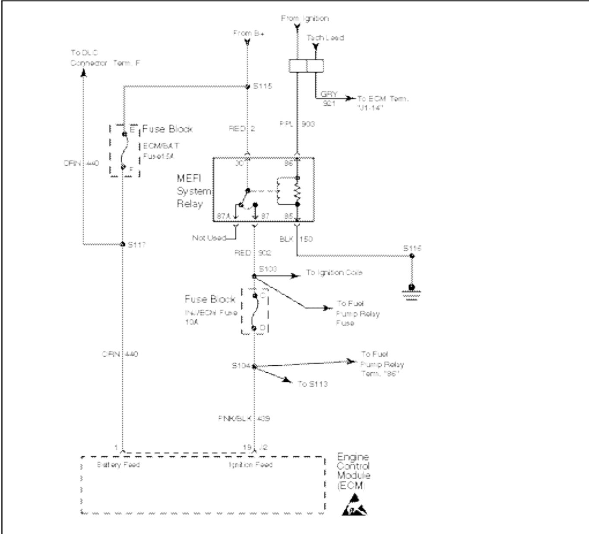

# **System Relay Diagnosis**

#### **Circuit Description**

The system relay powers the following components:

- Injectors
- Ignition Coils

#### **Diagnostic Aids**

The following may cause an intermittent:

- Poor connections. Check for adequate terminal tension.
- Corrosion
- Mis-routed harness
- Rubbed through wire insulation
- Broken wire inside the insulation

## **Test Description**

Number(s) below refer to the step number(s) on the diagnostic table:

- 2. Refer to Thumbnail Schematic for proper relay terminal identification.
- 4. This step is testing the relay ground circuit.
- 5. This step isolates the circuit from the system relay. All of the circuits are good if the test lamp illuminates.
- 9. The open circuit will be between the splice and the system relay.

{123}------------------------------------------------

## **System Relay Diagnosis**

| Step | Action                                                                                                                                                                                                                                                                                                                                 | Value    | Yes          | No                        |
|------|----------------------------------------------------------------------------------------------------------------------------------------------------------------------------------------------------------------------------------------------------------------------------------------------------------------------------------------|----------|--------------|---------------------------|
| 1    | Did you perfom the On-Board Diagnostic (OBD) System Check?                                                                                                                                                                                                                                                                          | —        | Go to Step 2 | Go to OBD System Check |
| 2    | 1. Turn OFF the ignition. 2. Disconnect the system relay electrical connector. 3. Probe the system relay B+ feed circuit (switch side of the relay) using a test lamp J 34142-B connected to a ground. Does the test lamp illuminate?                                                                                   | —        | Go to Step 3 | Go to Step 8              |
| 3    | 1. Turn ON the ignition leaving the engine OFF. 2. Probe the system relay ignition feed circuit using a test lamp J 34142-B connected to a ground. Does the test lamp illuminate?                                                                                                                                             | —        | Go to Step 4 | Go to Step 9              |
| 4    | 1. Turn OFF the ignition. 2. Meausure the resistance of the system relay ground circuit using a DMM J 39200 connected to the battery ground. Is the resistance less than the specified value?                                                                                                                              | 0-5 ohms | Go to Step 5 | Go to Step 10             |
| 5    | 1. Turn OFF the ignition. 2. Jumper the system relay B+ feed circuit and the system relay load circuit together using a fused jumper wire. 3. Probe the fuses for the following components with a test lamp J 34142-B connected to a ground. • Injectors • Ignition coils Does the test lamp illuminate? | —        | Go to Step 6 | Go to Step 11             |
| 6    | Inspect for poor terminal contact at the system relay connector. Did you find and correct the condition?                                                                                                                                                                                                                         | —        | System OK    | Go to Step 7              |
| 7    | Replace the system relay. Is the action complete?                                                                                                                                                                                                                                                                                   | —        | System OK    | —                         |
| 8    | Repair the open B+ supply to the system relay. Is the action complete?                                                                                                                                                                                                                                                              | —        | System OK    | —                         |
| 9    | Repair the ignition feed circuit to the system relay. Is the action complete?                                                                                                                                                                                                                                                       | —        | System OK    | —                         |
| 10   | Repair the system relay ground circuit. Is the action complete?                                                                                                                                                                                                                                                                     | —        | System OK    | —                         |
| 11   | Repair the system relay load circuit. Is the action complete?                                                                                                                                                                                                                                                                       | —        | System OK    | —                         |

{124}------------------------------------------------

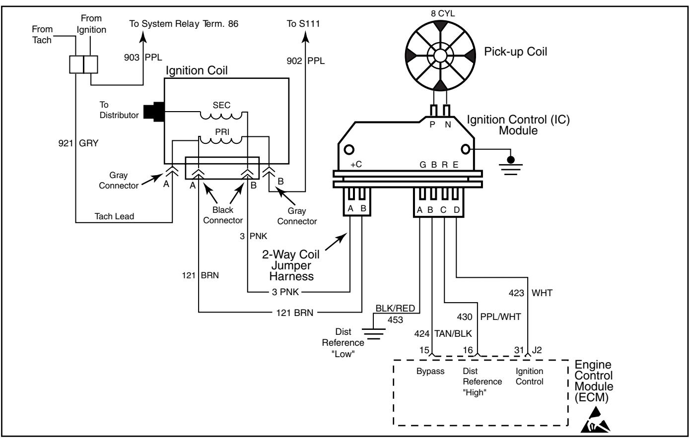

 **Distributor Ignition (DI) System Check**

#### **Circuit Description**

The Distributor Ignition (DI) system receives supply voltage from the system relay through CKT 902 to the ignition coil gray connector "B." Inside the ignition coil, the gray connector terminal "B" is connected to the black connector terminal "B." Supply voltage is delivered from the ignition coil black connector terminal "B" to the distributor Ignition Control (IC) module "+" terminal through CKT 3.

Inside the distributor, the pick-up coil and pole piece will produce a voltage signal for cylinder spark. The voltage signals are processed in the IC module and sent to the ECM. The ECM will decide if the engine is in the cranking or running mode and adjust timing accordingly. The voltages or signals are sent between the ECM and the IC module through CKT's 423, 430 and 424. CKT 453 is the ground circuit.

The IC module will send the voltage signal to the ignition coil black connector terminal "A" through CKT 121. The signal will trigger the coil creating secondary spark to be produced. This secondary spark is sent to the distributor by a high tension lead.

#### **Diagnostic Aids**

An intermittent may be caused by a poor connection, rubbed through wire insulation or a wire broken inside the insulation. Check for the following items:

- Poor connection or damaged harness. Inspect the ECM harness and connectors for improper mating, broken locks, improperly formed or damaged terminals, poor terminal to wire connection and damaged harness.
- The "tach" needs to be disconnected while testing the ignition system. You will also need a place to check coil trigger voltage. By disconnecting the "2-wire boat harness" (gray and purple wires), this will give you a test terminal to check coil trigger voltage as needed in several steps. After "tach" is disconnected, try starting the engine. If the engine starts, check for a short to ground in the boat "tach" circuit.

#### **Test Description**

Number(s) below refer to the Step number(s) on the

{125}------------------------------------------------

Diagnostic Table:

- 2. Two wires are checked to ensure that an open is not present in a spark plug wire.
- 4. A spark indicates the problem must be in the distributor cap, rotor or coil output wire.
- 6. Normally, there should be battery voltage at the "C" and "+" terminals. Low voltage would indicate an open or a high resistance circuit from the distributor to the coil or ignition switch. If "C" terminal voltage was low, but "+" terminal voltage is 10 volts or more, circuit from "C" terminal to ignition coil is open or primary winding of the ignition coil is open.
- 8. Checks for a shorted module or grounded circuit from the ignition coil to the module. The distributor module should be turned "OFF," so normal voltage should be about 12 volts. If the module is turned "ON," the voltage would be low, but above 1 volt. This could cause the ignition coil to fail from excessive heat. With an open ignition coil primary winding, a small amount of voltage will leak through the

module from the "batt" to the "tach" terminal.

- 11. Applying a voltage (1.35-1.50 volts) to the module terminal "P" should turn the module "ON" and the tach voltage should drop to about 7-9 volts. This test will determine whether the module or coil is faulty or if the pick-up coil is not generating the proper signal to turn the module "ON." This test can be performed by using a DC test battery with a rating of 1.5 volts (Such as AA, C, or D cell). The battery must be a known good battery with a voltage of over 1.35 volts.
- 12. This should turn the module "OFF" and cause a spark. If no spark occurs, the fault is most likely in the ignition coil because most module problems would have been found before this point in the procedure.

| Step | Action                                                                                                                                                                                                                                                                                                                                                                                                                                                                                                                                                                                                                                                            | Value | Yes                             | No                        |
|------|-------------------------------------------------------------------------------------------------------------------------------------------------------------------------------------------------------------------------------------------------------------------------------------------------------------------------------------------------------------------------------------------------------------------------------------------------------------------------------------------------------------------------------------------------------------------------------------------------------------------------------------------------------------------|-------|---------------------------------|---------------------------|
| 1    | Was the "On-Board Diagnostics" (OBD) System Check performed?                                                                                                                                                                                                                                                                                                                                                                                                                                                                                                                                                                                                   | —     | Go to Step 2                    | Go to OBD System Check |
| 2    | 1. Check spark plug wires for open circuits, cracks in insulation, or improper seating of terminals at spark plugs, distributor cap, and coil tower before proceeding with this table. 2. Disconnect 2-wire boat harness (gray and purple wires). 3. Install a temporary jumper wire between the 2 purple wires at the connector of the boat harness. This is CKT 903 for the ignition circuit. 4. Check for secondary spark per manufactures recommendation. If there is "no spark" at one wire, check a few more wires. A few sparks and then nothing is considered "no spark." Is adequate spark present at all cylinders? | —     | Refer to Symptoms Section | Go to Step 3              |
| 3    | Remove distributor cap and verify rotation of distributor rotor. Is the distributor rotor turning?                                                                                                                                                                                                                                                                                                                                                                                                                                                                                                                                                          | —     | Go to Step 4                    | Go to Step 25             |
| 4    | 1. Disconnect distributor 4-wire connector. 2. Check for secondary spark per manufactures recommendation. Is adequate spark present?                                                                                                                                                                                                                                                                                                                                                                                                                                                                                                                     | —     | Go to Step 18                   | Go to Step 5              |

{126}------------------------------------------------

| Step | Action                                                                                                                                                                                                                                                                                                                                                                                                                                                                                                                                                                                              | Value      | Yes           | No            |
|------|-----------------------------------------------------------------------------------------------------------------------------------------------------------------------------------------------------------------------------------------------------------------------------------------------------------------------------------------------------------------------------------------------------------------------------------------------------------------------------------------------------------------------------------------------------------------------------------------------------|------------|---------------|---------------|
| 5    | 1. Reconnect distributor 4-wire connector. 2. Check for secondary spark per manufactures recommendation from the coil tower using a known good coil wire.                                                                                                                                                                                                                                                                                                                                                                                                                                  |            |               |               |
|      | Is adequate spark present?                                                                                                                                                                                                                                                                                                                                                                                                                                                                                                                                                                          | —          | Go to Step 19 | Go to Step 6  |
| 6    | 1. Disconnect distributor 2-wire "C/+" connector harness. 2. Ignition "ON," engine "OFF." 3. Using DVOM J 39978 or equivalent, check voltage at "+" and "C" terminals of the 2-wire distributor harness connector. Is voltage reading greater than the specified value at both terminals?                                                                                                                                                                                                                                                                                         | 0 volts    | Go to Step 8  | Go to Step 7  |
| 7    | Is voltage reading less than the specified value at both terminals?                                                                                                                                                                                                                                                                                                                                                                                                                                                                                                                              | 10 volts   | Go to Step 20 | Go to Step 21 |
| 8    | 1. Reconnect distributor 2-wire connector. 2. Ignition "ON," engine "OFF." 3. Using DVOM J 39978 or equivalent, check voltage from tach terminal to ground. 4. The tach terminal can be accessed at the 2-wire boat connector. The tach circuit is the gray wire CKT 921. Is voltage reading within the specified value?                                                                                                                                                                                                                                                          | 1-10 volts | Go to Step 15 | Go to Step 9  |
| 9    | Is voltage reading greater than the specified value?                                                                                                                                                                                                                                                                                                                                                                                                                                                                                                                                                | 10 volts   | Go to Step 10 | Go to Step 22 |
| 10   | 1. Using a test light connected to ground, probe tach terminal at the 2-wire boat harness. 2. Observe the test light while cranking engine. Is test light blinking?                                                                                                                                                                                                                                                                                                                                                                                                                        | —          | Go to Step 13 | Go to Step 11 |
| 11   | 1. Disconnect distributor 4-wire connector. 2. Remove distributor cap. 3. Disconnect pick-up coil connector from the distributor ignition control module. 4. Connect DVOM to tach terminal at the 2-wire boat harness and ground. 5. Ignition "ON," engine "OFF." 6. Connect positive (+) end of a known good 1.5 volt test battery to the "P" terminal on the distributor ignition control module. Observe the voltage at the tach terminal as the negative (-) end of the test battery is momentarily grounded to a known good ground. Does the voltage drop? | —          | Go to Step 12 | Go to Step 23 |
| 12   | Check for spark from the coil wire as the test battery lead is removed? Is adequate spark present? Replace ignition coil and recheck for spark as set up in                                                                                                                                                                                                                                                                                                                                                                                                                                | —          | Go to Step 17 | Go to Step 13 |

{127}------------------------------------------------

# **13** steps 11 and 12. Go to OBD Is adequate spark present? — System Check Go to Step 14 Ignition coil removed is OK. Reinstall coil and check coil **14** wire from distributor cap. If OK, replace ignition module. Go to OBD Is action complete? — System Check — Replace ignition module and recheck for spark as set up in **15** steps 11 and 12. Go to OBD Is adequate spark present? — System Check Go to Step 16 **16** Replace ignition coil, it too is faulty. Go to OBD Is action complete? — System Check — **17** Is the rotating pole piece still magnetized? — Go to Step 18 Go to Step 24 **18** Replace faulty pick-up coil. Go to OBD Is action complete? — System Check — Inspect distributor cap for water, cracks, etc. If OK, replace **19** faulty distributor rotor. Go to OBD Is action complete? — System Check — Check for open or short to ground in CKT 3, the pink wire from the ignition module "+" terminal to the ignition coil. **20** Also check for open CKT 902, the red wire from the MEFI relay to the ignition coil. Go to OBD Is action complete? — System Check — Check for open or short to ground in CKT 121, the brown **21** wire from the ignition module "C" terminal to the ignition coil. If OK, replace faulty ignition coil. Go to OBD Is action complete? — System Check — **22** Repair faulty connections or open tach lead. Repeat step 8. — — — Check ignition module ground. If OK, replace faulty **23** ignition module. Go to OBD Is action complete? — System Check — **24** Replace distributor pole piece and shaft assembly. Go to OBD Is action complete? — System Check — **25** A mechanical repair will be necessary before continuing with this test. — — —  **Step Action Value Yes No**

{128}------------------------------------------------

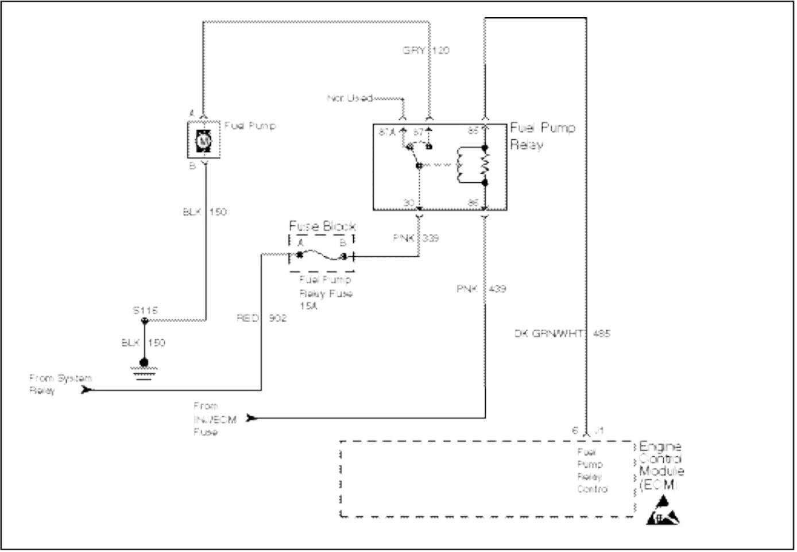

# **Fuel Pump Relay Circuit Diagnosis**

#### **Circuit Description**

When the ignition switch is ON, the ECM activates the electric fuel pump. The fuel pump remains ON as long as the ECM receives reference pulses from the ignition system. If there are no reference pulses, the ECM turns the fuel pump OFF after about 2 seconds. The pump delivers fuel to the fuel rail and injectors, then to the pressure regulator, where the system pressure remains at 379-427 kPa (55-62 psi) while the fuel pump is running. Excess fuel returns to the fuel tank. When the engine is stopped, a scan tool in the output controls function can turn ON the fuel pump.

Improper fuel system pressure results in one or many of the following symptoms:

- Cranks but will not run
- Cuts out, may feel like an ignition problem
- Poor fuel economy
- Loss of power
- Hesitation
- DTCs

## **Diagnostic Aids**

The following conditions may have caused the fuel pump fuse to open:

- The fuse is faulty
- There is an intermittent short in the fuel pump power feed circuit.
- The fuel pump has an intermittent internal problem.

For an intermittent condition, refer to Symptoms.

#### **Test Description**

Number(s) below refer to the step number(s) on the diagnostic table:

- 3. Refer to Thumbnail Schematic for proper terminal identification.
- 5. The test lamp only illuminates for two seconds even through the scan tool commanded position is ON. You will have to command the fuel pump OFF then ON to re-enable the ECM fuel pump control.
- 12. Inspect the fuel pump fuse for an open. If the fuse is open, inspect the circuit for a short to ground.
- 20. Inspect the fuel pump fuse for an open. If the fuse is open, inspect the circuit for a short to ground.

{129}------------------------------------------------

| Step | Action                                                                                                                                                                                                                                                                                                   | Value | Yes           | No                        |
|------|----------------------------------------------------------------------------------------------------------------------------------------------------------------------------------------------------------------------------------------------------------------------------------------------------------|-------|---------------|---------------------------|
| 1    | Did you perfom the On-Board Diagnostic (OBD) System Check?                                                                                                                                                                                                                                            | —     | Go to Step 2  | Go to OBD System Check |
| 2    | Check the fuel pump fuse. Is the fuse open?                                                                                                                                                                                                                                                           | —     | Go to Step 9  | Go to Step 3              |
| 3    | 1. Install a scan tool. 2. Disconnect the fuel pump relay harness connector. 3. Turn ON the ignition leaving the engine OFF. 4. Probe the fuel pump relay battery feed circuit at the harness connector with a test lamp J 34142-B connected to ground. Does the test lamp illuminate? | —     | Go to Step 4  | Go to Step 12             |
| 4    | Probe the fuel pump relay ground circuit at the harness connector with a test lamp J 34142-B connected to B+. Refer to the thumbnail wiring schematic for the proper terminal identification. Does the test lamp illuminate?                                                                 | —     | Go to Step 5  | Go to Step 13             |
| 5    | 1. Probe the fuel pump control circuit at the harness connector with a test lamp J 34142-B connected to ground. Refer to the thumbnail wiring schematic for the proper terminal identification. 2. Enable the fuel pump using the scan tool. Does the test lamp illuminate?               | —     | Go to Step 6  | Go to Step 11             |
| 6    | Important: Ignition must be ON before performing this step. Jumper the fuel pump relay battery feed circuit to the fuel pump load circuit at the harness connector using a fused jumper wire. Does the fuel pump operate?                                                                 | —     | Go to Step 18 | Go to Step 7              |
| 7    | 1. Leave the fused jumper wire connected. 2. Disconnect the fuel pump harness connector at the fuel pump. 3. Probe the power feed circuit in the fuel pump harness connector with a test lamp J 34142-B connected to ground. Does the test lamp illuminate?                            | —     | Go to Step 8  | Go to Step 14             |
| 8    | 1. Leave the fused jumper wire connected. 2. Connect the test lamp J 34142-B between the battery feed circuit and the ground circuit in the fuel pump harness connector. Does the test lamp illuminate?                                                                                      | —     | Go to Step 25 | Go to Step 15             |

#### **Fuel Pump Relay Circuit Diagnosis**

{130}------------------------------------------------

#### **Fuel Pump Relay Circuit Diagnosis (cont'd)**

| Step | Action                                                                                                                                                                                                                                                                                  | Value  | Yes           | No            |
|------|-----------------------------------------------------------------------------------------------------------------------------------------------------------------------------------------------------------------------------------------------------------------------------------------|--------|---------------|---------------|
| 9    | 1. Turn OFF the ignition. 2. Remove the fuel pump fuse. 3. Disconnect the fuel pump harness connector at the fuel pump. 4. Probe the load circuit for the fuel pump relay at the harness connector with a test lamp J 34142-B connected to B+.                        |        |               |               |
|      | Does the test lamp illuminate?                                                                                                                                                                                                                                                          | —      | Go to Step 16 | Go to Step 10 |
| 10   | Probe the battery feed circuit for the fuel pump relay at the harness connector with a test lamp J 34142-B connected to B+. Does the test lamp illuminate?                                                                                                                     | —      | Go to Step 20 | Go to Step 21 |
| 11   | 1. Turn OFF the ignition. 2. Disconnect the ECM connector J1. 3. Measure the continuity of the fuel pump relay control circuit from the fuel pump relay harness connector to the ECM connector using the DMM J 39200. Does the DMM display the specified value or lower? | 5 ohms | Go to Step 22 | Go to Step 17 |
| 12   | Repair the open or grounded battery feed circuit to the relay. Replace the fuel pump fuse if the fuse is open. Is the action complete?                                                                                                                                            | —      | Go to Step 26 | —             |
| 13   | Repair the open fuel pump relay ground circuit. Is the action complete?                                                                                                                                                                                                              | —      | Go to Step 26 | —             |
| 14   | Repair the open circuit between the fuel pump relay and the fuel pump. Is the action complete?                                                                                                                                                                                    | —      | Go to Step 26 | —             |
| 15   | Repair the open fuel pump ground circuit. Is the action complete?                                                                                                                                                                                                                    | —      | Go to Step 26 | —             |
| 16   | Repair the short to ground in the fuel pump relay load circuit between the relay and the fuel pump. Is the action complete?                                                                                                                                                       | —      | Go to Step 26 | —             |
| 17   | Repair the fuel pump relay control circuit. Is the action complete?                                                                                                                                                                                                                  | —      | Go to Step 26 | —             |
| 18   | Inspect for poor connections at the relay harness connector. Did you find and correct the condition?                                                                                                                                                                              | —      | Go to Step 26 | Go to Step 19 |
| 19   | Replace the relay. Refer to Fuel Pump Relay Replacement. Is the action complete?                                                                                                                                                                                                     | —      | Go to Step 26 | —             |
| 20   | Repair the short to ground in the battery feed circuit to the fuel pump relay. Is the action complete?                                                                                                                                                                            | —      | Go to Step 26 | —             |

{131}------------------------------------------------

# **Step Action Value Yes No** 1. Turn OFF the ignition. 2. Re-install the fuel pump relay. 3. Install a new fuse. **21** 4. Connect the fuel pump harness to the fuel pump. 5. Turn ON the ignition leaving the engine OFF. 6. Command the fuel pump relay ON using a scan tool. Go to Is the fuel pump fuse open? — Go to Step 24 Diagnostic Aids **22** Inspect for a poor connection at the ECM. Did you find and correct the condition? — Go to Step 26 Go to Step 23 **23** Replace the ECM. Is the action complete? — Go to Step 26 — 1. Inspect the fuel pump harness for a short to ground. **24** 2. If you find a short, repair the circuit as necessary. Did you find and correct the condition? — Go to Step 26 Go to Step 25 **Important:** Inspect for poor electrical connections at the **25** fuel pump harness before replacing the fuel pump. Replace the fuel pump. Is the action complete? — Go to Step 26 — 1. Select the Diagnostic Trouble Code (DTC) option and the Clear DTC Information option using the scan **26** tool. 2. Attempt to start the engine. Does the engine start and continue to operate? — Go to Step 27 Go to Step 2 1. Idle the engine until the normal operating temperature **27** is reached. Go to the 2. Select the Diagnostic Trouble Code (DTC) option. applicable Are any DTCs displayed? — DTC table System OK

## **Fuel Pump Relay Circuit Diagnosis (cont'd)**

{132}------------------------------------------------

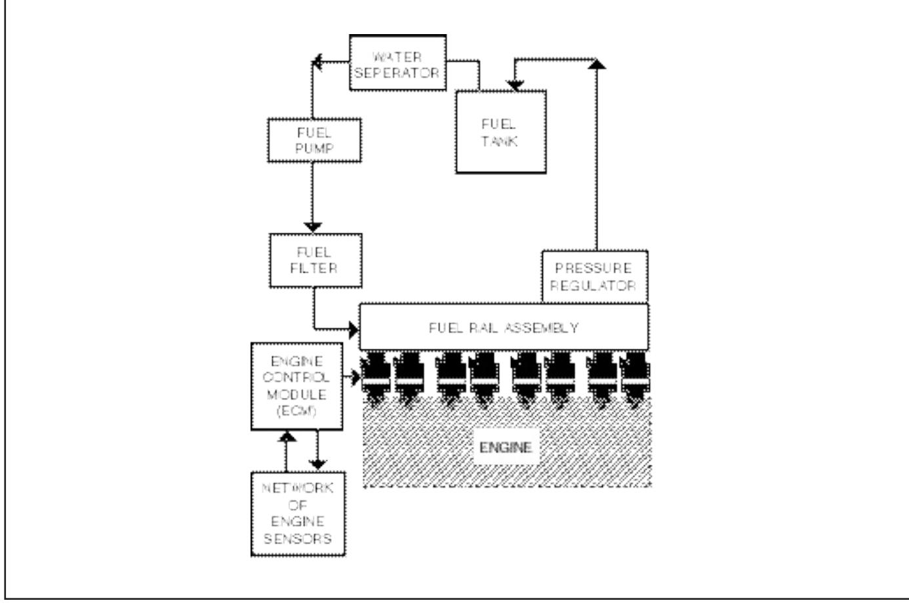

# **Fuel System Diagnosis**

## **Circuit Description**

When the ignition switch is ON, the ECM activates the electric fuel pump. The fuel pump remains ON as long as the ECM receives reference pulses from the ignition system. If there are no reference pulses, the ECM turns the fuel pump OFF after about 2 seconds.

The electric pump delivers fuel through an in-pipe fuel filter to the fuel rail assembly. The fuel pump provides fuel at a pressure above the pressure needed by the fuel injectors. A fuel pressure regulator, attached to the fuel rail, keeps the fuel available to the fuel injectors at a regulated pressure. Unused fuel returns to the fuel tank by a seperate fuel return pipe.

## **Test Description**

Number(s) below refer to the step number(s) on the diagnostic table:

- 2. When the ignition switch is ON and the fuel pump is running, the fuel pressure indicated by the fuel pressure gauge should read 379-427 kPa (55-62 psi). The spring pressure inside the fuel pressure regulator controls the fuel pressure.
- 3. A fuel system that drops more than 14 kPa (2 psi) in 10 minutes has a leak in one or more of the following areas:
- The fuel pump check valve.
- The fuel pump flex pipe.
- The valve or valve seat within the fuel pressure regulator.
- The fuel injector(s).
- 4. A fuel system that drops more than 14 kPa (2 psi) in 10 minutes after being relieved to 69 kPa (10 psi) indicates a leaking fuel pump check valve.
- 5. Fuel pressure that drops off during acceleration, cruise or hard cornering may cause a lean condition. A lean condition can cause a loss of power, surging or misfire.
- 8. When the engine is at idle, the manifold pressure is low (high vacuum). This low pressure (high vacuum) is applied to the fuel pressure regulator diaphragm. The low pressure (high vacuum) will offset the pressure being applied to the fuel pressure regulator diaphragm by the spring inside the fuel pressure regulator. When this happens, the result is lower fuel pressure. The fuel pressure at idle will vary slightly as the barometric pressure changes, but the fuel pressure at idle should always be less than the fuel pressure noted in step 2 with the engine OFF.

{133}------------------------------------------------

# **Fuel System Diagnosis**

- 12. A rich condition may result from the fuel pressure being above 427 kPa (62 psi). Driveability conditions associated with rich conditions can include hard starting followed by black smoke and a strong sulfur smell in the exhaust.
- 13. This test determines if the high fuel pressure is due to a restricted fuel return pipe or if the high fuel pressure is due to a faulty fuel pressure regulator.
- 15. A lean condition may result from the fuel pressure being below 379 kPa (55 psi). Driveability conditions associated with lean conditions can include hard starting (when the engine is cold), hesitation, poor driveability, lack of power, surging and misfiring.
- **Notice:** Do not allow the fuel pressure to exceed 517 kPa (75 psi). Excessive pressure may damage the fuel pressure regulator.
- 16. Restricting the fuel return pipe with the J 37287 fuel pipe shut-off adapter causes the fuel pressure to rise above the regulated pressure. Using a scan tool to pressurize the fuel system, the fuel pressure should rise above 427 kPa (62 psi) as the valve on the fuel pipe shut-off adapter connected to the fuel return pipe becomes partially closed.
- 22. Check the spark plug associated with a particular fuel injector for fouling or saturation in order to determine if that particular fuel injector is leaking. If

checking the spark plug associated with a particular fuel injector for fouling or saturation does not determine that a particular fuel injector is leaking, use the following procedure.

- 1. Remove the fuel rail. Refer to Fuel Rail Assembly Replacement.
- 2. Reinstall the crossover pipe to the right fuel rail. Refer to Fuel Rail Assembly Replacement.
- 3. Connect the fuel feed pipe and the fuel return pipe to the fuel rail. Refer to Fuel Rail Assembly Replacement.
- 4. Lift the fuel rail just enough to leave the fuel injector nozzles in the fuel injector ports.

#### **Caution: In order to reduce the risk of fire and personal injury that may result from fuel spraying on the engine, verify that the fuel rail is positioned over the fuel injector ports. Also verify that the fuel injector retaining clips ar intact.**

- 5. Pressurize the fuel system by using the scan tool fuel pump enable.
- 6. Visually and physically inspect the fuel injector nozzles for leaks.

| Step | Action                                                                                                                                                                                                                                                                                                                                                                                                                                                                                                                                                                                                                                                                                                                                                                                                                                                                                                                                                                                                               | Value                      | Yes          | No                        |
|------|----------------------------------------------------------------------------------------------------------------------------------------------------------------------------------------------------------------------------------------------------------------------------------------------------------------------------------------------------------------------------------------------------------------------------------------------------------------------------------------------------------------------------------------------------------------------------------------------------------------------------------------------------------------------------------------------------------------------------------------------------------------------------------------------------------------------------------------------------------------------------------------------------------------------------------------------------------------------------------------------------------------------|----------------------------|--------------|---------------------------|
| 1    | Did you perfom the On-Board Diagnostic (OBD) System Check?                                                                                                                                                                                                                                                                                                                                                                                                                                                                                                                                                                                                                                                                                                                                                                                                                                                                                                                                                        | —                          | Go to Step 2 | Go to OBD System Check |
| 2    | 1. Turn OFF the ignition. Caution: Wrap a shop towel around the fuel pressure connection in order to reduce the risk of fire and personal injury. The towel will absorb any fuel leakage that occurs during the connection of the fuel pressure gauge. Place the towel in an approved container when the connection of the fuel pressure gauge is complete. 2. Install the J 34730-1A fuel pressure gauge. 3. Place the bleed hose of the fuel pressure gauge into an approved gasoline container. 4. Turn the ignition ON leaving the engine OFF. 5. Bleed the air out of the fuel pressure gauge. 6. Turn the ignition OFF for 10 seconds. 7. Turn the ignition ON leaving the engine OFF. Important: The fuel pump will run for approximately 2 seconds. Cycle the ignition as necessary in order to achieve the highest possible fuel pressure. 8. Observe the fuel pressure with the fuel pump running. Is the fuel pressure within the specified limits? | 379-427 kPa (55-62 psi) | Go to Step 3 | Go to Step 12             |

# **Fuel System Diagnosis**

{134}------------------------------------------------

#### **Fuel System Diagnosis (cont'd)**

| Step | Action                                                                                                                                                                                                                                                                                                                                                                                                                                                                                                | Value                             | Yes               | No            |
|------|-------------------------------------------------------------------------------------------------------------------------------------------------------------------------------------------------------------------------------------------------------------------------------------------------------------------------------------------------------------------------------------------------------------------------------------------------------------------------------------------------------|-----------------------------------|-------------------|---------------|
| 3    | Important: The fuel pressure may vary slightly when the fuel pump stops running. After the fuel pump stops running, the fuel pressure should stabilize and remain constant. Does the fuel pressure drop more than the specified value in 10 minutes?                                                                                                                                                                                                                                   | —                                 | Go to Step 10     | Go to Step 4  |
| 4    | Relieve the fuel pressure to the first specified value. Does the fuel pressure drop more than the second specified value in 10 minutes?                                                                                                                                                                                                                                                                                                                                                         | 69 kPa (10 psi) 14 kPa (2 psi) | Go to Step 19     | Go to Step 5  |
| 5    | Do you suspect the fuel pressure of dropping-off during acceleration, cruise or hard cornering?                                                                                                                                                                                                                                                                                                                                                                                                    | —                                 | Go to Step 6      | Go to Step 8  |
| 6    | Visually and physically inspect the following items for a restriction: • The fuel filter • The fuel feed pipe Did you find a restriction?                                                                                                                                                                                                                                                                                                                                           | —                                 | Go to Step 24     | Go to Step 7  |
| 7    | 1. Remove the fuel sender assembly. 2. Visually and physically inspect the following items: • The fuel strainer/check valve for a restriction. • The fuel pump pipe for leaks. • Verify the fuel pump is the correct fuel pump for this vehicle. Did you find a problem in any of these areas?                                                                                                                                                                             | —                                 | Go to Step 24     | Go to Step 19 |
| 8    | 1. Start the engine. 2. Allow the engine to idle at normal operating temperature. Does the fuel pressure drop by the amount specified?                                                                                                                                                                                                                                                                                                                                                       | 21-69 kPa (3-10 psi)           | Go to Symptoms | Go to Step 9  |
| 9    | 1. Disconnect the vacuum hose from the fuel pressure regulator. 2. With the engine idling, apply 12-14 inches of vacuum to the fuel pressure regulator. Does the fuel pressure drop by the amount specified?                                                                                                                                                                                                                                                                              | 21-69 kPa (3-10 psi)           | Go to Step 20     | Go to Step 21 |
| 10   | 1. Relieve the fuel pressure. Refer to Fuel Pressure Relief Procedure. 2. Disconnect the fuel feed pipe and the fuel return pipe from the fuel rail. 3. Install the J 37287 fuel pipe shut-off adapters between the fuel feed pipe and the fuel return pipe and the fuel rail. 4. Open the valves on the fuel pipe shut-off adapters. 5. Turn the ignition ON. 6. Pressurize the fuel system using a scan tool. 7. Place the bleed hose of the fuel pressure gauge into |                                   |                   |               |

{135}------------------------------------------------

#### **Fuel System Diagnosis (cont'd)**

| Step | Action                                                                                                                                                                                                                                                                                                                                                                                                                                                                                                                                                                                                                                                | Value                      | Yes           | No            |
|------|-------------------------------------------------------------------------------------------------------------------------------------------------------------------------------------------------------------------------------------------------------------------------------------------------------------------------------------------------------------------------------------------------------------------------------------------------------------------------------------------------------------------------------------------------------------------------------------------------------------------------------------------------------|----------------------------|---------------|---------------|
| 10   | an approved gasoline container. 8. Bleed the air out of the fuel pressure gauge. 9. Wait for the fuel pressure to build. 10. Close the valve in the fuel pipe shut-off adapter that is connected to the fuel return pipe.                                                                                                                                                                                                                                                                                                                                                                                                                 |                            |               |               |
|      | Does the fuel pressure remain constant?                                                                                                                                                                                                                                                                                                                                                                                                                                                                                                                                                                                                               | —                          | Go to Step 19 | Go to Step 11 |
| 11   | 1. Open the valve in the fuel pipe shut-off adapter that is connected to the fuel feed pipe. 2. Pressurize the fuel system using a scan tool. 3. Wait for the fuel pressure to build. 4. Close the valve in the fuel pipe shut-off adapter that is connected to the fuel return pipe. Does the fuel pressure remain constant?                                                                                                                                                                                                                                                                                                       | —                          | Go to Step 21 | Go to Step 22 |
| 12   | Is the fuel pressure above the specified limit?                                                                                                                                                                                                                                                                                                                                                                                                                                                                                                                                                                                                       | 427 kPa (62 psi)        | Go to Step 13 | Go to Step 15 |
| 13   | 1. Relieve the fuel pressure. Refer to the Fuel Pressure Relief Procedure. 2. Disconnect the fuel return pipe from the fuel rail. 3. Attach a length of flexible fuel hose to the fuel rail outlet passage. 4. Place the open end of the flexible fuel hose into an approved gasoline container. 5. Turn the ignition OFF for 10 seconds. 6. Turn the ignition ON. 7. Observe the fuel pressure with the fuel pump running. Is the fuel pressure within the specified limits?                                                                                                                                           | 379-427 kPa (55-62 psi) | Go to Step 23 | Go to Step 14 |
| 14   | Visually and physically inspect the fuel rail outlet passages for a restriction. Was a restriction found?                                                                                                                                                                                                                                                                                                                                                                                                                                                                                                                                       | —                          | Go to Step 24 | Go to Step 21 |
| 15   | Is the fuel pressure above the specified value?                                                                                                                                                                                                                                                                                                                                                                                                                                                                                                                                                                                                       | 0 kPa (0 psi)              | Go to Step 16 | Go to Step 17 |
| 16   | 1. Relieve the fuel pressure. Refer to Fuel Pressure Relief Procedure. 2. Disconnect the fuel return pipe from the fuel rail. 3. Install the J 37287 fuel pipe shut-off adapter between the fuel return pipe and the fuel rail. 4. Open the valve on the fuel pipe shut-off adapter. 5. Turn the ignition ON. 6. Pressurize the fuel system using a scan tool. 7. Place the bleed hose of the fuel pressure gauge into an approved gasoline container. 8. Bleed the air out of the fuel pressure gauge. Notice: Do not allow the fuel pressure to exceed 517 kPa (75 psi). Excessive pressure may damage the fuel |                            |               |               |

{136}------------------------------------------------

#### **Fuel System Diagnosis (cont'd)**

| Step | Action                                                                                                                                                                                                                                                                          | Value               | Yes           | No                                            |
|------|---------------------------------------------------------------------------------------------------------------------------------------------------------------------------------------------------------------------------------------------------------------------------------|---------------------|---------------|-----------------------------------------------|
| 16   | pressure regulator. 9. Slowly close the valve in the fuel pipe shut-off adapter that is connected to the fuel return pipe. Does the fuel pressure rise above the specified value?                                                                                      | 427 kPa (62 psi) | Go to Step 21 | Go to Step 7                                  |
| 17   | Turn ON the fuel pump using a scan tool. Does the fuel pump run?                                                                                                                                                                                                             | —                   | Go to Step 18 | Go to Fuel Pump Relay Circuit Diagnosis |
| 18   | Visually and physically inspect the following items: • The fuel filter for obstructions. • The fuel feed pipe for a restriction. • The fuel strainer for obstructions. • The fuel pump pipe for leaks. Did you find a problem in any of these areas? | —                   | Go to Step 24 | Go to Step 19                                 |
| 19   | Replace the fuel pump. Is the action complete?                                                                                                                                                                                                                               | —                   | System OK     | —                                             |
| 20   | Locate and repair the loss of vacuum to the fuel pressure regulator. Is the action complete?                                                                                                                                                                              | —                   | System OK     | —                                             |
| 21   | Replace the fuel pressure regulator. Is the action complete?                                                                                                                                                                                                                 | —                   | System OK     | —                                             |
| 22   | Locate and replace any leaking fuel injector(s). Is the action complete?                                                                                                                                                                                                     | —                   | System OK     | —                                             |
| 23   | Locate and repair the restriction in the fuel return pipe. Is the action complete?                                                                                                                                                                                           | —                   | System OK     | —                                             |
| 24   | Repair the problem as necessary. Is the action complete?                                                                                                                                                                                                                     | —                   | System OK     | —                                             |

{137}------------------------------------------------

**This Page Was Intentionally Left Blank**

{138}------------------------------------------------

# **Fuel Injector Coil Test - Engine Coolant Temperature (ECT) Between 10-35 Degrees C (50-95 Degrees F)**

#### **Test Description**

- 2. The engine coolant temperature affects the ability of the fuel injector tester to detect a faulty fuel injector. If the engine coolant temperature is NOT between 10-35 degrees C (50-95 degrees F), use Fuel Injector Test - Engine Coolant Temperature (ECT) Outside 10-35 Degrees C (50-95 Degrees F) table.
- 3. The first second of the voltage displayed by the DMM may be inaccurate due to the initial current surge. Therefore, record the lowest voltage displayed by the DMM after the first second of the test. The voltage displayed by the DMM should be within the specified range. Refer to the Example. The voltage displayed by the DMM may increase throughout the test as the fuel injector windings warm and the resistance of the fuel injector windings changes. An erratic voltage reading with large fluctuations in voltage that do not stabilize, indicates an intermittent connection with the fuel injector.

| Resistance    | Voltage Specification at 10-35 |           |  |
|---------------|--------------------------------|-----------|--|
| Ohms          | Degrees C (50-95 Degrees F)    |           |  |
| 11.8-12.6     | 5.7-6.6 V                      |           |  |
| Fuel Injector |                                |           |  |
| Number        | Voltage Reading                | Pass/Fail |  |
| 1             | 6.3                            | P         |  |
| 2             | 5.9                            | P         |  |
| 3             | 6.2                            | P         |  |
| 4             | 6.1                            | P         |  |
| 5             | 4.8                            | F         |  |
| 6             | 6.0                            | P         |  |
| 7             | 5.0                            | P         |  |
| 8             | 5.3                            | P         |  |

# **Fuel Injector Coil Test - Engine Coolant Temperature (ECT) Between 10-35 Degrees C (50-95 Degrees F)**

| Step | Action                                                                                                                                                                                                                                                                                                                                                                                                                                                                                                                                                                                                                                                                                                                                                         | Value                    | Yes          | No                                                                      |
|------|----------------------------------------------------------------------------------------------------------------------------------------------------------------------------------------------------------------------------------------------------------------------------------------------------------------------------------------------------------------------------------------------------------------------------------------------------------------------------------------------------------------------------------------------------------------------------------------------------------------------------------------------------------------------------------------------------------------------------------------------------------------|--------------------------|--------------|-------------------------------------------------------------------------|
| 1    | Was the "On-Board Diagnostic" (OBD) system check performed?                                                                                                                                                                                                                                                                                                                                                                                                                                                                                                                                                                                                                                                                                                 | —                        | Go to Step 2 | Go to OBD System Check                                               |
| 2    | 1. Connect the scan tool. 2. Check the engine coolant temperature. Is the engine coolant temperature within the specified limits?                                                                                                                                                                                                                                                                                                                                                                                                                                                                                                                                                                                                                     | 10°C-35°C (50°F-95°F) | Go to Step 3 | Go to Fuel Injector Coil Test-ECT Outside 10-35°C (50-95°F) |
| 3    | 1. Turn the ignition OFF. Notice: Be careful not to flood a single cylinder. 2. Relieve the fuel pressure per manufacturers recommendation. 3. Access the fuel injector electrical connectors as required. 4. Connect the J 39021 fuel injector tester to B+ and ground. 5. Set the amperage supply selector switch on the fuel injector tester to the Coil Test 0.5 amp position. 6. Connect the leads from the DMM to the fuel injector tester. 7. Set the DMM to the tenths scale (0.0). 8. Connect the fuel injector tester to a fuel injector using the J 39021-380 injector test adapter. Important: Check the engine coolant temperature again in order to ensure that the correct chart is being used. |                          |              |                                                                         |

{139}------------------------------------------------

# **Fuel Injector Coil Test - Engine Coolant Temperature (ECT) Between 10-35 Degrees C (50-95 Degrees F) (cont'd)**

| Step | Action                                                                                                                                                                                                                                                                                                                                                                                                                                                                                                  | Value     | Yes                                                         | No                                                          |
|------|---------------------------------------------------------------------------------------------------------------------------------------------------------------------------------------------------------------------------------------------------------------------------------------------------------------------------------------------------------------------------------------------------------------------------------------------------------------------------------------------------------|-----------|-------------------------------------------------------------|-------------------------------------------------------------|
| 3    | 9. Press the Push to Start Test button on the fuel injector tester. Important: The voltage reading may rise during the test. 10. Observe the voltage reading on the DMM. 11. Record the lowest voltage observed after the first second of the test. 12. Repeat steps 8 through 11 for each fuel injector. Did any fuel injector have an erratic voltage reading with large fluctuations in voltage that do not stabilize, or a voltage reading outside the specified limits? | 5.7-6.6 V | Go to Step 4                                                | Go to Fuel Injector Balance Test with Special Tool |
| 4    | Replace the faulty fuel injectors. Refer to Fuel Injector Replacement. Is the action complete?                                                                                                                                                                                                                                                                                                                                                                                                    | —         | Go to Fuel Injector Balance Test with Special Tool | —                                                           |

# **Fuel Injector Coil Test - Engine Coolant Temperature (ECT) Outside 10-35 Degrees C (50-95 Degrees F)**

#### **Test Description**

- 2. The engine coolant temperature affects the ability of the fuel injector tester to detect a faulty fuel injector. If the engine coolant temperature is between 10-35 degrees C (50-95 degrees F), use Fuel Injector Test - Engine Coolant Temperature (ECT) Between 10-35 Degrees C (50-95 Degrees F) table.
- 3. The first second of the voltage displayed by the DMM may be inaccurate due to the initial current surge. Therefore, record the lowest voltage displayed by the DMM after the first second of the test. The voltage displayed by the DMM may increase throughout the test as the fuel injector windings warm and the resistance of the fuel injector windings changes. An erratic voltage reading with large fluctuations in voltage that do not stabilize, indicates an intermittent connection with the fuel injector. From the voltages recorded, identify the highest voltage, excluding any voltages above 9.5 volts. Subtract each voltage that is not above 9.5 volts from the highest voltage. Record each subtracted value. Refer to the Example. The subtracted value that is more than 0.6 volt is faulty. Replace the fuel injector. A fuel injector with a recorded voltage above 9.5 volts is also faulty. Replace the fuel injector.

|          |                         | Acceptable Subtracted |           |  |
|----------|-------------------------|-----------------------|-----------|--|
|          |                         | Value Above/Below     |           |  |
|          | Highest Voltage Reading | 10-35°C (50-95°F)     |           |  |
| 7.1 V    |                         | 0.6 V                 |           |  |
| Injector |                         | Subtracted            |           |  |
| Number   | Voltage                 | Value                 | Pass/Fail |  |
| 1        | 9.8                     | —                     | F         |  |
| 2        | 6.6                     | 0.5                   | P         |  |
| 3        | 6.9                     | 0.2                   | P         |  |
| 4        | 5.8                     | 1.3                   | F         |  |
| 5        | 7.0                     | 0.1                   | P         |  |
| 6        | 7.1                     | 0.0                   | P         |  |
| 7        | 9.6                     | —                     | F         |  |
| 8        | 6.0                     | 1.1                   | F         |  |

{140}------------------------------------------------

# **Fuel Injector Coil Test - Engine Coolant Temperature (ECT) Outside 10-35 Degrees C (50-95 Degrees F)**

| Step | Action                                                                                                                                                                                                                                                                                                                                                                                                                                                                                                                                                                                                                                                                                                                                                                                                                                                                                                                                                                                                                                                                                                                                                                                                                                                                                                                                                                                                                                 | Value                    | Yes                                                         | No                                                                     |
|------|----------------------------------------------------------------------------------------------------------------------------------------------------------------------------------------------------------------------------------------------------------------------------------------------------------------------------------------------------------------------------------------------------------------------------------------------------------------------------------------------------------------------------------------------------------------------------------------------------------------------------------------------------------------------------------------------------------------------------------------------------------------------------------------------------------------------------------------------------------------------------------------------------------------------------------------------------------------------------------------------------------------------------------------------------------------------------------------------------------------------------------------------------------------------------------------------------------------------------------------------------------------------------------------------------------------------------------------------------------------------------------------------------------------------------------------|--------------------------|-------------------------------------------------------------|------------------------------------------------------------------------|
| 1    | Was the "On-Board Diagnostic" (OBD) system check performed?                                                                                                                                                                                                                                                                                                                                                                                                                                                                                                                                                                                                                                                                                                                                                                                                                                                                                                                                                                                                                                                                                                                                                                                                                                                                                                                                                                         | —                        | Go to Step 2                                                | Go to OBD System Check                                              |
| 2    | 1. Connect the scan tool. 2. Check the engine coolant temperature. Is the engine coolant temperature within the specified limits?                                                                                                                                                                                                                                                                                                                                                                                                                                                                                                                                                                                                                                                                                                                                                                                                                                                                                                                                                                                                                                                                                                                                                                                                                                                                                             | 10°C-35°C (50°F-95°F) | Go to Step 3                                                | Go to Fuel Injector Coil Test-ECT Between10-35°C (50-95°F) |
| 3    | 1. Turn the ignition OFF. Notice: Be careful not to flood a single cylinder. 2. Relieve the fuel pressure per manufacturers recommendation. 3. Access the fuel injector electrical connectors as required. 4. Connect the J 39021 fuel injector tester to B+ and ground. 5. Set the amperage supply selector switch on the fuel injector tester to the Coil Test 0.5 amp position. 6. Connect the leads from the DMM to the fuel injector tester. 7. Set the DMM to the tenths scale (0.0). 8. Connect the fuel injector tester to a fuel injector using the J 39021-380 injector test adapter. Important: Check the engine coolant temperature again in order to ensure that the correct chart is being used. 9. Press the Push to Start Test button on the fuel injector tester. Important: The voltage reading may rise during the test. 10. Observe the voltage reading on the DMM. 11. Record the lowest voltage observed after the first second of the test. 12. Repeat steps 8 through 11 for each fuel injector. 13. Identify the highest voltage reading recorded other than those above 9.5 volts. 14. Subtract any other voltage readings recorded from the highest voltage reading recorded. 15. Repeat step 14 for all the remaining fuel injectors. Is any value that resulted from subtraction more than the specified value? | 0.6 V                    | Go to Step 4                                                | Go to Fuel Injector Balance Test with Special Tool            |
| 4    | Replace any fuel injector that had any of the following: • A subtracted value exceeding 0.6 volts • An initial reading above 9.5 volts • An erratic reading Refer to Fuel Injector Replacement. Is the action complete?                                                                                                                                                                                                                                                                                                                                                                                                                                                                                                                                                                                                                                                                                                                                                                                                                                                                                                                                                                                                                                                                                                                                                                                        | —                        | Go to Fuel Injector Balance Test with Special Tool | —                                                                      |

{141}------------------------------------------------

**This Page Was Intentionally Left Blank**

{142}------------------------------------------------

# **Fuel Injector Balance Test with Special Tool**

#### **Test Description**

- 4. The engine coolant temperature must be below the operating temperature in order to avoid irregular fuel pressure readings due to Hot Soak fuel boiling.
- 5. The fuel pressure should be within the specified range.
- 6. The fuel pressure should reach a steady value.
- 7. If the fuel pressure drop value for each injector is within 10 Kpa (1.5 psi) of the average pressure drop value, the fuel injectors are flowing properly. Calculate the pressure drop value for each fuel injector by subtracting the second pressure reading from the first pressure reading.

# **Fuel Injector Balance Test with Special Tool**

| Step | Action                                                                                                                                                                                                                                                                                                                                                                                                                                                                                                                                                                                                                                                                                                                                                                                                        | Value                      | Yes          | No                                                                         |
|------|---------------------------------------------------------------------------------------------------------------------------------------------------------------------------------------------------------------------------------------------------------------------------------------------------------------------------------------------------------------------------------------------------------------------------------------------------------------------------------------------------------------------------------------------------------------------------------------------------------------------------------------------------------------------------------------------------------------------------------------------------------------------------------------------------------------|----------------------------|--------------|----------------------------------------------------------------------------|
| 1    | Was the "On-Board Diagnostic" (OBD) system check performed?                                                                                                                                                                                                                                                                                                                                                                                                                                                                                                                                                                                                                                                                                                                                                | —                          | Go to Step 2 | Go to OBD System Check                                                  |
| 2    | Did you perform the Fuel Injector Coil Test Procedure?                                                                                                                                                                                                                                                                                                                                                                                                                                                                                                                                                                                                                                                                                                                                                        | —                          | Go to Step 3 | Go to Fuel Injector Coil Test-ECT Between 10-35°C (50-95°F) |
| 3    | Is the engine coolant temperature above the specified value?                                                                                                                                                                                                                                                                                                                                                                                                                                                                                                                                                                                                                                                                                                                                               | 94°C(201°F)                | Go to Step 4 | Go to Step 5                                                               |
| 4    | Allow the engine to cool below the specified value. Is the engine coolant temperature below the specified value?                                                                                                                                                                                                                                                                                                                                                                                                                                                                                                                                                                                                                                                                                        | 94°C(201°F)                | Go to Step 5 | —                                                                          |
| 5    | 1. Turn the ignition OFF. 2. Connect the J 34730-1A fuel pressure gauge to the fuel pressure test port. 3. Turn ON the ignition leaving the engine OFF. 4. Install the scan tool. 5. Energize the fuel pump using the scan tool. 6. Place the bleed hose of the fuel pressure gauge into an approved gasoline container. 7. Bleed the air out of the fuel pressure gauge. 8. Again energize the fuel pump using the scan tool. Important: The fuel pump will run for approximately 2 seconds. Repeat step 8 as necessary in order to achieve the highest possible fuel pressure. 9. Wait for the fuel pressure to build. 10. Observe the reading on the fuel pressure gauge while the fuel pump is running. Is the fuel pressure within the specified limits? | 379-427 kPa (55-62 psi) | Go to Step 6 | Go to Fuel System Diagnosis                                          |
| 6    | After the fuel pump stops, the fuel pressure may vary slightly, then should hold steady. Does the fuel pressure remain constant within the specified value?                                                                                                                                                                                                                                                                                                                                                                                                                                                                                                                                                                                                                                          | 379-427 kPa (55-62 psi) | Go to Step 7 | Go to Fuel System Diagnosis                                          |

{143}------------------------------------------------

| Step | Action                                                                                                                                                                                                                                                                                                                                                                                                                                                                                                                                                                                                                                                                                                                                                                                                                                                                                                                                                                                                                                                                                                                                                                                                                                                                                                                                                                                                                  | Value            | Yes          | No                |
|------|-------------------------------------------------------------------------------------------------------------------------------------------------------------------------------------------------------------------------------------------------------------------------------------------------------------------------------------------------------------------------------------------------------------------------------------------------------------------------------------------------------------------------------------------------------------------------------------------------------------------------------------------------------------------------------------------------------------------------------------------------------------------------------------------------------------------------------------------------------------------------------------------------------------------------------------------------------------------------------------------------------------------------------------------------------------------------------------------------------------------------------------------------------------------------------------------------------------------------------------------------------------------------------------------------------------------------------------------------------------------------------------------------------------------------|------------------|--------------|-------------------|
| 7    | 1. Connect the J 39021 fuel injector tester to a fuel injector using the J 39021-380 injector test adapter. 2. Set the amperage supply selector switch on the fuel injector tester to the balance test 0.5-2.5 amp position. 3. Energize the fuel pump using the scan tool in order to pressurize the fuel system. 4. Record the fuel pressure indicated by the fuel pressure gauge after the fuel pressure stabilizes. This is the 1st pressure reading. 5. Energize the fuel injector by depressing the Push to Start Test button on the fuel injector tester. 6. Record the fuel pressure indicated by the fuel pressure gauge after the fuel pressure gauge needle has stopped moving. This is the 2nd pressure reading. 7. Repeat steps 1 through 6 for each fuel injector. 8. Subtract the 2nd pressure reading from the 1st pressure reading for one fuel injector. The result is the pressure drop value. 9. Obtain a pressure drop value for each fuel injector. 10. Add all of the individual pressure drop values. This is the total pressure drop. 11. Divide the total pressure drop by the number of fuel injectors. This is the average pressure drop. Does any fuel injector have a pressure drop value that is either higher than the average pressure drop or lower than the average pressure drop by the specified value? | 10 kPa (1.5 psi) | Go to Step 8 | Go to Symptoms |
| 8    | Notice: Do Not repeat any portion of this test before running the engine in order to prevent the engine from flooding. Retest any fuel injector that does not meet the specification. Refer to the procedure in step 7. Does any fuel injector still have a pressure drop value that is either higher than the average pressure drop or lower than the average pressure drop by the specified value?                                                                                                                                                                                                                                                                                                                                                                                                                                                                                                                                                                                                                                                                                                                                                                                                                                                                                                                                                                                               | 10 kPa (1.5 psi) | Go to Step 9 | Go to Symptoms |
| 9    | Replace the faulty fuel injectors. Refer to Fuel Injector Replacement. Is the action complete?                                                                                                                                                                                                                                                                                                                                                                                                                                                                                                                                                                                                                                                                                                                                                                                                                                                                                                                                                                                                                                                                                                                                                                                                                                                                                                                    | —                | System OK    | —                 |

# **Fuel Injector Balance Test with Special Tool (cont'd)**

{144}------------------------------------------------

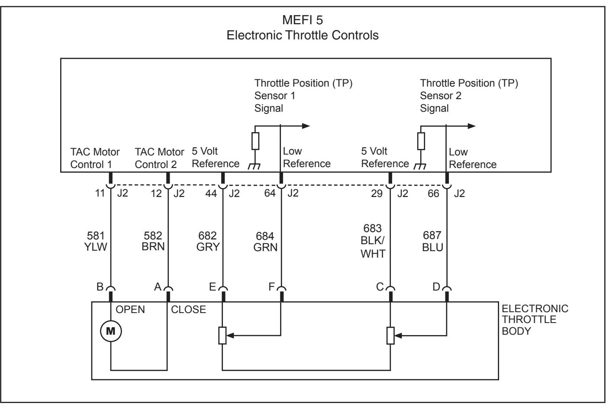

#### **Circuit Description**

The ECM controls idle speed to a calibrated "desired" RPM based on sensor inputs and actual engine RPM. The ECM uses four (2) circuits to move the throttle blade in the electronic throttle body in order to command Idle Air Control (IAC) function. The movement of the throttle blade varies the amount of air flow bypassing the throttle plates. The ECM controls idle speed by determining the position of the throttle blade.

#### **Diagnostic Aids**

An intermittent may be caused by a poor connection, rubbed through wire insulation or a wire broken inside the insulation. Check for the following items:

- Poor connection or damaged harness. Inspect the ECM harness and connectors for improper mating, broken locks, improperly formed or damaged terminals, poor terminal to wire connection and damaged harness.
- Check for vacuum leaks, disconnected or brittle vacuum hoses, cuts, etc. Examine manifold and throttle body gaskets for proper seal. Check for cracked intake manifold.
- Check for poor connections, opens or short to grounds in CKT's 581, 582, 682, 683, 684, and 687. This may result in improper idle control.
- A throttle blade which is "frozen" and will not respond to the ECM, a throttle stop screw which has been tampered with, or a damaged throttle body or linkage may cause improper idle.

#### **Test Description**

- 2. This step determines if the Throttle Actuator Control (TAC) motor is functioning properly.
- 4. This step determines if the circuitry or the TAC motor is faulty.

{145}------------------------------------------------

| Step | Action                                                                                                                                                                                                                                                                                                                                          | Value   | Yes                       | No                        |
|------|-------------------------------------------------------------------------------------------------------------------------------------------------------------------------------------------------------------------------------------------------------------------------------------------------------------------------------------------------|---------|---------------------------|---------------------------|
| 1    | Was the "On-Board Diagnostic" (OBD) system check performed?                                                                                                                                                                                                                                                                                  | —       | Go to Step 2              | Go to OBD System Check |
| 2    | 1. Engine should be at normal operating temperature. 2. Start engine and allow idle to stabilize. 3. Record RPM. 4. Ignition "OFF" for 10 seconds. 5. Disconnect Electronic Throttle Body harness connector. 6. Restart engine and record RPM. Is RPM higher than the first recorded RPM by more than the specified value? | 200 RPM | Go to Step 3              | Go to Step 4              |
| 3    | 1. Reinstall Electronic Throttle Body harness connector. 2. Idle speed should gradually return within 75 RPM of the original recorded RPM within 30 seconds. Does RPM return to original recorded RPM?                                                                                                                                 | —       | Go to Step 5              | Go to Step 4              |
| 4    | 1. Ignition "OFF" for 10 seconds. 2. Disconnect Electronic Throttle Body harness connector. 3. Restart engine. 4. Using a test lamp J 34142-B connected to ground, probe each one of the six Electronic Throttle Body harness terminals. Does the test lamp blink on all four terminals?                                      | —       | Go to Step 7              | Go to Step 6              |
| 5    | Electronic Throttle Body circuit is functioning properly. ????                                                                                                                                                                                                                                                                                  | —       | —                         | —                         |
| 6    | Locate and repair poor connection, open, or short to ground in the Electronic Throttle Body circuit that did not blink. If a problem was found, repair as necessary. Was a problem found?                                                                                                                                              | —       | Go to OBD System Check | Go to Step 8              |
| 7    | Check for poor Electronic Throttle Body connections or replace the faulty Electronic Throttle Body. Is action complete?                                                                                                                                                                                                                   | —       | Go to OBD System Check | —                         |
| 8    | Repair faulty ECM connections or replace faulty ECM. Is action complete?                                                                                                                                                                                                                                                                     | —       | Go to OBD System Check | —                         |

# **Idle Air Control Functional Test**

{146}------------------------------------------------

{147}------------------------------------------------

{148}------------------------------------------------

{149}------------------------------------------------

{150}------------------------------------------------

# Engine Oil Pressure Sensor

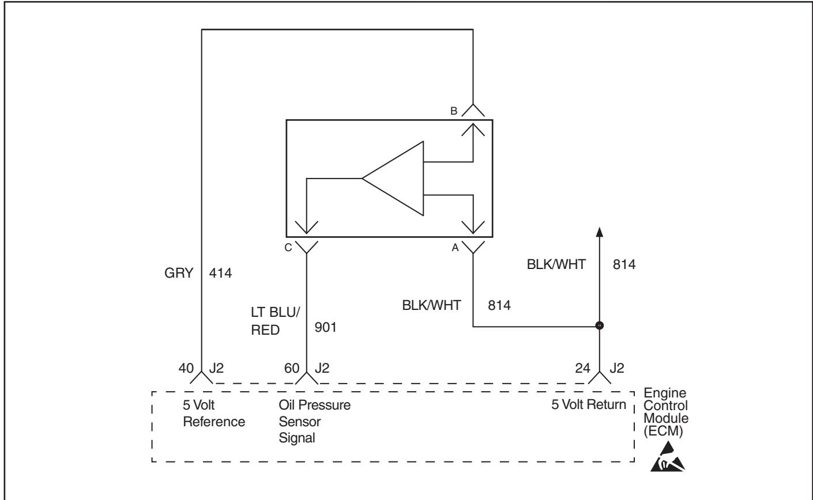

# **SPN 100 FMI 3** *-* **Oil Pressure Voltage High**

# **Circuit Description**

The engine oil pressure (EOP) sensor changes resistance based on engine oil pressure. The ECM monitors the signal circuit of the EOP sensor. The EOP sensor has the following circuits:

- 5-volt reference circuit
- Low reference circuit
- EOP sensor signal circuit

The engine control module (ECM) supplies 5 volts to the EOP sensor on the 5-volt reference circuit. The ECM also provides a ground on the low reference circuit. The EOP sensor provides a signal to the ECM on the EOP sensor signal circuit which is relative to the pressure changes in the engine oil pressure. When the oil pressure is high, the sensor resistance is high, and the ECM senses a high voltage. When the oil pressure is low, the sensor voltage is low, and the ECM senses a low signal voltage. The ECM monitors the EOP sensor signal for voltage outside of the normal range. If the ECM detects an EOP sensor signal voltage that is excessively high, SPN 100 FMI 3 sets. The ECM sends the engine oil pressure information to the IPC (Dash) via the CAN BUS J1939 data circuit.

# **DTC Descriptor**

This diagnostic procedure supports the following DTC: SPN 100 FMI 3 Oil Pressure Voltage High

# **Conditions for Running the DTC**

• The engine is running.

# **Conditions for Setting the DTC**

The ECM detects that the EOP sensor voltage is greater than 4.5 volt for more than 9 seconds.

{151}------------------------------------------------

# **Action Taken When the DTC Sets**

- The control module illuminates the malfunction indicator lamp (MIL) when the diagnostic runs and fails.
- The control module records the DTC at the time the diagnostic fails.

# **Conditions for Clearing the MIL/DTC**

 • The control module turns OFF the malfunction indicator lamp (MIL) after consecutive ignition cycle that the diagnostic runs and does not fail.

• A current DTC, Last Test Failed, clears when the diagnostic runs and passes.

 • A history DTC clears after 25 consecutive warm-up cycles, if no failures are reported by this or any other emission related diagnostic.

• Clear the MIL and the DTC with a scan tool.

# **Diagnostic Aids**

| Step                                                                                                                                                                    | Action                                                                                                                                                                                                                                                                                                                                                                                               | Value  | Yes           | No                                     |  |
|-------------------------------------------------------------------------------------------------------------------------------------------------------------------------|------------------------------------------------------------------------------------------------------------------------------------------------------------------------------------------------------------------------------------------------------------------------------------------------------------------------------------------------------------------------------------------------------|--------|---------------|----------------------------------------|--|
| Schematic Reference: Engine Controls Schematics Connector End View Reference: Engine Control Module (ECM) Connector End Views or Engine Controls Connector End Views |                                                                                                                                                                                                                                                                                                                                                                                                      |        |               |                                        |  |
| 1                                                                                                                                                                       | Was the "On-Board Diagnostic" (OBD) system check performed?                                                                                                                                                                                                                                                                                                                                       | —      | Go to Step 2  | Go to OBD System Check Page 2-12 |  |
| 2                                                                                                                                                                       | 1. Install a scan tool. 2. Turn the ignition ON, with the engine OFF. 3. With the scan tool, observe the Engine Oil Pressure Sensor parameter in the Scan Tool Data list. Does the Engine Oil Pressure Sensor parameter display less than the specified value?                                                                                                                        | 0.48 V | Go to Step 3  | Go to Diagnostic Aids               |  |
| 3                                                                                                                                                                       | 1. Turn the ignition OFF. 2. Disconnect the engine oil pressure (EOP) sensor. 3. Connect a 3-ampere fused jumper between the EOP sensor orignal circuit and the 5 volt reference circuit of the EOP sensor. 4. With the scan tool, observe the Engine Oil Pressure Sensor parameter. Does the Engine Oil Pressure Sensor parameter display greater than the specified value? | 4.6 V  | Go to Step 7  | Go to Step 4                           |  |
| 4                                                                                                                                                                       | 1. Disconnect the fused jumper. 2. Measure the voltage between the 5 volt reference circuit of the EOP sensor and the low reference circuit of the EOP sensor. Does the voltage measure greater than the specified value?                                                                                                                                                                | 4.6 V  | Go to Step 6  | Go to Step 5                           |  |
| 5                                                                                                                                                                       | Test the 5 volt reference circuit of the EOP sensor for an open or for high resistance. Did you find and correct the condition?                                                                                                                                                                                                                                                                |        | Verify Repair | Go to Step 8                           |  |
| 6                                                                                                                                                                       | Test the EOP sensor signal circuit for an open, for a short to ground, or for high resistance. Did you find and correct the condition?                                                                                                                                                                                                                                                         |        | Verify Repair | Go to Step 8                           |  |

{152}------------------------------------------------

#### **5 - 80 Section 5 - Diagnosis**

| Step | Action                                                                                                                 | Value | Yes           | No            |
|------|------------------------------------------------------------------------------------------------------------------------|-------|---------------|---------------|
| 7    | Inspect for poor connections at the harness connector of the EOP sensor. Did you find and correct the condition? | —     | Verify Repair | Go to Step 9  |
| 8    | Inspect for poor connections at the harness connector of the ECM. Did you find and correct the condition?        |       | Verify Repair | Go to Step 10 |
| 9    | Replace the EOP sensor. Did you complete the replacement?                                                           |       | Verify Repair |               |
| 10   | Important: Program the replacement ECM. Replace the ECM. Did you complete the replacement?                       |       | Verify Repair |               |

{153}------------------------------------------------

**This page left intentionally blank**

{154}------------------------------------------------

# Engine Oil Pressure Sensor

# **SPN 100 FMI 4** - **Oil Pressure Voltage Low**

# **Circuit Description**

The engine oil pressure (EOP) sensor changes resistance based on engine oil pressure. The ECM monitors the signal circuit of the EOP sensor. The EOP sensor has the following circuits:

- 5-volt reference circuit
- Low reference circuit
- EOP sensor signal circuit

The engine control module (ECM) supplies 5 volts to the EOP sensor on the 5-volt reference circuit. The ECM also provides a ground on the low reference circuit. The EOP sensor provides a signal to the ECM on the EOP sensor signal circuit which is relative to the pressure changes in the engine oil pressure. When the oil pressure is high, the sensor resistance is high, and the ECM senses a high voltage. When the oil pressure is low, the sensor voltage is low, and the ECM senses a low signal voltage. The ECM monitors the EOP sensor signal for voltage outside of the normal range. If the ECM detects an EOP sensor signal voltage that is excessively low, SPN 100 FMI 4 sets.

The ECM sends the engine oil pressure information to the instrament panel (Dash) via the CAN BUS J1939 data circuit.

# **DTC Descriptor**

This diagnostic procedure supports the following DTC: SPN 100 FMI 4 Oil Pressure Voltage Low

# **Conditions for Running the DTC**

• The engine is running.

# **Conditions for Setting the DTC**

The ECM detects that the EOP sensor voltage is less than 0.48 volt for more than 9 seconds.

{155}------------------------------------------------

# **Action Taken When the DTC Sets**

- The control module illuminates the malfunction indicator lamp (MIL) when the diagnostic runs and fails.
- The control module records the DTC at the time the diagnostic fails.

# **Conditions for Clearing the MIL/DTC**

 • The control module turns OFF the malfunction indicator lamp (MIL) after consecutive ignition cycle that the diagnostic runs and does not fail.

• A current DTC, Last Test Failed, clears when the diagnostic runs and passes.

 • A history DTC clears after 25 consecutive warm-up cycles, if no failures are reported by this or any other emission related diagnostic.

• Clear the MIL and the DTC with a scan tool.

# **Diagnostic Aids**

| Step                                                                                                                                                                                         | Action                                                                                                                                                                                                                                                                           | Value   | Yes                            | No                                     |  |  |
|----------------------------------------------------------------------------------------------------------------------------------------------------------------------------------------------|----------------------------------------------------------------------------------------------------------------------------------------------------------------------------------------------------------------------------------------------------------------------------------|---------|--------------------------------|----------------------------------------|--|--|
| Schematic Reference: Engine Controls Schematics Pages 5-2 to 5-6` Connector End View Reference: Engine Control Module (ECM) Connector End Views or Engine Controls Connector End Views |                                                                                                                                                                                                                                                                                  |         |                                |                                        |  |  |
| 1                                                                                                                                                                                            | Was the "On-Board Diagnostic" (OBD) system check performed?                                                                                                                                                                                                                   | —       | Go to Step 2                   | Go to OBD System Check Page 2-12 |  |  |
| 2                                                                                                                                                                                            | 1. Install a scan tool. 2. Turn ON the ignition, with the engine OFF. 3. With the scan tool, observe the Engine Oil Pressure Sensor parameter in the Scan Tool Data list. Does the Engine Oil Pressure Sensor parameter display greater than the specified value? | 4.5 V   | Go to Step 3 on Facing Page | Go to Diagnostic Aids               |  |  |
| 3                                                                                                                                                                                            | 1. Turn OFF the ignition. 2. Disconnect the engine oil pressure (EOP) sensor. 3. With the scan tool, observe the Engine Oil Pressure Sensor parameter. Does the Engine Oil Pressure Sensor parameter display less than the specified value?                       | 0.4 V   | Go to Step 7                   | Go to Step 4                           |  |  |
| 4                                                                                                                                                                                            | 1. Turn OFF the ignition. 2. Disconnect the negative battery cable. 3. Measure the resistance from the low reference circuit of the EOP sensor to a good ground. Is the resistance less than the specified value?                                                    | 5 ohmns | Go to Step 6                   | Go to Step 5                           |  |  |
| 5                                                                                                                                                                                            | Test the EOP sensor signal circuit for a short to voltage. Did you find and correct the condition?                                                                                                                                                                            |         | Verify Repair                  | Go to Step 8                           |  |  |
| 6                                                                                                                                                                                            | 1. Disconnect the ECM. 2. Test the low reference circuit of the EOP sensor for an open or for a high resistance. Did you find and correct the condition?                                                                                                                | -       | Verify Repair                  | Go to Step 8                           |  |  |

{156}------------------------------------------------

| Step                                                                                                                                                                       | Action                                                                                                                 | Value | Yes           | No            |  |
|----------------------------------------------------------------------------------------------------------------------------------------------------------------------------|------------------------------------------------------------------------------------------------------------------------|-------|---------------|---------------|--|
| Schematic Reference: Engine Controls Schematics Connector End View Reference: Engine Control Module (ECM) Connector End Views or Engine Controls Connector End Views |                                                                                                                        |       |               |               |  |
| 7                                                                                                                                                                          | Inspect for poor connections at the harness connector of the EOP sensor. Did you find and correct the condition? | -     | Verify Repair | Go to Step 9  |  |
| 8                                                                                                                                                                          | Inspect for poor connections at the harness connector of the ECM. Did you find and correct the condition?        | -     | Verify Repair | Go to Step 10 |  |
| 9                                                                                                                                                                          | Replace the EOP sensor. Did you complete the replacement?                                                           |       | Verify Repair |               |  |
| 10                                                                                                                                                                         | Important: Program the replacement ECM. Replace the ECM. Did you complete the replacement?                       |       | Verify Repair |               |  |

{157}------------------------------------------------

**This page left intentionally blank**

{158}------------------------------------------------

# Manifold Absolute Pressure Sensor

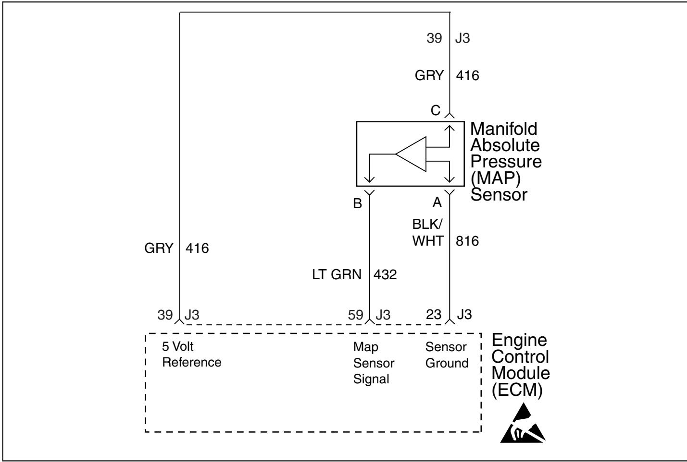

# **Diagnostic Information and Procedures**

# **SPN 106, FMI 3 MAP Sensor High**

# **Circuit Description**

The manifold absolute pressure (MAP) sensor responds to pressure changes in the intake manifold (Vacuum). The pressure changes occur based on the engine load. The MAP sensor has the following circuits:

- 5-volt reference circuit
- Low reference circuit
- MAP sensor signal circuit

The engine control module (ECM) supplies 5 volts to the MAP sensor on the 5-volt reference circuit. The ECM also provides a ground on the low reference circuit. The MAP sensor provides a signal to the ECM on the MAP sensor signal circuit which is relative to the pressure changes in the manifold. The ECM should detect a low signal voltage about 1.0-1.5 volts at a low MAP, such as during an idle or a deceleration. The ECM should detect a high signal voltage about 4.0-4.5 volts at a high MAP, such as the ignition is ON, with the engine OFF, or at a wide open throttle (WOT). The MAP sensor is also used in order to determine the barometric pressure (BARO). This occurs when the ignition switch is turned ON, with the engine OFF. The BARO reading may also be updated whenever the engine is operated at WOT. The ECM monitors the MAP sensor signal for voltage outside of the normal range.

If the ECM detects a MAP sensor signal voltage that is excessively high, this DTC will set.

# **DTC Descriptor**

This diagnostic procedure supports the following DTC: SPN 106 FMI 3 MAP Sensor High

{159}------------------------------------------------

# **Conditions for Running the DTC**

- The throttle angle is less than 20 percent when the engine speed is more than 600 RPM.
- The above conditions are present for 5 seconds.
- SPN 106 FMI 3 runs continuously when the above conditions are met.

# **Conditions for Setting the DTC**

The ECM detects that the MAP sensor voltage is more than 4.9 volts for more than 4 seconds.

# **Action Taken When the DTC Sets**

- The control module illuminates the malfunction indicator lamp (MIL) when the diagnostic runs and fails.
- The control module records the DTC at the time the diagnostic fails.
- The ECM operates with a default MAP reading, which varies based on throttle angle.

# **Conditions for Clearing the MIL/DTC**

 • The control module turns OFF the malfunction indicator lamp (MIL) after consecutive ignition cycle that the diagnostic runs and does not fail.

- A current DTC, Last Test Failed, clears when the diagnostic runs and passes.
- A history DTC clears after 25 consecutive warm-up cycles, if no failures are reported by this or any other emission related diagnostic.
- Clear the MIL and the DTC with a scan tool.

# **Diagnostic Aids**

- Inspect for any vacuum leaks.
- This DTC may set as the result of a misfire.
- This DTC may set as the result of improper tension or alignment of the timing chain.
- If this DTC is determined to be intermittent, refer to Testing for Intermittent Conditions and Poor Connections.

| Step                                                                                                                                                                    | Action                                                                                                                                                                                                                                                                                                                                                                                                      | Values                  | Yes          | No                                  |
|-------------------------------------------------------------------------------------------------------------------------------------------------------------------------|-------------------------------------------------------------------------------------------------------------------------------------------------------------------------------------------------------------------------------------------------------------------------------------------------------------------------------------------------------------------------------------------------------------|-------------------------|--------------|-------------------------------------|
| Schematic Reference: Engine Controls Schematics Connector End View Reference: Engine Control Module (ECM) Connector End Views or Engine Controls Connector End Views |                                                                                                                                                                                                                                                                                                                                                                                                             |                         |              |                                     |
| 1                                                                                                                                                                       | Did you perform the "On-Board Diagnostic" (OBD) System Check?                                                                                                                                                                                                                                                                                                                                               | —                       | Go to Step♦2 | Go to Diagnostic System Check |
| 2                                                                                                                                                                       | Attempt to start the engine. Does the engine start and run?                                                                                                                                                                                                                                                                                                                                              | —                       | Go to Step♦3 | Go to Step♦4                        |
| 3                                                                                                                                                                       | 1. Install a vacuum gauge to a manifold vacuum source. 2. Start the engine and increase engine speed to about 1000 RPM in neutral. 3. Vacuum reading should be steady. Is the vacuum gauge reading steady and above the specified value                                                                                                                                                            | 14" Hg (45.5 kPa) | Go to Step♦6 | Go to Step♦5                        |
| 4                                                                                                                                                                       | 1. Turn OFF the ignition. 2. Remove the MAP sensor from the intake manifold. Refer to Manifold Absolute Pressure (MAP) Sensor Replacement. Leave the electrical harness connected. 3. Connect a J 23738-A Mityvac to the MAP sensor. 4. Apply vacuum until 5♦inch♦Hg is reached. 5. Observe the MAP Sensor parameter with the scan tool. Is the voltage more than the specified value? | 4.9♦V                   | Go to Step♦6 | Go to Diagnostic Aids            |
| 5                                                                                                                                                                       | 1. Start the engine and increase engine speed to about 1000 RPM in neutral. 2. Observe the manifold absolute pressure (MAP) sensor parameter with a scan tool. Is the voltage more than the specified value?                                                                                                                                                                                       | 4 V                     | Go to Step♦6 | Go to Diagnostic Aids            |

{160}------------------------------------------------

|    | Inspect for the following conditions: • Disconnected, damaged, or incorrectly routed vacuum hoses                                                                                                                                                                                                                                                                                                                                                                                            |       |                                                                                |               |
|----|----------------------------------------------------------------------------------------------------------------------------------------------------------------------------------------------------------------------------------------------------------------------------------------------------------------------------------------------------------------------------------------------------------------------------------------------------------------------------------------------------|-------|--------------------------------------------------------------------------------|---------------|
| 6  | • The MAP sensor disconnected from the vacuum source • Restrictions in the MAP sensor vacuum source                                                                                                                                                                                                                                                                                                                                                                                       | —     |                                                                                |               |
|    | • Intake manifold vacuum leaks Did you find and correct the condition?                                                                                                                                                                                                                                                                                                                                                                                                                       |       | Go to Step♦17                                                                  | Go to Step♦7  |
| 7  | 1. Turn OFF the ignition. 2. Turn ON the ignition, with the engine OFF. 3. Monitor the Diagnostic Trouble Code (DTC) Information with the scan tool. Are there any other sensor high or out of range codes also set?                                                                                                                                                                                                                                                                      | —     | Go to Step♦9                                                                   | Go to Step♦8  |
| 8  | 1. Disconnect the MAP sensor electrical connector. 2. Observe the MAP sensor parameter with the scan tool. Is the voltage less than the specified value?                                                                                                                                                                                                                                                                                                                                     | 0.1♦V | Go to Step♦10                                                                  | Go to Step♦11 |
| 9  | 1. Disconnect the MAP sensor electrical connector. 2. Observe the MAP sensor parameter with the scan tool. Is the voltage less than the specified value?                                                                                                                                                                                                                                                                                                                                     | 0.1♦V | Go to Step♦10 Focus on low ref. which DTC is effecting the circuit | Go to Step♦11 |
| 10 | 1. Unless already done, remove the MAP sensor from the intake manifold. Refer to Manifold Absolute Pressure (MAP) Sensor Replacement. 2. Connect a jumper wire between each of the terminals in the MAP sensor harness connector and the corresponding terminal at the MAP sensor. Refer to Using Connector Test Adapters. 3. Measure the voltage from the low reference circuit of the MAP sensor at the jumper wire terminal to a good ground with the DMM. Refer to Measuring | 0.2♦V |                                                                                |               |
|    | Voltage Drop. Is the voltage more than the specified value?                                                                                                                                                                                                                                                                                                                                                                                                                                     |       | Go to Step♦12                                                               | Go to Step♦13 |
| 11 | Test the MAP sensor signal circuit between the engine control module (ECM) and the MAP sensor for a short to voltage. Refer to Circuit Testing and Wiring Repairs. Did you find and correct the condition?                                                                                                                                                                                                                                                                                | —     | Go to Step♦17                                                                  | Go to Step♦16 |
| 12 | Test the low reference circuit between the ECM and the MAP sensor for high resistance or for an open. Refer to Circuit Testing and Wiring Repairs. Did you find and correct the condition?                                                                                                                                                                                                                                                                                                   | —     | Go to Step♦17                                                                  | Go to Step♦14 |
| 13 | Inspect for an intermittent and for a poor connection at the MAP sensor. Refer to Testing for Intermittent Conditions and Poor Connections and Connector Repairs. Did you find and correct the condition?                                                                                                                                                                                                                                                                                 | —     | Go to Step♦17                                                                  | Go to Step♦15 |
| 14 | Inspect for an intermittent and for a poor connection at the ECM. Refer to Testing for Intermittent Conditions and Poor Connections and Connector Repairs. Did you find and correct the condition?                                                                                                                                                                                                                                                                                        | —     | Go to Step♦17                                                                  | Go to Step♦16 |
| 15 | Replace the MAP sensor. Refer to Manifold Absolute Pressure (MAP) Sensor Replacement. Did you complete the replacement?                                                                                                                                                                                                                                                                                                                                                                      | —     | Go to Step♦17                                                                  | —             |
| 16 | Replace the ECM. Refer to Control Module References for replacement, setup, and programming. Did you complete the replacement?                                                                                                                                                                                                                                                                                                                                                               | —     | Go to Step♦17                                                                  | —             |
| 17 | 1. Clear the DTCs with a scan tool. 2. Turn OFF the ignition for 30♦seconds. 3. Start the engine. 4. Operate the vehicle within the Conditions for Running the DTC. Did the DTC fail this ignition?                                                                                                                                                                                                                                                                                    | —     | Go to Step♦2                                                                   | Go to Step♦18 |
| 18 | Observe the Capture Info with a scan tool. Are there any DTCs that have not been diagnosed?                                                                                                                                                                                                                                                                                                                                                                                                     | —     | Go to Diagnostic Trouble Code (DTC) List                              | System OK     |

{161}------------------------------------------------

**This page left intentionally blank**

{162}------------------------------------------------

# Manifold Absolute Pressure Sensor

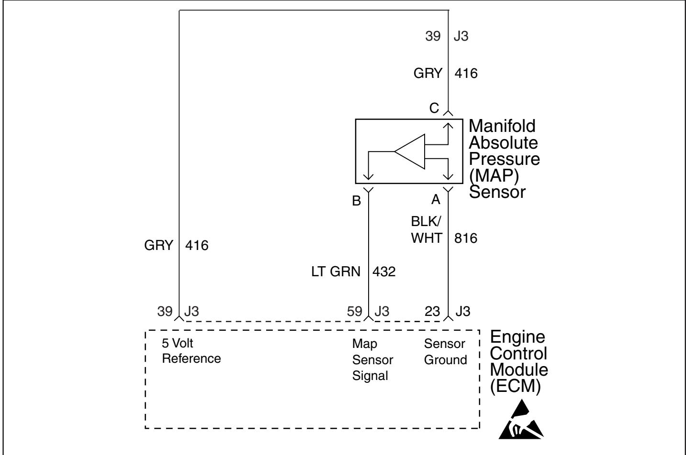

# **Diagnostic Information and Procedures**

# **SPN 106, FMI 4 MAP Sensor Low**

# **Circuit Description**

The manifold absolute pressure (MAP) sensor responds to pressure changes in the intake manifold (Vacuum). The pressure changes occur based on the engine load. The MAP sensor has the following circuits:

- 5-volt reference circuit
- Low reference circuit
- MAP sensor signal circuit

The engine control module (ECM) supplies 5 volts to the MAP sensor on the 5-volt reference circuit. The ECM also provides a ground on the low reference circuit. The MAP sensor provides a signal to the ECM on the MAP sensor signal circuit which is relative to the pressure changes in the manifold. The ECM should detect a low signal voltage about 1.0-1.5 volts at a low MAP, such as during an idle or a deceleration. The ECM should detect a high signal voltage about 4.0-4.5 volts at a high MAP, such as the ignition is ON, with the engine OFF, or at a wide open throttle (WOT). The MAP sensor is also used in order to determine the barometric pressure (BARO). This occurs when the ignition switch is turned ON, with the engine OFF. The BARO reading may also be updated whenever the engine is operated at WOT. The ECM monitors the MAP sensor signal for voltage outside of the normal range.

If the ECM detects a MAP sensor signal voltage that is excessively low, this DTC will set.

# **DTC Descriptor**

This diagnostic procedure supports the following DTC: SPN 106 FMI 4 MAP Sensor Low

{163}------------------------------------------------

# **Conditions for Running the DTC**

- The engine is running.
- When the engine speed is less than 300 RPM.

#### OR

- The throttle angle is more than 50 percent
- The above conditions are present for 0.5 seconds.
- SPN 106 FMI 4 runs continuously when the above conditions are met.

# **Conditions for Setting the DTC**

The ECM detects that the MAP sensor voltage is less than 0.06 volt for more than 4 seconds.

# **Action Taken When the DTC Sets**

- The control module illuminates the malfunction indicator lamp (MIL) when the diagnostic runs and fails.
- The control module records the DTC at the time the diagnostic fails.
- The ECM operates with a default MAP reading, which varies based on throttle angle.

# **Conditions for Clearing the MIL/DTC**

 • The control module turns OFF the malfunction indicator lamp (MIL) after consecutive ignition cycle that the diagnostic runs and does not fail.

- A current DTC, Last Test Failed, clears when the diagnostic runs and passes.
- A history DTC clears after 25 consecutive warm-up cycles, if no failures are reported by this or any other emission related diagnostic.
- Clear the MIL and the DTC with a scan tool.

# **Diagnostic Aids**

• If this DTC is determined to be intermittent, refer to Testing for Intermittent Conditions and Poor Connections.

| Step                                                                                                                                                                    | Action                                                                                                                                                                                                                                            | Values                  | Yes                                                                                     | No                                             |  |
|-------------------------------------------------------------------------------------------------------------------------------------------------------------------------|---------------------------------------------------------------------------------------------------------------------------------------------------------------------------------------------------------------------------------------------------|-------------------------|-----------------------------------------------------------------------------------------|------------------------------------------------|--|
| Schematic Reference: Engine Controls Schematics Connector End View Reference: Engine Control Module (ECM) Connector End Views or Engine Controls Connector End Views |                                                                                                                                                                                                                                                   |                         |                                                                                         |                                                |  |
| 1                                                                                                                                                                       | Did you perform the "On-Board Diagnostic" (OBD) System Check?                                                                                                                                                                                     | —                       | Go to Step♦2                                                                            | Go to Diagnostic System Check            |  |
| 2                                                                                                                                                                       | 1. Turn ON the ignition, with the engine OFF. 2. Monitor the Diagnostic Trouble Code (DTC) Information with the scan tool. Are there any other sensor low or out of range codes also set?                                                   | —                       | Go to Step 3 or Focus on 5 volt ref. which DTC is effecting 5 v circuit. | Go to Step♦3                                   |  |
| 3                                                                                                                                                                       | Observe the manifold absolute pressure (MAP) sensor parameter with the scan tool. Is the voltage less than the specified value?                                                                                                             | 0.1♦V                   | Go to Step♦5                                                                            | Go to Step♦4                                   |  |
| 4                                                                                                                                                                       | 1. Install a vacuum gauge to a manifold vacuum source. 2. Start the engine and increase engine speed to about 1000 RPM in neutral. 3. Vacuum reading should be steady. Is the vacuum gauge reading steady and above the specified value? | 14" Hg (45.5 kPa) | Go to Step♦5                                                                            | Repair low or unsteady vacuum problem |  |

{164}------------------------------------------------

# **5 - 92 Section 5 - Diagnosis**

| 5  | 1. Turn OFF the ignition. 2. Disconnect the MAP sensor electrical connector. 3. Turn ON the ignition, with the engine OFF. Important: Certain resistances will not be detectable if a test lamp is not connected to provide a circuit load. 4. Connect a test lamp between the MAP sensor 5-volt reference circuit and a good ground. 5. Measure the voltage from the 5-volt reference circuit of the MAP sensor to a good ground, with a DMM, at the MAP sensor connector. Refer to Circuit Testing. Is the voltage more than the specified value? | 4.8♦V | Go to Step♦6                                      | Go to Step♦7  |
|----|-----------------------------------------------------------------------------------------------------------------------------------------------------------------------------------------------------------------------------------------------------------------------------------------------------------------------------------------------------------------------------------------------------------------------------------------------------------------------------------------------------------------------------------------------------------------------------------|-------|---------------------------------------------------|---------------|
| 6  | 1. Connect a 3-amp fused jumper wire between the 5-volt reference circuit of the MAP sensor and the signal circuit of the MAP sensor. 2. Observe the MAP sensor parameter with the scan tool. Is the voltage more than the specified value?                                                                                                                                                                                                                                                                                                                              | 4.9♦V | Go to Step♦9                                      | Go to Step♦8  |
| 7  | Test the 5-volt reference circuit between the engine control module (ECM) and the MAP sensor for an open or high resistance. Refer to Circuit Testing and Wiring Repairs. Did you find and correct the condition?                                                                                                                                                                                                                                                                                                                                                        | —     | Go to Step♦13                                     | Go to Step♦10 |
| 8  | Test the MAP sensor signal circuit between the ECM and the MAP sensor for a short to ground or an open. Refer to Circuit Testing and Wiring Repairs. Did you find and correct the condition?                                                                                                                                                                                                                                                                                                                                                                                | —     | Go to Step♦13                                     | Go to Step♦10 |
| 9  | Test for an intermittent and for a poor connection at the MAP sensor. Refer to Testing for Intermittent Conditions and Poor Connections and Connector Repairs. Did you find and correct the condition?                                                                                                                                                                                                                                                                                                                                                                   | —     | Go to Step♦13                                     | Go to Step♦11 |
| 10 | Test for an intermittent and for a poor connection at the ECM. Refer to Testing for Intermittent Conditions and Poor Connections and Connector Repairs. Did you find and correct the condition?                                                                                                                                                                                                                                                                                                                                                                             | —     | Go to Step♦13                                     | Go to Step♦12 |
| 11 | Replace the MAP sensor. Refer to Manifold Absolute Pressure (MAP) Sensor Replacement. Did you complete the replacement?                                                                                                                                                                                                                                                                                                                                                                                                                                                     | —     | Go to Step♦13                                     | —             |
| 12 | Replace the ECM. Refer to Control Module References for replacement, setup, and programming. Did you complete the replacement?                                                                                                                                                                                                                                                                                                                                                                                                                                              | —     | Go to Step♦13                                     | —             |
| 13 | 1. Clear the DTCs with a scan tool. 2. Turn OFF the ignition for 30♦seconds. 3. Start the engine. 4. Operate the vehicle within the Conditions for Running the DTC. Did the DTC fail this ignition?                                                                                                                                                                                                                                                                                                                                                                   | —     | Go to Step♦2                                      | Go to Step♦14 |
| 14 | Observe the Capture Info with a scan tool. Are there any DTCs that have not been diagnosed?                                                                                                                                                                                                                                                                                                                                                                                                                                                                                    | —     | Go to Diagnostic Trouble Code (DTC) List | System OK     |

{165}------------------------------------------------

**This page left intentionally blank**

{166}------------------------------------------------

# Engine Coolant Temperature Sensor

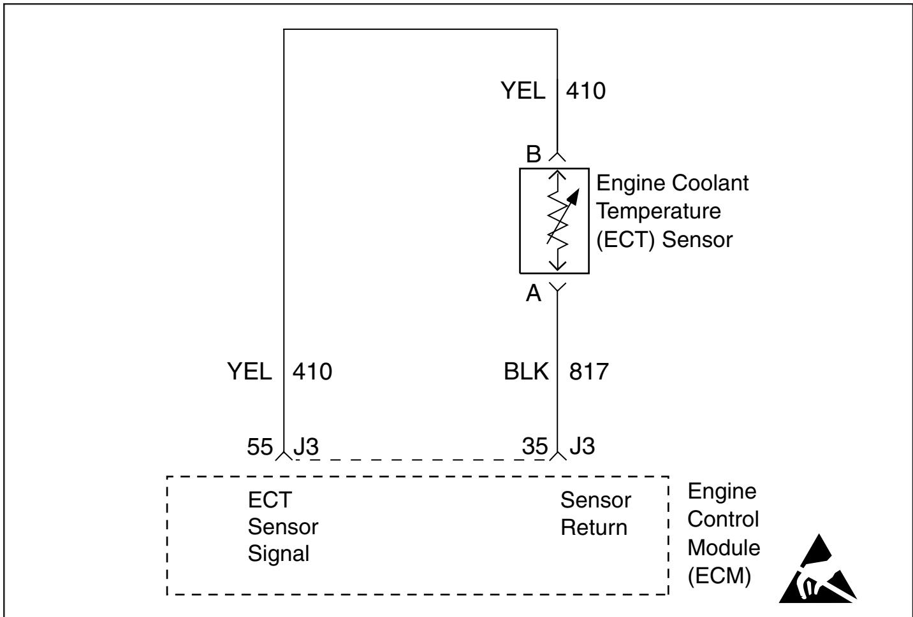

# **Diagnostic Information and Procedures**

# **SPN 110, FMI 3 Coolant Sensor High (ECT Sensor Circuit High Voltage / Low Temperature) Circuit Description**

The engine coolant temperature (ECT) sensor is a variable resistor that measures the temperature of the engine coolant. The ECT sensor has a signal circuit and a low reference circuit. The engine control module (ECM) supplies 5 volts to the ECT signal circuit and a ground for the ECT low reference circuit. When the ECT is cold, the sensor resistance is high. When the ECT increases, the sensor resistance decreases. With high sensor resistance, the ECM detects a high voltage on the ECT signal circuit. With lower sensor resistance, the ECM detects a lower voltage on the ECT signal circuit. If the ECM detects an excessively high ECT signal voltage, which is a low temperature indication, SPN 110, FMI 3 sets.

# **DTC Descriptor**

This diagnostic procedure supports the following DTC: SPN 110, FMI 3 Coolant Sensor High

# **Conditions for Running the DTC**

- The engine has been running for more than 10 seconds.
- SPN 110, FMI 3 runs continuously when the above condition is met.

# **Conditions for Setting the DTC**

The ECM detects that the ECT sensor parameter is less than −31°C (−24°F) for approximately 3 seconds. Note: Exact temperature and duration may vary depending on ECM calibration.

{167}------------------------------------------------

# **Action Taken When the DTC Sets**

• The control module illuminates the malfunction indicator lamp (MIL) when the diagnostic runs and fails.

# **Conditions for Clearing the MIL/DTC**

 • The control module turns OFF the malfunction indicator lamp (MIL) when the diagnostic runs and does not fail. After the diagnostic runs and passes, there may be a timed delay before the malfunction indicator lamp (MIL) turns OFF.

• An active DTC clears when the diagnostic runs and passes.

 • A history DTC clears after 25 consecutive run cycles, if no failures are reported by this or any other emission related diagnostic. Each run cycle must last a minimum of 10 seconds.

• Clear the MIL and the DTC with a scan tool.

# **Diagnostic Aids**

- If a short to a separate 5-volt source occurs, this DTC may set.
- After starting the engine, the ECT should rise steadily, then stabilize near the thermostat opening temperature.
- Use the Temperature vs. Resistance table to test the ECT sensor. A skewed sensor could result in poor driveability

conditions. Refer to Temperature vs Resistance (Page 5-52).

 • If the condition is suspected of being intermittent, refer to Testing for Intermittent Conditions and Poor Connections (Page 5-3).

| Step                                                                                                                                                                    | Action                                                                                                                                                                                                                                                                                                                                                                                                                                         | Values                             | Yes           | No                                  |  |
|-------------------------------------------------------------------------------------------------------------------------------------------------------------------------|------------------------------------------------------------------------------------------------------------------------------------------------------------------------------------------------------------------------------------------------------------------------------------------------------------------------------------------------------------------------------------------------------------------------------------------------|------------------------------------|---------------|-------------------------------------|--|
| Schematic Reference: Engine Controls Schematics Connector End View Reference: Engine Control Module (ECM) Connector End Views or Engine Controls Connector End Views |                                                                                                                                                                                                                                                                                                                                                                                                                                                |                                    |               |                                     |  |
| 1                                                                                                                                                                       | Did you perform the "On-Board Diagnostic" (OBD) System Check?                                                                                                                                                                                                                                                                                                                                                                                  | —                                  | Go to Step♦2  | Go to Diagnostic System Check |  |
| 2                                                                                                                                                                       | Observe the ECT sensor parameter with a scan tool. Is the ECT sensor parameter less than the specified value? (Sensor resistance greater than the specified value?) If the indicated temperature is set at a default value, use the sensor resistance value for this step.                                                                                                                                                         | −31°C (−24°F) 57,300 Ohms | Go to Step♦4  | Go to Step♦3                        |  |
| 3                                                                                                                                                                       | 1. Observe the Conditions for Running this DTC. 2. Turn OFF the ignition for 30♦seconds. 3. Start the engine. 4. Operate the engine within the Conditions for Running the DTC. Did the DTC fail this ignition?                                                                                                                                                                                                                     | —                                  | Go to Step♦4  | Go to Diagnostic Aids            |  |
| 4                                                                                                                                                                       | 1. Disconnect the ECT sensor. 2. Measure the voltage from the signal circuit of the ECT sensor to a good ground with a DMM. Refer to Circuit Testing and Wiring Repairs. Is the voltage more than the specified value?                                                                                                                                                                                                                | 5.2♦V                              | Go to Step♦5  | Go to Step♦6                        |  |
| 5                                                                                                                                                                       | Important: If a short to voltage occurs, the ECT sensor may be damaged. Test the ECT signal circuit for a short to voltage. Refer to Circuit Testing and Wiring Repairs. Did you find and correct the condition?                                                                                                                                                                                                                      | —                                  | Go to Step♦15 | Go to Step♦12                       |  |
| 6                                                                                                                                                                       | 1. Connect a 3-amp fused jumper between the signal circuit of the ECT sensor and the low reference circuit. Refer to Using Fused Jumper Wires . 2. Observe the ECT sensor parameter with the scan tool. Is the ECT sensor parameter more than the specified value? (Sensor resistance less than the specified value?) If the indicated temperature is set at a default value, use the sensor resistance value for this step. | 150°C (302°F) 47 Ohms        | Go to Step♦10 | Go to Step♦7                        |  |

{168}------------------------------------------------

| 7 | 1. Connect a 3-amp fused jumper between the signal circuit of the ECT sensor and a good ground. 2. Observe the ECT sensor parameter with a scan tool. Is the ECT sensor parameter more than the specified value? (Sensor resistance less than the specified value?) If the indicated temperature is set at a default value, use the sensor resistance value for this step. | 150°C (302°F) 47 Ohms | Go to Step♦9  | Go to Step♦8  |
|---|----------------------------------------------------------------------------------------------------------------------------------------------------------------------------------------------------------------------------------------------------------------------------------------------------------------------------------------------------------------------------------------------|-----------------------------|---------------|---------------|
| 8 | Test the signal circuit of the ECT sensor for a high resistance or an open. Refer to Circuit Testing and Wiring Repairs. Did you find and correct the condition?                                                                                                                                                                                                                       | —                           | Go to Step♦15 | Go to Step♦12 |
| 9 | Test the low reference circuit of the ECT sensor for a high resistance or an open. Refer to Circuit Testing and Wiring Repairs. Did you find and correct the condition?                                                                                                                                                                                                                | —                           | Go to Step♦15 | Go to Step♦12 |

#### **Temperature vs Resistance Reference Chart**

| C                                              | F   | OHMS   |  |  |
|------------------------------------------------|-----|--------|--|--|
| Temperature vs Resistance Values (Approximate) |     |        |  |  |
| 150                                            | 302 | 47     |  |  |
| 140                                            | 284 | 60     |  |  |
| 130                                            | 266 | 77     |  |  |
| 120                                            | 248 | 100    |  |  |
| 110                                            | 230 | 132    |  |  |
| 100                                            | 212 | 177    |  |  |
| 90                                             | 194 | 241    |  |  |
| 80                                             | 176 | 332    |  |  |
| 70                                             | 158 | 467    |  |  |
| 60                                             | 140 | 667    |  |  |
| 50                                             | 122 | 973    |  |  |
| 45                                             | 113 | 1188   |  |  |
| 40                                             | 104 | 1459   |  |  |
| 35                                             | 95  | 1802   |  |  |
| 30                                             | 86  | 2238   |  |  |
| 25                                             | 77  | 2796   |  |  |
| 20                                             | 68  | 3520   |  |  |
| 15                                             | 59  | 4450   |  |  |
| 10                                             | 50  | 5670   |  |  |
| 5                                              | 41  | 7280   |  |  |
| 0                                              | 32  | 9420   |  |  |
| -5                                             | 23  | 12300  |  |  |
| -10                                            | 14  | 16180  |  |  |
| -15                                            | 5   | 21450  |  |  |
| -20                                            | -4  | 28680  |  |  |
| -30                                            | -22 | 52700  |  |  |
| -40                                            | -40 | 100700 |  |  |

{169}------------------------------------------------

**This page left intentionally blank**

{170}------------------------------------------------

# Engine Coolant Temperature Sensor

# **Diagnostic Information and Procedures**

# **SPN 110, FMI 4 Coolant Sensor Low (ECT Sensor Circuit Low Voltage / High Temperature) Circuit Description**

The engine coolant temperature (ECT) sensor is a variable resistor that measures the temperature of the engine coolant. The engine control module (ECM) supplies 5 volts to the ECT signal circuit and a ground for the ECT low reference circuit. When the ECT is cold, the sensor resistance is high. When the ECT increases, the sensor resistance decreases. With high sensor resistance, the ECM detects a high voltage on the ECT signal circuit. With lower sensor resistance, the ECM detects a lower voltage on the ECT signal circuit. If the ECM detects an excessively low ECT signal voltage, which is a high temperature indication, SPN 110, FMI 4 sets.

# **DTC Descriptor**

This diagnostic procedure supports the following DTC: SPN 110, FMI 4 Coolant Sensor Low

# **Conditions for Running the DTC**

- The engine run time is more than 10 seconds.
- SPN 110, FMI 4 runs continuously when the above condition is met.

# **Conditions for Setting the DTC**

The ECT sensor temperature is more than 150°C (302°F) for more than approximately 3 seconds. Note: Exact temperature and duration may vary depending on ECM calibration.

# **Action Taken When the DTC Sets**

• The control module illuminates the malfunction indicator lamp (MIL) when the diagnostic runs and fails.

{171}------------------------------------------------

# **Conditions for Clearing the MIL/DTC**

 • The control module turns OFF the malfunction indicator lamp (MIL) when the diagnostic runs and does not fail. After the diagnostic runs and passes, there may be a timed delay before the malfunction indicator lamp (MIL) turns OFF.

- An active DTC clears when the diagnostic runs and passes.
- A history DTC clears after 25 consecutive run cycles, if no failures are reported by this or any other emission related diagnostic. Each run cycle must last a minimum of 10 seconds.
- Clear the MIL and the DTC with a scan tool.

# **Diagnostic Aids**

- An overheating condition may cause this DTC to set.
- After starting the engine, the ECT should rise steadily, then stabilize near the thermostat opening temperature.

 • Use the Temperature vs. Resistance table to test the ECT sensor at various temperature levels to evaluate the possibility of a skewed sensor. A skewed sensor could result in poor driveability concerns. Refer to Temperature vs Resistance (Page 5-52).

 • If the condition is suspected of being intermittent, refer to Testing for Intermittent Conditions and Poor Connections (Page 5-2).

| Step                                                                                                                                                                    | Action                                                                                                                                                                                                                                                                                                                     | Values                             | Yes              | No                                  |
|-------------------------------------------------------------------------------------------------------------------------------------------------------------------------|----------------------------------------------------------------------------------------------------------------------------------------------------------------------------------------------------------------------------------------------------------------------------------------------------------------------------|------------------------------------|------------------|-------------------------------------|
| Schematic Reference: Engine Controls Schematics Connector End View Reference: Engine Control Module (ECM) Connector End Views or Engine Controls Connector End Views |                                                                                                                                                                                                                                                                                                                            |                                    |                  |                                     |
| 1                                                                                                                                                                       | Did you perform the "On-Board Diagnostic" (OBD) System Check?                                                                                                                                                                                                                                                              | —                                  | Go to Step♦2     | Go to Diagnostic System Check |
| 2                                                                                                                                                                       | Observe the ECT sensor parameter with a scan tool. Is the ECT sensor parameter more than the specified value? (Sensor resistance less than the specified value?) If the indicated temperature is set at a default value, use the sensor resistance value for this step.                                        | 150°C (302°F) 47 Ohms        | Go to Step♦4     | Go to Step♦3                        |
| 3                                                                                                                                                                       | 1. Observe the Conditions for Running this DTC. 2. Turn OFF the ignition for 30 seconds. 3. Start the engine. 4. Operate the engine within the Conditions for Running the DTC. Did the DTC fail this ignition?                                                                                                 | —                                  | Go to Step♦4     | Go to Diagnostic Aids            |
| 4                                                                                                                                                                       | 1. Disconnect the ECT sensor. 2. Observe the ECT sensor parameter with a scan tool. Is the ECT sensor parameter less than the specified value? (Sensor resistance greater than the specified value?) If the indicated temperature is set at a default value, use the sensor resistance value for this step. | −31°C (−24°F) 57,300 Ohms | Go to Step♦6     | Go to Step♦5                        |
| 5                                                                                                                                                                       | Test the signal circuit of the ECT sensor for a short to ground or a short to the ECT low reference circuit. Refer to Circuit Testing and Wiring Repairs. Did you find and correct the condition?                                                                                                                    | —                                  | Go to Step♦10 | Go to Step♦8                        |
| 6                                                                                                                                                                       | Test for an intermittent and for a poor connection at the ECT sensor. Refer to Testing for Intermittent Conditions and Poor Connections and Connector Repairs. Did you find and correct the condition?                                                                                                            | —                                  | Go to Step♦10 | Go to Step♦7                        |
| 7                                                                                                                                                                       | Replace the ECT sensor. Refer to Engine Coolant Temperature (ECT) Sensor Replacement. Did you complete the replacement?                                                                                                                                                                                              | —                                  | Go to Step♦10 | —                                   |
| 8                                                                                                                                                                       | Test for an intermittent and for a poor connection at the ECM. Refer to Testing for Intermittent Conditions and Poor Connections and Connector Repairs. Did you find and complete the replacement?                                                                                                                   | —                                  | Go to Step♦10 | Go to Step♦9                        |

{172}------------------------------------------------

#### **5 - 100 Section 5 - Diagnosis**

| 9  | Replace the ECM. Refer to Control Module References for replacement, setup, and programming. Did you complete the replacement?                                                                           | — | Go to Step♦10                                  | —             |
|----|----------------------------------------------------------------------------------------------------------------------------------------------------------------------------------------------------------------|---|---------------------------------------------------|---------------|
| 10 | 1. Clear the DTCs with a scan tool. 2. Turn OFF the ignition for 30♦seconds. 3. Start the engine. 4. Operate the engine within the Conditions for Running the DTC. Did the DTC fail this ignition? | — | Go to Step♦2                                      | Go to Step♦11 |
| 11 | Observe the Capture Info with a scan tool. Are there any DTCs that have not been diagnosed?                                                                                                                 | — | Go to Diagnostic Trouble Code (DTC) List | System OK     |

{173}------------------------------------------------

**This page left intentionally blank**

{174}------------------------------------------------

# **Diagnostic Information and Procedures**

# **SPN 630, FMI 13 Cal Memory Failure**

# **Description**

This Test allows the ECM to check for a calibration failure by comparing the calibration value to a known value stored in the EEPROM. This test is also used as a security measure to prevent improper use of the calibration or changes to these calibrations that may alter the designed function of MEFI. This diagnostic also addresses whether or not the ECM is programmed.

# **DTC Descriptors**

This diagnostic procedure supports the following DTC: SPN 630 FMI 13 Cal Memory Failure

# **Conditions for Running the DTC**

- The ignition switch is in the Run or the Crank position.
- The ignition voltage is more than 5 volts.
- SPN 630 FMI 13 runs continuously when the above condition is met.

# **Conditions for Setting the DTC**

The ECM detects an internal failure or incomplete programming for more than 14 seconds.

# **Action Taken When the DTC Sets**

- The control module illuminates the malfunction indicator lamp (MIL) when the diagnostic runs and fails.
- The control module records the operating conditions at the time the diagnostic fails.

{175}------------------------------------------------

# **Conditions for Clearing the MIL/DTC**

- A current DTC Last Test Failed clears when the diagnostic runs and passes.
- A history DTC clears after 25 consecutive warm-up cycles, if no failures are reported by this or any other non-

emission related diagnostic.

• Clear the DTC with a scan tool.

# **Test Description**

The number below refers to the step number on the diagnostic table.

**2.** This step check indicates the ECM needs to programmed or replaced.

| Step | Action                                                                                                                                                                                                                                                                                      | Yes                                            | No                               |
|------|---------------------------------------------------------------------------------------------------------------------------------------------------------------------------------------------------------------------------------------------------------------------------------------------|------------------------------------------------|----------------------------------|
| 1    | Did you perform the "On-Board Diagnostic" (OBD) System Check?                                                                                                                                                                                                                               | Go to Step♦2                                   | Go to Diagnostic System Check |
| 2    | Is SPN 630 FMI 13 set?                                                                                                                                                                                                                                                                      | Go to Step♦3                                   | Go to Step♦5                     |
| 3    | Program the engine control module (ECM). Refer to Service Programming System (SPS). Does SPN 630 reset?                                                                                                                                                                               | Go to Step♦4                                   | Go to Step♦7                     |
| 4    | 1. Ensure that all tool connections are secure. 2. Ensure that the programming equipment is operating correctly. 3. Ensure that the correct software/calibration package is used. 4. Attempt to program the ECM. Refer to Service Programming System (SPS). Does SPN 630 reset? | Go to Step♦5                                   | Go to Step♦7                     |
| 5    | Test all voltage and ground inputs to the ECM for an open circuit or high resistance. Refer to Circuit Testing and Wiring Repairs. Did you find and correct the condition?                                                                                                            | Go to Step♦7                                   | Go to Step♦6                     |
| 6    | Replace the ECM. Refer to Control Module References for replacement, setup, and programming. Did you complete the replacement?                                                                                                                                                        | Go to Step♦7                                   | —                                |
| 7    | 1. Clear the DTCs with a scan tool. 2. Turn OFF the ignition for 30 seconds. 3. Start the engine. Did the DTC fail this ignition?                                                                                                                                                  | Go to Step♦2                                   | Go to Step♦8                     |
| 8    | Observe the Capture Info with a scan tool. Are there any DTCs that have not been diagnosed?                                                                                                                                                                                              | Go to Diagnostic Trouble Code (DTC) List | System OK                        |

{176}------------------------------------------------

# **Diagnostic Information and Procedures**

# **SPN 636, FMI 2 Crank Signal Fault**

# **Circuit Description**

The crankshaft position (CKP) sensor works in conjunction with the 4X reluctor trigger wheel on the crankshaft. Each tooth on the reluctor wheel is equally spaced at 4 tooth spacing, for the reference sync pulse. The engine control module (ECM) provides a 5-volt reference to the sensor, as well as a low reference, and a signal circuit. As the crankshaft rotates, the reluctor trigger wheel interrupts a magnetic field produced by a magnet internal to the sensor. The CKP sensor internal circuitry detects this interruption of the magnetic field, and produces an ON/OFF DC voltage of varying frequency. The frequency of the CKP sensor output signal is dependent upon crankshaft speed. The ECM uses each CKP output signal to determine crankshaft speed, identify crankshaft position, and to detect engine misfire. If the ECM detects that there is no output signal from the CKP sensor, then SPN 636, FMI 2 will set.

# **DTC Descriptor**

This diagnostic procedure supports the following DTC: SPN 636, FMI 2 Crank Signal Fault (Crankshaft Position (CKP) Sensor Circuit Signal Fault)

# **Conditions for Running the DTC**

- The engine is cranking or running.
- SPN 636 FMI 2 runs continuously when the above condition is met.

# **Conditions for Setting the DTC**

The ECM detects that there is no signal from the CKP sensor for 3 seconds.

{177}------------------------------------------------

# **Action Taken When the DTC Sets**

 • The control module illuminates the malfunction indicator lamp (MIL) on the second consecutive ignition cycle that the diagnostic runs and fails.

• The control module records the operating conditions at the time the diagnostic fails.

# **Conditions for Clearing the MIL/DTC**

 • The control module turns OFF the malfunction indicator lamp (MIL) after consecutive ignition cycle that the diagnostic runs and does not fail.

• A current DTC, Last Test Failed, clears when the diagnostic runs and passes.

 • A history DTC clears after 25 consecutive warm-up cycles, if no failures are reported by this or any other emission related diagnostic.

• Clear the MIL and the DTC with a scan tool.

# **Diagnostic Aids**

SPN 636, FMI 2 will set with the ignition switch in the Start position, if the starter motor is inoperative, or the starter motor control circuit is inoperative.

# **Test Description**

The numbers below refer to the step numbers on the diagnostic table.

**3.** This step determines if the fault is present.

 **6.** This step simulates a CKP sensor signal to the ECM. If the ECM receives the signal, the fuel pump will operate for about 3 seconds.

| Step                                                                                                                                                                    | Action                                                                                                                                                                                                                                                                                                                                                           | Values | Yes           | No                                                                         |
|-------------------------------------------------------------------------------------------------------------------------------------------------------------------------|------------------------------------------------------------------------------------------------------------------------------------------------------------------------------------------------------------------------------------------------------------------------------------------------------------------------------------------------------------------|--------|---------------|----------------------------------------------------------------------------|
| Schematic Reference: Engine Controls Schematics Connector End View Reference: Engine Control Module (ECM) Connector End Views or Engine Controls Connector End Views |                                                                                                                                                                                                                                                                                                                                                                  |        |               |                                                                            |
| 1                                                                                                                                                                       | Did you perform the "On-Board Diagnostic" (OBD) System Check?                                                                                                                                                                                                                                                                                                    | —      | Go to Step♦2  | Go to Diagnostic System Check                                        |
| 2                                                                                                                                                                       | Attempt to start the engine. Does the engine start and continue to run?                                                                                                                                                                                                                                                                                       | —      | Go to Step♦3  | Go to Step♦4                                                               |
| 3                                                                                                                                                                       | 1. Observe Conditions for Running this DTC. 2. Turn OFF the ignition for 30 seconds. 3. Start the engine. 4. Operate the engine within the conditions for Running the DTC. Did the DTC fail this ignition?                                                                                                                                           | —      | Go to Step 4  | Go to Testing for Intermittent Conditions and Poor Connections |
| 4                                                                                                                                                                       | 1. Disconnect the crankshaft position (CKP) sensor connector. 2. Turn ON the ignition, with the engine OFF. 3. Measure the voltage from the 5-volt reference circuit of the crankshaft position (CKP) sensor to a good ground with a DMM. Refer to Troubleshooting with a Digital Multi-meter Does the voltage measure above the specified value? | 4.8♦V  | Go to Step♦5  | Go to Step♦7                                                               |
| 5                                                                                                                                                                       | Measure the voltage between the 5-volt reference circuit of the CKP sensor and the low reference circuit of the CKP sensor with a DMM. Does the voltage measure above the specified value?                                                                                                                                                                 | 4.8♦V  | Go to Step 6  | Go to Step 8                                                               |
| 6                                                                                                                                                                       | Momentarily connect a test lamp between the CKP sensor signal circuit and the 5-volt reference of the CKP sensor. Does the fuel pump operate when the test lamp is applied to the CKP sensor signal circuit?                                                                                                                                            | —      | Go to Step 10 | Go to Step 9                                                               |
| 7                                                                                                                                                                       | Test the 5-volt reference circuit for the following conditions: • An open • A short to ground • High resistance Refer to Circuit Testing and Wiring Repairs. Did you find and correct condition?                                                                                                                                         | —      | Go to Step 16 | Go to Step 12                                                              |

{178}------------------------------------------------

|    | Test the low reference circuit for the following conditions:                                                                    |   |                            |               |
|----|---------------------------------------------------------------------------------------------------------------------------------|---|----------------------------|---------------|
| 8  | • An open                                                                                                                    |   |                            |               |
|    | • A short to voltage                                                                                                         | — |                            |               |
|    | • High resistance                                                                                                            |   |                            |               |
|    | Refer to Circuit Testing and Wiring Repairs. Did you find and correct the condition?                                         |   | Go to Step♦16           | Go to Step 12 |
|    | Test the CKP sensor signal circuit for the following conditions:                                                                |   |                            |               |
|    | • An open                                                                                                                    |   |                            |               |
|    | • A short to ground                                                                                                          |   |                            |               |
| 9  | • A short to voltage                                                                                                         | — |                            |               |
|    | • High resistance                                                                                                            |   |                            |               |
|    | Refer to Circuit Testing and Wiring Repairs. Did you find and correct the condition?                                         |   | Go to Step♦16           | Go to Step 12 |
|    | 1. Remove the CKP sensor. Refer to Crankshaft Position (CKP) Sensor                                                             |   |                            |               |
|    | Replacement.                                                                                                                    |   |                            |               |
|    | 2. Visually inspect the CKP sensor for the following conditions:                                                                |   |                            |               |
|    | • Physical damage                                                                                                               |   |                            |               |
| 10 | • Loose or improper installation                                                                                                | — |                            |               |
|    | • Wiring routed too closely to the secondary ignition components                                                                |   |                            |               |
|    | 3. The following conditions may cause this DTC to set:                                                                          |   |                            |               |
|    | • Excessive air gap between the CKP sensor and the reluctor wheel • The CKP sensor coming in contact with the reluctor wheel |   |                            |               |
|    | • Foreign material passing between the CKP sensor and the reluctor wheel                                                        |   | Go to                      |               |
|    | Did you find and correct the condition?                                                                                         |   | Step♦16                    | Go to Step♦11 |
|    | Visually inspect the CKP sensor reluctor wheel for the following conditions:                                                    |   |                            |               |
|    | • Loose or improper installation                                                                                             |   |                            |               |
| 11 | • Physical damage                                                                                                            | — |                            |               |
|    | • Excessive end play or looseness Did you find and correct the condition?                                                 |   | Go to Step♦16           | Go to Step♦14 |
|    | Test for poor connections at the CKP sensor. Refer to Testing for Intermittent                                                  |   |                            |               |
| 12 | Conditions and Poor Connections and Wiring Repairs. Did you find and correct the condition?                                  | — | Go to Step♦16           | Go to Step♦13 |
|    | Test for poor connections at the engine control module (ECM). Refer to Testing                                                  |   |                            |               |
| 13 | for Intermittent Conditions and Poor Connections and Wiring Repairs. Did you find and correct the condition?                 | — | Go to Step♦16           | Go to Step♦15 |
| 14 | Replace the CKP sensor. Refer to Crankshaft Position (CKP) Sensor                                                               |   |                            |               |
|    | Replacement. Did you complete the replacement?                                                                               | — | Go to Step♦16           | —             |
| 15 | Replace the ECM. Refer to Control Module References for replacement, setup,                                                     |   |                            |               |
|    | and programming. Did you complete the replacement?                                                                           | — | Go to Step♦16           | —             |
| 16 | 1. Clear the DTCs with a scan tool.                                                                                             |   |                            |               |
|    | 2. Turn OFF the ignition for 30 seconds.                                                                                        |   |                            |               |
|    | 3. Start the engine.                                                                                                            | — |                            |               |
|    | 4. Operate the engine within the Conditions for Running the DTC. Did the DTC fail this ignition?                             |   | Go to Step 2               | Go to Step 17 |
| 17 | Observe the Capture Info with a scan tool.                                                                                      |   | Go to                      |               |
|    | Are there any DTCs that have not been diagnosed?                                                                                | — | Diagnostic Trouble Code |               |
|    |                                                                                                                                 |   | (DTC) List                 | System OK     |

{179}------------------------------------------------

**This page left intentionally blank**

{180}------------------------------------------------

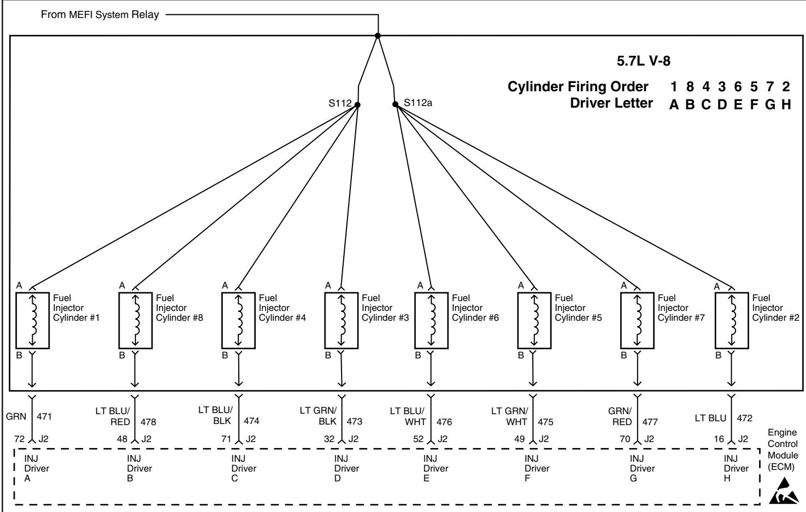

# **Diagnostic Information and Procedures (Need Fuel Injector Circuit Diagram) SPN 651-658 Fuel Injector DTCs (See DTC Descriptors below, for individual codes)**

# **Circuit Description**

The control module enables the appropriate fuel injector on the intake stroke for each cylinder. Ignition voltage is supplied to the fuel injectors. The control module controls each fuel injector by grounding the control circuit via a solid state device called a driver. The control module monitors the status of each driver. If the control module detects an incorrect voltage for the commanded state of the driver, a fuel injector control DTC sets.

# **DTC Descriptors**

This diagnostic procedure supports the following DTCs:

- SPN 651 FMI 3 Inj A Short High (Injector A Circuit High Voltage)
- SPN 651 FMI 4 Inj A Short Low (Injector A Circuit Low Voltage)
- SPN 651 FMI 5 Inj A Open (Injector A Circuit Open)
- SPN 652 FMI 3 Inj B Short High (Injector B Circuit High Voltage)
- SPN 652 FMI 4 Inj B Short Low (Injector B Circuit Low Voltage)
- SPN 652 FMI 5 Inj B Open (Injector B Circuit Open)
- SPN 653 FMI 3 Inj C Short High (Injector C Circuit High Voltage)
- SPN 653 FMI 4 Inj C Short Low (Injector C Circuit Low Voltage)
- SPN 653 FMI 5 Inj C Open (Injector C Circuit Open)

{181}------------------------------------------------

- SPN 654 FMI 3 Inj D Short High (Injector D Circuit High Voltage)
- SPN 654 FMI 4 Inj D Short Low (Injector D Circuit Low Voltage)
- SPN 654 FMI 5 Inj D Open (Injector D Circuit Open)
- SPN 655 FMI 3 Inj E Short High (Injector E Circuit High Voltage)
- SPN 655 FMI 4 Inj E Short Low (Injector E Circuit Low Voltage)
- SPN 655 FMI 5 Inj E Open (Injector E Circuit Open)
- SPN 656 FMI 3 Inj F Short High (Injector F Circuit High Voltage)
- SPN 656 FMI 4 Inj F Short Low (Injector F Circuit Low Voltage)
- SPN 656 FMI 5 Inj F Open (Injector F Circuit Open)
- SPN 657 FMI 3 Inj G Short High (Injector G Circuit High Voltage)
- SPN 657 FMI 4 Inj G Short Low (Injector G Circuit Low Voltage)
- SPN 657 FMI 5 Inj G Open (Injector G Circuit Open)
- SPN 658 FMI 3 Inj H Short High (Injector H Circuit High Voltage)
- SPN 658 FMI 4 Inj H Short Low (Injector H Circuit Low Voltage)
- SPN 658 FMI 5 Inj H Open (Injector H Circuit Open)

**Note:** Injector circuits are named according to the **firing order sequence**.

 In this application, injectors A-B-C-D-E-F-G-H correspond to the firing order of 1-8-4-3-6-5-7-2. Thus, Injector C supplies fuel to cylinder number 4.

# **Conditions for Running the DTC**

- The engine is running (for FMI 3 condition)
- The key is on (for FMI 4 and FMI 5 conditions)
- The ignition voltage is between 6–18 volts.

# **Conditions for Setting the DTC**

• The engine control module (ECM) detects an incorrect voltage on a fuel injector control circuit.

# **Action Taken When the DTC Sets**

• The control module illuminates the malfunction indicator lamp (MIL) when the diagnostic runs and fails.

# **Conditions for Clearing the MIL/DTC**

• The control module turns OFF the malfunction indicator lamp (MIL) when the diagnostic runs and does not fail. After

the diagnostic runs and passes, there may be a timed delay before the malfunction indicator lamp (MIL) turns OFF.

- An active DTC clears when the diagnostic runs and passes.
- A history DTC clears after 25 consecutive run cycles, if no failures are reported by this or any other emission related diagnostic. Each run cycle must last a minimum of 10 seconds.
- Clear the MIL and the DTC with a scan tool.

# **Diagnostic Aids**

- Performing the Fuel Injector Coil Test may help to isolate an intermittent condition. Refer to Fuel Injector Coil Test.
- For an intermittent condition, refer to Testing for Intermittent Conditions and Poor Connections.

{182}------------------------------------------------

# **Test Description**

The numbers below refer to the step numbers on the diagnostic table.

- **4.** This step verifies that the ECM is able to control the fuel injector.
- **5.** This step tests if a ground is constantly being applied to the fuel injector.

| Step                                                                                                                                                                    | Action                                                                                                                                                                                                                                                                                                                                                                                                                                               | Yes           | No                               |  |  |
|-------------------------------------------------------------------------------------------------------------------------------------------------------------------------|------------------------------------------------------------------------------------------------------------------------------------------------------------------------------------------------------------------------------------------------------------------------------------------------------------------------------------------------------------------------------------------------------------------------------------------------------|---------------|----------------------------------|--|--|
| Schematic Reference: Engine Controls Schematics Connector End View Reference: Engine Control Module (ECM) Connector End Views or Engine Controls Connector End Views |                                                                                                                                                                                                                                                                                                                                                                                                                                                      |               |                                  |  |  |
| 1                                                                                                                                                                       | Did you perform the "On-Board Diagnostic" (OBD) System Check?                                                                                                                                                                                                                                                                                                                                                                                        | Go to Step 2  | Go to Diagnostic System Check |  |  |
| 2                                                                                                                                                                       | 1. Observe and record DTC(s). 2. Turn OFF the ignition for 30♦seconds. 3. Start the engine. 4. Did the DTC fail this ignition?                                                                                                                                                                                                                                                                                                              | Go to Step 3  | Go to Diagnostic Aids         |  |  |
| 3                                                                                                                                                                       | 1. Turn OFF the ignition. 2. Disconnect the injector which corresponds to the DTC that has been set. 3. Turn ON the ignition, with the engine OFF. 4. Probe the ignition voltage circuit of the fuel injector with a test lamp that is connected to a good ground. Does the test lamp illuminate?                                                                                                                                     | Go to Step 4  | Go to Step 10                    |  |  |
| 4                                                                                                                                                                       | 1. Connect the J 44603 Fuel Injector Test Lamp between the control circuit of the fuel injector and the ignition voltage circuit of the fuel injector. 2. Start the engine. Does the Fuel Injector Test Lamp flash?                                                                                                                                                                                                                         | Go to Step 8  | Go to Step 5                     |  |  |
| 5                                                                                                                                                                       | Does the Fuel Injector Test Lamp remain illuminated?                                                                                                                                                                                                                                                                                                                                                                                                 | Go to Step 7  | Go to Step 6                     |  |  |
| 6                                                                                                                                                                       | Test the fuel injector control circuit for the following conditions: • A short to voltage • An open • High resistance                                                                                                                                                                                                                                                                                                              |               |                                  |  |  |
|                                                                                                                                                                         | Refer to Circuit Testing and Wiring Repairs. Did you find and correct the condition?                                                                                                                                                                                                                                                                                                                                                              | Go to Step 13 | Go to Step 9                     |  |  |
| 7                                                                                                                                                                       | Test the fuel injector control circuit for a short to ground. Refer to Circuit Testing and Wiring Repairs. Did you find and correct the condition?                                                                                                                                                                                                                                                                                             | Go to Step 13 | Go to Step 12                    |  |  |
| 8                                                                                                                                                                       | Test for an intermittent and for a poor connection at the fuel injector. Refer to Testing for Intermittent Conditions and Poor Connections and Repairing Connector Terminals. Did you find and correct the condition?                                                                                                                                                                                                                          | Go to Step 13 | Go to Step 11                    |  |  |
| 9                                                                                                                                                                       | Test for an intermittent and for a poor connection at the engine control module (ECM). Refer to Testing for Intermittent Conditions and Poor Connections and Repairing Connector Terminals. Did you find and correct the condition?                                                                                                                                                                                                         | Go to Step 13 | Go to Step 12                    |  |  |
| 10                                                                                                                                                                      | Important: The MEFI System fuse (injector fuse) also supplies voltage to the ignition coil, the ignition control module (ICM), and the ECM. If the fuse is open, inspect all related circuits and components for a short to ground. Refer to Circuit Testing. Test the ignition voltage circuit of the fuel injector for: • An open • High resistance • A short to ground Refer to Circuit Testing and Wiring Repairs. |               |                                  |  |  |
|                                                                                                                                                                         | Did you find and correct the condition? Replace the fuel injector. Refer to Fuel Injector and Fuel Rail Replacement.                                                                                                                                                                                                                                                                                                                              | Go to Step 13 | —                                |  |  |
| 11                                                                                                                                                                      | Did you complete the replacement?                                                                                                                                                                                                                                                                                                                                                                                                                    | Go to Step 13 | —                                |  |  |

{183}------------------------------------------------

#### **Section 5 - Diagnosis 5 - 111**

| 12 | Replace the ECM. Refer to Control Module References for replacement, setup, and programming. Did you complete the replacement?          | Go to Step 13                                  | —             |
|----|-----------------------------------------------------------------------------------------------------------------------------------------------|------------------------------------------------|---------------|
| 13 | 1. Clear the DTCs with a scan tool. 2. Turn OFF the ignition for 30♦seconds. 3. Start the engine. 4. Did the DTC fail this ignition? | Go to Step♦2                                   | Go to Step♦14 |
| 14 | Observe the Capture Info with a scan tool. Are there any DTCs that have not been diagnosed?                                                | Go to Diagnostic Trouble Code (DTC) List | System OK     |

{184}------------------------------------------------

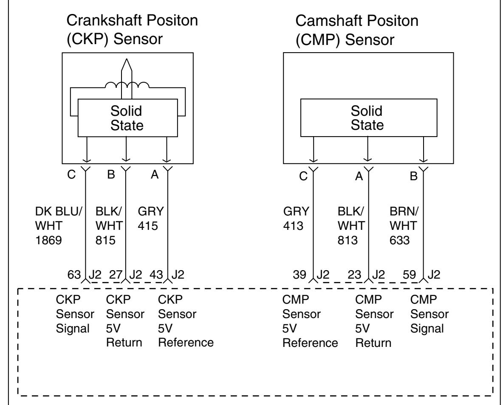

# **Diagnostic Information and Procedures**

# **SPN 723, FMI 2 Cam Signal Fault**

# **Circuit Description**

The camshaft position (CMP) sensor works in conjunction with the 1X reluctor trigger wheel on the camshaft gear. The reluctor trigger wheel on the camshaft gear contains a pattern around the circumference, consisting of 1 wide tooth. The engine control module (ECM) provides a 5-volt reference to the sensor, as well as a low reference and a signal circuit. As the camshaft gear rotates, the reluctor trigger wheel interrupts a magnetic field produced by a magnet internal to the sensor. The CMP sensor internal circuitry detects this interruption of the magnetic field, and produces an ON/OFF DC voltage of varying frequency. The frequency of the CMP sensor output signal is dependent upon camshaft speed. The ECM will recognize wide tooth pattern to identify camshaft position, or which cylinder is in compression and which is in exhaust. If the ECM detects that there is no output signal from the CMP sensor, then SPN 723 FMI 2 will set.

# **DTC Descriptor**

This diagnostic procedure supports the following DTC: SPN 723 FMI 2 Cam Signal Fault (Camshaft Position (CMP) Sensor Circuit Signal Fault)

# **Conditions for Running the DTC**

- The engine is cranking, or the engine is running.
- SPN 723 FMI 2 runs continuously when the above condition is met.

# **Conditions for Setting the DTC**

The ECM detects no CMP sensor output for more than 3 seconds.

{185}------------------------------------------------

# **Action Taken When the DTC Sets**

- The control module illuminates the malfunction indicator lamp (MIL) when the diagnostic runs and fails.
- The control module records the operating conditions at the time the diagnostic fails.

# **Conditions for Clearing the MIL/DTC**

- The control module turns OFF the MIL after consecutive ignition cycles that the diagnostic runs and does not fail.
- A current DTC last test failed clears when the diagnostic runs and passes.

 • A history DTC clears after 25 consecutive warm-up cycles if no failures are reported by this or any other emission related diagnostic.

# **Diagnostic Aids**

SPN 723 FMI 2 will set with the ignition switch in the Start position, if the starter motor is active.

# **Test Description**

The number below refers to the step number on the diagnostic table.

**4.** The test lamp in this step is used to apply a load to the 12-volt reference circuit of the CMP sensor.

| Step                                                                                                                                                                    | Action                                                                                                                                                                                                                                                                                                                                                                                                                                                                                                                                                                         | Values    | Yes                                                                           | No                                  |
|-------------------------------------------------------------------------------------------------------------------------------------------------------------------------|--------------------------------------------------------------------------------------------------------------------------------------------------------------------------------------------------------------------------------------------------------------------------------------------------------------------------------------------------------------------------------------------------------------------------------------------------------------------------------------------------------------------------------------------------------------------------------|-----------|-------------------------------------------------------------------------------|-------------------------------------|
| Schematic Reference: Engine Controls Schematics Connector End View Reference: Engine Control Module (ECM) Connector End Views or Engine Controls Connector End Views |                                                                                                                                                                                                                                                                                                                                                                                                                                                                                                                                                                                |           |                                                                               |                                     |
| 1                                                                                                                                                                       | Did you perform the "On-Board Diagnostic" (OBD) System Check?                                                                                                                                                                                                                                                                                                                                                                                                                                                                                                                  | —         | Go to Step♦2                                                                  | Go to Diagnostic System Check |
| 2                                                                                                                                                                       | 1. Start and idle the engine. 2. Monitor the camshaft position (CMP) sensor active counter parameter with a scan tool. Does the CMP sensor active counter number increment?                                                                                                                                                                                                                                                                                                                                                                                           | —         | Go to Testing for Intermittent Conditions and Poor Connections | Go to Step♦3                        |
| 3                                                                                                                                                                       | 1. Turn OFF the ignition. 2. Disconnect the CMP sensor electrical connector. 3. Test for shorted terminals and poor connections at the CMP sensor wire harness electrical connector and the mating electrical connector on the CMP sensor. Refer to Testing for Intermittent Conditions and Poor Connections and Connector Repairs. Did you find and correct the condition?                                                                                                                                                                                  | —         | Go to Step♦12                                                              | Go to Step♦4                        |
| 4                                                                                                                                                                       | 1. Turn ON the ignition, with the engine OFF. 2. Connect a jumper wire to the 5-volt reference circuit at the CMP sensor wire harness electrical connector. 3. Connect a test lamp between the jumper wire and a good ground. 4. Connect the positive lead of the DMM to the junction of the jumper wire and test lamp. 5. Connect the negative lead of the DMM to a good engine ground. 6. Measure the voltage from the 5-volt reference circuit to a good ground with a DMM. Refer to Circuit Testing. Is the voltage within the specified range? | 4.8–5.2♦V | Go to Step♦5                                                                  | Go to Step♦6                        |
| 5                                                                                                                                                                       | 1. Remove the test lamp from the jumper wire. 2. Connect another jumper wire to the signal circuit of the CMP sensor wire harness electrical connector. 3. Turn ON the ignition, with the engine OFF. 4. Monitor the CMP active counter parameter with a scan tool. 5. Momentarily connect the two ends of the jumper wires together several times. Does the CMP sensor active counter number increment?                                                                                                                                                  | —         | Go to Step♦10                                                              | Go to Step♦7                        |

{186}------------------------------------------------

|          | Test the CMP 5-volt reference circuit between the CMP sensor and the engine control module (ECM) for the following conditions: |   |                            |               |
|----------|-----------------------------------------------------------------------------------------------------------------------------------|---|----------------------------|---------------|
| 6        | • An open                                                                                                                      |   |                            |               |
|          | • High resistance                                                                                                              | — |                            |               |
|          | • A short to ground                                                                                                            |   |                            |               |
|          | Refer to Circuit Testing and Wiring Repairs. Did you find and correct the condition?                                           |   | Go to Step♦12           | Go to Step♦9  |
|          | Test the CMP low reference circuit between the CMP sensor and the ECM for                                                         |   |                            |               |
|          | the following conditions:                                                                                                         |   |                            |               |
|          | • An open                                                                                                                      |   |                            |               |
| 7        | • High resistance                                                                                                              | — |                            |               |
|          | • A short to ground                                                                                                            |   |                            |               |
|          | • A short to voltage                                                                                                           |   |                            |               |
|          | Refer to Circuit Testing and Wiring Repairs. Did you find and correct the condition?                                           |   | Go to Step♦12           | Go to Step♦8  |
|          | Test the CMP signal circuit between the CMP sensor and the ECM for the                                                            |   |                            |               |
|          | following conditions:                                                                                                             |   |                            |               |
|          | • An open                                                                                                                      |   |                            |               |
| 8        | • High resistance                                                                                                              | — |                            |               |
|          | • A short to ground                                                                                                            |   |                            |               |
|          | • A short to voltage Did you find and correct the condition?                                                                |   | Go to Step♦12           | Go to Step♦9  |
|          | Test for shorted terminals and poor connections at the ECM wire harness                                                           |   |                            |               |
| 9        | electrical connector. Refer to Testing for Intermittent Conditions and Poor                                                       | — |                            |               |
|          | Connections and Connector Repairs. Did you find and correct the condition?                                                     |   | Go to Step♦12           | Go to Step♦11 |
|          | Replace the CMP sensor. Refer to Camshaft Position (CMP) Sensor                                                                   |   |                            |               |
| 10       | Replacement.                                                                                                                      | — | Go to                      |               |
|          | Did you complete the replacement?                                                                                                 |   | Step♦12                    | —             |
|          | Replace the ECM. Refer to Control Module References for replacement, setup,                                                       |   |                            |               |
| 11 12 | and programming. Did you complete the replacement?                                                                             | — | Go to Step♦12           | —             |
|          | 1. Clear the DTCs with a scan tool.                                                                                               |   |                            |               |
|          | 2. Turn OFF the ignition for 30 seconds.                                                                                          |   |                            |               |
|          | 3. Start the engine.                                                                                                              | — |                            |               |
|          | 4. Operate the vehicle within the Conditions for Running the DTC. Did the DTC fail this ignition?                              |   | Go to Step♦2               | Go to Step♦13 |
| 13       | Observe the Capture Info with a scan tool.                                                                                        |   | Go to                      |               |
|          | Are there any DTCs that have not been diagnosed?                                                                                  | — | Diagnostic Trouble Code |               |
|          |                                                                                                                                   |   | (DTC) List                 | System OK     |

{187}------------------------------------------------

**This page left intentionally blank**

{188}------------------------------------------------

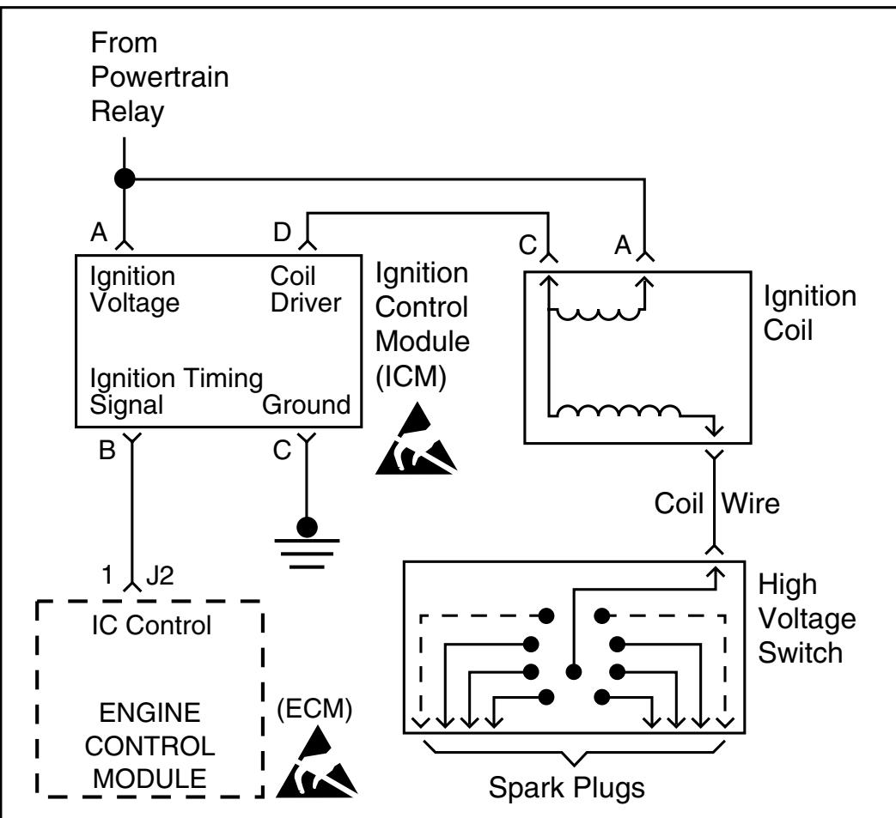

# **Diagnostic Information and Procedures**

# **SPN 65541 FMI 3 EST A Short High SPN 65541 FMI 4 EST A Short Low SPN 65541 FMI 5 EST A Open**

# **Circuit Description**

The ignition system on this engine uses an ignition coil module to drive the ignition coil. The engine control module (ECM) controls the spark event for each cylinder through an ignition control (IC) circuit. When the ECM commands the IC circuit ON, electrical current will flow through the primary winding of the ignition coil, creating a magnetic field. When a spark event is requested, the ECM will command the IC circuit OFF, interrupting current flow through the primary winding. The magnetic field created by the primary winding will collapse across the secondary coil winding, producing a high voltage across the spark plug electrodes. The ECM uses information from the crankshaft position (CKP) and the camshaft position (CMP) sensor for sequencing and timing of the spark events. The ignition coil module has the following circuits:

- An ignition voltage circuit
- A ground circuit
- An IC circuit
- A low reference circuit

If the ECM detects that the IC circuit has an incorrect voltage level, SPN 65541 will set.

# **DTC Descriptors**

This diagnostic procedure supports the following DTCs:

- SPN 65541 FMI 3 EST A Short High (Ignition Coil Control Module Circuit Short to Voltage)
- SPN 65541 FMI 4 EST A Short Low (Ignition Coil Control Module Circuit Short to Ground)
- SPN 65541 FMI 5 EST A Open (Ignition Coil Control Module Circuit Open Circuit)

{189}------------------------------------------------

# **Conditions for Running the DTC**

- The engine is cranking, or the engine is running.
- SPN 65541 runs continuously when the above condition is met.

# **Conditions for Setting the DTC**

The ECM detects the IC circuit is grounded, open, or shorted to voltage for less than 1 second.

# **Action Taken When the DTC Sets**

 • The control module illuminates the malfunction indicator lamp (MIL) on the second consecutive ignition cycle that the diagnostic runs and fails.

• The control module records the operating conditions at the time the diagnostic fails.

# **Conditions for Clearing the MIL/DTC**

 • The control module turns OFF the malfunction indicator lamp (MIL) after consecutive ignition cycles that the diagnostic runs and does not fail.

- A current DTC, Last Test Failed, clears when the diagnostic runs and passes.
- A history DTC clears after 25 consecutive warm-up cycles, if no failures are reported by this or any other emission related diagnostic.
- Clear the MIL and the DTC with a scan tool.

# **Test Description**

The numbers below refer to the step numbers on the diagnostic table.

- **3.** This step verifies the integrity of the IC circuit and the ECM output.
- **4.** This step tests for a short to voltage on the IC circuit.

| Step                                                                                                                                                                    | Action                                                                                                                                                                                                                                                                                                                                                    | Values    | Yes              | No                                                                         |
|-------------------------------------------------------------------------------------------------------------------------------------------------------------------------|-----------------------------------------------------------------------------------------------------------------------------------------------------------------------------------------------------------------------------------------------------------------------------------------------------------------------------------------------------------|-----------|------------------|----------------------------------------------------------------------------|
| Schematic Reference: Engine Controls Schematics Connector End View Reference: Engine Control Module (ECM) Connector End Views or Engine Controls Connector End Views |                                                                                                                                                                                                                                                                                                                                                           |           |                  |                                                                            |
| 1                                                                                                                                                                       | Did you perform the "On-Board Diagnostic" (OBD) System Check?                                                                                                                                                                                                                                                                                             | —         | Go to Step♦2     | Go to Diagnostic System Check                                        |
| 2                                                                                                                                                                       | 1. Observe the Conditions for Running this DTC. 2. Turn OFF the ignition for 30 seconds. 3. Start the engine. 4. Operate the vehicle within the Conditions for Running the DTC. Did the DTC fail this ignition?                                                                                                                               | —         | Go to Step♦3     | Go to Testing for Intermittent Conditions and Poor Connections |
| 3                                                                                                                                                                       | 1. Turn OFF the engine. 2. Disconnect the ignition control module coil electrical connector. 3. Disconnect the fuel injector electrical connectors. 4. Crank the engine. 5. Measure the frequency at the ignition (IC) circuit with the DMM set to AC Hertz. Refer to Measuring Frequency. Is the frequency within the specified range? | 3–20 Hz ? | Go to Step♦7     | Go to Step♦4                                                               |
| 4                                                                                                                                                                       | 1. Turn ON the ignition, with the engine OFF. 2. Measure the voltage from the IC circuit of the ignition control module to a good ground with a DMM. Is the voltage more than the specified value?                                                                                                                                               | 1 V       | Go to Step♦13 | Go to Step♦5                                                               |
| 5                                                                                                                                                                       | 1. Turn OFF the ignition. 2. Disconnect the engine control module (ECM) connector. 3. Test the IC circuit between the ignition control module connector and the ECM connector for continuity with the DMM. Does the DMM indicate continuity?                                                                                                  | —         | Go to Step♦6     | Go to Step♦14                                                              |
| 6                                                                                                                                                                       | Test the IC circuit for a short to ground. Refer to Testing for Short to Ground. Did you find and correct the condition?                                                                                                                                                                                                                               | —         | Go to Step♦17 | Go to Step♦10                                                              |

{190}------------------------------------------------

| 7  | 1. Turn ON the ignition, with the engine OFF. 2. Probe the ignition voltage circuit of the ignition coil control module with a test lamp that is connected to battery ground. Refer to Troubleshooting with a Test Lamp. Does the test lamp illuminate? | — | Go to Step♦8                                      | Go to Step♦11 |
|----|---------------------------------------------------------------------------------------------------------------------------------------------------------------------------------------------------------------------------------------------------------------------|---|---------------------------------------------------|---------------|
|    |                                                                                                                                                                                                                                                                     |   |                                                   |               |
| 8  | Probe the ground circuit of the ignition coil control module with a test lamp connected to battery voltage. Refer to Troubleshooting with a Test Lamp. Does the test lamp illuminate?                                                                         | — | Go to Step♦9                                      | Go to Step♦12 |
| 9  | Test for an intermittent and for a poor connection at the ignition coil control module. Refer to Testing for Intermittent Conditions and Poor Connections and Connector Repairs. Did you find and correct the condition?                                   | — | Go to Step♦17                                  | Go to Step♦15 |
| 10 | Test for an intermittent and for a poor connection at the ECM. Refer to Testing for Intermittent Conditions and Poor Connections and Connector Repairs. Did you find and correct the condition?                                                               | — | Go to Step♦17                                  | Go to Step♦16 |
| 11 | Repair the open or high resistance in the ignition voltage circuit. Refer to Wiring Repairs. Did you complete the repair?                                                                                                                                     | — | Go to Step♦17                                  | —             |
| 12 | Repair the open or high resistance in the ground circuit for the ignition coil control module. Refer to Wiring Repairs. Did you complete the repair?                                                                                                          | — | Go to Step♦17                                  | —             |
| 13 | Repair the IC circuit for a short to voltage. Refer to Wiring Repair. Did you complete the repair?                                                                                                                                                               | — | Go to Step♦17                                  | —             |
| 14 | Repair the open or high resistance in the IC circuit. Refer to Wiring Repairs. Did you complete the repair?                                                                                                                                                      | — | Go to Step♦17                                  | —             |
| 15 | Replace the ignition coil control module. Refer to Ignition Coil Control Module Replacement. Did you complete the replacement?                                                                                                                                | — | Go to Step♦17                                  | —             |
| 16 | Replace the ECM. Refer to Control Module References for replacement, setup, and programming. Did you complete the replacement?                                                                                                                                | — | Go to Step♦17                                  | —             |
| 17 | 1. Clear the DTCs with a scan tool. 2. Turn OFF the ignition for 30 seconds. 3. Start the engine. 4. Operate the vehicle within the Conditions for Running the DTC. Did the DTC fail this ignition?                                                     | — | Go to Step♦2                                      | Go to Step♦18 |
| 18 | Observe the Capture Info with a scan tool. Are there any DTCs that have not been diagnosed?                                                                                                                                                                      | — | Go to Diagnostic Trouble Code (DTC) List | System OK     |

{191}------------------------------------------------

**This page left intentionally blank**

{192}------------------------------------------------

# Knock Sensor

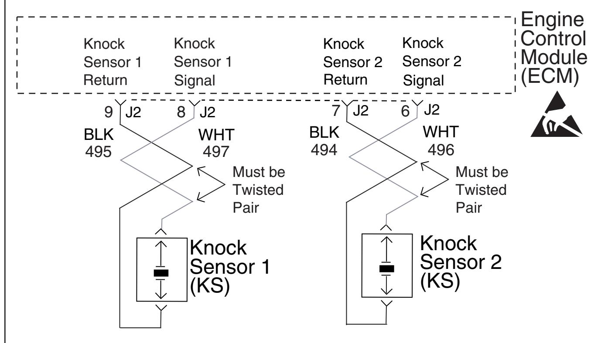

# **Diagnostic Information and Procedures**

1648027 **SPN 65551 - FMI 2:** Knock Sensor 1 (KS) Fault **SPN 65552 - FMI 2:** Knock Sensor 2 (KS) Fault

# **DTC Descriptor**

**SPN 65551, FMI 2:** Knock Sensor 1 (KS) Fault  **SPN 65552, FMI 2:** Knock Sensor 2 (KS) Fault

# **Circuit/System Description**

The knock sensor (KS) system enables the engine control module (ECM) to control the ignition timing for the best possible performance while protecting the engine from potentially damaging levels of detonation. The ECM monitors two separate KS, one on each side of the engine block. Each KS produces an AC voltage that varies, depending on the vibration levels detected during engine operation. The ECM adjusts the spark timing based on the amplitude and frequency of each KS signal. The ECM receives the KS signal through two different signal circuits. Each KS ground is supplied by the ECM through a low reference circuit. The ECM uses the KS signal to calculate the average voltage, then assign a voltage range value. The ECM will then monitor for a normal KS signal within the assigned voltage range.

# **Conditions for Running the DTC**

• SPN 65550, 65551, 65552 run continuously when the engine speed is greater than 1,800 RPM, and the manifold

absolute pressure (MAP) is greater than 55 kPa.

• SPN 65551, 65552 run continuously when the ignition is ON or the engine is running.

## **Conditions for Setting the DTC SPN 65551 and 65552 FMI 2**

- The KS signal circuits are open or shorted together for 5 seconds.
- The KS signal circuits are shorted to voltage or ground.

{193}------------------------------------------------

# **Action Taken When the DTC Sets**

- The control module illuminates the malfunction indicator lamp (MIL) when the diagnostic runs and fails.
- The control module records the DTC at the time the diagnostic fails.

# **Conditions for Clearing the DTC**

- The control module turns OFF the MIL after consecutive ignition cycles that the diagnostic runs and does not fail.
- A history DTC clears after 25 consecutive warm up cycles if no failures are reported by this diagnostic.
- A current DTC last test failed clears when the diagnostic runs and passes.
- Clear the MIL and the DTC with a scan tool.

# **Diagnostic Aids**

- Inspect the KS for physical damage.
- Inspect the KS for proper installation. A KS that is loose or over-torque may cause a DTC to set. The KS should be free of thread sealant.
- The KS mounting surface should be free of burs, casting flash and, foreign material.
- This test procedure requires that the vehicle battery has passed a load test and is completely charged.
- When disconnecting electrical connectors or removing fuses and relays from a fuse block, always inspect the

component electrical terminals for corrosion, and the mating electrical terminals for tightness.

# **Reference Information**

**Schematic Reference** Engine Controls Schematics

# **Connector End View Reference**

- Engine Control Module (ECM) Connector End Views
- Engine Controls Connector End Views

#### **Electrical Information Reference**

- Testing for Intermittent Conditions and Poor Connections
- Circuit Testing
- Wiring Repairs
- Connector Repairs
- Measuring Frequency

#### **Scan Tool Reference**

- Scan Tool Data List
- Scan Tool Data Definitions
- Scan Tool Output Controls

# **Circuit/System Verification**

**1.** Disconnect both KS electrical connectors.

**2.** Connect one test lead from the DMM to the signal circuit terminal on the KS, and the other test lead form the DMM to the low reference circuit terminal on the KS.

**3.** Set the DMM to the 400 mV AC hertz scale, and wait for the DMM to stabilize at 0 Hz.

#### **Important:** DO NOT tap on plastic engine components.

**4.** Tap on the engine block with a non-metallic object near the KS while observing the Hz signal indicated on the DMM display.

**5.** The DMM should display a fluctuating frequency while tapping on the engine block.

**6.** Repeat the above procedure for the KS on the opposite side of the engine block.

If the vehicle passes the Circuit/System Verification test, operate the vehicle within the Conditions for Running the DTC. The other option is to refer to Testing for Intermittent Conditions and Poor Connections.

{194}------------------------------------------------

# **Circuit/System Testing SPN 65551 and 65552 FMI 2**

**1.** Turn OFF the ignition.

**2.** Disconnect the KS electrical connector.

**3.** Measure for infinite resistance between the signal circuit terminal at the KS, and to a good engine ground, with a DMM. If continuity is detected on the signal circuit, replace the KS.

**5.** Measure for infinite resistance between the low reference circuit terminal at the KS and to a good engine ground with a DMM.

If continuity is detected on the low reference circuit, replace the KS.

**7.** Turn ON the ignition, with the engine OFF.

**8.** Measure for voltage at the KS signal circuit terminal, on the wire harness electrical connector, for the KS.

If the KS signal circuit measures more than 4.2 volts, test for a short to voltage or a faulty ECM.

**10.** Measure for voltage at the KS low reference circuit terminal, on the wire harness electrical connector, for the KS.

If the KS low reference circuit measures more than 4.2 volts, test for a short to voltage, or a faulty ECM. **12.** Test the KS signal circuit and the KS low reference circuit for the following conditions:

- An open
- A short to ground

• High resistance—All wire circuit resistance must measure less than 5 ohms.

If the KS and wire circuits test normal, replace the ECM.

# **Repair Instructions**

**Important:** Always perform the Diagnostic Repair Verification after completing the diagnostic procedure.

- Knock Sensor (KS) Replacement (Bank 1) Knock Sensor (KS) Replacement (Bank 2)
- Control Module References
- Symptoms Engine Mechanical
- Symptoms Engine Controls

{195}------------------------------------------------

**This page left intentionally blank**

{196}------------------------------------------------

# **Engine Controls Schematics**

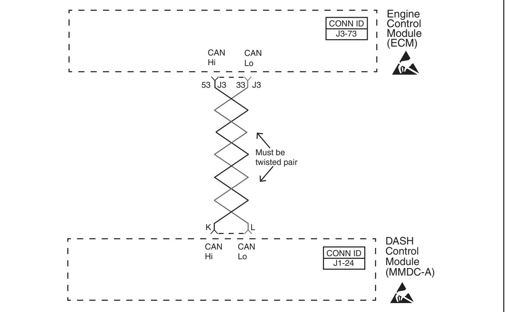

# **Diagnostic Information and Procedures**

# **SPN 65559, FMI 11 Can Bus Hardware**

# **Description**

Modules connected to the Can Bus data circuit monitor for Can Communication Protocol (CCP) during normal operation. Operating information and commands are exchanged among the modules. In addition to this, Node Alive messages are transmitted by each module on the CCP data circuit. When the module detects one of the following conditions on the CCP data circuit for approximately 3 seconds, this DTC will set.

- Low voltage on the CCP Data Circuit.
- High voltage on the CCP Data Circuit.

# **DTC Descriptors**

This diagnostic procedure supports the following DTC: SPN 65559 FMI 11 Can Bus Hardware

# **Conditions for Running the DTC**

- The ignition switch is in the Run or the Crank position.
- The ignition voltage is in the normal operating voltage range.
- SPN 65559 FMI 11 runs continuously when the above condition is met.

# **Conditions for Setting the DTC**

- No valid messages are detected on the CCP data circuit
- The voltage level detected on the CCP data circuit is under one of the following conditions:
	- Always high
	- Always low

{197}------------------------------------------------

• The above conditions are met for approximately 3 seconds.

# **Action Taken When the DTC Sets**

- The control module illuminates the malfunction indicator lamp (MIL) when the diagnostic runs and fails.
- The control module records the operating conditions at the time the diagnostic fails.

# **Conditions for Clearing the MIL/DTC**

- A current DTC Last Test Failed clears when the diagnostic runs and passes.
- A history DTC clears after 25 consecutive warm-up cycles, if no failures are reported by this or any other nonemission related diagnostic.
- Clear the DTC with a scan tool.

# **Diagnostic Aids**

 • May have to disconnect external modules (MMDC or Perfect Pass or etc… modules) in order to communicate with the ECM.

{198}------------------------------------------------

# **Diagnostic Information and Procedures**

# **SPN 65580, FMI 12 CPU Failure**

# **Description**

This diagnostic applies to internal microprocessor integrity conditions within the engine control module (ECM). This diagnostic also addresses whether or not the ECM is not programmed.

# **DTC Descriptors**

This diagnostic procedure supports the following DTC: SPN 65580 FMI 12 CPU Failure

# **Conditions for Running the DTC**

- The ignition switch is in the Run or the Crank position.
- The ignition voltage is more than 5 volts.
- SPN 65580 FMI 12 runs continuously when the above condition is met.

# **Conditions for Setting the DTC**

The ECM detects an internal failure or incomplete programming for more than 14 seconds.

# **Action Taken When the DTC Sets**

- The control module illuminates the malfunction indicator lamp (MIL) when the diagnostic runs and fails.
- The control module records the operating conditions at the time the diagnostic fails.

{199}------------------------------------------------

# **Conditions for Clearing the MIL/DTC**

- A current DTC Last Test Failed clears when the diagnostic runs and passes.
- A history DTC clears after 25 consecutive warm-up cycles, if no failures are reported by this or any other non-

emission related diagnostic.

• Clear the DTC with a scan tool.

# **Test Description**

The number below refers to the step number on the diagnostic table.

**2.** This step check indicates the ECM needs to programmed or replaced.

| Step | Action                                                                                                                                                                                                                                                                                        | Yes                                            | No                               |
|------|-----------------------------------------------------------------------------------------------------------------------------------------------------------------------------------------------------------------------------------------------------------------------------------------------|------------------------------------------------|----------------------------------|
| 1    | Did you perform the "On-Board Diagnostic" (OBD) System Check?                                                                                                                                                                                                                                 | Go to Step♦2                                   | Go to Diagnostic System Check |
| 2    | Is SPN 65580 FMI 12 set?                                                                                                                                                                                                                                                                      | Go to Step♦3                                   | Go to Step♦5                     |
| 3    | Program the engine control module (ECM). Refer to Service Programming System (SPS). Does SPN 65580 reset?                                                                                                                                                                               | Go to Step♦4                                   | Go to Step♦7                     |
| 4    | 1. Ensure that all tool connections are secure. 2. Ensure that the programming equipment is operating correctly. 3. Ensure that the correct software/calibration package is used. 4. Attempt to program the ECM. Refer to Service Programming System (SPS). Does SPN 65580 reset? | Go to Step♦5                                   | Go to Step♦7                     |
| 5    | Test all voltage and ground inputs to the ECM for an open circuit or high resistance. Refer to Circuit Testing and Wiring Repairs. Did you find and correct the condition?                                                                                                              | Go to Step♦7                                   | Go to Step♦6                     |
| 6    | Replace the ECM. Refer to Control Module References for replacement, setup, and programming. Did you complete the replacement?                                                                                                                                                          | Go to Step♦7                                   | —                                |
| 7    | 1. Clear the DTCs with a scan tool. 2. Turn OFF the ignition for 30 seconds. 3. Start the engine. Did the DTC fail this ignition?                                                                                                                                                    | Go to Step♦2                                   | Go to Step♦8                     |
| 8    | Observe the Capture Info with a scan tool. Are there any DTCs that have not been diagnosed?                                                                                                                                                                                                | Go to Diagnostic Trouble Code (DTC) List | System OK                        |

{200}------------------------------------------------

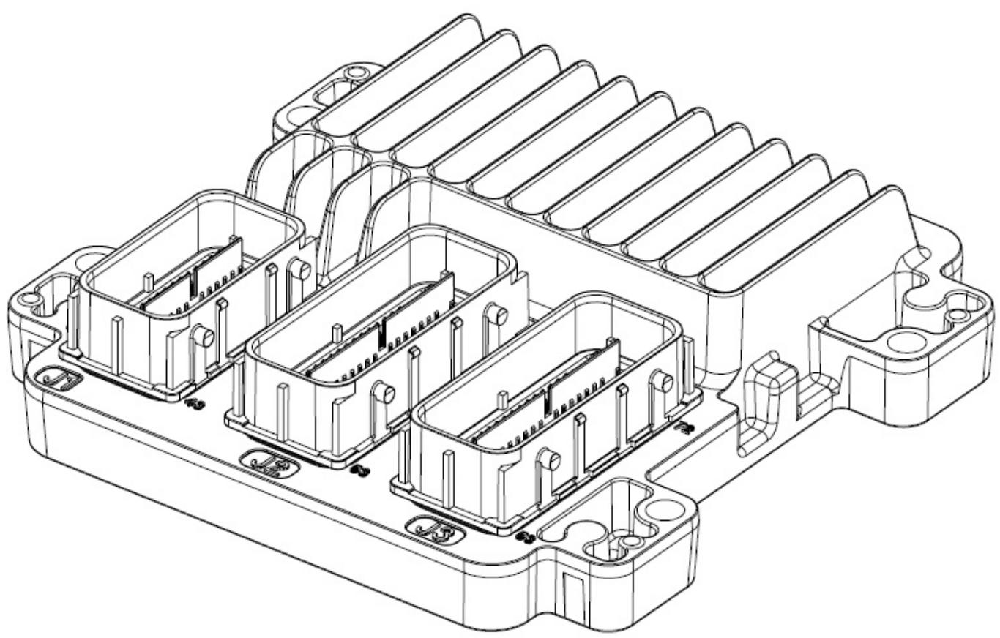

# **Diagnostic Information and Procedures**

# **SPN 65581, FMI 12 MHC Failure**

# **Description**

This diagnostic applies to internal microprocessor integrity conditions within the engine control module (ECM). Two processors are also used to monitor the TAC system data. The engine control module (ECM) performs an intrusive test in order to monitor these processors. This diagnostic also addresses whether or not the ECM is not programmed.

# **DTC Descriptors**

This diagnostic procedure supports the following DTC: SPN 65581 FMI 12 MHC Failure

# **Conditions for Running the DTC**

- The ignition switch is in the Run or the Crank position.
- The ignition voltage is more than 5 volts.
- SPN 65581 FMI 12 runs continuously when the above condition is met.

# **Conditions for Setting the DTC**

The ECM detects an internal failure or incomplete programming for more than 14 seconds.

# **Action Taken When the DTC Sets**

- The control module illuminates the malfunction indicator lamp (MIL) when the diagnostic runs and fails.
- The control module records the operating conditions at the time the diagnostic fails.

{201}------------------------------------------------

# **Conditions for Clearing the MIL/DTC**

- A current DTC Last Test Failed clears when the diagnostic runs and passes.
- A history DTC clears after 25 consecutive warm-up cycles, if no failures are reported by this or any other non-

emission related diagnostic.

• Clear the DTC with a scan tool.

# **Test Description**

The number below refers to the step number on the diagnostic table.

**2.** This step check indicates the ECM needs to programmed or replaced.

| Step | Action                                                                                                                                                                                                                                                                                        | Yes                                            | No                               |
|------|-----------------------------------------------------------------------------------------------------------------------------------------------------------------------------------------------------------------------------------------------------------------------------------------------|------------------------------------------------|----------------------------------|
| 1    | Did you perform the "On-Board Diagnostic" (OBD) System Check?                                                                                                                                                                                                                                 | Go to Step♦2                                   | Go to Diagnostic System Check |
| 2    | Is SPN 65581 FMI 12 set?                                                                                                                                                                                                                                                                      | Go to Step♦3                                   | Go to Step♦5                     |
| 3    | Program the engine control module (ECM). Refer to Service Programming System (SPS). Does SPN 65581 reset?                                                                                                                                                                               | Go to Step♦4                                   | Go to Step♦7                     |
| 4    | 1. Ensure that all tool connections are secure. 2. Ensure that the programming equipment is operating correctly. 3. Ensure that the correct software/calibration package is used. 4. Attempt to program the ECM. Refer to Service Programming System (SPS). Does SPN 65581 reset? | Go to Step♦5                                   | Go to Step♦7                     |
| 5    | Test all voltage and ground inputs to the ECM for an open circuit or high resistance. Refer to Circuit Testing and Wiring Repairs. Did you find and correct the condition?                                                                                                              | Go to Step♦7                                   | Go to Step♦6                     |
| 6    | Replace the ECM. Refer to Control Module References for replacement, setup, and programming. Did you complete the replacement?                                                                                                                                                          | Go to Step♦7                                   | —                                |
| 7    | 1. Clear the DTCs with a scan tool. 2. Turn OFF the ignition for 30 seconds. 3. Start the engine. Did the DTC fail this ignition?                                                                                                                                                    | Go to Step♦2                                   | Go to Step♦8                     |
| 8    | Observe the Capture Info with a scan tool. Are there any DTCs that have not been diagnosed?                                                                                                                                                                                                | Go to Diagnostic Trouble Code (DTC) List | System OK                        |

{202}------------------------------------------------

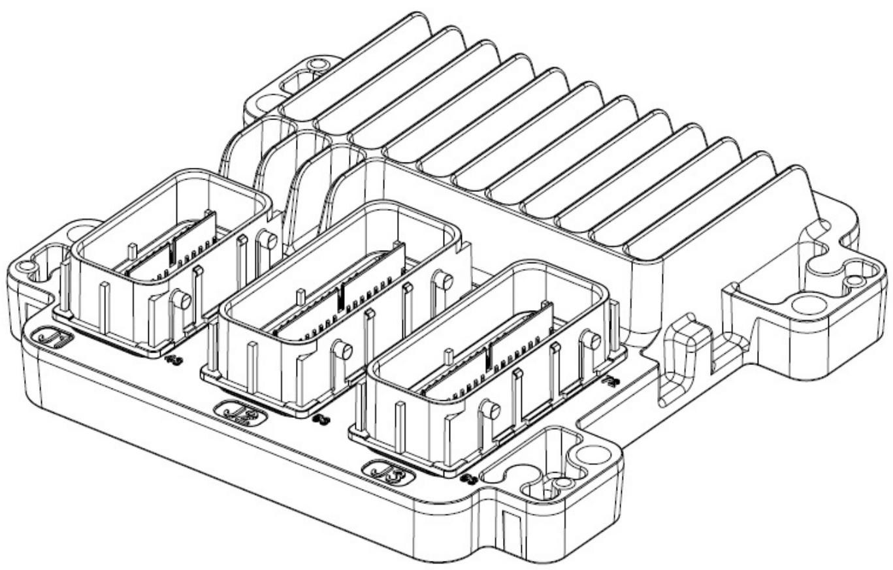

# **Diagnostic Information and Procedures**

# **SPN 65582, FMI 12 NV RAM Failure**

# **Description**

This diagnostic applies to internal NV RAM integrity conditions within the engine control module (ECM). The NV RAM stores engine hours and DTCs which questions the integrity of this stored data. This diagnostic also addresses whether or not the ECM is not programmed.

# **DTC Descriptors**

This diagnostic procedure supports the following DTC: SPN 65582 FMI 12 NV RAM Failure

# **Conditions for Running the DTC**

- The ignition switch is in the Run or the Crank position.
- The ignition voltage is more than 5 volts.
- SPN 65582 FMI 12 runs continuously when the above condition is met.

# **Conditions for Setting the DTC**

The ECM detects an internal failure or incomplete programming for more than 14 seconds.

# **Action Taken When the DTC Sets**

- The control module illuminates the malfunction indicator lamp (MIL) when the diagnostic runs and fails.
- The control module records the operating conditions at the time the diagnostic fails.

{203}------------------------------------------------

# **Conditions for Clearing the MIL/DTC**

- A current DTC Last Test Failed clears when the diagnostic runs and passes.
- A history DTC clears after 25 consecutive warm-up cycles, if no failures are reported by this or any other non-

emission related diagnostic.

• Clear the DTC with a scan tool.

# **Test Description**

The number below refers to the step number on the diagnostic table.

**2.** This step check indicates the ECM needs to programmed or replaced.

| Step | Action                                                                                                                                                                                                                                                                                        | Yes                                            | No                               |  |
|------|-----------------------------------------------------------------------------------------------------------------------------------------------------------------------------------------------------------------------------------------------------------------------------------------------|------------------------------------------------|----------------------------------|--|
| 1    | Did you perform the "On-Board Diagnostic" (OBD) System Check?                                                                                                                                                                                                                                 | Go to Step♦2                                   | Go to Diagnostic System Check |  |
| 2    | Is SPN 65582 FMI 12 set?                                                                                                                                                                                                                                                                      | Go to Step♦3                                   | Go to Step♦5                     |  |
| 3    | Program the engine control module (ECM). Refer to Service Programming System (SPS). Does SPN 65582 reset?                                                                                                                                                                               | Go to Step♦4                                   | Go to Step♦7                     |  |
| 4    | 1. Ensure that all tool connections are secure. 2. Ensure that the programming equipment is operating correctly. 3. Ensure that the correct software/calibration package is used. 4. Attempt to program the ECM. Refer to Service Programming System (SPS). Does SPN 65582 reset? | Go to Step♦5                                   | Go to Step♦7                     |  |
| 5    | Test all voltage and ground inputs to the ECM for an open circuit or high resistance. Refer to Circuit Testing and Wiring Repairs. Did you find and correct the condition?                                                                                                              | Go to Step♦7                                   | Go to Step♦6                     |  |
| 6    | Replace the ECM. Refer to Control Module References for replacement, setup, and programming. Did you complete the replacement?                                                                                                                                                          | Go to Step♦7                                   | —                                |  |
| 7    | 1. Clear the DTCs with a scan tool. 2. Turn OFF the ignition for 30 seconds. 3. Start the engine. Did the DTC fail this ignition?                                                                                                                                                    | Go to Step♦2                                   | Go to Step♦8                     |  |
| 8    | Observe the Capture Info with a scan tool. Are there any DTCs that have not been diagnosed?                                                                                                                                                                                                | Go to Diagnostic Trouble Code (DTC) List | System OK                        |  |

{204}------------------------------------------------

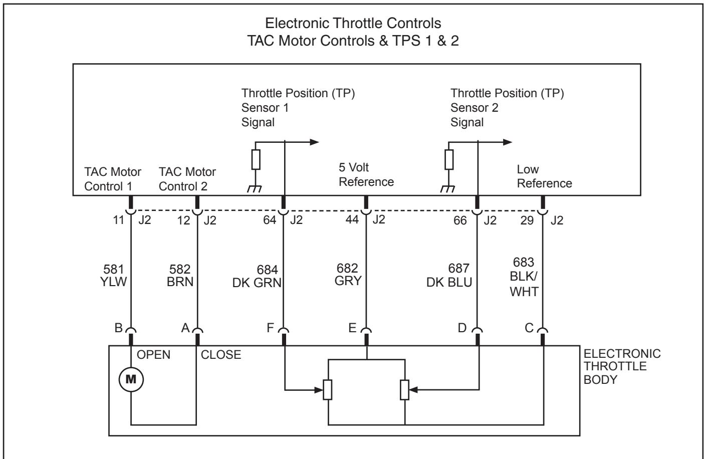

# **Diagnostic Information and Procedures**

# **SPN 65601, FMI 2 ETC TPS 2 Range (Electronic Throttle Control, Throttle Position Sensor 2 Range)**

# **Circuit Description**

The throttle position (TP) sensors 1 and 2 are located within the throttle body assembly. The ECM supplies the TP sensors with a common 5-volt reference circuit and a common low reference circuit. Each TP sensor has an individual signal circuit, which provides the ECM with a signal voltage that changes in proportion to the throttle plate angle. When the throttle plate is in the closed position, TP sensor 1 signal voltage is near the low reference and TP sensor 2 signal voltage is near the 5-volt reference. As the throttle is opened, TP sensor 1 signal voltage increases and TP sensor 2 signal voltage decreases.

If the ECM detects that TP sensor 2 signal voltage is not within the correct range, SPN 65601, FMI 2 sets.

# **DTC Descriptor**

This diagnostic procedure supports the following DTC: SPN 65601, FMI 2 ETC TPS 2 Range

# **Conditions for Running the DTC**

- The ignition is ON, with the engine OFF, or the engine is operating.
- SPN 65601 runs continuously when the above conditions are met.

# **Conditions for Setting the DTC**

- The ECM detects that the TP sensor 2 signal voltage is less than 0.3 volt.
- The ECM detects that the TP sensor 2 signal voltage is more than 4.7 volts.

Note: Exact voltages may vary depending on ECM calibration.

{205}------------------------------------------------

# **Action Taken When the DTC Sets**

- The ECM illuminates the malfunction indicator lamp (MIL) when the diagnostic runs and fails.
- The ECM commands the system to operate in the Reduced Engine Power mode.
- The ECM commands the throttle actuator to move the throttle plate to an idle position.
- The throttle actuator does not respond to input from the Throttle-Shift Control (T-SC).
- Under certain conditions the ECM commands the engine OFF.

# **Conditions for Clearing the MIL/DTC**

 • The malfunction indicator lamp (MIL) will remain illuminated through the remainder of the ignition cycle. After turning the key off, the MIL will not illuminate on the next malfunction-free ignition cycle.

- An active DTC clears on the next ignition cycle that the diagnostic runs and passes.
- A history DTC clears after 25 consecutive run cycles, if no failures are reported by this diagnostic. Each run cycle must last a minimum of 10 seconds.
- Clear the history DTC with a scan tool.

# **Test Description**

The numbers below refer to the step numbers in the diagnostic table.

**3, 5,& 23.** More than one electronic throttle control (ETC) system related DTC may set. This is due to the many redundant tests run continuously on this system. Locating and repairing one individual condition may correct more than one DTC. Keep this in mind when reviewing captured DTC info.

| Step                                                                                                                                                                | Action                                                                                                                                                                                                                                                                                                            | Values         | Yes                                                                                                      | No                                                                         |
|---------------------------------------------------------------------------------------------------------------------------------------------------------------------|-------------------------------------------------------------------------------------------------------------------------------------------------------------------------------------------------------------------------------------------------------------------------------------------------------------------|----------------|----------------------------------------------------------------------------------------------------------|----------------------------------------------------------------------------|
| Schematic Reference: Engine Controls Schematics Connector End View Reference: Engine Control Module (ECM) Connector End Views or Engine Controls Component Views |                                                                                                                                                                                                                                                                                                                   |                |                                                                                                          |                                                                            |
| 1                                                                                                                                                                   | Did you perform the "On-Board Diagnostic" (OBD) System Check?                                                                                                                                                                                                                                                     | —              | Go to Step♦2                                                                                             | Go to Diagnostic System Check                                        |
| 2                                                                                                                                                                   | 1. Turn ON the ignition, with the engine OFF. 2. Observe the throttle position (TP) sensor 2 voltage with a scan tool, while the Throttle-Shift Control (T-SC) is in the locked-neutral (idle) position. Does the scan tool indicate voltage less than the first value or more than the second value? | 0.3 V 4.7 V | Go to Step♦6                                                                                             | Go to Step♦3                                                               |
| 3                                                                                                                                                                   | Is SPN 65610, FMI 2 also set?                                                                                                                                                                                                                                                                                  | —              | See Diagnostic Aids, Go to Diagnostic Trouble Code (DTC) List Continue to Step 4 | Go to Step♦4                                                               |
| 4                                                                                                                                                                   | 1. Clear the DTCs with a scan tool. 2. Turn OFF the ignition for 30♦seconds. 3. Start the engine. 4. Operate the vehicle within the Conditions for Running the DTC. Does SPN 65601, FMI 2 set by itself?                                                                                              | —              | Go to Step♦21                                                                                         | Go to Step♦5                                                               |
| 5                                                                                                                                                                   | Are there any other DTCs set?                                                                                                                                                                                                                                                                                     | —              | See Diagnostic Aids, Go to Diagnostic Trouble Code (DTC) List Continue to Step 6 | Go to Testing for Intermittent Conditions and Poor Connections |

{206}------------------------------------------------

#### **5 - 134 Section 5 - Diagnosis**

| 6  | 1. Turn OFF the ignition. 2. Disconnect the throttle body harness connector. 3. Turn ON the ignition, with the engine OFF. 4. Observe the TP sensor♦2 voltage parameter with a scan tool. Does the scan tool indicate voltage at the specified value?                                            | 0♦V | Go to Step♦7                                      | Go to Step♦12 |
|----|--------------------------------------------------------------------------------------------------------------------------------------------------------------------------------------------------------------------------------------------------------------------------------------------------------------|-----|---------------------------------------------------|---------------|
| 7  | 1. Connect a fused jumper wire between the TP sensor 5-volt reference circuit and the TP sensor♦2 signal circuit at the throttle body harness connector. 2. Observe the TP sensor♦2 voltage parameter with a scan tool. Does the scan tool indicate the TP sensor♦2 voltage at the specified value? | 5♦V | Go to Step♦8                                      | Go to Step♦9  |
| 8  | Probe the TP sensor low reference circuit with a test lamp connected to B+. Does the test lamp illuminate?                                                                                                                                                                                                | —   | Go to Step♦18                                  | Go to Step♦14 |
| 9  | Measure the voltage of the TP sensor♦2 5-volt reference circuit with a DMM. Does the DMM indicate voltage at the specified value?                                                                                                                                                                         | 5♦V | Go to Step♦11                                  | Go to Step♦10 |
| 10 | Does the DMM indicate voltage less than the specified value on the TP sensor♦2 5-volt reference circuit?                                                                                                                                                                                                  | 5♦V | Go to Step♦15                                  | Go to Step♦17 |
| 11 | Test the TP sensor♦2 signal circuit for an open or high resistance. Refer to Circuit Testing and Wiring Repairs. Did you find and correct the condition?                                                                                                                                               | —   | Go to Step♦22                                  | Go to Step♦13 |
| 12 | Test the TP sensor♦2 signal circuit for a short to voltage. Refer to Circuit Testing and Wiring Repairs. Did you find and correct the condition?                                                                                                                                                       | —   | Go to Step♦22                                  | Go to Step♦20 |
| 13 | Test the TP sensor♦2 signal circuit for a short to ground. Refer to Circuit Testing and Wiring Repairs. Did you find and correct the condition?                                                                                                                                                        | —   | Go to Step♦22                                  | Go to Step♦20 |
| 14 | Test the TP sensor♦2 low reference circuit for an open or high resistance. Refer to Circuit Testing and Wiring Repairs. Did you find and correct the condition?                                                                                                                                        | —   | Go to Step♦22                                  | Go to Step♦20 |
| 15 | Test the TP sensor♦2 5-volt reference circuit for an open or high resistance. Refer to Circuit Testing and Wiring Repairs. Did you find and correct the condition?                                                                                                                                     | —   | Go to Step♦22                                  | Go to Step♦16 |
| 16 | Test the TP sensor♦2 5-volt reference circuit for a short to ground. Refer to Circuit Testing and Wiring Repairs. Did you find and correct the condition?                                                                                                                                              | —   | Go to Step♦22                                  | Go to Step♦20 |
| 17 | Test the TP sensor♦2 5-volt reference circuit for a short to voltage. Refer to Circuit Testing and Wiring Repairs . Did you find and correct the condition?                                                                                                                                            | —   | Go to Step♦22                                  | —             |
| 18 | Test for an intermittent and for a poor connection at the throttle body. Refer to Testing for Intermittent Conditions and Poor Connections and Connector Repairs. Did you find and correct the condition?                                                                                           | —   | Go to Step♦22                                  | Go to Step♦19 |
| 19 | Replace the throttle body assembly. Refer to Throttle Body Assembly Replacement. Did you complete the replacement?                                                                                                                                                                                     | —   | Go to Step♦22                                  | —             |
| 20 | Test for an intermittent and for a poor connection at the engine control module (ECM). Refer to Testing for Intermittent Conditions and Poor Connections and Connector Repairs. Did you find and correct the condition?                                                                             | —   | Go to Step♦22                                  | Go to Step♦21 |
| 21 | Replace the ECM. Refer to Control Module References for replacement, setup, and programming. Did you complete the replacement?                                                                                                                                                                         | —   | Go to Step♦22                                  | —             |
| 22 | 1. Clear the DTCs with a scan tool. 2. Turn OFF the ignition for 30♦seconds. 3. Start the engine. 4. Operate the vehicle within the Conditions for Running the DTC. Did the DTC fail this ignition?                                                                                              | —   | Go to Step♦2                                      | Go to Step♦23 |
| 23 | Observe the Capture Info with a scan tool. Are there any DTCs that have not been diagnosed?                                                                                                                                                                                                               | —   | Go to Diagnostic Trouble Code (DTC) List | System OK     |

{207}------------------------------------------------

**This page left intentionally blank**

{208}------------------------------------------------

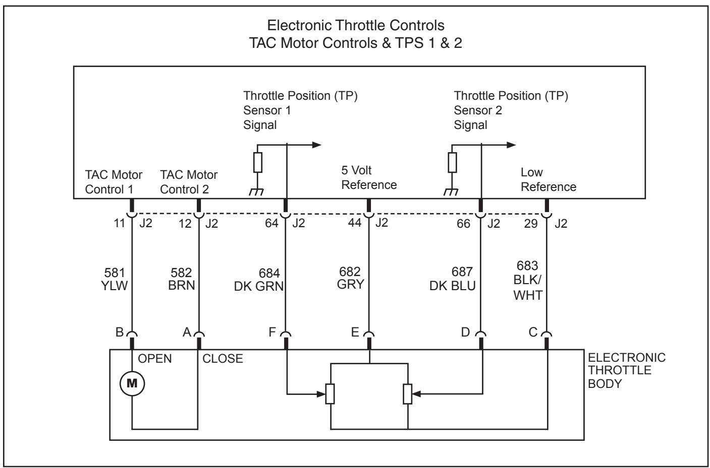

# **Diagnostic Information and Procedures**

# **SPN 65602, FMI 2 ETC TPS 1 Range (Electronic Throttle Control, Throttle Position Sensor 1 Range)**

# **Circuit Description**

The throttle position (TP) sensors 1 and 2 are located within the throttle body assembly. The ECM supplies the TP sensors with a common 5-volt reference circuit and a common low reference circuit. Each TP sensor has an individual signal circuit, which provides the ECM with a signal voltage that changes in proportion to the throttle plate angle. When the throttle plate is in the closed position, TP sensor 1 signal voltage is near the low reference and TP sensor 2 signal voltage is near the 5-volt reference. As the throttle is opened, TP sensor 1 signal voltage increases and TP sensor 2 signal voltage decreases.

If the ECM detects that TP sensor 1 signal voltage is not within the correct range, SPN 65602, FMI 2 sets.

# **DTC Descriptor**

This diagnostic procedure supports the following DTC: SPN 65602, FMI 2 ETC TPS 1 Range

# **Conditions for Running the DTC**

- The ignition is ON, with the engine OFF, or the engine is operating.
- SPN 65602 runs continuously when the above conditions are met.

# **Conditions for Setting the DTC**

- The ECM detects that the TP sensor 1 signal voltage is less than 0.3 volt.
- The ECM detects that the TP sensor 1 signal voltage is more than 4.7 volts.

Note: Exact voltages may vary depending on ECM calibration.

{209}------------------------------------------------

# **Action Taken When the DTC Sets**

- The ECM illuminates the malfunction indicator lamp (MIL) when the diagnostic runs and fails.
- The ECM commands the system to operate in the Reduced Engine Power mode.
- The ECM commands the throttle actuator to move the throttle plate to an idle position.
- The throttle actuator does not respond to input from the Throttle-Shift Control (T-SC).
- Under certain conditions the ECM commands the engine OFF.

# **Conditions for Clearing the MIL/DTC**

 • The malfunction indicator lamp (MIL) will remain illuminated through the remainder of the ignition cycle. After turning the key off, the MIL will not illuminate on the next malfunction-free ignition cycle.

- An active DTC clears on the next ignition cycle that the diagnostic runs and passes.
- A history DTC clears after 25 consecutive run cycles, if no failures are reported by this diagnostic. Each run cycle must last a minimum of 10 seconds.
- Clear the history DTC with a scan tool.

# **Diagnostic Aids**

The numbers below refer to the step numbers in the diagnostic table.

**3, 5,& 23.** More than one electronic throttle control (ETC) system related DTC may set. This is due to the many redundant tests run continuously on this system. Locating and repairing one individual condition may correct more than one DTC. Keep this in mind when reviewing captured DTC info.

| Step                                                                                                                                                                | Action                                                                                                                                                                                                                                                                                                            | Values         | Yes                                                                                                      | No                                                                         |  |
|---------------------------------------------------------------------------------------------------------------------------------------------------------------------|-------------------------------------------------------------------------------------------------------------------------------------------------------------------------------------------------------------------------------------------------------------------------------------------------------------------|----------------|----------------------------------------------------------------------------------------------------------|----------------------------------------------------------------------------|--|
| Schematic Reference: Engine Controls Schematics Connector End View Reference: Engine Control Module (ECM) Connector End Views or Engine Controls Component Views |                                                                                                                                                                                                                                                                                                                   |                |                                                                                                          |                                                                            |  |
| 1                                                                                                                                                                   | Did you perform the "On-Board Diagnostic" (OBD) System Check?                                                                                                                                                                                                                                                     | —              | Go to Step♦2                                                                                             | Go to Diagnostic System Check                                        |  |
| 2                                                                                                                                                                   | 1. Turn ON the ignition, with the engine OFF. 2. Observe the throttle position (TP) sensor 1 voltage with a scan tool, while the Throttle-Shift Control (T-SC) is in the locked-neutral (idle) position. Does the scan tool indicate voltage less than the first value or more than the second value? | 0.3 V 4.7 V | Go to Step♦6                                                                                             | Go to Step♦3                                                               |  |
| 3                                                                                                                                                                   | Is SPN 65610, FMI 2 also set?                                                                                                                                                                                                                                                                                  | —              | See Diagnostic Aids, Go to Diagnostic Trouble Code (DTC) List Continue to Step 4 | Go to Step♦4                                                               |  |
| 4                                                                                                                                                                   | 1. Clear the DTCs with a scan tool. 2. Turn OFF the ignition for 30♦seconds. 3. Start the engine. 4. Operate the vehicle within the Conditions for Running the DTC. Does SPN 65602, FMI 2 set by itself?                                                                                              | —              | Go to Step♦21                                                                                         | Go to Step♦5                                                               |  |
| 5                                                                                                                                                                   | Are there any other DTCs set?                                                                                                                                                                                                                                                                                     | —              | See Diagnostic Aids, Go to Diagnostic Trouble Code (DTC) List Continue to Step 6 | Go to Testing for Intermittent Conditions and Poor Connections |  |

{210}------------------------------------------------

#### **5 - 138 Section 5 - Diagnosis**

| 6  | 1. Turn OFF the ignition. 2. Disconnect the throttle body harness connector. 3. Turn ON the ignition, with the engine OFF. 4. Observe the TP sensor 1 voltage parameter with a scan tool. Does the scan tool indicate voltage at the specified value?                                            | 0♦V | Go to Step♦7                                      | Go to Step♦12 |
|----|--------------------------------------------------------------------------------------------------------------------------------------------------------------------------------------------------------------------------------------------------------------------------------------------------------------|-----|---------------------------------------------------|---------------|
| 7  | 1. Connect a fused jumper wire between the TP sensor 5-volt reference circuit and the TP sensor 1 signal circuit at the throttle body harness connector. 2. Observe the TP sensor 1 voltage parameter with a scan tool. Does the scan tool indicate the TP sensor 1 voltage at the specified value? | 5♦V | Go to Step♦8                                      | Go to Step♦9  |
| 8  | Probe the TP sensor low reference circuit with a test lamp connected to B+. Does the test lamp illuminate?                                                                                                                                                                                                | —   | Go to Step♦18                                  | Go to Step♦14 |
| 9  | Measure the voltage of the TP sensor 1 5-volt reference circuit with a DMM. Does the DMM indicate voltage at the specified value?                                                                                                                                                                         | 5♦V | Go to Step♦11                                  | Go to Step♦10 |
| 10 | Does the DMM indicate voltage less than the specified value on the TP sensor 1 5-volt reference circuit?                                                                                                                                                                                                  | 5♦V | Go to Step♦15                                  | Go to Step♦17 |
| 11 | Test the TP sensor 1 signal circuit for an open or high resistance. Refer to Circuit Testing and Wiring Repairs. Did you find and correct the condition?                                                                                                                                               | —   | Go to Step♦22                                  | Go to Step♦13 |
| 12 | Test the TP sensor 1 signal circuit for a short to voltage. Refer to Circuit Testing and Wiring Repairs. Did you find and correct the condition?                                                                                                                                                       | —   | Go to Step♦22                                  | Go to Step♦20 |
| 13 | Test the TP sensor 1 signal circuit for a short to ground. Refer to Circuit Testing and Wiring Repairs. Did you find and correct the condition?                                                                                                                                                        | —   | Go to Step♦22                                  | Go to Step♦20 |
| 14 | Test the TP sensor 1 low reference circuit for an open or high resistance. Refer to Circuit Testing and Wiring Repairs. Did you find and correct the condition?                                                                                                                                        | —   | Go to Step♦22                                  | Go to Step♦20 |
| 15 | Test the TP sensor 1 5-volt reference circuit for an open or high resistance. Refer to Circuit Testing and Wiring Repairs. Did you find and correct the condition?                                                                                                                                     | —   | Go to Step♦22                                  | Go to Step♦16 |
| 16 | Test the TP sensor 1 5-volt reference circuit for a short to ground. Refer to Circuit Testing and Wiring Repairs. Did you find and correct the condition?                                                                                                                                              | —   | Go to Step♦22                                  | Go to Step♦20 |
| 17 | Test the TP sensor 1 5-volt reference circuit for a short to voltage. Refer to Circuit Testing and Wiring Repairs . Did you find and correct the condition?                                                                                                                                            | —   | Go to Step♦22                                  | —             |
| 18 | Test for an intermittent and for a poor connection at the throttle body. Refer to Testing for Intermittent Conditions and Poor Connections and Connector Repairs. Did you find and correct the condition?                                                                                           | —   | Go to Step♦22                                  | Go to Step♦19 |
| 19 | Replace the throttle body assembly. Refer to Throttle Body Assembly Replacement. Did you complete the replacement?                                                                                                                                                                                     | —   | Go to Step♦22                                  | —             |
| 20 | Test for an intermittent and for a poor connection at the engine control module (ECM). Refer to Testing for Intermittent Conditions and Poor Connections and Connector Repairs. Did you find and correct the condition?                                                                             | —   | Go to Step♦22                                  | Go to Step♦21 |
| 21 | Replace the ECM. Refer to Control Module References for replacement, setup, and programming. Did you complete the replacement?                                                                                                                                                                         | —   | Go to Step♦22                                  | —             |
| 22 | 1. Clear the DTCs with a scan tool. 2. Turn OFF the ignition for 30♦seconds. 3. Start the engine. 4. Operate the vehicle within the Conditions for Running the DTC. Did the DTC fail this ignition?                                                                                              | —   | Go to Step♦2                                      | Go to Step♦23 |
| 23 | Observe the Capture Info with a scan tool. Are there any DTCs that have not been diagnosed?                                                                                                                                                                                                               | —   | Go to Diagnostic Trouble Code (DTC) List | System OK     |

{211}------------------------------------------------

**This page left intentionally blank**

{212}------------------------------------------------

# **SPN 65604, FMI 2 ETC PPS 2 Range (Electronic Throttle Control, Pedal Position Sensor 2 Range)**

# **Circuit Description**

The pedal position (PP) sensors 1 and 2 are located within the throttle-shift control (T-SC) assembly. The engine control module (ECM) supplies each PP sensor with a 5-volt reference circuit and a low reference circuit. Each PP sensor has an individual signal circuit, which provides the ECM with a signal voltage that changes in proportion to the PP sensor (and T-SC lever) position. When the T-SC is in the locked-neutral (idle) position, the PP sensor position is zero percent. As the T-SC lever is moved away from the locked-neutral position, the PP sensor position increases.

At a PP sensor position of zero percent, PP sensor 1 signal voltage is near the low reference, and PP sensor 2 signal voltage is near the 5-volt reference. As the PP sensor position increases, PP sensor 1 signal voltage increases and PP sensor 2 signal voltage decreases.

If the ECM detects that PP sensor 2 signal voltage is not within the correct range, SPN 65604, FMI 2 sets.

# **DTC Descriptor**

This diagnostic procedure supports the following DTC: SPN 65604, FMI 2 ETC PPS 2 Range

# **Conditions for Running the DTC**

- The ignition is ON.
- SPN 65581, SPN 65616 are not set.
- SPN 65604, FMI 2 runs continuously when the above conditions are met.

# **Conditions for Setting the DTC**

- The ECM detects that the PP sensor 2 signal voltage is less than 0.2 volt.
- The ECM detects that the PP sensor 2 signal voltage is more than 4.8 volts.

{213}------------------------------------------------

# **Action Taken When the DTC Sets**

- The ECM illuminates the malfunction indicator lamp (MIL) when the diagnostic runs and fails.
- The ECM commands the system to operate in the Reduced Engine Power mode.
- The ECM commands the throttle actuator to move the throttle plate to an idle position.
- The throttle actuator does not respond to input from the Throttle-Shift Control (T-SC).
- Under certain conditions the ECM commands the engine OFF.

# **Conditions for Clearing the MIL/DTC**

 • The malfunction indicator lamp (MIL) will remain illuminated through the remainder of the ignition cycle. After turning the key off, the MIL will not illuminate on the next malfunction-free ignition cycle.

- An active DTC clears on the next ignition cycle that the diagnostic runs and passes.
- A history DTC clears after 25 consecutive run cycles, if no failures are reported by this diagnostic. Each run cycle must last a minimum of 10 seconds.
- Clear the history DTC with a scan tool.

# **Diagnostic Aids**

The numbers below refer to the step numbers in the diagnostic table.

**4.& 22.** More than one electronic throttle control (ETC) system related DTC may set. This is due to the many redundant tests run continuously on this system. Locating and repairing one individual condition may correct more than one DTC. Keep this in mind when reviewing captured DTC info.

| Step                                                                                                                                                                | Action                                                                                                                                                                                                                                                                                      | Values         | Yes                                                                                                      | No                                                                         |  |
|---------------------------------------------------------------------------------------------------------------------------------------------------------------------|---------------------------------------------------------------------------------------------------------------------------------------------------------------------------------------------------------------------------------------------------------------------------------------------|----------------|----------------------------------------------------------------------------------------------------------|----------------------------------------------------------------------------|--|
| Schematic Reference: Engine Controls Schematics Connector End View Reference: Engine Control Module (ECM) Connector End Views or Engine Controls Component Views |                                                                                                                                                                                                                                                                                             |                |                                                                                                          |                                                                            |  |
| 1                                                                                                                                                                   | Did you perform the "On-Board Diagnostic" (OBD) System Check?                                                                                                                                                                                                                               | —              | Go to Step♦2                                                                                             | Go to Diagnostic System Check                                        |  |
| 2                                                                                                                                                                   | 1. Turn ON the ignition, with the engine OFF. 2. With a scan tool, observe the pedal position (PP) sensor 2 voltage with the throttle-shift control (T-SC) in neutral position. Does the scan tool indicate voltage less than the first value or greater than the second value? | 0.2 V 4.8 V | Go to Step♦5                                                                                             | Go to Step♦3                                                               |  |
| 3                                                                                                                                                                   | 1. Clear the DTCs with a scan tool. 2. Turn OFF the ignition for 30 seconds. 3. Start the engine. 4. Operate the engine within the Conditions for Running the DTC. Is SPN 65604, FMI 2 the only DTC set?                                                                        | —              | Go to Step♦20                                                                                         | Go to Step♦4                                                               |  |
| 4                                                                                                                                                                   | Are there any other DTCs set?                                                                                                                                                                                                                                                               | —              | See Diagnostic Aids, Go to Diagnostic Trouble Code (DTC) List Continue to Step 5 | Go to Testing for Intermittent Conditions and Poor Connections |  |
| 5                                                                                                                                                                   | 1. Turn OFF the ignition. 2. Disconnect the throttle-shift control harness connector. 3. Turn ON the ignition, with the engine OFF. 4. Observe the PP Sensor 2 voltage parameter with a scan tool. Does the scan tool indicate voltage at the specified value?                  | 0♦V            | Go to Step♦6                                                                                             | Go to Step♦11                                                              |  |

{214}------------------------------------------------

#### **5 - 142 Section 5 - Diagnosis**

| 6  | 1. Connect a fused jumper wire between the PP sensor♦2 5-volt reference circuit and the PP sensor♦2 signal circuit at the throttle-shift control harness connector.                                                    | 5♦V |                                                   |               |
|----|------------------------------------------------------------------------------------------------------------------------------------------------------------------------------------------------------------------------------|-----|---------------------------------------------------|---------------|
|    | 2. Observe the PP sensor♦2 voltage parameter with a scan tool. Does the scan tool indicate the PP sensor♦2 voltage at the specified value?                                                                                |     | Go to Step♦7                                      | Go to Step♦8  |
| 7  | Probe the PP sensor♦2 low reference circuit with a test lamp connected to B+. Does the test lamp illuminate?                                                                                                              | —   | Go to Step♦17                                  | Go to Step♦13 |
| 8  | Measure the voltage of the PP sensor♦2 5-volt reference circuit with a DMM. Does the DMM indicate voltage at the specified value?                                                                                         | 5♦V | Go to Step♦10                                  | Go to Step♦9  |
| 9  | Does the DMM indicate voltage less than the specified value on the PP sensor♦2 5-volt reference circuit?                                                                                                                  | 5♦V | Go to Step♦14                                  | Go to Step♦16 |
| 10 | Test the PP sensor♦2 signal circuit for an open or high resistance. Refer to Circuit Testing and Wiring Repairs. Did you find and correct the condition?                                                               | —   | Go to Step♦21                                  | Go to Step♦12 |
| 11 | Test the PP sensor♦2 signal circuit for a short to voltage. Refer to Circuit Testing and Wiring Repairs. Did you find and correct the condition?                                                                       | —   | Go to Step♦21                                  | Go to Step♦19 |
| 12 | Test the PP sensor♦2 signal circuit for a short to ground. Refer to Circuit Testing and Wiring Repairs. Did you find and correct the condition?                                                                        | —   | Go to Step♦21                                  | Go to Step♦19 |
| 13 | Test the PP sensor♦2 low reference circuit for an open or high resistance. Refer to Circuit Testing and Wiring Repairs. Did you find and correct the condition?                                                        | —   | Go to Step♦21                                  | Go to Step♦19 |
| 14 | Test the PP sensor♦2 5-volt reference circuit for an open or high resistance. Refer to Circuit Testing and Wiring Repairs. Did you find and correct the condition?                                                     | —   | Go to Step♦21                                  | Go to Step♦15 |
| 15 | Test the PP sensor♦2 5-volt reference circuit for a short to ground. Refer to Circuit Testing and Wiring Repairs. Did you find and correct the condition?                                                              | —   | Go to Step♦21                                  | Go to Step♦19 |
| 16 | Test the PP sensor♦2 5-volt reference circuit for a short to voltage. Refer to Circuit Testing and Wiring Repairs. Did you find and correct the condition?                                                             | —   | Go to Step♦21                                  | —             |
| 17 | Inspect for poor connections at the throttle-shift control harness connector. Refer to Testing for Intermittent Conditions and Poor Connections and Connector Repairs. Did you find and correct the condition?      | —   | Go to Step♦21                                  | Go to Step♦18 |
| 18 | Replace the throttle-shift control (T-SC) assembly. Did you complete the replacement?                                                                                                                                     | —   | Go to Step♦21                                  | —             |
| 19 | Inspect for poor connections at the engine control module (ECM) harness connector. Refer to Testing for Intermittent Conditions and Poor Connections and Connector Repairs. Did you find and correct the condition? | —   | Go to Step♦21                                  | Go to Step♦20 |
| 20 | Replace the ECM. Refer to Control Module References for replacement, setup, and programming. Did you complete the replacement?                                                                                         | —   | Go to Step♦21                                  | —             |
| 21 | 1. Clear the DTCs with a scan tool. 2. Turn OFF the ignition for 30♦seconds. 3. Start the engine. 4. Operate the engine within the Conditions for Running the DTC. Did the DTC fail this ignition?               | —   | Go to Step♦2                                      | Go to Step♦22 |
| 22 | Observe the Capture Info with a scan tool. Are there any DTCs that have not been diagnosed?                                                                                                                               | —   | Go to Diagnostic Trouble Code (DTC) List | System OK     |

{215}------------------------------------------------

**This page left intentionally blank**

{216}------------------------------------------------

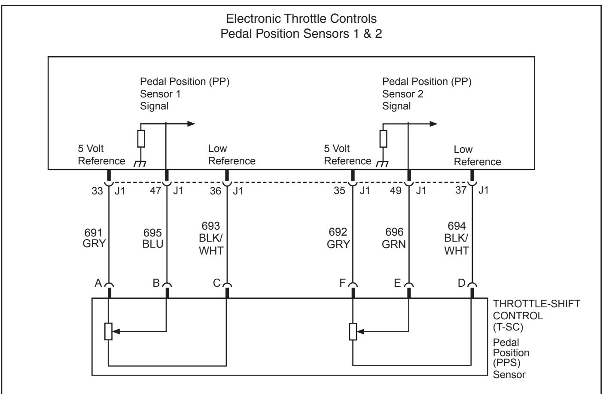

# **SPN 65605, FMI 2 ETC PPS 1 Range (Electronic Throttle Control, Pedal Position Sensor 1 Range)**

# **Circuit Description**

The pedal position (PP) sensors 1 and 2 are located within the throttle-shift control (T-SC) assembly. The engine control module (ECM) supplies each PP sensor with a 5-volt reference circuit and a low reference circuit. Each PP sensor has an individual signal circuit, which provides the ECM with a signal voltage that changes in proportion to the PP sensor (and T-SC lever) position. When the T-SC is in the locked-neutral (idle) position, the PP sensor position is zero percent. As the T-SC lever is moved away from the locked-neutral position, the PP sensor position increases.

At a PP sensor position of zero percent, PP sensor 1 signal voltage is near the low reference, and PP sensor 2 signal voltage is near the 5-volt reference. As the PP sensor position increases, PP sensor 1 signal voltage increases and PP sensor 2 signal voltage decreases.

If the ECM detects that PP sensor 1 signal voltage is not within the correct range, SPN 65605, FMI 2 sets.

# **DTC Descriptor**

This diagnostic procedure supports the following DTC: SPN 65605, FMI 2 ETC PPS 1 Range

# **Conditions for Running the DTC**

- The ignition is ON.
- SPN 65581, SPN 65616 are not set.
- SPN 65605, FMI 2 runs continuously when the above conditions are met.

# **Conditions for Setting the DTC**

- The ECM detects that the PP sensor 1 signal voltage is less than 0.2 volt.
- The ECM detects that the PP sensor 1 signal voltage is more than 4.8 volts.

{217}------------------------------------------------

# **Action Taken When the DTC Sets**

- The ECM illuminates the malfunction indicator lamp (MIL) when the diagnostic runs and fails.
- The ECM commands the system to operate in the Reduced Engine Power mode.
- The ECM commands the throttle actuator to move the throttle plate to an idle position.
- The throttle actuator does not respond to input from the Throttle-Shift Control (T-SC).
- Under certain conditions the ECM commands the engine OFF.

# **Conditions for Clearing the MIL/DTC**

 • The malfunction indicator lamp (MIL) will remain illuminated through the remainder of the ignition cycle. After turning the key off, the MIL will not illuminate on the next malfunction-free ignition cycle.

- An active DTC clears on the next ignition cycle that the diagnostic runs and passes.
- A history DTC clears after 25 consecutive run cycles, if no failures are reported by this diagnostic. Each run cycle must last a minimum of 10 seconds.
- Clear the history DTC with a scan tool.

# **Diagnostic Aids**

The numbers below refer to the step numbers in the diagnostic table.

**4.& 22.** More than one electronic throttle control (ETC) system related DTC may set. This is due to the many redundant tests run continuously on this system. Locating and repairing one individual condition may correct more than one DTC. Keep this in mind when reviewing captured DTC info.

| Step                                                                                                                                                                | Action                                                                                                                                                                                                                                                                                                                     | Values         | Yes                                                                                                      | No                                                                         |  |
|---------------------------------------------------------------------------------------------------------------------------------------------------------------------|----------------------------------------------------------------------------------------------------------------------------------------------------------------------------------------------------------------------------------------------------------------------------------------------------------------------------|----------------|----------------------------------------------------------------------------------------------------------|----------------------------------------------------------------------------|--|
| Schematic Reference: Engine Controls Schematics Connector End View Reference: Engine Control Module (ECM) Connector End Views or Engine Controls Component Views |                                                                                                                                                                                                                                                                                                                            |                |                                                                                                          |                                                                            |  |
| 1                                                                                                                                                                   | Did you perform the "On-Board Diagnostic" (OBD) System Check?                                                                                                                                                                                                                                                              | —              | Go to Step♦2                                                                                             | Go to Diagnostic System Check                                        |  |
| 2                                                                                                                                                                   | 1. Turn ON the ignition, with the engine OFF. 2. With a scan tool, observe the pedal position (PP) sensor 1 voltage with the throttle-shift control (T-SC) in neutral position. Does the scan tool indicate voltage less than the first value or greater than the second value?                                | 0.2 V 4.8 V | Go to Step♦5                                                                                             | Go to Step♦3                                                               |  |
| 3                                                                                                                                                                   | 1. Clear the DTCs with a scan tool. 2. Turn OFF the ignition for 30 seconds. 3. Start the engine. 4. Operate the engine within the Conditions for Running the DTC. Is SPN 65605, FMI 2 the only DTC set?                                                                                                       | —              | Go to Step♦20                                                                                         | Go to Step♦4                                                               |  |
| 4                                                                                                                                                                   | Are there any other DTCs set?                                                                                                                                                                                                                                                                                              | —              | See Diagnostic Aids, Go to Diagnostic Trouble Code (DTC) List Continue to Step 5 | Go to Testing for Intermittent Conditions and Poor Connections |  |
| 5                                                                                                                                                                   | 1. Turn OFF the ignition. 2. Disconnect the throttle-shift control harness connector. 3. Turn ON the ignition, with the engine OFF. 4. Observe the PP Sensor 1 voltage parameter with a scan tool. Does the scan tool indicate voltage at the specified value?                                                 | 0♦V            | Go to Step♦6                                                                                             | Go to Step♦11                                                              |  |
| 6                                                                                                                                                                   | 1. Connect a fused jumper wire between the PP sensor 1 5-volt reference circuit and the PP sensor 1 signal circuit at the throttle-shift control harness connector. 2. Observe the PP sensor 1 voltage parameter with a scan tool. Does the scan tool indicate the PP sensor 1 voltage at the specified value? | 5♦V            | Go to Step♦7                                                                                             | Go to Step♦8                                                               |  |

{218}------------------------------------------------

#### **5 - 146 Section 5 - Diagnosis**

| 7  | Probe the PP sensor 1 low reference circuit with a test lamp connected to B+. Does the test lamp illuminate?                                                                                                              | —   | Go to Step♦17                                  | Go to Step♦13 |
|----|------------------------------------------------------------------------------------------------------------------------------------------------------------------------------------------------------------------------------|-----|---------------------------------------------------|---------------|
| 8  | Measure the voltage of the PP sensor 1 5-volt reference circuit with a DMM. Does the DMM indicate voltage at the specified value?                                                                                         | 5♦V | Go to Step♦10                                  | Go to Step♦9  |
| 9  | Does the DMM indicate voltage less than the specified value on the PP sensor 1 5-volt reference circuit?                                                                                                                  | 5♦V | Go to Step♦14                                  | Go to Step♦16 |
| 10 | Test the PP sensor 1 signal circuit for an open or high resistance. Refer to Circuit Testing and Wiring Repairs. Did you find and correct the condition?                                                               | —   | Go to Step♦21                                  | Go to Step♦12 |
| 11 | Test the PP sensor 1 signal circuit for a short to voltage. Refer to Circuit Testing and Wiring Repairs. Did you find and correct the condition?                                                                       | —   | Go to Step♦21                                  | Go to Step♦19 |
| 12 | Test the PP sensor 1 signal circuit for a short to ground. Refer to Circuit Testing and Wiring Repairs. Did you find and correct the condition?                                                                        | —   | Go to Step♦21                                  | Go to Step♦19 |
| 13 | Test the PP sensor 1 low reference circuit for an open or high resistance. Refer to Circuit Testing and Wiring Repairs. Did you find and correct the condition?                                                        | —   | Go to Step♦21                                  | Go to Step♦19 |
| 14 | Test the PP sensor 1 5-volt reference circuit for an open or high resistance. Refer to Circuit Testing and Wiring Repairs. Did you find and correct the condition?                                                     | —   | Go to Step♦21                                  | Go to Step♦15 |
| 15 | Test the PP sensor 1 5-volt reference circuit for a short to ground. Refer to Circuit Testing and Wiring Repairs. Did you find and correct the condition?                                                              | —   | Go to Step♦21                                  | Go to Step♦19 |
| 16 | Test the PP sensor 1 5-volt reference circuit for a short to voltage. Refer to Circuit Testing and Wiring Repairs. Did you find and correct the condition?                                                             | —   | Go to Step♦21                                  | —             |
| 17 | Inspect for poor connections at the throttle-shift control harness connector. Refer to Testing for Intermittent Conditions and Poor Connections and Connector Repairs. Did you find and correct the condition?      | —   | Go to Step♦21                                  | Go to Step♦18 |
| 18 | Replace the throttle-shift control (T-SC) assembly. Did you complete the replacement?                                                                                                                                     | —   | Go to Step♦21                                  | —             |
| 19 | Inspect for poor connections at the engine control module (ECM) harness connector. Refer to Testing for Intermittent Conditions and Poor Connections and Connector Repairs. Did you find and correct the condition? | —   | Go to Step♦21                                  | Go to Step♦20 |
| 20 | Replace the ECM. Refer to Control Module References for replacement, setup, and programming. Did you complete the replacement?                                                                                         | —   | Go to Step♦21                                  | —             |
| 21 | 1. Clear the DTCs with a scan tool. 2. Turn OFF the ignition for 30♦seconds. 3. Start the engine. 4. Operate the engine within the Conditions for Running the DTC. Did the DTC fail this ignition?               | —   | Go to Step♦2                                      | Go to Step♦22 |
| 22 | Observe the Capture Info with a scan tool. Are there any DTCs that have not been diagnosed?                                                                                                                               | —   | Go to Diagnostic Trouble Code (DTC) List | System OK     |

{219}------------------------------------------------

# **This page left intentionally blank**

{220}------------------------------------------------

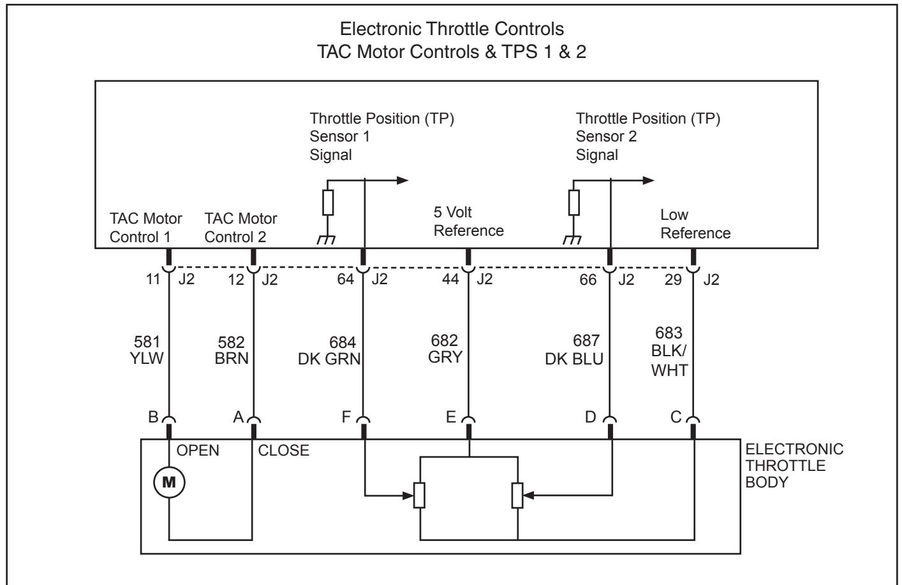

# **Diagnostic Information and Procedures**

# **SPN 65610, FMI 2 ETC TPS 1-2 CORRELATION (Electronic Throttle Control, Throttle Position Sensor 1-2 Correlation)**

# **Circuit Description**

The throttle position (TP) sensors 1 and 2 are located within the throttle body assembly. The ECM supplies the TP sensors with a common 5-volt reference circuit and a common low reference circuit. Each TP sensor has an individual signal circuit, which provides the ECM with a signal voltage that changes in proportion to the throttle plate angle. When the throttle plate is in the closed position, TP sensor 1 signal voltage is near the low reference and TP sensor 2 signal voltage is near the 5-volt reference. As the throttle is opened, TP sensor 1 signal voltage increases and TP sensor 2 signal voltage decreases.

If the ECM detects that the TP sensor voltages are not within a predicted value from each other, SPN 65610, FMI 2 sets.

# **DTC Descriptor**

This diagnostic procedure supports the following DTC: SPN 65610, FMI 2 ETC TPS 1–2 Correlation

# **Conditions for Running the DTC**

- The ignition is ON, with the engine OFF, or the engine is operating.
- SPN 65610, FMI 2 runs continuously once the above condition is met.

# **Conditions for Setting the DTC**

The ECM detects that the difference between TP sensor 1 voltage and TP sensor 2 voltage is more than the predicted value.

{221}------------------------------------------------

# **Action Taken When the DTC Sets**

- The ECM illuminates the malfunction indicator lamp (MIL) when the diagnostic runs and fails.
- The ECM commands the system to operate in the Reduced Engine Power mode.
- The ECM commands the throttle actuator to move the throttle plate to an idle position.
- The throttle actuator does not respond to input from the Throttle-Shift Control (T-SC).
- Under certain conditions the control module commands the engine OFF.

# **Conditions for Clearing the MIL/DTC**

 • The malfunction indicator lamp (MIL) will remain illuminated through the remainder of the ignition cycle. After turning the key off, the MIL will not illuminate on the next malfunction-free ignition cycle.

- An active DTC clears on the next ignition cycle that the diagnostic runs and passes.
- A history DTC clears after 25 consecutive run cycles, if no failures are reported by this diagnostic. Each run cycle must last a minimum of 10 seconds.
- Clear the history DTC with a scan tool.

# **Diagnostic Aids**

The numbers below refer to the step numbers in the diagnostic table.

**2.& 10.** More than one electronic throttle control (ETC) system related DTC may set. This is due to the many redundant tests run continuously on this system. Locating and repairing one individual condition may correct more than one DTC. Keep this in mind when reviewing captured DTC info.

| Step                                                                                                                                                                    | Action                                                                                                                                                                                                                                                                                                                                                                                                                                                                            | Value(s) | Yes                                                                                                      | No                                  |  |
|-------------------------------------------------------------------------------------------------------------------------------------------------------------------------|-----------------------------------------------------------------------------------------------------------------------------------------------------------------------------------------------------------------------------------------------------------------------------------------------------------------------------------------------------------------------------------------------------------------------------------------------------------------------------------|----------|----------------------------------------------------------------------------------------------------------|-------------------------------------|--|
| Schematic Reference: Engine Controls Schematics Connector End View Reference: Engine Control Module (ECM) Connector End Views or Engine Controls Connector End Views |                                                                                                                                                                                                                                                                                                                                                                                                                                                                                   |          |                                                                                                          |                                     |  |
| 1                                                                                                                                                                       | Did you perform the "On-Board Diagnostic" (OBD) System Check?                                                                                                                                                                                                                                                                                                                                                                                                                     | —        | Go to Step 2                                                                                             | Go to Diagnostic System Check |  |
| 2                                                                                                                                                                       | Observe the DTC information with a scan tool. Is SPN 65601 or 65602 also set?                                                                                                                                                                                                                                                                                                                                                                                                  | —        | See Diagnostic Aids, Go to Diagnostic Trouble Code (DTC) List Continue to Step 3 | Go to Step♦3                        |  |
| 3                                                                                                                                                                       | 1. Turn OFF the ignition. 2. Disconnect the throttle position (TP) sensor electrical connector. 3. Disconnect the engine control module (ECM). Refer to Engine Control Module (ECM) Replacement. 4. Measure the resistance of the following circuits with a DMM for each of the TP sensors: • The low reference circuit • The TP sensor signal circuit • The 5-volt reference circuit Is the resistance more than the specified value for any circuit? | 5 Ω      | Go to Step♦7                                                                                             | Go to Step♦4                        |  |
| 4                                                                                                                                                                       | Test the signal circuit of the TP sensor♦1 for a short to the signal circuit of TP sensor♦2. Refer to Circuit Testing and Wiring Repairs. Did you find and correct the condition?                                                                                                                                                                                                                                                                                           | —        | Go to Step♦9                                                                                             | Go to Step♦5                        |  |
| 5                                                                                                                                                                       | Test for an intermittent and for a poor connection at the TP sensor. Refer to Testing for Intermittent Conditions and Poor Connections and Connector Repairs. Did you find and correct the condition?                                                                                                                                                                                                                                                                    | —        | Go to Step♦9                                                                                             | Go to Step♦6                        |  |

{222}------------------------------------------------

#### **5 - 150 Section 5 - Diagnosis**

| 6  | Test for an intermittent and for a poor connection at the ECM. Refer to Testing for Intermittent Conditions and Poor Connections and Connector Repairs. Did you find and correct the condition?                                                     | — | Go to Step♦9                                      | Go to Step♦8  |
|----|-----------------------------------------------------------------------------------------------------------------------------------------------------------------------------------------------------------------------------------------------------------|---|---------------------------------------------------|---------------|
| 7  | Repair the high resistance in the circuit that measured above the specified value. Refer to Wiring Repairs. Did you complete the repair?                                                                                                            | — | Go to Step♦9                                      | —             |
| 8  | Replace the throttle body assembly. Refer to Throttle Body Removal. Did you complete the replacement?                                                                                                                                                  | — | Go to Step♦9                                      | —             |
| 9  | 1. Reconnect the TP sensor and the ECM. 2. Clear the DTCs with a scan tool. 3. Turn OFF the ignition for 30♦seconds. 4. Start the engine. 5. Operate the engine within the Conditions for Running the DTC. Did the DTC fail this ignition? | — | Go to Step♦2                                      | Go to Step♦10 |
| 10 | Observe the Capture Info with a scan tool. Are there any DTCs that have not been diagnosed?                                                                                                                                                            | — | Go to Diagnostic Trouble Code (DTC) List | System OK     |

{223}------------------------------------------------

# **This page left intentionally blank**

{224}------------------------------------------------

# **SPN 65613, FMI 2 ETC PPS 1-2 Correlation (Electronic Throttle Control, Pedal Position Sensor 1-2 Correlation)**

# **Circuit Description**

The pedal position (PP) sensors 1 and 2 are located within the throttle-shift control (T-SC) assembly. The engine control module (ECM) supplies each PP sensor with a 5-volt reference circuit and a low reference circuit. Each PP sensor has an individual signal circuit, which provides the ECM with a signal voltage that changes in proportion to the PP sensor (and T-SC lever) position. When the T-SC is in the locked-neutral (idle) position, the PP sensor position is zero percent. As the T-SC lever is moved away from the locked-neutral position, the PP sensor position increases.

At a PP sensor position of zero percent, PP sensor 1 signal voltage is near the low reference, and PP sensor 2 signal voltage is near the 5-volt reference. As the PP sensor position increases, PP sensor 1 signal voltage increases and PP sensor 2 signal voltage decreases.

If the ECM detects that the PP sensor voltages are not within a predicted value from each other, SPN 65613, FMI 2 sets.

# **DTC Descriptor**

This diagnostic procedure supports the following DTC: SPN 65613, FMI 2 ETC PPS 1-2 Correlation

# **Conditions for Running the DTC**

- SPN 65581 is not set.
- The ignition is ON.
- SPN 65613, FMI 2 runs continuously once the above conditions are met.

# **Conditions for Setting the DTC**

The ECM detects that the PP sensor voltages are not within a predicted value from each other.

{225}------------------------------------------------

# **Action Taken When the DTC Sets**

- The ECM illuminates the malfunction indicator lamp (MIL) when the diagnostic runs and fails.
- The ECM commands the system to operate in the Reduced Engine Power mode.
- The ECM commands the throttle actuator to move the throttle plate to an idle position.
- The throttle actuator does not respond to input from the Throttle-Shift Control (T-SC).
- Under certain conditions the ECM commands the engine OFF.

# **Conditions for Clearing the MIL/DTC**

 • The malfunction indicator lamp (MIL) will remain illuminated through the remainder of the ignition cycle. After turning the key off, the MIL will not illuminate on the next malfunction-free ignition cycle.

- An active DTC clears on the next ignition cycle that the diagnostic runs and passes.
- A history DTC clears after 25 consecutive run cycles, if no failures are reported by this diagnostic. Each run cycle must last a minimum of 10 seconds.
- Clear the history DTC with a scan tool.

# **Diagnostic Aids**

The numbers below refer to the step numbers in the diagnostic table.

**2.& 10.** More than one electronic throttle control (ETC) system related DTC may set. This is due to the many redundant tests run continuously on this system. Locating and repairing one individual condition may correct more than one DTC. Keep this in mind when reviewing captured DTC info.

| Step                                                                                                                                                                    | Action                                                                                                                                                                                                                                                                                                                                                                                                                                                                  | Values | Yes                                                                                                      | No                                  |  |
|-------------------------------------------------------------------------------------------------------------------------------------------------------------------------|-------------------------------------------------------------------------------------------------------------------------------------------------------------------------------------------------------------------------------------------------------------------------------------------------------------------------------------------------------------------------------------------------------------------------------------------------------------------------|--------|----------------------------------------------------------------------------------------------------------|-------------------------------------|--|
| Schematic Reference: Engine Controls Schematics Connector End View Reference: Engine Control Module (ECM) Connector End Views or Engine Controls Connector End Views |                                                                                                                                                                                                                                                                                                                                                                                                                                                                         |        |                                                                                                          |                                     |  |
| 1                                                                                                                                                                       | Did you perform the "On-Board Diagnostic" (OBD) System Check?                                                                                                                                                                                                                                                                                                                                                                                                           | —      | Go to Step♦2                                                                                             | Go to Diagnostic System Check |  |
| 2                                                                                                                                                                       | Observe the DTC information with a scan tool. Are there any other DTCs set?                                                                                                                                                                                                                                                                                                                                                                                          | —      | See Diagnostic Aids, Go to Diagnostic Trouble Code (DTC) List Continue to Step 3 | Go to Step♦3                        |  |
| 3                                                                                                                                                                       | 1. Turn OFF the ignition. 2. Disconnect the pedal position (PP) sensor electrical connector. 3. Disconnect the engine control module (ECM). Refer to Engine Control Module (ECM) Replacement. 4. Measure the resistance of the following circuits with a DMM for each of the PP sensors: • The low reference circuits • The signal circuits • The 5-volt reference circuits Is the resistance more than the specified value for any circuit? | 5♦Ω    | Go to Step♦7                                                                                             | Go to Step♦4                        |  |
| 4                                                                                                                                                                       | Test the signal circuit of PP sensor♦1 for a short to the signal circuit of the PP sensor♦2. Refer to Circuit Testing and Wiring Repairs. Did you find and correct the condition?                                                                                                                                                                                                                                                                                 | —      | Go to Step♦9                                                                                             | Go to Step♦5                        |  |
| 5                                                                                                                                                                       | Test for an intermittent and for a poor connection at the PP sensor. Refer to Testing for Intermittent Conditions and Poor Connections and Connector Repairs. Did you find and correct the condition?                                                                                                                                                                                                                                                          | —      | Go to Step♦9                                                                                             | Go to Step♦6                        |  |

{226}------------------------------------------------

#### **5 - 154 Section 5 - Diagnosis**

| 6  | Test for an intermittent and for a poor connection at the ECM. Refer to Testing for Intermittent Conditions and Poor Connections and Connector Repairs. Did you find and correct the condition?                                                     | — | Go to Step♦9                                      | Go to Step♦8  |
|----|-----------------------------------------------------------------------------------------------------------------------------------------------------------------------------------------------------------------------------------------------------------|---|---------------------------------------------------|---------------|
| 7  | Repair the high resistance in the circuit that measured above the specified value. Refer to Wiring Repairs. Did you complete the repair?                                                                                                            | — | Go to Step♦9                                      | —             |
| 8  | Replace the throttle-shift control (T-SC) assembly. Did you complete the replacement?                                                                                                                                                                  | — | Go to Step♦9                                      | —             |
| 9  | 1. Reconnect the PP sensor and the ECM. 2. Clear the DTCs with a scan tool. 3. Turn OFF the ignition for 30♦seconds. 4. Start the engine. 5. Operate the engine within the Conditions for Running the DTC. Did the DTC fail this ignition? | — | Go to Step♦2                                      | Go to Step♦10 |
| 10 | Observe the Capture Info with a scan tool. Are there any DTCs that have not been diagnosed?                                                                                                                                                            | — | Go to Diagnostic Trouble Code (DTC) List | System OK     |

{227}------------------------------------------------

# **This page left intentionally blank**

{228}------------------------------------------------

# **SPN 65615, FMI 7 ETC Actuation (Electronic Throttle Control Actuation)**

# **Circuit Description**

The commanded throttle position is compared to the actual throttle position. The commanded throttle position is based on input from the Pedal Position (PP) sensors 1 and 2 in the Throttle-Shift Control (T-SC) housing. Actual throttle position is detected by the Throttle Position (TP) sensors 1 and 2 in the throttle body. The commanded and actual throttle positions should be within a calibrated range of each other. The engine control module (ECM) continuously monitors the commanded and actual throttle positions. This DTC sets if the commanded and actual positions differ by more than the allowable range.

# **DTC Descriptor**

This diagnostic procedure supports the following DTC: SPN 65615, FMI 7 ETC Actuation

# **Conditions for Running the DTC**

- The ignition is ON.
- The engine is running, OR

the engine is not running, and less than 10 seconds have passed since the key was turned on, OR the engine is not running, and the T-SC has been in the locked-neutral (idle) position for less than 10 seconds.

• SPN 65618, FMI 7 ETC Return Fault is not set.

# **Conditions for Setting the DTC**

The difference between the commanded and the actual throttle position is more than a calibrated amount.

{229}------------------------------------------------

# **Section 5 - Diagnosis 5 - 157**

NOTE: This DTC will not set if all of the following conditions are present: The throttle actuator motor circuit is OPEN, the ignition is on, the throttle plate is in the spring loaded rest position, the Throttle-Shift Control (T-SC) is in the locked-neutral (idle) position, and the engine is not started. The code will set if the engine is then started, or if the T-SC is moved, or if the throttle plate is moved within 10 seconds of turning the ignition on.

# **Action Taken When the DTC Sets**

- The ECM illuminates the malfunction indicator lamp (MIL) when the diagnostic runs and fails.
- The ECM commands the system to operate in the Reduced Engine Power mode.
- The throttle plate is allowed to return to the rest position, as determined by the springs in the throttle body.
- The throttle actuator does not respond to input from the Throttle-Shift Control (T-SC).
- Under certain conditions the control module commands the engine OFF.

# **Conditions for Clearing the MIL/DTC**

 • The malfunction indicator lamp (MIL) will remain illuminated through the remainder of the ignition cycle. After turning the key off, the MIL will not illuminate on the next malfunction-free ignition cycle. See Note above, in Conditions for Setting the DTC.

 • An active DTC clears on the next ignition cycle that the diagnostic runs and passes. See Note above, in Conditions for setting the DTC.

 • A history DTC clears after 25 consecutive run cycles, if no failures are reported by this diagnostic. Each run cycle must last a minimum of 10 seconds.

• Clear the history DTC with a scan tool.

# **Diagnostic Aids**

The throttle plate is spring loaded to a slightly open position. The throttle plate should be open approximately 20–25 percent. This is referred to as the rest position. The throttle plate should not be completely closed nor should it be open any more than the specified amount. The throttle plate should move open and to the closed position without binding under the normal spring pressure. The throttle should NOT be free to move open or closed WITHOUT spring pressure. Replace the throttle body if any of these conditions are found.

Inspect for mechanical conditions or binding that may be temperature related. Components may not move freely in extreme heat or cold due to the presence of contaminants or ice formation.

**Important:** Operating the throttle plate with the Throttle Blade Control function of the scan tool may cause additional DTCs to set. Do not attempt to diagnose DTCs set during this function.

The scan tool has the ability to operate the throttle control system using special functions. Actuate the throttle plate using the Throttle Blade Control function of the scan tool. This function will operate the throttle plate through the entire range in order to determine if the throttle body and system operate correctly.

Check for the following conditions:

• Use the J 35616 Connector Test Adapter Kit for any test that requires probing the engine control module (ECM)

harness connector or a component harness connector.

- Poor connections at the ECM or at the component—Inspect the harness connectors for a poor terminal to wire connection. Refer to Testing for Intermittent Conditions and Poor Connections for the proper procedure.
- For intermittent, refer to Testing for Intermittent Conditions and Poor Connections.

The numbers below refer to the step numbers in the diagnostic table.

**2.& 20.** More than one electronic throttle control (ETC) system related DTC may set. This is due to the many redundant tests run continuously on this system. Locating and repairing one individual condition may correct more than one DTC. Keep this in mind when reviewing captured DTC info.

# **Test Description**

The numbers below refer to the step numbers in the diagnostic table.

**8.& 9.** When the ignition is turned ON, the ECM operates the Throttle Actuator Control (TAC) motor to verify the integrity of the system prior to start-up. This can be seen by the momentary flash of the test lamp as the ignition is turned ON.

{230}------------------------------------------------

| Step                                                                                                                                                                    | Action                                                                                                                                                                                                                                                                                                                                                                                                                                                      | Values | Yes                                                                             | No                                  |
|-------------------------------------------------------------------------------------------------------------------------------------------------------------------------|-------------------------------------------------------------------------------------------------------------------------------------------------------------------------------------------------------------------------------------------------------------------------------------------------------------------------------------------------------------------------------------------------------------------------------------------------------------|--------|---------------------------------------------------------------------------------|-------------------------------------|
| Schematic Reference: Engine Controls Schematics Connector End View Reference: Engine Controls Connector End Views or Engine Control Module (ECM) Connector End Views |                                                                                                                                                                                                                                                                                                                                                                                                                                                             |        |                                                                                 |                                     |
| 1                                                                                                                                                                       | Did you perform the "On-Board Diagnostic" (OBD) System Check?                                                                                                                                                                                                                                                                                                                                                                                               | —      | Go to Step♦2                                                                    | Go to Diagnostic System Check |
| 2                                                                                                                                                                       | Is SPN 65601, 65602, 65604, 65605, 65610, or 65613 also set?                                                                                                                                                                                                                                                                                                                                                                                                | —      | See Diagnostic Aids, Go to Diagnostic Trouble Code (DTC) List | Go to Step♦3                        |
| 3                                                                                                                                                                       | 1. Turn ON the ignition, with the engine OFF. 2. Observe the throttle position (TP) angle parameter (visually or using a scan tool). 3. Move the throttle-shift control (T-SC) away from neutral (idle), and back to neutral (idle) several times. Does the TP angle parameter increase as the throttle-shift control (T-SC) is moved away from neutral (idle) and decrease as the T-SC is returned to neutral (idle)?                 | —      | Go to Step♦4                                                                    | Go to Step♦5                        |
| 4                                                                                                                                                                       | 1. Observe the Conditions for Running this DTC. 2. Start the engine. 3. Operate the engine within the Conditions for Running the DTC. Did the DTC fail this ignition?                                                                                                                                                                                                                                                                              | —      | Go to Step♦5                                                                    | Go to Diagnostic Aids            |
| 5                                                                                                                                                                       | 1. Turn OFF the ignition. 2. Refer to Diagnostic Aids, and inspect the throttle body for the following conditions: • A throttle plate that is NOT in the rest position • A throttle plate that is binding open or closed • A throttle plate that is free to move open or closed WITHOUT spring pressure Did you find any of these conditions with the throttle body?                                                                   | —      | Go to Step 17                                                                   | Go to Step 6                        |
| 6                                                                                                                                                                       | Important: The test lamp may momentarily flash when testing these circuits. This is considered normal. 1. Disconnect the throttle body harness connector. 2. Turn ON the ignition, with the engine OFF. 3. Probe the throttle actuator control (TAC) motor circuits (1 and 2) of the throttle body harness connector with a test lamp that is connected to ground. Did the test lamp illuminate and remain illuminated on either circuit? | —      | Go to Step 10                                                                   | Go to Step 7                        |
| 7                                                                                                                                                                       | Important: The test lamp may momentarily flash when testing these circuits. This is considered normal. Probe the TAC motor circuits 1 and 2 of the throttle body harness connector with the test lamp connected to battery positive. Did the test lamp illuminate and remain illuminated on either circuit?                                                                                                                                     | —      | Go to Step♦11                                                                | Go to Step♦8                        |
| 8                                                                                                                                                                       | 1. Turn OFF the ignition. 2. Connect the test lamp between the TAC motor circuit 1 of the throttle body harness connector and battery ground. Important: Ensure that the ECM completely powers down. This can be verified by loss of communication with the scan tool. 3. Observe the test lamp as you turn ON the ignition. Does the test lamp flash ON and then turn OFF?                                                               | —      | Go to Step♦9                                                                    | Go to Step♦12                       |
| 9                                                                                                                                                                       | 1. Turn OFF the ignition. 2. Connect a test lamp between the TAC motor circuit 2 of the throttle body harness connector and battery ground. Important: Ensure that the ECM completely powers down. This can be verified by loss of communication with the scan tool. 3. Observe the test lamp as you turn ON the ignition. Does the test lamp flash ON and then OFF?                                                                      | —      | Go to Step♦13                                                                | Go to Step♦12                       |

{231}------------------------------------------------

#### **Section 5 - Diagnosis 5 - 159**

| 10 | 1. Turn OFF the ignition. 2. Disconnect the ECM connector (J2) that contains the TAC motor circuits. 3. Turn ON the ignition, with the engine OFF. 4. Probe the TAC motor circuits 1 and 2 with the test lamp connected to ground. Does the test lamp illuminate?             | — | Go to Step♦15                                  | Go to Step♦18 |
|----|----------------------------------------------------------------------------------------------------------------------------------------------------------------------------------------------------------------------------------------------------------------------------------------------|---|---------------------------------------------------|---------------|
| 11 | 1. Turn OFF the ignition. 2. Disconnect the ECM connector (J2) that contains the TAC motor circuits. 3. Probe the TAC motor circuits 1 and 2 with the test lamp connected to battery positive. Does the test lamp illuminate?                                                    | — | Go to Step♦16                                  | Go to Step♦18 |
| 12 | 1. Turn OFF the ignition. 2. Disconnect the ECM connector (J2) that contains the TAC motor circuits. 3. Test the TAC motor circuits 1 and 2 for an open or high resistance. 4. Repair the circuit as necessary. Refer to Wiring Repairs. Did you find and correct the condition? | — | Go to Step♦19                                  | Go to Step♦14 |
| 13 | Test for a poor connection or terminal tension at the throttle body connector. Refer to Testing for Intermittent Conditions and Poor Connections and Connector Repairs. Did you find and correct the condition?                                                                     | — | Go to Step♦19                                  | Go to Step♦17 |
| 14 | Test for a poor connection or terminal tension at the ECM. Refer to Testing for Intermittent Conditions and Poor Connections and Connector Repairs. Did you find and correct the condition?                                                                                            | — | Go to Step♦19                                  | Go to Step♦18 |
| 15 | Repair the short to voltage on the circuit where the test lamp remained illuminated. Refer to Wiring Repairs. Did you complete the repair?                                                                                                                                             | — | Go to Step♦19                                  | —             |
| 16 | Repair the short to ground on the circuit where the test lamp remained illuminated. Refer to Wiring Repairs. Did you complete the repair?                                                                                                                                              | — | Go to Step♦19                                  | —             |
| 17 | Replace the throttle body assembly. Refer to Throttle Body Assembly Replacement. Did you complete the replacement?                                                                                                                                                                     | — | Go to Step♦19                                  | —             |
| 18 | Replace the ECM. Refer to Control Module References for replacement, setup, and programming. Did you complete the replacement?                                                                                                                                                         | — | Go to Step♦19                                  | —             |
| 19 | 1. Clear the DTCs with a scan tool. 2. Turn OFF the ignition for 30♦seconds. 3. Start the engine. 4. Operate the engine within the Conditions for Running the DTC. Did the DTC fail this ignition?                                                                               | — | Go to Step♦2                                      | Go to Step♦20 |
| 20 | Observe the Capture Info with a scan tool. Are there any DTCs that have not been diagnosed?                                                                                                                                                                                               | — | Go to Diagnostic Trouble Code (DTC) List | System OK     |

{232}------------------------------------------------

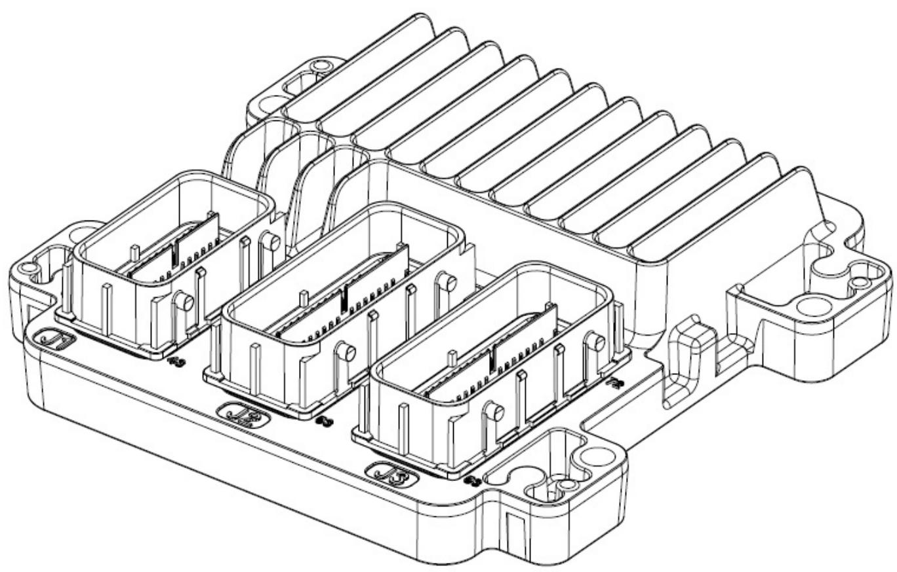

# **Diagnostic Information and Procedures**

# **SPN 65616, FMI 12 ETC Process (Electronic Throttle Control Process)**

# **Circuit Description**

The throttle actuator control (TAC) system uses two pedal position (PP) sensors to monitor the pedal position. Two processors are also used to monitor the TAC system data. The engine control module (ECM) performs an intrusive test in order to detect that the PP signals are not shorted together. The ECM accomplishes this by pulling the PP sensor 2 low momentarily and looking for sensor 1 to also be low. The TAC system also performs this test on the throttle position (TP) sensors. This diagnostic monitors the transistor used to pull one pedal and one throttle sensor to ground simultaneously. Additionally, both processors monitor each other's data to verify that the indicated PP calculation is correct. If the transistor does not toggle within a calibrated period, or the indicated PP calculation is incorrect, SPN 65616, FMI 12 sets.

# **DTC Descriptor**

This diagnostic procedure supports the following DTC: SPN 65616, FMI 12 ETC Process (Control Module Pedal Position (PP) System Performance)

# **Conditions for Running the DTC**

- The system voltage is more than 5.23 volts.
- The ignition switch is in the Run or the Crank position.
- SPN 65580, 65581 are not set.
- SPN 65616 runs continuously when the above conditions are met.

{233}------------------------------------------------

# **Conditions for Setting the DTC**

 • The PP sensor 2 voltage is more than 2.05 volts for more than 0.3 second during the intrusive test. OR

• The PP sensor calculations in the main processor differ from the motor control processor by more than 5 percent.

# **Action Taken When the DTC Sets**

- The control module illuminates the malfunction indicator lamp (MIL) when the diagnostic runs and fails.
- The control module records the operating conditions at the time the diagnostic fails.
- The control module commands the TAC system to operate in the Reduced Engine Power mode.
- Under certain conditions the control module commands the engine OFF.

# **Conditions for Clearing the MIL/DTC**

 • The control module turns OFF the malfunction indicator lamp (MIL) after consecutive ignition cycles that the diagnostic runs and does not fail.

• A current DTC, Last Test Failed, clears when the diagnostic runs and passes.

 • A history DTC clears after 25 consecutive warm-up cycles, if no failures are reported by this or any other emission related diagnostic.

• Clear the MIL and the DTC with a scan tool.

# **Test Description**

The numbers below refer to the step numbers on the diagnostic table.

**2.** A SPN 65616, FMI 12 indicates that the ECM is not programmed.

 **5.** Resistance is measured at the pedal assembly because a pedal resistance that is lower than the specified value will set this DTC.

| Step                                                                                                                                                                    | Action                                                                                                                                                                                                                                                                                                                                                                                                                   | Values | Yes          | No                                  |  |
|-------------------------------------------------------------------------------------------------------------------------------------------------------------------------|--------------------------------------------------------------------------------------------------------------------------------------------------------------------------------------------------------------------------------------------------------------------------------------------------------------------------------------------------------------------------------------------------------------------------|--------|--------------|-------------------------------------|--|
| Schematic Reference: Engine Controls Schematics Connector End View Reference: Engine Control Module (ECM) Connector End Views or Engine Controls Connector End Views |                                                                                                                                                                                                                                                                                                                                                                                                                          |        |              |                                     |  |
| 1                                                                                                                                                                       | Did you perform the "On-Board Diagnostic" (OBD) System Check?                                                                                                                                                                                                                                                                                                                                                            | —      | Go to Step♦2 | Go to Diagnostic System Check |  |
| 2                                                                                                                                                                       | Is SPN 65616 set?                                                                                                                                                                                                                                                                                                                                                                                                        | —      | Go to Step♦3 | Go to Step♦5                        |  |
| 3                                                                                                                                                                       | Program the engine control module (ECM). Refer to Service Programming System (SPS). Does SPN 65616 reset?                                                                                                                                                                                                                                                                                                          | —      | Go to Step♦4 | Go to Step♦8                        |  |
| 4                                                                                                                                                                       | 1. Ensure that all tool connections are secure. 2. Ensure that the programming equipment is operating correctly. 3. Ensure that the correct software/calibration package is used. 4. Attempt to program the ECM. Refer to Service Programming System (SPS). Does DTC P0602 reset?                                                                                                                         | —      | Go to Step♦7 | Go to Step♦8                        |  |
| 5                                                                                                                                                                       | 1. Turn OFF the ignition. 2. Disconnect the throttle-shift control connector. 3. Ensure that the throttle-shift control is at the neutral position. 4. Measure the resistance from the 5-volt reference of the pedal position to the pedal position (PP) sensor♦2 signal of the throttle-shift control assembly with a DMM. Refer to Circuit Testing. Is the resistance less than the specified value? | 300♦Ω  | Go to Step♦6 | Go to Step♦7                        |  |
| 6                                                                                                                                                                       | Replace the throttle-shift control (T-SC) assembly. Did you complete the replacement?                                                                                                                                                                                                                                                                                                                                 | —      | Go to Step♦8 | —                                   |  |

{234}------------------------------------------------

#### **5 - 162 Section 5 - Diagnosis**

| 7 | Replace the ECM. Refer to Control Module References for replacement, setup, and programming. Did you complete the replacement?       | — | Go to Step♦8                                      | —            |
|---|--------------------------------------------------------------------------------------------------------------------------------------------|---|---------------------------------------------------|--------------|
| 8 | 1. Clear the DTCs with a scan tool. 2. Turn OFF the ignition for 30 seconds. 3. Start the engine. Did the DTC fail this ignition? | — | Go to Step♦2                                      | Go to Step♦9 |
| 9 | Observe the Capture Info with a scan tool. Are there any DTCs that have not been diagnosed?                                             | — | Go to Diagnostic Trouble Code (DTC) List | System OK    |

{235}------------------------------------------------

**This page left intentionally blank**

{236}------------------------------------------------

# **Diagnostic Information and Procedures**

# **SPN 65618, FMI 7 ETC Return Fault (Electronic Throttle Control Return Fault) Circuit Description**

When the key is turned on, prior to starting the engine, the engine control module (ECM) determines if the throttle plate has returned to the correct spring-loaded rest position. The throttle position (TP) sensors provide this information to the ECM. If the ECM detects that the throttle plate is not at the correct position, this DTC is set.

# **DTC Descriptor**

This diagnostic procedure supports the following DTC: SPN 65618, FMI 7 ETC Return Fault

# **Conditions for Running the DTC**

- The ignition is ON, and the engine is OFF.
- The ignition voltage is more than 10 volts.
- SPN 65618 runs once when the above conditions are met.

# **Conditions for Setting the DTC**

• The ECM detects that the throttle plate is not in the rest position.

# **Action Taken When the DTC Sets**

- The ECM illuminates the malfunction indicator lamp (MIL) when the diagnostic runs and fails.
- The ECM commands the system to operate in the Reduced Engine Power mode.
- When the engine is started, the ECM commands the throttle actuator to move the throttle plate to an idle position. (Note that this may not occur if there is an obstruction.)
- The throttle actuator does not respond to input from the Throttle-Shift Control (T-SC).

{237}------------------------------------------------

# **Conditions for Clearing the MIL/DTC**

 • The malfunction indicator lamp (MIL) will remain illuminated through the remainder of the ignition cycle. After turning the key off, the MIL will not illuminate on the next malfunction-free ignition cycle.

- An active DTC clears on the next ignition cycle that the diagnostic runs and passes.
- A history DTC clears after 25 consecutive run cycles, if no failures are reported by this diagnostic. Each run cycle

must last for a minimum of 10 seconds.

• Clear the history DTC with a scan tool.

# **Diagnostic Aids**

The throttle plate is spring loaded to a slightly open position. The throttle plate should be open approximately 20–25 percent. This is referred to as the rest position. The throttle plate should not be completely closed nor should it be open any more than the specified amount. The throttle plate should move open and to the closed position without binding under the normal spring pressure. The throttle should NOT be free to move open or closed WITHOUT spring pressure. Replace the throttle body if any of these conditions are found.

**Important:** Operating the throttle plate with the Throttle Blade Control function of the scan tool may cause additional DTCs to set. Do not attempt to diagnose DTCs set during this function.

Inspect for mechanical conditions or binding that may be temperature related. Components may not move freely in extreme heat or cold due to the presence of contaminants or ice formation.

The numbers below refer to the step numbers in the diagnostic table.

**2.& 8.** More than one electronic throttle control (ETC) system related DTC may set. This is due to the many redundant tests run continuously on this system. Locating and repairing one individual condition may correct more than one DTC. Keep this in mind when reviewing captured DTC info.

| Step                                                                                                                                                                    | Action                                                                                                                                                                                                                                                                                                                                                             | Values | Yes                                                                                                         | No                                  |  |
|-------------------------------------------------------------------------------------------------------------------------------------------------------------------------|--------------------------------------------------------------------------------------------------------------------------------------------------------------------------------------------------------------------------------------------------------------------------------------------------------------------------------------------------------------------|--------|-------------------------------------------------------------------------------------------------------------|-------------------------------------|--|
| Schematic Reference: Engine Controls Schematics Connector End View Reference: Engine Control Module (ECM) Connector End Views or Engine Controls Connector End Views |                                                                                                                                                                                                                                                                                                                                                                    |        |                                                                                                             |                                     |  |
| 1                                                                                                                                                                       | Did you perform the "On-Board Diagnostic" (OBD) System Check?                                                                                                                                                                                                                                                                                                      | —      | Go to Step♦2                                                                                                | Go to Diagnostic System Check |  |
| 2                                                                                                                                                                       | Are any other DTCs set?                                                                                                                                                                                                                                                                                                                                            | —      | See Diagnostic Aids, Refer to Diagnostic Trouble Code (DTC) List Continue to Step 3 | Go to Step♦3                        |  |
| 3                                                                                                                                                                       | 1. Turn OFF the ignition for 30♦seconds. 2. Turn ON the ignition, with the engine OFF. 3. Allow the Throttle-Shift Control (T-SC) to remain in the locked-neutral (idle) position for 20♦seconds. 4. Observe the indicated throttle position parameter with a scan tool. Does the scan tool indicate throttle position within the specified values? | 15–25% | Go to Step♦6                                                                                                | Go to Step♦4                        |  |
| 4                                                                                                                                                                       | Check for obstructions preventing the throttle plate from returning to the rest position. If necessary, remove the throttle body assembly for a thorough examination. Refer to Throttle Body Assembly Replacement. Did you find an obstruction?                                                                                                           | —      | Go to Step♦5                                                                                                | Go to Step♦6                        |  |
| 5                                                                                                                                                                       | Remove the obstruction and reinstall the throttle body. Did you complete the action?                                                                                                                                                                                                                                                                            | —      | Go to Step♦7                                                                                                | —                                   |  |

{238}------------------------------------------------

#### **5 - 166 Section 5 - Diagnosis**

| 6 | Replace the throttle body assembly. Refer to Throttle Body Assembly Replacement. Did you complete the replacement?                                                                                                                                 | — | Go to Step♦7                                      | —            |
|---|----------------------------------------------------------------------------------------------------------------------------------------------------------------------------------------------------------------------------------------------------------|---|---------------------------------------------------|--------------|
| 7 | 1. Clear the DTCs with a scan tool. 2. Turn OFF the ignition for 30♦seconds. 3. Place the Throttle-Shift Control (T-SC) in the locked-neutral (idle) position. 4. Turn ON the ignition, with the engine OFF. Did the DTC fail this ignition? | — | Go to Step♦2                                      | Go to Step♦8 |
| 8 | Observe the Capture Info with a scan tool. Are there any DTCs that have not been diagnosed?                                                                                                                                                           | — | Go to Diagnostic Trouble Code (DTC) List | System OK    |

{239}------------------------------------------------

**This page left intentionally blank**

{240}------------------------------------------------

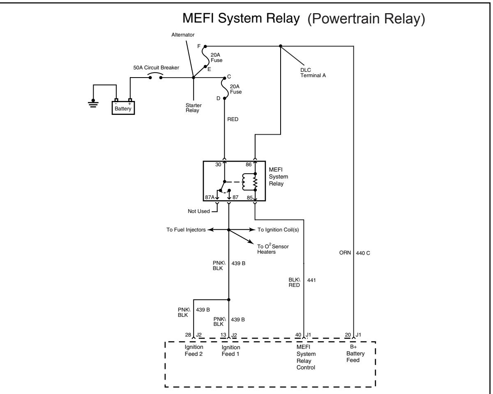

# **Diagnostic Information and Procedures**

**SPN 66013, FMI 5 Powertrain Relay Short Low SPN 66013, FMI 6 Powertrain Relay Short High SPN 66013, FMI 7 Powertrain Relay Open SPN 66014, FMI 4 Powertrain Relay Contact Low**

# **(Note: The MEFI System Relay is referred to as a "Powertrain Relay" by the SAE J1939 standard.)**

# **Circuit Description**

The MEFI system relay is a normally open relay. The relay armature is held in the open position by spring tension. Battery positive voltage is supplied directly to the relay coil and the armature contact at all times. The engine control module (ECM) supplies the ground path to the relay coil control circuit via an internal integrated circuit called an output driver module (ODM). The ODM output control is configured to operate as a low side driver for the main relay. The ODM for the main relay also incorporates a fault detection circuit, which is continuously monitored by the ECM. When the ECM commands the main relay ON, ignition voltage is supplied to the following circuits

- ECM Pin J2-13 & J2-28
- Injectors
- Coil & Ignition Module

The ignition voltage that is supplied to the ECM through the Powertrain (MEFI System) fuse, provides power to the internal ECM circuits associated with the throttle actuator control (TAC) operation. The ECM also monitors the voltage level on the ignition voltage circuit to confirm that the main relay contacts have closed.

{241}------------------------------------------------

# **DTC Descriptor**

This diagnostic procedure supports the following DTCs: SPN 66013, FMI 5 Powertrain (MEFI System) Relay Short Low SPN 66013, FMI 6 Powertrain (MEFI System) Relay Short High SPN 66013, FMI 7 Powertrain (MEFI System) Relay Open SPN 66014, FMI 4 Powertrain (MEFI System) Relay Contact Low

# **Conditions for Setting the DTC**

#### **SPN 66013**

- The commanded state of the ODM and the actual state of the control circuit do not match.
- The condition is present for more than 5 seconds.

Note: This code deals with pin 85 (Supplied ground to activate - ECM ODM) and pin 86 (B+) of the relay coil circuit.

## **SPN 66014**

 • The ECM detects less than 10 volts on the ignition voltage circuit from the Powertrain (MEFI System) fuse to the ECM.

Note: This code deals with pin 30 (B+) and pin 87 (Output Voltage – Ignition 1) of the relay contact circuit.

# **Action Taken When the DTC Sets**

- The control module stores the DTC information into memory when the diagnostic runs and fails.
- The malfunction indicator lamp (MIL) will illuminate.
- The driver information center, if equipped, may display a message.

# **Conditions for Clearing the DTC**

- A current DTC clears when the diagnostic runs and passes.
- A history DTC clears after 25 consecutive run cycles, if this or any other related diagnostic reports no other failures.
- Clear the DTC with a scan tool.

# **Diagnostic Aids**

 • This test procedure requires that the vehicle battery has passed a load test and is completely charged. Refer to Battery Inspection/Test.

 • When disconnecting electrical connectors or removing fuses and relays, always inspect the component electrical terminals for corrosion and the mating electrical terminals for tightness.

# **Reference Information**

# **Schematic Reference**

#### Engine Controls Schematics **Connector End View Reference**

- Engine Controls Connector End Views
- Electrical Center Identification Views
- Engine Control Module (ECM) Connector End Views

## **Electrical Information Reference**

- Circuit Testing
- Connector Repairs
- Testing for Intermittent Conditions and Poor Connections
- Wiring Repairs

{242}------------------------------------------------

# **Scan Tool Reference**

- Scan Tool Data List
- Scan Tool Data Definitions
- Scan Tool Output Controls

# **Circuit/System Verification**

**1.** With the ignition ON, engine OFF, command the MEFI System relay ON and OFF several times using the scan tool output control function. If this function is not available on the scan tool, turn the key ON and OFF. You should either hear or feel the relay click with each command.

**2.** With the ignition OFF, connect one lead of a test lamp to ground, and probe both sides of each of the following fuses:

- Powertrain (MEFI System) Relay Fuse (Connected to MEFI System Relay Pin 30)
- ECM Battery Fuse (Connected to MEFI System Relay Pin 86)

The lamp should illuminate on at least one side of each fuse, at all times. If not, check the main circuit breaker, and continue with Circuit/System Testing.

**3.** With the ignition ON, engine OFF, ignition voltage should be present on the MEFI System Relay Pin 87, enabling the following circuits:

- ECM Pin J2-13 & J2-28
- Injectors
- Coil & Ignition Module

The test lamp should illuminate on at least one test point of each circuit. If the test lamp does not illuminate continue with Circuit/System Testing.

If the boat passes the Circuit/System Verification test, operate the boat within the Conditions for Running the DTC. The other option is to refer to Testing for Intermittent Conditions and Poor Connections.

# **Circuit/System Testing**

**1.** With the ignition OFF, remove the Powertrain (MEFI System) relay.

**2.** With the ignition ON, measure for battery positive voltage (B+) between the relay coil voltage supply circuit (pin 86) and ground.

If the voltage measures less than B+, repair the open or high resistance in the circuit to the relay coil. All wire circuit resistance should measure less than 2 ohms.

**3.** Measure for voltage between the relay coil control circuit (pin 85) and ground.

If voltage is measured on the control circuit of the relay, test for a short to voltage or a faulty ECM.

**4.** Connect a test lamp between the battery positive voltage supply circuit (pin 86) of the relay coil and the relay coil control circuit (pin 85). Use a scan tool to command the main relay ON and OFF. The test lamp should turn ON and OFF when toggling between the commanded states.

If the test lamp stays ON all the time, test for a short to ground on the relay coil control circuit or a faulty ECM.

If the test lamp stays OFF all the time, test for an open or high resistance on the relay coil control circuit or a faulty ECM. All wire circuit resistance should measure less than 2 ohms.

**5.** Measure for B+ between the relay armature supply circuit (pin 30), and ground.

If the voltage measures less than B+, repair the open or high resistance in the circuit to the relay armature. All wire circuit resistance should measure less than 2 ohms.

**6.** Connect a 20-amp fused jumper wire between the B+ termination (Pin 30) and the ignition voltage terminal (Pin 87) of the main relay.With a test lamp, test for voltage on both test points of the following circuits:

- ECM Pin J2-13 & J2-28
- Injectors
- Coil & Ignition Module

If the test lamp fails to illuminate on one test point of each circuits, repair the open or high resistance between the termination and the main relay. All wire circuit resistance should measure 2 ohms or less.

{243}------------------------------------------------

# **Component Testing**

 • Measure for 70–110 ohms between terminals 85 and 86 of the relay. If the resistance is not within the specified range, replace the relay.

 • Measure for infinite resistance between terminals 30 and 86 of the relay. If continuity is detected, replace the relay.

 • Measure for infinite resistance between terminals 30 and 87 of the relay. If continuity is detected, replace the relay.

 • Measure for infinite resistance between terminals 30 and 85 of the relay. If continuity is detected, replace the relay.

 • Measure for infinite resistance between terminals 85 and 87 of the relay. If continuity is detected, replace the relay.

 • Connect a 20-amp fused jumper wire from the battery positive cable at the battery, to relay terminal 85. Connect a jumper wire from the negative battery cable at the battery, to relay terminal 86. Measure for less than 2 ohms between terminals 30 and 87 of the relay, with a DMM.

If the resistance measures more than 2 ohms, replace the relay.

{244}------------------------------------------------

# Fuel System Relay

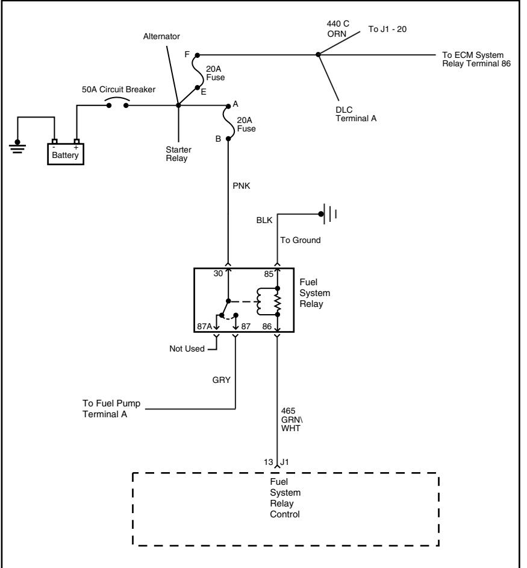

# **Diagnostic Information and Procedures**

# **SPN 66017 FMI 5 Fuel Pump Short Low SPN 66017 FMI 6 Fuel Pump Short High SPN 66017 FMI 7 Fuel Pump Open**

# **Circuit Description**

When the ignition switch is turned ON, the control module enables the fuel pump relay, which supplies current to the fuel pump. The fuel pump remains enabled as long as the engine is cranking or running and the control module receives ignition reference pulses. If there are no ignition reference pulses, the control module shuts the fuel pump OFF approximately 3 seconds after the ignition was switched to the ON position or if the engine stops. The control module monitors the voltage on the fuel pump relay control circuit. If the control module detects an incorrect voltage on the fuel pump relay control circuit, a fuel pump relay control DTC sets.

# **DTC Descriptor**

This diagnostic procedure supports the following DTC: SPN 66017, FMI 5 Fuel Pump Short Low SPN 66017, FMI 6 Fuel Pump Short High SPN 66017, FMI 7 Fuel Pump Open

# **Conditions for Running the DTC**

- The ignition voltage is supplied to the ECM.
- The ignition voltage is between 6–18 volts.

{245}------------------------------------------------

# **Conditions for Setting the DTC**

 • The engine control module (ECM) detects that the commanded state of the driver and the actual state of the control circuit do not match.

# **Action Taken When the DTC Sets**

 • The control module illuminates the malfunction indicator lamp (MIL) on the ignition cycle that the diagnostic runs and fails.

# **Conditions for Clearing the MIL/DTC**

- The control module turns OFF the malfunction indicator lamp (MIL) after the diagnostic runs and does not fail.
- A current DTC, Last Test Failed, clears when the diagnostic runs and passes.
- A history DTC clears after 25 consecutive warm-up cycles, if no failures are reported by this or any other emission

related diagnostic.

• Clear the MIL and the DTC with a scan tool.

# **Diagnostic Aids**

# **Test Description**

The numbers below refer to the step numbers on the diagnostic table.

- **3.** This step verifies that the ECM is providing voltage to the fuel pump relay. (FMI 5)
- **4.** This step tests for an open in the ground circuit to the fuel pump relay. (FMI 7)
- **5.** This step tests if the voltage is constantly being applied to the control circuit of the fuel pump relay. (FMI 6)

| Step                                                                                                                                                                    | Action                                                                                                                                                                                                                                                                                                                                                                                                    | Yes                                                                     | No                               |  |  |  |
|-------------------------------------------------------------------------------------------------------------------------------------------------------------------------|-----------------------------------------------------------------------------------------------------------------------------------------------------------------------------------------------------------------------------------------------------------------------------------------------------------------------------------------------------------------------------------------------------------|-------------------------------------------------------------------------|----------------------------------|--|--|--|
| Schematic Reference: Engine Controls Schematics Connector End View Reference: Engine Control Module (ECM) Connector End Views or Engine Controls Connector End Views |                                                                                                                                                                                                                                                                                                                                                                                                           |                                                                         |                                  |  |  |  |
| 1                                                                                                                                                                       | Did you perform the "On-Board Diagnostic" (OBD) System Check?                                                                                                                                                                                                                                                                                                                                             | Go to Step 2                                                            | Go to Diagnostic System Check |  |  |  |
| 2                                                                                                                                                                       | 1. Turn ON the ignition, with the engine OFF. 2. Command the fuel pump relay ON and OFF with a scan tool. Does the fuel pump relay turn ON and OFF when commanded with a scan tool?                                                                                                                                                                                                                 | Go to Testing for Intermittent Conditions and Poor Connections | Go to Step 3                     |  |  |  |
| 3                                                                                                                                                                       | 1. Turn OFF the ignition. 2. Remove the fuel pump relay. 3. Turn ON the ignition, with the engine OFF. 4. Probe the control circuit of the fuel pump relay with a test lamp that is connected to a good ground. Refer to Probing Electrical Connectors. 5. Command the fuel pump relay ON and OFF with a scan tool. Does the test lamp turn ON and OFF when commanded with a scan tool? | Go to Step 4                                                            | Go to Step 5                     |  |  |  |
| 4                                                                                                                                                                       | 1. Connect a test lamp between the control circuit of the fuel pump relay and the ground circuit of the fuel pump relay. 2. Command the fuel pump relay ON and OFF with a scan tool. Does the test lamp turn ON and OFF when commanded with a scan tool?                                                                                                                                         | Go to Step 8                                                            | Go to Step 10                    |  |  |  |
| 5                                                                                                                                                                       | Does the test lamp remain illuminated?                                                                                                                                                                                                                                                                                                                                                                    | Go to Step 7                                                            | Go to Step 6                     |  |  |  |
| 6                                                                                                                                                                       | Test the control circuit of the fuel pump relay for a short to ground or an open. Refer to Circuit Testing and Wiring Repairs. Did you find and correct the condition?                                                                                                                                                                                                                              | Go to Step 13                                                           | Go to Step 9                     |  |  |  |
| 7                                                                                                                                                                       | Test the control circuit of the fuel pump relay for a short to voltage. Refer to Circuit Testing and Wiring Repairs. Did you find and correct the condition?                                                                                                                                                                                                                                        | Go to Step 13                                                           | Go to Step 9                     |  |  |  |
| 8                                                                                                                                                                       | Test for an intermittent and for a poor connection at the fuel pump relay. Refer to Testing for Intermittent Conditions and Poor Connections and Connector Repairs. Did you find and correct the condition?                                                                                                                                                                                         | Go to Step 13                                                           | Go to Step 11                    |  |  |  |

{246}------------------------------------------------

# **5 - 174** PRELIMINARY **Section 5 - Diagnosis**

| 9  | Test for an intermittent and for a poor connection at the engine control module (ECM). Refer to Testing for Intermittent Conditions and Poor Connections and Connector Repairs. Did you find and correct the condition? | Go to Step 13                                  | Go to Step♦12 |
|----|----------------------------------------------------------------------------------------------------------------------------------------------------------------------------------------------------------------------------------|------------------------------------------------|---------------|
| 10 | Test the ground circuit of the fuel pump relay for an open. Refer to Circuit Testing and Wiring Repairs. Did you find and correct the condition?                                                                           | Go to Step 14                                  | —             |
| 11 | Replace the fuel pump relay. Did you complete the replacement?                                                                                                                                                                | Go to Step 13                                  | —             |
| 12 | Replace the ECM. Refer to Control Module References for replacement, setup, and programming. Did you complete the replacement?                                                                                             | Go to Step 13                                  | —             |
| 13 | 1. Clear the DTCs with a scan tool. 2. Turn OFF the ignition for 30♦seconds. 3. Start the engine. 4. Operate the boat within the Conditions for Running the DTC. Did the DTC fail this ignition?                     | Go to Step 2                                   | Go to Step 14 |
| 14 | Observe the Capture Info with a scan tool. Are there any DTCs that have not been diagnosed?                                                                                                                                   | Go to Diagnostic Trouble Code (DTC) List | System OK     |

{247}------------------------------------------------

**This page left intentionally blank**

{248}------------------------------------------------

# **Section 6 - Dash Instrumentation**

| VSS Circuit Fault                           |  |
|---------------------------------------------|--|
| SPN 84 FMI 2 Pages 2 - 3                    |  |
| Fuel Level Sensor Circuit Check Pages 4 - 7 |  |
| MMDC Pin Out Pages 8 - 9                    |  |
|                                             |  |

{249}------------------------------------------------

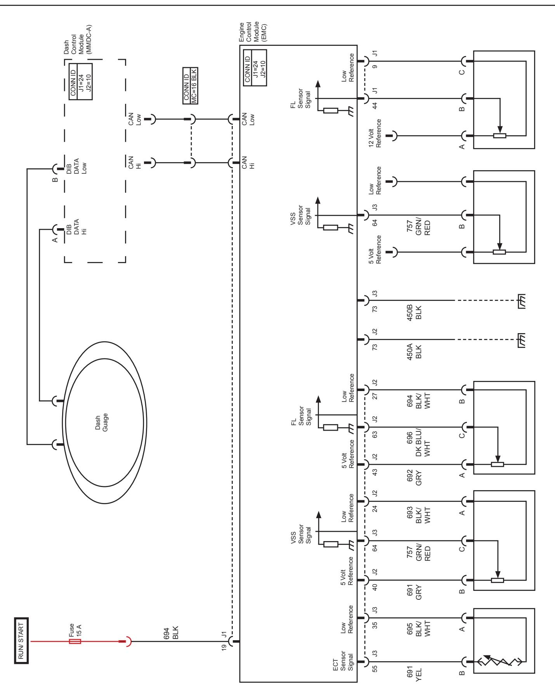

**Dash Wiring Schematics (ECT, EOP, CKP, VSS, & FL)**

{250}------------------------------------------------

# **This Page Was Intentionally Left Blank**

{251}------------------------------------------------

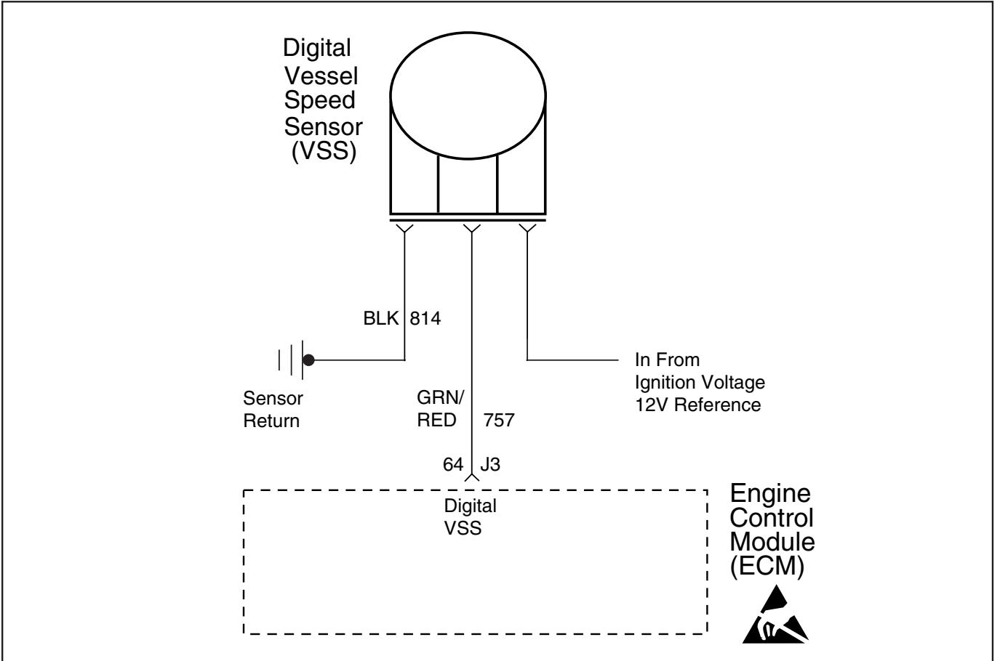

**SPN 84, FMI 2 - Vessel Speed Sensor (VSS) Circuit** 

## **Circuit Description**

The vessel speed is provided to the ECM by means of the Vessel Speed Sensor (VSS). The sensor is a "paddle wheel" type and is usually located through hull or attached to the transom. The thru-hull transducer produces a 12 volt digital signal whenever the vessel is moving. The number of pulses increases with vessel speed. The ECM converts this signal into MPH, which can be monitored with a scan tool. This information may be used by the ECM for several reasons such as governing the vessel speed to a maximum speed.

The sensor is a three-wire sensor. Terminal "C" of the sensor is provided a ground on CKT 814 through the ECM. Terminal "A" of the sensor is provided ignition voltage. Terminal "B" of the sensor is the signal to the ECM through CKT 757.

## **Diagnostic Aids**

Check for the following conditions:

• Poor connection in harness. Inspect harness connectors for backed out terminals, improper mating, broken locks, improperly formed or damaged terminals and poor terminal to wire connection.

Check VSS circuits for proper connections and the harness is routed properly.

After repairs, clear DTC's following "Clear DTC's Procedure." Failure to do so may result in DTC's not properly being cleared.

#### **Test Description**

- 2. This step determines if the VSS is receiving ignition voltage.
- 3. This step checks for a good ground circuit.

{252}------------------------------------------------

| Step | Action                                                                                                                                                                                                                                                                                                                                                                                                                                                           | Value | Yes           | No                                        |
|------|------------------------------------------------------------------------------------------------------------------------------------------------------------------------------------------------------------------------------------------------------------------------------------------------------------------------------------------------------------------------------------------------------------------------------------------------------------------|-------|---------------|-------------------------------------------|
| 1    | Was the "On-Board Diagnostic" (OBD) system check performed?                                                                                                                                                                                                                                                                                                                                                                                                   | —     | Go to Step 2  | Go to OBD System Check on Page 2-12 |
| 2    | 1. Disconnect the vessel speed sensor electrical connector. 2. Turn ignition ON. 3. Using a test light connected to a known good ground, probe ECM harness terminal "C". Does the test light illuminate brightly?                                                                                                                                                                                                                                 | —     | Go to Step 3  | Go to Step 7                              |
| 3    | 1. Turn ignition ON. 2. Using a test light connected to B+, probe ECM harness terminal "A". Does the test light illuminate brightly?                                                                                                                                                                                                                                                                                                                    | —     | Go to Step 4  | Go to Step 8                              |
| 4    | 1. Ignition OFF. 2. Reconnect VSS electrical connector. 3. Turn ignition ON. 4. Be sure the the vessel is secured on the trailer per manufacturer's recommendations. 5. Using J39978, Fluke 78 or Fluke 87 connected to a known good ground, back probe ECM harness connector terminal "J3-64". 6. While observing the DVOM, slowly rotate the paddle wheel. Does the DVOM indicate a voltage changing as the wheel is rotated? | —     | Go to Step 9  | Go to Step 5                              |
| 5    | Locate and repair open or short to ground on CKT 757. If a problem is found, repair as necessary. Was a problem found?                                                                                                                                                                                                                                                                                                                                     | —     | Verify repair | Go to Step 6                              |
| 6    | Replace faulty VSS. Is action complete?                                                                                                                                                                                                                                                                                                                                                                                                                       | —     | Verify repair | —                                         |
| 7    | Locate and repair open or short to ground in the ignition circuit to the VSS. Is action complete?                                                                                                                                                                                                                                                                                                                                                          | —     | Verify Repair | —                                         |
| 8    | Locate and repair open in the ground circuit to the VSS. Is action complete?                                                                                                                                                                                                                                                                                                                                                                                  | —     | Verify Repair | —                                         |
| 9    | SPN 84 FMI 2 may be intermittent. Clear DTC and drive the vessel. If SPN 84 FMI 2 returns, repair faulty ECM connections or replace faulty ECM. Is action complete?                                                                                                                                                                                                                                                                                     | —     | Verify Repair | —                                         |

#### **SPN 84, FMI 2 - Vessel Speed Sensor (VSS) Circuit**

{253}------------------------------------------------

Fuel Level Sensor

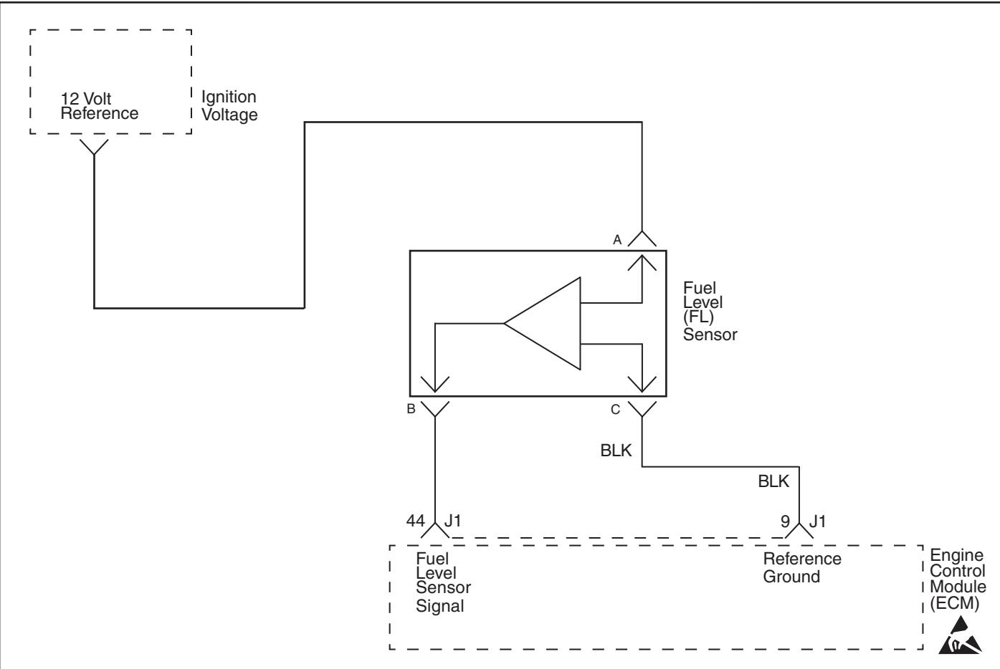

## **Fuel Level Sensor Circuit**

#### **Circuit Description**

The fuel level sensor changes resistance based on the weight of the fuel in the fuel tank. The ECM monitors the signal circuit of the fuel level sensor.

When the fuel weight is high, the sensor resistance is high, and the ECM senses a high signal voltage. When the fuel weight is low, the sensor resistance is low, and the ECM senses a low signal voltage.

The ECM sends the fuel level information to the IPC (dash) via the CAN BUS J1939 data circuit.

#### **Diagnostic Aids**

Check for the following conditions:

- Poor connection at ECM. Inspect harness connectors for backed out terminals, improper mating, broken locks, improperly formed or damaged terminals and poor terminal to wire connection.
- Damaged harness. Inspect the wiring harness for damage. If the harness appears to be OK, observe the fuel level sensor display on the scan tool while moving connectors and wiring harnesses related to the fuel level sensor. A change in the fuel level sensor display will indicate the location of the fault.
- The instrument panel cluster (IPC) displays the fuel level reading.

After repairs, clear DTC's following "Clear DTC's Procedure" in the General Information section. Failure to do so may result in DTC's not properly being cleared.

{254}------------------------------------------------

| Step | Action                                                                                                                                                                                                                                                                                                                         | Value  | Yes           | No                                     |
|------|--------------------------------------------------------------------------------------------------------------------------------------------------------------------------------------------------------------------------------------------------------------------------------------------------------------------------------|--------|---------------|----------------------------------------|
| 1    | Was the "On-Board Diagnostic" (OBD) system check performed?                                                                                                                                                                                                                                                                 | —      | Go to Step 2  | Go to OBD System Check Page 2-12 |
| 2    | Check for 12 volts. 1. Unplug the sensor. 2. Back probe Pin A & Pin C. 3. Attach the voltmeter leads. 4. Turn the ignition ON, with the engine OFF. Does the voltmeter indicate voltage greater than the specified value?                                                                                    | 11.6 V | Go to Step 6  | Go to Step 3                           |
| 3    | Inspect the circuit breaker or remove the fuse and inspect its condition. Did you find and correct the condition?                                                                                                                                                                                                        |        | Verify Repair | Go to Step 4                           |
| 4    | Test the ignition wire for an open or for high resistance. Did you find and correct the condition?                                                                                                                                                                                                                          |        | Verify Repair | Go to Step 5                           |
| 5    | Test the ground wire for an open, for a short to ground, or for high resistance. Did you find and correct the condition?                                                                                                                                                                                                 |        | Verify Repair | Go to Step 6                           |
| 6    | Measure the signal wire voltage. 1. Back Pin B. 2. Attach the positive voltmeter lead to B. 3. Attach the negative voltmeter lead to the negative battery lead. Normal range is: ~0.5 volts for low fuel and ~4.5 for a full tank. Does the voltmeter indicate voltage other than the specified value? |        | Verify Repair | Go to Step 7                           |
| 7    | Test the signal wire for continuity. Did you find and correct the condition?                                                                                                                                                                                                                                                |        | Verify Repair | Go to Step 8                           |
| 8    | Inspect for poor connections at the harness connector of the fuel level sensor. Did you find and correct the condition?                                                                                                                                                                                                  |        | Verify Repair | Go to Step 9                           |

#### **Fuel Level Sensor Circuit**

{255}------------------------------------------------

| Step | Action                                                                                                          | Value | Yes           | No            |
|------|-----------------------------------------------------------------------------------------------------------------|-------|---------------|---------------|
| 9    | Inspect for poor connections at the harness connector of the ECM. Did you find and correct the condition? |       | Verify Repair | Go to Step 10 |
| 10   | Replace the fuel level sensor. Did you find and correct the condition?                                       |       | Verify Repair | Go to Step 11 |
| 11   | Important: Program the replacement ECM. Replace the ECM. Did you complete the replacement?                |       | Verify Repair |               |

{256}------------------------------------------------

# **This Page Was Intentionally Left Blank**

{257}------------------------------------------------

# **Section 7 - Symptoms**

| Symptoms Page 2                          |  |
|------------------------------------------|--|
| Important Preliminary Checks Page 2      |  |
| Before Starting Page 2                   |  |
| Visual / Physical Check Page 2           |  |
| Intermittments Pages 2-3                 |  |
| Hard Start Symptoms Pages 4-5            |  |
| Surges and/or Chuggles Symptom Page 6    |  |
| Lack of Power, Sluggish or               |  |
| Spongy Symptom Pages 8-9                 |  |
| Detonation / Spark Knock Symptom Page 10 |  |
| Hesitation, Sag, Stumble Symptom Page 12 |  |
| Cuts Out, Misses Symptom Page 14         |  |
| Rough, Unstable or Incorrect Idle,       |  |
| Stalling Symptom Page 16                 |  |
| Poor Fuel Economy Symptom Page 18        |  |
| Dieseling, Run-On Symptom Page 20        |  |

{258}------------------------------------------------

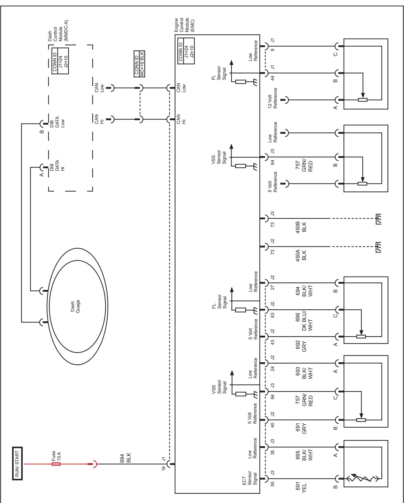

**Dash Wiring Schematics (ECT, EOP, CKP, VSS, & FL)**

{259}------------------------------------------------

#### **Symptoms**

#### **Important Preliminary Checks**

#### **Before Starting**

Before using this section you should have performed the "On-Board Diagnostic (OBD) System Check" and determined that:

- The ECM and MIL (Malfunction Indicator Lamp) are operating correctly.
- There are no DTC(s) stored.

Verify the customer complaint and locate the correct symptom in the table of contents. Check the items indicated under that symptom.

#### **Visual / Physical Check**

Several of the symptom procedures call for a careful Visual / Physical Check. The importance of this step cannot be stressed too strongly - it can lead to correcting a problem without further checks and can save valuable time. This check should include:

- ECM grounds and sensor connections for being clean, tight and in their proper location.
- Vacuum hoses for splits, kinks and proper connections. Check thoroughly for any type of leak or restriction.
- Air leaks at throttle body mounting area and intake manifold sealing surfaces.
- Ignition wires for cracking, hardness, proper routing and carbon tracking.
- Wiring for proper connections, pinches and cuts. If wiring harness or connector repair is necessary, refer to General Information section for correct procedure.
- Moisture in primary or secondary ignition circuit connections.
- Salt corrosion on electrical connections and exposed throttle body linkages.

#### **Intermittents**

**Important:** Problem may or may not turn "ON" the Malfunction Indicator Lamp (MIL) or store a DTC. DO NOT use the Diagnostic Trouble Code (DTC) tables for intermittent problems. The fault must be present to locate the problem.

Most intermittent problems are caused by faulty electrical connections or wiring. Perform careful visual / physical check.

Check for the following conditions:

- Poor mating of the connector halves, or a terminal not fully seated in the connector body (backed out or loose).
- Improperly formed or damaged terminals and / or connectors.
- All connector terminals in the problem circuit should be carefully checked for proper contact tension.
- Poor terminal to wire connection (crimping). This requires removing the terminal from the connector body to check. Refer to "Wiring Harness Service" in the General Information section.

The vessel may be driven with a **J 39200** Digital Multimeter connected to a suspected circuit. An abnormal voltage when malfunction occurs is a good indication that there is a fault in the circuit being monitored.

A scan tool may also be used to help detect intermittent conditions. The **Snapshot** feature can be triggered to capture and store engine parameters within the scan tool when the malfunction occurs. This stored information then can be reviewed by the service technician to see what caused the malfunction.

To check loss of DTC memory, disconnect ECT sensor and idle engine until the MIL comes "ON." DTC SPN 110 should be stored and kept in memory when ignition is turned "OFF." If not the ECM is faulty. When this test is completed, make sure that you clear the DTC SPN 110 from memory using "Clearing DTC Procedure" found in General Information section.

An intermittent MIL with no stored DTC may be caused by the following:

- Ignition coil shorted to ground and arcing at ignition wires or plugs.
- MIL wire to ECM shorted to ground.
- Poor ECM gounds.
- Check for an electrical system interference caused by a sharp electrical surge. Normally, the problem will occur when the faulty component is operated.
- Check for improper installation of electrical options such as lights, ship to shore radios, sonar, etc.
- Check that knock sensor wires are routed away from spark plug wires, ignition system components and charging system components.
- Check for secondary ignition components shorted to ground, or an open ignition coil ground (coil mounting brackets).
- Check for components internally shorted to ground such as starters, alternators or relays.

All Ignition Control (IC) module wiring should kept away from the alternator. Check all wires from the ECM to the ignition control module for poor connections.

If problem has not been found go to "ECM Connector Symptom Tables" at the end of Symptoms section.

{260}------------------------------------------------

| C                                              | F   | OHMS   |  |
|------------------------------------------------|-----|--------|--|
| Temperature vs Resistance Values (Approximate) |     |        |  |
| 150                                            | 302 | 47     |  |
| 140                                            | 284 | 60     |  |
| 130                                            | 266 | 77     |  |
| 120                                            | 248 | 100    |  |
| 110                                            | 230 | 132    |  |
| 100                                            | 212 | 177    |  |
| 90                                             | 194 | 241    |  |
| 80                                             | 176 | 332    |  |
| 70                                             | 158 | 467    |  |
| 60                                             | 140 | 667    |  |
| 50                                             | 122 | 973    |  |
| 45                                             | 113 | 1188   |  |
| 40                                             | 104 | 1459   |  |
| 35                                             | 95  | 1802   |  |
| 30                                             | 86  | 2238   |  |
| 25                                             | 77  | 2796   |  |
| 20                                             | 68  | 3520   |  |
| 15                                             | 59  | 4450   |  |
| 10                                             | 50  | 5670   |  |
| 5                                              | 41  | 7280   |  |
| 0                                              | 32  | 9420   |  |
| -5                                             | 23  | 12300  |  |
| -10                                            | 14  | 16180  |  |
| -15                                            | 5   | 21450  |  |
| -20                                            | -4  | 28680  |  |
| -30                                            | -22 | 52700  |  |
| -40                                            | -40 | 100700 |  |

# **Temperature vs Resistance Testing for Intermittent Wiring Conditions**

Perform the following procedures while wiggling the harness from side to side. Continue this at convenient points (about 6 inches apart) while watching the test equipment.

- Test for Short to Ground
- Test for Continuity
- Test for a Short to Voltage

If the fault is not identified, perform a data log or snapshot to capture data, which may show the source of the fault.

{261}------------------------------------------------

# **This Page Was Intentionally Left Blank**

{262}------------------------------------------------

# **Hard Start Symptom**

| Step | Action                                                                                                                                                                                                                                                                                          | Value          | Yes                       | No                                     |
|------|-------------------------------------------------------------------------------------------------------------------------------------------------------------------------------------------------------------------------------------------------------------------------------------------------|----------------|---------------------------|----------------------------------------|
|      | Definition: Engine cranks OK, but does not start for a long time. Does eventually run, or may start but immediately dies.                                                                                                                                                                       |                |                           |                                        |
| 1    | Was the "On-Board Diagnostic" (OBD) system check performed?                                                                                                                                                                                                                                  | —              | Go to Step 2              | Go to OBD System Check Page 2-12 |
| 2    | Check to see if the operator is using the correct starting procedure as described in the ownes manual. Educate the operator if they do not know. Does the operator know the correct starting procedure?                                                                                |                |                           |                                        |
|      |                                                                                                                                                                                                                                                                                                 | —              | Go to Step 3              | System normal                          |
| 3    | Was visual/physical check performed?                                                                                                                                                                                                                                                            | —              | Go to Step 4              | Go to Visual/ Physical Check        |
| 4    | 1. Check for correct base ignition timing. • Refer to "Ignition Timing Set Procedure" in the Distributor Ignition Section. 2. If a problem is found, repair as necessary. Was a problem found?                                                                                      | —              | Go to OBD System Check | Go to Step 5                           |
| 5    | 1. Check for proper operation of fuel pump relay circuit. • Refer to Fuel System Electrical Test Section 6. 2. If a problem is found, repair as necessary. Was a problem found?                                                                                                        | —              | Go to OBD System Check | Go to Step 6                           |
| 6    | 1. Check for contaminated fuel. 2. Check fuel filters and water separator. 3. If a problem is found, repair as necessary. Was a problem found?                                                                                                                                         | —              | Go to OBD System Check | Go to Step 7                           |
| 7    | 1. Check for proper fuel pressure. • Refer to Fuel System Diagnosis Section 6. 2. If a problem is found, repair as necessary. Was a problem found?                                                                                                                                     | —              | Go to OBD System Check | Go to Step 8                           |
| 8    | 1. Check for proper ignition voltage output. • Refer to Distributor Ignition System Check in Section 2. If a problem is found, repair as necessary. Was a problem found?                                                                                                               | —              | Go to OBD System Check | Go to Step 9                           |
| 9    | Is a scan tool being used? ZZZZZZZZZZZZZZZZZZZZ                                                                                                                                                                                                                                              | —              | Go to Step 11             | Go to Step 10                          |
| 10   | 1. Check for a ECT sensor shifted in value. 2. With engine completely cool, measure the resistance of the ECT sensor. 3. Refer to the Engine Coolant Temperature Sensor Temperature vs. Resistance value table on page 7-3, Symptoms. Compare the approximate temperature of the |                |                           |                                        |
|      | ECT sensor to an accurate reading of ambient air temperature. Are the readings within the specified value?                                                                                                                                                                                | -12° C (10° F) | Go to Step 15             | Go to Step 14                          |

{263}------------------------------------------------

# **Hard Start Symptom (Cont.)**

| Step | Action                                                         | Value          | Yes           | No            |
|------|----------------------------------------------------------------|----------------|---------------|---------------|
|      | 1. Check ECT sensor for being shifted in value.                |                |               |               |
|      | 2. With the engine completely cool, compare the ECT            |                |               |               |
| 11   | sensor temperature with an accurate reading of ambient         |                |               |               |
|      | air temperature.                                               |                |               |               |
|      | Are the temperatures within the specified value of each other? | -12° C (10° F) | Go to Step 12 | Go to Step 14 |
|      | 1. Using a scan tool, display ECT sensor temperature and       |                |               |               |
|      | note value.                                                    |                |               |               |
|      | 2. Check resistance of ECT sensor.                             |                |               |               |
| 12   | 3. Go to Engine Coolant Temperature Sensor Temperature         |                |               |               |
|      | vs. Resistance value table on page 7-4.                        |                |               |               |
|      | Is resistance value of ECT sensor near the resistance of the   |                |               |               |
|      | value noted?                                                   | —              | Go to Step 15 | Go to Step 13 |
| 13   | Locate and repair high resistance or poor connection in the    |                |               |               |
|      | ECT signal circuit or the ECT sensor ground.                   |                | Go to OBD     |               |
|      | Is action complete?                                            | —              | System Check  | —             |
| 14   | Replace the ECT sensor.                                        |                | Go to OBD     |               |
|      | Is action complete?                                            | —              | System Check  | —             |
|      | 1. Check for intermittent opens or shorts to ground in the     |                |               |               |
| 15   | MAP sensor circuits.                                           |                |               |               |
|      | 2. If a problem is found, repair as necessary.                 |                | Go to OBD     |               |
|      | Was a problem found?                                           | —              | System Check  | Go to Step 16 |
|      | 1. Check for proper operation of the TP sensor.                |                |               |               |
|      | 2. Check for throttle linkage sticking, binding or worn        |                |               |               |
| 16   | causing TP sensor voltage to be higher than normal.            |                |               |               |
|      | 3. If a problem is found, repair as necessary.                 |                | Go to OBD     |               |
|      | Was a problem found?                                           | —              | System Check  | Go to Step 17 |
|      | 1. Check for proper operation of the throttle body blade.      |                |               |               |
| 17   | 2. If a problem is found, repair as necessary.                 |                | Go to OBD     |               |
|      | Was a problem found?                                           | —              | System Check  | Go to Step 18 |
|      | 1. Check for the following engine mechanical problems:         |                |               |               |
|      | • Low compression.                                             |                |               |               |
|      | • Leaking cylinder head gaskets.                               |                |               |               |
| 18   | • Worn or incorrect camshaft.                                  |                |               |               |
|      | • Proper valve timing / valve train problem.                   |                |               |               |
|      | • Restricted exhaust system.                                   |                |               |               |
|      | 2. If a problem is found, repair as necessary.                 |                | Go to OBD     |               |
|      | Was a problem found?                                           | —              | System Check  | Go to Step 19 |

{264}------------------------------------------------

# **Hard Start Symptom (Cont.)**

| 19 | 1. Review all diagnostic procedures within this table. 2. If all procedures have been completed and no malfunctions have been found, review/inspect the following: • Visual/physical inspection. • Scan tool data. • All electrical connections within a suspected circuit and/or system. |   |                           |             |
|----|-------------------------------------------------------------------------------------------------------------------------------------------------------------------------------------------------------------------------------------------------------------------------------------------------------------------------|---|---------------------------|-------------|
|    | 3. If a problem is found, repair as necessary. Was a problem found?                                                                                                                                                                                                                                                  | — | Go to OBD System Check | Contact OEM |

{265}------------------------------------------------

# **This Page Was Intentionally Left Blank**

{266}------------------------------------------------

# **Surges and / or Chuggles Symptom**

| Step | Action | Value | Yes | No |
|------|--------|-------|-----|----|
|      |        |       |     |    |

**Definition:** Engine power variation under steady throttle or cruise. Feels like the vehicle speeds up and slows down with no change in the throttle control.

|    | Was the "On-Board Diagnostic" (OBD) system check per          |   |              | Go to OBD      |
|----|---------------------------------------------------------------|---|--------------|----------------|
| 1  | formed?                                                       | — |              | System Check   |
|    |                                                               |   | Go to Step 2 | Page 2-12      |
|    | Was the visual/physical check performed?                      |   |              | Go to Visual/  |
| 2  |                                                               | — | Go to Step 3 | Physical Check |
|    | 1. Check for correct base ignition timing.                    |   |              |                |
|    | • Refer to "Ignition Timing Set Procedure" in the             |   |              |                |
| 3  | Distributor Ignition section.                                 |   | Go to OBD    |                |
|    | 2. If a problem is found, repair as necessary.                |   | System Check |                |
|    | Was a problem found?                                          | — | Page 2-12    | Go to Step 4   |
|    | 1. Check for engine going into RPM reduction mode.            |   |              |                |
| 4  | 2. If a problem is found, repair as necessary.                |   | Go to OBD    |                |
|    | Was a problem found?                                          | — | System Check | Go to Step 5   |
|    | 1. Check for contaminated fuel.                               |   |              |                |
| 5  | 2. Check fuel filters and water separator.                    |   |              |                |
|    | 3. If a problem is found, repair as necessary.                |   | Go to OBD    |                |
|    | Was a problem found?                                          | — | System Check | Go to Step 6   |
|    | 1. Check for proper fuel pressure while the condition exists. |   |              |                |
| 6  | • Refer to Fuel System Diagnosis Section                      |   |              |                |
|    | 2. If a problem is found, repair as necessary.                |   | Go to OBD    |                |
|    | Was a problem found?                                          | — | System Check | Go to Step 7   |
|    | 1. Check for intermittent opens or short to grounds in the    |   |              |                |
| 7  | ECT sensor, MAP sensor and TP sensor circuits. Also           |   |              |                |
|    | check for throttle linkage sticking, binding or worn.         |   |              |                |
|    | 2. An intermittent failure may not store a DTC.               |   |              |                |
|    | 3. If a problem is found, repair as necessary.                |   | Go to OBD    |                |
|    | Was a problem found?                                          | — | System Check | Go to Step 8   |
|    | 1. Check for proper ignition voltage output.                  |   |              |                |
| 8  | • Refer to Table A-7.                                         |   |              |                |
|    | 2. If a problem is found, repair as necessary.                |   | Go to OBD    |                |
|    | Was a problem found?                                          | — | System Check | Go to Step 9   |
|    | 1. Check ignition coil for cracks or carbon tracking.         |   |              |                |
| 9  | 2. If a problem is found, repair as necessary.                |   | Go to OBD    |                |
|    | Was a problem found?                                          | — | System Check | Go to Step 10  |
|    | 1. Check integrity of the primary and secondary wiring.       |   |              |                |
|    | 2. Check routing of the wiring.                               |   |              |                |
|    | 3. Check condition of IC module, pick-up coil, distributor    |   |              |                |
| 10 | cap, rotor and spark plug wires.                              |   |              |                |
|    | 4. If a problem is found, repair as necessary.                |   | Go to OBD    |                |
|    | Was a problem found?                                          | — | System Check | Go to Step 11  |

{267}------------------------------------------------

| Step | Action                                                                                                                                                                                                                                                                                                                                                                                            | Value  | Yes                       | No            |
|------|---------------------------------------------------------------------------------------------------------------------------------------------------------------------------------------------------------------------------------------------------------------------------------------------------------------------------------------------------------------------------------------------------|--------|---------------------------|---------------|
|      | 1. Remove spark plugs and check for wet plugs, cracks, wear, improper gap, burned electrodes or heavy deposits. • Refer to Distributor Ignition System.                                                                                                                                                                                                                               |        |                           |               |
| 11   | Notice: If spark plugs are gas or oil fouled, the cause of the fouling must be determined before replacing the spark plugs. 2. If a problem is found, repair as necessary.                                                                                                                                                                                                               |        | Go to OBD                 |               |
|      | Was a problem found?                                                                                                                                                                                                                                                                                                                                                                              | —      | System Check              | Go to Step 12 |
| 12   | 1. Check items that can cause the engine to run rich. 2. If a problem is found, repair as necessary. Was a problem found?                                                                                                                                                                                                                                                                   | —      | Go to OBD System Check | Go to Step 13 |
| 13   | 1. Check items that can cause the engine to run lean. 2. If a problem is found, repair as necessary. Was a problem found?                                                                                                                                                                                                                                                                   | —      | Go to OBD System Check | Go to Step 14 |
| 14   | 1. Check the injector connections for proper mating. 2. If any of the injectors connectors are connected to an incorrect cylinder, correct as necessary. Was a problem found?                                                                                                                                                                                                            | —      | Go to OBD System Check | Go to Step 15 |
| 15   | 1. Check ECM grounds for being clean, tight and in the proper locations. 2. If a problem is found, repair as necessary. Was a problem found?                                                                                                                                                                                                                                             | —      | Go to OBD System Check | Go to Step 16 |
| 16   | 1. Visually/physically check vacuum hoses for splits, kinks and proper connections and routing. 2. If a problem is found, repair as necessary. Was a problem found?                                                                                                                                                                                                                      | —      | Go to OBD System Check | Go to Step 17 |
| 17   | 1. Check for proper alternator voltage output. 2. The voltage should be between specified values. 3. If a problem is found, repair as necessary. Was a problem found?                                                                                                                                                                                                                    | 11-16V | Go to OBD System Check | Go to Step 18 |
| 18   | 1. Review all diagnostic procedures within this table. 2. If all procedures have been completed and no malfunctions have been found, review/inspect the following: • Visual/physical inspection. • Scan tool data. • All electrical connections within a suspected circuit and/or system. 3. If a problem is found, repair as necessary. Was a problem found? | —      | Go to OBD System Check | Contact OEM   |

# **Surges and/or Chuggles Symptom**

{268}------------------------------------------------

# **Lack of Power, Sluggish or Spongy Symptom**

| Step Action | Value | Yes | No |
|----------------|-------|-----|----|
|----------------|-------|-----|----|

**Definition:** Engine delivers less than expected power. Little or no increase in speed when the throttle control is moved part way.

|    | Was the "On-Board Diagnostic" (OBD) system check               |   |               | Go to OBD      |
|----|----------------------------------------------------------------|---|---------------|----------------|
| 1  | performed?                                                     | — |               | System Check   |
|    |                                                                |   | Go to Step 2  | Page 2-12      |
|    | Compare vessel performance with a similar vessel. Both         |   |               |                |
| 2  | Vehicle's performance should be close.                         |   | No            |                |
|    | Is vehicle performance close to similar vehicle.               | — | Problem found | Go to Step 3   |
|    | Was visual/physical check performed?                           |   |               | Go to Visual/  |
| 3  |                                                                | — | Go to Step 4  | Physical check |
|    | 1. Check for correct base ignition timing.                     |   |               |                |
|    | • Refer to "Ignition Timing Set Procedure" in the              |   |               |                |
| 4  | Distributor Ignition section.                                  |   |               |                |
|    | 2. If a problem is found, repair as necessary.                 |   | Go to OBD     |                |
|    | Was a problem found?                                           | — | System Check  | Go to Step 5   |
|    | 1. Remove and check flame arrestor for dirt, or for being      |   |               |                |
| 5  | restricted.                                                    |   |               |                |
|    | 2. Replace flame arrestor if necessary.                        |   | Go to OBD     |                |
|    | Was a problem found?                                           | — | System Check  | Go to Step 6   |
|    | 1. Check for contaminated fuel.                                |   |               |                |
| 6  | 2. Check fuel filters and water separator.                     |   |               |                |
|    | 3. If a problem is found, repair as necessary.                 |   | Go to OBD     |                |
|    | Was a problem found?                                           | — | System Check  | Go to Step 7   |
|    | 1. Check for proper fuel pressure while the condition exists.  |   |               |                |
| 7  | • Refer to Table A-4.                                          |   |               |                |
|    | 2. If a problem is found, repair as necessary.                 |   | Go to OBD     |                |
|    | Was a problem found?                                           | — | System Check  | Go to Step 8   |
|    | 1. Check for injector driver CKT's for an open.                |   |               |                |
| 8  | 2. If a problem is found, repair as necessary.                 |   | Go to OBD     |                |
|    | Was a problem found?                                           | — | System Check  | Go to Step 9   |
|    | 1. Check for proper operation of Ignition Control (IC)         |   |               |                |
| 9  | circuit and the Knock Sensor (KS) circuit(s).                  |   |               |                |
|    | 2. If a problem is found, repair as necessary.                 |   | Go to OBD     |                |
|    | Was a problem found?                                           | — | System Check  | Go to Step 10  |
|    | 1. Check for proper ignition voltage output.                   |   |               |                |
| 10 | • Refer to Table A-7.                                          |   |               |                |
|    | 2. If a problem is found, repair as necessary.                 |   | Go to OBD     |                |
|    | Was a problem found?                                           | — | System Check  | Go to Step 11  |
| 11 | 1. Remove spark plugs, check for wet plugs, cracks, wear,      |   |               |                |
|    | improper gap, burned electrodes or heavy deposits.             |   |               |                |
|    | Notice: If spark plugs are gas or oil fouled, the cause of the |   |               |                |
|    | fouling must be determined before replacing the spark plugs.   |   |               |                |
|    | 2. If a problem is found, repair as necessary.                 |   | Go to OBD     |                |
|    | Was a problem found?                                           | — | System Check  | Go to Step 12  |

{269}------------------------------------------------

| __ ۰. |  |
|----------|--|
|----------|--|

#### **Lack of Power, Sluggish or Spongy Symptom (Cont.)**

| Step | Action                                                             | Value  | Yes          | No            |
|------|--------------------------------------------------------------------|--------|--------------|---------------|
|      | 1. Check ignition coil for cracks or carbon tracking.              |        |              |               |
| 12   | 2. If a problem is found, repair as necessary.                     |        | Go to OBD    |               |
|      | Was a problem found?                                               | —      | System Check | Go to Step 13 |
|      | 1. Check for intermittent opens or short to grounds in the         |        |              |               |
|      | ECT sensor, MAP sensor and TP sensor circuits. Also                |        |              |               |
| 13   | check for throttle linkage sticking, binding or worn.              |        |              |               |
|      | 2. An intermittent failure may not store a DTC.                    |        |              |               |
|      | 3. If a problem is found, repair as necessary.                     |        | Go to OBD    |               |
|      | Was a problem found?                                               | —      | System Check | Go to Step 14 |
|      | 1. Check ECM grounds for being clean, tight and in their           |        |              |               |
| 14   | proper locations.                                                  |        |              |               |
|      | 2. If a problem is found, repair as necessary.                     |        | Go to OBD    |               |
|      | Was a problem found?                                               | —      | System Check | Go to Step 15 |
| 15   | 1. Check for engine going into RPM reduction mode.                 |        |              |               |
|      | 2. If a problem is found, repair as necessary.                     |        | Go to OBD    |               |
|      | Was a problem found?                                               | —      | System Check | Go to Step 16 |
|      | 1. Check for proper alternator voltage output.                     |        |              |               |
| 16   | 2. The voltage should be between specified values.                 |        |              |               |
|      | 3. If a problem is found, repair as necessary.                     |        | Go to OBD    |               |
|      | Was a problem found?                                               | 11-16V | System Check | Go to Step 17 |
|      | 1. Check for the following engine mechanical problems:             |        |              |               |
|      | • Low compression.                                                 |        |              |               |
|      | • Leaking cylinder head gaskets.                                   |        |              |               |
| 17   | • Worn or incorrect camshaft.                                      |        |              |               |
|      | • Proper valve timing / valve train problem.                       |        |              |               |
|      | • Restricted exhaust system.                                       |        |              |               |
|      | 2. If a problem is found, repair as necessary.                     |        | Go to OBD    |               |
|      | Was a problem found?                                               | —      | System Check | Go to Step 18 |
|      | 1. Check for excessive resistance on the bottom of the             |        |              |               |
|      | boat such as dirt, barnacles, etc.                                 |        |              |               |
| 18   | 2. Check for proper propeller size and pitch for that application. |        |              |               |
|      | 3. If a problem is found, repair as necessary.                     |        | Go to OBD    |               |
|      | Was a problem found?                                               | —      | System Check | Go to Step 19 |
| 19   | 1. Review all diagnostic procedures within this table.             |        |              |               |
|      | 2. When all procedures have been completed and no                  |        |              |               |
|      | malfunctions are found, review / inspect the following:            |        |              |               |
|      | • Visual / physical inspection.                                    |        |              |               |
|      | • Scan tool data.                                                  |        |              |               |
|      | • All connections within a suspected circuit and / or system.      |        |              |               |
|      | 3. If a problem is found, repair as necessary.                     |        | Go to OBD    |               |
|      | Was a problem found?                                               | —      | System Check | Contact OEM   |

{270}------------------------------------------------

# **Detonation / Spark Knock Symptom**

| Step | Action | Value | Yes | No |
|------|--------|-------|-----|----|

**Definition:** A mild to severe ping, usually worse under acceleration. The engine makes a sharp metallic knocks that change with throttle opening.

|    | Was the "On-Board Diagnostic" (OBD) system check              |   |               | Go to OBD      |
|----|---------------------------------------------------------------|---|---------------|----------------|
| 1  | performed?                                                    | — |               | System Check   |
|    |                                                               |   | Go to Step 2  | Page 2-12      |
| 2  | Was visual/physical check performed?                          |   |               | Go to Visual/  |
|    |                                                               | — | Go to Step 3  | Physical check |
|    | 1. Check for correct base ignition timing.                    |   |               |                |
|    | • Refer to "Ignition Timing Set Procedure" in the             |   |               |                |
| 3  | Distributor Ignition section.                                 |   |               |                |
|    | 2. If a problem is found, repair as necessary.                |   | Go to OBD     |                |
|    | Was a problem found?                                          | — | System Check  | Go to Step 4   |
|    | 1. Check for proper operation of Ignition Control (IC)        |   |               |                |
| 4  | circuit and the Knock Sensor (KS) circuit(s).                 |   |               |                |
|    | 2. If a problem is found, repair as necessary.                |   | Go to OBD     |                |
|    | Was a problem found?                                          | — | System Check  | Go to Step 5   |
|    | 1. Check for good ignition system ground.                     |   |               |                |
| 5  | 2. Check spark plugs for proper gap and heat range.           |   |               |                |
|    | 3. If a problem is found, repair as necessary.                |   | Go to OBD     |                |
|    | Was a problem found?                                          | — | System Check  | Go to Step 6   |
|    | 1. Check for contaminated fuel.                               |   |               |                |
| 6  | 2. Check for poor fuel quality and proper octane rating.      |   |               |                |
|    | 3. If a problem is found, repair as necessary.                |   | Go to OBD     |                |
|    | Was a problem found?                                          | — | System Check  | Go to Step 7   |
|    | 1. Check for proper fuel pressure.                            |   |               |                |
| 7  | • Refer to Table A-4.                                         |   |               |                |
|    | 2. If a problem is found, repair as necessary.                |   | Go to OBD     |                |
|    | Was a problem found?                                          | — | System Check  | Go to Step 8   |
| 8  | Is a scan tool being used?                                    | — | Go to Step 9  | Go to Step 10  |
|    | If scan tool readings are normal (Refer to "Typical Scan      |   |               |                |
|    | Values") and there are no engine mechanical faults, fill fuel |   |               |                |
| 9  | tank with a known quality gasoline that has a minimum         |   |               |                |
|    | octane reading of 92 and re-evaluate vehicle performance.     |   |               | Go to OBD      |
|    | Is detonation present?                                        | — | Go to Step 10 | System Check   |
|    | 1. Check for obvious overheating problems:                    |   |               |                |
|    | • Loose water pump belt.                                      |   |               |                |
|    | • Faulty or incorrect water pump.                             |   |               |                |
| 10 | • Restriction in cooling system.                              |   |               |                |
|    | • Faulty or incorrect thermostat.                             |   |               |                |
|    | 2. If a problem is found, repair as necessary.                |   | Go to OBD     |                |
|    | Was a problem found?                                          | — | System Check  | Go to Step 11  |

{271}------------------------------------------------

### **Detonation/Spark Knock Symptom**

| Step | Action                                                                                                                                                                                                                                                                                                                                                                                                           | Value | Yes                       | No                        |
|------|------------------------------------------------------------------------------------------------------------------------------------------------------------------------------------------------------------------------------------------------------------------------------------------------------------------------------------------------------------------------------------------------------------------|-------|---------------------------|---------------------------|
| 11   | 1. Check items that can cause an engine to run lean. 2. If a problem is found, repair as necessary. Was a problem found?                                                                                                                                                                                                                                                                                   | —     | Go to OBD System Check | Go to Step 12             |
| 12   | 1. Check for ECT sensor being shifted in value. 2. Check for proper output voltage of the TP sensor at closed throttle and wide open throttle. Also check throttle linkage for sticking, binding or worn. 2. If a problem is found, repair as necessary. Was a problem found?                                                                                                                     | —     | Go to OBD System Check | Go to Step 13             |
| 13   | 1. Check for the following engine mechanical problems: • Low compression. • Low oil level. • Excessive oil in the combustion chambers due to valve seals leaking. • Worn or incorrect camshaft. • Proper valve timing/valve train problem. • Combustion chambers for excessive carbon build up. 2. If a problem is found, repair as necessary. Was a problem found? | —     | Go to OBD System Check | Go to Step 14             |
| 14   | 1. Remove excessive carbon buildup with a top engine cleaner. • Refer to instructions on top engine cleaner can. 2. Re-evaluate vehicle performance. Is detonation still present?                                                                                                                                                                                                                 | —     | Go to Step 15             | Go to OBD System Check |
| 15   | 1. Review all diagnostic procedures within this table. 2. If all procedures have been completed and no malfunctions have been found, review/inspect the following: • Visual/physical inspection. • Scan tool data. • All electrical connections within a suspected circuit and/or system. 3. If a problem is found, repair as necessary. Was a problem found?                | —     | Go to OBD System Check | Contact OEM               |

{272}------------------------------------------------

# **Hesitation, Sag, Stumble Symptom**

| Step Action Value Yes No |  |
|--------------------------------------|--|
|--------------------------------------|--|

**Definition:** Momentary lack of response as the accelerator is pushed down. Can occur at all vessel speeds. Usually most severe when first trying to make the vehicle move, as from a stop. May cause engine to stall if severe enough.

| 1 | Was the "On-Board Diagnostic" (OBD) System Check per          |   |              | Go to OBD      |
|---|---------------------------------------------------------------|---|--------------|----------------|
|   | formed?                                                       |   |              | System Check   |
|   |                                                               | — | Go to Step 2 | Page 2-12      |
|   | Was visual/physical check performed?                          |   |              | Go to Visual/  |
| 2 |                                                               | — | Go to Step 3 | Physical check |
|   | 1. Check for correct base ignition timing.                    |   |              |                |
|   | • Refer to "Ignition Timing Set Procedure" in the             |   |              |                |
| 3 | Distributor Ignition section.                                 |   |              |                |
|   | 2. If a problem is found, repair as necessary.                |   | Go to OBD    |                |
|   | Was a problem found?                                          | — | System Check | Go to Step 4   |
|   | 1. Check for contaminated fuel.                               |   |              |                |
| 4 | 2. Check fuel filters and water separator.                    |   |              |                |
|   | 3. If a problem is found, repair as necessary.                |   | Go to OBD    |                |
|   | Was a problem found?                                          | — | System Check | Go to Step 5   |
|   | 1. Check for proper fuel pressure while the condition exists. |   |              |                |
| 5 | • Refer to Table Fuel System Diagnosis section 6.             |   |              |                |
|   | 2. If a problem is found, repair as necessary.                |   | Go to OBD    |                |
|   | Was a problem found?                                          | — | System Check | Go to Step 6   |
|   | 1. Check fuel injectors.                                      |   |              |                |
| 6 | • Refer to Injector Coil Test and Injector Balance Test       |   |              |                |
|   | at the end of this section.                                   |   |              |                |
|   | 2. If a problem is found, repair as necessary.                |   | Go to OBD    |                |
|   | Was a problem found?                                          | — | System Check | Go to Step 7   |
|   | 1. Check for proper operation of Ignition Control (IC)        |   |              |                |
| 7 | circuit and the Knock Sensor (KS) circuit(s).                 |   |              |                |
|   | 2. If a problem is found, repair as necessary.                |   | Go to OBD    |                |
|   | Was a problem found?                                          | — | System Check | Go to Step 8   |
|   | 1. Check integrity of the primary and secondary wiring.       |   |              |                |
|   | 2. Check routing of the wiring.                               |   |              |                |
| 8 | 3. Check condition of IC module, pick-up coil, distributor    |   |              |                |
|   | cap, rotor and spark plug wires.                              |   |              |                |
|   | 4. If a problem is found, repair as necessary.                |   | Go to OBD    |                |
|   | Was a problem found?                                          | — | System Check | Go to Step 9   |
|   | 1. Remove spark plugs and check for wet plugs, cracks,        |   |              |                |
|   | wear, improper gap, burned electrodes or heavy                |   |              |                |
| 9 | deposits.                                                     |   |              |                |
|   | Notice: If spark plugs are gas or oil fouled, the cause of    |   |              |                |
|   | the fouling must be determined before replacing the           |   |              |                |
|   | spark plugs.                                                  |   |              |                |
|   | 2. If a problem is found, repair as necessary.                |   | Go to OBD    |                |
|   | Was a problem found?                                          | — | System Check | Go to Step 10  |

{273}------------------------------------------------

# **Section 7 - Symptoms 7 - 17** Preliminary

|    | 1. Check for obvious overheating problems:     |   |              |               |
|----|------------------------------------------------|---|--------------|---------------|
|    | • Loose water pump belt.                       |   |              |               |
|    | • Faulty or incorrect water pump.              |   |              |               |
| 10 | • Restriction in cooling system.               |   |              |               |
|    | • Faulty or incorrect thermostat.              |   |              |               |
|    | 2. If a problem is found, repair as necessary. |   | Go to OBD    |               |
|    | Was a problem found?                           | — | System Check | Go to Step 11 |

# **Hesitation, Sag, Stumble Symptom**

| Step | Action                                                                                                                                                                                                                                                                                                                                                                                            | Value  | Yes                       | No            |
|------|---------------------------------------------------------------------------------------------------------------------------------------------------------------------------------------------------------------------------------------------------------------------------------------------------------------------------------------------------------------------------------------------------|--------|---------------------------|---------------|
| 10   | 1. Check for the ECT sensor shifted in value. 2. Check for intermittent opens or short to grounds in the ECT sensor, MAP sensor and TP sensor circuits. Also check for throttle linkage sticking, binding or worn. 3. An intermittent failure may not store a DTC. 4. If a problem is found, repair as necessary. Was a problem found?                                          | —      | Go to OBD System Check | Go to Step 11 |
| 11   | 1. Check for engine going into RPM reduction mode. 2. If a problem is found, repair as necessary. Was a problem found?                                                                                                                                                                                                                                                                      | —      | Go to OBD System Check | Go to Step 12 |
| 12   | 1. Check for proper alternator voltage output. 2. The voltage should be between specified values. 3. If a problem is found, repair as necessary. Was a problem found?                                                                                                                                                                                                                    | 11-16V | Go to OBD System Check | Go to Step 13 |
| 13   | 1. Check for faulty or incorrect thermostat. 2. If a problem is found, repair as necessary. Was a problem found?                                                                                                                                                                                                                                                                            | —      | Go to OBD System Check | Go to Step 14 |
| 14   | 1. Check intake valves for valve deposits. 2. If deposits are found, remove as necessary. Were deposits found on the intake valves?                                                                                                                                                                                                                                                         | —      | Go to OBD System Check | Go to Step 15 |
| 15   | 1. Review all diagnostic procedures within this table. 2. If all procedures have been completed and no malfunctions have been found, review/inspect the following: • Visual/physical inspection. • Scan tool data. • All electrical connections within a suspected circuit and/or system. 3. If a problem is found, repair as necessary. Was a problem found? | —      | Go to OBD System Check | Contact OEM   |

{274}------------------------------------------------

# **Cuts Out, Misses Symptom**

| Step Action | Value | Yes | No |
|----------------|-------|-----|----|
|----------------|-------|-----|----|

**Definition:** Steady pulsation or jerking that follows engine speed, usually more pronounced as engine load increases. The exhaust has a steady spitting sound at idle, low speed or on hard acceleration for fuel starvation that can cause engine to cut out.

| 1 | Was the "On-Board Diagnostic" (OBD) System Check"              |   |              | Go to OBD      |
|---|----------------------------------------------------------------|---|--------------|----------------|
|   | performed?                                                     |   |              | System Check   |
|   |                                                                | — | Go to Step 2 | Page 2-12      |
| 2 | Was visual/physical check performed?                           |   |              | Go to Visual/  |
|   |                                                                | — | Go to Step 3 | Physical check |
|   | 1. Check for contaminated fuel.                                |   |              |                |
| 3 | 2. Check fuel filters and water separator.                     |   |              |                |
|   | 3. If a problem is found, repair as necessary.                 |   | Go to OBD    |                |
|   | Was a problem found?                                           | — | System Check | Go to Step 4   |
|   | 1. Check for proper fuel pressure while the condition exists.  |   |              |                |
| 4 | • Refer to Table A-4.                                          |   |              |                |
|   | 2. If a problem is found, repair as necessary.                 |   | Go to OBD    |                |
|   | Was a problem found?                                           | — | System Check | Go to Step 5   |
|   | 1. Disconnect all injector harness connectors and install      |   |              |                |
|   | an injector test light J 34730-2 between the harness           |   |              |                |
|   | terminal connector of each injector.                           |   |              |                |
|   | 2. Crank engine and note light on each connector. If test      |   |              |                |
| 5 | light fails to blink at any one of the connectors, it is a     |   |              |                |
|   | faulty injector drive circuit, harness, connector or terminal. |   |              |                |
|   | 3. If a problem is found, repair as necessary.                 |   | Go to OBD    |                |
|   | Was a problem found?                                           | — | System Check | Go to Step 6   |
|   | 1. Check fuel injectors.                                       |   |              |                |
|   | • Refer to Injector Coil Test and Injector Balance Test        |   |              |                |
| 6 | at the end of this section.                                    |   |              |                |
|   | 2. If a problem is found, repair as necessary.                 |   | Go to OBD    |                |
|   | Was a problem found?                                           | — | System Check | Go to Step 7   |
|   | 1. Check for proper spark at each cylinder per                 |   |              |                |
| 7 | manufactures recommendation.                                   |   |              |                |
|   | 2. If a problem is found, repair as necessary.                 |   | Go to OBD    |                |
|   | Was a problem found?                                           | — | System Check | Go to Step 8   |
|   | 1. Remove spark plugs and check for wet plugs, cracks,         |   |              |                |
|   | wear, improper gap, burned electrodes or heavy deposits.       |   |              |                |
| 8 | Notice: If spark plugs are gas or oil fouled, the cause of     |   |              |                |
|   | the fouling must be determined before replacing the            |   |              |                |
|   | spark plugs.                                                   |   |              |                |
|   | 2. If a problem is found, repair as necessary.                 |   | Go to OBD    |                |
|   | Was a problem found?                                           | — | System Check | Go to Step 9   |

{275}------------------------------------------------

# **Section 7 - Symptoms 7 - 19** Preliminary

|    | 1. Remove spark plugs and check for wet plugs, cracks,     |   |              |               |
|----|------------------------------------------------------------|---|--------------|---------------|
|    | wear, improper gap, burned electrodes or heavy             |   |              |               |
| 9  | deposits.                                                  |   |              |               |
|    | Notice: If spark plugs are gas or oil fouled, the cause of |   |              |               |
|    | the fouling must be determined before replacing the        |   |              |               |
|    | spark plugs.                                               |   |              |               |
|    | 2. If a problem is found, repair as necessary.             |   | Go to OBD    |               |
|    | Was a problem found?                                       | — | System Check | Go to Step 10 |
|    | 1. Check for obvious overheating problems:                 |   |              |               |
|    | • Loose water pump belt.                                   |   |              |               |
|    | • Faulty or incorrect water pump.                          |   |              |               |
| 10 | • Restriction in cooling system.                           |   |              |               |
|    | • Faulty or incorrect thermostat.                          |   |              |               |
|    | 2. If a problem is found, repair as necessary.             |   | Go to OBD    |               |
|    | Was a problem found?                                       | — | System Check | Go to Step 11 |

## **Cuts Out, Misses Symptom**

| Step | Action                                                                                                                                                                                                                                                                                                                                                                                                       | Value  | Yes                                       | No                            |
|------|--------------------------------------------------------------------------------------------------------------------------------------------------------------------------------------------------------------------------------------------------------------------------------------------------------------------------------------------------------------------------------------------------------------|--------|-------------------------------------------|-------------------------------|
| 9    | Was a problem found? 1. Check engine mechanical for the following conditions. • Low compression. • Sticking or leaking valves. • Bent push rods. • Worn rocker arms. • Broken valve springs. • Worn camshaft lobe(s). • Incorrect valve timing. 2. If a problem is found, repair as necessary. Was a problem found?                                       | — — | System Check Go to OBD System Check | Go to Step 9 Go to Step 10 |
| 10   | 1. Check Intake and exhaust manifold(s) for casting flash. 2. If a problem is found, repair as necessary. Was a problem found?                                                                                                                                                                                                                                                                         | —      | Go to OBD System Check                 | Go to Step 11                 |
| 11   | 1. Check for Electromagnetic Interference (EMI). A missing condition can be caused by EMI on the reference circuit. EMI can usually be detected by monitoring engine RPM with a scan tool or tachometer. A sudden increase in RPM with little change in actual engine RPM change, may indicate EMI is present. 2. If EMI is present, locate and repair the source. Was a problem found? | —      | Go to OBD System Check                 | Go to Step 12                 |
| 12   | 1. Review all diagnostic procedures within this table. 2. If all procedures have been completed and no malfunctions have been found, review/inspect the following: • Visual/physical inspection. • Scan tool data. • All electrical connections within a suspected circuit and/or system. 3. If a problem is found, repair as necessary. Was a problem found?            | —      | Go to OBD System Check                 | Contact OEM                   |

{276}------------------------------------------------

# **Rough, Unstable or Incorrect Idle, Stalling Symptom**

| Step Action Value Yes No |  |  |  |
|--------------------------------------|--|--|--|
|                                      |  |  |  |

**Definition:** Engine runs unevenly at idle. If severe, the engine or boat may shake. Engine idle speed varies in RPM. Either condition may be severe enough to stall the engine.

| 1 | Was the "On-Board Diagnostic" (OBD) System Check"           |   |              | Go to OBD      |
|---|-------------------------------------------------------------|---|--------------|----------------|
|   | performed?                                                  |   |              | System Check   |
|   |                                                             | — | Go to Step 2 | Page 2-12      |
|   | Was visual/physical check performed?                        |   |              | Go to Visual/  |
| 2 |                                                             | — | Go to Step 3 | Physical check |
|   | 1. Check for correct base ignition timing.                  |   |              |                |
| 3 | • Refer to "Ignition Timing Set Procedure" in the           |   |              |                |
|   | Distributor Ignition section.                               |   |              |                |
|   | 2. If a problem is found, repair as necessary.              |   | Go to OBD    |                |
|   | Was a problem found?                                        | — | System Check | Go to Step 4   |
|   | 1. Check for proper operation of the throttle body blade.   |   |              |                |
| 4 | 2. If a problem is found, repair as necessary.              |   | Go to OBD    |                |
|   | Was a problem found?                                        | — | System Check | Go to Step 5   |
|   | 1. Check for proper operation of Ignition Control (IC)      |   |              |                |
| 5 | circuit and the Knock Sensor (KS) circuit(s).               |   |              |                |
|   | 2. If a problem is found, repair as necessary.              |   | Go to OBD    |                |
|   | Was a problem found?                                        | — | System Check | Go to Step 6   |
|   | 1. Check integrity of the primary and secondary wiring.     |   |              |                |
|   | 2. Check routing of the wiring.                             |   |              |                |
| 6 | 3. Check condition of IC module, pick-up coil, distributor  |   |              |                |
|   | cap, rotor and spark plug wires.                            |   |              |                |
|   | 4. If a problem is found, repair as necessary.              |   | Go to OBD    |                |
|   | Was a problem found?                                        | — | System Check | Go to Step 7   |
|   | 1. Check ignition coil for cracks or carbon tracking.       |   |              |                |
| 7 | 2. If a problem is found, repair as necessary.              |   | Go to OBD    |                |
|   | Was a problem found?                                        | — | System Check | Go to Step 8   |
|   | 1. Remove spark plugs and check for wet plugs, cracks,      |   |              |                |
|   | wear, improper gap, burned electrodes or heavy deposits.    |   |              |                |
| 8 | Notice: If spark plugs are gas or oil fouled, the cause of  |   |              |                |
|   | the fouling must be determined before replacing the         |   |              |                |
|   | spark plugs.                                                |   |              |                |
|   | 2. If a problem is found, repair as necessary.              |   | Go to OBD    |                |
|   | Was a problem found?                                        | — | System Check | Go to Step 9   |
|   | Check the injector connections. If any of the injectors are |   |              |                |
| 9 | connected to an incorrect cylinder, correct as necessary.   |   | Go to OBD    |                |
|   | Was a problem found?                                        | — | System Check | Go to Step 10  |

{277}------------------------------------------------

# **Section 7 - Symptoms 7 - 21** Preliminary

|    | 1. Check for obvious overheating problems:     |   |              |               |
|----|------------------------------------------------|---|--------------|---------------|
|    | • Loose water pump belt.                       |   |              |               |
|    | • Faulty or incorrect water pump.              |   |              |               |
| 10 | • Restriction in cooling system.               |   |              |               |
|    | • Faulty or incorrect thermostat.              |   |              |               |
|    | 2. If a problem is found, repair as necessary. |   | Go to OBD    |               |
|    | Was a problem found?                           | — | System Check | Go to Step 11 |

{278}------------------------------------------------

| Rough, Unstable or Incorrect Idle, Stalling Symptom |  |  |  |
|-----------------------------------------------------|--|--|--|
|-----------------------------------------------------|--|--|--|

| Step | Action                                                                                                                                                                                                                               | Value | Yes                       | No            |
|------|--------------------------------------------------------------------------------------------------------------------------------------------------------------------------------------------------------------------------------------|-------|---------------------------|---------------|
|      | Was a problem found? 1. Disconnect all injector harness connectors and install an injector test light J 34730-2 between the harness                                                                                            | —     | System Check              | Go to Step 10 |
| 10   | terminal connector of each injector. 2. Crank engine and note light on each connector. If test light fails to blink at any one of the connectors, it is a faulty injector drive circuit, harness, connector or terminal. |       |                           |               |
|      | 3. If a problem is found, repair as necessary. Was a problem found?                                                                                                                                                               | —     | Go to OBD System Check | Go to Step 11 |
| 11   | 1. Check fuel injectors. • Refer to Injector Coil Test and Injector Balance Test at the end of this section.                                                                                                                |       |                           |               |
|      | 2. If a problem is found, repair as necessary. Was a problem found?                                                                                                                                                               | —     | Go to OBD System Check | Go to Step 12 |
| 12   | 1. Check for fuel in pressure regulator vacuum hose. 2. If fuel is present, replace the fuel pressure regulator assembly. • Refer to Fuel Metering System.                                                               |       |                           |               |
|      | 3. If a problem is found, repair as necessary. Was a problem found?                                                                                                                                                               | —     | Go to OBD System Check | Go to Step 13 |
| 13   | 1. Check for intermittent opens or short to grounds in the ECT sensor, MAP sensor and TP sensor circuits. Also check for throttle linkage sticking, binding or worn. 2. An intermittent failure may not store a DTC.        |       |                           |               |
|      | 3. If a problem is found, repair as necessary. Was a problem found?                                                                                                                                                               | —     | Go to OBD System Check | Go to Step 14 |
| 14   | 1. Check ECM grounds for being clean, tight and in their proper locations. 2. Also check that battery cables and ground straps are clean and secure.                                                                        |       |                           |               |
|      | 3. If a problem is found, repair as necessary. Was a problem found?                                                                                                                                                               | —     | Go to OBD System Check | Go to Step 15 |
| 15   | 1. Check items that can cause the engine to run rich. 2. If a problem is found, repair as necessary. Was a problem found?                                                                                                      | —     | Go to OBD System Check | Go to Step 16 |
| 16   | 1. Check items that can cause the engine to run lean. 2. If a problem is found, repair as necessary. Was a problem found?                                                                                                      | —     | Go to OBD System Check | Go to Step 17 |
| 17   | 1. Check for proper alternator voltage output. 2. The voltage should be between specified values. 3. If a problem is found, repair as necessary.                                                                               |       | Go to OBD                 |               |

{279}------------------------------------------------

| Step | Action                                                                                                                                                                                                                                                                                                                                                                                            | Value       | Yes                                       | No                             |
|------|---------------------------------------------------------------------------------------------------------------------------------------------------------------------------------------------------------------------------------------------------------------------------------------------------------------------------------------------------------------------------------------------------|-------------|-------------------------------------------|--------------------------------|
| 18   | Was a problem found? 1. Check the following engine mechanical items: • Check compression. • Sticking or leaking valves. • Worn camshaft lobe(s). • Valve timing. • Broken valve springs. 2. If a problem is found, repair as necessary. Was a problem found?                                                                                               | 11-16V — | System Check Go to OBD System Check | Go to Step 18 Go to Step 19 |
| 19   | 1. Check intake valves for valve deposits. 2. If deposits are found, remove as necessary. Were deposits found on the intake valves?                                                                                                                                                                                                                                                         | —           | Go to OBD System Check                 | Go to Step 20                  |
| 20   | 1. Check for faulty motor mounts. 2. If a problem is found, repair as necessary. Was a problem found?                                                                                                                                                                                                                                                                                       | —           | Go to OBD System Check                 | Go to Step 21                  |
| 21   | 1. Review all diagnostic procedures within this table. 2. If all procedures have been completed and no malfunctions have been found, review/inspect the following: • Visual/physical inspection. • Scan tool data. • All electrical connections within a suspected circuit and/or system. 3. If a problem is found, repair as necessary. Was a problem found? | —           | Go to OBD System Check                 | Contact OEM                    |

#### **Rough, Unstable, or Incorrect Idle, Stalling Symptom**

{280}------------------------------------------------

# **Poor Fuel Economy Symptom**

| Step | Action | Value | Yes | No |
|------|--------|-------|-----|----|

**Definition:** Fuel economy, as measured at selected intervals, is noticeably lower than expected. Also, economy is noticeably lower than it was on this vessel at one time, as previously shown by documentation.

| 1  | Was the "On-Board Diagnostic" (OBD) System Check"          |   |               | Go to OBD      |
|----|------------------------------------------------------------|---|---------------|----------------|
|    | performed?                                                 |   |               | System Check   |
|    |                                                            | — | Go to Step 2  | Page 2-12      |
|    | Was visual/physical check performed?                       |   |               | Go to Visual/  |
| 2  |                                                            | — | Go to Step 3  | Physical check |
|    | 1. Check owner's driving habits.                           |   |               |                |
|    | Are excessively heavy loads being carried?                 |   |               |                |
| 3  | Is accelerating too much, too often?                       |   |               |                |
|    | 2. If a problem is found, repair as necessary.             |   |               |                |
|    | Was a problem found?                                       | — | System Normal | Go to Step 4   |
|    | 1. Check for correct base ignition timing.                 |   |               |                |
| 4  | • Refer to "Ignition Timing Set Procedure" in the          |   |               |                |
|    | Distributor Ignition section.                              |   |               |                |
|    | 2. If a problem is found, repair as necessary.             |   | Go to OBD     |                |
|    | Was a problem found?                                       | — | System Check  | Go to Step 5   |
|    | 1. Check flame arrestor for dirt or being plugged.         |   |               |                |
| 5  | 2. Check for fuel leaks.                                   |   |               |                |
|    | 3. If a problem is found, repair as necessary.             |   | Go to OBD     |                |
|    | Was a problem found?                                       | — | System Check  | Go to Step 6   |
|    | 1. Check for proper fuel pressure.                         |   |               |                |
| 6  | • Refer to Table A-4.                                      |   |               |                |
|    | 2. If a problem is found, repair as necessary.             |   | Go to OBD     |                |
|    | Was a problem found?                                       | — | System Check  | Go to Step 7   |
|    | 1. Check for proper operation of Ignition Control (IC)     |   |               |                |
| 7  | circuit and the Knock Sensor (KS) circuit(s).              |   |               |                |
|    | 2. If a problem is found, repair as necessary.             |   | Go to OBD     |                |
|    | Was a problem found?                                       | — | System Check  | Go to Step 8   |
|    | 1. Remove spark plugs and check for wet plugs, cracks,     |   |               |                |
|    | wear, improper gap, burned electrodes or heavy deposits.   |   |               |                |
| 8  | Notice: If spark plugs are gas or oil fouled, the cause of |   |               |                |
|    | the fouling must be determined before replacing the        |   |               |                |
|    | spark plugs.                                               |   |               |                |
|    | 2. If a problem is found, repair as necessary.             |   | Go to OBD     |                |
|    | Was a problem found?                                       | — | System Check  | Go to Step 9   |
|    | 1. Visually (physically) check vacuum hoses for splits,    |   |               |                |
| 9  | kinks and improper connections and routing.                |   | Go to OBD     |                |
|    | 2. If a problem is found, repair as necessary.             | — | System Check  | Go to Step 10  |
|    | Was a repair required?                                     |   |               |                |
|    | 1. Check engine compression for being low.                 |   |               |                |
| 10 | 2. If a problem is found, repair as necessary.             |   | Go to OBD     |                |
|    | Was a problem found?                                       | — | System Check  | Go to Step 11  |

{281}------------------------------------------------

| Step | Action                                                                                                                                                                                                                                                                                                                                                                          | Value | Yes                       | No            |
|------|---------------------------------------------------------------------------------------------------------------------------------------------------------------------------------------------------------------------------------------------------------------------------------------------------------------------------------------------------------------------------------|-------|---------------------------|---------------|
| 11   | 1. Check exhaust system for possible restriction. 2. Inspect exhaust system for damaged or collapsed pipes. 3. If a problem is found, repair as necessary. Was a problem found?                                                                                                                                                                                        | —     | Go to OBD System Check | Go to Step 12 |
| 12   | 1. Check for excessive resistance on the bottom of the boat such as dirt, barnacles, etc. 2. Check for proper propeller size and pitch for that application. 3. If a problem is found, repair as necessary. Was a problem found?                                                                                                                                 | —     | Go to OBD System Check | Go to Step 13 |
| 13   | 1. Review all diagnostic procedures within this table. 2. When all procedures have been completed and no malfunctions are found, review/inspect the following: • Visual/physical inspection. • Scan tool data. • All connections within a suspected circuit and/or system. 3. If a problem is found, repair as necessary. Was a problem found? | —     | Go to OBD System Check | Contact OEM   |

# **Poor Fuel Economy Symptom**

{282}------------------------------------------------

# **Dieseling, Run-On Symptom**

| Step | Action | Value | Yes | No |
|------|--------|-------|-----|----|

**Definition:** Engine continues to run after key is turned "OFF," but runs very rough. If engine runs smooth, check ignition switch and adjustment.

| 1 | Was the "On-Board Diagnostic" (OBD) System Check"       |   |              | Go to OBD      |
|---|---------------------------------------------------------|---|--------------|----------------|
|   | performed?                                              |   |              | System Check   |
|   |                                                         | — | Go to Step 2 | Page 2-12      |
| 2 | Was visual/physical check performed?                    |   |              | Go to Visual/  |
|   |                                                         | — | Go to Step 3 | Physical check |
|   | 1. Check for leaking fuel injectors.                    |   |              |                |
| 3 | • Refer to Table A-4.                                   |   |              |                |
|   | 2. If a problem is found, repair as necessary.          |   | Go to OBD    |                |
|   | Was a problem found?                                    | — | System Check | Go to Step 4   |
|   | 1. Check for proper operation of Ignition Control (IC)  |   |              |                |
| 4 | circuit and the Knock Sensor (KS) circuit(s).           |   |              |                |
|   | 2. If a problem is found, repair as necessary.          |   | Go to OBD    |                |
|   | Was a problem found?                                    | — | System Check | Go to Step 5   |
|   | 1. Check for obvious overheating problems:              |   |              |                |
|   | • Loose water pump belt.                                |   |              |                |
|   | • Faulty or incorrect water pump.                       |   |              |                |
| 5 | • Restriction in cooling system.                        |   |              |                |
|   | • Faulty or incorrect thermostat.                       |   |              |                |
|   | 2. If a problem is found, repair as necessary.          |   | Go to OBD    |                |
|   | Was a problem found?                                    | — | System Check | Go to Step 6   |
|   | 1. Check for proper operation of the MEFI relay.        |   |              |                |
| 6 | 2. If a problem is found, repair as necessary.          |   | Go to OBD    |                |
|   | Was a problem found?                                    | — | System Check | Go to Step 7   |
|   |                                                         |   |              |                |
|   | 1. Review all diagnostic procedures within this table.  |   |              |                |
|   | 2. If all procedures have been completed and no         |   |              |                |
|   | malfunctions have been found, review/inspect the        |   |              |                |
|   | following:                                              |   |              |                |
| 7 | • Visual/physical inspection.                           |   |              |                |
|   | • Scan tool data.                                       |   |              |                |
|   | • All electrical connections within a suspected circuit |   |              |                |
|   | and/or system.                                          |   |              |                |
|   | 3. If a problem is found, repair as necessary.          |   | Go to OBD    |                |
|   | Was a problem found?                                    | — | System Check | Contact OEM    |

{283}------------------------------------------------

# **This Page Was Intentionally Left Blank**

{284}------------------------------------------------

# **7 - 28 Section 7 - Symptoms** Preliminary

#### **Backfire Symptom**

| Step                                                                                                  | Action                                                                                                                                                                                                                                                                 | Value | Yes                       | No                              |  |
|-------------------------------------------------------------------------------------------------------|------------------------------------------------------------------------------------------------------------------------------------------------------------------------------------------------------------------------------------------------------------------------|-------|---------------------------|---------------------------------|--|
| Definition: Fuel ignites in the intake manifold, or in the exhaust system, making loud popping noise. |                                                                                                                                                                                                                                                                        |       |                           |                                 |  |
| 1                                                                                                     | Was the "On-Board Diagnostic (OBD) System Check" performed?                                                                                                                                                                                                         | —     | Go to Step 2              | Go to OBD System Check       |  |
| 2                                                                                                     | Was visual/physical check performed?                                                                                                                                                                                                                                   | —     | Go to Step 3              | Go to Visual/ Physical check |  |
| 3                                                                                                     | 1. Check flame arrestor for proper installation per manufactures recommendation. 2. If a problem is found, repair as necessary. Was a problem found?                                                                                                          | —     | Go to OBD System Check | Go to Step 4                    |  |
| 4                                                                                                     | 1. Check for proper fuel pressure. • Refer to Table A-4. 2. If a problem is found, repair as necessary. Was a problem found?                                                                                                                               | —     | Go to OBD System Check | Go to Step 5                    |  |
| 5                                                                                                     | 1. Check for correct base ignition timing. • Refer to "Ignition Timing Set Procedure" in the Distributor Ignition section. 2. If a problem is found, repair as necessary. Was a problem found?                                                          | —     | Go to OBD System Check | Go to Step 6                    |  |
| 6                                                                                                     | 1. Check to see if engine is going into RPM reduction. 2. If a problem is found, repair as necessary. Was a problem found?                                                                                                                                       | —     | Go to OBD System Check | Go to Step 7                    |  |
| 7                                                                                                     | Check the injector connections. If any of the injectors are connected to an incorrect cylinder, correct as necessary. Was a problem found?                                                                                                                       | —     | Go to OBD System Check | Go to Step 8                    |  |
| 8                                                                                                     | 1. Check fuel injectors. • Refer to Injector Coil Test and Injector Balance Test at the end of this section. 2. If a problem is found, repair as necessary. Was a problem found?                                                                        | —     | Go to OBD System Check | Go to Step 9                    |  |
| 9                                                                                                     | 1. Check for proper operation of Ignition Control (IC) circuit and the Knock Sensor (KS) circuit(s). 2. If a problem is found, repair as necessary. Was a problem found?                                                                                      | —     | Go to OBD System Check | Go to Step 10                   |  |
| 10                                                                                                    | 1. Check integrity of the primary and secondary wiring. 2. Check routing of the wiring. 3. Check condition of IC module, pick-up coil, distributor cap, rotor and spark plug wires. 4. If a problem is found, repair as necessary. Was a problem found? | —     | Go to OBD System Check | Go to Step 11                   |  |
| 11                                                                                                    | 1. Check ignition coil for cracks or carbon tracking. 2. If a problem is found, repair as necessary. Was a problem found?                                                                                                                                        | —     | Go to OBD System Check | Go to Step 12                   |  |

{285}------------------------------------------------

# **Backfire Symptom**

| Step | Action                                                                                                                                                                                                                                                                                                                                                                                            | Value | Yes                       | No            |
|------|---------------------------------------------------------------------------------------------------------------------------------------------------------------------------------------------------------------------------------------------------------------------------------------------------------------------------------------------------------------------------------------------------|-------|---------------------------|---------------|
| 12   | Check for intermittent open or short to ground in the ignition circuit to the system relay. Was a problem found?                                                                                                                                                                                                                                                                            | —     | Go to OBD System Check | Go to Step 13 |
| 13   | 1. Remove spark plugs, check for wet plugs, cracks, wear, improper gap, burned electrodes or heavy deposits. Notice: If spark plugs are gas or oil fouled, the cause of the fouling must be determined before replacing the spark plugs. 2. If a problem is found, repair as necessary. Was a problem found?                                                                    | —     | Go to OBD System Check | Go to Step 14 |
| 14   | 1. Check for intermittent opens or short to grounds in the MAP sensor and TP sensor circuits. Also check for throttle linkage sticking, binding or worn. 2. An intermittent failure may not store a DTC. 3. If a problem is found, repair as necessary. Was a problem found?                                                                                                       | —     | Go to OBD System Check | Go to Step 15 |
| 15   | 1. Check engine mechanical for the following conditions: • Low compression. • Sticking or leaking valves. • Worn camshaft lobe(s). • Incorrect valve timing. 2. If a problem is found, repair as necessary. Was a problem found?                                                                                                                                    | —     | Go to OBD System Check | Go to Step 16 |
| 16   | 1. Check Intake and exhaust manifold(s) for casting flash. 2. If a problem is found, repair as necessary. Was a problem found?                                                                                                                                                                                                                                                              | —     | Go to OBD System Check | Go to Step 17 |
| 17   | 1. Review all diagnostic procedures within this table. 2. If all procedures have been completed and no malfunctions have been found, review/inspect the following: • Visual/physical inspection. • Scan tool data. • All electrical connections within a suspected circuit and/or system. 3. If a problem is found, repair as necessary. Was a problem found? | —     | Go to OBD System Check | Contact OEM   |