{0}------------------------------------------------

## **OPERATION AND MAINTENANCE MANUAL FOR CATERPILLAR C18 ENGINE**

 **Bulletin # SEBU7899-02**

**This manual contains important safety information. Do not destroy this manual. This manual must be available to the personnel who operate and maintain this machine.**

"Copyright @ Caterpillar" - Reproduced by Doosan Portable Power with permission.

Doosan Infracore Portable Power 1293 Glenway Drive Statesville, N.C. 28625 www.doosanportablepower.com

Book: 23366701 (9-08)

**Revised (09-12)**

*Doosan purchased Bobcat Company from Ingersoll-Rand Company in 2007. Any reference to Ingersoll-Rand Company or use of trademarks, service marks, logos, or other proprietary identifying marks belonging to Ingersoll-Rand Company in this manual is historical or nominative in nature, and is not meant to suggest a current affiliation between Ingersoll-Rand Company and Doosan Company or the products of either.*

{1}------------------------------------------------

# Operation and Maintenance Manual

## C18 Industrial Engine

**WJH1-Up (Engine)**

**SAFETY.CAT.COM**

{2}------------------------------------------------

### **Important Safety Information**

Most accidents that involve product operation, maintenance and repair are caused by failure to observe basic safety rules or precautions. An accident can often be avoided by recognizing potentially hazardous situations before an accident occurs. A person must be alert to potential hazards. This person should also have the necessary training, skills and tools to perform these functions properly.

#### **Improper operation, lubrication, maintenance or repair of this product can be dangerous and could result in injury or death.**

#### **Do not operate or perform any lubrication, maintenance or repair on this product, until you have read and understood the operation, lubrication, maintenance and repair information.**

Safety precautions and warnings are provided in this manual and on the product. If these hazard warnings are not heeded, bodily injury or death could occur to you or to other persons.

The hazards are identified by the "Safety Alert Symbol" and followed by a "Signal Word" such as "DANGER", "WARNING" or "CAUTION". The Safety Alert "WARNING" label is shown below.

The meaning of this safety alert symbol is as follows:

#### **Attention! Become Alert! Your Safety is Involved.**

The message that appears under the warning explains the hazard and can be either written or pictorially presented.

Operations that may cause product damage are identified by "NOTICE" labels on the product and in this publication.

**Caterpillar cannot anticipate every possible circumstance that might involve a potential hazard. The warnings in this publication and on the product are, therefore, not all inclusive. If a tool, procedure, work method or operating technique that is not specifically recommended by Caterpillar is used, you must satisfy yourself that it is safe for you and for others. You should also ensure that the product will not be damaged or be made unsafe by the operation, lubrication, maintenance or repair procedures that you choose.**

The information, specifications, and illustrations in this publication are on the basis of information that was available at the time that the publication was written. The specifications, torques, pressures, measurements, adjustments, illustrations, and other items can change at any time. These changes can affect the service that is given to the product. Obtain the complete and most current information before you start any job. Caterpillar dealers have the most current information available.

**When replacement parts are required for this product Caterpillar recommends using Caterpillar replacement parts or parts with equivalent specifications including, but not limited to, physical dimensions, type, strength and material.**

**Failure to heed this warning can lead to premature failures, product damage, personal injury or death.**

{3}------------------------------------------------

## **Table of Contents**

| Foreword  4                                    |
|------------------------------------------------|
| Safety Section                              |
| Safety Messages  6                             |
| General Hazard Information  7                  |
| Burn Prevention  9                             |
| Fire Prevention and Explosion Prevention  10   |
| Crushing Prevention and Cutting Prevention  11 |
| Mounting and Dismounting  12                   |
| Before Starting Engine  12                     |
| Engine Starting  12                            |
| Engine Stopping  13                            |
| Electrical System  13                          |
| Engine Electronics  14                         |
|                                                |

### **Product Information Section**

| Model Views  15                          |  |
|------------------------------------------|--|
| Product Identification Information 19 |  |

### **Operation Section**

| Lifting and Storage  21    |  |
|----------------------------|--|
| Features and Controls  22  |  |
| Engine Diagnostics  27     |  |
| Engine Starting  37        |  |
| Engine Operation  40       |  |
| Engine Stopping  42        |  |
| Cold Weather Operation  43 |  |
|                            |  |

### **Maintenance Section**

| Refill Capacities  45             |  |
|-----------------------------------|--|
| Maintenance Recommendations  50   |  |
| Maintenance Interval Schedule  52 |  |

### **Warranty Section**

| Warranty Information  91            |  |
|-------------------------------------|--|
| Reference Information Section |  |
| Engine Ratings  93                  |  |
| Customer Service  94                |  |
| Reference Materials  96             |  |
| Index Section                    |  |
| Index  100                          |  |

{4}------------------------------------------------

## **Foreword**

### **Literature Information**

This manual contains safety, operation instructions, lubrication and maintenance information. This manual should be stored in or near the engine area in a literature holder or literature storage area. Read, study and keep it with the literature and engine information.

English is the primary language for all Caterpillar publications. The English used facilitates translation and consistency in electronic media delivery.

Some photographs or illustrations in this manual show details or attachments that may be different from your engine. Guards and covers may have been removed for illustrative purposes. Continuing improvement and advancement of product design may have caused changes to your engine which are not included in this manual. Whenever a question arises regarding your engine, or this manual, please consult with your Caterpillar dealer for the latest available information.

### **Safety**

This safety section lists basic safety precautions. In addition, this section identifies hazardous, warning situations. Read and understand the basic precautions listed in the safety section before operating or performing lubrication, maintenance and repair on this product.

### **Operation**

Operating techniques outlined in this manual are basic. They assist with developing the skills and techniques required to operate the engine more efficiently and economically. Skill and techniques develop as the operator gains knowledge of the engine and its capabilities.

The operation section is a reference for operators. Photographs and illustrations guide the operator through procedures of inspecting, starting, operating and stopping the engine. This section also includes a discussion of electronic diagnostic information.

### **Maintenance**

The maintenance section is a guide to engine care. The illustrated, step-by-step instructions are grouped by fuel consumption, service hours and/or calendar time maintenance intervals. Items in the maintenance schedule are referenced to detailed instructions that follow.

Use fuel consumption or service hours to determine intervals. Calendar intervals shown (daily, annually, etc.) may be used instead of service meter intervals if they provide more convenient schedules and approximate the indicated service meter reading.

Recommended service should be performed at the appropriate intervals as indicated in the Maintenance Interval Schedule. The actual operating environment of the engine also governs the Maintenance Interval Schedule. Therefore, under extremely severe, dusty, wet or freezing cold operating conditions, more frequent lubrication and maintenance than is specified in the Maintenance Interval Schedule may be necessary.

The maintenance schedule items are organized for a preventive maintenance management program. If the preventive maintenance program is followed, a periodic tune-up is not required. The implementation of a preventive maintenance management program should minimize operating costs through cost avoidances resulting from reductions in unscheduled downtime and failures.

### **Maintenance Intervals**

Perform maintenance on items at multiples of the original requirement. Each level and/or individual items in each level should be shifted ahead or back depending upon your specific maintenance practices, operation and application. We recommend that the maintenance schedules be reproduced and displayed near the engine as a convenient reminder. We also recommend that a maintenance record be maintained as part of the engine's permanent record.

See the section in the Operation and Maintenance Manual, "Maintenance Records" for information regarding documents that are generally accepted as proof of maintenance or repair. Your authorized Caterpillar dealer can assist you in adjusting your maintenance schedule to meet the needs of your operating environment.

### **Overhaul**

Major engine overhaul details are not covered in the Operation and Maintenance Manual except for the interval and the maintenance items in that interval. Major repairs are best left to trained personnel or an authorized Caterpillar dealer. Your Caterpillar dealer offers a variety of options regarding overhaul programs. If you experience a major engine failure, there are also numerous after failure overhaul options available from your Caterpillar dealer. Consult with your dealer for information regarding these options.

{5}------------------------------------------------

### **California Proposition 65 Warning**

Diesel engine exhaust and some of its constituents are known to the State of California to cause cancer, birth defects, and other reproductive harm.

Battery posts, terminals and related accessories contain lead and lead compounds. **Wash hands after handling.**

{6}------------------------------------------------

## **Safety Section**

### **Safety Messages**

**SMCS Code:** 1000; 7405

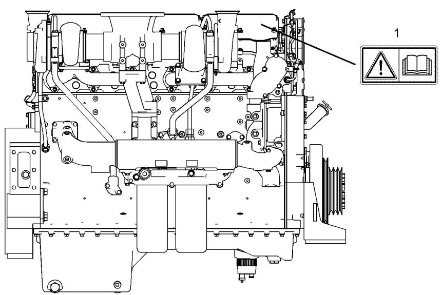

i02840188

#### g01416712 Illustration 1

There may be several specific safety messages on your engine. The exact location and a description of the safety messages are reviewed in this section. Please become familiar with all safety messages.

Ensure that all of the safety messages are legible. Clean the safety messages or replace the safety messages if the words cannot be read or if the illustrations are not visible. Use a cloth, water, and soap to clean the safety messages. Do not use solvents, gasoline, or other harsh chemicals. Solvents, gasoline, or harsh chemicals could loosen the adhesive that secures the safety messages. The safety messages that are loosened could drop off of the engine.

Replace any safety message that is damaged or missing. If a safety message is attached to a part of the engine that is replaced, install a new safety message on the replacement part. Your Caterpillar dealer can provide new safety messages.

**Do not operate or work on this engine unless you have read and understand the instructions and warnings in the Operation and Maintenance Manual. Failure to follow the instructions or heed the warnings could result in injury or death. Contact any Caterpillar dealer for replacement manuals. Proper care is your responsibility.**

### **Universal Warning**

The safety messages for the universal warning are located toward the front of the engine on both sides of the valve cover base.

{7}------------------------------------------------

g01105289 Illustration 2

**Do not operate or work on this engine unless you have read and understand the instructions and warnings in the Operation and Maintenance Manual. Failure to follow the instructions or heed the warnings could result in injury or death. Contact any Caterpillar dealer for replacement manuals. Proper care is your responsibility.**

i02566298

### **General Hazard Information**

**SMCS Code:** 1000; 7405

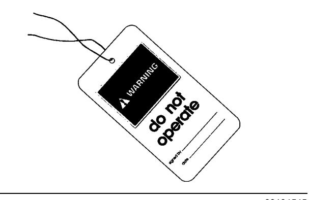

g00104545 Illustration 3

Attach a "Do Not Operate" warning tag or a similar warning tag to the start switch or to the controls before the engine is serviced or before the engine is repaired. These warning tags (Special Instruction, SEHS7332) are available from your Caterpillar dealer. Attach the warning tags to the engine and to each operator control station. When it is appropriate, disconnect the starting controls.

Do not allow unauthorized personnel on the engine, or around the engine when the engine is being serviced.

Engine exhaust contains products of combustion which may be harmful to your health. Always start the engine and operate the engine in a well ventilated area. If the engine is in an enclosed area, vent the engine exhaust to the outside.

Cautiously remove the following parts. To help prevent spraying or splashing of pressurized fluids, hold a rag over the part that is being removed.

- Filler caps
- Grease fittings
- Pressure taps
- Breathers
- Drain plugs

Use caution when cover plates are removed. Gradually loosen, but do not remove the last two bolts or nuts that are located at opposite ends of the cover plate or the device. Before removing the last two bolts or nuts, pry the cover loose in order to relieve any spring pressure or other pressure.

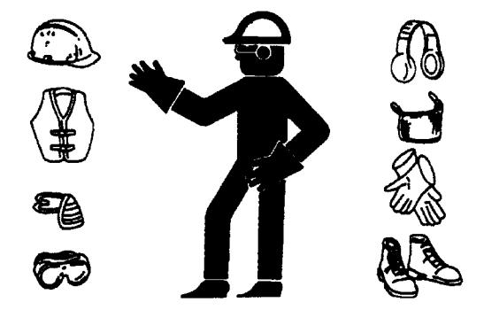

g00702020 Illustration 4

- Wear a hard hat, protective glasses, and other protective equipment, as required.
- When work is performed around an engine that is operating, wear protective devices for ears in order to help prevent damage to hearing.
- Do not wear loose clothing or jewelry that can snag on controls or on other parts of the engine.
- Ensure that all protective guards and all covers are secured in place on the engine.
- Never put maintenance fluids into glass containers. Glass containers can break.
- Use all cleaning solutions with care.
- Report all necessary repairs.

{8}------------------------------------------------

#### **Unless other instructions are provided, perform the maintenance under the following conditions:**

- The engine is stopped. Ensure that the engine cannot be started.
- Disconnect the batteries when maintenance is performed or when the electrical system is serviced. Disconnect the battery ground leads. Tape the leads in order to help prevent sparks.
- Do not attempt any repairs that are not understood. Use the proper tools. Replace any equipment that is damaged or repair the equipment.

### **Pressurized Air and Water**

Pressurized air and/or water can cause debris and/or hot water to be blown out. This could result in personal injury.

When pressurized air and/or pressurized water is used for cleaning, wear protective clothing, protective shoes, and eye protection. Eye protection includes goggles or a protective face shield.

The maximum air pressure for cleaning purposes must be below 205 kPa (30 psi) when the air nozzle is deadheaded. The maximum water pressure for cleaning purposes must be below 275 kPa (40 psi).

### **Fluid Penetration**

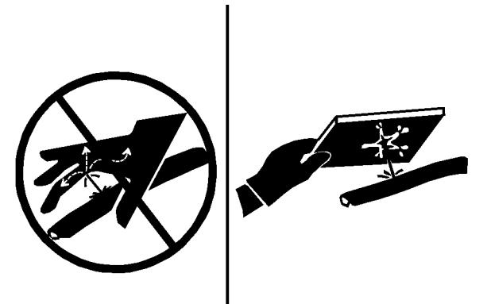

g00687600 Illustration 5

Always use a board or cardboard when you check for a leak. Leaking fluid that is under pressure can penetrate body tissue. Fluid penetration can cause serious injury and possible death. A pin hole leak can cause severe injury. If fluid is injected into your skin, you must get treatment immediately. Seek treatment from a doctor that is familiar with this type of injury.

### **Containing Fluid Spillage**

Care must be taken in order to ensure that fluids are contained during performance of inspection, maintenance, testing, adjusting and repair of the engine. Prepare to collect the fluid with suitable containers before opening any compartment or disassembling any component that contains fluids.

Refer to Special Publication, NENG2500, "Caterpillar Dealer Service Tools Catalog" for the following items:

- Tools that are suitable for collecting fluids and equipment that is suitable for collecting fluids
- Tools that are suitable for containing fluids and equipment that is suitable for containing fluids

Obey all local regulations for the disposal of liquids.

### **Asbestos Information**

g00702022 Illustration 6

Caterpillar equipment and replacement parts that are shipped from Caterpillar are asbestos free. Caterpillar recommends the use of only genuine Caterpillar replacement parts. Use the following guidelines when you handle any replacement parts that contain asbestos or when you handle asbestos debris.

Use caution. Avoid inhaling dust that might be generated when you handle components that contain asbestos fibers. Inhaling this dust can be hazardous to your health. The components that may contain asbestos fibers are brake pads, brake bands, lining material, clutch plates, and some gaskets. The asbestos that is used in these components is usually bound in a resin or sealed in some way. Normal handling is not hazardous unless airborne dust that contains asbestos is generated.

If dust that may contain asbestos is present, there are several guidelines that should be followed:

• Never use compressed air for cleaning.

{9}------------------------------------------------

- Avoid brushing materials that contain asbestos.
- Avoid grinding materials that contain asbestos.
- Use a wet method in order to clean up asbestos materials.
- A vacuum cleaner that is equipped with a high efficiency particulate air filter (HEPA) can also be used.
- Use exhaust ventilation on permanent machining jobs.
- Wear an approved respirator if there is no other way to control the dust.
- Comply with applicable rules and regulations for the work place. In the United States, use Occupational Safety and Health Administration (OSHA) requirements. These OSHA requirements can be found in "29 CFR 1910.1001".
- Obey environmental regulations for the disposal of asbestos.
- Stay away from areas that might have asbestos particles in the air.

### **Dispose of Waste Properly**

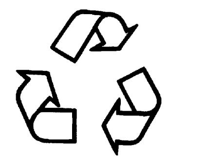

g00706404 Illustration 7

Improperly disposing of waste can threaten the environment. Potentially harmful fluids should be disposed of according to local regulations.

Always use leakproof containers when you drain fluids. Do not pour waste onto the ground, down a drain, or into any source of water.

i02088921

### **Burn Prevention**

**SMCS Code:** 1000; 7405

Do not touch any part of an operating engine. Allow the engine to cool before any maintenance is performed on the engine. Relieve all pressure in the appropriate system before any lines, fittings or related items are disconnected.

### **Coolant**

When the engine is at operating temperature, the engine coolant is hot. The coolant is also under pressure. The radiator and all lines to the heaters or to the engine contain hot coolant. Any contact with hot coolant or with steam can cause severe burns. Allow cooling system components to cool before the cooling system is drained.

Check the coolant level after the engine has stopped and the engine has been allowed to cool. Ensure that the filler cap is cool before removing the filler cap. The filler cap must be cool enough to touch with a bare hand. Remove the filler cap slowly in order to relieve pressure.

Cooling system conditioner contains alkali. Alkali can cause personal injury. Do not allow alkali to contact the skin, the eyes, or the mouth.

### **Oils**

Hot oil and hot lubricating components can cause personal injury. Do not allow hot oil or hot components to contact the skin.

If the application has a makeup tank, remove the cap for the makeup tank after the engine has stopped. The filler cap must be cool to the touch.

### **Batteries**

The liquid in a battery is an electrolyte. Electrolyte is an acid that can cause personal injury. Do not allow electrolyte to contact the skin or the eyes.

Do not smoke while checking the battery electrolyte levels. Batteries give off flammable fumes which can explode.

Always wear protective glasses when you work with batteries. Wash hands after touching batteries. The use of gloves is recommended.

{10}------------------------------------------------

### **Fire Prevention and Explosion Prevention**

**SMCS Code:** 1000; 7405

g00704000 Illustration 8

All fuels, most lubricants, and some coolant mixtures are flammable.

Flammable fluids that are leaking or spilled onto hot surfaces or onto electrical components can cause a fire. Fire may cause personal injury and property damage.

A flash fire may result if the covers for the engine crankcase are removed within fifteen minutes after an emergency shutdown.

Determine whether the engine will be operated in an environment that allows combustible gases to be drawn into the air inlet system. These gases could cause the engine to overspeed. Personal injury, property damage, or engine damage could result.

If the application involves the presence of combustible gases, consult your Caterpillar dealer for additional information about suitable protection devices.

Remove all flammable materials such as fuel, oil, and debris from the engine. Do not allow any flammable materials to accumulate on the engine.

Store fuels and lubricants in properly marked containers away from unauthorized persons. Store oily rags and any flammable materials in protective containers. Do not smoke in areas that are used for storing flammable materials.

Do not expose the engine to any flame.

Exhaust shields (if equipped) protect hot exhaust components from oil or fuel spray in case of a line, a tube, or a seal failure. Exhaust shields must be installed correctly.

Do not weld on lines or tanks that contain flammable fluids. Do not flame cut lines or tanks that contain flammable fluid. Clean any such lines or tanks thoroughly with a nonflammable solvent prior to welding or flame cutting.

Wiring must be kept in good condition. All electrical wires must be properly routed and securely attached. Check all electrical wires daily. Repair any wires that are loose or frayed before you operate the engine. Clean all electrical connections and tighten all electrical connections.

Eliminate all wiring that is unattached or unnecessary. Do not use any wires or cables that are smaller than the recommended gauge. Do not bypass any fuses and/or circuit breakers.

Arcing or sparking could cause a fire. Secure connections, recommended wiring, and properly maintained battery cables will help to prevent arcing or sparking.

Inspect all lines and hoses for wear or for deterioration. The hoses must be properly routed. The lines and hoses must have adequate support and secure clamps. Tighten all connections to the recommended torque. Leaks can cause fires.

Oil filters and fuel filters must be properly installed. The filter housings must be tightened to the proper torque.

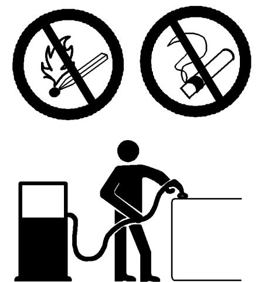

g00704059 Illustration 9

Use caution when you are refueling an engine. Do not smoke while you are refueling an engine. Do not refuel an engine near open flames or sparks. Always stop the engine before refueling.

{11}------------------------------------------------

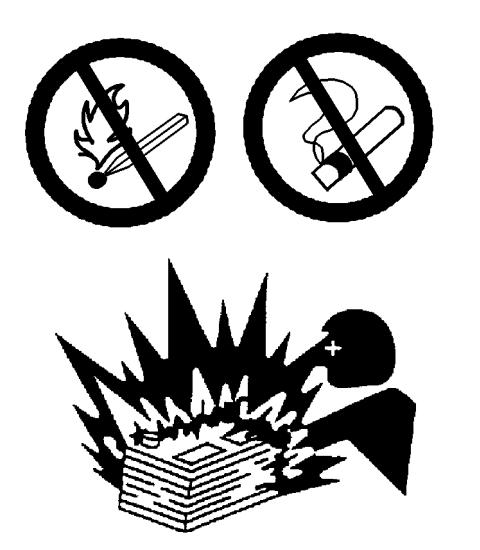

g00704135 Illustration 10

Gases from a battery can explode. Keep any open flames or sparks away from the top of a battery. Do not smoke in battery charging areas.

Never check the battery charge by placing a metal object across the terminal posts. Use a voltmeter or a hydrometer.

Improper jumper cable connections can cause an explosion that can result in injury. Refer to the Operation Section of this manual for specific instructions.

Do not charge a frozen battery. This may cause an explosion.

The batteries must be kept clean. The covers (if equipped) must be kept on the cells. Use the recommended cables, connections, and battery box covers when the engine is operated.

### **Fire Extinguisher**

Make sure that a fire extinguisher is available. Be familiar with the operation of the fire extinguisher. Inspect the fire extinguisher and service the fire extinguisher regularly. Obey the recommendations on the instruction plate.

### **Ether**

Ether is flammable and poisonous.

Use ether in well ventilated areas. Do not smoke while you are replacing an ether cylinder or while you are using an ether spray.

Do not store ether cylinders in living areas or in the engine compartment. Do not store ether cylinders in direct sunlight or in temperatures above 49 °C (120 °F). Keep ether cylinders away from open flames or sparks.

Dispose of used ether cylinders properly. Do not puncture an ether cylinder. Keep ether cylinders away from unauthorized personnel.

Do not spray ether into an engine if the engine is equipped with a thermal starting aid for cold weather starting.

### **Lines, Tubes and Hoses**

Do not bend high pressure lines. Do not strike high pressure lines. Do not install any lines that are bent or damaged.

Repair any lines that are loose or damaged. Leaks can cause fires. Consult your Caterpillar dealer for repair or for replacement parts.

Check lines, tubes and hoses carefully. Do not use your bare hand to check for leaks. Use a board or cardboard to check for leaks. Tighten all connections to the recommended torque.

Replace the parts if any of the following conditions are present:

- End fittings are damaged or leaking.
- Outer coverings are chafed or cut.
- Wires are exposed.
- Outer coverings are ballooning.
- Flexible part of the hoses are kinked.
- Outer covers have embedded armoring.
- End fittings are displaced.

Make sure that all clamps, guards, and heat shields are installed correctly. During engine operation, this will help to prevent vibration, rubbing against other parts, and excessive heat.

i01359666

### **Crushing Prevention and Cutting Prevention**

**SMCS Code:** 1000; 7405

Support the component properly when work beneath the component is performed.

{12}------------------------------------------------

Unless other maintenance instructions are provided, never attempt adjustments while the engine is running.

Stay clear of all rotating parts and of all moving parts. Leave the guards in place until maintenance is performed. After the maintenance is performed, reinstall the guards.

Keep objects away from moving fan blades. The fan blades will throw objects or cut objects.

When objects are struck, wear protective glasses in order to avoid injury to the eyes.

Chips or other debris may fly off objects when objects are struck. Before objects are struck, ensure that no one will be injured by flying debris.

i01372247

## **Mounting and Dismounting**

**SMCS Code:** 1000; 7405

Inspect the steps, the handholds, and the work area before mounting the engine. Keep these items clean and keep these items in good repair.

Mount the engine and dismount the engine only at locations that have steps and/or handholds. Do not climb on the engine, and do not jump off the engine.

Face the engine in order to mount the engine or dismount the engine. Maintain a three-point contact with the steps and handholds. Use two feet and one hand or use one foot and two hands. Do not use any controls as handholds.

Do not stand on components which cannot support your weight. Use an adequate ladder or use a work platform. Secure the climbing equipment so that the equipment will not move.

Do not carry tools or supplies when you mount the engine or when you dismount the engine. Use a hand line to raise and lower tools or supplies.

i00911989

### **Before Starting Engine**

**SMCS Code:** 1000

Inspect the engine for potential hazards.

Before starting the engine, ensure that no one is on, underneath, or close to the engine. All protective guards and all protective covers must be installed if the engine must be started in order to perform service procedures. To help prevent an accident that is caused by parts in rotation, work around the parts carefully.

Do not bypass the automatic shutoff circuits. Do not disable the automatic shutoff circuits. The circuits are provided in order to help prevent personal injury. The circuits are also provided in order to help prevent engine damage.

On the initial start-up of a new engine or an engine that has been serviced, prepare to stop the engine if an overspeed condition occurs. This may be accomplished by shutting off the fuel supply to the engine and/or shutting off the air supply to the engine.

See the Service Manual for repairs and for adjustments.

i01103904

## **Engine Starting**

**SMCS Code:** 1000

If a warning tag is attached to the engine start switch or to the controls, DO NOT start the engine or move the controls. Consult with the person that attached the warning tag before the engine is started.

All protective guards and all protective covers must be installed if the engine must be started in order to perform service procedures. To help prevent an accident that is caused by parts in rotation, work around the parts carefully.

Start the engine from the operator's compartment or from the engine start switch.

Always start the engine according to the procedure that is described in this Operation and Maintenance Manual, "Engine Starting" topic (Operation Section). Knowing the correct procedure will help to prevent major damage to the engine components. Knowing the procedure will also help to prevent personal injury.

To ensure that the jacket water heater (if equipped) and/or the lube oil heater (if equipped) is working properly, check the water temperature gauge and the oil temperature gauge during the heater operation.

Engine exhaust contains products of combustion that can be harmful to your health. Always start the engine and operate the engine in a well ventilated area. If the engine is started in an enclosed area, vent the engine exhaust to the outside.

{13}------------------------------------------------

### **Ether**

Ether is poisonous and flammable.

Do not inhale ether, and do not allow ether to contact the skin. Personal injury could result.

Do not smoke while ether cylinders are changed.

Use ether in well ventilated areas.

Use ether with care in order to avoid fires.

Keep ether cylinders out of the reach of unauthorized persons.

Store ether cylinders in authorized storage areas only.

Do not store ether cylinders in direct sunlight or at temperatures above 49 °C (120 °F).

Discard the ether cylinders in a safe place. Do not puncture the ether cylinders. Do not burn the ether cylinders.

i01462046

## **Engine Stopping**

**SMCS Code:** 1000

Stop the engine according to the procedure in the Operation and Maintenance Manual, "Engine Stopping (Operation Section)" in order to avoid overheating of the engine and accelerated wear of the engine components.

Use the Emergency Stop Button (if equipped) ONLY in an emergency situation. Do not use the Emergency Stop Button for normal engine stopping. After an emergency stop, DO NOT start the engine until the problem that caused the emergency stop has been corrected.

Stop the engine if an overspeed condition occurs during the initial start-up of a new engine or an engine that has been overhauled. This may be accomplished by shutting off the fuel supply to the engine and/or shutting off the air supply to the engine.

To stop an electronically controlled engine, cut the power to the engine.

## **Electrical System**

**SMCS Code:** 1000; 1400

Never disconnect any charging unit circuit or battery circuit cable from the battery when the charging unit is operating. A spark can cause the combustible gases that are produced by some batteries to ignite.

To help prevent sparks from igniting combustible gases that are produced by some batteries, the negative "−" jump start cable should be connected last from the external power source to the negative "−" terminal of the starting motor. If the starting motor is not equipped with a negative "−" terminal, connect the jump start cable to the engine block.

Check the electrical wires daily for wires that are loose or frayed. Tighten all loose electrical wires before the engine is started. Repair all frayed electrical wires before the engine is started. Refer to the "Engine Starting" section of this Operation and Maintenance Manual for specific starting instructions.

### **Grounding Practices**

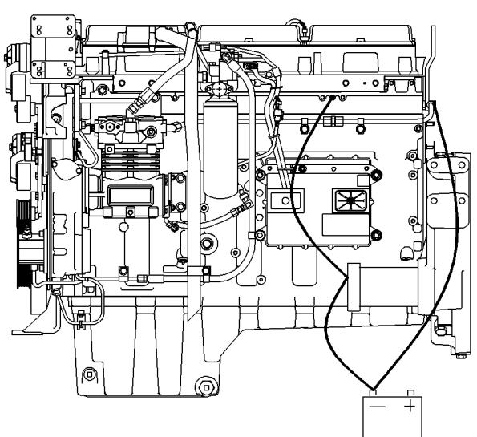

g00771448 Illustration 11 Typical example Grounding Stud To Battery Ground

{14}------------------------------------------------

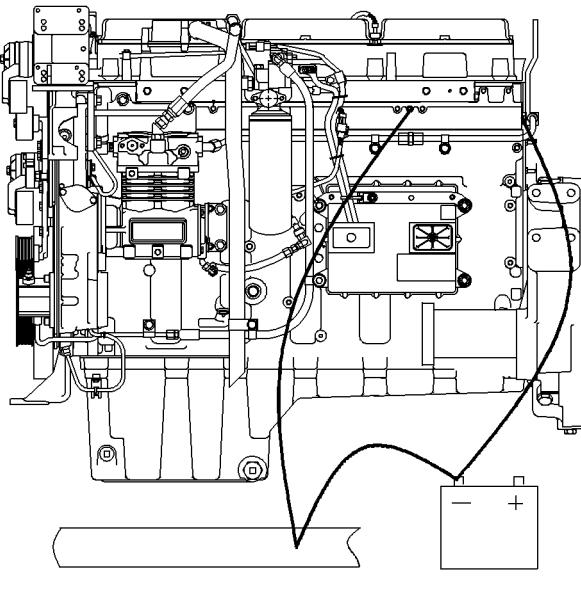

g00771487 Illustration 12

Typical example

Alternate Grounding Stud To Battery Ground

Proper grounding for the engine electrical system is necessary for optimum engine performance and reliability. Improper grounding will result in uncontrolled electrical circuit paths and in unreliable electrical circuit paths.

Uncontrolled electrical circuit paths can result in damage to main bearings, to crankshaft bearing journal surfaces, and to aluminum components.

Engines that are installed without engine-to-frame ground straps can be damaged by electrical discharge.

To ensure that the engine and the engine electrical systems function properly, an engine-to-frame ground strap with a direct path to the battery must be used. This path may be provided by way of a starting motor ground, a starting motor ground to the frame, or a direct engine ground to the frame.

All grounds should be tight and free of corrosion. The engine alternator must be grounded to the negative "-" battery terminal with a wire that is adequate to handle the full charging current of the alternator.

i02784356

## **Engine Electronics**

**SMCS Code:** 1000; 1400; 1900

**Tampering with the electronic system installation or the OEM wiring installation can be dangerous and could result in personal injury or death and/or engine damage.**

This engine has a comprehensive, programmable Engine Monitoring System. The Engine Control Module (ECM) has the ability to monitor the engine operating conditions. If any of the engine parameters extend outside an allowable range, the ECM will initiate an immediate action.

The following actions are available for engine monitoring control: WARNING, DERATE, and SHUTDOWN. These engine monitoring modes have the ability to limit engine speed and/or the engine power.

Many of the parameters that are monitored by the ECM can be programmed for the engine monitoring functions. The following parameters can be monitored as a part of the Engine Monitoring System:

- Operating Altitude
- Engine Coolant Level
- Engine Coolant Temperature
- Engine Oil Pressure
- Engine Speed
- Fuel Temperature
- Intake Manifold Air Temperature
- System Voltage

The Engine Monitoring package can vary for different engine models and different engine applications. However, the monitoring system and the engine monitoring control will be similar for all engines.

**Note:** Many of the engine control systems and display modules that are available for Caterpillar Engines will work in unison with the Engine Monitoring System. Together, the two controls will provide the engine monitoring function for the specific engine application. Refer to the Troubleshooting Manual for more information.

{15}------------------------------------------------

## **Product Information Section**

## **Model Views**

i02942321

### **Model View Illustrations**

**SMCS Code:** 1000

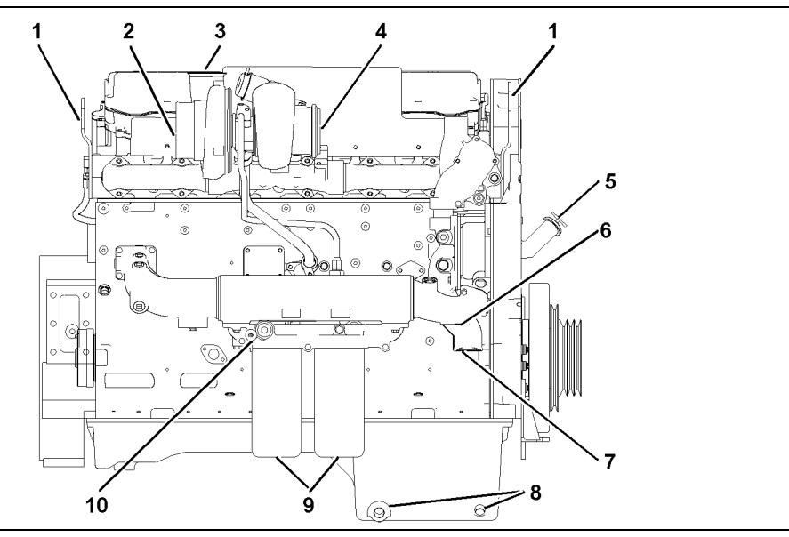

#### g01458440 Illustration 13

Right side view of a C18 industrial engine with a single turbocharger

- (1) Lifting eyes
- (2) Air inlet
- (3) Air outlet to aftercooler
- (4) Exhaust
- (5) Oil filler
- (6) Water outlet
- (7) Water inlet (8) Oil drains

(9) Oil filters (10) Oil sampling valve

{16}------------------------------------------------

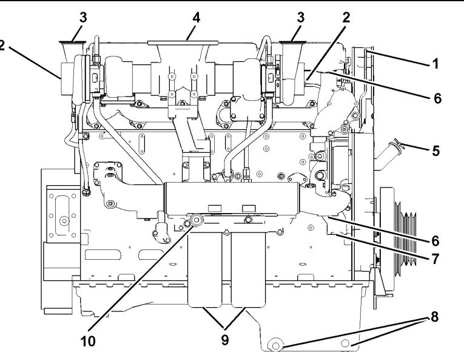

#### g01458442 Illustration 14

Right side view of a C18 industrial engine with twin turbochargers

- (1) Lifting eyes
- (2) Air inlet
- (3) Air outlet to aftercooler
- (4) Exhaust
- (5) Oil filler
- (6) Water outlet (7) Water inlet
- (8) Oil drains

(9) Oil filters (10) Oil sampling valve

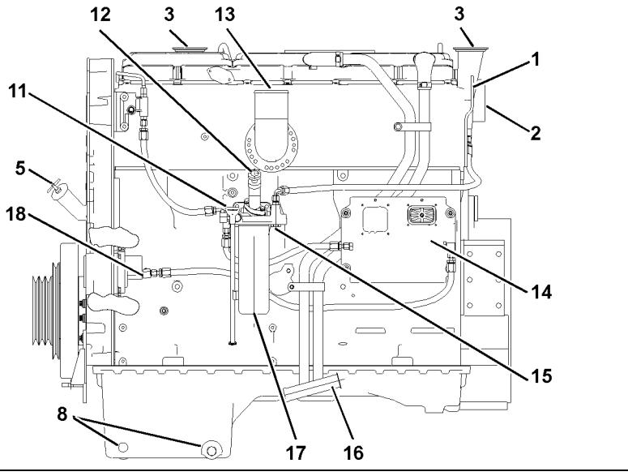

#### g01458445 Illustration 15

Left side view of a C18 industrial engine

- (1) Lifting eye
- (2) Air inlet
- (3) Air outlet to aftercooler
- (5) Oil filler
- (8) Oil drains
- (11) Oil level gauge
- (12) Fuel priming pump
- (13) Air inlet from aftercooler
- (14) Engine control module (ECM)
- (15) Excess fuel return
- (16) Fumes disposal tube
- (17) Fuel filter
- (18) Fuel inlet

{17}------------------------------------------------

## **Engine Description**

#### **SMCS Code:** 1000

Table 1

| C18 Engine Specifications |                      |  |
|---------------------------|----------------------|--|
| Cylinders and Arrangement | In-line six cylinder |  |
| Bore                      | 145 mm (5.7 inch)    |  |
| Stroke                    | 183 mm (7.2 inch)    |  |
| Displacement              | 18 L (1098 in3 )  |  |
| Firing Order              | 1-5-3-6-2-4          |  |
| Rotation (flywheel end)   | Counterclockwise     |  |

The electronic engines that are covered by this manual have the following characteristics: direct fuel injection, electronic unit injection that is mechanically actuated, turbocharged, and air-to-air aftercooled (ATAAC).

The electronic engine control system provides the following functions: electronic governing, automatic air to fuel ratio control, torque rise shaping, injection timing control, and system diagnostics.

An electronic governor controls the output of the unit injectors in order to maintain the engine rpm that is desired. The functions of the governor include a programmable low idle and a 20 rpm to 200 rpm governor overrun.

Very high injection pressures are produced by electronically controlled, mechanically actuated unit injectors. The injectors combine the pumping and the electronic fuel metering (duration and timing) during injection. The unit injectors accurately control smoke limiting, white smoke, and engine acceleration rates.

There is one unit injector per cylinder. Individual unit injectors meter the fuel. The individual unit injectors also pump the fuel. The metering and the pumping is done under high pressure. High injection pressures help to reduce fuel consumption and emissions. The use of this type of unit injector provides total electronic control of injection timing. The injection timing varies with engine operating conditions. The engine performance is optimized in the following areas:

- Starting
- Emissions
- Noise
- Fuel consumption

The timing advance is achieved through precise control of the injector firing. Engine speed is controlled by adjusting the firing duration. The information is provided to the Electronic Control Module (ECM) by a engine speed/timing sensor. The information is for detection of cylinder position and engine speed.

The engines have built-in diagnostics in order to ensure that all of the components are functioning and operating properly. In the event of a system component deviation from the programmed limits, the operator will be alerted to the condition by a DIAGNOSTIC lamp that is mounted on the control panel. An electronic service tool that is provided by Caterpillar may be used to read the numerical code of the diagnostic flash code. There are three types of diagnostic codes: ACTIVE, LOGGED, and EVENT. These codes are logged and stored in the ECM. Refer to the Operation and Maintenance Manual, "Engine Diagnostics" for additional information.

The cooling system consists of the following items: a centrifugal pump that is driven by a gear, water temperature regulator, an oil cooler, and a radiator that incorporates a shunt system.

The engine lubricating oil is supplied by a gear type pump. The engine lubricating oil is cooled and filtered. Bypass valves provide unrestricted flow of lubrication oil to the engine parts when the oil viscosity is high or if either the oil cooler or the oil filter elements (paper cartridge) become plugged.

Engine efficiency, efficiency of emission controls, and engine performance depend on adherence to proper operation and maintenance recommendations. This includes the use of recommended fuels, coolants and lubrication oils.

### **Aftermarket Products and Caterpillar Engines**

#### NOTICE

In order to maximize fuel system life and prevent premature wear out from abrasive particles in the fuel, a two micron absolute high efficiency fuel filter is required for all Caterpillar Electronic Unit Injectors. Caterpillar High Efficiency Fuel Filters meet these requirements. Consult your Caterpillar dealer for the proper part numbers.

When auxiliary devices, accessories, or consumables (filters, additives, catalysts, etc) which are made by other manufacturers are used on Caterpillar products, the Caterpillar warranty is not affected simply because of such use.

{18}------------------------------------------------

**However, failures that result from the installation or use of other manufacturers' devices, accessories, or consumables are NOT Caterpillar defects. Therefore, the defects are NOT covered under the Caterpillar warranty.**

### **Welding and Caterpillar Electronic Engines**

#### NOTICE

Because the strength of the frame may decrease, some manufacturers do not recommend welding onto a chassis frame or rail. Consult the OEM of the equipment or your Caterpillar dealer regarding welding on a chassis frame or rail.

To help avoid damage to the electronic controls, proper welding procedures are necessary. Before welding on a vehicle that is equipped with an electronic engine, observe the following precautions:

- **1.** Turn off the engine. Place the key start switch in the OFF position.
- **2.** If the application has a battery disconnect switch, open the switch. Otherwise, disconnect the negative "-" battery cable from the battery of the vehicle.

#### NOTICE

Do not ground the welder to electrical components such as the ECM or sensors. Improper grounding can cause damage to the drive train bearings, hydraulic components, electrical components, and other components.

Clamp the ground cable from the welder to the component that will be welded. Place the clamp as close as possible to the weld. This will help reduce the possibility of damage.

- **3.** Clamp the ground cable from the welder to the component that will be welded. Place the clamp as close as possible to the weld.
- **4.** Protect wiring harnesses from welding debris and from spatter. Use proper welding procedures.

{19}------------------------------------------------

## **Product Identification Information**

i02088692

### **Plate Locations and Film Locations**

**SMCS Code:** 1000

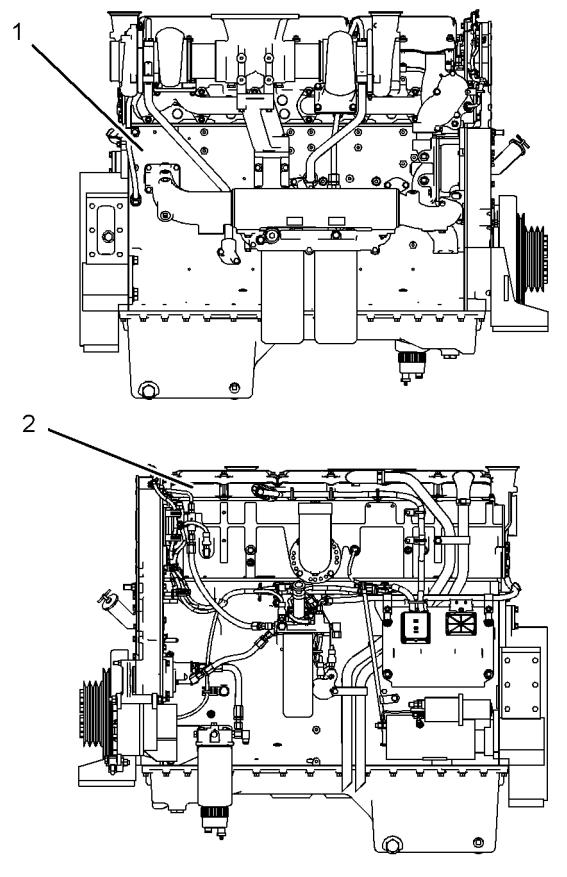

g01065152 Illustration 16

(1) Serial number plate

(2) Information plate

Caterpillar engines are identified by serial numbers and by arrangement numbers. These numbers are shown on the engine serial number plate and on the engine information plate. Caterpillar dealers need these numbers in order to determine the components that were included with the engine. This permits accurate identification of replacement part numbers.

### **Serial Number Plate (1)**

The engine serial number plate is located on the upper right side of the engine block.

Engine serial number \_\_\_\_\_\_\_\_\_\_\_\_\_\_\_\_\_\_\_\_\_\_\_\_\_\_\_\_\_\_\_\_\_\_\_\_\_

Engine model \_\_\_\_\_\_\_\_\_\_\_\_\_\_\_\_\_\_\_\_\_\_\_\_\_\_\_\_\_\_\_\_\_\_\_\_\_\_\_\_\_\_\_\_\_\_\_

Arrangement number \_\_\_\_\_\_\_\_\_\_\_\_\_\_\_\_\_\_\_\_\_\_\_\_\_\_\_\_\_\_\_\_\_\_\_\_\_

### **Information Plate (2)**

The engine information plate is located on the valve cover base near the front of the left side of the engine.

Engine Serial Number \_\_\_\_\_\_\_\_\_\_\_\_\_\_\_\_\_\_\_\_\_\_\_\_\_\_\_\_\_\_\_\_\_\_\_\_

Engine Arrangement Number \_\_\_\_\_\_\_\_\_\_\_\_\_\_\_\_\_\_\_\_\_\_\_\_\_\_\_

Engine Modification Number \_\_\_\_\_\_\_\_\_\_\_\_\_\_\_\_\_\_\_\_\_\_\_\_\_\_\_\_

The engine identification plate also contains other important information about the engine.

i02164876

### **Reference Numbers**

**SMCS Code:** 1000

Information for the following items may be needed to order parts. Locate the information for your engine. Record the information in the appropriate space. Make a copy of this list for a record. Keep the information for future reference.

### **Record for Reference**

| Engine Model _______________________________________________  |
|------------------------------------------------------------------|
| Engine Serial number _____________________________________    |
| Engine Low Idle rpm ______________________________________    |
| Engine Full Load rpm _____________________________________    |
| Primary Fuel Filter _________________________________________ |
| Water Separator Element ________________________________      |
| Secondary Fuel Filter Element __________________________      |
| Lubrication Oil Filter Element ___________________________    |
| Auxiliary Oil Filter Element _______________________________  |
| Total Lubrication System Capacity _____________________       |
| Total Cooling System Capacity _________________________       |
| Air Cleaner Element _______________________________________   |
| Fan Drive Belt ______________________________________________ |

{20}------------------------------------------------

Alternator Belt \_\_\_\_\_\_\_\_\_\_\_\_\_\_\_\_\_\_\_\_\_\_\_\_\_\_\_\_\_\_\_\_\_\_\_\_\_\_\_\_\_\_\_\_\_\_

i00844066

## **Emissions Certification Film**

**SMCS Code:** 1000; 7405

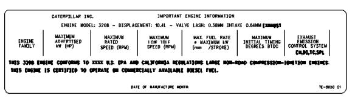

g00284658 Illustration 17

EPA Emissions Certification Film

| <b>FNGINE MODEL</b> | <b>CATERPILLAR INC.</b> THIS ENGINE CONFORMS TO TYPE APPROVAL: |                           |
|---------------------|-------------------------------------------------------------------|---------------------------|
| REGULATION          | SMOKE ABSORPTION COEFFICIENT                                   | APPROVAL <b>NUMBER</b> |
| COUNTRY APPROVED    | DIRECTIVE                                                         | APPROVAL NUMBER           |
| COUNTRY APPROVED    | DIRECTIVE                                                         | APPROVAL NUMBER           |
|                     |                                                                   | 7E-0213 4                 |

g00415538 Illustration 18

European Emissions Certification Film

The EPA Emissions Certification Film (if equipped) and/or the European Emissions Certification Film (if equipped) is located on the side of the engine.

{21}------------------------------------------------

### **Operation Section**

## **Lifting and Storage**

i01988813

### **Product Lifting**

**SMCS Code:** 1000; 1404; 7002

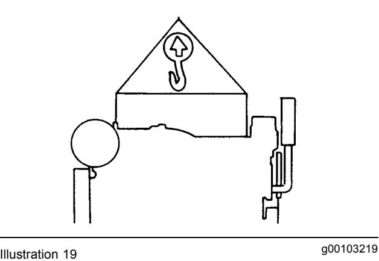

#### NOTICE

Never bend the eyebolts and the brackets. Only load the eyebolts and the brackets under tension. Remember that the capacity of an eyebolt is less as the angle between the supporting members and the object becomes less than 90 degrees.

When it is necessary to remove a component at an angle, only use a link bracket that is properly rated for the weight.

Use a hoist to remove heavy components. Use an adjustable lifting beam to lift the engine. All supporting members (chains and cables) should be parallel to each other. The chains and cables should be perpendicular to the top of the object that is being lifted.

Some removals require lifting the fixtures in order to obtain proper balance and safety.

To remove the engine ONLY, use the lifting eyes that are on the engine.

Lifting eyes are designed and installed for the specific engine arrangement. Alterations to the lifting eyes and/or the engine make the lifting eyes and the lifting fixtures obsolete. If alterations are made, ensure that proper lifting devices are provided. Consult your Caterpillar dealer for information regarding fixtures for proper engine lifting.

### **Product Storage**

**SMCS Code:** 1000; 1404; 7002

If the engine will not be started for several weeks, the lubricating oil will drain from the cylinder walls and from the piston rings. Rust can form on the cylinder liner surface. Rust on the cylinder liner surface will cause increased engine wear and a reduction in engine service life.

To help prevent excessive engine wear, use the following guidelines:

- Complete all of the lubrication recommendations that are listed in this Operation and Maintenance Manual, "Maintenance Interval Schedule" (Maintenance Section).
- If freezing temperatures are expected, check the cooling system for adequate protection against freezing. See this Operation and Maintenance Manual, "Refill Capacities and Recommendations" (Maintenance Section).

If an engine is out of operation and if use of the engine is not planned, special precautions should be made. If the engine will be stored for more than one month, a complete protection procedure is recommended.

For more detailed information on engine storage, see Special Instruction, SEHS9031, "Storage Procedure For Caterpillar Products".

Your Caterpillar dealer can assist in preparing the engine for extended storage periods.

{22}------------------------------------------------

## **Features and Controls**

i02944987

### **Monitoring System**

**SMCS Code:** 1900; 7400; 7402; 7450; 7451

The Monitoring System is designed to alert the operator to an immediate problem with any of the engine systems that are monitored. The Monitoring System is also designed to alert the operator to an impending problem with any of the engine systems that are monitored.

### **Indicators and Gauges**

The instrument panel may look like the instrument panel that is pictured in illustration 20 or the instrument panel may look like the instrument panel that is pictured in illustration 21. The instrument panel may not include all of the instruments that are shown in the illustration.

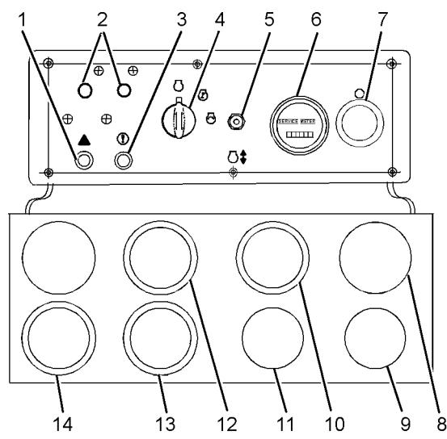

g01233007 Illustration 20

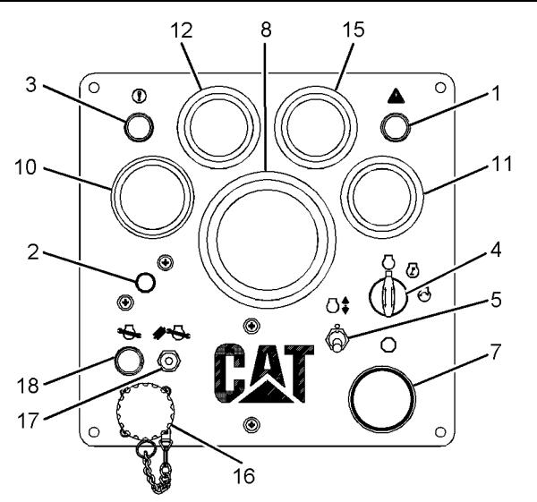

g01459611 Illustration 21

**Warning Lamp (1) –** There is a general fault in the engine. Refer to the Messenger display for any additional information that may be available.

**Circuit Breaker (2) –** Reset the circuit breaker if a circuit breaker trips. Press the button in order to reset the circuit breaker. If the electrical system is working properly, the button will remain pressed. If the button does not remain pressed or if the circuit breaker trips soon after being reset, check the appropriate electrical circuit. Repair the electrical circuit, if necessary.

**Diagnostic Lamp (3) –** The diagnostic lamp is used to indicate the existence of a fault by flashing a fault code. For a more detailed discussion of the diagnostic lamp, please see this Operation and Maintenance Manual, "Diagnostic Lamp" topic.

**Start Switch (4) –** The start switch has three positions: OFF, RUN, and START. When the start switch is turned clockwise to the RUN position, the lamps will flash for five seconds during the system test. The lamps will then shut off. In the RUN position, the ECM and electronic systems are powered up.

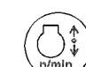

**Idle Speed Switch (5) –** When the switch is in the up position, the engine speed increases to HIGH IDLE. When the switch is in the down position, the engine speed decreases to LOW IDLE.

{23}------------------------------------------------

**Service Meter (6) –** This display indicates the total operating hours of the engine. Use the display in order to determine the service

hour maintenance intervals. Hours of operation are logged in the ECM. A service tool is needed to retrieve the hours from the ECM.

**Shutdown Switch (7) –** Use the engine shutdown switch in order to stop the engine. Push the shutdown switch in order

to put the switch in the OFF position. This will stop the engine. After the engine stops, turn the knob clockwise. This will reset the engine shutdown switch to the ON position.

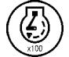

**Tachometer (8) –** This gauge indicates engine speed (rpm). When the throttle control lever is moved to the full throttle position without load, the engine is running at high idle. The engine is running at the full load rpm when the throttle control lever is at the full throttle position

with maximum rated load.

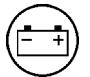

**Voltmeter (9) –** This gauge indicates the voltage of the electrical system. The needle in the red range indicates low voltage or high voltage.

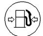

**Fuel Pressure (10) –** This gauge indicates fuel pressure to the fuel injection pump from the fuel filter. A decrease in fuel pressure usually indicates a dirty fuel filter or a plugged fuel filter. As the fuel filter becomes plugged, there will be

a noticeable reduction in the engine's performance.

**Ammeter (11) –** This gauge indicates the amount of electrical charge or of discharge in the battery charging circuit. Operation of

the indicator should be to the right side of "0"(zero).

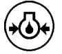

**Engine Oil Pressure (12) –** The oil pressure should be greatest after a cold engine is started. The pressure will

decrease as the engine warms up. The pressure will increase when the engine rpm is increased. The pressure will stabilize when the engine rpm is stable.

A lower oil pressure is normal at low idle. If the load is stable and the gauge reading changes, perform the following procedure:

- **1.** Remove the load.
- **2.** Reduce engine speed to low idle.
- **3.** Check and maintain the oil level.

#### NOTICE

To help prevent engine damage, never exceed the high idle rpm. An overspeed can result in serious damage to the engine. The engine can be operated at high idle without damage, but the engine should never be allowed to exceed the high idle rpm.

**Note:** The high idle rpm and the full load rpm are stamped on the Information Plate.

**Jacket Water Coolant Temperature (13) –** Typical temperature range is 87 to 98°C

(189 to 208°F). Higher temperatures may occur under certain conditions. The water temperature reading may vary according to load. The reading should never exceed the boiling point for the pressurized system that is being used.

**Engine Oil Temperature (14) –** This gauge indicates the engine oil temperature. Maximum oil temperature at rated speed with a full load is 115 °C (239 °F).

**Coolant Temperature (15) –** When the coolant temperature is above the normal operating value, the coolant temperature gauge will be in the red zone. Refer to the Messenger panel for any additional information that may be available.

**Service Tool Connector (16) –** For more information regarding the use of Caterpillar Electronic Technician (ET) and the PC requirements for Cat ET, refer to the documentation that accompanies your Cat ET software.

**Maintenance Clear Switch (17) –** The maintenance clear switch is required to reset the maintenance lamp after maintenance on the engine is performed.

**Maintenance Lamp (18) –** The ECM records data that is related to equipment maintenance. The ECM will activate the maintenance indicator lamp when scheduled maintenance is due. The maintenance indicator lamp can be reset by actuating the maintenance clear switch. The maintenance interval may be based on operating hours or fuel consumption. The ECM provides information that pertains to maintenance intervals and the last maintenance that was performed.

{24}------------------------------------------------

### **Caterpillar Messenger Display**

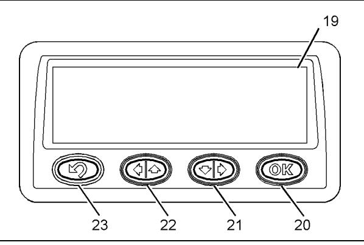

g01459691 Illustration 22

**Digital display area (19) –** The Messenger system shows information on the digital display area.

**"OK" button (20) –** The "OK"button may be used to confirm the selections that were made with the "scroll up/left" and the "scroll down/right"buttons.

**"Scroll down/right button" (21) –** This button is used to scroll down through information that is shown on the display area. The button can also be used to scroll to the right through information that is shown on the display area.

**"Scroll up/left button" (22) –** This button is used to scroll up through information that is shown on the display area. The button can also be used to scroll to the left through information that is shown on the display area.

**Previous button (23) –** Use the previous button to return to information that was previously shown on the digital display area.

### **Performance Monitor Panel**

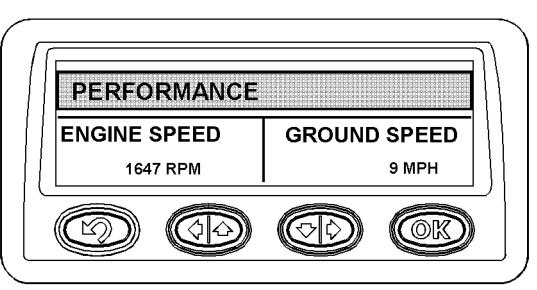

The following options are available through the performance monitor panel:

**Engine Speed –** When you scroll to this option, the panel will show the engine RPM.

**Engine Coolant Temperature –** When you scroll to this option, the panel will show the engine coolant temperature in degrees fahrenheit or in degrees celsius.

**Fuel Level –** When you scroll to this option, the panel will show the amount of fuel in the tank as a percentage of a full tank.

### **Totals Display**

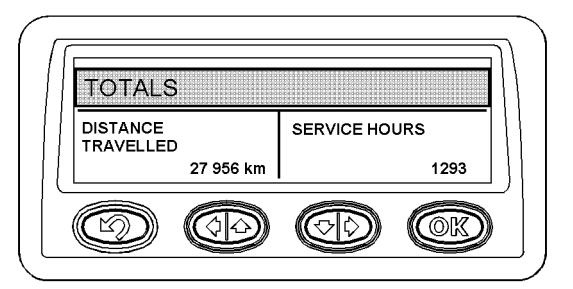

g01054562 Illustration 24

Typical performance monitor panel for totals

The following information is available through the panel:

#### **CUMULATIVE TOTALS**

**Service Hours –** When you scroll to this option, the panel shows the total amount of service hours that the engine has accumulated.

**Total Time –** When you scroll to this option, the panel shows the total hours for the engine ECM.

**Total Fuel –** When you scroll to this option, the panel shows the total amount of fuel that has been consumed.

{25}------------------------------------------------

### **Performance Monitor Panel for Settings**

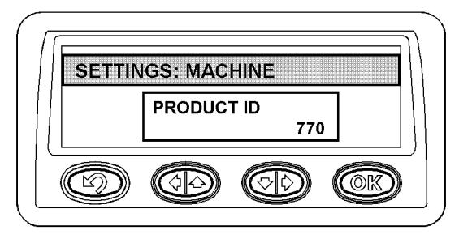

g01054565 Illustration 25

Typical performance monitor panel for settings

The following options are available through the performance monitor panel for payloads:

#### **MONITORING SYSTEM**

**Language –** Select this option in order to change the language that is shown on the panel.

**Units –** Select this option in order to choose the desired system of measurement. The choices are metric or English.

**Adjust Contrast –** Select this option in order to adjust the contrast of the panel for improved visibility.

**"Adjust Backlight" –** Select this option in order to adjust the backlighting of the panel for improved visibility.

#### **ENGINE**

**"Equipment Identification" –** Select this option in order to view the identification number of the equipment.

**Product identification –** Select this option in order to view the product identification number.

#### **Performance Monitor Panel for Service**

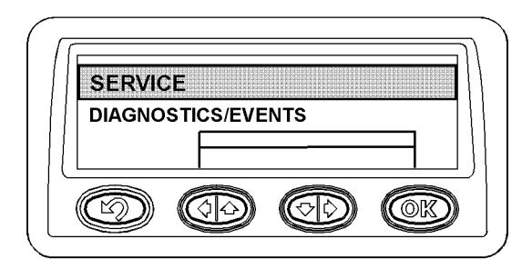

g01054566 Illustration 26

Typical performance monitor panel for service

#### **DIAGNOSTICS and EVENTS**

The following options are password protected. You must enter a password in order to change the settings.

**View –** Select this option in order to view events that have been logged by the monitoring system. If you use an authorized password, you can clear individual events.

**Clear All Diagnostics –** If you use an authorized password, you can select this option in order to clear all logged events.

#### **SYSTEM PARAMETERS**

#### **MONITORING SYSTEM**

- **Battery Voltage** When you scroll to this option, the battery voltage is displayed.
- **Fuel Level** When you scroll to this option, the fuel level is displayed.
- **"Alternator Status"** When you scroll to this option, the status of the alternator is displayed.
- **Engine Speed** When you scroll to this option, the engine RPM is displayed.
- **Desired Engine Speed** When you scroll to this option, the desired engine speed is displayed. This parameter is used by the Automatic Retarder Control to prevent the engine from overspeeding. If you have an approved password, you can change this parameter.
- **Throttle Position** When you scroll to this option, the throttle position is displayed.
- **Coolant Temperature** When you scroll to this option, the coolant temperature is displayed.

{26}------------------------------------------------

- **Coolant Flow** When you scroll to this option, the amount of coolant flow is displayed.
- **Boost Pressure** When you scroll to this option, the boost pressure is displayed.
- **Atmospheric Pressure** When you scroll to this option, the atmospheric pressure is displayed.
- **Turbocharger Inlet Pressure** When you scroll to this option, the turbocharger inlet pressure is displayed.
- **Oil Pressure** When you scroll to this option, the absolute engine oil pressure is displayed.
- **Oil Pressure** When you scroll to this option, the engine oil pressure gauge is displayed.
- **Fuel Temperature** When you scroll to this option, the fuel temperature is displayed.

#### **SYSTEMS TESTS**

• **"System Self Test"** When you select this option, the monitoring system will initiate the self test. The self test is similar to the functional test that occurs when you turn the start switch from the OFF position to the ON position.

#### **INFORMATION ABOUT SYSTEMS**

#### **MONITORING SYSTEM**

- **Software Part Number** When you scroll to this option, the software part number is displayed.
- **ECM Part Number** When you scroll to this option, the ECM part number is displayed.
- **"Software Release Date"** When you scroll to this option, the release date of the software is displayed.
- **"Software Description"** When you scroll to this option, the description of the software is displayed.

#### **ENGINE**

- **"ECM Serial Number"** When you scroll to this option, the ECM serial number is displayed.
- **"Software Part Number"** When you scroll to this option, the software part number is displayed.
- **"Software Release Date"** When you scroll to this option, the release date of the software is displayed.
- **"Software Description"** When you scroll to this option, the description of the software is displayed.

• **Engine Serial Number** When you scroll to this option, the engine serial number is displayed.

#### **TATTLETALE**

- **"Full Tattletale Readout"** When you select this option, the indicators and the gauges display the maximum values that were reached during operation.
- **Engine Coolant Temperature** When you select this option, the indicators will display the maximum values that were reached during operation. The engine coolant temperature gauge will also show the maximum value that was reached during operation.
- **Tachometer** When you select this option, the indicators will display the maximum values that were reached during operation. The tachometer will also show the maximum value that was reached during operation.
- **Fuel Level** When you select this option, the indicators will display the maximum values that were reached during operation. The fuel level gauge will also show the minimum value that was reached during operation.
- **Clear** If you have an approved password, you can clear the maximum values that are stored by the monitoring system.

{27}------------------------------------------------

## **Engine Diagnostics**

i00863835

### **Self-Diagnostics**

**SMCS Code:** 1000; 1900; 1901; 1902

The electronic control module has some self-diagnostic ability. When an electronic problem with an input or an output is detected, a diagnostic code is generated. This indicates the specific problem with the circuitry.

Diagnostic codes are also generated when an abnormal engine operating condition is detected. For example, a diagnostic code will be generated if the low oil pressure alarm is activated. In this case, the diagnostic code indicates the symptom of a problem. This type of diagnostic code is called an event. An event is triggered by the detection of an abnormal engine operating condition.

A diagnostic code which represents a problem that currently exists is called an active code.

A diagnostic code that is stored in memory is called a logged code. Always service active codes prior to servicing logged codes. Logged codes may include the following categories:

- Intermittent problems
- Recorded events
- Performance history

Logged codes may not indicate that a repair is needed. The problems may have been repaired since the logging of the code. Logged codes may be helpful to troubleshoot intermittent problems.

### **Diagnostic Lamp**

**SMCS Code:** 1000; 1900; 1901; 1902; 7451

The "DIAGNOSTIC" lamp is used to indicate the existence of an active fault by flashing codes.

When the ignition switch is first turned on, the "DIAGNOSTIC" lamp will go through the following procedure:

- The "DIAGNOSTIC" lamp will come on and the "DIAGNOSTIC" lamp will remain on for five seconds. This checks the operation of the lamp.
- The "DIAGNOSTIC" lamp will turn off.
- The "DIAGNOSTIC" lamp will come on again and the "DIAGNOSTIC" lamp will flash codes for any active diagnostic codes. Not all diagnostic codes have a unique flash code.
- The "DIAGNOSTIC" lamp will turn off for five seconds.
- The "DIAGNOSTIC" lamp repeats all active diagnostic codes.

A fault diagnostic code will remain active until the problem is repaired. The electronic control module will continue flashing the flash code at five second intervals until the problem is repaired.

i02496338

### **Diagnostic Flash Code Retrieval**

**SMCS Code:** 1000; 1900; 1901; 1902

Problems with the electronic control system are reported via these types of codes: flash codes, SPN/FMI codes, diagnostic codes, and event codes.

i01463253

{28}------------------------------------------------

| Table 2 |  |
|---------|--|
|---------|--|

| Cross Reference for Diagnostic Codes |                 |                                     |                                                      |
|--------------------------------------|-----------------|-------------------------------------|------------------------------------------------------|
| Flash Code                           | SPN(1)/FMI Code | Diagnostic Code or Event Code | Description of Code                                  |
|                                      | 1387-15         | E443(2)                             | High Auxiliary Pressure Warning                      |
|                                      | 1387-16         |                                     | High Auxiliary Pressure Derate                       |
|                                      | 1387-00         |                                     | High Auxiliary Pressure Shutdown                     |
|                                      | 0441-15         | E445(2)                             | High Auxiliary Temperature Warning                   |
|                                      | 0441-16         |                                     | High Auxiliary Temperature Derate                    |
|                                      | 0441-00         |                                     | High Auxiliary Temperature Shutdown                  |
|                                      | 626-05          | 545-05                              | Ether Start Relay open/short to +batt                |
| N/A                                  |                 | 2417-05                             | Ether Injection Control Solenoid open/short to +batt |
|                                      |                 | 545-06                              | Ether Start Relay short to ground                    |
|                                      | 626-06          | 2417-06                             | Ether Injection Control Solenoid short to ground     |
|                                      | 1835-03         | 1835-03                             | Auxiliary Pressure Sensor open/short to +batt        |
|                                      | 1835-04         | 1835-04                             | Auxiliary Pressure Sensor short to ground            |
|                                      | 1836-03         | 1836-03                             | Auxiliary Temperature Sensor open/short to +batt     |
|                                      | 1836-04         | 1836-04                             | Auxiliary Temperature Sensor short to ground         |
|                                      | 111-02          | 111-02                              | Engine Coolant Level Sensor Loss of Signal           |
|                                      | 174-03          | 174-03                              | Fuel Temperature open/short to +batt                 |
| 13                                   | 174-04          | 174-04                              | Fuel Temperature short to ground                     |
|                                      | 678-03          | 41-03                               | 8 Volt DC Supply short to +batt                      |
|                                      | 678-04          | 41-04                               | 8 Volt DC Supply short to ground                     |
|                                      | 620-03          | 262-03                              |                                                      |
| 21                                   | 1079-03         |                                     | 5 Volt Sensor DC Power Supply short to +batt         |
|                                      | 620-04          | 262-04                              |                                                      |
|                                      | 1079-04         |                                     | 5 Volt Sensor DC Power Supply short to ground        |
|                                      | 100-03          | 100-03                              | Engine Oil Pressure open/short to +batt              |
| 24                                   | 100-04          | 100-04                              | Engine Oil Pressure short to ground                  |
|                                      | 100-10          | 100-10                              | Engine Oil Pressure abnormal rate of change          |
| 25                                   | 102-03          | 102-03                              | Boost Pressure Sensor short to +batt                 |
|                                      | 102-04          | 102-04                              | Boost Pressure Sensor short to ground                |
|                                      | 102-10          | 102-10                              | Boost Pressure Sensor abnormal rate of change        |
| 26                                   | 108-03          | 274-03                              | Atmospheric Pressure open/short to +batt             |
|                                      | 108-04          | 274-04                              | Atmospheric Pressure short to ground                 |
|                                      | 110-03          | 110-03                              | Engine Coolant Temperature open/short to +batt       |
| 27                                   | 110-04          | 110-04                              | Engine Coolant Temperature short to ground           |
| 28                                   | 91-13           | 91-13                               | Throttle Position calibration required               |
| 32                                   | 91-08           | 91-08                               | Throttle Position signal abnormal                    |

(continued)

{29}------------------------------------------------

(Table 2, contd)

| Cross Reference for Diagnostic Codes |                 |                                     |                                              |  |
|--------------------------------------|-----------------|-------------------------------------|----------------------------------------------|--|
| Flash Code                           | SPN(1)/FMI Code | Diagnostic Code or Event Code | Description of Code                          |  |
| 34                                   | 190-08          | 190-08                              | Engine Speed signal abnormal                 |  |
|                                      | 723-08          | 342-08                              | Secondary Engine Speed signal abnormal       |  |
|                                      | 190-15          |                                     | Engine Overspeed Warning                     |  |
| 35                                   | 190-00          | E362(2)                             | Engine Overspeed Shutdown                    |  |
| 37                                   | 94-03           | 94-03                               | Fuel Pressure open/short to +batt            |  |
|                                      | 94-04           | 94-04                               | Fuel Pressure short to ground                |  |
|                                      | 105-03          | 172-03                              | Intake Manifold Air Temp open/short to +batt |  |
| 38                                   | 105-04          | 172-04                              | Intake Manifold Air Temp short to ground     |  |
| 42                                   | 637-13          | 261-13                              | Engine Timing calibration required           |  |
|                                      | 100-17          |                                     | Low Engine Oil Pressure Warning              |  |
| 46                                   | 100-18          | E360(2)                             | Low Engine Oil Pressure Derate               |  |
|                                      | 100-01          |                                     | Low Engine Oil Pressure Shutdown             |  |
|                                      | 168-00          | 168-00                              | System Voltage high                          |  |
| 51                                   | 168-01          | 168-01                              | System Voltage low                           |  |
|                                      | 168-02          | 168-02                              | System Voltage intermittent/erratic          |  |
| 56                                   | 630-02          | 268-02                              | Check Programmable Parameters                |  |
| 58                                   | 639-09          | 247-09                              | J1939 Data Link communications               |  |
|                                      | 110-15          | E361(2)                             | High Engine Coolant Temperature Warning      |  |
| 61                                   | 110-16          |                                     | High Engine Coolant Temperature Derate       |  |
|                                      | 110-00          |                                     | High Engine Coolant Temperature Shutdown     |  |
|                                      | 111-17          | E2143(2)                            | Low Engine Coolant Level Warning             |  |
| 62                                   | 111-18          |                                     | Low Engine Coolant Level Derate              |  |
|                                      | 111-01          |                                     | Low Engine Coolant Level Shutdown            |  |
| 63                                   | 94-15           | E096                                | High Fuel Pressure Warning                   |  |
|                                      | 1636-15         |                                     | High Inlet Air Temperature Warning           |  |
| 64                                   | 1636-00         | E539(2)                             | High Inlet Air Temperature Shutdown          |  |
|                                      | 174-15          |                                     | High Fuel Temperature Warning                |  |
| 65                                   | 174-16          | E363(2)                             | High Fuel Temperature Derate                 |  |
|                                      | 174-00          |                                     | High Fuel Temperature Shutdown               |  |
| 71                                   | 651-05          | 001-05                              | Injector Cylinder 1 open circuit             |  |
|                                      | 651-06          | 001-06                              | Injector Cylinder 1 short                    |  |
|                                      | 651-11          | 001-11                              | Injector Cylinder #1 fault                   |  |
|                                      | 652-05          | 002-05                              | Injector Cylinder 2 open circuit             |  |
| 72                                   | 652-06          | 002-06                              | Injector Cylinder 2 short                    |  |
|                                      | 652-11          | 002-11                              | Injector Cylinder #2 fault                   |  |

(continued)

{30}------------------------------------------------

| Cross Reference for Diagnostic Codes |                 |                                     |                                  |  |
|--------------------------------------|-----------------|-------------------------------------|----------------------------------|--|
| Flash Code                           | SPN(1)/FMI Code | Diagnostic Code or Event Code | Description of Code              |  |
|                                      | 653-05          | 003-05                              | Injector Cylinder 3 open circuit |  |
| 73                                   | 653-06          | 003-06                              | Injector Cylinder 3 short        |  |
|                                      | 653-11          | 003-11                              | Injector Cylinder #3 fault       |  |
| 74                                   | 654-05          | 004-05                              | Injector Cylinder 4 open circuit |  |
|                                      | 654-06          | 004-06                              | Injector Cylinder 4 short        |  |
|                                      | 654-11          | 004-11                              | Injector Cylinder #4 fault       |  |
| 75                                   | 655-05          | 005-05                              | Injector Cylinder 5 open circuit |  |
|                                      | 655-06          | 005-06                              | Injector Cylinder 5 short        |  |
|                                      | 655-11          | 005-11                              | Injector Cylinder #5 fault       |  |
| 76                                   | 656-05          | 006-05                              | Injector Cylinder 6 open circuit |  |
|                                      | 656-06          | 006-06                              | Injector Cylinder 6 short        |  |
|                                      | 656-11          | 006-11                              | Injector Cylinder #6 fault       |  |

(Table 2, contd)

(1) Suspect Parameter Number

(2) Caterpillar Electronic Technician (ET) will display the number 1, 2, or 3 after the event code in order to designate a warning, a derate, or a shutdown.

For further information, see the troubleshooting guide for your engine.

i02512380

## **Fault Logging**

**SMCS Code:** 1000; 1900; 1901; 1902

The system provides the capability of Fault Logging. When the Electronic Control Module (ECM) generates an active diagnostic code, the code will be logged in the memory of the ECM. The codes that have been logged in the memory of the ECM can be retrieved with Caterpillar electronic service tools. The codes that have been logged can be cleared with Caterpillar electronic service tools. The codes that have been logged in the memory of the ECM will be automatically cleared from the memory after 100 hours. The following faults can not be cleared from the memory of the ECM without using a factory password: overspeed, low engine oil pressure, and high engine coolant temperature.

### **Engine Operation with Active Diagnostic Codes**

#### **SMCS Code:** 1000; 1900; 1901; 1902

If a diagnostic lamp illuminates during normal engine operation, the system has identified a situation that is not within the specification. Use Caterpillar electronic service tools to check the active diagnostic codes.

**Note:** If the customer has selected "DERATE" and if there is a low oil pressure condition, the Electronic Control Module (ECM) will limit the engine power until the problem is corrected. If the oil pressure is within the normal range, the engine may be operated at the rated speed and load. However, maintenance should be performed as soon as possible.

The active diagnostic code should be investigated. The cause of the problem should be corrected as soon as possible. If the cause of the active diagnostic code is repaired and there is only one active diagnostic code, the diagnostic lamp will turn off.

Operation of the engine and performance of the engine can be limited as a result of the active diagnostic code that is generated. Acceleration rates may be significantly slower. Refer to the Troubleshooting Guide for more information on the relationship between these active diagnostic codes and engine performance.

{31}------------------------------------------------

### **Engine Operation with Intermittent Diagnostic Codes**

**SMCS Code:** 1000; 1900; 1901; 1902

If the diagnostic lamp starts to flash codes during normal engine operation and the diagnostic lamp shuts off, an intermittent fault may have occurred. If a fault has occurred, the fault will be logged into the memory of the Electronic Control Module (ECM).

In most cases, it is not necessary to stop the engine because of an intermittent code. However, the operator should retrieve the logged fault codes and the operator should reference the appropriate information in order to identify the nature of the event. The operator should log any observation that could have caused the lamp to light.

- Low power
- Limits of the engine speed
- Excessive smoke, etc

This information can be useful to help troubleshoot the situation. The information can also be used for future reference. For more information on diagnostic codes, refer to the Troubleshooting Guide for this engine.

i02940650

### **Configuration Parameters**

**SMCS Code:** 1000; 1900; 1901; 1902

System configuration parameters are parameters that affect the emissions and the power of the engine. Default values for the parameters are programmed at the factory. Some parameters may be changed by the customer in order to suit the needs of the specific application.

### **Parameter Descriptions**

#### **"Equipment ID"**

"Equipment ID" allows the customer to enter a description into the Electronic Control Module (ECM) in order to identify the machine. A maximum of 17 characters may be entered in the field. This parameter is only for reference by the customer. This parameter is not required.

#### **"Engine Serial Number"**

Program the "Engine Serial Number" to match the engine serial number that is stamped on the engine information plate. If the ECM is replaced, the engine serial number from the engine information plate must be programmed into the new ECM.

**Note:** When you are requesting factory passwords, always use the engine serial number that is programmed in the ECM.

#### **"Rating Number"**

The "Rating Number" corresponds to the selected set of performance maps for the application. This selected set of performance maps comes out of several unique sets of maps that are resident in the flash file. The dealer and/or the OEM will need to select the appropriate rating tier, if more than one rating tier is present. The rating tiers are "A" through "E".

**Note:** Factory passwords are required in order to change the "Rating Number".

### **"Top Engine Limit" (TEL)**

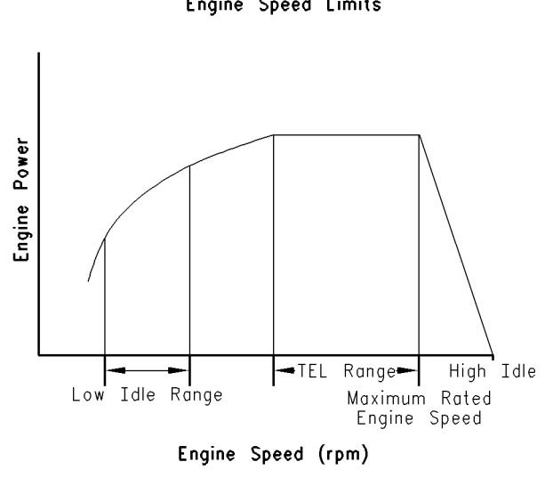

g00763900 Illustration 27

"TEL" is a customer programmable parameter that defines the maximum allowable engine speed for maximum power. "TEL" can be programmed up to the maximum rated engine speed. "TEL" is defined along the engine's lug curve.

{32}------------------------------------------------

#### **"Engine Accel. Rate"**

"Engine Accel. Rate" determines the rate of change of the engine speed (acceleration or deceleration) during PTO operation. This rate of change is also used to achieve intermediate engine speed.

### **"Low Idle Speed"**

"Low Idle Speed" is the minimum allowable operating speed for the engine. This parameter can be programmed between 600 and 1400 rpm.

#### **"PTO Mode"**

"PTO Mode" allows the ECM to be programmed to either one of the two PTO configurations that are available.

**"Ramp Up/Ramp Down" –** When "PTO Mode" is programmed to "Ramp Up/Ramp Down", the ECM allows PTO operation with traditional features.

**"Set/Resume" –** When "PTO Mode" is programmed to "Set/Resume", the ECM allows PTO operation with enhanced features.

### **"High Idle Speed"**

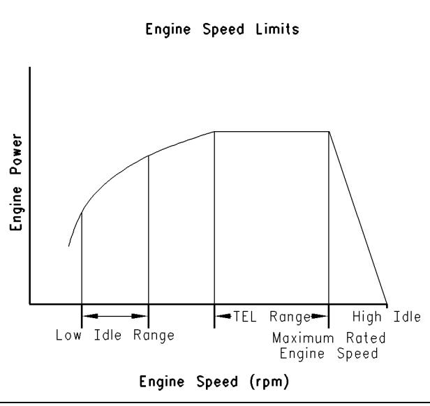

#### g00763900 Illustration 28

"High Idle Speed" is the maximum no-load engine speed when the throttle or the PTO switch is in the maximum position.

**Note:** "High Idle Speed" cannot be programmed lower than "TEL".

#### **"Intermediate Engine Speed"**

"Intermediate Engine Speed" defines the speed for the engine when the intermediate engine speed switch is activated. This parameter can be programmed to any engine speed between "Low Idle Speed" and "TEL". Engine speed will increase or engine speed will decrease at the rate that is defined by the programmed value for "Engine Accel. Rate".

#### **"Maximum Engine Torque Limit"**

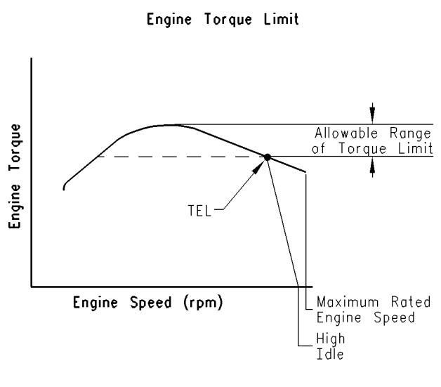

g00817759 Illustration 29

"Engine Torque Limit" can be used to limit torque output to the programmed value when the torque limit switch is activated.

### **"FLS" (Full Load Setting)**

"FLS" is a number that represents the adjustment to the fuel system that was made at the factory in order to fine tune the fuel system. The correct value for this parameter is stamped on the engine information plate. Factory passwords are required in order to change this parameter.

### **"FTS" (Full Torque Setting)**

"FTS" is similar to "FLS". Factory passwords are required in order to change this parameter.

#### **"Ether Control"**

Program the "Ether Control" to "Enabled" if an ether injection system is installed on the engine. This allows the ECM to control ether injection. If the engine is not equipped with ether, program this parameter to "Disabled".

{33}------------------------------------------------

#### **"Air Shutoff"**

"Air Shutoff" allows the ECM to be programmed for operation of an air shutoff system. If this parameter is programmed to "Installed", the ECM will activate the air shutoff solenoid in the event of an engine overspeed condition.

**Note:** If an engine overspeed condition occurs and "Air Shutoff" is programmed to "Enabled", the switched power to the ECM must be cycled and the air shutoff solenoid must be manually reset before the engine will restart.

#### **"Maintenance Indicator Mode"**

The ECM records data that is related to equipment maintenance. The ECM will activate the maintenance indicator lamp when scheduled maintenance is due. The maintenance indicator lamp can be reset by actuating the maintenance clear switch. The maintenance interval may be based on operating hours or on fuel consumption. The ECM provides information that pertains to maintenance intervals and the last maintenance that was performed.

#### **"PM1 Interval"**

"PM1 Interval" allows the customer to define the maintenance interval if "Maintenance Indicator Mode" is programmed to one of the manual options. Refer to the engine's Operation and Maintenance Manual for more information.

#### **"Throttle Position Sensor"**

Program the "Throttle Position Sensor" to "Installed" if a throttle position sensor is used for desired speed control. Otherwise program this parameter to "Not Installed".

#### **"Coolant Level Sensor"**

Program the "Coolant Level Sensor" to "Installed" if a coolant level sensor is installed on the engine. Otherwise program this parameter to "Not Installed".

#### **"Aux Press Sensor Installation Status"**

Program "Aux Press Enable" to "Installed" if an auxiliary pressure sensor is installed. This will allow the Caterpillar Messenger Driver Information Display to monitor the pressure of another system. Program this parameter to "Not Installed" if an auxiliary pressure sensor is not installed.

#### **"Aux Temp Sensor Installation Status"**

Program "Aux Temp Enable" to "Installed" if an auxiliary temperature sensor is installed. This will allow the Caterpillar Messenger Driver Information Display to monitor the temperature of another system. Program this parameter to "Not Installed" if an auxiliary temperature sensor is not installed.

{34}------------------------------------------------

### **System Configuration Parameters**

Table 3

| System Configuration Parameters          |                                                                 |                     |                      |  |  |  |
|------------------------------------------|-----------------------------------------------------------------|---------------------|----------------------|--|--|--|
| Parameter                                | Available Range or Options                                      | Default             | Required Password |  |  |  |
| ECM Identification Parameters            |                                                                 |                     |                      |  |  |  |
| "Equipment ID"                           | 17 alphanumeric characters                                      | "NOT PROGRAMMED"    | None                 |  |  |  |
| "Engine Serial Number"                   | 0XX00000 or XXX00000                                            | 0XX00000            | None                 |  |  |  |
| "ECM Serial Number"                      | "Read Only" (1)                                                 |                     |                      |  |  |  |
| "Software Gp Part Number"                | Software Dependent                                              | Read Only (1)       |                      |  |  |  |
| "Software Gp Release Date"               | Software Dependent                                              | Read Only (1)       |                      |  |  |  |
| Selected Engine Rating                   |                                                                 |                     |                      |  |  |  |
| "Rating Number" Software Dependent    |                                                                 |                     | Customer             |  |  |  |
| "Rated Power"                            | Software Dependent                                              |                     | Read Only (1)        |  |  |  |
| "Rated Peak Torque"                      | Software Dependent                                              |                     | Read Only (1)        |  |  |  |
| "Top Engine Speed Range"                 | Software Dependent                                              |                     | Read Only (1)        |  |  |  |
| "Test Spec"                              | Software Dependent                                              | Read Only (1)       |                      |  |  |  |
| "Top Engine Limit"                       | Software Dependent                                              | Customer            |                      |  |  |  |
| "Engine Governor Primary Mode"        | "Speed Control" "Min/Max"                                    | "Speed Control"     | None                 |  |  |  |
| "Engine Accel. Rate"                     | 50 to 1000                                                      | 50                  | None                 |  |  |  |
| "Low Idle Speed"                         | 600 to 1400                                                     | 700                 | None                 |  |  |  |
| "PTO Mode"                               | "Ramp Up/Ramp Down" "Set/Resume"                             | "Ramp Up/Ramp Down" | None                 |  |  |  |
| "High Idle Speed"                        | 1800 to 2310                                                    | 2310                | Customer             |  |  |  |
| "Intermediate Engine Speed"              | Programmed "Low Idle" to "TEL"                                  | 1100                | None                 |  |  |  |
| "Maximum Engine Torque Limit"            | Software Dependent                                              | None                |                      |  |  |  |
| "Customer Password #1"                   | 8 alphanumeric characters                                       | Blank               | Customer             |  |  |  |
| "Customer Password #2"                   | 8 alphanumeric characters                                       | Blank               | Customer             |  |  |  |
| "FLS" (Full Load Setting)                | - 128 to 127                                                    | 0                   | Factory              |  |  |  |
| "FTS" (Full Torque Setting)              | -128 to 127                                                     | 0                   | Factory              |  |  |  |
| "Ether Control"                          | "No Ether" "Continuous Flow"                                 | "No Ether"          | None                 |  |  |  |
| "Enabled" "Air Shutoff" "Disabled" |                                                                 | "Disabled"          | None                 |  |  |  |
| "Maintenance Indicator Mode"             | "OFF" "Auto Fuel" "Auto Hour" "Man Fuel" "Man Hour" | "OFF"               | None                 |  |  |  |
| "PM1 Interval"                           | 100 to 750 Hours or 3785 to 28390 L (1000 to 7500 US gal) |                     | None                 |  |  |  |
| "Throttle Position Sensor"               | "Installed" "Not Installed"                                  | "Not Installed"     | None                 |  |  |  |

{35}------------------------------------------------

(Table 3, contd)

| System Configuration Parameters              |                                |                 |                      |  |
|----------------------------------------------|--------------------------------|-----------------|----------------------|--|
| Parameter                                    | Available Range or Options     | Default         | Required Password |  |
| "Coolant Level On"                           | "Installed" "Not Installed" | "Not Installed" | None                 |  |
| "Last Tool to change Customer Parameters" | Read Only (1)                  |                 |                      |  |
| "Last Tool to change System Parameters"   | Read Only (1)                  |                 |                      |  |
| "Aux Temp Sensor Installation Status"     | "On" "Off"                  | "Off"           | None                 |  |
| "Aux Press Sensor Installation Status"    | "On" "Off"                  | "Off"           | None                 |  |
| "Total Tattletale"                           | Read Only (1)                  |                 |                      |  |

(1) The parameter can only be viewed. No changes are allowed.

### **Parameters Worksheet**

**Note:** A mistake in recording this information will result in incorrect passwords.

Table 4

| Engine Parameters             |  |  |
|-------------------------------|--|--|
| ECM Identification Parameters |  |  |
| "Equipment ID"                |  |  |
| "Engine Serial Number"        |  |  |
| "ECM Serial Number"           |  |  |
| "Software Gp Part Number"     |  |  |
| "Software Gp Release Date" |  |  |
| Selected Engine Rating        |  |  |
| "Rating Number"               |  |  |
| "Rated Power"                 |  |  |
| "Rated Peak Torque"           |  |  |
| "Top Engine Speed Range"      |  |  |
| "Test Spec"                   |  |  |
| "Top Engine Limit"            |  |  |
| "Engine Accel Rate"           |  |  |
| "Low Idle Speed"              |  |  |

(Table 4, contd)

| Engine Parameters                            |  |  |
|----------------------------------------------|--|--|
| "PTO Mode"                                   |  |  |
| "High Idle Speed"                            |  |  |
| "Intermediate Engine Speed"               |  |  |
| "Maximum Engine Torque Limit"             |  |  |
| "Customer Password #1"                       |  |  |
| "Customer Password #2"                       |  |  |
| "FLS"                                        |  |  |
| "FTS"                                        |  |  |
| "Ether Control"                              |  |  |
| "Air Shutoff"                                |  |  |
| "Maintenance Indicator Mode"              |  |  |
| "PM1 Interval"                               |  |  |
| "Throttle Position Sensor"                   |  |  |
| "Coolant Level Sensor"                       |  |  |
| "Last Tool to change Customer Parameters" |  |  |
| "Last Tool to change System Parameters"   |  |  |

{36}------------------------------------------------

(Table 4, contd)

| Engine Parameters                         |  |  |  |
|-------------------------------------------|--|--|--|
| "Aux Press Temp Installation Status"   |  |  |  |
| "Aux Press Sensor Installation Status" |  |  |  |
| "Total Tattletale"                        |  |  |  |
| Information from Engine Information Plate |  |  |  |
| "Engine Serial Number"                    |  |  |  |
| "FLS"                                     |  |  |  |
| "FTS"                                     |  |  |  |
| Injector Codes                            |  |  |  |
| Injector Code (1)                         |  |  |  |
| Injector Code (2)                         |  |  |  |
| Injector Code (3)                         |  |  |  |
| Injector Code (4)                         |  |  |  |
| Injector Code (5)                         |  |  |  |
| Injector Code (6)                         |  |  |  |

**Note:** Compare the FLS and the FTS from the ECM with the values that are listed on the engine information plate. Only change the FLS and the FTS because of a mechanical change in the engine. The use of the wrong parameters could cause damage to the engine. The use of the wrong parameters may also void the Caterpillar warranty.

{37}------------------------------------------------

## **Engine Starting**

i02109067

## **Before Starting Engine**

**SMCS Code:** 1000; 1400; 1450

Perform the required daily maintenance and other periodic maintenance before the engine is started. Inspect the engine compartment. This inspection can help prevent major repairs at a later date. Refer to the Operation and Maintenance Manual, "Maintenance Interval Schedule" for more information.

- For the maximum service life of the engine, make a thorough inspection before the engine is started. Look for the following items: oil leaks, coolant leaks, loose bolts, and trash buildup. Remove trash buildup and arrange for repairs, as needed.
- Inspect the aftercooler for loose connections and for debris buildup.
- Inspect the cooling system hoses for cracks and for loose clamps.
- Inspect the alternator and accessory drive belts for cracks, breaks, and other damage.
- Inspect the wiring for loose connections and for worn wires or frayed wires.
- Check the fuel supply. Drain water from the water separator (if equipped). Open the fuel supply valve.

#### NOTICE

All valves in the fuel return line must be open before and during engine operation to help prevent high fuel pressure. High fuel pressure may cause filter housing failure or other damage.

If the engine has not been started for several weeks, fuel may have drained from the fuel system. Air may have entered the filter housing. Also, when fuel filters have been changed, some air pockets will be trapped in the engine. In these instances, prime the fuel system. Refer to the Operation and Maintenance Manual, "Fuel System - Prime" for more information on priming the fuel system.

**Engine exhaust contains products of combustion which may be harmful to your health. Always start and operate the engine in a well ventilated area and, if in an enclosed area, vent the exhaust to the outside.**

- Do not start the engine or move any of the controls if there is a "DO NOT OPERATE" warning tag or similar warning tag attached to the start switch or to the controls.
- Ensure that the areas around the rotating parts are clear.
- All of the guards must be put in place. Check for damaged guards or for missing guards. Repair any damaged guards. Replace damaged guards and/or missing guards.
- Disconnect any battery chargers that are not protected against the high current drain that is created when the electric starting motor (if equipped) is engaged. Check electrical cables and check the battery for poor connections and for corrosion.
- Reset all of the shutoffs or alarm components.
- Check the engine lubrication oil level. Maintain the oil level between the "ADD" mark and the "FULL" mark on the oil level gauge.
- Check the coolant level. Observe the coolant level in the coolant recovery tank (if equipped). Maintain the coolant level to the "FULL" mark on the coolant recovery tank.
- If the engine is not equipped with a coolant recovery tank maintain the coolant level within 13 mm (0.5 inch) of the bottom of the filler pipe. If the engine is equipped with a sight glass, maintain the coolant level in the sight glass.
- Observe the air cleaner service indicator (if equipped). Service the air cleaner when the yellow diaphragm enters the red zone, or when the red piston locks in the visible position.
- Ensure that any driven equipment has been disengaged. Minimize electrical loads or remove any electrical loads.

i01903151

### **Starting the Engine**

**SMCS Code:** 1000; 1450

**Note:** Do not adjust the engine speed control during start-up. The electronic control module (ECM) will control the engine speed during start-up.

### **Starting a Cold Engine**

**1.** Disengage any equipment that is driven by the engine.

{38}------------------------------------------------

- **2.** Turn the keyswitch to the RUN position. Leave the keyswitch in the RUN position for 15 seconds.
- **3.** Turn the keyswitch to the START position in order to engage the electric starting motor and crank the engine.

#### NOTICE

Do not engage the starting motor when flywheel is turning. Do not start the engine under load.

If the engine fails to start within 30 seconds, release the starter switch or button and wait two minutes to allow the starting motor to cool before attempting to start the engine again.

- **4.** Allow the keyswitch to return to the RUN position after the engine starts.
- **5.** Repeat step 2 through step 4 if the engine fails to start.

### **Starting a Warm Engine**

- **1.** Disengage any equipment that is driven by the engine.
- **2.** Turn the keyswitch to the START position in order to engage the electric starting motor and crank the engine.

#### NOTICE

Do not engage the starting motor when flywheel is turning. Do not start the engine under load.

If the engine fails to start within 30 seconds, release the starter switch or button and wait two minutes to allow the starting motor to cool before attempting to start the engine again.

- **3.** Allow the keyswitch to return to the RUN position after the engine starts.
- **4.** Repeat step 2 and step 3 if the engine fails to start.

i01797227

### **Cold Weather Starting**

**SMCS Code:** 1000; 1250; 1450; 1453; 1456; 1900

**Do not use aerosol types of starting aids such as ether. Such use could result in an explosion and personal injury.**

Startability will be improved at temperatures below −18 °C (0 °F) from the use of a jacket water heater or extra battery capacity.

When No. 2 diesel fuel is used, the following items provide a means of minimizing starting problems and fuel problems in cold weather: engine oil pan heaters, jacket water heaters, fuel heaters, and fuel line insulation.

Use the procedure that follows for cold weather starting.

**Note:** Do not adjust the engine speed control during start-up. The electronic control module (ECM) will control the engine speed during start-up.

- **1.** Disengage any driven equipment.
- **2.** Turn the keyswitch to the RUN position. Leave the keyswitch in the RUN position for 20 seconds.

#### NOTICE

Do not engage the starting motor when flywheel is turning. Do not start the engine under load.

If the engine fails to start within 30 seconds, release the starter switch or button and wait two minutes to allow the starting motor to cool before attempting to start the engine again.

- **3.** Turn the keyswitch to the START position in order to engage the starting motor and crank the engine.
- **4.** Allow the keyswitch to return to the RUN position after the engine starts.
- **5.** Repeat step 2 through step 4 if the engine fails to start.
- **6.** Allow the engine to idle for three to five minutes, or allow the engine to idle until the water temperature indicator begins to rise. The engine should run at low idle smoothly until speed is gradually increased to high idle. Allow the white smoke to disperse before proceeding with normal operation.
- **7.** Operate the engine at low load until all systems reach operating temperature. Check the gauges during the warm-up period.

{39}------------------------------------------------

### **Starting with Jump Start Cables**

**SMCS Code:** 1000; 1401; 1402; 1900

**Improper jump start cable connections can cause an explosion resulting in personal injury.**

**Prevent sparks near the batteries. Sparks could cause vapors to explode. Do not allow jump start cable ends to contact each other or the engine.**

If the installation is not equipped with a backup battery system, it may be necessary to start the engine from an external electrical source.

#### NOTICE

Using a battery source with the same voltage as the electric starting motor. Use ONLY equal voltage for jump starting. The use of higher voltage will damage the electrical system.

Do not reverse the battery cables. The alternator can be damaged. Attach ground cable last and remove first.

When using an external electrical source to start the engine, turn the generator set control switch to the "OFF" position. Turn all electrical accessories OFF before attaching the jump start cables.

Ensure that the main power switch is in the OFF position before attaching the jump start cables to the engine being started.

- **1.** Turn the start switch to the OFF position. Turn off all accessories.
- **2.** Connect one positive end of the jump start cable to the positive cable terminal of the discharged battery. Connect the other positive end of the jump start cable to the positive cable terminal of the electrical source.
- **3.** Connect one negative end of the jump start cable to the negative cable terminal of the electrical source. Connect the other negative end of the jump start cable to the engine block or to the chassis ground. This procedure helps to prevent potential sparks from igniting combustible gases that are produced by some batteries.
- **4.** Start the engine.

**5.** Immediately after the stalled engine is started, disconnect the jump start cables in reverse order.

**Note:** If there is a problem with the alternator or the battery charger, the engine will not continue to run after starting, unless the power to the engine control module is supplied by a separate source.

i01646248

### **After Starting Engine**

**SMCS Code:** 1000

**Note:** In temperatures from 0 to 60°C (32 to 140°F), the warm-up time is approximately three minutes. In temperatures below 0°C (32°F), additional warm-up time may be required.

**Note:** Ensure that the self test for the monitoring system (if equipped) is completed before operating the engine under load.

When the engine idles during warm-up, observe the following conditions:

- Check for any fluid or for any air leaks at idle rpm and at one-half full rpm (no load on the engine) before operating the engine under load. This is not possible in some applications.
- Operate the engine at low idle until all systems achieve operating temperatures. Check all gauges during the warm-up period.

**Note:** Gauge readings should be observed and the data should be recorded frequently while the engine is operating. Comparing the data over time will help to determine normal readings for each gauge. Comparing data over time will also help detect abnormal operating developments. Significant changes in the readings should be investigated.

{40}------------------------------------------------

## **Engine Operation**

i02176671

## **Engine Operation**

**SMCS Code:** 1000

Correct operation and maintenance are key factors in obtaining the maximum life and economy of the engine. If the directions in the Operation and Maintenance Manual are followed, costs can be minimized and engine service life can be maximized.

The engine can be operated at the rated rpm after the engine reaches operating temperature. The engine will reach normal operating temperature sooner during a low engine speed (rpm) and during a low power demand. This procedure is more effective than idling the engine at no load. The engine should reach operating temperature in a few minutes.

Gauge readings should be observed and the data should be recorded frequently while the engine is operating. Comparing the data over time will help to determine normal readings for each gauge. Comparing data over time will also help detect abnormal operating developments. Significant changes in the readings should be investigated.

i00808595

### **Engine Warm-up**

#### **SMCS Code:** 1000

**1.** Run the engine at low idle for three to five minutes, or run the engine at low idle until the jacket water temperature starts to rise.

More time may be necessary when the temperature is below −18° C (0° F).

- **2.** Check all of the gauges during the warm-up period.
- **3.** Perform another walk-around inspection. Check the engine for fluid leaks and air leaks.
- **4.** Increase the rpm to the rated rpm. Check for fluid leaks and air leaks. The engine may be operated at full rated rpm and at full load when the engine oil temperature reaches 60° C (140° F).

### **Engaging the Driven Equipment**

#### **SMCS Code:** 1000

If the load varies, or if the load is cyclic, the governor will adjust the engine rpm, as needed.

Extended operation at low idle or extended operation at a reduced load may cause increased oil consumption and carbon buildup in the cylinders. This carbon buildup results in a loss of power and/or poor performance. When the engine is operated at a reduced load, the engine should be fully loaded at every four hours in order to burn excess carbon from the cylinders.

### **Industrial Engines**

- **1.** When the engine is operating, check the engine gauges. The engine gauges should be in the normal range before you engage the driven equipment.
- **2.** Engage the driven equipment. Begin operating the engine at low load. Check the gauges and check the equipment for proper operation. Check the gauges and check the equipment frequently while the engine is operating under load.

i01878039

### **Fuel Conservation Practices**

**SMCS Code:** 1000; 1250

The efficiency of the engine can affect the fuel economy. Caterpillar's design and technology in manufacturing provides maximum fuel efficiency in all applications. Follow the recommended procedures in order to attain optimum performance for the life of the engine.

• Avoid spilling fuel.

Fuel expands when the fuel is warmed up. The fuel may overflow from the fuel tank. Inspect fuel lines for leaks. Repair the fuel lines, as needed.

- Be aware of the properties of the different fuels. Use only the recommended fuels.
- Avoid unnecessary operation at no load.

Shut off the engine instead of operating the engine at no load for long periods of time.

i01196062

{41}------------------------------------------------

- Observe the service indicator for the air cleaner frequently, if equipped. Keep the air cleaner elements clean.
- Maintain a good electrical system.

One bad battery cell will overwork the alternator. This will consume excess power and excess fuel.

- Ensure that the belts are properly adjusted. The belts should be in good condition.
- Ensure that all of the connections of the hoses are tight. The connections should not leak.
- Ensure that the driven equipment is in good working order.
- Cold engines consume excess fuel. Keep cooling system components clean and keep cooling system components in good repair. Never operate the engine without water temperature regulators. All of these items will help maintain operating temperatures.
- Settings for the fuel system and the limits for the operating altitude are stamped on the Engine Information Plate. If an engine is moved to a higher altitude, the settings must be changed by a Caterpillar dealer. Changing the settings will help to provide the maximum efficiency for the engine. Engines can be operated safely at higher altitudes, but the engines will deliver less horsepower. The fuel settings should be changed by a Caterpillar dealer in order to obtain the rated horsepower.

{42}------------------------------------------------

## **Engine Stopping**

i01646416

### **Manual Stop Procedure**

**SMCS Code:** 1000

**Note:** Individual applications will have different control systems. Ensure that the shutoff procedures are understood. Use the following general guidelines in order to stop the engine.

- **1.** Remove the load, when possible. Reduce the engine speed (rpm) to low idle.
- **2.** Increase the engine speed (rpm) to no more than one-half of the rated rpm. Perform this procedure for three to five minutes in order to cool the engine. Reduce the engine speed (rpm) to low idle.
- **3.** After the cool down period, turn the key switch to the OFF position.

## **After Stopping Engine**

#### **SMCS Code:** 1000

**Note:** Before you check the engine oil, do not operate the engine for at least 10 minutes in order to allow the engine oil to return to the oil pan.

• Check the crankcase oil level. Maintain the oil level between the "ADD" mark and the "FULL" mark on the oil level gauge.

**Note:** Only use oil that is recommended in this Operation and Maintenance Manual, "Refill Capacities and Recommendations" article. Failure to do so may result in engine damage.

- If necessary, perform minor adjustments. Repair any leaks and tighten any loose bolts.
- Note the service hour meter reading. Perform the maintenance that is in the Operation and Maintenance Manual, "Maintenance Interval Schedule".
- Fill the fuel tank in order to help prevent accumulation of moisture in the fuel. Do not overfill the fuel tank.
- Allow the engine to cool. Check the coolant level. Maintain the cooling system at 13 mm (0.5 inch) from the bottom of the pipe for filling.

**Note:** Only use coolant that is recommended in this Operation and Maintenance Manual, "Refill Capacities and Recommendations" article. Failure to do so may result in engine damage.

- If freezing temperatures are expected, check the coolant for proper antifreeze protection. The cooling system must be protected against freezing to the lowest expected outside temperature. Add the proper coolant/water mixture, if necessary.
- Perform all required periodic maintenance on all driven equipment. This maintenance is outlined in the instructions from the OEM.

i02069570

{43}------------------------------------------------

## **Cold Weather Operation**

i01646447

### **Radiator Restrictions**

**SMCS Code:** 1353; 1396

Caterpillar discourages the use of airflow restriction devices that are mounted in front of radiators. Airflow restriction can cause the following conditions:

- High exhaust temperatures
- Power loss
- Excessive fan usage
- Reduction in fuel economy

If an airflow restriction device must be used, the device should have a permanent opening directly in line with the fan hub. A centered opening that is directly in line with the fan hub is specified in order to prevent an interrupted airflow on the fan blades. Interrupted airflow on the fan blades could cause a fan failure.

Caterpillar recommends a warning device for the inlet manifold temperature and/or the installation of an inlet air temperature gauge. The warning device for the inlet manifold temperature should be set at 75 °C (167 °F). The inlet manifold air temperature should not exceed 75 °C (167 °F). Temperatures that exceed this limit can cause power loss and potential engine damage.

### **Fuel and the Effect from Cold Weather**

#### **SMCS Code:** 1000; 1250

The following fuels are the grades that are available for Caterpillar engines:

- No. 1
- No. 2
- Blend of No. 1 and No. 2

No. 2 diesel fuel is the most commonly used fuel. Either No. 1 diesel fuel or a blend of No. 1 and No. 2 is best suited for cold weather operation.

Quantities of No. 1 diesel fuel are limited. No. 1 diesel fuels are usually available during the months of the winter in the colder climates. During cold weather operation, if No. 1 diesel fuel is not available, use No. 2 diesel fuel, if necessary.

There are three major differences between No. 1 and No. 2 diesel fuel. No. 1 diesel fuel has the following properties:

- Lower cloud point
- Lower pour point
- Lower rating of kJ (BTU) per unit volume of fuel

When No. 1 diesel fuel is used, a decrease in power and in fuel efficiency may be noticed. Other operating effects should not be experienced.

The cloud point is the temperature when a cloud of wax crystals begins to form in the fuel. These crystals can cause the fuel filters to plug. The pour point is the temperature when diesel fuel will thicken. The diesel fuel becomes more resistant to flow through fuel pumps and through fuel lines.

Be aware of these values when diesel fuel is purchased. Anticipate the average ambient temperature for the engine area. Engines that are fueled in one climate may not operate well if the engines are moved to another climate. Problems can result due to changes in temperature.

Before troubleshooting for low power or for poor performance during cold weather, check the type of fuel that is being used.

{44}------------------------------------------------

### **Fuel Related Components in Cold Weather**

**SMCS Code:** 1000; 1250

### **Fuel Tanks**

Condensation can form in partially filled fuel tanks. Top off the fuel tanks after you operate the engine.

Fuel tanks should contain some provision for draining water and sediment from the bottom of the tanks. Some fuel tanks use supply pipes that allow water and sediment to settle below the end of the fuel supply pipe.

Some fuel tanks use supply lines that take fuel directly from the bottom of the tank. If the engine is equipped with this system, regular maintenance of the fuel system filter is important.

Drain the water and sediment from any fuel storage tank at the following intervals: weekly, oil changes, and refueling of the fuel tank. This will help prevent water and/or sediment from being pumped from the fuel storage tank and into the engine fuel tank.

### **Fuel Filters**

It is possible that a primary fuel filter is installed between the fuel tank and the engine fuel inlet. After you change the fuel filter, always prime the fuel system in order to remove air bubbles from the fuel system. Refer to the Operation and Maintenance Manual in the Maintenance Section for more information on priming the fuel system.

The micron rating and the location of a primary fuel filter is important in cold weather operation. The primary fuel filter and the fuel supply line are the most common components that are affected by cold fuel.

### **Fuel Heaters**

Fuel heaters help to prevent fuel filters from plugging in cold weather due to waxing. A fuel heater should be installed in the fuel system before the primary fuel filter.

The following fuel heaters are recommended for Caterpillar engines:

- 7C-3557 Fuel Heater Group
- 7C-3558 Heater Kit

For further information on fuel heaters, consult your Caterpillar dealer.

Disconnect the fuel heater in warm weather.

**Note:** Fuel heaters that are controlled by the water temperature regulator or self-regulating fuel heaters should be used with this engine. Fuel heaters that are not controlled by the water temperature regulator can heat the fuel in excess of 65°C (149°F). A loss of engine power can occur if the fuel supply temperature exceeds 37°C (100°F).

**Note:** Heat exchanger type fuel heaters should have a bypass provision in order to prevent overheating of the fuel in warm weather operation.

{45}------------------------------------------------

### **Maintenance Section**

## **Refill Capacities**

i02938754

### **Refill Capacities and Recommendations**

**SMCS Code:** 1348; 1395; 7560

#### NOTICE

Every attempt is made to provide accurate, up to date information. By use of this document you agree that Caterpillar Inc. is not responsible for errors or omissions.

#### NOTICE

These recommendations are subject to change without notice. Contact your local Caterpillar dealer for the most up to date recommendations.

**Note:** Instructions for the installation of the filter are printed on the side of each Caterpillar spin-on filter. For non-Caterpillar filters, refer to the installation instructions that are provided by the supplier of the filter.

For more information, refer to Special Publication, SEBU6251, "Caterpillar Commercial Engine Fluids Recommendations".

### **Diesel Engine Oil**

### **Caterpillar Oil**

Cat oils have been developed and tested in order to provide the full performance and service life that has been designed and built into Cat engines. Cat oils are currently used to fill diesel engines at the factory. These oils are offered by Cat dealers for continued use when the engine oil is changed. Consult your Cat dealer for more information on these oils.

Due to significant variations in the quality and in the performance of commercially available oils, Caterpillar makes the following recommendations:

- **Cat DEO (Diesel Engine Oil) (10W-30)**
- **Cat DEO (Diesel Engine Oil) (15W-40)**
- **Cat DEO-ULS (Diesel Engine Oil Ultralow Sulfur) (15W-40)**

**Note:** Cat DEO-ULS multigrade is the preferred oil for use in all Cat diesel engines for which SAE 15W-40 is the preferred viscosity grade.

#### **Commercial Oil**

**Note:** Non-Caterpillar commercial oils are not the best oils for your engine.

NOTICE Caterpillar does not warrant the quality or performance of non-Caterpillar fluids.

There are three current Cat ECF specifications: Cat ECF-1-a, Cat ECF-2, and Cat ECF-3. Each higher Cat ECF specification provides increased performance over lower Cat ECF specifications.

**Note:** The Cat ECF-1-a and Cat ECF-2 specifications replaced the Cat ECF-1 specification on 1 March 2007.

**Note:** If Cat DEO multigrade or DEO-ULS multigrade oils are not used, use only commercial oils that meet the following categories/specifications:

- Commercial oils that meet the requirements of the Cat ECF-1-a, Cat ECF-2, and/or the Cat ECF-3 specification are acceptable for use. API category of oils that have not met the requirements of at least one Cat ECF specification may cause reduced engine life.
- The preferred commercial oils meet at least one of the following requirements: Cat ECF-3 specification and API CJ-4.

Oils that meet the requirements of the API CJ-4 category are compliant with the Cat ECF-3 specification.

The following categories of oils are not approved for use in your Caterpillar Engine:API CF, API CF-4, and API CG-4.

In selecting oil for any engine application, both of the following must be satisfied: the oil viscosity and the oil performance category or the oil performance specification. Using only one of these parameters will not sufficiently define oil for an engine application.

The proper SAE viscosity grade of oil is determined by the minimum ambient temperature during cold engine start-up, and the maximum ambient temperature during engine operation.

Refer to Table 5 (minimum temperature) in order to determine the required oil viscosity for starting a cold engine.

{46}------------------------------------------------

Refer to Table 5 (maximum temperature) in order to select the oil viscosity for engine operation at the highest ambient temperature that is anticipated.

**Note:** Generally, use the highest oil viscosity that is available to meet the requirement for the temperature at start-up.

If ambient temperature conditions at engine start-up require the use of multigrade SAE 0W oil, SAE 0W-40 viscosity grade is generally preferred over SAE 0W-30.

**Note:** SAE 10W-30 is the preferred viscosity grade for the following diesel engines when the ambient temperature is above −18 °C (0 °F), and below 40 °C (104 °F).

Table 5

| Lubricant Viscosities for Ambient Temperatures for DI Diesel Engines(1)(2) |                     |                |  |  |
|-------------------------------------------------------------------------------|---------------------|----------------|--|--|
|                                                                               | Ambient Temperature |                |  |  |
| Viscosity Grade                                                               | Minimum             | Maximum        |  |  |
| SAE 0W-30                                                                     | −40 °C (−40 °F)     | 30 °C (86 °F)  |  |  |
| SAE 0W-40                                                                     | −40 °C (−40 °F)     | 40 °C (104 °F) |  |  |
| SAE 5W-30                                                                     | −30 °C (−22 °F)     | 30 °C (86 °F)  |  |  |
| SAE 5W-40                                                                     | −30 °C (−22 °F)     | 50 °C (122 °F) |  |  |
| SAE 10W-30(3).                                                                | −18 °C (0 °F)       | 40 °C (104 °F) |  |  |
| SAE 10W-40                                                                    | −18 °C (0 °F)       | 50 °C (122 °F) |  |  |
| SAE 15W-40                                                                    | −9.5 °C (15 °F)     | 50 °C (122 °F) |  |  |

(1) Refer to this Special Publication, "Engine Oil" article for recommendations of diesel engine oil type.

- (2) Supplemental heat is recommended for cold soaked starts below the minimum ambient temperature. Supplemental heat may be necessary for cold soaked starts that are above the minimum temperature that is stated, depending on the parasitic load and other factors. Cold soaked starts occur when the engine has not been operated for a period of time. This allows the oil to become more viscous due to cooler ambient temperatures.
- (3) SAE10W-30 is the preferred viscosity grade for the 3116, 3126, C7, C-9 and C9 diesel engines when the ambient temperature is between −18 °C (0 °F) and 40 °C (104 °F).

**Note:** Supplemental heat is recommended for cold soaked starts below the minimum ambient temperature. Supplemental heat may be necessary for cold soaked starts that are above the minimum temperature that is stated, depending on the parasitic load and other factors. Cold soaked starts occur when the engine has not been operated for a period of time. This allows the oil to become more viscous due to cooler ambient temperatures.

### **S·O·S Services Oil Analysis**

Caterpillar has developed a maintenance tool that evaluates oil degradation. the maintenance management also detects the early signs of wear on internal components. The Caterpillar tool for oil analysis is called S·O·S oil analysis and the tool is part of the S·O·S Services program. S·O·S oil analysis divides oil analysis into four categories:

- Component wear rate
- Oil condition
- Oil contamination
- Identification of oil

These four types of analysis are used to monitor the condition of your equipment. The four types of analysis will also help you identify potential problems. A properly administered S·O·S oil analysis program will reduce repair costs and the program will lessen the impact of downtime.

The S·O·S oil analysis program uses a wide range of tests to determine the condition of the oil and the condition of the lubricated compartment. Guidelines that are based on experience and a correlation to failures have been established for these tests. Exceeding one or more of these guidelines could indicate serious fluid degradation or a pending component failure. A trained person at your Caterpillar dealership should make the final analysis.

#### NOTICE

Always use a designated pump for oil sampling, and use a separate designated pump for coolant sampling. Using the same pump for both types of samples may contaminate the samples that are being drawn. This contaminate may cause a false analysis and an incorrect interpretation that could lead to concerns by both dealers and customers.

Refer to Special Publication, SEBU6251, "Caterpillar Commercial Engine Fluids Recommendations" in order to obtain additional information about S·O·S Services oil analysis. You can also contact your local Caterpillar dealer.

### **Refill Capacities (Engine Oil)**

The refill capacities for the engine crankcase reflect the approximate capacity of the crankcase or sump plus standard oil filters. Auxiliary oil filter systems will require additional oil. Refer to the OEM specifications for the capacity of the auxiliary oil filter.

{47}------------------------------------------------

Table 6

| Approximate Refill Capacities                     |        |        |  |
|---------------------------------------------------|--------|--------|--|
| Compartment or System                             | Liters | Quarts |  |
| Engine Crankcase (1)                              | 38     | 40     |  |
| Capacity of the Auxiliary Oil Filter System(2) |        |        |  |
| Total Capacity of the Lubrication System(3)    |        |        |  |

(1) Approximate sump capacity of the crankcase includes a standard oil filter that is factory installed. Engines with auxiliary oil filters will require additional oil. Engines that are equipped with factory installed dual oil filters require an additional 3.7 L (3.9 qt) of oil. If the engine is equipped with another type of auxiliary oil filter, refer to the OEM specifications for the capacity of the auxiliary oil filter.

- (2) Fill in the capacity of the auxiliary oil filter system (if equipped) in the space that is provided.
- (3) Fill in the total capacity of the lubrication system. Add the auxiliary oil filter system to the correct capacity of the engine crankcase that is for your engine. The final number is the total capacity of the lubrication system.

### **Fuel**

Diesel engines have the ability to burn a wide variety of fuels. These fuels are divided into two general groups. The two groups are called the preferred fuels and the permissible fuels.

The preferred fuels provide maximum engine service life and performance. The preferred fuels are distillate fuels. These fuels are commonly called diesel fuel, furnace oil, gas oil, or kerosene. These fuels must meet the Caterpillar specification for distillate diesel fuel that is found in Special Publication, SEBU6251, "Caterpillar Commercial Engine Fluids Recommendations".

**Note:** The permissible fuels are some crude oils, some blends of crude oil with distillate fuel, some biodiesel, and some marine diesel fuel. These fuels are not suitable for use in all engine applications. The acceptability of these fuels for use is determined on an individual basis. A complete fuel analysis is required. Consult your Caterpillar dealer for further information.

#### **Aftermarket Fuel Additives**

There are many different types of fuel additives that are available to use. Caterpillar does not generally recommend the use of fuel additives.

In special circumstances, Caterpillar recognizes the need for fuel additives. Fuel additives need to be used with caution. The additive may not be compatible with the fuel. Some additives may precipitate. This action causes deposits in the fuel system. The deposits may cause seizure. Some additives may plug fuel filters. Some additives may be corrosive, and some additives may be harmful to the elastomers in the fuel system. Some additives may damage emission control systems. Some additives may raise fuel sulfur levels above the maximum levels that are allowed by the following agencies: EPA and other regulatory agencies. Contact your fuel supplier for those circumstances when fuel additives are required. Your fuel supplier can make recommendations for additives to use and for the proper level of treatment.

**Note:** For best results, your fuel supplier should treat the fuel when additives are needed.

### **Greases**

The performance requirements of your engine must be determined before you select any Caterpillar grease. Consult the recommendations for greases that are made by the OEM for the equipment. Then, consult with your Caterpillar dealer for a list of greases that have the performance specifications and the available sizes of containers.

If it is necessary to choose a single grease to use for all of the equipment at one site, always choose a grease that meets the requirements of the most demanding application or a grease that exceeds the requirements of the most demanding application. Remember that the products which barely meet the minimum performance requirements can be expected to barely produce the minimum lives of your parts. False economy is being used if a grease is purchased with the lowest cost as the only consideration. Instead, use the grease that yields the lowest total operating cost. This cost should be based on an analysis that includes the costs of parts, labor, downtime, and the cost of the amount of grease that is required.

**Note:** Purge all of the old grease from a joint before you change from one type of grease to another type of grease. Some greases are not chemically compatible with other greases. Consult your supplier in order to determine if the greases are compatible.

**Note:** All Caterpillar greases are compatible with each other.

{48}------------------------------------------------

### **Cooling System**

#### **Coolant Recommendations**

The following two types of coolants may be used in Caterpillar Diesel Engines:

**Preferred –** Cat ELC (Extended Life Coolant) or a commercial extended life coolant that meets the Caterpillar EC-1 (Engine Coolant -1) specification

**Acceptable –** Cat DEAC (Diesel Engine Antifreeze/Coolant) or a commercial heavy-duty antifreeze/coolant that meets "ASTM D4985" or "ASTM D6210" specifications

#### NOTICE

Do not use a commercial coolant/antifreeze that only meets the ASTM "D3306" specification. This type of coolant/antifreeze is made for light duty automotive applications.

Use only the coolant/antifreeze that is recommended.

Caterpillar recommends a 1:1 mixture of the following two ingredients: properly inhibited distilled or deionized water and glycol. This mixture will provide optimum heavy-duty performance as a coolant/antifreeze.

**Note:** Cat DEAC does not require a treatment with an SCA at the initial fill. However, a commercial heavy-duty coolant/antifreeze that only meets the "ASTM D4985" specification WILL require a treatment with an SCA at the initial fill. A commercial heavy-duty coolant/antifreeze that meets the "ASTM D6210" specification WILL NOT require a treatment with an SCA at the initial fill. Read the label or the instructions that are provided by the manufacturer of the commercial heavy-duty coolant/antifreeze.

**Note:** These coolants WILL require a treatment with a supplemental coolant additive on a maintenance basis.

In applications that do not require protection from boiling or freezing, a mixture of SCA and water is acceptable. **Caterpillar recommends a minimum of six percent to a maximum of eight percent concentration of Cat SCA in those cooling systems.** Distilled water or deionized water is preferred. If distilled water or deionized water is not available, use water that at least meets the minimum acceptable water requirements that are listed in Special Publication, SEBU6251, "Caterpillar Commercial Engine Fluids Recommendations" .

NOTICE

All Caterpillar diesel engines equipped with air-to-air aftercooling (ATAAC) require a minimum of 30 percent glycol to prevent water pump cavitation.

**Note:** Caterpillar recommends a minimum of 30 percent glycol in the cooling systems of diesel engines.

|  | Table 7 |  |
|--|---------|--|
|--|---------|--|

| Coolant Service Life                                                   |                                        |  |  |  |
|------------------------------------------------------------------------|----------------------------------------|--|--|--|
| Coolant Type                                                           | Service Life (1)(2)                    |  |  |  |
| Cat ELC                                                                | 12000 Service Hours or Six Years(3) |  |  |  |
| Commercial coolant that meets the Caterpillar EC-1 Specification | 6000 Service Hours or Six Years(4)  |  |  |  |
| Cat DEAC                                                               | 3000 Service Hours or Three Years   |  |  |  |
| Commercial Heavy-Duty Coolant/Antifreeze that meets "ASTM D6210" | 3000 Service Hours or Two Years     |  |  |  |
| Commercial Heavy-Duty Coolant/Antifreeze that meets "ASTM D4985" | 3000 Service Hours or One Year      |  |  |  |
| Cat SCA(5) (6)                                                         | 3000 Service Hours or Two Years     |  |  |  |
| Commercial supplemental coolant additive(7)(6)                   | 3000 Service Hours or One Year      |  |  |  |

(1) Use the interval that occurs first.

(2) Refer to the engine's Operation and Maintenance Manuals, "Maintenance Interval Schedule" for the correct interval for replacement of the cooling system water temperature regulator.

- (3) Cat ELC Extender must be added at 6000 service hours or one half of the service life of the Cat ELC.
- (4) An extender must be added at 3000 service hours or one half of the service life of the coolant.
- (5) The concentration of Cat SCA in a cooling system that uses Cat SCA and water should be from 6 to 8 percent by volume.
- (6) Refer to this Special Publication, "General Coolant Information" under the section that discusses the requirements for water.
- (7) Consult the supplier for the commercial SCA for instructions on usage. Also, refer to this Special Publication, "Water/Supplemental Coolant Additive" topic for additional information.

**Note:** These coolant change intervals are only achievable with annual S·O·S Services Level 2 coolant sampling and analysis.

Cat ELC can be recycled into conventional coolants.

{49}------------------------------------------------

### **S·O·S Services Coolant Analysis**

Testing the engine coolant is important to ensure that the engine is protected from internal cavitation and corrosion. The analysis also tests the ability of the coolant to protect the engine from boiling and freezing. S·O·S coolant analysis can be done at your Caterpillar dealer. Caterpillar S·O·S coolant analysis is the best way to monitor the condition of your coolant and your cooling system. S·O·S coolant analysis is a program that is based on periodic samples.

#### **S·O·S Services Coolant Analysis (Level 1)**

A coolant analysis (Level 1) is a test of the properties of the coolant.

The following properties of the coolant are tested:

- Glycol concentration for freeze protection and boil protection
- Ability to protect from erosion and corrosion
- pH
- Conductivity
- Visual analysis
- Odor analysis

The results are reported, and appropriate recommendations are made.

#### **S·O·S Services Coolant Analysis (Level 2)**

A coolant analysis ( Level 2) is a comprehensive chemical evaluation of the coolant. This analysis is also a check of the overall condition of the cooling system.

The S·O·S coolant analysis ( Level 2) has the following features:

- Full coolant analysis (Level 1)
- Identification of metal corrosion and of contaminants
- Identification of buildup of the impurities that cause corrosion
- Identification of buildup of the impurities that cause scaling
- Determination of the possibility of electrolysis within the cooling system of the engine

The results are reported, and appropriate recommendations are made.

For more information on S·O·S coolant analysis, consult your Caterpillar dealer.

#### **Coolant Capacity**

Table 8

| Approximate Refill Capacities |        |        |  |  |
|-------------------------------|--------|--------|--|--|
| Compartment or System         | Liters | Quarts |  |  |
| Cooling System(1)             |        |        |  |  |

(1) The total cooling system capacity includes the following components: engine block, radiator, coolant hoses, and coolant lines.

{50}------------------------------------------------

### **Maintenance Recommendations**

i02909163

### **System Pressure Release**

**SMCS Code:** 1250; 1300; 1350; 5050

### **Coolant System**

**Pressurized system: Hot coolant can cause serious burn. To open cap, stop engine, wait until radiator is cool. Then loosen cap slowly to relieve the pressure.**

To relieve the pressure from the coolant system, turn off the engine. Allow the cooling system pressure cap to cool. Remove the cooling system pressure cap slowly in order to relieve pressure.

### **Fuel System**

To relieve the pressure from the fuel system, turn off the engine.

### **High Pressure Fuel Lines (If Equipped)**

**Contact with high pressure fuel may cause fluid penetration and burn hazards. High pressure fuel spray may cause a fire hazard. Failure to follow these inspection, maintenance and service instructions may cause personal injury or death.**

The high pressure fuel lines are the fuel lines that are between the high pressure fuel pump and the high pressure fuel manifold and the fuel lines that are between the fuel manifold and cylinder head. These fuel lines are different from fuel lines on other fuel systems.

This is because of the following differences:

- The high pressure fuel lines are constantly charged with high pressure.
- The internal pressures of the high pressure fuel lines are higher than other types of fuel system.

Before any service or repair is performed on the engine fuel lines, perform the following tasks:

- **1.** Stop the engine.
- **2.** Wait for ten minutes.

Do not loosen the high pressure fuel lines in order to remove air pressure from the fuel system.

### **Engine Oil**

To relieve pressure from the lubricating system, turn off the engine.

i02869643

### **Welding on Engines with Electronic Controls**

**SMCS Code:** 1000

#### NOTICE

Because the strength of the frame may decrease, some manufacturers do not recommend welding onto a chassis frame or rail. Consult the OEM of the equipment or your Caterpillar dealer regarding welding on a chassis frame or rail.

Proper welding procedures are necessary in order to avoid damage to the engine's ECM, sensors, and associated components. When possible, remove the component from the unit and then weld the component. If removal of the component is not possible, the following procedure must be followed when you weld on a unit that is equipped with a Caterpillar Electronic Engine. The following procedure is considered to be the safest procedure to weld on a component. This procedure should provide a minimum risk of damage to electronic components.

#### NOTICE

Do not ground the welder to electrical components such as the ECM or sensors. Improper grounding can cause damage to the drive train bearings, hydraulic components, electrical components, and other components.

Clamp the ground cable from the welder to the component that will be welded. Place the clamp as close as possible to the weld. This will help reduce the possibility of damage.

- **1.** Stop the engine. Turn the switched power to the OFF position.
- **2.** Disconnect the negative battery cable from the battery. If a battery disconnect switch is provided, open the switch.

{51}------------------------------------------------

- **3.** Disconnect the J1/P1 and J2/P2 connectors from the ECM. Move the harness to a position that will not allow the harness to accidentally move back and make contact with any of the ECM pins.
- 

g01075639 Illustration 30

Use the example above. The current flow from the welder to the ground clamp of the welder will not cause damage to any associated components.

- (1) Engine
- (2) Welding electrode
- (3) Keyswitch in the OFF position
- (4) Battery disconnect switch in the open position
- (5) Disconnected battery cables
- (6) Battery
- (7) Electrical/Electronic component
- (8) Minimum distance between the component that is being welded and any electrical/electronic component
- (9) The component that is being welded
- (10) Current path of the welder
- (11) Ground clamp for the welder
- **4.** Connect the welding ground cable directly to the part that will be welded. Place the ground cable as close as possible to the weld in order to reduce the possibility of welding current damage to bearings, hydraulic components, electrical components, and ground straps.

**Note:** If electrical/electronic components are used as a ground for the welder, or electrical/electronic components are located between the welder ground and the weld, current flow from the welder could severely damage the component.

- **5.** Protect the wiring harness from welding debris and spatter.
- **6.** Use standard welding practices to weld the materials.

{52}------------------------------------------------

### **Maintenance Interval Schedule**

#### **SMCS Code:** 1000; 7500

Ensure that all safety information, warnings, and instructions are read and understood before any operation or any maintenance procedures are performed. The user is responsible for the performance of maintenance, including all adjustments, the use of proper lubricants, fluids, filters, and the installation of new components due to normal wear and aging. The performance of this product may be diminished if proper maintenance intervals and procedures are not followed. Components may experience accelerated wear if proper maintenance intervals and procedures are not followed.

Use whichever of the following that occurs first in order to determine the maintenance intervals: fuel consumption, service hours, and calendar time . Products that operate in severe operating conditions may require more frequent maintenance.

Before each consecutive interval is performed, all maintenance from the previous intervals must be performed.

### **When Required**

| Battery - Replace  54                       |  |
|---------------------------------------------|--|
| Battery or Battery Cable - Disconnect  55   |  |
| Engine Air Cleaner Element (Dual Element) - |  |
| Clean/Replace  68                           |  |
| Engine Storage Procedure - Check  76        |  |
| Fuel System - Prime  78                     |  |
| Severe Service Application - Check  87      |  |

#### **Daily**

| Cooling System Coolant Level - Check  62           |
|----------------------------------------------------|
| Engine Air Cleaner Service Indicator - Inspect  70 |
| Engine Air Precleaner - Check/Clean  71            |
| Engine Oil Level - Check  72                       |
| Fuel System Primary Filter/Water Separator -       |
| Drain  80                                          |
| Fuel Tank Water and Sediment - Drain  82           |
| Power Take-Off Clutch - Check/Adjust/Lubricate  86 |
| Walk-Around Inspection  89                         |

### **Every Week**

| Jacket Water Heater - Check  83 |  |
|---------------------------------|--|
|---------------------------------|--|

#### **Initial 250 Service Hours**

Engine Valve Lash - Inspect/Adjust ...................... 76

#### **Every 250 Service Hours**

| Cooling System Supplemental Coolant Additive |  |
|----------------------------------------------|--|
| (SCA) - Test/Add  63                         |  |
| Engine Oil and Filter - Change  74           |  |

#### **Initial 500 Hours (for New Systems, Refilled Systems, and Converted Systems)**

|  | Cooling System Coolant Sample (Level 2) - |  |            |  |
|--|-------------------------------------------|--|------------|--|
|  |                                           |  | Obtain  63 |  |

#### **Every 500 Service Hours**

| Belts - Inspect/Adjust/Replace  56        |  |
|-------------------------------------------|--|
| Cooling System Coolant Sample (Level 1) - |  |
| Obtain  62                                |  |
| Starting Motor - Inspect  88              |  |
| Turbocharger - Inspect  88                |  |
| Water Pump - Inspect  90                  |  |

#### **Every 2000 Service Hours or 1 Year**

|  |  | Alternator - Inspect  54 |  |
|--|--|--------------------------|--|
|--|--|--------------------------|--|

#### **Every Year**

| Cooling System Coolant Sample (Level 2) - |  |
|-------------------------------------------|--|
| Obtain  63                                |  |

#### **Every 3000 Service Hours or 3 Years**

| Cooling System Coolant (DEAC) - Change  57      |  |
|-------------------------------------------------|--|
| Cooling System Coolant Extender (ELC) - Add  61 |  |
| Cooling System Water Temperature Regulator -    |  |
| Replace  65                                     |  |
| Engine Protective Devices - Check  75           |  |

#### **Every 8000 Service Hours or 3 Years**

Driven Equipment - Check .................................... 66

#### **Every 12 000 Service Hours or 6 Years**

Cooling System Coolant (ELC) - Change ............. 59

#### **Every 14 400 L (3750 US gal) of Fuel or 250 Service Hours or 1 Year**

| Battery Electrolyte Level - Check  55 Electronics Grounding Stud - Inspect/Clean/ |  |
|--------------------------------------------------------------------------------------|--|
| Tighten  67                                                                          |  |
| Engine Crankcase Breather - Clean  71                                                |  |
| Engine Oil Sample - Obtain  73                                                       |  |
| Fuel System Primary Filter (Water Separator)                                         |  |
| Element - Replace  79                                                                |  |
| Fuel System Secondary Filter - Replace  81                                           |  |
| Hoses and Clamps - Inspect/Replace  82                                               |  |
| Radiator - Clean  86                                                                 |  |

{53}------------------------------------------------

#### **Every 28 500 L (7500 US gal) of Fuel or 500 Service Hours or 1 Year (Deep Sump)**

Engine Oil and Filter - Change ............................. 74

#### **Every 114 000 L (30 000 US gal) of Fuel or 3000 Service Hours**

Aftercooler Core - Clean/Test ............................... 54

#### **Every 170 400 L (45 000 US gal) of Fuel or 3000 Service Hours**

| Crankshaft Vibration Damper - Inspect  65     |  |
|-----------------------------------------------|--|
| Electronic Unit Injector - Inspect/Adjust  66 |  |
| Engine - Clean  67                            |  |
| Engine Mounts - Inspect  72                   |  |
| Engine Valve Lash - Inspect/Adjust  76        |  |
| Engine Valve Rotators - Inspect  77           |  |
| Fan Drive Bearing - Lubricate  77             |  |
| Speed Sensor - Clean/Inspect  88              |  |

#### **Every 760,000 L (200,770 US gal) of Fuel**

| Overhaul Considerations  83 |  |  |
|-----------------------------|--|--|
|-----------------------------|--|--|

#### **Overhaul**

| Fan Drive Bearing - Replace  77 |  |  |
|---------------------------------|--|--|
|---------------------------------|--|--|

{54}------------------------------------------------

### **Aftercooler Core - Clean/Test (Air-To-Air Aftercooler (If Equipped))**

**SMCS Code:** 1064-070; 1064-081

**Note:** Adjust the frequency of cleaning according to the effects of the operating environment.

Inspect the aftercooler for these items: damaged fins, corrosion, dirt, grease, insects, leaves, oil, and other debris. Clean the aftercooler, if necessary.

For air-to-air aftercoolers, use the same methods that are used for cleaning radiators.

**Personal injury can result from air pressure.**

**Personal injury can result without following proper procedure. When using pressure air, wear a protective face shield and protective clothing.**

**Maximum air pressure at the nozzle must be less than 205 kPa (30 psi) for cleaning purposes.**

Pressurized air is the preferred method for removing loose debris. Direct the air in the opposite direction of the fan's air flow. Hold the nozzle approximately 6 mm (0.25 inch) away from the fins. The maximum air pressure for cleaning purposes must be below 205 kPa (30 psi) when the air nozzle is deadheaded. Slowly move the air nozzle in a direction that is parallel with the tubes. This will remove debris that is between the tubes.

Pressurized water may also be used for cleaning. The maximum water pressure for cleaning purposes must be less than 275 kPa (40 psi). Use pressurized water in order to soften mud. Clean the core from both sides.

Use a degreaser and steam for removal of oil and grease. Clean both sides of the core. Wash the core with detergent and hot water. Thoroughly rinse the core with clean water.

After cleaning, start the engine and accelerate the engine to high idle rpm. This will help in the removal of debris and drying of the core. Stop the engine. Use a light bulb behind the core in order to inspect the core for cleanliness. Repeat the cleaning, if necessary.

Inspect the fins for damage. Bent fins may be opened with a "comb".

**Note:** If parts of the aftercooler system are repaired or replaced, a leak test is highly recommended.

Inspect these items for good condition: welds, mounting brackets, air lines, connections, clamps, and seals. Make repairs, if necessary.

For more detailed information on cleaning and inspection, see Special Publication, SEBD0518, "Know Your Cooling System".

i02676048

## **Alternator - Inspect**

**SMCS Code:** 1405-040

Caterpillar recommends a scheduled inspection of the alternator. Inspect the alternator for loose connections and proper battery charging. Inspect the ammeter (if equipped) during engine operation in order to ensure proper battery performance and/or proper performance of the electrical system. Make repairs, as required.

Check the alternator and the battery charger for proper operation. If the batteries are properly charged, the ammeter reading should be very near zero. All batteries should be kept charged. The batteries should be kept warm because temperature affects the cranking power. If the battery is too cold, the battery will not crank the engine. The battery will not crank the engine, even if the engine is warm. When the engine is not run for long periods of time or if the engine is run for short periods, the batteries may not fully charge. A battery with a low charge will freeze more easily than a battery with a full charge.

i01878164

### **Battery - Replace**

**SMCS Code:** 1401-510

**Batteries give off combustible gases which can explode. A spark can cause the combustible gases to ignite. This can result in severe personal injury or death.**

**Ensure proper ventilation for batteries that are in an enclosure. Follow the proper procedures in order to help prevent electrical arcs and/or sparks near batteries. Do not smoke when batteries are serviced.**

{55}------------------------------------------------

**The battery cables or the batteries should not be removed with the battery cover in place. The battery cover should be removed before any servicing is attempted.**

**Removing the battery cables or the batteries with the cover in place may cause a battery explosion resulting in personal injury.**

- **1.** Switch the engine to the OFF position. Remove all electrical loads.
- **2.** Turn off any battery chargers. Disconnect any battery chargers.
- **3.** The NEGATIVE "-" cable connects the NEGATIVE "-" battery terminal to the NEGATIVE "-" terminal on the starter motor. Disconnect the cable from the NEGATIVE "-" battery terminal.
- **4.** The POSITIVE "+" cable connects the POSITIVE "+" battery terminal to the POSITIVE "+" terminal on the starting motor. Disconnect the cable from the POSITIVE "+" battery terminal.

**Note:** Always recycle a battery. Never discard a battery. Return used batteries to an appropriate recycling facility.

- **5.** Remove the used battery.
- **6.** Install the new battery.

**Note:** Before the cables are connected, ensure that the engine start switch is OFF.

- **7.** Connect the cable from the starting motor to the POSITIVE "+" battery terminal.
- **8.** Connect the cable from the NEGATIVE "-" terminal on the starter motor to the NEGATIVE "-" battery terminal.

i02601752

### **Battery Electrolyte Level - Check**

**SMCS Code:** 1401-535

When the engine is not run for long periods of time or when the engine is run for short periods, the batteries may not fully recharge. Ensure a full charge in order to help prevent the battery from freezing.

**All lead-acid batteries contain sulfuric acid which can burn the skin and clothing. Always wear a face shield and protective clothing when working on or near batteries.**

**1.** Remove the filler caps. Maintain the electrolyte level to the "FULL" mark on the battery.

If the addition of water is necessary, use distilled water. If distilled water is not available use clean water that is low in minerals. Do not use artificially softened water.

- **2.** Check the condition of the electrolyte with the 245-5829 Coolant Battery Tester Refractometer.
- **3.** Keep the batteries clean.

Clean the battery case with one of the following cleaning solutions:

- A mixture of 0.1 kg (0.2 lb) of baking soda and 1 L (1 qt) of clean water
- A mixture of 0.1 L (0.11 qt) of ammonia and 1 L (1 qt) of clean water

Thoroughly rinse the battery case with clean water.

Use a fine grade of sandpaper to clean the terminals and the cable clamps. Clean the items until the surfaces are bright or shiny. DO NOT remove material excessively. Excessive removal of material can cause the clamps to not fit properly. Coat the clamps and the terminals with 5N-5561 Silicone Lubricant, petroleum jelly or MPGM.

i01492654

### **Battery or Battery Cable - Disconnect**

**SMCS Code:** 1402-029

**The battery cables or the batteries should not be removed with the battery cover in place. The battery cover should be removed before any servicing is attempted.**

**Removing the battery cables or the batteries with the cover in place may cause a battery explosion resulting in personal injury.**

{56}------------------------------------------------

- **1.** Turn the start switch to the OFF position. Turn the ignition switch (if equipped) to the OFF position and remove the key and all electrical loads.
- **2.** Disconnect the negative battery terminal at the battery that goes to the start switch. Ensure that the cable cannot contact the terminal. When four 12 volt batteries are involved, the negative side of two batteries must be disconnected.
- **3.** Tape the leads in order to help prevent accidental starting.
- **4.** Proceed with necessary system repairs. Reverse the steps in order to reconnect all of the cables.

### **Belts - Inspect/Adjust/Replace**

**SMCS Code:** 1357-025; 1357-040; 1357-510

### **Inspection**

Inspect the alternator belt and the fan drive belts for wear and for cracking. Replace the belts if the belts are not in good condition.

Check the belt tension according to the information in the Service Manual, "Specifications".

Slippage of loose belts can reduce the efficiency of the driven components. Vibration of loose belts can cause unnecessary wear on the following components:

- Belts
- Pulleys
- Bearings

If the belts are too tight, unnecessary stress is placed on the components. This reduces the service life of the components.

### **Replacement**

For applications that require multiple drive belts, replace the drive belts in matched sets. Replacing one drive belt of a matched set will cause the new drive belt to carry more load because the older drive belts are stretched. The additional load on the new drive belt could cause the new drive belt to fail.

### **Alternator Belt Adjustment**

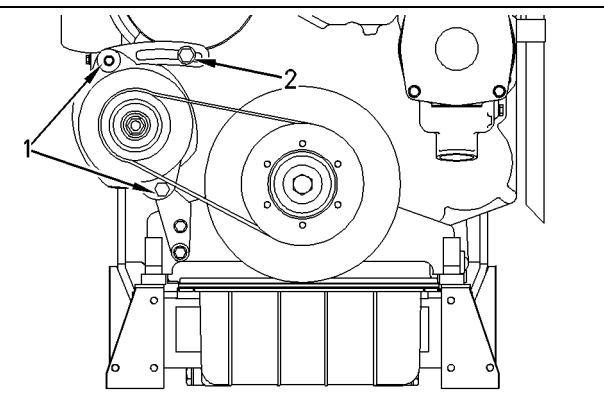

g00788814 Illustration 31

- **1.** Remove the belt guard.
- **2.** Loosen mounting bolts (1) and adjusting bolt (2).
- **3.** Move the assembly in order to increase or decrease the belt tension.
- **4.** Tighten adjusting bolt (2). Tighten mounting bolts (1).
- **5.** Reinstall the belt guard.

If new drive belts are installed, check the drive belt tension again after 30 minutes of engine operation at the rated rpm.

### **Adjustment of the Fan Drive Belt**

- **1.** Remove the belt guard.
- **2.** Loosen the mounting bolt for the pulley.
- **3.** Loosen the adjusting nut for the pulley.
- **4.** Move the pulley in order to adjust the belt tension.
- **5.** Tighten the adjusting nut.
- **6.** Tighten the mounting bolt.
- **7.** Reinstall the belt guard.

If new drive belts are installed, check the drive belt tension again after 30 minutes of engine operation at the rated rpm.

{57}------------------------------------------------

### **Cooling System Coolant (DEAC) - Change**

**SMCS Code:** 1350-070; 1395-044

Clean the cooling system and flush the cooling system before the recommended maintenance interval if the following conditions exist:

- The engine overheats frequently.
- Foaming of the coolant
- The oil has entered the cooling system and the coolant is contaminated.
- The fuel has entered the cooling system and the coolant is contaminated.

#### NOTICE

Use of commercially available cooling system cleaners may cause damage to cooling system components. Use only cooling system cleaners that are approved for Caterpillar engines.

**Note:** Inspect the water pump and the water temperature regulator after the cooling system has been drained. This is a good opportunity to replace the water pump, the water temperature regulator and the hoses, if necessary.

### **Drain**

**Pressurized System: Hot coolant can cause serious burns. To open the cooling system filler cap, stop the engine and wait until the cooling system components are cool. Loosen the cooling system pressure cap slowly in order to relieve the pressure.**

- **1.** Stop the engine and allow the engine to cool. Loosen the cooling system filler cap slowly in order to relieve any pressure. Remove the cooling system filler cap.
- **2.** Open the cooling system drain valve (if equipped). If the cooling system is not equipped with a drain valve, remove one of the drain plugs.

Allow the coolant to drain.

#### NOTICE

Dispose of used engine coolant properly or recycle. Various methods have been proposed to reclaim used coolant for reuse in engine cooling systems. The full distillation procedure is the only method acceptable by Caterpillar to reclaim the used coolant.

For information regarding the disposal and the recycling of used coolant, consult your Caterpillar dealer or consult Caterpillar Dealer Service Tools:

Outside Illinois: 1-800-542-TOOL Inside Illinois: 1-800-541-TOOL Canada: 1-800-523-TOOL

### **Flush**

- **1.** Flush the cooling system with clean water in order to remove any debris.
- **2.** Close the drain valve (if equipped). Clean the drain plugs. Install the drain plugs. Refer to the Specifications Manual for your particular engine for more specific information on the proper torques. Refer to the Specifications, SENR3130, "Torque Specifications" for more general information on the proper torques.

#### NOTICE

Fill the cooling system no faster than 19 L (5 US gal) per minute to avoid air locks.

- **3.** Fill the cooling system with a mixture of clean water and Caterpillar Fast Acting Cooling System Cleaner. Add .5 L (1 pint) of cleaner per 15 L (4 US gal) of the cooling system capacity. Install the cooling system filler cap.
- **4.** Start the engine and run the engine at low idle for a minimum of 30 minutes. The coolant temperature should be at least 82 °C (180 °F).

#### NOTICE

Improper or incomplete rinsing of the cooling system can result in damage to copper and other metal components.

To avoid damage to the cooling system, make sure to completely flush the cooling system with clear water. Continue to flush the system until all signs of the cleaning agent are gone.

{58}------------------------------------------------

**5.** Stop the engine and allow the engine to cool. Loosen the cooling system filler cap slowly in order to relieve any pressure. Remove the cooling system filler cap. Open the drain valve (if equipped) or remove the cooling system drain plugs. Allow the water to drain. Flush the cooling system with clean water. Close the drain valve (if equipped). Clean the drain plugs. Install the drain plugs. Refer to the Specifications Manual for your particular engine for more specific information on the proper torques. Refer to the Specifications, SENR3130, "Torque Specifications" for more general information on the proper torques.

### **Cooling Systems with Heavy Deposits or Plugging**

**Note:** For the following procedure to be effective, there must be some active flow through the cooling system components.

- **1.** Flush the cooling system with clean water in order to remove any debris.
- **2.** Close the drain valve (if equipped). Clean the drain plugs. Install the drain plugs. Refer to the Specifications Manual for your particular engine for more specific information on the proper torques. Refer to the Specifications, SENR3130, "Torque Specifications" for more general information on the proper torques.

#### NOTICE

Fill the cooling system no faster than 19 L (5 US gal) per minute to avoid air locks.

- **3.** Fill the cooling system with a mixture of clean water and Caterpillar Fast Acting Cooling System Cleaner. Add .5 L (1 pint) of cleaner per 3.8 to 7.6 L (1 to 2 US gal) of the cooling system capacity. Install the cooling system filler cap.
- **4.** Start the engine and run the engine at low idle for a minimum of 90 minutes. The coolant temperature should be at least 82 °C (180 °F).

#### NOTICE

Improper or incomplete rinsing of the cooling system can result in damage to copper and other metal components.

To avoid damage to the cooling system, make sure to completely flush the cooling system with clear water. Continue to flush the system until all signs of the cleaning agent are gone.

**5.** Stop the engine and allow the engine to cool. Loosen the cooling system filler cap slowly in order to relieve any pressure. Remove the cooling system filler cap. Open the drain valve (if equipped) or remove the cooling system drain plugs. Allow the water to drain. Flush the cooling system with clean water. Close the drain valve (if equipped). Clean the drain plugs. Install the drain plugs. Refer to the Specifications Manual for your particular engine for more specific information on the proper torques. Refer to the Specifications, SENR3130, "Torque Specifications" for more general information on the proper torques.

### **Fill**

Refer to the Operation and Maintenance Manual, "Refill Capacities and Recommendations" topic for the capacity of the engine's system and for coolant recommendations.

#### **Engines that are Equipped with a Coolant Recovery Tank**

NOTICE Fill the cooling system no faster than 19 L (5 US gal) per minute to avoid air locks.

- **1.** Fill the cooling system with coolant/antifreeze. Refer to the Operation and Maintenance Manual, "Refill Capacities and Recommendations" topic (Maintenance Section) for more information on cooling system specifications. Do not install the cooling system filler cap.
- **2.** Start the engine and run the engine at low idle. Increase the engine rpm to high idle. Run the engine at high idle for one minute in order to purge the air from the cavities of the engine block. Stop the engine.
- **3.** Add coolant to the cooling system until the cooling system is full.
- **4.** Clean the cooling system filler cap. Inspect the gasket that is on the cooling system filler cap. If the gasket that is on the cooling system filler cap is damaged, discard the old cooling system filler cap and install a new cooling system filler cap. If the gasket that is on the cooling system filler cap is not damaged, perform a pressure test. A 9S-8140 Pressurizing Pump is used to perform the pressure test. The correct pressure for the cooling system filler cap is stamped on the face of the cooling system filler cap. If the cooling system filler cap does not retain the correct pressure, install a new cooling system filler cap.

{59}------------------------------------------------

- **5.** Loosen the cap for the coolant recovery tank slowly in order to relieve any pressure. Remove the cap for the coolant recovery tank.
- **6.** Pour coolant into the coolant recovery tank until the coolant reaches the "COLD FULL" mark. DO NOT fill the coolant recovery tank above the "COLD FULL" mark.
- **7.** Clean the cap for the coolant recovery tank. Install the cap for the coolant recovery tank.
- **8.** Start the engine. Inspect the cooling system for leaks and for proper operating temperature.

#### **Engines that are Not Equipped with a Coolant Recovery Tank**

NOTICE Fill the cooling system no faster than 19 L (5 US gal) per minute to avoid air locks.

- **1.** Fill the cooling system with coolant/antifreeze. Refer to the Operation and Maintenance Manual, "Refill Capacities and Recommendations" topic (Maintenance Section) for more information on cooling system specifications. Do not install the cooling system filler cap.
- **2.** Start the engine and run the engine at low idle. Increase the engine rpm to high idle. Run the engine at high idle for one minute in order to purge the air from the cavities of the engine block. Stop the engine.
- **3.** Check the coolant level. Maintain the coolant level within 13 mm (.5 inch) below the bottom of the pipe for filling. Maintain the coolant level within 13 mm (.5 inch) to the proper level on the sight glass (if equipped).
- **4.** Clean the cooling system filler cap. Inspect the gasket that is on the cooling system filler cap. If the gasket that is on the cooling system filler cap is damaged, discard the old cooling system filler cap and install a new cooling system filler cap. If the gasket that is on the cooling system filler cap is not damaged, perform a pressure test. A 9S-8140 Pressurizing Pump is used to perform the pressure test. The correct pressure for the cooling system filler cap is stamped on the face of the cooling system filler cap. If the cooling system filler cap does not retain the correct pressure, install a new cooling system filler cap.
- **5.** Start the engine. Inspect the cooling system for leaks and for proper operating temperature.

### **Cooling System Coolant (ELC) - Change**

**SMCS Code:** 1350-070; 1395-044

Clean the cooling system and flush the cooling system before the recommended maintenance interval if the following conditions exist:

- The engine overheats frequently.
- Foaming of the coolant
- The oil has entered the cooling system and the coolant is contaminated.
- The fuel has entered the cooling system and the coolant is contaminated.

**Note:** When the cooling system is cleaned, only clean water is needed when the ELC is drained and replaced.

**Note:** Inspect the water pump and the water temperature regulator after the cooling system has been drained. This is a good opportunity to replace the water pump, the water temperature regulator and the hoses, if necessary.

### **Drain**

**Pressurized System: Hot coolant can cause serious burns. To open the cooling system filler cap, stop the engine and wait until the cooling system components are cool. Loosen the cooling system pressure cap slowly in order to relieve the pressure.**

- **1.** Stop the engine and allow the engine to cool. Loosen the cooling system filler cap slowly in order to relieve any pressure. Remove the cooling system filler cap.
- **2.** Open the cooling system drain valve (if equipped). If the cooling system is not equipped with a drain valve, remove the cooling system drain plugs.

Allow the coolant to drain.

#### NOTICE

Dispose of used engine coolant properly or recycle. Various methods have been proposed to reclaim used coolant for reuse in engine cooling systems. The full distillation procedure is the only method acceptable by Caterpillar to reclaim the used coolant.

{60}------------------------------------------------

For information regarding the disposal and the recycling of used coolant, consult your Caterpillar dealer or consult Caterpillar Dealer Service Tools:

Outside Illinois: 1-800-542-TOOL Inside Illinois: 1-800-541-TOOL Canada: 1-800-523-TOOL

### **Flush**

- **1.** Flush the cooling system with clean water in order to remove any debris.
- **2.** Close the drain valve (if equipped). Clean the drain plugs. Install the drain plugs. Refer to the Specifications Manual for your particular engine for more specific information on the proper torques. Refer to the Specifications, SENR3130, "Torque Specifications" for more general information on the proper torques.

NOTICE

Fill the cooling system no faster than 19 L (5 US gal) per minute to avoid air locks.

- **3.** Fill the cooling system with clean water. Install the cooling system filler cap.
- **4.** Start the engine and run the engine at low idle until the temperature reaches 49 to 66 °C (120 to 150 °F).
- **5.** Stop the engine and allow the engine to cool. Loosen the cooling system filler cap slowly in order to relieve any pressure. Remove the cooling system filler cap. Open the drain valve (if equipped) or remove the cooling system drain plugs. Allow the water to drain. Flush the cooling system with clean water. Close the drain valve (if equipped). Clean the drain plugs. Install the drain plugs. Refer to the Specifications Manual for your particular engine for more specific information on the proper torques. Refer to the Specifications, SENR3130, "Torque Specifications" for more general information on the proper torques.

### **Fill**

### **Engines that are Equipped with a Coolant Recovery Tank**

NOTICE Fill the cooling system no faster than 19 L (5 US gal) per minute to avoid air locks.

- **1.** Fill the cooling system with Extended Life Coolant (ELC). Refer to the Operation and Maintenance Manual, "Refill Capacities and Recommendations" topic (Maintenance Section) for more information on cooling system specifications. Do not install the cooling system filler cap.
- **2.** Start the engine and operate the engine at low idle. Increase the engine rpm to high idle. Operate the engine at high idle for one minute in order to purge air from the cavities of the engine block. Stop the engine.
- **3.** Pour more ELC into the cooling system until the cooling system is full.
- **4.** Clean the cooling system filler cap. Inspect the gasket that is on the cooling system filler cap. If the gasket that is on the cooling system filler cap is damaged, discard the old cooling system filler cap and install a new cooling system filler cap. If the gasket that is on the cooling system filler cap is not damaged, use a 9S-8140 Pressurizing Pump in order to pressure test the cooling system filler cap. The correct pressure for the cooling system filler cap is stamped on the face of the cooling system filler cap. If the cooling system filler cap does not retain the correct pressure, install a new cooling system filler cap.
- **5.** Loosen the cap for the coolant recovery tank slowly in order to relieve any pressure. Remove the cap for the coolant recovery tank.
- **6.** Pour Extended Life Coolant (ELC) into the coolant recovery tank until the coolant reaches the "COLD FULL" mark. DO NOT fill the coolant recovery tank above the "COLD FULL" mark.
- **7.** Clean the cap for the coolant recovery tank. Install the cap for the coolant recovery tank.
- **8.** Start the engine. Inspect the cooling system for leaks and for proper operating temperature.

### **Engines that are NOT Equipped with a Coolant Recovery Tank**

#### NOTICE

Fill the cooling system no faster than 19 L (5 US gal) per minute to avoid air locks.

**1.** Fill the cooling system with Extended Life Coolant (ELC). Refer to the Operation and Maintenance Manual, "Refill Capacities and Recommendations" topic (Maintenance Section) for more information on cooling system specifications. Do not install the cooling system filler cap.

{61}------------------------------------------------

- **2.** Start the engine and operate the engine at low idle. Increase the engine rpm to high idle. Operate the engine at high idle for one minute in order to purge air from the cavities of the engine block. Stop the engine.
- **3.** Check the coolant level. Maintain the coolant level within 13 mm (.5 inch) below the bottom of the pipe for filling. Maintain the coolant level within 13 mm (.5 inch) to the proper level on the sight glass (if equipped).
- **4.** Clean the cooling system filler cap. Inspect the gasket that is on the cooling system filler cap. If the gasket that is on the cooling system filler cap is damaged, discard the old cooling system filler cap and install a new cooling system filler cap. If the gasket that is on the cooling system filler cap is not damaged, use a 9S-8140 Pressurizing Pump in order to pressure test the cooling system filler cap. The correct pressure for the cooling system filler cap is stamped on the face of the cooling system filler cap. If the cooling system filler cap does not retain the correct pressure, install a new cooling system filler cap.
- **5.** Start the engine. Inspect the cooling system for leaks and for proper operating temperature.

### **Cooling System Coolant Extender (ELC) - Add**

**SMCS Code:** 1352-045; 1395-081

Cat ELC (Extended Life Coolant) does not require the frequent additions of any supplemental cooling additives which are associated with the present conventional coolants. The Cat ELC Extender only needs to be added once.

#### NOTICE

Use only Cat Extended Life Coolant (ELC) Extender with Cat ELC.

Do NOT use conventional supplemental coolant additive (SCA) with Cat ELC. Mixing Cat ELC with conventional coolants and/or conventional SCA reduces the Cat ELC service life.

Check the cooling system only when the engine is stopped and cool.

**Personal injury can result from hot coolant, steam and alkali.**

**At operating temperature, engine coolant is hot and under pressure. The radiator and all lines to heaters or the engine contain hot coolant or steam. Any contact can cause severe burns.**

**Remove cooling system pressure cap slowly to relieve pressure only when engine is stopped and cooling system pressure cap is cool enough to touch with your bare hand.**

**Do not attempt to tighten hose connections when the coolant is hot, the hose can come off causing burns.**

**Cooling System Coolant Additive contains alkali. Avoid contact with skin and eyes.**

#### NOTICE

Care must be taken to ensure that fluids are contained during performance of inspection, maintenance, testing, adjusting and repair of the product. Be prepared to collect the fluid with suitable containers before opening any compartment or disassembling any component containing fluids.

Refer to Special Publication, NENG2500, "Caterpillar Dealer Service Tool Catalog" for tools and supplies suitable to collect and contain fluids on Caterpillar products.

Dispose of all fluids according to local regulations and mandates.

- **1.** Loosen the cooling system filler cap slowly in order to relieve pressure. Remove the cooling system filler cap.
- **2.** It may be necessary to drain enough coolant from the cooling system in order to add the Cat ELC Extender.
- **3.** Add Cat ELC Extender according to the requirements for your engine's cooling system capacity. Refer to the Operation and Maintenance Manual, "Refill Capacities and Recommendations" article for more information.
- **4.** Clean the cooling system filler cap. Inspect the gaskets on the cooling system filler cap. Replace the cooling system filler cap if the gaskets are damaged. Install the cooling system filler cap.

{62}------------------------------------------------

### **Cooling System Coolant Level - Check**

#### **SMCS Code:** 1395-082

Check the coolant level when the engine is stopped and cool.

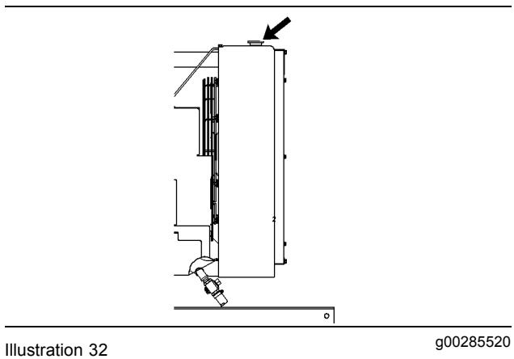

Cooling system filler cap

**Pressurized System: Hot coolant can cause serious burns. To open the cooling system filler cap, stop the engine and wait until the cooling system components are cool. Loosen the cooling system pressure cap slowly in order to relieve the pressure.**

- **1.** Remove the cooling system filler cap slowly in order to relieve pressure.
- **2.** Maintain the coolant level within 13 mm (0.5 inch) of the bottom of the filler pipe. If the engine is equipped with a sight glass, maintain the coolant level to the proper level in the sight glass.

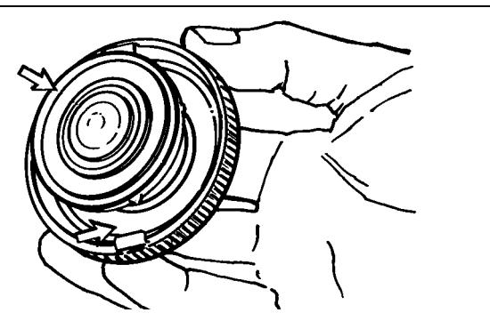

- **3.** Clean the cooling system filler cap and check the condition of the filler cap gaskets. Replace the cooling system filler cap if the filler cap gaskets are damaged. Reinstall the cooling system filler cap.
- **4.** Inspect the cooling system for leaks.

i02837191

## **Cooling System Coolant Sample (Level 1) - Obtain**

**SMCS Code:** 1350-008; 1395-008; 1395-554; 7542

**Note: Obtaining a Coolant Sample (Level 1) is optional if the cooling system is filled with Cat ELC (Extended Life Coolant).** Cooling systems that are filled with Cat ELC should have a Coolant Sample (Level 2) that is obtained at the recommended interval that is stated in the Maintenance Interval Schedule.

**Note: Obtain a Coolant Sample (Level 1) if the cooling system is filled with any other coolant instead of Cat ELC.** This includes the following types of coolants:

- Commercial long life coolants that meet the Caterpillar Engine Coolant Specification -1 (Caterpillar EC-1)
- Cat DEAC (Diesel Engine Antifreeze/Coolant)
- Commercial heavy-duty coolant/antifreeze

| Recommended Interval |                       |              |  |  |  |  |
|----------------------|-----------------------|--------------|--|--|--|--|
| Type of Coolant      | Level 1               | Level 2      |  |  |  |  |
| Cat DEAC             | Every 250 Hours(1) | Yearly(1)(2) |  |  |  |  |
| Cat ELC              | Optional(2)           | Yearly(2)    |  |  |  |  |

(1) This is the recommended interval for coolant samples for all conventional heavy-duty coolant/antifreeze. This is also the recommended interval for coolant samples of commercial coolants that meet the Cat EC-1 specification for engine coolant.

#### NOTICE

Always use a designated pump for oil sampling, and use a separate designated pump for coolant sampling. Using the same pump for both types of samples may contaminate the samples that are being drawn. This contaminate may cause a false analysis and an incorrect interpretation that could lead to concerns by both dealers and customers.

#### **Note: Level 1 results may indicate a need for Level 2 Analysis.**

(2) The Level 2 Coolant Analysis should be performed sooner if a problem is suspected or identified.

{63}------------------------------------------------

Obtain the sample of the coolant as close as possible to the recommended sampling interval. In order to receive the full effect of S·O·S analysis, you must establish a consistent trend of data. In order to establish a pertinent history of data, perform consistent samplings that are evenly spaced. Supplies for collecting samples can be obtained from your Caterpillar dealer.

Use the following guidelines for proper sampling of the coolant:

- Complete the information on the label for the sampling bottle before you begin to take the samples.
- Keep the unused sampling bottles stored in plastic bags.
- Obtain coolant samples directly from the coolant sample port. You should not obtain the samples from any other location.
- Keep the lids on empty sampling bottles until you are ready to collect the sample.
- Place the sample in the mailing tube immediately after obtaining the sample in order to avoid contamination.
- Never collect samples from expansion bottles.
- Never collect samples from the drain for a system.

Submit the sample for Level 1 analysis.

For additional information about coolant analysis, see this Operation and Maintenance Manual, "Refill Capacities and Recommendations" or consult your Caterpillar dealer.

i01987714

### **Cooling System Coolant Sample (Level 2) - Obtain**

**SMCS Code:** 1350-008; 1395-008; 1395-554; 7542

#### NOTICE

Always use a designated pump for oil sampling, and use a separate designated pump for coolant sampling. Using the same pump for both types of samples may contaminate the samples that are being drawn. This contaminate may cause a false analysis and an incorrect interpretation that could lead to concerns by both dealers and customers.

Refer to Operation and Maintenance Manual, "Cooling System Coolant Sample (Level 1) - Obtain" for the guidelines for proper sampling of the coolant.

Submit the sample for Level 2 analysis.

For additional information about coolant analysis, see Special Publication, SEBU6251, "Caterpillar Commercial Diesel Engines Fluids Recommendations" or consult your Caterpillar dealer.

i02839449

### **Cooling System Supplemental Coolant Additive (SCA) - Test/Add**

**SMCS Code:** 1352-045; 1395-081

**Cooling system coolant additive contains alkali. To help prevent personal injury, avoid contact with the skin and eyes. Do not drink cooling system coolant additive.**

#### NOTICE

Excessive supplemental coolant additive concentration can form deposits on the higher temperature surfaces of the cooling system, reducing the engine's heat transfer characteristics. Reduced heat transfer could cause cracking of the cylinder head and other high temperature components.

Excessive supplemental coolant additive concentration could also result in blockage of the heat exchanger, overheating, and/or accelerated wear of the water pump seal.

Do not exceed the recommended amount of supplemental coolant additive concentration.

#### NOTICE

Care must be taken to ensure that fluids are contained during performance of inspection, maintenance, testing, adjusting and repair of the product. Be prepared to collect the fluid with suitable containers before opening any compartment or disassembling any component containing fluids.

Refer to Special Publication, NENG2500, "Caterpillar Dealer Service Tool Catalog" and to Special Publication, GECJ0003, "Cat Shop Supplies and Tools" for tools and supplies suitable to collect and contain fluids on Caterpillar products.

Dispose of all fluids according to applicable regulations and mandates.

**Note:** Caterpillar recommends an S·O·S coolant analysis (Level 1).

{64}------------------------------------------------

### **Cooling Systems that Use Conventional Coolant**

This maintenance procedure is required for conventional coolants such as DEAC.**This maintenance is NOT required for cooling systems that are filled with Extended Life Coolant.**

#### **Test the Concentration of the SCA**

NOTICE

Do not exceed the recommended six percent supplemental coolant additive concentration.

Test the concentration of the SCA with the 8T-5296 Coolant Conditioner Test Kit.

### **Add the SCA, If Necessary**

**Pressurized System: Hot coolant can cause serious burns. To open the cooling system filler cap, stop the engine and wait until the cooling system components are cool. Loosen the cooling system pressure cap slowly in order to relieve the pressure.**

- **1.** Remove the cooling system filler cap slowly.
- **2.** If necessary, drain some coolant in order to allow space for the addition of the SCA.
- **3.** Add the proper amount of SCA. For the proper amount of SCA, refer to this Operation and Maintenance Manual, "Refill Capacities and Recommendations" topic. The proper concentration of SCA depends on the type of coolant that is used. For the proper concentration of SCA, refer to Special Publication, SEBU6251, "Caterpillar Commercial Diesel Engine Fluids Recommendations".
- **4.** Clean the cooling system filler cap. Install the cooling system filler cap.

### **Cooling Systems that Use Water and SCA**

### **Test the Concentration of the SCA**

Test the concentration of the SCA with a 298-5311 Coolant Nitrite Test Kit for SCA or perform an S·O·S Coolant Analysis. The test kit includes the following items: a tool for the testing, 30 ampoules for testing nitrite, instructions, and a case. 294-7420 Test Kit contains the refill ampoules for the 298-5311 Coolant Nitrite Test Kit. Use the instructions that are included with the test kit in order to properly conduct the testing.

Refer to this Operation and Maintenance Manual, "Maintenance Interval Schedule" for the times at which the procedures should be conducted. Test the concentration of the SCA more frequently if more frequent testing is indicated by the results of the S·O·S Coolant Analysis.

#### NOTICE

Do not exceed the recommended eight percent supplemental coolant additive concentration.

### **Add the SCA, If Necessary**

**Pressurized System: Hot coolant can cause serious burns. To open the cooling system filler cap, stop the engine and wait until the cooling system components are cool. Loosen the cooling system pressure cap slowly in order to relieve the pressure.**

- **1.** Remove the cooling system filler cap slowly.
- **2.** If necessary, drain some coolant in order to allow space for the addition of the SCA.
- **3.** Add the proper amount of SCA. For the proper amount of SCA, refer to this Operation and Maintenance Manual, "Refill Capacities and Recommendations" topic. For the proper concentration of SCA, refer to Special Publication, SEBU6251, "Caterpillar Commercial Diesel Engine Fluids Recommendations".
- **4.** Clean the cooling system filler cap. Install the cooling system filler cap.

{65}------------------------------------------------

### **Cooling System Water Temperature Regulator - Replace**

**SMCS Code:** 1355-510

Replace the water temperature regulator before the water temperature regulator fails. This is a recommended preventive maintenance practice. Replacing the water temperature regulator reduces the chances for unscheduled downtime.

A water temperature regulator that fails in a partially opened position can cause overheating or overcooling of the engine.

A water temperature regulator that fails in the closed position can cause excessive overheating. Excessive overheating could result in cracking of the cylinder head or piston seizure problems.

A water temperature regulator that fails in the open position will cause the engine operating temperature to be too low during partial load operation. Low engine operating temperatures during partial loads could cause an excessive carbon buildup inside the cylinders. This excessive carbon buildup could result in an accelerated wear of the piston rings and wear of the cylinder liner.

#### NOTICE

Failure to replace your water temperature regulator on a regularly scheduled basis could cause severe engine damage.

Caterpillar engines incorporate a shunt design cooling system and require operating the engine with a water temperature regulator installed.

If the water temperature regulator is installed incorrectly, the engine may overheat, causing cylinder head damage. Ensure that the new water temperature regulator is installed in the original position. Ensure that the water temperature regulator vent hole is open.

Do not use liquid gasket material on the gasket or cylinder head surface.

Refer to two articles in the Disassembly and Assembly Manual, "Water Temperature Regulators - Remove and Water Temperature Regulators - Install" for the replacement procedure of the water temperature regulator, or consult your Caterpillar dealer.

**Note:** If only the water temperature regulators are replaced, drain the coolant from the cooling system to a level that is below the water temperature regulator housing.

i02933380

### **Crankshaft Vibration Damper - Inspect**

#### **SMCS Code:** 1205-040

Damage to the crankshaft vibration damper or failure of the crankshaft vibration damper can increase torsional vibrations. This can result in damage to the crankshaft and to other engine components. A damper that is damaged can cause excessive gear train noise at variable points in the speed range.

The damper is mounted to the crankshaft which is located behind the belt guard on the front of the engine.

### **Visconic Damper**

The visconic damper has a weight that is located inside a fluid filled case. The weight moves in the case in order to limit torsional vibration.

Inspect the damper for evidence of fluid leaks. If a fluid leak is found, determine the type of fluid. The fluid in the damper is silicone. Silicone has the following characteristics: transparent, viscous, smooth, and adhering.

If the fluid leak is oil, inspect the crankshaft seals for leaks. If a leak is observed, replace the crankshaft seals.

Inspect the damper and repair or replace the damper for any of the following reasons:

- The damper is dented, cracked, or leaking.
- The paint on the damper is discolored from heat.
- The engine has had a failure because of a broken crankshaft.
- Analysis of the oil has revealed that the front main bearing is badly worn.
- There is a large amount of gear train wear that is not caused by a lack of oil.

Refer to the Disassembly and Assembly Manual, "Vibration Damper and Pulley - Remove and Install" or consult your Caterpillar dealer for information about damper replacement.

{66}------------------------------------------------

## **Driven Equipment - Check**

**SMCS Code:** 3279-535

### **Check the Alignment**

To minimize bearing problems and vibration of the engine crankshaft and the driven equipment, the alignment between the engine and driven equipment must be properly maintained.

Check the alignment according to the instructions that are provided by the following manufacturers:

- Caterpillar
- OEM of the drive coupling
- OEM of the driven equipment

Torque all of the fasteners to the proper specifications.

### **Inspect the Drive Coupling**

Inspect the drive coupling according to the instructions that are provided by the OEM of the coupling. For the following service information, see the literature that is provided by the OEM of the coupling:

- Lubrication requirements
- Specifications for the end play
- "Reusability Guidelines"
- Replacement instructions

### **Inspect the Rear Gear Train**

Inspect the crankshaft gear. If excessive wear is found, replace the crankshaft gear and the large cluster idler.

If any gear causes damage to other gears through failure, replace the entire rear gear train.

For the correct parts, see the Parts Manual for the engine. For removal and replacement instructions, see the Service Manual, "Disassembly and Assembly" module. Consult your Caterpillar dealer for assistance.

### **Electronic Unit Injector - Inspect/Adjust**

**SMCS Code:** 1251-025; 1251-040; 1290-025; 1290-040

**Be sure the engine cannot be started while this maintenance is being performed. To prevent possible injury, do not use the starting motor to turn the flywheel.**

**Hot engine components can cause burns. Allow additional time for the engine to cool before measuring/adjusting the unit injectors.**

**The electronic unit injectors use high voltage. Disconnect the unit injector enable circuit connector in order to prevent personal injury. Do not come in contact with the injector terminals while the engine is running.**

The operation of Caterpillar engines with improper adjustments of the electronic unit injector can reduce engine efficiency. This reduced efficiency could result in excessive fuel usage and/or shortened engine component life.

Only qualified service personnel should perform this maintenance. Refer to the following topics for your engine for the correct procedure: Refer to the Systems Operation, Testing and Adjusting, "Electronic Unit Injector - Test" for the test procedure, and Systems Operation, Testing and Adjusting, "Electronic Unit Injector - Adjust" for the correct procedure for adjusting the injectors.

#### NOTICE

The camshafts must be correctly timed with the crankshaft before an adjustment of the lash for the fuel injector is made. The timing pins must be removed from the camshafts before the crankshaft is turned or damage to the cylinder block will be the result.

i02070777

{67}------------------------------------------------

### **Electronics Grounding Stud - Inspect/Clean/Tighten**

**SMCS Code:** 7423-040; 7423-070; 7423-079

**The connection of battery cables to a battery and the disconnection of battery cables from a battery may cause an explosion which may result in injury or death. The connection and the disconnection of other electrical equipment may also cause an explosion which may result in injury or death. The procedures for the connection and the disconnection of battery cables and other electrical equipment should only be performed in a nonexplosive atmosphere.**

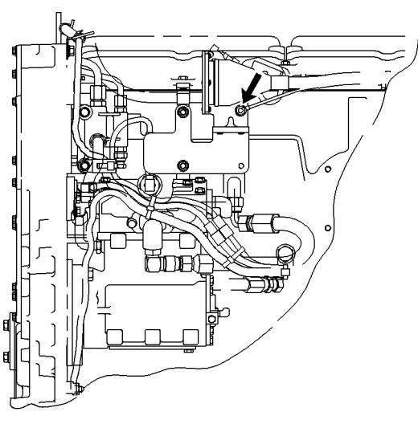

g00765094 Illustration 34

Typical example

Electronics grounding stud (side view)

Inspect the OEM harness for good connections. Inspect the condition of the OEM harness.

The electronics grounding stud must have a wire ground to the battery. Tighten the electronics grounding stud at every oil change. Ground wires and straps should be combined at engine grounds. All grounds should be tight and free of corrosion.

• Clean the electronics grounding stud and the terminals for the electronics ground strap with a clean cloth.

- If the connections are corroded, clean the connections with a solution of baking soda and water.
- Keep the electronics grounding stud and the strap clean and coated with MPGM grease or petroleum jelly.

i01646701

### **Engine - Clean**

**SMCS Code:** 1000-070

**Personal injury or death can result from high voltage.**

**Moisture can create paths of electrical conductivity.**

**Make sure that the electrical system is OFF. Lock out the starting controls and tag the controls "DO NOT OPERATE".**

#### NOTICE

Accumulated grease and oil on an engine is a fire hazard. Keep the engine clean. Remove debris and fluid spills whenever a significant quantity accumulates on the engine.

Periodic cleaning of the engine is recommended. Steam cleaning the engine will remove accumulated oil and grease. A clean engine provides the following benefits:

- Easy detection of fluid leaks
- Maximum heat transfer characteristics
- Ease of maintenance

**Note:** Caution must be used in order to prevent electrical components from being damaged by excessive water when you clean the engine. Avoid electrical components such as the alternator, the starter, and the ECM.

{68}------------------------------------------------

### **Engine Air Cleaner Element (Dual Element) - Clean/Replace**

**SMCS Code:** 1054-037; 1054-510

#### NOTICE

Never run the engine without an air cleaner element installed. Never run the engine with a damaged air cleaner element. Do not use air cleaner elements with damaged pleats, gaskets or seals. Dirt entering the engine causes premature wear and damage to engine components. Air cleaner elements help to prevent airborne debris from entering the air inlet.

#### NOTICE

Never service the air cleaner element with the engine running since this will allow dirt to enter the engine.

### **Servicing the Air Cleaner Elements**

If the air cleaner element becomes plugged, the air can split the material of the air cleaner element. Unfiltered air will drastically accelerate internal engine wear. Your Caterpillar dealer has the proper air cleaner elements for your application. Consult your Caterpillar dealer for the correct air cleaner element.

- Check the precleaner (if equipped) daily for accumulation of dirt and debris. Remove any dirt and debris, as needed.
- Operating conditions (dust, dirt and debris) may require more frequent service of the air cleaner element.
- The air cleaner element may be cleaned up to six times if the element is properly cleaned and inspected.
- The air cleaner element should be replaced at least one time per year. This replacement should be performed regardless of the number of cleanings.

Replace the dirty paper air cleaner elements with clean air cleaner elements. Before installation, the air cleaner elements should be thoroughly checked for tears and/or holes in the filter material. Inspect the gasket or the seal of the air cleaner element for damage. Maintain a supply of suitable air cleaner elements for replacement purposes.

### **Dual Element Air Cleaners**

The dual element air cleaner contains a primary air cleaner element and a secondary air cleaner element. The primary air cleaner element can be used up to six times if the element is properly cleaned and inspected. The primary air cleaner element should be replaced at least one time per year. This replacement should be performed regardless of the number of cleanings.

The secondary air cleaner element is not serviceable or washable. The secondary air cleaner element should be removed and discarded for every three cleanings of the primary air cleaner element. When the engine is operating in environments that are dusty or dirty, air cleaner elements may require more frequent replacement.

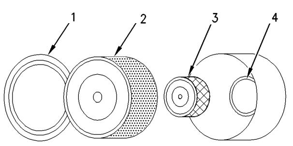

#### g00736431 Illustration 35

(1) Cover

- (2) Primary air cleaner element
- (3) Secondary air cleaner element
- (4) Turbocharger air inlet
- **1.** Remove the cover. Remove the primary air cleaner element.
- **2.** The secondary air cleaner element should be removed and discarded for every three cleanings of the primary air cleaner element.

**Note:** Refer to "Cleaning the Primary Air Cleaner Elements".

- **3.** Cover the turbocharger air inlet with tape in order to keep dirt out.
- **4.** Clean the inside of the air cleaner cover and body with a clean, dry cloth.
- **5.** Remove the tape for the turbocharger air inlet. Install the secondary air cleaner element. Install a primary air cleaner element that is new or cleaned.
- **6.** Install the air cleaner cover.
- **7.** Reset the air cleaner service indicator.

{69}------------------------------------------------

### **Cleaning the Primary Air Cleaner Elements**

#### NOTICE

Caterpillar recommends certified air filter cleaning services that are available at Caterpillar dealers. The Caterpillar cleaning process uses proven procedures to assure consistent quality and sufficient filter life.

Observe the following guidelines if you attempt to clean the filter element:

Do not tap or strike the filter element in order to remove dust.

Do not wash the filter element.

Use low pressure compressed air in order to remove the dust from the filter element. Air pressure must not exceed 207 kPa (30 psi). Direct the air flow up the pleats and down the pleats from the inside of the filter element. Take extreme care in order to avoid damage to the pleats.

Do not use air filters with damaged pleats, gaskets, or seals. Dirt entering the engine will cause damage to engine components.

The primary air cleaner element can be used up to six times if the element is properly cleaned and inspected. When the primary air cleaner element is cleaned, check for rips or tears in the filter material. The primary air cleaner element should be replaced at least one time per year. This replacement should be performed regardless of the number of cleanings.

Use clean primary air cleaner elements while dirty elements are being cleaned.

#### NOTICE

Do not clean the air cleaner elements by bumping or tapping. This could damage the seals. Do not use elements with damaged pleats, gaskets or seals. Damaged elements will allow dirt to pass through. Engine damage could result.

Visually inspect the primary air cleaner elements before cleaning. Inspect the air cleaner elements for damage to the seal, the gaskets, and the outer cover. Discard any damaged air cleaner elements.

There are two common methods that are used to clean primary air cleaner elements:

- Pressurized air
- Vacuum cleaning

#### **Pressurized Air**

Pressurized air can be used to clean primary air cleaner elements that have not been cleaned more than two times. Pressurized air will not remove deposits of carbon and oil. Use filtered, dry air with a maximum pressure of 207 kPa (30 psi).

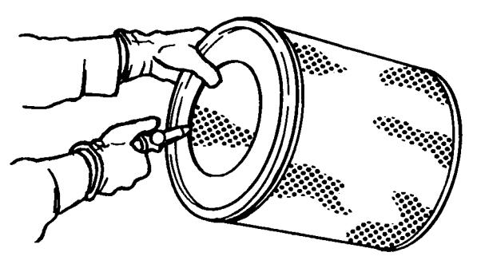

g00281692 Illustration 36

**Note:** When the primary air cleaner elements are cleaned, always begin with the clean side (inside) in order to force dirt particles toward the dirty side (outside).

Aim the hose so that the air flows inside the element along the length of the filter in order to help prevent damage to the paper pleats. Do not aim the stream of air directly at the primary air cleaner element. Dirt could be forced further into the pleats.

**Note:** Refer to "Inspecting the Primary Air Cleaner Elements".

### **Vacuum Cleaning**

Vacuum cleaning is a good method for cleaning primary air cleaner elements which require daily cleaning because of a dry, dusty environment. Cleaning with pressurized air is recommended prior to vacuum cleaning. Vacuum cleaning will not remove deposits of carbon and oil.

**Note:** Refer to "Inspecting the Primary Air Cleaner Elements".

{70}------------------------------------------------

#### **Inspecting the Primary Air Cleaner Elements**

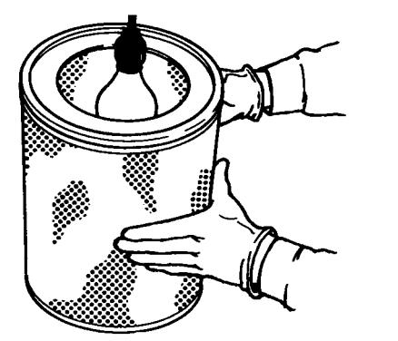

g00281693 Illustration 37

Inspect the clean, dry primary air cleaner element. Use a 60 watt blue light in a dark room or in a similar facility. Place the blue light in the primary air cleaner element. Rotate the primary air cleaner element. Inspect the primary air cleaner element for tears and/or holes. Inspect the primary air cleaner element for light that may show through the filter material. If it is necessary in order to confirm the result, compare the primary air cleaner element to a new primary air cleaner element that has the same part number.

Do not use a primary air cleaner element that has any tears and/or holes in the filter material. Do not use a primary air cleaner element with damaged pleats, gaskets or seals. Discard damaged primary air cleaner elements.

### **Storing Primary Air Cleaner Elements**

If a primary air cleaner element that passes inspection will not be used, the primary air cleaner element can be stored for future use.

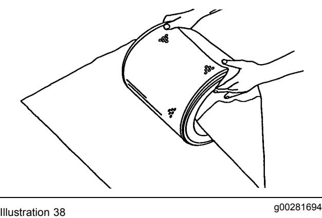

Do not use paint, a waterproof cover, or plastic as a protective covering for storage. An airflow restriction may result. To protect against dirt and damage, wrap the primary air cleaner elements in Volatile Corrosion Inhibited (VCI) paper.

Place the primary air cleaner element into a box for storage. For identification, mark the outside of the box and mark the primary air cleaner element. Include the following information:

- Date of cleaning
- Number of cleanings

Store the box in a dry location.

i01900118

### **Engine Air Cleaner Service Indicator - Inspect (If Equipped)**

**SMCS Code:** 7452-040

Some engines may be equipped with a different service indicator.

Some engines are equipped with a differential gauge for inlet air pressure. The differential gauge for inlet air pressure displays the difference in the pressure that is measured before the air cleaner element and the pressure that is measured after the air cleaner element. As the air cleaner element becomes dirty, the pressure differential rises. If your engine is equipped with a different type of service indicator, follow the OEM recommendations in order to service the air cleaner service indicator.

The service indicator may be mounted on the air cleaner housing or in a remote location.

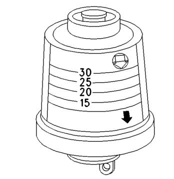

g00103777 Illustration 39 Typical service indicator

{71}------------------------------------------------

Observe the service indicator. The air cleaner element should be cleaned or the air cleaner element should be replaced when one of the following conditions occur:

- The yellow diaphragm enters the red zone.
- The red piston locks in the visible position.

### **Test the Service Indicator**

Service indicators are important instruments.

- Check for ease of resetting. The service indicator should reset in less than three pushes.
- Check the movement of the yellow core when the engine is accelerated to the engine rated speed. The yellow core should latch approximately at the greatest vacuum that is attained.

If the service indicator does not reset easily, or if the yellow core does not latch at the greatest vacuum, the service indicator should be replaced. If the new service indicator will not reset, the hole for the service indicator may be plugged.

The service indicator may need to be replaced frequently in environments that are severely dusty, if necessary. Replace the service indicator annually regardless of the operating conditions. Replace the service indicator when the engine is overhauled, and whenever major engine components are replaced.

**Note:** When a new service indicator is installed, excessive force may crack the top of the service indicator. Tighten the service indicator to a torque of 2 N·m (18 lb in).

### **Engine Air Precleaner - Check/Clean**

**SMCS Code:** 1055-070; 1055-535

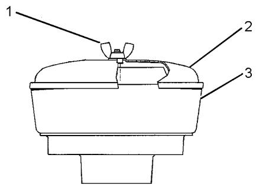

g01453058 Illustration 40

Typical engine air precleaner

(1) Wing nut (2) Cover

(3) Body

Remove wing nut (1) and cover (2). Check for an accumulation of dirt and debris in body (3). Clean the body, if necessary.

After cleaning the precleaner, install cover (2) and wing nut (1).

**Note:** When the engine is operated in dusty applications, more frequent cleaning is required.

i02938881

### **Engine Crankcase Breather - Clean**

**SMCS Code:** 1317-070

NOTICE Perform this maintenance with the engine stopped.

If the crankcase breather is not maintained on a regular basis, the crankcase breather will become plugged. A plugged crankcase breather will cause excessive crankcase pressure that may cause crankshaft seal leakage.

Your engine may have one or two crankcase breathers.

i02927289

{72}------------------------------------------------

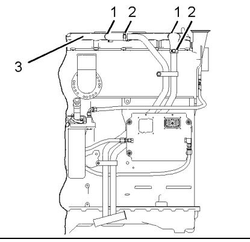

g01456410 Illustration 41

View of the left side of a C18 Industrial Engine that is equipped with two engine crankcase breathers

- (1) Hose Clamp
- (2) Hose
- (3) Valve Cover

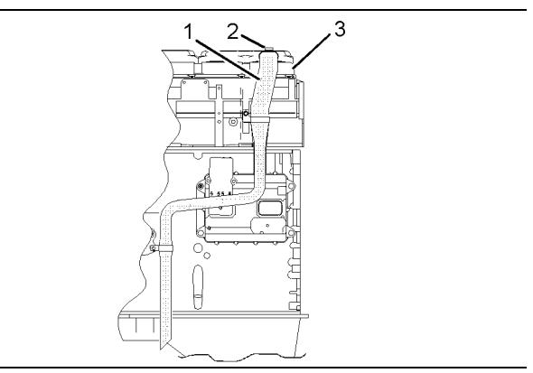

#### g01456412 Illustration 42

View of the left side of a C18 Industrial Engine that is equipped with one engine crankcase breather

- (1) Hose Clamp
- (2) Hose
- (3) Valve Cover
- **1.** Loosen the hose clamp and remove the hose from the valve cover .
- **2.** Remove the valve cover . Refer to the Disassembly and Assembly Manual.

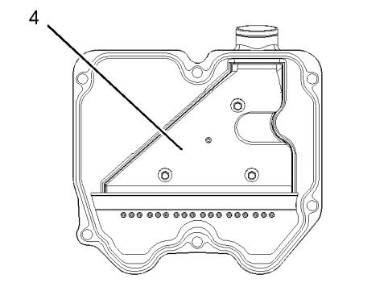

g01456434 Illustration 43

- **3.** Wash the breather in solvent that is clean and nonflammable. Allow the breather to dry before installation.
- **4.** Install the valve cover . Refer to the Disassembly and Assembly Manual.
- **5.** Install the hose on the valve cover . Install the hose clamp .

i02139969

### **Engine Mounts - Inspect**

#### **SMCS Code:** 1152-040

Inspect the engine mounts for deterioration and for proper bolt torque. Engine vibration can be caused by the following conditions:

- Improper mounting of the engine
- Deterioration of the engine mounts

Any engine mount that shows deterioration should be replaced. Refer to the Specifications Manual, SENR3130, "Torque Specifications". Refer to your Caterpillar dealer for more information.

i02837272

### **Engine Oil Level - Check**

**SMCS Code:** 1348-535-FLV

**Hot oil and hot components can cause personal injury. Do not allow hot oil or hot components to contact the skin.**

{73}------------------------------------------------

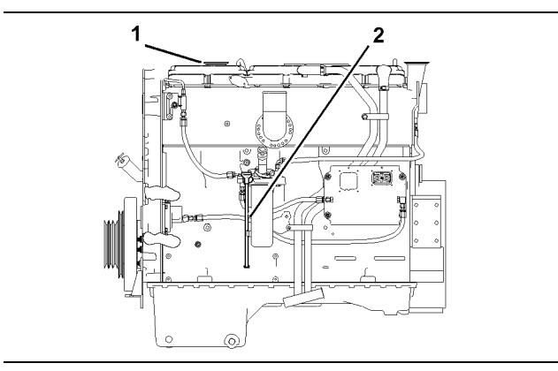

#### g01414582 Illustration 44

Typical installation of the oil level gauge

- (1) Oil filler cap
- (2) Oil level gauge

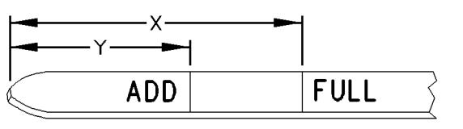

g00110310 Illustration 45

Partial view of the oil level gauge

(Y) "ADD" mark

(X) "FULL" mark

NOTICE Perform this maintenance with the engine stopped.

#### NOTICE

Engine damage can occur if the crankcase is filled above the "FULL" mark on the oil level gauge (dipstick).

An overfull crankcase can cause the crankshaft to dip into the oil. This will reduce the power that is developed and also force air bubbles into the oil. These bubbles (foam) can cause the following problems: reduction of the oil's ability to lubricate, reduction of oil pressure, inadequate cooling, oil blowing out of the crankcase breathers, and excessive oil consumption.

Excessive oil consumption will cause deposits to form on the pistons and in the combustion chamber. Deposits in the combustion chamber lead to the following problems: guttering of the valves, packing of carbon under the piston rings, and wear of the cylinder liner.

If the oil level is above the "FULL" mark on the oil level gauge, drain some of the oil immediately.

- **1.** Remove the oil filler cap and check the oil level. Maintain the oil level between the "ADD" mark (Y) and the "FULL" mark (X) on the oil level gauge (1). Do not fill the crankcase above "FULL" mark (X).
- **2.** In order to choose the correct type of oil for this engine, refer to this Operation and Maintenance Manual, "Refill Capacities and Recommendations".
- **3.** Clean the oil filler cap. Install the oil filler cap.
- **4.** Record the amount of oil that is added. For the next oil sample and analysis, include the total amount of oil that has been added since the previous sample. This will help to provide the most accurate oil analysis.

i01935337

### **Engine Oil Sample - Obtain**

**SMCS Code:** 1000-008; 1348-554-SM; 7542-554-OC, SM

In addition to a good preventive maintenance program, Caterpillar recommends using S·O·S oil analysis at regularly scheduled intervals in order to monitor the condition of the engine and the maintenance requirements of the engine. S·O·S oil analysis provides infrared analysis, which is required for determining nitration and oxidation levels.

### **Obtain the Sample and the Analysis**

**Hot oil and hot components can cause personal injury. Do not allow hot oil or hot components to contact the skin.**

Before you take the oil sample, complete the Label, PEEP5031 for identification of the sample. In order to help obtain the most accurate analysis, provide the following information:

- Engine model
- Service hours on the engine
- The number of hours that have accumulated since the last oil change
- The amount of oil that has been added since the last oil change

To ensure that the sample is representative of the oil in the crankcase, obtain a warm, well mixed oil sample.

{74}------------------------------------------------

To avoid contamination of the oil samples, the tools and the supplies that are used for obtaining oil samples must be clean.

Caterpillar recommends using the sampling valve in order to obtain oil samples. The quality and the consistency of the samples are better when the sampling valve is used. The location of the sampling valve allows oil that is flowing under pressure to be obtained during normal engine operation.

The 169-8373 Fluid Sampling Bottle is recommended for use with the sampling valve. The fluid sampling bottle includes the parts that are needed for obtaining oil samples. Instructions are also provided.

#### NOTICE

Always use a designated pump for oil sampling, and use a separate designated pump for coolant sampling. Using the same pump for both types of samples may contaminate the samples that are being drawn. This contaminate may cause a false analysis and an incorrect interpretation that could lead to concerns by both dealers and customers.

If the engine is not equipped with a sampling valve, use the 1U-5718 Vacuum Pump. The pump is designed to accept sampling bottles. Disposable tubing must be attached to the pump for insertion into the sump.

For instructions, see Special Publication, PEHP6001, "How To Take A Good Oil Sample". Consult your Caterpillar dealer for complete information and assistance in establishing an S·O·S program for your engine.

i02107152

### **Engine Oil and Filter - Change**

**SMCS Code:** 1318-510; 1348-044

**Hot oil and hot components can cause personal injury. Do not allow hot oil or hot components to contact the skin.**

Do not drain the oil when the engine is cold. As the oil cools, suspended waste particles settle on the bottom of the oil pan. The waste particles are not removed with the draining cold oil. Drain the crankcase with the engine stopped. Drain the crankcase with the oil warm. This draining method allows the waste particles that are suspended in the oil to be drained properly.

Failure to follow this recommended procedure will cause the waste particles to be recirculated through the engine lubrication system with the new oil.

### **Drain the Engine Oil**

After the engine has been run at the normal operating temperature, stop the engine. Use one of the following methods to drain the engine crankcase oil:

- If the engine is equipped with a drain valve, turn the drain valve knob counterclockwise in order to drain the oil. After the oil has drained, turn the drain valve knob clockwise in order to close the drain valve.
- If the engine is not equipped with a drain valve, remove the oil drain plug in order to allow the oil to drain. If the engine is equipped with a shallow sump, remove the bottom oil drain plugs from both ends of the oil pan.

After the oil has drained, the oil drain plugs should be cleaned and installed.

### **Replace the Oil Filter**

#### NOTICE

Caterpillar oil filters are built to Caterpillar specifications. Use of an oil filter not recommended by Caterpillar could result in severe engine damage to the engine bearings, crankshaft, etc., as a result of the larger waste particles from unfiltered oil entering the engine lubricating system. Only use oil filters recommended by Caterpillar.

- **1.** Remove the oil filter with a 1U-8760 Chain Wrench.
- **2.** Cut the oil filter open with a 175-7546 Oil Filter Cutter Gp. Break apart the pleats and inspect the oil filter for metal debris. An excessive amount of metal debris in the oil filter may indicate early wear or a pending failure.

Use a magnet to differentiate between the ferrous metals and the nonferrous metals that are found in the oil filter element. Ferrous metals may indicate wear on the steel and cast iron parts of the engine.

Nonferrous metals may indicate wear on the aluminum parts, brass parts or bronze parts of the engine. Parts that may be affected include the following items: main bearings, rod bearings, turbocharger bearings, and cylinder heads.

Due to normal wear and friction, it is not uncommon to find small amounts of debris in the oil filter. Consult your Caterpillar dealer in order to arrange for a further analysis if an excessive amount of debris is found in the oil filter.

{75}------------------------------------------------

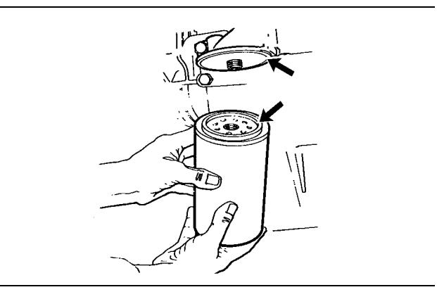

#### g00103713 Illustration 46

Typical filter mounting base and filter gasket

- **3.** Clean the sealing surface of the filter mounting base. Ensure that all of the old oil filter gasket is removed.
- **4.** Apply clean engine oil to the new oil filter gasket.

#### NOTICE

Do not fill the oil filters with oil before installing them. This oil would not be filtered and could be contaminated. Contaminated oil can cause accelerated wear to engine components.

**5.** Install the oil filter. Tighten the oil filter until the oil filter gasket contacts the base. Tighten the oil filter by hand according to the instructions that are shown on the oil filter. Do not overtighten the oil filter.

### **Fill the Engine Crankcase**

**1.** Remove the oil filler cap. Refer to the Operation and Maintenance Manual, "Refill Capacities and Recommendations" for more information.

#### NOTICE

If equipped with an auxiliary oil filter system or a remote oil filter system, follow the OEM or filter manufacturer's recommendations. Under filling or overfilling the crankcase with oil can cause engine damage.

#### NOTICE

To prevent crankshaft bearing damage, crank the engine with the fuel OFF. This will fill the oil filters before starting the engine. Do not crank the engine for more than 30 seconds.

**2.** Start the engine and run the engine at "LOW IDLE" for two minutes. Perform this procedure in order to ensure that the lubrication system has oil and that the oil filters are filled. Inspect the oil filter for oil leaks.

- **3.** Stop the engine and allow the oil to drain back to the sump for a minimum of ten minutes.
- **4.** Remove the oil level gauge in order to check the oil level. Maintain the oil level between the "ADD" and "FULL" marks on the oil level gauge.

i02861779

### **Engine Protective Devices - Check**

**SMCS Code:** 7400-535

### **Visual Inspection**

Visually check the condition of all gauges, sensors and wiring. Look for wiring and components that are loose, broken, or damaged. Damaged wiring or components should be repaired or replaced immediately.

### **Calibration Check**

#### NOTICE

During testing, abnormal operating conditions must be simulated.

The tests must be performed correctly in order to prevent possible damage to the engine.

Alarms and shutoffs must function properly. Alarms provide timely warning to the operator. Shutoffs help to prevent damage to the engine. It is impossible to determine if the engine protective devices are in good working order during normal operation. Malfunctions must be simulated in order to test the engine protective devices. To prevent damage to the engine, only authorized service personnel or your Caterpillar dealer should perform the tests.

Consult your Caterpillar dealer or refer to the Service Manual for more information.

{76}------------------------------------------------

### **Engine Storage Procedure - Check**

**SMCS Code:** 1000-535

The oil change interval may be extended to 12 months for a vehicle that is operated seasonally and placed in storage for the remainder of the year by using the required storage procedures and the required start-up procedures. This extension is permitted if the following categories for oil change intervals in the Operation and Maintenance Manual, "Maintenance Interval Schedule" have not been reached:

- Mileage
- Operating hours
- Fuel consumption

If an engine is out of operation and if use of the engine is not planned, special precautions should be made. If the engine will be stored for more than three months, a complete protection procedure is recommended. For more detailed information on engine storage, see Special Instruction, SEHS9031, "Storage Procedure For Caterpillar Products".

If the engine will not be started for several weeks, the lubricating oil will drain from the cylinder walls and from the piston rings. Rust can form on the cylinder liner surface. Rust on the cylinder liner surface will cause increased engine wear and a reduction in engine service life. Caterpillar recommends the use of volatile corrosion inhibitor (VCI) oil in order to prevent internal engine damage due to moisture during storage. These inhibitors in the VCI oil act by evaporating inside the engine. The inhibitors then condense over the inside surfaces of the engine. The evaporation process and the condensing process offers full protection to surfaces that cannot be reached with preservatives. 0.9 L (1.0 qt) of 4C-6792 VCI oil will treat 28.4 L (30.0 qt) of engine oil. This will give a 3 percent concentration of VCI oil. The engine must be completely sealed when the engine is stored in order for the VCI oil to function properly. The VCI oil is easily cleaned from the engine when you remove the engine from storage. The volatile vapors are removed by simply running the engine to operating temperature. A mineral oil base is left behind after the volatile vapors are removed.

### **Engine Valve Lash - Inspect/Adjust**

**SMCS Code:** 1102-025

**Note:** For procedures on adjusting the valve lash and adjusting the valve bridge, see System Systems Operation/Testing and Adjusting, "Valve Lash and Valve Bridge Adjustment". Consult your Caterpillar dealer for assistance.

The initial valve lash adjustment on new engines, rebuilt engines, or remanufactured engines is recommended at the first scheduled oil change. The adjustment is necessary due to the initial wear of the valve train components and to the seating of the valve train components.

**Ensure that the engine can not be started while this maintenance is being performed. To help prevent possible injury, do not use the starting motor to turn the flywheel.**

**Hot engine components can cause burns. Allow additional time for the engine to cool before measuring/adjusting valve lash clearance.**

### **Valve Bridge**

Check the valve bridge and adjust the valve bridge, if necessary. Perform the procedure for both valve bridges for each cylinder. After the valve bridge is checked for each cylinder, proceed with the valve lash adjustment, if necessary.

### **Engine Valve Lash**

#### NOTICE

Only qualified service personnel should perform this maintenance. Refer to the Systems Operation/Testing and Adjusting Manual, "Valve Lash and Valve Bridge Adjustment" article or consult your Caterpillar dealer for the complete valve lash adjustment procedure.

Operation of Caterpillar engines with improper valve adjustments can reduce engine efficiency. This reduced efficiency could result in excessive fuel usage and/or shortened engine component life.

The valve bridge adjustment must be performed before making a valve lash adjustment. If the valve lash is within the tolerance, an adjustment of the valve lash is NOT necessary.

i02939209

{77}------------------------------------------------

For the valve lash setting, see the engine's Specifications manual. For the procedure to set the valve lash, see the engine's Systems Operation/Testing and Adjusting manual.

i01597115

### **Engine Valve Rotators - Inspect**

**SMCS Code:** 1109-040

**When inspecting the valve rotators, protective glasses or face shield and protective clothing must be worn, to help prevent being burned by hot oil or spray.**

Engine valve rotators rotate the valves when the engine runs. This helps to prevent deposits from building up on the valves and the valve seats.

Perform the following steps after the engine valve lash is set, but before the valve covers are installed:

- **1.** Start the engine according to Operation and Maintenance Manual, "Engine Starting" (Operation Section) for the procedure.
- **2.** Operate the engine at low idle.
- **3.** Observe the top surface of each valve rotator. The valve rotators should turn slightly when the valves close.

#### NOTICE

A valve rotator which does not operate properly will accelerate valve face wear and valve seat wear and shorten valve life. If a damaged rotator is not replaced, valve face guttering could result and cause pieces of the valve to fall into the cylinder. This can cause piston and cylinder head damage.

If a valve fails to rotate, consult your Caterpillar dealer.

i02784507

### **Fan Drive Bearing - Lubricate**

**SMCS Code:** 1359-086-BD

Some of the fan drives have grease fittings and some of the fan drives do not have grease fittings. If there is no grease fitting, periodic lubrication is not required. The fan drive requires grease only if the fan drive is equipped with a zerk.

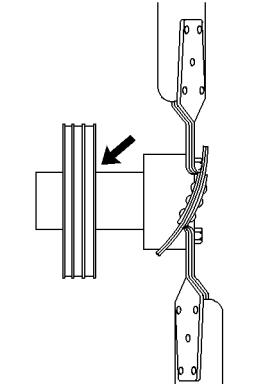

g00746166 Illustration 47

Typical location of the grease fitting (if equipped) that is for the fan drive bearing

The pulley is shown with the belt guards that have been removed.

Lubricate the grease fitting that is on the fan drive bearing with High Speed Ball Bearing Grease or the equivalent.

Inspect the fan drive pulley assembly for wear or for damage. If the shaft is loose, an inspection of the internal components should be performed. Refer to the Systems Operation Testing and Adjusting Manual for additional information.

i02053753

### **Fan Drive Bearing - Replace**

**SMCS Code:** 1359-510-BD

- **1.** Remove Bearings. Refer to Disassembly and Assembly, "Bearing Removal".
- **2.** Measure the bearing housings for roundness and for proper size.
- **3.** Replace the bearings.

{78}------------------------------------------------

## **Fuel System - Prime**

**SMCS Code:** 1258-548

### **The Secondary Fuel Filter Has Been Replaced**

**Fuel leaked or spilled onto hot surfaces or electrical components can cause a fire. To help prevent possible injury, turn the start switch off when changing fuel filters or water separator elements. Clean up fuel spills immediately.**

#### NOTICE

Use a suitable container to catch any fuel that might spill. Clean up any spilled fuel immediately.

#### NOTICE

Do not allow dirt to enter the fuel system. Thoroughly clean the area around a fuel system component that will be disconnected. Fit a suitable cover over disconnected fuel system component.

**Note:** Refer to Operation and Maintenance Manual, "Fuel System Secondary Filter - Replace" for information on replacing the filter.

**1.** Turn the ignition switch to the "OFF" position.

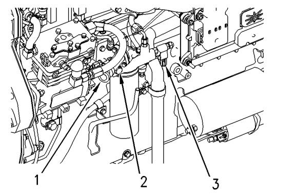

#### g00975199 Illustration 48

- (1) Fuel priming pump
- (2) Air purge screw
- (3) Priming valve (If Equipped)
- **2.** Turn the priming valve (3) (If Equipped) to the "Closed (Prime)" position in order to prime the fuel system.
- **3.** Open air purge screw (2) for the fuel filter by three full turns. Do not remove the air purge screw.

#### NOTICE

Do not crank the engine continuously for more than 30 seconds. Allow the starting motor to cool for two minutes before cranking the engine again.

**4.** Start the engine. The engine should start and the engine should run smoothly.

**Note:** You may use the fuel priming pump for the fuel filter (IF EQUIPPED) instead of starting the engine and running the engine.

**5.** While the engine is running, observe air purge screw (2). When a small drop of fuel appears at the threads of the air purge screw, close and tighten air purge screw (2).

**Note:** There may be a noticeable change in the sound of the running engine when the air purge screw is tightened. The change in the sound of the engine is normal.

**Note:** Failure to tighten all fittings could result in serious fuel leaks.

- **6.** Clean any residual fuel from the engine components.
- **7.** After the engine has operated smoothly for 30 seconds, turn the priming valve (3) to the "Open (Run)" position.

**Note:** Shortened injector life may occur if the priming valve (3) is left in the "Closed (Prime)" position.

### **The Engine Has Been Run Out of Fuel**

#### NOTICE

Use a suitable container to catch any fuel that might spill. Clean up any spilled fuel immediately.

#### NOTICE

Do not allow dirt to enter the fuel system. Thoroughly clean the area around a fuel system component that will be disconnected. Fit a suitable cover over disconnected fuel system component.

- **1.** Turn the ignition switch to the "OFF" position.
- **2.** Fill the fuel tank(s) with clean diesel fuel.

{79}------------------------------------------------

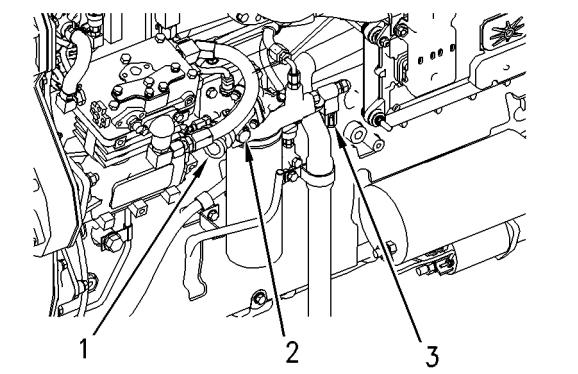

g00975199 Illustration 49

- (1) Fuel priming pump
- (2) Air purge screw
- (3) Priming valve (If Equipped)
- **3.** Turn the priming valve (3) (If Equipped) to the "Closed (Prime)" position in order to prime the fuel system.
- **4.** Open air purge screw (2) for the fuel filter by three full turns. Do not remove the air purge screw.

#### NOTICE

Do not crank the engine continuously for more than 30 seconds. Allow the starting motor to cool for two minutes before cranking the engine again.

**5.** Crank the engine for 30 seconds. Use a suitable container to catch the fuel while you crank the engine. Allow the starter motor to cool for 2 minutes.

**Note:** You may use the fuel priming pump (1) (IF EQUIPPED) for the fuel filter instead of cranking the engine.

- **6.** Crank the engine for 30 seconds. Allow the starter motor to cool for 2 minutes.
- **7.** Repeat Step 6 until the engine starts and the engine runs.

**Note:** Failure to tighten all fittings could result in serious fuel leaks.

**8.** After the engine has operated smoothly for 30 seconds, turn the priming valve (3) to the "Open (Run)" position.

**Note:** Shortened injector life may occur if the priming valve (3) is left in the "Closed (Prime)" position.

**9.** Clean any residual fuel from the engine components.

#### i02927282

### **Fuel System Primary Filter (Water Separator) Element - Replace**

#### **SMCS Code:** 1260-510-FQ; 1263-510-FQ

Water in the fuel can cause the engine to run rough. Water in the fuel may cause an electronic unit injector to fail. If the fuel has been contaminated with water, the element should be changed before the regularly scheduled interval.

The primary filter/water separator also provides filtration in order to help extend the life of the secondary fuel filter. The element should be changed regularly. If a vacuum gauge is installed, the primary filter/water separator should be changed at 50 to 70 kPa (15 to 20 inches Hg).

### **Replace the Element**

**Fuel leaked or spilled onto hot surfaces or electrical components can cause a fire. To help prevent possible injury, turn the start switch off when changing fuel filters or water separator elements. Clean up fuel spills immediately.**

#### NOTICE

Care must be taken to ensure that fluids are contained during performance of inspection, maintenance, testing, adjusting and repair of the product. Be prepared to collect the fluid with suitable containers before opening any compartment or disassembling any component containing fluids.

Refer to Special Publication, NENG2500, "Caterpillar Dealer Service Tool Catalog" for tools and supplies suitable to collect and contain fluids on Caterpillar products.

Dispose of all fluids according to local regulations and mandates.

#### NOTICE

Do not allow dirt to enter the fuel system. Thoroughly clean the area around a fuel system component that will be disconnected. Fit a suitable cover over disconnected fuel system component.

**1.** Close the main fuel supply valve.

{80}------------------------------------------------

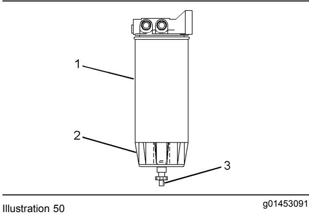

- (1) Element
- (2) Bowl
- (3) Drain
- **2.** Remove element (1) from the element mounting base while bowl (2) is attached.
- **3.** Dispose of the contents of the filter. Remove bowl (2) from element (1). The bowl is reusable. Do not discard the bowl. Dispose of the used element.
- **4.** Remove the O-ring from the gland of the bowl. Clean the following components:
	- Bowl
	- O-ring
	- Mounting base

Inspect the O-ring for damage and for deterioration. Replace the O-ring, if necessary.

- **5.** Lubricate the O-ring with clean diesel fuel.
- **6.** Install bowl (2) on a new element. Tighten the bowl by hand. Do not use tools in order to tighten the bowl.

#### NOTICE

The primary filter/water separator may be prefilled with fuel to avoid rough running/stalling of the engine due to air. Do not fill the secondary filter with fuel before installation. The fuel would not be filtered and could be contaminated. Contaminated fuel will cause accelerated wear to fuel system parts.

**7.** Lubricate the top seal of element (1) with clean diesel fuel. The element may be filled with fuel at this time. Install the new element on the mounting base. Tighten the element by hand.

#### NOTICE

The water separator is under suction during normal engine operation. Ensure that the vent plug is tightened securely to help prevent air from entering the fuel system.

- **8.** Open the main fuel supply valve.
- **9.** Start the engine and check for leaks. Run the engine for one minute. Stop the engine and check for leaks again.

Detecting leaks is difficult while the engine is running. The primary filter/water separator is under suction. A leak will allow air to enter the fuel. The air in the fuel can cause low power due to aeration of the fuel. If air enters the fuel, check the components for overtightening or undertightening.

i02927285

### **Fuel System Primary Filter/Water Separator - Drain**

**SMCS Code:** 1260-543; 1263-543

**Fuel leaked or spilled onto hot surfaces or electrical components can cause a fire. To help prevent possible injury, turn the start switch off when changing fuel filters or water separator elements. Clean up fuel spills immediately.**

#### NOTICE

Care must be taken to ensure that fluids are contained during performance of inspection, maintenance, testing, adjusting and repair of the product. Be prepared to collect the fluid with suitable containers before opening any compartment or disassembling any component containing fluids.

Refer to Special Publication, NENG2500, "Caterpillar Dealer Service Tool Catalog" for tools and supplies suitable to collect and contain fluids on Caterpillar products.

Dispose of all fluids according to local regulations and mandates.

#### NOTICE

Do not allow dirt to enter the fuel system. Thoroughly clean the area around a fuel system component that will be disconnected. Fit a suitable cover over disconnected fuel system component.

{81}------------------------------------------------

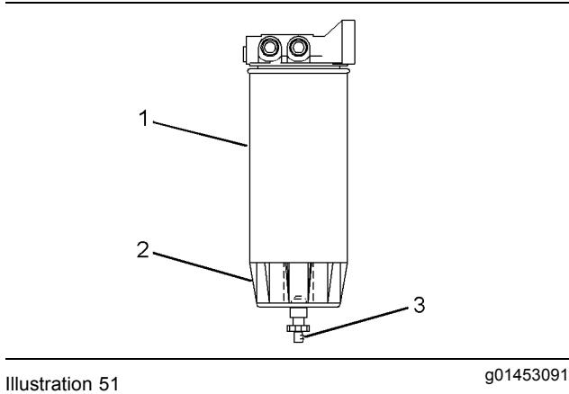

- (1) Element
- (2) Bowl

(3) Drain

Bowl (2) should be monitored daily for signs of water. If water is present, drain the water from the bowl.

- **1.** Open drain (3). The drain is a self-ventilated drain. Catch the draining water in a suitable container. Dispose of the water properly.
- **2.** Close drain (3).

#### NOTICE

The water separator is under suction during normal engine operation. Ensure that the drain valve is tightened securely to help prevent air from entering the fuel system.

i01776046

### **Fuel System Secondary Filter - Replace**

**SMCS Code:** 1261-510-SE

**Fuel leaked or spilled onto hot surfaces or electrical components can cause a fire. To help prevent possible injury, turn the start switch off when changing fuel filters or water separator elements. Clean up fuel spills immediately.**

#### NOTICE

Do not allow dirt to enter the fuel system. Thoroughly clean the area around a fuel system component that will be disconnected. Fit a suitable cover over any disconnected fuel system components.

NOTICE

Use a suitable container to catch any fuel that might spill. Clean up any spilled fuel immediately.

- **1.** Stop the engine. Turn the ignition switch to the OFF position or disconnect the battery. Refer to the Operation and Maintenance Manual, "Battery or Battery Cable - Disconnect" topic (Maintenance Section) for more information. Shut off the fuel supply valve (if equipped).
- **2.** It may be necessary to relieve residual fuel pressure from the fuel system before the fuel filter is removed. Wait for one to five minutes until the fuel pressure has lowered. Use a suitable container in order to catch any fuel that may spill.
- **3.** Remove the used fuel filter and discard the used fuel filter.
- **4.** Clean the gasket sealing surface of the fuel filter base. Ensure that all of the old gasket is removed.
- **5.** Apply clean diesel fuel to the new fuel filter gasket.

#### NOTICE

Do not fill the secondary fuel filter with fuel before installing. The fuel would not be filtered and could be contaminated. Contaminated fuel will cause accelerated wear to fuel system parts.

#### NOTICE

In order to maximize fuel system life and prevent premature wear out from abrasive particles in the fuel, a two micron high efficiency fuel filter is required for all Caterpillar Electronic Unit Injectors. Caterpillar High Efficiency Fuel Filters meet these requirements. Consult your Caterpillar dealer for the proper part numbers.

- **6.** Install the new fuel filter. Spin the fuel filter onto the fuel filter base until the gasket contacts the base. Use the rotation index marks on the filters as a guide for proper tightening. Tighten the filter according to the instructions that are on the fuel filter. Do not overtighten the filter.
- **7.** Open the fuel supply valve. The engine will need to be purged of air. Refer to the Operation and Maintenance Manual, "Fuel System - Prime" topic (Maintenance Section) for more information.

{82}------------------------------------------------

### **Fuel Tank Water and Sediment - Drain**

**SMCS Code:** 1273-543-M&S

#### NOTICE

Care must be taken to ensure that fluids are contained during performance of inspection, maintenance, testing, adjusting and repair of the product. Be prepared to collect the fluid with suitable containers before opening any compartment or disassembling any component containing fluids.

Refer to Special Publication, NENG2500, "Caterpillar Dealer Service Tool Catalog" for tools and supplies suitable to collect and contain fluids on Caterpillar products.

Dispose of all fluids according to local regulations and mandates.

### **Fuel Tank**

Fuel quality is critical to the performance and to the service life of the engine. Water in the fuel can cause excessive wear to the fuel system. Condensation occurs during the heating and cooling of fuel. The condensation occurs as the fuel passes through the fuel system and the fuel returns to the fuel tank. This causes water to accumulate in fuel tanks. Draining the fuel tank regularly and obtaining fuel from reliable sources can help to eliminate water in the fuel.

### **Drain the Water and the Sediment**

Fuel tanks should contain some provision for draining water and draining sediment from the bottom of the fuel tanks.

Open the drain valve on the bottom of the fuel tank in order to drain the water and the sediment. Close the drain valve.

Check the fuel daily. Drain the water and sediment from the fuel tank after operating the engine or drain the water and sediment from the fuel tank after the fuel tank has been filled. Allow five to ten minutes before performing this procedure.

Fill the fuel tank after operating the engine in order to drive out moist air. This will help prevent condensation. Do not fill the tank to the top. The fuel expands as the fuel gets warm. The tank may overflow.

Some fuel tanks use supply pipes that allow water and sediment to settle below the end of the fuel supply pipe. Some fuel tanks use supply lines that take fuel directly from the bottom of the tank. If the engine is equipped with this system, regular maintenance of the fuel system filter is important.

### **Fuel Storage Tanks**

Drain the water and the sediment from the fuel storage tank during the following conditions:

- Weekly
- Oil change
- Refill of the tank

This will help prevent water or sediment from being pumped from the storage tank into the engine fuel tank. A 4 micron [c] filter for the breather vent on the fuel tank is also recommended. Refer to Special Publication, SENR9620, "Improving Fuel System Durablity".

If a bulk storage tank has been refilled or moved recently, allow adequate time for the sediment to settle before filling the engine fuel tank. Internal baffles in the bulk storage tank will also help trap sediment. Filtering fuel that is pumped from the storage tank helps to ensure the quality of the fuel. When possible, water separators should be used.

i02121526

### **Hoses and Clamps - Inspect/Replace**

**SMCS Code:** 7554-040; 7554-510

Inspect all hoses for leaks that are caused by the following conditions:

- Cracking
- Softness
- Loose clamps

Replace hoses that are cracked or soft. Tighten any loose clamps.

#### NOTICE

Do not bend or strike high pressure lines. Do not install bent or damaged lines, tubes or hoses. Repair any loose or damaged fuel and oil lines, tubes and hoses. Leaks can cause fires. Inspect all lines, tubes and hoses carefully. Tighten all connections to the recommended torque.

{83}------------------------------------------------

Check for the following conditions:

- End fittings that are damaged or leaking
- Outer covering that is chafed or cut
- Exposed wire that is used for reinforcement
- Outer covering that is ballooning locally
- Flexible part of the hose that is kinked or crushed
- Armoring that is embedded in the outer covering

A constant torque hose clamp can be used in place of any standard hose clamp. Ensure that the constant torque hose clamp is the same size as the standard clamp.

Due to extreme temperature changes, the hose will heat set. Heat setting causes hose clamps to loosen. This can result in leaks. A constant torque hose clamp will help to prevent loose hose clamps.

Each installation application can be different. The differences depend on the following factors:

- Type of hose
- Type of fitting material
- Anticipated expansion and contraction of the hose
- Anticipated expansion and contraction of the fittings

### **Replace the Hoses and the Clamps**

**Pressurized System: Hot coolant can cause serious burns. To open the cooling system filler cap, stop the engine and wait until the cooling system components are cool. Loosen the cooling system pressure cap slowly in order to relieve the pressure.**

- **1.** Stop the engine. Allow the engine to cool.
- **2.** Loosen the cooling system filler cap slowly in order to relieve any pressure. Remove the cooling system filler cap.

**Note:** Drain the coolant into a suitable, clean container. The coolant can be reused.

- **3.** Drain the coolant from the cooling system to a level that is below the hose that is being replaced.
- **4.** Remove the hose clamps.
- **5.** Disconnect the old hose.
- **6.** Replace the old hose with a new hose.
- **7.** Install the hose clamps with a torque wrench.

**Note:** Refer to the Specifications, SENR3130, "Torque Specifications" in order to locate the proper torques.

- **8.** Refill the cooling system.
- **9.** Clean the cooling system filler cap. Inspect the cooling system filler cap's gaskets. Replace the cooling system filler cap if the gaskets are damaged. Install the cooling system filler cap.
- **10.** Start the engine. Inspect the cooling system for leaks.

i02486400

### **Jacket Water Heater - Check**

#### **SMCS Code:** 1383-535

Jacket water heaters help to improve startability in ambient temperatures that are below 21 °C (70 °F). All installations that require automatic starting should have jacket water heaters.

Check the operation of the jacket water heater. For an ambient temperature of 0 °C (32 °F), the heater should maintain the jacket water coolant temperature at approximately 32 °C (90 °F).

i01848653

### **Overhaul Considerations**

#### **SMCS Code:** 7595-043

Reduced hours of operation at full load will result in a lower average power demand. A decreased average power demand should increase both the engine service life and the overhaul interval.

The need for an overhaul is generally indicated by increased fuel consumption and by reduced power.

The following factors are important when a decision is being made on the proper time for an engine overhaul:

- The need for preventive maintenance
- The quality of the fuel that is being used
- The operating conditions
- The results of the S·O·S analysis

{84}------------------------------------------------

### **Oil Consumption as an Overhaul Indicator**

Oil consumption, fuel consumption, and maintenance information can be used to estimate the total operating cost for your Caterpillar engine. Oil consumption can also be used to estimate the required capacity of a makeup oil tank that is suitable for the maintenance intervals.

Oil consumption is in proportion to the percentage of the rated engine load. As the percentage of the engine load is increased, the amount of oil that is consumed per hour also increases.

The oil consumption rate (brake specific oil consumption) is measured in grams per kW/h (lb per bhp). The brake specific oil consumption (BSOC) depends on the engine load. Consult your Caterpillar dealer for assistance in determining the typical oil consumption rate for your engine.

When an engine's oil consumption has risen to three times the original oil consumption rate due to normal wear, an engine overhaul should be scheduled. There may be a corresponding increase in blowby and a slight increase in fuel consumption.

### **Overhaul Options**

#### **Before Failure Overhaul**

A planned overhaul before failure may be the best value for the following reasons:

- Costly unplanned downtime can be avoided.
- Many original parts can be reused according to the standards for reusable parts.
- The engine service life can be extended without the risk of a major catastrophe due to engine failure.
- The best cost/value relationship per hour of extended life can be attained.

#### **After Failure Overhaul**

If a major engine failure occurs and the engine must be removed, many options are available. An overhaul should be performed if the engine block or the crankshaft needs to be repaired.

If the engine block is repairable and/or the crankshaft is repairable, the overhaul cost should be between 40 percent and 50 percent of the cost of a new engine with a similar exchange core.

This lower cost can be attributed to three aspects:

• Specially designed Caterpillar engine features

- Caterpillar dealer exchange components
- Caterpillar Inc. remanufactured exchange components

### **Overhaul Recommendation**

To minimize downtime, a scheduled engine overhaul by your Caterpillar dealer is recommended. This will provide you with the best cost/value relationship.

**Note:** Overhaul programs vary according to the engine application and according to the dealer that performs the overhaul. Consult your Caterpillar dealer for specific information about the available overhaul programs and about overhaul services for extending the engine life.

If an overhaul is performed without overhaul service from your Caterpillar dealer, be aware of the following maintenance recommendations.

### **Unit Fuel Injector**

Clean the fuel injector body and replace the O-rings. Replace the O-rings and the gasket on the injector sleeve. Clean the area around the injector seating in the injector sleeve. Refer to the Service Manual for the complete procedure, or consult with your Caterpillar dealer for assistance.

### **Rebuild or Exchange**

#### **Cylinder Head Assembly, Connecting Rods, Pistons, Cylinder Liners, Turbocharger, Cylinder Packs, Oil Pump, and Fuel Transfer Pump**

These components should be inspected according to the instructions that are found in various Caterpillar reusability publications. The Special Publication, SEBF8029 lists the reusability publications that are needed for inspecting the engine parts.

If the parts comply with the established inspection specifications that are expressed in the reusable parts guideline, the parts should be reused.

Parts that are not within the established inspection specifications should be dealt with in one of the following manners:

- Salvaging
- Repairing
- Replacing

Parts that do not comply with the established inspection specifications can result in the following problems:

{85}------------------------------------------------

- Unscheduled downtime
- Costly repairs
- Damage to other engine parts
- Reduced engine efficiency
- Increased fuel consumption

Reduced engine efficiency and increased fuel consumption translates into higher operating costs. Therefore, Caterpillar Inc. recommends repairing out-of-spec parts or replacing out-of-spec parts.

#### **Inspection and/or Replacement**

#### **Piston Rings, Crankshaft Bearings, Valve Rotators, and Crankshaft Seals**

The following components may not last until the second overhaul.

- Thrust bearings
- Main bearings
- Rod bearings
- Valve rotators
- Crankshaft seals

Caterpillar Inc. recommends the installation of new parts at each overhaul period.

Inspect these parts while the engine is disassembled for an overhaul.

Inspect the crankshaft for any of the following conditions:

- Deflection
- Damage to the journals
- Bearing material that has seized to the journals

Check the journal taper and the profile of the crankshaft journals. Check these components by interpreting the wear patterns on the following components:

- Rod bearing
- Main bearings

**Note:** If the crankshaft is removed for any reason, use the magnetic particle inspection process to check for cracks in the crankshaft.

Inspect the camshaft for damage to the journals and to the lobes.

**Note:** If the camshaft is removed for any reason, use the magnetic particle inspection process to check for cracks in the camshaft.

Inspect the following components for signs of wear or for signs of scuffing:

- Camshaft bearings
- Camshaft followers

Caterpillar Inc. recommends replacing the crankshaft vibration damper.

#### **Oil Cooler Core and Aftercooler Core**

During an overhaul, the removal of the oil cooler core and the aftercooler core is recommended. The oil cooler core and the aftercooler core should be cleaned and pressure tested.

#### NOTICE

Do not use caustic cleaners to clean the core.

Caustic cleaners can attack the internal metals of the core and cause leakage.

### **Obtain Coolant Analysis**

The concentration of supplemental coolant additive (SCA) should be checked regularly with test kits or with S·O·S Coolant Analysis (Level 1). Further coolant analysis is recommended when the engine is overhauled.

A coolant analysis can be conducted in order to verify the condition of the water that is being used in the cooling system. A full water analysis can be obtained by consulting your local water utility company or an agricultural agent. Private laboratories are also available for water analysis.

Caterpillar Inc. recommends an S·O·S Coolant Analysis (Level 2).

#### **S·O·S Coolant Analysis (Level 2)**

An S·O·S Coolant Analysis (Level 2) is a comprehensive coolant analysis which completely analyzes the coolant and the effects on the cooling system. An S·O·S Coolant Analysis (Level 2) provides the following information:

- Complete S·O·S Coolant Analysis (Level 2)
- Visual inspection of properties

{86}------------------------------------------------

- Identification of metal corrosion
- Identification of contaminants
- Identification of built up impurities (corrosion and scale)

S·O·S Coolant Analysis (Level 2) provides a report of the results of both the analysis and the maintenance recommendations.

For more information about coolant analysis, consult your Caterpillar dealer.

i01506009

### **Power Take-Off Clutch - Check/Adjust/Lubricate**

**SMCS Code:** 3055-036; 3055-086

#### NOTICE

New power take-offs should have the clutch adjustment checked before being placed into service. The clutch adjustment should be checked again after the first ten hours of operation. New clutch plates have a "wear in" period, and the clutch may require several adjustments until the new plates are "worn in".

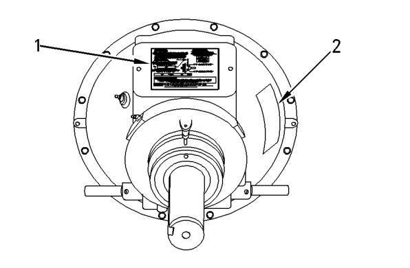

g00781502 Illustration 52

(1) Instruction plate

(2) Serial number plate

Check the clutch adjustment regularly after "wear in". Heavy-duty applications which have engagements that are frequent and relatively long periods of clutch slippage require more frequent adjustment than light-duty applications. The operating torque should be measured in order to determine if a clutch adjustment is required.

Refer to the OEM information and instruction plate (1) for instructions on lubrication, adjustment, and other recommendations for service. Perform the maintenance that is specified on the instruction plate.

**Do not operate the engine with the Instruction Plate cover removed from the clutch. Personal injury may result.**

**If the clutch is damaged to the point of burst failure, expelled pieces can cause personal injury to anyone in the immediate area. Proper safeguards must be followed to help prevent accidents.**

i02559063

### **Radiator - Clean**

**SMCS Code:** 1353-070

**Note:** Adjust the frequency of cleaning according to the effects of the operating environment.

Inspect the radiator for these items: damaged fins, corrosion, dirt, grease, insects, leaves, oil, and other debris. Clean the radiator, if necessary.

**Personal injury can result from air pressure.**

**Personal injury can result without following proper procedure. When using pressure air, wear a protective face shield and protective clothing.**

**The maximum air pressure for cleaning purposes must be reduced to 205 kPa (30 psi) when the air nozzle is deadheaded.**

Pressurized air is the preferred method for removing loose debris. Direct the air in the opposite direction of the fan's air flow. Hold the nozzle approximately 6 mm (0.25 inch) away from the fins. Slowly move the air nozzle in a direction that is parallel with the tubes. This will remove debris that is between the tubes.

Pressurized water may also be used for cleaning. The maximum water pressure for cleaning purposes must be less than 275 kPa (40 psi). Use pressurized water in order to soften mud. Clean the core from both sides.

Use a degreaser and steam for removal of oil and grease. Clean both sides of the core. Wash the core with detergent and hot water. Thoroughly rinse the core with clean water.

{87}------------------------------------------------

After cleaning, start the engine and accelerate the engine to high idle rpm. This will help in the removal of debris and drying of the core. Stop the engine. Use a light bulb behind the core in order to inspect the core for cleanliness. Repeat the cleaning, if necessary.

Inspect the fins for damage. Bent fins may be opened with a "comb". Inspect these items for good condition: welds, mounting brackets, air lines, connections, clamps, and seals. Make repairs, if necessary.

For more detailed information on cleaning and inspection, refer to Special Publication, SEBD0518, "Know Your Cooling System".

i00151038

### **Severe Service Application - Check**

#### **SMCS Code:** 1000-535

Severe service is an application of an engine that exceeds current published standards for that engine. Caterpillar maintains standards for the following engine parameters:

- Performance (power range, speed range, and fuel consumption)
- Fuel quality
- Altitude range
- Maintenance intervals
- Oil selection and maintenance
- Coolant selection and maintenance
- Environmental qualities
- Installation

Refer to the standards for the engine or consult with your Caterpillar dealer in order to determine if the engine is operating within the defined parameters.

Severe service operation can accelerate component wear. Engines that operate under severe conditions may need more frequent maintenance intervals in order to ensure maximum reliability and retention of full service life.

Due to individual applications, it is not possible to identify all of the factors which can contribute to severe service operation. Consult your Caterpillar dealer for the unique maintenance that is necessary for the engine.

The operating environment, improper operating procedures and improper maintenance procedures can be factors which contribute to severe service conditions.

### **Environmental Factors**

**Ambient temperatures –** The engine may be exposed to extended operation in extremely cold environments or hot environments. Valve components can be damaged by carbon buildup if the engine is frequently started and stopped in very cold temperatures. Extremely hot inlet air reduces engine performance.

**Air Quality –** The engine may be exposed to extended operation in an environment that is dirty or dusty, unless the equipment is cleaned regularly. Mud, dirt and dust can encase components. Maintenance can be very difficult. The buildup can contain corrosive chemicals.

**Buildup –** Compounds, elements, corrosive chemicals and salt can damage some components.

**Altitude –** Problems can arise when the engine is operated at altitudes that are higher than the intended settings for that application. Necessary adjustments should be made.

### **Improper Operating Procedures**

- Extended operation at low idle
- Frequent hot shutdowns
- Operating at excessive loads
- Operating at excessive speeds
- Operating outside the intended application

### **Improper Maintenance Procedures**

- Extending the maintenance intervals
- Failure to use recommended fuel, lubricants and coolant/antifreeze

{88}------------------------------------------------

### **Speed Sensor - Clean/Inspect**

**SMCS Code:** 1907-040; 1907-070

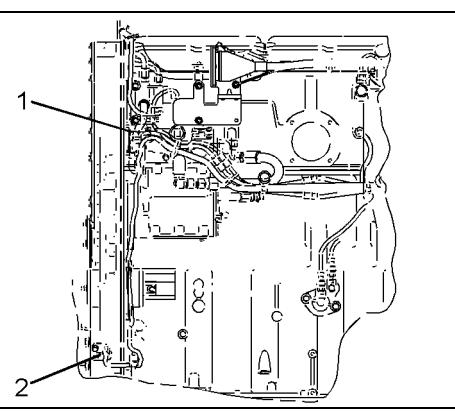

g01453018 Illustration 53

Left side view

- (1) Secondary speed/timing sensor
- (2) Primary speed/timing sensor
- **1.** Remove the speed/timing sensors. Refer to Systems Operation, "Speed/Timing Sensor - Remove and Install" for the removal procedure. Check the condition of the plastic end of the speed/timing sensors for wear and/or contaminants.
- **2.** Clean the metal shavings and other debris from the face of the speed/timing sensors.
- **3.** Install the speed/timing sensors. Refer to Systems Operation, "Speed/Timing Sensor - Remove and Install" for the installation procedure.

i00651416

### **Starting Motor - Inspect**

**SMCS Code:** 1451-040; 1453-040

Caterpillar Inc. recommends a scheduled inspection of the starting motor. If the starting motor fails, the engine may not start in an emergency situation.

Check the starting motor for proper operation. Check the electrical connections and clean the electrical connections. Refer to the Service Manual for more information on the checking procedure and for specifications or consult your Caterpillar dealer for assistance.

i01539769

### **Turbocharger - Inspect**

#### **SMCS Code:** 1052-040; 1052

Periodic inspection and cleaning is recommended for the turbocharger compressor housing (inlet side). Any fumes from the crankcase are filtered through the air inlet system. Therefore, by-products from oil and from combustion can collect in the turbocharger compressor housing. Over time, this buildup can contribute to loss of engine power, increased black smoke and overall loss of engine efficiency.

If the turbocharger fails during engine operation, damage to the turbocharger compressor wheel and/or to the engine may occur. Damage to the turbocharger compressor wheel can cause additional damage to the pistons, the valves, and the cylinder head.

#### NOTICE

Turbocharger bearing failures can cause large quantities of oil to enter the air inlet and exhaust systems. Loss of engine lubricant can result in serious engine damage.

Minor leakage of a turbocharger housing under extended low idle operation should not cause problems as long as a turbocharger bearing failure has not occurred.

When a turbocharger bearing failure is accompanied by a significant engine performance loss (exhaust smoke or engine rpm up at no load), do not continue engine operation until the turbocharger is repaired or replaced.

An inspection of the turbocharger can minimize unscheduled downtime. An inspection of the turbocharger can also reduce the chance for potential damage to other engine parts.

**Note:** Turbocharger components require precision clearances. The turbocharger cartridge must be balanced due to high rpm. Severe Service Applications can accelerate component wear. Severe Service Applications require more frequent inspections of the cartridge.

### **Removal and Installation**

For options regarding the removal, installation, repair and replacement, consult your Caterpillar dealer. Refer to the Service Manual for this engine for the procedure and specifications.

{89}------------------------------------------------

### **Cleaning and Inspecting**

- **1.** Remove the exhaust outlet piping and remove the air inlet piping from the turbocharger. Visually inspect the piping for the presence of oil. Clean the interior of the pipes in order to prevent dirt from entering during reassembly.
- **2.** Turn the compressor wheel and the turbine wheel by hand. The assembly should turn freely. Inspect the compressor wheel and the turbine wheel for contact with the turbocharger housing. There should not be any visible signs of contact between the turbine wheel or compressor wheel and the turbocharger housing. If there is any indication of contact between the rotating turbine wheel or the compressor wheel and the turbocharger housing, the turbocharger must be reconditioned.
- **3.** Check the compressor wheel for cleanliness. If only the blade side of the wheel is dirty, dirt and/or moisture is passing through the air filtering system. If oil is found only on the back side of the wheel, there is a possibility of a failed turbocharger oil seal.

The presence of oil may be the result of extended engine operation at low idle. The presence of oil may also be the result of a restriction of the line for the inlet air (plugged air filters), which causes the turbocharger to slobber.

- **4.** Use a dial indicator to check the end clearance on the shaft. If the measured end play is greater than the Service Manual specifications, the turbocharger should be repaired or replaced. An end play measurement that is less than the minimum Service Manual specifications could indicate carbon buildup on the turbine wheel. The turbocharger should be disassembled for cleaning and for inspection if the measured end play is less than the minimum Service Manual specifications.
- **5.** Inspect the bore of the turbine housing for corrosion.
- **6.** Clean the turbocharger housing with standard shop solvents and a soft bristle brush.
- **7.** Fasten the air inlet piping and the exhaust outlet piping to the turbocharger housing.

i01185304

## **Walk-Around Inspection**

**SMCS Code:** 1000-040

### **Inspect the Engine for Leaks and for Loose Connections**

A walk-around inspection should only take a few minutes. When the time is taken to perform these checks, costly repairs and accidents can be avoided.

For maximum engine service life, make a thorough inspection of the engine compartment before starting the engine. Look for items such as oil leaks or coolant leaks, loose bolts, worn belts, loose connections and trash buildup. Make repairs, as needed:

- The guards must be in the proper place. Repair damaged guards or replace missing guards.
- Wipe all caps and plugs before the engine is serviced in order to reduce the chance of system contamination.

#### NOTICE

For any type of leak (coolant, lube, or fuel) clean up the fluid. If leaking is observed, find the source and correct the leak. If leaking is suspected, check the fluid levels more often than recommended until the leak is found or fixed, or until the suspicion of a leak is proved to be unwarranted.

#### NOTICE

Accumulated grease and/or oil on an engine or deck is a fire hazard. Remove this debris with steam cleaning or high pressure water.

- Ensure that the cooling lines are properly clamped and that the cooling lines are tight. Check for leaks. Check the condition of all pipes.
- Inspect the water pumps for coolant leaks.

**Note:** The water pump seal is lubricated by coolant in the cooling system. It is normal for a small amount of leakage to occur as the engine cools down and the parts contract.

Excessive coolant leakage may indicate the need to replace the water pump seal. For the removal of water pumps and the installation of water pumps and/or seals, refer to the Service Manual for the engine or consult your Caterpillar dealer.

• Inspect the lubrication system for leaks at the front crankshaft seal, the rear crankshaft seal, the oil pan, the oil filters and the valve cover.

{90}------------------------------------------------

- Inspect the fuel system for leaks. Look for loose fuel line clamps or for loose fuel line tie-wraps.
- Inspect the piping for the air inlet system and the elbows for cracks and for loose clamps. Ensure that hoses and tubes are not contacting other hoses, tubes, wiring harnesses, etc.
- Inspect the alternator belt and the accessory drive belts for cracks, breaks or other damage.

Belts for multiple groove pulleys must be replaced as matched sets. If only one belt is replaced, the belt will carry more load than the belts that are not replaced. The older belts are stretched. The additional load on the new belt could cause the belt to break.

- Drain the water and the sediment from fuel tanks on a daily basis in order to ensure that only clean fuel enters the fuel system.
- Inspect the wiring and the wiring harnesses for loose connections and for worn wires or frayed wires.
- Inspect the ground strap for a good connection and for good condition.
- Inspect the ECM to the cylinder head ground strap for a good connection and for good condition.
- Disconnect any battery chargers that are not protected against the current drain of the starting motor. Check the condition and the electrolyte level of the batteries, unless the engine is equipped with a maintenance free battery.
- Check the condition of the gauges. Replace any gauges that are cracked. Replace any gauge that can not be calibrated.

i01057943

### **Water Pump - Inspect**

**SMCS Code:** 1361-040; 1361

A failed water pump might cause severe engine overheating problems that could result in the following conditions:

- Cracks in the cylinder head
- A piston seizure
- Other potential damage to the engine

Visually inspect the water pump for leaks. If any leaking is observed, replace the water pump seal or the water pump assembly. Refer to the Service Manual for the disassembly and assembly procedure. **Note:** Refer to the Service Manual or consult your Caterpillar dealer if any repair is needed or any replacement is needed.

{91}------------------------------------------------

## **Warranty Section**

### **Warranty Information**

i02212087

### **Emissions Warranty Information**

**SMCS Code:** 1000

### **Maintenance Recommendations**

Caterpillar Inc. engines are certified by the United States Environmental Protection Agency (EPA) in order to comply with exhaust emission standards and gaseous emission standards that are prescribed by Federal laws at the time of manufacture.

Efficiency of the emission control and the engine performance depends on adherence to proper operation and maintenance recommendations and use of recommended fuels and lubricating oils. According to recommendations, major adjustments and repairs should be made by your authorized Caterpillar dealer.

Various chemical fuel additives which claim to reduce visible smoke are available commercially. Although additives have been used to solve some isolated smoke problems in the field, additives are not recommended for general use. The engines should be certified without smoke depressants according to federal smoke regulations.

Take corrective steps immediately after worn parts which may affect emission levels are discovered in order to ensure the proper operation of the emission control systems. The use of genuine Caterpillar parts is recommended. Suppliers of non-Caterpillar parts must ensure the owner that the use of such parts will not adversely affect emission levels.

Regular maintenance intervals with a special emphasis on the following items are necessary in order to keep exhaust emissions within acceptable limits for the useful life of the engine. Refer to the Operation and Maintenance Manual, "Severe Service Application - Check" topic (Maintenance Section). If the engine is operating under severe conditions, adjust the maintenance schedule accordingly. See your authorized Caterpillar dealer in order to help analyze your specific application, operating environment and maintenance schedule adjustments. The following information is an explanation of maintenance items for emission related components. See the Operation and Maintenance Manual, "Maintenance Interval Schedule" (Maintenance Section) for the specific interval for the following items.

#### **EXHAUST AFTERTREATMENT SYSTEM –**

Aftertreatment devices are sensitive to the type of fuel that is used and the operating schedule. Low quality fuel may cause increases in exhaust back pressure or clogging resulting in loss of power. An authorized Caterpillar dealer can determine if the aftertreatment device needs service.

**UNIT INJECTORS –** Unit injectors are subject to tip wear as a result of fuel contamination. This damage can cause the following conditions: an increase in fuel consumption, black smoke, misfire, and rough running engine. The unit injector should be inspected, tested and replaced, if necessary. Unit injectors can be tested by an authorized Caterpillar dealer.

**TURBOCHARGER –** Check for any unusual sound or vibration in the turbocharger. Inspect the inlet piping and connections and inspect the exhaust piping and connections. Check the condition of the bearing. Perform the maintenance that is described in the Operation and Maintenance Manual, "Maintenance Interval Schedule" (Maintenance Section).

**ELECTRONIC ENGINE CONTROL –** This component is a device that is designed to control engine operation with respect to the amount of fuel injected, the injection timing as well as controlling the black smoke emission of the engine during the engine's operation when low inlet manifold pressure exists.

Any erratic engine behavior may indicate a need for replacement or repair. Your Caterpillar dealer is equipped with the necessary tools, personnel and procedures in order to perform this service.

The owner is encouraged to keep adequate maintenance records. However, the absence of such records will not invalidate the warranty. Refer to the Operation and Maintenance Manual, "Maintenance Log" (Reference Materials Section).

The owner may perform routine maintenance, repairs and other work that is outside of the warranty. The work may be done at any repair facility. Such work does not need to be performed at a designated station that is determined by the warranty in order for the warranty to remain in force.

{92}------------------------------------------------

### **Customer Assistance (Emission Control Systems Warranty)**

Caterpillar Inc. intends to ensure that the Emission Control Systems warranty is properly administered. If you do not receive adequate warranty service under the Emission Control Systems Warranty, call or write to the following address:

Caterpillar Inc. Manager, Engine Business P.O. Box 0600 Mossville, IL 61552

Authorized dealers are recommended for major maintenance and for repair work. Authorized dealers are staffed with trained personnel and proper tools. Authorized dealers are aware of the latest maintenance methods and procedures. If owners or other persons desire to perform the work, a Service Manual should be purchased and current service information should be obtained from a Caterpillar dealer.

{93}------------------------------------------------

## **Reference Information Section**

## **Engine Ratings**

i01097462

## **Engine Rating Conditions**

**SMCS Code:** 1000

All engine ratings are based on"SAE J1349".

Ratings relate to the standard conditions of "AS1501", of "ISO3046/1", of "DIN6271", and of "BS5514".

The engine ratings are gross output ratings.

**Gross Output Ratings –** The total output capability of the engine that is equipped with standard accessories.

Standard accessories include the following components:

- Oil pumps
- Fuel pumps
- Water pumps

Subtract the power that is required to drive auxiliary components from the gross output. This will produce the net power that is available for the external load (flywheel).

i01257714

### **Engine Rating Definitions**

#### **SMCS Code:** 1000

The ratings must be reduced in order to accommodate changes in the altitude. The ratings must be reduced according to the data for derating that is obtained from the test specification for the engine.

All of the ratings that are defined have a manufacturing tolerance of ± three percent.

Use the following guidelines in order to determine the applicable engine rating.

#### NOTICE

Operating an engine at a greater power output than the engine is rated for will reduce the service life of the engine before overhaul.

**"IND A (Continuous)" –** This rating allows operation at the engine's rated load and speed for 100 percent of the time without interruption or load cycling. The engine may be operated at full load for 100 percent of the duty cycle. The following applications are typical: pipeline pumping, ventilation, and applications that are specified by the customer.

**"IND B" –** This rating is for service with power and/or speed that is cyclic. Full load operation must not exceed 80 percent of the duty cycle. The following applications are typical: irrigation with a normal pump demand that is 85 percent of the engine rating, mechanical pumping and/or drilling in an oil field, and stationary plant air compressors.

**"IND C (Intermittent)" –** This rating is for service with power and/or speed that is cyclic. The engine can be operated continuously for one hour at the "C" rating. This is followed by one hour of operation at the "A" rating or below the "A" rating. Continuous power may be supplied by engines with the "C" rating. However, operation at full load must not exceed 50 percent of the duty cycle. The following applications are typical: agricultural tractors, harvesters, combines, off-highway trucks, power for fire pumps, drilling for blast holes, rock crushers with high torque rise, wood chippers with high torque rise, and oil field hoisting.

{94}------------------------------------------------

## **Customer Service**

i02097871

### **Customer Assistance**

**SMCS Code:** 1000

### **USA and Canada**

When a problem arises concerning the operation of an engine or concerning the service of an engine, the problem will normally be managed by the dealer in your area.

Your satisfaction is a primary concern to Caterpillar and to Caterpillar dealers. If you have a problem that has not been handled to your complete satisfaction, follow these steps:

- **1.** Discuss your problem with a manager from the dealership.
- **2.** If your problem cannot be resolved at the dealer level without additional assistance, use the phone number that is listed below to talk with a Field Service Coordinator:

1-800-447-4986

The normal hours are from 8:00 to 4:30 Monday through Friday Central Standard Time.

**3.** If your needs have not been met still, submit the matter in writing to the following address:

> Caterpillar Inc. Manager, Customer Service, Engine Division Mossville Bldg AC P.O. Box 610 Mossville, Illinois 61552-0610

Please keep in mind: probably, your problem will ultimately be solved at the dealership, using the dealership's facilities, equipment, and personnel. Therefore, follow the steps in sequence when a problem is experienced.

### **Outside of the USA and of Canada**

If a problem arises outside the USA and outside Canada, and if the problem cannot be resolved at the dealer level, consult the appropriate Caterpillar office. Latin America, Mexico, Carribean Caterpillar Americas Co. 701 Waterford Way, Suite 200 Miami, FL 33126-4670 USA Phone: 305-476-6800 Fax: 305-476-6801

Europe, Africa, and Middle East Caterpillar Overseas S.A. 76 Route de Frontenex P.O. Box 6000 CH-1211 Geneva 6 Switzerland Phone: 22-849-4444 Fax: 22-849-4544

Far East Caterpillar Asia Pte. Ltd. 7 Tractor Road Jurong, Singapore 627968 Republic of Singapore Phone: 65-662-8333 Fax: 65-662-8302

China Caterpillar China Ltd. 37/F., The Lee Gardens 33 Hysan Avenue Causeway Bay G.P.O. Box 3069 Hong Kong Phone: 852-2848-0333 Fax: 852-2848-0440

Japan Shin Caterpillar Mitsubishi Ltd. SBS Tower 10-1, Yoga 4-Chome Setagaya-Ku, Tokyo 158-8530 Japan Phone: 81-3-5717-1150 Fax: 81-3-5717-1177

Japan Caterpillar Power Systems, Inc. SBS Tower (14th floor) 4-10-1, Yoga Setagaya-Ku, Tokyo 158-0097 Phone: 81-3-5797-4300 Fax: 81-3-5797-4359

Australia and New Zealand Caterpillar of Australia Ltd. 1 Caterpillar Drive Private Mail Bag 4 Tullamarine, Victoria 3043 Australia Phone: 03-9953-9333 Fax: 03-9335-3366

{95}------------------------------------------------

## **Ordering Replacement Parts**

**SMCS Code:** 7567

**When replacement parts are required for this product Caterpillar recommends using Caterpillar replacement parts or parts with equivalent specifications including, but not limited to, physical dimensions, type, strength and material.**

**Failure to heed this warning can lead to premature failures, product damage, personal injury or death.**

Quality Caterpillar replacement parts are available from Caterpillar dealers throughout the world. Caterpillar dealers' parts inventories are up-to-date. The parts stocks include all of the parts that are normally needed to protect your Caterpillar engine investment.

When you order parts, please specify the following information:

- Part number
- Part name
- Quantity

If there is a question concerning the part number, please provide your dealer with a complete description of the needed item.

When a Caterpillar engine requires maintenance and/or repair, provide the dealer with all the information that is stamped on the Information Plate. This information is described in this Operation and Maintenance Manual (Product Information Section).

Discuss the problem with the dealer. Inform the dealer about the conditions of the problem and the nature of the problem. Inform the dealer about when the problem occurs. This will help the dealer in troubleshooting the problem and solving the problem faster.

{96}------------------------------------------------

## **Reference Materials**

i02939854

## **Reference Material**

#### **SMCS Code:** 1000

The following literature can be obtained through any Caterpillar dealer.

### **Coolants**

- Data Sheet, PEHJ0067, "Cat ELC (Extended Life Coolant) (Worldwide Formulation)"
- Data Sheet, PEHP9554, "Diesel Engine Antifreeze/Coolant (DEAC)"
- Special Publication, PMEP5027, "Label ELC Radiator Label"
- Special Publication, SEBD0518, "Know Your Cooling System"
- Special Publication, SEBD0970, "Coolant and Your Engine"

### **Fuels**

- Special Publication, SEBD0717, "Diesel Fuels and Your Engine"
- Special Publication, SENR9620, "Improving Fuel System Durability"

### **Greases**

- Data Sheet, NEHP6010, "Cat Ultra 5Moly Grease"
- Data Sheet, NEHP6011, "Arctic Platinum Grease Spec Sheet"
- Data Sheet, NEHP6012, "Cat Desert Gold Grease"
- Data Sheet, NEHP6015, "Cat Special Purpose Grease"
- Special Publication, PEGJ0035, "Grease Selection Guide"
- Data Sheet, PEHJ0088, "Cat Multipurpose Grease"
- Data Sheet, PEHP0002, "Molybdenum Grease Data Sheet"
- Data Sheet, PEHP6002, "Cat Advanced 3Moly Grease"

### **Lubricants**

- Special Publication, PEDP7035, "Optimizing Oil Change Intervals"
- Data Sheet, PEHJ0008, "Cat Arctic DEO SYN"
- Data Sheet, PEHJ0021, "Product Data Sheet for Cat DEO (Diesel Engine Oil) APD, EAME, LACD Only"
- Data Sheet, PEHJ0059, "Cat DEO (for North America)"
- Data Sheet, PEHJ0072, "Cat DEO (Brazil Only)"
- Data Sheet, PEHJ0091, "Cat DEO (Egypt and Saudi Arabia)"
- Special Publication, PEHP6001, "How To Take A Good Oil Sample"
- Data Sheet, PEHP7062, "Full Synthetic Diesel Engine Oil Data Sheet"
- Special Publication, PELJ0179, "FLU03-02 Caterpillar Engine Crankcase Fluid-1 Specifications (All World Market Areas)"
- Special Publication, SEBD0640, "Oil and Your Engine"

### **S·O·S Services**

- Data Sheet, NEHP6013, "S·O·S Fluids Analysis Products"
- Special Publication, PEDP7036, "S·O·S Fluids Analysis Cornerstone"
- Special Publication, PEHP7057, "S·O·S Coolant Analysis"
- Special Publication, PEHP7076, "Understanding S·O·S Services Tests"

### **Miscellaneous**

- Special Publication, NEHS0526, "Service Technology Application Guide"
- Special Instruction, NENG2500, "Caterpillar Dealer Service Tool Catalog"
- Special Publication, PECP9067, "One Safe Source"
- Special Instruction, REHS0354, "Charging System Troubleshooting for All Engines"

{97}------------------------------------------------

- Special Instruction, REHS0871, "Electronic Installation Guide".
- Special Publication, SEBF8029, "Index to Guidelines for Reusable Parts and Salvage Operations"
- Special Publication, SEBF8062, "Guideline for Reusable Parts - Procedure to Inspect and Clean Air Filters"
- Special Publication, SEBU6251, "Caterpillar Commercial Diesel Engine Fluids Recommendations"
- Special Instruction, SEHS7332, "Warning Tag Danger Do Not Operate"
- Special Instruction, SEHS7633, "Battery Test Procedure"
- Special Instruction, SEHS9031, "Storage Procedure for Caterpillar Products"
- Specifications, SENR3130, "Torque Specifications Module"
- Service Manual, SENR9840, "C15 and C18 Industrial Engines"
- Special Instruction, SMHS7001, "Assembly of Fan Drive Pulley Assemblies"

### **Additional Reference Material**

The "Engine Fluids Data Book" can be obtained from the following locations: local technological society, local library, and local college. If necessary, consult EMA at the following address:

Engine Manufacturers Associaton Two North LaSalle Street, Suite 2200 Chicago, IL, USA 60602 E-mail: ema@enginemanufacturers.org Telephone: (312) 827-8700 Facsimile: (312) 827-8737

The "Society of Automotive Engineers (SAE) Specifications" can be found in your SAE handbook. This publication can also be obtained from the following locations: local technological society, local library, and local college. If necessary, consult SAE at the following address:

SAE International 400 Commonwealth Drive Warrendale, PA, USA 15096-0001 Telephone: (724) 776-4841

The "American Petroleum Institute Publication No. 1509" can be obtained from the following locations: local technological society, local library, and local college. If necessary, consult API at the following address:

American Petroleum Institute 1220 L St. N.W. Washington, DC, USA 20005 Telephone: (202) 682-8000

The International Organization for Standardization (ISO) offers information and customer service regarding international standards and standardizing activities. ISO can also supply information on the following subjects that are not controlled by ISO: national standards, local standards, regulations, certification, and related activities. Consult the member of ISO in your country.

International Organization for Standardization (ISO) 1, rue de Varembé Case postale 56 CH-1211 Genève 20 Switzerland Telephone: +41 22 749 01 11 Facsimile: +41 22 733 34 30 E-mail: central@iso.ch Web site: http://www.iso.ch

European classifications are established by the Counseil International Des Machines a Combustion (CIMAC) (International Council on Combustion Engines).

CIMAC Central Secretariat Lyoner Strasse 18 60528 Frankfurt Germany Telephone: +49 69 6603 1567 Facsimile: +49 69 6603 1566

i00912149

### **Maintenance Records**

#### **SMCS Code:** 1000

Caterpillar Inc. recommends the retention of accurate maintenance records. Accurate maintenance records can be used for the following purposes:

- Determine operating costs.
- Establish maintenance schedules for other engines that are operated in the same environment.
- Show compliance with the required maintenance practices and maintenance intervals.

{98}------------------------------------------------

Maintenance records can be used for a variety of other business decisions that are related to engine maintenance.

Maintenance records are a key element of a maintenance program that is well managed. Accurate maintenance records can help your Caterpillar dealer to fine tune the recommended maintenance intervals in order to meet the specific operating situation. This should result in a lower engine operating cost.

Records should be kept for the following items:

**Fuel Consumption –** A record of fuel consumption is essential in order to determine when the load sensitive components should be inspected or repaired. Fuel consumption also determines overhaul intervals.

**Service Hours –** A record of service hours is essential to determine when the speed sensitive components should be inspected or repaired.

**Documents –** These items should be easy to obtain, and these items should be kept in the engine history file. All of the documents should show this information: date, service hours, fuel consumption, unit number, and engine serial number. The following types of documents should be kept as proof of maintenance or repair for warranty:

Keep the following types of documents as proof of maintenance for warranty. Also, keep these types of documents as proof of repair for warranty:

- Dealer work orders and itemized bills
- Owner's repair costs
- Owner's receipts
- Maintenance log

{99}------------------------------------------------

### **Maintenance Log**

#### **SMCS Code:** 1000

Table 10

|                  | Engine Model Customer Identifier |  |                    |      |               |
|------------------|-------------------------------------|--|--------------------|------|---------------|
| Serial Number    |                                     |  | Arrangement Number |      |               |
| Service Hours | Quantity Of Fuel                 |  | Service Item       | Date | Authorization |
|                  |                                     |  |                    |      |               |
|                  |                                     |  |                    |      |               |
|                  |                                     |  |                    |      |               |
|                  |                                     |  |                    |      |               |
|                  |                                     |  |                    |      |               |
|                  |                                     |  |                    |      |               |
|                  |                                     |  |                    |      |               |
|                  |                                     |  |                    |      |               |
|                  |                                     |  |                    |      |               |
|                  |                                     |  |                    |      |               |
|                  |                                     |  |                    |      |               |
|                  |                                     |  |                    |      |               |
|                  |                                     |  |                    |      |               |
|                  |                                     |  |                    |      |               |
|                  |                                     |  |                    |      |               |
|                  |                                     |  |                    |      |               |
|                  |                                     |  |                    |      |               |
|                  |                                     |  |                    |      |               |
|                  |                                     |  |                    |      |               |
|                  |                                     |  |                    |      |               |
|                  |                                     |  |                    |      |               |
|                  |                                     |  |                    |      |               |
|                  |                                     |  |                    |      |               |
|                  |                                     |  |                    |      |               |
|                  |                                     |  |                    |      |               |
|                  |                                     |  |                    |      |               |
|                  |                                     |  |                    |      |               |
|                  |                                     |  |                    |      |               |
|                  |                                     |  |                    |      |               |
|                  |                                     |  |                    |      |               |
|                  |                                     |  |                    |      |               |

{100}------------------------------------------------

### **Index**

#### **A**

| After Starting Engine  39                             |  |
|-------------------------------------------------------|--|
| After Stopping Engine 42                              |  |
| Aftercooler Core - Clean/Test (Air-To-Air Aftercooler |  |
| (If Equipped)) 54                                     |  |
| Alternator - Inspect  54                              |  |

#### **B**

| Battery - Replace 54                      |  |
|-------------------------------------------|--|
| Battery Electrolyte Level - Check  55     |  |
| Battery or Battery Cable - Disconnect  55 |  |
| Before Starting Engine  12, 37            |  |
| Belts - Inspect/Adjust/Replace 56         |  |
| Adjustment of the Fan Drive Belt  56      |  |
| Alternator Belt Adjustment  56            |  |
| Inspection 56                             |  |
| Replacement 56                            |  |
| Burn Prevention 9                         |  |
| Batteries 9                               |  |
| Coolant 9                                 |  |
| Oils 9                                    |  |
|                                           |  |

#### **C**

| Cold Weather Operation 43                      |  |
|------------------------------------------------|--|
| Cold Weather Starting  38                      |  |
| Configuration Parameters 31                    |  |
| Parameter Descriptions  31                     |  |
| System Configuration Parameters 34             |  |
| Cooling System Coolant (DEAC) - Change 57      |  |
| Cooling Systems with Heavy Deposits or         |  |
| Plugging  58                                   |  |
| Drain  57                                      |  |
| Fill  58                                       |  |
| Flush  57                                      |  |
| Cooling System Coolant (ELC) - Change 59       |  |
| Drain  59                                      |  |
| Fill  60                                       |  |
| Flush  60                                      |  |
| Cooling System Coolant Extender (ELC) - Add 61 |  |
| Cooling System Coolant Level - Check 62        |  |
| Cooling System Coolant Sample (Level 1) -      |  |
| Obtain  62                                     |  |
| Cooling System Coolant Sample (Level 2) -      |  |
| Obtain  63                                     |  |
| Cooling System Supplemental Coolant Additive   |  |
| (SCA) - Test/Add 63                            |  |
| Cooling Systems that Use Conventional          |  |
| Coolant 64                                     |  |
| Cooling Systems that Use Water and SCA 64      |  |
| Cooling System Water Temperature Regulator -   |  |
| Replace 65                                     |  |
| Crankshaft Vibration Damper - Inspect  65      |  |
| Visconic Damper 65                             |  |
|                                                |  |

| Crushing Prevention and Cutting Prevention  11 |  |
|------------------------------------------------|--|
| Customer Assistance 94                         |  |
| Outside of the USA and of Canada 94            |  |
| USA and Canada 94                              |  |
| Customer Service 94                            |  |

#### **D**

| Diagnostic Flash Code Retrieval  27 |  |
|-------------------------------------|--|
| Diagnostic Lamp 27                  |  |
| Driven Equipment - Check 66         |  |
| Check the Alignment 66              |  |
| Inspect the Drive Coupling 66       |  |
| Inspect the Rear Gear Train  66     |  |

#### **E**

| Electrical System 13                               |  |
|----------------------------------------------------|--|
| Grounding Practices  13                            |  |
| Electronic Unit Injector - Inspect/Adjust 66       |  |
| Electronics Grounding Stud - Inspect/Clean/        |  |
| Tighten 67                                         |  |
| Emissions Certification Film  20                   |  |
| Emissions Warranty Information 91                  |  |
| Customer Assistance (Emission Control Systems      |  |
| Warranty)  92                                      |  |
| Maintenance Recommendations  91                    |  |
| Engaging the Driven Equipment 40                   |  |
| Industrial Engines  40                             |  |
| Engine - Clean 67                                  |  |
| Engine Air Cleaner Element (Dual Element) -        |  |
| Clean/Replace  68                                  |  |
| Cleaning the Primary Air Cleaner Elements  69      |  |
| Servicing the Air Cleaner Elements  68             |  |
| Engine Air Cleaner Service Indicator - Inspect (If |  |
| Equipped)  70                                      |  |
| Test the Service Indicator 71                      |  |
| Engine Air Precleaner - Check/Clean 71             |  |
| Engine Crankcase Breather - Clean 71               |  |
| Engine Description  17                             |  |
| Aftermarket Products and Caterpillar Engines 17    |  |
| Welding and Caterpillar Electronic Engines 18      |  |
| Engine Diagnostics 27                              |  |
| Engine Electronics 14                              |  |
| Engine Mounts - Inspect 72                         |  |
| Engine Oil and Filter - Change  74                 |  |
| Drain the Engine Oil 74                            |  |
| Fill the Engine Crankcase 75                       |  |
| Replace the Oil Filter  74                         |  |
| Engine Oil Level - Check 72                        |  |
| Engine Oil Sample - Obtain 73                      |  |
| Obtain the Sample and the Analysis 73              |  |
| Engine Operation 40                                |  |
| Engine Operation with Active Diagnostic Codes  30  |  |
| Engine Operation with Intermittent Diagnostic      |  |
| Codes  31                                          |  |

{101}------------------------------------------------

| Engine Protective Devices - Check  75 Calibration Check 75 |  |
|---------------------------------------------------------------|--|
| Visual Inspection 75                                          |  |
| Engine Rating Conditions 93                                   |  |
| Engine Rating Definitions  93                                 |  |
| Engine Ratings  93                                            |  |
| Engine Starting 12, 37                                        |  |
| Ether  13                                                     |  |
| Engine Stopping  13, 42                                       |  |
| Engine Storage Procedure - Check 76                           |  |
| Engine Valve Lash - Inspect/Adjust 76                         |  |
| Engine Valve Lash  76                                         |  |
| Valve Bridge 76                                               |  |
| Engine Valve Rotators - Inspect  77                           |  |
| Engine Warm-up 40                                             |  |

#### **F**

| Fan Drive Bearing - Lubricate 77               |  |
|------------------------------------------------|--|
| Fan Drive Bearing - Replace  77                |  |
| Fault Logging 30                               |  |
| Features and Controls 22                       |  |
| Fire Prevention and Explosion Prevention  10   |  |
| Ether  11                                      |  |
| Fire Extinguisher 11                           |  |
| Lines, Tubes and Hoses  11                     |  |
| Foreword  5                                    |  |
| California Proposition 65 Warning  5           |  |
| Literature Information 4                       |  |
| Maintenance  4                                 |  |
| Maintenance Intervals 4                        |  |
| Operation  4                                   |  |
| Overhaul  4                                    |  |
| Safety 4                                       |  |
| Fuel and the Effect from Cold Weather  43      |  |
| Fuel Conservation Practices 40                 |  |
| Fuel Related Components in Cold Weather  44    |  |
| Fuel Filters  44                               |  |
| Fuel Heaters  44                               |  |
| Fuel Tanks 44                                  |  |
| Fuel System - Prime 78                         |  |
| The Engine Has Been Run Out of Fuel  78        |  |
| The Secondary Fuel Filter Has Been Replaced 78 |  |
| Fuel System Primary Filter (Water Separator)   |  |
| Element - Replace  79                          |  |
| Replace the Element 79                         |  |
| Fuel System Primary Filter/Water Separator -   |  |
| Drain  80                                      |  |
| Fuel System Secondary Filter - Replace 81      |  |
| Fuel Tank Water and Sediment - Drain  82       |  |
| Drain the Water and the Sediment 82            |  |
| Fuel Storage Tanks 82                          |  |
| Fuel Tank  82                                  |  |
|                                                |  |

#### **G**

| General Hazard Information  7 |  |
|-------------------------------|--|
| Asbestos Information  8       |  |
| Containing Fluid Spillage  8  |  |
| Dispose of Waste Properly  9  |  |
| Fluid Penetration 8           |  |
| Pressurized Air and Water  8  |  |

#### **H**

| Hoses and Clamps - Inspect/Replace  82 |  |
|----------------------------------------|--|
| Replace the Hoses and the Clamps  83   |  |

#### **I**

Important Safety Information ................................... 2

#### **J**

|  | Jacket Water Heater - Check  83 |
|--|---------------------------------|
|--|---------------------------------|

#### **L**

|  |  | Lifting and Storage  21 |  |
|--|--|-------------------------|--|
|--|--|-------------------------|--|

#### **M**

| Maintenance Interval Schedule  52 |  |
|-----------------------------------|--|
| Maintenance Log 99                |  |
| Maintenance Recommendations 50    |  |
| Maintenance Records 97            |  |
| Maintenance Section 45            |  |
| Manual Stop Procedure 42          |  |
| Model View Illustrations 15       |  |
| Model Views  15                   |  |
| Monitoring System 22              |  |
| Caterpillar Messenger Display 24  |  |
| Indicators and Gauges 22          |  |
| Mounting and Dismounting 12       |  |

#### **O**

| Operation Section 21                         |  |
|----------------------------------------------|--|
| Ordering Replacement Parts 95                |  |
| Overhaul Considerations 83                   |  |
| Oil Consumption as an Overhaul Indicator  84 |  |
| Overhaul Recommendation  84                  |  |

#### **P**

| Plate Locations and Film Locations 19 |  |
|---------------------------------------|--|
| Information Plate (2)  19             |  |
| Serial Number Plate (1)  19           |  |

{102}------------------------------------------------

#### **R**

| Radiator - Clean  86                     |  |
|------------------------------------------|--|
| Radiator Restrictions  43                |  |
| Reference Information Section 93         |  |
| Reference Material  96                   |  |
| Additional Reference Material 97         |  |
| Coolants 96                              |  |
| Fuels  96                                |  |
| Greases  96                              |  |
| Lubricants  96                           |  |
| Miscellaneous  96                        |  |
| S·O·S Services 96                        |  |
| Reference Materials  96                  |  |
| Reference Numbers  19                    |  |
| Record for Reference 19                  |  |
| Refill Capacities 45                     |  |
| Refill Capacities and Recommendations 45 |  |
| Cooling System 48                        |  |
| Diesel Engine Oil  45                    |  |
| Fuel 47                                  |  |
| Greases  47                              |  |
|                                          |  |

#### **S**

| Safety Messages 6                      |  |
|----------------------------------------|--|
| Universal Warning 6                    |  |
| Safety Section  6                      |  |
| Self-Diagnostics 27                    |  |
| Severe Service Application - Check  87 |  |
| Environmental Factors 87               |  |
| Improper Maintenance Procedures 87     |  |
| Improper Operating Procedures  87      |  |
| Speed Sensor - Clean/Inspect 88        |  |
| Starting Motor - Inspect  88           |  |
| Starting the Engine 37                 |  |
| Starting a Cold Engine 37              |  |
| Starting a Warm Engine 38              |  |
| Starting with Jump Start Cables  39    |  |
| System Pressure Release 50             |  |
| Coolant System 50                      |  |
| Engine Oil  50                         |  |
| Fuel System 50                         |  |

#### **T**

| Table of Contents 3         |  |
|-----------------------------|--|
| Turbocharger - Inspect  88  |  |
| Cleaning and Inspecting  89 |  |
| Removal and Installation 88 |  |

#### **W**

| Walk-Around Inspection  89                      |  |
|-------------------------------------------------|--|
| Inspect the Engine for Leaks and for Loose      |  |
| Connections  89                                 |  |
| Warranty Information  91                        |  |
| Warranty Section  91                            |  |
| Water Pump - Inspect 90                         |  |
| Welding on Engines with Electronic Controls  50 |  |

{103}------------------------------------------------

## **Product and Dealer Information**

**Note:** For product identification plate locations, see the section "Product Identification Information" in the Operation and Maintenance Manual.

**Delivery Date:**

## **Product Information**

| Model:                         |
|--------------------------------|
| Product Identification Number: |
| Engine Serial Number:          |
| Transmission Serial Number:    |
| Generator Serial Number:       |
| Attachment Serial Numbers:     |
|                                |
| Attachment Information:        |
| Customer Equipment Number:     |
| Dealer Equipment Number:       |

## **Dealer Information**

| Name:    |                   | Branch:         |       |
|----------|-------------------|-----------------|-------|
| Address: |                   |                 |       |
|          |                   |                 |       |
|          |                   |                 |       |
|          | Dealer Contact | Phone Number | Hours |
| Sales:   |                   |                 |       |
| Parts:   |                   |                 |       |
| Service: |                   |                 |       |

{104}------------------------------------------------