{0}------------------------------------------------

# workshop manual for 4.2482, 4.248, T4.236, 4.236, 4.212 & T4.38 diesel engines

### $\odot$

### **Perkins Engines Limited**

Peterborough, England 1993

Publication No. 601 TPD 0393 1229

This publication supercedes the previous edition numbered 601 TPD 0682 1062.

This publication is written for world wide use. In territories where legal requirements govern engine smoke emission, noise, safety factors etc., then all instructions, data and dimensions given must be applied in such a way that, after servicing (preventive maintenance) or repairing the engine, it does not contravene the local regulations when in use.

Published by Technical Publications, Perkins Power Sales and Service Limited, Peterborough England, PE1 5NA.

{1}------------------------------------------------

| <b>Number</b> | <b>Description</b>                                                 | Date      |
|---------------|--------------------------------------------------------------------|-----------|
| $\mathbf 1$   | Note: Amendment page sets 1 to 4 are included in this publication. | 1985-1988 |
| $\mathbf 5$   | To revise and add new information.                                 | Jan. 1993 |
|               |                                                                    |           |
|               |                                                                    |           |
|               |                                                                    |           |
|               |                                                                    |           |
|               |                                                                    |           |
|               |                                                                    |           |
|               |                                                                    |           |
|               |                                                                    |           |
|               |                                                                    |           |
|               |                                                                    |           |
|               |                                                                    |           |
|               |                                                                    |           |
|               |                                                                    |           |
|               |                                                                    |           |
|               |                                                                    |           |
|               |                                                                    |           |
|               |                                                                    |           |
|               |                                                                    |           |
|               |                                                                    |           |
|               |                                                                    |           |

{2}------------------------------------------------

# **CONTENTS**

| <b>ENGINE PHOTOGRAPHS</b>            | A        |
|--------------------------------------|----------|
| <b>TECHNICAL DATA</b>                | в        |
| OPERATING AND MAINTENANCE            | C*       |
| <b>FAULT DIAGNOSIS</b>               | D        |
| CYLINDER HEAD MAINTENANCE            | Ε        |
| PISTONS AND CONNECTING RODS          | F        |
| CYLINDER BLOCK AND LINERS            | G        |
| CRANKSHAFT AND MAIN BEARINGS         | н        |
| <b>BALANCER UNIT</b>                 | J        |
| TIMING CASE AND DRIVE                | κ        |
| <b>LUBRICATING SYSTEM</b>            | L        |
| <b>COOLING SYSTEM</b>                | м        |
| AIR FILTERS AND FUEL SYSTEM          | N        |
| FLYWHEEL AND FLYWHEEL HOUSING        | P        |
| <b>EXHAUSTER</b>                     | O        |
| <b>COMPRESSOR</b>                    | R        |
| ALTERNATOR, DYNAMO AND STARTER MOTOR | S        |
| <b>TURBOCHARGER</b>                  | Т        |
| APPROVED SERVICE TOOLS               | Appendix |
| <b>INDEX</b>                         | ,,       |
| <b>I MARINE SUPPLEMENT</b>           | ,,       |

 $\overline{1}$ \*Operating and maintenance information can be found in the multi-lingual 4.236 Series Users Handbook.

{3}------------------------------------------------

## Unified Threads and Engine No. Location

All threads used on the 4.2482, 4.248, T4.236, 4.236 and 4.212 Engines except perhaps on proprietary equipment are Unified Series, and American Pipe Series. Later engines use some metric threads.

Unified threads are not interchangeable with B.S.F. and although B.S.W. have the same number of threads per inch as Unified Coarse Series, interchanging is not recommended, due to a difference in thread form.

The Engine Number is stamped on the cylinder block as shown in the illustrations. The number position and composition have been changed at various times as detailed below.

Early 4.236 engines (Phase I Type) are stamped on a pad on the right hand side of the cylinder block above the rear end of the tappet cover. The number consists of 7 digits commencing with the figure '4'. Where a letter 'A' follows the engine number, the cylinder block is fitted with  $\frac{1}{2}$ in diameter cylinder head studs.

Later 4.236 engines (Phase II Type) and earlier 4.248 and 4.212 engines are stamped on a pad on the right hand side of the cylinder block above the dynamo or alternator. The number consists of a combination of figures and letters, e.g. 248U251, 236U251 or 212U251. Other letters may be included in the combination, denoting specific information, e.g. a letter 'C' at the end of the number indicates that the engine is fitted with chrome plated cylinder liners.

Current engines numbers are stamped on a label which is fitted to the left hand side of the cylinder block above the fuel injection pump. Some engines also have the engine number stamped at the top of the rear face of !!!!!!!!!!!!!!!!!!!!!!!!!!!!!!!!!!!!!!!! system is LD21498U510256D.

The engine number should be quoted in full and in the correct sequence, together with the type of vehicle or machine in which it is fitted, when requesting information or ordering parts.

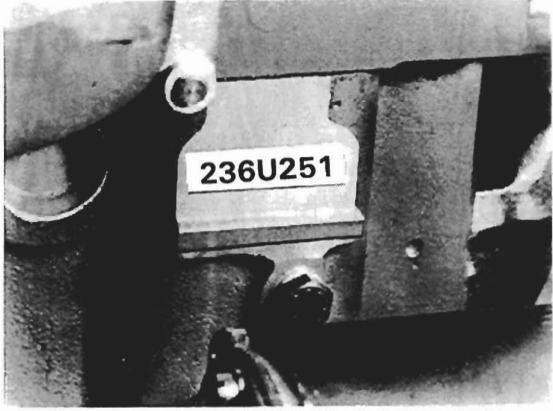

Engine Number Location (Earlier 4.248, Phase II 4.236 and 4.212 engines)

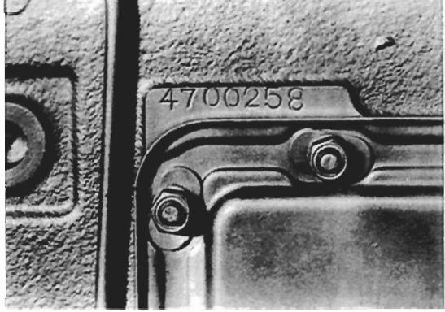

Engine Number Location  $(4.236$  Phase | Type)

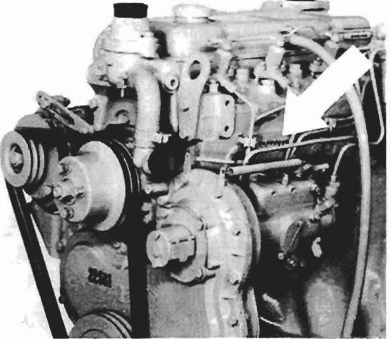

**Engine Number Location** (Current Engines)

{4}------------------------------------------------

## **FOREWORD**

This Workshop Manual has been compiled for use in conjunction with normal workshop practice. Mention of certain accepted practices. therefore, has been purposely omitted in order to avoid repetition.

Reference to renewing joints and cleaning off joint faces, has to a great extent been omitted from the text, it being understood that this will be carried out where applicable.

Similarly, it is understood that in reassembly and inspection, all parts are to be thoroughly cleaned, and where present, burrs and scale are to be removed.

It follows that any open ports of high precision components, e.g. fuel injection equipment, exposed by dismantling, will be blanked off until reassembled, to prevent the ingress of foreign matter.

To give improved sealing, later engines are built with controlled swell type joints which are fitted dry.

When fitting setscrews into "through" holes into the interior of the engine, a suitable sealant should be used.

Note: Some setscrews may already have sealant coated threads. These can be identified by the colour of the threads which will be red or blue etc.

Engines built for Massey Ferguson applications are designated A4.248, A4.236, AT4.236 and A4.212. Where information specific to these engines is referred to, the appropriate engine designation is given, otherwise the information is the same as listed under standard engine types.

For T4.38 engines, the information given will apply as for T4.236 engines, unless otherwise stated.

Throughout this manual, whenever the "left" or right" hand side of the engine is referred to, it is that side of the engine when viewed from the flywheel end.

Most of the general information which is included in the multi-lingual 4.236 Series Users Handbooks has not been repeated in this workshop manual and the two publications should be used together.

Read and remember the "Safety precautions". They are given for your protection and must be used at all times.

{5}------------------------------------------------

### **SAFETY PRECAUTIONS**

I THESE SAFETY PRECAUTIONS ARE IMPORTANT. You must refer also to the local regulations in the country of use. Some items only apply to specific applications.

• Only use these engines in the type of application for which they have been designed.

• Do not change the specification of the engine.

• Do not smoke when you put fuel in the tank.

• Clean away fuel which has been spilt. Material which has been contaminated by fuel must be moved to a safe place.

• Do not put fuel in the tank while the engine runs (unless it is absolutely necessary).

• Do not/clean, add lubricating oil, or adjust the engine while it runs (unless you have the correct training; even then extreme caution must be used to prevent injury).

• Do not make adjustments that you do not understand.

• Ensure that the engine does not run in a location where it can cause a concentration of toxic emissions.

• Other persons must be kept at a safe distance while the engine, or equipment, is in operation.

. Do not permit loose clothing or long hair near moving parts.

• Keep away from moving parts during engine operation. Attention: Some moving parts cannot be seen clearly while the engine runs.

• Do not operate the engine if a safety quard has been removed.

• Do not remove the filler cap of the cooling system while the engine is hot and while the coolant is under pressure, because dangerous hot coolant can be discharged.

• Do not use salt water or any other coolant which can cause corrosion in the closed coolant circuit.

. Do not allow sparks or fire near the batteries (especially when the batteries are on charge) because the gases from the electrolyte are highly flammable. The battery fluid is dangerous to the skin and especially to the eyes.

## **Asbestos Joints**

Some joints and gaskets contain compressed asbestos fibres in a rubber compound or in a metal outer cover. The "white" asbestos (Chrysotile) which is used is a safer type of asbestos and the risk of damage to health is extremely small.

The risk of asbestos from joints occurs at their edges or if a joint is damaged when a component is removed or if a joint is removed by abrasion.

To ensure that the risk is kept to a minimum, the procedures given below must be applied when an engine which has asbestos joints is dismantled or assembled.

- Work in an area with good ventilation.
- Do not smoke.  $\bullet$
- Use a hand scraper to remove the joints do not use a rotary wire brush.  $\bullet$
- Ensure that the joint to be removed is wet with oil or water to contain loose particles.
- Spray all loose asbestos debris with water and put it in a closed container which can be sealed for safe disposal.

4.236 Series Workshop Manual, January 1993.

• Disconnect the battery terminals before a repair is made to the electrical system.

 $\bullet$ Only one person must control the engine.

• Ensure that the engine is operated only from the control panel or from the operator's position.

• If your skin comes into contact with high-pressure fuel, obtain medical assistance immediately.

· Diesel fuel and lubricating oil (especially used lubricating oil) can damage the skin of certain persons. Protect your hands with gloves or a special solution to protect the skin.

• Do not wear clothing which is contaminated by lubricating oil. Do not put material which is contaminated with oil into the pockets.

• Discard used lubricating oil in a safe place to prevent contamination.

• Do not move mobile equipment if the brakes are not in good condition.

• Ensure that the control level of the transmission drive is in the "out-of-drive" position before the engine is started.

• Use extreme care if emergency repairs must be made at sea or in adverse conditions.

• The combustible material of some components of the engine (for example certain seals) can become extremely dangerous if it is burned. Never allow this burnt material to come into contact with the skin or with the eves.

• Read and use the instructions relevant to asbestos joints given on this page.

• Fit only genuine Perkins parts.

{6}------------------------------------------------

{7}------------------------------------------------

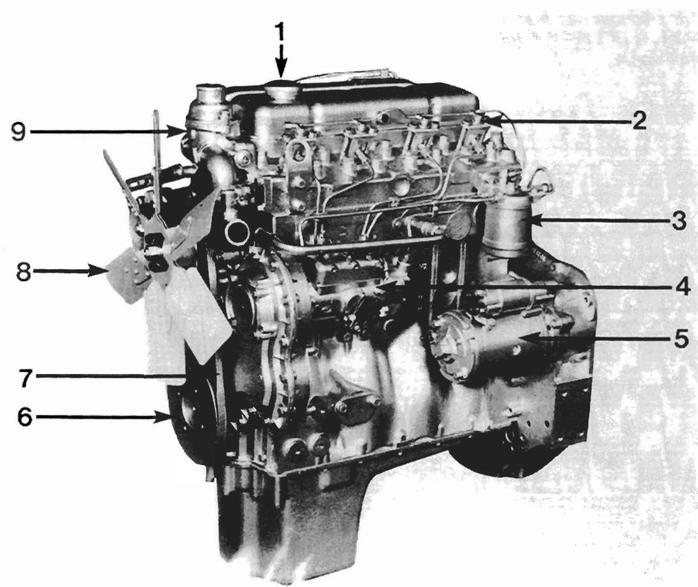

A1

#### VIEW OF FUEL PUMP SIDE OF T4.236 ENGINE

- 1. Lubricating Oil Filler Cap
- 2. Atomiser
- 3. Fuel Filter
- 4. Fuel Injection Pump
- 
- 5. Starter Motor 6. Crankshaft Pulley 7. Fan Belt
- 
- 8. Fan
- 9. Thermostat Housing

{8}------------------------------------------------

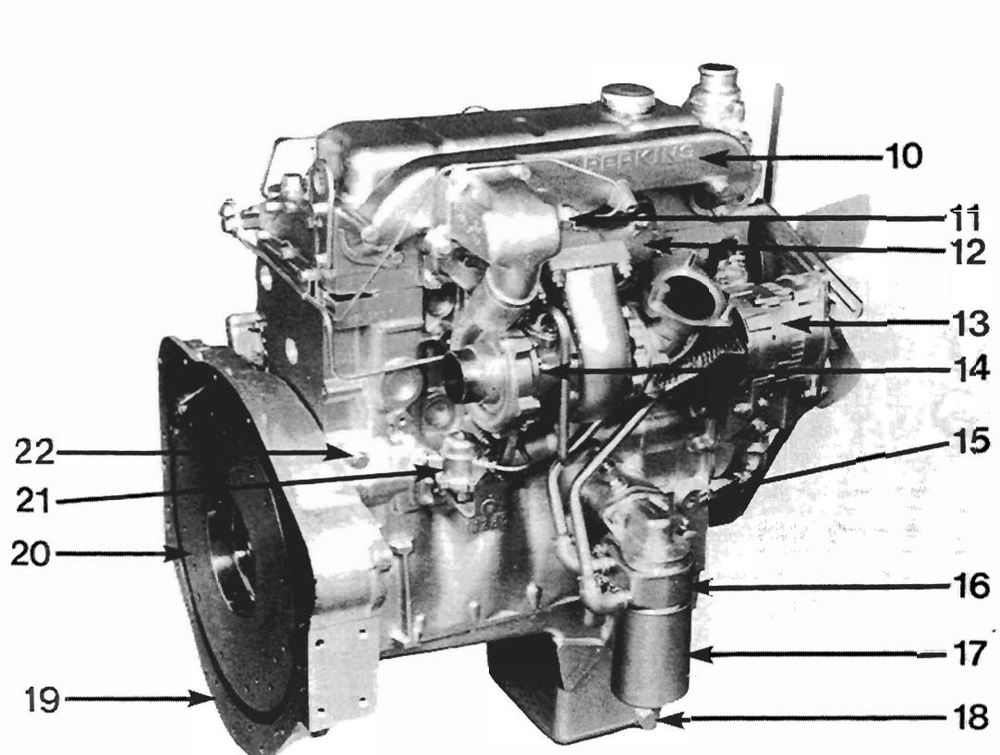

 $A2$ 

#### VIEW OF CAMSHAFT SIDE OF T4.236 ENGINE

- 10. Induction Manifold
- 11. Thermostart
- 12. Exhaust Manifold
- 13. Alternator
- 14. Turbocharger
- 15. Lubricating Oil Dipstick
- 16. Lubricating Oil Cooler
- 
- 17. Lubricating Oil Filter 18. Lubricating Oil Sump Drain Plug
- 19. Flywheel Housing
- 20. Flywheel
- 21. Fuel Lift Pump
- 22. Cylinder Block Drain Plug

{9}------------------------------------------------

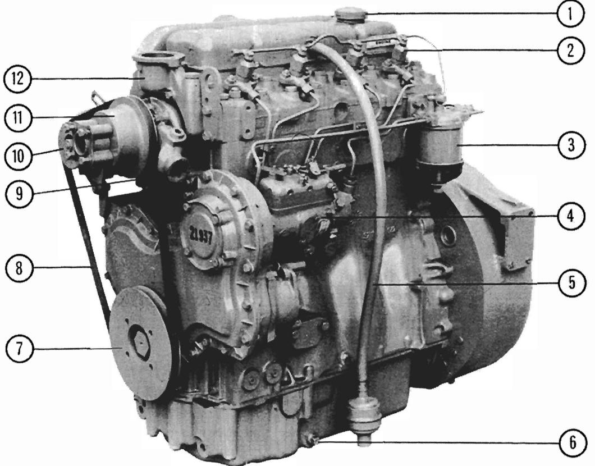

 $A3$ 

#### VIEW OF FUEL PUMP SIDE OF 4.248, 4.236 AND 4.212 ENGINES

- 1. Lubricating Oil Filler Cap
- 2. Atomiser
- 3. Fuel Filter
- 4. Fuel Injection Pump
- 5. Breather Pipe
- 6. Sump Drain Plug
- 7. Crankshaft Pulley
- 8. Fan Belt
- 9. Water Inlet
- 10. Alternator Pulley
- 11. Water Pump Pulley
- 12. Thermostat Housing

 $\mathbf{v}_k$ 

{10}------------------------------------------------

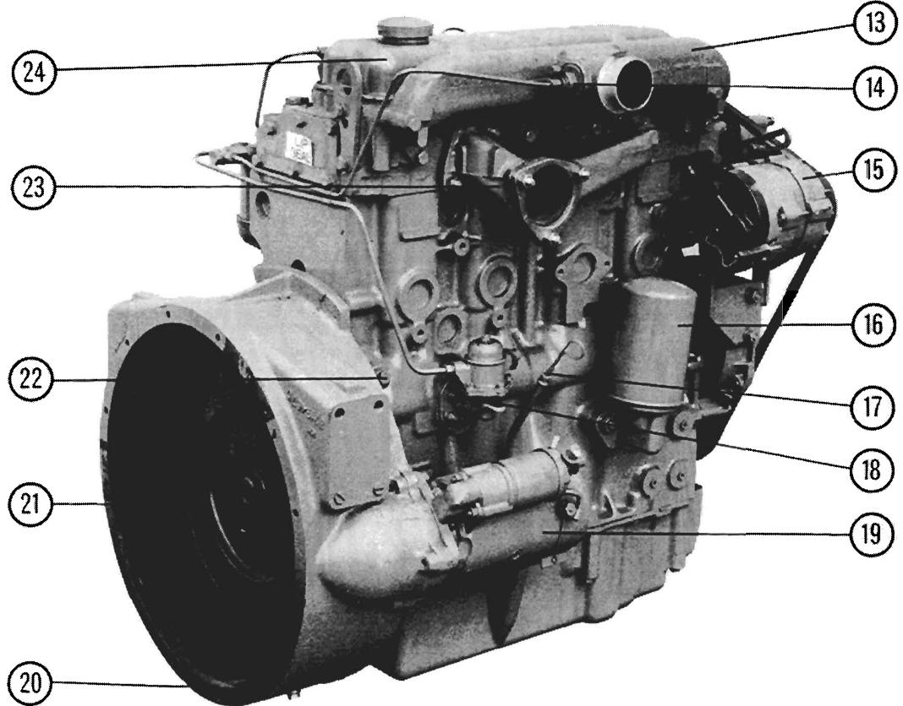

A4

#### VIEW OF CAMSHAFT SIDE OF 4.248, 4.236 AND 4.212 ENGINES

- 13. Induction Manifold
- 14. Thermostart
- 15. Alternator
- 16. Lubricating Oil Filter
- 
- 17. Dipstick 18. Fuel Lift Pump
- 19. Starter Motor
- 20. Flywheel Housing
- 21. Flywheel
- 22. Cylinder Block Drain Plug (Right Hand Side)
- 
- 23. Exhaust Manifold 24. Cylinder Head Cover

{11}------------------------------------------------

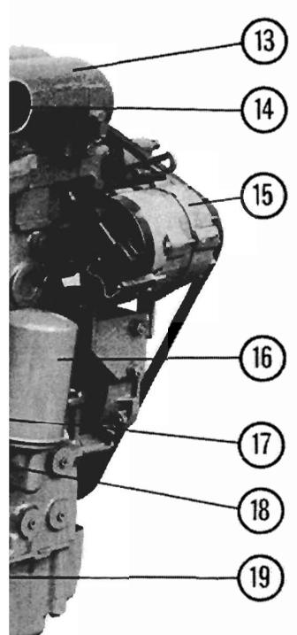

{12}------------------------------------------------

# **SECTION B Technical data**

| Nominal Bore (4.2482 and 4.248)                          | $\cdots$             | $\cdots$                        | 3.975 in $(100,96 \text{ mm})$ *                                              |
|----------------------------------------------------------|----------------------|---------------------------------|------------------------------------------------------------------------------------------|
| Nominal Bore (T4.236, 4.236 and 4.212)                   | $\cdots$             | $\cdots$                        | 3.875 in $(98, 43 \text{ mm})$ *                                                         |
| Stroke (4.2482, 4.248, T4.236 and 4.236)                 | $\cdots$             | $\cdots$                        | 5 in (127 mm)                                                                            |
| Stroke (4.212) $\ldots$ $\cdots$                   | $\cdots$             | $\cdots$                        | 4.5 in $(114.3 \text{ mm})$                                                              |
| No. of Cylinders          . $\cdots$                  | $\cdots$             | $\cdots$                        | Four                                                                                     |
| Cubic Capacity (4.2482 and 4.248)                        | $\cdots$             | $\cdots$                        | $248$ in 3 (4,06 litres)                                                      |
| Cubic Capacity (T4.236 and 4.236)                        | $\cdots$             | $\cdots$                        | 236 in 3 (3,86 litres)                                                        |
| Cubic Capacity (4.212) $\cdots$                       | $\cdots$             | $\cdots$                        | 212 in 3 (3,47) litres)                                                       |
| Compression Ratio (4.2482)                               | $\cdots$             | $\cdots$                        | 18:1                                                                                     |
| Compression Ratio (4.236 and 4.248)                      | $\cdots$             | $\cdots$                        | 16:1                                                                                     |
| Compression Ratio (T4.236)                               | $\cdots$             | $\cdots$                        | 15.5:1                                                                                   |
| Compression Ratio (4.212 - HC Piston                     |                      |                                 |                                                                                          |
| with 3 rings) $\sim$ $\sim$ $\sim$ $\sim$ $\cdots$ | $\cdots$             |                                 | 17.5:1                                                                                   |
| Compression Ratio (A4.212 - LC Piston                    |                      |                                 |                                                                                          |
| with $4$ rings) $\cdots$ $\cdots$                  | $\cdots$             | $\cdots$                        | 15.5:1                                                                                   |
| Direction of Engine Rotation $\cdots$                 | $\cdots$             | $\cdots$                        | Clockwise from the Front                                                                 |
| Firing Order $\cdots$ $\cdots$ $\cdots$         | $\cdots$             | $\cdots$                        | 1, 3, 4, 2                                                                               |
| Cycle $\cdots$ $\cdots$                            | $\sim$               | <b>State Street</b>             | Four-Stroke                                                                              |
| Combustion System $\sim$                              |                      | $\sim$                          | Direct Injection                                                                         |
| Lubricating Oil Pressure $\cdots$                     | $\ddot{\phantom{a}}$ | $\cdot$                         | Minimum 30 lbf/in 2 (2,1 kgf/cm 2 ) 207 kN/m 2 at rated |
|                                                          |                      | $\overline{r}$ . $\overline{r}$ | .                                                                                        |

engine speed and normal working temperature. For T4.236 engines: fitted with piston cooling jets, 37 lbf/in3 (2,6 kgf/cm3)  $\frac{1}{255}$  kN/m2.

\*Nominal -- for actual bore size, see pages B.3 and B.4.

On A4.212 engines, the HC piston with 3 rings was fitted to MF engines from Nos. 212UA87001 to 212UA147672.

#### **Details of Maximum Gross Ratings**

#### 4.2482 Engines

| 278 Nm (201 lbf ft) at 1,400 rev/min Maximum Torque . . . . 54 kW (72.5 bhp) at 2,600 rev/min Heavy Duty $\cdots$ . . . . 238 Nm (176 lbf ft) at 1,400 rev/min Maximum Torque . . . . 4.248 Engines 62 kW (84 bhp) at 2500 rev/min General Agricultural and Industrial $\cdots$ $\cdots$ 263 Nm (194 lbf ft) at 1400 rev/min Maximum Torque $\cdots$ $\cdots$ $\cdots$ $\cdots$ 59 kW (80 bhp) at 2200 rev/min Heavy Duty Agricultural and Industrial $\cdots$ 285 Nm (210 lbf ft) at 1400 rev/min Maximum Torque . . $\cdots$ $\cdot$ $\cdot$ T4.236 Engines 76 kw (102 bhp) at 2,600 rev/min General $\cdots$ . $\cdots$ $\cdots$ $\cdots$ 340 Nm (250 lbf ft) at 1,600 rev/min Maximum Torque . $\cdots$ $\cdots$ . 67 kW (90 bhp) at 2,500 rev/min i Heavy Duty $\cdots$ $\cdots$ $\cdots$ . . 330 Nm (243 lbf ft) at 1,400 rev/min Maximum Torque $\ldots$ $\cdots$ $\cdots$ $\cdots$ T4.38 Engines 69,5 kW (93 bhp) at 2,600 rev/min Vehicle . . . . 296 Nm (218 lbf ft) at 1600 rev/min Maximum Torque . . . . 4.236 Engines Vehicle 61 kW (82 bhp) at 2800 rev/min $\cdots$ . . . . 256 Nm (194 lbf ft) at 1450 rev/min Maximum Torque $\cdots$ . . $\cdots$ General Agricultural and Industrial 60 kW (81 bhp at 2600 rev/min $\sim$ $\ddot{\phantom{0}}$ 267 Nm (197 lbf ft) at 1350 rev/min Maximum Torque .  . $\cdots$ Heavy Duty Agricultural and Industrial 54 kW (72 bhp) at 2200 rev/min $\cdots$ $\sim$ 272 Nm (201 lbf ft) at 1400 rev/min Maximum Torque $\cdots$  $\cdots$ . 4.212 Engines 46 kW (62 bhp) at 2200 rev/min Agricultural $\cdots$ . . $\cdots$ $\cdots$ 229 Nm (169 lbf ft) at 1350 rev/min Maximum Torque . . $\cdots$ $\cdots$ All the above ratings are maximum and can vary according to application. | General | $\cdots$ | . | . | . | . | 60 kW (80 bhp) at 2,600 rev/min |
|------------------------------------------------------------------------------------------------------------------------------------------------------------------------------------------------------------------------------------------------------------------------------------------------------------------------------------------------------------------------------------------------------------------------------------------------------------------------------------------------------------------------------------------------------------------------------------------------------------------------------------------------------------------------------------------------------------------------------------------------------------------------------------------------------------------------------------------------------------------------------------------------------------------------------------------------------------------------------------------------------------------------------------------------------------------------------------------------------------------------------------------------------------------------------------------------------------------------------------------------------------------------------------------------------------------------------------------------------------------------------------------------------------------------------------------------------------------------------------------------------------------------------------------------------------------------------------------------------------------------------------------------------------------------------------------------------------------------------------------------------------------------------------------------------------------------------------------------------------------------------------------------------------------------------------------------------------------------------------------------------------------------------------------------------------------------------------------------------------------------------------------------------|---------|----------|---|---|---|---|---------------------------------|
|                                                                                                                                                                                                                                                                                                                                                                                                                                                                                                                                                                                                                                                                                                                                                                                                                                                                                                                                                                                                                                                                                                                                                                                                                                                                                                                                                                                                                                                                                                                                                                                                                                                                                                                                                                                                                                                                                                                                                                                                                                                                                                                                                      |         |          |   |   |   |   |                                 |
|                                                                                                                                                                                                                                                                                                                                                                                                                                                                                                                                                                                                                                                                                                                                                                                                                                                                                                                                                                                                                                                                                                                                                                                                                                                                                                                                                                                                                                                                                                                                                                                                                                                                                                                                                                                                                                                                                                                                                                                                                                                                                                                                                      |         |          |   |   |   |   |                                 |
|                                                                                                                                                                                                                                                                                                                                                                                                                                                                                                                                                                                                                                                                                                                                                                                                                                                                                                                                                                                                                                                                                                                                                                                                                                                                                                                                                                                                                                                                                                                                                                                                                                                                                                                                                                                                                                                                                                                                                                                                                                                                                                                                                      |         |          |   |   |   |   |                                 |
|                                                                                                                                                                                                                                                                                                                                                                                                                                                                                                                                                                                                                                                                                                                                                                                                                                                                                                                                                                                                                                                                                                                                                                                                                                                                                                                                                                                                                                                                                                                                                                                                                                                                                                                                                                                                                                                                                                                                                                                                                                                                                                                                                      |         |          |   |   |   |   |                                 |
|                                                                                                                                                                                                                                                                                                                                                                                                                                                                                                                                                                                                                                                                                                                                                                                                                                                                                                                                                                                                                                                                                                                                                                                                                                                                                                                                                                                                                                                                                                                                                                                                                                                                                                                                                                                                                                                                                                                                                                                                                                                                                                                                                      |         |          |   |   |   |   |                                 |
|                                                                                                                                                                                                                                                                                                                                                                                                                                                                                                                                                                                                                                                                                                                                                                                                                                                                                                                                                                                                                                                                                                                                                                                                                                                                                                                                                                                                                                                                                                                                                                                                                                                                                                                                                                                                                                                                                                                                                                                                                                                                                                                                                      |         |          |   |   |   |   |                                 |
|                                                                                                                                                                                                                                                                                                                                                                                                                                                                                                                                                                                                                                                                                                                                                                                                                                                                                                                                                                                                                                                                                                                                                                                                                                                                                                                                                                                                                                                                                                                                                                                                                                                                                                                                                                                                                                                                                                                                                                                                                                                                                                                                                      |         |          |   |   |   |   |                                 |
|                                                                                                                                                                                                                                                                                                                                                                                                                                                                                                                                                                                                                                                                                                                                                                                                                                                                                                                                                                                                                                                                                                                                                                                                                                                                                                                                                                                                                                                                                                                                                                                                                                                                                                                                                                                                                                                                                                                                                                                                                                                                                                                                                      |         |          |   |   |   |   |                                 |
|                                                                                                                                                                                                                                                                                                                                                                                                                                                                                                                                                                                                                                                                                                                                                                                                                                                                                                                                                                                                                                                                                                                                                                                                                                                                                                                                                                                                                                                                                                                                                                                                                                                                                                                                                                                                                                                                                                                                                                                                                                                                                                                                                      |         |          |   |   |   |   |                                 |
|                                                                                                                                                                                                                                                                                                                                                                                                                                                                                                                                                                                                                                                                                                                                                                                                                                                                                                                                                                                                                                                                                                                                                                                                                                                                                                                                                                                                                                                                                                                                                                                                                                                                                                                                                                                                                                                                                                                                                                                                                                                                                                                                                      |         |          |   |   |   |   |                                 |
|                                                                                                                                                                                                                                                                                                                                                                                                                                                                                                                                                                                                                                                                                                                                                                                                                                                                                                                                                                                                                                                                                                                                                                                                                                                                                                                                                                                                                                                                                                                                                                                                                                                                                                                                                                                                                                                                                                                                                                                                                                                                                                                                                      |         |          |   |   |   |   |                                 |
|                                                                                                                                                                                                                                                                                                                                                                                                                                                                                                                                                                                                                                                                                                                                                                                                                                                                                                                                                                                                                                                                                                                                                                                                                                                                                                                                                                                                                                                                                                                                                                                                                                                                                                                                                                                                                                                                                                                                                                                                                                                                                                                                                      |         |          |   |   |   |   |                                 |
|                                                                                                                                                                                                                                                                                                                                                                                                                                                                                                                                                                                                                                                                                                                                                                                                                                                                                                                                                                                                                                                                                                                                                                                                                                                                                                                                                                                                                                                                                                                                                                                                                                                                                                                                                                                                                                                                                                                                                                                                                                                                                                                                                      |         |          |   |   |   |   |                                 |
|                                                                                                                                                                                                                                                                                                                                                                                                                                                                                                                                                                                                                                                                                                                                                                                                                                                                                                                                                                                                                                                                                                                                                                                                                                                                                                                                                                                                                                                                                                                                                                                                                                                                                                                                                                                                                                                                                                                                                                                                                                                                                                                                                      |         |          |   |   |   |   |                                 |
|                                                                                                                                                                                                                                                                                                                                                                                                                                                                                                                                                                                                                                                                                                                                                                                                                                                                                                                                                                                                                                                                                                                                                                                                                                                                                                                                                                                                                                                                                                                                                                                                                                                                                                                                                                                                                                                                                                                                                                                                                                                                                                                                                      |         |          |   |   |   |   |                                 |
|                                                                                                                                                                                                                                                                                                                                                                                                                                                                                                                                                                                                                                                                                                                                                                                                                                                                                                                                                                                                                                                                                                                                                                                                                                                                                                                                                                                                                                                                                                                                                                                                                                                                                                                                                                                                                                                                                                                                                                                                                                                                                                                                                      |         |          |   |   |   |   |                                 |
|                                                                                                                                                                                                                                                                                                                                                                                                                                                                                                                                                                                                                                                                                                                                                                                                                                                                                                                                                                                                                                                                                                                                                                                                                                                                                                                                                                                                                                                                                                                                                                                                                                                                                                                                                                                                                                                                                                                                                                                                                                                                                                                                                      |         |          |   |   |   |   |                                 |
|                                                                                                                                                                                                                                                                                                                                                                                                                                                                                                                                                                                                                                                                                                                                                                                                                                                                                                                                                                                                                                                                                                                                                                                                                                                                                                                                                                                                                                                                                                                                                                                                                                                                                                                                                                                                                                                                                                                                                                                                                                                                                                                                                      |         |          |   |   |   |   |                                 |
|                                                                                                                                                                                                                                                                                                                                                                                                                                                                                                                                                                                                                                                                                                                                                                                                                                                                                                                                                                                                                                                                                                                                                                                                                                                                                                                                                                                                                                                                                                                                                                                                                                                                                                                                                                                                                                                                                                                                                                                                                                                                                                                                                      |         |          |   |   |   |   |                                 |
|                                                                                                                                                                                                                                                                                                                                                                                                                                                                                                                                                                                                                                                                                                                                                                                                                                                                                                                                                                                                                                                                                                                                                                                                                                                                                                                                                                                                                                                                                                                                                                                                                                                                                                                                                                                                                                                                                                                                                                                                                                                                                                                                                      |         |          |   |   |   |   |                                 |
|                                                                                                                                                                                                                                                                                                                                                                                                                                                                                                                                                                                                                                                                                                                                                                                                                                                                                                                                                                                                                                                                                                                                                                                                                                                                                                                                                                                                                                                                                                                                                                                                                                                                                                                                                                                                                                                                                                                                                                                                                                                                                                                                                      |         |          |   |   |   |   |                                 |
|                                                                                                                                                                                                                                                                                                                                                                                                                                                                                                                                                                                                                                                                                                                                                                                                                                                                                                                                                                                                                                                                                                                                                                                                                                                                                                                                                                                                                                                                                                                                                                                                                                                                                                                                                                                                                                                                                                                                                                                                                                                                                                                                                      |         |          |   |   |   |   |                                 |
|                                                                                                                                                                                                                                                                                                                                                                                                                                                                                                                                                                                                                                                                                                                                                                                                                                                                                                                                                                                                                                                                                                                                                                                                                                                                                                                                                                                                                                                                                                                                                                                                                                                                                                                                                                                                                                                                                                                                                                                                                                                                                                                                                      |         |          |   |   |   |   |                                 |
|                                                                                                                                                                                                                                                                                                                                                                                                                                                                                                                                                                                                                                                                                                                                                                                                                                                                                                                                                                                                                                                                                                                                                                                                                                                                                                                                                                                                                                                                                                                                                                                                                                                                                                                                                                                                                                                                                                                                                                                                                                                                                                                                                      |         |          |   |   |   |   |                                 |
|                                                                                                                                                                                                                                                                                                                                                                                                                                                                                                                                                                                                                                                                                                                                                                                                                                                                                                                                                                                                                                                                                                                                                                                                                                                                                                                                                                                                                                                                                                                                                                                                                                                                                                                                                                                                                                                                                                                                                                                                                                                                                                                                                      |         |          |   |   |   |   |                                 |
|                                                                                                                                                                                                                                                                                                                                                                                                                                                                                                                                                                                                                                                                                                                                                                                                                                                                                                                                                                                                                                                                                                                                                                                                                                                                                                                                                                                                                                                                                                                                                                                                                                                                                                                                                                                                                                                                                                                                                                                                                                                                                                                                                      |         |          |   |   |   |   |                                 |
|                                                                                                                                                                                                                                                                                                                                                                                                                                                                                                                                                                                                                                                                                                                                                                                                                                                                                                                                                                                                                                                                                                                                                                                                                                                                                                                                                                                                                                                                                                                                                                                                                                                                                                                                                                                                                                                                                                                                                                                                                                                                                                                                                      |         |          |   |   |   |   |                                 |
|                                                                                                                                                                                                                                                                                                                                                                                                                                                                                                                                                                                                                                                                                                                                                                                                                                                                                                                                                                                                                                                                                                                                                                                                                                                                                                                                                                                                                                                                                                                                                                                                                                                                                                                                                                                                                                                                                                                                                                                                                                                                                                                                                      |         |          |   |   |   |   |                                 |
|                                                                                                                                                                                                                                                                                                                                                                                                                                                                                                                                                                                                                                                                                                                                                                                                                                                                                                                                                                                                                                                                                                                                                                                                                                                                                                                                                                                                                                                                                                                                                                                                                                                                                                                                                                                                                                                                                                                                                                                                                                                                                                                                                      |         |          |   |   |   |   |                                 |
|                                                                                                                                                                                                                                                                                                                                                                                                                                                                                                                                                                                                                                                                                                                                                                                                                                                                                                                                                                                                                                                                                                                                                                                                                                                                                                                                                                                                                                                                                                                                                                                                                                                                                                                                                                                                                                                                                                                                                                                                                                                                                                                                                      |         |          |   |   |   |   |                                 |

For details of individual ratings, apply to your nearest Perkins Distributor.

{13}------------------------------------------------

#### **Recommended Torque Tensions**

The following figures will apply with the components lightly oiled before assembly.

|                                                      | All engines except T4.236 (hot or cold)                                                                  |           |                      |                      |                                                                   |                                                       |                                          |
|------------------------------------------------------|----------------------------------------------------------------------------------------------------------|-----------|----------------------|----------------------|-------------------------------------------------------------------|-------------------------------------------------------|------------------------------------------|
|                                                      | Cylinder Head Nuts/Setscrews (1/2 in)                                                                    |           |                      |                      | 100 lbf ft (13,8 kgf m) - 136 Nm                                  |                                                       |                                          |
|                                                      |                                                                                                          |           |                      |                      |                                                                   |                                                       |                                          |
|                                                      | Cylinder Head Nuts $(X_6$ in early 4.236 engines) Cylinder Head Nuts/Setscrews (1/2 in) (T4.236 cold) |           |                      | $\cdots$ $\cdots$ | 60 lbf ft (8,3 kgf m) — 81 Nm 100 lbf ft (13,8 kgf m) - 136 Nm |                                                       |                                          |
|                                                      | Cylinder Head Setscrews (1/2 in) with Integral Head                                                      |           |                      |                      |                                                                   |                                                       |                                          |
|                                                      | Washer (cold) $\cdots$                                                                                | .         | .                    |                      | 88 lbf ft (11,8 kgf m) $-$ 120 Nm                                 |                                                       |                                          |
|                                                      | Connecting Rod Nuts* - Cadmium                                                                           | $\cdots$  | $\cdots$             | . $\cdots$        | 70 lbf ft (9,7 kgf m) – 95 Nm                                     |                                                       |                                          |
|                                                      | Connecting Rod Nuts* - Phosphated                                                                        | $\cdots$  | $\cdots$             | $\cdots$             | 90 lbf ft (12,4 kgf m) - 122 Nm                                   |                                                       |                                          |
|                                                      |                                                                                                          |           |                      |                      |                                                                   |                                                       |                                          |
|                                                      | Connecting Rod Nutst                                                                                     |           |                      |                      |                                                                   |                                                       |                                          |
|                                                      | Cadmium Plated (silver finish)                                                                           |           | .                    | $\cdots$             | 75 lbf ft (10,4 kgf m) — 102 Nm                                   |                                                       |                                          |
|                                                      | Phosphated (black finish)                                                                                | .         | .                    | $\cdots$             | 95 lbf ft (13,2 kgf m) — 129 Nm                                   |                                                       |                                          |
|                                                      | Main Bearing Setscrews**                                                                                 | .         |                      |                      | 150 lbf ft (20,7 kgf m) — 203 Nm                                  |                                                       |                                          |
|                                                      | Main Bearing Setscrews††                                                                                 | $\cdots$  | .                    | .                    | 180 lbf ft (24,9 kgf m) — 244 Nm                                  |                                                       |                                          |
|                                                      | Idler Gear Hub Setscrews                                                                                 | $\ldots$  | .                    |                      | 30 lbf ft (4,1 kgf m) — 41 Nm                                     |                                                       |                                          |
|                                                      | Fuel Injection Pump Gear Retaining Setscrews (3)                                                         |           |                      | $\cdots$             | 20 lbf ft (2,8 kgf m) – 27 Nm                                     |                                                       |                                          |
|                                                      | D.P.S. Fuel Injection Pump Gear Retaining Nut                                                            |           |                      |                      | 60 lbf ft (8,3 kgf m) - 81 Nm                                     |                                                       |                                          |
| <b>Flywheel Setscrews</b>                            | .                                                                                                        |           |                      | $\cdots$             | 80 lbf ft (11 kgf m) — 108 Nm                                     |                                                       |                                          |
| Flywheel Place Bolts                                 | $\cdots$                                                                                                 | $\ddotsc$ |                      | .                    | 90 lbf ft (12,4 kgf m) — 122 Nm                                   |                                                       |                                          |
|                                                      | I Flywheel Housing Setscrews 3/8 UNF (Standard)                                                          |           |                      | $\ddotsc$            | 36 lbf ft (5,0 kgf m) – 49 Nm                                     |                                                       |                                          |
|                                                      | Flywheel Housing Setscrews 3/8 UNF (Durlock)                                                             |           |                      | $\cdots$             | 67 lbf ft (9,3 kgf m) – 91 Nm                                     |                                                       |                                          |
|                                                      | Flywheel Housing Setscrews 3/8 UNF (4.2482 engines)                                                      |           |                      | $\cdot$              | 42 lbf ft (5,7 kgf m) – 57 Nm                                     |                                                       |                                          |
|                                                      | Camshaft Gear Retaining Setscrews                                                                        |           | $\cdots$             | .                    | 50 lbf it (6,9 kgf m) --- 68 Nm                                   |                                                       |                                          |
|                                                      | Crankshaft Pulley Retaining Setscrew (1)                                                                 |           |                      |                      |                                                                   |                                                       |                                          |
|                                                      | 1.67 in $(42,4 \text{ mm})$ A/F                                                                          |           | .                    |                      | 300 lbf ft (42 kgf m) — 406 Nm                                    |                                                       |                                          |
|                                                      | Crankshaft Pulley Retaining Setscrew (1)                                                                 |           |                      |                      |                                                                   |                                                       |                                          |
|                                                      | 1.5 in $(38,1 \text{ mm})$ A/F                                                                           |           |                      |                      |                                                                   |                                                       |                                          |
|                                                      | Cadmium Plated (silver finish)                                                                           |           | $\cdots$             | .                    | 240 lbf ft (33kgf m) — 325 Nm                                     |                                                       |                                          |
|                                                      | Phosphated (black finish)                                                                                |           | .                    | .                    | 285 lbf ft (39 kgf m) — 390 Nm                                    |                                                       |                                          |
|                                                      | Crankshaft Pulley Retaining Setscews (3)                                                                 |           |                      |                      |                                                                   |                                                       |                                          |
|                                                      | Lub. Oil Filter Setscrews/Nuts                                                                           |           |                      |                      | 70 lbf ft (9,7 kgf m) – 95 Nm                                     |                                                       |                                          |
|                                                      | <b>Atomiser Securing Nuts</b>                                                                            |           |                      |                      | 30 lbf ft (4,2 kgf m) - 41 Nm                                     |                                                       |                                          |
|                                                      |                                                                                                          |           |                      |                      | 14 lbf ft (1,9 kgf m) - 18 Nm                                     |                                                       |                                          |
| Atomiser Clamp Nuts                                  |                                                                                                          |           | .                    | .                    | 9 lbf ft $(1,2 \text{ kgf m}) - 12 \text{ Nm}$                    |                                                       |                                          |
|                                                      | Rockershaft Support Brackets (Aluminium)                                                                 |           |                      |                      | 30 lbf ft (4.1 kgf m) - 41 Nm                                     |                                                       |                                          |
|                                                      | Rockershaft Support Brackets (Cast Iron)                                                                 |           |                      |                      | 54 lbf ft (7,4 kgf m) - 74 Nm                                     |                                                       |                                          |
|                                                      | High Pressure Fuel Pipe Nuts                                                                             |           | .                    | .                    | 15 lbf ft (2,1 kgf m) - 20 Nm                                     |                                                       |                                          |
|                                                      | Dynamo Pulley Retaining Nut                                                                              | $\cdots$  | .                    | $\cdots$             | 20 lbf ft (2,8 kgf m) — 27 Nm                                     |                                                       |                                          |
|                                                      | Alternator Pulley Retaining Nut ( $\frac{1}{4}$ in)                                                      |           | $\ddot{\phantom{a}}$ | $\cdots$             | 30 lbf ft (4,1 kgf m) — 41 Nm                                     |                                                       |                                          |
|                                                      | Alternator Pulley Retaining Nut $(X_6$ in)                                                               |           | $\cdots$             | .                    | 30 lbf ft (4,1 kgf m) — 41 Nm                                     |                                                       |                                          |
|                                                      | Alternator Pulley Retaining Nut (§ in)                                                                   |           | $\cdots$             | .                    | 42 lbf ft (5,8 kgf m) --- 57 Nm                                   |                                                       |                                          |
|                                                      | Alternator Pulley Retaining Nut (M27)                                                                    |           | .                    | .                    | 44 lbf ft (6,1 kgf m) – 60 Nm                                     |                                                       |                                          |
|                                                      | <b>Balancer Retaining Setscrews</b>                                                                      | $\cdots$  | $\cdots$             | $\cdots$             | 40 lbf ft (5,6 kgf m) - 50 Nm                                     |                                                       |                                          |
|                                                      | Thermostart with Adaptor                                                                                 | $\cdots$  | $\cdots$             | .                    | 10 lbf ft (1,4 kgf m) — 13 Nm                                     |                                                       |                                          |
|                                                      | Piston Cooling valve assembly (T4.236)                                                                   |           |                      |                      | 20 lbf ft (2,8 kgf m) - 27 Nm                                     |                                                       |                                          |
| *For engines preceding the following Engine Nos:     |                                                                                                          |           |                      |                      | **For engines preceding the following Engine Nos:                 |                                                       |                                          |
| †For engines commencing at the following Engine Nos: |                                                                                                          |           |                      |                      |                                                                   | ††For engines commencing at the following Engine Nos: |                                          |
| 212U901                                              | 236UA59562                                                                                               |           | 236UH262             |                      | 212U582                                                           | 236UA50507                                            | 236US12129                               |
| 212UA140419                                          | !!!!!!!!!!!!!!!!!!!!!!!!!!!!!!!!!!!!!!!!                                                                 |           | 236US16138           |                      | 212UA119095                                                       | 236UC19949                                            | !!!!!!!!!!!!!!!!!!!!!!!!!!!!!!!!!!!!!!!! |
| 212UA4393A                                           | <b>236UC22005</b>                                                                                        |           | 248U9045             |                      | 236U82408                                                         | 236UE4404                                             | 248UA58746                               |
| !!!!!!!!!!!!!!!!!!!!!!!!!!!!!!!!!!!!!!!!             | !!!!!!!!!!!!!!!!!!!!!!!!!!!!!!!!!!!!!!!!                                                                 |           | 248UA78127           |                      |                                                                   |                                                       |                                          |
|                                                      |                                                                                                          |           |                      |                      |                                                                   |                                                       |                                          |

| Note: The engine numbers shown above include a new engine number series which start LD, LF, LG, LM and LJ.

#### **SERVICE WEAR LIMITS**

The following "wear limits" indicate the condition when it is recommended that the respective items should be serviced or replaced.

| Cylinder Head Bow $\ddot{\phantom{a}}$          | $\cdots$ $\cdots$                    |                         |
|----------------------------------------------------|-----------------------------------------|-------------------------|
|                                                    | Transverse                              | $0.003$ in $(0.08$ mm)  |
|                                                    | Longitudinal                            | $0.006$ in $(0.15$ mm)  |
| Maximum Bore Wear (when reboring or new liners are |                                         |                         |
| necessary) $\cdots$                             | $\cdots$ $\cdots$ $\cdot$         | $0.008$ in $(0.2$ mm)   |
| Crankshaft Main and Big End Journal Wear. Ovality. |                                         | $0.0015$ in $(0.04$ mm) |
| Maximum Crankshaft End Float                       | $\cdots$ $\cdots$ $\cdot$ $\cdot$ | $0.015$ in $(0.38$ mm)  |
| Valve Stem to Bore/Guide Clearance                 | inlet                                   | $0.005$ in $(0.13$ mm)  |
|                                                    | exhaust                                 | $0.006$ in $(0.15$ mm)  |
|                                                    |                                         |                         |

{14}------------------------------------------------

#### **Service Wear Limits (Continued)**

| Valve Head Thickness between run-out of valve seat          |                      |          |     |  |  |  |
|-------------------------------------------------------------|----------------------|----------|-----|--|--|--|
| and face of valve $\sim$ $\sim$ $\cdots$              | .                    |          | 1/3 |  |  |  |
| Rocker Clearance on Rocker Shaft                            | $\cdots$             | $\cdots$ | 0.0 |  |  |  |
| Camshaft Journals-Ovality and Wear                          | $\ddot{\phantom{0}}$ | .        | 0.0 |  |  |  |
| Camshaft End Float $\cdot$                            | $\cdots$             | $\cdots$ | 0.0 |  |  |  |
| Idler Gear End Float . $\cdots$                       | .                    | $\cdots$ | 0.0 |  |  |  |
| Valve Head Depth below Cylinder Head Face exhaust (Earlier) |                      |          |     |  |  |  |
| Valve Head Depth below Cylinder Head Face exhaust           |                      |          |     |  |  |  |
| (Current) .                                              |                      |          | 0.0 |  |  |  |
| Valve Head Depth below Cylinder Head Face inlet $\cdots$ |                      |          |     |  |  |  |

32 in (0,79 mm) 05 in (0,13 mm) 02 in (0,05 mm) 20 in (0,51 mm) 10 in (0,25 mm) 55 in (1,40 mm) maximum

73 in (1,85 mm) maximum 61 in (1,55 mm) maximum

### **MANUFACTURING DATA & DIMENSIONS**

The following data of clearances and tolerances are given as a guide for personnel engaged upon major overhauls and the figures are those used in the factory for production purposes.

#### **Cylinder Block**

| Total Height of Cylinder Block between Top and Bottom Faces the company of the company of the company of the                                                                                                                                                                          |                           |  |
|---------------------------------------------------------------------------------------------------------------------------------------------------------------------------------------------------------------------------------------------------------------------------------------------|---------------------------|--|
| Parent Bore Dia. for Cylinder Liner (Chrome Thin Wall)                                                                                                                                                                                                                                      |                           |  |
| Parent Bore Dia, for Cylinder Liner (Chrome Thick Wall) the company of the company of the company of the company of the company of the company of the company of the company of the company of the company of the company of the company of the company of the company of the company |                           |  |
| Parent Bore Dia, for Flangeless Cylinder Liner (Cast                                                                                                                                                                                                                                        |                           |  |
| iron) the company of the company of the company of the company of the company of the company of the company of the company of the company of the company of the company of the company of the company of the company of the company                                                      | .                         |  |
| Parent Bore Dia, for Flanged Cylinder Liner (Cast Iron)                                                                                                                                                                                                                                     |                           |  |
| (T4.236, 4.236 and 4.212 earlier)                                                                                                                                                                                                                                                           | $\cdots$ $\cdots$      |  |
| Parent Bore Dia. for Flanged Cylinder Liner (Cast Iron)                                                                                                                                                                                                                                     |                           |  |
| $(4.2482$ and $4.248$ ) and later, all engines*                                                                                                                                                                                                                                             |                           |  |
| Depth of Recess for Liner Flange (Cast Iron)                                                                                                                                                                                                                                                | $\cdots$                  |  |
| Depth of Recess for Liner Flange (Chrome Thin Wall)                                                                                                                                                                                                                                         |                           |  |
| early type the contract of the contract of the contract of the contract of the contract of the contract of the contract of                                                                                                                                                               | .                         |  |
| Depth of Recess for Liner Flange (Chrome Thin Wall)                                                                                                                                                                                                                                         |                           |  |
| later type                                                                                                                                                                                                                                                                                  | .                         |  |
| Depth of Recess for Liner Flange (Chrome) Thick Wall                                                                                                                                                                                                                                        |                           |  |
| Main Bearing Parent Bore Dia.                                                                                                                                                                                                                                                               |                           |  |
| Camshaft Bore Dia. No. 1 for Bush (where fitted)                                                                                                                                                                                                                                            | $\cdot$ .                 |  |
| Camshaft Bearing Bush Internal Dia, fitted                                                                                                                                                                                                                                                  |                           |  |
| Camshaft Bore Dia, No. 1                                                                                                                                                                                                                                                                    | $\cdots$ .             |  |
| Camshaft Bore Dia, No. 2                                                                                                                                                                                                                                                                    | $\ddot{\phantom{0}}$ . |  |
| Camshaft Bore Dia, No. 3                                                                                                                                                                                                                                                                    | .                         |  |
|                                                                                                                                                                                                                                                                                             |                           |  |

17.367/17.375 in (441,12/441,33 mm) 3.9625/3.9635 in (100,65/100,67 mm)

4.0625/4.0635 in (103,19/103,22 mm)

4.0615/4.0625 in (103,16/103,19 mm)

4.0625/4.0635 in (103,19/103,22 mm)

4.1025/4.1035 in (104,20/104,23 mm) 0.150/0.154 in (3,81/3,91 mm)

0.046/0.049 in (1,17/1,25 mm)

0.049/0.051 in (1,25/1,30 mm) 0.150/0.152 in (3,81/3,86 mm) 3.166/3.167 in (80,42/80,44 mm) 2.1875/2.1887 in (55,56/55,59 mm) 2.0000/2.0017 in (50,8/50,84 mm) 2.000/2.001 in (50.80/50,83 mm) 1.990/1.9918 in (50,55/50,59 mm) 1.970/1.9718 in (50,04/50,08 mm)

\*All later cylinder blocks bored out to 4.1025/4.1035 in (104,20/104,23 mm) as standard.

#### **Cylinder Liners Cast Iron** (4.2482, 4.248, T4.236, 4.236 and 4.212 engines)

| <b>Types</b>                                                      | . .                                                 |  .    |          | .                    | Dry—Interference Fit (Production)         |
|-------------------------------------------------------------------|-----------------------------------------------------|----------|----------|----------------------|-------------------------------------------|
|                                                                   |                                                     |          |          |                      | Dry-Transition Fit (Pre-finished Service) |
| Outside Dia, of Production Liner                                  |                                                     |          |          |                      |                                           |
|                                                                   | Flangeless - 4.248, 4.236 and 4.212 engines         |          |          | .                    | 4.0660/4.0670 in (103,27/103,30 mm)       |
|                                                                   | Flanged $-4.2482$ and 4.248 engines                 |          |          | $\cdots$             | 4.1045/4.1055 in (104,25/104,28)          |
|                                                                   | Flanged - T4.236, 4.236 and 4.212 engines (earlier) |          |          |                      | 4.0645/4.0655 in (103.24/103.26 mm)       |
|                                                                   | Flanged - non-Flame Ring - all engines (later)      |          |          | $\ddot{\phantom{0}}$ | 4.1045/4.1055 in (104,25/104,28 mm)       |
| Outside Dia of Flanged Pre-Finished Service Liner                 |                                                     |          |          |                      |                                           |
|                                                                   | 4.2482 and 4.248 engines                            | $\cdots$ | $\cdots$ | .                    | 4.1025/4.1035 in (104,20/104,23 mm)       |
|                                                                   | 4.236 and $4.212$ engines $\cdots$                  |          | $\cdots$ | $\cdots$             | 4.0625/4.0635 in (103,19/103,21 mm)       |
|                                                                   | All Engines - non-Flame Ring                        |          | $\cdots$ |                      | 4.1025/4.1035 (104,20/104,23 mm)          |
| Interference Fit of Production Liner in Cylinder Block            |                                                     |          |          |                      |                                           |
|                                                                   | Flangeless $-4.248$ , 4.236 and 4.212 engines       |          |          | $\cdots$             | $0.003/0.005$ in $(0.08/0.13$ mm)         |
| Flanged - Flame Ring 4.2482 and 4.248 engines                     |                                                     |          |          |                      | 0.001/0.003 in (0,03/0,08 mm)             |
| Flanged - Flame Ring T4.236, 4.23 $\varepsilon$ and 4.212 engines |                                                     |          |          |                      | 0.0007/0.002 in (0,02/0,07 mm)            |
| Flanged - non-Flame Ring - All engines                            |                                                     |          |          | $\cdots$             | 0.001/0.003 in (0,03/0,38 mm)             |
| Transition Fit of Pre-Finished Service Liner                      |                                                     |          |          | $\cdots$             | $\pm$ 0.001 in ( $\pm$ 0.03 mm)           |
| Finished Bore Dia, of Production Liners                           |                                                     |          |          |                      |                                           |
|                                                                   | 4.2482 and 4.248 engines                            | $\cdots$ | $\cdots$ | .                    | 3.9785/3.9795 in (101,05/101,07 mm)       |
|                                                                   | T4.236, 4.236 and 4.212 engines                     |          | .        | $\cdots$             | 3.877/3.878 in (98,48/98,50 mm)           |
|                                                                   |                                                     |          |          |                      |                                           |

{15}------------------------------------------------

#### (Cylinder Liners Cast Iron continued)

| Bore Dia. of Pre-Finished Service Liner in Block                          |          |
|---------------------------------------------------------------------------|----------|
| 4.2482 and 4.248 engines .                                             |          |
| T4.236, 4.236 and 4.212 engines $\ddots$                               |          |
| Height of Top of Liners above Cylinder Block Face .                    |          |
| Flangeless/Flanged with Flame Ring $\cdots$ $\cdots$                |          |
| Flange Thickness of Liner                                                 |          |
| Earlier 4.236 and 4.212 engines $\sim$ $\sim$ .                     |          |
| 4.2482, 4.248, T4.236 and current 4.236 and                               |          |
| 4.212 engines .                                                        |          |
| Relationship of Liner Flange to Cylinder Block Face                       |          |
| Earlier 4.236 and 4.212 engines $\ldots$                                  | $\cdots$ |
| 4.2482, 4.248, T4.236 and current 4.236 and                               |          |
| 4.212 engines $\cdots$ .                                            |          |
| Maximum Oversize (Rebore) Flangeless Liner (4.236                         |          |
| and $4.212$ engines only) $\ldots$ $\cdots$ $\cdots$                |          |
| Overall Length of Liner (Flangeless - 4.212 and 4.236)                    |          |
| Overall Length of Liner (Flangeless - 4.248)                           |          |
| Overall Length of Liner (Flanged) - earlier $\cdots$                   |          |
| Overall Length of Liner (Flanged) non-Flame Ring                          |          |
| All Engines - later the control of the control of the $\cdots$ . |          |
|                                                                           |          |

#### **Cylinder Liners Chrome --**Thin Wall (4.236 engines)

#### Type

| $\cdots$                                            |          | .        |                         | $\cdots$                 | $\sim$   |  |
|-----------------------------------------------------|----------|----------|-------------------------|--------------------------|----------|--|
| Outside Dia. of Liner                               |          |          | $\cdots$                | $\cdots$                 | $\cdots$ |  |
| Depth of Liner below Cylinder Block Top Face (Early |          |          |                         |                          |          |  |
| Type)                                               | $\cdots$ | $\cdots$ | $\cdot$ $\cdot$ $\cdot$ | $\cdots$                 |          |  |
| Depth of Liner below Cylinder Block Top Face (Later |          |          |                         |                          |          |  |
| Type)                                               |          |          |                         | .                        | .        |  |
| Flange Thickness (Early Type)                       |          |          | .                       | $\cdots$                 | $\cdots$ |  |
| Flange Thickness (Later Type)                       |          |          | .                       | $\cdots$                 | . .      |  |
| Inside Dia, of Liner after fitting                  |          |          | $\cdots$                | $\cdots$                 | $\cdots$ |  |
| Overall Length of Liner                             |          |          |                         | $\overline{\phantom{a}}$ | ٠        |  |

#### **Cylinder Liners Chrome --**Thick Wall (4.236 engines)

| Type $\cdots$                                    | $\cdots$ | $\cdots$ | $\cdots$ | $\sim$    |
|-----------------------------------------------------|----------|----------|----------|-----------|
| Outside Dia, of Liner                               |          | $\cdots$ |          | $\cdots$  |
| Depth of Liner Flange below Cylinder Block Top Face |          |          |          |           |
| Height of Liner above Cylinder Block Top Face       |          |          |          |           |
| Flange Thickness                                    | $\cdots$ | $\cdots$ |          |           |
| Inside Dia, of Liner after fitting                  |          | ×        |          | $\cdot$ . |
| Overall Length of Liner                             |          |          | $\cdots$ |           |

#### Pistons (4.2482 Engines) - 3 Ring

| Type                                               | $\mathbf{r}$ and $\mathbf{r}$ are associated to the contract of the contract of the contract of the contract of the contract of the contract of the contract of the contract of the contract of the contract of the contract of the c |          | $\cdots$ | $\cdots$ | Squish Lip - Re-entrant Bowl        |
|----------------------------------------------------|---------------------------------------------------------------------------------------------------------------------------------------------------------------------------------------------------------------------------------------|----------|----------|----------|-------------------------------------|
| Piston Height in relation to                       |                                                                                                                                                                                                                                       |          |          |          |                                     |
| Cylinder Block Top Face                            |                                                                                                                                                                                                                                       | $\cdots$ | $\cdots$ | $\cdots$ | 0.016/0.023 in (0,41/0,59 mm) above |
| Bore Dia, for Gudgeon Pin                          |                                                                                                                                                                                                                                       | $\cdots$ | $\cdots$ | $\cdots$ | 1.37485/1.37505 in (34,92/34,93 mm) |
| Compression Ring Groove Width,                     |                                                                                                                                                                                                                                       |          |          |          |                                     |
| Number 1                                           | $\cdots$                                                                                                                                                                                                                              | $\cdots$ | $\cdots$ | $\cdots$ | $0.1015/0.1024$ in $(2,58/2,60$ mm) |
| Compression Ring Groove Width,                     |                                                                                                                                                                                                                                       |          |          |          |                                     |
| Number 2                                           | $\cdots$                                                                                                                                                                                                                              | .        | $\cdots$ | $\cdots$ | $0.1008/0.1015$ in $(2,56/2,58$ mm) |
| Scraper Ring Groove Width, Number 3                |                                                                                                                                                                                                                                       |          |          | $\cdots$ | 0.1984/0.1992 in (5,04/5,06 mm)     |
| (Pistons have hard anodised crowns and must not be |                                                                                                                                                                                                                                       |          |          |          |                                     |
| topped).                                           |                                                                                                                                                                                                                                       |          |          |          |                                     |

#### Pistons (4.248 engines)-4 Ring

#### Type

Piston Height in relation to Cylinder Block Bore Dia. for Gudgeon Pin Compression Ring Groove Width, Numbers 1, 2 & 3 .. Scraper Ring Groove Width, Number 4 (plain piston) .. Scraper Ring Groove Width - No. 4 (inserted piston) Cavity in Crown 0.002/0.010 in (0.05/0.26 mm) above 1.37485/1.37505 in (34.92/34.93 mm) 0.0957/0.0967 in (2.43/2 46 mm) 0.2525/0.2535 in (6.41/6.44 mm) 0.189/0.190 in (4,80/4,83 mm)

3.980/3.981 in (101,09/101,12 mm) 3.878/3.879 in (98,50/98,52 mm)

0.028/0.037 in (0,71/0,94 mm)

0.144/0.146 in (3,66/3,71 mm) 0.150/0.152 in (3,81/3,86 mm)

 $+0.030$  in ( $+0.76$  mm) 9.005/9.015 in (228,7/229 mm) 8.805/8.815 in (223,65/223,90 mm) 8.941/8.954 in (227,10/227.43 mm) 8.899/8.930 in (226,04/226,84 mm)

Dry-Transition Fit

Dry-Transition Fit

0.004/0.010 in (0,10/0,25 mm) Below

3.9625/3.9635 in (100,65/100,67 mm)

4.0625/4.0635 in (103,19/103.21 mm)

0.004/0.008 in (0,102/0,203 mm)

3.877/3.8795 in (98,48/98,54 mm)

8.939/8.954 in (227.05/227.43 mm)

0.028/0.035 in (0,71/0,89 mm)  $0.144/0.146$  in  $(3,66/3,71$  mm)

0.001/0.009 in (0,025/0,23 mm) 0.004/0.008 in (0,102/0,203 mm) 0.040/0.045 in (1,016/1,143 mm) 0.043/0.045 in (1,092/1,143 mm) 3.8765/3.879 in (98,47/98,53 mm) 8.9212/8.8912 in (226,6/225.8 mm)

0.002 in (0.03 mm) Above to 0.004 in (0,10 mm) Below

{16}------------------------------------------------

#### Pistons (4.248 Engines) - 3 Ring

| Type $\cdots$ $\cdots$     | $\cdots$ | $\cdots$ | $\cdots$                | Cavity in Crown                     |
|----------------------------------|----------|----------|-------------------------|-------------------------------------|
| Piston Height in relation to     |          |          |                         |                                     |
| Cylinder Block Top Face          | $\cdots$ | $\cdots$ | $\cdots$                | 0.002/0.010 in (0.05/0.26 mm) above |
| Bore Dia. for Gudgeon Pin        | $\cdots$ | $\cdots$ | $\cdot$ $\cdot$         | 1.37485/1.37505 in (34.92/34.93mm)  |
| Compression Ring Groove Width.   |          |          |                         |                                     |
| Numbers 1 and 2                  | $\cdots$ | $\cdots$ | $\cdot$ $\cdot$ $\cdot$ | 0.1015/0.1024 in (2.58/2.60 mm)     |
| Scraper Ring Groove Width, No. 3 |          | $\cdots$ | $\cdot \cdot \cdot$     | 0.1984/0.1992 in (5,04/5,06 mm)     |

#### Pistons (T4.236 Engines) - 3 Ring

| Type                                 | the contract of the contract of the contract of the contract of the contract of the contract of the contract of |          | $\cdots$ | Cavity in Crown                     |
|--------------------------------------|-----------------------------------------------------------------------------------------------------------------|----------|----------|-------------------------------------|
| Piston Height in relation to         |                                                                                                                 |          |          |                                     |
| Cylinder Block Top Face              |                                                                                                                 |          |          |                                     |
| (at 2600 rev/min engine rated speed) |                                                                                                                 | $\cdots$ | $\cdots$ | 0.014/0.023 in (0,35/0,58 mm) above |
| Bore Dia. for Gudgeon Pin            |                                                                                                                 | $\cdots$ | $\cdots$ | 1.5000/1.50002 in (38,10/38,106 mm) |
| Compression Ring Groove Width,       |                                                                                                                 |          |          |                                     |
| Number 1                             | $\cdots$ $\cdots$                                                                                            | $\cdots$ | $\cdots$ | Tapered                             |
| Compression Ring Groove Width,       |                                                                                                                 |          |          |                                     |
| Number 2                  | $\cdot$ $\cdot$ $\cdot$ $\cdots$                                                                             | $\cdots$ | $\cdots$ | $0.0955/0.0963$ in $(2,43/2,45$ mm) |
| Scraper Ring Groove Width, Number 3  |                                                                                                                 | .        | $\cdots$ | 0.1885/0.1893 in (4,79/4,81 mm)     |
|                                      |                                                                                                                 |          |          |                                     |

| Pistons $(4.236 \text{ engines}) - 5 \text{ Ring}$                                              |                                                              |
|-------------------------------------------------------------------------------------------------|--------------------------------------------------------------|
| Type Piston Height in relation to Cylinder Block*                                            | Cavity in Crown                                              |
| (at 2600 rev/min engine rated speed and below) Piston Height in relation to Cylinder Block** | 0.003/0.010 in (0.08/0.25 mm) above                          |
| (at 2600 rev/min engine rated speed and below) Piston Height in relation to Cylinder Block   | 0.014/0.023 in (0,35/0,58 mm)                                |
| (at 2800 rev /min engine rated speed)                                                           | 0.011/0.019 in (0,28/0,48 mm) above                          |
| Bore Dia. for Gudgeon Pin                                                                       | 1.37485/1.37505 in (34,92/34,93 mm)                          |
| Compression Ring Groove Width - Numbers 1, 2, 3                                                 | 0.0957/0.0967 in (2,43/2,46 mm)                              |
| Scraper Ring Groove Width - Numbers 4 and 5                                                     | 0.2525/0.2535 in (6,41/6,44 mm)                              |
|                                                                                                 |                                                              |
| Pistons $(4.236 \text{ engines}) - 3 \text{ Ring}$                                              |                                                              |
| Type $\cdots$ Piston Height in relation to Cylinder Block Face                            | Cavity in Crown - Controlled Expansion - Inserted Top Groove |
| (at 2800 rev/min engine rated speed) Piston Height in relation to Cylinder Block Face        | 0.011/0.019 in (0,28/0.48 mm) above                          |
| (at 2600 rev/min engine rated speed) $\cdots$                                                | 0.014/0.023 in (0,35/0,58 mm) above                          |
| Bore Dia, for Gudgeon Pin $\cdots$                                                           | 1.37485/1.37505 in (34,928/35,934 mm) $\cdots$            |
| Compression Ring Groove Width, No. 1 $\cdots$                                                | 0.097/0.098 in (2,47/2,49 mm) $\cdots$                    |
| Compression Ring Groove Width, No. 2 $\cdots$                                                | 0.096/0.097 in (2,45/2,47 mm) $\cdots$                    |
| Scraper Ring Groove Width, No. 3 $\cdots$ $\cdots$                                        | 0.1885/0.1892 in (4,79/4,81 mm) $\cdots$                  |

### Pistons (4.212 engines) - 4 Ring

| Type                                            | $\cdot$ $\cdot$ | $\cdots$ | $\cdots$ | $\cdots$ | $\cdots$ | Cavity in Crown                     |
|-------------------------------------------------|-----------------|----------|----------|----------|----------|-------------------------------------|
| Piston Height in Relation to Cylinder Block     |                 |          |          |          | $\cdots$ | 0.015/0.021 in (0,38/0,53 mm) above |
| Bore Dia, for Gudgeon Pin                       |                 |          | $\cdots$ | $\cdots$ | $\cdots$ | 1.37485/1.37505 in (34,92/34.93 mm) |
| Compression Ring Groove Width, Numbers 1, 2 & 3 |                 |          |          |          |          | $0.0957/0.0967$ in $(2.43/2.46$ mm) |
| Scraper Ring Groove Width, Number 4             |                 |          |          | $\cdots$ | $\cdots$ | $0.2525/0.2535$ in $(6,41/6,44$ mm) |

\*Before engine number 236U147150L, 236UA110048L, 236U135765, 236US24721L \*\*From engine number 236U147150L, 236UA110048L, 236U135765, 236US24721L

| Note: The engine numbers shown above include a new series of engine numbers which start LD, LF, LG, LM and LJ.

{17}------------------------------------------------

#### Piston Rings (4.2482 Engines)

| Top Compression           | $\cdots$ | $\sim$          | $\cdots$        | $\cdot$ $\cdot$ | Molybdenum Faced—Internally Stepped—Barrel Faced |
|---------------------------|----------|-----------------|-----------------|-----------------|--------------------------------------------------|
| Second Compression        | $\cdots$ | $\sim$          |                 | $\cdots$        | Internally Stepped-Taper Faced                   |
| Third Scraper $\cdots$ | $\cdots$ | $\cdots$        | $\cdots$        | $\cdots$        | Chrome Faced-Spring Loaded Conformable           |
| Compression Ring Width    |          | $\cdots$        | $\cdots$        | $\cdots$        | $0.097/0.098$ in $(2,46/2,49$ mm)                |
| No. 1 Clearance in Groove |          | $\cdots$        | $\cdots$        | $\cdots$        | $0.0035/0.0054$ in $(0.09/0.14$ mm)              |
| No. 2 Clearance in Groove |          | $\cdots$        | $\cdots$        | $\cdots$        | $0.0028/0.0045$ in $(0.07/0.11$ mm)              |
| No. 3 Scraper Ring Width  |          | $\cdot$ $\cdot$ | $\cdot$ $\cdot$ | $\cdots$        | $0.1954/0.1964$ in $(4.96/4.99$ mm)              |
| No. 3 Clearance in Groove |          | $\cdots$        | $\cdots$        | $\cdots$        | $0.002/0.0042$ in $(0.05/0.11$ mm)               |
| Ring Gap, No. 1           | $\cdots$ | $\cdots$        | $\cdots$        | $\cdots$        | $0.016/0.034$ in $(0.41/0.86$ mm)                |
| Ring Gap, No. 2           | $\cdots$ | $\cdots$        | $\cdots$        | $\cdots$        | $0.012/0.030$ in $(0,30/0.76$ mm)                |
| Ring Gap, No. 3           | $\cdots$ | $\cdots$        | $\cdots$        | 1.1.1           | $0.012/0.036$ in $(0.30/0.91$ mm)                |

#### Piston Rings (4.248 Engines) - 4 Ring

| Top Compression $\cdots$                | $\cdots$ | $\cdots$ | $\cdots$ | Chrome Insert - Parallel Face/Barrel Face                  |
|--------------------------------------------|----------|----------|----------|------------------------------------------------------------|
| *2nd and 3rd Compression                   | $\cdots$ | $\cdots$ | $\cdots$ | Internally Stepped                                         |
| t4th Scraper $\cdots$ $\cdots$       | $\cdots$ | $\cdots$ | $\cdots$ | Spring Loaded Conformable.                                 |
| Compression Ring Width,                    | $\cdots$ | $\cdots$ | $\cdots$ | $0.0928/0.0938$ in $(2.36/2.38$ mm)                        |
| Ring Clearance in Groove, Numbers 1, 2 & 3 |          |          | $\cdots$ | $0.0019/0.0039$ in $(0.05/0.10$ mm)                        |
| Ring Gap - Chrome $\cdots$              | $\cdots$ | $\cdots$ | $\cdots$ | $0.016/0.034$ in $(0.41/0.86$ mm)                          |
| Ring Gap - Cast Iron $\cdots$           | $\cdots$ | $\cdots$ |          | 0.012/0.030 in (0,30/0,76 mm)                              |
| Ring Gap - Scraper $\cdots$             | $\cdots$ | $\cdots$ | $\cdots$ | $0.012/0.036$ in $(0.30/0.91$ mm) varies according to type |
|                                            |          |          |          | of ring                                                    |

\*On A4.248 engines rated up to 2,000 rev/min, the 2nd compression ring is plain cast iron. †On some earlier A4.248 engines, the 4th ring was a sealed power scraper.

On some later engines, the 2nd and 3rd compression rings, internally stepped, are chrome plated.

#### Piston Rings (4.248 Engines) - 3 Ring

| Top Compression ٠                              | ٠             | $\cdot$         | $\cdots$        |  |
|---------------------------------------------------|---------------|-----------------|-----------------|--|
| Second Compression $\ddot{\phantom{a}}$        | $\sim$ $\sim$ | $\cdots$        | $\cdot$ $\cdot$ |  |
| Third Scraper $\cdots$                         | $\cdots$      | $\cdots$        | $\cdots$        |  |
| Compression Ring Width                            | $\cdots$      | $\cdot$ $\cdot$ | $\cdots$        |  |
| Nos. 1 and 2 Compression Ring Clearance in Groove |               |                 |                 |  |
| No. 3 Scraper Ring Width                          | $\cdots$      | $\cdots$        | $\cdots$        |  |
| No. 3 Clearance in Groove                         | .             | $\cdots$        | $\cdots$        |  |
| Ring Gap, No. 1 $\cdots$                       | .             | $\cdots$        | $\cdots$        |  |
| Ring Gap, No. 2 $\cdots$                       | $\cdots$      | ٠               | .               |  |
| Ring Gap, No. 3 $\cdots$                       | ٠             | $\cdots$        | $\cdots$        |  |

Molybdenum Faced-Internally Stepped-Barrel Faced Internally Stepped-Taper Faced Chrome Faced-Spring Loaded Conformable 0.097/0.098 in (2,46/2,49 mm) 0.0017/0.0027 in (0,04/0,07 mm) 0.1954/0.1964 in (4,96/4,99 mm) 0.002/0.0038 in (0,05/0,10 mm) 0.016/0.034 in (0,41/0,86 mm) 0.016/0.034 in (0,41/0,86 mm) 0.016/0.034 in (0,41/0,86 mm)

#### Piston Rings (T4.236 Engines)

| No. 1 Compression         | <b>Contract</b>      | $\cdots$             | $\mathbf{r}$         |                 | Molybdenum Faced Wedge                 |
|---------------------------|----------------------|----------------------|----------------------|-----------------|----------------------------------------|
| No. 2 Compression         | $\sim 100$           |                      | $\cdots$             | $\cdot$ .       | Chrome Taper Faced                     |
| No. 3 Scraper             | $\sim$               | $\cdots$             | $\cdots$             | $\cdots$        | Chrome Faced Spring Loaded Conformable |
| No. 1 Compression Width   |                      |                      | $\sim$               | $\cdots$        | Wedge Shaped                           |
| No. 2 Compression Width   |                      | $\cdots$             | $\sim$               | $\cdots$        | 0.093/0.0935 in (2,36/2,37 mm)         |
| No. 2 Clearance in Groove |                      | $\cdots$             | $\sim$ $\sim$ $\sim$ | $\cdot$         | $0.002/0.0033$ in $(0.05/0.08$ mm)     |
| No. 3 Scraper Width       | $\ddot{\phantom{0}}$ | $\cdots$             | $\cdot$ $\cdot$      | $\cdot$ .       | 0.186/0.1875 in (4,72/4,76 mm)         |
| No. 3 Clearance in Groove |                      | $\ddot{\phantom{a}}$ | $\cdots$             | $\cdots$        | $0.001/0.0033$ in $(0.03/0.08$ mm)     |
| Ring Gap, No. 1           | $\ddot{\phantom{a}}$ | $\sim$ $\sim$        | $\cdots$             | $\cdots$        | $0.010/0.024$ in $(0.25/0.61$ mm)      |
| Ring Gap, No. 2           |                      |                      | $\cdots$             | ٠               | $0.010/0.027$ in $(0.25/0.66$ mm)      |
| Ring Gap, No. 3           |                      | $\sim$               | $\cdots$             | $\cdot$ $\cdot$ | $0.010/0.031$ in $(0.25/0.79$ mm)      |

#### Piston Rings (4.236 engines) - 5 Ring

| *Top Compression               | $\cdots$ | $\cdots$ | $\cdots$ | $\cdots$ | Chrome Faced - Parallel Face |
|--------------------------------|----------|----------|----------|----------|------------------------------|
| Second and Third - Compression |          |          | $\cdots$ | $\cdots$ | Internally Stepped           |
| <b>tFourth</b> — Scraper       | $\cdots$ | $\cdots$ | .        |          | Spring Loaded Conformable    |
| Fifth — Scraper                | $\cdots$ | $\cdots$ | $\cdots$ | $\cdots$ | Maxigroove                   |

\*A cast iron compression ring is fitted when a chrome liner is used or on certain Agricultural applications.

†With earlier engines, the fourth ring was a maxigroove and where combine harvester engines used a four ring kit in a five groove piston, a maxigroove has been added to the fifth groove.

{18}------------------------------------------------

| Compression Ring Width Numbers 1, 2 and 3 |          | $\cdots$ | 0.0928/0.0938 in (2,36/2,38 mm)     |
|-------------------------------------------|----------|----------|-------------------------------------|
| Ring Clearance in Groove $\cdots$      | $\cdots$ | $\cdots$ | 0.0019/0.0039 in (0.05/0.10 mm)     |
| Scraper Ring Width - Fourth and Fifth     | $\cdots$ | $\cdots$ | $0.249/0.250$ in $(6,33/6,35$ mm)   |
| Ring Clearance in Groove $\cdots$      | $\cdots$ |          | $0.0025/0.0045$ in $(0.06/0.11$ mm) |
| Ring Gap - Chrome Compression             | $\cdots$ | $\cdots$ | $0.016/0.034$ in $(0.41/0.86$ mm)   |
| Ring Gap - Internally Stepped Compression |          | $\cdots$ | 0.012/0.030 in (0,30/0.76 mm)       |
| Ring Gap - Maxigroove Scraper             |          | $\cdots$ | 0.012/0.030 in (0,30/0,76 mm)       |

#### Piston Rings (4.236 engines) - 3 Ring

| Top Compression               | $\cdots$ | $\cdots$ | $\cdots$ | $\cdots$ | Chrome Barrel Face, Internal Chamfer    |
|-------------------------------|----------|----------|----------|----------|-----------------------------------------|
| Second Compression            | $\cdots$ | $\cdots$ | $\cdots$ | $\cdots$ | Chrome Taper Face                       |
| Third Scraper $\cdots$     | $\cdots$ | $\cdots$ | .        | $\cdots$ | Chrome Face - Spring Loaded Conformable |
| Top Compression Ring Width    |          | $\cdots$ | $\cdots$ | $\cdots$ | 0.0930/0.0935 in (2,36/2,37 mm)         |
| Clearance in Groove           | $\cdots$ | $\cdots$ | $\cdot$  | $\cdots$ | 0.0035/0.005 in (0,09/0,13 mm)          |
| Second Compression Ring Width |          | $\cdots$ | $\cdots$ | $\cdots$ | 0.0930/0.0935 in (2,36/2,37 mm)         |
| Clearance in Groove           | $\cdots$ | $\cdots$ | $\cdots$ | $\cdots$ | 0.0025/0.004 in (0,06/0,11 mm)          |
| Scraper Ring Width            | $\cdots$ | $\cdots$ | $\cdots$ | $\cdots$ | 0.1860/0.1865 in (4,73/4,74 mm)         |
| Clearance in Groove           | $\cdots$ | $\cdots$ | $\cdots$ | $\cdots$ | 0.0020/0.0032 in (0.06/0.08 mm)         |
| Ring Gap, No. 1 $\cdots$   | $\cdots$ | $\cdots$ | $\cdots$ | $\cdots$ | 0.010/0.022 in (0,25/0,55 mm)           |
| Ring Gap, No. 2 $\cdots$   | $\cdots$ | $\cdots$ | $\cdots$ | $\cdots$ | 0.008/0.022 in (0,20/0,55 mm)           |
| Ring Gap, No. 3 $\cdots$   | $\cdots$ | $\cdots$ | $\cdots$ | $\cdots$ | $0.010/0.032$ in $(0.25/0.81$ mm)       |

#### Piston Rings (4.212 engines)

| <b>High Compression Piston</b>           |                      |          |           |          |                                     |
|------------------------------------------|----------------------|----------|-----------|----------|-------------------------------------|
| Top Compression                          | $\cdots$             | $\cdots$ | $\cdots$  | $\cdots$ | Chrome Faced                        |
| Second Compression                       | $\cdots$             | $\cdots$ | $\cdots$  | $\cdots$ | Chrome Faced Internally Stepped     |
| Third Scraper $\cdots$                | .                    | $\cdots$ | .         | $\cdots$ | Spring Loaded Conformable           |
| Low Compression Piston                   |                      |          |           |          |                                     |
| Top Compression                          | $\cdots$             | $\cdots$ | $\cdots$  | $\cdots$ | Chrome Plated                       |
| Second Compression                       | $\ddot{\phantom{a}}$ | $\cdots$ | $\ddotsc$ | $\sim$   | Cast Iron-Plain                     |
| Third Compression                        | $\cdots$             | $\cdots$ | $\cdots$  | $\cdots$ | Internally Stepped                  |
| *Fourth Scraper                          | $\cdots$             |          | $\cdots$  | $\cdots$ | Spring Loaded Conformable           |
| Compression Ring Width--Number 1         |                      |          | $\cdots$  | $\cdots$ | $0.0927/0.0937$ in $(2.35/2.38$ mm) |
| Compression Ring Widths-Numbers 2 and 3  |                      |          |           | $\cdots$ | $0.0928/0.0938$ in $(2.36/2.38$ mm) |
| Ring Clearance in Groove-Number 1        |                      |          |           | $\cdots$ | $0.002/0.004$ in $(0.05/0.10$ mm)   |
| Ring Clearance in Groove-Numbers 2 and 3 |                      |          |           | $\cdots$ | $0.0019/0.0039$ in $(0.05/0.10$ mm) |
| Ring Gap - Chromed                       | $\cdots$             | $\cdots$ | .         | $\cdots$ | $0.016/0.034$ in $(0.41/0.86$ mm)   |
| Ring Gap — Cast Iron                     | $\cdots$             | $\cdots$ | $\cdots$  | $\cdots$ | $0.012/0.030$ in $(0.30/0.76$ mm)   |
|                                          |                      |          |           |          |                                     |

\*On some earlier 4.212 engines, the 4th ring was a sealed power scraper.

#### Gudgeon Pin (4.2432, 4.248, 4.236 and 4.212 Engines)

| Type $\cdots$            |          | $\cdots$  | $\cdots$ |          | Fully Floating                   |
|-----------------------------|----------|-----------|----------|----------|----------------------------------|
| Outside Dia, of Gudgeon Pin |          | $\ddotsc$ | $\cdots$ | $\cdots$ | 1.3748/1.375 in (34,92/34,93 mm) |
| Length of Gudgeon Pin       |          | $\cdots$  | $\cdots$ | $\cdots$ | 3.297/3.312 in (83.74/84.12 mm)  |
| Fit in Piston Boss          | $\cdots$ | $\cdots$  | $\cdots$ | $\cdots$ | Transition                       |

#### Gudgeon Pin (T4.236 Engines)

| $\cdots$          | $\cdots$ | $\sim$ $\sim$ $\sim$ | Fully Floating                       |
|-------------------|----------|----------------------|--------------------------------------|
| $\sim$ 100 $\sim$ | $\cdots$ | $\cdots$             | 1.4998/1.5000 in (38,095/38,100 mm)  |
| $\cdots$          | 1.111    | $\sim$ $\sim$ $\sim$ | 3.244/3.260 in (82,40/82,80 mm)      |
| $\cdots$          |          |                      | $0.000/0.0004$ in $(0.000/0.010$ mm) |
|                   |          |                      |                                      |

#### Small End Bush (4.2482, 4.248, 4.236 and 4.212 Engines)

| Tvpe  $\cdots$                             |          | $\cdots$ | $\cdots$  | Steel Backed, Lead Bronze Lined    |
|--------------------------------------------------|----------|----------|-----------|------------------------------------|
| Outside Dia, of Small End Bush                   |          | $\cdots$ | $\cdot$ . | 1.535/1.5365 in (38,99/39,03 mm)   |
| Length of Small End Bush                         | $\cdots$ | $\cdots$ | $\cdots$  | 1.316/1.336 in (33,43/33.93 mm)    |
| Inside Dia, before Reaming                       | $\cdots$ | $\cdots$ | $\cdots$  | 1.359/1.363 in (34.52/34.62 mm)    |
| Inside Dia, after Reaming                        | $\cdots$ | $\cdots$ | $\cdots$  | 1.37575/1.3765 in (34,94/34,96 mm) |
| Clearance between Small End Bush and Gudgeon Pin |          |          |           | 0.00075/0.0017 in (0,019/0,043 mm) |
|                                                  |          |          |           |                                    |

{19}------------------------------------------------

#### Small End Bush (T4.236 Engines)

| Type $\sim$ $\sim$                            | $\cdot$ $\cdot$ $\cdot$ | $\cdots$ | $\cdots$ |          | $\cdots$ |
|--------------------------------------------------|-------------------------|----------|----------|----------|----------|
| Outside Dia, of Small End Bush                   |                         |          | $\cdots$ |          | $\cdots$ |
| Inside Dia, after Reaming                        |                         |          |          | $\cdots$ | $\cdots$ |
| Clearance between Small End Bush and Gudgeon Pin |                         |          |          |          |          |

Steel Backed, Lead Bronze Lined 1.65975/1.66125 in (42,16/42,20 mm) 1.50075/1.5015 in (38,12/38,14 mm) 0.00075/0.0017 in (0,019/0,043 mm)

#### Connecting Rod (4.2482, 4.248, 4.236 and 4.212 Engines)

| Type $\cdot \cdot \cdot$                          | $\cdots$ | $\cdot$   | $\cdots$ | $\cdots$      | "H" Section                         |
|------------------------------------------------------|----------|-----------|----------|---------------|-------------------------------------|
| Cap Location to Connecting Rod                       |          |           | $\cdots$ | $\cdots$      | Serrations                          |
| Big End Parent Bore Dia.                             |          | $\cdots$  | $\cdots$ | $\cdots$      | 2.6460/2.6465 in (67,21/67,22 mm)   |
| Small End Parent Bore Dia.                           |          | $\ddotsc$ | $\cdots$ | $\cdot \cdot$ | 1.53125/1.53225 in (38,90/38,92 mm) |
| Length from Centre Line of Big End to Centre Line of |          |           |          |               |                                     |
| Small End                                            | $\cdots$ | $\cdots$  | $\cdots$ |               | 8.624/8.626 in (219.05/219.10 mm)   |
| Big End, Width                                       | $\cdots$ | $\cdots$  | $\cdots$ | $\cdots$      | 1.577/1.580 in (40.06/40.13 mm)     |
|                                                      |          |           |          |               |                                     |

#### Connecting Rod (T4.236 Engines)

| Type and the contract of the contract of the contract of the contract of the contract of the contract of the contract of the contract of the contract of the contract of the contract of the contract of the contract of the c |          |                                                                                           | $\cdots$          | "H" Section - Wedge Shaped Small End |
|--------------------------------------------------------------------------------------------------------------------------------------------------------------------------------------------------------------------------------|----------|-------------------------------------------------------------------------------------------|-------------------|--------------------------------------|
| Cap Location to Connecting Rod                                                                                                                                                                                                 |          |                                                                                           | $\sim$ $\sim$     | Serrations                           |
| Big End Parent Bore Dia.                                                                                                                                                                                                       |          | the company of the company of the company of the company of the company of the company of |                   | 2.6460/2.6465 in (67,21/67,22 mm)    |
| Small End Parent Bore Dia.                                                                                                                                                                                                     | $\sim$   | the contract of the contract of the                                                       |                   | 1.65625/1.65725 in (42,07/42,09 mm)  |
| Length from Centre Line of Big End to Centre Line of                                                                                                                                                                           |          |                                                                                           |                   |                                      |
| Small End the Small End the Small End the Small End the Small School of the Small Small Small Small Small Small Small Small Small Small Small Small Small Small Small Small Small Small Small Small Small Small Small Small Sm |          |                                                                                           | <b>Contractor</b> | 8.624/8.626 in (219,05/219,10 mm)    |
| Big End Width                                                                                                                                                                                                                  | $\cdots$ |                                                                                           | $\sim$ $\sim$     | 1.577/1.580 in (40.06/40.13 mm)      |

#### **Connecting Rod Alignment**

Large and small end bores must be square and parallel with each other within the limits of  $\pm$  0.010 in (0.25 mm) measured 5 in (127 mm) each side of the axis of the rod on test mandrel as shown in Fig. B.1. With the small end bush fitted, the limit of  $\pm$ 0.010 in (0,25 mm) is reduced to  $\pm$  0.0025 in (0,06 mm)

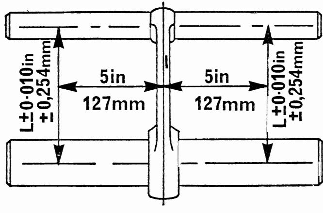

#### Crankshaft

| Overall Length $\cdots$                                             | $\cdots$  | $\cdots$                | $\cdots$ | 24.01/24.04 in (609,85/610,62 mm)                                              |
|------------------------------------------------------------------------|-----------|-------------------------|----------|--------------------------------------------------------------------------------|
| Main Journal Dia. $\cdots$                                          | $\cdot$ . | $\cdots$                | $\cdots$ | 2.9984/2.9992 in (76,16/76,18 mm)                                              |
| Main Journal Length-No. 1                                              | $\cdots$  | $\cdots$                | $\cdots$ | 1.453/1.473 in (36,91/37,41 mm)                                                |
| Main Journal Length Nos. 2, 4 and 5                                    |           | $\cdots$                | $\cdots$ | 1.545/1.549 in (39,24/39,34 mm)                                                |
| *Main Journal Length-No. 3                                             | $\ddotsc$ | $\cdot$ $\cdot$ $\cdot$ | $\cdots$ | 1.738/1.741 in (44,15/44,22 mm)                                                |
| *Main Journal Fillet Radii                                             | $\cdots$  | $\cdots$                | $\cdots$ | $0.145/0.156$ in $(3,68/3,96$ mm)                                              |
| Crankpin Dia. $\cdots$                                              | $\cdots$  | $\cdots$                | $\cdots$ | 2.4988/2.4996 in (63.47/63.49 mm)                                              |
| Crankpin Length $\cdots$                                            | $\cdots$  | $\cdots$                | $\cdots$ | 1.5885/1.5915 in (40,35/40,42 mm)                                              |
| *Crankpin Fillet Radii                                                 | $\cdots$  | $\cdot\cdot\cdot$       | $\cdots$ | $0.145/0.156$ in $(3,68/3,96$ mm)                                              |
| *Surface Finish--All Journals *Surface Finish - Fillet Radii        | $\cdots$  | $\cdots$                | $\cdots$ | 16 micro inches (0,4 microns) maximum 50 micro inches (1,3 microns) maximum |
| Main Journal and Crankpin Regrind Undersizes                           |           |                         | $\cdots$ | $-0.010$ , 0.020 and 0.030 in $(-0.25, 0.51$ and 0.76 mm)                   |
| *Fillet radii and surface finish must be maintained during regrinding. |           |                         |          |                                                                                |

{20}------------------------------------------------

| Oil Seal Helix Dia, (rope seals only) |          |          | $\cdots$ | $\cdots$ | 3.124/3.125 in (79.35/79.38 mm)   |
|---------------------------------------|----------|----------|----------|----------|-----------------------------------|
| Oil Seal Helix Width                  | $\cdots$ | $\cdots$ | $\cdots$ | $\cdots$ | 0.050/0.080 in (1,27/2,03 mm)     |
| Oil Seal Helix Depth                  | $\cdots$ | $\cdots$ | $\cdots$ | $\cdots$ | 0.004/0.008 in (0.10/0.20 mm)     |
| Flange Dia. $\cdots$               | $\cdots$ | $\cdots$ | $\cdots$ | $\cdots$ | 5.247/5.249 in (133.27/133.32 mm) |
| Spigot Bearing Recess Depth           |          | $\cdots$ | $\cdots$ | $\cdots$ | $0.781$ in $(19.84$ mm)           |
| Spigot Bearing Recess Bore            |          | $\cdots$ | $\cdots$ | $\cdots$ | 1.8497/1.8502 in (46,98/47,00 mm) |
| Crankshaft End Float                  |          | $\cdots$ | $\cdots$ | $\cdots$ | 0.002/0.015 in (0.05/0.38 mm)     |

Length of No. 3 main journal not to exceed 1.759 in (44,68 mm) after regrinding. Width of crankpins must not exceed 1.5965 in (40,55 mm) after regrinding. Where necessary use oversize thrust washers to suit.

Crankshafts Part No. 31315542, 31315661, 31315872, 31315884, 31315984, 31315986, 31315991, 31316204, 31316224, 31316235, 31316237 and 31316241 are tufftrided and must be re-tufftrided after any regrinding has taken place (see page H.2). Where facilities for re-tufftriding are not available then a factory replacement crankshaft should be obtained.

#### **Crankshaft Thrust Washers**

| Type $\cdots$ $\cdots$   | $\cdots$  | $\cdots$            | $\cdots$ | Steel Backed, Aluminium Tin or Lead Bronze Faced |
|--------------------------------|-----------|---------------------|----------|--------------------------------------------------|
| Position in Engine $\cdots$ | $\cdots$  | $\cdots$            | $\cdots$ | Centre Main Bearing                              |
| Thrust Washer Thickness (STD)  |           | $\cdots$            | $\cdots$ | $0.089/0.091$ in $(2.26/2.31$ mm)                |
| Thrust Washer Thickness (O/S)  | $\cdots$  | $\cdots$            | $\cdots$ | $0.096/0.099$ in $(2.44/2.51$ mm)                |
| Thrust Washer Outside Dia.     |           | $\cdot \cdot \cdot$ |          | 4.088/4.098 in (103.84/104.90 mm)                |
| Thrust Washer Inside Dia.      | $\cdots$  |                     | $\cdots$ | 3.420/3.430 in (86.87/87.12 mm)                  |
|                                | $\ddotsc$ | $\cdots$            | $\cdots$ |                                                  |

#### **Main Bearings**

| i ype                           |   | $\cdots$ |                 |
|---------------------------------|---|----------|-----------------|
| Shell Width-Nos. 1, 2, 4, and 5 |   | $\cdots$ | $\cdot$ $\cdot$ |
| Shell Width-No. 3               |   | .        | .               |
| Outside Dia. of Main Bearing    | . | $\cdots$ | .               |
| Inside Dia. of Main Bearing     |   |          | .               |
| Main Bearing Running Clearance  |   | $\cdots$ | $\cdots$        |
| Shell Thickness $\cdots$     |   |          | .               |

Pre-Finished, Steel Backed, Aluminium Tin or Lead Bronze Faced 1.245/1.255 in (31,62/31,88 mm) 1.435/1.445 in (36,45/36,70 mm) 3.167 in (80,41 mm) 3.0010/3.0026 in (76,23/76,27 mm) 0.0018/0.0042 in (0,05/0,11 mm) 0.0822/0.0825 in (2,088/2,098 mm)

#### **Connecting Rod Bearings**

| l ype $\cdots$ .             | $\cdots$             | $\cdots$ |
|------------------------------------|----------------------|----------|
| Shell Width $\cdots$            | $\cdots$             | .        |
| Outside Dia. of Con. Rod Bearing   | $\ddot{\phantom{0}}$ | $\cdots$ |
| Inside Dia. of Con. Rod Bearing    | $\cdots$             | $\cdots$ |
| Con. Rod Bearing Running Clearance | .                    | .        |
| Shell Thickness                    |                      |          |

Pre-Finished, Steel Backed, Aluminium Tin or Lead Bronze Faced 1.245/1.255 in (31,62/31,88 mm) 2.6465 in (67,22 mm) 2.5008/2.5019 in (63,52/63,55 mm) 0.0012/0.0031 in (0,03/0,08 mm) 0.0723/0.0726 in (1,836/1,844 mm)

#### Camshaft

| No. 1 Journal Dia.                      | $\cdots$ | .                    |  |
|-----------------------------------------|----------|----------------------|--|
| No. 1 Cylinder Block Camshaft Bore Dia. | $\cdots$ | . .                  |  |
| No. 1 Journal Running Clearance         | .        |                      |  |
| No. 2 Journal Dia. $\cdots$          | .        | . .                  |  |
| No. 2 Cylinder Block Camshaft Bore Dia. | .        | $\ddot{\phantom{0}}$ |  |
| No. 2 Journal Running Clearance         | .        | . .                  |  |
| No. 3 Journal Dia.                      |          |                      |  |
| No. 3 Cylinder Block Camshaft Bore Dia. | .        | . .                  |  |
| No. 3 Journal Running Clearance         | .        | .                    |  |
| Cam Lift .                           | .        |                      |  |
| Oilways for Rocker Shaft Lubrication    | $\cdots$ |                      |  |

1.9965/1.9975 in (50,71/50,74 mm) 2.000/2.001 in (50,8/50,83 mm) 0.0025/0.0045 in (0,06/0,11 mm) 1.9865/1.9875 in (50,46/50,48 mm) 1.990/1.992 in (50,55/50,60 mm) 0.0025/0.0053 in (0,06/0,14 mm) 1.9665/1.9675 in (49,95/49,98 mm) 1.970/1.972 in (50,04/50,09 mm) 0.0025/0.0053 in (0,06/0,14 mm) 0.300/0.303 in (7,62/7,70 mm) No. 2 Journal

{21}------------------------------------------------

#### **Camshaft Thrust Washer**

| Canishan Till ast Washel                       |          |          |                      |                                                               |
|------------------------------------------------|----------|----------|----------------------|---------------------------------------------------------------|
| Type                                        | .        |          | $\ddot{\phantom{0}}$ | $360^\circ$                                                   |
| Thrust Washer Outside Dia.                     | $\cdots$ | .        | $\ddot{\phantom{0}}$ | 2.872/2.874 in (72.95/73.00 mm)                               |
| Cylinder Block Recess Dia. for Thrust Washer   |          |          | $\ddot{\phantom{0}}$ | 2.875/2.885 in (73.03/73.28 mm)                               |
| Clearance Fit of Washer in Recess              |          | $\cdots$ | .                    | $0.001/0.013$ in $(0.03/0.33$ mm)                             |
| Thrust Washer Inside Dia.                      | $\cdots$ | $\cdots$ | $\ddot{\phantom{0}}$ | 1.75 in $(44.45$ mm)                                          |
| Thrust Washer Thickness                        | $\cdots$ | $\cdots$ | $\cdots$             | $0.216/0.218$ in $(5,47/5,54$ mm)                             |
| Cylinder Block Recess Depth for Thrust Washer  |          |          |                      |                                                               |
| (Earlier Type) $\cdots$                     | $\cdots$ |          |                      | 0.152/0.154 in (3.86/3.91 mm)                                 |
| (Later Type)                                | $\cdots$ |          | $\cdots$             | 0.187/0.190 in (4,75/4,83 mm)                                 |
| (Current Type)                              |          |          |                      | 0.215/0.218 in (5,46/5,53 mm)                                 |
| Thrust Washer Protrusion beyond Cylinder Block |          |          |                      |                                                               |
| Front Face - (Earlier Type)                    |          |          |                      | 0.062/0.066 in (1,53/1,68 mm)                                 |
| (Later Type)                                   |          |          |                      | 0.026/0.031 in (0,66/0,79 mm)                                 |
| Thrust Washer Relationship to Cylinder Block   |          |          |                      |                                                               |
| Front Face (Current Type) $\ldots$          |          | $\cdots$ | $\cdots$             | $-0.002/+0.003$ in $(-0.05/+0.07$ mm)                         |
| Camshaft End Float $\cdots$                 | $\cdots$ | $\cdots$ | $\cdots$             | $0.004/0.016$ in $(0.10/0.41$ mm)                             |
|                                                |          |          |                      |                                                               |
| <b>Cylinder Head</b>                           |          |          |                      |                                                               |
| Cylinder Head Length $\cdots$               | $\cdots$ | $\cdots$ | $\cdots$             | 19.875 in (504,82 mm)                                         |
| Cylinder Head Depth $\cdots$                | .        | $\cdots$ | $\cdots$             | 4.0625 in $\pm$ 0.015 in (103,20 mm $\pm$ 0,38 mm)            |
| Skimming allowance on Cylinder Head Face       |          |          | .                    | $0.012$ in $(0.30$ mm)                                        |
| Min. Cylinder Head Depth after Skimming        |          |          | .                    | 4.0355 in (102,51 mm)*                                        |
| Max. Nozzle Protrusion after Skimming          |          | .        | .                    | $0.175$ in $(4.44$ mm)                                        |
| Leak Test Pressure $\cdots$                 | .        |          | . .                  | 30 lbf/in 2 (2,11 kgf/cm 2 ) - 206 kN/m |
| Valve Seat Angle $\cdots$                   | $\cdots$ | $\cdots$ | $\cdots$             | $45^{\circ}$                                                  |
| Valve Seat Angle (inlet-T4.236 engines only)   |          |          | $\mathcal{L}^{\pm}$  | $30^{\circ}$                                                  |
| Valve Bore in Cylinder Head                    | .        | .        | $\cdots$             | 0.37425/0.37525 in (9.51/9.53 mm)                             |
| Valve Guide Parent Bore Dia.                   | $\ddots$ | $\cdots$ | $\ddot{\phantom{0}}$ | 0.6247/0.6257 in (15,87/15,89 mm)                             |
| .                                              |          |          |                      |                                                               |

Minimum Cylinder Head Depth quoted is nominal and Skimming Allowance must be governed by the Maximum Nozzle Protrusion Permissible.

#### Valve Guides (if fitted)

| Inside Dia.--- Inlet and Exhaust $\cdots$ . .                                                                                       | 0.375/0.376 in (9,53/9,55 mm)                                            |
|----------------------------------------------------------------------------------------------------------------------------------------------|--------------------------------------------------------------------------|
| Outside Dia. $\cdot$ $\cdot$ $\cdot$ $\cdots$ $\cdots$ . $\cdots$                                                             | 0.6259/0.6265 in (15,89/15,91 mm)                                        |
| Interference Fit of Guide in Cylinder Head Bore $\cdots$                                                                                  | 0.0002/0.0018 in (0.005/0.046 mm)                                        |
| Depth of Counterbore—Exhaust Guide . .                                                                                                 | $0.4062$ in $(10.32$ mm)                                                 |
| Overall Length of Guide - Exhaust $\ddotsc$ . $\cdots$                                                                              | 2.4375 in (61,92 mm)                                                     |
| Overall Length of Guide - Inlet $\cdots$ $\cdots$ $\cdots$                                                                          | 2.281 in (57,94 mm)                                                      |
| Guide Protrusion Above Cylinder Head Top Face $\ddotsc$                                                                                   | 0.594 in (15,09 mm)                                                      |
| <b>Exhaust Valves</b>                                                                                                                        |                                                                          |
| Valve Stem Dia. . $\cdots$ $\cdots$ $\cdots$                                                                                     | 0.372/0.3728 in (9,45/9,47 mm)                                           |
| Clearance Fit of Valve in Guide (if fitted) $\cdots$                                                                                      | 0.00225/0.004 in (0.06/0.10 mm)                                          |
| Clearance Fit of Valve in Head $\cdots$ $\cdots$ $\cdots$                                                                           | 0.00145/0.00325 in (0.04/0.08 mm)                                        |
| Valve Head Dia. $\cdots$ $\cdots$ $\cdots$ $\cdots$                                                                              | 1.435/1.445 in (36.45/36.70 mm)                                          |
| Valve Face Angle $\cdots$ $\cdots$ $\cdots$ $\cdots$                                                                             | $45^{\circ}$                                                             |
| Valve Head Depth below Cylinder Head Face (earlier)                                                                                          | 0.029/0.039 in (0,74/0,99 mm)                                            |
| Valve Head Depth Below Cylinder Head Face (current)                                                                                          | 0.047/0.057 in (1.19/1.45 mm)                                            |
| Overall Length of Valve $\cdots$ . $\cdots$                                                                                         | 4.847/4.863 in (123,11/123,52 mm)                                        |
| Service Valve Stem Oversizes $\cdots$ . $\cdots$                                                                                    | 0.003, 0.015 and 0.030 in (0,08, 0,38 and 0,76 mm)                       |
| $\cdot$ $\ddot{\phantom{a}}$                                                                                                              |                                                                          |
| <b>Inlet Valves</b>                                                                                                                          |                                                                          |
| Valve Stem Dia. $\cdots$ $\cdots$ $\cdots$ $\cdots$                                                                              | 0.3725/0.3735 in (9.46/9.48 mm)                                          |
| Clearance Fit of Valve in Guide (if fitted) $\cdots$ $\cdots$                                                                          | 0.0015/0.0035 in (0.04/0.09 mm)                                          |
| Clearance Fit of Valve in Head $\cdots$ $\cdots$ $\cdots$                                                                           | 0.00075/0.00275 in (0,02/0,07 mm)                                        |
| Valve Head Dia. $\cdots$ $\cdots$ $\cdots$ $\ddot{\phantom{a}}$                                                                  |                                                                          |
|                                                                                                                                              |                                                                          |
| Valve Face Angle $\cdots$ $\cdots$ . .                                                                                           | 1.736/1.746 in (44.09/44.36 mm) $45^{\circ}$                          |
| $\cdots$                                                                                                                                     | 30 °                                                          |
| Valve Face Angle (T4.236 engines only) $\cdots$ $\cdots$                                                                               | $0.035/0.045$ in $(0.89/1,14$ mm)                                        |
| Valve Head Depth Below Cylinder Head Face Overall Length of Valve $\cdots$ .                                                        | 4.831/4.847 in (122,71/123,11 mm)                                        |
| . Service Valve Stem Oversizes $\cdots$ $\cdots$ .                                                                               | 0.003, 0.015 and 0.030 in (0.08, 0.38 and 0.76 mm)                       |
|                                                                                                                                              |                                                                          |
|                                                                                                                                              |                                                                          |
| <b>Inner Valve Springs</b>                                                                                                                   |                                                                          |
| <b>Fitted Length</b> $\cdots$ $\cdots$ $\cdots$ $\cdots$ $\cdots$                                                             | 1.5625 in (39,7 mm)                                                      |
| Load at Fitted Length ÷ $\cdots$ $\cdots$ . <b>Fitted Position</b> $\cdots$ $\cdots$ $\cdots$ $\cdot$ $\cdots$ | 15.4 lb $\pm$ 1 lb (7 kg $\pm$ 0.45 kg) Damper Coils to Cylinder Head |

{22}------------------------------------------------

| <b>Outer Valve Springs</b>                                                 |                      |                      |                      |                                      |
|----------------------------------------------------------------------------|----------------------|----------------------|----------------------|--------------------------------------|
| Fitted Length $\ddot{\phantom{a}}$ $\cdots$                          | .                    | $\cdots$             | $\ddotsc$            | 1.780 in (45.22 mm)                  |
| Load at Fitted Length                                                   | .                    |                      | .                    | 40 lb $\pm$ 2 lb (18,1 kg $\pm$ 0.91 |
| <b>Fitted Position</b> $\cdots$ .                                    | .                    |                      |                      | Damper Coils to Cylinder He          |
| Single Valve Springs (Fork Lift Trucks 4.236/4.2482)                       |                      |                      |                      |                                      |
| Fitted Length .                                                         |                      |                      |                      | 1.6300 in (41,40 mm)                 |
| $\cdots$ Load at Fitted Length $\cdots$                              | $\cdots$ $\cdots$ | $\ldots$ .        | $\cdots$ .        | 56.4 lb +/- 3 lb (25,5 kg +/- 1      |
| <b>Fitted Position</b> $\cdots$ $\cdots$                             | $\cdots$             | $\cdots$             |                      | No Damper Coils                      |
|                                                                            |                      |                      |                      |                                      |
| <b>Tappets</b>                                                             |                      |                      |                      |                                      |
| Overall Length                                                             | $\cdots$             | $\ldots$             | $\cdots$             | 2.96875 in (75,41 mm)                |
| Outside Dia. Tappet Shank                                                  | $\cdots$             | .                    | $\ddot{\phantom{0}}$ | 0.7475/0.7485 in (18,99/19,          |
| Cylinder Block Tappet Bore Dia.                                            | $\cdots$             | $\ddotsc$            | $\ddot{\phantom{0}}$ | 0.750/0.7513 in (19,05/19,08         |
| Tappet Running Clearance in Bore                                           |                      | $\cdots$             | $\cdot$ $\cdot$      | $0.0015/0.0038$ in $(0.04/0.10)$     |
| Outside Dia. of Tappet Foot                                                | $\cdots$             | $\cdots$             | $\ddot{\phantom{0}}$ | 1.1875 in (30,16 mm)                 |
|                                                                            |                      |                      |                      |                                      |
| <b>Rocker Shaft</b>                                                        |                      |                      |                      |                                      |
| Overall Length of Shaft                                                    | $\cdots$             | $\ddot{\phantom{0}}$ | $\cdots$             | 16.796 in (426,62 mm)                |
| Outside Dia, of Shaft $\cdots$                                          | .                    |                      | .                    | 0.7485/0.7495 in (19,01/19,0         |
|                                                                            |                      |                      |                      |                                      |
|                                                                            |                      |                      |                      |                                      |
| <b>Rocker Levers</b>                                                       |                      |                      |                      |                                      |
| Inside Dia. of Lever Bore                                                  | $\ldots$             |                      | $\cdot$ .            | $0.7505/0.7520$ in $(19,06/19,7)$    |
| Lever Clearance on Rocker Shaft                                            |                      | $\ddot{\phantom{a}}$ | $\ldots$             | $0.001/0.0035$ in $(0.03/0.09)$      |
|                                                                            |                      |                      |                      |                                      |
| Rocker Levers with Replaceable Bushes                                      |                      |                      |                      |                                      |
| Lever Parent Bore                                                          |                      | . .                  |                      | 0.875/0.8762 in (22,23/22,2          |
| Outside Diameter of Bush                                                   | $\cdots$             | $\cdot$              |                      | 0.877/0.8785 in (22,28/22,3)         |
| Interference Fit of Bush in Bore                                           | .                    | $\cdots$             |                      | 0.0008/0.0035 in (0,02/0,09          |
| Finish Machine Bush Bore                                                   | .                    | $\ddotsc$            |                      | 0.7505/0.752 in (19,06/19,1)         |
| Clearance of Bush on Shaft                                                 | $\cdots$             | $\cdots$             | $\ldots$             | 0.001/0.0035 in (0,03/0,09 i         |
| <b>Valve Clearances</b>                                                    |                      |                      |                      |                                      |
| Clearances between Valve Stem and Rocker Lever                             |                      |                      |                      | $0.012$ in $(0.30$ mm) Cold-         |
|                                                                            |                      |                      |                      |                                      |
| <b>Valve Timing</b>                                                        |                      |                      |                      |                                      |
| Refer to Page K.8.                                                         |                      |                      |                      |                                      |
| <b>Camshaft Gear</b>                                                       |                      |                      |                      |                                      |
| Number of Teeth $\ldots$                                                | $\cdots$             | $\cdots$             | $\cdot$ .            | 56                                   |
| Inside Dia. of Gear Boss                                                   | $\cdots$             | $\cdots$             | $\cdots$             | 1.375/1.376 in (34,93/34,96          |
| Outside Dia. of Camshaft Hub                                               | .                    | .                    | $\cdots$             | 1.3741/1.3747 in (34,90/34,91        |
| Fit of Gear on Camshaft Hub                                                | $\cdots$             | $\cdots$             | $\epsilon$           | $-0.0009/+0.0013$ in ( $-0.02/+0$    |
| <b>Fuel Pump Gear (Hydraulically Governed Pumps)</b>                       |                      |                      |                      |                                      |
| Number of Teeth .                                                       |                      | .                    |                      | 56                                   |
| Inside Dia. of Fuel Pump Gear Bore                                         |                      | .                    | $\ddot{\phantom{0}}$ | 1.6250/1.6262 in (41,28/41,          |
| Outside Dia. of Gear Carrier                                               |                      | .                    | .                    | 1.6225/1.6238 in (41,19/41,          |
| Running Clearance of Gear on Carrier                                       |                      | .                    |                      | 0.0012/0.0037 in (0,03/0,09          |
|                                                                            |                      |                      |                      |                                      |
| <b>Fuel Pump Gear (Mechanically Governed Pumps)</b>                        |                      |                      |                      |                                      |
| Number of Teeth                                                            |                      | $\cdot$ .            |                      | 56                                   |
| Inside Dia. of Gear Bore (D.P.A. Pump)                                     |                      |                      | . .                  | 1.750/1.751 in (44,45/44,47          |
| Fuel Pump Hub Dia. (D.P.A. Pump) Inside Dia. of Gear Bore (D.P.S. Pump) | $\cdots$             | .                    | $\cdots$             | 1.748/1.7488 in (44,40/44,4)         |
|                                                                            |                      | .                    |                      | Tapered                              |
| Idler Gear and Hub - Standard                                              |                      |                      |                      |                                      |
| Number of Teeth                                                         |                      | $\cdots$             |                      |                                      |
| Bore Dia. of Gear Bush (requires boring in situ)                           |                      |                      |  .                | 63 1.9991/2.0000 in (50,78/50,8   |
| Outside Dia. of Gear Hub                                                   | .                    | .                    | .                    | 1.9961/1.9975 in (50,70/50,7         |
| Running Clearance of Gear on Hub                                           |                      | .                    | .                    | 0.0016/0.0039 in (0,04/0,10          |
| Idler Gear Width Including Bushes                                          |                      | .                    | .                    | 1.1865/1.1875 in (30,14/30,          |
| Hub Width . $\cdots$                                                 |                      | .                    | $\cdots$             | 1.1915/1.1945 in (30,26/30,:         |
| Idler Gear End Float .                                                  | $\cdots$             | .                    |                      | $0.004/0.008$ in $(0.10/0.20$ m      |

{23}------------------------------------------------

#### Idler Gear and Hub - Heavy Duty

| No. of Teeth $\cdots$                         | .         |          |          |          | 63                                           |
|--------------------------------------------------|-----------|----------|----------|----------|----------------------------------------------|
| Bore Dia. of Gear Bush (requires boring in situ) |           |          |          |          | 1.9998/2.0007 in (50.79/50.82 mm)            |
| Outside Dia, of Gear Hub                         |           | $\cdots$ | .        | $\cdots$ | 1.996/1.997 in (50,70/50,72 mm)              |
| Running Clearance of Gear on Hub                 |           |          |          | $\cdots$ | 0.0028/0.0047 in (0.07/0.12 mm)              |
| <b>Idler Gear Width</b>                          |           | .        |          |          | 0.9375/0.9425 in (23,81/23,94 mm)            |
| Idler Gear Thrust Washer Thickness               |           |          | .        | $\cdots$ | $0.119/0.122$ in $(3.02/3.10$ mm)            |
| Hub Width $\cdots$                            | .         | .        | .        | $\cdots$ | 1.1915/1.1945 in (30.26/30.33 mm)            |
| Idler Gear End Float                             | $\cdots$  | .        | .        |          | $0.008/0.016$ in $(0.20/0.41$ mm)            |
| Compressor Drive Housing Assembly - Wabco        |           |          |          |          |                                              |
| Rear Housing Bearing Bore                        |           | $\cdots$ |          |          | 1.258/1.259 in (31,972/31,988 mm)            |
| Outside Dia. of Rear Bearing                     |           | $\cdots$ | $\cdots$ |          | 1.259/1.260 in (31.986/32,003 mm)            |
| Interference Fit of Bearing in Housing           |           |          | $\cdots$ |          | $-0.00007/+ 0.0012$ in $(-0.002 + 0.031$ mm) |
| Inside Dia, of Bearing                           | $\cdot$   |          | $\cdots$ |          | 0.5901/0.5906 in (14,989/15,003 mm)          |
| Outside Dia, of Idler Gear Shaft                 |           |          | .        |          | 0.5904/0.5908 in (14,997/15,008 mm)          |
| Interfence Fit of Bearing on Shaft               |           |          | $\cdots$ |          | $-0.00007/+ 0.0002$ in $(-0.019 + 0.006$ mm) |
| <b>Front Housing Bearing Bore</b>                |           | .        | .        |          | 3.344/3.345 in (84,962/84,984 mm)            |
| Outside Dia. of Front Bearing                    |           |          |          |          | 3.345/3.346 in (84.980/85,005 mm)            |
| Interference Fit of Bearing in Housing           |           |          | $\cdots$ |          | $-0.0016/+ 0.0015$ in $(-0.043 + 0.004$ mm)  |
| Inside Dia. of Bearing                           |           | .        | $\cdots$ | $\cdots$ | 1.7710/1.7717 in (44.985/45.003 mm)          |
| Outside Dia, of Idler Gear Shaft                 |           | $\cdots$ | .        | .        | 1.771/1.772 in (45.002/45.018 mm)            |
| Interference Fit of Bearing on Shaft             |           |          | $\cdots$ | .        | $-0.0012/+ 0.00003$ in $(-0.033 + 0.001$ mm) |
| No. of Teeth each gear                           | $\ddotsc$ | $\cdots$ | $\cdots$ | $\cdots$ | 27                                           |
| Outside Dia. of Idler Gear Shaft, Front and Rear |           |          |          | $\cdots$ | 0.8751/0.8755 in (22,228/22,240 mm)          |
| Inside Dia. of Gears, Front and Rear             |           |          |          | .        | 0.8750/0.8759 in (22,225/22,250 mm)          |
| Clearance Fit of Gears on Shaft                  |           | .        | .        | $\cdots$ | $-0.0006/+ 0.0008$ in $(-0, 015 + 0.022$ mm) |
| Inside Dia, of Drive Gear                        |           | .        | .        | $\cdots$ | Taper                                        |
| Outside Dia, of Drive Shaft                      |           | $\cdots$ | $\cdots$ | $\cdots$ | Taper                                        |
|                                                  |           |          |          |          |                                              |

#### **Crankshaft Gear**

| Number of Teeth          | $\cdots$ | $\cdots$ |          | .        |
|--------------------------|----------|----------|----------|----------|
| Gear Bore                |          | $\cdots$ | $\cdots$ | $\cdots$ |
| Crankshaft Dia, for Gear |          | $\cdots$ | $\cdots$ | $\cdots$ |

#### **Timing Gear Backlash**

| All gears             | $\cdots$ | $\cdots$ | $\cdots$ | $\cdots$ | $\cdots$  | $0.003$ in $(0.08$ mm) minimum |
|--------------------------|----------|----------|----------|----------|-----------|--------------------------------|
|                          |          |          |          |          |           |                                |
| Sump                     |          |          |          |          |           |                                |
| Sump Capacity (Standard) |          |          | $\cdots$ | $\cdots$ | $\cdot$ . | 14 pts (8 litres)              |
| Dipstick Position        |          |          | $\cdots$ | $\cdots$ | $\cdot$ . | Left or Right Hand Side        |
| Strainer Location        |          |          |          |          |           | On Puotian Dina of Lubricatio  |

 $\ldots$ 

 $\bar{\mathcal{A}}$ 

28

Rotor Type

off Balancer drive shaft)

Four

Five

1.875/1.876 in (47,63/47,65 mm) 1.8750/1.8755 in (47,63/47,64 mm)

On Suction Pipe of Lubricating Oil Pump

Three or Five (centre mounted Balancer, six)

Four or Six (centre mounted Balancer, seven)

By Idler Gear from Crankshaft Gear (centre mounted Balancer,

#### Oil Pump

Strainer Location

| Type of Pump $\cdots$ $\cdots$      | $\cdots$ | $\cdot$ .            |
|-------------------------------------------|----------|----------------------|
| No. of Lobes-linner Rotor Concentric      | .        | $\ddot{\phantom{a}}$ |
| No. of Lobes--- Outer Rotor Concentric    | $\cdots$ | $\cdot$ .            |
| No. of Lobes—Inner Rotor Hobourn Eaton    |          | $\ddot{\phantom{a}}$ |
| No. of Lobes--- Outer Rotor Hobourn Eaton |          | $\ddot{\phantom{0}}$ |
| Drive Position on Engine $\cdots$      | .        | .                    |
|                                           |          |                      |

 $\ldots$ 

 $\ldots$ 

#### **Pump Clearances** مديديد

|                                        | Pump Part No. 41314054/41314182 (Concentric) |                      |          |          |                                     |  |  |  |
|----------------------------------------|----------------------------------------------|----------------------|----------|----------|-------------------------------------|--|--|--|
|                                        | Inner Rotor to Outer Rotor                   | .                    | $\cdots$ |          | $0.001/0.003$ in $(0.025/0.076$ mm) |  |  |  |
|                                        | Inner Rotor End Clearance                    | $\cdots$             | $\cdots$ | $\cdots$ | 0.0015/0.003 in (0,038/0,076 mm)    |  |  |  |
|                                        | Outer Rotor End Clearance                    | $\cdot$ $\cdot$      | $\cdots$ | $\cdots$ | 0.0005/0.0025 in (0.013/0.063 mm)   |  |  |  |
|                                        | Outer Rotor to Pump Body                     | $\ddot{\phantom{0}}$ | $\cdots$ | $\cdots$ | 0.001/0.003 in (0,025/0,076 mm)     |  |  |  |
| Pump Part No. 41314061 (Hobourn Eaton) |                                              |                      |          |          |                                     |  |  |  |
|                                        | Inner Rotor to Outer Rotor                   | $\cdots$             | $\cdots$ | $\cdots$ | $0.001/0.006$ in $(0.025/0.152$ mm) |  |  |  |
|                                        | Inner and Outer Rotor End Clearance          |                      | $\cdots$ |          | $0.001/0.005$ in $(0.025/0.127$ mm) |  |  |  |
|                                        | Outer Rotor to Pump Body                     |                      | .        | $\cdots$ | 0.0055/0.010 in (0.139/0.254 mm)    |  |  |  |

{24}------------------------------------------------

| Pump Part No. 4132F012 (T4.236)                             |          |                      |                      |                                                                            |
|-------------------------------------------------------------|----------|----------------------|----------------------|----------------------------------------------------------------------------|
| Inner Rotor to Outer Rotor                                  | .        | .                    | .                    | 0.0015/0.005 in (0,038/0,133 mm)                                           |
| Inner Rotor End Clearance                                   | .        | .                    | $\cdots$             | 0.0015/0.004 in (0,038/0,101 mm)                                           |
| Outer Rotor End Clearance                                   | .        | .                    | .                    | 0.001/0.003 in (0.025/0,088 mm)                                            |
| Outer Rotor to Pump Body Clearance                          |          | .                    | .                    | 0.006/0.013 in (0,153/0,330 mm)                                            |
|                                                             |          |                      |                      |                                                                            |
| Pump Part No. 4132F014 (Concentric) Centre mounted Balancer |          |                      |                      |                                                                            |
| Inner and Outer Rotor End Clearance                         | $\cdots$ | .                    | .                    | 0.001/0.003 in (0,025/0,076 mm)                                            |
| Outer Rotor to Pump Body $\cdots$                        | .        |                      | .                    | 0.012/0.017 in (0,304/0,44 mm)                                             |
| Inner to Outer Rotor Clearance                              | .        | .                    |                      | 0.001/0.005 in (0,035/0,127 mm)                                            |
| <b>Oil Pump Drive Gear</b>                                  |          |                      |                      |                                                                            |
| Number of Teeth $\cdots$                                 | $\ldots$ |                      | .                    | 19                                                                         |
| Inside Dia, of Gear Bore                                    | $\cdots$ | $\cdots$             | .                    | 0.497/0.4978 in (12,62/12,64 mm)                                           |
| Outside Dia. of Oil Pump Shaft                              | $\ldots$ | .                    | $\cdots$             | 0.4990/0.4995 in (12,67/12,69 mm)                                          |
| Interference Fit of Gear on Shaft                           |          | .                    | $\cdot$ .            | $0.0012/0.0025$ in $(0.03/0.06$ mm)                                        |
| Clearance between Drive and Pump Body                       |          | .                    | .                    | $0.003/0.007$ in $(0.08/0.18$ mm)                                          |
|                                                             |          |                      |                      |                                                                            |
| Oil Pump Idler Gear                                         |          |                      |                      |                                                                            |
| Number of Teeth $\ldots$                                 |          |                      | $\cdot$              | 20                                                                         |
| Inside Dia. of Gear Bore                                    | $\cdots$ | $\ddot{\phantom{0}}$ | $\ddot{\phantom{0}}$ | 1.000/1.0012 in (25,40/25,43 mm)                                           |
| Outside Dia. of Gear Bush                                   | $\cdots$ | $\ddot{\phantom{0}}$ | .                    | 1.000/1.0008 in (25,40/25,42 mm)                                           |
| Inside Dia, of Gear Bush                                    | $\cdots$ | $\ddotsc$            | . .                  | 0.8750/0.8763 in (22,23/22,26 mm)                                          |
| Outside Dia, of Idler Gear Shaft                            | $\cdots$ | .                    | .                    | 0.8737/0.8742 in (22,19/22,20 mm)                                          |
| Running Clearance of Gear on Shaft                          |          | $\cdots$             | ÷                    | 0.0008/0.0026 in (0.02/0.07 mm)                                            |
| Idler Gear End Float $\ddots$                            |          | $\ddot{\phantom{0}}$ | . .                  | $0.002/0.016$ in $(0.05/0.41$ mm)                                          |
| <b>Relief Valve</b>                                         |          |                      |                      |                                                                            |
| Type $\cdots$                                            | $\cdots$ | .                    | .                    | Spring Loaded Plunger                                                      |
| Pressure Setting (Naturally Aspirated Engines)              |          | $\cdots$             | .                    | 50/60 lbf/in 2 (3,52/4,22 kgf/cm 2 ) —               |
| Pressure Setting (Turbocharged Engines)                     |          |                      |                      | 70/80 lbf/in 2 (4,92/5,62 kgf/cm 2 ) - 482/5         |
| Length of Plunger $\cdots$                               | $\cdots$ | $\ddot{\phantom{0}}$ | $\cdots$             | 0.826 in (20,98 mm)                                                        |
| Outside Dia. of Plunger                                     | $\cdots$ | $\cdots$             | $\cdots$             | 0.5585/0.5595 in (14,19/14,21 mm)                                          |
| Inside Dia. of Valve Housing Bore                           |          | .                    | $\cdot$ .            | 0.5605/0.5625 in (14,23/14,30 mm)                                          |
| Clearance of Plunger in Bore                                | $\cdots$ | .                    | . .                  | $0.001/0.004$ in $(0.03/0.10$ mm)                                          |
| Outside Dia. of Spring $\cdots$                          | $\cdots$ | $\ddotsc$            | $\cdots$             | $0.368/0.377$ in $(9.35/9.58$ mm)                                          |
| Spring - Fitted Length (4.236/T4.236)                       |          | $\cdots$             | .                    | 1.28 in $(32,51 \text{ mm})$                                               |
| Spring - Load at Fitted Length (4.236/T4.236)               |          |                      |                      |                                                                            |
| No. of Coils 14.5 $\cdots$                               | .        | .                    |                      | 7.76/8.24 lbf (3,52/3,74 kgf) - 34,5/                                      |
| Relief Valve, Centre Mounted Balancer - Earlier             |          |                      |                      |                                                                            |
|                                                             |          |                      |                      |                                                                            |
| Type $\cdots$                                            | .        | .                    | $\cdots$             | Spring loaded plunger                                                      |
| Pressure setting:                                           |          |                      |                      |                                                                            |
| Turbocharged engine $\cdots$                             | $\cdots$ | .                    | .                    | 85 lbf/in 2 (5,97 kgf/cm 2 ) - 586 kN/m 2 |
| Naturally Aspirated Engine                                  | $\cdots$ | .                    | $\cdots$             | 60 lbf/in 2 (4,22 kgf/cm 2 ) - 414 kN/m 2 |
| Length of Plunger                                           | $\ldots$ | .                    | $\cdots$             | 0.826 in (20,98 mm)                                                        |
| Outside Dia. of Plunger                                     | $\cdots$ | .                    |                      | 0.5585/0.5595 in (14,186/14,211 mm)                                        |
| Inside Dia. of Valve Housing Bore                           | $\cdots$ | .                    | .                    | 0.570 in (14,5 mm)                                                         |
| Clearance of Plunger in Bore                                | $\cdots$ | .                    | $\cdots$             | 0.008/0012 in (0,209/0,314 mm)                                             |
| Spring Fitted Length (4.236)                                | $\cdots$ | .                    | $\cdots$             | 1.28 in (32,5 mm)                                                          |
| Spring Fitted Length (T4.236)                               | $\cdots$ | .                    | $\cdots$             | 1.42 in (36,2 mm)                                                          |
| Spring Load at Fitted Length (T4.236) No. of Coils 12.9     |          |                      |                      | $3.03/4.38$ lbf $(1,38/1,99$ kgf $)$ - 13,5/19                             |
| Spring Load at Fitted Length (4.236) No. of Coils 15        |          |                      | .                    | 5.40/6.74 lbf (2,45/3,06 kgf) – 24,0/30                                    |
| Relief Valve, Centre Mounted Balancer - Later               |          |                      |                      |                                                                            |
| Type . .                                              | .        | .                    | $\cdots$             | Spring loaded plunger                                                      |
| Pressure setting:                                           |          |                      |                      |                                                                            |
| Turbocharged engine .                                    | .        | $\cdots$             | .                    | 76 lbf in 2 (5,34 kgf cm 2 ) 523 kN/m 2   |
| <b>Naturally Apirated Engine</b>                            | .        | $\cdots$             | .                    | 60 lbf in 2 (4,22 kgf cm 2 ) 414 kN/m 2   |
| Length of Plunger .                                      |          | $\cdots$             | $\cdots$             | 1.476 in (37,48 mm)                                                        |
| Outside Dia. of Plunger $\cdots$                         | $\cdots$ |                      | $\cdots$             | 0.6279/0.6291 in (15,95/15,98 mm)                                          |
| Inside Dia. of Valve Housing Bore                           |          | .                    | .                    | $0.62/0.63$ in $(16,00/16,03$ mm)                                          |
| Clearance of Plunger in Bore                                | $\ldots$ | .                    | .                    | 0.003/0.0007 in (0,02/0,08 mm)                                             |
| Spring Fitted Length (4.236/T4.236)                         |          | .                    | $\cdots$             | 1.68 in (42,66 mm)                                                         |
| Spring Load at Fitted Length (T4.236) No. of Coils 13.5     |          |                      |                      | 7.64/8.54 lbf (3,47/3,87 kgf) - 34,5/38,0                                  |

{25}------------------------------------------------

### **Lubricating Oil Filter —** Flement or Canister Type

|                       | <b>ERTHEIR OF CANSICI TYPE</b> |          |                                                |          |          |
|-----------------------|--------------------------------|----------|------------------------------------------------|----------|----------|
| Type of Filter        | $\sim$ 100 $\mu$               | $\cdots$ | $\cdots$                                       | $\cdots$ | $\cdots$ |
| By-Pass Valve Setting |                                | $\cdots$ | $\cdots$                                       | $\cdots$ | $\cdots$ |
|                       |                                |          | Torque Tension for Filter Bowl Retaining Screw |          |          |

(Element Type)  $\sim 10^{-10}$  $\sim$   $\sim$  $\sim$  1440

### **Type of Cooling System**

| Cylinder Head and Block |                                       | $\cdots$ | $\cdots$ | $\ddot{\phantom{1}}$ |
|-------------------------|---------------------------------------|----------|----------|----------------------|
|                         | Engine Water Capacity (Less Radiator) |          | $\cdots$ | $\ddot{\phantom{1}}$ |

#### **Thermostat**

| Type             | $\cdots$ | $\cdots$ | $\cdots$ | $\cdot$ . |
|---------------------|----------|----------|----------|-----------|
| Opening Temperature | $\cdots$ | $\cdots$ | $\cdots$ | . .       |
| Fully Open at       | $\cdots$ | $\cdots$ | $\cdots$ | . .       |
| Valve Lift .     | $\cdots$ | .        | $\cdots$ | . .       |

#### Thermostat - By Pass Blanking

|               | (fitted to T4.236 and some 4.248 engines) |           |          |          |          |
|---------------|-------------------------------------------|-----------|----------|----------|----------|
| Type          | .                                         |           | $\cdots$ | $\cdots$ | $\cdots$ |
|               | Opening Temperature                       | $\ddotsc$ | $\cdots$ |          | $\cdots$ |
| Fully Open at |                                           | $\cdots$  | $\cdots$ | $\cdots$ | $\cdots$ |
|               | Valve and By-Pass Travel                  |           | $\cdots$ | $\cdots$ | $\cdots$ |

#### **Water Pump**

| Type $\cdots$ $\cdot$ $\cdot$   | .        | .         | $\cdots$             |
|---------------------------------------|----------|-----------|----------------------|
| Outside Dia, of Shaft for Pulley      | $\cdots$ | $\cdots$  | $\ddot{\phantom{a}}$ |
| Inside Dia, of Pulley Bore            | .        | $\cdots$  | $\cdots$             |
| Clearance Fit of Pulley on Shaft      | $\cdots$ | $\cdots$  |                      |
| Outside Dia. of Shaft for Impeller    |          | .         | .                    |
| Inside Dia. of Impeller Bore          |          |           | .                    |
| Interference Fit of Impeller on Shaft |          | $\cdot$ . | $\ddot{\phantom{1}}$ |
| Outside Dia. of Impeller              |          | ٠         | $\cdots$             |
| Impeller Blade to Body Clearance      |          | . .       | $\cdots$             |
| Water Pump Seal Type (Earlier)        |          | ٠         | .                    |
| Water Pump Seal Type (Later)          | . .      | $\cdots$  | $\cdots$             |

#### **Balancer Unit - Front Mounted**

| Note: Later units have needle roller bearings and all current balancer units have reversed weights. |                      |                                         |
|-----------------------------------------------------------------------------------------------------|----------------------|-----------------------------------------|
| Front Dia, of Shafts (Driving and Driven)                                                           | $\cdots$             | 1.2484/1.2490 in (31,71/31,73 mm)       |
| Inside Dia, of Front Balance Frame Bushes                                                           | $\cdots$             | 1.2510/1.2526 in (31,78/31,82 mm)       |
| Running Clearance of Shafts in Bushes $\cdots$                                                   | $\cdots$             | $0.002/0.0042$ in $(0.05/0.11$ mm)      |
| Rear Dia. of Shafts (Driving and Driven) $\ldots$                                                | $\cdots$             | 0.9987/0.9992 in (25,37/25,38 mm)       |
| Inside Dia, of Rear Balance Frame Bushes                                                            | $\cdots$             | 1.001/1.0022 in (25.43/25.46 mm)        |
| Running Clearance of Shafts in Bushes $\mathbf{r}$                                               | $\ddot{\phantom{0}}$ | $0.0018/0.0035$ in $(0.05/0.09$ mm)     |
| Shaft Dia. for Balance Weights $\sim$ $\sim$                                                     | $\epsilon$ .         | 1.0622/1.0630 in (26,98/27,00 mm)       |
| Bore Dia, of Balance Weights $\sim 10$ $\cdots$                                               | $\cdots$             | 1.0625/1.0637 in (26,99/27,02 mm)       |
| Fit of Balance Weights on Shafts. $\ddot{\phantom{a}}$                                           |                      | $-0.0005/+0.0015$ in $(-0.01/+0.04$ mm) |
| Spigot Dia. of Earlier Balance Weights $\cdots$                                                  | $\cdots$             | 2.499/2.500 in (63,47/63,50 mm)         |
| Recess Dia, in Earlier Balance Weights $\ldots$                                                  | $\cdots$             | 2.500/2.501 in (63,50/63,53 mm)         |
| Spigot Dia. for Reversed Balance Weights $\cdots$                                                | $\cdots$             | 1.374/1.375 in (34,90/34,93 mm)         |
| Recess Dia. in Reversed Balance Weight Gears                                                        | $\cdots$             | 1.375/1.376 in (34.93/34.95 mm)         |
| Fit of Gear on Balance Weight $\ldots$ $\cdots$                                               | $\cdots$             | $-0.000/+0.002$ in ( $-0.00/+0.05$ mm)  |
| Dia, of Earlier Shaft for Lub. Oil Pump Gear                                                        | $\ddot{\phantom{0}}$ | $0.4215/0.4235$ in $(10,71/10,76$ mm)   |
| Bore Dia, of Earlier Lub, Oil Pump Drive Gear                                                       | $\cdots$             | 0.425/0.426 in (10,79/10,82 mm)         |
| Clearance Fit of Earlier Gear on Shaft $\sim$ $\sim$                                             | $\cdots$             | 0.0015/0.0045 in (0,04/0,11 mm)         |
| Dia, of Shaft for Later Lub. Oil Pump Gear                                                          | $\cdots$             | 0.6500/0.6508 in (16,51/16,53 mm)       |
| Bore Dia, of Later Lub, Oil Pump Drive Gear                                                         | $\cdots$             | $0.6513/0.6533$ in $(16,54/16,59$ mm)   |
| Clearance Fit of Later Gear on Shaft $\cdots$                                                    | $\cdots$             | $0.0005/0.0033$ in $(0.01/0.08$ mm)     |
| Depth of Earlier Lub. Oil Pump Body $\cdots$                                                     | $\cdots$             | 0.999/1.002 in (25,38/25,45 mm)         |
| Depth of Later Lub. Oil Pump Body $\cdots$                                                       | $\cdots$             | 1.002/1.005 in (25,45/25,53 mm)         |

 $\ddots$ 

Full Flow Opens between 8/17 lbf/in2 (0,56/1,2 kgf/cm2)  $-$  55/117 kN/m2

15.0 lbf ft (2,07 kgf m) - 20 Nm

Thermo - Syphon - Impeller Assisted 16.5 pints  $(9.36$  litres)

Bellows or Wax 170-180°F (77-83°C) 202°F (94°C) 0.312/0.469 in (7.94/11.91 mm)

Wax  $177^{\circ}$  -  $183^{\circ}$ F (80° -  $84^{\circ}$ C) 208°F (98°C) 0.350 in (8.89 mm)

#### Centrifugal

0.7492/0.7497 in (19,03/19,04 mm) 0.7508/0.7516 in (19,07/19,09 mm) 0.0011/0.0024 in (0,03/0,06 mm) 0.6262/0.6267 in (15,90/15,92 mm) 0.6249/0.6257 in (15,87/15,89 mm) 0.0005/0.0018 in (0,01/0,05 mm) 3.094/3.096 in (78,58/78,63 mm)  $0.012/0.032$  in  $(0.30/0.81$  mm) Synthetic Nitrile/Rubber, Carbon/Ceramic Faced One piece cassette

{26}------------------------------------------------

#### **Balancer Unit-Front Mounted (Continued)**

| Width of Lub. Oil Pump Drive Gears               | .                    | .                    |
|--------------------------------------------------|----------------------|----------------------|
| End Float of Earlier Oil Pump Gears (with joint) |                      | .                    |
| End Float of Later Oil Pump Gears                |                      |                      |
| Shaft Dia, for Lub. Oil Pump Driven Gear         |                      | $\cdot$ .            |
| Bore Dia, of Lub. Oil Pump Driven Gear           |                      | $\cdot$ .            |
| Running Clearance of Oil Pump Driven Gear        |                      | .                    |
| Hub Dia, for Idler Gear $\ddot{\phantom{0}}$  |                      | $\cdots$             |
| Bore Dia, of Idler Gear Bush . .              | $\ddot{\phantom{0}}$ | $\ddot{\phantom{0}}$ |
| Running Clearance of Idler Gear on Hub           |                      | $\sim$               |
| Idler Gear End Float                             |                      | .                    |

#### **Balancer Unit - Centre Mounted**

| No. of Teeth on Driveshaft Gear                        | .        | .        | .                    |
|--------------------------------------------------------|----------|----------|----------------------|
| Dia. of Driveshaft (at Front Bearing)                  | .        | .        | .                    |
| Dia. of Driveshaft (at Rear Bearing)                   | .        | .        | .                    |
| Dia. of Oil Pump Drive Splines                         | .        | .        | .                    |
| No. of Splines $\cdots$ .                        | $\cdots$ | .        |                      |
| Dia. of Balance Weight Drive Gear Splines              |          | .        | .                    |
| No. of Splines . .                               |          | .        | .                    |
| Dia. of Front Bearing Bore (Driveshaft)                | $\cdots$ | .        | .                    |
| Outside Dia, of Front Bearing (Driveshaft)             |          | .        | .                    |
| Inside Dia. of Front Bearing (Driveshaft)              |          | .        | .                    |
| Dia, of Rear Bearing Bore (Driveshaft)                 | .        | .        | .                    |
| Outside Dia, of Rear Bearing (Driveshaft)              |          | .        | .                    |
| Inside Dia. of Rear Bearing (Driveshaft)               |          | $\cdots$ | .                    |
| Dia, of Balance Frame and End Frame Bush Bores         |          |          | .                    |
| Outside Dia, of Balance Frame and End Frame Bushes     |          |          | .                    |
| Inside Dia. of Balance Frame and End Frame Bushes      |          |          | .                    |
| Clearance of Balance Weight Shafts in Bushes           |          |          | .                    |
| Shaft Dia. of Balance Weights                          |          | .        | .                    |
| No. of Teeth on Weights                                |          | .        | .                    |
| Minimum and Maximum Backlash (earlier)                 |          |          |                      |
| Minimum Maximum Backlash (later, dark finish)          |          |          | .                    |
| No. of Teeth on Driveshaft Balance Weight Drive Gear   |          |          | $\ddot{\phantom{a}}$ |
| No. of Splines on Balance Weight Drive Shaft Spur Gear |          |          |                      |
| Driveshaft Gear to Balance Weight Spur Gear Backlash   |          |          |                      |
| End Float of Balance Weight                            |          | .        | .                    |
| <b>End Float of Driveshaft</b>                         | .        | .        |                      |
| No. of Teeth on Idler Gear $\cdots$                 | $\cdots$ | .        | .                    |
| Idler/Drive Gear Backlash                              | $\cdots$ | $\cdots$ | .                    |
| Engine Crank/Idler Gear Backlash                       | $\cdots$ | .        | .                    |
| Inside Dia, of Gear Bore                               | .        | .        | .                    |
| Outside Dia, of Gear Bearing                           | .        | .        | .                    |
| Inside Dia. of Gear Bearing $\cdots$                | .        | .        | .                    |
| Outside Dia, of Idler Gear Hub                         | .        | .        | .                    |
| Idler Gear Hub Thread, or Setscrew                     | .        | .        | .                    |
| Idler Gear End Float                                   | .        | .        | .                    |
| <b>Thrust Washer Thickness</b> .                    | .        | .        | .                    |
| Outside Dia, of Thrust Washer                          | .        | $\cdots$ | .                    |
| Inside Dia. of Thrust Washer                           | .        |          | .                    |

#### **Fuel Lift Pump**

| Type of Pump $\cdots$              | $\cdots$ $\cdots$ |                 | $\cdots$ |
|---------------------------------------|----------------------|-----------------|----------|
| Method of Drive $\cdots$           | $\cdots$             | $\cdot$ $\cdot$ | $\cdots$ |
| Delivery Pressure - Two Bolt Fixing   |                      | .               | $\cdots$ |
| Delivery Pressure -- Four Bolt Fixing |                      | . .             | $\cdots$ |
| Spring Colour Code - Two Bolt Fixing  |                      | $\cdots$        | $\cdots$ |
| Spring Colour Code - Four Bolt Fixing |                      | .               | $\cdots$ |

#### Fuel Filter (Final)

| Element Type |          | .        | $\cdots$ |  |
|--------------|----------|----------|----------|--|
| Valve Type   | $\cdots$ | $\cdots$ | .        |  |

| 0.998/1.000 in (25,35/25,40 mm)   |
|-----------------------------------|
| 0.003/0.008 in (0,08/0,20 mm)     |
| 0.002/0.007 in (0.05/0.18 mm)     |
| 0.4382/0.4386 in (11,13/11,14 mm) |
| 0.4394/0.4404 in (11,16/11,19 mm) |
| 0.0008/0.0022 in (0.02/0.06 mm)   |
| 1.4984/1.4990 in (38,06/38,08 mm) |
| 1.500/1.5016 in (38,10/38,14 mm)  |
| 0.001/0.0032 in (0,03/0,08 mm)    |
| 0.008/0.014 in (0.20/0.36 mm)     |
|                                   |

 $21$ 1.124/1.125 in (28,562/28,575 mm) 0.936/0.937 in (23,787/23,800 mm) 1.124/1.125 in (28,562/28,575 mm) 6 0.650/0.651 in (15,51/15,53 mm) 6 1.374/1.375 in (34,912/34,937 mm) 1.3748 in (34,92 mm) 1.125 in (28,58 mm) 1.800/1.805 in (29,972/29,993 mm) 1.181 in (30,00 mm) 0.937 in (23,8 mm) 1.656/1.657 in (42,070/42,095 mm) 1.66 in (42,164 mm) 1.501/1.503 in (38,133/38,174 mm) 0.0025/0.0047 in (0,064/0,120 mm) 1.498/1.499 in (38,054/38,069 mm) 38 0.003/0.011 in (0,10/0,29 mm) 0.004/0.010 in (0,10/0,265 mm) 24 16 0.002/0.007 in (0,051/0,200 mm) 0.0073/0.0148 in (0,186/0,377 mm) 0.004/0.012 in (0,10/0,30 mm) 37 0.003/0.014 in (0,07/0,35 mm) 0.004/0.016 in (0,10/0,40 mm) 1.8754/1.8760 in (47,635/47,650 mm) 1.875 in (47,62 mm) 1.5 in (38,1 mm) 1.4996/1.500 in (38,090/38,100 mm)  $7/16 - 20$  UNF 0.003/0.009 in (0,08/0,23 mm) 0.163/0.169 in (4,14/4,29 mm) 2.323 in (59 mm) 0.787 in (20 mm

A.C. Delco. V.P. Series Eccentric on Camshaft  $2\frac{3}{4}$  to  $4\frac{1}{4}$  lbf/in2 (0,19/0,30 kgf/cm2) --19 to 29 kN/m2 6 to 10 lbf/in2 (0,42/0,70 kgf/cm2) --41 to 69 kN/m2 Green Red

Paper Gravity Vent Valve

{27}------------------------------------------------

| <b>Fuel Injection Pump</b> |
|----------------------------|
|----------------------------|

| .  ,.                                  |          |                      |                      |                      |          |                                 |  |
|----------------------------------------|----------|----------------------|----------------------|----------------------|----------|---------------------------------|--|
| Make                                   | $\cdots$ |                      | . .                  | .                    |          | C.A.V.                          |  |
| Type                                   | $\cdots$ | .                    | $\sim$ $\sim$        | .                    |          | D.P.A.                          |  |
| Pump Rotation                          |          | $\cdots$             | $\cdot$ $\cdot$      | .                    | $\cdots$ | Clockwise                       |  |
| Plunger Dia.                           | $\cdots$ | $\cdots$             | $\cdots$             |                      | $\cdot$  | $8.5$ mm                        |  |
| Timing Letter (Hydraulic)              |          |                      | $\ddot{\phantom{0}}$ | .                    | .        | "А"                             |  |
| Timing Letter (Mechanical)             |          |                      | $\cdots$             | $\ddot{\phantom{0}}$ | $\cdots$ | "C"                             |  |
| No. 1 Cylinder Outlet                  |          | $\cdots$             | .                    | .                    | $\cdots$ | "W"                             |  |
| Make                                   | .        | .                    | .                    | $\cdots$             |          | Stanadyne                       |  |
| Direction of Rotation                  |          | $\cdots$             | .                    | $\cdots$             | .        | Clockwise from Drive End        |  |
| No. 1 Cylinder Outlet                  |          | .                    | .                    | .                    |          | At 7 O'clock Position from Rear |  |
| Fuel Injection Pump - T4.38 engines    |          |                      |                      |                      |          |                                 |  |
| Make $\ddot{\phantom{a}}$           |          | $\cdots$             | .                    |                      | $\cdots$ | C.A.V.                          |  |
| Type                                   | $\cdots$ | $\ddot{\phantom{0}}$ | $\cdots$             | $\ddot{\phantom{1}}$ | $\cdots$ | D.P.S.                          |  |
| <b>Pump Rotation</b>                   |          | $\cdots$             | $\cdots$             | $\cdots$             | $\cdots$ | Clockwise                       |  |
| Plunger Dia.                           |          | $\cdots$             | $\cdots$             | $\cdot$ $\cdot$      | $\cdots$ | 7,0 mm                          |  |
| <b>Timing Letter</b>                   |          | $\cdot$ .            | $\ddot{\phantom{1}}$ | $\cdots$             | $\cdots$ | Not Applicable                  |  |
| No. 1 Cylinder Outlet                  |          | $\cdots$             | $\cdot$ $\cdot$      | $\cdots$             | $\cdots$ | "Х"                             |  |
| Maximum back pressure on fuel leak off |          |                      |                      |                      |          |                                 |  |
| from boost control capsule             |          |                      | $\cdot$              | $\cdots$             | $\cdots$ | 2 kPa                           |  |
|                                        |          |                      |                      |                      |          |                                 |  |

#### Engine Checking and Fuel Pump Marking Angles, Static Timing

The correct marking angles and static timing can be found by reference to the prefix letters and figures of the setting code adjacent to the word "Set" on the fuel pump identification plate. Engine checking and fuel pump marking angles are for use with timing tool MS67B and in some cases, adaptor PD67B-1 to 4 and PD67B-6. For Stanadyne pumps the tool will have to be fitted to the pump in the reverse position to normal, the fuel pump mark angle has been adjusted to allow for this.

| <b>Prefix Letters</b>        | <b>Engine Checking</b> Angle (Degrees) | <b>Fuel Pump Marking</b> Angle (Degrees) | <b>Static</b> Timing                  | Piston Displacement |
|------------------------------|-------------------------------------------|---------------------------------------------|------------------------------------------|------------------------|
|                              | (with engine at                           |                                             | (BTDC - Degrees)                         |                        |
|                              | TDC compression)                          |                                             |                                          |                        |
| AS62                         | 279                                       | 292                                         | 26                                       | $0.320$ in $(8,13$ mm) |
| AT, AT60E, AT67E             | !!!!!!!!!!!!!!!!!!!!!!!!!!!!!!!!!!!!!!!!  | 289                                         | 18                                       | $0.157$ in $(3,99$ mm) |
| AU (Stanadyne) before        |                                           |                                             |                                          |                        |
| Engine No. U524012W          | 280                                       | 67                                          | !!!!!!!!!!!!!!!!!!!!!!!!!!!!!!!!!!!!!!!! | $0.323$ in $(8.20$ mm) |
| AU (Stanadyne) from          |                                           |                                             |                                          |                        |
| Engine No. U524012W          | 285                                       | 62                                          | !!!!!!!!!!!!!!!!!!!!!!!!!!!!!!!!!!!!!!!! | $0.323$ in $(8,20$ mm) |
| <b>BS44</b>                  | 281                                       | !!!!!!!!!!!!!!!!!!!!!!!!!!!!!!!!!!!!!!!!    | 30                                       | 0.425 in (10.79 mm)    |
| BS49, BS54, BS62, BS64       | 281                                       | 292                                         | 22                                       | 0.232 in (5,89 mm)     |
| BT73E                        | 2801/2                                    | 293                                         | 25                                       | 0.299 in (7,59 mm)     |
| DT74E                        | !!!!!!!!!!!!!!!!!!!!!!!!!!!!!!!!!!!!!!!!  | 289                                         | 18                                       | $0.157$ in $(3,99$ mm) |
| FT70E                        | !!!!!!!!!!!!!!!!!!!!!!!!!!!!!!!!!!!!!!!!  | !!!!!!!!!!!!!!!!!!!!!!!!!!!!!!!!!!!!!!!!    | 20                                       | 0.193 in (4,90 mm)     |
| FT73E before Engine          |                                           |                                             |                                          |                        |
| No. U940900L                 | 286                                       | 293                                         | 14                                       | $0.095$ in $(2,41$ mm) |
| FT73E from Engine            |                                           |                                             |                                          |                        |
| No. U940900L                 | 284                                       | 293                                         | 18                                       | $0.157$ in $(3,99$ mm) |
| <b>FT</b>                    | 284                                       | 293                                         | 18                                       | $0.157$ in $(3,99$ mm) |
| GT78E                        | 2781/4                                    | 291                                         | $25\frac{1}{2}$                          | $0.233$ in $(5.91$ mm) |
| HT87E before Engine          |                                           |                                             |                                          |                        |
| No. U028270M                 | 281                                       | 293                                         | 24                                       | 0.276 in (7,01 mm)     |
| HT from Engine No. U028270M  | !!!!!!!!!!!!!!!!!!!!!!!!!!!!!!!!!!!!!!!!  | 293                                         | 26                                       | 0.325 in (8,26 mm)     |
| <b>JT57E</b>                 | $279$ 1/2                      | 291                                         | 23                                       | $0.254$ in $(6,45$ mm) |
| KT68L                        | 284                                       | 292                                         | 16                                       | $0.124$ in $(3.15$ mm) |
| <b>LS44</b>                  | 281                                       | !!!!!!!!!!!!!!!!!!!!!!!!!!!!!!!!!!!!!!!!    | 30                                       | 0.425 in (10,79 mm)    |
| LS45, LS49, LS50, LS52, LS55 | 2841/2                                    | 296                                         | 23                                       | $0.254$ in $(6.45$ mm) |
| LS57, LS61, LS63, LS67       | 2841/2                                    | 296                                         | 23                                       | $0.254$ in $(6,45$ mm) |
| LS62                         | 2831/2                                    | !!!!!!!!!!!!!!!!!!!!!!!!!!!!!!!!!!!!!!!!    | 25                                       | $0.295$ in $(7,49$ mm) |
| <b>LS66</b>                  | 281                                       | 292                                         | 22                                       | $0.232$ in $(5,89$ mm) |
| LT                           | $9\frac{1}{4}$                            | 17                                          | $15\frac{1}{2}$                          | $0.117$ in $(2.97$ mm) |
| <b>MS67</b>                  | 279                                       | 292                                         | !!!!!!!!!!!!!!!!!!!!!!!!!!!!!!!!!!!!!!!! | $0.320$ in $(8,13$ mm) |
| MT80L                        | 278                                       | 285                                         | 14                                       | $0.095$ in $(2,41$ mm) |
| PS45, PS48, PS51, PS54,      |                                           |                                             |                                          |                        |
| PS55 PS57,                   | 281                                       | 292                                         | 22                                       | 0.232 in (5,89 mm)     |
| PS61 exceptions below        | 281                                       | 292                                         | 22                                       | $0.233$ in $(5.91$ mm) |
| PS61/850/4/3120              | 2801/2                                    | 292                                         | 23                                       | $0.254$ in $(6.45$ mm) |
| PS61/850/7/3120              | 2801/2                                    | 292                                         | 23                                       | $0.254$ in $(6,45$ mm) |
| PS61/850/9/2400              | 2801/2                                    | 292                                         | 23                                       | $0.254$ in $(6,45$ mm) |
|                              |                                           |                                             |                                          |                        |

{28}------------------------------------------------

| <b>Prefix Letters</b>  | <b>Engine Checking</b> Angle (Degrees) (with engine at TDC compression) | <b>Fuel Pump Marking</b> Angle (Degrees) | <b>Static</b> Timing (BTDC - Degrees) | Piston Displacement                           |
|------------------------|----------------------------------------------------------------------------------|---------------------------------------------|---------------------------------------------|--------------------------------------------------|
| PS62, PS66             | 281                                                                              | 292                                         | 22                                          | $0.233$ in $(5,91$ mm)                           |
| PT(2643C210)           | $279$ 1/2                                                             | 291                                         | 23                                          | $0.254$ in $(6,45$ mm)                           |
| PT(2643C211)           | 2801/2                                                                           | 291                                         | 21                                          | $0.213$ in $(5.41$ mm)                           |
| RS45, RS52, RS56, RS58 | 286                                                                              | 297                                         | 22                                          | $0.205$ in $(5,20$ mm)                           |
| RT                     | 281                                                                              | 292                                         | 22                                          | 0.233 in (5,91 mm)                               |
| SS64, SS66, SS68       | !!!!!!!!!!!!!!!!!!!!!!!!!!!!!!!!!!!!!!!!                                         | 297                                         | 24                                          | 0.275 in (6,98 mm)                               |
| ST π                | $279^{1/2}$ 284                                                               | 291 292                                  | 23 16                                    | $0.254$ in $(6,45$ mm) $0.124$ in $(3.15$ mm) |
| <b>TS59, TS65</b>      | 281                                                                              | 292                                         | 22                                          | $0.233$ in $(5,91$ mm)                           |
| TS67 exceptions below  | 281                                                                              | 292                                         | 22                                          | $0.233$ in $(5.91$ mm)                           |
| TS67/850/2/2380*       | 285                                                                              | 292                                         | 14                                          | 0.095 in (2,41 mm)                               |
| TS67/850/2/2480**      | 285                                                                              | 292                                         | 14                                          | $0.095$ in $(2,41$ mm)                           |
| TS67/850/6/2700***     | 285                                                                              | 292                                         | 14                                          | $0.095$ in $(2,41$ mm)                           |
| <b>VS51</b>            | 284                                                                              | !!!!!!!!!!!!!!!!!!!!!!!!!!!!!!!!!!!!!!!!    | 24                                          | 0.245 in (6,22 mm)                               |
| VT                     | !!!!!!!!!!!!!!!!!!!!!!!!!!!!!!!!!!!!!!!!                                         | 293                                         | 26                                          | 0.323 in (8,20 mm)                               |
| <b>WS62, WS66</b>      | !!!!!!!!!!!!!!!!!!!!!!!!!!!!!!!!!!!!!!!!                                         | 292                                         | 24                                          | 0.275 in (6,98 mm)                               |
| WT (Stanadyne          | $284^{1}/2$                                                                      | 64                                          | 23                                          | $0.254$ in $(6,45$ mm)                           |
| <b>S55E, XS60E</b>     | 281                                                                              | 293                                         | 24                                          | $0.275$ in $(6,98$ mm)                           |
| XS                     | !!!!!!!!!!!!!!!!!!!!!!!!!!!!!!!!!!!!!!!!                                         | 293                                         | 26                                          | $0.323$ in $(8,20$ mm)                           |
| XT                     | 281                                                                              | 292                                         | 22                                          | $0.233$ in $(5.91$ mm)                           |
| <b>YS68E</b>           | 281                                                                              | 289                                         | 16                                          | $0.125$ in $(3.18$ mm)                           |
| <b>ZS51E</b>           | $278^{1}/4$                                                                      | 291                                         | $25^{1}/2$                                  | $0.311$ in $(7,90$ mm)                           |
| ZT (Stanadyne)         | $284^{1}/2$                                                                      | !!!!!!!!!!!!!!!!!!!!!!!!!!!!!!!!!!!!!!!!    | 23                                          | $0.254$ in $(6.45$ mm)                           |

#### Engine Checking and Fuel Pump Marking Angles, Static Timing (continued)

\*Franklin Log Skidder only. For other applications, engine checking angle is 281° and static timing is 22°. \*\*Clark 35C/35AWS Shovels, MF33 (N.A. build Shovel and MF 220 Log Skidder only. For other applications, engine checking angle is 281° and static timing is 22°.

\*\*\*Fiat Allis, Eaton 1500 F.E.L. and North American Build NAP341 engines only. For other applications, engine checking angle is 281° and static timing is 22°.

| <b>Atomisers</b> |                     |                      | <b>Working Pressure</b> |                     | <b>Setting Pressure</b> |                     | Identification |
|------------------|---------------------|----------------------|-------------------------|---------------------|-------------------------|---------------------|----------------|
|                  | Body                | <b>Nozzle</b>        | atm                     | kgf/cm 2 | atm                     | kgf/cm 2 | Code           |
| 4.2482           | LRB67015            | JB6801012            | 220                     | 227                 | 260                     | 269                 | HD             |
|                  | OKLL66M10770        | OLL150M8945          | 220                     | 227                 | 260                     | 269                 | XZ             |
| 4.248            | <b>BKBL67S5299</b>  | <b>BDLL150SY6545</b> | 195                     | 201                 | 210                     | 217                 | DL             |
|                  | <b>BKBL67S5151</b>  | <b>BDLL150S6507</b>  | 170                     | 176                 | 175                     | 181                 | <b>BU</b>      |
|                  | BKBL67S5151/        | <b>BDLL150S6556/</b> | 170                     | 176                 | 175                     | 181                 | CU             |
|                  | OKLL65752930        | OLL150S6556          |                         |                     |                         |                     |                |
|                  | <b>BKBL67S5299</b>  | <b>BDLL150S6600</b>  | 195                     | 201                 | 210                     | 217                 | EG             |
|                  | <b>BKJBL67S5299</b> | <b>BDLL150S6600</b>  | 170                     | 176                 | 185                     | 191                 | <b>FW</b>      |
| T4.236           | LRB67014            | JB6801022            | 230                     | 237                 | 230                     | 237                 | HG             |
|                  | OKLL66M11340        | OLL150M9302          | 230                     | 237                 | 230                     | 237                 | CY             |
|                  | LRB67014            | JB6801022            | 210                     | 217                 | 210                     | 217                 | HF             |
|                  | LRB67014            | JB6801019            | 250                     | 258                 | 250                     | 258                 | HH             |
|                  | LRB67014            | JB6801027            | 230                     | 237                 | 230                     | 237                 | HL             |
|                  | LRB67014            | JB6801022            | 220                     | 227                 | 220                     | 227                 | HU             |
| 4.236            | <b>BKBL67S5299</b>  | <b>BDLL150S6507</b>  | 170                     | 176                 | 185                     | 191                 | CF             |
|                  | <b>BKBL67S5151</b>  | <b>BDLL150S6225</b>  | 170                     | 176                 | 175                     | 181                 | <b>UA</b>      |
|                  | <b>BKBL67S5151</b>  | <b>BDLL150S6382</b>  | 170                     | 176                 | 175                     | 181                 | AC             |
|                  | <b>BKBL67S5151</b>  | <b>BDLL150S6561</b>  | 170                     | 176                 | 175                     | 181                 | <b>DM</b>      |
|                  | <b>BKBL67S5151</b>  | <b>BDLL150S6556</b>  | 170                     | 176                 | 175                     | 181                 | CU             |
|                  | BKBL67S5151/        | BDLL150S6435/        | 170                     | 176                 | 175                     | 181                 | AB             |
|                  | OKLL6752930         | OLL150S6705          |                         |                     |                         |                     |                |
|                  | BKBL67S5299/        | BDLL150S6591/        | 200                     | 206                 | 215                     | 222                 | EA             |
|                  | OKLL6752930         | OLL150S6649          |                         |                     |                         |                     |                |
|                  | <b>BKBL67S5151</b>  | <b>BDLL150S6705</b>  | 170                     | 176                 | 175                     | 181                 | FY.            |
|                  | OKLL67S2930         | OLL150S6705          | 170                     | 176                 | 175                     | 181                 | XD             |
|                  | <b>BKBL67S5299</b>  | <b>BDLL150S6649</b>  | 195                     | 201                 | 210                     | 217                 | FC             |
|                  | <b>BKBL67S5299</b>  | <b>BDLL150S6673</b>  | 200                     | 206                 | 215                     | 222                 | FL             |
|                  | <b>BKBL67S5299</b>  | <b>BDLL150S6737</b>  | 175                     | 181                 | 175                     | `181                | HY             |
|                  | 2645L301            | 2645L602             | 195                     | 201                 | 210                     | 217                 | <b>NB</b>      |
|                  | 2645L302            | 2645L603             | 170                     | 176                 | 175                     | 181                 | <b>NC</b>      |
|                  | 2645L301            | 2645L604             | 175                     | 181                 | 190                     | 196                 | <b>ND</b>      |
|                  | 2645C305            | 2645C610             | 210                     | 217                 | 195                     | 210                 | XE             |
|                  | 2645C307            | 2645C617             | 230                     | 237                 | 230                     | 237                 | YC             |
|                  |                     |                      |                         |                     |                         |                     |                |

{29}------------------------------------------------

| Atomisers (continued)                                                      |                    |           |           |                                                                      |                      | <b>Working Pressure</b>                  |                          | <b>Setting Pressure</b>                  |                             | Identification                                     |
|----------------------------------------------------------------------------|--------------------|-----------|-----------|----------------------------------------------------------------------|----------------------|------------------------------------------|--------------------------|------------------------------------------|-----------------------------|----------------------------------------------------|
|                                                                            | Body               |           |           | Nozzle                                                               |                      | atm                                      | kgf/cm 2      | atm                                      | kgf/cm 2         | Code                                               |
| 4.2482                                                                     | LRB67015           |           |           | JB6801012                                                            |                      | 220                                      | 227                      | 260                                      | 269                         | HD                                                 |
|                                                                            | OKLL66M10770       |           |           | OLL150M8945                                                          |                      | 220                                      | 227                      | !!!!!!!!!!!!!!!!!!!!!!!!!!!!!!!!!!!!!!!! | 269                         | ΧZ                                                 |
| 4.212                                                                      | <b>BKBL67S5151</b> |           |           | BDLL150S6561                                                         |                      | 170                                      | 176                      | 175                                      | 181                         | DM.                                                |
|                                                                            | BKBL67S5151        |           |           | <b>BDLL150S6555</b>                                                  |                      | 170                                      | 176                      | 175                                      | 181                         | CТ                                                 |
|                                                                            | <b>BKBL67S5151</b> |           |           | <b>BDLL150S6310</b>                                                  |                      | 170                                      | 176                      | 175                                      | 181                         | вт                                                 |
|                                                                            |                    |           |           | Note: LRB setting pressures are adjusted by a change of shim washer. |                      |                                          |                          |                                          |                             |                                                    |
| <b>ELECTRICAL SYSTEM</b>                                                   |                    |           |           |                                                                      |                      |                                          |                          |                                          |                             |                                                    |
| <b>Alternator</b>                                                          |                    |           |           |                                                                      |                      |                                          |                          |                                          |                             |                                                    |
| Make                                                                       | $\ddotsc$          | .         | .         |                                                                      | ٠.                   |                                          |                          | C.A.V., Lucas, Perkins, or Motorola      |                             |                                                    |
| Type                                                                       | .                  | .         | .         |                                                                      | .                    |                                          |                          |                                          |                             | AC5, 11AC, 15ACR, 17ACR, 18ACR, 23ACR, A115/45     |
|                                                                            |                    |           |           |                                                                      |                      |                                          |                          |                                          |                             | A133/55, LR135-11, LR135-113, LR135-114, LR150-16  |
|                                                                            |                    |           |           |                                                                      |                      | 9AR, A127                                |                          |                                          |                             |                                                    |
| Maximum Output AC5 12 volt (hot)                                           |                    |           |           | .                                                                    | . .                  |                                          | 55A at 13.5 volts        |                                          |                             |                                                    |
| Maximum Output AC5 24 volt (hot)                                           |                    |           |           | $\ddotsc$                                                            | $\ddot{\phantom{0}}$ |                                          | 31A at 27.5 volts        |                                          |                             |                                                    |
| Maximum Output 11AC 12 volt (hot)                                          |                    |           |           | $\cdots$                                                             | $\cdots$             |                                          | 43A at 13.5 volts        |                                          |                             |                                                    |
| Maximum Output 11AC 24 volt (hot)                                          |                    |           |           | .                                                                    | .                    |                                          | 28A at 27.5 volts        |                                          |                             |                                                    |
| Maximum Output 15 ACR (hot)                                                |                    |           | $\cdots$  | .                                                                    | $\ddot{\phantom{0}}$ | 28A                                      |                          |                                          |                             |                                                    |
| Maximum Output 17 ACR (hot)                                                |                    |           | $\cdots$  | .                                                                    | . .                  | !!!!!!!!!!!!!!!!!!!!!!!!!!!!!!!!!!!!!!!! |                          |                                          |                             |                                                    |
| Maximum Output De-rated 17ACR (hot)                                        |                    |           |           | .                                                                    | .                    | 25A                                      |                          |                                          |                             |                                                    |
| Maximum Output 18ACR (hot)                                                 |                    |           | .         | $\cdots$                                                             | .                    | 45A                                      |                          |                                          |                             |                                                    |
| Maximum Output 23ACR (hot)                                                 |                    |           | $\cdots$  | $\cdots$                                                             | .                    | 55A                                      |                          |                                          |                             |                                                    |
| Maximum Output A115/45 (hot)                                               |                    |           |           | .                                                                    | $\ddotsc$            | 45A                                      |                          |                                          |                             |                                                    |
| Maximum Output A133/55 (hot)                                               |                    |           |           | .                                                                    | .                    | 55A                                      |                          |                                          |                             |                                                    |
| Maximum Output LR135-111, LR135-113, LR135-114 (Hot)                       |                    |           |           |                                                                      |                      | !!!!!!!!!!!!!!!!!!!!!!!!!!!!!!!!!!!!!!!! |                          |                                          |                             |                                                    |
| Maximum Output LR150-160 (Hot)                                             |                    |           | $\cdots$  | $\cdots$                                                             | .                    | 50A                                      |                          |                                          |                             |                                                    |
| Maximum Output 9AR, 12 volt (Hot)                                          |                    |           |           |                                                                      |                      | 70A                                      |                          |                                          |                             |                                                    |
| Maximum Output A127, 12 volt (Hot)                                         |                    |           |           |                                                                      |                      | 55 or 65A                                |                          |                                          |                             |                                                    |
| <b>Dynamo</b>                                                              |                    |           |           |                                                                      |                      |                                          |                          |                                          |                             |                                                    |
|                                                                            |                    |           |           |                                                                      |                      |                                          |                          |                                          |                             |                                                    |
| Make                                                                       | .                  | . .       |           | .                                                                    | .                    | Lucas                                    |                          |                                          |                             |                                                    |
| Type                                                                       | $\cdots$           | .         | $\bullet$ | $\cdot$ .                                                            | .                    |                                          | C40A. 2 Pole, 2 Brush    |                                          |                             |                                                    |
|                                                                            |                    |           |           |                                                                      |                      |                                          |                          | Shunt Wound. Voltage Control             |                             |                                                    |
| Rotation                                                                   | $\cdots$           | $\ddotsc$ | .         | .                                                                    | .                    | Clockwise                                |                          |                                          |                             |                                                    |
| Output                                                                     | $\cdots$           |           | .         | .                                                                    | .                    |                                          | 11 A maximum             |                                          |                             |                                                    |
| Dynamo Cut-in Speed                                                        |                    | $\cdots$  |           | .                                                                    | .                    |                                          | 525-625 rev/min          |                                          |                             |                                                    |
| <b>Alternative Dynamo</b>                                                  |                    |           |           |                                                                      |                      |                                          |                          |                                          |                             |                                                    |
|                                                                            |                    |           |           |                                                                      |                      |                                          |                          |                                          |                             |                                                    |
| Type                                                                       | .                  | .         | $\cdots$  |                                                                      | .                    |                                          |                          |                                          |                             | C40L. 2 Pole. 2 Brush. Shunt Wound Voltage Control |
| Rotation                                                                   | $\cdots$           | $\cdots$  | $\cdots$  | $\cdots$                                                             |                      | !!!!!!!!!!!!!!!!!!!!!!!!!!!!!!!!!!!!!!!! |                          |                                          |                             |                                                    |
| Output                                                                     | $\cdots$           |           | $\cdots$  | $\cdots$                                                             | .                    |                                          | 25 A maximum             |                                          |                             |                                                    |
| Dynamo Cut-in Speed                                                        |                    | $\cdots$  | . .       |                                                                      | .                    |                                          | 600-680 rev/min          |                                          |                             |                                                    |
|                                                                            |                    |           |           |                                                                      |                      |                                          |                          |                                          |                             |                                                    |
| <b>Starter Motor</b>                                                       |                    |           |           |                                                                      |                      |                                          |                          |                                          |                             |                                                    |
| Make                                                                       |                    |           |           |                                                                      | . .                  |                                          | Lucas, C.A.V. or Perkins |                                          |                             |                                                    |
| Type                                                                       | .                  | .         | $\cdots$  | .                                                                    | . .                  |                                          |                          |                                          |                             | 2M113, M45G, CA45, M50, S12-84, S12-85, M127/2,8   |
| Max. Current                                                               | $\cdots$           |           | $\cdots$  | $\ddotsc$                                                            | .                    | 900 amps                                 |                          |                                          |                             |                                                    |
| Starter Cable Resistance                                                   |                    |           | $\cdots$  |                                                                      |                      |                                          | 0.0017 ohms              |                                          |                             |                                                    |
| No. of Teeth on Pinion                                                     |                    | $\cdots$  | .         |                                                                      |                      | 10                                       |                          |                                          |                             |                                                    |
| NOTE: The above data is general and can vary with individual applications. |                    |           |           |                                                                      |                      |                                          |                          |                                          |                             |                                                    |
| <b>Cold Starting Aid</b>                                                   |                    |           |           |                                                                      |                      |                                          |                          |                                          |                             |                                                    |
|                                                                            |                    |           |           |                                                                      |                      |                                          |                          |                                          |                             |                                                    |
| Make                                                                       | .                  | $\cdots$  | .         | .                                                                    | .                    | C.A.V.                                   |                          |                                          | C.A.V.                      |                                                    |
| Voltage                                                                    | $\cdots$           | $\ddotsc$ | $\ddotsc$ | .                                                                    |                      | 12 Volt                                  |                          |                                          | 24 Volt                     |                                                    |
| Maximum Current Consumption                                                |                    |           | $\cdots$  | $\cdots$                                                             |                      | 18 A                                     |                          |                                          | 7.5 A                       |                                                    |
| Flow Rate through Thermostart                                              |                    |           | $\cdots$  | .                                                                    | .                    |                                          | 9 cm 3 /min   |                                          | $9 \text{ cm}^3/\text{min}$ |                                                    |
|                                                                            |                    |           |           |                                                                      |                      |                                          |                          |                                          |                             |                                                    |
| <b>Engine Weights</b>                                                      |                    |           |           |                                                                      |                      |                                          |                          |                                          |                             |                                                    |
| Typical dry weight                                                         |                    | $\cdots$  | $\cdots$  | .                                                                    | .                    |                                          | 590 lb (269 kg)          |                                          |                             |                                                    |
| Typical installed weight                                                   |                    | $\cdots$  | $\cdots$  | $\cdots$                                                             | $\cdots$             |                                          | 750/900 lb (340/409 kg)  |                                          |                             |                                                    |

{30}------------------------------------------------

#### **De-Rating for Altitude**

Where engines operate at high altitudes they should be de-rated. The following table is given as a general guide for naturally aspirated engines to be applied on a percentage basis, where specific figures for a particular engine rating are not available. that delivery depathent

| Altitude                            | Maximum fuel delivery de-rating |
|-------------------------------------|---------------------------------|
| $0 - 2,000$ feet (600 metre)        | No change                       |
| $2,000$ - 4,000 feet (1200 metre)   | 6%                              |
| 4,000 - 6.000 feet (1800 metre)     | 12%                             |
| $6,000$ - 8.000 feet (2400 metre)   | 18%                             |
| $8,000$ - 10,000 feet (3000 metre)  | 24%                             |
| $10,000 - 12,000$ feet (3600 metre) | $30\%$                          |
|                                     |                                 |

\*Measured at setting speed given on Pump Setting Code.

Any necessary adjustments in this respect to the fuel pump should be carried out by the fuel pump dealer for the territory concerned.

{31}------------------------------------------------

Downloaded from [www.Manualslib.com](http://www.manualslib.com/) manuals search engine

{32}------------------------------------------------

# **SECTION D Fault Diagnosis**

#### **Fault Finding Chart**

| Fault                        | Possible Cause                                                                        |  |  |
|------------------------------|---------------------------------------------------------------------------------------|--|--|
| Low cranking speed           | 1, 2, 3, 4.                                                                           |  |  |
| Will not start               | 5, 6, 7, 8, 9, 10, 12, 13, 14, 15, 16, 17, 18, 19, 20, 22, 31, 32, 33.                |  |  |
| Difficult starting           | 5, 7, 8, 9, 10, 11, 12, 13, 14, 15, 16, 18, 19, 20, 21, 22, 24, 29, 31, 32, 33.       |  |  |
| Lack of power                | 8, 9, 10, 11, 12, 13, 14, 18, 19, 20, 21, 22, 23, 24, 25, 26, 27, 31, 32, 33, 61, 63. |  |  |
| Misfiring                    | 8, 9, 10, 12, 13, 14, 16, 18, 19, 20, 25, 26, 28, 29, 30, 32.                         |  |  |
| Excessive fuel consumption   | 11, 13, 14, 16, 18, 19, 20, 22, 23, 24, 25, 27, 28, 29, 31, 32, 33, 63.               |  |  |
| Black exhaust                | 11, 13, 14, 16, 18, 19, 20, 22, 24, 25, 27, 28, 29, 31, 32, 33, 61, 63,               |  |  |
| Blue/white exhaust           | 4, 16, 18, 19, 20, 25, 27, 31, 33, 34, 35, 45, 56, 62.                                |  |  |
| Low oil pressure             | 4, 36, 37, 38, 39, 40, 42, 43, 44, 58,                                                |  |  |
| Knocking                     | 9, 14 16, 18, 19, 22, 26, 28, 29, 31, 33, 35, 36, 45, 46, 59.                         |  |  |
| Erratic running              | 7, 8, 9, 10, 11, 12, 13, 14, 16, 20, 21, 23, 26, 28, 29, 30, 33, 35, 45, 59.          |  |  |
| Vibration                    | 13, 14, 20, 23, 25, 26, 29, 30, 33, 45, 47, 48, 49.                                   |  |  |
| High oil pressure            | 4, 38, 41.                                                                            |  |  |
| Overheating                  | 11, 13, 14, 16, 18, 19, 24, 25, 45, 50, 51, 52, 53, 54, 57.                           |  |  |
| Excessive crankcase pressure | 25, 31, 33, 34, 45, 55, 60.                                                           |  |  |
| Poor compression             | 11, 19, 25, 28, 29, 31, 32, 33, 34, 46, 59.                                           |  |  |
| Starts and stops             | 10, 11, 12.                                                                           |  |  |

#### Key to Fault Finding Chart

- Battery capacity low.  $\mathbf{1}$
- 2. Bad electrical connections.
- bad electrical connections. 
Failty starter motor. 
Incorrect grade of lubricating oil. 
Low cranking speed. 
Fuel tank empty. 
Faulty stop control operation. 
Blocked fuel fieed pipe. 3. 4.
- $\frac{5}{3}$
- 
- $rac{6}{7}$ .
- 8.
- 9.
- 10.
- Faulty fuel lift pump. Choked fuel filter. Restriction in air cleaner or induction system.  $11.$
- $\frac{12}{13}$ .
- 
- Air in fuel system. Faulty fuel injection pump. Faulty atomisers or incorrect type. Incorrect use of cold start equipment.  $14.$  $15.$
- 16.
- Faulty cold starting equipment. Broken fuel injection pump drive. 17.
- 18. Incorrect fuel pump timing.
- Incorrect valve timing.
- 
- 
- $\frac{19}{20}$ .   $\frac{21}{22}$ .
- mcorrect varve timing. 
Poor compression. 
Blocked fuel tank vent. 
Incorrect type or grade of fuel. 
Sticking throttle or restricted movement. 
Exhaust pipe restriction. 
Cylinder head gasket leaking.  $\frac{23}{24}$ .
- 
- $25.$
- 26. Overheating.
- Cold running.
- $\frac{27}{28}$ . 28. Incorrect tappet adjustment. Sticking valves. Incorrect high pressure pipes.
- 30.
- Worn cylinder bores.  $31.$
- $32.$ Pitted valves and seats.
- 33. Broken, worn or sticking piston ring/s.
- 34. Worn valve stems and guides.
- 35. Overfull air cleaner or use of incorrect grade of oil.
- University Worn or damaged bearings. Insufficient oil in sump. Inaccurate gauge. 36.
- $37.$
- $38.$
- 39. Oil pump worn.
- Pressure relief valve sticking open. Pressure relief valve sticking closed. 40.
- 41.
- $42.43.44.45.46.$ Broken relief valve spring.
- 
- 
- Blanty suction pipe. 
Faulty suction pipe. 
Choked oil filter. 
Piston seizure/pick up. 
Incorrect piston height. 
Damaged fan.
- 
- 47.
- 48. Faulty engine mounting (Housing).
- 49. Incorrect aligned flywheel housing, or flywheel.
- $\frac{50}{51}$ .  $\frac{51}{52}$ .  $\frac{53}{53}$ .
- 
- 
- 
- 54.
- 55.
- Fracture training in white Faulty thermostat. Restriction in water jacket. Coose fan belt. Cooked radiator. Faulty water pump. Choked breather pipe. Damaged valve stem oil deflectors (if fitted). 56.
- 57. Coolant level too low.
- $\frac{58}{59}$ . Blocked sump strainer.
- Broken valve spring. 60. Fault in exhauster or vacuum pipe leaks.
- 61. Turbocharger impeller damaged or dirty.
- 62. Turbocharger lubricating oil seal leaks.
- 63. Induction system leaks (turbocharged engines).

{33}------------------------------------------------

Downloaded from [www.Manualslib.com](http://www.manualslib.com/) manuals search engine

{34}------------------------------------------------

# **SECTION E Cylinder Head Maintenance**

#### To Remove the Cylinder Head

- 1. Drain the cooling system.
- 2. Disconnect battery terminals.
- 3. Detach the exhaust pipe. Remove turbocharger (T4.236 only).
- 4. Remove the atomiser leak-off pipe assembly.
- 5. Remove the fuel pipes from the fuel injection pump outlet and inlet to filter and boost control leak off pipe where fitted.
- pipe where mediate. 
For Disconnect fuel pipe from fuel lift pump outlet to fuel filter. Remove fuel filter.
- 7. Remove breather assembly.
- 8. Remove high pressure fuel pipes and atomisers (Fig. E.2).
- 9. Disconnect fuel pipe and/or electrical lead at the thermostat, and/or induction/port heaters, where  $\overline{\phantom{a}}$ fitted.  $\mathbf{I}$
- 10. Remove air filter and/or connecting hose. Remove induction and exhaust manifolds.
- 11. Detach rocker cover.
- 12. Remove rocker assembly from cylinder head (Fig. E.4). Remove push rods.

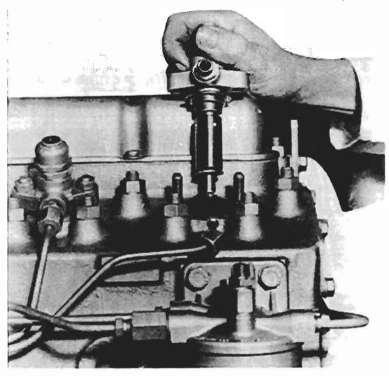

E2

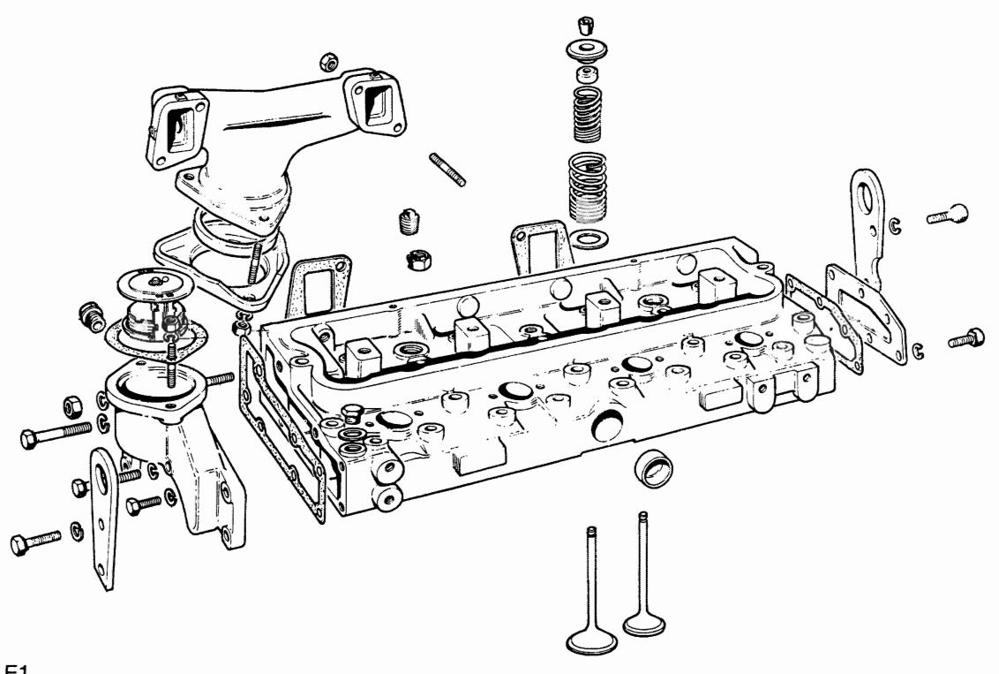

{35}------------------------------------------------

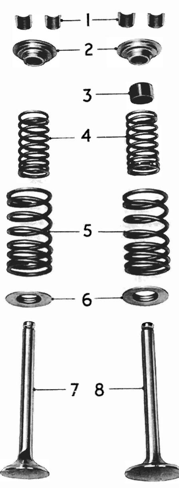

#### E3

- 1. Collets
- 2. Valve Spring Cap
- 3. Oil Deflector
- 4. Inner Valve Spring
- 5. Outer Valve Spring
- 6. Valve Spring Seat
- **Exhaust Valve** 7.
- Inlet Valve 8.

4.236 Series Workshop Manual, May, 1986.

- 13. Remove cylinder head nuts/setscrews in reverse order of tightening sequence shown in Fig. E.12.
- 14. Remove cylinder head.

#### To Remove the Valves

Mark all valves with a corresponding mark on the cylinder head to ensure that valves are refitted to their original positions unless replaced with new ones. Earlier engines had their valves and heads numbered during assembly as illustrated in Fig. E.6.

- 1. Compress spring caps and springs with a suitable valve spring compressor (Fig. E.5) and remove the two half conical collets from each valve.
- 2. Remove spring caps, springs and valve stem oil seals. Remove valves (Fig. E3).
	- NOTE: The quantity of springs, oil seals etc. fitted, and their location is dependent on application.

#### Cleaning

- 1. Remove all traces of carbon from cylinder head.
- 2. If the water jacket of the cylinder head shows signs of excessive scale, a proprietary brand of descaling solution should be used.
- 3. Blank off rocker oil feed oil-way between numbers 2 and 3 cylinders and remove carbon from pistons and cylinder block face.
- 4. After valve seat machining and valve grinding operations have been carried out, all parts should be thoroughly washed.

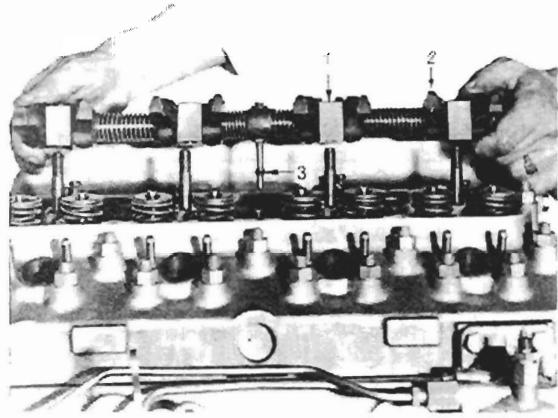

E4

- 1. Rocker Shaft Bracket
- 2. Rocker Lever
- $3.$ Oil Feed Connection

{36}------------------------------------------------

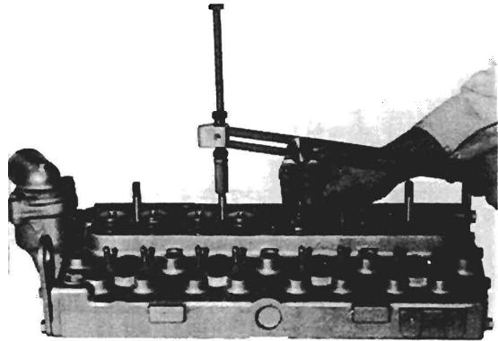

#### E5

#### **Valve Guides**

Engines are fitted with either detachable valve guides or the valve bores are machined direct into the cylinder head.

When wear takes place in the valve bores of cylinder heads without detachable valve guides, valves with oversize stems should be fitted.

Three service valves are available for both inlet and exhaust with oversize stems of 0.003 in, 0.015 in and 0.030 in (0,08, 0,38 and 0,76 mm) respectively.

To fit 0.015 and 0.030 in oversize valves, the bores in the cylinder head must be reamed with a piloted reamer. Suitable reamers for carrying out this operation can be obtained from Messrs. V. L. Churchill and Co. Ltd. (see Appendix).

Where detachable valve guides are fitted, these can be replaced.

To fit new guides; clean the parent bore, smear the Outer surface of the guide with clean oil and press home the guide until 0.594 in (15,10 mm) is protruding above the cylinder head. The guides are manufactured from cast iron and are brittle.

#### **Valves and Valve Seats**

Check the valve stems for wear and their fit in the quides.

Examine the valve faces for pitting or distortion. Valve refacing should be at an angle of 45° or 30° for inlet valves on T4.236 engines (see Page B.10).

Valves should always be refitted to their original seats and any new valve fitted should be suitably marked to identify its position if removed at a later date. Refer to Fig. E.6. for illustration of valve numbering.

Note current exhaust valve depths on Page B.10 became effective from the following engine numbers:-

| 212U3810L    |
|--------------|
| 236U135765   |
| 236U147150L  |
| 236US24721L  |
| 248U31918L   |
| 212UA200084L |
| 236UA110048L |
| 248UA135686L |

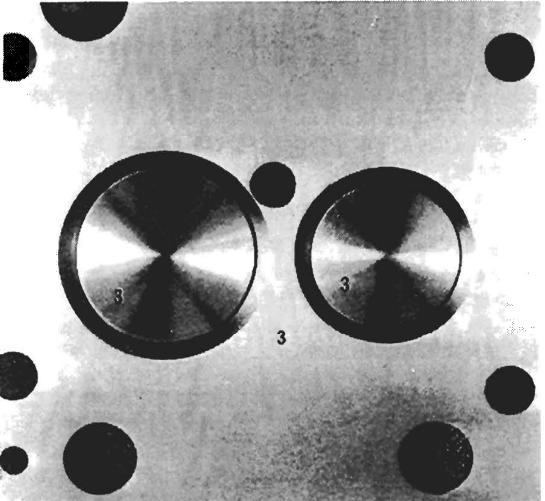

#### E6

The valve seats in the cylinder head should be reconditioned by means of cutters or specialised grinding equipment, at an angle or 45° or 30° for inlet valves on T4.236 engines. Suitable valve seat cutters for 45° seats are included in kit 21825064 (see Appendix) and these cutters give a differential valve seat to reduce the width of the valve seat. A special cutter 21825065 is required for 30° valve seats.

As narrow a seat as possible should always be maintained.

#### **Hand Grinding**

When grinding in valves it is essential that no signs of pitting are left on the seatings. At the same time care should be taken to avoid unnecessary grinding away of the seat.

After grinding operations have been completed, check the valve head depths relative to the cylinder head face (Fig. E.7) and wash the cylinder head.

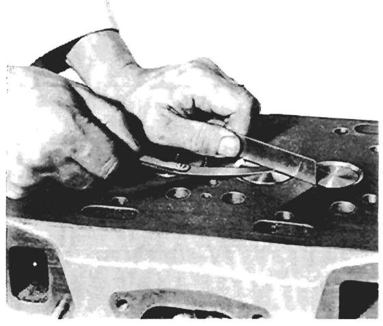

{37}------------------------------------------------

#### **Valve Seat Inserts**

In the majority of applications, valve seat inserts are not fitted to production engines, but may be fitted in service with the exception of T4.236 inlet valves which have a 30° seat.

However, there are some 4.248 and T4.236 applications in which exhaust valve seat inserts are fitted in production and where it is thought necessary, they may be replaced by new ones.

When fitting inserts to the valve seat, ensure that genuine Perkins Parts are used and proceed as follows: follows:

- a) For cylinder heads having removable valve guides, press out existing guide and clean the parent bore. Press in new guide.
- b) For guideless cylinder heads.

Using the appropriate oversize piloted reamer-0.015 in (0,38 mm) or 0.030 in (0,76 mm) according to the condition of the valve bores in the cylinder head-ream out the valve stem bores.

NOTE: Appropriate oversize stem replacement valves will be needed when this operation has been carried out on guideless cylinder heads.

Proceed as follows for either type cylinder head, with or without valve guides:-

- 1. Using the new valve bore as a pilot, machine the recess in the cylinder head face to the dimensions in Fig. E.8.
- Remove all machining swarf and clean the insert  $2.$ recess. Using the valve bore as a pilot, press the insert home using the inserting tool (Fig. E.9). Under no circumstances should the insert be hammered in, neither should lubrication be used during pressing in.
- 3. Inspect to ensure that the insert has been pressed fully home and is flush with the bottom of the recess.
- Using the valve bore as a pilot, machine the "flare" 4. to the dimensions in Fig. E.10.

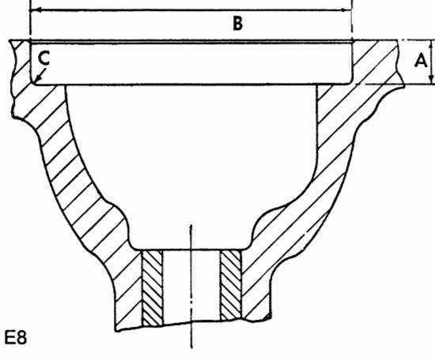

#### Inlet

A-0.283/0.288 in (7,19/7,31 mm) B-2.0165/2.0175 in (51,22/51,24 mm) C-Radius 0.015 in (0,38 mm) max.

#### Exhaust

A-0.375/0.380 in (9.52/9.65 mm) B-1.678/1.679 in (42,62/42,64 mm) C-Radius 0.015 in (0,38 mm) max.

4.236 Series Workshop Manual, May, 1986.

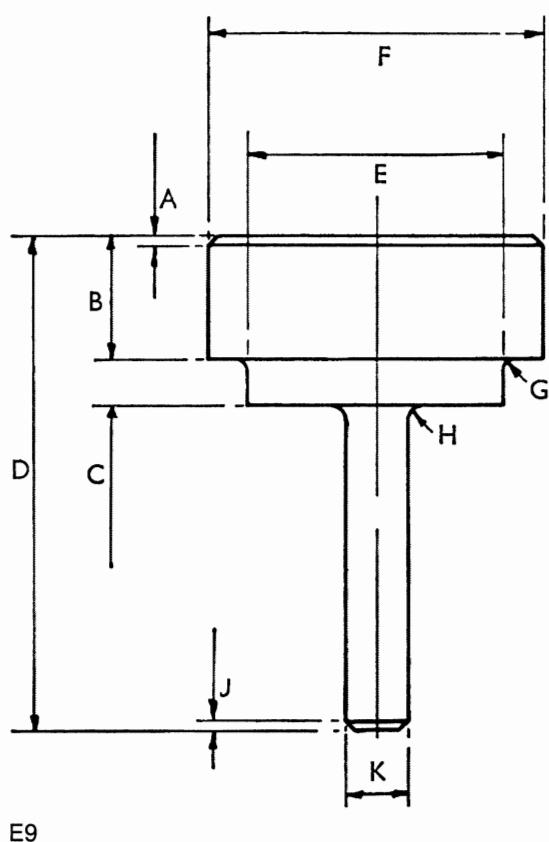

Inlet  $A - \frac{1}{16}$  in (1,59 mm) at 45°

 $B_{\frac{3}{4}}$  in (19,05 mm)

 $C$ —0.250 in  $(6,35$  mm)

- D-3 in (76,20 mm)
- E-1.582/1.583 in (40,18/40,21 mm)
- F-2.009/2.019 in (51,03/51,28 mm)
- G-1/32 in (0,79 mm) radius
- $H \rightarrow \frac{1}{16}$  in (1,59 mm) radius  $J = \frac{1}{16}$  in (1,59 mm) at 45°
- K-0.372/0.373 in (9,45/9,47 mm)

#### Exhaust

A— $1/16$  in (1,59 mm) at 45°  $B\rightarrow \frac{3}{4}$  in (19,05 mm) C-0.312 in (7,92 mm) D-3.0 in (76,20 mm) E-1.248/1.249 in (31,70/31,72 mm)  $|F - 1.670/1.680$  in  $(42.42/42.67$  mm) G-1/32 in (0,79 mm) radius H-1/16 in (1,59 mm) radius J-1/16 in (1,59 mm) at 45°

K-0.372/0.373 in (9,45/9,47 mm)

- $51$ Remove all machining swarf and burrs.
- 6 Re-cut the valve seat at an included angle of 90°. so that the valve head depth below the cylinder head face is within the production limits 0.047/0.057 in (1,19/1,45 mm) for exhaust valves and 0.035/0.045 in  $(0,89/1,14$  mm) for inlet valves.

{38}------------------------------------------------

#### **CYLINDER HEAD MAINTENANCE-E.5**

NOTE: Work as closely as possible to the minimum figure to allow for re-seating at a later date. When refacing a valve the included angle of the contact face is 90°.

If the cylinder head face has been skimmed since the fitting of valve seat inserts, then the following is allowed:-

- a) Machine to the dimensions given in Fig. E.10 and continue as in stages 5 and 6.
- b) If the insert is damaged or unserviceable through wear, it must be removed and replaced with a new one. Before fitting, however, the back of the insert should be surface ground, removing sufficient material to give a flush fitting. Do not forget to rechamfer the insert as it was prior to grinding, i.e. 0.020/0.030 in (0,508/0,762 mm) at 45°. Then proceed as in stages  $2 - 6$ .

#### **Skimming of Cylinder Head**

A maximum of 0.012 in (0.30 mm) may be removed providing the nozzle protrusion is not greater than 0.175 in (4.44 mm). This figure must not be obtained by the use of additional washers to the atomisers

Ensure that the valve depths are within the limits quoted on Page B.10.

#### **Valve Springs**

A new set of valve springs should always be fitted at every major overhaul. Either one or two valve springs are fitted according to application/engine type.

Examine the valve springs with regard to squareness of ends and pressures developed at specified lengths, details of which can be found in "Technical Data", page B.10.

Where springs incorporate damper coils at one end, these must be fitted towards the cylinder head.

#### **Rocker Shaft Assembly**

To Dismantle:-

- 1. Remove circlips and washers from each end of the rocker shaft.
- 2. Withdraw the rocker levers, springs, washers and support brackets.
- 3. Remove the locating screw from the rocker oil feed connection and withdraw the connection. Examine the rocker lever bores and shaft for wear. Rockers should be an easy fit on the shaft without excessive side play.

#### **To Reassemble**

- 1. Fit oil feed connection to rocker shaft and secure with the locating screw, ensuring that the screw enters the locating hole in the shaft. Later engines have a washer fitted each side of the oil feed connection.
- $2.$ Refit the support brackets, springs, and rocker levers in the correct order (Fig. E.4). The support brackets are interchangeable and when fitting them ensure that the securing stud/setscrew notes are to the right viewing the shaft from the front end, with each pair of rockers inclined away from each other at the valve end.

Note: Aluminium or cast iron brackets may be fitted and the tightening torque is different, see Page B.2.

3. Fit securing washer and circlip to each end of the shaft

#### **Push Rods**

Check the push rods for straightness. If any are bent, fit replacements.

#### **Valve Stem Oil Seals**

Where oversize valves are fitted, always ensure that correct size valve seals or 'O' rings are used.

All hydraulically governed engines and certain mechanically governed engines have rubber oil deflectors fitted to inlet valve stems only (see Fig. E.3).

With the majority of mechanically governed engines, oil seals are fitted to both inlet and exhaust valves. Earlier engines had a shallow rubber oil deflector fitted to the valve stems and positioned above the conical valve spring seating collar, the open end of the deflector being fitted towards the cylinder head. Later engines have a thin valve spring seating washer and a rubber oil seal which fits over the integral valve guide protrusion. In some cases, this latter seal has a nylon insert. The later sealing arrangement, due to a change in the diameter of the valve guide protrusion, is not interchangeable with the earlier sealing arrangement.

On some engines, the seals are manufactured from Viton or silicon rubber material and they have a garter spring fitted around their outer circumference.

In manufacturing, some engines have a red coloured material for inlet valve seals and black for exhaust valve seals. The red seal may only be fitted over the inlet valve. It is unsuitable for exhaust valves but the black seal may be fitted to either exhaust or inlet.

The 4.2482 engine has a valve stem oil seal on both inlet and exhaust valves. The seals have garter springs round the seal neck for improved oil control.

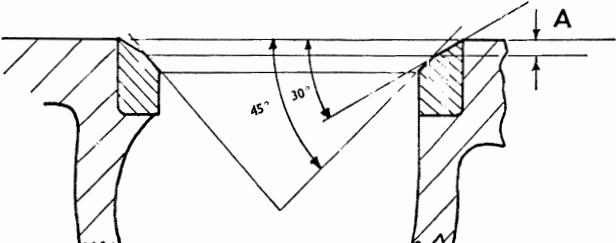

E10-4.2482,4.248, 4.236 and 4.212 engines only.

Showing Flare to be cut at 30° Dimension A 0.094 to 0.099 in (2,39 to 2,51 mm) for exhaust valve

0.100 to 0.105 in (2,54 to 2,67 mm) for inlet valve.

{39}------------------------------------------------

#### To Re-Assemble the Cylinder Head

- 1. Lightly oil valve stems.
- 2. Fit valve to its correct guide or bore.
- 3. Fit valve stem oil seals
- 4. Locate spring seat washers, valve springs and spring caps in position.
- 5. Compress each valve spring and fit the valve collets

Note: As from Engine No. LD - - - - - U778518H, 'O' ring seals have been fitted in the valve spring caps under the collets. The valve spring caps have been changed which have a deeper body so that the seal can be fitted as shown in Fig. E11. The new caps are fitted to both valves, but the seals are fitted to exhaust valves only. Some T4.236 engines have an 'O' ring fitted in each valve spring cap. Note: The fitting of seals, oil deflectors and quantity will vary dependent on application.

#### Cylinder Head Gasket - Standard\*

- 1. Where two studs are used for gasket location purposes, these must be fitted at tapping positions 19 and 22 (Figure E12).
- 2. Fit gasket; part number 3681E018 over location studs, either dry or with jointing compound (see gasket identification chart).
- 3. Fit cylinder head.
- 4. Lightly oil threads and tighten nuts/setscrews to the recommended torque tensions given on page B2.

It the nut/setscrew does not move before the correct torque is achieved, then slacken off 1/12 to 1/6 of a turn (30° to 60°) and retighten to the correct figure. After retightening all the nuts/setscrews, the first 10 positions should be rechecked without further slackening off to ascertain they are still tightened to the torque quoted.

5. The cylinder head must be tightened down again to the correct torque after the engine is run and again after the vehicle or machine has completed 500/ 1000 miles (800/1600 km) 25/50 hours service.

\*Includes T4.236 engines before engine number LJU027774M

Note: 4.2482 engines do not need tightening down again at the 500/1000 miles (800/1600 km) 25/50 hours service interval.

#### Always use a new cylinder head gasket.

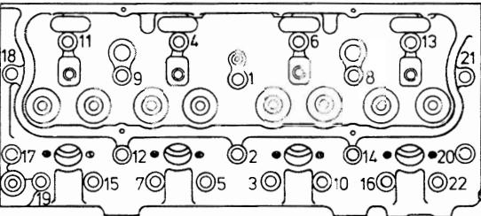

E12

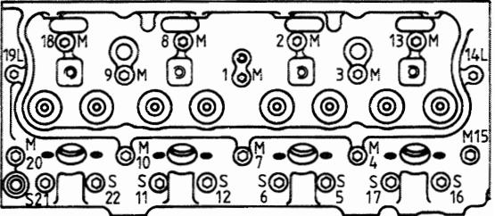

 $M = MEDIUM (12)$  $L = LONG(2)$  $(S = SHORT(8))$ 

E12A

 $\mathbf{I}$ 

#### **Cylinder Head Gasket** \*T4.236, Non Re-Torque

- 1. Use two studs in positions S16 and S21 (Figure E12A) to give cylinder head and gasket location.
- 2. Note TOP FRONT and FIT DRY instructions on cylinder head gasket (part numbers 3681E012 or 3681E016).
- 3. Fit gasket and head over location studs to cylinder block.
- 4. Ensure setscrews are free from distortion and change if necessary. Lightly oil threads and under flanged head of setscrews.
- 5. Remove two location studs and replace with setscrews. Note difference in length of setscrews, (Figure E12A.)

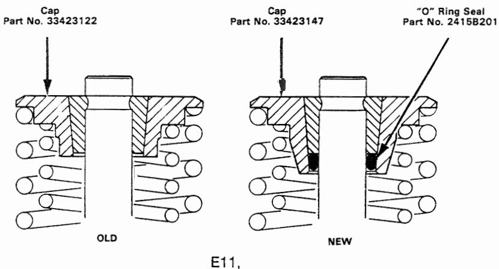

Valve Cap Sealing Arrangement

{40}------------------------------------------------

- 6. Tighten setscrews to 88lbf ft (11.8 kgf m) 120 Nm (cold) in the sequence shown in Figure E12A. Check that each setscrew is tight to 85-92 lbf ft (11,7-12,7) kgf m) 115-125 Nm and adjust if necessary.
- 7. Use the sequence given in Figure E12A and further tighten setscrews by a full half turn.

Special tool MS1531 can be used for this operation as follows:

- 1. After the setscrews have been tightened to 88 lbf ft (11,8 kgf m) 120 Nm, fit the tool between the socket spanner and the handle.
- 2. Put the stop against a suitable protrusion on the cylinder head to prevent movement of the degree dial in a clockwise direction (Fig. E15).
- 3. Turn the pointer to align with the 180° mark on the degree dial and tighten the setscrews in the correct sequence until the pointer on the tool aligns with the zero mark on the dial.

Note: No retightening or torque checking is necessary after the engine is run, or at the 500/1000 miles, (800/1600 km), 25/50 hour service interval.

\* After engine number LJ U027774M.

The non re-torque method also includes engines from engine number LD ..... U418405U, build lists LD70200/70201 and from engine number LH ..... U390335U, build lists LH70202/70213. (This applies to all engines after engine number 573000).

Ensure that the correct replacement gasket is fitted with either jointing compound or dry, depending on the gasket type. They should be fitted as shown in the gasket identification chart.

#### Always use a new cylinder head gasket.

| Type        | Identification       | With or without <b>Jointing Compound</b> |
|-------------|----------------------|---------------------------------------------|
| Klinger     | Black coloured       | Without                                     |
| Copper/     | Copper               | With on both sides                          |
| Aspestos    |                      |                                             |
| Cooper      | Silver               | Without                                     |
| Cooper with | Silver with strip of |                                             |
| Seal        | red or white seal    |                                             |
|             | on push rod edge     |                                             |
|             | and both faces       | Without                                     |
| Elring      | Gold coloured        | Without                                     |

#### To Refit the Cylinder Head

- 1. Ensure that the rocker assembly oil feed passage in the cylinder head is free from obstruction. Fit the cylinder head as described in the cylinder head gasket section.
- 2. Fit the push rods and refit the rocker shaft assembly. Fit a new rubber sealing ring to the rocker oil feed connection. With old type rocker oil feed connection, fit the new seal immediately below the lower convolution. so that when the pipe is inserted into the cylinder head, the "O" ring will roll up and over the lower

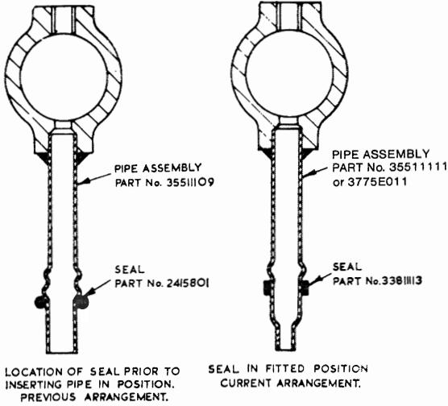

#### E13

convolution and locate itself correctly between the two convolutions (Fig. E.13).

With the latest type rocker oil feed connection, the rubber olive should be fitted in the recess in the cylinder head, before fitting the rocker shaft assembly.

3. Adjust the valve clearances, as detailed later. Fit the rocker cover.

Note: Where rocker cover joints have a coat of white shiny material on one edge, fit this to exhaust manifold side of engine.

4. Refit atomisers with new copper sealing washers ensuring that they seat squarely. Refit the high pressure fuel pipes (see Page N.11).

Note: Current atomisers are fitted with a spacer and rubber dust seal. The dust seal must always be renewed and fitted below the spacer.

- 5. Fit the breather pipe assembly to the cylinder head cover.
- 6. Refit the fuel filter to the cylinder head and the fuel pipe between the lift pump outlet and the filter.
- 7. Fit the fuel pipes between the filter and the injection pump inlet and outlet. Fit boost control pipe (D.P.S. Pump).
- 8. Refit the atomiser leak-off pipe assembly.
- 9. Refit inlet and exhaust manifolds. Manifold joints with an identification notch or square shoulder, must be fitted with the notch or square shoulder to the top of the manifold. Where corrugated type joints are used, they must be fitted without jointing compound.
- 10. Connect the exhaust pipe.
- 11. Refit the air filter and connections. Fit the water outlet hose. Re-connect the battery terminals.
- 12. Fill the cooling system and check for water leaks.
- 13. Bleed the air from the fuel system as detailed on Page N.9.
- 14. Run the engine until normal operating temperature is attained and retighten the cylinder head nuts/ setscrews, in sequence, to the torque given on Page B.2.

{41}------------------------------------------------

#### **CYLINDER HEAD MAINTENANCE-E.8**

Note:

1

 $\begin{array}{c} \hline \end{array}$ 

When retightening cylinder head nuts/setscrews, the engine coolant outlet temperature should not be less than 170°F (77°C).

If the nut/setscrew moves when retightening, then tighten up to the torque quoted on Page B.2.

15. Reset the valve clearances, as detailed below. Fit the rocker cover.

The 4.2482 and T4.38 vehicle engine cylinder head cover is fastened in position with a controlled pressure on the joint to give a positive seal. The cover is fastened down onto the rocker assembly retaining extension nuts until screw bottoms on threads, and is kept in position by a rubber seal and steel washer fastened between the cylinder head cover and cover retaining setscrews. The rubber sealing washer must be positioned with the radiused edge downwards.

#### To Check or Adjust Valve Tip Clearances

These are checked between the top of the valve stem and rocker arm (Fig. E.14) and should be 0.010 in (0,25 mm) with the engine hot or cold.

When adjusting valve clearances the following procedure should be adopted :-

- 1. With the valves rocking on No. 4 cylinder (i.e., the period between the opening of the inlet valve and the closing of the exhaust valve), set the valve clearances on No. 1 cylinder.
- 2. With the valves rocking on No. 2 cylinder, set the valve clearances on No. 3 cylinder.
- 3. With the valves rocking on No. 1 cylinder, set the valve clearances on No. 4 cylinder.
- 4. With the valves rocking on No. 3 cylinder, set the valve clearances on No. 2 cylinder.

#### **Closed Circuit Breather Vent Valve** (4.2482 Engines only)

This is fitted between the cylinder head cover and induction manifold.

To clean, seal the small breather hole in the top face and wash the unit in gasolene or kerosene. If air pressure is used to dry the unit, you must only use low pressure, because high pressure will damage the unit.

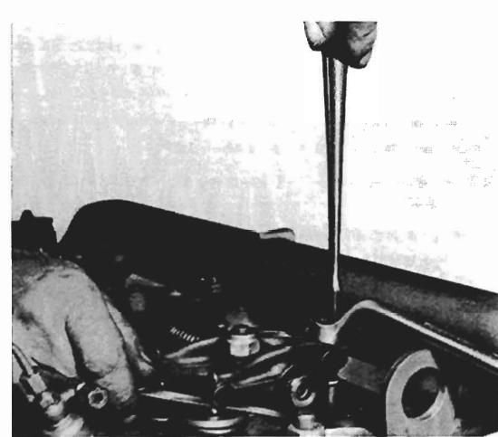

E14

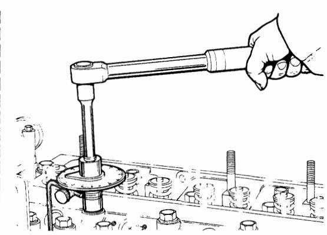

{42}------------------------------------------------

# **SECTION F Pistons and Connecting Rods**

#### To Remove Pistons and Connecting Rod **Assemblies**

- 1. Remove the cylinder head (Page E.1).
- 2. Drain and remove the lubricating oil sump. (T4.236 engines. To prevent damage to the piston cooling jets, where fitted, they should be removed).
- 3. Remove the nuts from the big end bolts.
- 4. Remove the big end caps, bearing shells and bolts (Fig. F.1).

Note: If the bearing shells removed are serviceable, refit them in their original positions.

5. Push pistons and connecting rods out of the top of the cylinders (Fig. F.2).

Note: Keep each piston and connecting rod assembly separate, each to each as marked

#### To Remove Pistons and Rings from **Connecting Rods**

- 1. Remove the rings from each piston.
- 2. Remove the circlips and withdraw the gudgeon pin. If the gudgeon pin is tight in the piston bore, warm the piston in clean liquid to a temperature of 100/120°F (38/49°C).

#### Inspection

- 1. Examine the pistons for scoring and clean carbon from the ring grooves. Check the clearance of the new piston rings in their respective grooves and if, with a new ring fitted the vertical groove clearance exceeds 0.008 in (0,20 mm) fit new piston.
- 2. Check the fitted gap of the rings in the unworn portion at top of cylinder bore. For details of ring gap dimensions see "Technical Data", Pages B.6 to B.7. Ring gaps for conformable rings are with spring fitted.

Check the fit of the gudgeon pin in the piston bore and in the small end bush. For details of piston bore, gudgeon pin and small end bush bore diameters see "Technical Data", Page B.8. When renewing a small end bush, ensure that the oil hole in the bush aligns with the hole in the connecting rod. Ream out to suit the gudgeon pin and check the connecting rod for parallelism see "Technical Data", Page B.8. The small end of the connecting rod on T4.236 engines is wedge shaped and the small end bush should be machined to suit the contours of the wedge. The earlier T4.236 connecting rod is also drilled from the big end to the small end to provide piston cooling by a feed of lubricating oil.

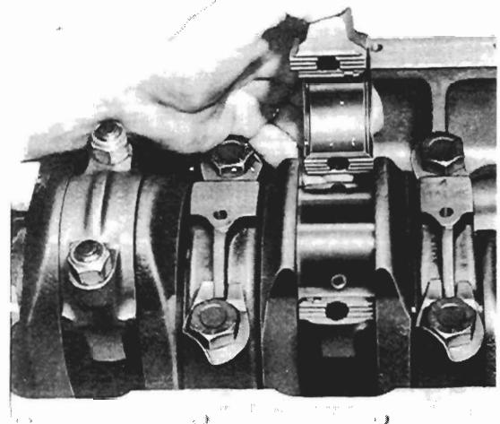

 $F1$ 

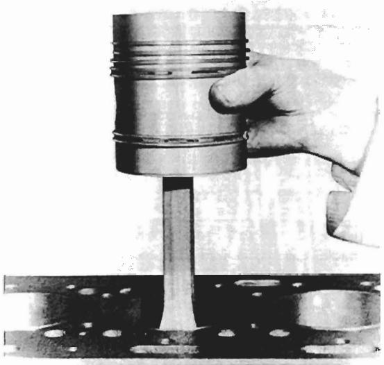

 $F2$ 

The majority of later turbocharged engines have piston cooling jets fitted in the cylinder block wall. The jets are fed with lubricating oil from holes tapped into the main oil gallery pressure rail. On some applications, a blanking plug is fitted into the cylinder block wall in place of the cooling jet assembly.

4. Examine the big end bearings for wear and scoring. Also examine the crankpins for wear and ovality. For crankshaft details see page B.8.

{43}------------------------------------------------

#### To Assemble the Pistons to the Connecting **Rods**

If the original pistons are being used they must be assembled to the original connecting rods. For markings of pistons and connecting rods see Figs. F.8 and  $F.9.$ 

- 1. The cavity in the piston crown is off-set towards one side of the piston. Place the piston on the connecting rod with the cavity towards the side of the rod which carries the rod and cap identification numbers. Insert the gudgeon pin and fit new circlips, warming the piston, if necessary.
- 2. Fit the rings in the following order, ensuring that the ring gaps are equally spaced around the piston.

#### (a) 4.2482 Engines (see Fig. F.4)

- Chrome Faced Spring Loaded Conformable Scraper -above gudgeon pin.
- Internally Stepped Taper Faced Compression second groove.
- Molybdenum Faced Internally Stepped Barrel Faced Compression - top groove.

When fitting the spring loaded conformable scraper ring, ensure that the latch pin enters both ends of the spring. With the ring gap diametrically opposite to the latch pin, position the oil control ring over spring correctly located in annular groove of ring, i.e., between the oil control ring and the bottom of the ring groove in the piston.

When fitting the internally stepped taper faced compression ring, ensure that the "step" is towards the piston crown.

When fitting the top compression ring, ensure that the manufacturers mark is towards the piston crown.

#### (b) 4.248 Engines (4 Ring)

†Spring Loaded Conformable Scraper above gudgeon pin. Internally Stepped Compression -

- third groove.
- \*Internally Stepped Compression
	- second groove.

Chrome Insert Barrel Faced Compression top groove.

+Some earlier A4.248 engines had a sealed power scraper ring fitted in the 4th groove.

When fitting sealed power rings, ensure that the ends of the spring loaded segment butt together and do not overlap.

\*On some earlier A4.248 engines rated up to 2,000 rev/min, the second compression ring is plain cast iron.

Some later engines, rated up to 2,000 rev/min, have internally stepped chrome faced rings in both 2nd and 3rd grooves.

4.236 Series Workshop Manual, March, 1988.

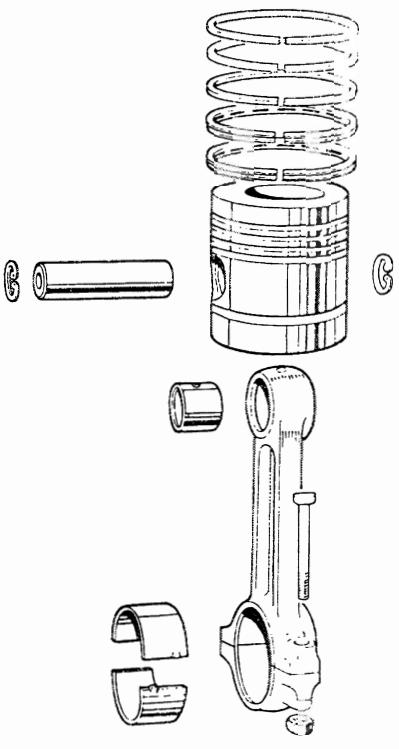

F3

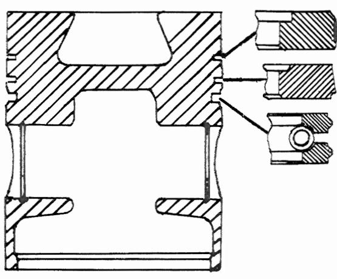

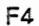

When fitting internally stepped compression rings, ensure that the step is towards the piston crown.

When fitting the spring loaded conformable scraper ring, ensure that the latch pin enters both ends of the spring. With the ring gap diametrically opposite to the latch pin, position the oil control ring over spring correctly located in annular groove of ring, i.e., between the oil control ring and the bottom of the ring groove in the piston.

{44}------------------------------------------------

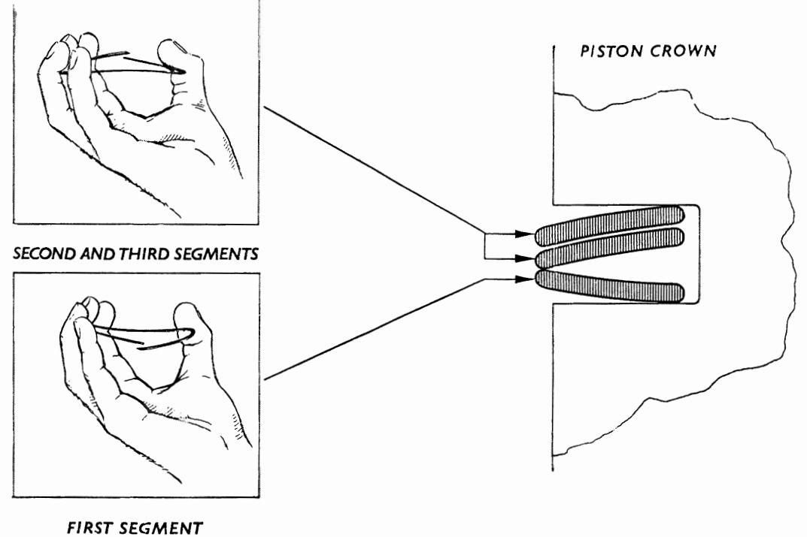

 $F5$ 

#### (c) 4.248 Engines (3 Ring)

Chrome Faced Spring Loaded Conformable Scraper - above gudgeon pin.

Internally Stepped Taper Faced Compression second groove.

Molybdenum Faced Internally Stepped Barrel Faced Compression - top groove.

When fitting the spring loaded conformable scraper ring, ensure that the latch pin enters both ends of the spring. With the ring gap diametrically opposite to the latch pin, position the oil control ring over the spring correctly located in the annular groove of ring, i.e., between the oil control ring and the bottom of the ring groove in the piston.

When fitting the internally stepped compression rings in the second and top grooves, ensure that the "step" is towards the piston crown.

When fitting the spring loaded conformable scraper ring, ensure that the latch pin enters both ends of the spring. With the ring gap diametrically opposite to the latch pin, position the oil control ring over spring correctly located in annular groove, i.e., between the oil control ring and the bottom of the ring groove in the piston.

When fitting the compression rings, ensure that the manufacturers mark is towards the piston crown.

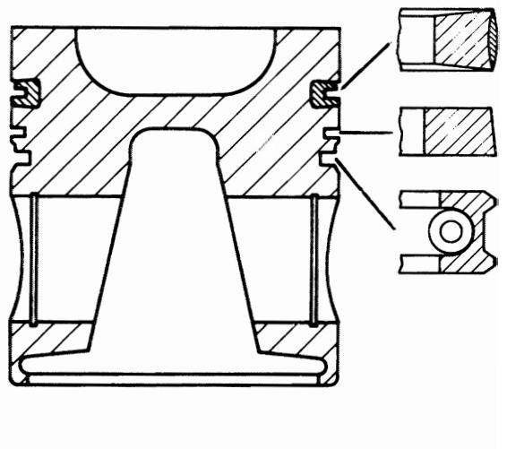

F6

### (d) T4.236 Engines (see Fig. F.6)

Chrome Faced Spring Loaded Conformable Scraper - above gudgeon pin. Chrome Taper Faced Compression -

!!!!!!!!!!!!!!!!!!!!!!!!!!!!!!!!!!!!!!!!

Molybdenum Faced Wedge Compression top groove.

{45}------------------------------------------------

#### (e) 4.236 Engines fitted with cast iron liners

Slotted Scraperbelow gudgeon pin. Slotted Scraperabove gudgeon pin. Internally Stepped Compression third groove. Internally Stepped Compression second groove. \*Chrome Faced Compression top groove

\*With later combine engines, a plain cast iron ring is fitted in the top groove. This plain ring is completely interchangeable with the earlier chrome faced ring. When overhauling combine engines, the later plain ring should always be fitted (in engine sets).

NOTE: From Engine No. 236U68569 fitted to combine applications, some piston ring packs have been altered from five to four rings. The two slotted scraper rings fitted in the forth and fifth grooves have been replaced by one conformable chrome faced ring in the fourth groove only, leaving the fifth groove empty.

On later engines, the slotted scraper fitted above the gudgeon pin has been replaced by a conformable scraper ring and on combine engines having an empty bottom groove has been fitted with a slotted scraper. Fit "step of internally stepped compression rings towards piston crown.

#### (f) 4.236 Engines fitted with chrome liners

Slotted Scraperbelow gudgeon pin. Slotted Scraperabove gudgeon pin. Laminated Compression third groove. Internally Stepped Compression second groove. Cast Iron Compression top groove.

NOTE: When fitting internally stepped compression rings, ensure that the "step" is towards the piston crown. Never fit chrome faced rings to engines having chrome plated liners.

Fit the laminated compression ring to the piston as follows: (ensure piston is positioned with the crown uppermost).

- 1. Fit the first segment to the piston so that when held horizontally between the thumb and fingers and radially compressed, the ring ends point downwards (see Fig. F.5). Place this ring on the bottom face of the groove and position gap over the gudgeon pin bore.
- 2. Fit the second segment on top of the first so that when held and compressed as described in (1) above, the ring ends point upwards (see Fig. F.5). Position the gap at 180° to that of the first segment.

4.236 Series Workshop Manual, February 1984.

3. The third seament should be fitted on top of the second, so that when held and compressed as described, the ring ends point upwards (see Fig. F.5). Position the gap immediately above that of the first segment.

If all the segments have been fitted in the groove correctly, they will be positioned as shown in the right hand illustration of Fig. F.5.

#### (g) 4.236 Engines (3 ring)

Chrome face, spring loaded conformable scraper above the qudgeon pin.

Chrome taper face compression, second groove.

Chrome barrel face, internally stepped compression, top groove.

Note: When fitting the internally stepped compression ring. ensure that the step is towards the piston crown, When fitting the spring loaded conformable scraper ring, ensure that both ends of the latch pin enter the spring and position the ring so that the gap is diametrically opposite the latch pin.

#### (h) 4.212 Engines

#### **High Compression Piston**

- Spring Loaded Conformable Scraperabove the gudgeon pin Internally Stepped Compression-
- second groove Chrome Faced Compressiontop groove

#### **Low Compression Piston**

\*Spring Loaded Conformable Scraperabove the gudgeon pin

- Internally Stepped Compressionthird groove
- Cast Iron Plain Compressionsecond groove
- Chrome Faced Compressiontop groove
- \*From engine no. 212UA147672 onwards a revised piston ring pack became effective which changed the Sealed Power Scraper to a Chrome Faced, Spring Loaded Conformable Scraper. The remaining rings stay unchanged. Earlier engines fitted with different piston and ring assemblies may be changed to the latest assembly.

Note: When fitting the internally stepped compression ring, ensure that the "step" is towards the piston crown.

When fitting the Spring Loaded Conformable Scraper ring ensure that both ends of the latch pin enter the spring and position the ring so that the gap is diametrically opposite the latch pin.

{46}------------------------------------------------

#### To Fit the Pistons and Connecting Rods to the Cylinder Bore

- 1. Before fitting the piston and connecting rod assemblies to their respective cylinder bores, liberally coat each bore and piston with clean engine oil.
- 2. Using a ring guide (Fig. F.7), insert the pistons and connecting rod into the top of their respective cylinder bores. The piston and rod number must relate to the cylinder into which it is being fitted and the rod identification number must be on the fuel injection pump side of engine. The word "Front" or arrow marked on the piston crown must be towards the front of the engine (Fig. F.9). (T4.236 engines, refit piston cooling jets; where applicable).
- 3. Fit the pearing shells and cap with the numbers on the same side of the rod and cap (Fig. F.8).
- 4. Refit the two connecting rod bolts so that the flat on the head of each bolt is located against the shoulder of the rod. Secure with two new nuts. See Page B.2 for Recommended Torque Tensions.
- 5. Refit the lubricating oil sump.
- 6. Refit the cylinder head (Page E.7).

#### **Fitting New Pistons**

The piston height can be checked by means of a straight edge and feeler gauges.

Correct piston heights above the cylinder block top face are as follows :-

| **4.2482                                 | 0.016/0.023 in (0.41/0.59 mm)                  |
|------------------------------------------|------------------------------------------------|
| 4.248                                    | 0.002/0.010 in (0,05/0,26 mm)                  |
| T4.236, 4.236 (2600 rev/min engine rated |                                                |
|                                          | speed and below) 0.014/0.023 in (0.35/0.58 mm) |
| 4.236, at 2800 rev/min engine            |                                                |
| rated speed                              | 0.011/0.019 in (0,28/0,48 mm)                  |
| 4.212                                    | 0.015/0.021 in (0.38/0.53 mm)                  |

\*\*The pistons have hard anodised crowns and must not be topped. To achieve this tolerance in production three grades of piston are used, H, M and L but for service use, only the L grade is available which can be below the tolerance figure given.

Note: See page B5 for engine cut in numbers.

ent should be fitted on top of the it when held and compressed as ring ends point upwards (see Fig. the gap immediately above that of ٦t.

s have been fitted in the groove be positioned as shown in the right Fig. F.5.

oaded conformable scraper above the

npression, second groove.

 $\Delta$ 

F7

នី (3 ring)

internally stepped compression, top

e internally stepped compression ring, owards the piston crown, When fitting the able scraper ring, ensure that both ends je spring and position the ring so that the posite the latch pin.

 $\frac{1}{2}$ 2iston ormable Scrapereon pin compression-

pression—

F8

**'iston** Conformable Scraperjudgeon pin

ed Compression-

Compression-**Nove** 

Compression-

212UA147672 onwards a revised became effective which changed ver Scraper to a Chrome Faced, Conformable Scraper. The remainunchanged. Earlier engines fitted ston and ring assemblies may be atest assembly.

ting the internally stepped comisure that the "step" is towards the

F9

the Spring Loaded Conformable nsure that both ends of the latch pring and position the ring so that netrically opposite the latch pin.

 $4.2$ 

{47}------------------------------------------------

{48}------------------------------------------------

# **SECTION G Cylinder Block and Liners**

#### **Cylinder Block**

For earlier engines, the cylinder block liner parent bore was machined to 4.236 or 4.248 size.

On later engines, the cylinder block liner parent bore is machined to 4.248 size, 4.1025/4.1035 in (104,20/ 104,25 mm) as standard for all 4.236 series engines, and thick or thin wall liners fitted accordingly.

#### To Renew Bush in No. 1 Camshaft Bore

Current engines have a bush fitted into No. 1 camshaft bore in the cylinder block.

A prefinished bush is available to replace a worn bush. The worn bush may be extracted and replaced by a new one, making sure that the oil holes in the bush and cylinder block correspond.

Note: The camshaft recess in later cylinder blocks is machined deeper and uses a different camshaft, gear and timing case joint.

#### **Cylinder Liners**

4.2482 engines are only fitted with flanged cast iron liners.

4.248 engines are fitted with flanged or flangeless cast iron liners.

T4:236 engines are only fitted with flanged cast iron liners.

4.236 engines are fitted with flanged or flangeless cast iron liners, or flanged chrome plated liners.

4.212 engines are fitted with flanged or flangeless cast iron liners.

Note: Only non-flame ring flanged liners are used in the later cylinder blocks, thick wall liners for 4.212/4.236/ T4.236 and thin wall for 4.248/4.2482 engines.

Flanged cast iron liners (which, in production, are an interference fit) should not be rebored, but replaced by a prefinished service liner (which is a transition fit).

Flangeless cast iron liners (which are an interference fit) can be rebored  $+0.030$  in (0,76 mm) oversize when the bores are worn to such an extent that engine performance is affected. Alternatively, new liners can be fitted which must be bored and honed to size after fitting.

Chrome liners (which are a transition fit) cannot be rebored and should be replaced by new when worn. Engines fitted with chrome plated liners can be identified by the letters "CL" stamped adjacent to the engine number on the cylinder block or a letter "C" contained in the engine number after the digits.

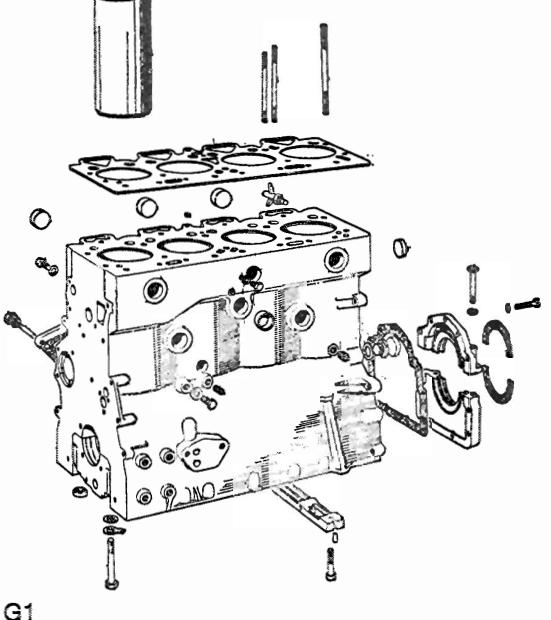

#### To Renew Flangeless Cylinder Liners (Cast Iron) 4.248, 4.236 and 4.212

- 1. Remove all components from the cylinder block.
- 2. Remove the cylinder head studs.
- 3. Press out the liners from the bottom.
- 4. With 4.248 engines rated up to 2,100 rev/min, all 4.236 and all 4.212 engines, lubricate the outside diameter of the liners with clean oil and press them in until 0.028/0.037 in (0,71/0,94 mm) of the liner is protruding above the cylinder block face (Fig. G2). Shim washers or a solid stop spacer 0.028/0.037 in (0,71/0,94 mm) thick should be used to give the correct protrusion.

With 4.248 engines rated above 2,100 rev/min, cylinder liners should be fitted with "Loctite". Ensure that the outside diameter of the liners and parent bores in the cylinder block are clean and absolutely free from oil and grease. Using Loctite Retaining Compound No. 640, coat a 1 in (25 mm) band around the tops of the parent bores and another 1 in (25 mm) band half way down each bore. Press in the liners allowing the same protrusion as quoted in the previous paragraph. Allow 3 hours for the Loctite to cure before machining liners to finished size.

Note: Earlier 4.236 engines incorporate a liner which when fitted is 0.006/0.009 in (0,15/0,23 mm) below the top face of the cylinder block. The later type liner can be identified by its length of 9.005/ 9.015 in (228,7/229,0 mm), compared with the length of the old type liner which is 8.963/8.973 in (227/227,9 mm). The old type liner must not be

{49}------------------------------------------------

#### **CYLINDER BLOCK AND LINERS-G.2**

fitted to give a protrusion of 0.030/0.035 in (0,76/ 0,89 mm) as the bottom piston ring may clear the bottom of the liner when the piston is at bottom dead centre.

5. Bore and finish hone the liners to the dimension given in "Technical Data", Page B.4. When using a boring bar on the top face of the cylinder block, fit a parallel plate between the boring bar and cylinder block face.

#### To Fit New Unbored Flanged Cast Iron **Cylinder Liners**

- 1. Remove all components from the cylinder block and press out the old liners from the bottom.
- 2. Lightly lubricate the outside of the new liner and press the liner progressively into the parent bore until the flange locates into the cylinder block flange recess. The limits for liner protrusion are given on Page B.4 and may be checked as shown in Fig. G.2.
- 3. Bore and finish hone the liners to the dimension given on Page B.4.
- 4. Re-assemble the engine components to the cylinder block.

#### To Renew Cylinder Liners (Prefinished Flanged Cast Iron or Chrome Plated) 4.2482, 4.248, T4.236, 4.236, 4.212

- (a) To Remove Liners
- 1. Remove all components from the cylinder block.
- 2. Remove the cylinder head studs.
- 3. Press out the liners from the bottom.

#### (b) Preparation for Fitting New Liners

Great care must be taken in handling, transit and storage of new prefinished cast iron or chrome plated liners, as the slightest burr or damage is sufficient to cause local distortion of the bore when fitted.

#### (c) To Fit New Liners

- 1. Clean thoroughly the parent bore. Clean the top 2 in (50 mm) and the recess for the liner flange with "Loctite" Safety Solvent or a similar product; use it in accordance with the manufacturers instructions.
- 2. Clean thoroughly the outer surface of the liner with "Loctite" Safety Solvent.
- 3. Lubricate lightly the parent bore with clean engine lubricating oil, except for the top 2 in (50 mm).
- 4. Ensure that the liner is vertical and press into the parent bore to within 2.0 in (50 mm) of the fitted position. Clean the area below the flange of the liner with "Loctite" Safety Solvent. Apply "Loctite" 640 to the top 1.0 in (25,4 mm) of the outer surface of the liner and under the flange; also apply "Loctite" 640 to the bottom of the flange recess in the parent bore.
- 5. Press the liner in to the fully fitted position and clean the "Loctite" from the top surface of the cylinder block.
- 6. With the liner fully home, check the relationship between the top of liner flange and the top face of the cylinder block to the limits given on Page B.4.
- 7. Allow 15 minutes to elapse before the liner bore

4.236 Series Workshop Manual, January 1993.

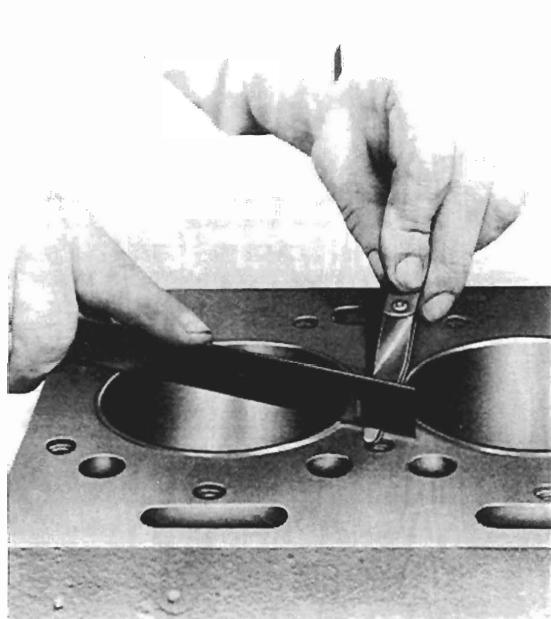

G2

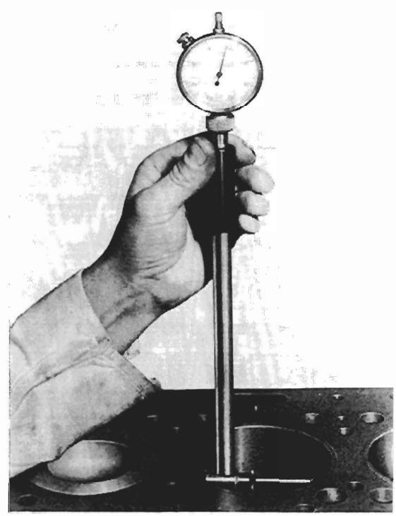

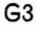

dimension is checked. The "Loctite" will reach full strength after 3 hours.

From engine No. 4702131A the liner flange recess depth in the cylinder block for thin wall chrome liners has been increased, see Page B.3. and a 45° chamfer added to this recess and the flange thickness of the thin wall chrome liner has also been increased, see Page B.4.

The later thin wall type liner may be used on earlier engines providing the top face of the liner comes within the earlier limits.

I

{50}------------------------------------------------

The latest cast iron flanged liner fitted to 4.236 and 4.212 engines has a radius under the flange instead of an undercut. The chamfer on the flange recess in the cylinder block, between the recess and the liner parent bore, has been changed from 0.010/ 0.015 in (0,25/0,38 mm) at 45° to 0.020/0.030 (0,51/0,76 mm) wide x 0.025/0.035 in (0,64/0,89 mm) deep to accommodate this radius. This latest liner also has a thicker flange and the relationship between the top of the liner flange and the top face of the cylinder block has been changed, see Page B.4.

It is advisable to allow a settling period to elapse before checking the fitted internal bore diameter of the liner. The acceptable limits are given on Page B.4.

Each new liner should be checked in three positions  $-$  top, centre and bottom; the readings being taken transversely and parallel to the centre line of the cylinder block. (Fig. G.3).

#### **Oversize Cylinder Liners**

Oversize outside diameter cylinder liners may be fitted to 4.236 factory rebuilt engines and are available for fitment in service where the standard parent bore is enlarged to remove damage. (Not thick wall liners). They are available as follows:-

Oversize **Description** 0.005 in (0.13 mm) Cast Iron Flangeless - bore and hone 0.010 in (0,25 mm) Cast Iron Flangeless - bore and hone 0.010 in (0,25 mm) Cast Iron Flanged - bore and hone 0.040 in (1,02 mm) Cast Iron Flanged - hone

Where a parent bore is reclaimed in service, it should be machined to the dimension by adding the appropriate liner oversize to the standard parent bore diameter given on Page B.3. The top of the parent bore must be re-chamfered after machining. The 0.040 in in oversize liner has a larger flange diameter than the standard liner and if reclaiming a parent bore with this liner, the flange recess diameter will have to be increased to 4.245/4.250 in (107,82/ 107,95 mm).

Where 0.005 in and 0.010 in oversize liners are fitted, the liner oversize is stamped on the cylinder block top face between the liner and the edge of the cylinder block. Where 0.040 in oversize liners are used, the number 1849 is stamped on the rear end of the block.

{51}------------------------------------------------

Downloaded from [www.Manualslib.com](http://www.manualslib.com/) manuals search engine

{52}------------------------------------------------

# **SECTION H Crankshaft and Main Bearings**

Some crankshafts can incorporate forged in balance weights whilst others do not have balance weights.

When replacing a crankshaft, always ensure that the correct type is fitted.

The crankshaft runs in five pre-finished replaceable shell bearings lined with aluminium tin.

End float is controlled by four thrust washers which are located on both sides of the centre main bearing housing 0.0075 in (0.19 mm) oversize thrust washers are available which may be combined with standard thrust washers to give an adjustment of 0.0075 in (0,19 mm) or when used on both sides of the bearing housing, give an adjustment of 0.015 in (0,38 mm).

The main bearings are located in position by tabs fitting into slots in the bearing housings.

The tabwashers as originally fitted to the main bearing cap setscrews on 4.236 engines, (see Fig. H2) have now been deleted, see Page B.2 for Recommended Torque Tensions.

Because Tufftrided crankshafts are fitted to some engines it will be necessary to identify the shaft before commencing regrinding operations.

It is important that the information on Page H.2 headed Regrinding the Crankshaft relevant to the Tufftriding process is adhered to.

#### To Renew the Thrust Washers

Renewal of thrust washers can be carried out without withdrawing the crankshaft, as follows :-

- 1. Remove the sump, sump strainer and the oil pump suction pipe (Page L.2).
- 2. Remove the centre main bearing cap containing the two bottom half thrust washers (see Fig. H.1). The two top half thrust washers should be removed by sliding round from one side. Identify each thrust washer half to its relative position.
- 3. To refit the thrust washers, liberally oil the two upper halves and slide them into the recesses provided on either side of the main bearing housing.

The steel side of the thrust washers should be towards the bearing housing and the cap. Refit the cap with the lower half thrust washers, secure with the setscrews tightened to the torque given on Page B.2.

Note: Later type thrust washers are non reversible and are not interchangeable with the earlier type. Replacement thrust washers must be of the same pattern as the originals.

- 4. Check the crankshaft end float for a clearance of 0.004/0.015 in (0.10/0.38 mm), Fig. H.4.
- 5. Refit the oil suction pipe to the oil pump.
- Refit the sump strainer and sump. 6.

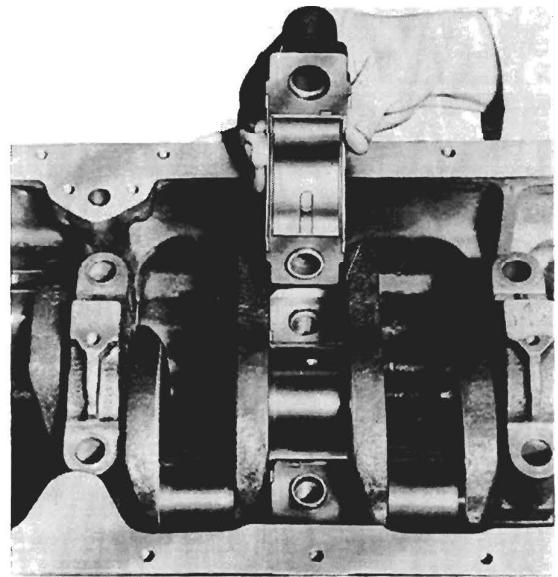

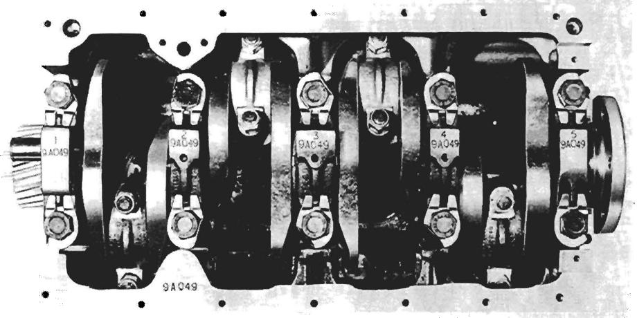

H2

{53}------------------------------------------------

#### To Remove the Crankshaft

It will be necessary to remove the engine from the vehicle or application.

- 1. Remove the sump, sump strainer and the oil pump suction and delivery pipes.
- 2. Remove the timing gears and timing case (Section K).
- 3. Remove the flywheel and flywheel housing.
- $4.$ Remove the connecting rod caps and big end bearings (Page F.1).
- 5. Remove the rear main bearing oil seal housing (Fig. H.8).
- 6. Take off the rear main bearing bridge piece.
- 7. Remove the oil pump (Page L.2).
- 8. Remove main bearing setscrews.
- 9. Remove the main bearing caps and half bearings.
- 10. Lift out the crankshaft and remove remaining half bearings.

#### **Regrinding the Crankshaft**

Before commencing regrinding operations, examine the crankshaft to see if it has been hardened by the Tufftriding process. The shaft may be identified by Part No. which will be found on the front end or on No. 1 web.

if the crankshaft is identified as a Tufftrided shaft then it will be necessary to re-Tufftride it regardless of the diameter to which it is reground.

If facilities are not available for re-Tufftriding a replacement shaft should be obtained.

Before regrinding the crankshaft it should be crackdetected.

Demagnetise the crankshaft after crack detecting.

The main journal and crankpin diameters should be checked to ascertain the next size to which the crankshaft can be reground, i.e., -0.010 in (-(0,25 mm), -0.020 in (-0.51 mm) or -0.030 in (-0.76 mm). If it requires to be reground below -0.030 in (-0.76 mm) a new crankshaft must be fitted.

After regrinding, the sharp corners on the oil holes should be removed and the crankshaft crack detected and demagnetised.

Note: It is important that the radii on the main journals and crankpins are maintained.

The crankshafts of engines fitted with Lip Type rear oil seals have a rear flange with an extended width of over one inch (25 mm) to provide a seat for the lip seal (Page H.5). If all the three positions for this seal have been used, the sealing area of the flange may be reground to a minimum diameter of 5.243 in (133,17 mm), leaving an unmachined diameter for a distance of 3/16 in (4,8 mm) from the rear end (see Fig. H11).

Only the minimum of metal should be ground off to ensure removal of the seal wear grooves and the surface finish should be the same as the crankpins and journals.

It is not necessary to re-Tufftride the flange after this operation.

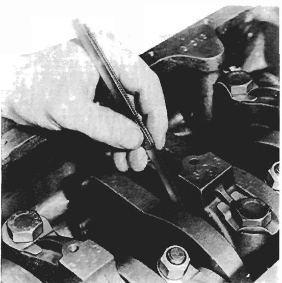

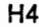

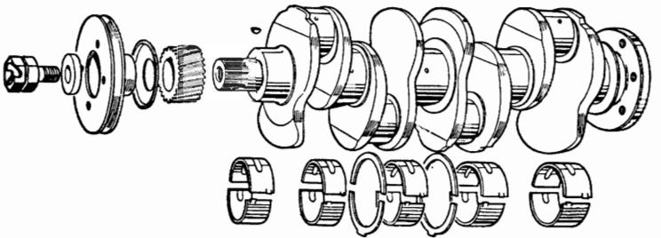

H3

{54}------------------------------------------------

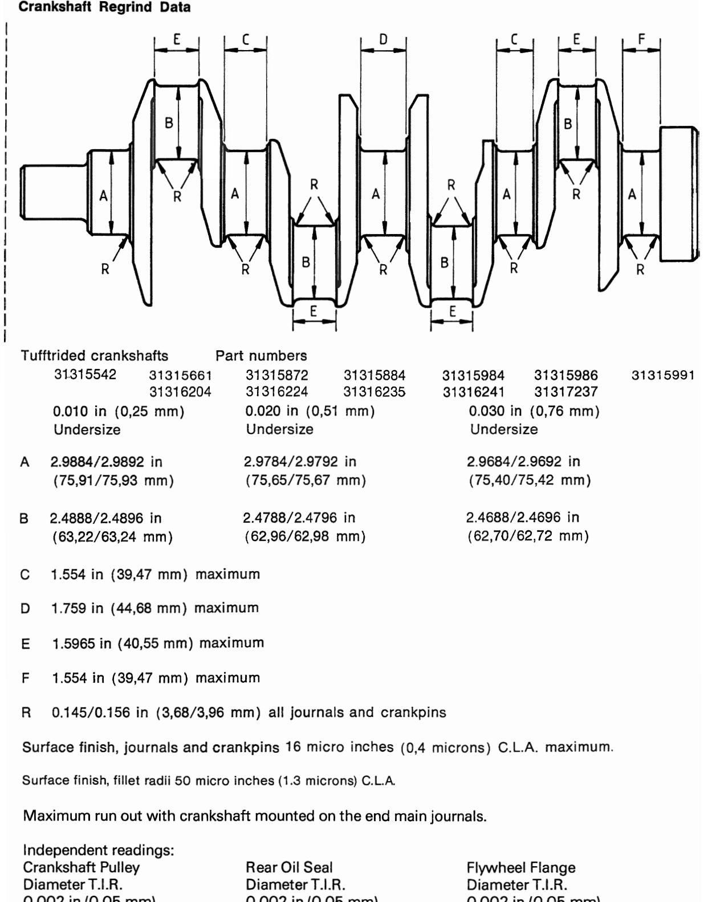

| Journals T.I.R. |                     |                                          |                     |          |
|-----------------|---------------------|------------------------------------------|---------------------|----------|
| Number 1        | Number 2            | Number 3                                 | Number 4            | Number 5 |
| Mounting        | $0.003$ in          | !!!!!!!!!!!!!!!!!!!!!!!!!!!!!!!!!!!!!!!! | 0.003 in            | Mounting |
|                 | $(0.08 \text{ mm})$ | $(0.15 \text{ mm})$                      | $(0,08 \text{ mm})$ |          |

{55}------------------------------------------------

#### **CRANKSHAFT AND MAIN BEARINGS-H.4**

#### To Refit the Crankshaft

- 1. The oilways in the cylinder block and crankshaft must be free from obstruction.
- 2. Check the main bearing setscrews for stretch or damage. Only setscrews supplied by the engine manufacturer should be used as they are of a special heat treated high grade steel.
- 3. Clean the bearing housings, place the top half bearings in position and liberally oil.
- 4. Position the crankshaft.
- 5. Oil the two upper thrust washer halves and slide into the recesses provided on either side of the centre main bearing housing.
- 6. Liberally oil and fit the lower halves of the main bearings to the bearing caps. Fit the caps to their respective positions so that the lower halves of the thrust washers are correctly positioned on either side of the centre main bearing cap. The main bearing caps are numbered, No. 1 commencing at the front of the engine. Each cap is also marked with a serial number as stamped on the cylinder block bottom face. These should read in line (Fig.  $H.2$ ).
- 7. Fit the setscrews. Shim washers originally fitted between the setscrew head and the main bearing cap have now been deleted.
- 8. Tighten the main bearing setscrews to a torque given on Page B.2.
- 9. Check the crankshaft end float for a clearance (Fig. H.4).
- 10. Refit the connecting rod caps and big end bearings (Page F.5).
- 11. Refit the rear main bearing bridge piece to the cylinder block (Fig. H.5). The rear face should be flush with the rear face of the cylinder block (Fig. H.6).
- 12. Fit new seals in the rear main bearing oil seal housings and refit the housings as described in "Crankshaft Rear End Oil Seal".
- 13. Refit and correctly align the flywheel housing (Page P.1). Refit the flywheel.
- 14. Refit the oil pump, timing case and timing gears (Page L.4 and Section K).
- 15. Refit the sump, sump strainer and the oil pump suction and delivery pipes.

 $\mathbf{I}$ Note: Later engines will have a cast iron bridge piece and sealant is used in place of the end seals (2) shown in Fig. H5.

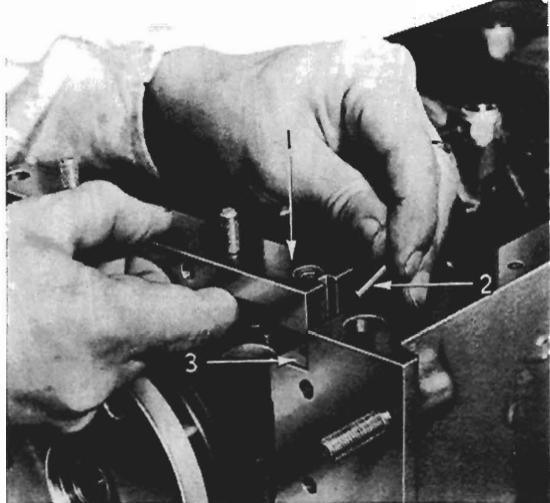

 $H5$ 

- 1. Bridge-piece.
- 2. Bridge-piece End Seal. 3. Joint (if fitted).

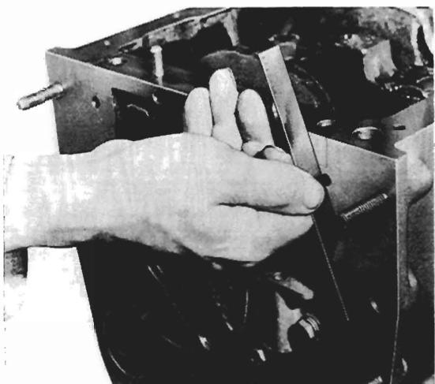

H6

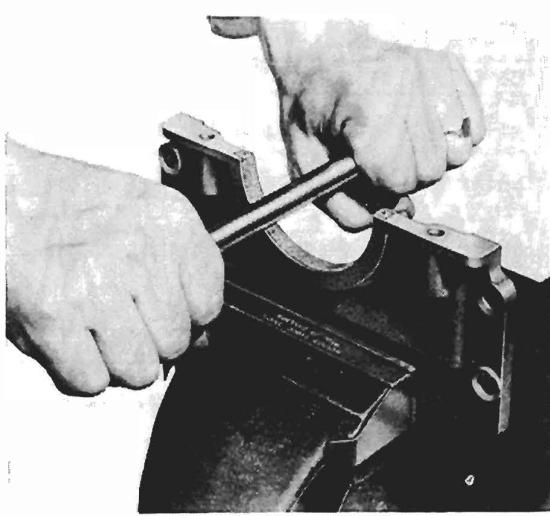

 $H7$ 

{56}------------------------------------------------

#### Rope Type Rear End Oil Seal

The housing consists of two halves bolted around the rear of the crankshaft which has a shallow spiral oil return groove machined in it to a depth of 0.004/0.008 in (0,10/0,20 mm). The bore of the housing accommodates a rubber cored asbestos strip comprising two sections.

When fitting the seal the following procedure should be adopted:-

- 1. Set up a half housing in the vice with the seal recess uppermost and settle approximately 1 in (25 mm) of the strip, at each end, into the ends of the groove so that each end of the strip protrudes 0.010/0.020 in (0,25/0,50 mm) beyond the half housing joint face.
- 2. With the thumb or finger press the remainder of the strip into the groove, working from the centre. Use a round bar to further bed in the strip by rolling and pressing its inner diameter (Fig. H.7).
- 3. Fit the sealing strip to the other half housing in a similar manner.
- 4. Fit a new joint using jointing compound applied both sides.
- 5. Spread a film of graphite grease over the exposed inside diameter surface of the strip.
- 6. Assemble the half housings around the crankshaft rear journal and fasten together (Fig. H.8).
- 7. Swivel the complete seal housing on the shaft to bed in the strips and to establish that the assembly turns easily on the shaft.
- 8. Bolt the seal housing to the block and rear bridge piece.

#### Lip Type Rear End Oil Seal

Later engines will be fitted with a circular spring loaded lip seal that locates around the periphery of the flange of the crankshaft. The seal is designed to function correctly with the direction of rotation of the engine and for identification purposes the seal is marked with an arrow.

The lip type oil seal assembly and its counterpart crankshaft are not interchangeable with previous types.

This seal is easily damaged and extreme care should be taken when handling and fitting it. Any visual damage across the lip of a new seal will cause leakage and prevent bedding in of the seal.

Earlier seals have a flat rear face as shown in Fig. H.9. Later seals have a protruding dust lip from the rear face as shown in Fi.g H.10.

#### To Fit Lip Seal in its Housing

On production, the old type seal was fitted flush with the rear face of the housing (Fig. H.9) but the new type seal is fitted deeper into the housing at 'A', Fig. H.10.

In service, when a new seal is fitted to a worn crankshaft, it should be pressed further into the housing. In the first instance it

#### **CRANKSHAFT AND MAIN BEARINGS-H.5**

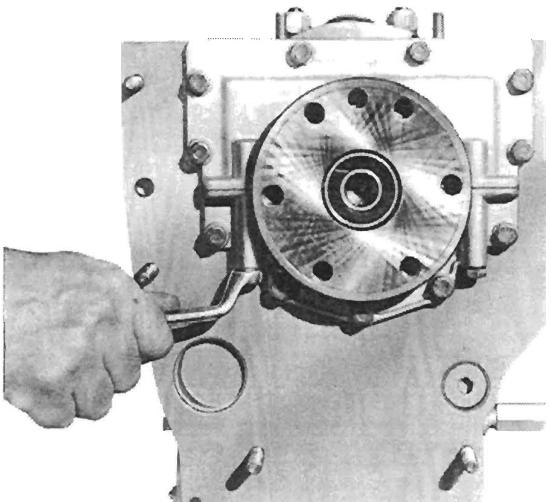

#### $H8$

can be pressed in to 1/8 in (3,2 mm) for old type seals or position 'B' for new type seals or, if this position has been used, to 1/4 in (6,4 mm) for old type seals or position 'C' for new seals.

If a new type seal is used in place of an existing old type seal, position 'C' should be used if the old seal was fitted 1/8 in (3,2 mm) below the housing face.

If all three positions have been used, it may be permissible to machine the worn sealing area of the crankshaft flange (See Page H.2), but not the spigot area on which the flywheel locates (see Fig. H.11).

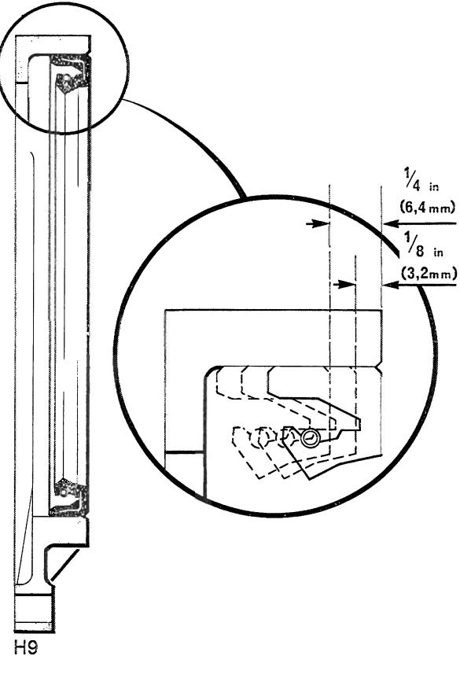

{57}------------------------------------------------

#### **CRANKSHAFT AND MAIN BEARINGS-H.6**

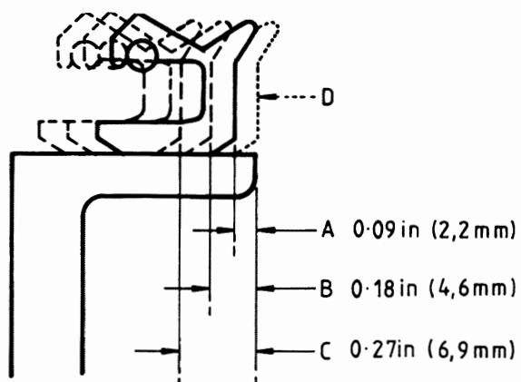

H10

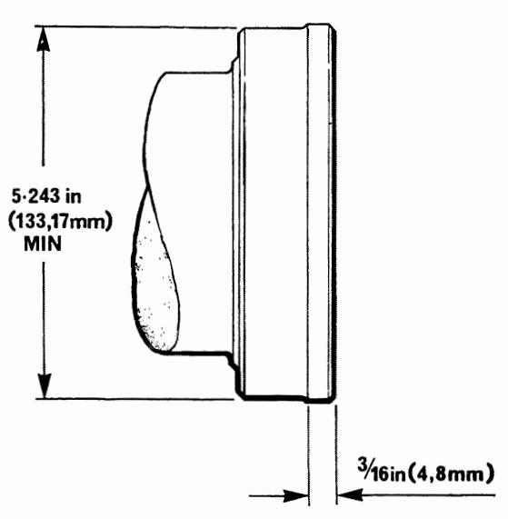

H11

When a new seal is fitted to a new or reconditioned crankshaft in service, it should be fitted in the production position, but if the latest seal is not to be used in a wet back end application, it can be fitted flush with the housing rear face ('D', Fig. H.10).

When pressing in the latest type seal, ensure that the adaptor has a suitable recess to clear the protruding dust lip. Tool PD145C can be used with both type seals.

Before fitting the seal in the housing, carefully examine the seal for damage especially on the lip and outside diameter.

Using clean engine lubricating oil, lubricate the outside diameter of the seal and the inside diameter of the housing.

Press the seal into the housing to the required position, taking care that the seal is entered and pressed in squarely, otherwise damage to the outside diameter of the seal may occur or, if it is not square in the housing when fitted to the engine, it may leak.

#### To Fit Lip Seal Housing

Clean the faces of the cylinder block and oil seal housing and the outside diameter of the crankshaft flange.

Check that the seal and the outside diameter of the crankshaft flange are not damaged. Where a new seal has been fitted, check that it is in the correct position as previously detailed.

Ensure that the two dowels are fitted in the cylinder block (Fig. H12). Coat both sides of the joint with Perkins Hylomar jointing compound and position the joint over the dowels in the block.

Using clean engine lubricating oil, lubricate the crankshaft flange, the seal and the seal guide. The lubrication of the seal is necessary to prevent damage that may be caused by initial dry running.

Position the seal and housing on the seal guide, locate the guide on the crankshaft flange and gently press the seal and its housing into position on the flange, locating the housing on its dowels (Fig. H12).

Withdraw the guide and secure the housing with setscrews and washers.

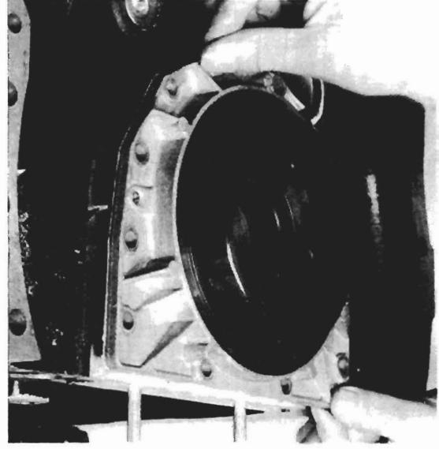

H12

4.236 Series Workshop Manual, May 1986.

{58}------------------------------------------------

# **SECTION J Balancer Unit**

On certain applications a balancer unit is incorporated in the engine sump, from which the lubricating oil pump is driven. The balancer unit can be either a front or centre mounted type.

It is important to note that, on some of these applications, a crankshaft is fitted which has no balance weights, as distinct from the crankshaft on other applications which can incorporate balance weights which are forged in the manufacturing process.

When replacing a crankshaft, the correct type should be fitted as determined by the displaced crankshaft.

It is also important to note that balancer units vary according to which side of the engine, the lubricating oil filter is fitted. When replacing a balancer unit, always ensure that the correct type is being fitted.

#### **Balancer Unit, Front Mounted**

#### **To Remove**

Remove the lubricating oil sump.

Remove the balancer unit assembly, complete with the lubricating oil pump.

#### **To Dismantle**

Remove the seven setscrews and washers securing the lubricating oil pump to the balance unit.

Remove the oil pump, complete with backplate and driving gear, if possible. Should the backplate and driving gear remain in position on the balance unit they must be removed separately.

From the front of the balancer unit, remove the idler gear hub retaining nut or setscrew.

Remove the idler gear hub, idler gear and thrust plate.

Remove the two socket headed grubscrews in each of the balance weights.

Press out each of the shafts in turn, towards the drive end, taking care that the keys in the shafts do not foul the bushes in the drive end of the balancer frame. Insufficient care could result in the bushes being damaged and this would mean replacement of the complete frame assembly.

Both balance weights may now be lifted from the balancer frame, complete with their respective gears

Should it be necessary to renew either the balance weights or coupling gears, remove the three socket headed capscrews in each balance weight assembly and take off the coupling gears.

Remove the two thimbles which locate between the frame and the cylinder block.

Remove the seven plugs from the oilways in the balance frame and clean out the oilways.

#### Important

| When refitting the socket headed capscrews which secure the coupling gears to the balance weights, also the socket headed grubscrews in the balance weights and the idler gear and hub securing stud, "Loctite" grade 601, should be used on the threads in the following  $manner: -$ 

#### Use of "Loctite"

Thoroughly clean both male and female threads with a suitable degreasing fluid such as "Loctite Safety Solvent" (not kerosene) allowing 15 minutes for it to dry. It is recommended that, where possible, "Locquic" Q Activator be used for this purpose as it will considerably reduce the curing time.

Apply a light coating of "Loctite" grade A, to both male and female threads, fit the stud or screw and tighten to the specified torque.

A curing period of 24 hours (1 hour if "Locquic" Q Activator has been used) at room temperature must now be allowed before the engine is started.

#### To Re-assemble the Unit

#### **Note**

Replacement bushes for the balancer frame are not serviced separately and if wear is evident, a replacement balancer frame assembly must be obtained, complete with bushes already line-bored. Later balancer units have needle race bearings fitted in place of bushes and are not interchangeable with bushes.

When needle race bearings are fitted, then the balancer unit drive and driven shafts, bearings, keys and oil pump gears must be changed after 5,000 hours operation.

Balancer units incorporating needle race bearings were introduced as from the following Engines Nos

212U5821L 212UA188070L 236U159054L 236UA102116 (rear end rope seal) 236UA103692L (rear end lip seal) 248U34896L 248UA123725 (rear end rope seal) 248UA124785L (rear end lip seal)

Current balancer units have reversed balance weights where the gears are fitted to the rear of the weights instead of the front as shown in Fig. J.1. and thicker section roller race bearings are fitted.

When replacing needle or roller race bearings, they should not be hammered in, but pressed in using a suitable dolly. Needle race bearings should be pressed in to a minimum of 0.008 in (0,20 mm) from the end of the housing. Thicker section roller race bearings should be pressed in so that a clearance of 0.030/ 0.040 in (0,76/1,02 mm) is left between the end faces of all bearings and inside face of the frame bosses.

{59}------------------------------------------------

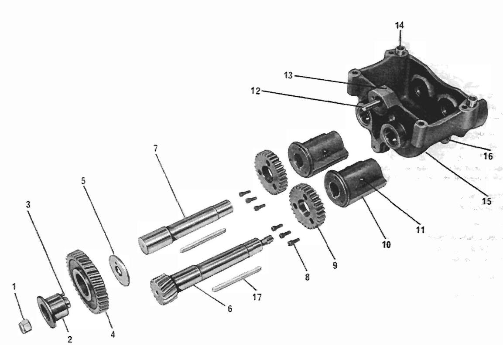

 $J1$ 

| 1. | Idler Gear Hub Retaining Nut           |   |
|----|----------------------------------------|---|
|    | or setscrews (later engines)           |   |
| 2. | Idler Gear Hub                         |   |
| 3. | Idler Gear Hub Dowel                   | 1 |
| 4. | Idler Gear Assembly                    |   |
|    | (complete with bush)                   |   |
| 5. | Idler Gear Thrust Plate                |   |
| 6. | Driving Shaft                          | 1 |
| 7. | Driven Shaft                           |   |
| 8. | Balance Weight Gear Retaining Screws 6 |   |
| 9. | <b>Balance Weight Gear</b>             |   |

Current engines have reversed balance | weights where the gears are fitted to the rear | of the weights.

#### **Note**

Replacement bushes are not serviced separately for the idler gear. A replacement idler gear, complete with pre-finished bush must be fitted.

The stud which secures the idler gear and hub to the balancer frame is available as a spare part but need not be removed from the balancer frame unless it requires replacing.

| 10. Balance Weight                  | 2            |
|-------------------------------------|--------------|
|                                     |              |
| 11. Balance Weight Locating Screw   | 4            |
| 12. Idler Gear Hub Stud             | $\mathbf{1}$ |
| 13. Balance Weight Frame Plug       | 5            |
| 14. Frame to Cylinder Block Thimble | 2            |
| 15. Frame Assembly (complete with   |              |
| bushes)                             | 1            |
| 16. Balance Weight Frame Plug       | 2            |
| 17. Balance Weight Locating Key     | 2            |

4.236 Series Workshop Manual, February 1984.

{60}------------------------------------------------

Having renewed any part showing signs of wear, proceed as follows:-

Replace the seven plugs in the oil drillings of the balancer frame.

Should it have proved necessary to renew the idler gear and hub securing stud, fit the new stud, using "Loctite" 601.

Should it have been necessary to remove the coupling gears from the balance weights, using "Loctite" 601, reassemble, finally tightening the socket headed capscrews to a torque of 11 lbf ft (1,52 kgf m) - 15 Nm.

Where necessary, renew the shaft keys.

Stand the balancer unit on its lubricating oil pump end face.

Place the two balance weights complete with gears into the frame, coupling the gears so that when the shafts are partially entered, the keys are in the same relative position, i.e. both at top dead centre or both at bottom dead centre.

Ensure that each shaft is related dead centre to the bushes at the front and rear of the frame and press in until the drive shaft (with integral gear) is fully home and the end of the driven shaft is flush with the drive end face of the balancer frame.

Extreme care must be taken when pressing in the shafts, to prevent the keys from touching the drive end bushes (where fitted) or the needle bearings as they pass through. The slightest damage caused this way could result in seizure of the unit and severe consequential damage to the engine.

Using "Loctite" 601, fit the two grubscrews to each balance weight and tighten to a torque of 71/2 lbf ft  $(1,03 \text{ kgf m}) - 10 \text{ Nm}$ . Do not omit degreasing before using "Loctite".

Fit thrust plate, idler gear and hub so that the single centre punch mark on the idler gear registers between the two punch marks on the integral balance shaft gear. Ensure that the dowel in the hub locates in the corresponding hole in the balancer frame.

Fit the idler gear and hub retaining nut or setscrew and tighten to a torque of 40 lbf ft  $(5,53 \text{ kgf m})$  -54 Nm.

Revolve the unit by means of the idler gear to ensure that the action is quite free.

Place the oil pump back plate in position at the rear of the balancer unit.

Fit the oil pump drive gear onto the end of the balancer drive shaft.

Fit the oil pump idler gear onto the idler shaft in the pump and refit the pump housing to the balancer unit, securing with seven setscrews and washers to a torque of 21 lbf ft (2,90 kgf m) -28 Nm.

Revolve the balancer unit idler gear once more to ensure freedom

Continue revolving the idler gear until the punch marks once more coincide. This may take several revolutions.

#### **To Replace**

Place the two locating thimbles into their bores and refit the balancer unit to the cylinder block, ensuring that the single centre punch mark on the crankshaft gear registers between the two punch marks on the idler gear of the balancer unit.

The balancer unit is now timed to the engine. When fitting the balancer unit to an engine where the front end has not been stripped, it will not be possible to observe the punch mark on the crankshaft gear for the purpose of timing the unit to the engine.

In this case, the engine should firstly be rotated so that either the piston of No. 1 or No. 2 cylinder is at top or bottom dead centre. Bottom dead centre is preferable as any error greater than one gear tooth will cause a foul between the weights and the connecting rod in this position, making it obvious that the balancer unit has been wrongly timed.

Revolve the idler gear until the single centre punch mark on the idler gear registers between the two punch marks on the balancer shaft drive gear.

Suitably mark with chalk, a tooth of the drive gear to align with another chalk mark on the frame.

In this position, fit the balancer unit to the engine, checking that the weights have not moved by observing alignment of the chalk marks.

As a further check, observe that the single punch mark on the idler gear still registers between the two punch marks on the balancer shaft gear, in alignment with the gear centres. Accuracy in timing the balancer unit to the engine is essential as an error will cause serious consequential damage to the engine.

The ability to turn the engine over by hand is not necessarily proof that the balancer unit is correctly timed.

Secure the balancer unit to the cylinder block with the four setscrews and washers, tightened to a torque of 40 lbf ft (5,6 kgf m) - 54 Nm.

After fitting the balancer unit to the cylinder block and especially in the case where a new balancer unit frame has been incorporated, check to see that there is clearance between the balancer unit frame and No. 1 main bearing cap.

Refit the sump in the normal manner, as described in the relevant service literature.

{61}------------------------------------------------

#### **Balancer Unit, Centre Mounted**

#### **To Remove**

Drain the lubricating oil.

Remove sump.

Support the balancer unit (Caution, the unit weight approximately 55 lbs (25 kg) and remove the six bolts and washers.

#### **To Dismantle**

- 1. Remove idler gear assembly (see 16, 17, 19 and 21 Fig. J.2) by removal of the idler gear hub (see 16, Fig. J2). Use a 0.984 in (25 mm) AF Allen key in the idler gear hub Allen key socket or remove setscrew. Ensure that the idler gear assembly is removed complete to prevent parts from damage.
- 2. Remove balance weights cover.
- 3. Remove driveshaft/gear (see 15, Fig. J2) and balance weight drive gear (see 3, Fig. J2) by removal of locknut (see 4, Fig. J2). Lightly use hammer and drift on shaft at locknut end position to release Loctite seal of shaft and balance weight drive gear spline. Ensure shaft threads are not damaged and that the needle bearings are not damaged when the diriveshaft is slid out.
- 4. Remove lubricating oil pump and suction pipe (see 8 and 11. Fig. J.2) by removal of three setscrews which hold the lubricating oil pump to the balancer frame.
- 5. Remove lubricating oil pump relief valve as follows:
	- a) Spring pin which holds relief valve assembly in position.
	- b) Spring cap, spring and plunger.

Note: The spring pin must be removed carefully to ensure that the spring and spring cap are not lost or cause damage to the operator when the spring pressure is released (see Fig. J10).

On assembly ensure the correct relief valve is used. Turbocharged engines have a higher rated spring than the naturally aspirated engine for higher lubricating oil pressure.

- 6. Remove balancer lubricating oil transfer plate (see 7, Fig. J.2). Note position of lubricating oil direction indicators on the outside of the transfer plate for correct assembly purposes (see Fig. J.3).
- 7. Remove frame end cover (see 6, Fig. J.2).
- 8. Remove balance weights carefully so driven weight gear does not damage the bearings.
- 9. Do not remove lubricating oil direction plugs (see 'A' and 'B', Fig. J.4 and J.5). Removal of the plugs can damage the threads and make the frame faulty, a new frame will then be needed. When right or left hand lubricating oil filters are fitted to the engine the correct balancer unit with the correct lubricating oil flow must be fitted to suit the filter position.

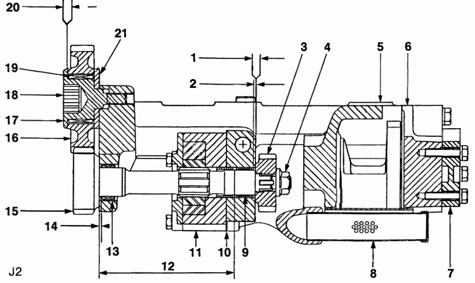

- | 1. Drive shaft end float, 0.005/0.012 in (0,13/0,30 mm).
- | 2. Drive shaft rear bearing, dim. below machined surface
- 0.079/0.118 in (2,00/2,30 mm).  $\mathbf{I}$
- 3. Balance weight drive gear.
- 4. Balance weight drive gear nut.
- 5. Balance unit frame
- 6. End cover.
- 7. Lub. oil transfer plate.
- Lub. oil suction pipe. 8.
- 9. Drive shaft gear bearing.
- 10. Joint.
- 11. Lub. oil pump assembly.

- 12. Drive shaft, rear of bearing to front face 5.126/5.164 in.  $(130.2/131.2$  mm).
- 13. Drive shaft front bearing.
- 14. Drive shaft front bearing, dim. below front face of frame 0.098/0.118 in (2,5/3,0 mm).
- 15. Drive shaft gear.
- 16. Balancer unit idler gear.
- 17. Idler gear hub.
- 18. Idler hub, Allen key recess or setscrew.
- 19. Idler gear hub bearing. 21. Idler gear thrust washer.
- 20. Idler gear end float, 0.003/0.009 in (0,08/0,23 mm).

{62}------------------------------------------------

- 10. Clean all lubricating oil passages with a Kerosene spray. Dry lubricating oil passages with air pressure.
- 11. Check front and rear driveshaft/gear needle bearings for damage or wear, renew if necessary.
- 12. Check balance weight bearings for damage or wear, replace if necessary.
- 13. Check balance weights for wear or damage on shafts and gears (see 'A' and 'D', Fig. J.7), renew if necessary.

Note: Balance weights should be renewed as a pair and not singly.

#### To Fit new Bushes and Bearings

Note: Where needle bearing and bush bearing are renewed, they must be pressed into position with mandrels made to the dimensions given in Fig. J.6.

#### **Frame Bushes**

Clean and lubricate parent bores and press in bushes (see 'A' and 'D-, Fig. J.7) in a continuous movement until they are 0.128/0.130 in (3,25/3,30 mm) below the machined face (see 'B', Fig. J.7) with mandrel.

#### Frame end cover bushes

Clean and lubricate parent bores (see 6, Fig. J.2) and press in bushes (see 'D', Fig. J.7) in a continuous movement until they are 0.128/0.130 in (3,25/3,30 mm) below the machined face (see 'C', Fig. J.7) with mandrel.

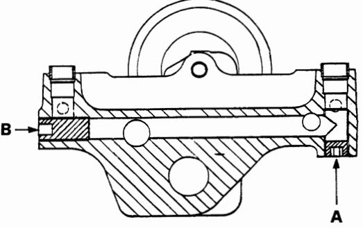

 $J4$ Right Hand mounted oil filter

RH mounted lub. oil filter.

- A. Short hexagonal socket head plug position.
- B. Long square socket head plug position.

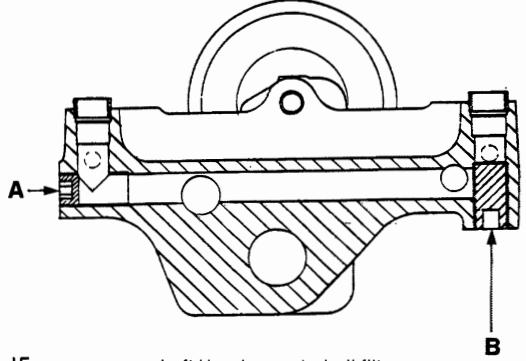

J5 Left Hand mounted oil filter

LH mounted lub. oil filter.

- A. Short hexagonal socket head plug position.
- B. Long square socket head plug position.

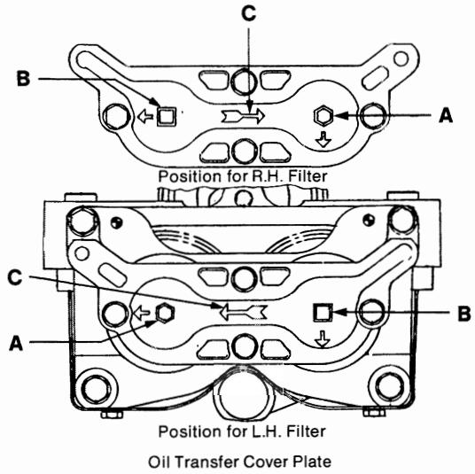

#### J3

Raised symbols to indicate:

- A. Hexagonal socket head plug position.
- **B.** Square socket head plug position.
- C. Oil flow indication for RH or LH lub. oil filter position.

0.098/0.118 in 0.128/0.130 in  $(3,25/3,30$  mm)  $1.248$  in Mandrel for Mandrel for driveshaft **Bush bearings** front needle bearing 5.118/5.157 in (130/131 1.152 in 29,261 mm  $0.925$  (23,5 r Mandrel for 1.062 in (27 mm) driveshaft rear needle bearing  $J6$ 

- A. Mandrel for bush bearings.
- Mandrel for driveshaft Front needle bearings. **B.**
- Mandrel for driveshaft Rear needle bearings. C.

{63}------------------------------------------------

#### **BALANCER UNIT-J.6**

#### **Needle Bearings**

Clean and lubricate parent bores and with mandrel press in rear needle bearing (see 9, Fig. J.2) in a continuous movement until the bearing is 5.124/5.164 in (130/131 mm) from the front of the frame (see 12, Fig. J.2).

Press in front needle bearing (see 13, Fig. J.2) with mandrel in a continuous movement until the needle bearing is 0.098/0.118 in (2,5/3,0 mm) below the front face of the frame (see 14, Fig. J.2.).

#### **Use of Loctite**

Where the use of 'Loctite' is recommended, the correct grade must be used. Thoroughly clean threads or surfaces with a suitable fluid (not Kerosene) to remove any grease or similar deposits and give time to dry before 'Loctite' compound is applied to the threads. The Loctite must be given 24 hours at room temperature to harden before the unit is used.

#### **To Assemble**

1. Ensure hollow location dowel is in position and fit lubricating oil pump (see 11, Fig. J.2) and tighten setscrews to 22 lbf ft (3,3 kgf m) 30,0 Nm.

Note: The latest balancer units do not have a thimble for the oil pump location. The location of the latest oil pump is by a spigot on the rear face of the pump.

- 2. Fit engine lubricating oil relief valve assembly. Ensure the relief valve bore is clean, not damaged or worn. Lubricate bore and position plunger, the protrusion on the plunger must face out. Position spring over plunger protrusion, fit spring cap. Compress spring and fit the spring pin in its loction holes to keep the lubricating oil valve assembly in position.
- 3. Lubricate needle bearings (see 9 and 13, Fig. J.2) and

fit driveshaft/gear (see 15, Fig. J.2) carefully so the needle bearings are not gamaged with the shaft splines. Ensure the shaft splines that drive the lubricating oil pump are aligned with the lubricating oil pump splines when the driveshaft/gear is slid into position.

- Add a small amount of 'Loctite' grade 242 to the outer end of the balance weights drive gear splines (see 3 Fig. J.2) and locknut (see 4, Fig. J.2) threads. Fit gear (see 3, Fig J.2) and locknut (see 4, Fig. J.2) and tighten locknut to 63 lbf ft (8,7 kgf m) 85 Nm. To fit locknut it will be necessary to slide driveshaft from gear to give enough clearance. Ensure in this operation Loctite does not enter the bearing as this can cause needle roller failure. To tighten the locknut it is necessary to hold the locknut with an open end spanner (3/4 in AF) and use a suitable peg tool which inserts into the two holes in the shaft gear for use with a torque spanner.
- Ensure driveshaft/gear and engine lubricating oil pump turn 5. freely. Check driveshaft end float. 0.0067/0.0137 in (0,17/  $0,35$  mm $).$
- 6. Lubricate bushes in frame and end frame cover (see 'A' and 'D', Fig. J.7).

#### To Fit Balance Weights

- 7. Position driveshaft/gear to its timed position (see Fig. J.8). Ensure shaft will not move, position balance weights (see Fig. J.8) and ensure that the flats of the weights are in line with each other. Fit frame end cover and lightly hammer location dowels in place and then tighten setscrews to 40 lbf ft (5,5 kgf m) 54 Nm. Ensure balance weight drive gear does not damage bearing when fitted.
- 8. Fit lubricating oil transfer plate and joint to balancer assembly and tighten flanged bolts to 24 lbf ft (32,5 Nm). Ensure raised symbols are positioned correctly to suit the lubricating oil filter position.

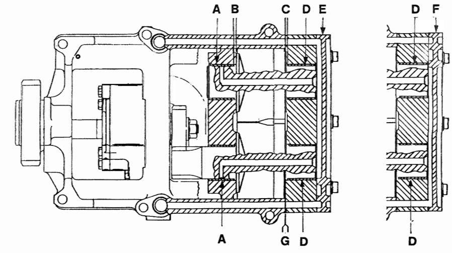

 $J7$ 

- A. Bush frame.
- Bush, dim. below frame surface, 0.128/0.130 in **B.**  $(3,25/3,30$  mm).
- C. Bush, dim. below frame end cover surface, 0.128/ 0.130 in (3,25/3,30) mm).
- D. Bush, frame end cover.
- Ε. Lub. oil transfer plate, L.H. lub. oil filter position.
- Lub. oil transfer plate, R.H. lub. oil filter position. F.
- G. Balance weight end float dim. 0.0073/0.0148 in (0,186/0,377 mm).

{64}------------------------------------------------

- 9. If a new frame is used with new lubricating oil direction plugs, ensure the plugs are fitted correctly to suit the filter position and lubricating oil transfer plate symbols (see Fig.  $J.4/J.5$ ).
- 10. Fit balance weight cover and tighten setscrews to 7.5 lbf ft  $(10 Nm)$ .

Note: The lubricating oil direction plugs are of different length and have different shape socket heads. The long plug has a square socket and the short plug a hexagon socket. The socket shape will indicate if the plugs and transfer plate are fitted correctly for the lubricating oil flow. Ensure that the long plug is below the machined surface.

#### To Fit Idler Gear

| 11. Press in new bearing if necessary. Fit gear and bearing to idler hub and put thrust washer in position. Ensure idler gear hub setscrew threads are clean and free from grease. Put 'Loctite 274' compound on the threads and tighten in position to 70 lbf ft (9,6 kgf m) 95 Nm. Check end float of gear 0.003/0.009 in (0,08/0,23 mm).

Note: Idler gear hub with integral setscrew - 40 lbf ft (5.5 kgf m) 54 Nm.

#### To Refit and time Balancer to Engine

Ensure the location dowels are in the cylinder block bores (see Fig. J11). Set number 1 and 4 pistons at TDC. Locate the balancer unit with the dowels and engage idler gear to crankshaft gear. Look through hole in side of balance weights cover (see Fig. J9) (later units do not have cover sides) and ensure that the balance weight flats are level with each other and in the centre of the hole (A) with the half round balance weights towards the bottom of the sump. If this position cannot be obtained, the initial timing of the balance weight unit is incorrect (see Fig. J8). When the timing is correct, secure the balancer unit to the cylinder block and tighten the six flanged bolts to 40 lbf ft (5,5 kgf m) 54 Nm (see Fig. J12). Fit sump and tighten setscrews to 13 lbf ft (1,8 kgf m) 18 Nm.

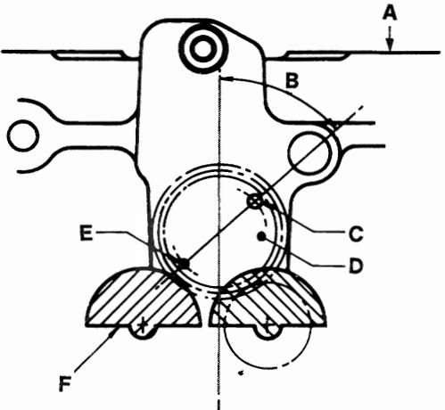

#### $J8$

- A. Engine mounting face.
	-
- B. Hole 'C', 49º angle position.
- C. Hole dim. 0.354 in (9,0 mm). D. Gear shaft drive.
- E. Hole dim. 0.256 in  $(6, 5$  mm $).$ F. Balance weight
- assembly position.

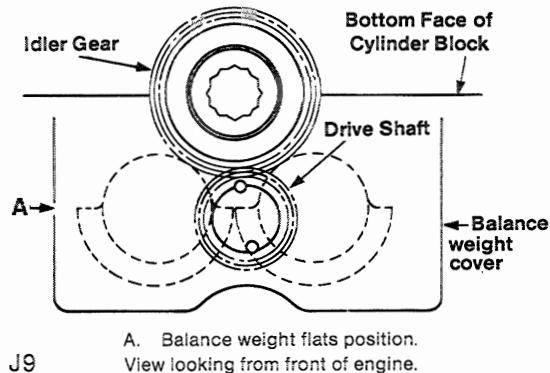

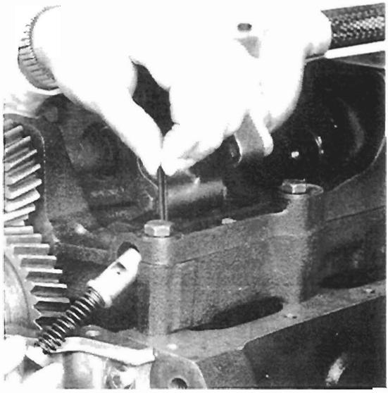

 $J10$ 

{65}------------------------------------------------

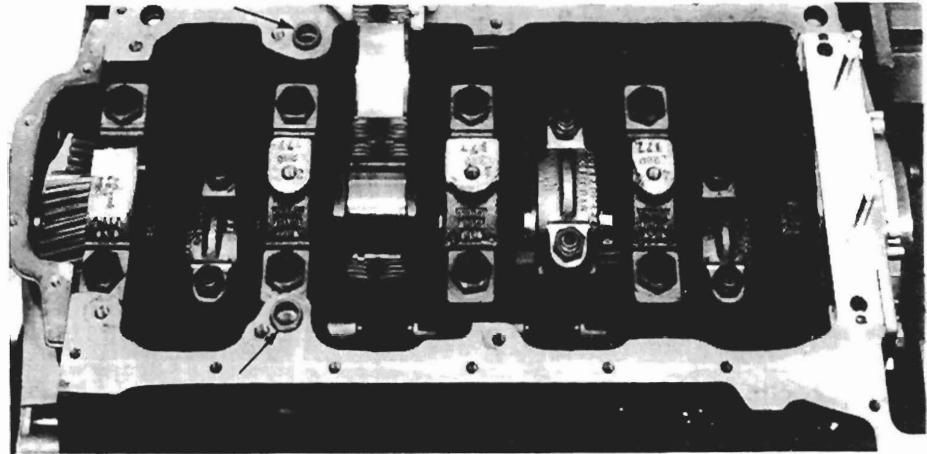

 $J11$ 

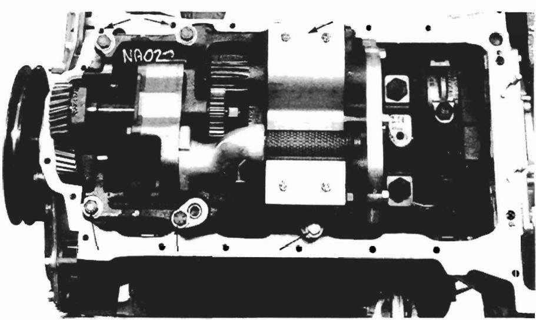

J12 Note: Position of lubricating oil suction pipe can change according to application.

{66}------------------------------------------------

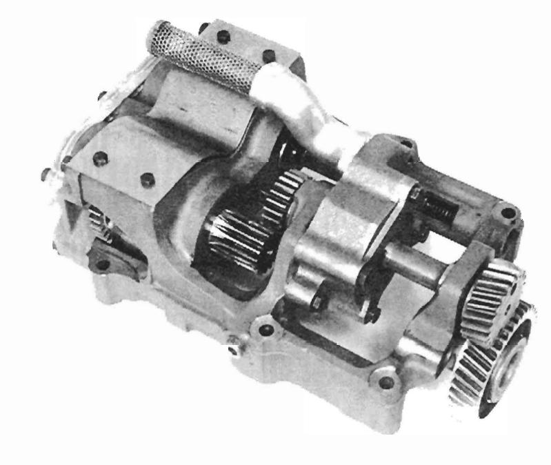

 $J13$ 

Centre Mounted Balancer Unit Assembly

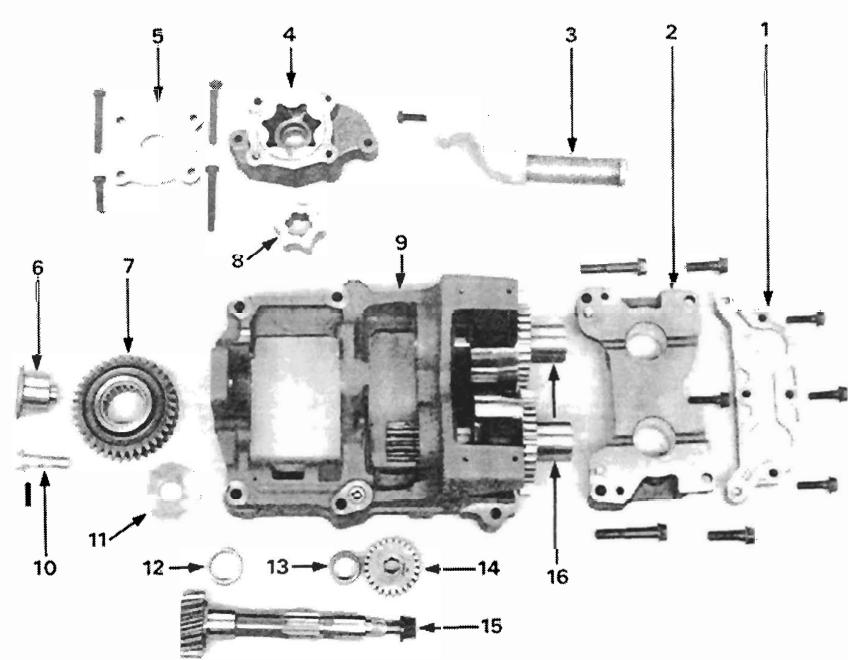

- Lubricating oil transfer plate.  $J14$  $\mathbf{1}$ .
	- $2.$ Balancer frame and plate.
	- Lubricating oil suction pipe. 3.
	- Lubricating oil pump.  $\overline{\mathbf{4}}$
	- Lubricating oil pump cover plate. 5.
	- Idler gear hub. 6.
	- 7. Idler gear.
	- Lubricating oil pump impellor. 8.
- 9. Balancer frame.
- 10. Idler gear hub setscrew.
- 11. Idler gear thrust plate.
- 12. Idler gear bearing.
- 13. Driveshaft needle roller bearings.
- 14. Balance weights gear.
- 15. Drive gear and shaft.
- 16. Balance weights.

{67}------------------------------------------------

Downloaded from [www.Manualslib.com](http://www.manualslib.com/) manuals search engine

{68}------------------------------------------------

# **SECTION K Timing Case and Drive**

#### To Remove the Timing Case Cover

- 1. Slacken the dynamo or alternator mounting bolts, remove the adjusting arm and drive belt.
- 2. Where necessary, remove water pump.
- 3. Remove the crankshaft pulley.
- 4. Remove the timing case cover taking care not to damage the crankshaft front oil seal which is located in the cover.

#### To Renew the Crankshaft Front Oil Seal

- 1. Using a press, remove the oil seal from the timing case cover.
- 2. Press the new seal into position from the front, until the front face is  $\frac{1}{4}$  in (6,35 mm) below the front face of the cover. With Massey Ferguson applications and 4.2482

engines, the seal should be pressed in 0.38/0.39 in (9,65/9,91 mm) below the front face of the cover. For installation of current seal, see below.

The seal is designed to function correctly with the direction of rotation of the engine and for identification purposes the seal is marked with an arrow.

Earlier engines were fitted with a black nitrile seal and a crankshaft oil thrower.

Later engines have a red silicone seal and the oil thrower is replaced with a distance piece. Under no circumstances should the latest red seal be fitted with an oil thrower.

Current engines are fitted with a black viton seal and a spoked type crankshaft pulley with an increased hub length which removes the need for a distance piece. The seal has a protruding lip at the front and the adaptor for pressing in this seal must have a suitable recess in it to clear this lip.

Press in the new seal with the spring loaded lip towards the inside of the case to the applicable dimension below the front face of the timing case as shown in Fig. K.2.

#### To Refit the Timing Case Cover

- 1. Position the timing case cover on the timing case by means of two opposite setscrews fitted looselv. Centralise the cover by locating the centralising tool PD.162 on the crankshaft and in the seal housing and tighten the assembly by means of the crankshaft pulley setscrew and washer - do not overtighten. Tighten all the timing case cover setscrews and remove the tool. (Treat bottom 3 setscrews with Loctite 575). If the centralising tool is not available, the crankshaft pulley can be used to centralise the cover, but, as this method utilises the inside diameter of the seal and the latest seal is soft, the cover may not be truly central and leaks may occur.
- 2. Refit the crankshaft pulley with the centre punch mark on the pulley aligned with the line on the front face of the crankshaft (Fig. K.3). Fit the retaining setscew and washer and tighten to the torque given on Page B.2. Some crankshaft pulleys are retained with a thrust block and 3 setscrews (Fig. K3A).
- 3. Bolt the dynamo or alternator adjusting arm to the timing case and fit the fan belt.

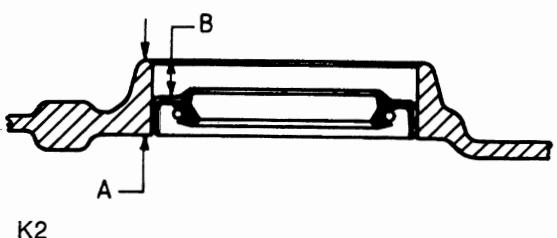

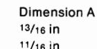

Dimension B 0.43/0.45 in (10.92/11.43 mm) 0.30/0.32 in (7,76/8,18 mm)

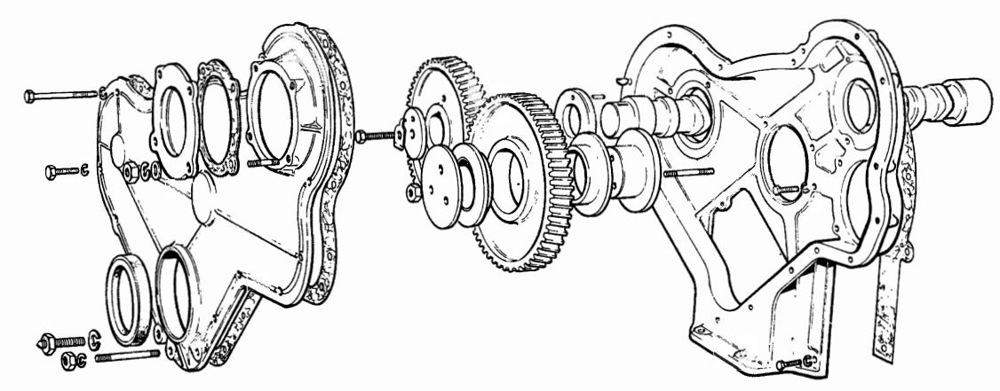

{69}------------------------------------------------

#### TIMING CASE AND DRIVE-K.2

#### **Checking the Timing Gear Backlash**

- 1. Remove the timing case cover as detailed on page K.1.
- 2. Check the timing gear backlash using a clock gauge or feeler gauges. This should be 0.003 in (0,08 mm) minimum.

#### To Remove the Idler Gear and Hub

- 1. Remove the timing case front cover.
- 2. Remove idler gear retaining plate.

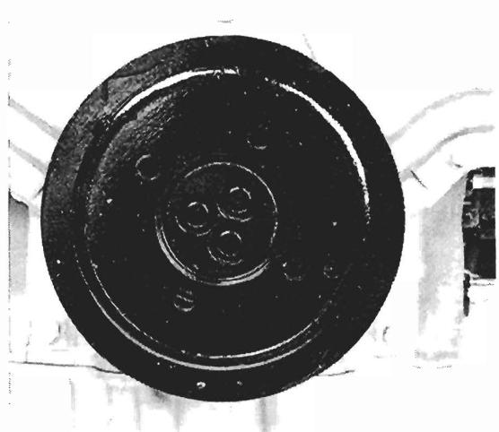

K3A

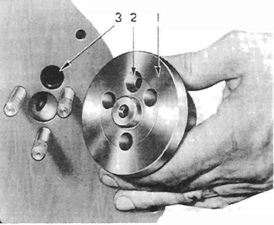

- K4
- Idler Gear Hub  $\ddagger$ .
- $2.$ Oil Passage
- Oil Pressure Rail 3.

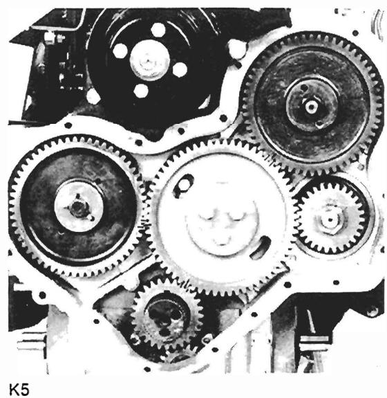

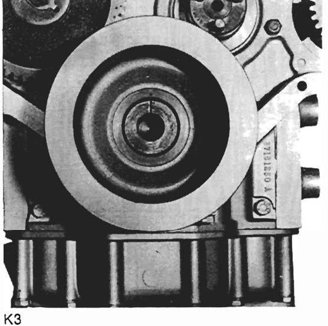

{70}------------------------------------------------

- 3. Remove the idler gear from the hub which can now be withdrawn from the timing case (Fig. K.4).
- 4. Examine the gear and hub for wear, cracks, and pitting, etc.
- 5. Where necessary, replace idler gear bushes. These require boring to finished size after fitting.

NOTE: Where a full load is taken through the timing gear train, certain idler gears are fitted with needle bearings.

#### To Refit the Idler Gear and Hub

- 1. Refit the hub to its location in the timing case.
- 2. Remove the top cover and slacken off the rocker assembly securing nuts.
- 3. Turn the crankshaft to T.D.C. No. 1 and 4 cylinders, i.e., with the crankshaft gear keyway at the top of its periphery.
- 4. Refit the idler gear to its hub with the timing marks on the crankshaft, camshaft, fuel pump and idler gears aligned (Fig. K.5).
- 5. Refit the idler gear retaining plate and secure with the three setscrews tightened to a torque of 30 lbf ft (4,1 kgf m) -41 Nm. Check idler gear end float (Fig. K.6).
- 6. Tighten down the rocker assembly and adjust the valve clearance to 0.010 in (0,25 mm) cold.
	- 7. Refit the timing case front cover.

#### To Remove the Camshaft Gear

- 1. Remove the timing case front cover.
- 2. Remove the camshaft gear retaining setscrew, locking washer and retaining plate.
- 3. Using a suitable extractor, remove the camshaft gear (Fig. K.7).
- 4. Examine the gear for wear, cracks and pitting, etc.

Note: Where a camshaft gear is stamped with the letter 'M', use metric adaptors PD.155B-5

#### To Refit the Camshaft Gear

- 1. Remove the idler gear.
- 2. Slacken off the rocker assembly securing nuts.
- 3. Refit the gear to the camshaft by drawing it onto the shaft with the retaining plate, new tabwasher and setscrew.
- 4. Turn the engine until No. 1 piston is at T.D.C., with the crankshaft gear keyway at the top of its periphery.
- 5. Refit the idler gear to its hub ensuring all timing marks are aligned (Fig. K.5). Fit the idler gear retaining plate and secure to a torque of 30 lbf ft  $(4,1 \text{ kgf m}) - 41 \text{ Nm}.$
- 6. Tighten the camshaft setscrew to a torque of 50 lbf ft (7 kgf m)-68 Nm, and lock the tabwasher.

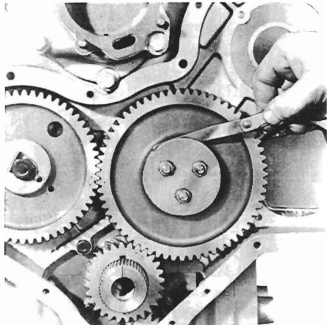

K6

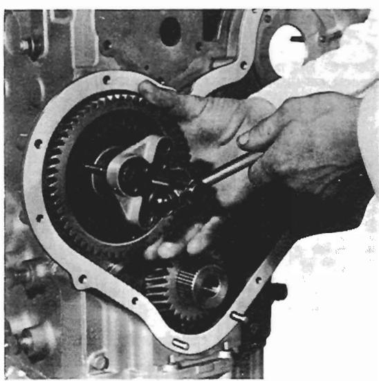

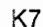

- 7. Refit the timing case front cover.
- 8. Tighten down the rocker assembly and adjust the valve clearances to 0.012 in (0,30 mm) cold.

#### To Remove the Fuel Pump Gear (Hydraulic Governor)

- 1. Remove the timing case front cover.
- 2. Remove idler gear and refit so that the timing marks are aligned (Fig. K.5).
- 3. Remove the fuel pump drive plate from the quil! shaft (Fig. K.8).
- 4. Remove the fuel pump gear retaining circlip from the gear carrier (Fig. K.9) and withdraw the gear (Fig. K.10).
- 5. Examine the gear for wear, cracks and pitting etc.

{71}------------------------------------------------

#### To Refit the Fuel Pump Gear (Hydraulic Governor)

#### (a) If original fuel pump gear is being refitted:

- 1. Fit the fuel pump gear to its carrier ensuring that the tooth with the punch mark coincides with double punch marks on the idler gear (Fig. K.5). Ensure all timing gear markings are correctly aligned.
- 2. Secure the fuel pump gear to the carrier with the circlip (Fig. K.9).
- 3. Fit the fuel pump drive plate to the quill shaft and, after aligning the timing mark on the plate with the chisel mark on the gear (Fig. K.11), secure the plate to the gear.
- 4. Refit the timing case.

#### (b) To replace fuel pump gear:

The new fuel pump gear will be pre-marked with the punch mark which will align with the double punch marks on the idler gear, but as there are no markings showing the relative position of the gear and drive plate, it will be necessary to re-set the fuel pump timing using the timing marks inside the fuel pump. Proceed as follows:-

Ensure fuel pump circlip is correctly positioned as described on Page N.7.

(On current pumps the circlip is not set and timing tool /MS67B must be used, see page K5).

- 1. Re-align all timing marks.
- 2. Fit the fuel pump gear to its carrier with the punch mark aligning with the double punch marks on the idler gear (Fig. K.5).
- 3. Fit the circlip (Fig. K.9).
- 4. Remove the plate on the top of the pump which also embodies the fuel pump return connection to the fuel filter (Fig. K.12).
- 5. Check that the scribed line on the fuel pump mounting flange aligns with the scribed line on the fuel pump gear carrier adaptor between pump and timing case.
- 6. Position the crankshaft so that No. 1 piston is at T.D.C. on compression stroke.
- 7. Remove the collets, spring cap and springs from the inlet valve of No. 1 cylinder and allow the valve to rest on the top of the piston.
- 8. Mount a dial indicator so that the stylus is on the tip of the valve resting on top of No. 1 piston. Zero the dial indicator with No. 1 piston at T.D.C. Turn the crankshaft in the opposite direction to normal rotation, (approximately an eighth of a turn) and then forward until the required position for the particular fuel pump or application is registered on the clock gauge; see Page B.17 for static timing position and relative piston displacement.

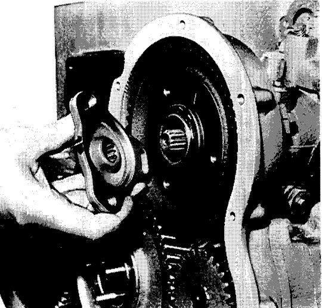

K8

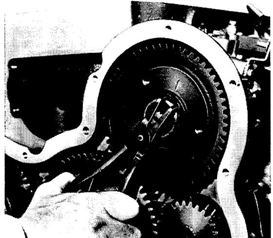

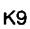

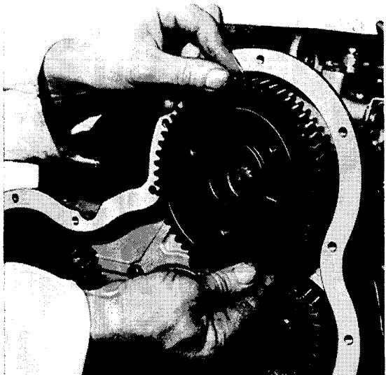

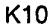

{72}------------------------------------------------

- 9. Fit the fuel pump drive plate in position on the quill shaft and fit the three securing setscrews but do not tighten.
- 10. Turn the drive plate until the scribed line on the rotor marked "A" aligns with the squared end of the later type timing circlip. The earlier circlip has a curved end and a scribed line (Fig. K.12 and K.13). Tighten the securing setscrews.
- 11. Mark the fuel pump drive gear to correspond with the mark on the fuel pump drive plate (Fig. K.11).
- 12. Refit the springs, spring cap and collets to the No. 1 inlet valve.
- 13. Refit the cover to the fuel pump and reconnect the fuel return pipe. Reseal the plate and bleed air from the fuel system.
- 14. Re-assemble the timing case front cover.

#### To replace fuel pump gear using fuel pump timing tool MS.67B

- 1. Turning engine in normal direction of rotation, position No. 1 piston to T.D.C. compression stroke by means of timing pin or pointer.
- 2. Remove fuel injection pump.
- 3. Using fuel pump timing tool MS.67B (see Fig. N.15), release screw (5) and position splined shaft (6) in tool so that relevant spline is to front of tool.
- 4. Ensure that slotted pointer (2) is positioned with slot to front of tool and chamfered sides of slot outwards. At this stage, slotted end of pointer should be kept well back from front of body. Ensure that flat in washer fitted behind pointer securing screw (3) is located over pointer.
- 5. Release bracket screw (4) and set bracket so that the chamfered edge is in line with the relevant engine checking angle (see Page B.17).
- 6. Fit timing tool to engine in fuel pump position ensuring firstly that splined shaft with master spline engaged is fully located in pump drive shaft and then that register of tool is seated in fuel pump locating aperture. Lock splined shaft in tool. If pointer is 180° from timing mark on rear of timing case, engine is probably on wrong stroke in which case, remove tool and set engine on correct stroke.
- 7. Slide slotted pointer forward so the slot is half way over adaptor plate flange.
- 8. Turn timing tool by hand in opposite direction to pump rotation (shown on pump nameplate) to take up backlash and check that timing mark on pump adaptor flange is central in slot of pointer.
- 9. Fit fuel pump drive plate in position on quill shaft and secure by three setscrews.
- 10. Mark fuel pump drive gear to correspond with the mark on the fuel pump drive plate (Fig. K.11).
- 11. Remove timing tool and refit fuel pump as described on Page N.6.
- 12. Re-assemble timing case front cover.

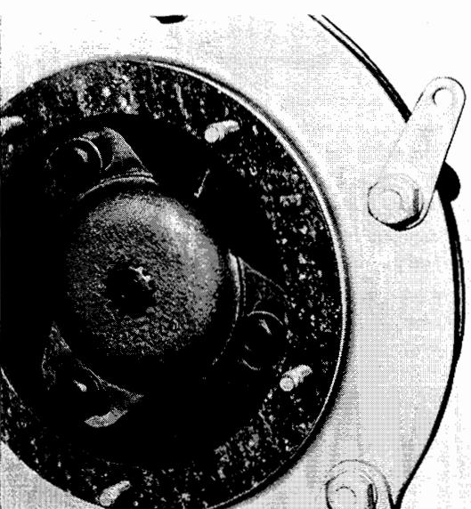

K11

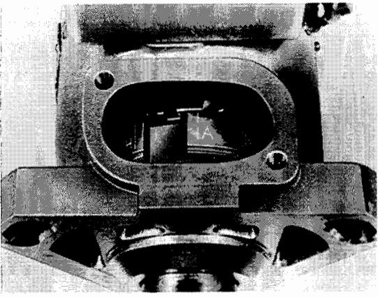

K12

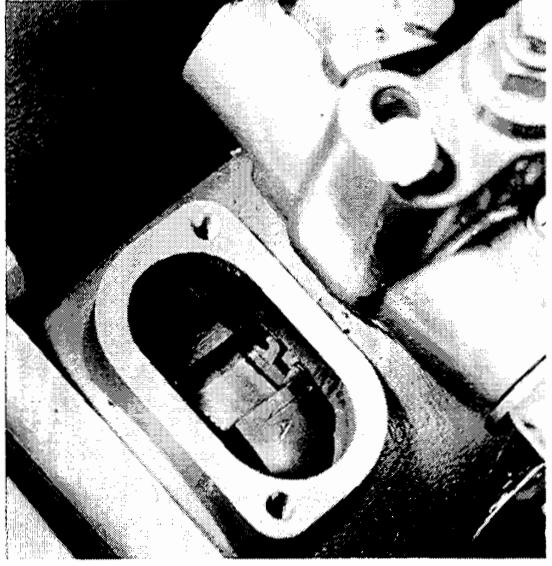

K13

4.236 Series Workshop Manual, March, 1988.

{73}------------------------------------------------

#### TIMING CASE AND DRIVE - K.6

#### To Remove the Fuel Pump Gear (Mechanical Governor)

- 1. Remove the timing case cover.
- 2. Re-align all timing marks (Fig. K.5) by removing and replacing idler gear.
- 3. Remove the three setscrews and spring washers, or nut which secure the gear to the fuel pump.
- 4. Withdraw the gear from its dowelled location on the fuel pump (Fig. K14), or keyway (Fig. K14A).

Note: Gears with metric withdrawal threads will have the letter 'M' formed on the front face of the gear. Use metric withdrawal tools PD.155B-5.

#### To Refit the Fuel Pump Gear (Mechanical Governor)

- 1. Fit the fuel pump gear to the shaft, locating the dowel or keyway of the gear into the slot or key on the fuel pump shaft and align the punch mark with the double punch marks on the idler gear (Figs. K5 and K14).
- 2. Secure the gear with the three setscrews and spring washers, or nut.
- 3. Refit the timing case front cover.

#### To Remove the Timing Case

- 1. Remove the timing case front cover and timing gears, crankshaft oil thrower or distance piece.
- 2. Remove the fuel pump and exhauster or compressor and compressor drive (where fitted).
- 3. Remove the nine setscrews and spring washers securing the timing case to the cylinder block.
- 4. Remove the four setscrews and washers securing the sump to the timing case.
- 5. Withdraw the timing case from the cylinder block.

#### To Refit the Timing Case

- 1. Refit the timing case to the cylinder block.
- 2. Secure the sump to the timing case.
- 3. Refit the fuel pump and exhauster (where fitted).
- 4. Refit the timing gears and front cover.

#### **Fitting New Timing Case or Fuel Pump Adaptor Plate**

In the event of a new timing case (mechanically governed engines) or fuel pump adaptor plate (Hydraulically governed engines) being required, these will not be marked with the scribed line for the correct alignment of the fuel injection pump.

To arrange these necessary markings, with the fuel pump removed, proceed as follows :-

4.236 Series Workshop Manual, March, 1988.

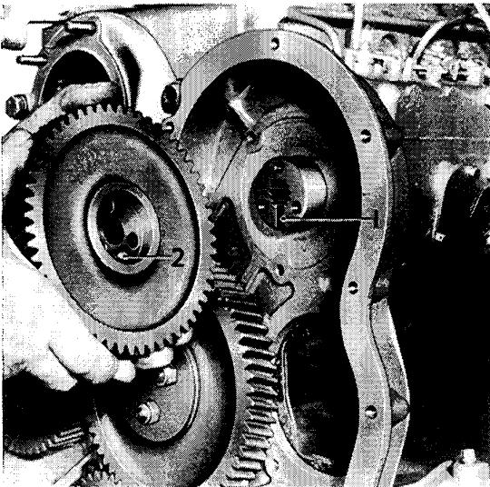

#### K14

- 1. Slot in Fuel Pump Hub
- $2.$ Dowel

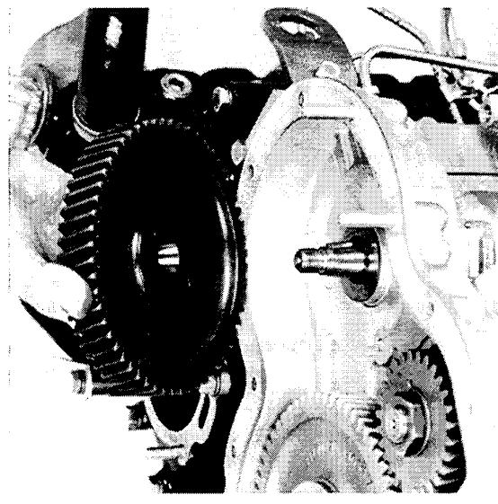

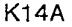

#### **New Timing Case** (mechanically governed engines)

- 1. Turn engine in normal direction of rotation until No. 1 piston is at T.D.C. on compression stroke, i.e. with valves of No. 4 cylinder rocking. The T.D.C. position can be obtained on some engines by means of a timing pin or pointer fitted to the timing case cover which should align with a drilling or timing mark on the crankshaft pulley at T.D.C.
- 2. Fit adaptor PD.67B-1 (see Fig. K15) to fuel pump gear so that the dowel of gear locates in slot of adaptor and adaptor shaft is towards rear of engine. Secure adaptor to gear using setscrews. For DPS pumps, fif adaptor PD67-2 (see Fig. K15A) onto splined shaft of timing tool MS67 B and lock splined shaft in tool (see Fig. K15B).

{74}------------------------------------------------

- 3. Release screw (5) of timing tool MS.67B (see Fig. N15) and remove splined shaft (Retain for DPS pumps).
- 4. Ensure right angled straight edge of pointer is positioned towards front of timing tool and that the slot in the bottom edge of the pointer is pointing downwards (see Fig. K16). At this stage, right angled straight edge of pointer should be kept well back from front of body. Ensure that flat of washer fitted behind pointer securing screw (3) is located over pointer.
- 5. Release the bracket locking screw (4) and set bracket so that the chamfered edge is in line with the relevant engine checking angle (see Page B.16).
- 6. Pressing fuel pump gear and adaptor K15 towards rear, locate splined shaft of adaptor into timing tool with master spline engaged and adaptor shaft in timing tool with rear face of adaptor abutting front face of timing tool.
- 7. Move tool forward, complete with gear, so that register of tool locates in pump aperture of timing case. For DPS pumps, fit timing tool to engine in fuel pump position and secure to gear with nut (see Figs. K15A and B). If pointer is 180° out, engine is on wrong stroke and tool should be removed and engine set on correct stroke.
- 8. Slide slotted pointer forward to reach rear face of timing case and lock into position.
- 9. Take up backlash by turning tool against normal direction of rotation (shown on pump nameplate) and mark the scribed line on the rear of the timing case along the straight edge of the pointer (see Fig. K16).
- 10. Remove tool and adaptor from fuel pump gear and fit fuel pump to engine as detailed on Page N.7.

#### **New Fuel Pump Adaptor Plate** (hydraulically governed engines)

- 1. Turn engine to T.D.C. on compression stroke by means of timing pin or timing pointer.
- 2. Release screw (5) of timing tool MS.67B (see Fig. N15) and position splined shaft (6) in tool so that relevant spline is to front of tool.
- 3. Ensure that slotted pointer (2) is positioned with slot to front of tool and chamfered sides of slot outwards. At this stage, slotted end of pointer should be kept well back from front of body. Ensure that flat in washer fitted behind the pointer securing screw (3) is located over pointer.
- 4. Release bracket screw (4) and set bracket so the chamfered edge is in line with the relevant engine checking angle (see Page B.17).
- 5. Fit timing tool to engine in fuel pump position ensuring firstly that splined shaft with master spline engaged is fully located in pump drive shaft and then that register of tool is seated in fuel pump locating aperture. Lock splined shaft in tool. If pointer is 180° out, engine is probably on wrong stroke in which case, remove tool and set engine on correct stroke.
- 6. Slide slotted pointer forward so that slot is half way over adaptor plate.
- $\overline{7}$ Turn timing tool by hand in opposite direction to pump rotation (shown on pump nameplate) to take up backlash and mark scribed line of adaptor plate !!!!!!!!!!!!!!!!!!!!!!!!!!!!!!!!!!!!!!!! Fig. K17).

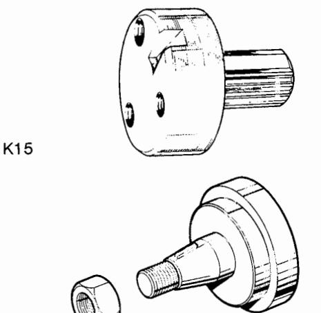

**K15A** 

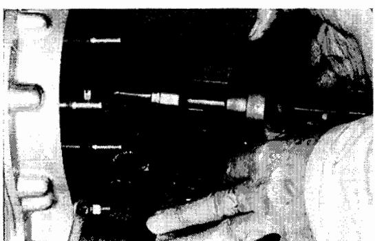

**K15B** 

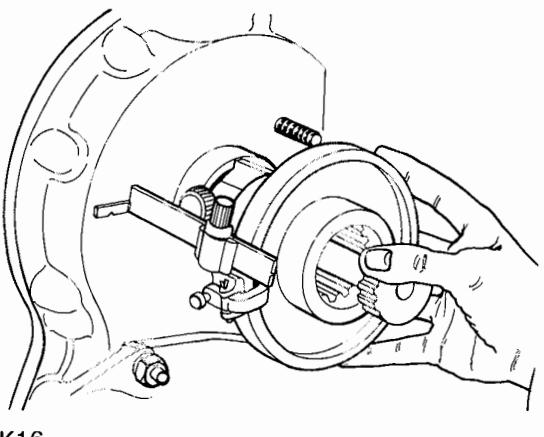

#### 8. Remove tool and fit fuel pump as detailed on Page N.6.

Note:

The above method of checking can be used if the scribed line on the fuel pump gear or fuel pump adaptor plate (see Fig. K11) is suspected.

With the timing tool fitted, the adaptor plate can be adjusted on its slotted holes until the scribed line of the fuel pump adaptor plate aligns with the slot in the pointer of the timing tool.

{75}------------------------------------------------

#### To Remove the Camshaft and Tappets

Camshaft end float is controlled by a thrust ring located in the front face of the cylinder block. The ring is dowelled and held in position by the timing case.

To remove the camshaft it is necessary to remove the engine from the application and mount it in a suitable dismantling stand so that it can be turned upside down.

Proceed as follows:-

- 1. Remove the rocker cover, rocker assembly and push rods.
- $2.$ Remove the timing case front cover, timing gears and timing case.
- 3. Turn the engine over so that the sump is uppermost.
- 4. Remove the sump.
- 5. Remove the fuel lift pump.
- 6. Remove the camshaft thrust ring (Fig. K18).
- 7. Withdraw the camshaft (Fig. K19).
- 8. The tappets may now be withdrawn (Fig. K20)

### To Refit the Tappets and Camshaft

- 1. Refit the tappets.
- 2. Refit the camshaft.
- 3. Refit sump.
- 4. Fit the camshaft thrust ring on the dowel in the front face of the cylinder block (Fig. K18). Check the protrusion beyond the front face of the cylinder block. See "Technical Data", Page B.10.
- 5. Refit the fuel lift pump.
- $61$ Refit the timing case, timing gears, front cover and sump.
- 7. Refit the push rods and rocker assembly. Adjust the valve clearances to 0.010 in (0,25 mm) cold. Refit the rocker cover.

#### **Valve Timing**

From the following 4.236 engine numbers a change in cam form has taken place:-

4701502

4702053A

4402089A (Exclusive to Chrysler (U.K.) Ltd.).

4202050 (Exclusive to Gebr. Claas).

This has necessitated a change in the valve clearance for No. 1 inlet valve for the purpose of checking the valve timing.

The valve clearance for the earlier type camshaft (Part No. 31415291) is 0.034 in (0,86 mm) whereas the clearance for the later type (Part No. 31415292, 31415372 or 31415381) is 0.047 in (1,2 mm).

These camshafts are completely interchangeable, their only difference being the cam form. If the camshaft is removed from the engine, the part number can be seen on the end opposite the one which carries the gear.

4.236 Series Workshop Manual, January 1993.

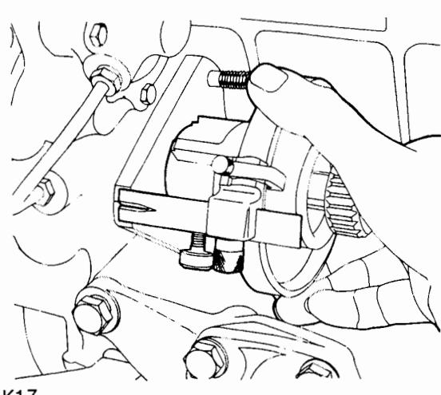

K17

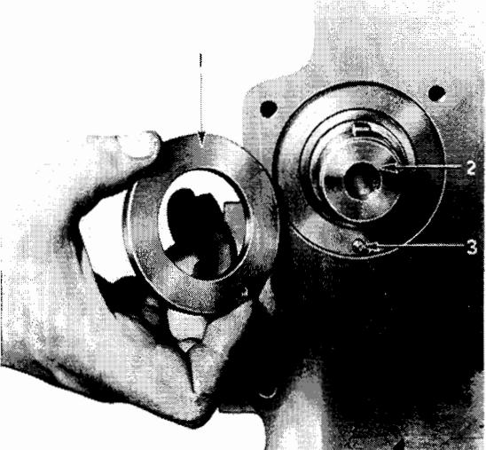

- K18
- 1. Camshaft Thrust Washer.
- 2. Camshaft.
- Thrust Washer Dowel Pin. 3.

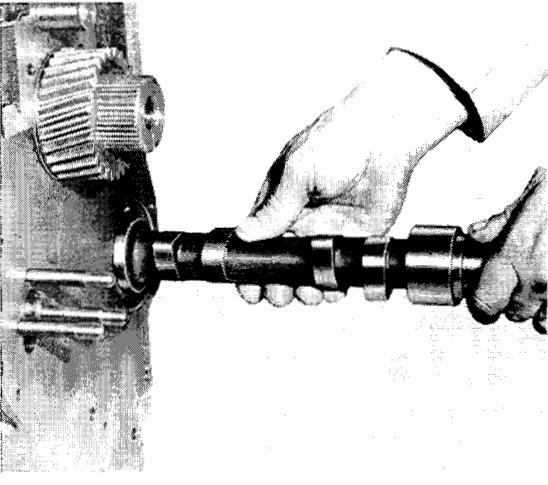

K19

{76}------------------------------------------------

Those engines which are rated above 2,300 rev/min are fitted with a high speed camshaft, (Part No. 31415292, 31415372 or 31415381), the inlet valve clearance for the purpose of valve timing is 0.047 in (1,2 mm).

For engines rated at 2,300 rev/min and below a low speed camshaft is fitted (Part No. 31415321, 31415371 or 31415374), the inlet valve clearance for the purpose of valve timing is 0.021 in (0,53 mm).

T4.236 engines have camshaft Part number 31415294. 31415373 or 31415382 fitted. The inlet valve clearance for the purpose of valve timing is 0.037 in (0,94 mm).

#### **Checking Valve Timing**

- 1. Turn the crankshaft until the valves on No. 4 cylinder are "on the rock".
- 2. Set the valve clearance of No. 1 inlet valve according to the cam form of the camshaft fitted.
- 3. Turn the engine in the normal direction of rotation until the valve clearance of No. 1 inlet valve is just taken up.
- 4. Check that Nos. 1 and 4 pistons are now at T.D.C. by means of the timing pin or pointer. Unscrew the pin until it locates in the hole machined in the rear face of the crankshaft pulley as shown in Fig. K21.

Later engines have a fixed timing pointer and a T.D.C. groove on the edge of the crankshaft pulley (Fig. K22).

The valve timing tolerance is  $\pm$  2%°. When the timing is found to be correct, return the timing pin to its location and reset the valve clearance of No. 1 inlet valve to 0.010 in (0,25 mm) cold. The only error possible is in the fitting of the timing gears.

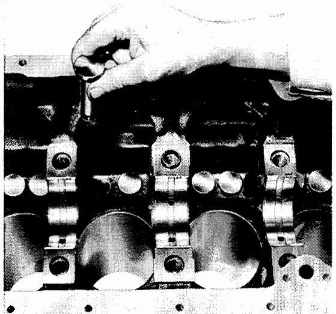

K20

K21

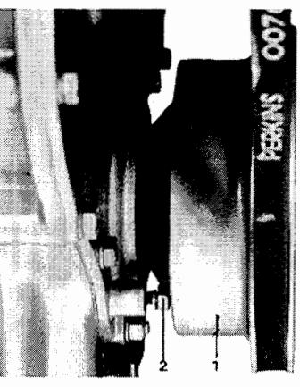

1. Crankshaft Pulley.

2. Timing Pin.

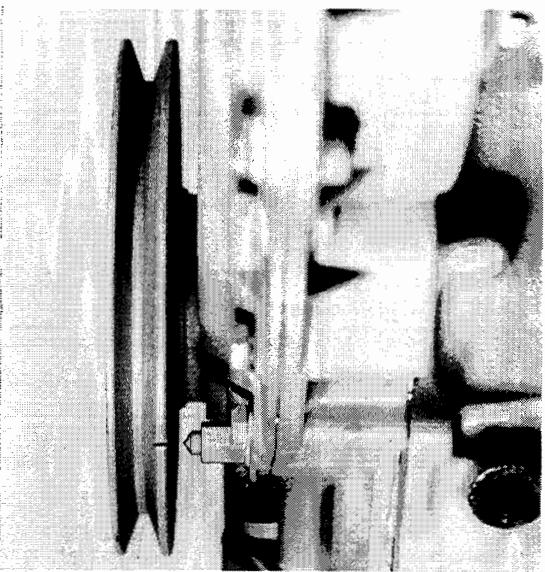

{77}------------------------------------------------

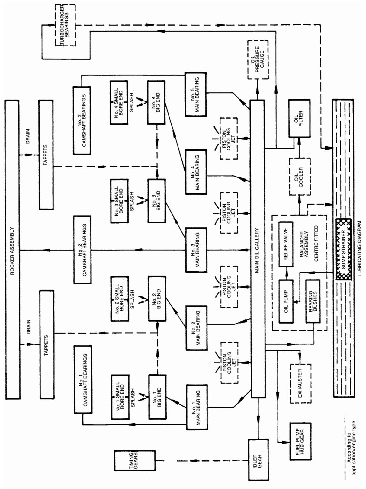

{78}------------------------------------------------

# **SECTION L Lubricating System**

The importance of correct and clean lubrication cannot be stressed too highly and all reference to engine oil should be taken to mean lubricating oil which falls within the specification given in the appendix. Care should be taken that the oil chosen is that specified for the climatic conditions under which the engine is operated.

#### **Description**

The lubrication is of the forced feed type, the oil being circulated by a lobed rotor type oil pump driven through an idler gear by the crankshaft gear or by a gear type oil pump driven from the rear of the front mounted balance unit (when fitted). The oil is drawn through a sump strainer to the pump. Oil is then pumped to the relief valve housing and the full flow filter. When a centre mounted balance unit is fitted, the oil pump and relief valve are integral with the balance unit.

Oil passes through the filter to the pressure rail. On T4.236 engines, oil passes first through the cooler assembly. A pipe from the filter head feeds oil to the turbocharger.

From the pressure rail the oil is fed to the main bearings, big ends and on T4.236 engines, piston cooling jets which have integral relief valves. A seal prevents oil leaking along the crankshaft at the rear end.

The camshaft bearings are lubricated from numbers one, three and five main bearings.

The camshaft centre bearing supplies a controlled feed of oil to the rocker shaft assembly. This is achieved by allowing oil to be forced to the rocker shaft only when the oilways in the camshaft journal and camshaft centre bearing are in line. Oil from the rocker shaft escapes

through a small bleed hole in each rocker lever and lubricates the valves and guides by splash.

The idler gear and hub are pressure lubricated direct irom the pressure rail. Oil enters the rear of the hub and passes through drillings to lubricate the idler gear bush and gear retaining plate. Where hydraulically governed pumps are fitted the fuel pump hub is also pressure lubricated from the pressure rail (Fig. N.12). Timing gear teeth are splash lubricated by surplus oil from the front camshaft bearing idler gear hub and fuel pump hub

Pistons, cylinder liners and connecting rod small end bearings are lubricated by splash and oil mist, also the cams and tappets of the valve mechanism. On T4.236 engines, lubricating oil is also directed to the underside of the pistons.

#### The Oil Pump

The following instructions refer to the oil pump fitted to engines without a balance unit. Where a balance unit is fitted, then reference should be made to Section J.

The oil pump is secured to the front main bearing cap by three setscrews.

The oil pump gear is driven through a bushed idler gear.

The oil pump drive gear is pressed or keyed on to the pump driven shaft on the other end of which is pressed and pinned a three or four lobed rotor. This rotor meshes with a four or five lobed driven motor, which is free to rotate in the cast iron pump body.

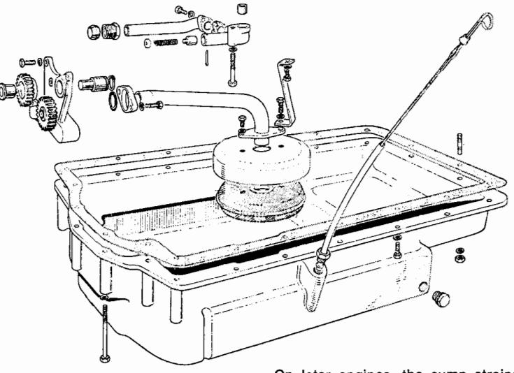

On later engines, the sump strainer cover is fitted on the upper side of the suction pipe flange (see Fig. L.3).

 $L2$ 

{79}------------------------------------------------

#### **LUBRICATING SYSTEM-L.2**

#### To Remove the Oil Pump

- 1. Remove the sump.
- 2. Remove the strainer (Figs. L.3 and L.4).
- 3. Remove the suction pipe.
- 4. Remove the oil delivery pipe between the pump and relief valve housing.
- 5. Remove the crankshaft pulley, timing case front cover, timing gears and timing case.
- 6. Remove the idler gear circlip and idler gear (Figs.  $L.5$  and  $L.6$ ).
- 7. Remove the three setscrews securing the pump to No. 1 Main bearing cap and withdraw the pump from the cap (Fig. L.7).
- Note: Later pumps have the strainer integral with  $\mathbf{I}$ the suction pipe.

#### To Dismantle the Oil Pump

- 1. Remove the oil pump drive gear retaining circlip (where fitted) and the drive gear.
- 2. Remove the key from the keyway of the drive shaft, (where fitted).
	- 3. Remove the end plate.

ł

Note: Later oil pumps have a drive gear without a circlip fitted. This gear must not be removed as it can reduce the interference fit of the gear. If the gear is worn, the pump must be renewed as separate parts are not available. The internal parts of the pump can be examined by removal of the end plate only.

 $L4$ 

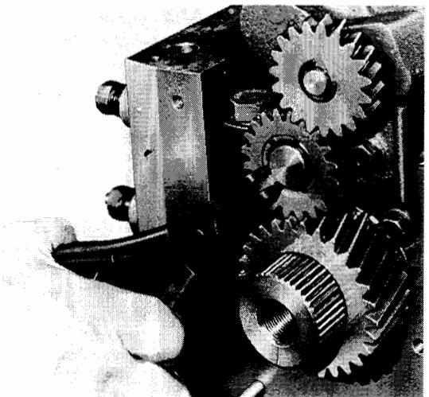

 $L5$ 

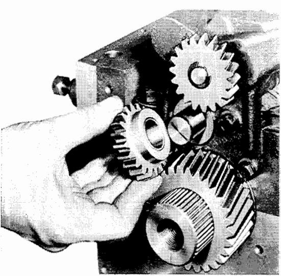

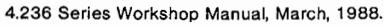

L3

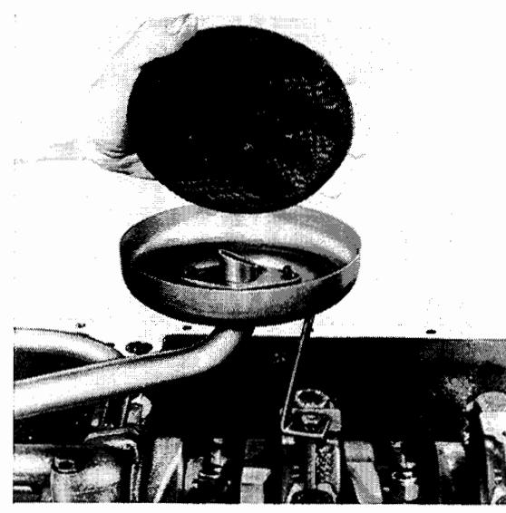

{80}------------------------------------------------

- 4. Remove the drive and driven rotors from the pump body.
- 5. Remove the "O sealing ring from the pump body (where fitted) (Fig. L.8).

#### Inspection

- 1. Examine all parts for signs of cracking, wear or corrosion.
- 2. Install the inner and outer rotors in the pump body. The chamfered edge of the outer rotor enters the pump body first.
- 3. The clearances of a new pump are given on Page B.12 and are checked as shown in Figs. L.9, L.10 and L.11.

NOTE: Should an oil pump be worn to such an extent it adversely affects the working pressure, a replacement pump should be fitted. Parts of the pump are not supplied individually.

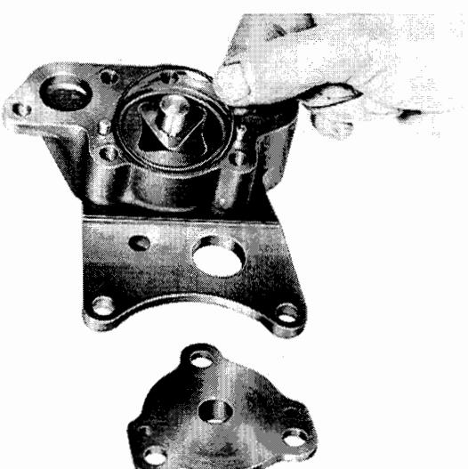

 $L8$ 

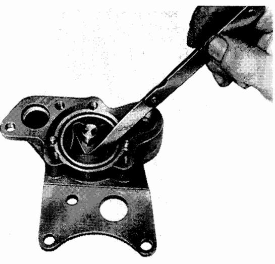

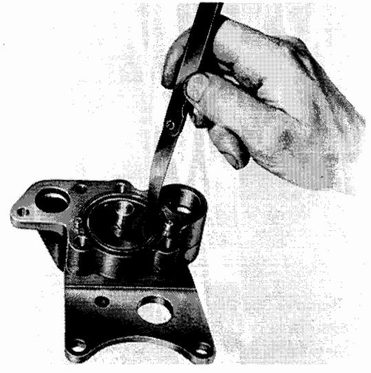

L10

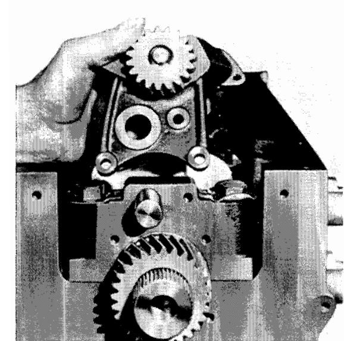

{81}------------------------------------------------

#### To Assemble the Oil Pump

 $\mathbf{I}$ 

- 1. Fit the drive and driven rotors to the pump body entering the chamfered end of the outer rotor to the body first. Refit end plate using a new "O" sealing ring (where fitted).
- 2. Refit the key (where fitted) in the keyway of the drive shaft and refit the drive gear to the shaft. With earlier pumps, the boss on the drive gear was positioned towards the rear of the gear, the flat face of the gear being towards the circlip groove. The correct clearance for the gear was 0.003/0.007 in (0,08/0,18 mm) between the rear face of the gear and the pump body.

With current pumps, the boss on the gear is positioned on the front of the gear and the correct clearance for the gear is 1,244/1.264 in (31,60/ 32,11 mm) when measured from the face of the gear boss to the rear face of the pump mounting flange as shown in Fig. L.12. The minimum clearance between the gear and pump body should be 0.004 in (0,01 mm).

3. Fit the drive gear retaining circlip (where fitted). Prime the pump with clean engine lubricating oil before fitting to the engine.

#### To Refit the Oil Pump

- 1. Fit the oil pump to No. 1 main bearing cap.
- 2. Refit the idler gear to the shaft with the recessed face towards the front and secure with the circlip. Check the idler gear end float which should be 0.002/0.016 in (0,05/0,41 mm). Check the backlash between oil pump gear and idler gear which should be 0.006/0.009 in (0,15/0,23 mm) Fig. L.13.
- 3. Refit timing case, timing gears, timing case front cover and crankshaft pulley.
- 4. Refit the oil delivery pipe between the oil pump and pressure relief valve housing.
- 5. Refit the suction pipe to the oil pump.
- 6. Fit the sump strainer to the pump suction pipe. and refit the sump to the engine. Refill the sump with oil of an approved grade. Before starting, crank the engine over using the starter motor with the stop control out until oil pressure is indicated.

#### **Oil Pressure Relief Valve**

The oil pressure relief valve is contained in a housing bolted to the bottom face of the cylinder block and is set to operate at 50/60 lbf/in2 (3,52/4,22 kgf/cm2) -345/414 kN/m2.

#### To Remove and Dismantle the Relief Valve **Assembly**

- 1. Remove the sump.
- 2. Disconnect the oil pump delivery pipe at the relief valve end.

4.236 Series Workshop Manual, March, 1988.

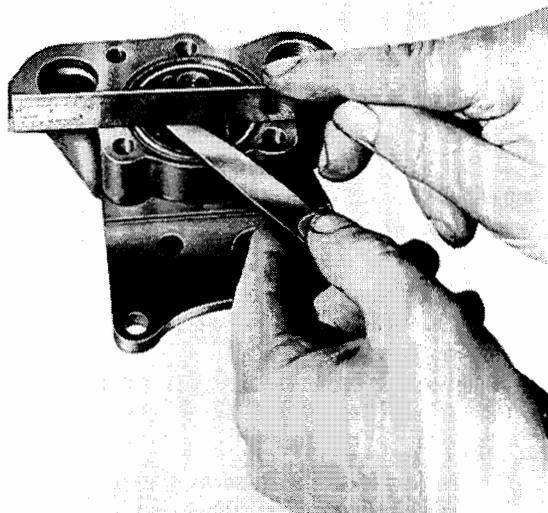

 $L11$ 

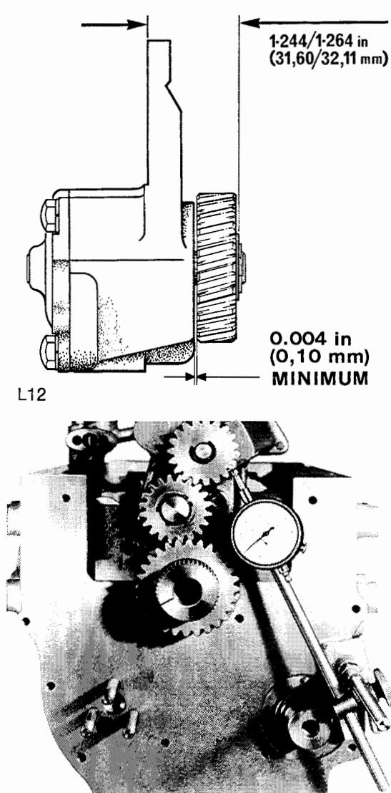

L13

{82}------------------------------------------------

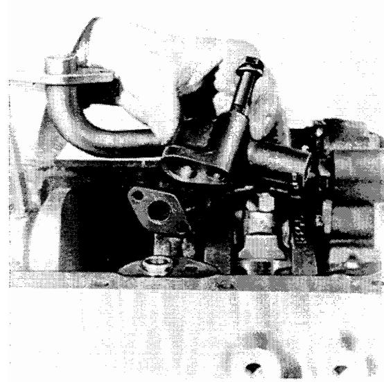

#### $L14$

- 3. Remove the relief valve housing, later type (Fig.  $L.14$ ).
- 4. Remove the splitpin from the end of the relief valve housing and withdraw the cap, spring and plunger (Fig. L.15).
- 5. Thoroughly clean all parts and inspect them for wear or damage.

#### To Assemble and Refit the Relief Valve **Assembly**

- 1. Fit the plunger, spring and cap to the relief valve housing and secure with the split pin.
- 2. If possible, check the pressure setting of the relief valve. The valve should lift between 50/60 lbf/in2 (3.52/4.22 kgf/cm2) 345/414 kN/m2 for naturally aspirated engines and 70/80 lbf ft (4,92/5,62 kgf/cm2) 482/551 kN/m2 for turbocharged engines. If not, extreme caution is advised when starting the engine until it is certain that the pressure relief valve is working correctly.
- 3. Refit the relief valve housing to the cylinder block. (Fig. L.16 illustrates early type arrangement).

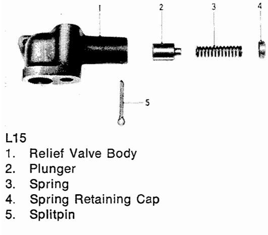

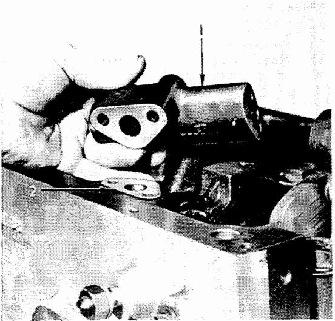

#### L16

- Oil Relief Valve  $\mathbf 1$ .
- $2.$ Joint
- 4. Connect the oil pump delivery pipe to the relief valve housing.
- 5. Ensure that the sump strainer is correctly positioned on the oil pump suction pipe. Refit the sump and refill with oil of an approved grade.

#### **Lubricating Oil Filters**

A sump strainer and a full flow main starter are fitted. The main oil filter is mounted on the side of the

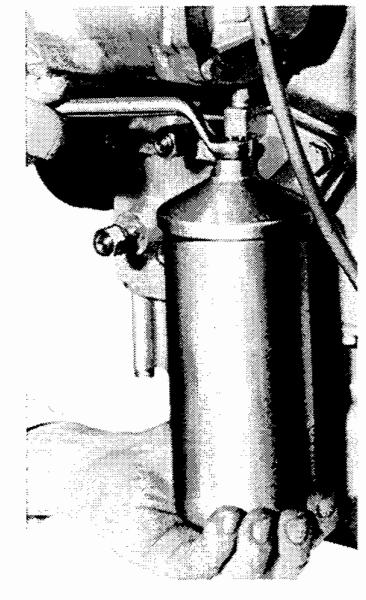

 $L17$ 

{83}------------------------------------------------

cylinder block. The paper element or canister should not be cleaned, but renewed as given in Section C.

The lubricating oil filter can be fitted to either side of the engine, but it is important to note that to change the filter position necessitates removal of the sump and changing the lubricating oil pump feed to the opposite side of the cylinder block. A different oil relief valve must also be fitted. Where a balance unit is fitted, then this must also be changed and an adaptor plate fitted in the old filter position as all these modifications are necessary to permit delivery of lubricating oil to the working parts of the engine.

#### To Change the Filter Element

- 1. Remove filter bowl (Figs. L.17 and L 18).
- 2. Remove the old element and clean out the container.
- 3. Part fill the container with new oil and fit the new element so that it locates correctly on the spring loaded guide in the base of the container.
- 4. Fit the new container seal in the filter head.
- 5. Offer up the container and element assembly to the filter head ensuring a correct seating in the filter head and secure to a torque of 15 lbf ft (2,1 kgf m) -20 Nm.

#### To Renew Screw Type Oil Filter Canister

- 1. Unscrew filter canister from filter head (Fig. L.19).
- 2. Discard old canister.
- 3. Clean filter head.
- 4. The T4.236 engine has an oil cooler which is mounted between the filter head and oil filter canister (Fig. L.20). Before fitting a replacement canister, the retaining adaptor screw should be checked for tightness. Ensure that the oil cooler is positioned correctly: clean sealing area for canister.

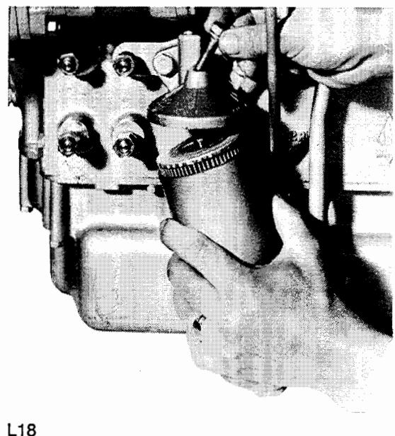

4.236 Series Workshop Manual, May, 1986.

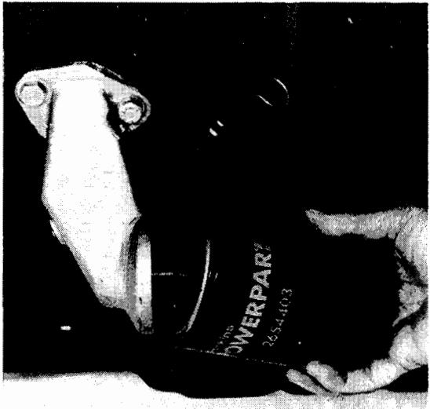

#### L19

- 5. Using clean engine oil, liberally oil top seal of replacement canister.
- 6. Fill canister with clean lubricating oil allowing time for the oil to filter through the element. Screw replacement canister onto filter head until seal just touches head and then tighten as per instructions on canister. Where a tool is available, tighten to 15 lbf ft (2,07 kgf m) -20 Nm.
- 7. Run engine and check for leaks.

Note: The oil filter canister has an internal valve to prevent drain back and a special tube stack so always ensure that the correct replacement is fitted.

#### To Remove and Replace Oil Filter Assembly

Withdraw the two setscrews securing the filter to the cylinder block and remove the filter assembly. Refit with new joint and torque setscrews to 30 lbf ft  $(4,2 \text{ kgf m}) - 41 \text{ Nm}.$ 

Check the sump level after running the engine and top up as necessary.

#### To Remove and Replace Oil Cooler (T4.236 only)

Drain cooling system.

Remove coolant pipes by loosening the hose clips and removing the hoses.

Remove lubricating oil filter canister by unscrewing in an anti-clockwise direction at the same time supporting oil cooler.

Remove oil cooler (Fig. L. 21). Note: 34 UNF oil cooler connector to lubricating oil filter head torque is 27.5 lbf ft  $(3.8 \text{ kgf m}) - 37 \text{ Nm}$ .

To replace, ensure that the filter/cooler assembly head is clean

Check cooler rubber "O" ring seal: replace if damaged or deformed.

Replace oil cooler ensuring "O" ring seal is seating correctly.

Replace lubricating oil filter canister as previously described.

Replace coolant pipes and hoses. Tighten hose clips. Refill cooling system.

{84}------------------------------------------------

#### **LUBRICATING SYSTEM-L.7**

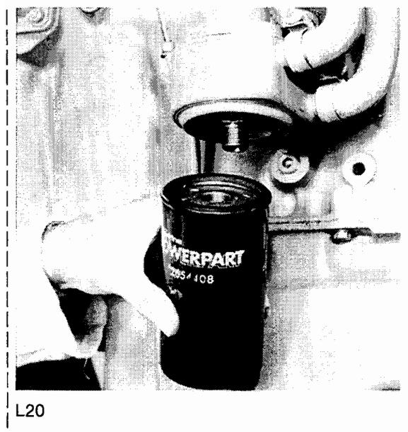

To remove filter from oil cooler.

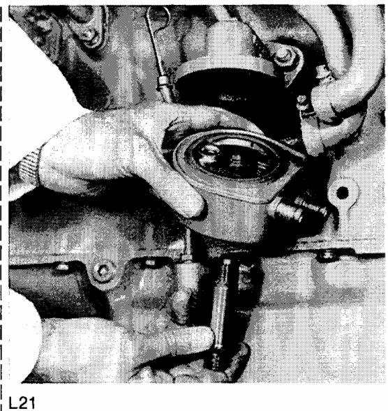

To remove oil cooler.

{85}------------------------------------------------

{86}------------------------------------------------

# **SECTION M Cooling System**

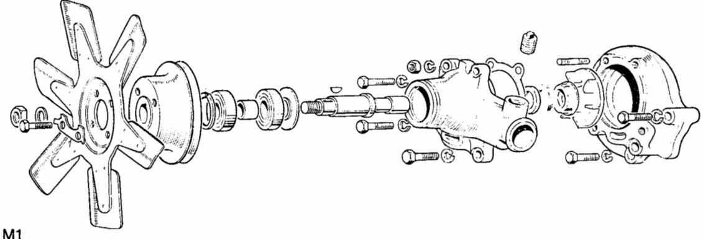

The engine is cooled by water circulation through passages in the cylinder block and head. Circulation is by thermo-syphon action assisted by an impeller type water pump driven by a "V" belt from the crankshaft pulley.

A high or low position water pump may be fitted on the front face of the cylinder block.

The water pump bearings are pre-packed with a special grease during assembly and do not require attention in service.

A thermostat is fitted in the water outlet connection.

#### To Remove and Refit Water Pump-**High Position Type**

- $1.$ Remove fan belt.
- 2. Remove fan.
- 3. Disconnect connections to water pump.
- 4. Remove pump.
- 5. Refit pump in reverse sequence. Reset fan belt tension.

#### To Adjust the Driving Belt

Fan and dynamo or alternator belt tension should be adjusted so that it is possible to depress the belt, approximately  $\frac{3}{8}$  in (10 mm). This should be checked between crankshaft and water pump pulleys (high position water pump) or between crankshaft and dynamo or alternator pulleys (low position water pump) see Fig. M.2.

Correct tension of the fan and dynamo or alternator belt should be maintained by periodical checking and adjustment.

Belt adjustment is obtained by altering the position of the dynamo or alternator with an adjustable link.

Note: When a new belt is fitted it is advisable to recheck the adjustment after a short running period.

For those engines which have twin fan belts fitted, they should not be renewed individually but in pairs.

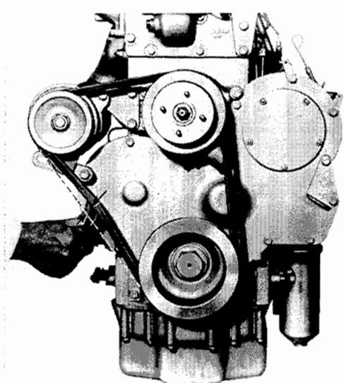

 $M2$ 

{87}------------------------------------------------

#### To Remove and Refit Water Pump-**Low Position Type**

- 1. Remove fan belt.
- 2. Remove fan.
- 3. Disconnect connections to water pump.
- 4. Remove dynamo or alternator and bracket.
- 5. Unscrew and remove nut and washer from stud at top of water pump. Unscrew four setscrews securing pump to cylinder block. Withdraw pump from engine (Fig. M.3).
- 6. To remove pump rear body from cylinder block, take out remaining setscrew, which passes through rear body only. Withdraw body from its location (Fig. M.4).
- 7. Refit pump rear body and water pump in reverse sequence.
- 8. Tension fan belt.

Note: With later pumps which are secured directly to the cylinder block, the lower fixing setscrew and corresponding drilled boss on the water pump body has been deleted and the joint and cylinder block modified accordingly.

The later type water pump is interchangeable with its predecessor providing the later joint is used and the lower setscrew discarded.

#### To Dismantle the Water Pump-**Earlier Low/High Types**

- 1. Remove the nut and spring washer (earlier engines may have self locking nut and plain washer) securing the water pump pulley and withdraw the pulley from the shaft (Fig. M5), also the driving key.
- 2. Press water pump shaft, complete with impeller, out of the body from the front.
- 3. Press impeller from the shaft.
- 4. Remove water seal from the shaft.
- 5. Remove bearing retaining circlip from front of body.
- 6. Press out the two bearings and distance piece.
- 7. Remove front grease seal, seal retainer and flange.

Note: With the latest water pumps, the seal retainer and flange has been deleted and the length of the distance piece increased accordingly.

#### To Dismantle the Water Pump - Latest Type

- Remove four pulley retaining setscrews and remove 1. pulley (see Fig. M6).
- 2. Remove nut and spring washer securing pulley hub to shaft.
- 3. Using a suitable puller, remove hub from shaft (see Fig. M7).
- 4. Remove circlip from end of bearing housing.
- 5. Support pump at pulley end and using a suitable mandrel that will pass through the bore of impellor, press out the shaft from the pump body complete with bearing assembly.

4.236 Series Workshop Manual, January 1993.

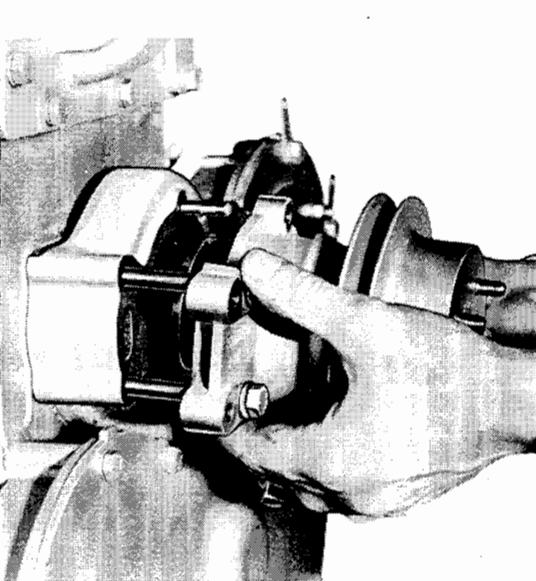

M3

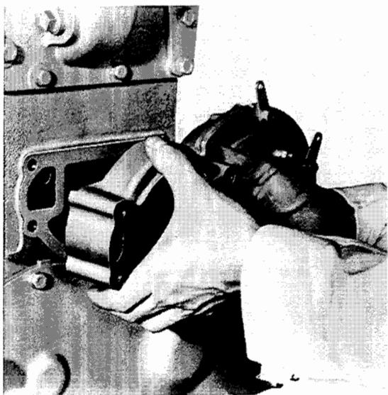

- 6. Press out the two bearings and distance piece from shaft.
- Remove seal/counterface unit from bearing housing.  $7.$

#### Inspection

- 1. Examine body for cracks, damage or corrosion.
- 2. Examine drive shaft for wear ensuring inner diameter of the bearings are a perfect fit on the shaft. The shaft should be renewed if the inner races rotate on it.
- 3. Remove rust and scale from impeller and inspect for cracks or damage. Examine impeller hub sealing face for excessive wear or scoring.
- 4. Examine water seal for damage.
- 5. Inspect bearings for pitting, corrosion or wear.

{88}------------------------------------------------

#### To Re-Assemble the Water Pump-**Earlier Low/High Types**

- 1. Press rear bearing onto the shaft, fit distance piece and press on front bearing. When fitting bearings to the shaft, ensure the shielded face of each bearing faces outwards towards the front and rear ends of shaft.
- 2. Fit grease seal retaining plate in position against back face of the rear bearing. This retaining plate is "dished" and when in position, the centre of the plate must not be in contact with the bearing.
- 3. Fit felt seal and seal retainer housing so that these bear on the retaining plate.
- 4. Half fill space between the two bearings with high melting point grease and press complete bearing and shaft assembly into pump housing from the front end. Position the retaining circlip in the recess of pump housing immediately forward of front bearing.
- 5. Fit water seal with carbon face towards rear.
- 6. At this stage, the shaft should be turned by hand to check for undue resistance.
- 7. Fit driving pulley key and press on pulley making sure there is no rearward movement of the shaft.
- 8. Where ceramic counterface seals are fitted, fit seal to shaft with counterface towards water seal and rubber bonded holder towards impeller face.
- 9. Press impeller onto shaft so that a clearance of 0.012/0.032 in (0,30/0,81 mm) is maintained between impeller vanes and pump body (Fig. M8).
- 10. Refit spring washer and nut, tightening to a torque of 60 lbf ft (8,3 kgf m) - 81 Nm. (If no spring washer is fitted, use 'Loctite' 603).

#### To Assemble the Water Pump - Latest Type

- 1. Fit seal/counterface unit into bearing housing, ensuring that the sealing face is correctly aligned in the housing to provide a good water seal.
- 2. Press rear bearing onto shaft, fit distance piece and press on front bearing.
- 3. Press shaft and bearing assembly into bearing housing and fit bearing retaining circlip.
- 4. Support impeller end of shaft and press on pulley hub. Apply Loctite 603 to shaft threads and fit spring washer and nut. Tighten nut to 60 lbf ft (8,3 kgf m)  $-81$  Nm.
- 5 With pulley end of shaft (not pump body) supported, press impellor onto shaft so that a clearance of 0.027/0.035 in (0,68/0,89 mm) is maintained between impellor blades and pump body.
- 6. Fit pulley and secure with four setscrews.

Note: Where an adaptor nut is fitted with an external left hand thread, the tightening torque is increased to 75 lbf ft (10,4 kgf m) 100 Nm. Use Loctite 603 on threads and | shaft.

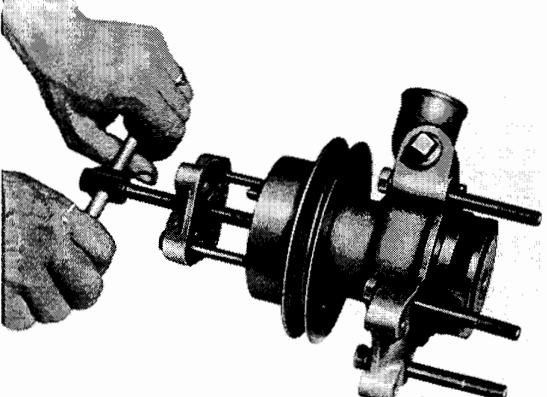

M5

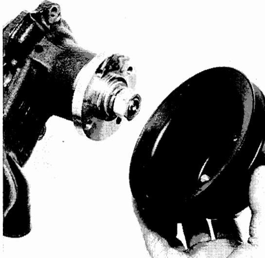

M6

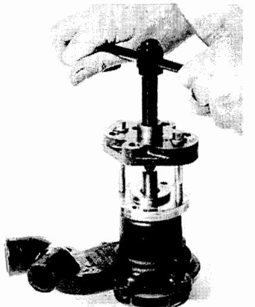

{89}------------------------------------------------

#### **Current Water Pumps**

From engine number LD50317U556771W, a new water seal and a new impelier have been introduced. The length of the impeller has also been reduced so that there is a clearance between the impeller and the seal. To ensure that this clearance is correct, it is important that the seal and impeller are fitted in accordance with the instructions that follow:

#### To Fit the New Seal

The new water seal is an interference fit on the shaft and a tool will be necessary to fit the seal correctly. The tool should be made of mild steel to the dimensions shown in figure M7A. The dimensions of the tool to fit the water seal will ensure that the seal is the correct length after it is installed. It will also prevent axial distortion of the seal when it is pressed onto the shaft.

Do not lubricate the seal. It is important that the seal is not contaminated by oil or grease and if it is held in the hand, it should be held by the edge of the flange. Do not damage the ring of green sealant applied to the body of the water seal just behind the flange of the seal.

- 1. Support the pulley end of the shaft, put the seal in position on the end of the shaft. Ensure that the ring of sealant is towards the bearings.
- 2. Use the tool to press the seal onto the shaft until the bottom of the seal flange is in contact with the pump body.
- 3. Continue to apply force for approximately ten seconds to ensure that the seal remains in position when the force is released.

#### To Fit the New Impeller

- 1. Support the pulley end of the shaft.
- 2. Press the impeller onto the shaft until the clearance between the impeller blades and the pump body is 0.027/0.035 (0,69/0,89).
- 3. Turn the shaft to ensure the impeller is free to rotate.

#### **Water Pump Seals**

Where ceramic counterface water pump seals are fitted, if the engine is run without coolant, even for a few seconds, the heat build-up between the carbon seal and ceramic counterface is very rapid, resulting in the cracking of the ceramic. This often creates the misun derstanding that the cause of leakage is due to the incorrect assembly of the sealing arrangement of the water pump.

#### To Remove the Thermostat

- 1. Drain off the coolant and remove the hose between radiator header tank and water outlet connection adaptor, or water pump.
- 2. Remove water outlet adaptor and joint.
- 3. Remove thermostat (Fig. M.9).

#### **Testing the Thermostat**

If it is suspected that the thermostat is not operating correctly it should be tested as follows.

4.236 Series Workshop Manual, January 1993.

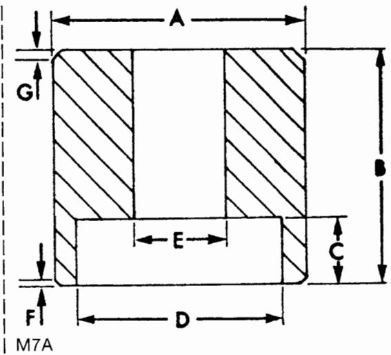

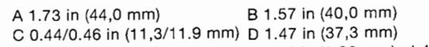

- F 0.04 in (1,00 mm) at 45°  $E$  0.63 in (16,1 mm)
- G 0.08 in (2,00 mm) at 45° ŧ

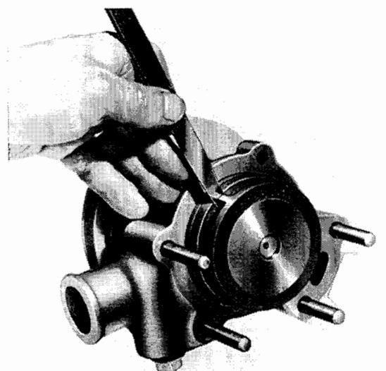

**MR** 

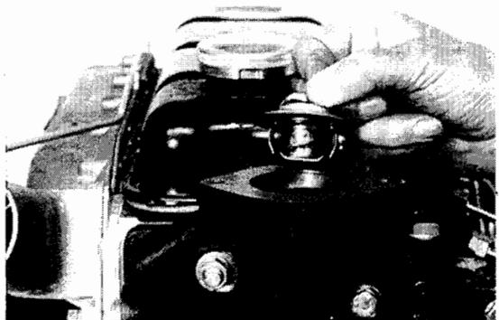

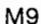

{90}------------------------------------------------

Immerse thermostat in water and gradually heat. Check water temperature at frequent intervals with accurate thermometer. The valve should commence to open at temperature stamped on top face of thermostat adjacent to valve seat.

Thermostats are not repairable.

#### **Piston Cooling Jets**

Piston cooling jets are fitted to the majority of turbocharged engines (see Fig. M10). Cooled lubricating oil is directed by means of spray jets fitted into the main pressure rail at the base of each cylinder liner onto the underside of each piston crown where it circulates, dispersing heat from the combustion area. The oil then drains back into the sump. The lubricating oil feed to the jet nozzle is controlled by a pressure relief valve fitted into the main body of the piston cooling jet assembly and comes into operation at a pressure of approximately 30 lbf/in2 (207 kN/m2).

#### To Remove Piston Cooling Jets (Fig. M10)

Drain the lubricating oil and remove sump.

Remove the banjo bolt securing the jet body to the cylinder block.

The piston jet assembly can now be removed.

#### To Refit Piston Cooling Jet

The body should be fitted to the cylinder block making sure that the dowel locates correctly.

Insert the banjo bolt and tighten to a torque of 20 lbf ft (2,77 kgf m) - 27 Nm.

Refit sump and fill with lubricating oil of an approved grade.

#### **Nozzle Position**

If the nozzle of the piston cooling jet has been moved out of position, it is important that the condition is corrected as follows:-

With a piston removed, insert a suitable diameter tube over the jet nozzle so that it shows above the top of the cylinder bore (see Fig. M11)

Fig. M11 also shows the dimensions taken on the top face of the cylinder block from the extreme edges of the liner bore (X).

The tube must emerge through the top of the liner bore at a point 0.75 in (19,3 mm) from the fuel injection side of the bore and 1.25 in (31,8 mm) from the engine front side of the bore.

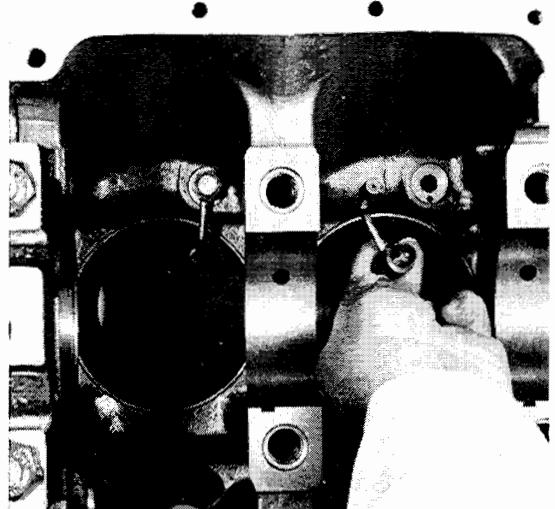

M10

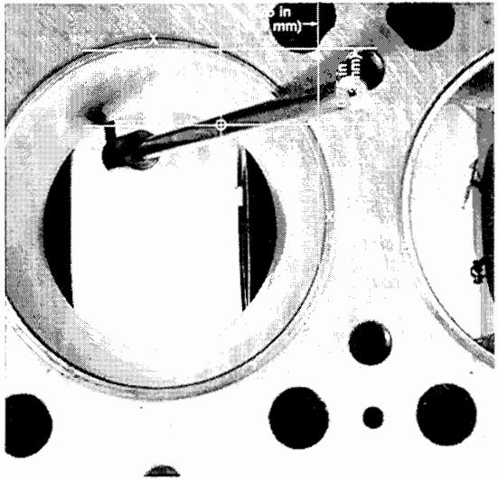

M11

{91}------------------------------------------------

 $\label{eq:2.1} \mathcal{L}_{\mathcal{A}}(\mathcal{A}) = \mathcal{L}_{\mathcal{A}}(\mathcal{A}) \mathcal{L}_{\mathcal{A}}(\mathcal{A}) = \mathcal{L}_{\mathcal{A}}(\mathcal{A})$ 

 $\label{eq:2.1} \frac{1}{\sqrt{2}}\left(\frac{1}{\sqrt{2}}\right)^{2} \left(\frac{1}{\sqrt{2}}\right)^{2} \left(\frac{1}{\sqrt{2}}\right)^{2} \left(\frac{1}{\sqrt{2}}\right)^{2} \left(\frac{1}{\sqrt{2}}\right)^{2} \left(\frac{1}{\sqrt{2}}\right)^{2} \left(\frac{1}{\sqrt{2}}\right)^{2} \left(\frac{1}{\sqrt{2}}\right)^{2} \left(\frac{1}{\sqrt{2}}\right)^{2} \left(\frac{1}{\sqrt{2}}\right)^{2} \left(\frac{1}{\sqrt{2}}\right)^{2} \left(\$ 

 $\mathcal{L}_{\text{max}}$  and  $\mathcal{L}_{\text{max}}$ 

 $\label{eq:2.1} \frac{1}{\sqrt{2}}\left(\frac{1}{\sqrt{2}}\right)^{2} \left(\frac{1}{\sqrt{2}}\right)^{2} \left(\frac{1}{\sqrt{2}}\right)^{2} \left(\frac{1}{\sqrt{2}}\right)^{2} \left(\frac{1}{\sqrt{2}}\right)^{2} \left(\frac{1}{\sqrt{2}}\right)^{2} \left(\frac{1}{\sqrt{2}}\right)^{2} \left(\frac{1}{\sqrt{2}}\right)^{2} \left(\frac{1}{\sqrt{2}}\right)^{2} \left(\frac{1}{\sqrt{2}}\right)^{2} \left(\frac{1}{\sqrt{2}}\right)^{2} \left(\$ 

 $\mathcal{L}^{\text{max}}_{\text{max}}$  and  $\mathcal{L}^{\text{max}}_{\text{max}}$ 

{92}------------------------------------------------

# **SECTION N Air Filters and Fuel System**

#### **Air Filters**

Operating conditions play an important part in deciding how frequently it is necessary to service the air filter. If you are working in dusty conditions then the air filter should be attended to every day, as indicated under "Preventive Maintenance".

If not already fitted, you should consider the fitting of a 22 in water gauge RESTRICTION INDICATOR in the air trunking between the air filter and the engine induction manifold. It indicates by means of a visual signal when the air filter element needs servicing

A means of visual signalling for the "Rotopamic" type air filter failure is the use of the "DUST SIGHT". A window in this device becomes cloudy when the system has failed, but this type of indicator is usually only used with the two stage extreme heavy duty filters.

The type of air filter fitted to the vehicle or machine depends upon the manufacturer of the equipment. Usually, guidance for the method of servicing is shown on the body of the air filter, but the following advice will also help.

#### Dry Type Two Stage "Cyclopac" (Fig. N.1)

The dust bowl collects the heavier particles which are thrown out by the centrifuge path of the air. This dust enters the bowl by the slot in the baffle plate. The level of dust in the bowl must not be allowed to reach to within half an inch of this slot in the baffle plate.

With horizontal installations the slot in the baffle is located at the top.

Renew the element or clean by back flow air presclamp. Remove the baffle from the interior of the dust cup by lifting it out, which gives access to the dust for removal. The element can be removed by releasing the wing nut.

Replace the element or clean by back flow air pressure no more than 100 lbf/in2 or washing in a nonfoaming detergent as recommended by the air filter manufacturers. Allow the element to soak for at least ten minutes and then gently agitate. Rinse the element with clean water and allow to dry. Do not use oven heat.

Warning. There is a danger that some of the dust remaining in the element after it is washed will be pulled through into the engine if the element is replaced in a wet condition. The reason for this is that the water acts as a carrier for the dust.

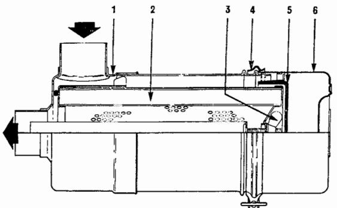

 $N1$ 

- 1. Body Assembly
- 2. Element Assembly
- 3. Nut and Gasket Assembly
- 4. Clamp Assembly
- 5. Baffle Skirt
- 6. Cup Assembly

Inspect the element by placing a bright light in its centre. Any pin holes, thin spots or ruptures render the element unfit for further use. This cleaning procedure reduces the effective life of the element.

With all dry type elements, they should be renewed after six cleanings or once a year, whichever occurs first.

### Dry Type Two Stage "Cyclone" (Fig. N.2)

The AUTOMATIC DUST EJECTOR should always be kept clean and the lips of the rubber ejector checked to see that they close but do not adhere together.

To service the element, unscrew the clamping screw and remove the element retaining strip. Remove the seal plate (if fitted) and element.

If the element is contaminated by dry dust, clean by carefully tapping by hand or by directing low pressure compressed air on to the clean side of the element. If the element is contaminated by oil or soot, it can be cleaned by washing in a suitable non-foaming detergent. After washing, rinse out thoroughly by directing clean water to clean air side of element and allow to dry-do not oven dry.

{93}------------------------------------------------

Inspect cleaned element by placing a bright light inside and looking through element. Any thin spots, pin holes or other damage will render the element unfit for further use.

The element should be renewed after six detergent washes or annually, whichever occurs first. Clean the inside of the filter body and dry thoroughly. Inspect joints, hoses and clips and renew where necessary.

Re-assemble filter ensuring that all joints are leak proof.

#### Extreme Heavy Duty Two Stage, with Multiple Elements "Rotopamic" (Fig. N.3)

The "Rotopamic" type air filter may be fitted where the application is designed to work in heavy concentrations of dust and a restriction indicator must be fitted.

The air filter elements are replaceable and no attempt should be made to clean or re-use dirty elements or cartridges.

For cartridge replacement, unclamp and remove the moisture eliminator or pre-cleaner panel, pull out the dirty cartridges and insert the new ones.

Refit the pre-cleaner.

Never use petrol (gasoline) for cleaning any of the air induction system.

#### Oil Bath Air Filters (Fig. N.4)

To service the oil bath type filter, the lid should be removed and the element lifted out. The oil in the container should be drained out and the dirt and sludge thoroughly cleaned out with a proprietary cleaning fluid or Kerosene. Refill the container with clean new engine lubricating oil to the indicated level. The woven filter element should be cleaned in a bath of Kerosene. Do not use petrol (gasoline) as this highly volatile fuel could cause explosive damage within the engine. The indicated filling mark level should never be exceeded, otherwise oil can be drawn up into the engine which could lead to uncontrolled engine speeds, and excessive engine wear.

The heavy duty oil bath air filters are usually fitted with a centrifugal pre-cleaner mounted on top of the main cleaner, this should be removed and the air inlet vanes in the bottom plate of the assembly, the ejection slots on the side of the cone and the vanes in the outlet tube, cleaned of dust and dirt. The detachable element is accessible by lowering the oil container which may be attached by clips or a pinch screw clamp.

Thoroughly clean the container and refill to the indicated level with new engine lubricating oil. The separate element should be cleaned in a Kerosene bath.

The upper element which is permanently attached inside the body should be periodically cleaned by washing in a Kerosene bath. Drain the element thoroughly before reassembly and do not use petrol (gasoline) for cleaning purposes.

4.236 Series Workshop Manual, March, 1988.

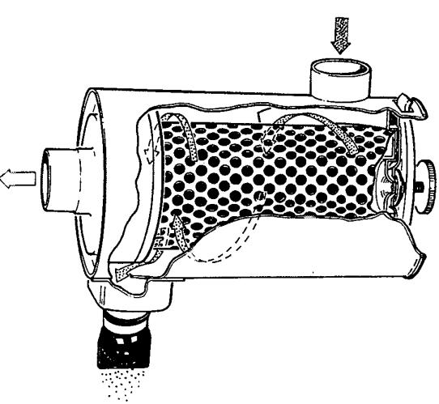

 $N2$ 

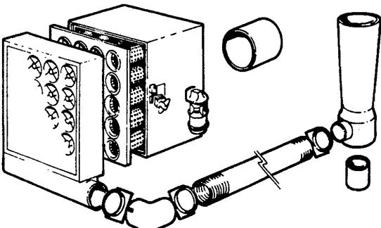

 $N3$ 

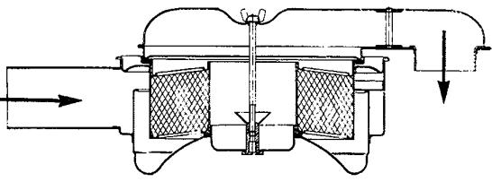

N4

#### Tractor Type Air Filter (Fig. N.5)

The air filter container should be removed, cleaned and recharged with clean new engine lubricating oil to the level mark every 50 hours. The lower gauze filter should be removed and cleaned. The larger gauze in the main body of the filter should also be cleaned.

Under extremely dirty conditions attention to the filter should be given more frequently. It is important to note that the filter oil container must never be filled above the indicated level.

{94}------------------------------------------------

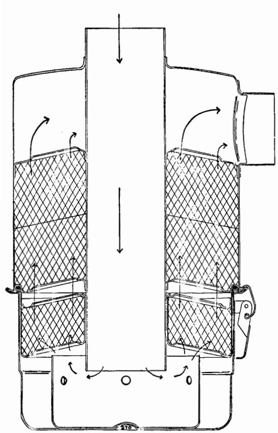

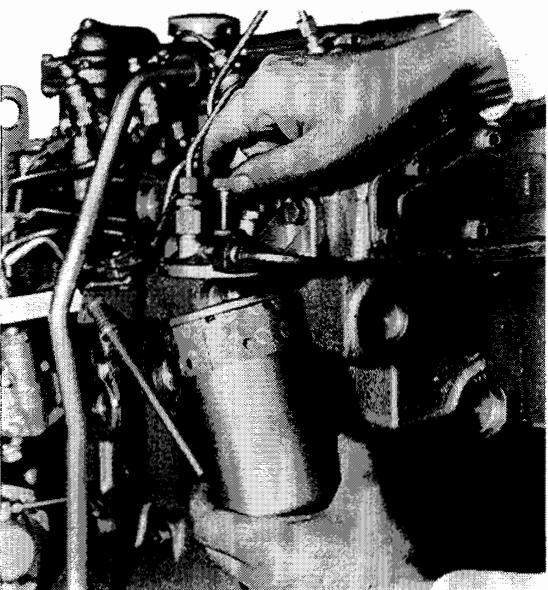

 $N7$ 

#### **Fuel Filters**

The fuel filter is of the paper element type, and no attempt should be made to clean the element. It should be renewed when periodical maintenance is being carried out.

The filters fitted to earlier engines have a separate element positioned inside a bowl whereas filters fitted to later engines have an encapsulated element held between the filter head and the filter base.

The period for changing the element will largely depend upon the quality and condition of the fuel available. Operating and maintenance information can be found in I the multi-lingual 4,236 Series Users Handbook.

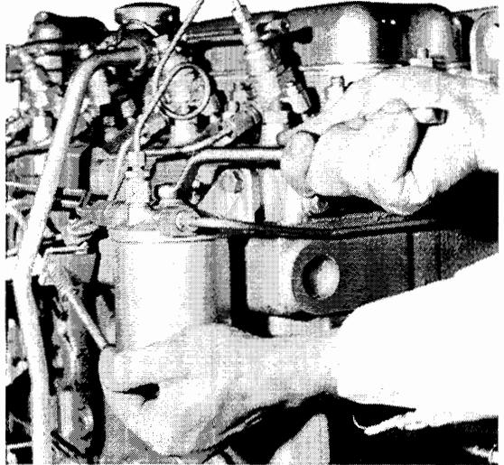

To Renew Earlier Type Filter Element

- 1. Remove filter bowl as in Figs. N.6 and N.7.
- 2. Discard the dirty element. Remove the lower element sealing washer, seal seating and spring from the bowl.
- 3. Clean the inside of the bowl and centre tube.
- 4. Fit the spring and seal seating to the bowl. Examine the lower seal, renew if necessary and refit to the bowl. Place the new element in position in the bowl.
- 5. Ensure that the element and bowl seals are in good condition, if not, fit new seals.
- 6. Refit the bowl to the top cover.
- 7. Vent the fuel system.

4.236 Series Workshop Manual, January 1993.

N6

 $N5$ 

{95}------------------------------------------------

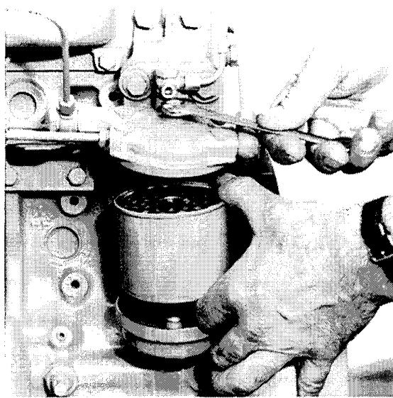

N8

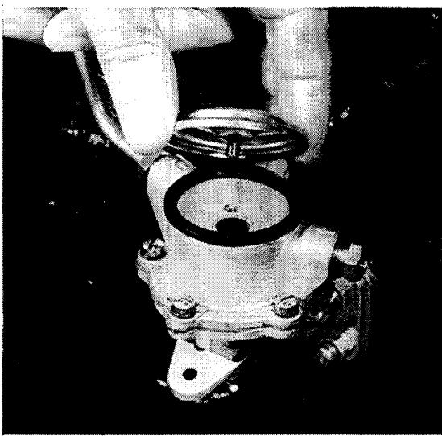

| N9A Lift Pump (later)

#### To Renew Later Type Filter Element

- 1. Thoroughly clean the exterior of the filter assembly.
- 2. Holding the filter base, unscrew the setscrew in the centre of the filter head and lower the base and filter element (Fig. N.8). Discard the filter element.
- 3. Thoroughly clean the filter head and base.
- 4. Inspect the sealing rings and renew if damaged in any way.
- 5. Place the base squarely on the bottom of the new filter element and offer up the element squarely to the filter head so that the top rim of the element locates centrally against the sealing ring in the filter head.
- Hold in this position whilst the securing setscrew 6. is located and screwed home.
- 7. Bleed the fuel system as detailed on Page N.9.

4.236 Series Workshop Manual, May, 1986.

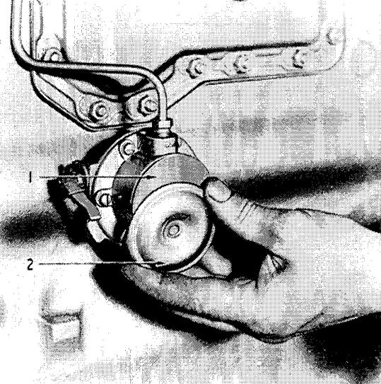

#### I N9 Lift Pump (earlier)

- 1. Pulsator Diaphragm
- 2. Lift Pump Cover

#### **Fuel Lift Pump Testing the Pump in Position**

- 1. Disconnect the outlet pipe (lift pump to filter) leaving a free outlet from the pump.
- Rotate the engine. There should be a spurt of fuel  $2.$ from the outlet port once every two revolutions.

#### Pressure Checking of Fuel Lift Pump in Position

Fit a 0-10 lbf/in2 (0-0,7 kgf/cm2) or 0-70 kN/m2 pressure gauge to the outlet of the pump. Ensure that there are no leaks at the connections between pump and gauge. Crank the engine for 10 seconds and note the maximum pressure on gauge. If the pressure recorded is less than 75% of the minimum production static pressure shown below, then rectify the pump. Also observe the rate at which the pressure drops to half the maximum figure obtained when cranking has ceased. If less than 30 seconds, rectify the pump.

|                  | Minimum Production                       |                                                                                                                     | Min. Test Pressure |                      |      |    |
|------------------|------------------------------------------|---------------------------------------------------------------------------------------------------------------------|--------------------|----------------------|------|----|
|                  | <b>Static Pressure</b>                   |                                                                                                                     | (75% of Min.       |                      |      |    |
|                  |                                          |                                                                                                                     |                    | Production Pressure) |      |    |
|                  |                                          | lbf/in 2 kgf/cm 2 kN/m 2 lbf/in 2 kgf/cm 2 kN/m 2 |                    |                      |      |    |
| 4 bolt type      | !!!!!!!!!!!!!!!!!!!!!!!!!!!!!!!!!!!!!!!! | 0.42                                                                                                                | 41                 | 4.5                  | 0.31 | 31 |
| 2 bolt type 2.75 |                                          | 0.19                                                                                                                | 19                 | 2.                   | 0.14 | 14 |

#### To Clean the Pump Chamber

- 11. Remove the fuel lift pump cover and pulsator diaphragm (Fig. N9 or N9A).
- $\mathsf{I}_{2}$ Clean the sediment chamber and check the diaphragm for condition.
- 3. Refit the diaphragm and cover. Tighten the securing screw just sufficiently to make a tight sealing joint.
- 4. Vent the fuel system.

{96}------------------------------------------------

#### To Remove the Pump

Lift pumps which are in an upright position (with the top cover uppermost) are fitted to later engines. These are secured with four studs, nuts and spring washers or setscrews and two keeper plates fitted vertically between the washers and the outside of the pump mounting flange.

- 1. Disconnect the pipes.
- 2. Remove the pump and joint.

#### To Dismantle the Pump (Fig. N.10)

- 1. Before dismantling, make a file mark across the two flanges for guidance in re-assembly.
- 2. Separate the two halves of the pump.
- $31$ Remove the diaphragm by unhooking it from the rocker arm link. The diaphragm spring can now be withdrawn.
- 4. Drive out the rocker arm pivot pin and withdraw the rocker arm, spring and link.
- 5. Dismantle the priming lever by removing the lever retaining pin.
- 6. Remove the valves by levering from their locations. Remove the valve gaskets.
- 7. Remove the pump cover and pulsator diaphragm.

#### **Inspection of Parts**

- 1. Check the diaphragm for hardening or cracking and examine the pull rod for wear at the point where it connects with the rocker lever link. A stem seal fitted over the daiphragm shaft may be found on some applications and should be renewed if worn.
- 2. The diaphragm spring should be renewed if corroded or distorted. Ensure the new spring has the same colour identification as the original.
- 3. The valves should be replaced. The two valves are identical and may be used for inlet or outlet (Fig.  $N.10$ .
- 4. Examine the rocker, arm, link, spring and pin for wear.
- 5. Check the pulsator diaphragm for condition.
- Examine the flanges of the two pump halves for 6. distortion. If necessary lightly linish to restore flatness.

#### To Re-Assemble the Pump

- 1. Fit the new valve gaskets and valves to the body. The inlet valve must be fitted so that it can open to admit fuel. The outlet valve must be fitted in the reverse position to the inlet valve. Valves are retained by retaining plate or alternatively by staking in six places with a suitable punch.
- 2. Fit the pulsator diaphragm and cover.
- 3. Insert the rocker arm pin through its hole in the body, at the same time engaging the link and the rocker arm. Tap the rocker arm pin in until it is flush with the pump body. Stake the casting in three places each side to retain the pin.
- 4. Place the diaphragm spring in position.
- 5. Place the diaphragm assembly over the spring, the pull rod being downwards, and centre the upper end of the spring in the lower diaphragm protector washer.
- 6. Press downward on the diaphragm and make sure that the downward tag on the lower diaphragm protecting washer is on the priming lever side of the body. This tag is required to be in the hole of the body ready for fitment of the priming lever. Engage the diaphragm pull rod with the link and at the same time match up the holes in the diaphragm.

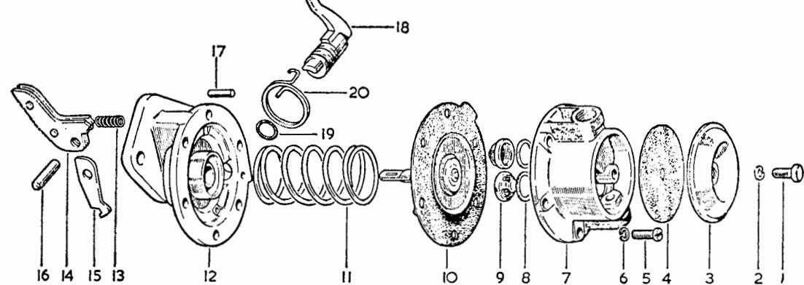

 $N10$ 

- 1. Pulsator Cover Screw
- $2.$ **Pulsator Cover Washer**
- $3.$ **Pulsator Cover**
- $\mathbf{4}$ Pulsator Diaphragm
- 5. Cover Screw
- 6. Cover Screw Washer
- 7. Cover
- 8. Valve Gasket
- 9. Valve Assembly
- 10. Diaphragm Assembly
- 11. Diaphragm Spring
- 12. Body
- 13. Rocker Arm Spring
- 14. Rocker Arm
- 15. Link
- 16. Rocker Arm Pin
- 17. Primer Pin
- 18. Primer
- 19. Sealing Ring
- 20. Primer Spring

{97}------------------------------------------------

7. Push the rocker arm towards the pump until the diaphragm is level with the body flanges. Place the upper half of the pump into position as shown by the file mark on the flanges. Install the screws and washers and tighten only until the heads just engage the washer. Release the rocker arm and push on the spaded end of the rod so as to hold the diaphragm at the top of the stroke, and while so held tighten the securing screws diagonally.

Note: The edges of the diaphragm should now be flush with its two clamping flanges. Any appreciable protrusion of the diaphragm indicates incorrect fitting.

- 8. Fit primer to side of body and retain with the pin. Clip on priming lever spring.
- 9. Test the pump to ensure that it is working correctly.

#### To Refit the Pump

1. Refit the pump to the cylinder block. Use a new joint.

Reconnect the fuel line and vent the system of air as detailed on page N.9.

#### **Fuel Injection Pump**

#### **Description**

The fuel injection pumps are of the DPA, DPS or Stanadyne distributor type. It is a precision built unit incorporating a simple hydraulic governor or one of the I mechanical governor type.

The pump is flange mounted and is driven from the engine timing case.

IMPORTANT NOTE: Unless the necessary equipment and experienced personnel are available, dismantling of the fuel pump should not be attempted.

#### To Remove the Fuel Pump (Hydraulic Governor)

- 1. Remove the high and low pressure pipes from the fuel numn.
- Disconnect the stop and throttle controls and re- $2.$ move the return springs.
- 3. Remove the fuel pump (Fig. N.11).

#### To Refit the Fuel Pump (Hydraulic Governor)

- 1. Replace the fuel pump ensuring that the master spline on its quill shaft will enter the female spline in the driving plate.
- 2. Position the fuel pump so that the scribed line on the fuel pump flange aligns with the mark on the fuel pump gear adaptor (Fig. N.12). Secure the pump to the timing case. To check accuracy of mark on fuel pump adaptor plate, this may be ascertained in accordance with instructions for marking new adaptor plates given on Page K.7.

4.236 Series Workshop Manual, January 1993.

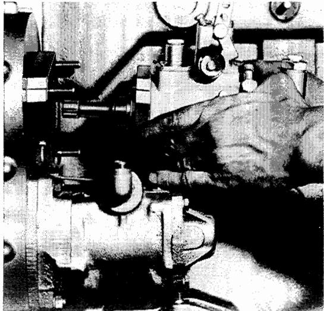

N11

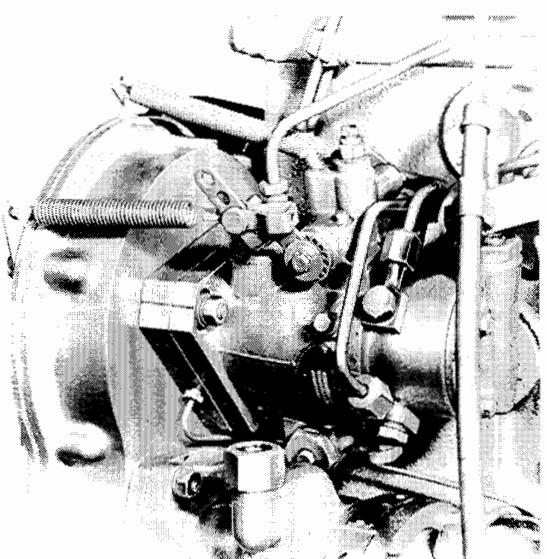

#### N12

- 3. Refit the high and low pressure pipes to the fuel pump.
- Re-connect the throttle and stop lever controls and  $4.$ attach the return springs.
- 5. Vent the air from the fuel system (Page N.9).
- 6. Adjust the maximum and idling speeds (Page N.9).

#### To Remove the Fuel Pump (Mechanical Governor)

- Remove the high and low pressure pipes from the 1. fuel pump.
- 2. Disconnect the stop and throttle controls and remove return springs and rear support bracket where fitted.

{98}------------------------------------------------

- 3. Remove the timing case front cover inspection plate (Fig. N.13).
- 4. Remove the three setscrews or nut which secure the fuel pump gear to the fuel pump.
- 5. Remove the fuel pump from the timing case ensuring that when the fuel pump gear leaves the shaft it stays in mesh with the idler gear otherwise the fuel pump timing will be affected

#### To Refit the Fuel Pump (Mechanical Governor)

- 1. Replace the fuel pump ensuring that the slot, or key in the pump hub, or shaft is aligned with the dowel (or keyway) in the gear.
- 2. Position the pump so that the scribed line on the pump flange aligns with the mark on the timing case (Fig. N.14). Secure the pump to the timing case. To check accuracy of mark on rear of timing case, this may be ascertained in accordance with the instructions for marking a new timing case given on Page K.6.
- 3. Secure the driving gear to the fuel pump shaft with the three setscrews and spring washers, or nut ensuring the dowel or keyway is properly located in its slot (Fig. K.14 or K.14A). See page B2 for recommended torque tensions.
- 4. Fit the timing case inspection cover.
- 5. Refit the low and high pressure pipes to the fuel pump.
- 6. Re-connect the throttle and stop lever controls and attach the return springs.
- 7. Vent the air from the fuel system (Page N.9).
- 8. Adjust the maximum and idling speeds.

NOTE: Where a fuel pump rear support bracket is fitted, ensure that when the fasteners are tightened the pump or bracket are not stressed.

#### **Fuel Pump Gear**

For details of fitting a new fuel pump gear see "Timing Case and Drive".

#### To Re-set the Fuel Pump Timing - D.P.A.

On the fuel pump rotor, inside the fuel pump are a number of scribed lines, each one bearing an individual letter. A timing circlip is positioned inside the pump and has to be set so that when the appropriate scribed line on the fuel pump rotor aligns with the scribed line on the circlip (Fig. K.13), it denotes commencement of injection (static timing).

NOTE: On later engines the scribed line on the circlip has been deleted. On these engines the scribed line on the rotor should be aligned with the end of the circlip which has the straight edge, (Fig. K.12). The circlip on current pumps is not set and timing tool MS67B must be used, see page K5.

To set the timing circlip, it is necessary to remove the pump from the engine and fix the position of the circlip by connecting No. 1 cylinder outlet connection (marked "W") to an atomiser tester and pump up to 30 atm (31 kgf/cm2 or 440 lbf/in2). Turn the pump by hand in the normal direction of rotation until it "locks up". The squared end of the circlip should now be adjusted until it lines up with the letter "A" for hydraulic pumps or the letter "C" for mechanical pumps, on the pump rotor.

To re-set the fuel timing the following procedure should be adopted:--

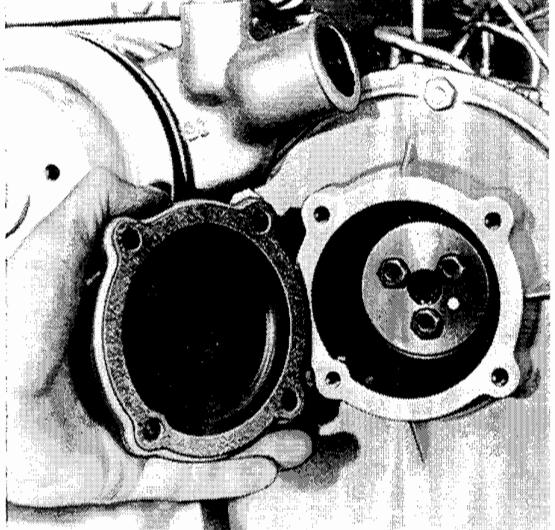

N13

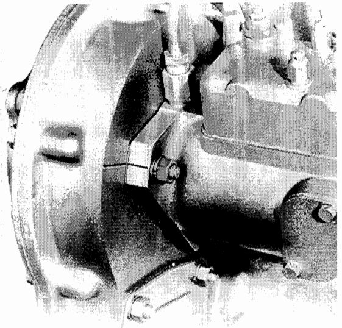

#### N14

#### (a) Hydraulically Governed Pump

Ensure that the fuel pump circlip is correctly positioned as described previously.

- 1. Ensure that the fuel pump is correctly fitted with the scribed line on the mounting flange aligning with the mark on the fuel pump gear carrier (Fig.  $N.12$ ).
- 2. Position the crankshaft so that No. 1 piston is at T.D.C. on compression stroke.
- 3. Remove the collets, spring cap and spring from the inlet valve of No. 1 cylinder and allow the valve to rest on the top of the piston.
- 4. With the aid of a clock gauge in contact with the end of the valve now resting on the No. 1 piston it will be necessary to position the crankshaft at the static timing position given on Page K.5.
- 5. Remove the inspection plate on the fuel pump enabling the rotor to be seen.

{99}------------------------------------------------

- 6. With No. 1 piston at the static timing point on its compression stroke, the scribed line on the fuel pump rotor marked "A" should align with the scribed line or straight edge on the circlip (Figs. K.12 and K.13). If it does not, release the fuel pump drive plate securing setscrews and turn the drive plate on the slotted holes, the required amount to bring them into alignment. Access to the drive plate is gained by removing the timing case front cover inspection plate (Fig. K.11).
- 7. When the fuel pump timing is correct, obliterate the mark on the fuel pump drive gear and re-mark the gear to correspond with the mark on the fuel pump drive plate (Fig. K.11).
- 8. Refit the spring, spring cap and collets to No. 1 inlet valve and refit the pump inspection plate and timing case inspection plate. Re-seal the inspection plate.

#### (b) Mechanically Governed Pumps - D.P.A.

The procedure for re-setting the fuel pump timing on mechanically governed engines is similar to that used for hydraulically governed engines with the exception of the method of pump adjustment.

As there is no adjustable fuel pump drive plate on a mechanically governed engine, the adjustment is carried out by slackening the nuts on the pump mounting flange and rotating the pump body until the scribed line on the rotor, marked with the letter 'C' aligns with the scribed line or straight edge of the circlip (Figs. K.12 and K.13). The circlip on current pumps is not set and timing too! MS67B must be used, see page K5.

#### To Check Marking Angle of Fuel Injection Pump using Tool MS.67B - D.P.A./D.P.S. Pumps

- 1. Release screw (5, Fig. N.15) and remove splined shaft (6). If pump has a slotted hub, the splined shaft should be retained with the small  $L_r$  ined diameter to the rear to locate in the centre of the hub.
- 2. Ensure that slotted pointer (2) is positioned with slot to rear of tool and chamfered sides of slot outwards. At this stage, slotted end of pointer should be kept well back towards body of tool. Ensure that the flat in the washer fitted behind the pointer securing screw (3) is located over side of pointer.
- Release bracket screw (4) and set bracket so that the chamfered edge is in line with the relevant marking angle (see Page B.17).
- 4. Position timing tool on pump drive shaft with master splines engaged and tool locating on spigot (see Fig. N.16). For D.P.S. pumps, first fit adaptor PD67-3 to end of pump drive shaft, (see Fig. N.16A). With dowel drive pumps, locate splined shaft in hub, slide tool towards pump to rest on end of hub and lock shaft in tool (See Fig. N17).
- 5. Connect No. 1 outlet of pump body to an atomiser test rig and pump up to 30 atmospheres (31 kgf/cm2) -440 lbf/in2. If pressurising valve is fitted this must be removed.
- 6. ' Turn pump in normal direction of rotation as shown on pump nameplate, until it locks.

4.236 Series Workshop Manual, January 1993.

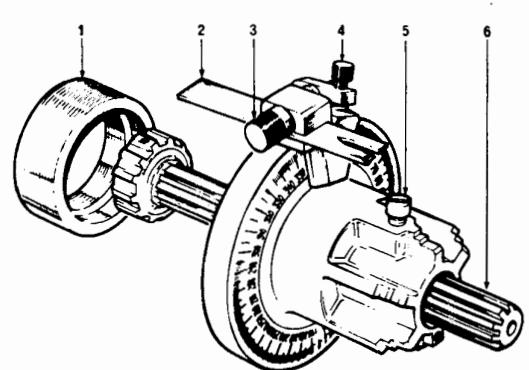

**N15** 

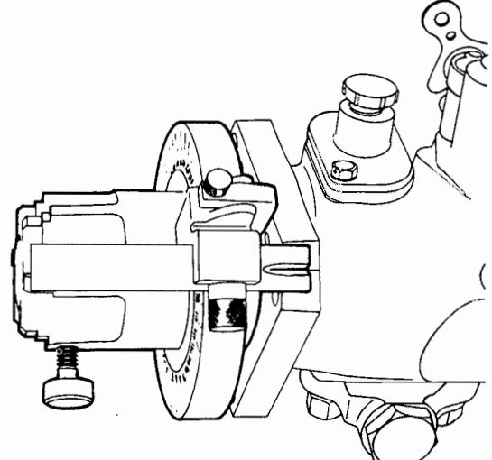

N16

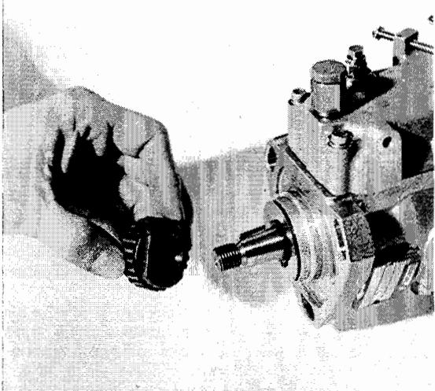

#### **N16A**

7. In this position, slide pointer forward until it is halfway over pump flange and check that timing mark is central to slot in pointer.

{100}------------------------------------------------

When fitting a replacement fuel pump, or in the event of the maximum speed screw having been moved, the maximum no load speed must be checked and re-set as necessary.

The maximum no load speed will vary according to application. For details, reference should be made to the code number stamped on the fuel pump data plate. The last four numbers in the code indicate the speed required, and in the case of the example on page N10, this would be 3130 rev/min.

#### To Check Marking Angle of Fuel Injection Pump using Tool MS. 67B and adaptors PD.67B-1 and PD. 67B-6 (Stanadyne Pump)

- 1. Fit the adaptor PD.67B-1 (Fig. N17A) to the hub of the pump by use of the special setscrews, part of tool PD.67B-6 (Fig. N17C). Ensure that the location slots of the hub and adaptor are together and in line (use the alignment gauge, part of tool PD.67-6) and that the adaptor is concentric with the hub.
- 2. Remove the splined shaft from the timing tool MS.67B (6, Fig. N15) and slide the small splined open end of the timing tool onto the splined shaft of adaptor PD.67B-1 (Fig. N17D). Lock the timing tool into position with the securing screw (5, Fig. N15).
- 3. Ensure the long pointer, part of tool PD.67B-6 is in position and that the sides of the slot with chamfers are on the outside. Ensure that the flat of the washer fitted behind the screw (3, Fig. N15) which fastens the pointer is in position.
- 4. Release the screw (4, Fig. N15) which fastens the bracket and set the bracket so that the edge with a chamfer is in line with the correct fuel injection pump mark angle (see page B17).

Note: As the tool will have to be fitted in the reverse position to normal; the setting angle has been adjusted to allow for this (see page B17).

- 5. Connect No. 1 cylinder outlet (8, Fig. N17B) to an atomiser tester and operate the tester until it reaches 31 kgf/cm2 (30 atm or 440 lbf/in2). If a pressure valve is fitted, this must be removed.
- 6. Turn the drive shaft of the pump backwards and forwards until the fuel pressure prevents movement of the shaft. This is necessary as fuel must pass the delivery valve in the fuel pump before the fuel pressure will prevent movement of the shaft. In this position, the fuel pump is set at the start of ignition from number 1 outlet
- Move the pointer forward until it is half over the 7. pump flange. Check that the timing mark is central to the slot in the pointer. Make a new timing mark if necessary.

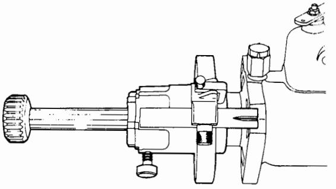

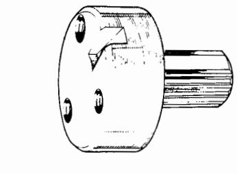

**N17A** 

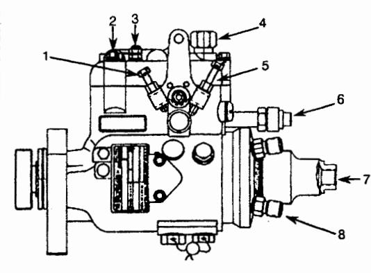

N17B Stanadyne Mechanical Fuel Injection Pump

screw

- 1. Idle speed adjustment 5. Maximum speed adjustment screw
	- screw 6. Governor rate adiustment

8. Outlet for number 1 cylinder

- 2. Earth connection for ESOS
- 3. Supply connection for 7. Fuel inlet connection
- **ESOS**
- 4. Fuel return connection

{101}------------------------------------------------

#### **Maximum Speed Setting**

**IMPORTANT NOTE:** The maximum speed screw seal of the original fuel pump must not be broken or tampered with in any way unless factory authority is first obtained. Failure to do so may result in the guarantee becoming void.

#### Code Example:- AS62/800/0/3130

NOTE: If the fuel pump data plate is damaged or defaced so as to make it impossible to read the code, or if the code is not stamped on the plate, you are advised to contact your nearest Perkins Distributor or C.A.V. dealer, or alternatively, Service Department, Perkins Engines Limited, Peterborough, to obtain the correct setting. Note: The setting codes of current pumps are different, for example: 2643C178LS/5/1890.

**IMPORTANT.** Under no circumstances should the engine be allowed to operate at a higher speed than specified or severe damage to the engine may result.

#### **Idling Speed Setting**

The engine idling speed is adjusted by the idling screw. With the engine warm, turn the screw clockwise to increase the engine speed and anti-clockwise to decrease.

The idling speed will vary, according to application. For details apply to the nearest Perkins Distributor or C.A.V. Dealer, alternatively Service Department, Perkins Engines Limited, Peterborough.

Note: The idle speed is normally fixed on Stanadyne constant speed pumps.

#### Priming the Fuel System

The air must be vented from the fuel system whenever any part of the system between the fuel tank and injection pump has been disconnected for any reason, or when the system has been emptied of fuel.

No attempt must be made to start the engine until the injection pump has been filled and primed as serious damage can be caused to the pump due to lack of lubrication.

Note: Some engines are fitted with a Stanadyne fuel injection pump. These pumps are self venting and will automatically remove air from the system.

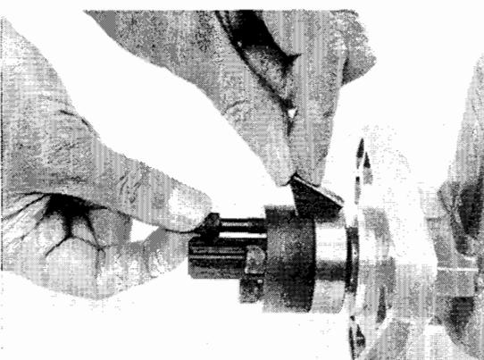

**N17C** 

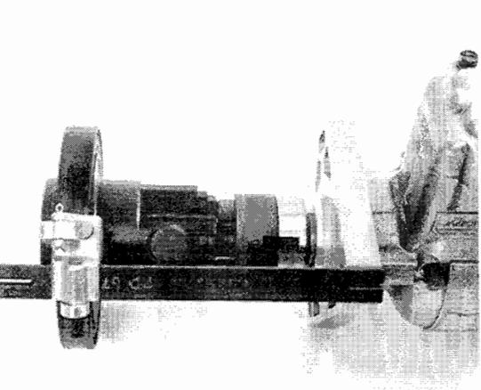

N17D

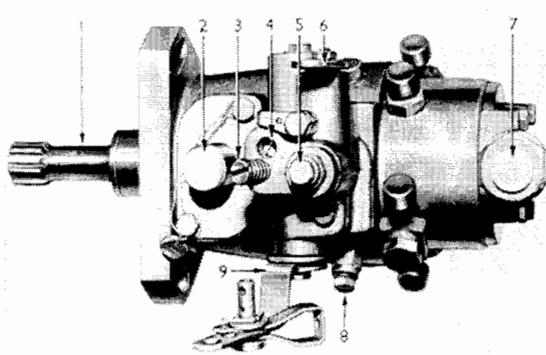

#### N18 D.P.A. Hydraulic Fuel Injection Pump

- 1. Drive Shaft
- 2. Fuel Outlet
- 3. Idling Screw
- 4. Maximum Speed Screw
	-
- 5. Bleed Screw
- 7. Fuel Inlet 8. Bleed Screw

6. Stop Lever

9. Speed Control Lever

{102}------------------------------------------------

- 1. Remove air from the fuel filter through the filter vent plug, (Fig. N19). If a filter vent plug is not fitted, the return to tank banjo connection in the top of the filter can be loosened to reduce the time needed to fill the filter with fuel.
- 2. Operate the fuel feed pump priming lever (Fig. N20) or (Fig. N21) until fuel oil free from air bubbles issues from around the threads. Tighten the plug or connection
- 3. Set the accelerator to the fully open position and ensure that the stop control is in the 'run' position. If an electric stop control solenoid is used, turn the start switch key to the 'R' position.
- 4. Loosen the vent screw in the hydraulic head locking bolt (8, Fig. N18) or (Fig. N22) and then the governor housing vent screw (5, Fig. N18), (3, Fig. N18A) or (Fig. N23).
- 5. Operate the fuel feed pump priming lever until fuel oil free from air bubbles issues from the vent screws
- 6. Tighten first the hydraulic head vent screw and then the governor housing vent screw.
	- Note: The D.P.S. pump has only one vent screw which is on top of the governor housing (Fig. N24).
- 7. If a 'Thermostart' cold start aid is fitted and the fuel pipe drained, loosen the union nut at the starting aid and operate the fuel feed pump priming lever until fuel oil free from air bubbles issues from the connection. Tighten the union nut.
- 8. Loosen the unions at the atomiser end of two of the high pressure fuel pipes and operate the starter motor until fuel oil free from air bubbles issues from both fuel pipes. Tighten both unions and the engine is ready to start.

#### Priming Procedure after changing Earlier **Filter Element**

- 1. With the vent plug on the filter cover removed, and the union at the filter end of the return pipe (filter to tank) slackened, operate the feed pump priming lever until fuel oil, free from air bubbles, issues from the filter cover vent.
- 2. Replace the vent plug, and continue to operate the priming lever until fuel oil, free from air bubbles, issues from around the threads of the return pipe union.
- 3. Tighten the return pipe union.
- Slacken the union at the filter end of the filter to  $\blacktriangle$ injection pump feed pipe, and operate the priming lever until fuel oil, free from air bubbles, issues from around the union threads.
- 5 Tighten the feed pipe union. The pump and filter are now filled and primed.

#### **Atomisers General**

When replacing atomisers in the cylinder head it is essential that a new, correct type copper washer is fitted betwen the nozzle cap and the cylinder head.

A one piece collar type dust seal is fitted on earlier engines but later engines have an improved two piece arrangement which consists of a soft rubber sealing ring

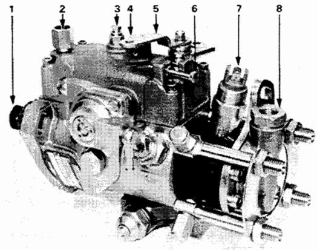

#### N18A D.P.S. Mechanical Fuel Injection Pump

- 1. Drive Shaft
- 5. Speed Control Lever
- 2. Pressurising Valve
	-
- 3. Bleed Screw 4. Idling Screw
- 6. Maximum Speed Screw 7. Solenoid Shut Off Valve
- 8. Fuel Inlet

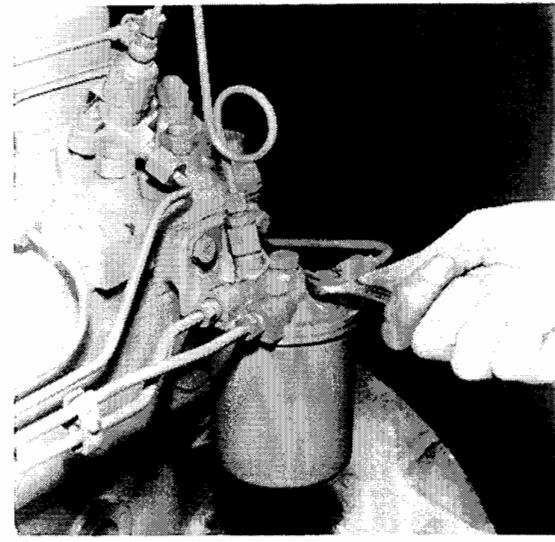

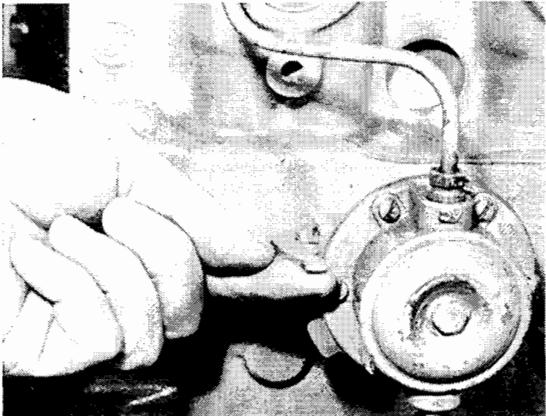

N20 Fuel Lift Pump - Earlier

{103}------------------------------------------------

or sleeve and a rigid plastic spacer which presses down onto the rubber sealing ring.

Note: The rubber sealing ring is always fitted below the rigid spacer.

Tighten securing nuts evenly to 14 lbf ft (1,9 kgf m)  $-$ 18 Nm. If a separate clamp is fitted, tighten to 9 lbf ft  $(1, 2$  kgf m) 12 Nm.

Some engines are fitted with atomisers which use a top inlet connection. These can be fitted with the atomiser 180° out of position. In this position, the nozzle holes will not spray into the combustion chamber correctly and will result in loss of power and increased smoke emission. Atomisers with top inlet connections must always be fitted with the leak off connection to the fuel injection pump side.

Atomisers · should be taken out for examination at requiar intervals.

The first symptoms of atomiser troubles usually fall in one or more of the following headings:-

- 1. Misfiring.
- 2. Knocking in one (or more) cylinders.
- 3. Engine overheating.
- 4. Loss of power.
- 5. Smoky exhaust (black).
- 6. Increased fuel consumption.

The particular faulty atomiser or atomisers may be determined by releasing the pipe union nut on each atomiser in turn, with the engine running at a fast "tickover". If after slackening a pipe union nut the engine revolutions remain constant, this denotes a faulty atomiser. The complete unit should be withdrawn from the cylinder head and inverted, atomiser nozzle outwards and the unions retightened. After slackening the unions of the other atomiser pipes (to avoid the possibility of the engine starting), the engine should be turned until the nozzle sprays into the air, when it will be seen if the spray is in order. If the spray is unduly "wet" or "streaky" or obviously to one side, or the nozzle "dribbles" it may only be necessary to probe the nozzle holes to remove carbon.

NOTE: Care should be exercised to prevent the hands or face from coming into contact with the spray, as the working pressure will cause the fuel oil to penetrate the skin.

NO ATTEMPT SHOULD BE MADE TO ADJUST THE INJECTION PRESSURE WITHOUT A PROPER TESTING PUMP AND PRESSURE GAUGE (FIG. N25) IT IS QUITE IMPOSSIBLE TO ADJUST THE SETTING OF ATOMISERS WITH ANY DEGREE OF ACCURACY WITHOUT PROPER EQUIPMENT.

A perfect atomisers, when tested by pumping fuel through it in the open air gives a short "pinging" sound as the fuel emerges from the holes. After the atomiser has been in service for some time, the "pinging" changes to a crackling sound. It is not until the atomiser sounds "dead" that its condition is likely to affect the running of the engine.

4.236 Series Workshop Manual, January 1993.

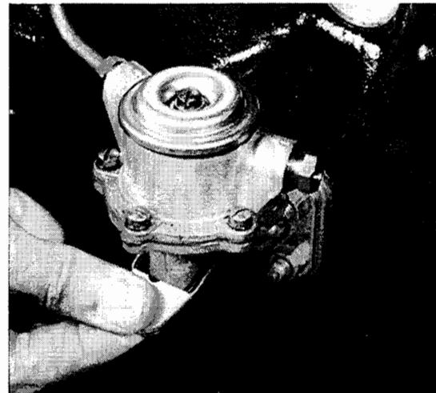

N21 Fuel Lift Pump - Later

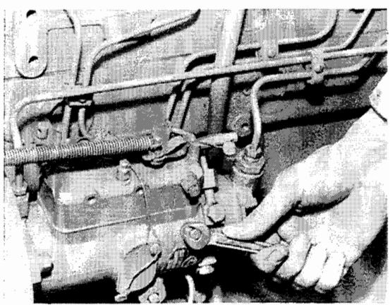

N22

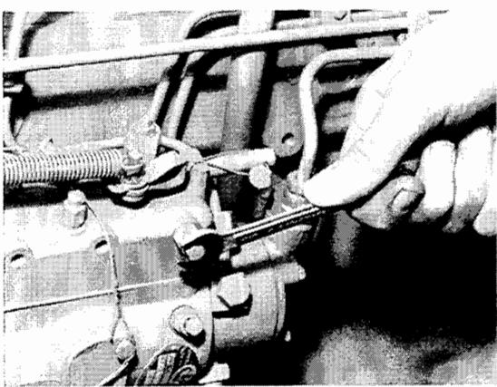

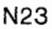

#### **Atomiser Identification**

Atomiser identification codes as given on Page B.18 were originally stamped on a tab washer fitted under the spring cap locknut.

Currently, the atomiser code is stamped on the atomiser body.

{104}------------------------------------------------

#### **Fuel Pipes**

For standardisation purposes, high pressure fuel pipe assemblies are now supplied with olives fitted as shown in Fig. N.26. The earlier type pipe assemblies with olives fitted in the reversed position are still satisfactory. Current pipes have formed ends.

No two of the pressure pipes, from the fuel pump to the atomisers are alike.

(High pressure fuel pipe nuts should be tightened to 15 lbf ft (2,1 kgf m) - 20 Nm.

If the union nuts have been over-tightened there is a risk that the olives will have cracked or been unduly compressed, when leakage will result.

The working pressure which these joints must sustain is several thousand pounds per square inch.

If the union is tightened excessively the olive may collapse and split. The same danger exists if the pipe is not square to and central with the union.

When changing an atomiser always remove the pipe entirely.

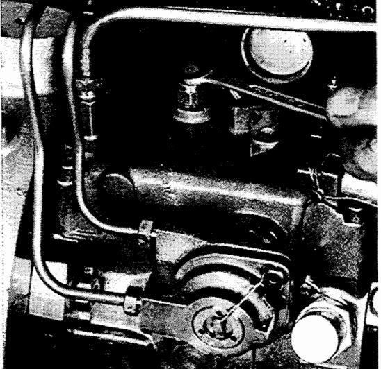

N24 D.P.S. Mechanical Fuel Injection Pump

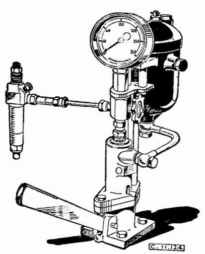

N25

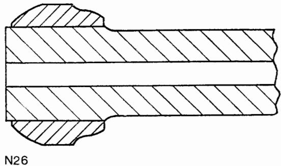

{105}------------------------------------------------

Downloaded from [www.Manualslib.com](http://www.manualslib.com/) manuals search engine

{106}------------------------------------------------

# **SECTION P Flywheel and Flywheel Housing**

#### To Remove the Flywheel

- 1. Remove the gearbox and flywheel housing.
- 2. Remove clutch assembly.
- 3. Remove the flywheel (see Note). With some applications, the flywheel is secured to the crankshaft with 12 setscrews and washers.
- 4. Remove the clutch pilot bearing (if fitted).

NOTE. To facilitate safe flywheel removal, remove two diametrically opposed securing setscrews and in their place, fit two suitably sized studs, finger tight only. The remaining setscrews can now be removed and the flywheel withdrawn under control.

#### To Renew the Flywheel Ring Gear

1. Place the flywheel in a suitable container of clean cold water and support it by positioning four metal blocks under the ring gear. Arrange the flywheel assembly so that, when placed in the water the ring gear is uppermost and clear of the water line by approximately  $\frac{1}{4}$  in (6,5 mm).

Heat the ring gear evenly around its circumference, thus expanding it. This will allow the flywheel to drop away from the ring gear.

2. Heat the new ring gear to an approximate temperature of 518°F (270°C). Fit the gear over the flywheel with the lead-in on the teeth facing towards the front of the flywheel and allow the ring to cool.

#### To Refit the Flywheel

 $\mathbf{I}$ 

 $\mathbf{I}$ 

 $\mathbf{I}$ 

 $\mathbf{I}$ 

- 1. Using the method of removal but in reverse, mount the flywheel to the crankshaft flange so that the untapped hole in the flange is in line with the seventh unused smaller hole in the flywheel.
- 2. Engage the securing setscrews with new hardened steel washers and tighten to a torque of 80 lbf ft (11,0 kgf m) --- 108 Nm. Where the flywheel is secured with place bolts, without washers, these should be tightened to 90 lbf ft (12,4 kgf m) - 122 Nm. Place bolts can be identified by the 6 slots cut in the head face and the embossed letter 'T'.
- 3. Set up a clock indicator gauge with the base secured to the flywheel housing or cylinder block and adjust the clock so that the stylus is contacting the flywheel periphery. Turn the crankshaft and check the total reading. The flywheel should run true within 0.012 in (0,30 mm) total indicator reading.
- 4. Now adjust the clock gauge so that the plunger is at right angles to the crankshaft flange and rests on the vertical machined face of the flywheel, at the outermost point of the face (Fig. P.1).

Press the crankshaft one way to take up the end float, and turn the flywheel. The run-out on the flywheel face should be within 0.001 in (0,025 mm)

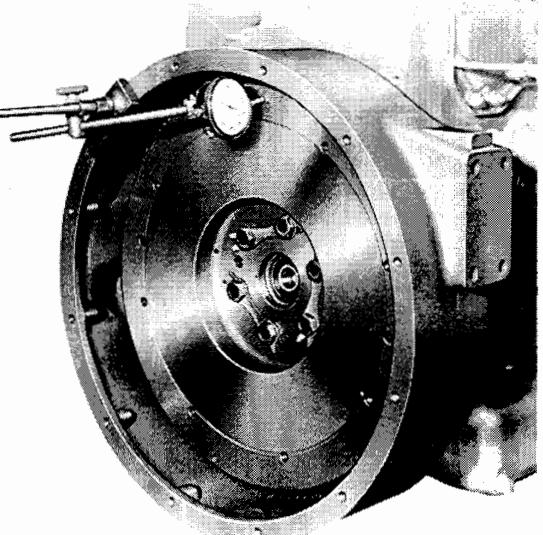

P1

per inch (25 mm) of flywheel radius from the crankshaft axis to the clock gauge stylus. If not, remove flywheel and check mating faces for burrs and dirt.

- 5. Lock the setscrews with the tab washers where fitted.
- 6. Refit the clutch and gearbox, etc.

#### To Remove the Flywheel Housing

- 1. Remove the flywheel.
- 2. Unscrew the nuts or setscrews securing the flywheel housing to the cylinder block and tap the housing clear of the locating dowels.
- 3. Examine the housing for cracks and damage etc

#### To Refit the Flywheel Housing

- 1. Fit the housing to the cylinder block.
- 2. Refit the securing nuts or setscrews.
- 3. Check concentricity (Fig. P.2.) The inner bore of of the flywheel housing must be truly central with the crankshaft within the limits listed overleal.

{107}------------------------------------------------

#### FLYWHEEL AND FLYWHEEL HOUSING-P.2

4. Check perpendicular alignment (Fig. P.3). This facing should be within the limits listed below. Diameter of Housing Allowance Up to  $14\frac{1}{4}$  in (362 mm)

0.006 in (0,15 mm) Total Indicator Reading. 14} in to 20} in (362 to 511,18 mm) 0.008 in (0,20 mm) Total Indicator Reading.

20} in to 25} in (511,18 to 647,70 mm)

- 0.010 in (0,25 mm) Total Indicator Reading. 25} in to 31 in (647,70 to 787,40 mm) 0.012 in (0,30 mm) Total Indicator Reading.
- 5. All adjustments to bring the flywheel housing within the above limits must be carried out on the flywheel housing and under NO CONDITIONS must the rear face of the cylinder block be interfered with.
- 6. When the housing is properly aligned to the above limits, tighten the securing nuts evenly. See page B2 for recommended torque tensions.
- 7. Refit the flywheel (Page P.1).

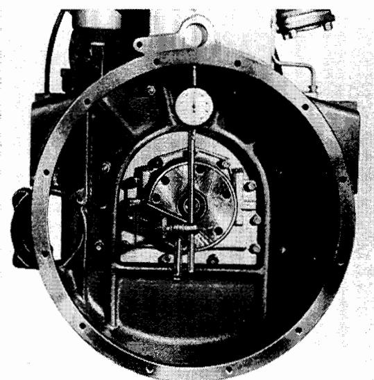

P2

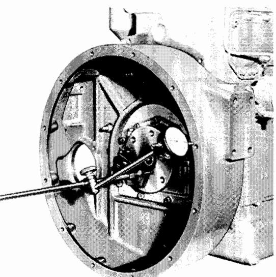

P3

#### Oil Seal for Fluid Drive

Engines which transmit power through a fluid drive have a sealed back end arrangement consisting of spring loaded rubber seal fitted in the engine backplate which locates around a spigot on the front face of the flywheel.

When fitting this seal, ensure that the lip of seal is towards the flywheel and the back of the seal is fitted flush with the front face of the backplate.

{108}------------------------------------------------

# **SECTION Q Exhauster**

#### **Description**

The A.350 type exhauster, which is fitted to the 4.236 engine, is a rotary sliding vane pump, with an eccentrically mounted rotor.

The exhauster body and end covers are of cast iron, and house an aluminium rotor, die-cast on to a steel shaft. The rotor has four equi-spaced slots to accommodate fibre blades.

The shaft runs in a sintered bronze plain bearing in the rear end cover, and a roller race in the drive end cover, or, alternatively, two sintered bronze bearings. Drive end covers with a roller race have two shaft seals which contact a hardened steel collar pressed on to the rotor shaft. The seals are arranged to prevent ingress of air and dirt, and leakage of oil from the exhauster. Drive end covers with a plain bearing have only one seal, preventing oil leakage.

The shaft drive end is splined to take the drive gear.

The intake port in the exhauster is pipe connected to the vacuum reservoir. The outlet port formed in the end cover of the exhauster aligns with the aperture in the timing case.

Lubrication is by engine pressure feed, oil entering through a connection in the rear end cover to an annular groove in the bearing housing. The oil passes through a hole in the bearing to oilways in the rotor shaft communicating with the slots in the rotor. The oil passes through the end of the rotor slots to lubricate the drive end roller bearing. When a plain bearing is fitted in the drive end cover, it receives oil through an extension of the main oilway in the rotor shaft.

A passage in the drive end cover to the vacuum side of the pump relieves oil pressure on the seal.

#### Operation

At all speeds the rotor blades are kept in contact with the bore of the body by centrifugal force, assisted by the hydraulic action of the oil beneath the blades. When the rotor turns, the spaces between the blades vary because of the eccentric mounting of the rotor in the exhauster body. As a blade passes the inlet port, the space between it and the following blade is increasing and air is drawn from the vacuum reservoir. This air is then compressed and expelled, with the lubricating oil, through the outlet port to the engine timing case.

#### **Periodic Inspections and Preventive Maintenance**

#### Every 5,000 miles (7,500 km) or 250 Hours

Check the vacuum lines and fittings. (Vacuum leakage may occur through the line, or reservoir mounted nonreturn valve if the valve seat is dirty or pitted). Examine the exhauster for evidence of oil leakage, particularly at end cover joints, and at shaft oil seal.

Check the oil supply line for leaks at fittings and connections.

Check the mounting and end cover nuts and bolts for tightness.

#### Every 60,000 Miles (90,000 km) or 2,500 Hours

Remove and dismantle exhauster, thoroughly clean all parts and inspect for wear and damage. Repair or replace the exhauster with a Factory Replacement Unit.

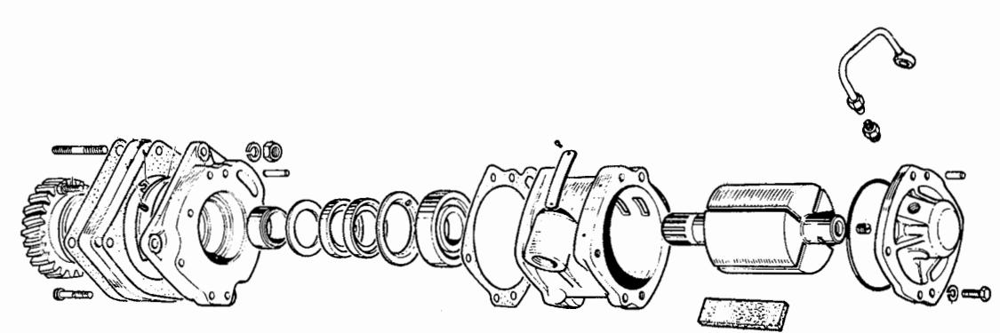

{109}------------------------------------------------

### **EXHAUSTER-0.2**

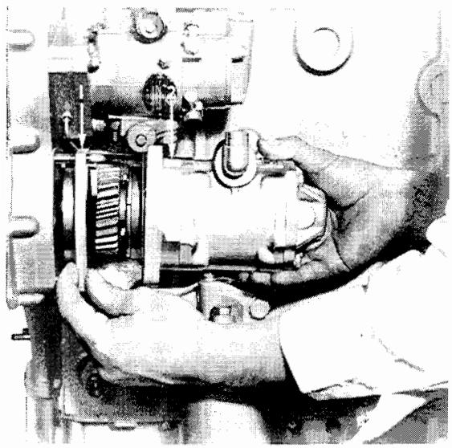

#### $Q2$

- 1. Distance Piece
- 2. Exhauster

#### **Cleaning and Inspection** Cleaning

Wash the roller bearing, where fitted, in thin flushing oil or white spirit and blow dry with compressed air. Spinning the bearing with compressed air should be avoided, otherwise damage to the rollers and race will occur.

Wash the remaining components in cleaning solvent, and clear the rotor and drive end cover oilways with compressed air.

#### **Inspection of Parts**

Examine the roller bearings, where fitted, for discolouration, wear, pitting and cracked races. Rotate slowly to examine for roughness. To renew, see "Overhaul" Section. Premature failure may have been caused by shortage of oil.

Examine plain bearing(s) for excessive wear. To renew, see "Overhaul" Section.

Inspect rotor and shaft for cracks and damage, and the shaft seal collar for wear. To renew collar, see "Overhaul" Section.

#### Removal

Disconnect oil and vacuum pipes at the exhauster and plug ends to prevent the entry of foreign matter.

Undo the four nuts that secure the exhauster to the timing case, and withdraw the unit complete with its driving gear, from the studs (Fig. Q.2).

#### **Dismantling**

Remove the two half-round thrust plates which locate the drive gear on the front of exhauster shaft.

Remove drive gear.

Mark the end covers in relation to the body to correct location on re-assembly.

Unscrew four setscrews and remove rear end cover with rubber sealing ring.

Mark the blades in relation to the rotor.

Withdraw the rotor and fibre blades from the body.

Unscrew four socket headed screws, and remove drive end cover, with joint or rubber ring.

Remove rear end cover circlip, blanking disc, and rubber oil seal ring, if fitted.

NOTE:-- Further dismantling of the rotor assembly need be undertaken only if, after inspection, it is found necessary to renew the bearing or shaft collar.

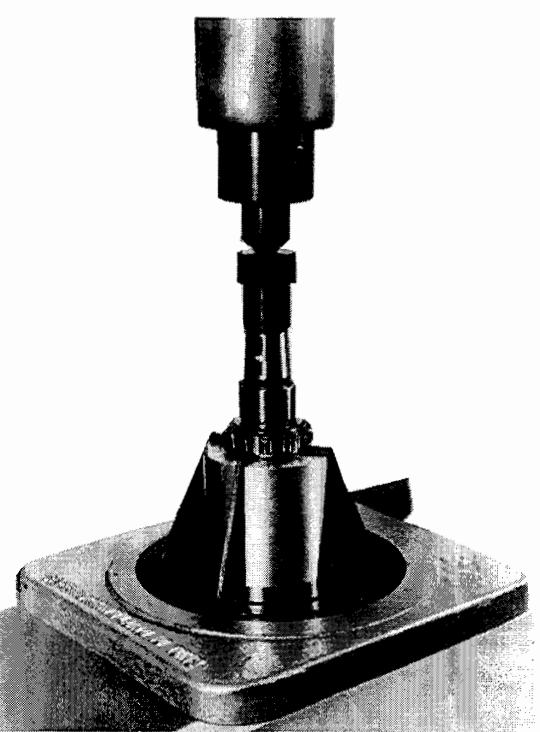

{110}------------------------------------------------

Check fit of blades in rotor slots, replace any worn or damaged blades.

Examine the seal(s) carefully to see that the sealing edge is pliable, intact and sharp. Wear or deterioration is caused primarily by dirty oil and grit. Ineffective seals should be replaced. See "Overhaul" Section.

Examine the body for cracks and damage, and the bore for longitudinal ripples or lines. If these are only slight the body is still serviceable, if excessive the body should be renewed.

Examine the end covers, and replace if cracked or scored.

#### End Cover Bearings and Seals-To Renew

Roller outer race: Tap end cover face several times on to a wooden block, suitably recessed to accommodate the race. Press new race fully into housing.

Seals: Remove circlip, if fitted, and seal outer back plate and remove seals from cover. Fit new seals with inner seal lip facing inwards, and the other outwards. Replace back plate and circlip.

With recessed end cover, remove bearing outer race as above, and withdraw inner back plate. Press outer back plate and seals from cover using a bar or tube 1% in (33,34 mm) diameter. Inspect back plates for damage and renew if necessary. Insert outer back plate, press in new seals arranged as above, replace inner back plate, smaller diameter first, and press race into housing.

Where cover has one oil seal, fit new seal with lip facing inwards.

#### **Plain Bearings**

When bearing is housed in a blanked off cover, remove circlip, blanking disc, rubber ring, and press bearing out of cover using a bar or tube 11/6 in (27 mm) diameter. Press new bearing into housing until  $\frac{1}{8}$  in (3,18 mm) below cover face. Similar action should be taken for a plain bearing in drive end cover.

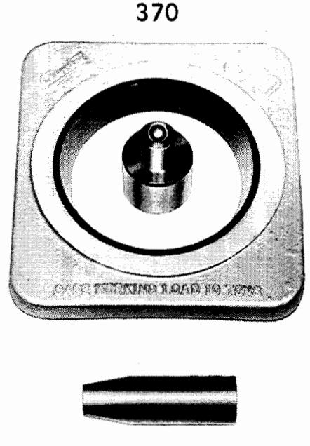

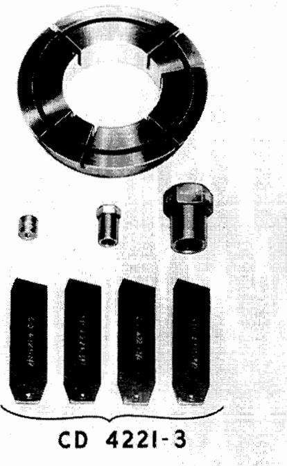

 $Q4$ 

{111}------------------------------------------------

#### **EXHAUSTER-Q.4**

If the bearing is housed in a blank end cover, it should be extracted, or machined out, taking care not to damage the housing. In an emergency it may be removed by cutting a groove along the bearing, using a narrow half round chisel, Inspect housing and remove any burrs. Press new bush fully into cover.

#### Roller Bearing and Shaft Collar-To Renew

Withdraw roller bearing inner race and shaft collar using the Churchill Universal Taper Base C.D. 370, and special withdrawal tool C.D. 4221-3 (Fig. Q.4).

Insert the adaptor into the taper base as shown in Fig. Q.3. Position the rotor in the adaptor, drive end up, and insert four "fingers" in the slots with the pegged ends set in the adaptor, and the other ends, against the bearing inner race. Place or screw the appropriate Thrust Block on to the shaft, and while supporting the rotor under the Taper Base, press the bearing and collar off the shaft.

Lightly grease the shaft, and, using the Installer C.D. 44, press bearing inner race on to shaft.

NOTE:- There will be a slight clearance between the bearing and the rotor face (Fig. Q.5).

Similarly fit collar with recessed shoulder against the bearing.

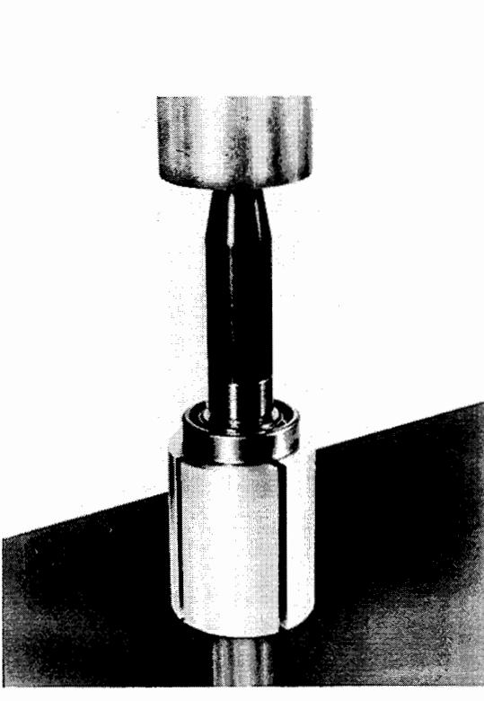

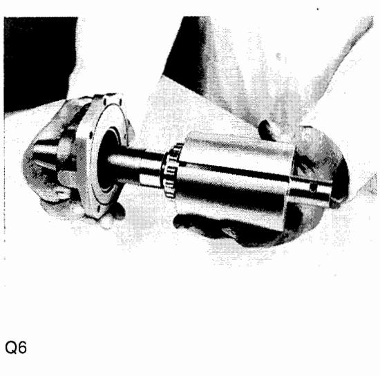

NOTE:-- The rotor assembly should be supported on the bed of the press by a tubular spacer placed over the shaft, and not by the rotor or shaft itself.

#### **Re-Assembly**

Lubricate all moving parts with clean engine oil and renew joint and/or rubber ring(s).

NOTE:- No special tools are required to re-assemble exhausters having one oil seal. With exhauster having two seals, use installer C.D. 44.

Where applicable, place the Installer on the shaft to guide the seals on to the collar (Fig. Q.6). Smear the rollers with grease to hold them against the inner race, and insert the end of the rotor assembly into the drive end cover.

Assemble cover to body as originally fitted, with rubber ring or joint, and secure. Dowel pins ensure correct location.

Hold the body, drive end downwards, and replace blades into rotor slots, making sure that marks made during dismantling correspond.

Install rear end cover on to body, with rubber ring, and secure.

Rotate the rotor by hand to be sure that it turns without binding, and tighten the socket headed screws.

Fig. Q.4 illustrates the special Churchill tools for this exhauster.

#### Installation

Refit the drive gear to rotor shaft and secure with two half round thrust washers. Replace the joint and remount the exhauster, aligning the hole in the joint with the air/oil discharge passage, and tighten the four securing nuts.

Reconnect the oil and vacuum pipes.

 $O5$ 

{112}------------------------------------------------

# **SECTION R** Compressor

### **S.C.6. COMPRESSOR**

#### Introduction

The S.C.6 compressor is a single cylinder unit which is bracket supported from the cylinder block, the compressor being flange mounted to the rear of the compressor drive housing. This compressor drive housing is mounted on the rear of the timing case and incorporates a geared drive from the engine idler gear to compressor.

The compressor draws air through the engine induction system. The air is then compressed and fed to the air reservoir. The compressor cylinder head incorporates an unloader device which is operated by air pressure and controlled by a governor valve connected to the reservoir and the compressor by a small bore pipe.

#### **Preventive Maintenance**

#### Every 4 Months or Every 5,000 Miles (7,500 km)

Make a visual check of all joints, unions, etc., for leakage or looseness and rectify where necessary. If the cylinder head has recently been removed, check that the cylinder head nuts are fully tightened down to a torque of 10 lbf ft (1,38 kgf m) -- 13 Nm.

Check compressor mounting and couplings for alignment.

Clean air filter.

#### Every 10,000 Miles (15,000 km) or 500 Hours

Clean the oil supply line to the compressor.

Remove delivery valve cap and delivery valve seat retaining spring and check for presence of excessive carbon. Withdraw and check condition of delivery valve. If excessive carbon is found, remove and clean the cylinder head; also check compressor discharge line for carbon and clean or replace the line if necessary.

#### Every 60,000 Miles (90,000 km) or 2,500 Hours

Dismantle compressor, thoroughly clean all parts and inspect for wear and damage. Repair or replace all worn or damaged parts or replace the compressor with a Factory Reconditioned Unit.

#### **Service Check** Inspection

Ensure that the air cleaner or filter is clean and correctly installed.

With compressor running, check for noisy operation and oil leaks.

Reduce the pressure in the reservoir by operating the brakes and check that governor and unloader mechanisms are functioning at correct pressure. (If possible the vehicle gauge should be replaced during the test by a master gauge).

Check to be sure compressor mounting boits are secure.

#### **Operating Tests**

If leakage in the remainder of the system is not excessive, failure of the compressor to maintain the normal air pressure in the system usually denotes loss of efficiency due to wear. Another sign of wear is excessive oil passing through to the reservoir. If either condition develops, and inspection shows the remainder of the air brake equipment to be in good condition, the compressor must be overhauled or replaced with a Factory Reconditioned Unit.

#### Air Leakage Test

Excessive leakage past the delivery valve can be detected by charging the air system to just below the governor cut-out setting, and then with the engine stopped, carefully listening at the compressor for the sound of escaping air. If this test is satisfactory, fully charge the system and again stop the engine. Check once more for audible leaks, which if present indicate leakage at the unloader plunger.

Leakage at the delivery valve can be remedied by cleaning, lapping or replacing the valve and/or valve seat. Unloader plunger leakage can be remedied by replacing the plunger seal or valve plunger.

#### To Remove Compressor

Release all air pressure from the system.

Disconnect oil pipe and air pipes at the compressor. Remove the setscrews securing the compressor drive

and cover to the compressor drive housing.

Remove the compressor mounting bolts and remove compressor from engine.

#### To Replace Compressor

Fit compressor to compressor drive housing and secure with setscrews.

Replace bracket which supports compressor to cylinder block.

Reconnect oil pipe and air pipes to compressor.

{113}------------------------------------------------

#### COMPRESSOR-R.2

#### Important

Clean the oil supply line to the compressor and run the engine for a few seconds to be sure the oil supply is flowing freely.

Connect oil and/or air pipes, ensuring that the air cleaner or filter is clean and properly installed.

#### **Check after Installation**

With the compressor running, check for noisy operation and oil and air leaks.

#### **Dismantling**

#### Marking before dismantling

The compressor should have the following items marked to show the correct relationship prior to dismantling.

- Position of cylinder head in relation to cylinder  $1.$ and crankcase.
- Position of end-cover(s) in relation to crankcase.  $21$
- 3. Position of crankshaft in relation to crankcase.

#### Removing and Dismantling Cylinder Head and Cylinder

Remove the unloader cap and copper washer and withdraw the unloader plunger assembly and spring.

Remove the delivery valve cap and copper washer, and remove delivery valve spring and seat retaining spring.

Unscrew the four nuts and washers from cylinder head studs and lift off cylinder head. Remove the joint.

Remove the delivery valve and screw out the valve seat.

Withdraw inlet valve spring guide. (A simple extractor can be made from two  $\frac{1}{4}$  in U.N.F. bolts and a strip of metal formed to bridge the guide). Remove the inlet valve spring, inlet valve and valve seat.

Withdraw cylinder and remove the joint.

#### Removing and Dismantling Piston and **Connecting Rod Assemblies**

Remove the compressor mounting bracket and joint. Turn the crankshaft to B.D.C. position and release the tabs of the locking strap. Unscrew the two bolts and remove the connecting rod cap. Withdraw piston assembly and replace connecting rod cap.

Remove the piston rings from the piston. If the piston is to be detached from the connecting rod, release one gudgeon pin retaining circlip and press the gudgeon pin from the piston and connecting rod.

#### **Removing Crankshaft**

Remove compressor drive gear.

Remove drive key from crankshaft.

Unscrew the four setscrews or nuts together with washers securing the rear end-cover to crankcase. Withdraw the end-cover, plain bearing, thrust washer and joint.

4.236 Series Workshop Manual, March, 1988.

Unscrew the four setscrews or nuts securing the drive end-cover, and withdraw the end-cover complete with crankshaft and joint. Tap crankshaft with bearing from drive end-cover.

#### Cleaning

Ensure that all carbon is removed from the cylinder head. Check that the air passages in the head and the oilways in the crankcase, where applicable, rear endcover and crankshaft are clear and clean.

Clean inlet and discharge valves, not damaged or worn excessively, by lapping them on a sheet of crocus cloth held on a flat surface.

#### **Inspection of Parts**

#### **Cylinder**

Check cylinder bore for excessive wear, out-of-round or scoring. If scored or out-of-round more than 0.002 in  $(0.05 \text{ mm})$  or tapered more than 0.003 in  $(0.08 \text{ mm})$ cylinder should be rebored. The original cylinder bore is to the limits 2.6255/2.6265 in (66,69/66,71 mm) and the clearance for the piston is 0.002/0.003 in (0,05/ 0,08 mm). Check for wear in cylinder bore and rectify in accordance with following table :-

#### **Piston and Connecting Rod**

Inspect piston for scores, cracks or damage of any kind. Check fit of rings in ring grooves, clearance should be 0.0005/0.0025 in (0,01/0,06 mm). Install rings in cylinder and check that gaps are 0.002/0.007 in (0,08/0,18 mm). Check fit of gudgeon pin in piston and connecting rod. Gudgeon pin should be a light press fit in piston and clearance in the connecting rod bush should not exceed 0.0015 in (0,04 mm).

Inspect connecting rod bearing for correct fit on crankshaft journal. Clearance between rod journal and bearing must not be less than 0.001 in (0.02 mm) and not more than 0.003 in (0,08 mm). Check connecting rod for cracks or damage.

#### **Crankshaft and Bearings**

Examine ball bearings for discoloration, pitting, wear and cracked races. Rotate slowly to check for roughness. Defective bearings should be removed, using a well-fitting extracting tool. Press new bearing on to crankshaft, using a suitable length of tube, until it contacts shoulder.

Inspect crankshaft for wear and check threads, shaft ends, keyways and drive keys for damage. The crank pin diameter should be within the limits 0.874/0.8735 in (22,20/22,19 mm).

#### **Crankshaft and End-covers**

Inspect oil seal carefully, ensuring that sealing edge is intact and sharp. If an oil leak has been observed at the crankshaft end, a new seal must be fitted. Lip of seal should face inwards.

Examine crankcase, end-cover and mounting bracket for damage and cracks. Check bearing bores for wear. The ball race should be a light press fit in end-cover

{114}------------------------------------------------

#### **COMPRESSOR-R.3**

#### Wear in bore

| $+0.005$ in (0.13 mm)              | $\cdots$ | $\cdots$  | $\cdots$ |
|------------------------------------|----------|-----------|----------|
| $+0.005/0.010$ in (0.13/0.25 mm)   |          | $\cdots$  | $\cdots$ |
| $+0.015$ in (0,38 mm)              | $\cdots$ | $\cdot$ . | $\cdots$ |
| $+0.015/0.020$ in $(0.38/0.51$ mm) |          | .         | .        |
| $+0.025$ in (0.63 mm)              |          |           |          |

#### Remedy

Fit new standard rings. Bore out to  $+0.010$  in (0,25 mm) and fit 0.010 in (0,25 mm) oversize piston and rings. Fit new 0.010 in (0,25 mm) oversize rings. Bore out to +0.020 in (0,51 mm) and fit 0.020 in (0,51 mm) oversize piston and rings. Fit new 0.020 in (0,51 mm) oversize rings.

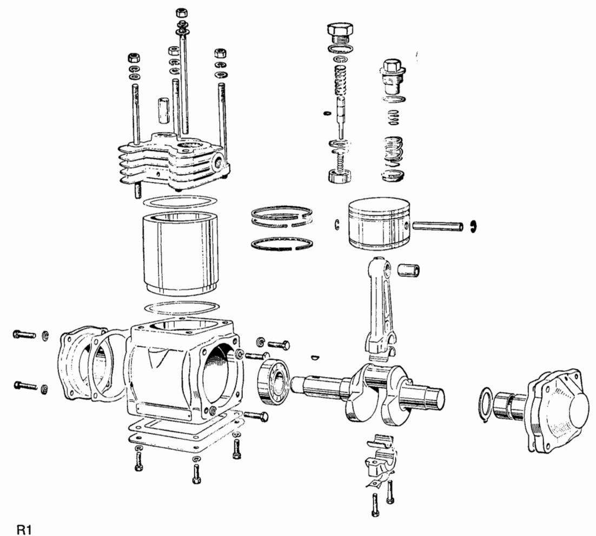

and the crankshaft should be a neat sliding fit in the plain bearing. Inspect crankshaft thrust washer for wear.

#### **Cylinder Head**

Inspect cylinder head for cracks and unloader plunger guide bush for wear. Check that unloader plunger is a neat sliding fit in the guide. Examine unloader plunger seal ring for wear. Inspect inlet and delivery valves and seats. If valves are grooved deeper than 0.003 in (0,08 mm) where they contact the seat, they should be replaced. If not badly grooved they can be refaced by lapping on crocus cloth. Valve seats, if showing slight scratches, may be reclaimed by lapping with fine grinding paste. If badly pitted or scratched, use a seating reamer before lapping.

Renew delivery valve spring and check remaining springs for corrosion, fatigue or permanent set.

#### Reassembly

Lubricate all internal parts with clean engine oil to prevent possible damage until the oil supply is functioning.

{115}------------------------------------------------

Install the crankshaft, complete with bearing, into the drive end-cover. Insert the crankshaft into the crankcase and secure the drive end-cover, ensuring that the joint is correctly positioned over the oil drain ports.

Position the thrust washer in the rear end-cover with the steel face towards the plain bearing and the tab located in the slot. Assemble the rear end-cover with joint and secure. Check the crankshaft to ensure free rotation and then tighten end-cover nuts or bolts. Fit the drive key to the crankshaft, fit compressor drive gear and tighten securing nut to a torque of 92 lbf ft (12,7 kgf m) 125 Nm.

Refit the piston rings, ensuring that sides marked 'Top' are uppermost, and assemble the piston to the connecting rod. Assemble the connecting rod on the crankshaft, tighten the bolts to a torque of 3.75/4 ibi ft  $(0,51/0,55 \text{ kgf m})$  -51/54 Nm, and turn up the tabs of the locking strap. Space the piston ring gaps and assemble the cylinder, with joint, over the piston.

Assemble the cylinder head. Lightly smear the outside diameters of the inlet valve seat and spring guide with 'Loctite', or equivalent, sealing compound. Insert the inlet valve seat, inlet valve and valve spring and press the spring guide into position. Screw in the delivery valve seat, using a wrench inserted in the hexagonal hole through the centre of the fitting, and tighten securely. Place the delivery valve on the seat and position the springs. Screw in the valve cap together with the copper washer. Lightly smear the unloader plunger with MS 200 (Midland Silicone) grease, and insert the spring and plunger complete with the spring circlip. Screw in the unloader cap together with copper washer.

Place the joint on the cylinder and correctly position the cylinder head on the studs. Tighten nuts progressively to a torque of 9/10 lbf ft (1,24/1,38 kgf m) -12/13 Nm. Invert the compressor and apply clean engine oil over the crankshaft and on the cyllnder wall. Assemble the mounting bracket and joint.

#### **Fault Finding**

#### **Compressor Fails to Maintain Adequate** Pressure in the System

Dirty air cleaner or filter. Excessive carbon in cylinder head or discharge line. Delivery valve leaking. Excessive wear in compressor. Inlet valve or unloader plunger stuck open. Excessive leakage at inlet valve.

#### **Compressor Passes Excessive Oil**

Excessive wear. Dirty air cleaner or filter. Excessive oil pressure. Oil return to engine crankcase obstructed. Back pressure from engine crankcase. Piston rings incorrectly installed.

#### **Noisy Operation**

Excessive wear. Excessive carbon in cylinder head.

#### **Compressor does Not Unload**

Defective unloader plunger seal. Unloader plunger sticking or binding. Passage in cylinder head obstructed.

4.236 Series Workshop Manual October, 1988.

#### !!!!!!!!!!!!!!!!!!!!!!!!!!!!!!!!!!!!!!!!

#### Introduction

The Wabco compressor is a single cylinder unit which is bracket supported from the cylinder block, the compressor being flange mounted to the rear of the compressor drive housing. This compressor drive housing is mounted on the rear of the timing case and incorporates a geared drive from the engine idler to gear compressor.

The compressor draws air through the engine induction system. The air is then compressed and fed to the air reservoir. Air pressure is controlled by an inline unloader valve.

Note: For details of new Wabco compressor and drive housing, see page R9.

#### **Preventive Maintenance**

#### Every 4 Months or Every 5,000 Miles (7,500 km)

Make a visual check of all joints, unions, etc., for leakage or looseness and rectify where necessary. If the cylinder head has recently been removed, check that the cylinder head nuts are fully tightened down to a torque of 18.4 lbf ft (2.5 kgf m) 25 Nm.

Check compressor mounting and couplings for alignment.

#### Every 15,000 Miles (25,000 km) or 500 Hours

Clean the oil supply line to the compressor. Check compresor discharge line for carbon and clean or replace the line if necessary.

#### Every 60,000 Miles (90,000 km) or **2,500 Hours**

Dismantle compressor, thoroughly clean all parts and inspect for wear and damage. Repair or replace all worn or damaged parts or replace the compressor.

#### **Service Check Inspection**

Ensure that the air cleaner or filter is clean and correctly installed.

With compressor running, check for noisy operation and oil leaks.

Reduce the pressure in the reservoir by operating the brakes and check that the unloader mechanisms are functioning at correct pressure. (If possible the vehicle gauge should be replaced during the test by a master gauge).

Check to be sure compressor mounting bolts are secure.

#### **Operating Tests**

If leakage in the remainder of the system is not excessive, failure of the compressor to maintain the normal air pressure in the system usually denotes loss of efficiency due to wear. Another sign of wear is excessive oil passing through to the reservoir. If either condition develops and inspection shows the remainder of the air brake equipment to be in good condition, the compressor must be overhauled.

{116}------------------------------------------------

#### Air Leakage Test

Excessive leakage past the delivery valve can be detected by charging the air system to just below the governor cut-out setting and then with the engine stopped, carefully listening at the compressor for the sound of escaping air. If this test is satisfactory, fully charge the system and stop the engine.

#### **To Remove Compressor**

Release all air pressure from the system.

Disconnect oil pipe and air pipes at the compressor.

Remove the two setscrews which hold the two halves of the compressor support bracket together. (Fig. R2 shows bottom half of bracket fitted to cylinder block). Support the compressor and remove the four setscrews which secure the compressor to the compressor drive housing.

Remove compressor from engine complete with top half of compressor support bracket (see Figure R3).

#### **To Replace Compressor**

Fit compressor to compressor drive housing and secure with the four setscrews.

Support the compressor and replace the two setscrews which join the two halves of the compressor support bracket together.

Reconnect oil pipe and air pipes to compressor.

#### Important

Clean the oil supply line to the compressor and run the engine for a few seconds to be sure the oil supply is flowing freely.

Connect oil and/or air pipes, ensuring that the air cleaner or filter is clean and properly installed.

#### **Check after Installation**

With the compressor running, check for noisy operation and oil and air leaks.

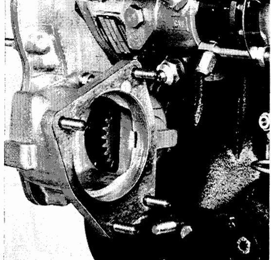

 $R2$ 

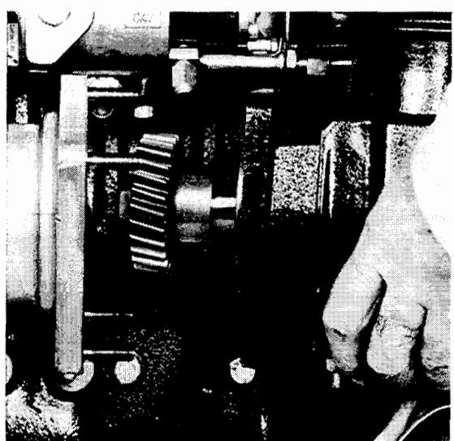

4.236 Series Workshop Manual October, 1988.

{117}------------------------------------------------

#### **Dismantling the Compressor**

Note: In order to identify individual components in the text that follows, they are referred to as, for instance, hexagon bolt (30). This means the bolt is item 30 in drawing number R4.

Unscrew the four hexagon bolts (30) and remove them complete with washers (29) from the cylinder head (28).

Remove cylinder head together with gasket (27).

Remove valve plate assembly (20-26) and seal (19) from top of crankcase (1).

Note: If faulty, valve plate assembly should be exchanged complete.

Unscrew nut and washer (14) from end of crankshaft and remove drive gear.

Unscrew four cheesehead bolts (13) which secure flange (11) to crankcase.

Remove flange from crankcase and 'O' Ring (10) from flange. Press bush (12) out of flange.

Unscrew four hexagon bolts (6) from end plate (5) and remove end plate and 'O' Ring (4) from crankcase.

From baseplate of crankcase, remove two plugs (3). (As they have been treated with Loctite 270, they may have to be heated to aid removal.)

Turn crankshaft (8) until it is at B.D.C. position and through the crankcase base plate holes, remove the two cheesehead bolts (17) from the connecting rod bearing cap (15).

Bring the piston (18) to the T.D.C. position and then remove the crankshaft from crankcase complete with lower bearing shell and cap (15/16). Remove thrust washers (7) and (9) from crankshaft.

Withdraw piston and connecting rod from crankcase. Remove gudgeon pin from piston/connecting rod and remove piston.

Press bush (2) out of crankcase.

Dismantle the valve plate assembly by removing suction valve (21), unscrew two hexagon bolts (26) and remove bushes (25), delivery valve retainer (24), delivery plate (22) and washers (23).

#### To Assemble the Compressor

Lubricate all internal parts with clean engine lubricating oil to prevent possible damage until the oil supply is functioning.

Press bush (2) into crankcase (1). Ensure lubricating oil hole in bush is inline with oil pressure connection in crankcase.

Assemble piston (18), gudgeon pin and connecting rod. ensure top bearing cap shell (16) is in position and lower into crankcase.

To crankshaft (8), fit thrust washers (7) and (9) and to big end journal, fit lower bearing cap (15) complete with shell (16). Insert crankshaft into crankcase, locating rear journal into bush (2).

Fit connecting rod bolts (17) through crankcase baseplate and through connecting rod lower and upper bearing caps (15). Tighten initially by hand, ensuring bearing shells are correctly positioned on crankshaft big end journal.

4.236 Series Workshop Manual October, 1988.

Insert bush (12) into flange (11) and fit 'O' ring (10) into flange.

Fasten flange to crankcase with four cheesehead bolts (13) and tighten to a torque of 22 lbf ft (3,0 kgf m) 30 Nm.

Tighten connecting rod bolts through crankcase baseplate to a torque of 10.3 lbf ft (1,4 kgf m) 14 Nm.

Fit plugs (3) into baseplate and secure with Loctite 270.

Fit drive gear, nut and washer (14) to end of crankshaft and tighten to a torque of 132.7 lbf ft (18,3 kgf m) 180 Nm. (42 teeth drive gear 80 lbf ft, (11,2 kgf m) 110 Nm and use POWERPART Studlock on the threads).

Insert 'O' Ring (4) into position on crankcase and fit end cover (5) with four hexagon bolts (6) to crankcase and tighten bolts to a torque of 18.4 lbf ft (2,5 kgf m) 25 Nm.

To valve plate (20), fit washers (23), delivery valve plate (22) delivery valve retainer plate (24) and bushes (25) and fasten assembly together with hexagon bolts (26) to a torque of 8.8 lbf ft (1,2 kgf m) 12 Nm.

Fit suction valve (21) in its position at bottom of valve plate together with seal (19) and place whole assembly on top of crankcase.

Fit cylinder head gasket (27) and cylinder head (28) to crankcase and tighten four securing bolts (30) and washers (29) to a torque of 18.4 lbf ft (2,5 kgf m) 25 Nm.

Turn compressor by hand and check that it operates freely.

#### Data and Dimensions for Wabco **Compressor**

Cylinder

bore diameter 2.95 in (75.00 mm) Piston diameter 2.94 in (74,92 mm)  $\pm$  0.0002 in (0,007 mm)

#### Crankshaft (Fig. R6)

Big End 1.37 in (35,0 mm) - 0.0003/0.0009 in) journal  $(0,009/0,025$  mm) Front 1.37 in (35,0 mm) - 0.0003/0.0009 in journal  $(0,009/0,025$  mm) Rear journal 1.18 in (30,0 mm) - 0.0002/0.0007 in  $(0,007/0,020$  mm)

#### **Connecting Rod**

Big end bearings. In order to measure the inside diameter, the upper and lower halves of the bearing caps and shells must be bolted together to a torque of 8.1 lbf ft (1,12 kgf m) 11 Nm.

#### **Bearing**

inside 1.37 in (35,0 mm) + 0.0003/0.0013 in diameter  $(0.009/0.034$  mm)

#### **Connecting Rod**

Small end bush, inside diameter 0.59 in (15,0 mm) + 0.0006/0.0013 in  $(0,016/0,034$  mm)

{118}------------------------------------------------

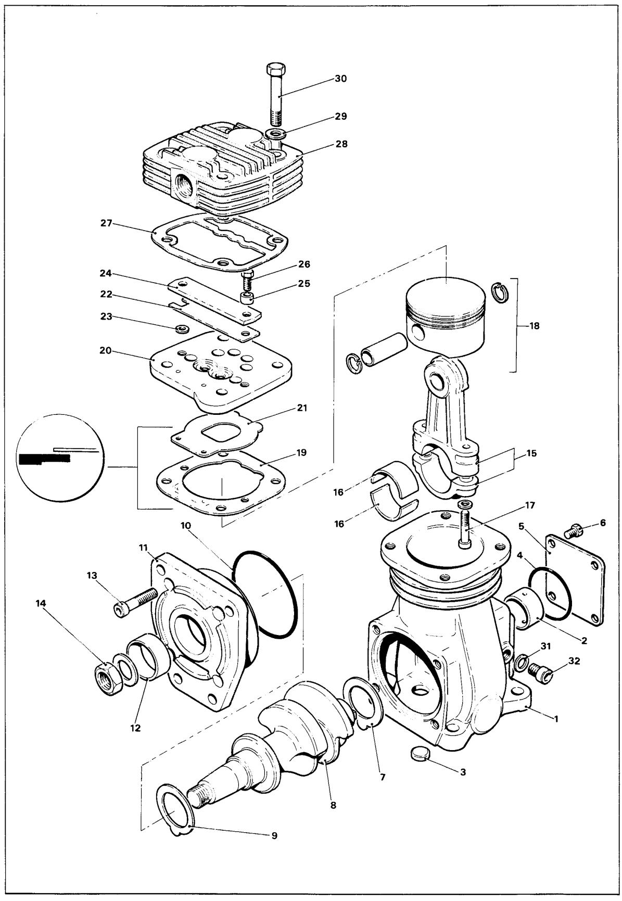

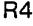

{119}------------------------------------------------

#### **COMPRESSOR-R8**

#### Data and Dimensions for Wabco Compressor (Cont'd)

#### **Crankshaft Bush**

Front, inside diameter (gap closed) 1.18 in (30,0 mm) + 0.0007/0.0020 in (0,020/0,053 mm)

#### Crankshaft Bush (Fig. R5)

Rear, inside diameter (gap closed) 1.37 in (35,0 mm) + 0.0005/0.0020 in (0,015/0,055 mm)

#### **Recommended Torques**

| necommended Torques                     |            |       |                                          |
|-----------------------------------------|------------|-------|------------------------------------------|
|                                         | lbf ft     | kgt m | Nm                                       |
| <b>Cylinder head bolts</b>              | 18.4       | 2.5   | 25                                       |
| Crankcase flange bolts                  | 22         | 3.0   | 30                                       |
| I Crankcase coverplate bolts            | 18.4       | 2,5   | 25                                       |
| <b>Connecting rod bolts</b>             | 10.3       | 1,4   | 14                                       |
| I Crankshaft drive gear nut,            |            |       |                                          |
| I 27 teeth gear                         | 132.7 18.3 |       | !!!!!!!!!!!!!!!!!!!!!!!!!!!!!!!!!!!!!!!! |
| I  Crankshaft drive gear nut,           |            |       |                                          |
| l 42 teeth gear                         | 80         | 11.2  | 110                                      |
| <b>Reed valve pressure plate bolts</b>  | 8.8        | 1,2   | 12                                       |
| I Compressor housing idler shaft gears, |            |       |                                          |
| Idler gear front, 27 teeth              | 80         | 11.2  | 110                                      |
| Idler gear rear, 27 teeth Ł          | 80         | 11.2  | 110                                      |
| I Idler gear front, 26 teeth            | 80         | 11,2  | 110                                      |
| I Idler gear rear, 39 teeth             | 80         | 11,2  | 110                                      |

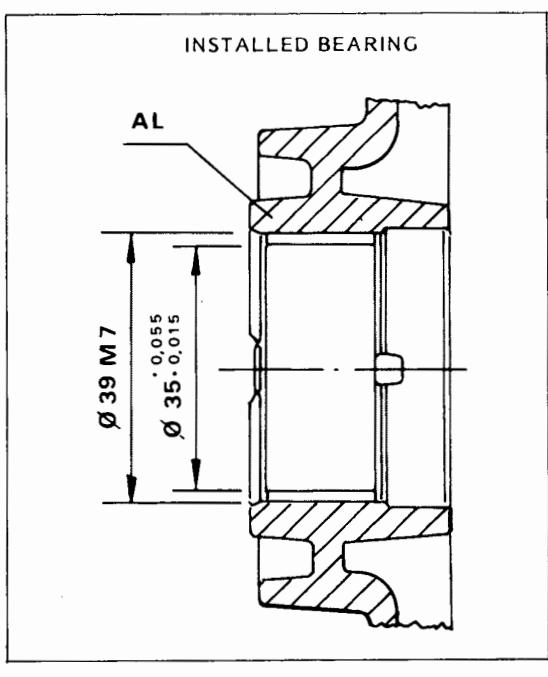

R5

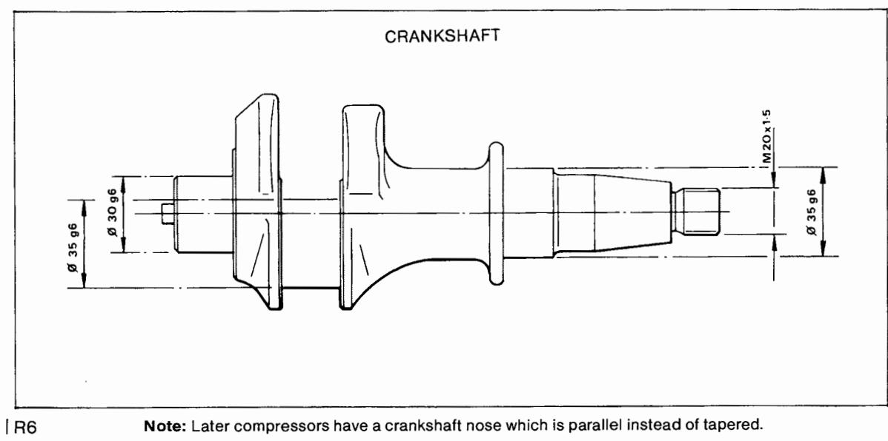

4.236 Series Workshop Manual October, 1988.

{120}------------------------------------------------

#### **New Wabco Compressor and Drive Housing**

Currently, T4.38 engines are fitted with a new Wabco compressor and drive housing which enables the compressor to be timed to the engine.

The new compressor can be recognised by the change of drive gear from 27 teeth to 42 teeth and by a timing label fitted at the rear face of the compressor behind the rear end cover

The gears in the new drive housing have also been changed, the front idler from 27 teeth to 26 teeth and the rear idler from 27 teeth to 39 teeth.

#### To fit the compressor only:

- 1. Set the piston of number 1 cylinder to TDC.
- | 2. Remove the rear cover of the compressor. Turn the crankshaft of the compressor until the mark (1 in fig. R7) on the rear face of the crankshaft aligns with the line marked B on the timing label on the rear face of the compressor. J.
- 13. Fit a new joint on the flange of the compressor. Put the compressor in position on the drive assembly.  $\mathbf{1}$ In this position the mark on the rear of the -1 crankshaft should align with the dark area marked on the timing label, see fig. R7. If it does not, pull l, the assembly out of engagement and turn the -1 crankshaft of the compressor in the relevant direction to mesh with the next gear tooth. Carefully -1 push the compressor assembly into position again  $\mathbf{I}$ and check that the mark on the rear of the H crankshaft is in the correct position. -1
- 4. Fit the flat washers and the nuts to the studs of the compressor and tighten the nuts. Fit the brackets !!!!!!!!!!!!!!!!!!!!!!!!!!!!!!!!!!!!!!!! between the compressor and the cylinder block. -1 Ensure that there is no tension on the compressor - and tighten the fasteners. J.
- 5. Fit the 'O' ring into the recess in the rear face of the compressor. Lubricate the 'O' ring with clean engine lubricating oil and fit the rear cover of the  $\mathbf{I}$ compressor.
- 6. Ensure that there is no restriction in the oil pipe between the engine and the compressor. Before  $\mathbf{1}$ the oil pipe is connected to the compressor, ensure that the engine stop control is in the 'stop' position. Operate the starter motor until a free flow of oil comes from the oil pipe.
- 7. Connect the oil pipe and the air pipes to the compressor.

#### To fit the compressor and drive assembly:  $\mathbf{I}$

- 1

- 1. Set the piston of number 1 cylinder to TDC.
- 2. Fit a new 'O' ring in its recess in the drive housing and lubricate it with clean engine lubricating oil.
- $\mathcal{R}$ Remove the rear cover of the compressor. Turn the crankshaft of the compressor until the mark (1 in fig. R7) on the rear face of the crankshaft aligns with the line marked A on the timing label on the rear face of the compressor.
- 4. Fit the compressor and drive assembly in position on the timing case. In this position the mark on the rear of the crankshaft should align with the dark area marked on the timing label, see fig. R7. If it does not, pull the assembly out of engagement and turn the crankshaft of the compressor in the relevant direction to mesh with the next gear tooth. Put the compressor assembly into position again and

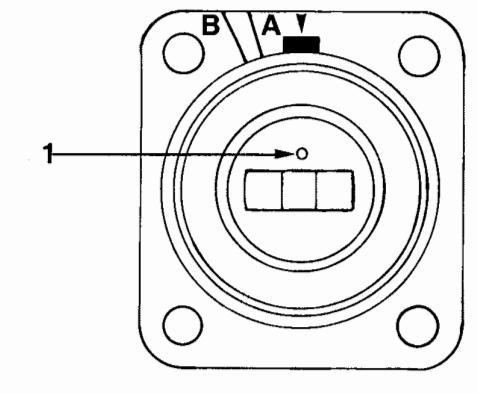

R7

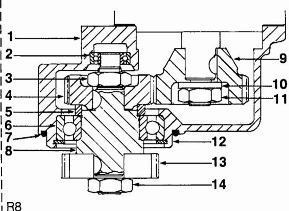

check that the mark on the rear of the crankshaft is in the correct position.

- 15. Fit the flat washers and the nuts to the studs of the timing case and tighten them. Fit the brackets between the compressor and the cylinder block. Ensure that there is no tension on the compressor and tighten the fasteners.
- Fit the 'O' ring into the recess in the rear face of the compressor. Lubricate the 'O' ring with clean engine lubricating oil and fit the rear cover of the compressor.
- 7. Ensure that there is no restriction in the oil pipe between the engine and the compressor. Before the oil pipe is connected to the compressor. ensure that the engine stop control is in the 'stop' position. Operate the starter motor until a free flow of oil comes from the oil pipe.
- 8. Connect the oil pipe and the air pipes to the compressor.

#### To dismantle the drive assembly:

- Remove the circlip (12 fig. R8) which retains the  $\mathbf{1}$ . bearing (6).
- 2. Provide support for the timing case side of the drive housing (1). Put a suitable adaptor on the rear face of the rear idler gear (4) and press the complete assembly out through the front of the housing.
- 3. Release the nuts (3 and 14) at each end of the shaft (8). With a suitable puller, remove the idler gears (4 and 13) from the shaft. Remove the spacer (5). With the collar of the shaft towards the bottom, provide a suitable support for the inner ball guide

{121}------------------------------------------------

#### COMPRESSOR-R.10

of the bearing. Protect the end of the shaft and press the shaft out of the bearing. Remove the keys from the shaft.

4. With a suitable puller, remove the small bearing (2) from the drive housing.

#### To assemble the drive assembly:

- 1. Clean the components and check them for wear or damage. Renew the components as necessary.
- $12$ Provide a suitable support for the inner ball guide of the bearing (6 fig. R8) and press the shaft (8) into the bearing.
- 13. Fit the keys in the shaft. Provide support for the front idler gear (13). Put the shaft in position on the gear, ensure that the journal for the small bearing is toward the top and the key is aligned correctly with the keyway in the gear. Protect the end of the shaft and press the shaft into the gear.
- | 4. Put the spacer (5) in position on the bearing. Put the rear idler gear (4) in position on the shaft. Ensure that the recess in the gear is toward the top and the key is correctly aligned with the keyway in the gear. Press the gear onto the shaft.
- 5. Apply **POWERPART** Studlock to the threads of the shaft and fit the nuts. Prevent movement of the shaft and tighten the nuts to 110 Nm (80 lbf ft) 11.2 kgf m. Clean off excess Studlock especially from the end of the shaft which fits into the small bearing (2) in the drive housing (1).
- 6. Hold the housing with its compressor flange on a suitable support. Put the small bearing (2) in position in the drive housing and press the bearing into the housing.
- 7. Keep the compessor flange of the drive housing on its support. Put the bearing and shaft assembly in position on the drive housing. Ensure that the front idler gear is toward the top. Apply pressure to the front idler gear and press the assembly into the drive housing.
- 8. Fit the circlip (4) correctly in its groove.

4.236 Series Workshop Manual October, 1988.

{122}------------------------------------------------

# **SECTION S Alternator, Dynamo & Starter Motor**

#### **Alternator**

#### **MODELS**

Models AC5, 11AC, 15ACR, 17ACR, 18ACR, 23ACR, A115/45, A133/55, LR135-111, LR135-113, LR135-114, LR150-160, A127 and 9AR.

#### General

These are driven by the engine in the same manner as a D.C. Generator, namely, belt driven from the crankshaft pulley, but the advantage lies in their ability to provide higher maximum output at lower speeds, to cope with increased electrical load demanded by modern equipment and decreased road speeds owing to increased density of traffic, especially in built up areas. They are also much lighter in weight, output for output.

As opposed to the DC Generator in which the armature windings rotate inside a stationary field system, the alternator has a rotating field system inside a stationary generating winding. When the rotor rotates inside the stator, the output produced is alternating current (AC). This is unsuitable for charging the battery which requires direct current (DC), so it is rectified by means of diodes which convert it to uni-directional flow to the battery.

The alternator voltage output is maintained within close limits by means of a control box which is fully transistorised and functions as a fast switch.

#### **Precautions**

As previously described the diodes in the alternator function as one-way valves and the transistors in the regulator/control box operate as fast switches. Both are accurate and sensitive.

They do not wear out and cannot be adjusted, but because they are sensitive to voltage changes and high temperature, the precautions are vital to prevent them from being destroyed.

- a) DO NOT disconnect the battery whilst the engine is running. This will cause a voltage surge in the alternator charging system that will immediately ruin the diodes or transistors.
- b) DO NOT disconnect a lead without first stopping the engine and turning all electrical switches to the off position.
- c) DO NOT cause a short circuit by connecting leads to incorrect terminals. Always identify a lead to its correct terminal. A short circuit or wrong connection giving reverse polarity will immediately and permanently ruin transistors or diodes.
- d) DO NOT connect a battery into the system without checking for correct polarity and voltage.

e) DO NOT "flash" connections to check for current flow. No matter how brief the contact the transistors may be ruined.

#### **Maintenance**

The alternator charging system will normally require very little attention, but it should be kept free from build-up of dirt, and a check made if it fails to keep the battery charged.

- a) Regularly inspect the driving belts for wear and correct tension. It is important to ensure that all belts on a multiple belt drive have equal tension and are each carrying their share of the load. Slack belts will wear rapidly and cause slip which will not drive the alternator at the required speed. Drive belts which are too tight impose severe side thrust on the alternator bearings and shorten their life. Periodically ensure that the alternator is correctly aligned to the drive.
- b) Do not replace faulty belts individually in a multibelt system. A complete matched set of drive belts must always be used.
- c) Keep the alternator clean with a cloth moistened in kerosene or cleaning fluids. Ensure that ventilation slots and air spaces are clear and unobstructed.
- d) Remove any dirt accumulated on the regulator/ control box housing, and ensure that cooling air can pass freely over the casing.

### **Fault Finding on AC5**

The AC 5 alternator is so designed that a flow of current indicated either by the extinguishing of the warning light, or as shown on the ammeter, is sufficient evidence that the system is in proper working order. Therefore, no open circuit, voltage or current output checks should be performed on the installation UN-LESS:-

- a) The warning light fails to illuminate when the generator is stationary, and the switch is closed OR fails to become extinguished when the alternator is running.
- b) No charging current is shown on ammeter.
- c) The battery is flat.
- d) The battery is "boiling", indicating loss of voltage control.

If any of the above symptoms occur, the procedure indicated below should be followed.

a) Connect a good quality moving coil voltmeter 0-50 volts range across the battery or regulator negative

{123}------------------------------------------------

#### ALTERNATOR, DYNAMO AND STARTER MOTOR-S.2

terminal, and one of the three positive terminals marked LO, MED, HI. Disconnect alternator output terminal. Fit a good quality moving coil 0 - 100 amp ammeter in series with the alternator terminal and output lead. The battery should be in a charged condition.

- b) Close the warning light switch (master electric switch on dashboard) when the warning lamp should light up.
- c) Switch on a 10-15 amperes load such as lights, fans, etc., for fifteen minutes.
- d) Start engine and run at fast idle speed when
	- 1. The warning light should go out.
	- 2. The ammeter records a small charge dependant on engine speed.
- e) Increase engine speed momentarily to maximum speed, when the charging current should be about 31 Amperes for 24 Volt, and 55 Amperes for 12 volt systems.
- f) With the alternator running at approximately half speed, (engine speed about 1,500 rev/min) switch off electrical load. Depending on the connection selected for the positive sensing wire LO, MED or HI, the voltage should rise to between 26 and 28 volts on 24 volt systems and 13-14 volts on 12 volt systems and then remain constant. At the same time the current reading should drop appreciably.

Any variance in the above data could indicate a fault and the following procedure should be adopted before disconnecting any components.

The regulator is a sealed unit and is non-repairable and if found to be faulty it must be replaced.

#### Warning Lamp does not light up when switched "On".

Check the bulb.

If no fault

Check all wiring connections at regulator, alternator and battery.

If no fault

Switch off, disconnect 'F' lead at regulator and connect it to the negative terminal.

Switch on. If warning lamp lights up, the regulator is faulty. If lamp fails to light up, the alternator is faulty.

#### Warning Lamp does not go out and Ammeter shows no output when running.

Check all regulator, alternator and battery connections. If no fault Switch off, disconnect 'F' lead at regulator and connect to regulator negative terminal. Switch on, and run at fast idle. If no output, alternator is faulty.

If output appears, regulator is faulty.

Warning Lamp does not go out when running and Ammeter shows reduced output with full output only at maximum speed or Warning Lamp goes out but Alternator delivers reduced output. Full output only at maximum speed.

Alternator faulty. Remove from installation and apply open circuit diode check.

#### Warning Lamp flashes intermittently and Ammeter needle oscillates when Battery is fully charged and no loads are switched in.

Check for excessive resistance in regulator negative sensing lead.

If no fault, regulator is faulty.

Batterles overcharging and Ammeter indicates high or full output all the time.

Check regulator positive sensing lead and its connection at regulator.

If no fault, regulator is faulty.

#### **Fault Finding on 11AC**

If the alternator does not produce its rated output cf 43 amperes for 12 volt and 23 amperes for 24 volt circuit, the failure may be due to any unit or the associated wiring, and the following procedure should be followed.

#### Test 1

#### Checking the Field Isolating Relay

Disconnect the earthed battery terminal and the cable from the alternator main output terminal. Connect a 0-60 DC ammeter between the terminal and disconnected cable. Link terminals 'C1' and 'C2' on the field relay. Reconnect the battery cable. Close the master switch and start engine and run at charging speed. If ammeter shows a charge the relay is faulty. or its wiring and connections.

If ammeter shows no charge, carry on with Test 2.

#### Test 2

#### Checking the Alternator and Control Box

Leave the test ammeter connected, and disconnect cables 'F' and '-' from control unit and join them together. Remove link from field relay terminals and ensure they are connected to 'C1' and 'C2'. Start engine and run at charging speed.

Ammeter should indicate current values of 35 amps or more for 12 volt circuit or 22 amps or more for 24 volt circuit. A zero or low reading indicates a faulty alternator.

If satisfactory output is recorded, a faulty control unit is indicated.

#### Test3

#### Checking or Adjusting the Voltage Setting

The regulator of the 4 TR control unit must be set on CLOSED CIRCUIT, when the alternator is under load. Also, the system must be stabilised before checking or resetting is carried out, and the battery must be in a well charged condition. Check the battery to control unit wiring, to ensure that the resistance of the complete circuit does not exceed 0.1 ohm. Any high resistance must be traced and remedied. Connect a test DC

{124}------------------------------------------------

voltmeter (suppressed zero type) scale 12-15 volts for 12 volt installations or 24-30 volts for 24 volt installations, between the battery terminals, and note the reading with no electrical load. Disconnect battery earth cable and connect test ammeter between alternator main terminal and disconnected cable. Reconnect battery earth cable, and switch on an electrical load of approximately two amps, such as, side and tail lights. Start engine and run at about 2000 rev/min for at least eight minutes. If the charging current is still greater than ten amps, continue to run engine until this figure is reached. Then compare the voltmeter reading with the appropriate setting limits, as specified for the particular control unit as follows.

| 12 V (37423) / (37449) | $13.9 - 14.3$ volts |
|------------------------|---------------------|
| 24 V (37444)/(37502)   | 27.9 — 28.3 volts   |
| 12 V (37429)           | 13.7 — 14.1 volts   |

(Part no. marked on upper edge of the moulded cover of Control Unit).

If reading obtained is stable but outside the appropriate limits the unit can be adjusted as follows.

#### ADJUSTMENT OF VOLTAGE SETTING

Stop the engine and remove the control unit from its mounting. At the back of the unit is a sealed potentiometer adjuster. Carefully scrape away the sealing compound. Then start the engine, and while running the alternator at charging speed, turn the adjuster slot -CLOCKWISE to INCREASE the setting or ANTI-CLOCKWISE to DECREASE it - until the required setting is obtained.

Recheck the setting by stopping the engine, then start again and slowly "run-up" to charging speed. If setting is now correct, remount the control unit, disconnect test meters and restore original wiring connections. If, after adjustment, the voltmeter reading remains unchanged, or increases in an uncontrolled manner, then the control unit is faulty and a replacement must be fitted.

#### Test 4

#### **Check of Alternator Output**

Disconnect battery earth cable, and connect test ammeter between the alternator main terminal and disconnected cables. Reconnect battery earth cable, and switch on the vehicles full electrical load and leave on for 3 or 4 minutes. Leave load on and start engine and run at approximately 2000 rev/min. The alternator output should balance the load, and at the same time show a charge to the battery.

#### **Check Warning Light Control**

If warning light does not function either by remaining "on" or "off", but the system is charging satisfactorily, connect voltmeter between the alternator "AL" terminal and earth. Reading should be 7.0-7.5 max (12 volt alternator) or 14.0-15.0 (24 volt alternator). Connect leads 'E' and 'WL' together. If warning lamp lights the warning light control is faulty and should be replaced.

#### Fault Diagosis Procedure for 11 AC

#### **Alternator Fails to Charge**

- a) Check driving belt for correct tension and wear.
- b) Apply Tests 1 and 2.

#### **Low-Unsteady Charging Rate**

- a) Check driving belt for correct tension and wear.
- b) Check for high resistance at battery terminals and in the circuit wiring and connection. Check all connections made to earth.
- c) Apply Test 2.

#### Flat Battery or Low State of Charge

- a) CHECK condition of battery with hydrometer and high rate discharge tester.
- b) Check driving belt for correct tension and wear.
- c) Check that the field isolating relay contacts open when master switch is off, otherwise battery will discharge through rotor winding.
- d) Check that flat or low battery is not caused by insufficient alternator output caused by abnormal electrical loads by applying Test 4.

#### Excessive Charge Rate to a Fully Charged Battery

a) Apply Test 3.

#### **Noisy Alternator**

- a) Alternator loose in mounting brackets.
- b) Worn frayed or loose drive belt.
- c) Worn bearings, fully out of alignment.
- d) Rotor damaged or pulley fan loose on shaft.
- Open circuited, or short circuited rectified diodes,  $e)$ or stator winding open-circuit.
- f) Loose pulley.

#### Testing the 15ACR, 17ACR, 18ACR, 23ACR, A115/45, A133/55 LR, A127 and 9AR series in Position

First check the driving belt for condition and tension.

The nominal hot outputs at 6,000 rev/min (alternator speed) are given on Page B.18. These figures may be exceeded slightly when the alternator is running cold. To avoid misleading results, the following test procedure should therefore be carried out with the alternator running as near as possible to its normal operating temperature.

Note: De-rated 17 ACR alternators may be fitted to combine harvesters and similar applications where the engine is operating in dusty conditions.

{125}------------------------------------------------

#### ALTERNATOR, DYNAMO AND STARTER MOTOR-S.4

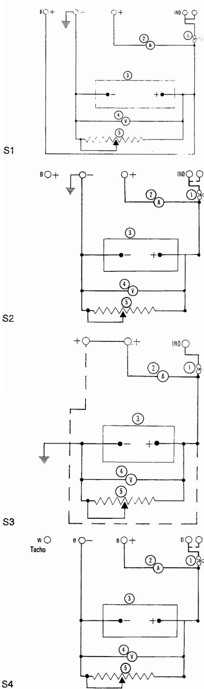

4.236 Series Workshop Manual, January 1993.

Fig. S.1. illustrates a Test Circuit for 15ACR and 17ACR alternators with standard terminations, batterysensed.

Fig. S.2. illustrates a Test Circuit for 15ACR and 17ACR alternators with standard terminals and two piece connection plug (machine-sensed).

Fig. S.3 illustrates a Test Circuit for 15ACR, 17ACR, 18ACR, 23ACR, A115/45, A127, A133/55 and LR series alternators with European terminations and single 3 terminal connector plug (machine-sensed). Broken line cable connection applies to battery-sensed, in which case, the connections between the two '+' terminals will not apply and the broken line terminal will be marked "S" instead of '+'.

S.4 shows a test circuit for Motorola 9AR.

Value of components in Figs. S.1, S.2, S.3 and S.4 are as follows:-

- 1. 12 volt 2.2 watt bulb.
- 2.  $0 60$  ammeter
- 3. 12 volt battery
- $0 20$  moving coil voltmeter.  $\overline{\mathbf{4}}$

0 - 15 ohm 50 amp variable resistor. 5.

#### Alternator Output Test with Regulator Inoperative

Withdraw the cable connector(s) from the alternator, remove the moulded cover (secured by two screws) and earth the regulator green lead or connector strip to frame.

Connect an external test circuit to the alternator output terminals as shown in Figs. S.1, S.2, S.3 or S.4.

Observe carefully the polarity of battery and alternator terminals -- reversed connections will damage the alternator diodes.

The variable resistor across the battery terminals must not be left connected for longer than is necessary to carry out the following test.

Start the engine. At 1,500 rev/min (alternator speed). the test circuit bulb should be extinguished. Increase engine speed until the alternator is running at 6,000 rev/min approximately, and adjust the variable resistance until the voltmeter reads 13.6 volts. The ammeter reading should then be approximately equal to the rated output (see previous heading). Any appreciable deviation from this figure will necessitate the alternator being removed from the engine for further examination. Failure of one or more of the diodes will be indicated in the above test by effect on alternator output, and also in some instances by abnormally high alternator temperature and noise level.

#### **Regulator Test**

The following test assumes the alternator to have been tested and found satisfactory.

Disconnect the variable resistor and remove the earth connection from the regulator green lead or connector strip to frame.

With the remainder of the test circuit connected as for the alternator output test, start the engine and again run the alternator up to 6,000 rev/min until the ammeter shows an output current of less than 10 amperes. The voltmeter should then give a reading of  $13.6 - 14.4$ volts. Any appreciable deviation from this (regulating) voltage means that the regulator is not functioning

{126}------------------------------------------------

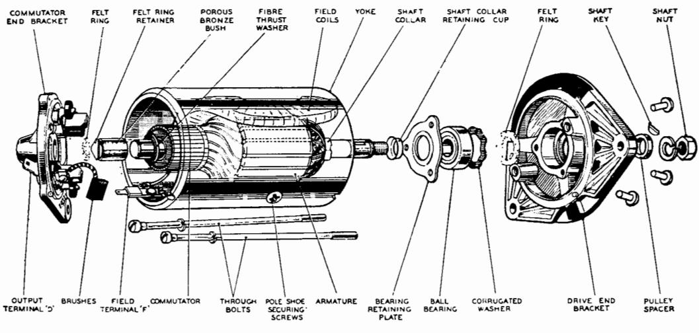

S4

properly and must be replaced.

If the foregoing tests show the alternator and regulator to be satisfactorily performing, disconnect the test circuit and reconnect the alternator terminal connector. Now connect a low range voltmeter between the positive terminal of the alternator (the moulded terminal connector is open ended to facilitate this) and the positive terminal of the battery. Switch on battery load (headlights etc.), start the engine and increase speed until the alternator runs at approximately 6,000 rev/min. Note the voltmeter reading.

Transfer the voltmeter connections to the negative terminals of the alternator and battery and again note the meter reading.

If the reading exceeds 0.5 volt on the positive side or 0.25 volt on the negative side, there is a high resistance in the charging circuit which must be traced and remedied.

#### **Dynamo**

#### Models C40A and C40L

#### General

The following information concerns the two types of dynamo fitted as standard equipment to the 4.236 engine, namely, the Lucas C40A and C40L models. If information concerning another type of dynamo is required, the relevant manufacturer should be contacted. The C40A is a non-ventilated unit. It will be found fitted to applications such as agricultural machines, which operate under exposed service conditions. The C40L is a ventilated dynamo and will be found on applications such as road vehicles, which operate under cleaner conditions.

Both types are shunt-wound two-pole two-brush machines arranged to work in conjunction with a compensated voltage control regulator unit. A ball bearing supports the armature at the driving end and a porous bronze bush at the rear supports the commutator end. The output of the dynamo is controlled by the regulator unit and is dependant on the state of charge of the battery and the loading of the electrical equipment in use. When the battery is in a low state of charge, the dynamo gives a high output, whereas if the battery is fully charged, the dynamo gives only sufficient output to keep the battery in good condition without any possibility of overcharging. An increase in output is given to balance the current taken by lamps and other accessories when in use.

When fitting a new control box, it is important to use only an authorised replacement. An incorrect replacement can result in damage to the dynamo.

#### **Routine Maintenance**

#### (a) Lubrication

Every 5,000 miles (7,500 km) or 250 running hours, inject a few drops of high quality S.A.E. 30 engine oil into the hole marked "Oil" at the commutator end bearing housing (see Fig. S.5).

#### (b) Inspection of Brushgear

Every 60,000 miles (90,000 km) or 2,500 running hours, the dynamo should be removed from the engine and the brushgear inspected by an auto-electrician.

#### (c) Belt Adjustment

Occasionally inspect the dynamo driving belt, and if necessary, adjust to take up any slackness by turning the dynamo on its mounting. Care should be taken to avoid overtightening the belt (Page M.1).

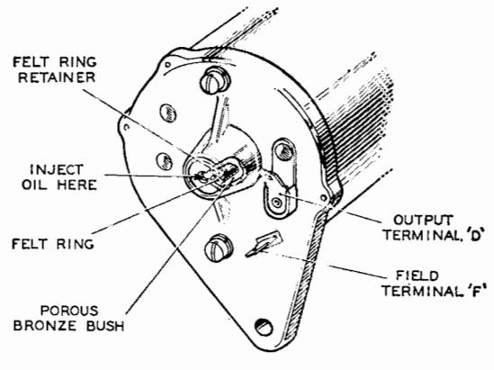

{127}------------------------------------------------

#### **Servicina**

#### Testing in Position to Locate Fault in **Charging Circuit**

- 1. Inspect the driving belt and adjust if necessary.
- 2. Check the connections on the commutator end bracket. The larger connector carries the main dynamo output, the smaller connector the field current.
- 3. Switch off all lights and accessories, take off the cables from the terminals of the dynamo and connect the two terminals with a short length of wire.
- 4. Start the engine and set to run at normal idling speed.
- 5. Clip the negative lead of a moving coil type voltmeter calibrated 0-20 volts, to one dynamo terminal and the positive lead to a good earthing point on the voke.
- 6. Gradually increase the engine speed, when the voltmeter reading should rise rapidly and without fluctuation. Do not allow the volt meter reading to reach 20 volts, and do not race the engine in an attempt to increase the voltage. It is sufficient to run the dynamo up to a speed of 1,000 rev/min. If the voltage does not rise rapidly and without fluctuation the unit must be dismantled for internal examination. Excessive sparking at the commutator in the above test indicates a defective armature which should be replaced.

#### **Starter Motor**

#### Models 2M113, M45G, S12-84 and S12-85

#### General

This starter motor is a four-pole, four-brush earth return machine with series-parallel connected field coils.

A solenoid-operated pre-engaged drive assembly is carried on an extension of the armature shaft. The main features of this type of drive are as follows:-

- a) Positive pinion engagement preventing the pinion being thrown out of mesh whilst starting.
- b) Dual-purpose plate-clutch incorporated in the drive assembly giving over-speed and over-load protection.
- c) Self-indexing pinion to ensure smooth engagement between the pinion and the flywheel teeth before the starter motor begins to rotate.
- d) Armature braking system to ensure rapid return to rest when the starter button is released.

#### **Operation**

On turning the starter switch, a solenoid unit mounted on the starting motor voke is energised and actuates a forked lever to engage the crive pinion with the engine flywheel. On occasions of tooth-to-tooth abutment, axial movement of the pinion is arrested whilst a helically splined sleeve in which the pinion is carried, continues to move forward. This causes the pinion to rotate relative to the flywheel. When the teeth become aligned, spring pressure slides the pinion into mesh with the flywheel.

When the pinion is properly engaged with the flywheel teeth a pair of contacts are closed in the rear of the unit. Closure of the contacts connects the motor to the battery, the armature rotates and the starter pinion commences to crank the engine.

4.236 Series Workshop Manual, February 1984.

When the engine fires and the starter switch is released, the solenoid unit is de-energised and the spring-loaded plunger withdraws the starter pinion to its out-of-mesh position. The armature is brought rapidly to rest by the centrifugal action of a pair of springloaded brake shoes bearing against a brake drum inside the intermediate bracket.

Provision is made to ensure that in the case of the pinion jamming in mesh (this may occur with an engine which fails to start) there is sufficient slack in the engagement lever-to-solenoid plunger linkage to permit the solenoid switch contacts to open.

In the event of the drive remaining in mesh with the flywheel after the engine has run up to speed the starter motor armature is protected from overspeeding by the plate clutch assembly. This clutch allows torque to be transmitted from the starter motor to the engine but not in the reverse direction which is free running.

The clutch is set to slip at between two and three times normal starting torque, thus providing overload protection for the starter motor. Back-firing is a typical example of overloading.

#### **Routine Maintenance**

The starter motor requires no routine maintenance beyond the occasional inspection of the electrical connection which must be clean and tight, the brush gear, and the commutator.

After the starter motor has been in service for some time, remove the starter motor from the engine and submit it to a thorough bench inspection.

- 1. Brush wear (this is a fair indication of the amount of work done). Renew brushes worn to, or approching,  $\frac{5}{16}$  in (7,9 mm) in length.
- 2. Brush spring tension. Correct tension is 30-40 oz (0,85-1,13 kg). Renew springs if tension has dropped below 25 oz (0,71 kg).
- $31$ Skim commutator if it is pitted or badly worn.
- 4. Check bearings for excessive side play of armature shaft.
- 5. Check pinion movement.
- 6. Clean and lubricate the indented bearing inside the pinion sleeve using Shell SB2628 grease for temperate and cold climates or Shell Retinex for hot climates.
- 7. Clean and lubricate the indented bronze bearing in the intermediate bracket. Use Ragosine 'Molypad' Molybdenised non-creep oil for this purpose.

#### **Servicing**

#### **Testing in Position**

Switch on the lamps. If the vehicle is not equipped with lighting, then connect a 0 - 20 voltmeter across the battery terminals before proceeding. Operate the starter control and watch for the following symptoms:-

1. The lamps dim (or voltmeter reading drops to about 6 volts, and the motor does not crank the engine).

Check battery (must be at least half-charged) and battery lugs, (clean and a good earth connection). Check by hand-cranking that the engine is not abnormally stiff.

{128}------------------------------------------------

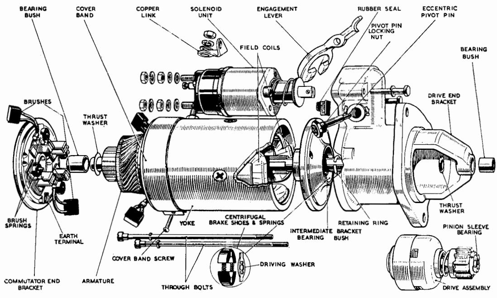

S6

2. The lamps do not dim, the voltmeter reading remains steady at about 12 volts, and the motor does not crank the engine.

Connect voltmeter from solenoid terminal 'BAT', and starter yoke, operate starter :-

No volts indicated.

- a) Poor lug connections at battery.
- b) Bad earth connection.
- c) Broken starter lead, battery to starter.
- Full volts i.e., 12 14 volts indicated.
- a) Faulty solenoid switch.
- b) Open circuit in starter check brushes.

#### **Starter Motor**

#### Model - CA45

#### **General Description**

Designed for flange mounting, the C.A.45 starter motor has a uniform cylindrical shape with no surface protrusion. This is because the solenoid and main switch assemblies are housed within the drive end-shield. around (i.e., co-axially with) the armature shaft.

The essential feature of the co-axial starter is that, the pinion alone moves axially to engage the engine flywheel. There is no longitudinal movement of the whole armature assembly, as in the axial types.

Smooth engagement of the pinion with the engine flywheel is constantly ensured by using two-stage operation of the solenoid and switch mechanisms. Thus the risk of damage to both pinion and flywheel, through faulty meshing, is practically eliminated.

In construction, the starter consists of three main sections, into which it can be easily dismantled.

- $1.$ The solenoid switch-gear and pinion assembly housed in the drive end-shield.
- 2. The armature, shaft and commutator assembly.

3. The voke, pole-piece and field-coil assembly.

Ready access is possible therefore, to those parts most

likely to require adjustment, such as the switchgear and commutator assemblies.

The starter is designed for working off a 12 volt supply, with 17 amps solenoid current.

#### **Testing on the Vehicle**

Ensure that the battery is in a charged condition.

Switch on the lamps and operate the starter button. If the starter fails to function, but the lights maintain full brilliance, check the switch and battery connections to the starter and all external leads. Sluggish action of the starter can be caused by a poor or faulty connection.

Difficulty in smooth engagement between starter and engine flywheel is probably due to dirt on the startershaft helices preventing free pinion movement. The shaft should be thoroughly cleaned with kerosene followed by the application of a small quantity of Caltex Thuben 90 or SAE 90 oil.

#### **Operating the Starter**

#### When starting the engine the following points

#### should be rigidly observed

- 1. Press the starter button firmly and release it Immediately the engine fires.
- 2. If the engine does not fire at once, let it come to rest before pressing the switch again.
- Do not run the battery down by keeping the starter switch pressed when the engine refuses to start. Ascertain the cause.
- 4. On some engines it is often helpful to depress the clutch when starting.
- Do not operate the starter when the engine is run-5. ning as serious damage may occur to both starter and flywheel.

{129}------------------------------------------------

#### ALTERNATOR, DYNAMO AND STARTER MOTOR-S.8 **MAINTENANCE**

#### Lubrication

The large oil reservoir in the drive end shield need only be replenished during overhaul periods, when a supply of Shelltella T27 or BP Energol SHF 100 oil should be added through the oil plug.

An oil impregnated sintered bronze bush is fitted at the commutator end, and needs no further attention.

#### **Brush Gear and Commutator**

Inspect the brushes at intervals of approximately 500 hours. See that they are free in their guides and that the leads are quite free for movement, by easing back the brush springs and pulling gently on the flexible connections. If a brush is inclined to stick, remove it from its holder and clean the sides with a petrol moistened cioth.

Be sure to refit the brushes in their original positions to retain the "bedding". The brushes should be well bedded (i.e. worn to the commutator periphery) but if not, wrap a strip of very fine glass or carborundum paper firmly around the commutator with the abrasive side outwards. With the brushes in position, rotate the armature by hand in the normal working direction of rotation; until the correct brush shape is obtained. If the brushes are worn down so that the springs are no longer providing effective pressure, they should be renewed. Check the brush spring pressure by hooking a spring balance under the spring lip. The correct tension is 30 - 40 oz (0,85 - 1,13 kg).

The minimum worn brush length is  $\frac{1}{2}$  in (12.7 mm). It is essential that replacement brushes are the same grade as those originally fitted. Genuine Perkins spares should always be used. To remove the brushes, unscrew the four fixing screws, one to each brush. In re-assembling care must be taken to re-connect the field coil and interconnector leads, held by two of the fixing screws. Before inserting brushes in their holders, it is advisable to blow through the holders with compressed air or clean them with a cloth moistened with petrol.

The commutator should be clean, entirely free from oil or dirt. Any trace of such should be removed by pressing a clean dry fluffless cloth against it, while armature is hand rotated.

If the commutator is dirty or discoloured, tilt the brushes and wrap a strip of fine glass or carborundum paper (not emery cloth) round the commutator, with the abrasive side inwards. Rotate the armature by hand until the surface is even. Clean with a petrol moistened cloth.

If repair is necessary to the commutator or switch gear etc., the starter must be dismantled. This should be done only in accordance with the method given.

#### **STARTER MOTOR**

#### Model M50

#### **General Description**

The model M50 starter motor is a four pole machine of 5 in (127,0 mm) nominal yoke diameter, and has a 21 slot armature.

The drive is of pre-engaged, solenoid operated, push screw type, incorporating a five roller clutch.

The function of the clutch is to prevent the armature being rotated at high speed in the event of the engaged position being held after the engine has started. The solenoid incorporates a two-stage switching arrange-

4.236 Series Workshop Manual, February 1984.

ment which ensures that the motor develops its maximum torque only when full pinion-flywheel engagement has been achieved.

#### **Testing on the Vehicle**

Ensure that the battery is in a charged condition.

Switch on the lamps and operate the starter button. If the starter fails to function, but the lights maintain full brilliance, check the switch and battery connections to the starter and all external leads. Sluggish action of the starter can be caused by a poor or faulty connection.

Difficulty in smooth engagement between starter and engine flywheel is probably due to dirt on the startershaft helices preventing free pinion movement. The shaft should be thoroughly cleaned with cleaning fluid followed by the application of a small quantity of Shell SB2628 grease for temperate or cold climates or Shell Retinex for hot climates.

#### **Maintenance**

#### **Brush Gear and Commutator**

Inspect the brushes at intervals to ensure that they are free in their guides and that the leads are quite free for movement, by easing back the brush springs and pulling gently on the flexible connections. If a brush is inclined to stick, remove it from its holder and clean the sides with a petrol moistened cloth.

Be sure to refit the brushes in their original positions to retain the "bedding". The brushes should be well bedded (i.e. worn to the commutator periphery) but if not, wrap a strip of very fine glass or carborundum paper firmly around the commutator with the abrasive side outwards. With the brushes in position, rotate the armature by hand in the normal working direction of rotation; until the correct brush shape is obtained. If the brushes are worn down so that the springs are no longer providing effective pressure, they should be renewed. Check the brush spring pressure by hooking a spring balance under the spring lip. The correct tension is 30/40 ozf (0,85/1,13 kgf).

It is essential that replacement brushes are the same grade as those originally fitted. Genuine spares should always be used. To remove the brushes, unscrew the four fixing screws, one to each brush. In re-assembling care must be taken to reconnect the field coil and interconnector leads, held by two of the fixing screws. Before inserting brushes in their holders, it is advisable to blow through the holders with compressed air or clean them with a cloth moistened with petrol.

The commutator should be clean, entirely free from oil or dirt. Any trace of such should be removed by pressing a clean dry fluffless cloth against it, while armature is hand rotated.

If the commutator is dirty or discoloured, tilt the brushes and wrap a strip of fine glass or carborundum paper (not emery cloth) round the commutator, with the abrasive side inwards. Rotate the armature by hand until the surface is even. Clean with a petrol moistened cloth.

If repair is necessary to the commutator or switch gear etc., the starter must be exchanged or repaired by an authorised agent.

Every 60,000 miles, (90,000 km) or 2500 running hours, whichever is the sooner, arrange for the examination and service of the starter motor.

{130}------------------------------------------------

# **SECTION T** Turbocharger

#### T4.236 Engines only

The turbocharger is fitted on the exhaust manifold outlet, see Fig. A.2. It is lubricated by oil taken from the engine lubricating system. Oil pressure should never drop below 30 lbf/in2 (2,11 kgf/cm2) or 207 kN/m2 at maximum engine speed and normal operating temperature. Check this pressure regularly.

The maximum boost pressure should be 11-13.5 lbf/in2  $(0.80-0.95 \text{ kgf/cm}^2)$  or 76-93 kN/m2 when the engine is running at maximum speed and full load.

With some engines where it is not possible to fully load the engine, the boost pressure will be somewhat lower.

No attention need be paid to the speed of the turbocharger since this varies automatically with the speed and load of the engine.

#### Wastegate Turbocharger

On some engines a 'Wastegate' turbocharger is fitted. This is different from the standard turbocharger in that a wastegate unit fits in the turbine housing inlet passage and controls the amount of exhaust gas reaching the turbine. This controls shaft speed and compressor output pressure. The position of the wastegate control valve is determined by a differential-pressure sensing diaphragm which automatically keeps the boost pressure from exceeding 11 lbf/in2 (0,80 kgf/cm2) 76.0 kN/m2, at all engine sneeds

Note: The 'Wastegate' type turbocharger, cannot be dismantled. See page T.4 for service/calibration | instructions.

#### **Maintenance**

Every 62,500 miles (100,000 km) or 2500 hours, clean the oil drain pipe from turbocharger to sump, also turbocharger | impeller and casing.

Remove the air inlet duct and compressor housing and check for dirt or dust build-up (see Fig. T.1).

Remove all foreign matter - determine and correct cause of build up.

Use soft brush on impeller as uneven deposits can effect rotor balance and cause bearing failure.

With the compressor housing removed, push the impeller towards the turbine wheel and turn rotating assembly by hand: check for binding and rubbing. Listen carefully for unusual noises. If binding or rubbing is evident, remove the turbocharger for dismantling and inspection.

#### To Remove Turbocharger

Disconnect turbocharger inlet and outlet connections. Disconnect exhaust pipe.

Remove oil supply pipe and release oil drain pipe.

Release turbocharger outlet assembly from the cylinder block. Remove turbocharger from exhaust manifold, (see Fig. T.2). Seal open engine connections.

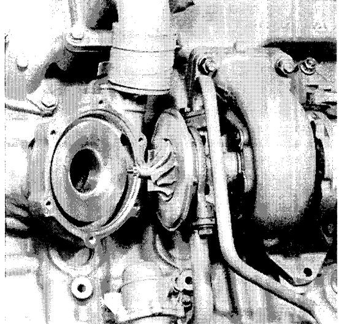

 $T1$ 

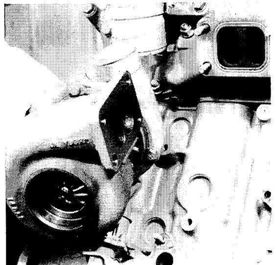

 $T2$ 

{131}------------------------------------------------

#### TURBOCHARGER-T.2

#### Airesearch T-31 (see Fig. T.3) **Dismantling**

Clean the exterior with a pressure spray of a noncaustic cleaning solvent before dismantling. Dismantle only as required to make necessary inspection or repairs. As each part is removed, place in a clean container to prevent loss or damage.

Remove the boits, clamps and lockplates which hold the compressor and turbine housings to the centre housing group. Tap the housings with a soft faced hammer if force is needed for removal.

Note: Exercise caution when removing housings to prevent damage to compressor or turbine wheel. Once damaged, they cannot be repaired. Never attempt to straighten bent compressor or turbine blades-replace the faulty component.

Place the centre housing group in a suitable holding fixture which will prevent the turbine wheel from turning.

Use a T-handled wrench when removing the compressor wheel locknut to avoid possible bending of the shaft.

Lift the compressor wheel off the shaft. Remove the shaft wheel from the centre housing keeping shaft central with bearings until clear of centre housing.

Note: The turbine wheel shroud is not retained to the centre housing and will fall free when the shaft wheel is removed.

Remove lockplates and bolts from back plate.

Tap backplate with soft mallet to remove from recess in centre housing.

Remove thrust collar and thrust bearing from centre housing

Remove bearings and retainers from centre housing. Discard rubber sealing ring.

#### Cleaning

Before cleaning, inspect all parts for signs of rubbing, burning or other damage which might not be evident after cleaning.

Soak all parts in clean non-caustic carbon solvent. After soaking, use a stiff bristle brush and remove all dirt particles. Dry parts thoroughly.

Note: Normally a light accumulation of carbon deposits will not affect turbine operation.

#### Internal Parts Inspection (see Fig. T.4)

Parts must not show signs of damage, corrosion or deterioration. Threads must not be nicked, crossed or stripped.

The turbine wheel must show no signs of rubbing and vanes must not be torn or worn to a feather edge. The shaft must show little signs of scoring, scratches or seizure with the bearings.

The compressor must show no signs of rubbing or damage from foreign matter. The compressor wheel bore must not be chafed.

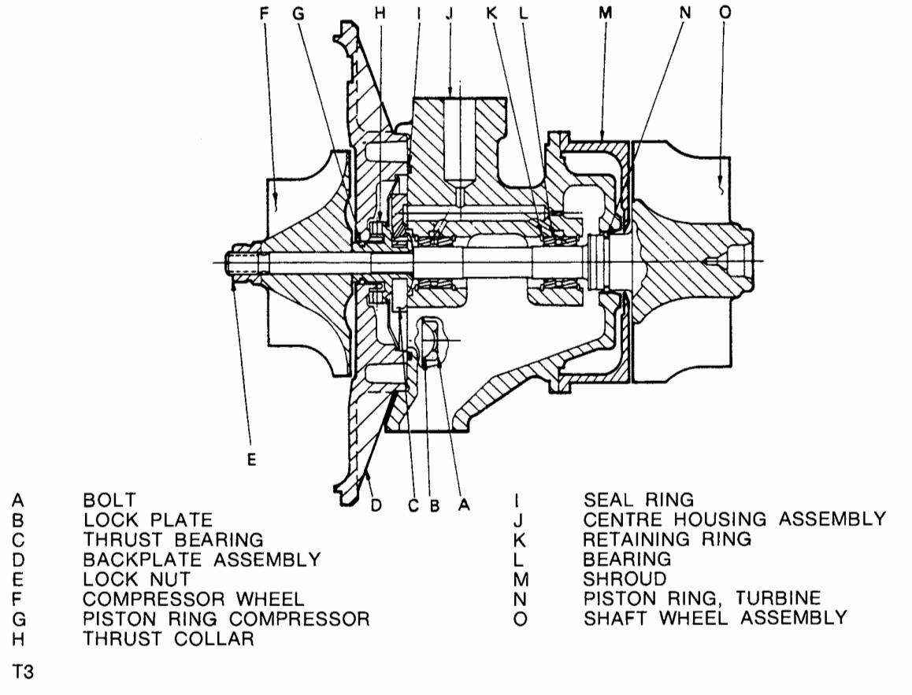

{132}------------------------------------------------

Seal parts must show no signs of rubbing or scoring of the running faces. Housings must show no signs of contact with rotating parts. Oil and air passages must be clean and free from obstructions.

Burnish or polish out minor surface damage. Use silicon carbide abrasive cloth for aluminium parts and crocus abrasive cloth for the steel parts. Thoroughly clean parts before re-assembly.

Replace any parts which do not meet requirements.

Replace the following parts: seal ring, lockplates. piston rings, turbine housing bolts, journal bearings. bearing retaining rings and compressor wheel locknut. If thrust bearing and thrust collar show signs of nicks. scores, varnish deposits or foreign matter embedments -replace. Also, a close inspection of bearing bores in the centre housing should be made and if any of the above conditions exist, replace the centre housing.

#### Re-assembly

Check each part prior to installation to ensure cleanliness. Exercise care to prevent entry of foreign matter during assembly.

Check thrust collar piston ring groove for nicks or burns

Assemble in the following manner:

Install inboard bearing retainers. Lubricate bearings with clean engine oil. Fit bearings and outer bearings retainers.

Place turbine wheel upright. Gently guide shaft through shroud and centre housing bearings. Place thrust bearing over thrust collar.

Fit piston ring on thrust collar. Place thrust collar over shaft so that thrust bearing is flat against the centre housing and engages the centre housing anti-rotating pins.

Install seal ring in groove in centre housing.

Ensure that thrust spring is installed in back plate. Align mounting holes of centre housing and backplate and install over shaft and thrust collar. Use care not to break piston ring when engaging seal into back plate bore. Back plate is easily installed if open end position is engaged into back plate bore first.

Install compressor backplate, bolts and lockplate. Tighten to 79 lbf in (104 kgf cm) or 8,93 Nm and secure lockplates.

Fit compressor wheel. The larger face of the locknut and the front face of the impeller must be smooth and clean. Lightly oil threads and face of nut and tighten to 20 lbf in (23 kgf cm) or 2,26 Nm. Then continue to tighten until length of shaft increases by 0.0055/ 0.0065 in (0,14/0,16 mm). Tighten nut by using T-handled wrench to avoid side load which may cause shaft to bend. Check axial end play for 0.001/0.004 in (0,03/0,10 mm) travel. If equipment is not available to measure shaft stretch, this alternative method may be used: after installing impeller nut and tightening to 20 lbf in (23 kgf cm) or 2,26 Nm continue to tighten through an angle of 110°

Check for clearance between wheel shroud and turbine wheel.

Orientate compressor housing to centre housing. Fit the six bolts and three lockplates. Tighten bolts to 130 lbf in (150 kgf cm) or 14,09 Nm.

Orientate turbine housing to centre housing. Coat bolt heads with a high temperature thread lubricant. Install bolts, clamps and lockplates. Tighten bolts to 130 lbf in (150 kgf cm) or 14,09 Nm. Bend up lockplates.

After assembly, push the rotating assembly as far as possible from the turbine end and check for binding. Repeat check, pushing from compressor end. If the unit is to be stored, lubricate internally and install protective covers on all openings.

Note: The turbocharger does not require testing after overhaul.

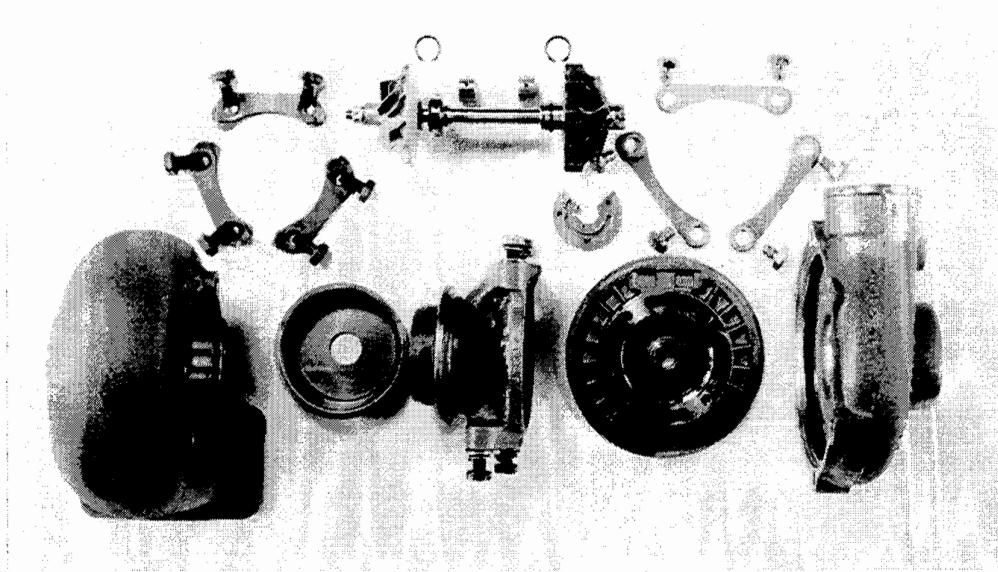

 $T4$ 

{133}------------------------------------------------

#### **TURBOCHARGER-T.4**

#### **To Fit Turbocharger**

Remove seals from open engine connections.

Fit turbocharger to exhaust manifold, use a new gasket.

Fit turbocharger outlet assembly to cylinder block.

Fit oil drain pipe, use a new gasket.

Pour 4 to 5 (fluid ounces (110/114 ml) of clean engine oil through oil inlet port of turbocharger central housing. Turn rotation assembly by hand to pass oil over bearing surfaces.

Connect compressor inlet and outlet pipes and exhaust pipe.

Fit oil supply pipe but do not tighten setscrews.

Operate the stop control and turn engine by the starter motor until a steady flow of oil comes from the oil supply pipe.

Tighten pipe flange setscrews.

Start the engine and check for leaks. The engine must be run at idling speed for three to four minutes to allow the lubricating oil to flow before the engine speed is increased.

#### **Wastegate Operation/Calibration Test**

Remove turbocharger from engine and the hose from the wastegate unit sensing port. (see Fig. T.5).

Attach a dial gauge to the turbocharger so that the dial indicator rests on the control valve face. (see Fig. T.5).

Set the indicator dial to zero and while gently tapping the turbine housing with a soft mallet apply calibration air pressure of 13,9 - 14,9 lbf/in2 (0,98 - 1,05 kgf cm2) 96,5 - 103,4 kN/m2 to the wastegate sensing port. (Note, the wastegate is designed to allow a small bleed-off of pressure).

Ensure the specified pressure is maintained at the sensing port during this test.

Note the valve movement shown on the indicator dial.

Release the air pressure at the wastegate unit sensing port and ensure the dial indicator pointer returns exactly to zero.

Repeat steps 3 to 6 several times to make sure that the wastegate unit valve movement has been accurately measured.

If a valve movement of 0.050 in (1.27 mm) cannot be obtained within the specified pressure range, the turbine housing complete with wastegate unit, will have to be renewed.

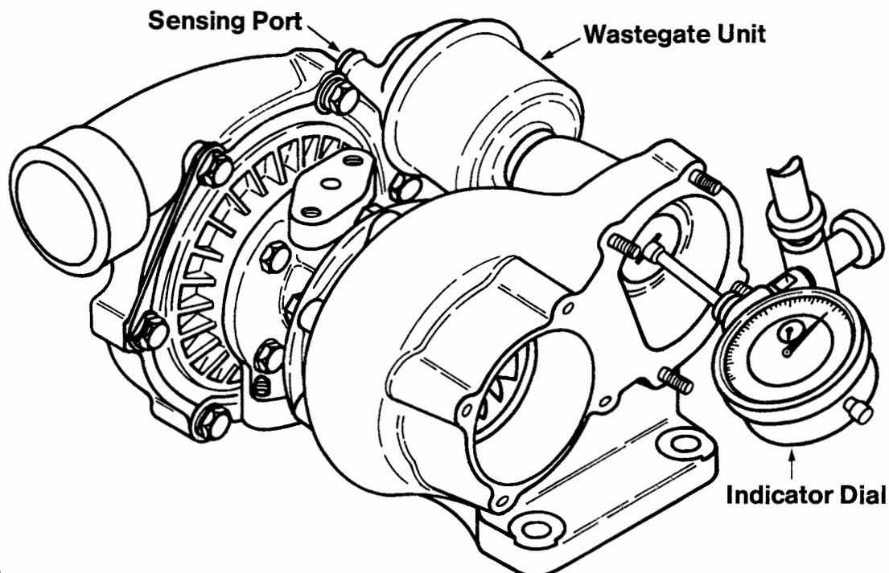

T5

{134}------------------------------------------------

| Tool No.      | <b>Description</b>                                                                                                               |
|---------------|----------------------------------------------------------------------------------------------------------------------------------|
| <b>PD.1D</b>  | VALVE GUIDE REMOVER AND REPLACER (MAIN TOOL)- <b>EARLY ENGINES ONLY</b>                                                    |
|               |                                                                                                                                  |
| PD.1D-1A      | ADAPTOR FOR PD.1D A pair of puller bars fitted with knurled nuts. Suitable for $\frac{5}{6}$ " and $\frac{3}{6}$ " guides. |
| No. 8         | PISTON RING SQUEEZER                                                                                                             |
| <b>PD.41B</b> | PISTON HEIGHT AND VALVE DEPTH <b>GAUGE</b> A simple method of quickly checking piston height.                           |
| <b>MS.67B</b> | UNIVERSAL TIMING GAUGE For checking fuel injection pump timing.                                                               |
| PD.67B-1      | ADAPTOR FOR MS.67B For use with mechanically governed fuel injection pump.                                                 |
| PD.67-2       | Adaptor for MS.67B For use with D.P.S. type fuel injection pump.                                                              |
| PD.67-3       | Adaptor for MS.67B For use with D.P.S. type fuel injection pump.                                                              |

{135}------------------------------------------------

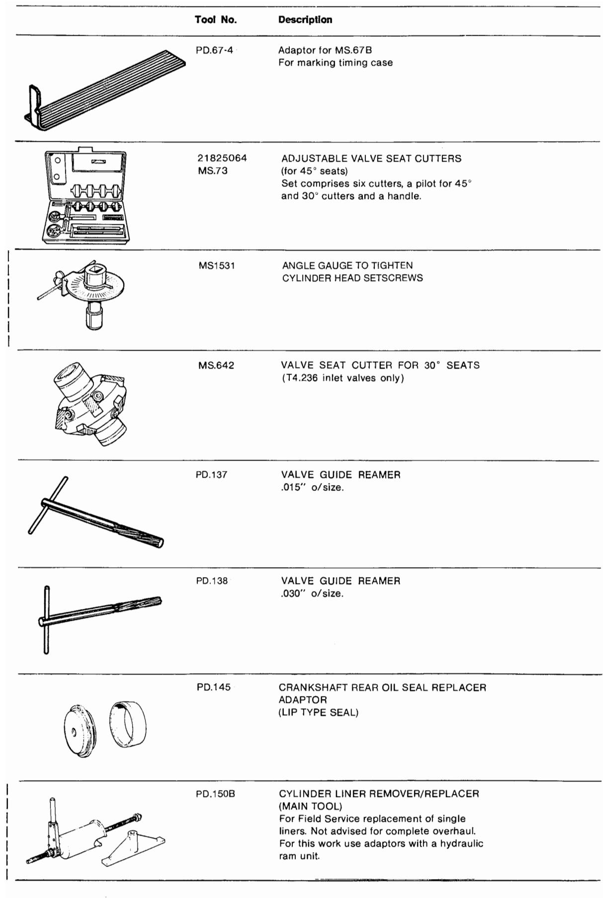

{136}------------------------------------------------

|      | Tool No.                                             | <b>Description</b>                                                                                                                                                                |
|------|------------------------------------------------------|-----------------------------------------------------------------------------------------------------------------------------------------------------------------------------------|
|      | <b>PD67B-6</b>                                       | ADAPTOR FOR USE WITH MS67B AND MS67B-1                                                                                                                                         |
|      | PD.150-1B PD.150-7A                               | ADAPTOR FOR PD.150B Suitable for cylinders of 3.87" dia. Removal and replacement. Suitable for cylinders of 3.975" dia. Removal and replacement.                      |
|      | PD.155B                                              | <b>BASIC PULLER</b> Cruciform head with multiple holes at different centres complete with adaptors. Use with adaptor bolts PD.155B-1, or for metric threads PD.155B-5 |
|      | 335                                                  | CON ROD JIG & 336 MASTER ARBOR                                                                                                                                                    |
|      | 336-102                                              | ARBOR ADAPTOR Used with 335.                                                                                                                                                   |
|      | 21825020 !!!!!!!!!!!!!!!!!!!!!!!!!!!!!!!!!!!!!!!! | <b>VALVE SPRING COMPRESSOR</b>                                                                                                                                                    |
| IIII | 21825023 PD6118-4                                 | ADAPTOR FOR 21825020 <b>ADAPTOR FOR 6118B</b>                                                                                                                                  |
|      | PD.162 PD6113-4                                   | TIMING CASE COVER CENTRALISING TOOL Adaptor for 6118B                                                                                                                          |

{137}------------------------------------------------

{138}------------------------------------------------

| Alternator Data                                             | B.18                     |
|----------------------------------------------------------------|--------------------------|
| <b>Fault Finding AC5</b>                                       | S.1                      |
| <b>Fault Finding 11AC</b>                                      | S.2                      |
| Fault Finding 15ACR, 17ACR, 18ACR                              |                          |
| 23ACR, A155/45, A133/55, A127 and LR Series S.4 General     | S.1                      |
| Maintenance                                                    | S.1                      |
| Altitude, De-rating                                            | B.19                     |
| Atomisers, Data                                                | <b>B.18</b>              |
| Atomisers, General                                             | N.11 N.11             |
| Atomisers, Inspection Atomisers, Pressure Setting           | N.11                     |
| Atomisers, Troubles in Service                                 | N.11                     |
|                                                                |                          |
| Balance Unit, Front Mounted                                    | J                        |
| Balance Unit, Data                                             | <b>B.14</b>              |
| Balance Unit, To Remove Balance Unit, To Dismantle          | J.1 J.1               |
| Balance Unit, To Re-assemble                                   | J.1                      |
| Balance Unit, Centre Mounted                                   | J.4                      |
| Balance Unit, Data                                             | <b>B.14</b>              |
| Balance Unit, To Remove                                        | J.4                      |
| Balance Unit, To Dismantle Balance Unit, To Assemble        | J.4 J.6               |
| Balance Unit, To Refit                                         | J.7                      |
| Belt, Fan, Adjustment                                          | M.1                      |
| Bearings, Connecting Rod, Data                                 | <b>B.9</b>               |
| Bearings, Main, Data                                           | <b>B.9</b> <b>B.3</b> |
| Block, Cylinder, Data Bush, Connecting Rod, Small End, Data | <b>B.7</b>               |
| Bush, Connecting Rod, Small End, To Renew                      | F.1                      |
|                                                                |                          |
| Case, Timing, To Remove Case, Timing, To Refit              | K.6 K.6               |
| Camshaft, Data                                                 | B.9                      |
| Camshaft, To Remove                                            | K.8                      |
| Camshaft, To Refit                                             | K.8                      |
| Closed Circuit Breather Vent Valve                             | E.8                      |
| Cold Starting Aid, Data Compressor-SC6                      | <b>B.19</b>              |
| <b>Preventive Maintenance</b>                                  | R.1                      |
| Removal                                                        | R.1                      |
| Replacement                                                    | R.1                      |
| Dismantling Re-assembly                                     | R.2 R.3               |
| <b>Fault Finding</b>                                           | R.4                      |
| Compressor - Wabco                                             |                          |
| Drive Housing Assembly Data <b>Preventive Maintenance</b>   | B.12 R4               |
| Removal                                                        | R5                       |
| Replacement                                                    | R5                       |
| Dismantling                                                    | R6                       |
| Re-assembly <b>Technical Data</b>                           | R6 R8                 |
| Cooling System, Data                                           | <b>B.14</b>              |
| Cooling System, Description                                    | M.1                      |
| Cover, Timing Case, To Remove                                  | K.1                      |
| Cover, Timing Case, To Refit                                   | K.1                      |
| Crankshaft, Data Crankshaft, To Remove                      | B.8 H.2               |
| Crankshaft, To Regrind                                         | H.2                      |
| Crankshaft, To Refit                                           | H.4                      |
| Data, Engine                                                   | B.1                      |
| Data and Dimensions, Manufacturing                             | В.З                      |

| Designation, Engine Dynamo, Data Dynamo, C40A & C40L        | Page 4 <b>B.18</b> |
|-------------------------------------------------------------------|-----------------------|
| General Routine Maintenance                                    | S.5 S.5            |
| Testing in Position                                               | S.5                   |
| Element, Lubricating Oil Filter, To Renew                         | L.6                   |
| Element, Fuel Filter, To Renew Exhaust, Smoky, Fault Diagnosis | N.3 D.1            |
| Exhauster, Removal and Dismantling                                | Q.2                   |
| <b>Exhauster, Description</b>                                     | Q.1                   |
| <b>Exhauster, Operating</b>                                       | Q.1                   |
| Exhauster, Overhaul                                               | Q.3                   |
| Exhauster, Servicing                                              | Q.1                   |
| Fault Diagnosis                                                   | D.1                   |
| Filters, Air Filter, Air, Dry Type Two Stage "Cyclopac"        | N.1 N.1            |
| Filter, Air, Dry Type Two Stage "Cyclone"                         | N.1                   |
| Filter, Air, Two Stage "Rotopamic" Type                           | N.2                   |
| Filter, Air, Oil Bath Type                                        | N.2                   |
| Filter, Air, Oil Bath Tractor Type                                | N.2                   |
| Filter, Fuel, Data Filter, Fuel, To Renew                      | <b>B.15</b> N.3    |
| Filter, Lubricating Oil, Data                                     | B.13                  |
| Filter, Lubricating Oil, To Remove                                | L.6                   |
| Filter, Lubricating Oil, To Replace                               | L.6                   |
| Foreword                                                          | Page 5                |
| Flywheel, To Remove Flywheel, To Refit                         | P.1 P.1            |
| Fuel System, Priming                                              | N.9                   |
|                                                                   |                       |
| Gasket, Cylinder Head                                             | E.6                   |
| Gear, Camshaft, Data                                              | B.11                  |
| Gear, Camshaft, To Remove Gear, Camshaft, To Refit             | K.3 K.3            |
| Gear, Crankshaft, Data                                            | <b>B.12</b>           |
| Gear, Flywheel Ring, To Renew                                     | P.1                   |
| Gear, Fuel Pump Data                                              | <b>B.11</b>           |
| Gear, Fuel Pump (Hydraulic Governor)                              |                       |
| To Remove To Refit                                             | K.4 K.4            |
| To Replace                                                        | K.4                   |
| Gear, Fuel Pump (Mechanical Governor)                             |                       |
| To Remove                                                         | K.5                   |
| To Refit                                                          | K.5 <b>B.11</b>    |
| Gear, Idler, Data Gear, Idler, To Remove                       | K.2                   |
| Gear, Idler, To Refit                                             | K.3                   |
| Gear, Timing, Backlash                                            | <b>B.12</b>           |
| Gear, Timing, Backlash, Checking                                  | K.2                   |
| Gear, Oil Pump Drive, Data Gear, Oil Pump Idler Data           | <b>B.12</b> B.12   |
| Guide, Valve, Data                                                | <b>B.10</b>           |
| Guide, Valve, To Remove                                           | E.3                   |
| Guide, Valve, To Replace                                          | E.3                   |
| Head, Cylinder, Data                                              | B.10                  |
| Head, Cylinder, To Clean Head, Cylinder, To Remove             | E.2 E.1            |
| Head, Cylinder, To Re-assemble                                    | E.6                   |
| Head, Cylinder, To Refit                                          | E.7                   |
| Haad Culindar Chimmin                                             | e e                   |

{139}------------------------------------------------

| Housing, Flywheel, Alignment Limits      | P.2         | Description                               |
|------------------------------------------|-------------|-------------------------------------------|
| Housing, Flywheel, To Remove             | P.1         | !!!!!!!!!!!!!!!!!!!!!!!!!!!!!!!!!!!!!!!!  |
|                                          |             |                                           |
| Housing, Flywheel, To Refit              | P.1         | To Dismantle                              |
| Hub, Idler Gear, Data                    | B.11        | Inspection                                |
| Hub, Idler Gear, To Remove               | K.2         | To Assemble                               |
|                                          |             |                                           |
| Hub, Idler Gear, To Refit                | K.3         | To Refit                                  |
|                                          |             | Pump, Water                               |
| Insert, Valve Seat, Fitting              | E.4         | Data                                      |
|                                          |             | To Remove (High Position)                 |
| Insert, Valve Seat, To Renew             | E.4         | To Refit (High Position)                  |
|                                          |             |                                           |
|                                          |             | To Remove (Low Position)                  |
| Knocking, Engine, Fault Diagnosis        | D.1         | To Refit (Low Position)                   |
|                                          |             | To Dismantle                              |
|                                          |             |                                           |
|                                          |             | Inspection                                |
| Liner, Cylinder, Cast Iron, Data         | <b>B.3</b>  | To Re-assemble                            |
| Liner, Cylinder, Chrome Plated, Data     | B.4         |                                           |
|                                          |             | Push Rod, Inspection                      |
| Liner, Cylinder, Description             | G.1         | Push Rod, Replacement                     |
| Liner, Cylinder, Cast Iron, To Renew     | G.1         |                                           |
| Liner, Cylinder, Chrome Plated, To Renew | G.2         |                                           |
|                                          |             | Rings, Piston, Data                       |
| Lubricating Oil                          |             | Rings, Piston                             |
| <b>Operating Pressure</b>                | B.1         |                                           |
|                                          |             | Rockers, Data                             |
| High Pressure, Fault Diagnosis           | D.1         |                                           |
| Low Pressure, Fault Diagnosis            | D.1         | Rod, Connecting                           |
| Lubrication, Engine                      | L.1         | Data                                      |
|                                          |             | Alignment                                 |
| Lubricating System                       | L.1         | To Remove                                 |
|                                          |             |                                           |
|                                          |             | Inspection                                |
| Misfire, Engine, Fault Diagnosis         | D.1         | To Replace                                |
|                                          |             |                                           |
|                                          |             | Routine Maintenance                       |
|                                          |             |                                           |
| Number, Engine Location                  | Page 4      |                                           |
|                                          |             | Safety Precautions                        |
|                                          |             | Seal, Crankshaft Front End, Oil, To Renew |
| Oil Cooler                               | L.6         | Seal. Crankshaft Rear End, Oil, To Renev  |
| Overheating. Engine, Fault Diagnosis     |             |                                           |
|                                          | D.1         | Seal. Rocker Shaft Oil Feed Connection, F |
|                                          |             | Shaft, Rocker, Data                       |
|                                          |             | Shaft, Rocker, Dismantling                |
| Pipes, Fuel Injection High Pressure      | N.12        |                                           |
|                                          |             | Shaft, Rocker, Re-assembly                |
| Pin, Gudgeon, Data                       | B.7         | Spring, Valve, Inner, Data                |
| Piston, Data                             | <b>B.4</b>  | Spring, Valve, Outer, Data                |
| Piston, To Remove                        | F.1         |                                           |
| Piston, To Dismantle                     | F.1         | Springs, Valve, Fitting                   |
|                                          |             | Springs, Valve, Inspection                |
| Piston, Inspection                       | F.1         | Starter Motor 2M113, M45G S12-84 and S12- |
| Piston, To Assemble                      | F.2         |                                           |
| Piston, To Refit                         | F.5         | General                                   |
|                                          |             |                                           |
| Piston Cooling Jets, To Remove           | M.4         | Servicing                                 |
| Piston Cooling Jets, To Refit            | M.5         | <b>Starter Motor CA45</b>                 |
| Power, Loss, Fault Diagnosis             |             | General                                   |
|                                          | D.1         |                                           |
| Pressure, Crankcase, Fault Diagnosis     | D.1         | Testing on Vehicle                        |
| Pump, Fuel Injection                     |             | Maintenance                               |
| Data                                     | B.11        |                                           |
|                                          |             |                                           |
| Description                              | N.6         |                                           |
| Idling Speed Setting                     | N.9         | Starter Motor M50                         |
| Maximum Speed Setting                    | N.9         | General                                   |
| Timing                                   |             | Testing on Vehicle                        |
|                                          | N.7         |                                           |
| To Remove                                | N.6         | Maintenance                               |
| To Refit                                 | N.6         | Starting, Difficulty, Fault Dignosis      |
| Types                                    | B.16        | Sump, Data                                |
|                                          |             |                                           |
| Pump, Fuel Lift                          |             |                                           |
| Data                                     | <b>B.15</b> |                                           |
| Dismantling                              | N.5         | Tappets, Data                             |
|                                          |             | Tappets, To Remove                        |
| Inspection                               | N.5         |                                           |
| Re-assembly                              | N.5         | Tappets, To Refit                         |
| To Remove                                | N.5         | Thermostat, Data                          |
|                                          |             | Thermostat, To Remove                     |
| To Refit                                 | N.6         |                                           |
| Testing                                  | N.4         | Thermostat, Testing                       |
|                                          |             | Threads, Types                            |
| Pump, Lubricating Oil                    |             | Timing, Balance Unit (Front mounted)      |
| Data                                     | <b>B.12</b> | Timing, Balance Unit (Mid mounted)        |
|                                          |             |                                           |
|                                          |             |                                           |
| Delivery Housing, To Remove              | L.2         | Timing, Fuel Injection, General           |

{140}------------------------------------------------

| Timing, Fuel Injection, Static Position  | B.16        |
|------------------------------------------|-------------|
| Timing, Valve, Checking                  | K.8         |
| Tools, Approved Service                  | Appendix    |
| Torque, Recommended Tensions             | B.2         |
| Turbocharger                             | T.2         |
| <b>Turbocharger Calibration</b>          | T.4         |
| Valves, Exhaust and Inlet                |             |
| Exhaust Data                             | <b>B.10</b> |
| Inlet Data                               | <b>B.10</b> |
| Clearances                               | <b>B.11</b> |
| <b>Hand Grinding</b>                     | E.3         |
| Inspection                               | E.3         |
| To Remove                                | E.2         |
| Seats, Inspection                        | E.3         |
| Valve, Oil Pressure, Relief              |             |
| Data                                     | <b>B.13</b> |
| Removal and Dismantling                  | L.4         |
| Setting                                  | L.4         |
| Re-assembly and Refitting                | L.5         |
|                                          |             |
| Washer, Camshaft Thrust, Data            | <b>B.10</b> |
| Washers, Crankshaft Thrust, Data         | B.9         |
| !!!!!!!!!!!!!!!!!!!!!!!!!!!!!!!!!!!!!!!! | ш. н.       |

{141}------------------------------------------------

{142}------------------------------------------------

{143}------------------------------------------------

### **Foreword**

Since the basic design of the 4.236 marine engines is similar to that of the non-marine 4.236 Series engines, the 4.236 marine engines can be serviced, to a large extent, in accordance with the instructions given in the appropriate sections of the 4.236 Series Workshop Manual.

However certain special components are fitted to marine engines and it is for the servicing of these items that this Supplement has been prepared.

Only those items that are different or additional to the non-marine engine are shown under the appropriate main section heading.

| For further information refer to the Workshop Manual.

Note: Unless otherwise stated, the information for the 4HD76 and Range M90 engines is the same as that shown for the 4.236 engine.

 $\mathbf{I}$ 

{144}------------------------------------------------

# **CONTENTS**

| <b>ENGINE VIEWS</b>                                     | А |
|---------------------------------------------------------|---|
| TECHNICAL DATA                                          | в |
| OPERATING AND MAINTENANCE                               | C |
| <b>FAULT DIAGNOSIS</b>                                  | D |
| <b>CYLINDER HEAD</b>                                    | Е |
| LUBRICATING SYSTEM                                      |   |
| <b>COOLING SYSTEM</b>                                   | м |
| <b>GEARBOX, FLYWHEEL AND</b> <b>FLYWHEEL HOUSING</b> |   |

{145}------------------------------------------------

## **Engine Views**

#### Lowline 4.236M/Range 4 M90 engines

- 1 Fresh water pump pulley.
- 2 Fresh water header tank.
- 3 Air filter.
- 4 Fuel injection pump.
- 5 Fresh water filler cap.
- 6 Lubricating oil drain pump.
- 7 Lubricating oil filler cap.
- 8 Atomiser.
- 9 Fuel oil filter.
- 10 Gearbox oil cooler.
- 11 Starter motor.
- 12 Lubricating oil dipstick.
- 13 Sea water pump.
- 14 Tachometer drive connection.
- 15 Crankshaft pulley.
- 16 Gearbox oil cooler.
- 17 Engine rear lifting eye.
- 
- 19 Water cooled exhaust manifold.
- 20 Air filter.
- 21 Thermostat housing.
- 
- 
- 
- 
- 26 Fuel oil lift pump.
- 
- 

A

- 18 Induction manifold.
- 22 Alternator.
	- 23 Engine oil cooler.
	- 24 Spin-on lubricating oil filter.
	- 25 Heat exchanger.
		-
	- 27 Flywheel housing.
	- 28 Borg Warner 71CR gearbox.

{146}------------------------------------------------

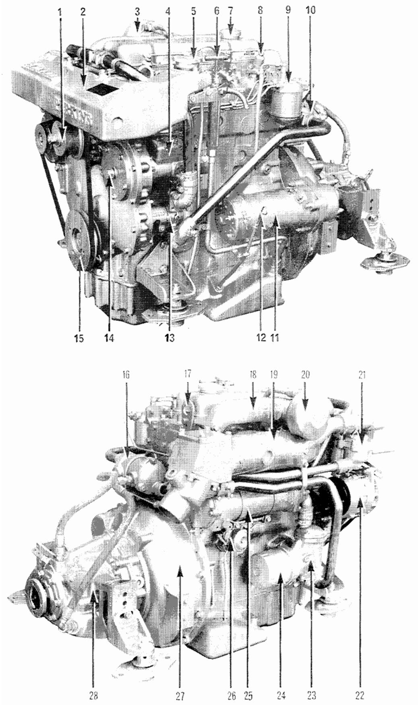

{147}------------------------------------------------

#### 4.236M engine

- 1 Coolant filler cap.
- 2 Front lifting eye.
- 3 Rocker cover.
- 4 Lubricating oil filler cap.
- 5 Atomiser.
- 6 Fuel oil filter.
- 7 Fuel injection pump.
- 8 Water pipe from gearbox oil cooler to sea water pump.
- 9 Gearbox filler plug and dipstick.
- 10 Starter motor.
- 11 Engine oil dipstick.
- 12 Flywheel housing.
- 13 Lubricating oil sump.
- 14 Lubricating oil sump drain plug.
- 15 Sea water pump.
- 16 Water pipe from sea water pump to heat exchanger.
- 17 Power take off from front of crankshaft.
- 18 Crankshaft pulley.
- 19 Timing case cover.
- 20 Engine tachometer drive.
- 21 Dynamo pulley.
- 22 Heat exchanger.
- 23 Engine oil cooler.
- 24 Rear lifting eye.
- 25 Cylinder block drain tap.
- 26 Exhaust manifold drain tap.
- 27 Exhaust manifold.
- 28 Cylinder block.
- 29 Air filter.
- 30 Induction manifold.
- 31 Water pipe from heat exchanger to exhaust manifold.
- 32 Dynamo.
- 33 Oil pipe to cooler.
- !!!!!!!!!!!!!!!!!!!!!!!!!!!!!!!!!!!!!!!!
- 35 Oil filter adaptor.
- 36 Lubricating oil filter.
- 37 Alternative dipstick position.
- 38 Fuel lift pump.
- 39 Sump draining connection.
- 40 Gearbox oil drain cap.
- 41 Reduction gear housing.
- 42 Oil inlet pipe from cooler.
- 43 Oil pipe to cooler.
- 44 Gearbox breather.
- !!!!!!!!!!!!!!!!!!!!!!!!!!!!!!!!!!!!!!!!
- 46 Gearbox oil cooler water drain tap.

{148}------------------------------------------------

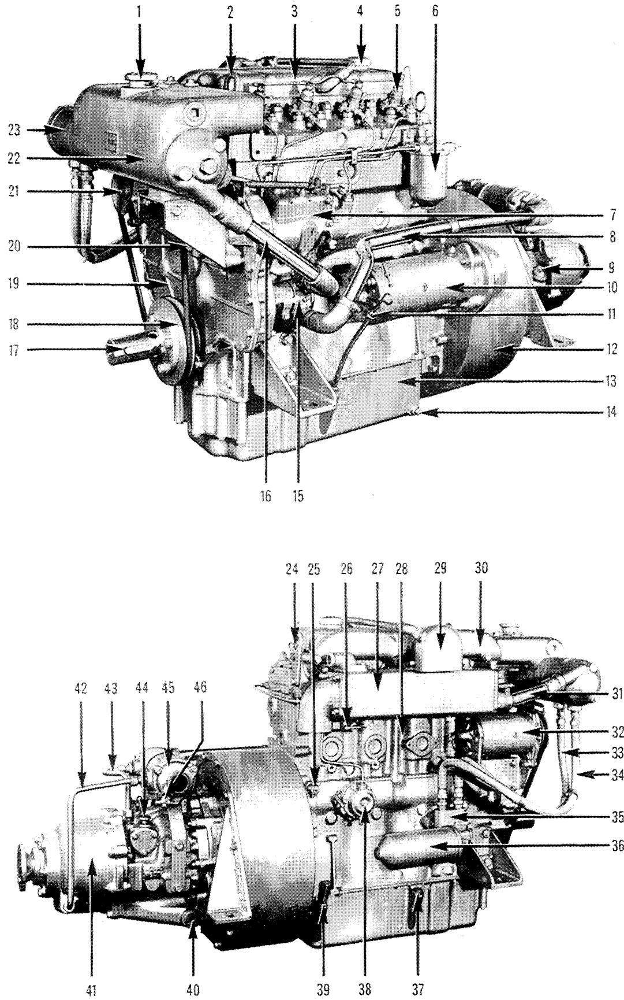

{149}------------------------------------------------

#### **MARINE SUPPLEMENT - A5**

#### 4HD76 engine

- 1 Filler cap for lubricating oil.
- 2 Atomiser.
- 3 Fuel filter.
- 4 Drain pump for lubricating oil.
- 5 Reverse gearbox (Option).
- 6 Starter motor.
- 7 Flexible mounting.
- 8 Dipstick for lubricating oil.
- 9 Lubricating oil sump.
- 10 Crankshaft pulley.
- 11 Pulley for power take-off (Option).
- 12 Raw water pump.
- 13 Fuel injection pump.
- 14 Water pump for closed circuit coolant.
- 15 Header tank for closed circuit coolant.
- 16 Filler cap for coolant header tank.
- 17 Induction cap.
- 18 Thermostat housing.
- 19 Drive belt for alternator and water pump.
- 20 Alternator.
- 21 Cooler for engine lubricating oil.
- 22 Lubricating oil filter.
- 23 Fuel lift pump.
- 24 Heat exchanger.
- 25 Lubricating oil cooler for the reverse gearbox.
- 26 Cooled exhaust manifold.
- 27 Induction manifold.
- 28 Rear lift bracket.

{150}------------------------------------------------

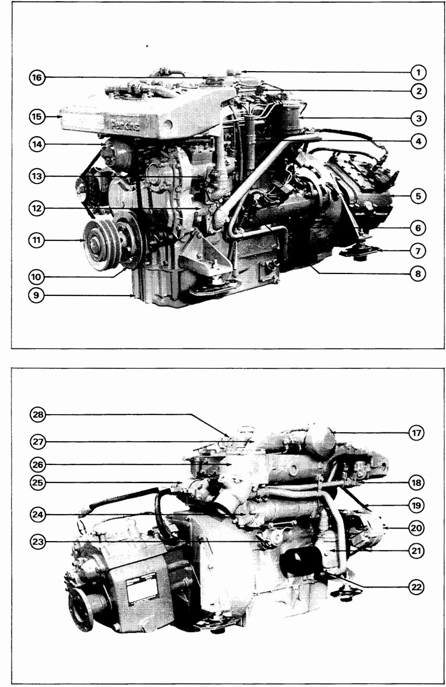

{151}------------------------------------------------

## **Technical Data**

#### **Engine data**

| Engine weight - 4.236M, Range 4 M90....................

|                       | Gear |
|-----------------------|------|
| Engine weight - 4HD76 | 1155 |
|                       |      |

#### **Details of ratings**

| Pleasure (High Speed)                    | 84 bhp (62.6 kW) at 2800 rev/min |
|------------------------------------------|----------------------------------|
| Pleasure                                 | 76 bhp (56.6 kW) at 2500 rev/min |
| Commercial                               | 68 bhp (50.7 kW) at 2250 rev/min |
| Commercial (Heavy Duty)                  | 54 bhp (40.3 kW) at 1800 rev/min |
| $\text{Commercial}$ (Heavy Duty) - 4HD76 | 76 bhp (52 kW) at 2250 rev/min   |
|                                          |                                  |

1100 lb (499 kg) with Borg Warner D.D. 1145 lb (519 kg) with Borg Warner Reduction Ib (524 kg) with Newage PRM 301 Reduction Gear

#### De-rating for altitude

 $\overline{\phantom{a}}$ 

| This is not usually necessary for marine engines. A small loss of power will occur when temperature and humidity conditions are particularly adverse and allowance for this should be made when designing the propeller.

When the engine is required to operate on a lake more than 4,000 feet above sea level, contact Technical Services Department, Perkins Engines Ltd., Peterborough.

#### **Cooling system**

| Type                                         | Indirect fresh/sea water cooling utilising heat exchanger |
|----------------------------------------------|-----------------------------------------------------------------|
| Engine fresh water (closed circuit capacity) | 26 pt (14,8 litre) including heat exchanger                     |
| <b>Water pump</b> (sea water)                |                                                                 |
| <b>Type</b>                                  | Centrifugal                                                     |

### B

{152}------------------------------------------------

### **Operating and Maintenance**

#### **Preventitive maintenance**

#### Every 125 hours or 2 months

(whichever occurs first) Clean air intake gauzes or screens. Grease tachometer angle drive connections (where nipple fitted).

#### Every 500 hours or 12 months

(whichever occurs first) Renew final fuel filter element. Clean lift pump sediment chamber. Drain and clean fuel tank.

Renew gearbox lubricating oil (Borg Warner).

Clean the tube stack of the coolant heat exchanger.

Clean the tube stack of the engine oil cooler.

Clean the tube stack of the gearbox oil cooler (if fitted).

Note: Whilst a lubricating oil drain plug is fitted, it is not normally possible to drain the oil in the Marine installation. Instead, a sump draining connection is fitted, to which a hand operated pump (supplied as an optional extra) can be attached, for the purpose of pumping out the lubricating oil when necessary.

The sump draining connection is situated on the starboard side of the engine.

With 4.236 lowline engines, the sump drain pump is a standard fitment.

#### Protection of an engine not in service

Remove end plate from sea water circulating pump and lubricate the interior with glycerine or MARFAK 2HD grease, or remove the impellor for the lay-up period. Always use a new joint when refitting backplate.

#### To drain the cooling system

Remove filler cap from header tank. 1

 $\mathbf{2}$ Drain water from header tank and engine cylinder block by opening all drain cocks and plugs. The cylinder block may be flushed back through the drain points with the thermostat removed. If it is decided to refill the fresh water system with antifreeze or corrosion inhibitor, operating and maintenance information can be found in the multi-lingual 4,236 Series Users Handbook.

3 If the engine is to be layed up for the winter season, the raw water system should also be drained. Before commencing draining, the sea cock, should be turned off and then all drain cocks opened and plugs removed. The removal of the sea water hose at the lowest point of the engine will assist in complete drainage of the raw water.

4 If the engine is to be left drained during freezing conditions, 1/2 pint (250 ml) of undiluted antifreeze should be added to the oil coolers to prevent freezing should any water drain into the coolers if the boat is moved.

### **Fault Diagnosis**

Fault

Overheating

#### Possible cause

Sea cock strainer or heat exchanger blocked.

D

{153}------------------------------------------------

### **Cylinder Head**

#### **Cylinder head maintenance**

The number of hours run has no bearing on when to overhaul the cylinder head as carbon beyond a superficial coating does not form and accumulate on the cylinder head and pistons as is the case with a petrol i engine.

Ease of starting and performance are the determining factors, therefore the cylinder head should only be removed when it is absolutely necessary.

Before commencing to overhaul the cylinder head ensure that all joints, gaskets and parts expected to be required are available.

#### To remove the cylinder head

1 Drain coolant from heat exchanger, cylinder block and exhaust manifold jacket. (See engine photographs for location of drain points).

2 Disconnect the battery terminals to eliminate the possibility of a short circuit.

3 Disconnect the exhaust pipe from the exhaust manifold. Blank off the end of the exhaust pipe to prevent objects being dropped into it.

4 Disconnect sea water inlet and outlet connections from heat exchanger and exhaust manifold jacket, and connection between heat exchanger and fresh water pump.

5 Disconnect the lubricating oil pipes from the lubricating oil cooler.

6 Remove the heat exchanger securing set-screws and withdraw the heat exchanger.

7 Disconnect and remove the atomiser, leak-off pipe assembly. Blank off the ports on the top of the atomisers.

8 Remove the fuel pipe from the fuel filter to the fuel injection pump inlet, also the fuel pipe from the fuel filter to the fuel injection pump outlet. Blank off the exposed ports.

Disconnect the fuel pipe from the fuel lift pump 9 outlet to the fuel filter. Remove the two setscrews which secure the fuel filter to the cylinder head and withdraw the filter from the engine.

10 Remove the breather pipe from between the cylinder head cover and the induction manifold.

11 Disconnect and remove the high pressure fuel pipes from the fuel injection pump and atomisers. Blank off the exposed ports. Release and remove the nuts securing the atomisers and carefully extract the atomisers from the cylinder head (see Fig. E.1).

12 Disconnect the fuel pipe and electrical lead at the thermostart unit.

13 Remove the air filter. Remove the induction and exhaust manifolds.

14 Detach the rocker cover from the engine by removing the four screws which secure it to the cylinder head.

15 Remove the four rocker bracket securing nuts and washers, and remove the rocker assembly from the cylinder head (see Fig E.2). Remove the push rods.

16 Release and remove the cylinder head nuts or setscrews in the reverse order of the tightening sequence shown in Fig. E.3.

17 Remove the cylinder head. Do not insert a screwdriver or any other sharp instrument between the cylinder head and block. When removed place the cylinder

4.236 Marine Supplement, January 1990.

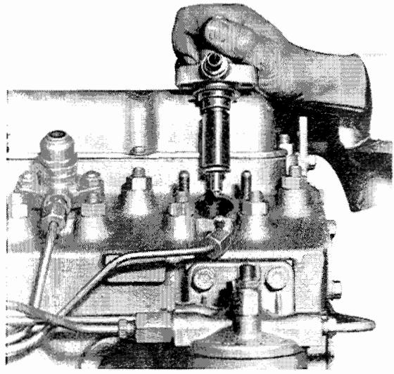

Е

E1

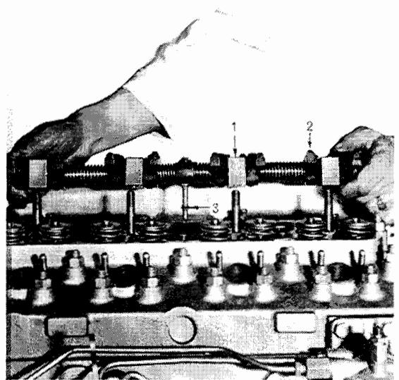

E2

- 1. Rocker shaft bracket.
- Rocker lever.
- 3. Oil feed connection.

head on a flat surface, preferably wood, to avoid damage.

#### To refit the cylinder head

Before assembling the cylinder head to the engine it is extremely important to ensure that the cylinder block and cylinder head faces are perfectly clean. Care must be taken to ensure that the rocker assembly oil feed passage in the cylinder head is free from obstruction.

Whenever the cylinder head is removed, it should not be refitted with the old gasket, whatever the gasket condition

Important: Always ensure the correct gasket is fitted.

{154}------------------------------------------------

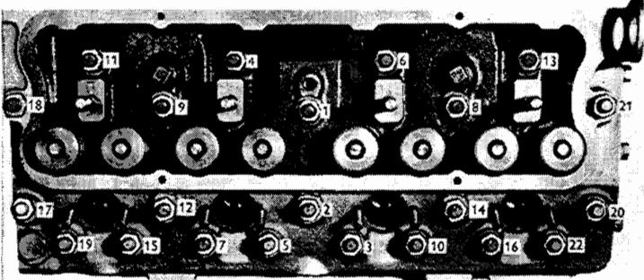

#### E3

The thickness of gaskets varies according to the piston height as given on Page B.5 and exhaust valve depths as given on Page B.10 of the 4.236 Series Workshop Manual and if the correct gasket is not used, then piston/valve contact may result.

Current type cylinder head gaskets should be fitted dry. On no account should jointing compound be used.

Before placing gasket over cylinder head studs, ensure it is correctly positioned. Gaskets are marked to indicate how they should be fitted.

2 Place the cylinder head in position on the cylinder block. Lightly oil threads and tighten nuts/setscrews progressively (in 3 stages) in the order shown in Fig. E.3 to a torque of 100 lb ft (13,8 kgf m) - 136 Nm. The final stage should be repeated to ensure that no loss of tension has occurred earlier in the tightening sequence.

3 Fit the push rods in their respective positions and assemble the rocker shaft assembly to the cylinder head. Ensure that a new rubber sealing ring is fitted to the rocker oil feed connection and that it is correctly positioned before tightening down the rocker shaft assembly.

When fitting the seal to the rocker oil feed connection, the seal should be positioned immediately below the bottom convolution so that when the pipe is inserted into the cylinder head, the "O" ring will roll up and over the lower convolutions. With current engines, the seal should be fitted to butt up against the lower convolution (see Fig. E.4).

#### Valve clearance adjustment

4 Adjust valve clearances to 0.012 in (0,30 mm) in the following manner:-

(a) With the valves rocking on No. 4 cylinder, set the clearances on No. 1 cylinder.

(b) With the valves rocking on No. 2 cylinder, set the clearances on No. 3 cylinder.

(c) With the valves rocking on No. 1 cylinder, set the clearances on No. 4 cylinder.

(d) With the valves rocking on No. 3 cylinder, set the clearances on No. 2 cylinder.

5 Using a new joint, fit the rocker cover and secure with four plain washers, spring washers and screws.

6 Assemble the inlet and exhaust manifolds to the cylinder head using new joints and gaskets. Connect the electrical lead and fuel feed pipe to the thermostart unit.

7 Refit the atomisers with new copper sealing washers and tighten down the securing nuts evenly ensuring the atomiser is squarely on its seat. Refit the high pressure fuel pipes to the injection pump and

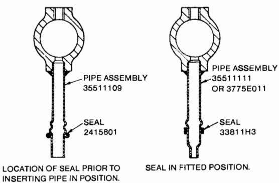

PREVIOUS ARRANGEMENT. F4

**CURRENT ARRANGEMENT.** 

atomisers (see Pages N.11 and N.12 of the 4.236 Series Workshop Manual).

8 Fit the breather pipe assembly to the cylinder head cover.

9 Refit the fuel filter to the cylinder head securing it with the two setscrews and spring washers. Refit the fuel pipe connecting the lift pump outlet to the fuel filter.

10 Fit the fuel pipe connecting the fuel filter to the injection pump inlet also the pipe connecting the injection pump outlet to the fuel filter.

11 Refit the atomiser leak-off pipe assembly.

12 Fit the heat exchanger and secure with the setscrews.

13 Reconnect the lubricating oil pipes to the lubricating oil cooler.

14 Reconnect the water connection between the fresh water pump and heat exchanger, also the sea water connections between the heat exchanger and exhaust manifold jacket.

15 Using a new gasket, connect the exhaust pipe to the exhaust manifold.

16 Refit the air filter and connections. Fit the water outlet hose. Re-connect the battery terminals.

17 Fill the cooling system with clean water ensuring that the drain taps are turned off. Check for water leaks.

18 Bleed the air from the fuel system as detailed on Page N.9 of the 4.236 Series Workshop Manual, and start the engine.

19 Run the engine until normal operating temperature is attained and retighten the cylinder head nuts/ setscrews in sequence, Fig. E.3, and to the correct torque as given in item 2.

Note: When retightening cylinder head nuts/

4.236 Marine Supplement, November 1988.

{155}------------------------------------------------

#### **MARINE SUPPLEMENT-E3**

setscrews, the engine coolant outlet temperature should not be less than 170°F (77°C).

If the nut/setscrew moves when retightened, then tighten up to the correct torque.

Note: If the engine number is greater than 573000, refer to page E.7 of the main manual.

20 If the nut/setscrew does not move before the correct torque is achieved, then slacken of 1/12 to 1/6 of a turn (30° to 60°) and retighten to the correct figure.

21 After retightening all the nuts/setscrews, the first 10 positions should be rechecked without further slackening off to ascertain they are still tightened to the torque quoted.

22 Reset the valve clearance to 0.010 in (0,25 mm) cold (see item 4). Fit the cylinder head cover ensuring that there are no oil leaks at the joint.

Note: After the first 25/50 hours running, the rocker assembly should be removed and the cylinder head nuts/setscrews again retightened to the correct torque and the sequence shown in Fig. E.3. Ensure the correct procedure is followed as in item 19. Replace rocker assembly and set valve clearance to 0.010 in (0,25 mm) with the engine cold. (see Fig. E5).

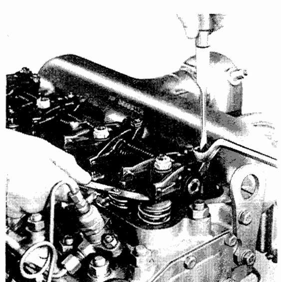

E5

{156}------------------------------------------------

## **Lubrication System**

#### **Description**

The lubrication is of the forced feed type, the oil being circulated, under pressure, by a lobed rotor type oil pump which is mounted on the front main bearing cap and driven through an idler gear by the crankshaft gear. The oil is drawn through a sump strainer and a suction pipe before entering the pump itself. Oil is then pumped via a pipe to the relief valve housing and then through an internal drilling in the cylinder block to an externally mounted adaptor onto which is fitted the full flow type lubricating oil filter. This adaptor channels the oil first to and from the oil cooler section of the heat exchanger, by means of flexible pipes, then through this full flow lubricating oil filter back into the cylinder block. The oil passes via drillings within the cylinder block to the pressure rail (main oil gallery). See Fig. L.1.

With lowline engines, the oil cooler and lubricating oil filter are an integral component fitted on the starboard side of the engine.

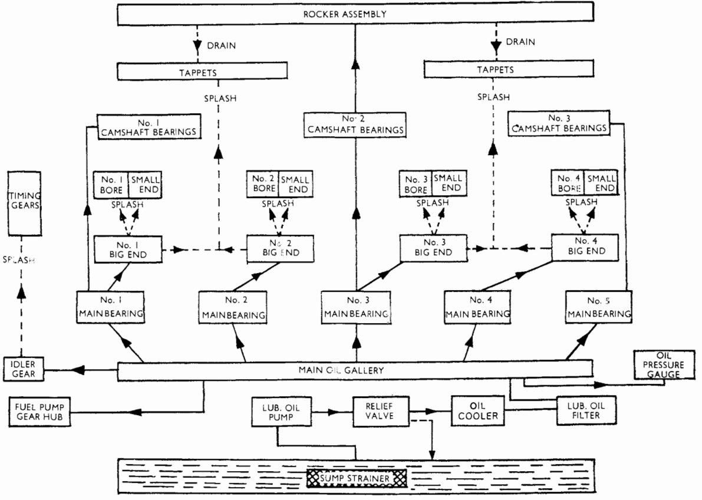

 $L1$ Lubricating Diagram

{157}------------------------------------------------

### **Cooling System**

#### **General Description**

The 4.236 Marine engine is indirectly cooled. This type of system employs two separate water circuits. One is a fresh water (closed) circuit which circulates within the cylinder block and head, the other is a sea or river water (open) circuit which circulates externally round the engine. Heat is interchanged between circuits via a heat exchanger unit.

#### **Standard engines**

With earlier standard engines, the header tank mounted at the front of the engine incorporates both the engine fresh water heat exchanger and the engine oil cooler. A pressurised filler cap is fitted.

The coolant on the open side of the system is drawn in through the gearbox oil cooler to the water pump. From the water pump, it is delivered to the combined heat exchanger and engine oil cooler in the header tank where fresh water and oil in their respective compartments pass over a series of tubes running the length of the unit. It is through these tubes that the coolant on the open side is passed. From the combined heat exchanger and oil cooler, the water is then passed to the water cooled exhaust manifold and is then finally discharged overboard.

Circulation of the closed fresh water system is effected by a centrifugal water pump mounted on the front of the cylinder block and is belt driven from the crankshaft. Water is drawn from the combined header tank/heat exchanger and is delivered to the cylinder block where both the head and block are cooled by thermosyphon action. After circulation, the water is finally discharged at the front of the cylinder head through the thermostat housing to the header tank/ heat exchanger.

The water pumps for each circuit are described individually later in this section.

The operating temperatures of the closed water system at the outlet should be in the region of 190°F  $(88^\circ C)$ 

A thermostat is fitted in the water outlet connection, which enables the engine to reach its most efficient working temperature in the shortest possible time by restricting coolant flow. When the correct temperature is reached, the thermostat valve opens and allows the water to circulate normally. Where a pressurised system is used, the coolant temperature will be slightly higher.

#### Lowline engines

A neoprene impeller type water pump is used to circulate the coolant on the open side of the system. The raw water is drawn in through the gearbox oil cooler to the water pump. From the pump, it is delivered to the heat exchanger mounted on the starboard side of the engine and then to the oil cooler where the engine oil passes over a series of tubes running the length of the unit. It is through these tubes that the coolant is passed. From the engine oil cooler, the raw water is finally discharged through the exhaust manifold water injection bend.

4.236 Marine Supplement, November 1988.

### M

Circulation of the closed fresh water system is effected by a centrifugal water pump mounted on the front of the cylinder block and is belt driven from the crankshaft. Water is drawn from the header tank mounted on the front of the engine to the cylinder block where both the head and block are cooled by thermosyphon action. The water then passes to the thermostat. When the engine is cold and the thermostat fully closed, the water bypasses the thermostat to a double entry elbow mounted on the heat exchanger via a copper pipe. From the double entry elbow, the water passes to the rear of the exhaust manifold. As the engine warms up, the thermostat will start to open allowing the warm cooling water to bleed through the heat exchanger through the double entry elbow joining up with the bypass cooling water. The water then passes through the exhaust manifold to the header tank. As the water temperature rises to its allowed maximum, the thermostat gradually opens until it is in the fully open position, the bypass flow is cut off and the full cooling water flow passes through the heat exchanger and passes through the exhaust manifold and back to the header tank. The amount of water passing through the bypass and through the heat exchanger will depend on the opening position of the thermostat.

The header tank is fitted with a pressurised filler cap.

The water pumps for each circuit are described individually later in this section.

#### **Drive Belts**

#### To adjust the dynamo/alternator and water pump belt

The belt tension should be adjusted so that it is possible to depress the belt, without undue pressure, approximately % in (10 mm) on the longest unsupported length of the belt (see Fig. M.1).

To prevent premature wear and eventual failure, correct tension of this belt should be maintained by periodical checking and adjustment every 250 hours.

Excessive belt tension, and consequent overloading of the dynamo/alternator and water pump bearings, is detrimental to both belt and bearings and may cause complete failure of one or both of these components.

Insufficient belt tension, allowing belt slip, will impair the efficiency of the engine cooling system and adversely affect dynamo/alternator output.

Belt adjustment is obtained by altering the position of the dynamo/alternator in the following manner.

1 Slacken off the dynamo/alternator adjusting lever setscrew, the adjusting lever to timing case setscrew and the dynamo/alternator to bracket support bolts.

2 The dynamo/alternator is now free to be moved on its support bracket towards or away from the engine to obtain the correct belt tension. Hold the dynamo/ alternator in the desired position.

3 Tighten the adjusting lever setscrew, the lever to timing case setscrew and the dynamo/alternator to bracket support bolts.

4 Check that the tension is still correct (See Fig. M.1).

{158}------------------------------------------------

Note: When a new belt is fitted it is advisable to recheck the adjustment after a short running period. New belts are subject to initial stretch and early readjustment may be necessary.

#### To remove the belt

1 Slacken off the dynamo/alternator adjusting lever setscrew, the adjusting lever to timing case setscrew and the bracket support bolts. Pivot the dynamo/ alternator towards the cylinder block.

2 Turn the engine by hand and work the belt off the water pump and dynamo/alternator pulleys.

3 Remove the belt from the crankshaft pulley.

4 Examine the belt for wear or fraying and renew as necessary.

#### To refit the belt

Refitting the belt is a reversal of the removal operations. Adjust the fan belt tension as detailed. If a new belt is fitted, check the tension after a few hours of running to ensure that any slackness due to initial stretching is corrected.

#### Fresh Water Pump (closed circuit)

#### **Description**

This is of the centrifugal type, the pump shaft which rotates within two bearings is belt driven by means of a pulley pressed onto one end and secured with a self locking nut. The drive is transmitted through the shaft to an impellor which is pressed onto the other end of this shaft.

The impellor assists the circulation of the coolant around the system. Water is contained within the impellor chamber by means of a spring loaded carbonfaced seal which registers against the inside (back) face of the impeller.

#### To remove and refit fresh water pump

1 Remove the dynamo/alternator and water pump driving belt.

2 Disconnect the inlet and outlet connections to the water pump.

3 Unscrew the five setscrews which pass through the pump and rear pump body into the cylinder block. Withdraw the pump from the engine (see Fig. M.2).

4 Separation of the front and rear pump body sections is achieved by removing the securing nuts and washers and gently tapping with a hide-faced hammer. (see Fig. M.3).

5 Refit the pump rear body and water pump in the reverse sequence ensuring that all joint faces are clean, and that new joints are fitted between the cylinder block and pump rear body, and between the rear body and water pump.

6 Refit the dynamo/alternator and water pump driving belt as detailed on Page M.1.

#### Fresh water pump seals

Where ceramic counter face water pump seals are fitted, if the engine is run without coolant, even for a few seconds, the heat built-up between the carbon seal and ceramic counter face is very rapid, resulting in the cracking of the ceramic. This often creates the misunderstanding that the cause of leakage is due to the

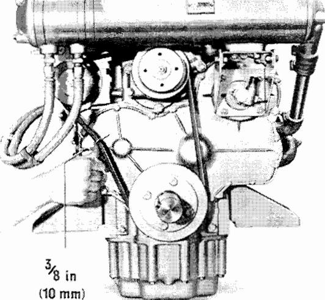

 $M1$ 

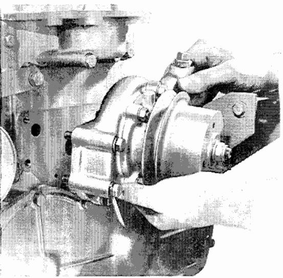

M2

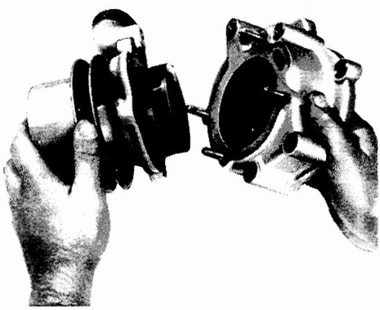

МЗ

4.236 Marine Supplement, November 1988.

{159}------------------------------------------------

#### **MARINE SUPPLEMENT - M3**

incorrect assembly of the sealing arrangement of the water pump.

#### To dismantle the water pump

1 Unscrew the self locking nut securing the water pump pulley to the pump shaft and remove the nut with plain washer.

2 Using a suitable withdrawal tool, remove the pulley from the shaft (see Fig. M.4) and remove the pulley driving key from the shaft.

3 Press the water pump shaft, complete with the impellor, out of the water pump body from the front of the pump.

4 Using a suitable press, remove the impeller from the pump shaft.

5 Remove the water seal from the pump shaft.

6 Remove the bearing retaining circlip from the front of the pump body using circlip pliers.

7 Press the two bearings and distance piece out of the pump body.

8 Finally, remove the front grease seal, seal retainer and flange from the pump body, (earlier pumps only).

Note: Later water pumps have the front seal, retainer and flange removed and the length of the distance piece increased accordingly. A new one piece cassette type seal/counter face unit is also fitted.

#### Inspection

1 Thoroughly wash all the water pump components in cleaning fluid and dry off.

2 Examine the pump body for cracks, damage or corrosion.

3 Examine the drive shaft for wear ensuring the inner diameters of the bearings are a perfect fit on the shaft. The shaft should be renewed if wear in this area is sufficient to allow the races to rotate on the shaft.

4 Remove rust and scale from the impellor and visually inspect for cracks or damage. Examine the impellor hub sealing face for excessive wear or scoring. Renew if unserviceable.

5 Examine the water seal for damage. Excessive wear, scoring or cracks in the carbon sealing face will necessitate renewal.

6 Inspect the bearings for pitting, corrosion or wear, and renew if necessary.

#### To re-assemble the water pump

1 Press the rear bearing on to the shaft, fit the bearing distance piece and then press on the front bearing. When fitting the bearings to the shaft, ensure that the shielded face of each bearing faces outwards towards the front and rear end of the shaft.

2 Fit the grease seal retaining plate in position against the back face of the rear bearing. This retaining plate is "dished" and when in position, the centre of the plate must not be in contact with the bearing, (earlier pumps only).

3 Fit the felt seal and seal retainer housing so that these bear on the retaining plate, (earlier pumps only).

4 Half fill the space between the two bearings with a high melting point grease and press the complete bearing and shaft assembly into the pump housing from the front end. Securely position the retaining circlip in the recess of the pump housing immediately forward of the front bearing.

5 Fit the water seal into the housing ensuring that the carbon face is positioned towards the rear. When

M6

4.236 Marine Supplement, November 1988.

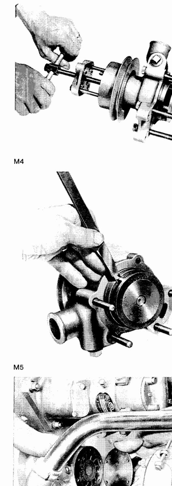

Downloaded from www.Manualslib.com manuals search engine

{160}------------------------------------------------

6 At this stage, the shaft should be turned by hand to ensure that no undue resistance to rotation exists.

7 Fit the driving pulley key and press on the pulley, making sure that no rearward axial movement of the shaft is incurred.

8 Where ceramic counter face seals are fitted, fit seal to shaft with counter face towards water seal and rubber bonded holder towards impellor face.

9 Press the impeller onto the shaft ensuring that a clearance of 0.012/0.032 in (0,30/0,81 mm) is maintained between the impeller vanes and the pump body (see Fig. M.5).

10 Refit the plain washer and pulley retaining self locking nut, tightening to a torque of 60 lbf ft (8.5 kgf m) - 84 Nm.

#### Sea Water Pump (open circuit)

#### **Description**

This type of pump consists basically of a shaft, gear driven from the rear of the timing case, which rotates within bearings in a water tight housing. The shaft transmits the drive to a neoprene impeller mounted on the other end. This impeller is offset slightly to the water chamber in which it rotates. The impeller blades, being flexible have a trailing action when the pump is turned in the normal direction of rotation. This flexibility permits the impeller to operate offset to the centre of the water chamber and has the action of drawing water through the suction (inlet) side of the pump in the large pockets between the impeller blades, when the impeller turns, the blades become more flexed and consequently the volume of the pockets between the blades decreases forcing the water now under pressure to escape as the blades uncover the outlet port on the pressure side of the pump.

The pump is self priming, but it is advisable to prime it when first commencing service or after the engine has been laid up for any considerable length of time. This is effected by disconnecting the pipe between the water pump and the heat exchanger at its upper end, filling it with water and then reconnecting it to the heat exchanger.

This pump should never be run in a dry condition and if the engine is to be withdrawn from service for any length of time, it will be necessary to pack the water pump with MARFAK 2HD grease. (Where this is not available, Glycerine may be used instead). This may be effected by removing the water pump end plate, giving access to the interior of the pump, which can then be packed with grease.

This treatment is usually effective for about three months, and should be repeated prior to recommencement of service if laid up for a longer period than this.

Note: Due to considerable suction created by this type of pump, it is essential that where rubber hose pipe is employed on this side of the pump any 'runs' of hose should be reinforced internally, likewise at junctions the pipe ends should almost butt together to prevent either partial or complete collapse with subsequent overheating.

#### To remove the pump

1 Uncouple the inlet and outlet water connections.

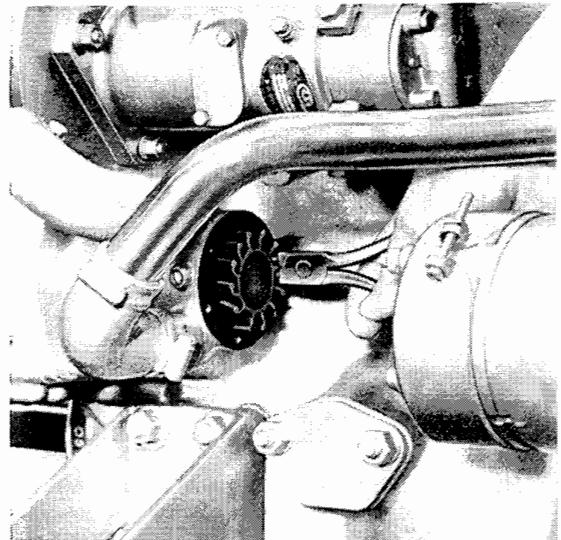

M7

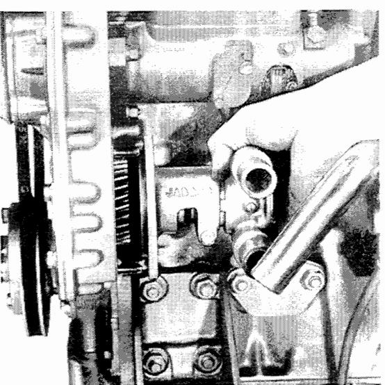

M8

2 Remove the nuts securing the pump to the back of the timing case.

3 Withdraw the pump complete with its driving gear from the studs. (See Fig. M.8). The pump may be replaced by reversing the above procedure.

#### Dismantling the pump

Remove the water pump and end cover plate. (See 1 Fig. M.6).

2 Remove the impeller by means of a pair of pliers. If it is tight on the shaft, loosen it by holding the impeller and twisting the shaft backwards and forwards. (See Fig. M.7).

3 Loosen the cam locking screw a few turns, then lightly tap screw downwards to loosen the cam in the water pump body.

- 4 Remove the cam locking screw and cam.
- Remove wear plate from inside of impeller housing. 5
- 6 Remove the circlip on the water pump shaft and

withdraw the spring loaded seal and seal seat.

4.236 Marine Supplement, November 1988.

{161}------------------------------------------------

#### **MARINE SUPPLEMENT - M5**

It may be advisable to apply a soapy solution to the pump shaft in order to ease the seal past the circlip groove.

Should difficulty be experienced in gripping the seal with the fingers then two lengths of stiff wire or welding rod (3/64 in to 1/16 in dia.) with hooked ends (1/16 in to 3/32 in deep) can be utilised to secure the seal, one opposite the other, whereupon the seal can then be withdrawn.

Alternatively, slacken off the clamping device which secures the two halves of the pump together (bearing housing and impeller housing) and then proceed to separate them, thus exerting pressure on the seal from behind.

7 Remove the gear from the drive end of the pump shaft by means of a suitable puller.

8 Remove the outer retaining circlip from the bearing housing.

9 Withdraw the impeller housing from the bearing housing, firstly slackening off the clamping device.

10 Withdraw the slinger from the pump shaft.

11 A suitable press may then be used to press out the water pump shaft together with the water pump bearings.

12 Remove the bearings from the water pump shaft by means of a press. To re-assemble the water pump, the reverse order should be adopted.

When replacing the cam fitted in the impeller housing, be certain to coat the entire top surface, rear face and securing setscrew hole with a suitable jointing compound.

Note that the cam will go into position one way only.

Care should be taken, when replacing the rubber impeller, that all the blades lie in the same direction relative to rotation of the pump i.e. blades trailing.

When re-assembling, ensure that the rubber impeller is coated with MARFAK 2HD grease.

Note: If appreciable wear or scoring has taken place

on the wear plate working face, it may be turned round so that the reverse side now becomes the working face. If this face in turn becomes worn, than a replacement wear plate should be fitted.

If appreciable wear or scoring has taken place on the end cover working face, it can be ground to restore flatness, providing that this operation is not carried out too many times. If a replacement end cover is fitted which does not carry the pump model number etc., then the original worn end cover should be fitted over the new part, utilising longer setscrews.

The thickness of the end cover joint is critical. If it is damaged, it is important that the correct replacement joint, or one of similar thickness be fitted.

### **Heat Exchanger and Oil Cooler** (earlier engines)

The unit basically comprises:

(a) An aluminium casing providing the header tank and a machined bore into which the heat exchanger tube stack is located. (See Fig. M.9).

(b) A smaller aluminium cylinder into which the oil cooler tube stack is located.

(c) Two tube stacks each comprising a multiplicity of small bore tubes running between two tube plates.

(d) Two sea water end covers.

(e) A tie rod which passes between the end covers and secures the assembly together.

#### **Dismantling**

When dismantling it is best to proceed in the order given below:

Remove the two sea water pipes from their respec-1 tive end covers.

- Disconnect the two oil pipes.  $\mathbf{2}$
- Remove the brass cap nut. 3
- 4 This end cover can now be removed.
- The other end cover complete with tie rod can now 5

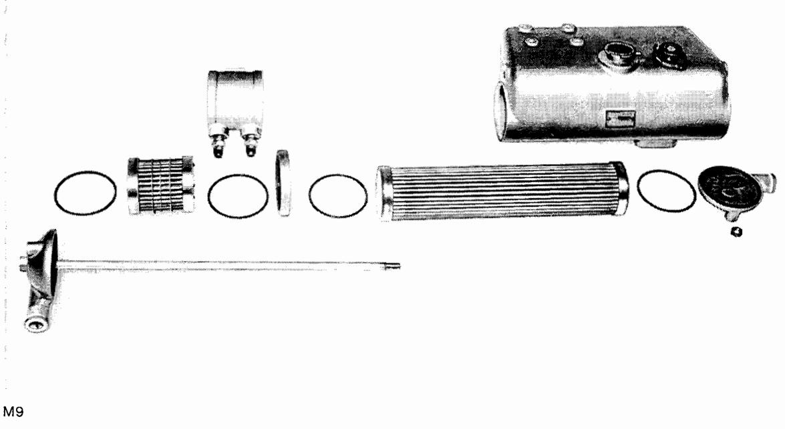

4.236 Marine Supplement, November 1988.

{162}------------------------------------------------

be withdrawn. Care should be taken to support the oil cooler and the spacing ring after the tie rod has been removed, as this will not be attached in any way to the main casing.

6 The "O" seals can now be removed from the end of the tube stacks allowing the latter to be withdrawn from their respective casings.

7 The main aluminium casing can now be removed from the engine if necessary; this will entail disconnection of the fresh water flanges.

#### **Cleaning**

If the tube stack appears badly fouled up, the best method of cleaning is to use non caustic crystalline solvents approved by the manufacturers.

Usually, the fresh water side, i.e., the outside of the tubes are relatively clean as these are on the closed water circuit. The inside of these tubes which have the raw water (sea water) passing through them are more likely to require cleaning.

If these are not badly scaled enough to require the solution treatment described above, they can be cleaned by pushing a length of  $\frac{1}{2}$  in (3.2 mm) diameter steel rod down the tubes to dislodge all foreign matter. It is important to note that when carrying out this exercise the rod should be pushed through the tubes in the opposite direction to that in which the water flows. Do not use undue force to push the rod through the tubes.

The other components of the assembly should be cleaned before re-assembly and as these have no hidden features, no special instructions are considered necessary.

#### Re-assembly

If the main aluminium casing has been removed from the engine it is best to refit this to the engine first before re-assembling the heat exchanger itself. although, if conditions are too cramped, it is quite possible to completely re-assemble the heat exchanger first, and then re-attach it to the engine.

 $\mathbf{f}$ Place the two tube stacks in their respective casing and fit the "O" seals over each end. It is advisable to renew these seals if they appear badly worn or deformed.

2 The complete oil cooler should now be slid along the tie rod, taking care that the tube stack is located in the end cover.

3 The spacing ring should be replaced in position and the tie rod complete with oil cooler assembly fitted to the main casing.

4 The other end cover can be replaced and the cap nut complete with its copper and asbestos washer refitted. This cap nut should be tightened to a torque not exceeding 25 lbf ft (3,5 kgf m) - 34 Nm.

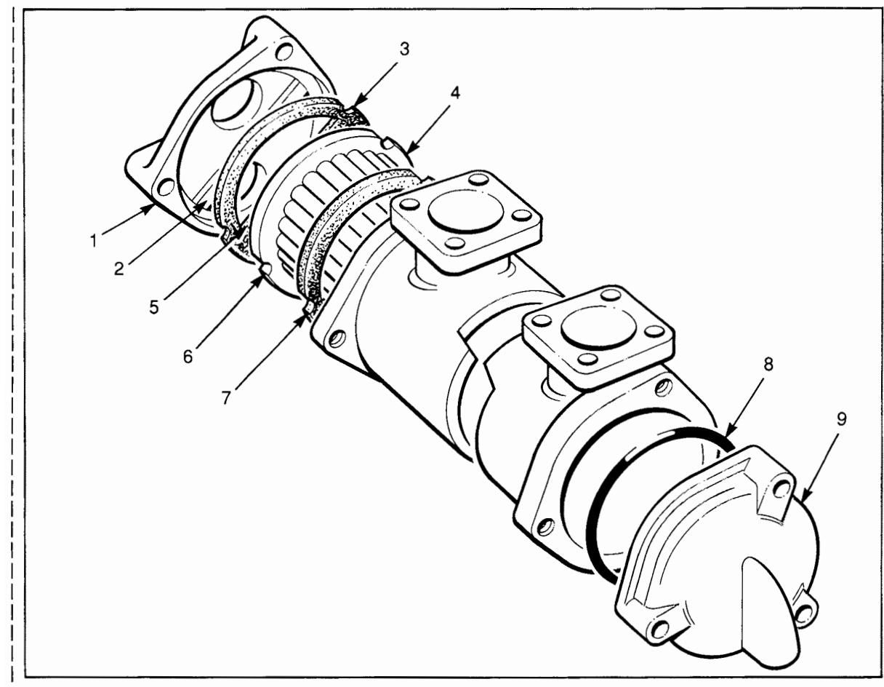

4.236 Marine Supplement, January 1993.

{163}------------------------------------------------

#### **MARINE SUPPLEMENT - M7**

#### **Heat Exchanger and Oil Cooler** (lowline engines)

With lowline engines, the heat exchanger and oil cooler are two separate items both mounted on the starboard side of the engine. The oil cooler and spinon lubricating oil filter are an integral unit. (see Fig.  $M.11$ ).

#### | To remove the heat exchanger

1 1 Remove the air filter from the induction manifold.

2 Remove the setscrews from the flange of the

coolant connection to the rear of the exhaust manifold. | 3 Remove the setscrews from the flange at the header I tank end of the exhaust manifold.

4 Remove the nuts which retain the exhaust manifold  $\mathbf{I}$ to the cylinder head.  $\mathbf{I}$ 

5 Remove the raw water connections to the exhaust  $\mathbf{I}$ manifold and to the exhaust bend.

6 Remove the exhaust bend.

 $\mathbf{I}$ 

7 Remove the exhaust manifold from the cylinder head.

| 8 Remove the fasteners from the flange of the raw water connection at the front of the heat exchanger.

9 Remove the setscrews from the two straps which retain the heat exchanger to the cylinder block and remove the heat exchanger.

#### To dismantle the heat exchanger

1 Release the setscrews from the rear end cap and remove the cap (9) from the end of the heat exchanger

I body and the "O" ring (8) from the end of the tube stack.

2 Release the setscrews from the front end cap and remove the cap (1) complete with joint (3) from the end of the heat exchanger body.

3 Push the tube stack (4) through the front end of the heat exchanger body.

4 Remove the joint (7) from the flange at the front of the tube stack. If the tube stack appears to be corroded, see "Cleaning" on page M6.

#### To assemble the heat exchanger

ł

1 Fit a new joint (7) behind the flange (4) at the front of the tube stack. Ensure the correct alignment of the three cut outs (3) in the joint with the three cut outs (6) in the flange of the tube stack.

2 Push the tube stack into the front end of the heat exchanger body. Fit a new joint (5) in the recess (2) of the front end cover. Ensure the correct alignment of the three cut outs in the joint with the setscrew holes in the end can

3 Fit the front end cap and tighten the setscrews gradually and evenly.

4 Lightly lubricate a new "O" ring with clean engine lubricating oil and fit the "O" ring (8) over the end of the tube stack. Ensure that the "O" ring is not twisted.

5 Fit the rear end cap and tighten the setscrews gradually and evenly.

#### To fit the heat exchanger

1 Put the heat exchanger into position against the cylinder block and tighten the coolant connections.

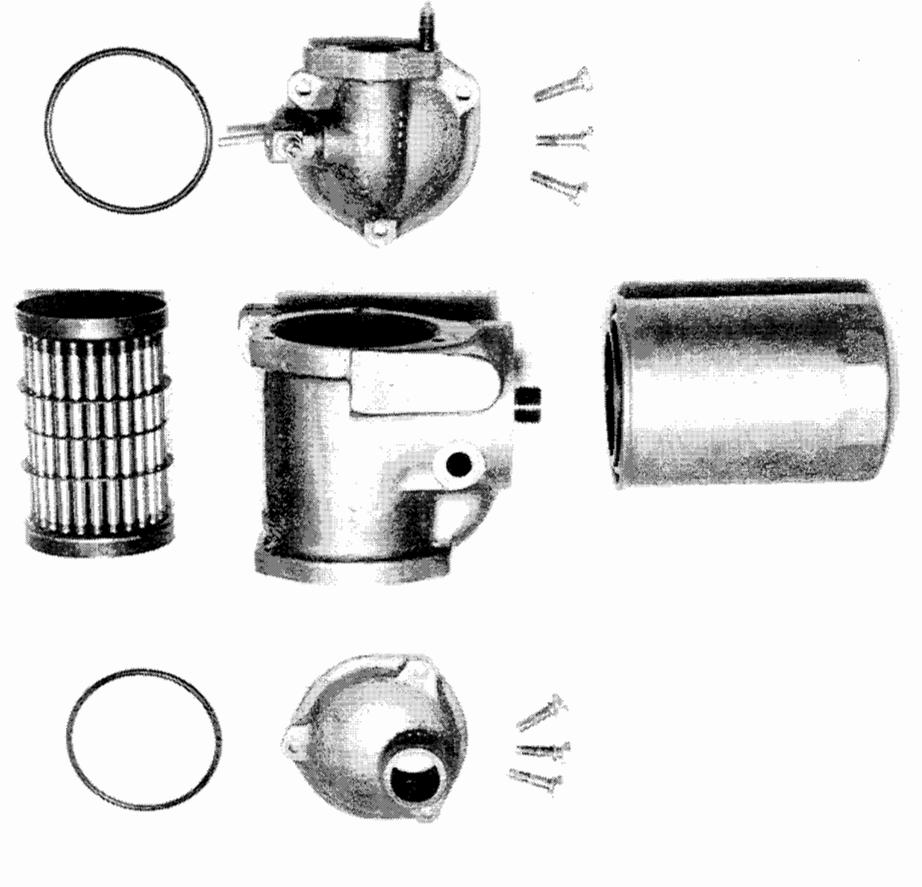

#### M11

4.236 Marine Supplement, January 1993.

{164}------------------------------------------------

2 Loosely assemble the straps which retain the heat exchanger to the cylinder block.

3 Using a new joint, fit the raw water connection to the front cap of the heat exchanger and tighten the fasteners.

4 Tighten fully the heat exchanger retaining strap setscrews.

5 Fit the exhaust manifold to the cylinder head and tighten the nuts.

6 Using a new joint, fit the exhaust manifold connection to the coolant header tank.

7 Fit the coolant connection to the rear of the exhaust manifold.

8 Using a new joint, fit the exhaust bend to the exhaust manifold and tighten the setscrews.

9 Fit the raw water connection to the exhaust bend.

10 Fit the air filter to the induction manifold.

#### To remove the oil cooler

1 Remove the inlet and outlet pipes from the oil cooler.

2 Release the setscrew which holds the oil cooler body to the cylinder block.

#### To dismantle the oil cooler

ł

1 Release the setscrews and remove the end covers and the two "O" rings from the oil cooler body (see Fig.  $M11$ ).

2 Push the tube stack out of the oil cooler body. If the tube stack appears to be corroded, see "Cleaning" on page M6.

#### To assemble the oil cooler

1 Fit the tube stack into the oil cooler body.

2 Fit new "O" rings over the end covers and secure the end covers to the oil cooler body with the setscrews

3. Tighten the setscrews.

#### To fit the oil cooler

1 Fit the setsc:ew through the oil cooler body to the cylinder block.

2 Tighten the setscrew.

3 Fit the inlet and outlet pipes.

#### **Gearbox Oil Cooler**

#### To remove

Uncouple inlet and outlet water connections to the  $\blacksquare$ oil cooler.

2 Remove inlet and outlet oil pipes.

Remove oil cooler by unscrewing the two nuts on З the ends of the oil cooler securing clamp.

Replacement of the oil cooler is effected by reversing the above procedure.

#### **Dismantling**

1 Remove the oil cooler end covers by unscrewing the securing setbolts. (See Fig. M.12).

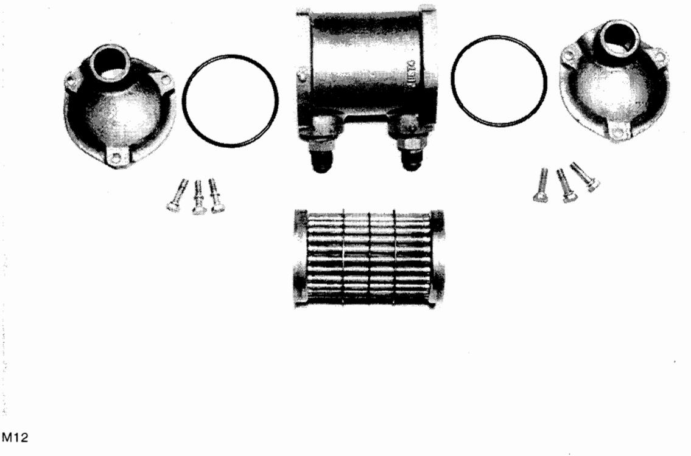

{165}------------------------------------------------

#### **MARINE SUPPLEMENT - M9**

2 Remove the rubber "O" ring seals at each end of the cooler.

3 Drive tube stack out of oil cooler casing.

#### Cleaning

Under normal circumstances, the gearbox oil cooler will require little attention, providing the sea water strainer is efficient and is kept clean.

After a lengthy period of service, it may be necessary to clean the tube stack and this may be effected in a similar manner to that described for the combined heat exchanger and lubricating oil cooler.

#### Re-assembly

1 Place the tube stack in its casing and fit the "O" ring seals over each end cover. It is advisable to renew these seals if they appear to be badly worn or deformed.

2 The end covers and securing setscrews should now be replaced.

3 Tighten the securing setscrews.

#### **Thermostat**

#### To remove (earlier engines)

1 Remove all water and lubricating oil connections to heat exchanger assembly.

2 Unscrew the four setscrews securing the heat exchanger assembly to the thermostat housing, thereby disclosing the thermostat.

3 Remove thermostat - see Fig. M.13.

#### To remove (lowline engines)

Remove water connection between header tank 1 and exhaust manifold. To effect this, it is necessary to slacken both hose clips and slide the hose towards the exhaust manifold. Removal of the two setscrews securing the water pipe to the header tank will then permit its removal.

2 Remove setscrews securing top cover of thermostat housing and remove cover.

3 Remove the thermostat - see Fig. M.14.

#### **Testing the thermostat**

If it is suspected that the thermostat is not operating correctly it should be tested in the following manner:-

1 Immerse the thermostat in a suitable container of water and gradually heat. Check the water temperature at frequent intervals with an accurate thermometer. The valve should commence to open at the temperature stamped on the top face of the thermostat adjacent to the valve seat.

2 If the thermostat does not function properly, no adjustment is possible. Replace with a new unit.

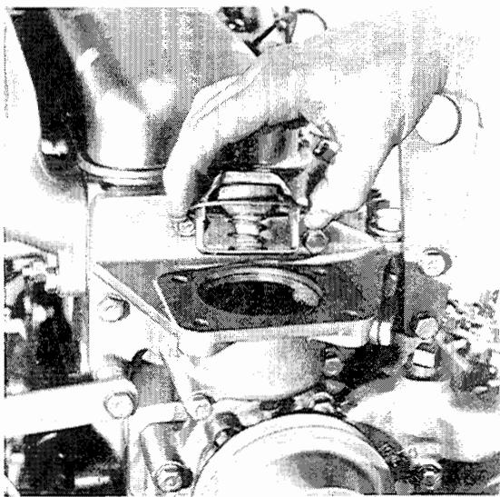

M13

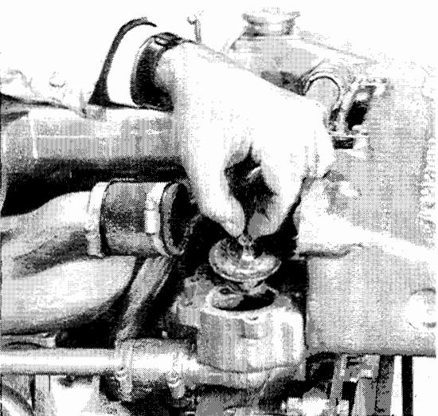

M14

4.236 Marine Supplement, January 1993.

{166}------------------------------------------------

### **Gearbox, Flywheel and Flywheel Housing**

р

#### Gearbox

The gearbox fitted to the 4.236 Marine engine is the earlier Borg Warner 71 CR or the later 10-17 type, hydraulically operated, direct drive type incorporating a reverse gear.

A Borg Warner 71 CR or the later 10-17 type gearbox with an epicyclic reduction gear can be supplied with the following ratios:- 1.523:1, 1.91:1, 2.1:1, 2.57:1, or 2.91:1. The output shaft of the gearbox or reduction gear is on the same centreline as the crankshaft.

For standard gearboxes and reduction gear, a left handed propeller is required, except with the 1.91:1 reduction gear, which requires a right handed propeller. The 2.1:1 and 1.91:1 reduction gears can be used together in twin engined installations to give left and right hand propeller rotation.

The gearbox operating oil pressure should be 120/140 lbf/in2 (8,4/9,8 kgf/cm2) - 827/965 kN/m2.

Important Note: When filling the Borg Warner gearbox as fitted to the 4.236 Marine engine, Automatic Transmission Fluid Type 'A' must be used.

A Newage gearbox, type PRM 301 is available as an option for the 4HD76 engine.

Reduction ratios are: 1.09:1, 1.46:1, 1.94:1, 2.57:1 and  $2.90:1.$ 

The gearbox operating oil pressure should be 260 lbf/ in2 (18,3 kgf/cm2) - 1790 kN/m2.

Other types of approved marine transmissions can I also be fitted.

The gearbox should be filled to the full mark on the dipstick and the unit turned over at low speed by idling the engine for a short period in order to fill all circuits including the cooler and cooler piping.

The oil level should then be checked immediately after shutting off the engine and sufficient oil added to bring the level to the full mark again.

When checking the gearbox oil level, the dipstick should not be screwed down in order to obtain the correct reading.

#### To remove the gearbox

1 Remove lubricating oil pipes to and from gearbox oil cooler.

2 Remove water connections to and from gearbox oil cooler.

3 Remove gearbox oil cooler.

4 Uncouple propellor shaft from gearbox output shaft and move clear of box.

5 Remove nuts securing gearbox adaptor plate.

6 The gearbox can then be removed by withdrawing

it to the rear. 7 Remove nuts securing gearbox adaptor plate to flywheel housing.

8 Remove adaptor plate.

9 The driving plate (see Fig. P.1) connecting the gearbox to the flywheel can now be removed. It should be noted that if either flywheel or flywheel housing is removed, then it must be accurately aligned on replacement in accordance with the instructions on

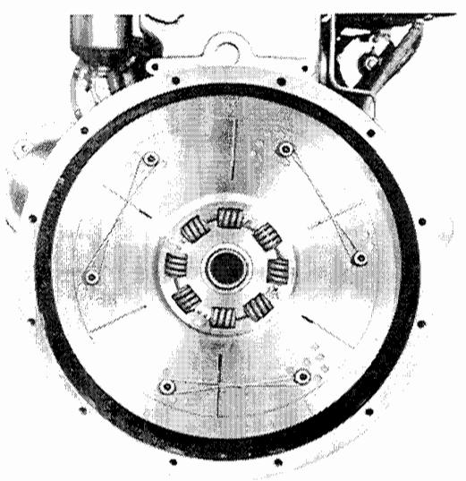

P1

Pages P.1 and P.2 of the 4.236 Series Workshop Manual.

#### To refit the gearbox

Replacement of the gearbox is the reverse procedure to removal but the splines on the gearbox input shaft should be lubricated with anti-fretting grease before the unit is replaced.

{167}------------------------------------------------

Downloaded from [www.Manualslib.com](http://www.manualslib.com/) manuals search engine