{0}------------------------------------------------

# **ENGINE SECTION 2**

This service manual has been prepared to provide SUBARU service personnel with the necessary information and data for the correct maintenance and repair of SUBARU vehicles.

This manual includes the procedures for maintenance, disassembling, reassembling, inspection and adjustment of components and diagnostics for guidance of experienced mechanics.

Please peruse and utilize this manual fully to ensure complete repair work for satisfying our customers by keeping their vehicle in optimum condition. When replacement of parts during repair work is needed, be sure to use SUBARU genuine parts.

| FUEL INJECTION (FUEL SYSTEMS)                       | FU(H4DOTC)       |
|-----------------------------------------------------|------------------|
| EMISSION CONTROL (AUX. EMISSION CONTROL DEVICES) | EC(H4DOTC)       |
| INTAKE (INDUCTION)                                  | IN(H4DOTC)       |
| MECHANICAL                                          | ME(H4DOTC)       |
| EXHAUST                                             | EX(H4DOTC)       |
| COOLING                                             | CO(H4DOTC)       |
| LUBRICATION                                         | LU(H4DOTC)       |
| SPEED CONTROL SYSTEMS                               | SP(H4DOTC)       |
| IGNITION                                            | IG(H4DOTC)       |
| STARTING/CHARGING SYSTEMS                           | SC(H4DOTC)       |
| ENGINE (DIAGNOSTICS)                                | EN(H4DOTC)(diag) |

All information, illustration and specifications contained in this manual are based on the latest product information available at the time of publication approval.

**FUJI HEAVY INDUSTRIES LTD. G1870GE3**

{1}------------------------------------------------

|     |                               | Page |
|-----|-------------------------------|------|
| 1.  | General Description 2         |      |
| 2.  | Compression 34                |      |
| 3.  | Idle Speed 35                 |      |
| 4.  | Ignition Timing36             |      |
| 5.  | Intake Manifold Vacuum37      |      |
| 6.  | Engine Oil Pressure 38        |      |
| 7.  | Fuel Pressure39               |      |
| 8.  | Valve Clearance40             |      |
| 9.  | Engine Assembly 44            |      |
| 10. | Engine Mounting 52            |      |
| 11. | Preparation for Overhaul53    |      |
| 12. | V-belt54                      |      |
| 13. | Crankshaft Pulley 56          |      |
| 14. | Timing Belt Cover57           |      |
| 15. | Timing Belt Assembly58        |      |
| 16. | Camshaft Sprocket66           |      |
| 17. | Crankshaft Sprocket68         |      |
| 18. | Camshaft69                    |      |
| 19. | Cylinder Head Assembly78      |      |
| 20. | Cylinder Block 85             |      |
| 21. | Intake and Exhaust Valve 105  |      |
| 22. | Piston 106                    |      |
| 23. | Connecting Rod 107            |      |
| 24. | Crankshaft108                 |      |
| 25. | Engine Trouble in General 109 |      |
| 26. | Engine Noise114               |      |

{2}------------------------------------------------

# **13.Crankshaft Pulley**

# **A: REMOVAL**

1) Remove the V-belt. <Ref. to ME(H4DOTC)-54, REMOVAL, V-belt.>

2) Remove the crankshaft pulley bolt. To lock the crankshaft, use ST.

ST 499977400 CRANKSHAFT PULLEY WRENCH (Except for STi model)

ST 499977100 CRANKSHAFT PULLEY WRENCH (STi model)

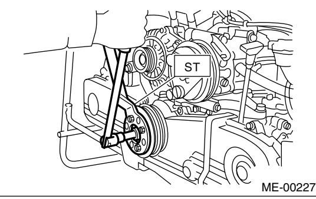

3) Remove the crankshaft pulley.

# **B: INSTALLATION**

1) Install the crankshaft pulley.

2) Install the pulley bolt.

To lock the crankshaft, use ST.

- ST 499977400 CRANKSHAFT PULLEY WRENCH (Except for STi model)
- ST 499977100 CRANKSHAFT PULLEY WRENCH (STi model)

(1) Clean the crankshaft pulley thread using an air gun.

(2) Apply engine oil to the crankshaft pulley bolt seat and thread.

(3) Tighten the bolts temporarily with tightening torque of 44 N·m (4.5 kgf-m, 33 ft-lb).

(4) Tighten the crankshaft pulley bolts.

# *Tightening torque:*

*127 N·m (13 kgf-m, 94.0 ft-lb)*

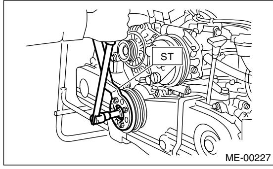

3) Confirm that the tightening angle of crankshaft pulley bolt is 45 degrees or more. If the tightening angle of crankshaft pulley bolt is less than 45 degrees, conduct the following procedures.

# **CAUTION:**

**If the tightening angle of crankshaft pulley bolt is less than 45 degrees, the bolt should be damaged. In this case, the bolt must be replaced.**

(1) Replace the crankshaft pulley bolts and clean them.

## *Crankshaft pulley bolt:*

*12369AA011 (Except for STi model) 12369AA030 (STi model)*

(2) Clean the crankshaft thread using an air gun.

(3) Tighten the bolts temporarily with tightening torque of 44 N·m (4.5 kgf-m, 33 ft-lb).

(4) Tighten the crankshaft pulley bolts keeping them in an angle between 45 degrees and 60 degrees.

### NOTE:

Conduct the tightening procedures by confirming the turning angle of crankshaft pulley bolt referring to the gauge indicated on timing belt cover.

4) Install the A/C belt tensioner.

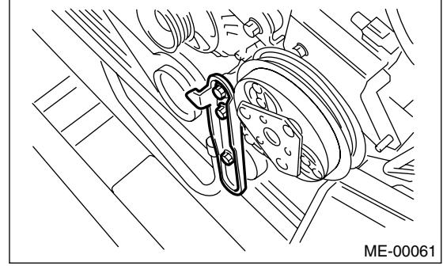

5) Install the V-belt. <Ref. to ME(H4DOTC)-54, IN-STALLATION, V-belt.>

# **C: INSPECTION**

1) Make sure the V-belt is not worn or otherwise damaged.

2) Check the tension of the belt. <Ref. to ME(H4DOTC)-55, INSPECTION, V-belt.>

{3}------------------------------------------------

# **14.Timing Belt Cover**

# **A: REMOVAL**

1) Remove the V-belt. <Ref. to ME(H4DOTC)-54, REMOVAL, V-belt.>

2) Remove the crankshaft pulley. [<Ref. to](#page-2-1) [ME\(H4DOTC\)-56, REMOVAL, Crankshaft Pulley.>](#page-2-1)

- 3) Remove the timing belt cover (LH) (A).
- 4) Remove the timing belt cover (RH) (B).
- 5) Remove the front timing belt cover (C).

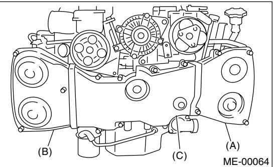

# **B: INSTALLATION**

1) Install the front timing belt cover (C).

#### *Tightening torque: 5 N·m (0.5 kgf-m, 3.6 ft-lb)*

2) Install the timing belt cover (RH) (B).

### *Tightening torque: 5 N·m (0.5 kgf-m, 3.6 ft-lb)*

3) Install the timing belt cover (LH) (A).

*Tightening torque: 5 N·m (0.5 kgf-m, 3.6 ft-lb)*

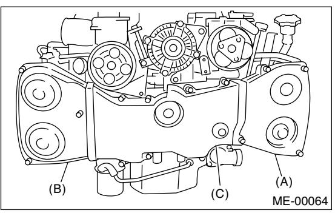

4) Install the crankshaft pulley. [<Ref. to](#page-2-2) [ME\(H4DOTC\)-56, INSTALLATION, Crankshaft](#page-2-2) [Pulley.>](#page-2-2)

5) Install the V-belt. <Ref. to ME(H4DOTC)-54, IN-STALLATION, V-belt.>

# **C: INSPECTION**

Make sure the cover is not damaged.

{4}------------------------------------------------

# **15.Timing Belt Assembly A: REMOVAL**

# **1. TIMING BELT**

1) Remove the V-belt. <Ref. to ME(H4DOTC)-54, REMOVAL, V-belt.>

2) Remove the crankshaft pulley. [<Ref. to](#page-2-1) [ME\(H4DOTC\)-56, REMOVAL, Crankshaft Pulley.>](#page-2-1) 3) Remove the timing belt cover. [<Ref. to](#page-3-1) [ME\(H4DOTC\)-57, REMOVAL, Timing Belt Cover.>](#page-3-1)

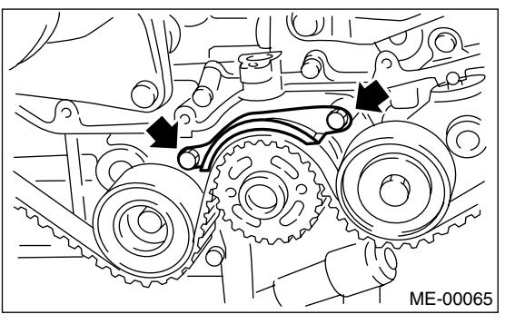

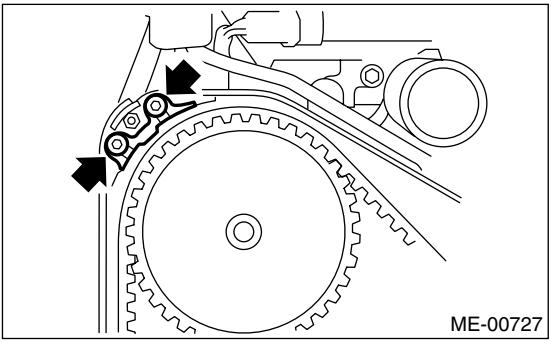

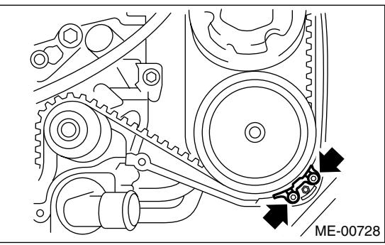

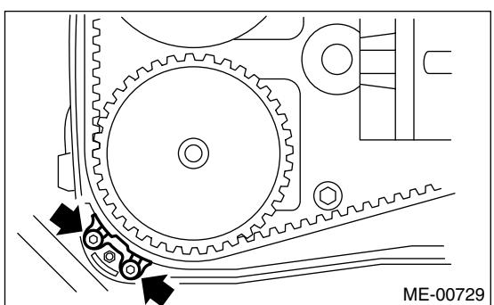

4) Remove the timing belt guides. (MT model) 5) If the alignment mark and/or arrow mark (which indicates rotation direction) on timing belt fade away, put new marks before removing the timing belt as follows:

(1) Turn the crankshaft using ST, and align the alignment marks on crankshaft sprocket, intake camshaft sprocket (LH), exhaust camshaft sprocket (LH), intake camshaft sprocket (RH) and exhaust camshaft sprocket (RH) with notches of timing belt cover and cylinder block.

ST 499987500 CRANKSHAFT SOCKET

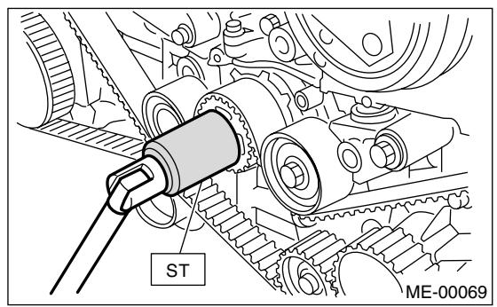

{5}------------------------------------------------

(2) Using white paint, put alignment and/or arrow marks on the timing belts in relation to the sprockets.

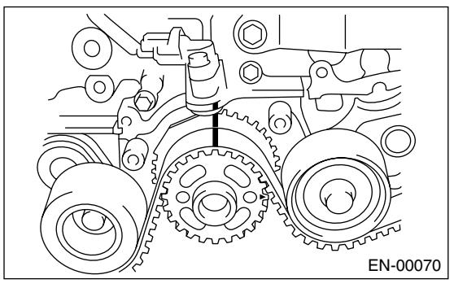

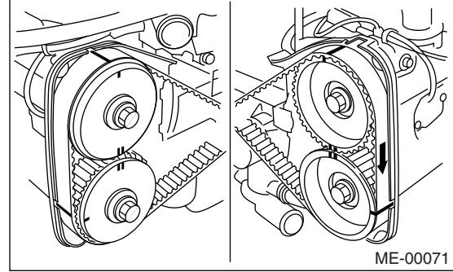

*Z1: 54.5 tooth length Z2: 51 tooth length Z3: 28 tooth length*

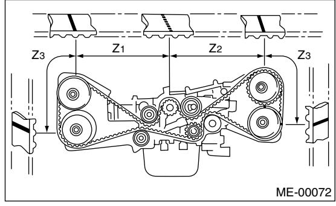

6) Remove the belt idler (A).

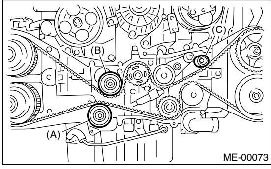

7) Remove the timing belt.

**CAUTION:**

**After the timing belt has been removed, never rotate the intake and exhaust, camshaft sprocket. If the camshaft sprocket is rotated, the intake and exhaust valve heads strike together and valve stems are bent.**

# **2. BELT IDLER AND AUTOMATIC BELT TENSION ADJUSTER ASSEMBLY**

1) Remove the belt idler (B) and (C).

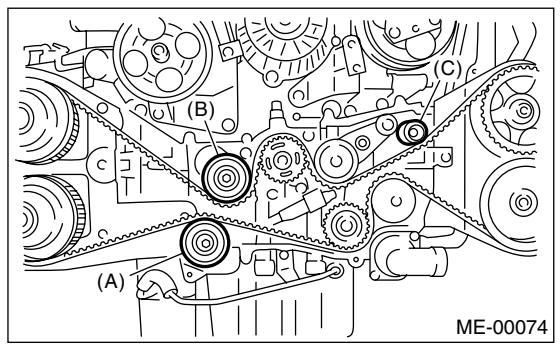

2) Remove the belt idler No. 2.

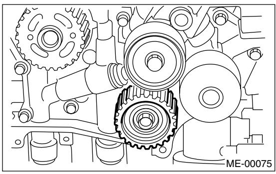

3) Remove the automatic belt tension adjuster assembly.

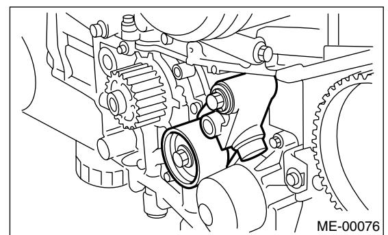

{6}------------------------------------------------

# **B: INSTALLATION**

### **1. AUTOMATIC BELT TENSION ADJUST-ER ASSEMBLY AND BELT IDLER**

1) Preparation for installation of automatic belt tension adjuster assembly:

NOTE:

• Always use a vertical type pressing tool to move the adjuster rod down.

- Do not use a lateral type vise.
- Push the adjuster rod vertically.

• Be sure to slowly move the adjuster rod down applying a pressure of 294 N (30 kgf, 66 lb).

• Press-in the push adjuster rod gradually taking more than 3 minutes.

• Do not allow press pressure to exceed 9,807 N (1,000 kgf, 2,205 lb).

• Press the adjuster rod as far as the end surface of cylinder. Do not press the adjuster rod into the cylinder. Doing so may damage the cylinder.

• Do not release the press pressure until stopper pin is completely inserted.

(1) Attach the automatic belt tension adjuster assembly to the vertical pressing tool.

(2) Slowly move the adjuster rod down with a pressure of 294 N (30 kgf, 66 lb) until the adjuster rod is aligned with the stopper pin hole in the cylinder.

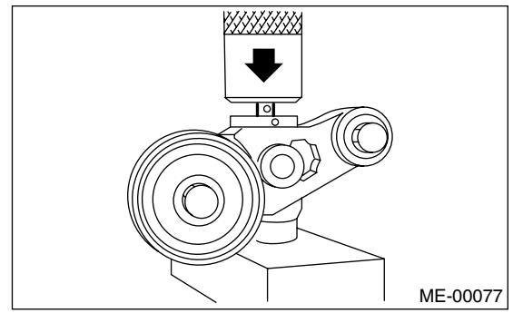

(3) With a 2 mm (0.08 in) dia. stopper pin or a 2 mm (0.08 in) (nominal) dia. hex bar wrench inserted into the stopper pin hole in the cylinder, secure the adjuster rod.

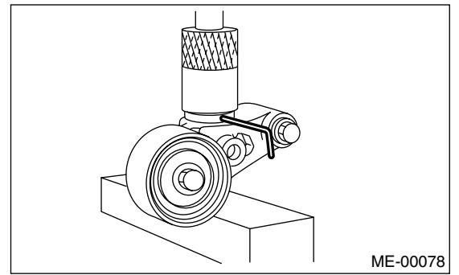

2) Install the automatic belt tension adjuster assembly.

### *Tightening torque: 39 N·m (4.0 kgf-m, 28.9 ft-lb)*

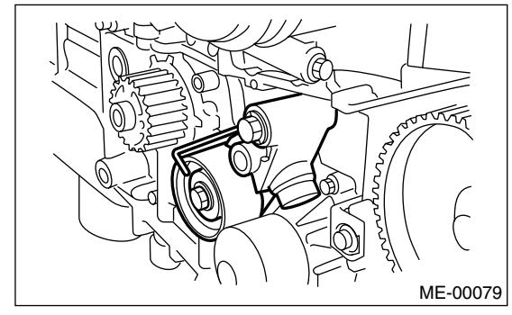

3) Install the belt idler No. 2.

*Tightening torque: 39 N·m (4.0 kgf-m, 28.9 ft-lb)*

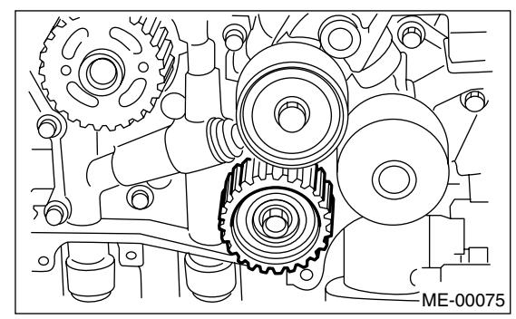

4) Install the belt idler.

*Tightening torque: 39 N·m (4.0 kgf-m, 28.9 ft-lb)*

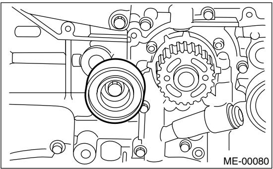

# **2. TIMING BELT**

1) Preparation for installation of automatic belt tension adjuster assembly. [<Ref. to ME\(H4DOTC\)-60,](#page-6-0) [AUTOMATIC BELT TENSION ADJUSTER AS-](#page-6-0)SEMBLY AND BELT IDLER, Timing Belt Assem[bly.>](#page-6-0)

{7}------------------------------------------------

2) Crankshaft and camshaft sprocket alignment. (1) Align mark (A) on the crankshaft sprocket with mark on the oil pump cover at cylinder block.

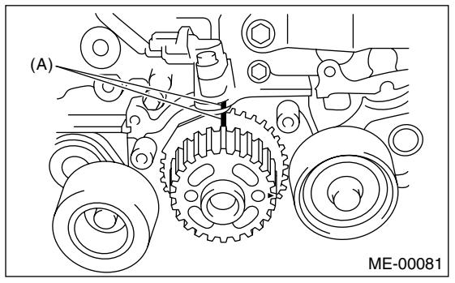

(2) Align single line mark (A) on the exhaust camshaft sprocket (RH) with notch (B) on timing belt cover.

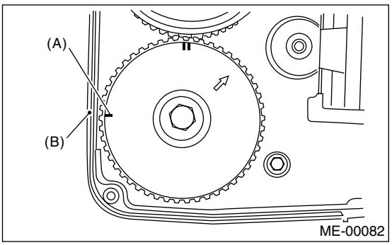

(3) Align single line mark (A) on the intake camshaft sprocket (RH) with notch (B) on timing belt cover.

(Make sure double lines (C) on intake camshaft and exhaust camshaft sprockets are aligned.)

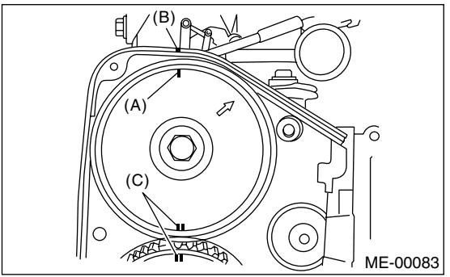

(4) Align single line mark (A) on exhaust camshaft sprocket (LH) with notch (B) on timing belt cover by turning the sprocket counterclockwise (as viewed from front of engine).

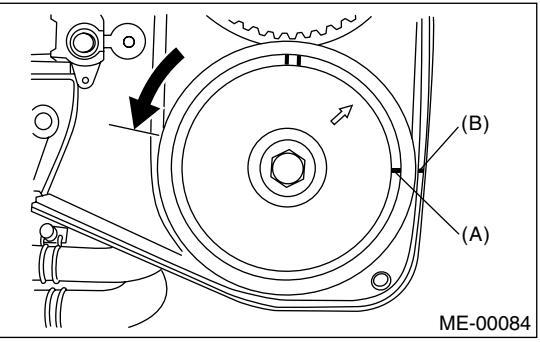

(5) Align the single line mark (A) on intake camshaft sprocket (LH) with notch (B) on timing belt cover by turning the sprocket clockwise (as viewed from front of engine).

Ensure the double lines (C) on intake and exhaust camshaft sprockets are aligned.

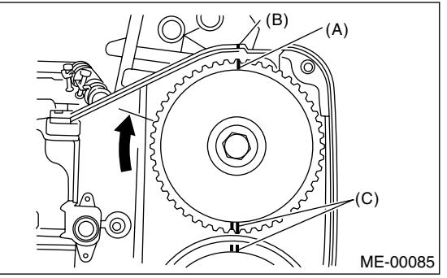

(6) Ensure the camshaft and crankshaft sprockets are positioned properly.

{8}------------------------------------------------

#### **CAUTION:**

**• Intake and exhaust camshafts for this DOHC engine can be independently rotated with the timing belts removed. As can be seen from the figure, if the intake and exhaust valves are lifted simultaneously, their heads will interfere with each other, resulting in bent valves.**

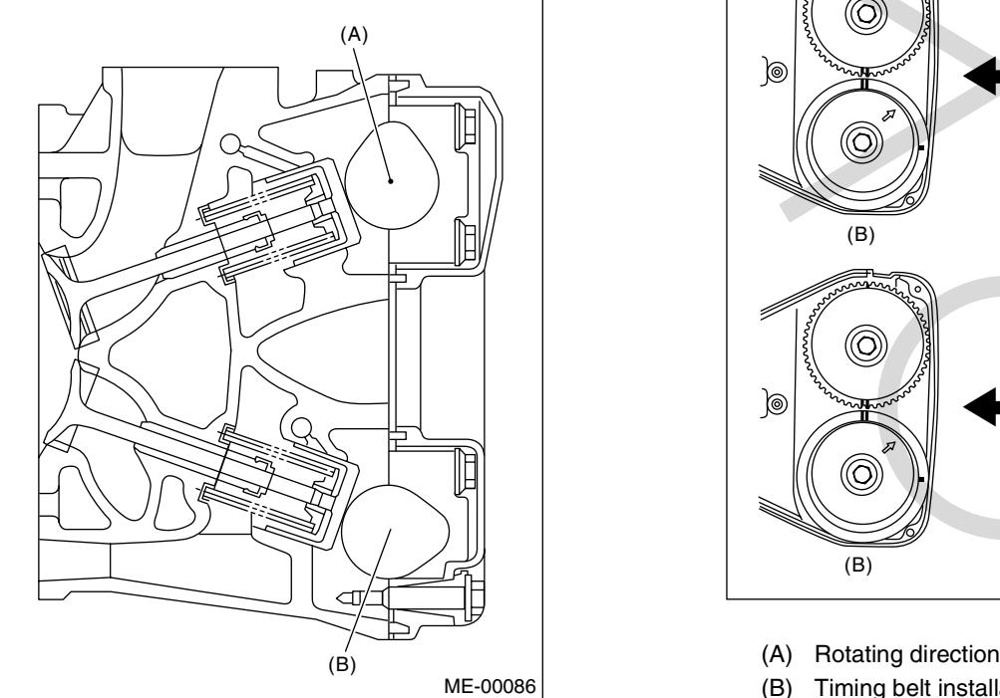

- 
- (B) Exhaust camshaft

**• When the timing belts are not installed, four camshafts are held at the "zero-lift" position, where all cams on camshafts do not push the intake and exhaust valves down. (Under this condition, all valves remain unlifted.)**

**• When the camshafts are rotated to install the timing belts, #2 intake and #4 exhaust cam of camshafts (LH) are held to push their corresponding valves down. (Under this condition, these valves are held lifted.) Camshafts (RH) are held so that their cams do not push valves down.**

**• Camshafts (LH) must be rotated from the "zero-lift" position to the position where the timing belt is to be installed at as small an angle as possible, in order to prevent mutual interference of intake and exhaust valve heads.**

**• Do not allow the camshafts to rotate in the direction shown in the figure as this causes both intake and exhaust valves to lift simultaneously, resulting in interference with their heads.**

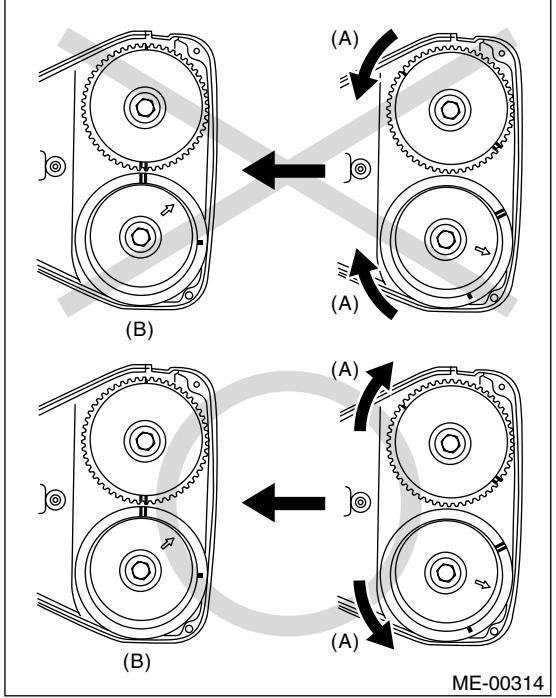

- 
- (B) Timing belt installation position
- 3) Installation of timing belt: (A) Intake camshaft

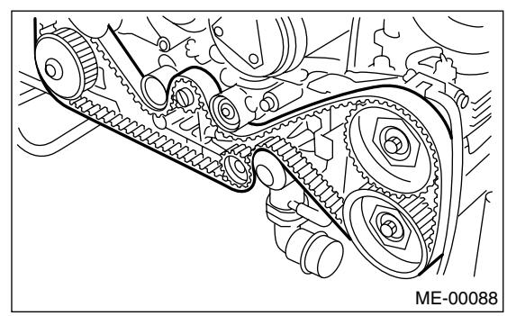

{9}------------------------------------------------

Align the alignment mark on timing belt with marks on sprockets in alphabetical order shown in the figure. While aligning marks, position the timing belt properly.

### **CAUTION:**

- **• Disengagement of more than three timing belt teeth may result in interference between the valve and piston.**
- **• Ensure the belt's rotating direction is correct.**

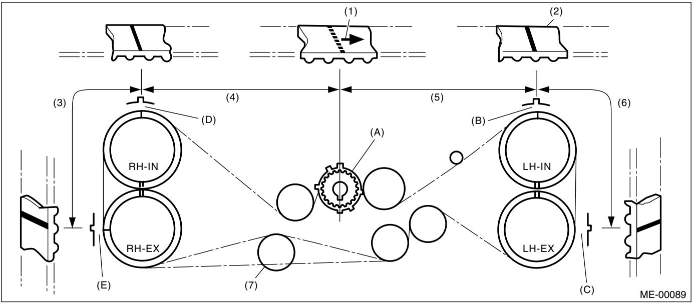

- 
- (1) Arrow mark (4) 54.5 tooth length (7) Install it in the end
- 4) Install the belt idlers.

### *Tightening torque: 39 N·m (4.0 kgf-m, 28.9 ft-lb)*

NOTE:

Make sure that the marks on the timing belt and sprockets are aligned.

(2) Timing belt (5) 51 tooth length (3) 28 tooth length (6) 28 tooth length

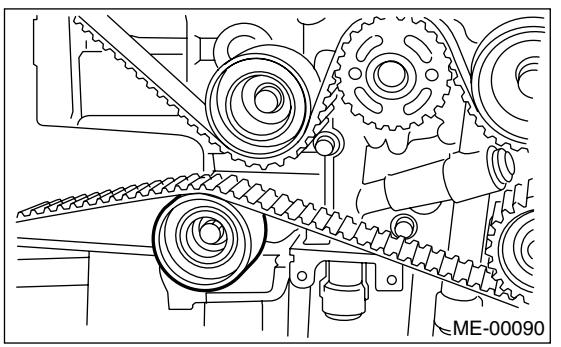

5) After ensuring that the marks on the timing belt and sprockets are aligned, remove the stopper pin from tensioner adjuster.

{10}------------------------------------------------

# **Timing Belt Assembly**

- 6) Install the timing belt guide. (MT model)
	- (1) Temporarily tighten the bolts.
	- (2) Check and adjust the clearance between timing belt and timing belt guide.

# *Clearance:*

*1.0*±*0.5 mm (0.039*±*0.020 in)*

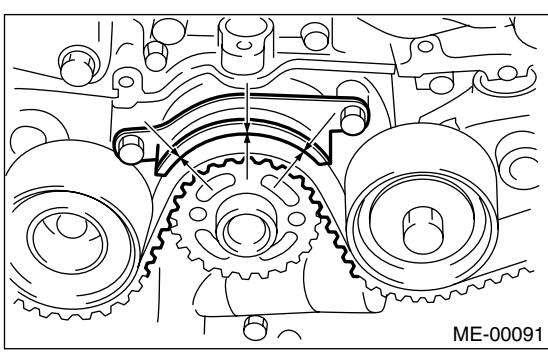

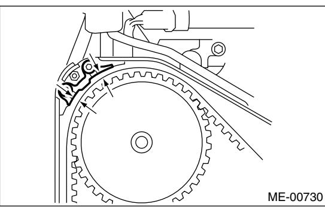

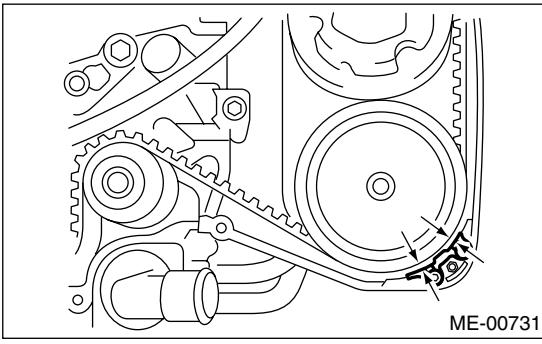

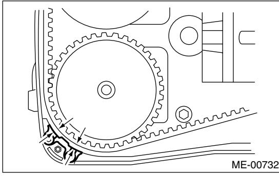

- (3) Tighten the bolts.
- *Tightening torque: 10 N·m (1.0 kgf-m, 7.2 ft-lb)*

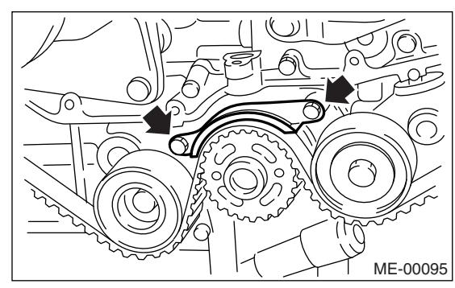

*Tightening torque: 6.4 N·m (0.65 kgf-m, 4.7 ft-lb)*

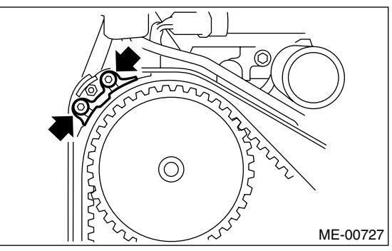

*Tightening torque: 6.4 N·m (0.65 kgf-m, 4.7 ft-lb)*

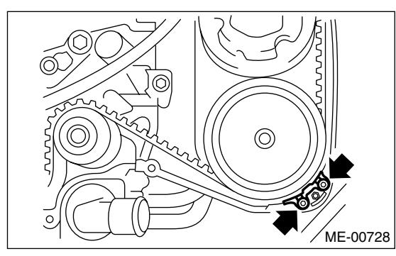

*Tightening torque: 6.4 N·m (0.65 kgf-m, 4.7 ft-lb)*

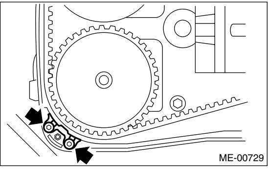

{11}------------------------------------------------

7) Install the timing belt cover. [<Ref. to](#page-3-2) [ME\(H4DOTC\)-57, INSTALLATION, Timing Belt](#page-3-2) [Cover.>](#page-3-2)

8) Install the crankshaft pulley. [<Ref. to](#page-2-2) [ME\(H4DOTC\)-56, INSTALLATION, Crankshaft](#page-2-2) [Pulley.>](#page-2-2)

9) Install the V-belt. <Ref. to ME(H4DOTC)-54, IN-STALLATION, V-belt.>

# **C: INSPECTION**

# **1. TIMING BELT**

1) Check the timing belt teeth for breaks, cracks, and wear. If any fault is found, replace the belt.

2) Check the condition of back side of belt; if any crack is found, replace the belt.

NOTE:

• Be careful not to let oil, grease or coolant contact the belt. Remove quickly and thoroughly if this happens.

• Do not bend the belt sharply.

# *Bending radius: h*

### *60 mm (2.36 in) or more*

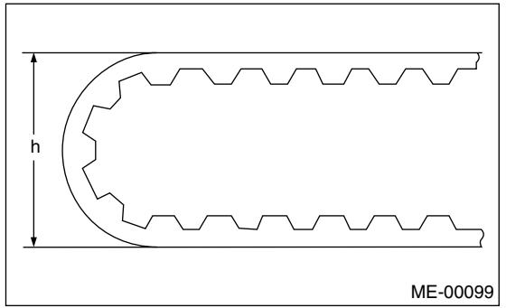

# **2. AUTOMATIC BELT TENSION ADJUST-ER**

1) Visually check the oil seals for leaks, and rod ends for abnormal wear or scratches. If necessary, replace the automatic belt tension adjuster assembly.

NOTE:

Slight traces of oil at rod's oil seal does not indicate a problem.

2) Check that the adjuster rod does not move when a pressure of 294 N (30 kgf, 66 lb) is applied to it. This is to check adjuster rod stiffness.

3) If the adjuster rod is not stiff and moves freely when applying 294 N (30 kgf, 66 lb), check it using the following procedures:

(1) Slowly press the adjuster rod down to the end surface of the cylinder. Repeat this motion 2 or 3 times.

(2) With the adjuster rod moved all the way up, apply a pressure of 294 N (30 kgf, 66 lb) to it. Check the adjuster rod stiffness.

(3) If the adjuster rod is not stiff and moves down, replace the automatic belt tension adjuster assembly with a new one.

# NOTE:

• Always use a vertical type pressing tool to move the adjuster rod down.

- Do not use a lateral type vise.
- Push the adjuster rod vertically.

• Press-in the push adjuster rod gradually taking more than 3 minutes.

• Do not allow press pressure to exceed 9,807 N (1,000 kgf, 2,205 lb).

• Press the adjuster rod as far as the end surface of the cylinder. Do not press the adjuster rod into the cylinder. Doing so may damage the cylinder.

4) Measure the extension of rod beyond the body. If it is not within specifications, replace with a new one.

#### *Rod extension: H 5.7*±*0.5 mm (0.224*±*0.020 in)*

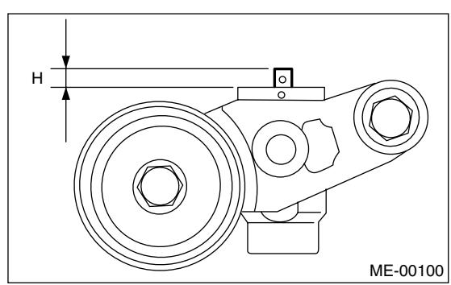

# **3. BELT TENSION PULLEY**

1) Check the mating surfaces of timing belt and contact point of adjuster rod for abnormal wear or scratches. Replace the belt tension pulley if faulty. 2) Check the belt tension pulley for smooth rotation. Replace if noise or excessive play is noted. 3) Check the belt tension pulley for grease leakage.

**4. BELT IDLER**

1) Check the belt idler for smooth rotation. Replace if noise or excessive play is noted.

2) Check the outer contacting surfaces of idler pulley for abnormal wear and scratches.

3) Check the belt idler for grease leakage.

{12}------------------------------------------------

# **16.Camshaft Sprocket**

# **A: REMOVAL**

### **1. EXCEPT FOR STi AND AUSTRALIA MODEL**

1) Remove the V-belt. <Ref. to ME(H4DOTC)-54, REMOVAL, V-belt.>

2) Remove the crankshaft pulley. [<Ref. to](#page-2-1) [ME\(H4DOTC\)-56, REMOVAL, Crankshaft Pulley.>](#page-2-1) 3) Remove the timing belt cover. [<Ref. to](#page-3-1) [ME\(H4DOTC\)-57, REMOVAL, Timing Belt Cover.>](#page-3-1) 4) Remove the timing belt assembly. [<Ref. to](#page-4-1) [ME\(H4DOTC\)-58, REMOVAL, Timing Belt Assem](#page-4-1)[bly.>](#page-4-1)

5) Remove the camshaft position sensor. <Ref. to FU(H4DOTC)-30, REMOVAL, Camshaft Position Sensor.>

6) Remove the camshaft sprockets. To lock the camshaft, use ST.

- ST 18231AA010 CAMSHAFT SPROCKET
- 

WRENCH (INTAKE LH) ST 499207400 CAMSHAFT SPROCKET WRENCH (Except for IN-TAKE LH)

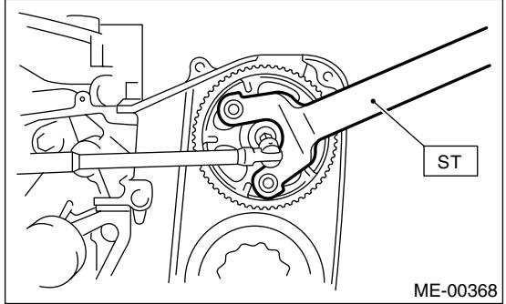

# **2. STi AND AUSTRALIA MODEL**

1) Remove the V-belt. <Ref. to ME(H4DOTC)-54, REMOVAL, V-belt.>

2) Remove the crankshaft pulley. [<Ref. to](#page-2-1) [ME\(H4DOTC\)-56, REMOVAL, Crankshaft Pulley.>](#page-2-1) 3) Remove the timing belt cover. [<Ref. to](#page-3-1) [ME\(H4DOTC\)-57, REMOVAL, Timing Belt Cover.>](#page-3-1) 4) Remove the timing belt assembly. [<Ref. to](#page-4-1) [ME\(H4DOTC\)-58, REMOVAL, Timing Belt Assem](#page-4-1)[bly.>](#page-4-1)

5) Remove the camshaft position sensor. <Ref. to FU(H4DOTC)-30, REMOVAL, Camshaft Position Sensor.>

6) Remove the camshaft sprockets. To lock the camshaft, use ST.

ST 499207400 CAMSHAFT SPROCKET WRENCH

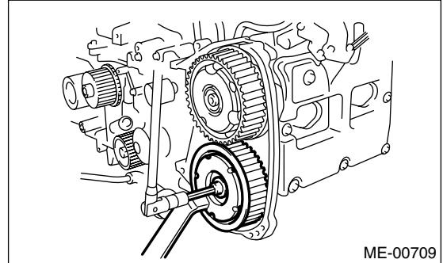

ST 499977500 CAMSHAFT SPROCKET WRENCH

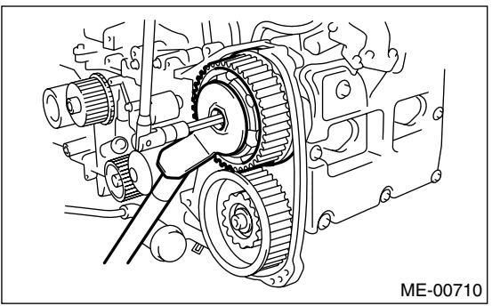

{13}------------------------------------------------

# **B: INSTALLATION**

## **1. EXCEPT FOR STi AND AUSTRALIA MODEL**

1) Install the camshaft sprocket. To lock the camshaft, use ST.

ST 18231AA010 CAMSHAFT SPROCKET ST 499207400 CAMSHAFT SPROCKET

WRENCH (INTAKE LH) WRENCH (Except for IN-TAKE LH)

### *Tightening torque: 98 N·m (10 kgf-m, 72.4 ft-lb)*

# NOTE:

Do not confuse the camshaft sprockets (RH) and (LH) intake side during installation. The camshaft sprocket (LH) is identified by a projection used to monitor camshaft position sensor.

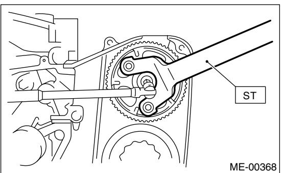

2) Install the camshaft position sensor. <Ref. to FU(H4DOTC)-30, INSTALLATION, Camshaft Position Sensor.>

3) Install the timing belt assembly. [<Ref. to](#page-6-1) [ME\(H4DOTC\)-60, INSTALLATION, Timing Belt](#page-6-1) [Assembly.>](#page-6-1)

4) Install the timing belt cover. [<Ref. to](#page-3-2) [ME\(H4DOTC\)-57, INSTALLATION, Timing Belt](#page-3-2) [Cover.>](#page-3-2)

5) Install the crankshaft pulley. [<Ref. to](#page-2-2) [ME\(H4DOTC\)-56, INSTALLATION, Crankshaft](#page-2-2) [Pulley.>](#page-2-2)

6) Install the V-belt. <Ref. to ME(H4DOTC)-54, IN-STALLATION, V-belt.>

# **2. STi AND AUSTRALIA MODEL**

1) Install the camshaft sprocket No. 1 and No. 2. To lock the camshaft, use ST.

ST 499207400 CAMSHAFT SPROCKET

WRENCH

*Tightening torque: 98 N·m (10 kgf-m, 72.4 ft-lb)*

### NOTE:

Do not confuse camshaft sprockets (RH) and (LH) during installation. The camshaft sprocket No. 2 is identified by a projection used to monitor camshaft position sensor.

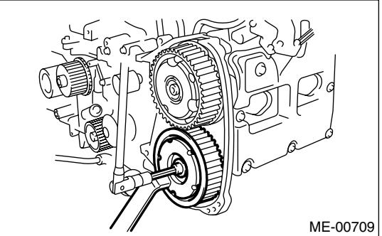

ST 499977500 CAMSHAFT SPROCKET WRENCH

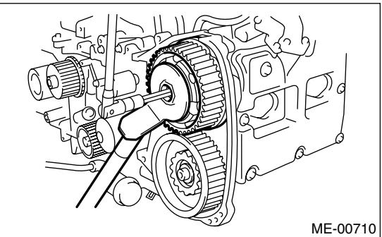

2) Install the camshaft position sensor. <Ref. to FU(H4DOTC)-30, INSTALLATION, Camshaft Position Sensor.>

3) Install the timing belt assembly. [<Ref. to](#page-6-1) [ME\(H4DOTC\)-60, INSTALLATION, Timing Belt](#page-6-1) [Assembly.>](#page-6-1)

4) Install the timing belt cover. [<Ref. to](#page-3-2) [ME\(H4DOTC\)-57, INSTALLATION, Timing Belt](#page-3-2) [Cover.>](#page-3-2)

5) Install the crankshaft pulley. [<Ref. to](#page-2-2) [ME\(H4DOTC\)-56, INSTALLATION, Crankshaft](#page-2-2) [Pulley.>](#page-2-2)

6) Install the V-belt. <Ref. to ME(H4DOTC)-54, IN-STALLATION, V-belt.>

# **C: INSPECTION**

1) Check the sprocket teeth for abnormal wear and scratches.

2) Make sure there is no free play between sprocket and key.

3) Check the crankshaft sprocket notch used for sensor for damage and contamination of foreign matter.

{14}------------------------------------------------

# **17.Crankshaft Sprocket**

# **A: REMOVAL**

1) Remove the V-belt. <Ref. to ME(H4DOTC)-54, REMOVAL, V-belt.>

2) Remove the crankshaft pulley. [<Ref. to](#page-2-1) [ME\(H4DOTC\)-56, REMOVAL, Crankshaft Pulley.>](#page-2-1) 3) Remove the timing belt cover. [<Ref. to](#page-3-1) [ME\(H4DOTC\)-57, REMOVAL, Timing Belt Cover.>](#page-3-1) 4) Remove the timing belt assembly. [<Ref. to](#page-4-1) [ME\(H4DOTC\)-58, REMOVAL, Timing Belt Assem](#page-4-1)[bly.>](#page-4-1)

5) Remove the camshaft sprocket. [<Ref. to](#page-12-1) [ME\(H4DOTC\)-66, REMOVAL, Camshaft Sprock](#page-12-1)[et.>](#page-12-1)

6) Remove the crankshaft sprocket.

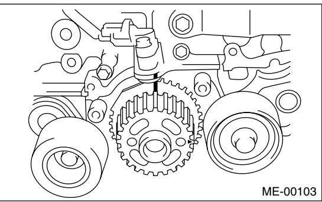

# **B: INSTALLATION**

1) Install the crankshaft sprocket.

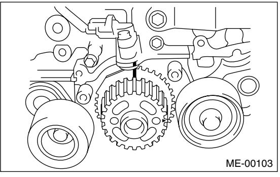

2) Install the camshaft sprocket. [<Ref. to](#page-13-0) [ME\(H4DOTC\)-67, INSTALLATION, Camshaft](#page-13-0) [Sprocket.>](#page-13-0)

3) Install the timing belt assembly. [<Ref. to](#page-6-1) [ME\(H4DOTC\)-60, INSTALLATION, Timing Belt](#page-6-1) [Assembly.>](#page-6-1)

4) Install the timing belt cover. [<Ref. to](#page-3-2) [ME\(H4DOTC\)-57, INSTALLATION, Timing Belt](#page-3-2) [Cover.>](#page-3-2)

5) Install the crankshaft pulley. [<Ref. to](#page-2-2) [ME\(H4DOTC\)-56, INSTALLATION, Crankshaft](#page-2-2) [Pulley.>](#page-2-2)

6) Install the V-belt. <Ref. to ME(H4DOTC)-54, IN-STALLATION, V-belt.>

# **C: INSPECTION**

1) Check the sprocket teeth for abnormal wear and scratches.

2) Make sure there is no free play between sprocket and key.

3) Check the crankshaft sprocket notch used for sensor for damage and contamination of foreign matter.

{15}------------------------------------------------

# **18.Camshaft**

# **A: REMOVAL**

### **1. EXCEPT FOR STi AND AUSTRALIA MODEL**

1) Remove the V-belt. <Ref. to ME(H4DOTC)-54, REMOVAL, V-belt.>

2) Remove the crankshaft pulley. [<Ref. to](#page-2-1) [ME\(H4DOTC\)-56, REMOVAL, Crankshaft Pulley.>](#page-2-1) 3) Remove the timing belt cover. [<Ref. to](#page-3-1) [ME\(H4DOTC\)-57, REMOVAL, Timing Belt Cover.>](#page-3-1) 4) Remove the timing belt assembly. [<Ref. to](#page-4-1) [ME\(H4DOTC\)-58, REMOVAL, Timing Belt Assem](#page-4-1)[bly.>](#page-4-1)

5) Remove the camshaft sprocket. [<Ref. to](#page-12-1) [ME\(H4DOTC\)-66, REMOVAL, Camshaft Sprock](#page-12-1)[et.>](#page-12-1)

6) Remove the crankshaft sprocket. [<Ref. to](#page-14-1) [ME\(H4DOTC\)-68, REMOVAL, Crankshaft Sprock](#page-14-1)[et.>](#page-14-1)

7) Remove the tensioner bracket.

8) Remove the timing belt cover No. 2 (LH).

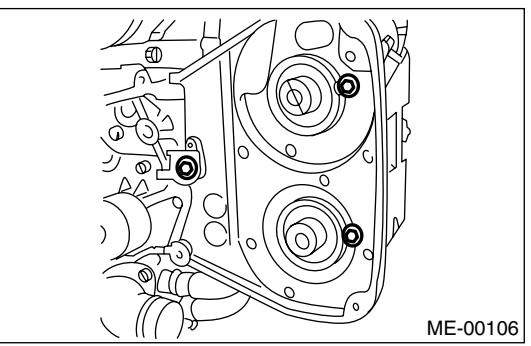

9) Remove the timing belt cover No. 2 (RH).

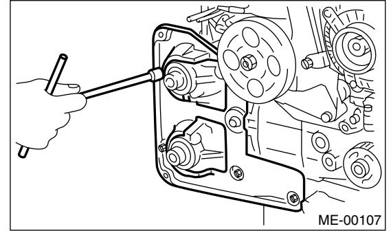

10) Disconnect the ignition coil connector.

11) Remove the ignition coil.

12) Remove the rocker cover and gasket.

13) Loosen the intake camshaft cap bolts equally, a little at a time in alphabetical sequence shown in the figure.

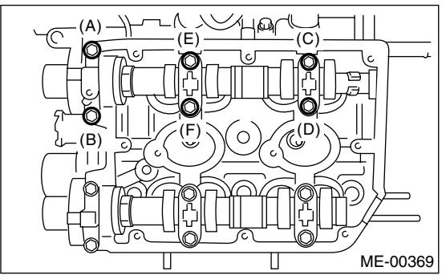

14) Remove the camshaft cap and intake camshaft.

15) Loosen the exhaust camshaft cap bolts equally, a little at a time in alphabetical sequence shown in the figure.

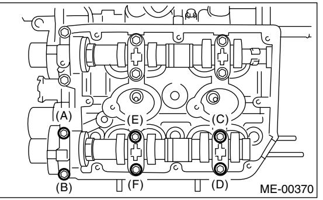

16) Remove the camshaft caps and exhaust camshaft.

# NOTE:

Arrange the camshaft caps in order so that they can be installed in their original positions.

17) Similarly, remove the camshafts (RH) and related parts.

{16}------------------------------------------------

# **2. STi AND AUSTRALIA MODEL**

1) Remove the V-belt. <Ref. to ME(H4DOTC)-54, INSTALLATION, V-belt.>

2) Remove the crankshaft pulley. [<Ref. to](#page-2-1) [ME\(H4DOTC\)-56, REMOVAL, Crankshaft Pulley.>](#page-2-1) 3) Remove the timing belt cover. [<Ref. to](#page-3-1) [ME\(H4DOTC\)-57, REMOVAL, Timing Belt Cover.>](#page-3-1) 4) Remove the timing belt assembly. [<Ref. to](#page-4-1) [ME\(H4DOTC\)-58, REMOVAL, Timing Belt Assem](#page-4-1)[bly.>](#page-4-1)

5) Remove the camshaft sprocket. [<Ref. to](#page-12-1) [ME\(H4DOTC\)-66, REMOVAL, Camshaft Sprock](#page-12-1)[et.>](#page-12-1)

6) Remove the crankshaft sprocket. [<Ref. to](#page-14-1) [ME\(H4DOTC\)-68, REMOVAL, Crankshaft Sprock](#page-14-1)[et.>](#page-14-1)

7) Disconnect the oil flow control solenoid valve assembly connector.

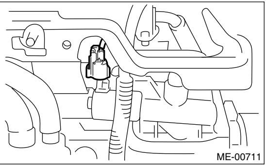

8) Remove the tensioner bracket.

9) Remove the timing belt cover No. 2 (LH).

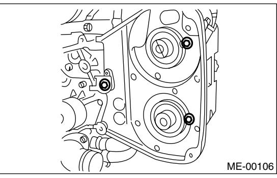

10) Remove the timing belt cover No. 2 (RH).

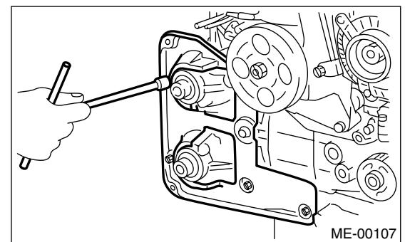

- 11) Remove the spark plug cord.
- 12) Remove the oil level gauge guide. (LH side)
- 13) Remove the rocker cover and gasket.
- 14) Remove the oil pipe.

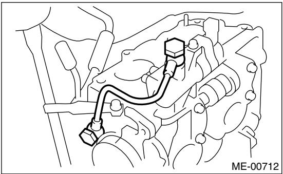

15) Loosen the oil flow control solenoid valve assembly and intake camshaft cap bolts equally, a little at a time in alphabetical sequence shown in the figure.

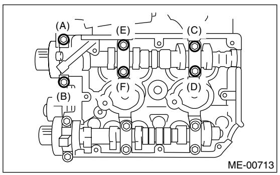

16) Remove the oil flow control solenoid valve assembly, intake camshaft cap, and camshaft.

{17}------------------------------------------------

17) Loosen the exhaust camshaft cap bolts equally, a little at a time in alphabetical sequence shown in the figure.

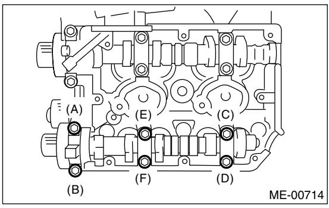

18) Remove the exhaust camshaft cap and camshaft.

#### NOTE:

Arrange the camshaft caps in order so that they can be installed in their original positions.

19) Similarly, remove the camshafts (RH) and related parts.

# **B: INSTALLATION**

### **1. EXCEPT FOR STi AND AUSTRALIA MODEL**

1) Camshaft installation:

Apply engine oil to the cylinder head at camshaft bearing location before installing the camshaft. Install the camshaft so that each valves is close to or in contact with "base circle" of cam lobe.

#### NOTE:

• When the camshafts are positioned as shown in the figure, camshafts need to be rotated at a minimum to align with the timing belt during installation.

• Camshaft (RH) need not be rotated when set at the position shown in the figure.

Intake camshaft (LH): Rotate 80° clockwise.

Exhaust camshaft (LH): Rotate 45° counterclockwise.

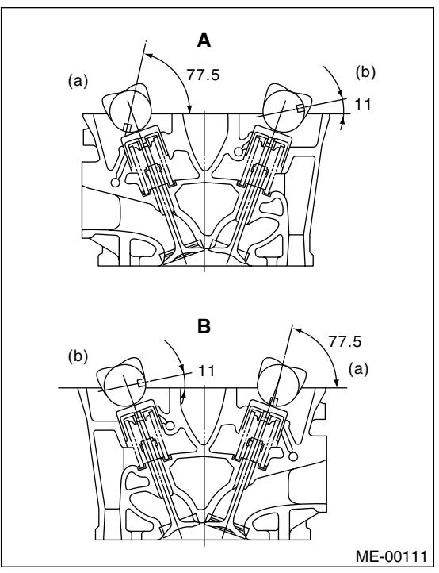

- A Cylinder head (LH)
- B Cylinder head (RH)
- (a) Intake camshaft
- (b) Exhaust camshaft

2) Camshaft cap installation:

(1) Apply fluid packing sparingly to the cap mating surface.

#### NOTE:

Do not apply fluid packing excessively. Failure to do so may cause excess packing to come out and flow toward oil seal, resulting in oil leaks.

# *Fluid packing:*

#### *Part No. 004403007 THREE BOND 1215 or equivalent*

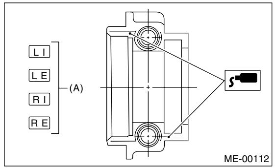

(2) Apply engine oil to cap bearing surface and install the cap on camshaft as shown by identification mark (A).

{18}------------------------------------------------

(3) Gradually tighten the camshaft cap in at least two stages in alphabetical sequence shown in the figure, and then tighten to specified torque.

### *Tightening torque:*

*T1: 10 N·m (1.0 kgf-m, 7.2 ft-lb) T2: 20 N·m (2.0 kgf-m, 14.5 ft-lb)*

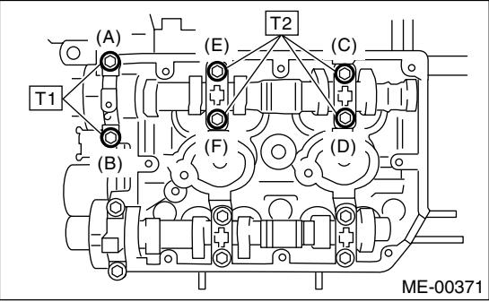

(4) Similarly, tighten the cap on exhaust side. After tightening the cap, ensure the camshaft rotates only slightly while holding it at "base" circle.

#### *Tightening torque:*

*T1: 10 N·m (1.0 kgf-m, 7.2 ft-lb) T2: 20 N·m (2.0 kgf-m, 14.5 ft-lb)*

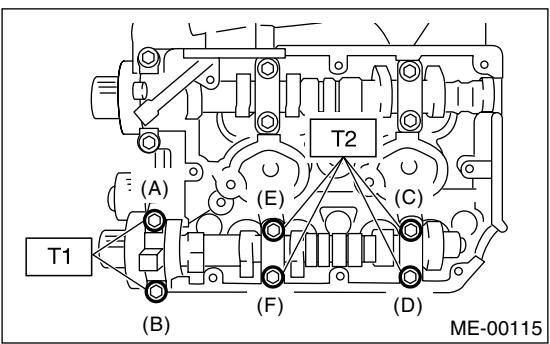

3) Camshaft oil seal installation:

Apply grease to the new oil seal lips and press onto the front end of camshaft by using ST1 and ST2.

### NOTE:

Use a new oil seal.

ST1 499587600 OIL SEAL INSTALLER

ST2 499597200 OIL SEAL GUIDE

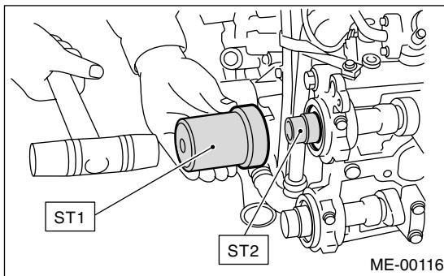

4) Rocker cover installation:

(1) Install the gasket on rocker cover. Install the peripheral gasket and ignition coil gasket.

(2) Apply fluid packing to the indicated portion on rocker cover.

#### *Fluid packing: Part No. 004403007 THREE BOND 1215 or equivalent*

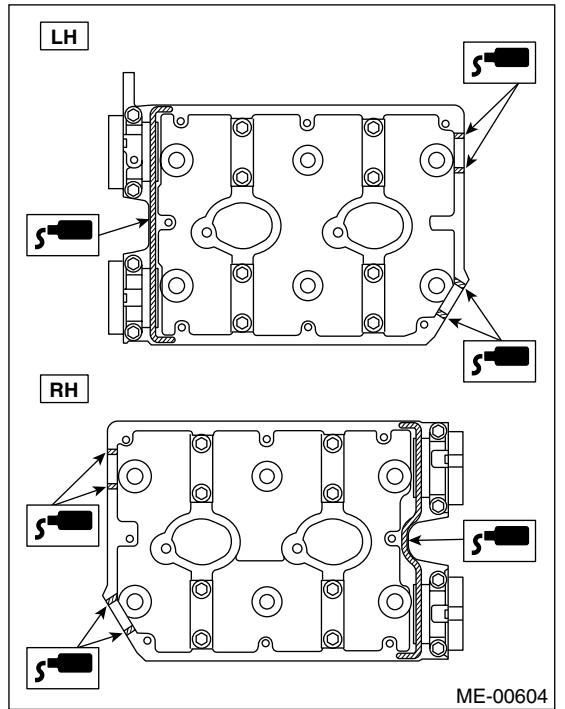

(3) Install the rocker cover on cylinder head. Ensure the gasket is properly positioned during installation.

- 5) Install the ignition coil.
- 6) Connect the ignition coil connector.
- 7) Similarly, install the parts on right-hand side.
- 8) Install the timing belt cover No. 2 (RH).

# *Tightening torque: 5 N·m (0.5 kgf-m, 3.6 ft-lb)*

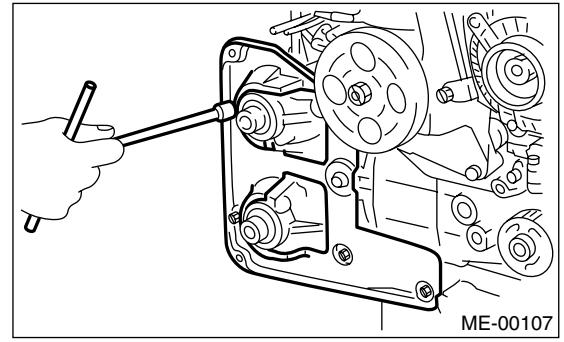

{19}------------------------------------------------

9) Install the tensioner bracket.

*Tightening torque: 25 N·m (2.5 kgf-m, 18.1 ft-lb)*

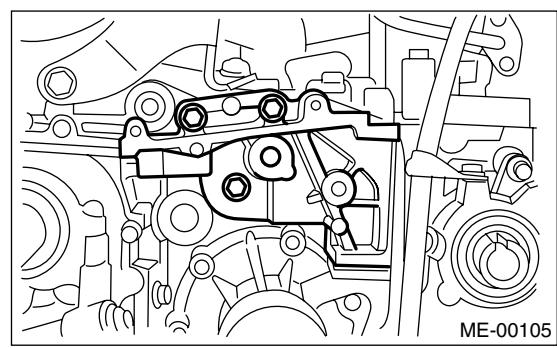

10) Install the timing belt cover No. 2 (LH).

# *Tightening torque: 5 N·m (0.5 kgf-m, 3.6 ft-lb)*

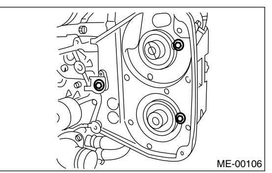

11) Install the crankshaft sprocket. [<Ref. to](#page-14-2) [ME\(H4DOTC\)-68, INSTALLATION, Crankshaft](#page-14-2) [Sprocket.>](#page-14-2)

12) Install the camshaft sprockets. [<Ref. to](#page-13-0) [ME\(H4DOTC\)-67, INSTALLATION, Camshaft](#page-13-0) [Sprocket.>](#page-13-0)

13) Install the timing belt assembly. [<Ref. to](#page-6-1) [ME\(H4DOTC\)-60, INSTALLATION, Timing Belt](#page-6-1) [Assembly.>](#page-6-1)

14) Install the timing belt cover. [<Ref. to](#page-3-2) [ME\(H4DOTC\)-57, INSTALLATION, Timing Belt](#page-3-2) [Cover.>](#page-3-2)

15) Install the crankshaft pulley. [<Ref. to](#page-2-2) [ME\(H4DOTC\)-56, INSTALLATION, Crankshaft](#page-2-2) [Pulley.>](#page-2-2)

16) Install the V-belt. <Ref. to ME(H4DOTC)-54, INSTALLATION, V-belt.>

# **2. STi AND AUSTRALIA MODEL**

1) Camshaft installation:

Apply engine oil to cylinder head at camshaft bearing location before installing the camshaft. Install the camshaft so that each valve is close to or in contact with "base circle" of cam lobe.

### NOTE:

• When the camshafts are positioned as shown in the figure, camshafts need to be rotated at a minimum to align with the timing belt during installation.

• Camshaft (RH) need not be rotated when set at position shown in the figure.

Intake camshaft (LH): Rotate 80° clockwise. Exhaust camshaft (LH): Rotate 45° counterclockwise.

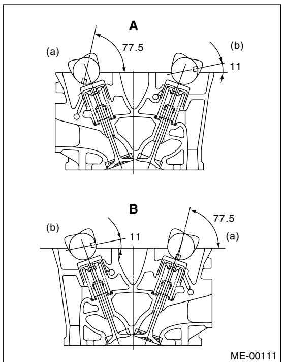

- A Cylinder head (LH)
- B Cylinder head (RH)
- (a) Intake camshaft
- (b) Exhaust camshaft

2) Camshaft cap and oil flow control solenoid valve assembly installation:

(1) Apply fluid packing sparingly to cap mating surface.

### NOTE:

Do not apply fluid packing excessively. Failure to do so may cause excess packing to come out and flow toward the oil seal, resulting in oil leaks.

{20}------------------------------------------------

#### *Fluid packing: Part No. 004403007 THREE BOND 1215 or equivalent*

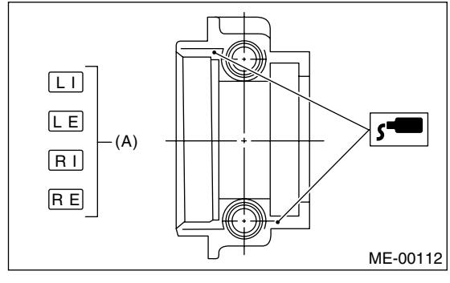

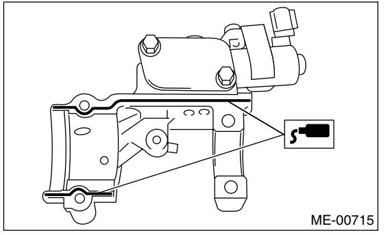

(2) Apply engine oil to cap bearing surface and install the cap on camshaft as shown by identification mark (A).

(3) Gradually tighten the camshaft cap and oil control valve assembly in at least two stages in alphabetical sequence shown in the figure, and then tighten to specified torque.

# *Tightening torque:*

*T1: 10 N·m (1.0 kgf-m, 7 ft-lb) T2: 20 N·m (2.0 kgf-m, 14.5 ft-lb)*

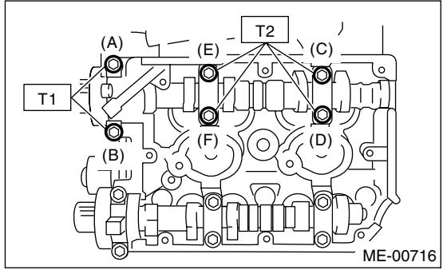

(4) Similarly, tighten cap on the exhaust side. After tightening cap, ensure the camshaft rotates only slightly while holding it at "base" circle.

### *Tightening torque:*

*T1: 10 N·m (1.0 kgf-m, 7 ft-lb) T2: 20 N·m (2.0 kgf-m, 14.5 ft-lb)*

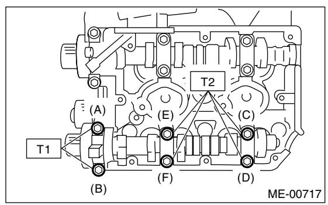

3) Camshaft oil seal installation:

Apply grease to new oil seal lips and press onto front end of camshaft by using ST1 and ST2.

NOTE:

Use a new oil seal.

ST1 499587600 OIL SEAL GUIDE ST2 499597200 OIL SEAL GUIDE

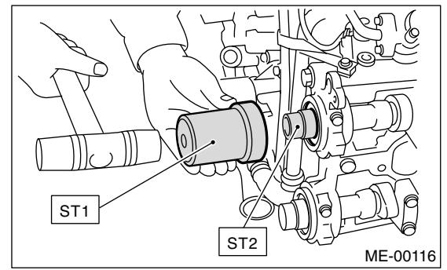

4) Rocker cover installation:

(1) Install the gasket on rocker cover.

Install the peripheral gasket and ignition coil gasket.

(2) Apply fluid packing to four front open edges of peripheral gasket.

{21}------------------------------------------------

#### *Fluid packing: Part No. 004403007 THREE BOND 1215 or equivalent*

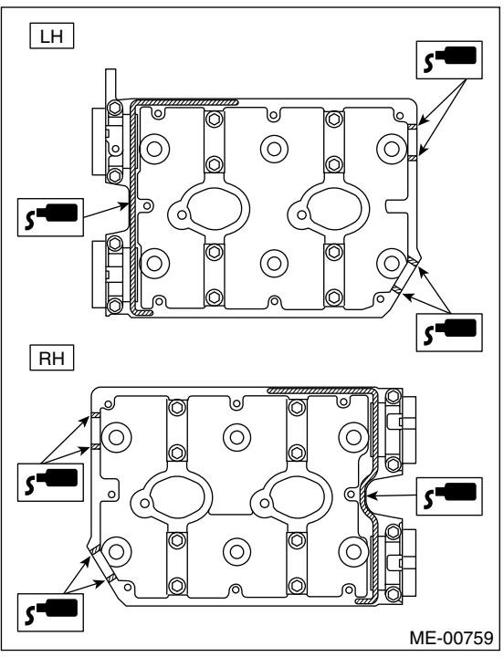

(3) Install the rocker cover on cylinder head. Ensure the gasket is properly positioned during installation.

5) Install the oil pipe.

### *Tightening torque: 30 N·m (3.1 kgf-m, 22.1 ft-lb)*

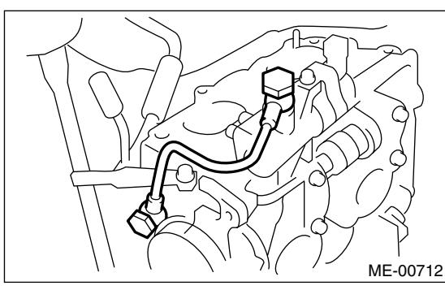

6) Connect the oil flow control solenoid valve connector.

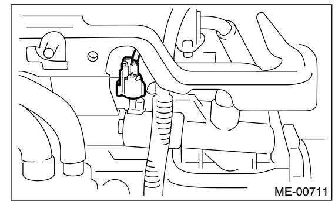

- 7) Install the spark plug cord.
- 8) Similarly, install the parts on right-hand side.
- 9) Install the tensioner bracket.

# *Tightening torque: 25 N·m (2.5 kgf-m, 18.1 ft-lb)*

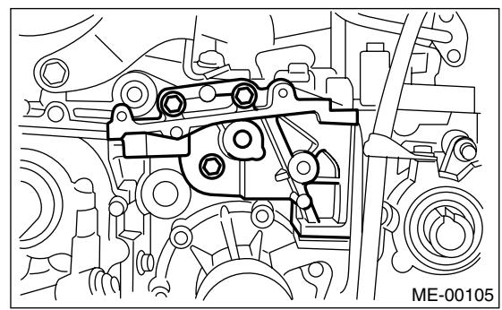

10) Install the timing belt cover No. 2 (RH).

### *Tightening torque: 5 N·m (0.5 kgf-m, 3.6 ft-lb)*

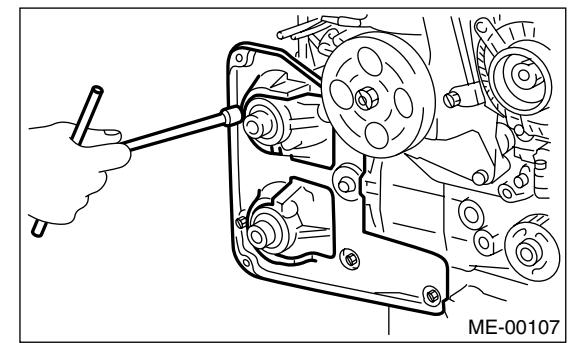

{22}------------------------------------------------

11) Install the timing belt cover No. 2 (LH).

# *Tightening torque:*

*5 N·m (0.5 kgf-m, 3.6 ft-lb)*

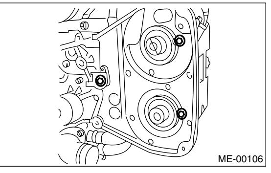

12) Install the crankshaft sprocket. [<Ref. to](#page-13-0) [ME\(H4DOTC\)-67, INSTALLATION, Camshaft](#page-13-0) [Sprocket.>](#page-13-0)

13) Install the camshaft sprockets. [<Ref. to](#page-13-0) [ME\(H4DOTC\)-67, INSTALLATION, Camshaft](#page-13-0) [Sprocket.>](#page-13-0)

14) Install the timing belt assembly. [<Ref. to](#page-6-1) [ME\(H4DOTC\)-60, INSTALLATION, Timing Belt](#page-6-1) [Assembly.>](#page-6-1)

15) Install the timing belt cover. [<Ref. to](#page-3-2) [ME\(H4DOTC\)-57, INSTALLATION, Timing Belt](#page-3-2) [Cover.>](#page-3-2)

16) Install the crankshaft pulley. [<Ref. to](#page-2-2) [ME\(H4DOTC\)-56, INSTALLATION, Crankshaft](#page-2-2) [Pulley.>](#page-2-2)

17) Install the V-belt. <Ref. to ME(H4DOTC)-54, INSTALLATION, V-belt.>

# **C: INSPECTION**

1) Measure the bend, and repair or replace if necessary.

### *Limit:*

*0.020 mm (0.0008 in)*

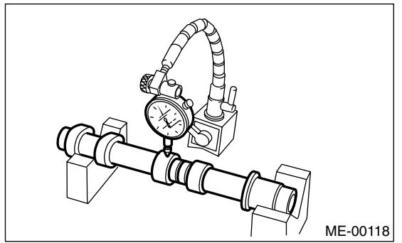

2) Check the journal for damage and wear. Replace if faulty.

3) Measure the outside diameter of camshaft journal. If the journal diameter is not as specified, check the oil clearance.

|          | Camshaft journal                           |                                            |  |
|----------|--------------------------------------------|--------------------------------------------|--|
|          | Front                                      | Center, rear                               |  |
| Standard | 37.946 — 37.963 mm (1.4939 — 1.4946 in) | 29.946 — 29.963 mm (1.1790 — 1.1796 in) |  |

4) Measurement of the camshaft journal oil clearance:

(1) Clean the bearing caps and camshaft journals.

(2) Place the camshafts on cylinder head.

(Without installing the valve rocker.)

(3) Place a plastigauge across each of the camshaft journals.

(4) Gradually tighten the cap in at least two stages in alphabetical sequence shown in the figure, and then tighten to specified torque. Do not turn the camshaft.

# *Tightening torque:*

*T1: 10 N·m (1.0 kgf-m, 7.2 ft-lb) T2: 20 N·m (2.0 kgf-m, 14.5 ft-lb)*

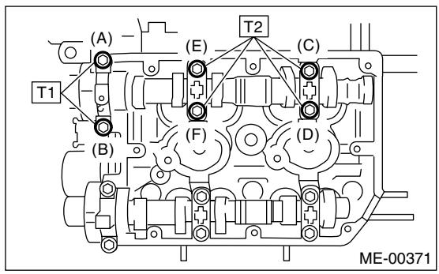

(5) Remove the bearing caps.

(6) Measure the widest point of plastigauge on each journal.

If the oil clearance exceeds the limit, replace the camshaft. If necessary, replace the camshaft caps and cylinder head as a set.

### *Standard:*

*0.037 — 0.072 mm (0.0015 — 0.0028 in)*

*Limit:*

$$
0.10 \; \text{mm} \; (0.0039 \; \text{in})
$$

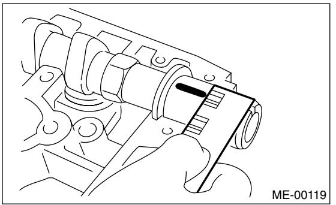

(7) Completely remove the plastigauge.

{23}------------------------------------------------

5) Check the cam face condition; remove the minor faults by grinding with oil stone. Measure the cam height H, replace if the limit has been exceeded.

### *Cam height: H*

#### *Standard:*

*Except for STi model Intake: 46.25 — 46.35 mm (1.821 — 1.825 in) Exhaust: 46.15 — 46.25 mm (1.817 — 1.821 in) STi model Intake: 45.25 — 45.35 mm (1.781 — 1.785 in) Exhaust: 45.60 — 45.70 mm (1.795 — 1.799 in) Limit: Except for STi model Intake: 46.15 mm (1.817 in) Exhaust: 46.05 mm (1.813 in) STi model Intake: 45.15 mm (1.778 in) Exhaust: 45.50 mm (1.791 in)*

*Cam base circle diameter A: 37.0 mm (1.457 in)*

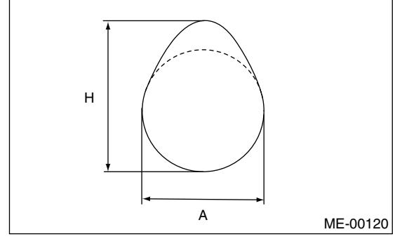

6) Measure the thrust clearance of camshaft with dial gauge. If the clearance exceeds the limit, replace the caps and cylinder head as a set. If necessary, replace the camshaft.

### *Standard:*

#### *0.040 — 0.080 mm (0.0016 — 0.0031 in)*

*Limit:*

*0.1 mm (0.004 in)*

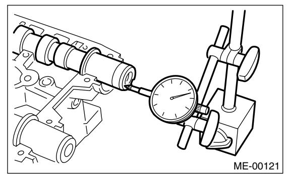

{24}------------------------------------------------

# **19.Cylinder Head Assembly**

# **A: REMOVAL**

1) Remove the V-belt. <Ref. to ME(H4DOTC)-54, REMOVAL, V-belt.>

2) Remove the crankshaft pulley. [<Ref. to](#page-2-1) [ME\(H4DOTC\)-56, REMOVAL, Crankshaft Pulley.>](#page-2-1) 3) Remove the timing belt cover. [<Ref. to](#page-3-1) [ME\(H4DOTC\)-57, REMOVAL, Timing Belt Cover.>](#page-3-1) 4) Remove the timing belt assembly. [<Ref. to](#page-4-1) [ME\(H4DOTC\)-58, REMOVAL, Timing Belt Assem](#page-4-1)[bly.>](#page-4-1)

5) Remove the camshaft sprocket. [<Ref. to](#page-12-1) [ME\(H4DOTC\)-66, REMOVAL, Camshaft Sprock](#page-12-1)[et.>](#page-12-1)

6) Remove the intake manifold. <Ref. to FU(H4DOTC)-14, REMOVAL, Intake Manifold.>

7) Remove the bolt which installs the A/C compressor bracket on cylinder head.

8) Remove the camshaft. [<Ref. to ME\(H4DOTC\)-](#page-15-1) [69, REMOVAL, Camshaft.>](#page-15-1)

9) Remove the cylinder head bolts in alphabetical sequence shown in the figure.

Leave bolts (A) and (D) engaged by three or four threads to prevent the cylinder head from falling.

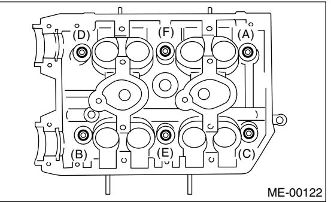

10) While tapping the cylinder head with a plastic hammer, separate it from cylinder block.

Remove the bolts (A) and (D) to remove cylinder head.

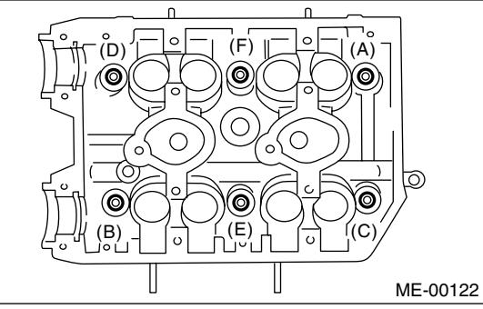

11) Remove the cylinder head gasket.

NOTE:

Do not scratch the mating surface of cylinder head and cylinder block.

12) Similarly, remove the cylinder head (RH).

# **B: INSTALLATION**

1) Install the cylinder head and gaskets on cylinder block.

### NOTE:

• Use new cylinder head gaskets.

• Be careful not to scratch the mating surface of cylinder head and cylinder block.

2) Tighten the cylinder head bolts.

(1) Apply a coat of engine oil to the washers and bolt threads.

(2) Tighten all bolts to 29 N·m (3.0 kgf-m, 22 ftlb) in alphabetical sequence.

(3) Tighten all bolts to 69 N·m (7.0 kgf-m, 51 ft-

lb) in alphabetical sequence again.

(4) Back off all bolts by 180° first; back them off by 180° again in reverse order of installation.

(5) Tighten all bolts to 39 N·m (4.0 kgf-m, 29 ftlb) in alphabetical sequence.

(6) Tighten all bolts 80 to 90° in alphabetical sequence.

(7) Tighten all bolts by 40 to 45° in alphabetical sequence again.

# NOTE:

Do not tighten the bolts by more than 45°.

(8) Further tighten all bolts (A) and (B) by 40 to 45°.

NOTE:

Ensure that the total "re-tightening angle" in the previous two steps do not exceed 90°.

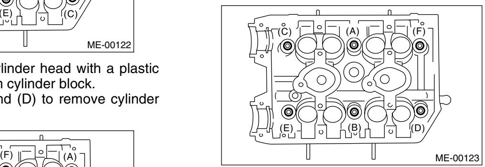

3) Install the camshaft. [<Ref. to ME\(H4DOTC\)-71,](#page-17-0) [INSTALLATION, Camshaft.>](#page-17-0)

4) Install the A/C compressor bracket on cylinder head.

5) Install the intake manifold. <Ref. to FU(H4DOTC)-17, INSTALLATION, Intake Manifold.>

6) Install the camshaft sprocket. [<Ref. to](#page-13-0) [ME\(H4DOTC\)-67, INSTALLATION, Camshaft](#page-13-0) [Sprocket.>](#page-13-0)

7) Install the timing belt assembly. [<Ref. to](#page-6-1) [ME\(H4DOTC\)-60, INSTALLATION, Timing Belt](#page-6-1) [Assembly.>](#page-6-1)

{25}------------------------------------------------

8) Install the timing belt cover. [<Ref. to](#page-3-2) [ME\(H4DOTC\)-57, INSTALLATION, Timing Belt](#page-3-2) [Cover.>](#page-3-2)

9) Install the crankshaft pulley. [<Ref. to](#page-2-2) [ME\(H4DOTC\)-56, INSTALLATION, Crankshaft](#page-2-2) [Pulley.>](#page-2-2)

10) Install the V-belt. <Ref. to ME(H4DOTC)-54, INSTALLATION, V-belt.>

# **C: DISASSEMBLY**

1) Remove the valve lifters.

2) Compress the valve spring and remove the valve spring retainer key. Remove each valve and valve spring.

ST1 498267600 CYLINDER HEAD TABLE

ST2 499718000 VALVE SPRING REMOVER

NOTE:

• Keep the removed parts in order for re-installing in their original positions.

• Mark each valve to prevent confusion.

• Use extreme care not to damage the lips of the intake valve oil seals and exhaust valve oil seals.

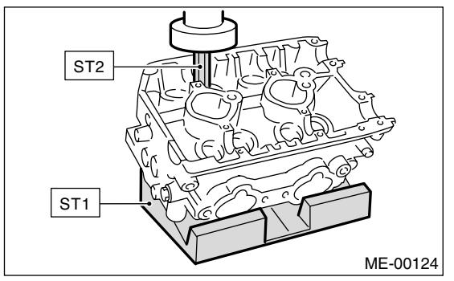

{26}------------------------------------------------

# **D: ASSEMBLY**

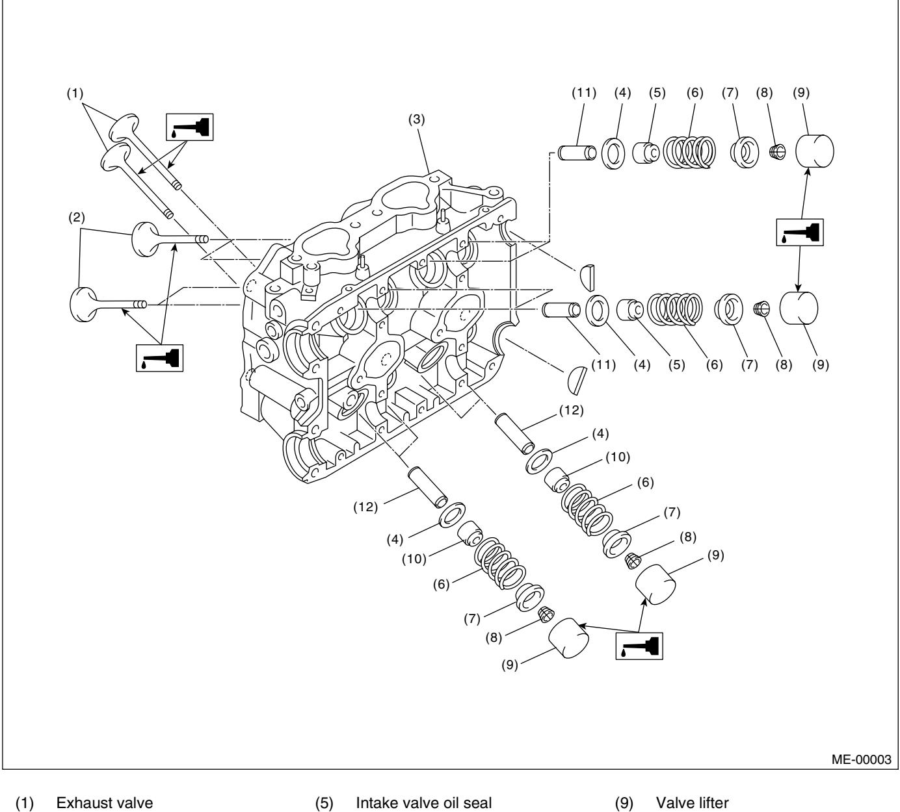

- 
- 
- 
- 
- 
- 
- 
- 
- 
- (2) Intake valve (6) Valve spring (10) Exhaust valve oil seal
- (3) Cylinder head (7) Retainer (11) Intake valve guide
- (4) Valve spring seat (8) Retainer key (12) Exhaust valve guide

{27}------------------------------------------------

1) Installation of valve spring and valve:

(1) Coat the stem of each valve with engine oil and insert the valve into valve guide.

#### NOTE:

When inserting the valve into valve guide, use special care not to damage the oil seal lip.

- (2) Set the cylinder head on ST1.
- (3) Install the valve spring and retainer using ST2.
- ST1 498267600 CYLINDER HEAD TABLE

ST2 499718000 VALVE SPRING REMOVER

### NOTE:

Be sure to install the valve springs with their closecoiled end facing the seat on cylinder head.

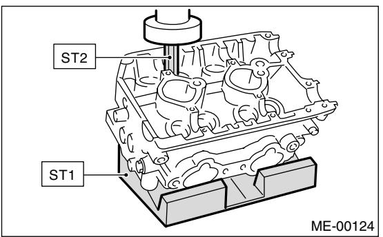

(4) Compress the valve spring, and then fit the valve spring retainer key.

(5) After installing, tap the valve spring retainers lightly with wooden hammer for better seating.

- 2) Apply oil to the surface of the valve lifter.
- 3) Install the valve lifter.

# **E: INSPECTION**

# **1. CYLINDER HEAD**

1) Make sure that no crack or other damage exists. In addition to visual inspection, inspect the important areas by means of red check.

2) Measure the warping of the cylinder head surface that mates with crankcase by using a straight edge (A) and thickness gauge (B).

If the warping exceeds 0.05 mm (0.0020 in), regrind the surface with a surface grinder.

*Warping limit: 0.05 mm (0.0020 in)*

*Grinding limit: 0.3 mm (0.012 in)*

*Standard height of cylinder head: 127.5 mm (5.02 in)*

#### NOTE:

Uneven torque for the cylinder head nuts can cause warping. When reassembling, pay special attention to the torque so as to tighten evenly.

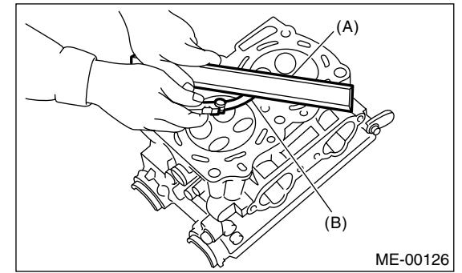

# **2. VALVE SEAT**

Inspect the intake and exhaust valve seats, and then correct the contact surfaces with valve seat cutter if they are defective or when valve guides are replaced.

#### *Valve seat width: W*

*Intake Standard 1.0 mm (0.039 in) Limit 1.7 mm (0.067 in) Exhaust Standard 1.5 mm (0.059 in) Limit 2.2 mm (0.087 in)*

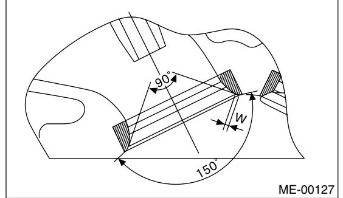

# **3. VALVE GUIDE**

1) Check the clearance between valve guide and stem. The clearance can be checked by measuring the outside diameter of valve stem and the inside diameter of valve guide with outside and inside micrometers respectively.

*Clearance between the valve guide and valve stem:*

{28}------------------------------------------------

# *Standard*

*Intake 0.030 — 0.057 mm (0.0012 — 0.0022 in) Exhaust 0.040 — 0.067 mm (0.0016 — 0.0026 in)*

*Limit*

### *0.15 mm (0.0059 in)*

2) If the clearance between valve guide and stem exceeds the limit, replace the valve guide or valve itself whichever shows greater amount of wear. See the following procedure for valve guide replacement.

*Valve guide inner diameter: 6.000 — 6.012 mm (0.2362 — 0.2367 in)*

*Valve stem outer diameters:*

*DOHC turbo model*

*Intake 5.955 — 5.970 mm (0.2344 — 0.2350 in) Exhaust*

### *5.945 — 5.960 mm (0.2341 — 0.2346 in)*

(1) Place the cylinder head on ST1 with the combustion chamber upward so that valve guides enter the holes in ST1.

(2) Insert the ST2 into valve guide and press it down to remove the valve guide.

ST1 498267600 CYLINDER HEAD TABLE

ST2 499767200 VALVE GUIDE REMOVER

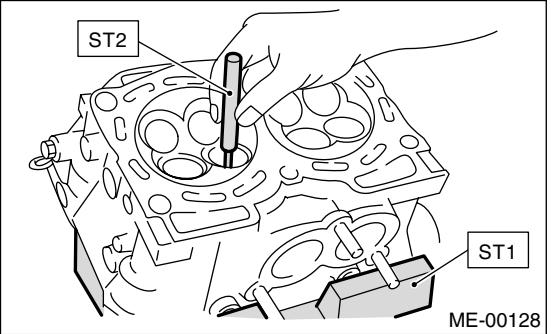

(3) Turn the cylinder head upside down and place ST as shown in the figure.

ST 18251AA020 VALVE GUIDE ADJUSTER

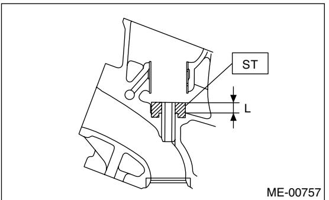

(4) Before installing a new valve guide, make sure that neither scratches nor damages exist on the inside surface of the valve guide holes in cylinder head.

(5) Put a new valve guide, coated with sufficient oil, in cylinder, and insert ST1 into valve guide. Press in until the valve guide upper end is flush with the upper surface of ST2.

ST1 499767200 VALVE GUIDE REMOVER ST2 18251AA020 VALVE GUIDE ADJUSTER

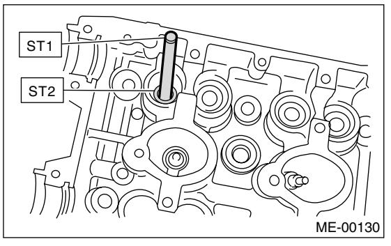

(6) Check the valve guide protrusion.

### *Valve guide protrusion: L 15.8 — 16.2 mm (0.622 — 0.638 in)*

(7) Ream the inside of valve guide with ST. Gently rotate the reamer clockwise while pressing it lightly into the valve guide, and return it also rotating clockwise. After reaming, clean the valve guide to remove chips.

ST 499767400 VALVE GUIDE REAMER NOTE:

• Apply engine oil to the reamer when reaming.

• If the inner surface of the valve guide is torn, the edge of the reamer should be slightly ground with an oil stone.

• If the inner surface of the valve guide becomes lustrous and the reamer does not chip, use a new reamer or remedy the reamer.

(8) Recheck the contact condition between valve and valve seat after replacing the valve guide.

# **4. INTAKE AND EXHAUST VALVE**

1) Inspect the flange and stem of valve, and replace if damaged, worn, or deformed, or if "H" is less than the specified limit.

{29}------------------------------------------------

#### *H:*

*Intake (A) Standard 1.2 mm (0.047 in) Limit 0.8 mm (0.031 in) Exhaust (B) Standard 1.5 mm (0.059 in) Limit 0.8 mm (0.031 in) Valve overall length:*

*Intake (A) 104.4 mm (4.110 in) Exhaust (B) 104.7 mm (4.122 in)*

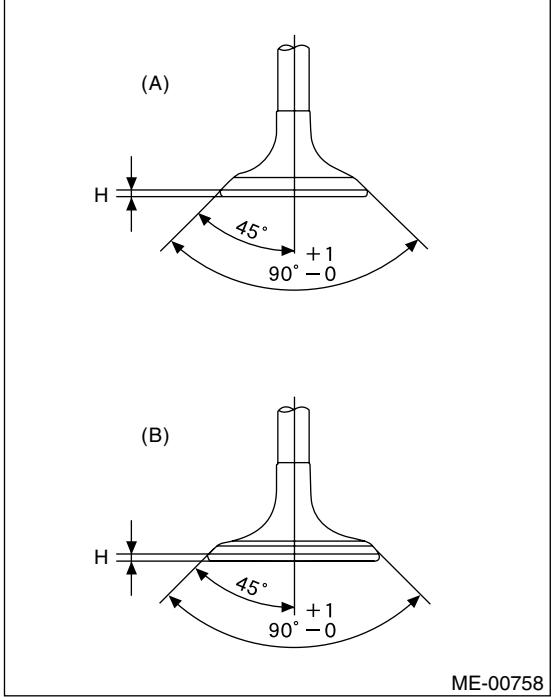

2) Put a small amount of grinding compound on the seat surface and lap the valve and seat surface. Install a new intake valve oil seal after lapping.

### **5. VALVE SPRINGS**

1) Check the valve springs for damage, free length, and tension. Replace the valve spring if it is not within specifications presented in the table.

2) To measure the squareness of valve spring, stand the spring on a surface plate and measure its deflection at the top using a try square.

• Except for STi model

|                |      | Valve spring                                                            |
|----------------|------|-------------------------------------------------------------------------|
| Free length    |      | 47.32 mm (1.863 in)                                                     |
| Tension/spring | Set  | 205 — 235 N (20.9 — 24.0 kgf, 41.6 — 52.8 lb) /36.0 mm (1.417 in) |
| height         | Lift | 426 — 490 N (43.4 — 50.0 kgf, 95.8 — 110 lb) /26.5 mm (1.04 in)   |
| Squareness     |      | 2.5°, 2.1 mm (0.083 in)                                                 |

#### • STi model

| Free length    |      | Valve spring                                                            |
|----------------|------|-------------------------------------------------------------------------|
|                |      | 43.89 mm (1.728 in)                                                     |
| Tension/spring | Set  | 205 — 237 N (20.9 — 24.2 kgf, 46.1 — 53.3 lb) /36.0 mm (1.417 in) |
| height         | Lift | 553 — 611 N (56.4 — 62.3 kgf, 124 — 137 lb) /26.45 mm (1.041 in)  |
| Squareness     |      | 2.5°, 1.9 mm (0.075 in)                                                 |

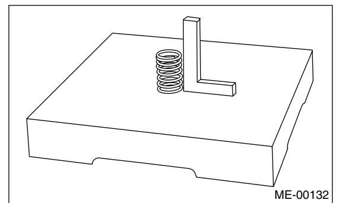

# **6. INTAKE AND EXHAUST VALVE OIL SEAL**

Replace the oil seal with a new one, if the lip is damaged or spring out of place, or when the surfaces of intake valve and valve seat are reconditioned or intake valve guide is replaced.

1) Place the cylinder head on ST1.

2) Press in the oil seal to the specified dimension indicated in the figure by using ST2.

ST1 498267600 CYLINDER HEAD TABLE ST2 498857100 VALVE OIL SEAL GUIDE

### NOTE:

• Apply engine oil to oil seal before press-fit.

• Differentiate between the intake valve oil seal and exhaust valve oil seal by noting their difference in color.

*Color of rubber part: Intake [Black] Exhaust [Brown]*

{30}------------------------------------------------

### *Color of spring part: Intake [Silver] Exhaust [Silver]*

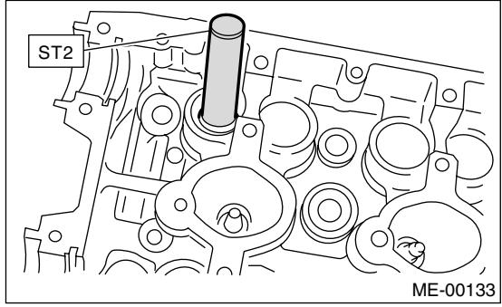

# **7. VALVE LIFTER**

- 1) Visually check the valve lifter.
- 2) Measure the outer diameter of valve lifter.

# *Outer diameter:*

*34.959 — 34.975 mm (1.3763 — 1.3770 in)*

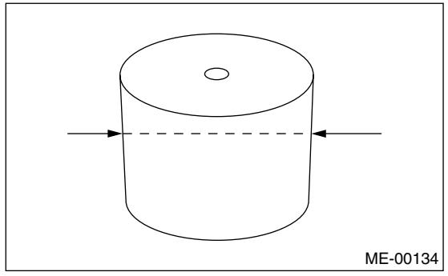

3) Measure the inner diameter of valve lifter mating part on cylinder head.

# *Inner diameter:*

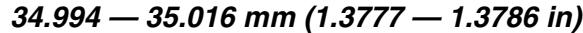

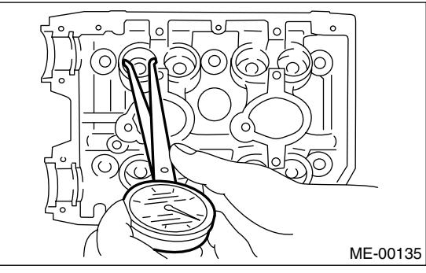

# NOTE:

If difference between outer diameter of valve lifter and inner diameter of valve lifter mating part is over the limit, replace the cylinder head.

# *Standard:*

*0.019 — 0.057 mm (0.0007 — 0.0022 in)*

# *Limit:*

*0.100 mm (0.0039 in)*

# **F: DISPOSAL**

# **CAUTION:**

**• Metallic sodium is enclosed in the exhaust valve. Metallic sodium is extremely alkaline and may produce severe chemical reactions. Full consideration must therefore be given to the following points when handling or disposing of the valve.**

**• Since metallic sodium may cause blindness if contacted with the eyes, burns if contacted with the skin, and fire, do not deliberately take the valve apart.**

1) If the valve is damaged, remove the valve and neutralize it by immersing it in water, and dispose of it in the same way that general steel materials are disposed of. The disposal method is described in the following.

(1) Wearing rubber gloves, remove the damaged valve from the cylinder head.

(2) Prepare a large receptacle (bucket or other container) in a well ventilated location, and fill the receptacle with water (at least 10 liters).

(3) Immerse the damaged valve in the receptacle.

# **CAUTION:**

#### **A severe reaction may occur, so stand at least 2 — 3 m from the receptacle. Because the reaction will produce hydrogen gas, moreover, keep the receptacle away from sparks or flames.**

(4) Once the reaction is completed (about 4 — 5 hours have elapsed), carefully remove the valve using large pincers so that the reaction liquid does not contact your skin, and dispose of it with other parts that are being disposed of.

(5) The reaction liquid is a strong alkaline solution, so it must be disposed of in accordance with local regulations.

# **CAUTION:**

**Make sure the reaction liquid does not contact your skin. If contact with skin occurs, immediately wash the affected area with large quantities of water.**

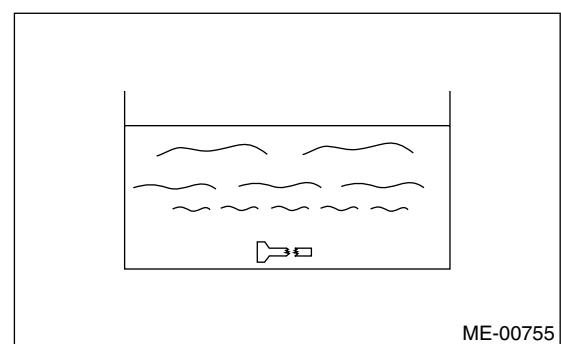

{31}------------------------------------------------

# **20.Cylinder Block**

# **A: REMOVAL**

NOTE:

Before conducting this procedure, drain the engine oil completely if applicable.

1) Remove the intake manifold. <Ref. to FU(H4DOTC)-14, REMOVAL, Intake Manifold.> 2) Remove the V-belt. <Ref. to ME(H4DOTC)-54, REMOVAL, V-belt.>

3) Remove the crankshaft pulley. [<Ref. to](#page-2-1) [ME\(H4DOTC\)-56, REMOVAL, Crankshaft Pulley.>](#page-2-1) 4) Remove the timing belt cover. [<Ref. to](#page-3-1) [ME\(H4DOTC\)-57, REMOVAL, Timing Belt Cover.>](#page-3-1) 5) Remove the timing belt assembly. [<Ref. to](#page-4-1) [ME\(H4DOTC\)-58, REMOVAL, Timing Belt Assem](#page-4-1)[bly.>](#page-4-1)

6) Remove the camshaft sprocket. [<Ref. to](#page-12-1) [ME\(H4DOTC\)-66, REMOVAL, Camshaft Sprock](#page-12-1)[et.>](#page-12-1)

7) Remove the crankshaft sprocket. [<Ref. to](#page-14-1) [ME\(H4DOTC\)-68, REMOVAL, Crankshaft Sprock](#page-14-1)[et.>](#page-14-1)

8) Remove the generator and A/C compressor with their brackets.

9) Remove the cylinder head assembly. [<Ref. to](#page-24-1) [ME\(H4DOTC\)-78, REMOVAL, Cylinder Head As](#page-24-1)[sembly.>](#page-24-1)

10) Remove the clutch disc and cover. (MT model) <Ref. to CL-20, REMOVAL, Clutch Disc and Cover.>

11) Remove the flywheel. (MT model) <Ref. to CL-24, REMOVAL, Flywheel.>

12) Remove the drive plate. (AT model) Using the ST, lock crankshaft.

ST 498497100 CRANKSHAFT STOPPER

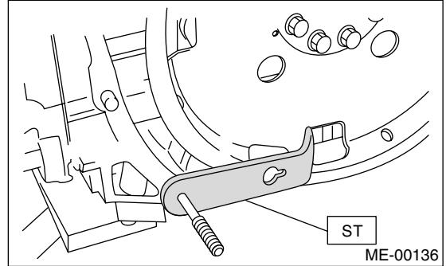

- 13) Remove the oil separator cover.
- 14) Remove the water by-pass pipe for heater.
- 15) Remove the oil filter.
- ST 498547000 OIL FILTER WRENCH

16) Remove the oil cooler.

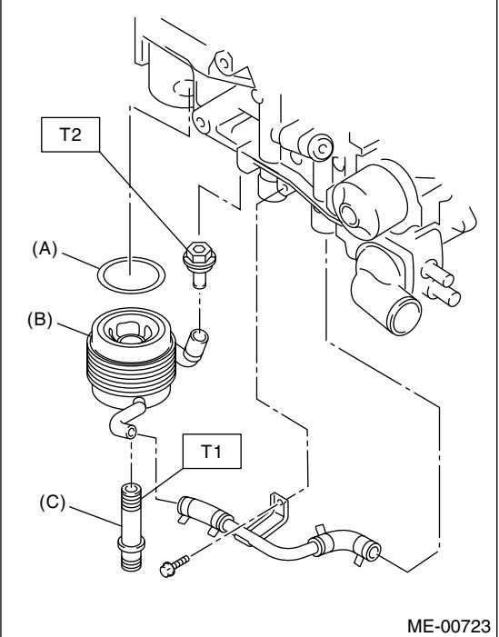

- (A) Gasket
- (B) Oil cooler
- (C) Oil cooler connector

17) Removal of oil pan:

(1) Turn the cylinder block with #2 and #4 piston sides facing upward.

(2) Remove the bolts which secure oil pan to cylinder block.

(3) Insert an oil pan cutter blade between cylinder block-to-oil pan clearance, and then remove the oil pan.

Do not use a screwdriver or similar tool in place of oil pan cutter.

- 18) Remove the oil strainer stay.
- 19) Remove the oil strainer.
- 20) Remove the baffle plate.
- 21) Remove the water pipes.
- 22) Remove the water pump.
- 23) Remove the oil pump from cylinder block.

Use a flat-bladed screwdriver as shown in the figure when removing the oil pump.

{32}------------------------------------------------

Be careful not to scratch the mating surface of cylinder block and oil pump.

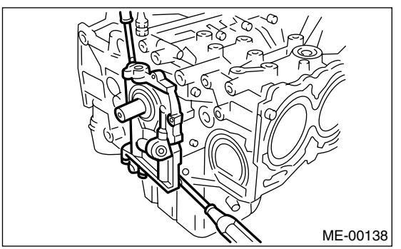

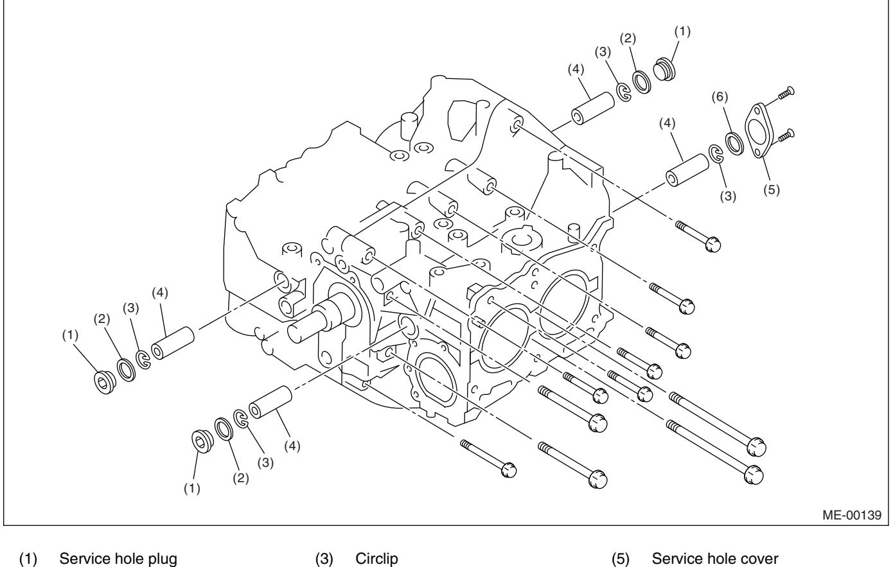

- 
- (2) Gasket (4) Piston pin (6) O-ring
- 
- 
- 

{33}------------------------------------------------

24) Remove the service hole cover and service hole plugs using hexagon wrench [14 mm (0.55 in)].

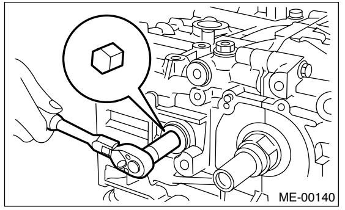

25) Rotate the crankshaft to bring #1 and #2 pistons to bottom dead center position, and then remove the piston circlip through service hole of #1 and #2 cylinders.

ST 499897200 PISTON CIRCLIP PLIERS

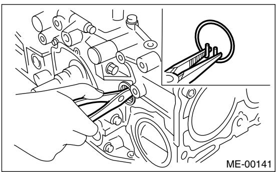

26) Draw out the piston pin from #1 and #2 pistons using ST.

| ST | 499097700 | PISTON PIN REMOVER          |
|----|-----------|-----------------------------|
|    |           | (Australia model except for |
|    |           | STi model)                  |
| ST | 499097600 | PISTON PIN REMOVER (Ex      |
|    |           | cept for Australia model)   |

### NOTE:

Be careful not to confuse the original combination of piston, piston pin and cylinder.

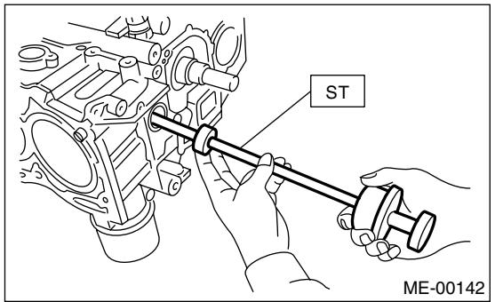

27) Similarly remove the piston pins from #3 and #4 pistons.

28) Remove the bolts which connect the cylinder block on the side of #2 and #4 cylinders.

29) Back off the bolts which connect the cylinder block on the side of #1 and #3 cylinders two or three turns.

30) Set up the cylinder block so that #1 and #3 cylinders are on the upper side, then remove the cylinder block connecting bolts.

31) Separate the cylinder blocks (LH) and (RH).

{34}------------------------------------------------

When separating the cylinder block, do not allow the connecting rod to fall and damage the cylinder block.

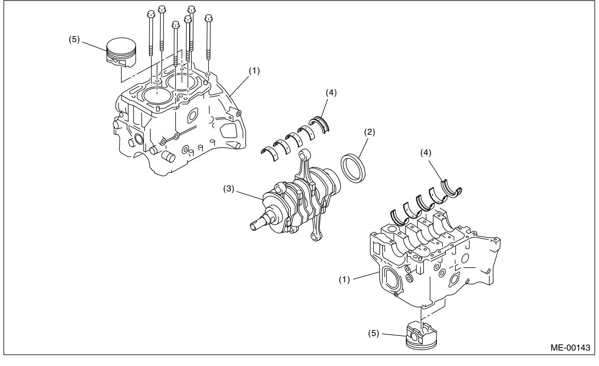

- (1) Cylinder block (3) Crankshaft (5) Piston
- 
- 
- (2) Rear oil seal (4) Crankshaft bearing
- 32) Remove the rear oil seal.
- 33) Remove the crankshaft together with connecting rod.

34) Remove the crankshaft bearings from cylinder block using a hammer handle.

# NOTE:

Do not confuse the combination of crankshaft bearings.

Press the bearing at the end opposite to locking lip. 35) Draw out each piston from cylinder block using a wooden bar or hammer handle.

### NOTE:

Do not confuse the combination of piston and cylinder.

{35}------------------------------------------------

# **Cylinder Block**

# **B: INSTALLATION**

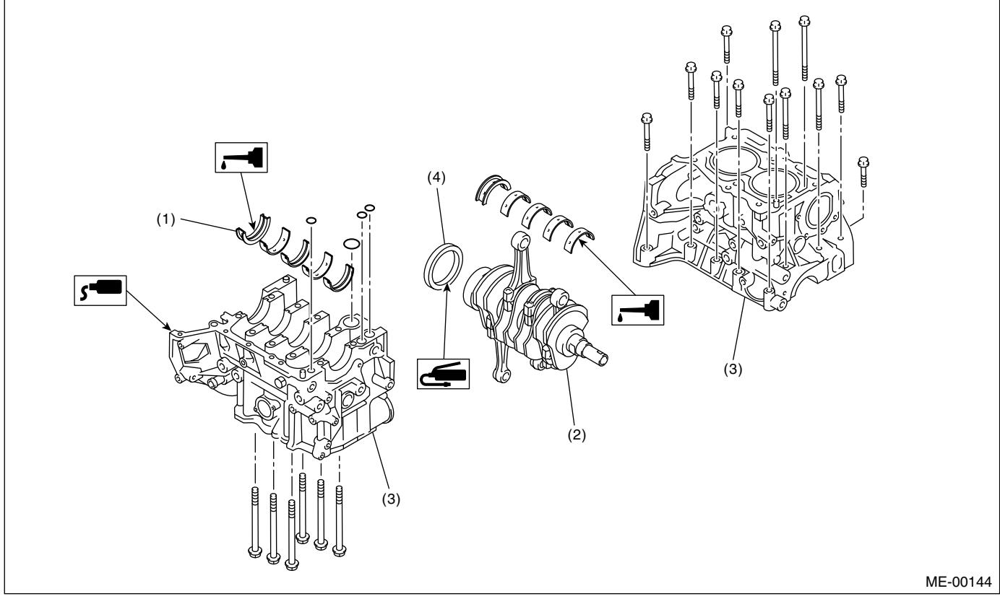

(1) Crankshaft bearing (3) Cylinder block (4) Rear oil seal

(2) Crankshaft

1) Remove oil in the mating surface of bearing and cylinder block before installation. Also apply a coat of engine oil to crankshaft pins.

2) Position the crankshaft on #2 and #4 cylinder block.

3) Apply fluid packing to the mating surface of #1 and #3 cylinder block, and position it on #2 and #4 cylinder block.

#### *Fluid packing:*

#### *Part No. 004403007 THREE BOND 1215 or equivalent*

#### NOTE:

Do not allow fluid packing to jut into O-ring grooves, oil passages, bearing grooves, etc.

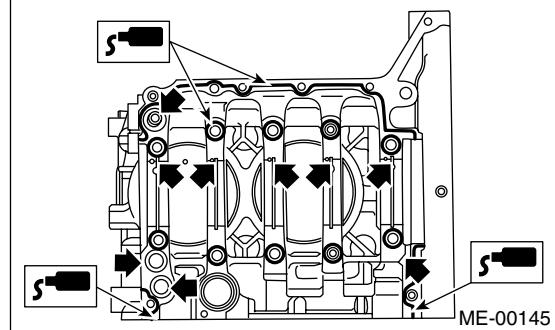

4) Tighten the 10 mm cylinder block connecting bolts in alphabetical sequence shown in the figure. (LH side)

### *Tightening torque: 15 N·m (1.5 kgf-m, 10.8 ft-lb)*

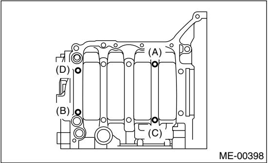

bl k

{36}------------------------------------------------

5) Tighten the 10 mm cylinder block connecting bolts in alphabetical sequence shown in the figure. (RH side)

### *Tightening torque: 15 N·m (1.5 kgf-m, 10.8 ft-lb)*

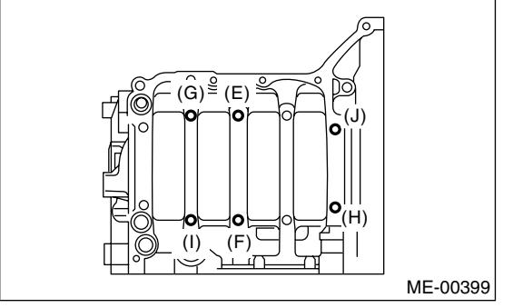

6) Further tighten the LH side bolts (A — D) to 90° in alphabetical sequence.

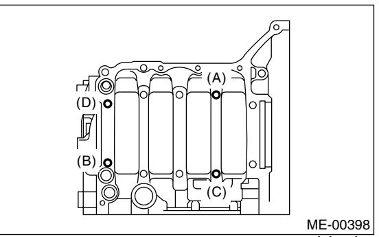

7) Further tighten the RH side bolts (E — J) to 90° in alphabetical sequence. bl k

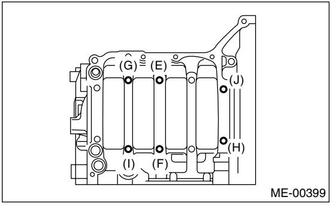

8) Tighten the 8 mm and 6 mm cylinder block connecting bolts in alphabetical sequence shown in the figure.

### *Tightening torque:*

*(A) — (G): 25 N·m (2.5 kgf-m, 18.1 ft-lb) (H): 6.4 N·m (0.65 kgf-m, 4.7 ft-lb)*

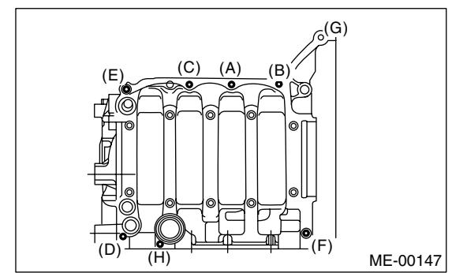

- 9) Install the rear oil seal using ST1 and ST2. ST1 499597100 CRANKSHAFT OIL SEAL GUIDE
- 

ST2 499587200 CRANKSHAFT OIL SEAL IN-STALLER

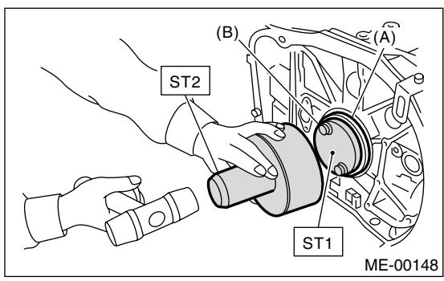

- (A) Rear oil seal
- (B) Flywheel attaching bolt

10) Position the top ring gap at (A) or (B) in the figure.

11) Position the second ring gap at 180° on the reverse side for the top ring gap.

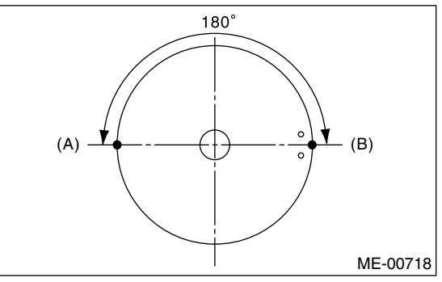

{37}------------------------------------------------

12) Position the expander gap at (C) in the figure.

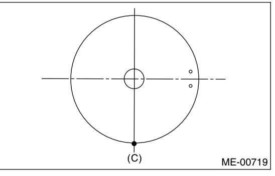

13) Position the lower rail gap at (D) in the figure.

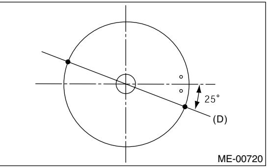

14) Align lower rail spin stopper (F) with piston side surface hole (E).

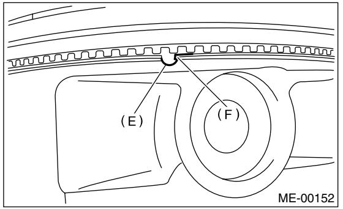

15) Position the upper rail gap at (G) in the figure.

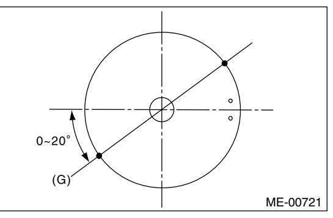

### NOTE:

- Ensure ring gaps do not face the same direction.
- Ensure ring gaps are not within the piston skirt area.

16) Install the circlip.

Install the circlips in piston holes located opposite of service holes in cylinder block, when positioning all pistons in the corresponding cylinders.

{38}------------------------------------------------

Use new circlips.

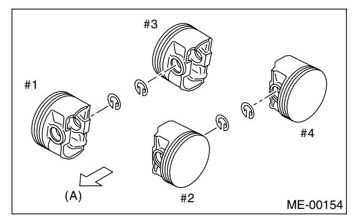

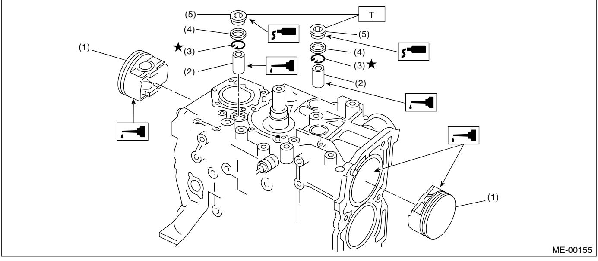

- -
- 
- (3) Circlip
- 
- 17) Installing the piston: (1) Turn the cylinder block so that #1 and #2 cyl
	- inders face upward. (2) Using the ST1, turn the crankshaft so that #1 and #2 connecting rods are set at bottom dead center.
- ST1 499987500 CRANKSHAFT SOCKET
	- (3) Apply a coat of engine oil to the pistons and cylinders and insert pistons in their cylinders using ST2.

(1) Piston (4) Gasket *Tightening torque: N·m (kgf-m, ft-lb)* (2) Piston pin (5) Service hole plug *T: 70 (7.1, 51.4)*

# ST2 398744300 PISTON GUIDE

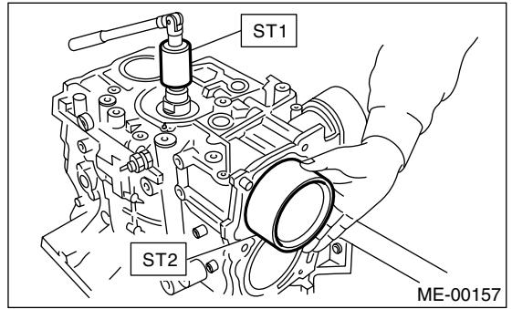

{39}------------------------------------------------

Piston front mark faces towards the front of the engine.

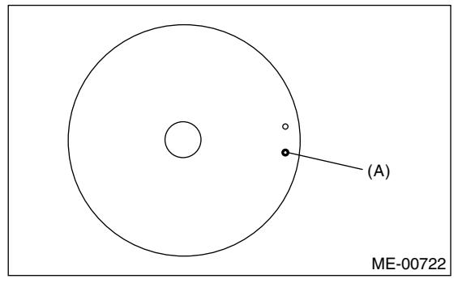

- (A) Front mark
- 18) Installing piston pin:
	- (1) Apply a coat of engine oil to ST3, and then insert the ST3 into service hole to align piston pin hole with connecting rod small end.
- ST3 499017100 PISTON PIN GUIDE

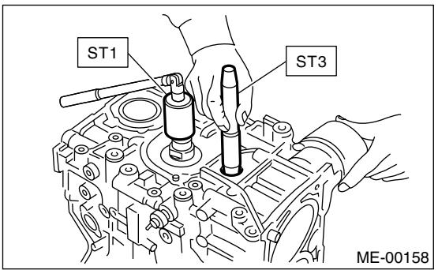

(2) Apply a coat of engine oil to the piston pin and insert piston pin into piston and connecting rod through service hole.

(3) Using the ST, install the circlip.

ST 499897200 PISTON CIRCLIP PLIERS NOTE:

Use new circlips.

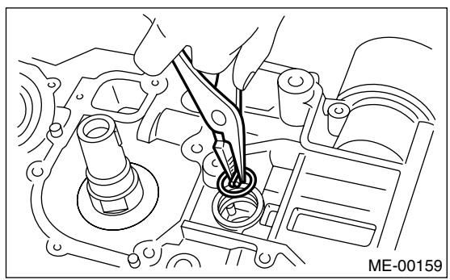

(4) Apply fluid packing around the service hole plug.

#### *Fluid packing:*

*Part No. 004403007 THREE BOND 1215 or equivalent*

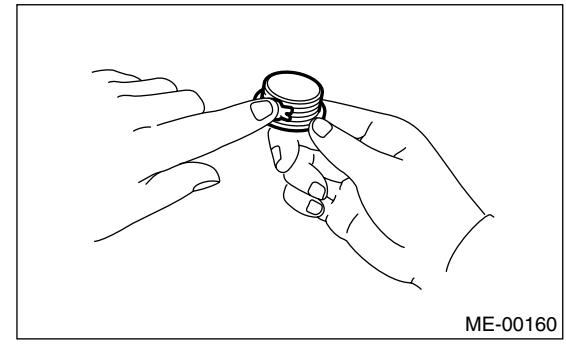

(5) Install the service hole plug and gasket.

{40}------------------------------------------------

Use a new gasket.

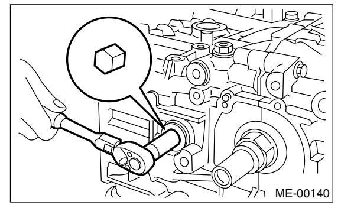

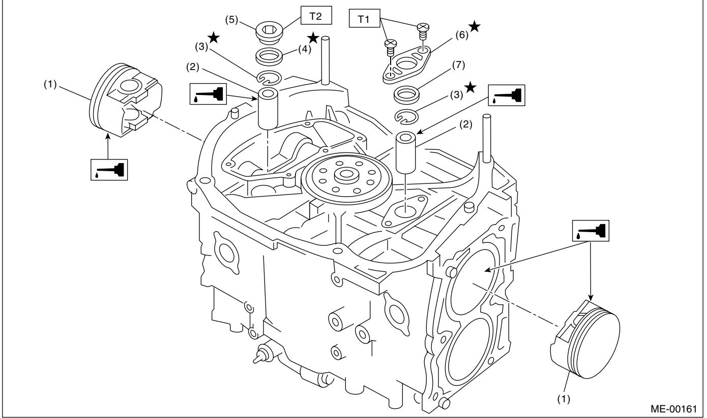

- 
- 
- 
- (4) Gasket

(6) Turn the cylinder block so that #3 and #4 cylinders face upward. Using the same procedures as used for #1 and #2 cylinders, install the pistons and piston pins.

- 19) Install the water pipe.
- 20) Install the baffle plate.

# *Tightening torque:*

*6.4 N·m (0.65 kgf-m, 4.7 ft-lb)*

- 
- (2) Piston pin (6) Service hole cover *T1: 6.4 (0.65, 4.7)*
	-

(1) Piston (5) Service hole plug *Tightening torque: N·m (kgf-m, ft-lb)* (3) Circlip (7) O-ring *T2: 70 (7.1, 51.4)*

21) Install the oil strainer and O-ring

*Tightening torque: 10 N·m (1.0 kgf-m, 7 ft-lb)* 22) Install the oil strainer stay.

{41}------------------------------------------------

23) Apply fluid packing to the matching surfaces, and then install the oil pan.

### *Fluid packing:*

*Part No. 004403007 THREE BOND 1215 or equivalent*

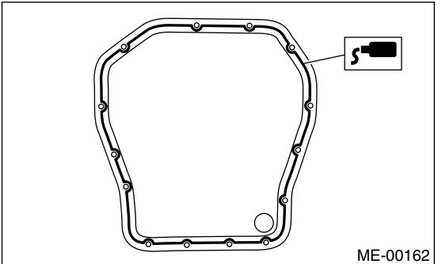

24) Apply fluid packing to the matching surfaces, and then install the oil separator cover.

### *Fluid packing: Part No. 004403007*

*THREE BOND 1215 or equivalent*

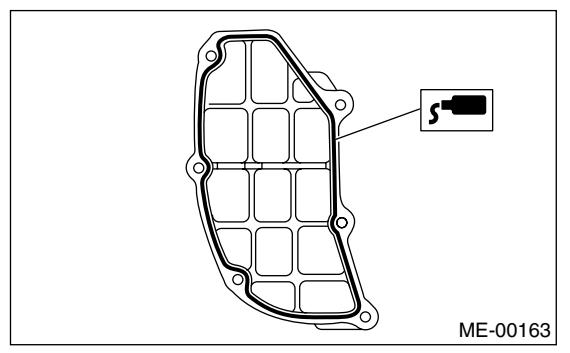

- 25) Install the drive plate. (AT model)
- To lock the crankshaft, use ST.

ST 498497100 CRANKSHAFT STOPPER

# *Tightening torque:*

*72 N·m (7.3 kgf-m, 52.8 ft-lb)*

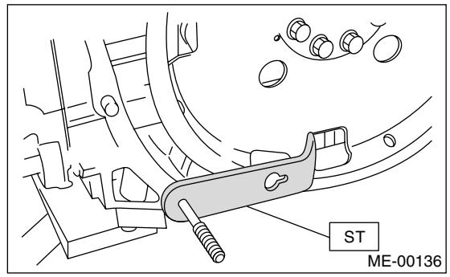

26) Install the flywheel. (MT model) <Ref. to CL-24, INSTALLATION, Flywheel.>

27) Install the clutch disc and cover. (MT model) <Ref. to CL-20, INSTALLATION, Clutch Disc and Cover.>

28) Installation of oil pump:

- (1) Discard the front oil seal after removal. Replace with a new one using the ST.
- ST 499587100 OIL SEAL INSTALLER

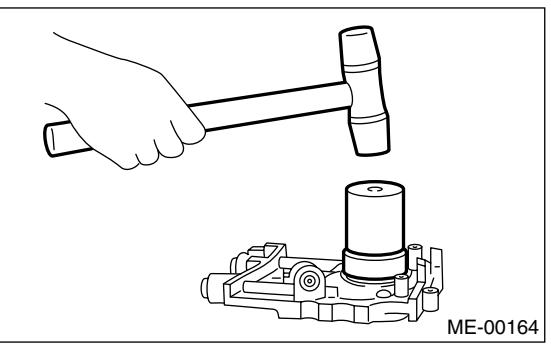

(2) Apply fluid packing to the matching surface of oil pump.

#### *Fluid packing: Part No. 004403007 THREE BOND 1215 or equivalent*

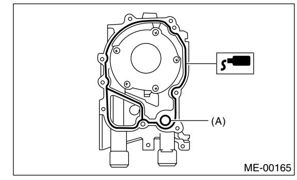

(A) O-ring

(3) Apply a coat of engine oil to the inside of the oil seal.

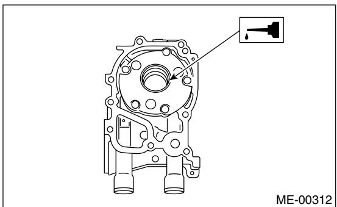

(4) Install the oil pump on cylinder block. Be careful not to damage the oil seal during installation.

# *Tightening torque:*

*6.4 N·m (0.65 kgf-m, 4.7 ft-lb)*

NOTE:

• Do not forget to install the O-ring and seal when installing the oil pump.

{42}------------------------------------------------

• Align the flat surface of oil pump's inner rotor with crankshaft before installation.

29) Install the water pump and gasket.

#### *Tightening torque:*

*First; 12 N·m (1.2 kgf-m, 8.7 ft-lb) Second; 12 N·m (1.2 kgf-m, 8.7 ft-lb)*

NOTE:

• Be sure to use a new gasket.

• When installing the water pump, tighten the bolts in two stages in alphabetical sequence as shown in the figure.

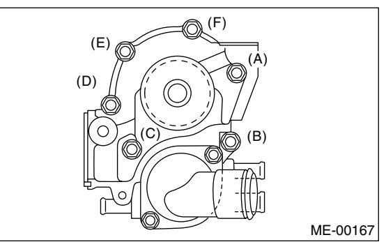

30) Install the water by-pass pipe for heater. 31) Install the oil cooler.

# *Tightening torque:*

*T1: 54 N·m (5.5 kgf-m, 40 ft-lb) T2: 69 N·m (7.0 kgf-m, 50.6 ft-lb)*

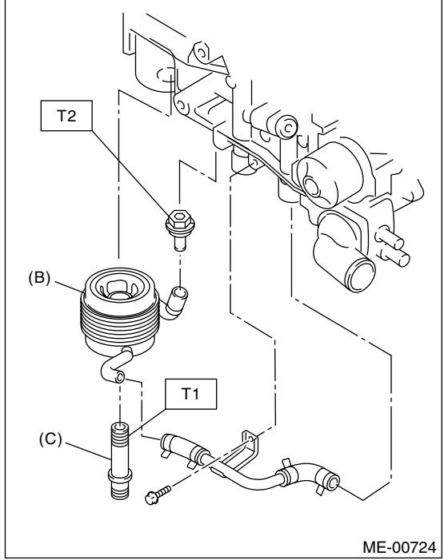

- (B) Oil cooler
- (C) Oil cooler connector

32) Install the oil filter using ST.

ST 498547000 OIL FILTER WRENCH

33) Install the water by-pass pipe between oil cooler and water pump.

34) Install the water pipe.

NOTE:

Always use a new O-ring.

35) Install the cylinder head assembly. [<Ref. to](#page-24-2) [ME\(H4DOTC\)-78, INSTALLATION, Cylinder Head](#page-24-2) [Assembly.>](#page-24-2)

36) Install the oil level gauge guide and tighten the attaching bolt (LH side).

37) Install the rocker cover.

38) Install the crankshaft sprocket. [<Ref. to](#page-14-2) [ME\(H4DOTC\)-68, INSTALLATION, Crankshaft](#page-14-2) [Sprocket.>](#page-14-2)

39) Install the camshaft sprocket. [<Ref. to](#page-13-0) [ME\(H4DOTC\)-67, INSTALLATION, Camshaft](#page-13-0) [Sprocket.>](#page-13-0)

40) Install the timing belt assembly. [<Ref. to](#page-6-1) [ME\(H4DOTC\)-60, INSTALLATION, Timing Belt](#page-6-1) [Assembly.>](#page-6-1)

41) Install the timing belt cover. [<Ref. to](#page-3-2) [ME\(H4DOTC\)-57, INSTALLATION, Timing Belt](#page-3-2) [Cover.>](#page-3-2)

42) Install the crankshaft pulley. [<Ref. to](#page-2-2) [ME\(H4DOTC\)-56, INSTALLATION, Crankshaft](#page-2-2) [Pulley.>](#page-2-2)

43) Install the generator and A/C compressor brackets on cylinder head.

44) Install the V-belt. <Ref. to ME(H4DOTC)-54, INSTALLATION, V-belt.>

45) Install the intake manifold. <Ref. to FU(H4DOTC)-14, REMOVAL, Intake Manifold.>

{43}------------------------------------------------

# **Cylinder Block**

# **C: DISASSEMBLY**

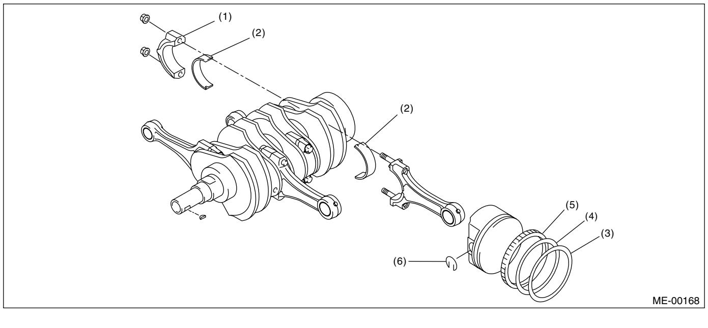

- (1) Connecting rod cap (3) Top ring (5) Oil ring
- 
- (2) Connecting rod bearing (4) Second ring (6) Circlip
- 1) Remove the connecting rod cap.

2) Remove the connecting rod bearing.

#### NOTE:

Arrange the removed connecting rod, connecting rod cap and bearing in order to prevent confusion.

3) Remove the piston rings using the piston ring expander.

4) Remove the oil ring by hand.

### NOTE:

Arrange the removed piston rings in proper order to prevent confusion.

5) Remove the circlip.

{44}------------------------------------------------

# **D: ASSEMBLY**

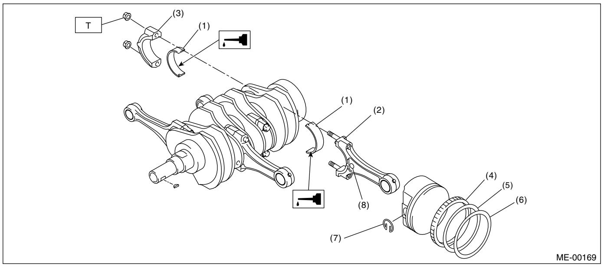

- 
- 
- (2) Connecting rod (6) Top ring *T: 45 (4.6, 33)*
- (3) Connecting rod cap (7) Circlip
- (4) Oil ring (8) Side mark

1) Apply oil to the surfaces of the connecting rod bearings. Install the connecting rod bearings on connecting rods and connecting rod caps.

2) Install the connecting rod on crankshaft.

### NOTE:

Position each connecting rod with the side marked facing forward.

3) Install the connecting rod cap with connecting rod nut.

Ensure the arrow on connecting rod cap faces the front during installation.

### NOTE:

• Each connecting rod has its own mating cap. Make sure that they are assembled correctly by checking their matching number.

• When tightening the connecting rod nuts, apply oil on the threads.

4) Install the oil ring spacer, upper rail and lower rail in this order by hand. Then install the second ring and top ring with a piston ring expander.

(1) Connecting rod bearing (5) Second ring *Tightening torque: N·m (kgf-m, ft-lb)*

# **E: INSPECTION**

# **1. CYLINDER BLOCK**

1) Visually check for cracks and damage. Especially, inspect the important parts by means of red lead check.

2) Check the oil passages for clogging.

3) Inspect the crankcase surface that mates with cylinder head for warping by using a straight edge, and correct by grinding if necessary.

# *Warping limit:*

*0.05 mm (0.0020 in)*

#### *Grinding limit: 0.1 mm (0.004 in)*

*Standard height of cylinder block: 201.0 mm (7.91 in)*

# **2. CYLINDER AND PISTON**

1) The cylinder bore size is stamped on cylinder block's front upper surface.

### NOTE:

• Measurement should be performed at a temperature of 20°C (68°F).

• Standard sized pistons are classified into two grades, "A" and "B". These grades should be used as a guide line in selecting a standard piston.

{45}------------------------------------------------

#### *Standard diameter:*

*A: 92.005 — 92.015 mm (3.6222 — 3.6226 in) B: 91.995 — 92.005 mm (3.6218 — 3.6222 in)*

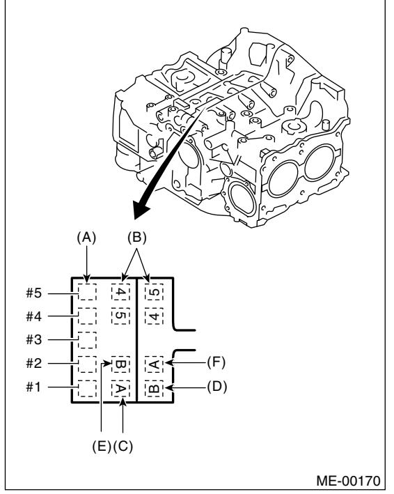

- (A) Main journal size mark
- (B) Cylinder block (RH)-(LH) combination mark
- (C) #1 cylinder bore size mark
- (D) #2 cylinder bore size mark
- (E) #3 cylinder bore size mark
- (F) #4 cylinder bore size mark

2) How to measure the inner diameter of each cylinder:

Measure the inner diameter of each cylinder in both the thrust and piston pin directions at the heights shown in the figure, using a cylinder bore gauge.

#### NOTE:

Measurement should be performed at a temperature of 20°C (68°F).

### *Taper:*

*Standard 0.015 mm (0.0006 in) Limit 0.050 mm (0.0020 in)*

#### *Out-of-roundness:*

- *Standard*
- *0.010 mm (0.0004 in) Limit*

*0.050 mm (0.0020 in)*

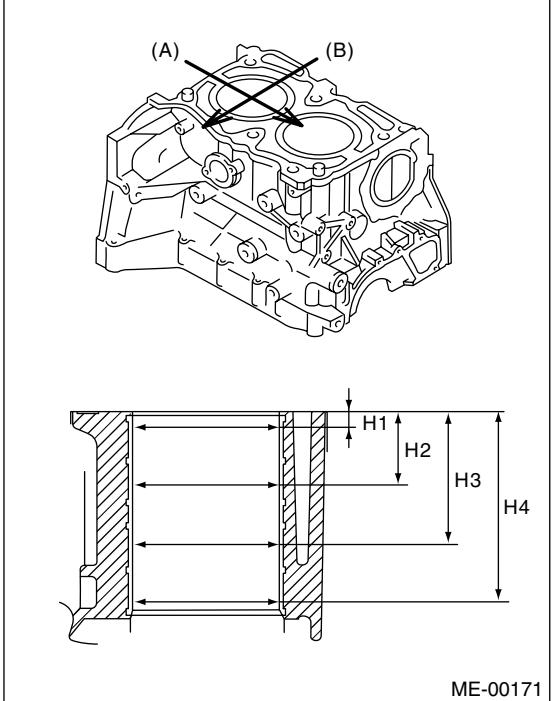

- (A) Piston pin direction
- (B) Thrust direction
- H1: 10 mm (0.39 in)
- H2: 45 mm (1.77 in)
- H3: 80 mm (3.15 in)
- H4: 115 mm (4.53 in)

3) When the piston is to be replaced due to general or cylinder wear, determine a suitable sized piston by measuring the piston clearance.

4) How to measure the outer diameter of each piston:

Measure the outer diameter of each piston at the height shown in the figure. (Thrust direction)

#### NOTE:

Measurement should be performed at a temperature of 20°C (68°F).

### *Piston grade point H: 40.0 mm (1.57 in)*

{46}------------------------------------------------

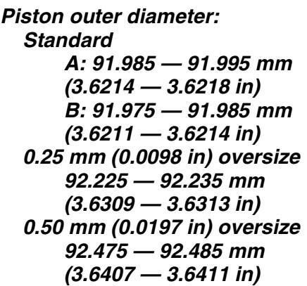

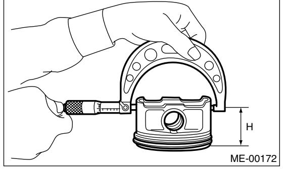

5) Calculate the clearance between cylinder and piston.

### NOTE:

Measurement should be performed at a temperature of 20°C (68°F).

#### *Cylinder to piston clearance at 20*°*C (68*°*F): Standard*

*0.010 — 0.030 mm (0.0004 — 0.0012 in) Limit*

### *0.050 mm (0.0020 in)*

6) Boring and honing:

(1) If the value of taper, out-of-roundness, or cylinder-to-piston clearance measured exceeds the specified limit or if there is any damage on the cylinder wall, reboring it to use an oversize piston.

### **CAUTION:**

**When any of the cylinders needs reboring, all other cylinders must be bored at the same time, and use oversize pistons. Do not perform boring on one cylinder only, nor use an oversize piston for one cylinder only.**

(2) If the cylinder inner diameter exceeds the limit after boring and honing, replace the crankcase.

#### NOTE:

Immediately after reboring, the cylinder diameter may differ from its real diameter due to temperature rise. Thus, pay attention to this when measuring the cylinder diameter.

#### *Limit of cylinder enlarging (boring): 0.5 mm (0.020 in)*

# **3. PISTON AND PISTON PIN**

1) Check the pistons and piston pins for damage, cracks, and wear and the piston ring grooves for wear and damage. Replace if defective.

2) Measure the piston-to-cylinder clearance at each cylinder. [<Ref. to ME\(H4DOTC\)-98, CYLIN-](#page-44-0)[DER AND PISTON, INSPECTION, Cylinder](#page-44-0) [Block.>](#page-44-0) If any of the clearances is not within specification, replace the piston or bore the cylinder to use an oversize piston.

3) Make sure that the piston pin can be inserted into the piston pin hole with a thumb at 20°C (68°F). Replace if defective.

### *Standard clearance between piston pin and hole in piston:*

*Standard 0.004 — 0.008 mm (0.0002 — 0.0003 in)*

*Limit*

*0.020 mm (0.0008 in)*

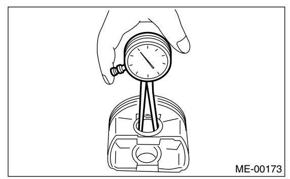

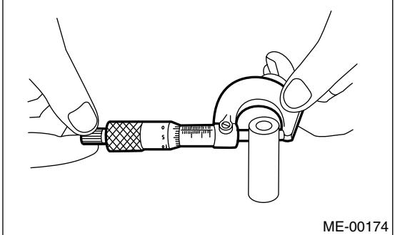

{47}------------------------------------------------

4) Check the circlip installation groove on piston for burr (A). If necessary, remove the burr from groove so that the piston pin can lightly move.

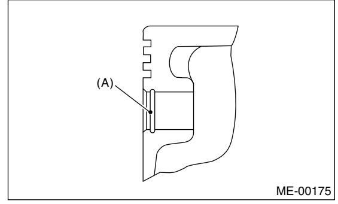

5) Check the piston pin circlip for distortion, cracks and wear.

# **4. PISTON RING**

1) If the piston ring is broken, damaged, or worn, or if its tension is insufficient, or when the piston is replaced, replace the piston ring with a new one of the same size as the piston.

### NOTE:

• Marks are shown on the end of top and second rings. When installing the rings to piston, face this mark upward.

• Oil ring consists of upper rail, expander and lower rail. When installing on piston, be careful of each rail's direction.

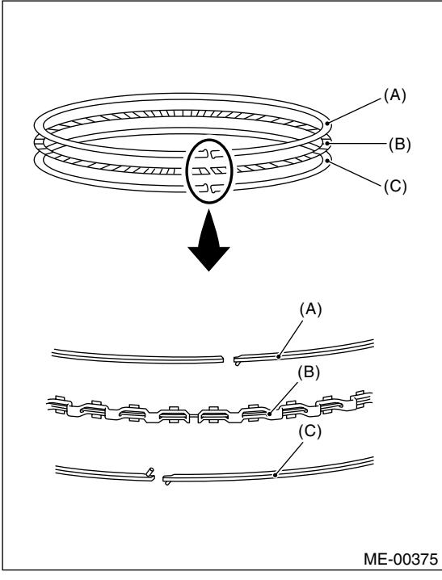

- (A) Upper rail
- (B) Expander
- (C) Lower rail

2) Squarely place the piston ring and oil ring in cylinder, and then measure the piston ring gap with a thickness gauge.

|                    |                  |                                  | Unit: mm (in) |
|--------------------|------------------|----------------------------------|---------------|
|                    |                  | Standard Limit                |               |
|                    | Top ring         | 0.20 — 0.25 (0.0079 — 0.0098) | 1.0 (0.039)   |
| Piston ring gap | Second ring   | 0.40 — 0.50 (0.0157 — 0.0197) | 1.0 (0.039)   |
|                    | Oil ring rail | 0.20 — 0.50 (0.0079 — 0.0197) | 1.5 (0.059)   |

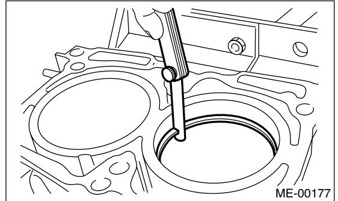

3) Measure the clearance between piston ring and piston ring groove with a thickness gauge.

### NOTE:

Before measuring the clearance, clean the piston ring groove and piston ring.

|                                                                  |                |                                    | Unit: mm (in) |
|------------------------------------------------------------------|----------------|------------------------------------|---------------|
|                                                                  |                | Standard                           | Limit         |
| Clearance between piston ring and piston ring groove | Top ring       | 0.040 — 0.080 (0.0016 — 0.0031) | 0.15 (0.0059) |
|                                                                  | Second ring | 0.030 — 0.070 (0.0012 — 0.0028) | 0.15 (0.0059) |

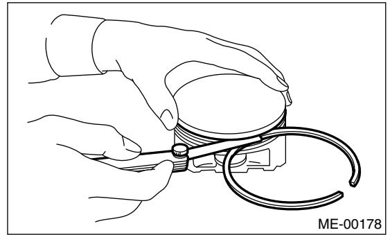

# **5. CONNECTING ROD**

1) Replace the connecting rod, if the large or small end thrust surface is damaged.

2) Check for bend or twist using a connecting rod aligner. Replace the connecting rod if the bend or twist exceeds the limit.

{48}------------------------------------------------

# *Limit of bend or twist per 100 mm (3.94 in) in length:*

*0.10 mm (0.0039 in)*

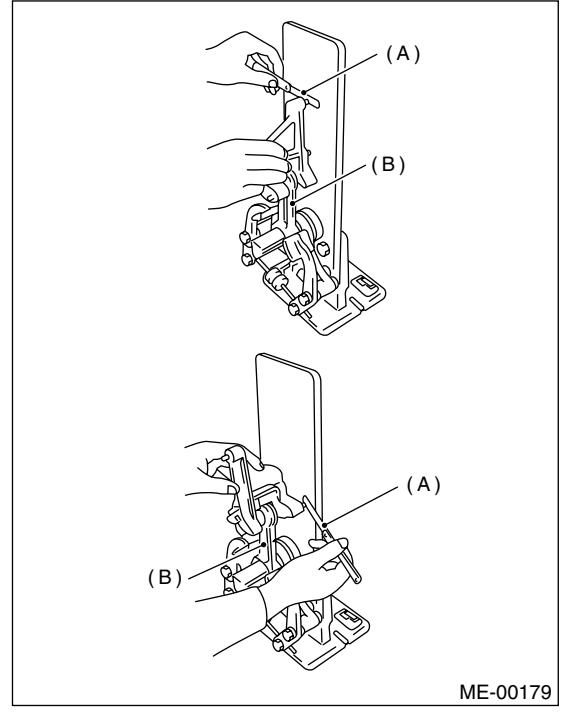

- (A) Thickness gauge
- (B) Connecting rod

3) Install the connecting rod fitted with bearing to crankshaft, and then measure the side clearance (thrust clearance). Replace the connecting rod if the side clearance exceeds the specified limit.

### *Connecting rod side clearance:*

*Standard 0.070 — 0.330 mm (0.0028 — 0.0130 in) Limit 0.40 mm (0.016 in)*

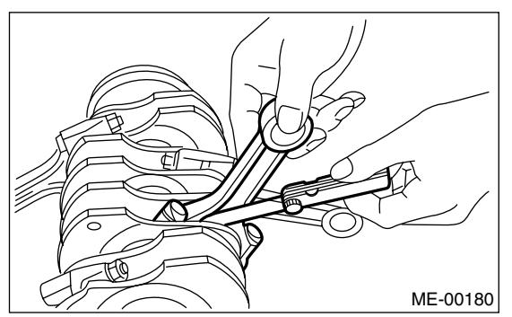

4) Inspect the connecting rod bearing for scar, peeling, seizure, melting, wear, etc.

5) Measure the oil clearance on individual connecting rod bearings by means of plastigauge. If any oil clearance is not within specification, replace the defective bearing with a new one of standard size or undersize as necessary. (See the table below.)

#### *Connecting rod oil clearance: Standard 0.020 — 0.046 mm (0.0008 — 0.0018 in) Limit*

*0.050 mm (0.0020 in)*

| Unit: mm (in)                 |                                           |                                      |  |  |
|-------------------------------|-------------------------------------------|--------------------------------------|--|--|
| Bearing                       | Bearing size (Thickness at cen ter) | Outer diameter of crank pin       |  |  |
| Standard                      | 1.486 — 1.498 (0.0585 — 0.0590)        | 51.984 — 52.000 (2.0466 — 2.0472) |  |  |
| 0.03 (0.0012) undersize | 1.504 — 1.512 (0.0592 — 0.0595)        | 51.954 — 51.970 (2.0454 — 2.0461) |  |  |
| 0.05 (0.0020) undersize | 1.514 — 1.522 (0.0596 — 0.0599)        | 51.934 — 51.950 (2.0447 — 2.0453) |  |  |
| 0.25 (0.0098) undersize | 1.614 — 1.622 (0.0635 — 0.0639)        | 51.734 — 51.750 (2.0368 — 2.0374) |  |  |

{49}------------------------------------------------

6) Inspect the bushing at connecting rod small end, and replace if worn or damaged. Also measure the piston pin clearance at connecting rod small end.

#### *Clearance between piston pin and bushing: Standard*

*0 — 0.022 mm (0 — 0.0009 in) Limit*

*0.030 mm (0.0012 in)*

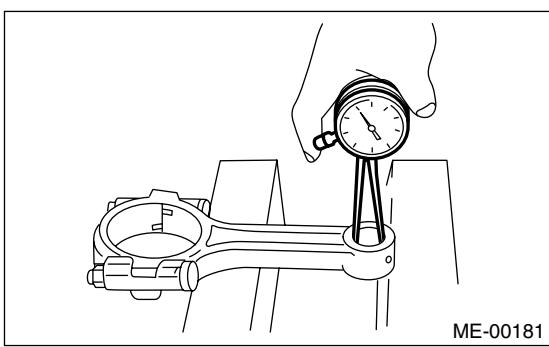

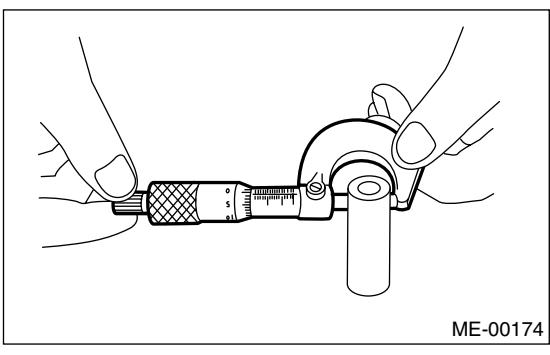

7) Replacement procedure is as follows:

(1) Remove the bushing from connecting rod with ST and press.

(2) Press the bushing with ST after applying oil on the periphery of bushing.

ST 499037100 CONNECTING ROD BUSH-ING REMOVER AND IN-STALLER

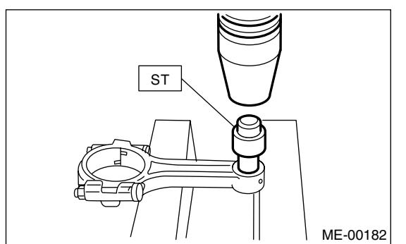

(3) Make two 3 mm (0.12 in) holes in bushing. Ream the inside of bushing.

(4) After the completion of reaming, clean the bushing to remove chips.

#### **6. CRANKSHAFT AND CRANKSHAFT BEARING**

1) Clean the crankshaft completely and check for cracks by means of red lead check etc., and replace if defective.

2) Measure the crankshaft bend, and correct or replace if it exceeds the limit.

### NOTE:

If a suitable V-block is not available, install the #1 and #5 crankshaft bearing on cylinder block, position the crankshaft on these bearings and measure the crankshaft bend using a dial gauge.

### *Crankshaft bend limit: 0.035 mm (0.0014 in)*

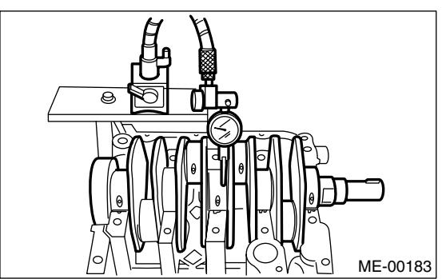

3) Inspect the crank journal and crank pin for wear. If they are not within the specifications, replace the bearing with a suitable (undersize) one, and then replace or recondition the crankshaft as necessary. When grinding the crank journal or crank pin, finish them to specified dimensions according to the undersize bearing to be used.

# *Crank pin and crank journal:*

*Out-of-roundness 0.005 mm (0.0002 in) or less Taper limit 0.07 mm (0.0028 in) Grinding limit 0.250 mm (0.0098 in)*

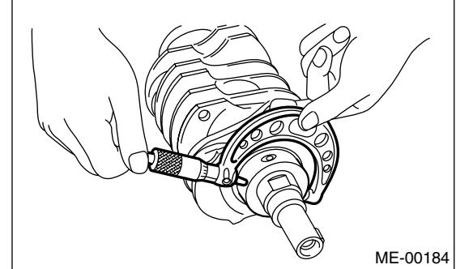

{50}------------------------------------------------

| Unit: mm (in)              |                                           |                                      |                                      |                                      |  |
|----------------------------|-------------------------------------------|--------------------------------------|--------------------------------------|--------------------------------------|--|
|                            |                                           | Crank journal diameter               |                                      |                                      |  |
|                            |                                           | #1, #3, #5                           | #2, #4                               | Crank pin diameter                   |  |
| Standard                   | Journal O.D.                              | 59.992 — 60.008 (2.3619 — 2.3625) | 59.992 — 60.008 (2.3619 — 2.3625) | 51.984 — 52.000 (2.0466 — 2.0472) |  |
|                            | Bearing size (Thickness at cen ter) | 1.998 — 2.011 (0.0787 — 0.0792)   | 2.000 — 2.013 (0.0787 — 0.0793)   | 1.486 — 1.498 (0.0585 — 0.0590)   |  |
| 0.03 (0.0012) undersize | Journal O.D.                              | 59.962 — 59.978 (2.3607 — 2.3613) | 59.962 — 59.978 (2.3607 — 2.3613) | 51.954 — 51.970 (2.0454 — 2.0461) |  |
|                            | Bearing size (Thickness at cen ter) | 2.017 — 2.020 (0.0794 — 0.0795)   | 2.019 — 2.022 (0.0795 — 0.0796)   | 1.504 — 1.512 (0.0592 — 0.0595)   |  |
| 0.05 (0.0020) undersize | Journal O.D.                              | 59.942 — 59.958 (2.3599 — 2.3605) | 59.942 — 59.958 (2.3599 — 2.3605) | 51.934 — 51.950 (2.0447 — 2.0453) |  |
|                            | Bearing size (Thickness at cen ter) | 2.027 — 2.030 (0.0798 — 0.0799)   | 2.029 — 2.032 (0.0799 — 0.0800)   | 1.514 — 1.522 (0.0596 — 0.0599)   |  |
| 0.25 (0.0098) undersize | Journal O.D.                              | 59.742 — 59.758 (2.3520 — 2.3527) | 59.742 — 59.758 (2.3520 — 2.3527) | 51.734 — 51.750 (2.0368 — 2.0374) |  |
|                            | Bearing size (Thickness at cen ter) | 2.127 — 2.130 (0.0837 — 0.0839)   | 2.129 — 2.132 (0.0838 — 0.0839)   | 1.614 — 1.622 (0.0635 — 0.0639)   |  |

O.D.: Outer Diameter

4) Measure the thrust clearance of crankshaft at center bearing. If the clearance exceeds the limit, replace the bearing.

#### *Crankshaft thrust clearance:*

*Standard*

*0.030 — 0.115 mm (0.0012 — 0.0045 in) Limit*

*0.25 mm (0.0098 in)*

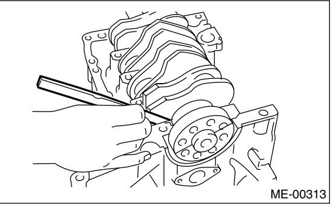

5) Inspect individual crankshaft bearings for signs of flaking, seizure, melting, and wear.

6) Measure the oil clearance on each crankshaft bearing by means of plastigauge. If the measurement is not within the specification, replace the defective bearing with an undersize one, and replace or recondition the crankshaft as necessary.

|    |       | Unit: mm (in)                   |
|----|-------|---------------------------------|
|    |       | Crankshaft oil clearance        |
| #1 | STD   | 0.010 — 0.030 (0.0004 — 0.0012) |
|    | Limit | 0.040 (0.0016)                  |
| #2 | STD   | 0.010 — 0.030 (0.0004 — 0.0012) |
|    | Limit | 0.045 (0.0018)                  |
| #3 | STD   | 0.010 — 0.030 (0.0004 — 0.0012) |
|    | Limit | 0.040 (0.0016)                  |
| #4 | STD   | 0.010 — 0.030 (0.0004 — 0.0012) |
|    | Limit | 0.045 (0.0018)                  |
| #5 | STD   | 0.010 — 0.030 (0.0004 — 0.0012) |
|    | Limit | 0.040 (0.0016)                  |

{51}------------------------------------------------

# **21.Intake and Exhaust Valve**

# **A: REMOVAL AND INSTALLATION**

For operations related to intake and exhaust valve, refer to "19. Cylinder Head." [<Ref. to](#page-24-1) [ME\(H4DOTC\)-78, REMOVAL, Cylinder Head As](#page-24-1)[sembly.>](#page-24-1) and [<Ref. to ME\(H4DOTC\)-78, INSTAL-](#page-24-2)[LATION, Cylinder Head Assembly.>](#page-24-2)

{52}------------------------------------------------

# **22.Piston**

# **A: REMOVAL AND INSTALLATION**

For operations related to piston, refer to "20. Cylinder Block." [<Ref. to ME\(H4DOTC\)-85, REMOVAL,](#page-31-1) [Cylinder Block.>](#page-31-1) and [<Ref. to ME\(H4DOTC\)-89,](#page-35-0) [INSTALLATION, Cylinder Block.>](#page-35-0)

{53}------------------------------------------------

# **23.Connecting Rod**

# **A: REMOVAL AND INSTALLATION**

For operations related to connecting rod, refer to "20. Cylinder Block." [<Ref. to ME\(H4DOTC\)-85,](#page-31-1) [REMOVAL, Cylinder Block.>](#page-31-1) and [<Ref. to](#page-35-0) [ME\(H4DOTC\)-89, INSTALLATION, Cylinder](#page-35-0) [Block.>](#page-35-0)

{54}------------------------------------------------

# **24.Crankshaft**

# **A: REMOVAL AND INSTALLATION**

For operations related to crankshaft, refer to "20. Cylinder Block." [<Ref. to ME\(H4DOTC\)-85, RE-](#page-31-1)[MOVAL, Cylinder Block.>](#page-31-1) and [<Ref. to](#page-35-0) [ME\(H4DOTC\)-89, INSTALLATION, Cylinder](#page-35-0) [Block.>](#page-35-0)

{55}------------------------------------------------

# **25.Engine Trouble in General A: INSPECTION**

NOTE:

"RANK" shown in the chart refers to the possibility of reason for the trouble in order ("Very often" to "Rarely") A — Very often

- B Sometimes
- C Rarely

| TROUBLE                       | PROBLEM PARTS, ETC.                                                                                   | POSSIBLE CAUSE                                                                                        | RANK |
|-------------------------------|-------------------------------------------------------------------------------------------------------|-------------------------------------------------------------------------------------------------------|------|
| 1. Engine will not start.     |                                                                                                       |                                                                                                       |      |
| 1) Starter does not turn.     | Starter                                                                                               | Defective battery-to-starter harness                                                                  |      |
|                               |                                                                                                       | Defective starter switch                                                                              | C    |
|                               |                                                                                                       | Defective inhibitor switch or neutral switch                                                          | C    |
|                               |                                                                                                       | Defective starter                                                                                     | B    |
|                               | Battery                                                                                               | Poor terminal connection                                                                              | A    |
|                               |                                                                                                       | Run-down battery                                                                                      | A    |
|                               |                                                                                                       | Defective charging system                                                                             | B    |
|                               | Friction                                                                                              | Seizure of crankshaft and connecting rod bearing                                                      | C    |
|                               |                                                                                                       | Seized camshaft                                                                                       | C    |
|                               |                                                                                                       | Seized or stuck piston and cylinder                                                                   | C    |
| 2) Initial combustion does    | Starter                                                                                               | Defective starter                                                                                     | C    |
| not occur.                    | Engine control system <ref. basic="" diagnostic="" en(h4dotc)(diag)-2,="" procedure.="" to=""></ref.> |                                                                                                       |      |
|                               | Fuel line                                                                                             | Defective fuel pump and relay                                                                         | A    |
|                               |                                                                                                       | Lack of or insufficient fuel                                                                          | B    |
|                               | Belt                                                                                                  | Defective                                                                                             | B    |
|                               |                                                                                                       | Defective timing                                                                                      | B    |
|                               | Compression                                                                                           | Incorrect valve clearance                                                                             | C    |
|                               |                                                                                                       | Loosened spark plugs or defective gasket                                                              | C    |
|                               |                                                                                                       | Loosened cylinder head bolts or defective gasket                                                      | C    |
|                               |                                                                                                       | Improper valve seating                                                                                | C    |
|                               |                                                                                                       | Defective valve stem                                                                                  | C    |
|                               |                                                                                                       | Worn or broken valve spring                                                                           | B    |
|                               |                                                                                                       | Worn or stuck piston rings, cylinder and piston                                                       | C    |
|                               |                                                                                                       | Incorrect valve timing                                                                                | B    |
|                               |                                                                                                       | Improper engine oil (low viscosity)                                                                   | B    |
| 3) Initial combustion occurs. |                                                                                                       | Engine control system <ref. basic="" diagnostic="" en(h4dotc)(diag)-2,="" procedure.="" to=""></ref.> | A    |
|                               | Intake system                                                                                         | Defective intake manifold gasket                                                                      | B    |
|                               |                                                                                                       | Defective throttle body gasket                                                                        | B    |
|                               | Fuel line                                                                                             | Defective fuel pump and relay                                                                         | C    |
|                               |                                                                                                       | Clogged fuel line                                                                                     | C    |
|                               |                                                                                                       | Lack of or insufficient fuel                                                                          | B    |
|                               | Belt                                                                                                  | Defective                                                                                             | B    |
|                               |                                                                                                       | Defective timing                                                                                      | B    |
|                               | Compression                                                                                           | Incorrect valve clearance                                                                             | C    |
|                               |                                                                                                       | Loosened spark plugs or defective gasket                                                              | C    |
|                               |                                                                                                       | Loosened cylinder head bolts or defective gasket                                                      | C    |
|                               |                                                                                                       | Improper valve seating                                                                                | C    |
|                               |                                                                                                       | Defective valve stem                                                                                  | C    |
|                               |                                                                                                       | Worn or broken valve spring                                                                           | B    |
|                               |                                                                                                       | Worn or stuck piston rings, cylinder and piston                                                       | C    |
|                               |                                                                                                       | Incorrect valve timing                                                                                | B    |
|                               |                                                                                                       | Improper engine oil (low viscosity)                                                                   | B    |

{56}------------------------------------------------

#### MECHANICAL

# **Engine Trouble in General**

| TROUBLE                        | PROBLEM PARTS, ETC.                                                                                         | POSSIBLE CAUSE                                                                                        | RANK |
|--------------------------------|-------------------------------------------------------------------------------------------------------------|-------------------------------------------------------------------------------------------------------|------|
| 4) Engine stalls after initial |                                                                                                             | Engine control system <ref. basic="" diagnostic="" en(h4dotc)(diag)-2,="" procedure.="" to=""></ref.> |      |
| combustion.                    | Intake system                                                                                               | Loosened or cracked intake duct                                                                       | B    |
|                                |                                                                                                             | Loosened or cracked PCV hose                                                                          | C    |
|                                |                                                                                                             | Loosened or cracked vacuum hose                                                                       | C    |
|                                |                                                                                                             | Defective intake manifold gasket                                                                      | B    |
|                                |                                                                                                             | Defective throttle body gasket                                                                        | B    |
|                                |                                                                                                             | Dirty air cleaner element                                                                             | C    |
|                                | Fuel line                                                                                                   | Clogged fuel line                                                                                     | C    |
|                                |                                                                                                             | Lack of or insufficient fuel                                                                          | B    |
|                                | Belt                                                                                                        | Defective                                                                                             | B    |
|                                |                                                                                                             | Defective timing                                                                                      | B    |
|                                | Compression                                                                                                 | Incorrect valve clearance                                                                             | C    |
|                                |                                                                                                             | Loosened spark plugs or defective gasket                                                              | C    |
|                                |                                                                                                             | Loosened cylinder head bolts or defective gasket                                                      | C    |
|                                |                                                                                                             | Improper valve seating                                                                                | C    |
|                                |                                                                                                             | Defective valve stem                                                                                  | C    |
|                                |                                                                                                             | Worn or broken valve spring                                                                           | B    |
|                                |                                                                                                             | Worn or stuck piston rings, cylinder and piston                                                       | C    |
|                                |                                                                                                             | Incorrect valve timing                                                                                | B    |
|                                |                                                                                                             | Improper engine oil (low viscosity)                                                                   | B    |
| 2. Rough idle and engine       | Engine control system <ref. basic="" diagnostic="" en(h4dotc)(diag)-2,="" procedure.="" to=""> A</ref.> |                                                                                                       |      |
| stall                          | Intake system                                                                                               | Loosened or cracked intake duct                                                                       | A    |
|                                |                                                                                                             | Loosened or cracked PCV hose                                                                          | A    |
|                                |                                                                                                             | Loosened or cracked vacuum hose                                                                       | A    |
|                                |                                                                                                             | Defective intake manifold gasket                                                                      | B    |
|                                |                                                                                                             | Defective throttle body gasket                                                                        | B    |
|                                |                                                                                                             | Defective PCV valve                                                                                   | C    |
|                                |                                                                                                             | Loosened oil filler cap                                                                               | B    |
|                                |                                                                                                             | Dirty air cleaner element                                                                             | C    |
|                                | Fuel line                                                                                                   | Defective fuel pump and relay                                                                         | C    |
|                                |                                                                                                             | Clogged fuel line                                                                                     | C    |
|                                |                                                                                                             | Lack of or insufficient fuel                                                                          | B    |
|                                | Belt                                                                                                        | Defective timing                                                                                      | C    |
|                                | Compression                                                                                                 | Incorrect valve clearance                                                                             | B    |
|                                |                                                                                                             | Loosened spark plugs or defective gasket                                                              | B    |
|                                |                                                                                                             | Loosened cylinder head bolts or defective gasket                                                      | B    |
|                                |                                                                                                             | Improper valve seating                                                                                | B    |
|                                |                                                                                                             | Defective valve stem                                                                                  | C    |
|                                |                                                                                                             | Worn or broken valve spring                                                                           | B    |
|                                |                                                                                                             | Worn or stuck piston rings, cylinder and piston                                                       | B    |
|                                |                                                                                                             | Incorrect valve timing                                                                                | A    |
|                                |                                                                                                             | Improper engine oil (low viscosity)                                                                   | B    |
|                                | Lubrication system                                                                                          | Incorrect oil pressure                                                                                | B    |
|                                |                                                                                                             | Defective rocker cover gasket                                                                         | C    |
|                                | Cooling system                                                                                              | Overheating                                                                                           | C    |
|                                | Others                                                                                                      | Malfunction of evaporative emission control system                                                    | A    |
|                                |                                                                                                             | Stuck or damaged throttle valve                                                                       | B    |
|                                |                                                                                                             | Accelerator cable out of adjustment                                                                   | C    |

{57}------------------------------------------------

# **Engine Trouble in General**

| TROUBLE                       | PROBLEM PARTS, ETC.                                                                                   | POSSIBLE CAUSE                                                                                        | RANK |
|-------------------------------|-------------------------------------------------------------------------------------------------------|-------------------------------------------------------------------------------------------------------|------|
| 3. Low output, hesitation and | Engine control system <ref. basic="" diagnostic="" en(h4dotc)(diag)-2,="" procedure.="" to=""></ref.> |                                                                                                       | A    |
| poor acceleration             | Intake system                                                                                         | Loosened or cracked intake duct                                                                       | A    |
|                               |                                                                                                       | Loosened or cracked PCV hose                                                                          | A    |
|                               |                                                                                                       | Loosened or cracked vacuum hose                                                                       | B    |
|                               |                                                                                                       | Defective intake manifold gasket                                                                      | B    |
|                               |                                                                                                       | Defective throttle body gasket                                                                        | B    |
|                               |                                                                                                       | Defective PCV valve                                                                                   | B    |
|                               |                                                                                                       | Loosened oil filler cap                                                                               | B    |
|                               |                                                                                                       | Dirty air cleaner element                                                                             | A    |
|                               | Fuel line                                                                                             | Defective fuel pump and relay                                                                         | B    |
|                               |                                                                                                       | Clogged fuel line                                                                                     | B    |
|                               |                                                                                                       | Lack of or insufficient fuel                                                                          | C    |
|                               | Belt                                                                                                  | Defective timing                                                                                      | B    |
|                               | Compression                                                                                           | Incorrect valve clearance                                                                             | B    |
|                               |                                                                                                       | Loosened spark plugs or defective gasket                                                              | B    |
|                               |                                                                                                       | Loosened cylinder head bolts or defective gasket                                                      | B    |
|                               |                                                                                                       | Improper valve seating                                                                                | B    |
|                               |                                                                                                       | Defective valve stem                                                                                  | C    |
|                               |                                                                                                       | Worn or broken valve spring                                                                           | B    |
|                               |                                                                                                       | Worn or stuck piston rings, cylinder and piston                                                       | C    |
|                               |                                                                                                       | Incorrect valve timing                                                                                | A    |
|                               |                                                                                                       | Improper engine oil (low viscosity)                                                                   | B    |
|                               | Lubrication system                                                                                    | Incorrect oil pressure                                                                                | B    |
|                               | Cooling system                                                                                        | Overheating                                                                                           | C    |
|                               |                                                                                                       | Over cooling                                                                                          | C    |
|                               | Others                                                                                                | Malfunction of evaporative emission control system                                                    | A    |
| 4. Surging                    |                                                                                                       | Engine control system <ref. basic="" diagnostic="" en(h4dotc)(diag)-2,="" procedure.="" to=""></ref.> | A    |
|                               | Intake system                                                                                         | Loosened or cracked intake duct                                                                       | A    |
|                               |                                                                                                       | Loosened or cracked PCV hose                                                                          | A    |
|                               |                                                                                                       | Loosened or cracked vacuum hose                                                                       | A    |
|                               |                                                                                                       | Defective intake manifold gasket                                                                      | B    |
|                               |                                                                                                       | Defective throttle body gasket                                                                        | B    |
|                               |                                                                                                       | Defective PCV valve                                                                                   | B    |
|                               |                                                                                                       | Loosened oil filler cap                                                                               | B    |
|                               |                                                                                                       | Dirty air cleaner element                                                                             | B    |
|                               | Fuel line                                                                                             | Defective fuel pump and relay                                                                         | B    |
|                               |                                                                                                       | Clogged fuel line                                                                                     | B    |
|                               |                                                                                                       | Lack of or insufficient fuel                                                                          | C    |
|                               | Belt                                                                                                  | Defective timing                                                                                      | B    |
|                               | Compression                                                                                           | Incorrect valve clearance                                                                             | B    |
|                               |                                                                                                       | Loosened spark plugs or defective gasket                                                              | C    |
|                               |                                                                                                       | Loosened cylinder head bolts or defective gasket                                                      | C    |
|                               |                                                                                                       | Improper valve seating                                                                                | C    |
|                               |                                                                                                       | Defective valve stem                                                                                  | C    |
|                               |                                                                                                       | Worn or broken valve spring                                                                           | C    |
|                               |                                                                                                       | Worn or stuck piston rings, cylinder and piston                                                       | C    |
|                               |                                                                                                       | Incorrect valve timing                                                                                | A    |
|                               |                                                                                                       | Improper engine oil (low viscosity)                                                                   | B    |
|                               | Cooling system                                                                                        | Overheating                                                                                           | B    |
|                               | Others                                                                                                | Malfunction of evaporative emission control system                                                    | C    |

{58}------------------------------------------------

MECHANICAL

# **Engine Trouble in General**

| TROUBLE                      | PROBLEM PARTS, ETC. | POSSIBLE CAUSE                                                                                        | RANK |
|------------------------------|---------------------|-------------------------------------------------------------------------------------------------------|------|
| 5. Engine does not return to |                     | Engine control system <ref. basic="" diagnostic="" en(h4dotc)(diag)-2,="" procedure.="" to=""></ref.> | A    |
| idle.                        | Intake system       | Loosened or cracked vacuum hose                                                                       | A    |
|                              | Others              | Stuck or damaged throttle valve                                                                       | A    |
|                              |                     | Accelerator cable out of adjustment                                                                   | B    |
| 6. Dieseling (Run-on)        |                     | Engine control system <ref. basic="" diagnostic="" en(h4dotc)(diag)-2,="" procedure.="" to=""></ref.> | A    |
|                              | Cooling system      | Overheating                                                                                           | B    |
|                              | Others              | Malfunction of evaporative emission control system                                                    | B    |
| 7. Afterburning in exhaust   |                     | Engine control system <ref. basic="" diagnostic="" en(h4dotc)(diag)-2,="" procedure.="" to=""></ref.> | A    |
| system                       | Intake system       | Loosened or cracked intake duct                                                                       | C    |
|                              |                     | Loosened or cracked PCV hose                                                                          | C    |
|                              |                     | Loosened or cracked vacuum hose                                                                       | B    |
|                              |                     | Defective PCV valve                                                                                   | B    |
|                              |                     | Loosened oil filler cap                                                                               | C    |
|                              | Belt                | Defective timing                                                                                      | B    |
|                              | Compression         | Incorrect valve clearance                                                                             | B    |
|                              |                     | Loosened spark plugs or defective gasket                                                              | C    |
|                              |                     | Loosened cylinder head bolts or defective gasket                                                      | C    |
|                              |                     | Improper valve seating                                                                                | B    |
|                              |                     | Defective valve stem                                                                                  | C    |
|                              |                     | Worn or broken valve spring                                                                           | C    |
|                              |                     | Worn or stuck piston rings, cylinder and piston                                                       | C    |
|                              |                     | Incorrect valve timing                                                                                | A    |
|                              | Lubrication system  | Incorrect oil pressure                                                                                | C    |
|                              | Cooling system      | Over cooling                                                                                          | C    |
|                              | Others              | Malfunction of evaporative emission control system                                                    | C    |
| 8. Knocking                  |                     | Engine control system <ref. basic="" diagnostic="" en(h4dotc)(diag)-2,="" procedure.="" to=""></ref.> | A    |
|                              | Intake system       | Loosened oil filler cap                                                                               | B    |
|                              | Belt                | Defective timing                                                                                      | B    |
|                              | Compression         | Incorrect valve clearance                                                                             | C    |
|                              |                     | Incorrect valve timing                                                                                | B    |
|                              | Cooling system      | Overheating                                                                                           | A    |
| 9. Excessive engine oil con  | Intake system       | Loosened or cracked PCV hose                                                                          | A    |
| sumption                     |                     | Defective PCV valve                                                                                   | B    |
|                              |                     | Loosened oil filler cap                                                                               | C    |
|                              | Compression         | Defective valve stem                                                                                  | A    |
|                              |                     | Worn or stuck piston rings, cylinder and piston                                                       | A    |
|                              | Lubrication system  | Loosened oil pump attaching bolts and defective gas ket                                            | B    |
|                              |                     | Defective oil filter o-ring                                                                           | B    |
|                              |                     | Defective crankshaft oil seal                                                                         | B    |
|                              |                     | Defective rocker cover gasket                                                                         | B    |
|                              |                     | Loosened oil drain plug or defective gasket                                                           | B    |
|                              |                     | Loosened oil pan fitting bolts or defective oil pan                                                   | B    |

{59}------------------------------------------------

# **Engine Trouble in General**

| TROUBLE                    | PROBLEM PARTS, ETC.                                                                                   | POSSIBLE CAUSE                                   | RANK |
|----------------------------|-------------------------------------------------------------------------------------------------------|--------------------------------------------------|------|
| 10. Excessive fuel consump | Engine control system <ref. basic="" diagnostic="" en(h4dotc)(diag)-2,="" procedure.="" to=""></ref.> |                                                  | A    |
| tion                       | Intake system                                                                                         | Dirty air cleaner element                        | A    |
|                            | Belt                                                                                                  | Defective timing                                 | B    |
|                            | Compression                                                                                           | Incorrect valve clearance                        | B    |
|                            |                                                                                                       | Loosened spark plugs or defective gasket         | C    |
|                            |                                                                                                       | Loosened cylinder head bolts or defective gasket | C    |
|                            |                                                                                                       | Improper valve seating                           | B    |
|                            |                                                                                                       | Defective valve stem                             | C    |
|                            |                                                                                                       | Worn or broken valve spring                      | C    |
|                            |                                                                                                       | Worn or stuck piston rings, cylinder and piston  | B    |
|                            |                                                                                                       | Incorrect valve timing                           | B    |
|                            | Lubrication system                                                                                    | Incorrect oil pressure                           | C    |
|                            | Cooling system                                                                                        | Over cooling                                     | C    |
|                            | Others                                                                                                | Accelerator cable out of adjustment              | B    |

{60}------------------------------------------------

# **26.Engine Noise A: INSPECTION**

| Type of sound                                                                       | Condition                                                                                          | Possible cause                                                                                                                       |
|-------------------------------------------------------------------------------------|----------------------------------------------------------------------------------------------------|--------------------------------------------------------------------------------------------------------------------------------------|
| Regular clicking sound                                                              | Sound increases as engine speed increases.                                                      | • Valve mechanism is defective. • Incorrect valve clearance • Worn valve rocker • Worn camshaft • Broken valve spring    |
| Heavy and dull clank                                                                | Oil pressure is low.                                                                               | • Worn crankshaft main bearing • Worn connecting rod bearing (big end)                                                            |
|                                                                                     | Oil pressure is normal.                                                                            | • Loose flywheel mounting bolts • Damaged engine mounting                                                                         |
| High-pitched clank (Spark knock)                                                 | Sound is noticeable when accelerating with an overload.                                         | • Ignition timing advanced • Accumulation of carbon inside combustion chamber • Wrong spark plug • Improper gasoline        |
| Clank when engine speed is medium (1,000 to 2,000 rpm).                          | Sound is reduced when fuel injector connector of noisy cyl inder is disconnected. (NOTE*) | • Worn crankshaft main bearing • Worn bearing at crankshaft end of connecting rod                                                 |
| Knocking sound when engine is operating under idling speed and engine is warm | Sound is reduced when fuel injector connector of noisy cyl inder is disconnected. (NOTE*) | • Worn cylinder liner and piston ring • Broken or stuck piston ring • Worn piston pin and hole at piston end of connecting rod |
|                                                                                     | Sound is not reduced if each fuel injector connector is dis connected in turn. (NOTE*)       | • Unusually worn valve lifter • Worn cam gear • Worn camshaft journal bore in crankcase                                        |
| Squeaky sound                                                                       | —                                                                                                  | • Insufficient generator lubrication                                                                                                 |
| Rubbing sound                                                                       | —                                                                                                  | • Defective generator brush and rotor contact                                                                                        |
| Gear scream when starting engine                                                 | —                                                                                                  | • Defective ignition starter switch • Worn gear and starter pinion                                                                |
| Sound like polishing glass with a dry cloth                                      | —                                                                                                  | • Loose drive belt • Defective water pump shaft                                                                                   |
| Hissing sound                                                                       | —                                                                                                  | • Loss of compression • Air leakage in air intake system, hoses, connections or mani folds                                     |
| Timing belt noise                                                                   | —                                                                                                  | • Loose timing belt • Belt contacting case/adjacent part                                                                          |
| Valve tappet noise                                                                  | —                                                                                                  | • Incorrect valve clearance                                                                                                          |

NOTE\*:

When disconnecting the fuel injector connector, Malfunction Indicator Light illuminates and DTC is stored in ECM memory.

Therefore, carry out the CLEAR MEMORY MODE <Ref. to EN(H4DOTC)(diag)-47, OPERATION, Clear Memory Mode.> and INSPECTION MODE <Ref. to EN(H4DOTC)(diag)-39, OPERATION, Inspection Mode.> after connecting the fuel injector connector.