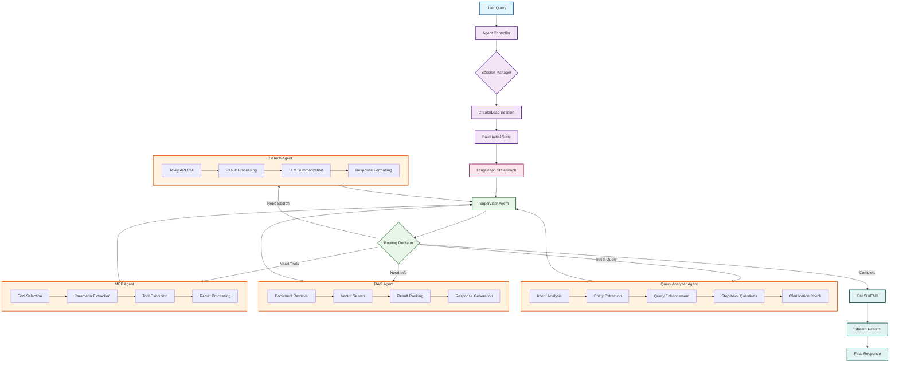
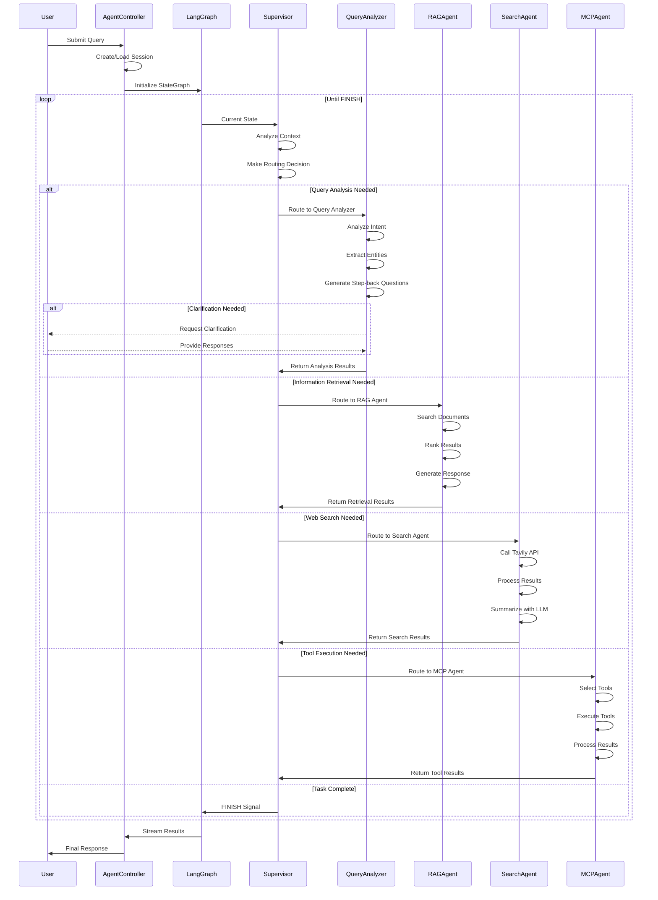
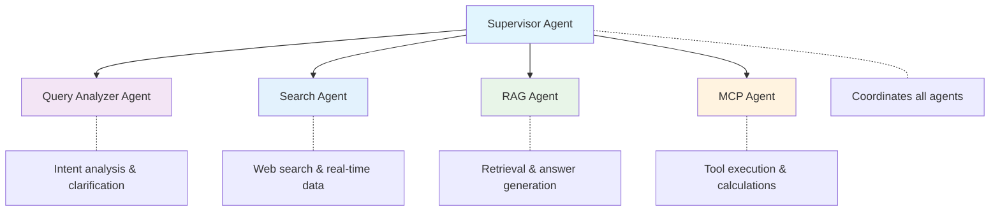
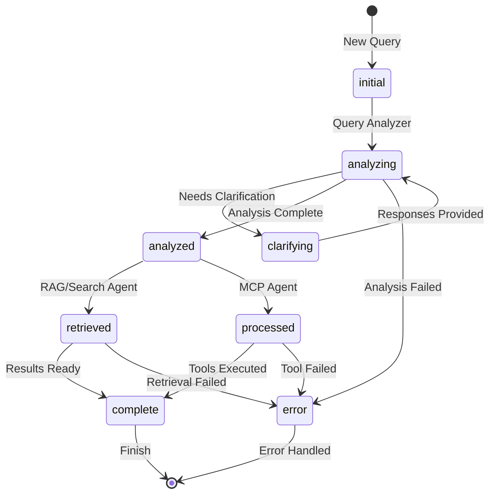

# Agent System

Multi-agent system built with LangGraph for coordinating specialized agents in technical documentation assistance.

## Overview

This module implements a hierarchical agent architecture where a **Supervisor Agent** coordinates specialized sub-agents:

- **Query Analyzer Agent**: Wraps the existing query analyzer module for intent analysis and clarification
- **Search Agent**: Web search capabilities using Tavily API for real-time information
- **RAG Agent**: Placeholder for retrieval-augmented generation capabilities  
- **MCP Agent**: Placeholder for Model Context Protocol tool integration

## Architecture

### System Overview



### Agent Interaction Flow



### Simple Agent Hierarchy



## Components

### AgentController
Main interface for the agent system:
- Session management
- Agent coordination via LangGraph
- Response formatting
- Error handling

### SupervisorAgent
Decision-making agent that routes queries to appropriate sub-agents based on:
- Current workflow stage
- Query analysis results
- Task complexity
- Available agent capabilities

### QueryAnalyzerAgent
Wrapper around the existing query analyzer module:
- Intent analysis and entity extraction
- Clarification workflow
- Query enhancement and synthesis
- Relevance checking
- Step-back question generation

### SearchAgent
Web search capabilities for real-time information:
- Tavily API integration for web search
- Current events and latest information retrieval
- Step-back question answering
- Search result summarization with LLM
- Configurable search depth and result limits

### RAGAgent (Placeholder)
Future integration with retrieval systems:
- Vector database search
- Multimodal content retrieval
- Answer generation
- Result ranking

### MCPAgent (Placeholder)
Future integration with external tools:
- Calculation and simulation tools
- API integrations
- Safety validation
- Real-time data access

## Usage

### Basic Usage

```python
from src.modules.agent import AgentController

# Initialize controller
controller = AgentController(
    llm_model="llama3.2",
    enable_rag=True,
    enable_mcp=True,
    enable_search=True  # Enable web search capabilities
)

# Create session
session_id = controller.create_session(user_level="EXPERIENCED")

# Process query
for step in controller.process_query("How do I change engine oil?", session_id):
    agent_name = step["agent"]
    output = step["output"]
    print(f"{agent_name}: {output}")
```

### Clarification Workflow

```python
# Process query that needs clarification
for step in controller.process_query("How do I change this?", session_id):
    if step["output"].get("clarification_needed"):
        questions = step["output"]["clarification_questions"]
        # Collect user responses...
        
        # Continue with responses
        responses = {"What is 'this'?": "engine oil"}
        for step in controller.process_query(
            query, session_id, clarification_responses=responses
        ):
            # Process clarified query...
```

### Web Search Integration

```python
# Initialize with search enabled
controller = AgentController(
    llm_model="llama3.2",
    enable_search=True,
    tavily_api_key="your-api-key"  # Optional: can use env var
)

# Process query that may use search
for step in controller.process_query("What are the latest AI developments?", session_id):
    agent_name = step["agent"]
    output = step["output"]
    
    if agent_name == "search":
        # Search results available
        search_results = output.get("analysis_results", {}).get("search_results", {})
        print(f"Found {search_results.get('num_results', 0)} search results")
```

### Step-Back Question Search

The system can automatically search for step-back questions generated during query analysis:

```python
# When query analyzer generates step-back questions,
# the interactive demo offers to search for them:
# "Would you like to search the web for these questions? (y/n)"

# Step-back questions might include:
# - "What is the history of AI?"
# - "How do neural networks work?"
# - "What are recent AI breakthroughs?"

# Each question is searched automatically and results
# provide additional context for better answers
```

### Session Management

```python
# List active sessions
sessions = controller.list_sessions()

# Get session info
info = controller.get_session_info(session_id)

# Clear session
controller.clear_session(session_id)

# Get agent status
status = controller.get_agent_status()
```

## State Management & Workflow

### Agent State Structure
The system uses a shared state that flows through all agents:

```python
AgentState = TypedDict("AgentState", {
    # Core messaging
    "messages": Annotated[List[HumanMessage | AIMessage], add_messages],
    
    # Agent tracking
    "current_agent": str,
    "next_agent": Optional[str],
    
    # Workflow control
    "workflow_stage": str,  # initial, analyzing, clarifying, analyzed, retrieved, complete
    "task_description": str,
    
    # Query analysis
    "clarification_needed": bool,
    "clarification_questions": List[str],
    "user_responses": Dict[str, str],
    "original_query": Optional[str],
    "enhanced_query": Optional[str],
    "analysis_results": Dict[str, Any],
    
    # Retrieval & execution
    "retrieval_results": Optional[Dict[str, Any]],
    "tool_calls": List[Dict[str, Any]],
    "tool_results": List[Any],
    
    # Session management
    "session_id": str,
    "user_level": str  # NOVICE, EXPERIENCED, EXPERT
})
```

### Workflow Stage Transitions



### Routing Logic
The Supervisor uses rule-based routing for efficiency:

1. **Initial Stage** → Query Analyzer
2. **Clarifying (no responses)** → Wait for user
3. **Clarifying (with responses)** → Query Analyzer
4. **Analyzed** → RAG/Search/MCP based on intent
5. **Retrieved/Processed/Searched** → FINISH
6. **Error** → FINISH with error message

### Workflow Stages

1. **initial**: New query received
2. **analyzing**: Query analysis in progress
3. **clarifying**: Waiting for/processing clarification
4. **analyzed**: Query understood, routing to next agent
5. **retrieved**: Information retrieval complete
6. **processed**: Tool execution complete
7. **searched**: Web search complete
8. **complete**: Task finished successfully
9. **error**: Error occurred, workflow terminated

## Testing

### Run Individual Component Tests

```bash
# Test supervisor agent routing
python tests/agent/test_supervisor_agent.py

# Test query analyzer agent integration  
python tests/agent/test_query_analyzer_agent.py

# Test agent controller coordination
python tests/agent/test_agent_controller.py
```

### Run Full Demo

```bash
# Install dependencies
pip install -r requirements-agent.txt

# Run automated demo (shows all features)
python tests/agent/demo_agent_system.py

# Run interactive demo (user-driven exploration)
python tests/agent/interactive_agent_demo.py

# Test search agent functionality
python tests/agent/test_search_agent.py

# Demo search integration with step-back questions
python tests/agent/demo_enhanced_search.py
```

### Interactive Demo Features

The interactive demo allows you to:
- Submit your own queries in real-time
- Handle clarification workflows interactively
- Use web search for current information (when enabled)
- Search step-back questions automatically
- Manage multiple sessions
- Switch between user expertise levels
- Explore different agent capabilities
- View system status and configuration

Commands available in interactive mode:
- `query <text>` - Submit a query
- `search <query>` - Direct web search (when search enabled)
- `session new/list/switch/clear` - Manage sessions
- `status` - View agent system status
- `demo` - Run example queries (includes search examples)
- `help` - Show available commands

### Test Categories

**Supervisor Agent Tests:**
- Routing decisions based on workflow stage
- LLM-based routing vs fallback logic
- Multi-agent coordination

**Query Analyzer Agent Tests:**
- 5-step workflow integration
- Clarification workflow
- Session management
- Relevance checking

**Search Agent Tests:**
- Tavily API integration
- Search result processing
- Error handling for missing API keys
- LLM summarization of results

**Agent Controller Tests:**
- End-to-end query processing
- Session lifecycle management
- Error handling

The tests demonstrate:
- Basic query processing
- Clarification workflow
- Multi-agent coordination
- Session management

## Search Agent Features

### Real-Time Information Access
The search agent provides access to current information that may not be available in local knowledge bases:

- **Current Events**: Latest news and developments
- **Market Data**: Stock prices, financial information
- **Technology Updates**: Recent software releases, API changes
- **Research Papers**: Latest academic publications
- **Product Information**: Current specifications and availability

### Step-Back Question Enhancement
When the query analyzer generates step-back questions to provide broader context:

1. System detects step-back questions in analysis results
2. Interactive demo offers to search for these questions
3. Each question is searched automatically via Tavily API
4. Results are summarized using the LLM
5. Enhanced context improves final answer quality

### Search Integration Benefits
- **Complementary to RAG**: Combines local knowledge with web information
- **Current Information**: Overcomes knowledge cutoff limitations
- **Broad Context**: Step-back questions provide background information
- **User Control**: Users decide when to use search functionality
- **Error Handling**: Graceful degradation when search unavailable

## Integration Points

### With Existing Modules
- **Query Analyzer**: Direct integration via QueryAnalyzerAgent wrapper
- **Storage Manager**: Future integration via RAGAgent
- **Embeddings**: Future integration via RAGAgent
- **PDF Processor**: Future integration via RAGAgent

### With External Systems
- **Tavily Search API**: Real-time web search capabilities
- **MCP Servers**: Future integration via MCPAgent
- **APIs**: Via MCP protocol
- **Tools**: Via MCP tool execution

## Future Development

### RAG Integration
```python
# Future RAGAgent implementation
rag_agent = RAGAgent(
    storage_manager=ChromaManager(),
    embeddings_model=CLIPEmbeddings()
)
```

### MCP Integration
```python
# Future MCPAgent implementation
mcp_agent = MCPAgent(
    mcp_server_urls=[
        "http://localhost:8080/maintenance-tools",
        "http://localhost:8081/calculation-tools"
    ]
)
```

## Configuration

Environment variables:
```bash
# LLM Configuration using local Ollama

# Agent Configuration
AGENT_LLM_MODEL=llama3.2  # Default Ollama model
AGENT_ENABLE_RAG=true
AGENT_ENABLE_MCP=true
AGENT_ENABLE_SEARCH=true

# Search Configuration
TAVILY_API_KEY=your-api-key-here  # Required for search functionality
TAVILY_MAX_RESULTS=5  # Optional: max search results
TAVILY_SEARCH_DEPTH=advanced  # Optional: search depth

# Logging
AGENT_LOG_LEVEL=INFO
```

## Error Handling

The system includes comprehensive error handling:
- Agent-level error recovery
- Graceful degradation
- Session state preservation
- Detailed error logging

## Testing

```bash
# Run agent tests
pytest tests/agent/

# Run integration tests
pytest tests/integration/test_agent_system.py
```

## Monitoring

Built-in monitoring capabilities:
- Agent decision tracking
- Performance metrics
- Session analytics
- Error reporting

## Acknowledgments

Built using:
- **LangGraph**: Agent coordination and workflow management
- **LangChain**: LLM integration and tool interfaces
- **Existing Query Analyzer**: Query understanding and clarification