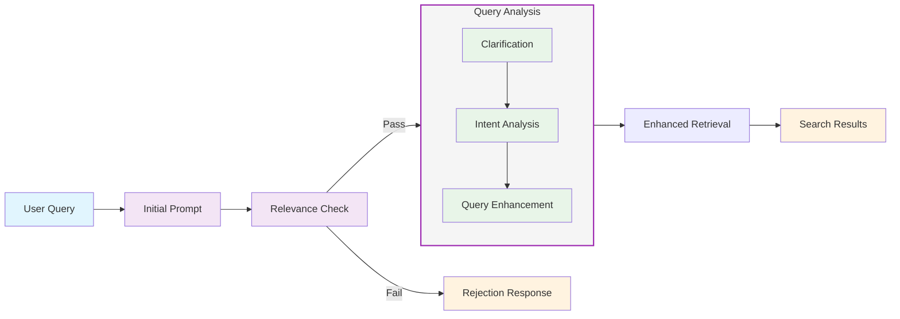
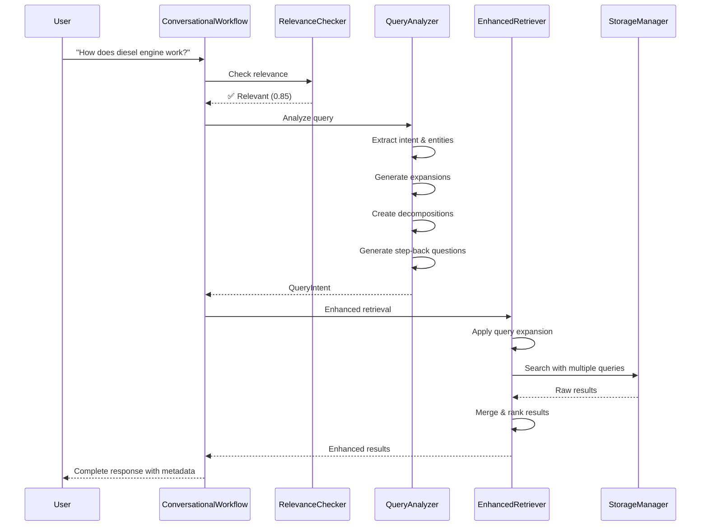

# Query Analyzer Module

This module provides enhanced query analysis and retrieval capabilities for the RAG system.

## Features

- **Query Intent Analysis**: Extracts structured intent from user queries including:
  - Query type classification (factual, comparison, aggregation, explanation)
  - Entity extraction
  - Time-based filter detection
  - Semantic intent understanding
  
- **Query Expansion**: Generates multiple query variations for improved retrieval

- **Query Decomposition**: Breaks down complex queries into atomic sub-questions that can be answered independently

- **Step-back Prompting**: Generates more generic, higher-level questions from specific queries for better context understanding

- **Interactive Clarification**: Automatically generates clarifying questions to gather context and reduce ambiguity:
  - Identifies missing context in queries
  - Generates 2-4 focused clarifying questions
  - Collects user responses interactively or programmatically
  - Rephrases queries with additional context for better clarity

- **HyDE (Hypothetical Document Embeddings)**: Generates hypothetical documents that would answer the query for better semantic matching

- **Enhanced Retrieval**: Combines query analysis with the existing storage system for improved results

- **🆕 Conversational Flow**: Natural multi-turn query processing with context preservation:
  - Session-based conversation tracking
  - Progressive context building across queries
  - Multi-round clarification support
  - User expertise level adaptation
  - 5-step orchestrated workflow (relevance → clarification → intent → enhancement)
  - See [CONVERSATIONAL_FLOW.md](./CONVERSATIONAL_FLOW.md) for details

- **🆕 Contextual Relevance Checking**: Two evaluation modes for domain relevance assessment:
  - **Two-Stage Mode** (default): Combines vocabulary/pattern matching with semantic validation
  - **Task-Action-Target Mode**: LLM-based evaluation of technical actions and target objects
  - Configurable rejection modes (hard/soft/score)
  - Custom domain vocabulary and patterns
  - See [RELEVANCE_CHECKING.md](./RELEVANCE_CHECKING.md) for details

## Installation

The module works with the existing project dependencies. For query analysis features with local LLM inference, install optional dependencies:

```bash
pip install -r requirements-query-analysis.txt
```

## Usage

### Basic Usage with Existing Components

```python
from src.modules.embeddings.factory import EmbedderFactory
from src.modules.storage_manager.factory import StorageManagerFactory
from src.modules.query_analyzer.factory import EnhancedRetrieverFactory

# Use existing components
embedder = EmbedderFactory.create(implementation="clip")
storage_manager = StorageManagerFactory.create(implementation="chroma")

# Create enhanced retriever with query analysis
retriever = EnhancedRetrieverFactory.create(
    storage_manager=storage_manager,
    embedder=embedder,
    analyzer_implementation="ollama",
    hyde_implementation="ollama"
)

# Perform enhanced retrieval
results = retriever.retrieve(
    query="How does a jet engine compressor work?",
    limit=5,
    use_hyde=True,
    use_query_expansion=True
)
```

### Query Analysis Only

```python
from src.modules.query_analyzer.factory import QueryAnalyzerFactory

# Create analyzer
analyzer = QueryAnalyzerFactory.create(
    implementation="ollama",
    model_name="llama3.2"
)

# Analyze query
intent = analyzer.analyze("Compare turbofan and turbojet engines")
print(f"Query type: {intent.query_type}")
print(f"Entities: {intent.entities}")
print(f"Semantic intent: {intent.semantic_intent}")
print(f"Expanded queries: {intent.expanded_queries}")
print(f"Decomposed questions: {intent.decomposed_questions}")
print(f"Step-back questions: {intent.step_back_questions}")
```

### Configuring Features

```python
from src.modules.query_analyzer.models import QueryAnalyzerConfig
from src.modules.query_analyzer.ollama_analyzer import OllamaQueryAnalyzer

# Create custom configuration
config = QueryAnalyzerConfig(
    model_name="llama3.2",
    temperature=0.0,
    
    # Feature flags
    enable_query_expansion=True,      # Generate alternative query phrasings
    enable_decomposition=True,        # Break complex queries into sub-questions
    enable_step_back=False,           # Disable step-back questions
    enable_clarification=True,        # Enable clarifying questions
    enable_entity_extraction=True,    # Extract entities
    enable_time_filter=False,         # Disable time filter detection
    
    # Feature limits
    max_expanded_queries=3,           # Limit to 3 expanded queries
    max_decomposed_questions=5,       # Limit to 5 sub-questions
    max_clarifying_questions=2        # Limit to 2 clarifying questions
)

# Create analyzer with custom config
analyzer = OllamaQueryAnalyzer(config)

# Analyze with custom settings
intent = analyzer.analyze("How to optimize database performance?")
# Will not include step-back questions or time filters based on config
```

### Minimal Configuration Example

```python
# Disable all optional features for fastest performance
config = QueryAnalyzerConfig(
    model_name="llama3.2",
    enable_query_expansion=False,
    enable_decomposition=False,
    enable_step_back=False,
    enable_clarification=False,
    enable_entity_extraction=False,
    enable_time_filter=False
)

analyzer = OllamaQueryAnalyzer(config)
# Will only extract query type and semantic intent
```

### Query Decomposition and Step-back Examples

```python
# Example: Complex technical query
query = "How does the fuel injection system affect engine performance in cold weather?"
intent = analyzer.analyze(query)

# Decomposed questions (atomic sub-questions):
# - "What is a fuel injection system?"
# - "How does a fuel injection system work?"
# - "What are the key components of engine performance?"
# - "How does cold weather affect fuel properties?"
# - "What changes occur in fuel injection during cold weather?"
# - "How do these changes impact engine performance metrics?"

# Step-back questions (more generic):
# - "What are the principles of fuel injection in engines?"
# - "How do environmental conditions affect engine systems?"
# - "What factors influence engine performance?"
```

### Interactive Clarification

```python
# Basic interactive clarification
query = "How to fix the error?"
clarification_result = analyzer.clarify_interactively(query)

# Output:
# 🤔 Generating clarifying questions for: 'How to fix the error?'
# 
# 📋 Please answer the following questions:
# 1. What specific error message are you seeing?
#    Your answer: TypeError: cannot concatenate str and int
# 2. What programming language or system are you working with?
#    Your answer: Python 3.9
# 3. What were you trying to do when the error occurred?
#    Your answer: Building a user ID string
#
# ✓ Rephrased query: "How to fix Python 3.9 TypeError 'cannot concatenate str and int' when building a user ID string?"

# Programmatic clarification with custom response collector
def auto_responder(question: str) -> str:
    responses = {
        "error": "Connection timeout",
        "database": "PostgreSQL",
        "frequency": "Every morning"
    }
    for key, response in responses.items():
        if key in question.lower():
            return response
    return ""

```

### 🆕 Conversational Flow Usage

```python
from src.modules.query_analyzer.conversational_workflow import ConversationalWorkflow
from src.modules.query_analyzer.conversation_state import UserLevel

# Create conversational workflow
workflow = ConversationalWorkflow(
    analyzer_type="ollama",
    enable_relevance_check=True,
    enable_clarification=True
)

# Process queries with session tracking
session_id = "user_session_123"

# First query
result1, metadata1 = workflow.process_user_query(
    query="Tell me about diesel engines",
    session_id=session_id,
    user_level=UserLevel.NOVICE
)

# Follow-up query (uses context from previous query)
result2, metadata2 = workflow.process_user_query(
    query="What about their maintenance?",  # "their" refers to diesel engines
    session_id=session_id
)

# Check workflow steps
print(f"Steps completed: {metadata2['steps_completed']}")
# ['initial_prompt_received', 'relevance_check_passed', 'clarification_skipped', 
#  'intent_analysis_completed', 'query_enhancement_completed']

# Access conversation summary
summary = workflow.get_session_summary(session_id)
print(f"Entities discussed: {summary['entities_mentioned']}")
# ['diesel', 'engines', 'maintenance']

result = analyzer.clarify_interactively(query, response_collector=auto_responder)

# Full analysis with automatic clarification
intent = analyzer.analyze_with_clarification(
    "Why is it running slow?",
    response_collector=auto_responder,
    auto_clarify=True
)
print(f"Clarified query: {intent.clarified_query}")
print(f"Clarifying questions asked: {intent.clarifying_questions}")
```

### 🆕 Relevance Checking Usage

```python
from src.modules.query_analyzer.relevance_checker import ContextualRelevanceChecker
from src.modules.query_analyzer.models import RelevanceConfig
from langchain_ollama import ChatOllama

# For LLM-based task-action-target mode
llm = ChatOllama(model="llama3.2", temperature=0.0)

relevance_config = RelevanceConfig(
    enabled=True,
    evaluation_mode="task_action_target",  # or "two_stage" (default)
    rejection_mode="soft"
)

# Create relevance checker with LLM provider
relevance_checker = ContextualRelevanceChecker(relevance_config, llm_provider=llm)

# Check query relevance
query = "remove the oil filter"
result = relevance_checker.check_relevance(query)

print(f"Relevant: {result.is_relevant}")
print(f"Confidence: {result.confidence}")
print(f"Stage: {result.stage}")
print(f"Explanation: {result.explanation}")
print(f"Domain matches: {result.domain_matches}")

# Output:
# Relevant: True
# Confidence: 1.0
# Stage: task-action-target
# Explanation: Query contains 'remove' action and 'oil filter' target. Clear technical task.
# Domain matches: ['action:remove', 'target:oil filter']

# Example with missing components
query = "the engine"
result = relevance_checker.check_relevance(query)
print(f"Suggestions: {result.suggestions}")
# Output:
# Suggestions: ["Specify what you want to do (e.g., 'remove', 'install', 'adjust')", ...]
```

### Configuration-based Usage

```python
from src.modules.query_analyzer.models import RetrievalConfig

config = RetrievalConfig(
    limit=10,
    use_hyde=True,
    use_query_expansion=True,
    filter_metadata={"document_type": "manual"}
)

results = retriever.retrieve_with_config(query, config)
```

## Architecture

### System Overview



### Query Processing Flow



The module follows the project's modular architecture:

- **Base Classes**: Abstract interfaces in `base.py`
  - `QueryIntent`: Enhanced dataclass with decomposed and step-back questions
  - `BaseQueryAnalyzer`: Interface for query analysis implementations
  
- **Models**: Data structures and configurations in `models.py`
  - `QueryType`: Query classification types
  - `QueryAnalyzerConfig`: Configuration for analyzers
  - `RetrievalConfig`: Configuration for retrieval operations
  
- **Implementations**: 
  - `ollama_analyzer.py`: Ollama-based query analyzer with:
    - Query intent extraction
    - Query expansion
    - Query decomposition into sub-questions
    - Step-back question generation
  - `hyde_generator.py`: HyDE document generator
  - `enhanced_retriever.py`: Retriever with query analysis
  
- **Factory**: Component creation following the factory pattern

## Integration Points

- **Storage Manager**: Uses the existing `BaseStorageManager` interface
- **Embeddings**: Works with any `BaseEmbedder` implementation
- **Extensible**: Easy to add new LLM providers (e.g., OpenRouter)

## Key Capabilities

- **Query Decomposition**: Automatically breaks complex queries into answerable sub-questions
- **Step-back Prompting**: Abstracts specific queries to broader concepts for better retrieval
- **Interactive Clarification**: Reduces ambiguity by asking targeted clarifying questions
- **Context-aware Rephrasing**: Automatically rephrases queries with gathered context
- **Intelligent Deduplication**: Uses Jaccard similarity to avoid redundant questions
- **Fallback Handling**: Graceful degradation when LLM parsing fails


## Future Enhancements

- OpenRouter integration for cloud-based LLM inference
- Query result reranking with cross-encoder models
- Multi-stage retrieval strategies
- Query-specific embedding models
- Recursive query decomposition for complex multi-hop questions
- Integration with chain-of-thought reasoning
- Full model fine-tuning when supported by Ollama

## References and Acknowledgments

The implementation of advanced query analysis techniques in this module was guided by:

- **[LangChain RAG from Scratch (Parts 5-9)](https://github.com/langchain-ai/rag-from-scratch/blob/main/rag_from_scratch_5_to_9.ipynb)**: This comprehensive notebook series provided invaluable insights into:
  - Query decomposition strategies
  - Step-back prompting techniques
  - Multi-query retrieval approaches
  - RAG fusion and reciprocal rank fusion
  - These concepts have been adapted and implemented to work with our local Ollama-based system

### 🤖 Development Coding Assistance

**Special acknowledgment to Claude Sonnet** for coding assistance throughout the development of this query analyzer module, including code implementation, testing, documentation, and debugging.

---

The techniques from these resources have been adapted to create a modular, extensible query analysis system that works seamlessly with local LLMs through Ollama.